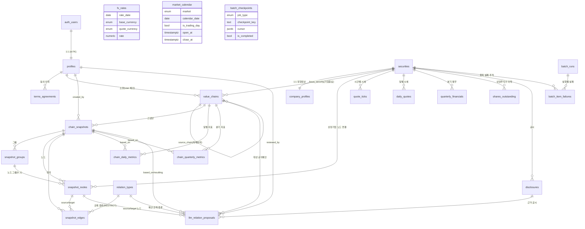

# database.md — invest-in-best 데이터베이스 설계

> 이 문서는 `docs/prd.md`·`docs/userflow.md`의 확정 범위와 `docs/techstack.md`(SOT: Supabase Postgres 16)를 기반으로 한 최소 스펙 데이터베이스 설계다.
> **유저플로우(001~031)에 명시적으로 등장하는 데이터만** 포함한다. 물리 스키마의 SOT는 `supabase/migrations/0001~0012` SQL이며, 본 문서는 그 개요·관계·데이터플로우·쿼리 패턴을 서술한다.
> 원칙: RLS 전면 비활성(인가는 Hono 미들웨어 서버측 role 검증), snake_case, 멱등 마이그레이션, 전 테이블 `updated_at` 트리거(0001 공통 함수 재사용).

---

## 1. 데이터플로우 (개요 먼저)

서비스 데이터는 **네 개의 큰 흐름**으로 움직인다. 클라이언트가 보는 화면은 항상 **자체 DB**만 읽고, 외부 API는 배치 적재 용도로만 호출된다(PRD 8장).

### 1.1 수집 → 정규화 → 집계 → 조회 (시세·재무 파이프라인)

```
[외부 API]                 [원본 테이블]            [정규화 테이블]              [집계 테이블]                [조회 화면]
토스 시세(시간별)     →  quote_ticks(30일)     →  daily_quotes(영구)     ┐
토스 sharesOutstanding                          →  shares_outstanding   ├→ chain_daily_metrics    →  대시보드 시총 추이(010)
DART/SEC 재무        →  (원천 응답)            →  quarterly_financials  ┤   chain_quarterly_metrics    타임라인(012)
토스 환율            →                            fx_rates             ┘                              기업 상세(020)
토스 장운영시간      →                            market_calendar      (026 개장 판정 입력)
```

- **원본(raw)**: `quote_ticks`(시간별 시세, 보존 30일). 시세는 시간당 1회 개장 시장만 수집(026).
- **정규화(normalized)**: `daily_quotes`(일별 OHLCV·종가 확정), `quarterly_financials`(국내 누적→3개월 정규화, 미국 태그 폴백 결과, 20-F 연간 전용 + 역년 정규화 축), `shares_outstanding`(상장주식수 이력). `fx_rates`·`market_calendar`는 수집 즉시 정규 형태.
- **집계(pre-aggregated)**: `chain_daily_metrics`(일별 가치총액·커버리지), `chain_quarterly_metrics`(분기 매출 합계·제외 기업 수). 각 일자/분기의 **유효 스냅샷 구성 기준**으로 사전 집계(029). 시총 = 일별 종가 × 최신 상장주식수, KRW 환산(당일/분기말 환율).
- **조회**: 뷰 대시보드(010)·타임라인(012)·기업 상세(020)는 집계·정규화 테이블만 읽는다.

### 1.2 구조(밸류체인) 이벤트 소싱

```
편집/승인(013~018, 021, 022) → chain_snapshots(불변) ← snapshot_groups / snapshot_nodes / snapshot_edges
                                      │
임의 날짜 D 조회(012)  ── "effective_at <= D 인 마지막 스냅샷" 복원 ──→ 마인드맵·그룹·지표
```

- 저장/승인/편집 **1회 = 1스냅샷**(불변 사본). "현재 구성" = 최신 스냅샷. 별도 current 테이블 없음.
- 과거 지표는 그 시점 스냅샷 구성 기준으로 집계된다(구조 변경분은 과거 재계산하지 않음, 029).

### 1.3 LLM 공시 분석 → 어드민 승인

```
disclosures(신규, 미분석) → [LLM 배치 030] → llm_relation_proposals(pending)
                                                     │  어드민 검토(022)
                                          승인 → 공식 체인 반영 + 새 chain_snapshots 생성
                                          거부 → status=rejected
```

- 공식 체인 전용, 기존 노드 간 관계로 한정. 제안은 생성 기준 스냅샷의 노드 쌍을 참조하고, 승인 시 현재 구성과 대조한다.

### 1.4 배치 모니터링 (워커 → DB → 어드민)

```
모든 배치 잡(026~031) → batch_runs(실행 이력) ─┬→ batch_item_failures(종목 단위 재시도)
                                                └→ batch_checkpoints(백필 재개 커서)
                                                         │
                                              어드민 배치 모니터링(023, 조회 전용)
```

- 워커와 웹은 이 테이블들로 완전 디커플(RPC 불필요). 어드민 화면은 직접 조회한다.

---

## 2. ERD (전체 테이블 관계)



> `fx_rates`·`market_calendar`·`batch_checkpoints`는 FK가 없는 독립 참조 테이블이라 관계선 없이 표기했다. `auth_users`는 Supabase Auth(`auth.users`) 네이티브 테이블이다.

---

## 3. 테이블 정의 요약

### 3.1 인증·계정 (0002)

| 테이블 | 역할 | 핵심 컬럼 | 주요 제약/인덱스 |
|---|---|---|---|
| `profiles` | `auth.users` 1:1 확장, role 보관 | `id`(FK auth.users), `email`, `role`(user/admin) | PK=auth.users, `idx_profiles_role` |
| `terms_agreements` | 약관 동의 이력(버전/시각) | `user_id`(FK), `doc_type`, `doc_version`, `agreed_at` | `idx_terms_agreements_user` |

> 세션·이메일 인증·비밀번호 재설정 토큰·소셜 식별자는 Supabase Auth(`auth` 스키마)가 관리하므로 별도 테이블 없음(userflow 001~005).
> **자동 프로필 생성**: `auth.users` AFTER INSERT 트리거 `handle_new_user()`(SECURITY DEFINER, `search_path=''`)가 가입 시 `profiles` 행을 멱등 생성한다(001/003). `role`은 기본 `user`이며, 어드민 승격(`ADMIN_SEED_EMAILS`)은 별도 시드 스크립트가 담당한다.

### 3.2 종목 마스터·기업 정보 (0003)

| 테이블 | 역할 | 핵심 컬럼 | 주요 제약/인덱스 |
|---|---|---|---|
| `securities` | 종목 마스터(검색·노드·시계열 기준) | `ticker`, `name`, `english_name`, `market`(KRX/US), `currency`, `listing_status`, `dart_corp_code`, `cik`, `toss_symbol`, `shares_manual_override_needed` | `uq(market,ticker)`, `uq(dart_corp_code)`, `uq(cik)`, 트라이그램 GIN(`ticker`,`name`,`english_name`) |
| `company_profiles` | 기업 정형 정보(1:1) | `security_id`(PK/FK), `representative_name`, `established_date`, `homepage_url`, `sector`, `last_collected_at` | PK=securities |

- 트라이그램 인덱스 연산자 클래스는 `extensions.gin_trgm_ops`로 스키마 정규화(0001). 검색은 `ticker`/`name`/`english_name` 3필드 부분 일치를 지원.
- `shares_manual_override_needed`: SEC 상장주식수 폴백 4단계까지 실패한 다중 클래스 기업 표식. true면 자동 폴백에서 제외하고 어드민이 수동 보정.

### 3.3 관계 종류·밸류체인·스냅샷 (0004~0006)

| 테이블 | 역할 | 핵심 컬럼 | 주요 제약/인덱스 |
|---|---|---|---|
| `relation_types` | 관계 종류 마스터(공급/고객/경쟁 등) | `name`, `is_directed`, `is_active` | 물리삭제 금지, `idx(is_active)` |
| `value_chains` | 체인 헤더(공식/사용자) | `chain_type`, `owner_id`(FK), `focus_type`, `focus_security_id`, `is_archived`, `source_chain_id` | `chk(owner)`, `uq(owner,name) user`, `uq(name) official` |
| `chain_snapshots` | 구조 변경 이벤트=1스냅샷(불변) | `chain_id`(FK), `effective_at`, `change_source`, `disclosure_date`, `created_by` | `idx(chain_id, effective_at DESC)` |
| `snapshot_groups` | 노드 그룹(스냅샷 소속) | `snapshot_id`(FK), `name` | `idx(snapshot_id)`, `uq(id, snapshot_id)` |
| `snapshot_nodes` | 노드(상장기업/자유주체) | `snapshot_id`, `group_id`(0..1), `node_kind`, `security_id`, `subject_name/type/memo`, `position_x/y` | `chk(kind)`, `uq(snapshot_id, security_id)`, `uq(id, snapshot_id)` |
| `snapshot_edges` | 엣지(관계) | `snapshot_id`, `source/target_node_id`, `relation_type_id`(RESTRICT) | `chk(no_self)`, `uq(snapshot, source, target, relation_type)` |

- **종목 물리 삭제 금지**: `snapshot_nodes.security_id`는 `ON DELETE RESTRICT`(상장폐지는 `securities.listing_status` 소프트 처리). CHECK(listed_company→security_id NOT NULL)와의 모순 제거.
- **노드 좌표**: `position_x/y`(nullable)는 저장(018) 시 스냅샷에 함께 보존되어 타임라인 복원에서 배치가 재현된다. 뷰 전용 위치 조정(009)은 저장 안 함.
- **스냅샷 정합 복합 FK**: `snapshot_nodes.(group_id, snapshot_id)` → `snapshot_groups(id, snapshot_id)`(그룹 삭제 시 `group_id`만 SET NULL), `snapshot_edges.(source/target_node_id, snapshot_id)` → `snapshot_nodes(id, snapshot_id)`. 노드/그룹/엣지가 반드시 동일 스냅샷에 소속되도록 DB 레벨에서 강제.

### 3.4 시세 시계열 (0007)

| 테이블 | 역할 | 핵심 컬럼 | 주요 제약/인덱스 |
|---|---|---|---|
| `quote_ticks` | 시간별 시세 원본(보존 30일) | `security_id`(FK), `observed_at`, `price`, `volume`, `source` | `uq(security_id, observed_at)`, `idx(observed_at)` |
| `daily_quotes` | 일별 시세 집계(영구) | `security_id`, `trade_date`, `open/high/low/close_price`, `volume`, `is_closing_confirmed` | `uq(security_id, trade_date)` |

- 30일 보존: 시세 배치의 정리 스텝이 `observed_at < now()-30d` 삭제(파티션 미사용, 최소 스펙).
- `is_closing_confirmed`: 장 마감 후 확정 종가 여부 → 확정 전 폴백/미확정 표기(010/020).

### 3.5 재무·상장주식수 (0008)

| 테이블 | 역할 | 핵심 컬럼 | 주요 제약/인덱스 |
|---|---|---|---|
| `quarterly_financials` | 재무제표(분기/연간) | `security_id`, `period_type`(quarter/annual), `fiscal_year`(≥2015), `fiscal_quarter`(1~4, annual=NULL), `period_start_date`, `period_end_date`, `calendar_year`, `calendar_quarter`, `currency`, `revenue`, `operating_income`, `net_income`, `amount_basis`, `revenue_source_tag`, `is_revenue_tag_unmapped`, `source` | `uq(security, year, quarter) WHERE quarter`, `uq(security, year) WHERE annual`, `chk(period)`, `chk(basis)`, `chk(year≥2015)`, `idx(calendar_year, calendar_quarter)` |
| `shares_outstanding` | 상장주식수 이력 | `security_id`, `shares`, `as_of_date`, `source`(toss 1순위), `source_tag`, `is_multi_class_partial` | `uq(security, as_of_date, source)`, `idx(security, as_of_date DESC)` |

- **분기/연간 구분(`period_type`)**: 20-F(IFRS) 등 분기 손익 미제공 기업은 `annual` 행만 저장하고 `fiscal_quarter`/`calendar_quarter`/`amount_basis`는 NULL. 분기 매출 집계(0010)에서 제외되며 제외 사유가 "연간 전용"으로 구분된다. `quarter`/`annual` 각각 부분 유니크로 NULL 분기 충돌을 회피.
- **회계축 vs 역년축**: `fiscal_*`은 기업 회계연도(결산월 상이), `calendar_year`/`calendar_quarter`는 **역년 정규화 축**(배치가 `period_start/end`로 산출). 결산월이 다른 기업(예: 9월 결산 Apple)을 역년 기준으로 정렬해 체인 분기 지표(0010)를 동일 축으로 합산한다.
- `amount_basis`(enum `fin_period_basis`, quarter 필수/annual NULL): `three_month`(원천 3개월치) / `derived_from_cumulative`(누적 차감 도출 — 국내 2Q·4Q, 미국 Q4). → **국내 3개월치/누적 구분** 요구 반영.
- `revenue_source_tag` + `is_revenue_tag_unmapped`: **미국 매출 태그 폴백 결과 저장**. 미매핑 기업은 매출 합계에서 제외하되 제외 수 표기.
- `shares_outstanding.source` 우선순위: `toss`(sharesOutstanding) > `dart`(istc_totqy 합계) > `sec`(dei/us-gaap 폴백). 시총 = 종가 × **최신 as_of_date** 행.

### 3.6 환율·장 운영시간 (0009)

| 테이블 | 역할 | 핵심 컬럼 | 주요 제약/인덱스 |
|---|---|---|---|
| `fx_rates` | 일별 환율(KRW↔USD) | `rate_date`, `base_currency`, `quote_currency`, `rate` | `uq(rate_date, base, quote)`, `chk(base<>quote)` |
| `market_calendar` | 시장별 장 운영시간/휴장일 | `market`, `calendar_date`, `is_trading_day`, `open_at`, `close_at`, `is_early_close` | `uq(market, calendar_date)` |

- `open_at`/`close_at`는 절대 시각(`timestamptz`) → 서머타임(DST) 자연 반영. 시세 배치(026) 개장 판정 입력.

### 3.7 체인 지표 사전 집계 (0010)

| 테이블 | 역할 | 핵심 컬럼 | 주요 제약/인덱스 |
|---|---|---|---|
| `chain_daily_metrics` | 일별 가치총액·커버리지 | `chain_id`, `metric_date`, `based_on_snapshot_id`, `total_market_cap_krw`, `covered_node_count`(n), `total_node_count`(m), `is_carried_forward` | `uq(chain_id, metric_date)` |
| `chain_quarterly_metrics` | 분기 매출 합계·제외 수 | `chain_id`, `calendar_year`, `calendar_quarter`, `based_on_snapshot_id`, `total_revenue_krw`, `covered_node_count`, `total_node_count`, `excluded_unmapped_count` | `uq(chain_id, calendar_year, calendar_quarter)` |

- 커버리지("반영 n/전체 m") = `covered_node_count`/`total_node_count`.
- **체인 분기 지표는 역년 정규화 값**: `chain_quarterly_metrics`는 `quarterly_financials.calendar_year/quarter` 축으로 집계해 결산월이 다른 기업을 동일 역년 분기에 합산한다. 태그 미매핑·연간 전용(20-F) 기업은 `excluded_unmapped_count`에 포함.
- 정정 시 UPSERT 재집계 허용, 구조 변경분은 과거 미재계산(`based_on_snapshot_id`로 기준 스냅샷 명시).

### 3.8 공시·LLM 검토 큐 (0011)

| 테이블 | 역할 | 핵심 컬럼 | 주요 제약/인덱스 |
|---|---|---|---|
| `disclosures` | 공시 원본 | `security_id`, `source`, `external_id`(rcept_no/accession), `title`, `disclosure_date`, `url`, `llm_analyzed_at` | `uq(source, external_id)`, `idx(security, date DESC)`, 부분 idx(미분석) |
| `llm_relation_proposals` | LLM 관계 변경안 큐 | `chain_id`, `based_on_snapshot_id`, `proposal_type`(add/update/delete), `source/target_node_id`, `relation_type_id`(RESTRICT), `disclosure_id`(근거 FK), `rationale`, `status`, `reviewed_by/at`, `resulting_snapshot_id` | `chk(no_self)`, `idx(status, created_at)`, `uq(chain, source, target, relation_type, proposal_type) WHERE pending`(NULLS NOT DISTINCT) |

- 제안 상태(enum `llm_proposal_status`): `pending`/`approved`/`rejected`/`invalidated`(참조 노드·관계 유실 시).
- 승인 1건 = 1스냅샷(`resulting_snapshot_id`로 연결).
- **중복 대기 제안 방지**: 같은 체인·노드쌍·관계종류·유형의 `pending`은 부분 유니크로 1건만(`relation_delete`의 NULL 관계종류도 `NULLS NOT DISTINCT`로 중복 제거).
- `relation_type_id`는 `ON DELETE RESTRICT`(관계 종류 물리 삭제 금지 정책 DB 레벨 완결).

### 3.9 배치 실행 이력 (0012)

| 테이블 | 역할 | 핵심 컬럼 | 주요 제약/인덱스 |
|---|---|---|---|
| `batch_runs` | 잡 실행 이력 | `job_type`(6종), `status`(running/success/partial_success/failed), `started_at`, `finished_at`, `processed_count`, `failed_count`, `is_carried_over`, `error_log` | `idx(job_type, started_at DESC)` |
| `batch_item_failures` | 종목 단위 실패·재시도 | `batch_run_id`(FK), `security_id`, `attempt_count`, `last_error`, `is_resolved` | 부분 idx(미해소) |
| `batch_checkpoints` | 백필 재개 커서 | `job_type`, `checkpoint_key`, `cursor`(jsonb), `is_completed` | `uq(job_type, checkpoint_key)` |

### 3.10 ENUM 목록

| enum | 값 | 정의 위치 |
|---|---|---|
| `user_role` | user, admin | 0002 |
| `terms_doc_type` | terms_of_service, privacy_policy | 0002 |
| `market_code` | KRX, US | 0003 |
| `currency_code` | KRW, USD | 0003 |
| `listing_status` | listed, suspended, delisted | 0003 |
| `chain_type` | official, user | 0005 |
| `chain_focus_type` | industry, company | 0005 |
| `snapshot_source` | user_save, admin_edit, llm_approval | 0006 |
| `node_kind` | listed_company, free_subject | 0006 |
| `subject_type` | consumer, government, private_company, other | 0006 |
| `data_source` | dart, sec, toss | 0007 |
| `fin_period_basis` | three_month, derived_from_cumulative | 0008 |
| `fin_report_period` | quarter, annual | 0008 |
| `llm_proposal_type` | relation_add, relation_update, relation_delete | 0011 |
| `llm_proposal_status` | pending, approved, rejected, invalidated | 0011 |
| `batch_job_type` | collect_quotes, collect_financials, collect_fx_market_hours, aggregate_daily_metrics, analyze_disclosures, backfill_all | 0012 |
| `batch_run_status` | running, success, partial_success, failed | 0012 |

---

## 4. 핵심 쿼리 패턴

> 복잡 조인/집계(스냅샷 복원, 지표 롤업)는 techstack §7에 따라 Postgres 함수/뷰로 정의하고 `client.rpc()`로 호출한다. 아래는 그 함수 내부의 기준 쿼리다.

### 4.1 임의 날짜 → 직전 스냅샷 복원 (userflow 012)

```sql
-- (1) 날짜 D 이전 마지막 스냅샷 1건.
SELECT s.id
FROM chain_snapshots s
WHERE s.chain_id = :chain_id
  AND s.effective_at <= :as_of      -- D 경계(당일 끝)는 앱에서 계산해 전달
ORDER BY s.effective_at DESC
LIMIT 1;

-- (2) 그 스냅샷의 노드/그룹/엣지 로드(구조 복원).
SELECT * FROM snapshot_nodes  WHERE snapshot_id = :snapshot_id;
SELECT * FROM snapshot_groups WHERE snapshot_id = :snapshot_id;
SELECT * FROM snapshot_edges  WHERE snapshot_id = :snapshot_id;
```

- 마커 표시는 `SELECT effective_at FROM chain_snapshots WHERE chain_id=:id ORDER BY effective_at`로 전체 이벤트 시각을 로드.
- 첫 스냅샷 이전 날짜면 (1)이 0행 → "이전 스냅샷 없음/최소 시점" 안내(엣지케이스).

### 4.2 일별/분기 지표 조회 (대시보드·타임라인 010/012)

```sql
-- 일별 가치총액 추이 + 커버리지.
SELECT metric_date, total_market_cap_krw, covered_node_count, total_node_count, is_carried_forward
FROM chain_daily_metrics
WHERE chain_id = :chain_id AND metric_date BETWEEN :from AND :to
ORDER BY metric_date;

-- 특정 일자 값(타임라인 선택 시).
SELECT * FROM chain_daily_metrics WHERE chain_id = :chain_id AND metric_date = :d;

-- 분기 매출 합계 추이 + 제외 기업 수(역년 정규화 축).
SELECT calendar_year, calendar_quarter, total_revenue_krw, covered_node_count, total_node_count, excluded_unmapped_count
FROM chain_quarterly_metrics
WHERE chain_id = :chain_id
ORDER BY calendar_year, calendar_quarter;
```

### 4.3 티커/종목명 검색 — 정확 > 접두 > 부분 정렬 (userflow 008)

```sql
SELECT id, ticker, name, english_name, market
FROM securities
WHERE (:market IS NULL OR market = :market::market_code)
  AND (
        ticker       ILIKE '%' || :q || '%'   -- 티커 부분 일치(트라이그램 GIN)
     OR name         ILIKE '%' || :q || '%'   -- 종목명(한글) 부분 일치
     OR english_name ILIKE '%' || :q || '%'   -- 영문명 부분 일치
      )
ORDER BY
  CASE
    WHEN lower(ticker) = lower(:q) OR lower(name) = lower(:q) OR lower(english_name) = lower(:q)
      THEN 0  -- 정확 일치
    WHEN lower(ticker) LIKE lower(:q) || '%' OR lower(name) LIKE lower(:q) || '%' OR lower(english_name) LIKE lower(:q) || '%'
      THEN 1  -- 접두 일치
    ELSE 2    -- 부분 일치
  END,
  name
LIMIT 20 OFFSET :offset;   -- 페이지당 20건 + 더보기(상수)
```

- 부분 일치(`%q%`)는 `idx_securities_ticker_trgm`/`idx_securities_name_trgm`/`idx_securities_english_name_trgm`(pg_trgm GIN, `extensions.gin_trgm_ops`) 인덱스가 지원.
- 시장 배지는 결과의 `market` 컬럼으로 렌더링, 시장 필터는 `:market` 파라미터로 적용.

### 4.4 최신 상장주식수 (시총 계산 입력, 029)

```sql
-- 종목별 최신(as_of_date 최대) 상장주식수 1건.
SELECT DISTINCT ON (security_id) security_id, shares, as_of_date, source
FROM shares_outstanding
WHERE security_id = ANY(:security_ids)
ORDER BY security_id, as_of_date DESC;
-- 시총(현지 통화) = daily_quotes.close_price × shares  → fx_rates로 KRW 환산.
```

### 4.5 결측 이월(carry-forward) — 직전 관측값 (010/012/029)

```sql
-- 특정 일자 D 이하의 마지막 관측 종가(휴장/미수집 이월).
SELECT close_price
FROM daily_quotes
WHERE security_id = :id AND trade_date <= :d AND close_price IS NOT NULL
ORDER BY trade_date DESC
LIMIT 1;
-- 환율도 동일 패턴(fx_rates.rate_date <= :d ORDER BY rate_date DESC LIMIT 1).
```

### 4.6 소속 밸류체인 목록 (기업 상세 020)

```sql
-- 최신 스냅샷에 해당 종목 노드가 존재하는 체인(공식 + 로그인 시 본인 체인).
-- "최신 스냅샷" = 체인별 effective_at 최대 스냅샷. 함수/뷰로 캡슐화 권장.
SELECT DISTINCT vc.id, vc.name, vc.chain_type
FROM value_chains vc
JOIN LATERAL (
  SELECT id FROM chain_snapshots s
  WHERE s.chain_id = vc.id ORDER BY s.effective_at DESC LIMIT 1
) latest ON true
JOIN snapshot_nodes n ON n.snapshot_id = latest.id AND n.security_id = :security_id
WHERE vc.is_archived = false
  AND (vc.chain_type = 'official' OR vc.owner_id = :current_user_id);
```

### 4.7 배치 모니터링 (023)

```sql
-- 잡별 최근 실행 이력.
SELECT * FROM batch_runs WHERE job_type = :job ORDER BY started_at DESC LIMIT :n;
-- 특정 실행의 종목 단위 실패 상세.
SELECT * FROM batch_item_failures WHERE batch_run_id = :run_id ORDER BY updated_at DESC;
```

---

## 5. 데이터플로우 상세 (외부 API → 원본 → 정규화 → 집계)

| 단계 | 소스 | 적재 대상 | 규칙 |
|---|---|---|---|
| 시세 수집(026) | 토스 시세(시간별) | `quote_ticks` → `daily_quotes` | 개장 시장만(`market_calendar` 판정), 멱등 적재(`uq`), 30일 보존, 종가 확정 플래그 |
| 재무 수집(027) | OpenDART / SEC EDGAR | `quarterly_financials` | 국내 누적 차감→3개월(`amount_basis`), 미국 태그 폴백 결과(`revenue_source_tag`/미매핑 플래그), ≥2015 |
| 상장주식수(027) | 토스/DART/SEC | `shares_outstanding` | 우선순위 소스, 기준일·태그 보관, 분기 갱신 |
| 공시 수집(027) | OpenDART / SEC | `disclosures` | `uq(source, external_id)` 멱등, 정정 UPSERT |
| 환율·장운영(028) | 토스 | `fx_rates` / `market_calendar` | 일 1회, 절대시각 저장(DST) |
| 지표 집계(029) | 위 정규화 테이블 | `chain_daily_metrics` / `chain_quarterly_metrics` | 스냅샷 구성 기준, 커버리지, 결측 이월, 정정 시 재집계 |
| LLM 분석(030) | `disclosures`(미분석) | `llm_relation_proposals`(pending) | 공식 체인 전용, 기존 노드 한정, 일일 상한 |
| 어드민 승인(022) | `llm_relation_proposals` | `chain_snapshots`(+nodes/edges/groups) | 승인 1건=1스냅샷, 현재 구성 대조 |
| 백필(031) | 3개 외부 API | 위 원본·정규화 테이블 | `batch_checkpoints`로 재개, 종목 단위 재시도 |
| 전 잡 공통 | — | `batch_runs` / `batch_item_failures` | 상태·건수·이월·실패 로그(023 조회) |

- **정정 재집계 규칙**: 과거 재무/시세/환율 데이터 정정 시 영향 기간의 `chain_daily_metrics`/`chain_quarterly_metrics`를 UPSERT로 재계산한다(029). **구조 변경분은 재계산하지 않음**(`based_on_snapshot_id`로 시점 구성을 고정).
- **삭제 전파**: 사용자 탈퇴(006) → `profiles` 삭제 → 소유 `value_chains` CASCADE → 스냅샷/노드/엣지/그룹/체인 지표 CASCADE. 공식 체인·종목 마스터·시계열은 공용 데이터라 영향 없음.

---

## 6. 마이그레이션 파일 목록

| 파일 | 포함 테이블 |
|---|---|
| `0001_extensions_and_common.sql` | `extensions` 스키마 + pg_trgm(WITH SCHEMA extensions)/pgcrypto, `set_updated_at()`(`search_path=''`) |
| `0002_profiles_and_terms.sql` | profiles, terms_agreements, `handle_new_user()` + auth.users AFTER INSERT 트리거 |
| `0003_securities_master.sql` | securities(+`english_name` 트라이그램·`shares_manual_override_needed`), company_profiles |
| `0004_relation_types.sql` | relation_types |
| `0005_value_chains.sql` | value_chains |
| `0006_chain_snapshots.sql` | chain_snapshots, snapshot_groups, snapshot_nodes(RESTRICT·좌표·복합 FK), snapshot_edges(복합 FK) |
| `0007_price_timeseries.sql` | quote_ticks, daily_quotes (+ `data_source` enum) |
| `0008_fundamentals.sql` | quarterly_financials(분기/연간·역년축), shares_outstanding (+ `fin_period_basis`·`fin_report_period` enum) |
| `0009_fx_and_market_calendar.sql` | fx_rates, market_calendar |
| `0010_chain_metrics.sql` | chain_daily_metrics, chain_quarterly_metrics(역년축) |
| `0011_disclosures_llm.sql` | disclosures, llm_relation_proposals(pending 중복 방지·RESTRICT) (+ enums) |
| `0012_batch_runs.sql` | batch_runs, batch_item_failures, batch_checkpoints (+ enums) |

> 적용은 로컬 Supabase 실행 없이 `mcp__supabase__apply_migration`(또는 대시보드)으로 순서대로 수행한다(techstack §7). 본 작업에서는 파일만 생성/수정했다. `ON DELETE SET NULL (컬럼)`·`NULLS NOT DISTINCT`는 PostgreSQL 15+ 문법으로 Supabase Postgres 16에서 동작한다.

---

## 7. Open Questions

유저플로우/PRD가 확정 상태(Open Questions 없음)라 설계 자체의 미결은 없다. 구현 단계에서 확정하면 되는 **경계 정책** 몇 가지를 기록한다(모두 앱 로직 영역, 스키마 변경 불필요).

1. **타임라인 날짜 경계(`effective_at <= D`)의 D 해석**: "그 날짜 이전 마지막 스냅샷"에서 D를 당일 종료(23:59:59 현지)로 볼지, 당일 시작으로 볼지. 유효 시점 규칙(승인/편집 시각)과 결합해 구현 시 상수화 권장. (스키마 무영향)
2. **`quote_ticks` 30일 정리 방식**: 현재는 배치 DELETE(최소 스펙). 데이터량이 커지면 월 파티션/`pg_cron` 도입 검토(추후 성능 이슈 시). (스키마 무영향)
3. **매출 통화가 보고 통화와 다를 때(미국 20-F 등)**: `quarterly_financials.currency`에 보고 통화를 저장하고 분기 말일 환율로 환산하는 전제. 다통화 보고 케이스는 실수집에서 재확인.
4. **LLM 제안 노드 참조 재매핑**: 제안은 `based_on_snapshot_id`의 노드를 참조하고, 승인 시점에 현재 최신 스냅샷의 동일 노드(상장기업=security_id 매칭, 자유주체=노드 정체성)로 재매핑하는 로직은 서비스 레이어(022) 책임. 재매핑 실패 시 `invalidated`.
5. **`total_node_count` 분모 정의**: 커버리지 m을 "전체 노드"로 집계(자유주체 포함, PRD 문구 기준)했다. 만약 "상장기업 노드만"으로 해석해야 하면 집계 배치(029)에서 분모 산정만 조정(컬럼 그대로).
