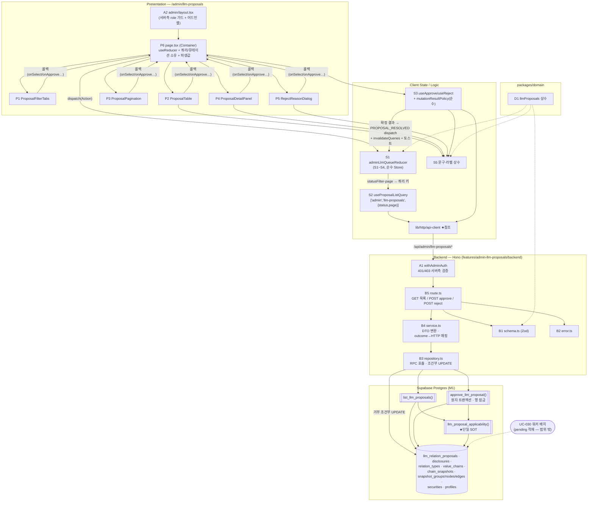

# Plan: 어드민 LLM 검토 큐 페이지 (admin-llm-queue)

> 경로: `/admin/llm-proposals` (`apps/web/src/app/admin/` — role=admin 전용)
>
> 근거 문서: `docs/pages/admin-llm-queue/requirement.md`(행동 2-1~2-5·상태 S1~S4), `docs/pages/admin-llm-queue/state_management.md`(**Level 2 Flux 설계 — 본 plan은 이 설계를 그대로 구현 단위로 옮긴다. Context 없음, 페이지 컴포넌트 `useReducer` + props**), `docs/usecases/022/spec.md` + `docs/usecases/022/plan.md`(유스케이스 상세 plan — 본 plan이 페이지 수준에서 통합하며, SQL·서비스 상세는 그 문서의 R-1~R-9 정합화 결정을 승계한다), `docs/usecases/000_decisions.md`(**F-1**: relation_delete도 관계 종류 필수 — spec의 nullable 표기를 대체, D-6·D-7: 재매핑/무향 중복 규칙), `docs/techstack.md` §4(Codebase Structure — SOT)·§7(복잡 트랜잭션은 Postgres RPC), `docs/database.md` §3.8, `supabase/migrations/0005·0006·0011`(기존 스키마), `.claude/skills/spec_to_plan/references/hono-backend-guide.md`.
>
> **페이지 성격**: 배치(UC-030)가 사전 적재한 제안 큐(`llm_relation_proposals`)를 Admin이 검토·처리하는 화면. 조회(목록) + 쓰기 2종(승인/거부). 승인은 서버 원자 트랜잭션(승인 1건 = 새 스냅샷 1건, `change_source=llm_approval`), 거부는 상태 전환만(스냅샷 미생성 — BR-9). **낙관적 갱신 미적용** — 승인 결과는 서버에서만 확정 가능(성공/409 충돌 자동무효/409 이미 처리/422 차단)하므로 처리 중 버튼 비활성(파생값)만 두고 응답 확정 후 `invalidateQueries`로 재조회한다(requirement §2-3, state_management 원칙 3).
>
> **외부 서비스 연동**: **없음.** UC-022 spec §6.4 — 본 페이지 요청 경로에서 외부 API(LLM/OpenDART/SEC/토스증권) 호출은 발생하지 않는다. LLM 호출은 워커(UC-030)의 어댑터 전용이며 본 페이지는 그 결과물인 자체 DB 큐만 소비한다. 따라서 외부 연동 클라이언트 모듈(재시도/타임아웃/키 관리)은 본 계획에 포함하지 않는다. LLM 배치 지연 시에도 빈 큐 = 빈 상태 안내(E13)로 정상 동작한다.
>
> **코드베이스 현황**: 저장소에 `apps/`·`packages/` 스캐폴드가 아직 없다(마이그레이션 0001~0012만 존재). 본 plan의 경로는 전부 techstack §4 구조 기준 신규 생성이며 기존 코드와의 충돌은 없다. 단 `/admin/*` 네임스페이스(API·화면)와 Admin 인증 가드는 **본 plan이 최초 정의**하므로, UC-021(공식 체인 편집)·UC-023(배치 모니터링)·UC-024(관계 종류 관리) plan은 이를 재정의 없이 참조해야 한다. 공통 인프라(응답 봉투·Hono 앱·api-client 등)는 선행 plan(chain-view I1~I6, chain-editor P-1)이 정의한 모듈을 **재사용만** 하며 본 plan은 신규 정의하지 않는다 — §충돌 조정 참조.

---

## 개요

### M. 마이그레이션 (SQL 함수 3종 — 신규 테이블/컬럼 없음)

| 모듈 | 위치 | 설명 |
| --- | --- | --- |
| M1. 검토 큐 SQL 함수 | `supabase/migrations/NNNN_llm_proposal_review_fns.sql` | ① `llm_proposal_applicability()` 적용 가능성 판정 헬퍼(목록·승인 **공용 단일 SOT** — UC-022 plan R-5), ② `list_llm_proposals()` 목록 조회(다중 조인 flat 행), ③ `approve_llm_proposal()` 승인 원자 트랜잭션(outcome 반환형 — R-9). 번호 `NNNN`은 구현 시점 다음 빈 번호(§충돌 조정 R2) |

### D. `packages/domain` — 공통 상수 (web·worker 공유)

| 모듈 | 위치 | 설명 |
| --- | --- | --- |
| D1. LLM 제안 도메인 상수 | `packages/domain/constants/llmProposals.ts` | `ADMIN_LLM_PROPOSALS_PAGE_SIZE=20`, `REJECT_REASON_MAX_LENGTH=500`, 제안 유형/상태/적용불가 사유 리터럴(`as const`, DB enum과 동일 값). FE 배지·BE Zod·워커(UC-030 적재)가 공용 |

### A. 어드민 공통 인프라 (**본 plan 최초 정의** — UC-021/023/024 재사용)

| 모듈 | 위치 | 설명 |
| --- | --- | --- |
| A1. Admin 인증 미들웨어 | `apps/web/src/backend/middleware/admin.ts` | `withAdminAuth()` — 세션 해석(실패 → 401 `UNAUTHORIZED`) → `profiles.role='admin'` 검증(위반 → 403 `ADMIN_ONLY`) → `adminUser` 컨텍스트 주입. `/admin/*` API 인가의 유일한 관문(BR-10, RLS 비활성) |
| A2. 어드민 레이아웃 가드 | `apps/web/src/app/admin/layout.tsx` | Server Component — 세션·role 서버측 확인 후 비-Admin 리다이렉트(E12 화면 차단) + 어드민 공통 셸(사이드 내비: LLM 검토 큐/배치 모니터링/관계 종류 관리 — 링크만). 화면 가드는 UX 편의이며 인가의 진실은 A1 |

### 참조 전용 — 선행 plan 정의 공통 인프라 (본 plan 신규 정의 없음)

| 모듈 | 위치 | 정의 주체 |
| --- | --- | --- |
| HTTP Result 헬퍼(`success/failure/respond`) | `apps/web/src/backend/http/response.ts` | chain-view plan I1 |
| Hono 앱·공통 미들웨어 체인 | `apps/web/src/backend/{hono,middleware}/*`, `app/api/[[...hono]]/route.ts` | chain-view plan I2~I4 |
| FE API 클라이언트(`ApiError` 정규화) | `apps/web/src/lib/http/api-client.ts` | chain-view plan I5 (경로 통일 — chain-editor P-1과 동일, §충돌 조정 R1) |
| React Query Provider | `apps/web/src/lib/react-query/query-provider.tsx` | chain-view plan I6 |
| 토스트(shadcn-ui sonner `Toaster`) | 루트 layout 장착 | 구현 시점 존재 확인 후 재사용, 없으면 본 plan에서 최초 장착(§충돌 조정 R5) |
| DB 생성 타입 | `packages/domain/types/database.ts` | M1 적용 후 `generate_typescript_types` 재생성(techstack §7 공통 규칙) |

### B. 백엔드 — `features/admin-llm-proposals/backend` (route → service → repository)

| 모듈 | 위치 | 설명 |
| --- | --- | --- |
| B1. Zod 스키마 | `.../backend/schema.ts` | Query/Param/Body·RPC Row(snake_case flat)·Response(camelCase, spec §6.2 계약 그대로) 분리 정의 |
| B2. 에러 코드 | `.../backend/error.ts` | `ADMIN_LLM.*` 9종(spec §6.2). 401/403 공통 코드는 A1 소관 |
| B3. 리포지토리 | `.../backend/repository.ts` | RPC 호출(`list_llm_proposals`/`approve_llm_proposal`) + 거부 조건부 UPDATE + 상태 단건 조회 캡슐화 — Supabase 문법은 이 파일에만 존재 |
| B4. 서비스 | `.../backend/service.ts` | 목록 DTO 변환·`hasMore` 판정, 승인 outcome→HTTP 매핑, 거부 0건 분기(404/409) — repository 인터페이스에만 의존 |
| B5. 라우터 + 앱 등록 | `.../backend/route.ts` + `backend/hono/app.ts` 1줄 수정 | `GET /admin/llm-proposals`·`POST .../:proposalId/approve`·`POST .../:proposalId/reject` — 그룹에 A1 선적용, HTTP 파싱/검증만 |

### S. 프론트엔드 — 상태·쿼리 (`features/admin-llm-proposals`, state_management.md 배치 그대로)

| 모듈 | 위치 | 설명 |
| --- | --- | --- |
| S1. 페이지 리듀서 | `.../hooks/adminLlmQueueReducer.ts` | `AdminLlmQueueState`(S1~S4)·`AdminLlmQueueAction` 8종·`initialAdminLlmQueueState`·`adminLlmQueueReducer` — state_management §3-1·§3-2 **문자 그대로**(순수 함수, 파일 경로 포함 SOT 준수) |
| S2. 목록 쿼리 훅 | `.../hooks/useProposalListQuery.ts` | 쿼리 키 `['admin','llm-proposals',{status,page}]` — TanStack Query, `keepPreviousData` |
| S3. 승인/거부 뮤테이션 훅 + 결과 정책 | `.../hooks/useApproveProposal.ts`, `.../hooks/useRejectProposal.ts`, `.../hooks/mutationResultPolicy.ts` | mutation 2종(`retry:0`) + `resolveMutationOutcome()` 순수 정책 함수 — state_management §3-3 표(dispatch/invalidate/토스트)의 단일 구현 지점 |
| S4. DTO 재노출 | `.../lib/dto.ts` | B1 Response 타입(`z.infer`) 재수출 — FE가 backend 내부 경로에 직접 결합 금지(chain-view S4와 동일 규약) |
| S5. UI 문구·라벨 상수 | `.../constants.ts` | 상태/유형/적용불가 사유 한글 라벨 맵, 토스트·빈 상태·다이얼로그 문구(컴포넌트 하드코딩 금지) |

### P. 프레젠테이션 (Presenter — 로직 없음, 값+콜백 props만. Container 1단 하위라 Context 불필요 — Level 2 경계)

| 모듈 | 위치 | 설명 |
| --- | --- | --- |
| P1. 필터 탭 | `.../components/ProposalFilterTabs.tsx` | 상태 필터 4종 탭 — `{ value, onChange }` |
| P2. 제안 목록 테이블 | `.../components/ProposalTable.tsx` | 행(유형·노드 쌍·관계 종류·근거 공시·배지)·승인/거부 버튼·로딩/오류/빈 상태 분기 |
| P3. 페이지네이션 | `.../components/ProposalPagination.tsx` | `{ page, hasMore, onPageChange }` — 이전/다음 활성 판정은 파생(D9) |
| P4. 상세 패널 | `.../components/ProposalDetailPanel.tsx` | 근거 공시(원문 새 탭 링크)·rationale 전문·applicability 상세 — `proposal=null`이면 미렌더(파생 D3·D4) |
| P5. 거부 사유 다이얼로그 | `.../components/RejectReasonDialog.tsx` | 사유 선택 입력(글자 수 제한)·확정/취소 — `target=null`이면 미렌더 |
| P6. 페이지 컨테이너 | `apps/web/src/app/admin/llm-proposals/page.tsx` | `'use client'` Container — `useReducer` + 쿼리/뮤테이션 소유, 파생값 계산, Presenter 배선(state_management §3-4의 유일한 dispatch·mutation 배선 지점) |

---

## Diagram

데이터 흐름은 항상 **Presenter → Container(dispatch/mutation) → Reducer/Query → 재렌더** 단방향(state_management §3). 서버 데이터(제안 목록)는 TanStack Query 캐시가 단일 진실이며 reducer에 복제하지 않는다. 적용 가능성 판정은 목록 조회와 승인 트랜잭션이 `llm_proposal_applicability()` 하나로 수렴한다(TS 재구현 금지 — 규칙 드리프트 차단).

---

## Implementation Plan

### M1. 검토 큐 SQL 함수 마이그레이션 — `supabase/migrations/NNNN_llm_proposal_review_fns.sql` (Persistence)

- 구현 내용: **UC-022 plan M4 명세를 그대로 승계**(사전 정합화 결정 R-1~R-9 포함). 요지:
  1. `llm_proposal_applicability(p_proposal_id)` — 판정 순서: 체인 적격(`chain_type='official' AND is_archived=false` 위반 → `CHAIN_NOT_APPLICABLE`) → 최신 스냅샷(`effective_at DESC, created_at DESC LIMIT 1`) → 노드 재매핑(BR-6: 상장기업=`security_id`, 자유 주체=`(subject_name, subject_type)` — D-7. 실패 → `NODE_NOT_FOUND`) → 관계 종류 활성(add/update, 위반 → `RELATION_TYPE_INACTIVE`) → 변경 적용 가능성(add: 동일 쌍·동일 종류 기존재(무향 역방향 포함 — D-6) → `EDGE_ALREADY_EXISTS`; update: 대상 쌍 엣지 정확히 1건만 유효(0건/복수 → `EDGE_NOT_FOUND`, R-1); delete: 쌍+종류 일치 엣지 부재 → `EDGE_NOT_FOUND`). 반환에 재매핑 결과·`target_edge_id` 포함.
  2. `list_llm_proposals(p_status, p_limit, p_offset)` — 제안 + `disclosures`(제목/일자/URL/출처) + `relation_types`(이름/활성) + `value_chains`(이름) + `based_on_snapshot` 기준 source/target `snapshot_nodes`(+`securities` 종목명/티커) 조인 flat 행. `pending`만 LATERAL로 applicability 결합, 비-pending은 `true/NULL` 고정(R-6). 정렬 `created_at ASC, id ASC`(`idx_llm_proposals_status_created` 활용 — 오래된 제안 우선).
  3. `approve_llm_proposal(p_proposal_id, p_reviewer_id)` — 원자 트랜잭션: 제안 행 `FOR UPDATE`(0행 → `not_found`, 비-pending → `already_processed`) → **체인 행 `FOR UPDATE`**(동일 체인 스냅샷 생성 직렬화 — BR-4·E6, UC-021 저장 RPC와 공유 계약 R-8, 잠금 순서 "제안→체인" 고정) → applicability 재판정 → 422 계열은 쓰기 없이 outcome 반환(pending 유지), 충돌 계열(E1~E3)은 `invalidated` UPDATE 후 outcome 반환(**커밋 필요하므로 예외 미사용** — R-9) → 통과 시 최신 스냅샷의 groups/nodes/edges 복사 + 제안 변경 반영(add/update/delete) INSERT, `change_source='llm_approval'`·`effective_at=now()`·`disclosure_date=근거 공시일`·`created_by=p_reviewer_id` → 제안 `approved` + `resulting_snapshot_id` 연결 → `outcome='approved'`. 예기치 못한 오류만 예외 전파(전체 롤백 — E14).
  4. `CREATE OR REPLACE`·`SECURITY INVOKER`·`SET search_path=''`(저장소 SQL 가이드라인). 적용은 `mcp__supabase__apply_migration`(로컬 Supabase 금지), 적용 후 `generate_typescript_types`로 타입 재생성.
- 의존성: 기존 마이그레이션 0004~0006·0011. 신규 테이블/컬럼 없음 — `llm_relation_proposals`의 CHECK(자기 참조 금지)·부분 유니크(BR-12)·스냅샷 복합 FK/유니크가 이미 최종 방어선.

**Unit Tests (적용 후 시드 데이터 SQL 통합 시나리오 — UC-022 plan M4의 15개 승계, 핵심):**

- [ ] add/update/delete 각 승인 → 새 스냅샷 1건 + 구성 복사 정확(좌표·그룹 소속·자유 주체 필드 보존), 제안 `approved`·`resulting_snapshot_id` 연결
- [ ] 참조 노드 최신 구성 부재 → `conflict_invalidated` + `NODE_NOT_FOUND`, `invalidated`가 **커밋**됨(E1) / 자유 주체 이름 동일·유형 상이 → `NODE_NOT_FOUND`(D-7)
- [ ] add 동일 쌍·동일 종류 기존재(무향 역방향 포함) → `EDGE_ALREADY_EXISTS` 무효(E3·D-6) / update 대상 0건·2건 → `EDGE_NOT_FOUND` 무효(R-1)
- [ ] 비활성 종류 → `relation_type_inactive`·쓰기 없음(E4) / 보관·user 체인 → `chain_not_applicable`·pending 유지(E9/E10)
- [ ] 동일 제안 동시 승인 2트랜잭션 → 선착 `approved`, 후행 `already_processed`(E5) / 처리 완료 제안 재시도 → `already_processed` 멱등(E11)
- [ ] 스냅샷 INSERT 강제 실패 → 예외 → 제안 상태 원복(전체 롤백 — E14)
- [ ] `list_llm_proposals`의 applicability가 `approve_llm_proposal` 판정과 동일 사유 반환(단일 SOT 교차 확인)

### D1. LLM 제안 도메인 상수 — `packages/domain/constants/llmProposals.ts`

- 구현 내용: `ADMIN_LLM_PROPOSALS_PAGE_SIZE = 20`(spec "페이지당 건수는 서버 상수"), `REJECT_REASON_MAX_LENGTH = 500`, `LLM_PROPOSAL_TYPES = ['relation_add','relation_update','relation_delete'] as const`, `LLM_PROPOSAL_STATUSES = ['pending','approved','rejected','invalidated'] as const`(= state_management `ProposalStatusFilter` 도메인), `APPLICABILITY_REASONS = ['NODE_NOT_FOUND','EDGE_NOT_FOUND','EDGE_ALREADY_EXISTS','RELATION_TYPE_INACTIVE','CHAIN_NOT_APPLICABLE'] as const`. 프레임워크 의존 없음(techstack §4 domain 원칙) — B1 Zod·S1 타입·S5 라벨 맵·워커(UC-030)가 공용.
- 의존성: 없음(최우선 구현).

**Unit Tests:**

- [ ] 상태/유형/사유 리터럴이 DB enum(0011)·spec §6.2 값과 정확히 일치(스냅샷 비교)
- [ ] `ADMIN_LLM_PROPOSALS_PAGE_SIZE` 1 이상 정수

### A1. Admin 인증 미들웨어 — `backend/middleware/admin.ts` (공유, 최초 정의) — Business Logic

- 구현 내용:
  1. `withAdminAuth()` Hono 미들웨어 — `/admin/*` API 라우트 그룹에 적용:
     - 요청 쿠키 세션에서 사용자 해석(`@supabase/ssr` 요청 스코프 클라이언트 — 공통 팩토리 재사용). 실패/부재 → `respond(failure(401,'UNAUTHORIZED'))`.
     - service-role 클라이언트로 `profiles.role` 조회 — `role<>'admin'` → `respond(failure(403,'ADMIN_ONLY'))`. 조회 실패(DB 오류)는 500 — **fail-closed**(관대한 통과 금지).
     - 통과 시 `c.set('adminUser', { id, email })` 주입(라우트가 `reviewed_by`로 사용).
  2. `UNAUTHORIZED`/`ADMIN_ONLY` 코드는 이 파일에서 export — UC-021/023/024 어드민 API가 동일 상수 재사용(중복 정의 금지).
  3. 클라이언트가 보낸 role 정보는 일절 신뢰하지 않는다(E12 우회 방지). 환경변수는 공통 config 모듈 경유(하드코딩 금지).
- 의존성: 공통 미들웨어 체인·Supabase 클라이언트 팩토리(참조 전용 표).

**Unit Tests (Supabase mock):**

- [ ] 세션 없음 → 401, 후속 핸들러 미실행
- [ ] 세션 유효 + `role='user'` → 403
- [ ] `role='admin'` → `next()` 진행 + `adminUser.id` 주입
- [ ] profiles 조회 DB 오류 → 500(fail-closed)

### A2. 어드민 레이아웃 가드 — `app/admin/layout.tsx` (공유, 최초 정의) — Presentation

- 구현 내용: Server Component — `@supabase/ssr` 서버 클라이언트로 세션 확인. 미로그인 → `/auth/login?redirectTo=/admin/llm-proposals` 리다이렉트, `role<>'admin'` → `/` 리다이렉트. 통과 시 어드민 공통 셸(사이드 내비: LLM 검토 큐 · 배치 모니터링(UC-023) · 관계 종류 관리(UC-024) — 링크만, 타 화면 구현은 타 plan 소관) + `children` 렌더. 인가의 진실은 A1 API 미들웨어이며 본 가드는 화면 진입 차단 UX(이중 방어).
- 의존성: Supabase 클라이언트 팩토리(참조).

**QA Sheet:**

| # | 시나리오 | 기대 결과 |
| --- | --- | --- |
| 1 | 비로그인 `/admin/llm-proposals` 접근 | 로그인 페이지로 리다이렉트(redirectTo 보존) |
| 2 | 일반 사용자(role=user) 접근 | 메인(`/`)으로 리다이렉트 |
| 3 | Admin 접근 | 어드민 셸(내비 3링크) + 검토 큐 페이지 렌더 |
| 4 | 화면 우회 후 API 직접 호출 | 화면과 무관하게 API가 401/403(A1) — 이중 방어 확인 |

### B1. Zod 스키마 — `features/admin-llm-proposals/backend/schema.ts`

- 구현 내용:
  1. `ProposalListQuerySchema`: `{ status: z.enum(LLM_PROPOSAL_STATUSES).default('pending'), page: z.coerce.number().int().min(1).default(1) }` — 위반 → 400 `INVALID_REQUEST`(E15).
  2. `ProposalIdParamSchema`: uuid. `ProposalRejectRequestSchema`: `{ reason: z.string().max(REJECT_REASON_MAX_LENGTH).optional() }`(빈 body 허용 — 사유는 선택).
  3. `ProposalListRpcRowSchema`(snake_case flat — M1 ② 반환 행과 1:1): `proposal_id, chain_id, chain_name, proposal_type, status, source_node_id/source_display_name/source_node_kind/source_ticker(nullable), target_* 동형, relation_type_id/name/is_active(nullable — F-1로 정상 경로는 항상 존재하나 방어 유지), disclosure_id/title/date/url/source, rationale, based_on_snapshot_id, created_at, reviewed_by(nullable), reviewed_at(nullable), resulting_snapshot_id(nullable), is_applicable, applicability_reason(nullable)`.
  4. `ApproveRpcRowSchema`: `{ outcome, conflict_reason(nullable), resulting_snapshot_id(nullable), effective_at(nullable) }`.
  5. Response(camelCase — spec §6.2 그대로): `ProposalListResponseSchema`(items 중첩: `sourceNode/targetNode/relationType|null/disclosure/applicability` + `page/pageSize/hasMore`), `ProposalApproveResponseSchema`(`{ proposalId, status:'approved', resultingSnapshotId, effectiveAt }`), `ProposalRejectResponseSchema`(`{ proposalId, status:'rejected', reviewedAt }`). 전 스키마 `z.infer` export — S4가 재수출.
- 의존성: D1, M1(생성 타입 참고).

**Unit Tests:**

- [ ] status/page 미지정 → `'pending'`/`1` 기본값
- [ ] `status=banana`·`page=0`·`page=abc` → 파싱 실패(400 경로)
- [ ] `reason` 501자 → 실패 / 미지정·빈 문자열 → 통과
- [ ] delete 제안 `relation_type_*` NULL 행 통과(방어 — F-1 위반 데이터 유입 대비)

### B2. 에러 코드 — `features/admin-llm-proposals/backend/error.ts`

- 구현 내용: spec §6.2 그대로 `as const` — `ADMIN_LLM.INVALID_REQUEST`(400), `ADMIN_LLM.PROPOSALS_FETCH_ERROR`(500), `ADMIN_LLM.PROPOSAL_NOT_FOUND`(404), `ADMIN_LLM.PROPOSAL_ALREADY_PROCESSED`(409), `ADMIN_LLM.PROPOSAL_CONFLICT`(409 — invalidated 전환 수반), `ADMIN_LLM.RELATION_TYPE_INACTIVE`(422), `ADMIN_LLM.CHAIN_NOT_APPLICABLE`(422), `ADMIN_LLM.APPROVAL_FAILED`(500), `ADMIN_LLM.REJECTION_FAILED`(500). `AdminLlmProposalServiceError` 유니온 export. 401/403은 A1 소관(재정의 금지).
- 의존성: 없음. Unit Tests: N/A(상수 정의).

### B3. 리포지토리 — `features/admin-llm-proposals/backend/repository.ts` — Persistence

- 구현 내용(Supabase 문법은 이 파일에만, 예외 대신 결과 객체 반환):
  1. `listProposalRows(client, { status, limit, offset })` → `client.rpc('list_llm_proposals', { p_status, p_limit, p_offset })`. **`limit = pageSize + 1`**로 호출해 `hasMore` 판정 입력 제공(COUNT 불필요 — 최소 스펙, main-explore plan과 동일 계약).
  2. `approveProposalRpc(client, { proposalId, reviewerId })` → `client.rpc('approve_llm_proposal', …)` 단일 행.
  3. `rejectProposalPending(client, { proposalId, reviewerId })` → `llm_relation_proposals` 조건부 UPDATE(단순 갱신이라 RPC 불필요 — BR-5·BR-9): `.update({ status:'rejected', reviewed_by, reviewed_at }).eq('id', proposalId).eq('status','pending').select('id, reviewed_at')` — 0행이면 `{ updated: null }`.
  4. `findProposalStatus(client, proposalId)` — 거부 0행 시 404/409 분기용 단건 조회.
- 의존성: M1(함수 존재), B1(Row 타입).

**Unit Tests (Supabase client mock):**

- [ ] `listProposalRows`가 `p_status/p_limit/p_offset`으로 정확히 rpc 호출
- [ ] `rejectProposalPending` UPDATE에 `eq('status','pending')` 조건 필수 포함(이중 처리 방지 핵심)
- [ ] 갱신 0행 → `{ updated: null }`(throw 없음) / rpc error → 오류 결과 전파(throw 없음)

### B4. 서비스 — `features/admin-llm-proposals/backend/service.ts` — Business Logic

- 구현 내용(repository 인터페이스에만 의존, deps 주입):
  1. `listProposals(deps, query)` — `pageSize=ADMIN_LLM_PROPOSALS_PAGE_SIZE`, `offset=(page-1)*pageSize`, `limit=pageSize+1` 조회 → 오류 → `failure(500, PROPOSALS_FETCH_ERROR)` → Row Zod 검증(위반 → 동일 500) → `hasMore = rows.length > pageSize`·초과 1행 절단 → flat Row를 중첩 DTO로 변환(`relation_type_id` NULL → `relationType: null` — FE null 방어와 짝) → Response 검증 → success. 빈 목록도 200(E13).
  2. `approveProposal(deps, { proposalId, reviewerId })` — RPC outcome → HTTP 매핑: `approved`→200 / `not_found`→404 / `already_processed`→409 / `conflict_invalidated`→409 `PROPOSAL_CONFLICT`(+`details.reason`) / `relation_type_inactive`→422 / `chain_not_applicable`→422 / rpc error·미지 outcome→500 `APPROVAL_FAILED`(E14).
  3. `rejectProposal(deps, { proposalId, reviewerId, reason })` — 조건부 갱신 성공 → 200; 0행 → `findProposalStatus`로 미존재(404)/비-pending(409 멱등 — E11) 분기; 오류 → 500 `REJECTION_FAILED`. `reason`은 **DB 미기록, 서버 로그로만**(UC-022 plan R-2 — meta로 라우트에 전달).
- 의존성: D1, B1~B3, 공통 `response.ts`.

**Unit Tests (repository mock 주입):**

- [ ] 21행 수신 → items 20 + `hasMore=true` / 20행 이하 → `hasMore=false` / 빈 목록 → `success({ items: [], hasMore: false })`(E13)
- [ ] flat→중첩 변환: `source_display_name`→`sourceNode.displayName`, `relation_type_id` NULL→`relationType:null`, applicability 매핑 정확
- [ ] Row 스키마 위반 행 → 500 `PROPOSALS_FETCH_ERROR`
- [ ] 승인 outcome 6종 + rpc error가 각각 정확한 status/code로 매핑(7케이스), `conflict_invalidated`의 `details.reason` 전달
- [ ] 거부: 성공 200 / 0행+미존재 404 / 0행+`approved` 409 / repo 오류 500
- [ ] 거부 reason이 응답·DB 경로에 미포함(로그 meta만)

### B5. 라우터 + 앱 등록 — `features/admin-llm-proposals/backend/route.ts`

- 구현 내용:
  1. `registerAdminLlmProposalRoutes(app)` — 라우트 그룹에 `withAdminAuth()`(A1) 선적용:
     - `GET /admin/llm-proposals`: `ProposalListQuerySchema.safeParse` 실패 → 400 `INVALID_REQUEST` → `listProposals` → `respond()`.
     - `POST /admin/llm-proposals/:proposalId/approve`: param uuid 검증(실패 → 400) → `approveProposal(proposalId, adminUser.id)` → `respond()`. Body 없음.
     - `POST /admin/llm-proposals/:proposalId/reject`: param + body `ProposalRejectRequestSchema` 검증 → `rejectProposal` → `respond()`.
  2. 로깅: 500 error 레벨(원문 오류는 로그 전용 — 응답 비노출), 409/422 info, 거부 reason info 1건. 비즈니스 로직 없음.
  3. `backend/hono/app.ts`에 `registerAdminLlmProposalRoutes(app)` 1줄 추가 — `/admin/*` API 네임스페이스 최초 사용으로 기존 라우터와 경로 충돌 없음.
- 의존성: A1, B1, B2, B4, 공통 미들웨어(I 참조).

**QA Sheet (엔드포인트 통합):**

| # | 시나리오 | 기대 결과 |
| --- | --- | --- |
| 1 | 비로그인 `GET /api/admin/llm-proposals` | 401 `UNAUTHORIZED`(E12) |
| 2 | role=user 호출 | 403 `ADMIN_ONLY`(E12) |
| 3 | Admin `GET ?status=pending` | 200 — items에 공시 제목/일자/URL·노드 표시명(티커)·관계 종류·rationale·applicability 포함, `page/pageSize/hasMore` 정확 |
| 4 | `?status=banana` / `?page=0` | 400 `ADMIN_LLM.INVALID_REQUEST`(E15) |
| 5 | 대기 제안 0건 | 200 + `items: []`(E13) |
| 6 | 유효 pending approve | 200 `{ status:'approved', resultingSnapshotId, effectiveAt }` + DB 새 스냅샷 1건 |
| 7 | 동일 제안 approve 재호출 | 409 `PROPOSAL_ALREADY_PROCESSED`, 상태 무변경(E5/E11) |
| 8 | 수동 편집으로 노드 삭제 후 approve | 409 `PROPOSAL_CONFLICT` + 제안 `invalidated` 확인(E1) |
| 9 | 비활성 종류 approve / 보관 체인 approve | 422 `RELATION_TYPE_INACTIVE` / 422 `CHAIN_NOT_APPLICABLE` — 둘 다 `pending` 유지(E4/E10) |
| 10 | 미존재 proposalId / uuid 형식 오류 | 404 `PROPOSAL_NOT_FOUND` / 400 |
| 11 | pending reject(reason 포함) | 200 `{ status:'rejected', reviewedAt }` — 스냅샷 미생성(BR-9), reason은 서버 로그만 |
| 12 | 처리 완료 제안 reject | 409 `PROPOSAL_ALREADY_PROCESSED` |
| 13 | 성공/실패 응답 봉투 | `{ok:true,data}` / `{ok:false,error:{code,message}}` 통일 |

---

### S1. 페이지 리듀서 — `hooks/adminLlmQueueReducer.ts` — Business Logic

- 구현 내용: **state_management §3-1·§3-2를 문자 그대로 구현**(SOT — 재설계 금지. 파일 위치도 state 문서 명시 경로인 `hooks/` 준수 — §충돌 조정 R4).
  1. 타입: `ProposalStatusFilter`(D1 리터럴 재사용), `RejectTarget{ proposalId, reason }`, `AdminLlmQueueState{ statusFilter, page, selectedProposalId, rejectTarget }`, `initialAdminLlmQueueState`(`'pending'`/`1`/`null`/`null`).
  2. Action 8종(과거형 이벤트 명명 — 명령형 금지): `FILTER_CHANGED`/`PAGE_CHANGED`/`PROPOSAL_SELECTED`/`PANEL_CLOSED`/`REJECT_DIALOG_OPENED`/`REJECT_REASON_CHANGED`/`REJECT_DIALOG_CLOSED`/`PROPOSAL_RESOLVED`.
  3. 전이 규칙(§3-2 표 1:1): `FILTER_CHANGED` → 필터 교체 + `page=1`·선택·다이얼로그 전체 리셋, 동일 필터면 기존 참조 반환 / `PAGE_CHANGED` → 페이지 교체 + 선택 해제, `page<1` 무시 / `PROPOSAL_SELECTED` 동일 ID면 기존 참조 / `REJECT_DIALOG_OPENED` → `{ proposalId, reason:'' }` / `REJECT_REASON_CHANGED` → `rejectTarget===null`이면 무시(닫힌 다이얼로그 지연 이벤트 방어) / `PROPOSAL_RESOLVED` → 해당 ID가 선택·다이얼로그 대상일 때만 각각 `null`(무관 제안이면 불변).
  4. **`PROPOSAL_RESOLVED`는 승인 200·거부 200·409 계열·404/400이 수렴하는 단일 이벤트**이고, 422(pending 유지)는 상태 전이가 없으므로 대응 Action이 존재하지 않는다(state 문서 §3-1 주석 — 토스트/invalidate만 S3 정책이 수행).
  5. 순수 함수 — I/O·mutation·토스트 금지, 불변 갱신, 변화 없으면 기존 `state` 참조 반환, `never` 소진 검사.
- 의존성: D1, B1 타입(S4 경유).

**Unit Tests (state_management §4 시나리오 그대로 — Vitest, 렌더링 불필요):**

- [ ] 초기 상태: `pending`/`page=1`/선택·다이얼로그 `null`
- [ ] `FILTER_CHANGED` → 필터 교체 + page 1 리셋 + 선택/다이얼로그 해제 / 동일 필터 재선택 → 동일 참조
- [ ] `PAGE_CHANGED` → 페이지 교체 + 선택 해제(`rejectTarget`은 유지 — 다이얼로그 중 페이지 이동 차단은 View 책임 명시) / `page=0` 무시
- [ ] `PROPOSAL_SELECTED` 동일 ID 재선택 → 동일 참조
- [ ] `REJECT_REASON_CHANGED` — `rejectTarget=null` 상태에서 무시
- [ ] `PROPOSAL_RESOLVED` — (a) 선택 중이면 선택 해제 (b) 다이얼로그 대상이면 다이얼로그 해제 (c) 무관 제안이면 동일 참조
- [ ] 전 Action에서 입력 state 비변이(immutability)

### S2. 목록 쿼리 훅 — `hooks/useProposalListQuery.ts` — Business Logic

- 구현 내용: `useProposalListQuery(status, page): UseQueryResult<ProposalListResponse>`(state 문서 §3-3 시그니처 그대로) — 쿼리 키 `['admin','llm-proposals',{ status, page }]`, `apiGet('/admin/llm-proposals', { status, page })`(api-client 참조). `placeholderData: keepPreviousData`(페이지/필터 전환 깜빡임 방지). 재시도: `ApiError.status ∈ {400,401,403,404}` 무재시도, 5xx 1회. 401/403은 오류 화면에서 재로그인 유도(레이아웃 가드가 선차단하므로 세션 만료 케이스).
- 의존성: S4(타입), api-client(참조), B5(API).
- Unit Tests: 얇은 래퍼 — P6 통합 QA로 커버(쿼리 키·enabled 규칙은 정적이라 별도 시나리오 없음).

### S3. 승인/거부 뮤테이션 훅 + 결과 정책 — `hooks/{useApproveProposal,useRejectProposal,mutationResultPolicy}.ts` — Business Logic

- 구현 내용:
  1. `useApproveProposal(): UseMutationResult<ProposalApproveResponse, ApiError, { proposalId }>` — `POST /admin/llm-proposals/:id/approve`, `retry: 0`(결과 불확정 재시도 금지 — E14는 사용자 수동 재시도). `useRejectProposal(): …, { proposalId, reason? }` — `POST .../reject`(trim 후 빈 문자열은 `reason` 생략), `retry: 0`.
  2. **`resolveMutationOutcome(kind: 'approve'|'reject', result: 'success' | ApiError): { shouldResolve, shouldInvalidate, toastKey }`** 순수 함수 — state_management §3-3 표의 단일 구현 지점: 승인 200 / 승인 409 2종(`ALREADY_PROCESSED`·`CONFLICT`) / 거부 200 / 거부 409 / 404·400 → `shouldResolve=true` + invalidate; 승인 422 2종 → resolve 없음 + invalidate(applicability 배지 갱신, 패널 유지); 500(`APPROVAL_FAILED`/`REJECTION_FAILED`)·네트워크 오류 → resolve·invalidate 없음 + 재시도 토스트(거부 다이얼로그 유지 → 재시도 가능).
  3. 훅의 `onSettled`가 정책 결과대로 `dispatch({ type:'PROPOSAL_RESOLVED', proposalId })`·`invalidateQueries({ queryKey: ['admin','llm-proposals'] })`(목록 키 전체)·토스트(S5 문구)를 실행. dispatch는 Container(P6)가 옵션으로 주입 — 훅은 reducer를 직접 알지 못한다.
- 의존성: S4, S5, B2(코드 상수), api-client(참조).

**Unit Tests (`resolveMutationOutcome` 순수 함수 — state 문서 §3-3 표 전체):**

- [ ] 승인 200 → resolve+invalidate+승인 완료 토스트
- [ ] 승인 409 `PROPOSAL_ALREADY_PROCESSED` → resolve+invalidate+"이미 처리" / 승인 409 `PROPOSAL_CONFLICT` → resolve+invalidate+"적용 불가 — 자동 무효"
- [ ] 승인 422 2종 → resolve 없음 + invalidate + 차단 사유 토스트(패널 유지 검증은 P6 QA)
- [ ] 승인 500 → resolve·invalidate 없음 + 재시도 토스트
- [ ] 거부 200 → resolve+invalidate / 거부 409 → resolve+invalidate / 거부 500 → resolve 없음(다이얼로그 유지)
- [ ] 404/400 → resolve+invalidate+"대상 없음" 토스트

### S4·S5. DTO 재노출·UI 문구 상수 — `lib/dto.ts`, `constants.ts`

- 구현 내용:
  1. `lib/dto.ts` — B1 Response 타입(`ProposalListResponse`/`ProposalApproveResponse`/`ProposalRejectResponse`/item 타입) re-export. FE(S1~S3, P1~P6)는 이 경로만 import(backend 내부 직접 결합 금지 — chain-view S4와 동일 규약).
  2. `constants.ts` — 상태 4종/유형 3종/적용불가 사유 5종 → 한글 라벨 맵(D1 리터럴 키 기반, `satisfies Record<…,string>`로 누락 컴파일 차단), 토스트 문구(승인 완료/거부 완료/이미 처리/자동 무효/차단 사유별/오류 재시도/대상 없음), 빈 상태·승인 확인·거부 다이얼로그 문구("사유는 기록용 로그로만 남습니다" — R-2 기대 정합). 컴포넌트 하드코딩 금지.
- 의존성: D1, B1.

**Unit Tests:**

- [ ] 라벨 맵 키가 D1 리터럴 전체를 빠짐없이 커버(누락 시 타입/테스트 실패)

---

### P1. 필터 탭 — `components/ProposalFilterTabs.tsx` — Presentation

- 구현 내용: 순수 Presenter(shadcn-ui Tabs) — props `{ value: ProposalStatusFilter, onChange(filter) }`(state 문서 §3-4 계약). 탭 4종(대기/승인됨/거부됨/무효됨 — S5 라벨). 로직 없음, dispatch·Action 타입 비인지.
- 의존성: S4, S5.

**QA Sheet:**

| # | 시나리오 | 기대 결과 |
| --- | --- | --- |
| 1 | 탭 클릭 | `onChange(filter)` 1회 호출, 활성 탭 시각 표시 |
| 2 | 필터 전환(Container 배선) | 목록 재조회 + 페이지 1 복귀 + 패널/다이얼로그 닫힘(S1 `FILTER_CHANGED` 전이) |

### P2. 제안 목록 테이블 — `components/ProposalTable.tsx` — Presentation

- 구현 내용: 순수 Presenter — props `{ items, isLoading, isError, onRetry, selectedProposalId, processingProposalId, onSelect(id), onApprove(id), onRejectClick(id) }`(§3-4 + 오류 재시도). 행 구성(requirement §2-1-4): 제안 유형 배지(추가/변경/삭제), `sourceNode.displayName → targetNode.displayName`(상장기업은 티커 병기), 관계 종류 라벨(+비활성 표식, `relationType===null` 방어 — F-1로 정상 경로는 항상 존재), 근거 공시(제목·공시일, 원문 새 탭 링크 `target="_blank" rel="noopener noreferrer"` — 클릭 시 행 선택 이벤트 전파 차단), 상태 배지, **pending 행에만** 적용 가능/재검토(사유 라벨) 배지(D6·D8)와 승인/거부 버튼. `processingProposalId === 행 ID`면 해당 행만 버튼 비활성+스피너(파생 D7 — 행 단위). 승인은 확인 다이얼로그(AlertDialog) 1단계 후 `onApprove`. 로딩 스켈레톤/오류(재시도)/빈 상태(E13 — D5) 분기.
- 의존성: S4, S5.

**QA Sheet:**

| # | 시나리오 | 기대 결과 |
| --- | --- | --- |
| 1 | pending 목록 로드 | 행마다 유형·노드 쌍(티커)·관계 종류·공시(제목/일자/링크)·적용 가능 배지·승인/거부 버튼 |
| 2 | `applicability.isApplicable=false` 행 | "재검토 필요" 배지 + 사유 라벨, 승인 버튼은 활성 유지(최종 판정은 서버 — D6) |
| 3 | 공시 원문 링크 클릭 | 새 탭으로 원문 열림, 행 선택 미발생·목록 상태 유지(§2-2-3) |
| 4 | 행 클릭 | `onSelect(id)` → 상세 패널 열림 + 선택 행 하이라이트(D3) |
| 5 | 승인 클릭 | 확인 다이얼로그 → 확정 시 `onApprove` 1회, 해당 행만 버튼 비활성+스피너(D7) |
| 6 | 처리 중 다른 행 | 다른 행 버튼 활성 유지(행 단위 비활성) |
| 7 | approved/rejected/invalidated 필터 | 승인/거부 버튼 미노출(D8), `reviewedAt`·(승인 행) `resultingSnapshotId` 표시 |
| 8 | 빈 목록 | "검토할 제안이 없습니다" 빈 상태(E13 — D5) |
| 9 | 목록 오류 | 오류 안내 + 재시도 버튼(`onRetry` — D2) |
| 10 | 비활성 관계 종류 행 | 라벨에 비활성 표식(E4 사전 인지) |

### P3. 페이지네이션 — `components/ProposalPagination.tsx` — Presentation

- 구현 내용: 순수 Presenter — props `{ page, hasMore, onPageChange(p) }`. 이전(`page>1` 활성 — D9)/다음(`hasMore` 활성 — D9) + 현재 페이지 표시.
- 의존성: 없음.

**QA Sheet:**

| # | 시나리오 | 기대 결과 |
| --- | --- | --- |
| 1 | 1페이지 + `hasMore=true` | 이전 비활성, 다음 활성 |
| 2 | 다음 클릭(Container 배선) | `onPageChange(2)` → 목록 갱신 + 선택 패널 닫힘(S1 `PAGE_CHANGED` 전이) + `keepPreviousData`로 깜빡임 없음 |
| 3 | 마지막 페이지(`hasMore=false`) | 다음 비활성 |

### P4. 상세 패널 — `components/ProposalDetailPanel.tsx` — Presentation

- 구현 내용: 순수 Presenter(shadcn-ui Sheet/Card) — props `{ proposal, isProcessing, onClose, onApprove, onRejectClick }`. `proposal === null`이면 미렌더(파생 D3 — 열림 상태를 별도 보관하지 않음). 내용(파생 D4 — **추가 API 호출 없음**, 목록 캐시 데이터만): 제안 유형·대상 체인 이름·노드 쌍(종류/티커)·관계 종류(활성 여부)·근거 공시 블록(제목/공시일/출처 배지/원문 새 탭 링크)·rationale 전문·applicability 상세(재검토 사유 설명 — 예: "참조 노드가 현재 구성에 없습니다. 승인 시 자동 무효 처리됩니다")·생성일·`basedOnSnapshotId`. 하단 승인/거부 버튼(`status==='pending'`일 때만, `isProcessing` 비활성).
- 의존성: S4, S5.

**QA Sheet:**

| # | 시나리오 | 기대 결과 |
| --- | --- | --- |
| 1 | 행 선택 | 패널 열림 — 추가 네트워크 요청 없음(DevTools 확인), 공시·rationale·적용 가능성 전부 표시(§2-2) |
| 2 | 닫기 버튼 | `onClose` → 패널 닫힘(S3=null), 목록 유지 |
| 3 | 다른 행 선택 | 패널 내용 교체(선택 ID 교체) |
| 4 | 패널에서 승인/거부 | 테이블 버튼과 동일 동작(단일 배선 — Container 경유) |
| 5 | 처리 확정(200/409 계열) | 패널 자동 닫힘(`PROPOSAL_RESOLVED`) / 422는 패널·선택 유지 + 배지 갱신(§5 S3 전이) |
| 6 | 페이지/필터 전환 | 패널 자동 닫힘(S1 전이 규칙) |

### P5. 거부 사유 다이얼로그 — `components/RejectReasonDialog.tsx` — Presentation

- 구현 내용: 순수 Presenter(shadcn-ui Dialog) — props `{ target: RejectTarget | null, isSubmitting, onReasonChange(r), onCancel, onConfirm }`(§3-4 계약). `target === null`이면 미렌더. **제어 컴포넌트** — textarea 값은 `target.reason`, 입력마다 `onReasonChange`(S1 `REJECT_REASON_CHANGED`). 사유는 선택 입력(`REJECT_REASON_MAX_LENGTH` 글자 수 카운터), 취소/거부 확정 버튼(`isSubmitting` 중 비활성 — 중복 요청 차단), "사유는 기록용 로그로만 남습니다" 보조 문구.
- 의존성: D1, S4, S5.

**QA Sheet:**

| # | 시나리오 | 기대 결과 |
| --- | --- | --- |
| 1 | 거부 버튼 클릭 | 다이얼로그 열림, 사유 빈 값(`REJECT_DIALOG_OPENED`) |
| 2 | 사유 미입력 확정 | 정상 요청(사유는 선택 — §2-4-1) |
| 3 | 최대 길이 초과 입력 | 입력 차단 또는 카운터 경고 + 확정 차단 |
| 4 | 취소 | 요청 미발생 닫힘(`REJECT_DIALOG_CLOSED`), 목록 무변경 |
| 5 | 제출 중 | 확정/취소 비활성 — 중복 요청 없음 |
| 6 | 거부 500 | 다이얼로그·입력값 유지 + 오류 토스트 → 재시도 가능(§5 S4 전이) |
| 7 | 거부 200 / 409 | 다이얼로그 닫힘 + 완료/안내 토스트 + 큐 재조회 |

### P6. 페이지 컨테이너 — `app/admin/llm-proposals/page.tsx` — Presentation (Container)

- 구현 내용: `'use client'` — state_management §3-4 그대로(**Context 없음** — 컴포넌트 깊이 2단, prop drilling 부담 없음. Level 2 경계 준수):
  1. `useReducer(adminLlmQueueReducer, initialAdminLlmQueueState)` + `useProposalListQuery(state.statusFilter, state.page)` + 승인/거부 뮤테이션 소유.
  2. 파생값(렌더 중 식 — 상태로 보관 금지): `selectedProposal = listQuery.data?.items.find(p => p.proposalId === state.selectedProposalId) ?? null`(D4), `processingProposalId = (approve.isPending && approve.variables?.proposalId) || (reject.isPending && reject.variables?.proposalId) || null`(D7).
  3. Presenter 배선(§3-4 트리 그대로): 탭 → `FILTER_CHANGED` / 페이지 → `PAGE_CHANGED` / 행 선택 → `PROPOSAL_SELECTED` / 패널 닫기 → `PANEL_CLOSED` / 승인 → `approveMutation.mutate({ proposalId })` / 거부 클릭 → `REJECT_DIALOG_OPENED` / 사유 입력 → `REJECT_REASON_CHANGED` / 취소 → `REJECT_DIALOG_CLOSED` / 확정 → `rejectMutation.mutate({ proposalId, reason: trim된 값 || undefined })`. mutation 확정 시 S3 정책 결과대로 dispatch/invalidate/토스트 — 배선은 이 파일 한 곳에만 존재하고 Presenter는 의미 있는 콜백만 받는다.
  4. 낙관적 갱신 없음(원칙 3) — 처리 중 D7 비활성만, 확정 후 `invalidateQueries` → 서버 진실 재조회.
- 의존성: S1~S5, P1~P5, A2(셸).

**QA Sheet (페이지 통합 — requirement §2-5 오류 분기 표 전체):**

| # | 시나리오 | 기대 결과 |
| --- | --- | --- |
| 1 | 페이지 진입 | `status=pending&page=1` 자동 조회·렌더(기본 필터 — S1 초기값) |
| 2 | 필터 `invalidated` 전환 | 페이지 1 리셋 + 패널/다이얼로그 닫힘 + 해당 상태 목록(쿼리 키 캐시 분리) |
| 3 | 승인 성공(200) | 성공 토스트 + 재조회로 pending 목록에서 행 소멸 + 패널 닫힘 |
| 4 | 타 Admin 선처리 후 승인(409 ALREADY_PROCESSED) | "이미 처리된 제안" 토스트 + 큐 자동 재조회 + 패널 닫힘(E5/E11) |
| 5 | 충돌 승인(409 CONFLICT) | "적용 불가 — 자동 무효" 토스트 + 재조회(invalidated 탭에서 확인 가능)(E1~E3) |
| 6 | 422 차단(비활성/체인 부적격) | 차단 사유 토스트 + **패널·선택 유지** + 재조회로 배지 갱신(E4/E9/E10) |
| 7 | 승인 500 | 오류 토스트 + 상태 무변화(행·패널 유지) → 수동 재시도 가능(E14) |
| 8 | 거부 성공 | 다이얼로그 닫힘 + 거부 완료 토스트 + 재조회(§2-4) |
| 9 | 거부 500 | 다이얼로그·입력 사유 유지 + 오류 토스트(재시도 가능) |
| 10 | 404/400 응답 | "대상 없음" 안내 + 큐 재조회(E15) |
| 11 | 필터·페이지 전환 반복 | 쿼리 키 분리 캐시 정합 + `keepPreviousData`로 이전 데이터 유지 |
| 12 | 처리 중 이중 클릭 | 해당 행 버튼 비활성으로 중복 mutation 미발생 |

---

## 구현 순서 (의존성 역순)

1. **D1** 도메인 상수 → **M1** 마이그레이션 작성·`apply_migration` 적용·SQL 검증 시나리오·`generate_typescript_types` 재생성.
2. **A1** Admin 미들웨어(+단위 테스트) → **B2 → B1 → B3 → B4 → B5**(에러 → 스키마 → 리포지토리 → 서비스 → 라우터, 각 단계 단위 테스트 통과 후 진행) → B5 QA Sheet 수행.
3. **A2** 어드민 레이아웃 → **S4·S5 → S1**(+리듀서 테스트) → **S2·S3**(+정책 테스트).
4. **P1~P5** Presenter(shadcn-ui: `npx shadcn@latest add tabs table badge button dialog alert-dialog sheet card skeleton textarea sonner`) → **P6** Container 배선 → P6 QA Sheet 수행(시드: pending 제안 + 충돌/비활성/보관 케이스 데이터 구성).
5. 완료 기준: `npm run typecheck` · `npm run lint` · `npm run test` 전부 통과(CLAUDE.md Must) + B5/P6 QA 수동 확인.

## 충돌 조정 — 타 plan·SOT 간 단일 기준 (본 문서가 페이지 수준 SOT)

| # | 사안 | 조정 결정 |
| --- | --- | --- |
| R1 | FE API 클라이언트 경로가 plan마다 상이(`lib/http/` vs `lib/remote/`) | **`apps/web/src/lib/http/api-client.ts`로 통일** — chain-view plan R1·chain-editor plan P-1과 동일 결정. 파일은 1개만 생성하며 본 plan은 참조만 |
| R2 | 마이그레이션 번호 `0013` 다중 선점(main-explore 0013·0014, chain-view 0013·0014, chain-editor NNNN) | **파일명(함수명) 기준 참조 + 번호는 구현 시점 "기적용 최신 번호+1"** — chain-editor plan P-2·UC-022 plan R-7과 동일. 본 plan은 `NNNN_llm_proposal_review_fns.sql`(내용 고정, 번호 유동). 멱등 `CREATE OR REPLACE` 함수 정의라 적용 순서 의존성 없음 |
| R3 | Admin 인증 가드·`/admin/*` 네임스페이스 | **본 plan(A1·A2)이 최초 정의**(UC-022 plan M1·M2 승계) — UC-021(공식 체인 편집)·UC-023(배치 모니터링)·UC-024(관계 종류 관리)는 `withAdminAuth`/`admin/layout.tsx`/`UNAUTHORIZED`·`ADMIN_ONLY` 상수를 재정의 없이 참조 |
| R4 | 리듀서 파일 위치: chain-view는 `state/*.reducer.ts`, 본 페이지 state_management는 `hooks/adminLlmQueueReducer.ts` | **각 페이지 state_management.md가 해당 페이지의 SOT** — 본 페이지는 `hooks/` 경로 유지(문서 명시 경로). 전역 컨벤션 통일보다 SOT 준수 우선 |
| R5 | 토스트 인프라(sonner `Toaster` 루트 장착) | 구현 시점에 루트 layout 장착 여부 확인 — 선행 구현(chain-view 복원 실패 토스트 등)이 있으면 재사용, 없으면 본 plan 4단계에서 최초 장착. 중복 장착 금지 |
| R6 | spec의 `relationType: null` 허용 vs 000_decisions F-1(관계 종류 필수) | **F-1 우선** — 정상 경로에서 null 없음(UC-030 앱 검증). 단 API 계약·FE는 null 방어를 유지(스키마 nullable, 렌더 방어 — 위반 데이터 유입 대비, UC-022 plan R-4) |
| R7 | 거부 사유 영속화(spec Open Question) | **MVP 미영속** — 서버 로그만, `llm_relation_proposals` 컬럼 추가 없음(UC-022 plan R-2 승계). 다이얼로그에 보조 문구로 고지 |
| R8 | `value_chains` 행 잠금 직렬화(E6/BR-4) | `approve_llm_proposal`이 스냅샷 생성 전 체인 행 `FOR UPDATE`(잠금 순서: 제안→체인). **UC-021 공식 체인 저장 RPC도 동일 체인 행 잠금을 선행해야 한다**(공유 계약 — 미준수 시 이벤트 정합 붕괴, UC-022 plan R-8) |
| R9 | applicability 이중 구현 위험(목록 표시 vs 승인 판정) | SQL 헬퍼 `llm_proposal_applicability()` **단일 구현** — 목록 RPC·승인 RPC 공용, TS 재구현 금지(UC-022 plan R-5) |

**기존 코드베이스와의 충돌**: `apps/`·`packages/` 미스캐폴딩(마이그레이션 0001~0012만 존재)이므로 신규 생성 경로 간 충돌 없음. 스캐폴딩(env_setupper)이 선행되면 그 골격을 따른다. `llm_relation_proposals`(0011)·스냅샷 4종(0006)·`value_chains`(0005) 스키마 변경 없음 — M1은 함수만 추가한다. 워커(`apps/worker`) 변경 없음 — 큐 적재는 UC-030 plan 소관이며, 본 페이지의 D1 상수(제안 유형/상태 리터럴)를 워커 적재 로직이 공유한다(DRY).
