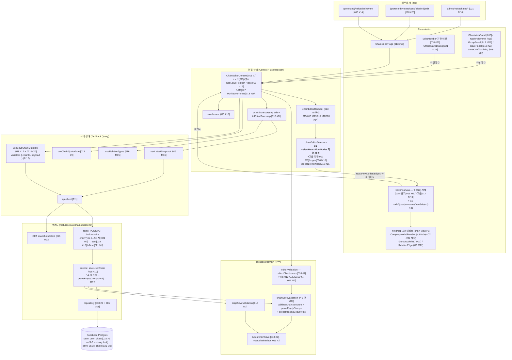

# Plan: chain-editor (밸류체인 생성/편집 페이지)

> 근거: `docs/pages/chain-editor/requirement.md`·`docs/pages/chain-editor/state_management.md`(본 페이지 확정 설계 — 아래 P-11·P-12의 명기된 divergence 외에는 그대로 따름),
> `docs/usecases/013~018/spec.md` + `docs/usecases/021/spec.md`, `docs/usecases/000_decisions.md` D-1~D-7(spec과 충돌 시 우선),
> `docs/techstack.md`(SOT — 모노레포 Codebase Structure·React 19 + Next.js 16 + Hono + `@xyflow/react` 12 + TanStack Query + Context/`useReducer`),
> `docs/database.md` §3.3, `supabase/migrations/0005~0006`,
> **기작성 plan(전부 존재)**: `docs/usecases/{007,008,013,014,015,016,017,018,021}/plan.md`, `docs/usecases/009/plan.md`·`docs/pages/chain-view/plan.md`(마인드맵 공용 프레젠테이션),
> `.claude/skills/spec_to_plan/references/hono-backend-guide.md`.
>
> **범위**: 본 문서는 chain-editor 페이지를 완성하기 위한 **통합 plan**이다. 페이지를 구성하는 기능 모듈은 UC-013(뼈대·메타)·UC-014(복제 진입)·UC-015(노드)·UC-016(엣지·최신 구성 API)·UC-017(그룹)·UC-018(저장·edit 셸)·UC-021(어드민 variant)·UC-007/008(목록·검색 백엔드)의 **기작성 usecase plan이 소유**한다. 본 plan이 소유하는 것은 ① 기작성 plan 간 충돌의 **사전 정합화 결정**(아래 표 — 구현 시 usecase plan보다 우선), ② 소유 공백이 확인된 모듈 2건(C1 `selectReactFlowNodes` 기본 매핑, C2 마인드맵 프레젠터의 편집 계약 기여 + `nodeTypes` 등록), ③ 페이지 통합 E2E 검증(C3)뿐이다.
>
> **외부 서비스 연동 확인**: UC-013~018·021 spec §6.4 전부 "없음" — 모든 조회/쓰기는 자체 DB(Supabase)만 사용한다(외부 API는 배치 적재 전용, PRD 8장). 따라서 외부 연동 클라이언트 모듈(재시도/타임아웃/키 관리)은 본 plan에 **해당 없음**.

---

## 사전 정합화 결정 (기작성 plan 간 충돌 해소 — 구현 시 이 표를 따름)

UC-017·018·021 plan이 모두 작성되어 있으므로, 본 표는 **현재 문서 집합 기준**으로 동일 모듈의 다중 정의를 단일 소유로 정리한다. 각 usecase plan의 서술이 본 표와 다르면 본 표를 따른다.

| # | 충돌/공백 | 결정 | 근거 |
|---|---|---|---|
| P-1 | API 클라이언트 경로 표기 상이: `lib/http/api-client.ts`(001~003·018) / `lib/http/apiClient.ts`(013) / `lib/remote/api-client.ts`(007·008·015) / `lib/api-client.ts`(016) | **`apps/web/src/lib/http/api-client.ts` 하나로 통일**(최초 작성된 인증 plan 표기). 타 plan의 상이 표기는 전부 동일 모듈을 가리키는 것으로 보고 구현 시 파일 1개만 생성한다 | 공통 인프라 중복 생성 방지(DRY) |
| P-2 | 마이그레이션 번호 경합(`0013`·`0014`를 복수 plan이 선점) | 마이그레이션은 **파일명(함수명) 기준으로 참조**하고 번호는 구현 시점의 "기적용 최신 번호+1"(현재 기적용 0012)로 부여한다 — UC-018 S-8·UC-021 R-11과 동일 규칙 | 번호는 적용 순서 기록일 뿐 계약이 아님 |
| P-3 | **저장 RPC 3중 정의**: 본 plan 구판 `fn_save_user_chain` vs UC-018 #6 `save_user_chain`(`0014_fn_save_user_chain.sql`) vs UC-021 M2 `save_value_chain`(user/official 공용 전제, R-2) | **user 저장 = UC-018 #6 `save_user_chain` 단일 소유**(신규: advisory lock + 잠금 내 상한 재확인 S-7 / 갱신: `FOR UPDATE` + 최신 스냅샷 재대조 / 오류 토큰 패턴 포함). **official 저장 = UC-021 M2 `save_value_chain`** — 단, UC-021 R-2의 "user 공용 + user 501 stub"은 **UC-018 plan 기작성으로 실효**: `save_value_chain`은 official 전용으로 축소 운용(`p_chain_type` 불일치 방어는 유지)하고, 라우트의 user 분기는 UC-018 #10 service로 **실디스패치**한다(stub 금지). 본 plan 구판의 자체 RPC 정의(P4)는 폐기 | RPC 이중 구현 방지. 두 경로의 요구가 실질적으로 다름(user: owner quota advisory lock·소유자 이름 유일 / official: `disclosure_date`·`clock_timestamp` 직렬화 R-4·전역 이름 유일) |
| P-4 | **저장 요청/응답 스키마 이중 정의**(같은 `backend/schema.ts`): UC-018 #7(`chainType` 없음·`positionX/Y: finite()` 필수·응답에 counts 포함) vs UC-021 M3(`chainType` default `'user'`·`disclosureDate` optional·`positionX/Y` nullable·응답 counts 없음) | **단일 스키마로 병합**: UC-018 #7 골격 + UC-021 M3의 `chainType`(default `'user'`)·`disclosureDate`(optional) 필드 합성. 좌표는 **`z.number().finite()` 필수**(UC-018 채택 — FE 직렬화가 항상 수치를 보장(P-14), DB NULL 허용은 과거 데이터 읽기 방어로만 대응. UC-021 M3의 nullable 표기는 본 결정으로 대체). PUT 전용 `baseSnapshotId` 필수 규칙은 UC-021 M3의 `UpdateChainRequestSchema` 분리 방식 채택(UC-018 #10-2의 400 규칙과 동치). 응답은 **UC-018 `SaveChainResponseSchema`(counts 포함)로 통일** — official 경로도 동일 응답 사용(UC-021 FE는 필요 필드만 소비) | UC-018이 저장 계약 소유 + 상위 집합으로 단일화 |
| P-5 | **구조(노드·그룹) 서버 재검증 순수 모듈 3중+α 정의**: UC-018 #3 `chainSaveValidation.ts`/`validateChainStructure` vs UC-021 M1 동일 파일/`validateNodesPayload`·`validateGroupsPayload` vs UC-017 M3 `groupSaveValidation.ts`/`validateGroupsPayload`·`pruneEmptyGroups` vs 본 plan 구판 P3 | **`packages/domain/valuechains/chainSaveValidation.ts` 1파일 · `validateChainStructure`(UC-018 #3 시그니처) 단일 구현**으로 통일. UC-017 M3의 유일 비중복 기능인 **`pruneEmptyGroups`** 와 UC-021 M1의 **`collectMissingSecurityIds`** 는 같은 파일에 함께 배치(각 소유 UC의 계약·테스트 유지). `groupSaveValidation.ts` 별도 파일·UC-021 M1의 분해 시그니처·본 plan 구판 P3은 **구현하지 않음**. 코드 매핑: user(UC-018 #10)는 통합 코드(`INVALID_GROUP`+`details.reason`), official(UC-021 M6)은 세분 코드 — UC-016 R-4·UC-017 G-2 원칙 그대로 | 검증 규칙 단일 SOT(UC-018 S-11)·중복 구현 금지 |
| P-6 | **빈 그룹 정리 호출 지점 공백**: UC-017 G-4/BR-6은 "저장 시 서버가 스냅샷에서 제외"를 요구하나, UC-018 #10 service 흐름과 #6 RPC 본문에는 prune 단계가 명시돼 있지 않음 | FE는 빈 그룹 **포함** 전체를 직렬화 전송 + 저장 전 예고 안내만(D-5·requirement §2.7, `emptyGroupIds` 파생). **서버 service(UC-018 #10)가 구조 재검증(6단계) 통과 후 RPC 호출(9단계) 직전에 `pruneEmptyGroups`(P-5)를 적용** — RPC에는 정리된 groups만 전달하고 `prunedGroupIds`는 서버 로그로 남긴다. UC-021 M6(official)도 동일 지점에 적용 | UC-017 BR-6 이행 지점 확정(구현 누락 방지). 빈 그룹은 정의상 참조 노드가 없으므로 노드 페이로드 변경 불요 |
| P-7 | 저장 페이로드 타입 위치: 본 plan 구판은 `packages/domain/types/chainEditor.ts`, UC-018 #2는 `types/chainSave.ts` | **`packages/domain/types/chainSave.ts`(UC-018 #2)로 확정** — `SaveChainRequest`/`SaveChainNodePayload`/`SaveChainGroupPayload`/`SaveChainResult`(+UC-016 `SaveEdgePayload` re-export). `chainEditor.ts`에는 저장 타입을 두지 않는다. BE zod 산출 타입은 `satisfies`로 이 타입을 준수, FE `serializeSavePayload` 반환 타입도 동일 | UC-018이 저장 계약 소유 |
| P-8 | `collectClientIssues` 소유 경합: 본 plan 구판 P2 vs UC-018 #4 vs UC-017 M2(그룹 파트) | **조립 함수는 UC-018 #4 단일 소유**(내부에서 P-5의 `validateChainStructure`를 재사용 — 검증 이중화·구현 단일화, UC-018 S-11). 파트 기여는 이름(013 #4 `validateChainNameFormat`)·엣지(016 M2). UC-017 M2의 "그룹 파트 기여"는 별도 재구현 없이 `validateChainStructure` 결과가 조립에 포함됨을 확인하는 것으로 갈음(그룹 일괄 규칙의 SOT는 P-5). 본 plan 구판 P2 폐기 | 동일 함수 3중 구현 방지 |
| P-9 | 저장 오류 정규화 파일명: 본 plan 구판 `lib/serverIssues.ts` vs UC-018 #18 `lib/saveIssues.ts` | **`saveIssues.ts`(UC-018 #18)로 확정** — `normalizeSaveErrorToIssues`(422 전체 + 409 `DUPLICATE_NAME`만 `ServerIssue[]`, 그 외 `null`) + `classifySaveError`. 구판 P14 폐기 | UC-018이 저장 수명주기 소유 |
| P-10 | **그룹 노드 드래그 동작 상충**: 본 plan 구판 P17-2 "그룹 노드 드래그 = 소속 노드 일괄 이동(React Flow 기본)" vs UC-017 G-5/M8 "그룹 parent 노드는 `draggable:false` 비드래그" | **UC-017 G-5 채택 — 그룹 parent 노드는 `draggable:false`로 확정**(구판 P17-2 후단 폐기). 근거: ① 그룹 좌표는 DB 비영속(그룹 좌표 컬럼 없음 — database.md §3.3)·멤버 bounding box **파생값**(UC-017 M9)이므로 "그룹 이동"이라는 영속 개념이 없다 ② 제어형 캔버스에서 매 렌더 재파생되는 parent 좌표와 드래그 입력이 경합한다 ③ requirement·state_management는 그룹 드래그를 규정하지 않으므로 그룹 캔버스 소유 plan(UC-017)의 결정을 따른다. 그룹 전체 이동이 필요하면 소속 노드 다중 선택 이동으로 대체(MVP) | 두 문서(본 plan·UC-017 plan) 일치 — 구현 충돌 제거 |
| P-11 | **`clientIssues` 처리 방식 불일치**: state doc §6.2④·§7.1은 computed(셀렉터 파생)로 정의, 본 plan 구판 P15는 "save() 시점 결과를 Provider 로컬 state로 보관, 다음 문서 변형 액션 시 클리어"(클리어 신호 미상술)로 설계 | **state doc 정의 그대로 순수 computed로 확정**: `computed.clientIssues = useMemo(() => collectClientIssues(state, relationTypeById), [state, relationTypeById])`(UC-018 #19-5와 동일). 로컬 보관·클리어 메커니즘은 **폐기** — 문서 변형 시 `useMemo` 재계산으로 자동 최신화되므로 별도 클리어 신호 자체가 불필요하다. `save()`는 클릭 시점에 동일 computed를 읽어 `blocked_client` 판정(state doc §6.3 1단계). requirement §2.9-1("저장 클릭 시 오류 위치 표시")은 상시 파생 표시로 상위 충족되며, 저장 전 노출은 요구 위반이 아니다(IssuePanel은 이슈 존재 시에만 렌더 — 초기 빈 문서의 `NAME_REQUIRED` 상시 안내는 의도된 동작으로 확정) | state doc SOT 준수 + 미상술 메커니즘 제거 |
| P-12 | `useSaveChainMutation` 시그니처가 state doc §5(`UseMutationResult<SaveChainResponse, ApiError, SaveChainRequest>`)와 상이 — UC-018 #17·UC-021 M20·본 plan 모두 variables를 확장 | **variables `{ chainId: string | null; payload: SaveChainRequest }`로 확정**(UC-018 #17과 동일). **divergence 사유 명기**: POST/PUT 분기의 입력인 `chainId`(S2)는 reducer state이므로 서버 상태 계층의 훅이 스스로 알 수 없다 — 호출측 Provider `save()`가 직렬화 시점 값을 주입해야 하며, 훅 내부에서 Context를 역참조하면 계층 역전이 된다. state_management §5의 해당 시그니처는 **본 결정으로 대체**(문서 갱신 대상 — 갱신 전이라도 구현은 본 표를 따른다). 반환 타입 명칭은 `SaveChainResult`(UC-018 #2) = state doc `SaveChainResponse`와 동일 개념(명칭은 UC-018 채택) | 3문서(state doc·018·021) 시그니처 단일화 + "state doc 그대로" 선언과의 모순 해소 |
| P-13 | `async.hasActiveRelationTypes`(state doc §7.1 — requirement §2.1·UC-016 E6: 활성 관계 종류 0개 시 관계 설정 UI 비활성)의 산출 소유가 본 plan 구판에 미기재 | **UC-016 plan이 기소유함을 명기**: M19(Context 기여 — `activeRelationTypes`·`hasActiveRelationTypes` computed 산출, `async`에 노출) + M21-5(캔버스 `nodesConnectable=false` + 안내 배너) + M20-4(활성 0개 시 피커 미오픈). 본 plan은 C1의 `data.connectable` 계약이 이 게이트와 정합함을 보장하고, C3 통합 QA로 이행을 검증한다 | 소유 명시로 구현 누락 방지 |
| P-14 | 저장 시 노드 좌표 nullable(DB `position_x/y` NULL 허용) vs 편집 상태 `position: XYPosition`(non-null) | `toEditorBootstrap`(UC-018 #16)이 NULL 좌표를 `getDefaultNodePosition`(015 #16)으로 보정해 편집 상태에선 항상 non-null. 직렬화는 항상 수치 전송(P-4의 `finite()` 필수와 정합) | state doc §2.1 타입 유지 + 과거 데이터 방어 |
| P-15 | **서버 최종 방어의 엄밀성**: 본 plan 구판 P4/P7/P8은 갱신 경로만 `FOR UPDATE`, 신규 경로 체인 상한(50) 재검증 없음(count~INSERT 간 TOCTOU 잔존), `focusSecurityId` 존재 검증 미기재(FK 위반 500 누수) | **UC-018 S-7·S-9가 SOT** — 구판 표기 전면 폐기: ① 신규 저장은 RPC 내부에서 `pg_advisory_xact_lock(hashtext('save_user_chain:'||owner_id))` 획득 후 카운트 **재확인**(E2 최종 차단), 갱신 저장은 `FOR UPDATE` + 최신 스냅샷 재대조(S-7) ② `focusSecurityId`는 `nodes[].securityId`와 **동일 존재 확인 집합**에 포함 — 미존재 시 422 `SECURITY_NOT_FOUND`(`details.field='focusSecurityId'`), `focusType='industry'`면 서버가 null 정규화(S-9) | 상한 경쟁 조건·FK 위반 500 누수 제거 — UC-018 plan과 완전 정합 |
| P-16 | variant 확장 전제 오류: 본 plan 구판 P-9는 "UC-021 plan 미작성"을 전제 | **UC-021 plan 기작성** — 어드민 라우트 셸(M18)·official 저장 분기와 `save(options)` 하위호환 확장(M20, R-8)·`OfficialSaveDialog`(M21)·어드민 목록 전체(M8~M17)는 **UC-021 plan 소유**. 본 plan은 Flux 코어·직렬화·컴포넌트가 variant 무분기(state doc §11)로 재사용 가능함을 보장하고 C3에서 스모크 확인만 한다 | 문서 사실 정정 + 경계 재확정 |
| P-17 | **마인드맵 프레젠터 소유·명명 경합**: 본 plan 구판 P16 `components/mindmap/{ListedCompanyNode,FreeSubjectNode,GroupNode}` 신규 정의 vs UC-009 plan A8/chain-view plan P1 `components/mindmap/{types,auto-layout,CompanyNode,FreeSubjectNode,GroupNode,RelationEdge}`(뷰·편집 공용 소유) vs UC-016 M22(`RelationEdge`)·UC-017 M11(`GroupNode`) | **파일·명명은 chain-view plan P1(=UC-009 A8)을 따름**: `CompanyNode.tsx`(구판의 `ListedCompanyNode` 표기 폐기)·`FreeSubjectNode.tsx`. 편집 전용 요구(연결 `Handle` 노출 `data.connectable`·저장 오류 `data.isHighlighted`·선택 스타일)는 **본 plan C2가 동일 파일에 props 계약으로 기여**(신규 파일 생성 금지). `GroupNode`의 편집 확장(빈 그룹·하이라이트·선택)은 UC-017 M11, `RelationEdge`는 UC-016 M22가 상세 소유하며 뷰 요구(chain-view P1)와 단일 파일로 병합 구현한다 | 공용 프레젠테이션 중복 생성 방지 |
| P-18 | `selectReactFlowNodes` 기본(비그룹) 매핑 소유 공백: 013 #6은 `selectNodeCount`만 소유, 015 plan은 "013 담당"으로 표기, UC-017 M8은 "기본 매핑은 013/015 기여분"을 전제 — 실소유자 없음 | **본 plan C1이 소유 확정**: 문서 노드 → React Flow 노드 기본 매핑(kind→type·data·selected·highlight). 그룹(Sub Flow) parent 생성·소속 노드 `parentId`/상대 좌표 변환·parent 선행 정렬은 **UC-017 M8이 동일 함수에 합류**(재정의 아님 — 확장) | 소유 미지정 모듈의 구현 누락 방지 |
| P-19 | 기결정 확인(본 plan에서 재결정하지 않음) | ① 낙관적 잠금 필드는 `baseSnapshotId`(state doc §4.4 각주·UC-021 R-1) ② 그룹 페이로드 필드명은 `clientGroupId`/`groupClientId`(UC-017 G-1·UC-021 R-1) ③ 그룹 저장 422 코드: user=`VALUECHAINS.INVALID_GROUP`+`details.reason` 세분, official=세분 코드(UC-017 G-2·UC-016 R-4) ④ `useMyChains`(state doc §5) 별도 훅 없이 `useChainQuotaGate`(013 #9, `useMyChainCards` 기반)가 `entryBlocked` 계약 충족 ⑤ user 저장의 관계 종류는 존재만 검증 — 비활성 허용(UC-018 S-4·UC-016 R-1) ⑥ 비소유자 PUT 403(조회 404 통일 C-2의 스코프 밖 — UC-018 S-2) | 각 소유 plan의 기결정 준수 |

---

## 개요

**본 plan 소유/기여 모듈** (무표기 usecase plan에 속하지 않는 잔여분):

| # | 모듈 | 위치 | 설명 |
|---|---|---|---|
| C1 | 캔버스 노드 매핑 셀렉터(기본) | `apps/web/src/features/valuechains/editor/state/chainEditorSelectors.ts` | **[기여]** `selectReactFlowNodes` 기본(비그룹) 매핑 — P-18 소유 확정. 그룹 Sub Flow 확장은 UC-017 M8이 동일 함수에 합류 |
| C2 | 프레젠터 편집 계약 + nodeTypes 등록 | `apps/web/src/components/mindmap/{CompanyNode,FreeSubjectNode}.tsx`(props 기여), `apps/web/src/features/valuechains/editor/components/EditorCanvas.tsx`(등록 기여) | **[기여]** `data.connectable`/`data.isHighlighted`/선택 스타일 계약(P-17) + `nodeTypes = { companyNode, freeSubjectNode }` 등록(`groupNode` 등록은 UC-017 M13) |
| C3 | 페이지 통합 검증 | (코드 모듈 아님) | 진입→편집→저장→이동 E2E 시나리오 + 정합화 결정(P-3~P-15) 이행 게이트 |

**참조 매트릭스** (페이지 구성 요소 → 소유 plan — 위치·계약은 각 plan 참조, 본 plan에서 재정의 금지):

| 페이지 구성 요소 | 소유 plan·모듈 | 위치 |
|---|---|---|
| 밸류체인 상수(`MAX_*`)·편집 도메인 타입 | 013 #1·#3 | `packages/domain/constants/valuechain.ts`, `types/chainEditor.ts` |
| 저장 페이로드 타입 | 018 #2 (P-7) | `packages/domain/types/chainSave.ts` |
| 편집 검증(`editorValidation.ts`): 이름/노드/엣지/그룹 + `collectClientIssues` | 013 #4 / 015 / 016 M2 / 017 M2 / 018 #4 (P-8) | `packages/domain/valuechains/editorValidation.ts` |
| 구조 저장 재검증 + `pruneEmptyGroups` + `collectMissingSecurityIds` | 018 #3 + 017 M3 + 021 M1 → **P-5로 단일화** | `packages/domain/valuechains/chainSaveValidation.ts` |
| 엣지 저장 재검증(`validateEdgesPayload`·`isEdgePreexisting`) | 016 M3 | `packages/domain/valuechains/edgeSaveValidation.ts` |
| user 저장 RPC(`save_user_chain` — S-7 advisory lock 포함) | 018 #6 (P-3·P-15) | `supabase/migrations/NNNN_fn_save_user_chain.sql`(P-2) |
| official 저장 RPC(`save_value_chain`)·어드민 목록 함수 | 021 M2 (P-3) | `supabase/migrations/NNNN_save_value_chain_and_admin_chain_fns.sql` |
| 저장 스키마/에러/리포지토리/서비스/라우트(user) | 018 #7~#11 (P-4·P-6·P-15) | `apps/web/src/features/valuechains/backend/*` |
| 저장 official 경로·라우트 디스패치(`chainType`) | 021 M3~M7 (P-3·P-4) | 동일 feature 기여분 |
| 참조 존재 조회(`findExistingSecurityIds`/`findRelationTypesByIds`) | 018 #12·#13 | `features/securities/backend/repository.ts`, `features/relation-types/backend/repository.ts` |
| 최신 구성 API·relation-types API | 016 M4~M13 | `features/{relation-types,valuechains}/backend/*` |
| 서버 상태 훅: `useRelationTypes`/`useLatestSnapshot` | 016 M15·M16 | `.../editor/hooks/` |
| 서버 상태 훅: `useChainQuotaGate`/`useMyChainCards` | 013 #9 / UC-007 (P-19④) | `.../editor/hooks/`, `features/valuechains/hooks/` |
| 서버 상태 훅: `useSecuritiesSearch` | 008/015 #10 | `features/securities/hooks/` |
| 저장 뮤테이션 훅(`{ chainId, payload }` variables) | 018 #17 + 021 M20(official 분기) (P-12) | `.../editor/hooks/useSaveChainMutation.ts` |
| Flux 코어: reducer/셀렉터/Context 뼈대·메타 | 013 #5~#7 | `.../editor/state/*`, `.../editor/context/*` |
| reducer/Context 기여: 노드(015)·엣지(016 M17·M19 — `hasActiveRelationTypes` 포함 P-13)·그룹(017 M7·M10)·저장(018 #14·#19) | 각 plan | 동일 공유 파일 |
| 셀렉터 기여: `selectReactFlowEdges`(016 M18)·그룹 파생/Sub Flow 확장(017 M8)·`serializeSavePayload`/`selectIssueHighlight`(018 #15) | 각 plan | `.../editor/state/chainEditorSelectors.ts` |
| 그룹 레이아웃 헬퍼(bbox·절대↔상대 변환) | 017 M9 | `.../editor/lib/groupLayout.ts` |
| `toEditorBootstrap` + `useEditorBootstrap` edit 분기 | 018 #16 (P-14) | `.../editor/lib/`, `.../editor/hooks/` |
| 저장 오류 정규화(`saveIssues.ts`) | 018 #18 (P-9) | `.../editor/lib/saveIssues.ts` |
| Presentation: `ChainEditorPage`·툴바·메타·검색·차단 화면·이탈 다이얼로그 | 013 #16~#22 | `.../editor/components/*` |
| Presentation: `NodeAddPanel`(+탭)·삭제 확인 | 015 | `.../editor/components/*` |
| Presentation: `RelationTypePicker`·`RelationEdge`·캔버스 엣지 배선 | 016 M20~M22 | `.../editor/components/*`, `components/mindmap/RelationEdge.tsx` |
| Presentation: `GroupNode`·`GroupPanel`·캔버스 그룹 배선(`draggable:false` — P-10) | 017 M11~M13 | `components/mindmap/GroupNode.tsx`, `.../editor/components/*` |
| Presentation: 저장 버튼 배선·`SaveConflictDialog`·`IssuePanel`·문구 상수 | 018 #21~#24 | `.../editor/components/*`, `.../editor/constants/save.ts` |
| 마인드맵 공용 프리미티브(`types`/`auto-layout`/`CompanyNode`/`FreeSubjectNode`) | UC-009 A8 = chain-view P1 (P-17) | `apps/web/src/components/mindmap/*` |
| 라우트 셸: create·`(protected)` 가드 / edit / 어드민 | 013 #14·#15 / 018 #20 / 021 M18 (P-16) | `apps/web/src/app/**` |
| 공통 인프라: api-client(P-1)·Hono 골격 | 001~003 / 공통 | `apps/web/src/lib/http/api-client.ts`, `apps/web/src/backend/*` |

**선행 의존성**: 본 plan의 C1·C2 구현 전 013(Flux 뼈대·create 진입)·015(노드)의 해당 모듈이, C3 수행 전 016·017·018(007/008 백엔드 포함)이 각 plan대로 구현되어 있어야 한다. 미구현이면 해당 plan 기준으로 먼저 구현한다(본 plan에서 대체 구현 금지).

---

## Diagram

데이터 흐름(단방향): View 이벤트 → Provider 액션 함수(검증·ID 발급) → dispatch → reducer → state → 셀렉터 → View. 서버 왕복(초기 로드·저장)도 쿼리/뮤테이션 결과를 이펙트·콜백이 Action(`EDITOR_INITIALIZED`/`SAVE_SUCCEEDED`/`SAVE_REJECTED`)으로 변환해 같은 경로로 합류한다. 편집 조작은 DB 쓰기를 발생시키지 않으며, 쓰기는 저장 1회 = RPC 1회 = 스냅샷 1건뿐이다(UC-018 BR-1·BR-6).

---

## Implementation Plan

### C1. `selectReactFlowNodes` 기본 매핑 — `.../editor/state/chainEditorSelectors.ts` [기여]

- 구현 내용:
  1. state doc §4.4 시그니처의 기본(비그룹) 매핑을 소유(P-18): `selectReactFlowNodes(state: ChainEditorState, highlight: IssueHighlight, options: { connectable: boolean }): Node<ChainEditorNodeData>[]`.
     - `id ← clientNodeId`, `type ← nodeKind` 매핑(`listed_company → 'companyNode'`, `free_subject → 'freeSubjectNode'` — P-17 명명), `position ← node.position`(절대 좌표 그대로).
     - `selected ← state.selection.nodeIds` 포함 여부, `data`: 표시 필드(listed: `security`의 ticker/name/market + 상장폐지/정지 배지 입력, free: `subjectName`/`subjectType`/`subjectMemo`) + `isHighlighted ← highlight.nodeIds` 포함 여부 + `connectable ← options.connectable`(편집=true·뷰 재사용=false — `hasActiveRelationTypes` 게이트는 캔버스 `nodesConnectable`이 담당하므로 여기서 중복 판정하지 않음, P-13).
  2. 그룹 관련 처리(parent 노드 생성·`parentId` 부여·절대→상대 변환·parent 선행 정렬·`draggable:false`)는 **UC-017 M8이 동일 함수에 확장 합류** — 본 기여분은 그룹 미고려 상태에서도 독립 동작해야 한다(017 미구현 시점의 중간 상태 보장).
  3. 순수 함수·결정적 순서(문서 삽입 순서 유지). `selectReactFlowEdges`는 016 M18 소유 — 재정의 금지.
- 의존성: 013 #3(타입)·#6(셀렉터 파일), 018 #15(`IssueHighlight` 타입).

**Unit Tests:**

- [ ] listed 1 + free 1 문서 → type이 각각 `companyNode`/`freeSubjectNode`, `id`=clientNodeId, 좌표 보존
- [ ] `selection.nodeIds`에 포함된 노드만 `selected=true`
- [ ] `highlight.nodeIds`에 포함된 노드만 `data.isHighlighted=true`
- [ ] `options.connectable=false` → 전 노드 `data.connectable=false`(뷰 재사용 계약)
- [ ] listed 노드 data에 ticker/name/market 포함, free 노드 data에 subjectName/subjectType 포함(상보 필드 미혼입)
- [ ] 동일 입력 2회 호출 → 동일 순서·동일 값(결정성), 입력 state 비변이
- [ ] 그룹 소속 노드가 있어도(017 확장 전 중간 상태) 기본 매핑은 절대 좌표로 렌더 가능(throw 없음)

### C2. 프레젠터 편집 계약 + nodeTypes 등록 — `components/mindmap/{CompanyNode,FreeSubjectNode}.tsx`·`.../editor/components/EditorCanvas.tsx` [기여]

- 구현 내용:
  1. chain-view plan P1 소유 파일에 편집 전용 props 계약만 기여(P-17 — 신규 파일 생성 금지, 도메인 로직 없음):
     - `data.connectable === true`일 때만 React Flow `Handle`(source/target) 렌더 — 뷰(UC-009~012) 재사용 시 미노출.
     - `data.isHighlighted` → 오류 하이라이트 스타일(테두리 강조), `selected` → 선택 스타일. 색·두께는 스타일 상수(하드코딩 금지), 다크/기본 테마는 Tailwind 토큰.
  2. `EditorCanvas`(013 셸)에 `nodeTypes = { companyNode: CompanyNode, freeSubjectNode: FreeSubjectNode }` 등록 기여 — `groupNode` 등록은 UC-017 M13, `edgeTypes`는 016 M21 소유. C1 산출을 제어형 `nodes`로 전달하는 배선이 013 셸 계약과 일치하는지 확인만 한다.
- 의존성: C1, chain-view plan P1(파일 골격 — 미구현 시 P1 계약대로 선생성), 013 캔버스 셸.

**QA Sheet:**

| # | 시나리오 | 기대 결과 |
| --- | --- | --- |
| 1 | 편집 모드에서 상장기업 노드 렌더 | 종목명+티커+시장 배지 + 연결 핸들 표시 |
| 2 | 뷰 페이지(UC-009)에서 동일 컴포넌트 렌더 | 핸들 미표시(`connectable=false`), 표시 필드는 동일 |
| 3 | 자유 주체 노드(메모 있음) | 유형 배지+이름, 호버 시 메모 툴팁 |
| 4 | `isHighlighted=true` 노드 | 오류 하이라이트 스타일(422 하이라이트와 동일 계약) |
| 5 | 노드 클릭 선택 | 선택 스타일 적용 + `selection.nodeIds` 반영(013/015 배선) |
| 6 | 줌아웃 | 라벨 가독성 유지, 콘솔 경고 없음 |

### C3. 페이지 통합 검증 — E2E QA (정합화 결정 이행 게이트 포함)

- 구현 내용: 코드 모듈이 아니라 **전 usecase plan 구현 완료 후 페이지 단위로 수행하는 통합 시나리오**다. P-3~P-15 결정의 이행 여부를 이 단계에서 게이트한다(불일치 발견 시 본 표 기준으로 수정).
- 의존성: 013·015·016·017·018(+007/008) 전체, C1·C2. (#12는 021 구현 후.)

**QA Sheet:**

| # | 시나리오 | 기대 결과 |
| --- | --- | --- |
| 1 | create 진입 → 노드 2 추가 → 엣지 연결 → 그룹 생성 → 저장 | 뷰 페이지(`/valuechains/[chainId]`) 이동, DB에 체인+스냅샷 1건(`change_source='user_save'`), counts 정확 |
| 2 | 저장 후 edit 재진입 | 노드/엣지/그룹/좌표/메타 왕복 무손실(state doc §10-14), `isDirty=false`, `baseSnapshotId`=로드 스냅샷 |
| 3 | 그룹 노드 드래그 시도 | **이동 불가**(`draggable:false` — P-10) / 소속 노드 드래그 → 절대 좌표 갱신 + 그룹 bbox 재파생, 재렌더 시 위치 튐 없음(017 M9 왕복 항등) |
| 4 | 두 탭 동시 편집 → 순차 저장 | 후행 탭 409 → SaveConflictDialog → [최신 재로드] 후 재저장 성공(UC-018 E7) |
| 5 | 이름 공백 문서 | IssuePanel에 `NAME_REQUIRED` 상시 안내(P-11 확정 동작), 저장 클릭 → `blocked_client` + 네트워크 요청 0건 |
| 6 | 422 유도(API 직접 호출로 자기 참조 엣지 전송) | 422 + `details` 식별자 → 편집 화면 재현 시 IssuePanel·하이라이트 동기, 이후 문서 변형 1회로 `serverIssues` 해제 |
| 7 | 활성 관계 종류 0개(마스터 전체 비활성) | 연결 제스처 비활성(`nodesConnectable=false`) + 안내 배너, 피커 미오픈(P-13 — 016 M19/M20/M21 이행 확인) |
| 8 | 빈 그룹 1개 존재 상태로 저장 | 저장 전 "저장 시 제외" 예고 배지 → 저장 성공 → 재진입 시 빈 그룹 미복원(P-6 — RPC 전달 groups에서 제외 확인) |
| 9 | 소유 체인 50개 상태에서 create 진입 / 동시 2요청 신규 저장 | 진입 차단 화면(013 #17) / RPC advisory lock으로 한쪽만 성공(P-15 — 51개 미발생) |
| 10 | 미존재 `focusSecurityId` 강제 전송(API 직접 호출) | 422 `SECURITY_NOT_FOUND` + `details.field='focusSecurityId'`(P-15 — 500 누수 없음) |
| 11 | dirty 상태 이탈 / 저장 성공 직후 이탈 | 경고 다이얼로그 / 경고 없음(013 #12) |
| 12 | (021 구현 후) 어드민 edit 진입 → 동일 캔버스 편집 → 공시일 입력 저장 | Flux 코어 무분기 재사용(P-16), `change_source='admin_edit'` 스냅샷, `/admin/valuechains` 복귀 |
| 13 | UC-014 복제 성공 직후 랜딩(D-3) | 복제본 구성이 로드된 edit 캔버스, 이름=서버 결정 이름 |
| 14 | 세션 만료 후 저장(401) / 네트워크 차단 후 저장 | 재로그인 유도·편집 상태 보존(E9) / 재시도 토스트·상태 유지(E8), 자동 재시도 미발생 |

---

## 구현 순서 (의존성 위상 정렬)

1. **선행 확인**: 공통 인프라(P-1 api-client·Hono 골격)·007/008 백엔드 존재 확인, 미구현분 선구현.
2. **013 plan** 전체(Flux 뼈대·create 진입) → **015 plan**(노드).
3. **C1 → C2** (본 plan 소유분 — 캔버스에 노드가 보이는 최초 시점. Vitest 선행).
4. **016 plan**(엣지·latest API·relation-types — `hasActiveRelationTypes` 포함 P-13) → **017 plan**(그룹 — C1에 M8 확장 합류, `draggable:false` P-10).
5. **018 plan**(저장 수직 슬라이스 — P-3/P-4/P-5/P-6/P-15 결정 반영: `chainSaveValidation.ts` 단일 모듈, service의 `pruneEmptyGroups` 호출, RPC advisory lock·focusSecurityId 검증) + edit 셸.
6. **C3 통합 QA** (#1~#11·#13~#14) → `npm run typecheck` / `lint` / `test` 무오류.
7. (어드민 필요 시) **021 plan**(official 경로·어드민 화면 — P-3의 user 실디스패치 확인) → C3 #12.

## 타 plan과의 경계 (충돌 방지 계약)

| 공유 지점 | 본 plan의 역할 | 타 plan의 역할 |
|---|---|---|
| 사전 정합화 결정(P-1~P-19) | **소유** — usecase plan 서술과 상충 시 본 표 우선 | 각 plan은 자기 모듈 구현 시 본 표 반영 |
| `chainEditorSelectors.ts` | C1 `selectReactFlowNodes` 기본 매핑만 | `selectNodeCount`(013)·`selectReactFlowEdges`(016 M18)·그룹 파생/Sub Flow 확장(017 M8)·`serializeSavePayload`/`selectIssueHighlight`(018 #15) |
| `components/mindmap/*` | C2 편집 props 계약 기여(`connectable`/`isHighlighted`)만 | 파일·명명·뷰 요구는 chain-view P1(=UC-009 A8), `GroupNode` 편집 확장 017 M11, `RelationEdge` 016 M22 |
| `EditorCanvas.tsx` | C2 `nodeTypes`(company/freeSubject) 등록만 | 셸(013)·삭제(015)·연결/엣지(016 M21)·그룹 배선/`groupNode` 등록(017 M13) |
| 저장 수직 슬라이스(RPC·schema·error·repo·service·route·FE 수명주기) | 정합화 결정(P-3~P-9·P-12·P-15)만 — 코드 소유 없음 | user=UC-018 #2~#24, official·디스패치=UC-021 M2~M7·M19~M21 |
| 그룹 편집(검증·전이·셀렉터·레이아웃·UI) | P-6(prune 호출 지점)·P-10(비드래그) 결정만 | UC-017 M2~M13 |
| `chainSaveValidation.ts` | P-5 단일화 결정만 | 함수 구현·테스트: `validateChainStructure`(018 #3)·`pruneEmptyGroups`(017 M3 이관)·`collectMissingSecurityIds`(021 M1 이관) — 1파일 공존, 재정의 금지 |
| state_management.md와의 divergence | P-11(clientIssues=computed 확정)·P-12(mutation variables 확장) 명기 — state doc §5 시그니처는 갱신 대상 | state doc은 그 외 전 계약의 SOT |
| 쿼리 키 | 참조만 | `['relation-types']`·`['valuechains', chainId, 'latest-snapshot']`(016), `['valuechains','mine']`(007), `['admin','valuechains']`(021) |
