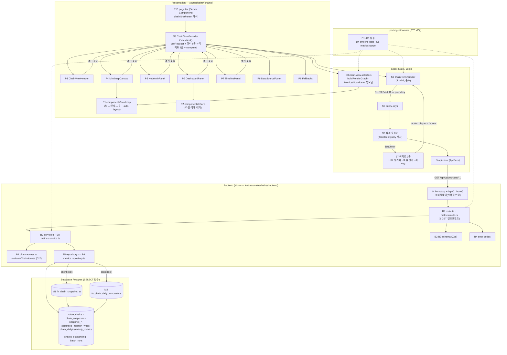

# Plan: 밸류체인 뷰 페이지 (chain-view)

> 경로: `/valuechains/[chainId]` (+ `?at=YYYY-MM-DD` 시점 딥링크)
>
> 근거 문서: `docs/pages/chain-view/requirement.md`(행동 A~H·상태 S1~S6), `docs/pages/chain-view/state_management.md`(Flux + Context 설계 — **본 plan은 이 설계를 그대로 구현 단위로 옮긴다**), `docs/usecases/009~012/spec.md` + `docs/usecases/009~012/plan.md`(유스케이스별 상세 plan — 본 plan이 페이지 수준에서 통합), `docs/usecases/000_decisions.md`(C-1~C-8 — spec과 충돌 시 우선), `docs/techstack.md`(§4 Codebase Structure — SOT), `docs/database.md`, `.claude/skills/spec_to_plan/references/hono-backend-guide.md`.
>
> **페이지 성격**: 조회 전용(사이드이펙트 없음 — 전 구간 SELECT). 서버 상태는 TanStack Query 5가 단독 소유, 클라이언트 상태는 **Context + `useReducer`**(S1~S6, Redux/Zustand 미사용 — techstack §2). 마인드맵은 `@xyflow/react`, 추이 차트는 `recharts`.
>
> **외부 서비스 연동**: **없음.** UC-009~012 spec의 External Service Integration 절 전부 "해당 없음" — 화면의 모든 데이터는 배치(UC-026~031)가 사전 적재한 자체 DB에서만 읽는다. `docs/external/*`(OpenDART/SEC EDGAR/토스증권)의 클라이언트 모듈은 워커(배치) plan 범위이며 본 페이지 요청 경로에는 등장하지 않는다. 따라서 외부 연동 클라이언트 모듈은 본 계획에 포함하지 않는다.
>
> **확정 결정 반영(000_decisions)**: C-1(빈 그룹 = 라벨만 있는 빈 클러스터), **C-2(미존재·보관·비소유자 접근 전부 404 통일 — spec의 401/403 코드는 구현하지 않으며 FE는 방어적으로 401/403도 "체인 없음" 폴백 처리)**, C-3(최종 수집 시각 = batch_runs 잡별 최근 성공 `finished_at`), C-4(주식수 기준일 min~max), C-5(기본 기간 1Y), C-6(Asia/Seoul·당일 23:59:59 경계·상수), C-7(시점 선택 시 추이 전체 유지 + 하이라이트), C-8(미확정 분기 지표 null + "미제공").
>
> **코드베이스 현황**: 저장소에 `apps/`·`packages/` 스캐폴드가 아직 없다(마이그레이션 0001~0012만 존재). 본 plan의 모든 경로는 techstack §4 구조 기준 신규 생성이며 기존 코드와의 충돌은 없다. 단 **UC-009~012 plan 상호 간 공통 모듈의 위치·명명 불일치**가 있어 §충돌 조정에서 단일 기준을 확정한다 — 구현자는 그 기준을 따르고, 유스케이스 plan의 해당 표기는 본 문서가 대체한다.

---

## 개요

### M. 마이그레이션 (조회용 RPC 함수 — 신규 테이블 없음)

| 모듈 | 위치 | 설명 |
| --- | --- | --- |
| M1. 스냅샷 복원 RPC | `supabase/migrations/0013_fn_chain_snapshot_at.sql` | `fn_chain_snapshot_at(p_chain_id, p_as_of)` — 경계 이전 마지막 스냅샷 + 그룹/노드(securities 조인)/엣지(relation_types 조인)를 단일 jsonb로 반환 (UC-012 plan 모듈 4 — 번호 0013 확정) |
| M2. 일별 지표 주석 RPC | `supabase/migrations/0014_fn_chain_daily_annotations.sql` | `fn_chain_daily_annotations(p_chain_id, p_as_of, p_metric_date)` — 유효 스냅샷의 상장기업 주식수 기준일 min/max(C-4) + 종가 확정 여부 (UC-010 plan 모듈 10 — **0013→0014 재번호**) |

### D. `packages/domain` — 공통 순수 로직 (web·worker 공유, 프레임워크 독립)

| 모듈 | 위치 | 설명 |
| --- | --- | --- |
| D1. 타임라인 상수 | `packages/domain/constants/timeline.ts` | `TIMESERIES_MIN_START_DATE('2015-01-01')`, `APP_TIMEZONE('Asia/Seoul')`, `DAY_END_TIME('23:59:59')` (C-6) — **단일 정의**(metrics.ts는 재사용) |
| D2. 지표 상수 | `packages/domain/constants/metrics.ts` | `DASHBOARD_DEFAULT_RANGE_PRESET('1Y', C-5)`, `METRICS_RANGE_PRESETS`, `BASE_CURRENCY('KRW')`, `FX_BASIS_*` |
| D3. 체인·출처 상수 | `packages/domain/constants/{chain.ts,data-freshness.ts,subject-types.ts}` | `MAX_NODES_PER_CHAIN=100`, `DATA_SOURCE_LABELS`(DART/SEC/토스), `FRESHNESS_JOBS`(C-3), `SUBJECT_TYPE_LABELS`(소비자/정부/비상장기업/기타) |
| D4. 날짜 경계 계산 | `packages/domain/calculations/timeline-date.ts` | `isValidIsoDate`, `todayInSeoul(now)`, `toSeoulDayEndIso(D)`(C-6 경계 단일 원천 — UC-029 배치와 공유), `isWithinTimelineRange(D, today)` |
| D5. 기간·분기 계산 | `packages/domain/calculations/metrics-range.ts` | `presetToDailyRange`, `resolveDailyMetricsRange`(E8 하한·미래 to 보정), `dateToCalendarQuarter`(역년 분기 — 단일 정의), `resolveQuarterlyMetricsRange`, `quarterOrdinal` |
| D6. 공통 타입 | `packages/domain/types/common.ts` | `IsoDate`, `NodePosition` 등. `types/database.ts`는 마이그레이션 적용 후 `generate_typescript_types`로 재생성 |

### I. 웹 공통 인프라 (`apps/web` — 전 기능 공유)

| 모듈 | 위치 | 설명 |
| --- | --- | --- |
| I1. HTTP Result 헬퍼 | `apps/web/src/backend/http/response.ts` | `HandlerResult<T,E,M>`·`success()`·`failure()`·`respond()` — `{ok:true,data}`/`{ok:false,error:{code,message}}` 봉투 단일 정의 |
| I2. Hono Context 계약 | `apps/web/src/backend/hono/context.ts` | `AppEnv`, `getSupabase(c)`/`getLogger(c)`/`getUser(c)` 접근자 |
| I3. 공통 미들웨어 | `apps/web/src/backend/middleware/{error,context,supabase,auth}.ts` | `errorBoundary` / `withAppContext`(env zod 검증·logger) / `withSupabase`(service-role 클라이언트) / `withOptionalAuth`(**선택적 인증** — 세션 실패 시 `null`로 계속 진행, 공식 체인 무인증 열람 보장) |
| I4. Hono 앱 + Next 진입점 | `apps/web/src/backend/hono/app.ts`, `apps/web/src/app/api/[[...hono]]/route.ts` | 싱글턴 앱(`basePath('/api')`, 미들웨어 체인) + catch-all Route Handler(`runtime='nodejs'`) |
| I5. FE API 클라이언트 | `apps/web/src/lib/http/api-client.ts` | 응답 봉투 언랩·`ApiError{status,code,message}` 변환·타임아웃 상수·네트워크 오류 정규화 (**위치 통일 — §충돌 조정 R1**) |
| I6. React Query Provider | `apps/web/src/lib/react-query/query-provider.tsx` | 루트 `QueryClientProvider`(전역 기본 옵션) |
| I7. 경로 빌더 | `apps/web/src/lib/routes.ts` | `buildCompanyDetailPath({ticker, market, asOf})` — B-6(`?market=`)·UC-011 E3(`?asOf=`) 계약 단일화, UC-008과 공유 |
| I8. KRW 포맷터 | `apps/web/src/lib/format/number.ts` | 조/억 단위 표기 + `null` → "미산출"/"미제공" 구분 문자열(C-8) — company-detail 등과 공유 |

### B. 백엔드 — `features/valuechains/backend` (route → service → repository, 전부 SELECT 전용)

| 모듈 | 위치 | 설명 |
| --- | --- | --- |
| B1. 체인 접근 판정 | `.../backend/chain-access.ts` | `evaluateChainAccess(chain, viewerId): 'allowed' \| 'not_found'` 순수 함수 — **C-2 단일 구현 지점**(403 계열 반환값 자체가 없음). 4개 엔드포인트 전부 공유 (**§충돌 조정 R2**) |
| B2. 구조·노드·타임라인 스키마 | `.../backend/schema.ts` | Param/Row(snake_case)/Response(camelCase) Zod 분리 — 구조(009)·노드 상세(011)·타임라인/snapshot-at(012) 섹션 공존 |
| B3. 지표 스키마 | `.../backend/metrics.schema.ts` | `DailyMetricsQuerySchema`·`QuarterlyMetricsQuerySchema`·Row·Response (UC-010) |
| B4. 에러 코드 | `.../backend/error.ts`, `.../backend/metrics.error.ts` | `valuechainsErrorCodes`(**§충돌 조정 R3**): `INVALID_CHAIN_ID/INVALID_PARAMS/INVALID_DATE/DATE_OUT_OF_RANGE/INVALID_REQUEST/CHAIN_NOT_FOUND/NODE_NOT_FOUND/SNAPSHOT_NOT_FOUND/SNAPSHOT_MISSING/STRUCTURE_LOAD_FAILED/TIMELINE_QUERY_FAILED/INTERNAL_ERROR` + `METRICS_FETCH_ERROR/METRICS_VALIDATION_ERROR`. **401/403 코드는 정의하지 않음(C-2)** |
| B5. 리포지토리(구조·노드·타임라인) | `.../backend/repository.ts` | `findChainHeader`(접근 판정 입력 — 4 엔드포인트 공유), `findLatestSnapshot`, `findSnapshotGroups/Nodes/Edges`, `findLatestBatchSuccessAt`(C-3), `findSnapshotMarkers`, `findSnapshotStructureAt`(RPC M1), `findDailyMetricAt`, `findQuarterlyMetric`, `findNodeDetailRow` |
| B6. 리포지토리(지표) | `.../backend/metrics.repository.ts` | `findDailySeries/findLatestDaily/findDailyByDate`, `findQuarterlySeries/findLatestQuarterly/findQuarterlyByQuarter`, `fetchDailyAnnotations`(RPC M2) |
| B7. 서비스(구조·노드·타임라인) | `.../backend/service.ts` | `getChainView`(UC-009), `getNodeDetail`(UC-011), `getChainTimelineMeta`·`getChainSnapshotAt`(UC-012) — repository 인터페이스에만 의존 |
| B8. 서비스(지표) | `.../backend/metrics.service.ts` | `getDailyMetrics`·`getQuarterlyMetrics`(UC-010) — 기간 해석(D5)·커버리지/주석 구성·비재계산 원칙 |
| B9. 라우터 | `.../backend/route.ts`, `.../backend/metrics.route.ts` | `GET /valuechains/:chainId` · `/nodes/:nodeId` · `/timeline` · `/snapshot-at` · `/metrics/daily` · `/metrics/quarterly` — 파싱·검증·주입·로깅·`respond()`만 |

### S. 프론트엔드 — 상태·쿼리·이펙트 (`features/valuechains`, state_management.md §11 배치 그대로)

| 모듈 | 위치 | 설명 |
| --- | --- | --- |
| S1. Actions | `.../state/chain-view.actions.ts` | `ChainViewAction` 판별 유니온 9종(state_management §3.2 전체) |
| S2. Reducer | `.../state/chain-view.reducer.ts` | `ChainViewState`(S1~S6)·`parseAtParam`·`createInitialChainViewState`·`chainViewReducer`(§4.2 전이 표 — 경합 가드·no-op·불변성·exhaustive check). 순수 함수 |
| S3. 셀렉터·뷰모델 빌더 | `.../state/chain-view.selectors.ts` | `selectIsTimeTraveling`, `selectDailyMetricsParams`/`selectQuarterlyMetricsParams`(D5 재사용 — FE/BE 동일 보정), `buildRenderGraph`, `buildDailyMetricsView`/`buildQuarterlyMetricsView`, `buildNodePanelView` — 전부 순수 함수 |
| S4. DTO 재노출 | `.../lib/dto.ts` | backend schema의 Response 타입 재수출(FE가 backend 내부에 직접 결합 금지) |
| S5. 쿼리 키 팩토리 | `.../hooks/chain-view-query-keys.ts` | `structure/snapshotAt/timeline/dailyMetrics/quarterlyMetrics/nodeDetail` 6종(state_management §6) — 최초 1회 완성 정의 |
| S6. 쿼리 훅 6종 | `.../hooks/useChainStructure.ts` 외 5 | `useChainStructure`(S1=null일 때만)·`useChainSnapshotAt`(S1 키·`keepPreviousData`)·`useChainTimeline`·`useChainDailyMetrics`/`useChainQuarterlyMetrics`(S4 파생+`at`)·`useChainNodeDetail`(S3 키) |
| S7. 이펙트 3종 | `.../hooks/effects/{useTimelineUrlSync,useRestoreResultSync,useNodeClickRouting}.ts` | URL은 S2 미러(§7.1)·복원 결과→Action(§7.2)·상장기업 라우팅(§7.3) |
| S8. Context + Provider | `.../context/{chain-view-context.ts,ChainViewProvider.tsx}` | State/Actions **2분할 Context** + `useChainViewState()`/`useChainViewActions()`. Provider가 useReducer·쿼리 6종·이펙트 3종·computed·actions를 유일하게 조립(§8.1) |
| S9. FE 상수 | `.../constants.ts` | `NODE_DETAIL_STALE_TIME_MS`, 구조 staleTime 등 캐싱 상수(하드코딩 금지) |

### P. 프레젠테이션 (모두 Presenter — 두 Context 훅 외 데이터 접근 금지)

| 모듈 | 위치 | 설명 |
| --- | --- | --- |
| P1. 마인드맵 프리미티브 | `apps/web/src/components/mindmap/{types.ts,auto-layout.ts,CompanyNode.tsx,FreeSubjectNode.tsx,GroupNode.tsx,RelationEdge.tsx}` | `RenderGraph` 타입·자동 레이아웃 순수 함수·커스텀 노드/엣지/그룹 — **뷰(009~012)·편집(015~018) 공용** |
| P2. 차트 래퍼 | `apps/web/src/components/charts/{TimeSeriesLineChart.tsx,CategoryBarChart.tsx}` | recharts 래퍼(카테고리 x축 — 거래일만·`null` 단절·하이라이트 마커) — company-detail과 공유 |
| P3. 헤더 | `.../components/ChainViewHeader.tsx` | 체인명·기준(focusSecurity)·시점 배지 슬롯·편집 버튼(`isOwner`) |
| P4. 마인드맵 캔버스 | `.../components/MindmapCanvas.tsx` | `structure` 분기 렌더 + React Flow(클릭→`selectNode`, 드래그 종료→`commitNodeDrag`, 접기→`toggleGroupCollapse`, `onlyRenderVisibleElements`) |
| P5. 노드 정보 패널 | `.../components/NodeInfoPanel.tsx` | `nodePanel` 판별 유니온 분기(closed/loading/free-subject/security-fallback/error/routing) |
| P6. 대시보드 패널 | `.../components/{DashboardPanel.tsx,MetricsRangeSelector.tsx,DailyMetricsChart.tsx,QuarterlyMetricsChart.tsx,CoverageBadge.tsx,MetricsAnnotations.tsx}` | 현재값 카드·기간 선택(하한 제한)·일별/분기 차트·커버리지 "n/m"·주석 툴팁(C-4 등) |
| P7. 타임라인 패널 | `.../components/{TimelinePanel.tsx,TimelineSlider.tsx,TimelineCalendar.tsx,TimelineBadge.tsx}` | 슬라이더+마커·달력(범위 밖 disabled)·시점 배지+"최신으로 돌아가기" |
| P8. 하단 출처 표기 | `.../components/DataSourceFooter.tsx` | 출처 3종 + 잡별 최종 수집 시각(Asia/Seoul), 없으면 "수집 전"(E13) |
| P9. 폴백 | `.../components/{ChainNotFoundFallback.tsx,StructureErrorFallback.tsx}` | 체인 없음(메인 유도, 재시도 없음) / 구조 오류(재시도) — 영역별 독립 |
| P10. 페이지 셸 | `apps/web/src/app/(public)/valuechains/[chainId]/page.tsx` | Server Component — `params`/`searchParams` 해석만 하고 Provider에 위임(§8.4) |

---

## Diagram

데이터 흐름은 항상 **View → Action(dispatch) → Reducer → State → 쿼리 키/Context → View** 단방향(state_management §2). 서버 응답은 TanStack Query 캐시만 소유하며 reducer에 복사하지 않는다. 외부 서비스 노드 없음.

---

## Implementation Plan

### M1·M2. 마이그레이션 — 조회용 RPC 함수 2종

- 구현 내용:
  1. `0013_fn_chain_snapshot_at.sql` — UC-012 plan 모듈 4 그대로: `effective_at <= p_as_of` 마지막 스냅샷 1건 + 구조(그룹/노드/엣지, securities·relation_types 조인, 좌표 포함)를 jsonb로 반환. 0건이면 `NULL`. `STABLE`, `CREATE OR REPLACE`(멱등), 비활성 관계 종류 엣지 무필터 포함.
  2. `0014_fn_chain_daily_annotations.sql` — UC-010 plan 모듈 10 그대로(**번호만 0013→0014 조정**): 유효 스냅샷 → 상장기업 노드 `security_id` → `shares_outstanding` 최신 `as_of_date` min/max(C-4) + `daily_quotes` 종가 확정 여부. 상장기업 0개면 `(null,null,true)`.
  3. 적용은 `mcp__supabase__apply_migration`(로컬 Supabase 금지), 적용 후 `generate_typescript_types`로 `packages/domain/types/database.ts` 재생성(techstack §7).
- 의존성: 기존 마이그레이션 0003·0005~0008·0010(테이블).

**Unit Tests (적용 후 SQL 통합 시나리오):**

- [ ] `fn_chain_snapshot_at`: 스냅샷 3건(5/1, 5/2 09:30, 6/1) 체인에서 `p_as_of=5/2 23:59:59+09` → 5/2 스냅샷(당일 경계 포함 — C-6) / 첫 스냅샷 이전 → `NULL` / 빈 구조 → 빈 배열(널 아님)
- [ ] `fn_chain_snapshot_at`: 상장기업 노드에 securities 필드, 자유 주체 노드에 subject 필드, 비활성 관계 엣지 포함+최신 이름
- [ ] `fn_chain_daily_annotations`: 기준일 상이 2종목 → min≠max(C-4) / 상장기업 0개 → `(null,null,true)` / 미확정 종가 존재 → `all_closing_confirmed=false`

### D1~D3. 도메인 상수 (`packages/domain/constants/*`)

- 구현 내용:
  1. `timeline.ts` — `TIMESERIES_MIN_START_DATE='2015-01-01'`, `APP_TIMEZONE='Asia/Seoul'`, `DAY_END_TIME='23:59:59'`(C-6). **이 3개는 여기서만 정의**하고 metrics.ts·worker(029)가 import(§충돌 조정 R4).
  2. `metrics.ts` — `DASHBOARD_DEFAULT_RANGE_PRESET='1Y'`(C-5), `METRICS_RANGE_PRESETS=['1M','3M','6M','1Y','3Y','MAX']`, `TIMESERIES_MIN_CALENDAR_YEAR=2015`, `BASE_CURRENCY='KRW'`, `FX_BASIS_DAILY/QUARTER_END`.
  3. `chain.ts` — `MAX_NODES_PER_CHAIN=100`. `data-freshness.ts` — `DATA_SOURCE_LABELS`(금융감독원 DART/SEC EDGAR/토스증권), `FRESHNESS_JOBS`(quotes/financials/fxAndMarketHours ↔ DB `batch_job_type` 문자열 일치, C-3). `subject-types.ts` — `SUBJECT_TYPES` + `SUBJECT_TYPE_LABELS`(`satisfies Record<SubjectType,string>`).
  4. 전부 `as const`·프레임워크 의존성 없음.
- 의존성: 없음(최하위).
- Unit Tests: N/A (상수 정의 — `SUBJECT_TYPE_LABELS` 누락은 타입으로 차단).

### D4. 날짜 경계 계산 (`packages/domain/calculations/timeline-date.ts`) — Business Logic

- 구현 내용: UC-012 plan 모듈 2 그대로. `isValidIsoDate(raw)`(형식+실존 날짜), `todayInSeoul(now)`(항상 `now` 인자 주입 — 순수성), `toSeoulDayEndIso(D)`(D 23:59:59 KST → timestamptz ISO — `effective_at <= 경계` 비교의 단일 원천, UC-029 집계와 동일 함수), `isWithinTimelineRange(D, today)`. UC-010 plan의 `toDayEndBoundary`/`todayInAppTz`는 **이 함수들로 통일**(§충돌 조정 R5).
- 의존성: D1, `date-fns`+`date-fns-tz`.

**Unit Tests:**

- [ ] `isValidIsoDate`: `'2026-05-02'` true / `'2026-5-2'`·`'2026-02-30'`·빈 문자열 false
- [ ] `todayInSeoul(UTC 2026-07-05T16:00Z)` → `'2026-07-06'`(시간대 경계)
- [ ] `toSeoulDayEndIso('2026-05-02')` → UTC `2026-05-02T14:59:59Z`와 동일 시각, 연말(12-31) 무결성
- [ ] `isWithinTimelineRange`: 하한 당일 true / 전날 false / 오늘 true / 내일 false

### D5. 기간·분기 계산 (`packages/domain/calculations/metrics-range.ts`) — Business Logic

- 구현 내용: UC-010 plan 모듈 2 그대로. `presetToDailyRange(preset, today)`(MAX는 하한부터), `resolveDailyMetricsRange({from?,to?,at?,today})`(기본 1Y·하한 클램프 E8·미래 to 보정 E11·보정 불가만 실패), `dateToCalendarQuarter(D)`(**역년 분기 단일 정의** — UC-012 plan의 `calendar-quarter.ts`는 만들지 않음, §충돌 조정 R6), `quarterOrdinal`, `resolveQuarterlyMetricsRange`. 전부 순수 함수.
- 의존성: D1, D2.

**Unit Tests:** UC-010 plan 모듈 2의 10개 시나리오 전체 승계 — 프리셋 산출·MAX 클램프·기본값(C-5)·하한/미래 보정·`FROM_AFTER_TO`·`AT_OUT_OF_RANGE`·분기 경계(3/31→Q1, 4/1→Q2)·분기 짝 불일치 실패.

### I1~I4. 백엔드 공통 인프라 (`backend/{http,hono,middleware}` + `/api` 진입점)

- 구현 내용: UC-009 plan A1~A4 그대로 — `HandlerResult`/`success`/`failure`/`respond`(details는 로그 전용), `AppEnv`+접근자, 미들웨어 체인 `errorBoundary → withAppContext(env zod 1회 검증) → withSupabase(service-role 싱글턴) → withOptionalAuth(@supabase/ssr 세션 → `user|null`, 해석 실패에도 요청 계속)`, `createHonoApp()`에 `registerValuechainsRoutes`·`registerValuechainMetricsRoutes` 등록, `app/api/[[...hono]]/route.ts`(`runtime='nodejs'`). 환경변수(`NEXT_PUBLIC_SUPABASE_URL`, `SUPABASE_SERVICE_ROLE_KEY`)는 config 모듈 경유만 — 하드코딩 금지.
- 의존성: 없음(전역). 다른 feature plan은 등록 1줄만 추가.

**Unit Tests:**

- [ ] `success`/`failure`/`respond` 봉투·status 정합(details 미노출)
- [ ] `errorBoundary`: 하위 throw → 500 `UNHANDLED_ERROR` + 로거 호출
- [ ] `withOptionalAuth`: 유효 세션 → `user.id` / 무세션·무효 → `null`이고 요청 계속
- [ ] env 필수 키 누락 → 명시적 기동 실패

### I5~I8. FE 공통 인프라 (`lib/*`)

- 구현 내용:
  1. `lib/http/api-client.ts` — `apiGet<T>(path, params?)`: 봉투 언랩(`ok:false` → `ApiError{status,code,message}` throw), 네트워크/파싱 실패 → `ApiError{status:0,code:'NETWORK_ERROR'}`, 타임아웃 상수, 쿼리스트링 직렬화(null 파라미터 생략).
  2. `lib/react-query/query-provider.tsx` — 전역 기본 옵션(보수적 retry 1회 — 4xx 무재시도는 개별 훅 오버라이드), 루트 layout 장착.
  3. `lib/routes.ts` — `buildCompanyDetailPath({ticker, market, asOf?})` → `/companies/{ticker}?market={market}(&asOf=D)`. `encodeURIComponent` 처리.
  4. `lib/format/number.ts` — `formatKrw(value: number|null, nullLabel)`: 조/억 단위, `null`은 라벨 문자열("미산출"/"미제공") 반환 — 0과 시각 구분(C-8).
- 의존성: 없음.

**Unit Tests:**

- [ ] api-client: 200 봉투 → data / 404 봉투 → `ApiError{404,'CHAIN_NOT_FOUND'}` / fetch reject → `NETWORK_ERROR`
- [ ] routes: `{005930,KRX}` → `/companies/005930?market=KRX` / `asOf` 유무 / 특수문자 인코딩
- [ ] format: `1234567890000` → "1조 2,345억" 계열 표기 / `null` → 지정 라벨 / `0` → "0원"(라벨 아님)

### B1. 체인 접근 판정 (`backend/chain-access.ts`) — Business Logic (C-2 단일 지점)

- 구현 내용: `evaluateChainAccess(chain: {chain_type, owner_id, is_archived} | null, viewerId: string | null): 'allowed' | 'not_found'` 순수 함수. `null`/`is_archived` → not_found, official → allowed, user 체인은 `viewerId===owner_id`일 때만 allowed, **그 외(비로그인 포함) 전부 not_found**. 반환값에 403 계열이 없어 호출부가 체인 존재를 노출할 수 없다. `isOwner` 파생은 `chain_type==='user' && allowed`(공식 체인은 항상 false). 6개 엔드포인트 서비스 전부 이 함수만 사용(UC-009 `checkChainAccess`·UC-010 `verifyChainReadAccess`·UC-012 `resolveChainAccess` 표기를 본 모듈로 통일 — §충돌 조정 R2).
- 의존성: 없음.

**Unit Tests:**

- [ ] 공식+Guest → allowed / 공식+archived → not_found / null → not_found
- [ ] user+소유자 → allowed / user+타인 → not_found / user+비로그인 → not_found (**403·401 아님 명시 검증 — C-2**)

### B2·B3. Zod 스키마 (`backend/schema.ts`, `backend/metrics.schema.ts`)

- 구현 내용:
  1. `schema.ts` — 섹션 주석으로 유스케이스 경계 구분: 구조 조회(UC-009 plan B1: `ChainIdParamSchema`·`ValueChainRowSchema`·`ChainSnapshotRowSchema`·`SnapshotGroup/Node/EdgeRowSchema`·`BatchRunFreshnessRowSchema`·`ChainViewResponseSchema`), 노드 상세(UC-011 plan 모듈 1: `NodeDetailParamsSchema`·`NodeDetailRowSchema`·`NodeDetailResponseSchema`), 타임라인(UC-012 plan 모듈 5: `SnapshotAtQuerySchema`·`SnapshotAtRpcRowSchema`·`SnapshotMarkerRowSchema`·`TimelineMetaResponseSchema`·`SnapshotAtResponseSchema`).
  2. `metrics.schema.ts` — UC-010 plan 모듈 8 그대로: Query 2종(형식 검증만 — 보정은 D5), Row 2종(`numeric` 문자열 → `z.coerce.number()`), Response 2종(`current.basedOnSnapshotId`는 `string|null` — FK `SET NULL` 정합), Annotations Row.
  3. Response 필드 계약: `nodes[].position`은 x/y 중 하나라도 null이면 `null`(E11), `dataFreshness.lastCollectedAt.*`는 `string|null`(E13), `securityResolved`(E1), 금액 `number|null`(0과 구분). `snapshot-at`의 `metrics` 금액은 spec 계약대로 문자열 유지 — FE 미사용(§충돌 조정 R7).
- 의존성: D3(라벨·잡 상수), M1·M2(생성 타입 참고).
- Unit Tests: 스키마 자체는 서비스 테스트에서 간접 검증. coerce 경계만 직접: 문자열 numeric → number 변환 / 날짜 형식 오류 safeParse 실패 / 분기 파라미터 짝 불일치 실패.

### B4. 에러 코드 (`backend/error.ts`, `backend/metrics.error.ts`)

- 구현 내용: `valuechainsErrorCodes` 단일 객체(§충돌 조정 R3)에 개요 표의 13종 정의 + `metricsErrorCodes` 2종. **spec의 `AUTH_REQUIRED`/`UNAUTHORIZED`/`CHAIN_ACCESS_DENIED`는 상수 자체를 만들지 않는다**(C-2 — 오사용 컴파일 차단). `ValuechainsServiceError` 유니온 타입 export.
- 의존성: 없음.
- Unit Tests: N/A (상수 정의).

### B5·B6. 리포지토리 (`backend/repository.ts`, `backend/metrics.repository.ts`) — Persistence

- 구현 내용:
  1. 인터페이스(포트) 정의 — 서비스는 이 타입에만 의존, 반환은 `unknown` 원시 행(Row 검증은 서비스 책임): `repository.ts`에 `findChainHeader`(value_chains + focus_security 조인 — **접근 판정·헤더 공용 단일 쿼리**), `findLatestSnapshot`(`effective_at DESC LIMIT 1`), `findSnapshotGroups/Nodes/Edges`(securities·relation_types 조인, `is_active` 무필터 — E5), `findLatestBatchSuccessAt(jobType)`(`status in ('success','partial_success')` 최신 `finished_at` — C-3), `findSnapshotMarkers`(`effective_at` 오름차순 전체), `findSnapshotStructureAt`(RPC `fn_chain_snapshot_at`), `findDailyMetricAt`(`metric_date <= D DESC LIMIT 1` — 이월), `findQuarterlyMetric`(연·분기 eq), `findNodeDetailRow`(`snapshot_nodes` + `chain_snapshots!inner` 체인 소속 검증 + groups/securities LEFT 임베드 — E7·E8·E1).
  2. `metrics.repository.ts`: UC-010 plan 모듈 11 그대로(`findDailySeries` BETWEEN+ASC, `findLatestDaily`, `findDailyByDate`, `findQuarterlySeries`(연 단위 BETWEEN — 경계 분기 절단은 서비스), `findLatestQuarterly`, `findQuarterlyByQuarter`, `fetchDailyAnnotations` RPC).
  3. 오류 규약 통일: DB error는 throw하지 않고 `RepoResult<T> = {ok:true; value:T} | {ok:false; cause:string}`로 정규화(서비스가 500 코드로 매핑). "행 없음"은 `ok:true, value:null`(`maybeSingle`). 테이블·컬럼명은 파일 상단 상수.
- 의존성: I2(클라이언트 주입 경로), D3, M1·M2.

**Unit Tests (Supabase 클라이언트 mock — 쿼리 빌더 체인 검증):**

- [ ] `findChainHeader`: eq('id')·focus_security 조인 select, 0행 → `value:null`
- [ ] `findLatestSnapshot`: `order(effective_at, desc)`+`limit(1)` / `findSnapshotEdges`: `is_active` 필터 **부재**(E5)
- [ ] `findLatestBatchSuccessAt`: `in('status',[…])` 필터, 이력 없으면 null(E13)
- [ ] `findSnapshotStructureAt`: rpc 파라미터(`p_chain_id`,`p_as_of`) 전달, RPC NULL → `value:null`
- [ ] `findDailyMetricAt`: `lte('metric_date',D)`+desc+limit1 / `findNodeDetailRow`: `chain_snapshots.chain_id` 필터로 타 체인 노드 0행(E7)
- [ ] Supabase error mock → `{ok:false}` (예외 미전파)

### B7. 서비스 — 구조·노드·타임라인 (`backend/service.ts`) — Business Logic

- 구현 내용(모든 함수: `findChainHeader` → `evaluateChainAccess` → not_found면 `failure(404, chainNotFound)` 공통 전단, repository 인터페이스에만 의존, 로깅/HTTP 개념 접근 금지, 쓰기 없음):
  1. `getChainView(repo, chainId, viewerId)` — UC-009 plan B4 그대로: 최신 스냅샷 0건 → 500 `SNAPSHOT_MISSING`(E9), 구조 3종+수집 시각 3종 `Promise.all`, Row 검증 → DTO(snake→camel, position null 규칙 E11, `focusSecurity` 조건부, `isOwner`, `dataFreshness`) → Response 검증 → success. 예외/Repo 오류 → 500 `STRUCTURE_LOAD_FAILED`(E8).
  2. `getNodeDetail(repo, {chainId,nodeId}, viewerId)` — UC-011 plan 모듈 5 그대로: 노드 0행 → 404 `NODE_NOT_FOUND`(E7), `node_kind` 분기 DTO(`free_subject` → freeSubject 3필드+`securityResolved:true` / `listed_company` → securities 임베드 유무로 `securityResolved` — E1 방어 폴백), 오류 → 500 `INTERNAL_ERROR`.
  3. `getChainTimelineMeta(repo, chainId, viewerId, now)` — 마커 목록 + `range={minDate: TIMESERIES_MIN_START_DATE, maxDate: todayInSeoul(now)}`.
  4. `getChainSnapshotAt(repo, chainId, date, viewerId)` — `toSeoulDayEndIso(date)` 경계(C-6) → RPC null → 404 `SNAPSHOT_NOT_FOUND`, 구조 DTO 조립 + 일별 지표(`isCarriedForward = row.is_carried_forward || row.metric_date < D`, `metricDate`는 실제 관측일) + `dateToCalendarQuarter(D)` 분기 지표(미존재 → `null` — C-8). 오류 → 500 `TIMELINE_QUERY_FAILED`.
- 의존성: I1, D1~D5, B1~B5.

**Unit Tests (repository mock 주입 — 유스케이스 plan의 전체 목록 승계, 핵심):**

- [ ] 접근 6조합(공식±archived±Guest, user±소유자±비로그인) → 404 통일 검증 각 함수 공통(C-2)
- [ ] `getChainView`: 스냅샷 0건 → `SNAPSHOT_MISSING` / snake→camel·position null·focusSecurity·비활성 엣지 포함·batch 이력 전무 시 null 3필드 (UC-009 plan B4의 17개 시나리오)
- [ ] `getNodeDetail`: 자유주체(메모 null·그룹 미소속 포함)·상장기업(delisted 포함)·해석 실패 `securityResolved:false`·타 체인 노드 404 (UC-011 plan 모듈 5의 13개 시나리오)
- [ ] `getChainSnapshotAt`: 당일 09:30 스냅샷 포함(C-6)·이월 2경로(`is_carried_forward`/과거 관측일)·지표 미존재 null(C-8)·RPC null → `SNAPSHOT_NOT_FOUND` (UC-012 plan 모듈 9의 12개 시나리오)
- [ ] `getChainTimelineMeta`: 마커 오름차순·`maxDate=todayInSeoul(now)`

### B8. 서비스 — 지표 (`backend/metrics.service.ts`) — Business Logic

- 구현 내용: UC-010 plan 모듈 12 그대로. `getDailyMetrics`/`getQuarterlyMetrics(deps, {chainId, viewerId, query, today})`: 접근 전단(B1) → `resolveDailyMetricsRange`/`resolveQuarterlyMetricsRange`(D5) 실패 시 400 `INVALID_REQUEST` → 시계열 조회+Row 검증(빈 배열은 정상 — E12) → current(`at` 지정 시 해당 일자/분기 행, 없으면 `null` — 0과 구분) → annotations(RPC M2: C-4 min/max·`isClosingConfirmed`; 분기는 상수 3종) → DTO·Response 검증. **재계산 금지**(E7 — 집계 행 그대로), 분기 경계 절단은 `quarterOrdinal` 순수 비교.
- 의존성: I1, D1·D2·D4·D5, B1·B3·B4·B6.

**Unit Tests:** UC-010 plan 모듈 12의 20개 시나리오 전체 승계 — 기본 1Y(C-5)·하한 클램프(E8)·보정 불가 400·빈 시계열 200(E12)·`at` 행 유/무·`null` 금액 보존(E1)·이월 플래그(E6)·annotations RPC 매핑(C-4/E3)·db_error 500·snake→camel·분기 절단·`excludedUnmappedCount`(E5)·C-8 미제공.

### B9. 라우터 (`backend/route.ts`, `backend/metrics.route.ts`)

- 구현 내용:
  1. `registerValuechainsRoutes(app)`: `GET /valuechains/:chainId`(param 검증 → `getChainView`), `GET /valuechains/:chainId/nodes/:nodeId`(`NodeDetailParamsSchema` → `getNodeDetail`), `GET /valuechains/:chainId/timeline`(→ `getChainTimelineMeta`), `GET /valuechains/:chainId/snapshot-at`(date 검증 순서: UUID → `isValidIsoDate`(400 `INVALID_DATE`) → `isWithinTimelineRange`(400 `DATE_OUT_OF_RANGE` — 직접 URL 우회 2차 방어) → `getChainSnapshotAt`). 정적 세그먼트 우선 매칭이므로 등록 순서 충돌 없음.
  2. `registerValuechainMetricsRoutes(app)`: `GET .../metrics/daily`·`GET .../metrics/quarterly` — Query safeParse 실패 시 400 `INVALID_REQUEST`, `todayInSeoul(new Date())` 주입.
  3. 공통: `getSupabase/getLogger/getUser` 주입 → repository 팩토리 → 서비스 호출 → 500 계열만 `logger.error`(`SNAPSHOT_MISSING`은 정합성 식별 로그), `respond(c, result)`. 비즈니스 로직 없음.
- 의존성: I1~I4, B2~B8.

**QA Sheet (엔드포인트 통합 — 유스케이스 plan QA의 페이지 통합본):**

| # | 시나리오 | 기대 결과 |
| --- | --- | --- |
| 1 | `GET /api/valuechains/{공식체인}` 비로그인 | 200 — chain/snapshot/groups/nodes/edges/dataFreshness 스키마 일치, `isOwner=false` |
| 2 | UUID 아닌 chainId / nodeId | 400 `INVALID_CHAIN_ID` / `INVALID_PARAMS` |
| 3 | 미존재·보관·타인 사용자 체인 (6개 엔드포인트 각각) | **전부 404 `CHAIN_NOT_FOUND`** — 응답 본문에서 체인 존재 추정 불가(C-2) |
| 4 | 본인 사용자 체인 + 세션 쿠키 | 200, `chain.isOwner=true` |
| 5 | `/snapshot-at?date=2026/05/02`·누락 / `date=2014-12-31`·내일 | 400 `INVALID_DATE` / 400 `DATE_OUT_OF_RANGE` |
| 6 | 첫 스냅샷 이전 날짜 | 404 `SNAPSHOT_NOT_FOUND` |
| 7 | `/metrics/daily` 파라미터 없음 / `to=2030-01-01` | 200 기본 1Y(C-5) / 200 — to가 오늘로 보정(400 아님) |
| 8 | 집계 미존재 신규 체인 | 200 + `series: []`(E12) |
| 9 | 스냅샷 0건 체인 / DB 중단 | 500 `SNAPSHOT_MISSING` / 500 코드별 + 서버 로그 |
| 10 | 타 체인 소속 nodeId | 404 `NODE_NOT_FOUND` |
| 11 | 배치 이력 없는 초기 상태 | 200, `lastCollectedAt` 전부 null — 구조 정상(E13) |
| 12 | 성공/실패 응답 봉투 | `{ok:true,data}` / `{ok:false,error:{code,message}}` 통일 |

---

### S1·S2. Actions·Reducer (`state/chain-view.{actions,reducer}.ts`) — Business Logic

- 구현 내용: **state_management §3~§4를 문자 그대로 구현**(최초 1회 완성 — 이후 수정 금지, 유스케이스 plan들은 참조만).
  1. `ChainViewAction` 9종: `TIMELINE_DATE_SELECTED`/`TIMELINE_RETURNED_TO_LATEST`/`TIMELINE_RESTORE_SUCCEEDED`/`TIMELINE_RESTORE_FAILED`/`NODE_SELECTED`/`NODE_PANEL_CLOSED`/`DASHBOARD_RANGE_CHANGED`/`NODE_DRAG_ENDED`/`GROUP_COLLAPSE_TOGGLED`.
  2. `ChainViewState`(S1~S6 readonly), `parseAtParam(raw, today)`(`isValidIsoDate`+`isWithinTimelineRange`, 무효 → null), `createInitialChainViewState({atParam, today})`(S1=파싱값, S4=1Y 프리셋).
  3. 전이 규칙(§4.2 표 1:1): 시점 선택 시 S3/S5/S6 동시 초기화·동일 값 no-op, `RESTORE_SUCCEEDED/FAILED` **경합 가드**(payload≠S1이면 기존 state 반환), 실패 시 S1←S2 되돌림, 드래그 병합·접힘 토글, `never` 소진 검사.
  4. 순수성: `Date.now()`/fetch/라우터/토스트 접근 금지, 항상 새 객체.
- 의존성: D1·D4·D6.

**Unit Tests (state_management §12 시나리오 표 전체 — Vitest, 렌더링 불필요):**

- [ ] `parseAtParam` 4분기(유효/형식/미래/하한 이전)
- [ ] `TIMELINE_DATE_SELECTED(D)`: S1=D + S3=null·S5={}·S6=[] 동시 초기화, S2·S4 불변 / 동일 D → 참조 동일 no-op
- [ ] `RESTORE_SUCCEEDED{D}`(S1=D) → S2=D / (S1=D2 경합) → 무시
- [ ] `RESTORE_FAILED{D}`(S1=D, S2=D0) → S1=D0 / 경합 → 무시
- [ ] `RETURNED_TO_LATEST` → S1=null + S3/S5/S6 초기화
- [ ] `NODE_DRAG_ENDED` 2회 병합 누적 / `GROUP_COLLAPSE_TOGGLED` 추가↔제거 왕복
- [ ] 전 액션 입력 state 비변이(immutability)

### S3. 셀렉터·뷰모델 빌더 (`state/chain-view.selectors.ts`) — Business Logic

- 구현 내용(전부 순수 함수 — React 비의존):
  1. `selectIsTimeTraveling(state)` — S1≠null.
  2. `selectDailyMetricsParams(range, today)` / `selectQuarterlyMetricsParams(range, today)` — D5 함수 재사용(FE/BE 동일 보정 — DRY). 결과는 그대로 queryKey 입력.
  3. `buildRenderGraph({structure, localPositions, collapsedGroupIds}): RenderGraph` — 좌표 우선순위 **S5 오버라이드 > 서버 position > `applyAutoLayout`(P1)**(E11), 접힌 그룹 멤버 노드·해당 엣지 숨김+`memberCount` 요약(E4), 빈 그룹 유지(C-1), 고립·미소속 노드 통과(E6).
  4. `buildDailyMetricsView`/`buildQuarterlyMetricsView({query, highlightedDate})` — `MetricsPanelView` 판별 유니온(§8.2): error/empty("집계 준비 중" — E12)/ready(`current` null 보존, `highlightedDate=S1` — C-7, annotations 전달).
  5. `buildNodePanelView({selectedNodeId, query})` — closed/loading/error/free-subject(그룹 부가·memo null)/security-fallback(E1)/routing 6분기(§8.2 `NodePanelView` 1:1).
- 의존성: D1·D2·D5, P1(types·auto-layout), S4(DTO 타입).

**Unit Tests:**

- [ ] `selectDailyMetricsParams` 1Y 기본(C-5)·MAX 클램프(E8)·커스텀 하한 보정
- [ ] `buildRenderGraph`: position null → auto-layout 폴백 / S5 우선 / 접힘 숨김+memberCount / 빈 그룹 유지(C-1) / 고립 노드 통과(E6) / 입력 비변이
- [ ] `buildDailyMetricsView`: error → 'error' / 빈 시계열 → 'empty' / `current.totalMarketCapKrw:null` ready 보존 / `highlightedDate` 포함(C-7)
- [ ] `buildQuarterlyMetricsView`: `current:null` → ready+null("미제공" — C-8)
- [ ] `buildNodePanelView` 6분기 전체 + S3 null이면 쿼리 상태 무관 'closed'

### S4·S5·S9. DTO 재노출·쿼리 키·FE 상수

- 구현 내용: `lib/dto.ts`(backend schema Response 타입 전량 re-export — FE는 이 경로만 import), `hooks/chain-view-query-keys.ts`(state_management §6의 6종 키 팩토리 완성 정의 — 세그먼트 상호 배타로 충돌 없음), `constants.ts`(`NODE_DETAIL_STALE_TIME_MS`, `STRUCTURE_STALE_TIME_MS` 등 — 리터럴 사용 금지).
- 의존성: B2·B3, D6.
- Unit Tests: N/A (재수출·상수·정적 팩토리).

### S6. 쿼리 훅 6종 (`hooks/useChain*.ts`) — Business Logic

- 구현 내용(state_management §6 표 계약 그대로):

| 훅 | queryKey | enabled | 옵션 |
| --- | --- | --- | --- |
| `useChainStructure` | `structure(chainId)` | `selectedDate===null` | staleTime 상수(행동 G 캐시 재사용), 4xx 무재시도 |
| `useChainSnapshotAt` | `snapshotAt(chainId, S1)` | `selectedDate!==null` | `placeholderData: keepPreviousData`(빈 화면 금지), 404/400 무재시도 |
| `useChainTimeline` | `timeline(chainId)` | 항상 | 404 무재시도 |
| `useChainDailyMetrics` | `dailyMetrics(chainId, {from,to,at})` | 항상(구조 실패와 독립 — E3) | `keepPreviousData`, staleTime 상수 |
| `useChainQuarterlyMetrics` | `quarterlyMetrics(chainId, {…,at})` | 항상 | 위와 동일 |
| `useChainNodeDetail` | `nodeDetail(chainId, S3)` | `selectedNodeId!==null` | 키에 nodeId 포함 → 마지막 클릭만 관찰(UC-011 E10), 4xx 무재시도·5xx 1회, `NODE_DETAIL_STALE_TIME_MS` |

  재시도 정책 공통: `ApiError.status ∈ {400,401,403,404}` 무재시도(C-2 — 결과 불변), 수동 재시도는 `refetch()`(행동 H).
- 의존성: I5, S4, S5, S9.

**Unit Tests (QueryClient + api-client mock):**

- [ ] enabled 규칙: `S1=null`이면 snapshot-at 미발화 / `S3=null`이면 nodeDetail 미발화
- [ ] 404 → 재시도 0회 / 500 → 1회 재시도
- [ ] date·at·range 변경 → 키 교체 재조회 + `keepPreviousData`로 직전 데이터 유지
- [ ] nodeId A→B 연속 변경 → B 키 결과만 최종 관찰(E10)

### S7. 이펙트 3종 (`hooks/effects/*`) — Business Logic

- 구현 내용(state_management §7 계약 그대로 — reducer 밖 부수효과 전담, 상태는 Action으로만 변경):
  1. `useTimelineUrlSync({lastAppliedDate, hasRestoreConcluded})` — **URL `?at=`는 S2의 미러**(성공 시에만 갱신 → 실패 시 자동 원복). `hasRestoreConcluded=false`(딥링크 미확정) 동안 보류로 `?at=` 보존. `router.replace`(히스토리 오염 방지), S2=null이면 파라미터 제거.
  2. `useRestoreResultSync({selectedDate, latestQuery, snapshotAtQuery, dispatch, notifyRestoreFailure})` — 최신 성공(S1=null) → `SUCCEEDED{null}` / snapshot-at(D) 성공(S1=D) → `SUCCEEDED{D}` / 실패(S1=D) → 토스트(`SNAPSHOT_NOT_FOUND` → "이전 스냅샷 없음", 그 외 → 오류+재시도 유도) 후 `FAILED{D}`. 직전 처리 키 ref로 중복 dispatch 방지 + reducer 경합 가드 2차 방어.
  3. `useNodeClickRouting({selectedNodeId, nodeDetailQuery, selectedDate, dispatch, router})` — success && `listed_company` && `securityResolved` && `data.nodeId===selectedNodeId`일 때만: `NODE_PANEL_CLOSED` dispatch → `router.push(buildCompanyDetailPath({ticker, market, asOf: selectedDate}))`(E3 시점 컨텍스트·E4 폐지 종목도 이동). `useRef` 중복 라우팅 가드(E10), S3 null 복귀 시 리셋.
- 의존성: S1·S2·S6, I7, Next `useRouter`.

**Unit Tests (renderHook + mock router/dispatch/쿼리 결과):**

- [ ] UrlSync: S2 확정 → replace 1회 / null → `?at=` 제거 / 미확정 동안 미호출 / 동일 값 재렌더 중복 없음
- [ ] RestoreSync: D 성공 → SUCCEEDED 1회 / D 실패 → 토스트 후 FAILED 순서 보장 / D1 진행 중 S1=D2 → D1 결과 무시 / 재렌더 중복 dispatch 없음
- [ ] ClickRouting: dispatch가 push보다 선행 / S1 유무에 따른 `asOf` / delisted도 push(E4) / free_subject·fallback·error 미동작(E9) / 캐시 경합(`data.nodeId≠S3`) 미동작 / 재선택 시 재라우팅(ref 리셋)

### S8. Context + Provider (`context/*`) — Container

- 구현 내용:
  1. `chain-view-context.ts` — §8.2 노출 인터페이스 전체: `ChainViewStateValue`(chainId, S1·S3·S4·S5·S6 원천 + computed: `isTimeTraveling`/`structure: StructureView`/`renderGraph`/`timelineMeta`/`timelineBadge`/`dailyMetrics`/`quarterlyMetrics`/`nodePanel`/`dataFreshness`/`isOwner`), `ChainViewActionsValue`(`selectTimelineDate`(dispatch 전 범위 1차 검증 — 행동 F.1)/`returnToLatest`/`selectNode`/`closeNodePanel`/`changeDashboardRange`/`commitNodeDrag`/`toggleGroupCollapse` + refetch 래퍼 4종). **State/Actions Context 2분할**, Provider 외부 호출 시 명시적 Error.
  2. `ChainViewProvider.tsx`(`'use client'`) — §8.1 조립: `useReducer(reducer, {atParam, today}, createInitialChainViewState)`(`today`는 `todayInSeoul(new Date())` 1회 계산 주입 — C-6·순수성) → 셀렉터 파생 → 쿼리 6종(키·enabled에 S1/S3/S4 연결) → 이펙트 3종 → computed `useMemo`(비싼 파생은 입력별 개별 memo: `structure`는 S1 기준 최신/복원 쿼리 자동 선택 + `isRestoring`, 404/401/403/400 → `not-found` 통일 — C-2 방어) → actions `useMemo`(dispatch·refetch 참조만 의존 — **참조 불변**).
  3. **지표 단일 원천 규약**: `snapshot-at` 응답의 `metrics`는 사용하지 않는다(구조·`snapshot.effectiveAt`만) — 지표 패널은 daily/quarterly 쿼리(`at` 포함)가 유일 원천(§6 — 이중 원천 불일치 방지).
- 의존성: S1~S7, D4.

**QA Sheet:**

| # | 시나리오 | 기대 결과 |
| --- | --- | --- |
| 1 | Provider 마운트(공식 체인, `?at` 없음) | 구조·타임라인·지표 2종 쿼리 발화(기본 1Y — C-5), snapshot-at·nodeDetail 미발화 |
| 2 | Provider 없이 훅 호출 | 명시적 Error throw |
| 3 | 404/401/403 응답 | `structure.status='not-found'` 통일(C-2 방어) |
| 4 | 날짜 D 선택 | snapshot-at 발화, 로딩 중 직전 구조 유지(`isRestoring`), 성공 시 URL `?at=D`·배지·지표 `at=D` 재키잉·차트 하이라이트(C-7) |
| 5 | 복원 실패(스냅샷 없음) | 토스트 + S1 직전 성공 시점 복귀, URL·화면 무변화(§10.2) |
| 6 | `?at=D` 딥링크 / 무효 `?at` | 최초부터 복원 흐름·성공 시 URL 보존, 실패·무효 시 최신 조회+`?at=` 제거(§10.3) |
| 7 | "최신으로 돌아가기" | S1=null+S3/S5/S6 초기화, 구조 캐시 히트 시 즉시 복귀, `?at=` 제거 |
| 8 | 구조 500 실패 상태 | 지표·타임라인 쿼리는 독립 동작(행동 A — 독립 실패) |
| 9 | 액션만 소비하는 컴포넌트 | 상태 변경 시 리렌더 없음(Context 2분할·actions 참조 불변) |
| 10 | 시점 전환 | S5 로컬 좌표·S6 접힘 초기화 확인(스냅샷 스코프 무효화) |

---

### P1. 마인드맵 프리미티브 (`components/mindmap/*`) — 공용 Presentation

- 구현 내용: UC-009 plan A8 그대로 — `types.ts`(RenderNode/Edge/Group/Graph 단일 정의), `auto-layout.ts`(**순수 함수** — 좌표 없는 노드만 그룹 구획+그리드 배치, 미소속 별도 구획, 결정적), `CompanyNode`(티커·종목명·시장 배지 + 폐지/정지 배지 E10), `FreeSubjectNode`(이름+유형 뱃지 — D3 라벨), `GroupNode`(배경+라벨, 접힘 시 "노드 n개" 요약, **빈 그룹 라벨만 렌더 — C-1**, 토글 prop), `RelationEdge`(라벨+`isDirected` 화살표). 편집 페이지(UC-015~018)와 공용 — 뷰 전용 동작은 props로 제어.
- 의존성: D3·D6, `@xyflow/react`.

**Unit Tests (auto-layout):** 좌표 보존/null만 배치·그룹 구획·미소속 별도 구획·결정성·입력 비변이 (UC-009 plan A8의 4개).

**QA Sheet:** UC-009 plan A8 QA 8항목 승계(상장/폐지 배지·주체 뱃지·유향/무향·그룹 펼침/접힘/빈 그룹).

### P2. 차트 래퍼 (`components/charts/*`) — 공용 Presentation

- 구현 내용: UC-010 plan 모듈 20 그대로 — `TimeSeriesLineChart`(**카테고리 x축** — 전달 포인트만 나열 = "거래일만 표시"의 구현 지점, `y:null` 라인 단절 `connectNulls:false`, `highlightedX` ReferenceDot — C-7, 툴팁 슬롯), `CategoryBarChart`(null 막대 미표시 + "미제공" 라벨 슬롯 — C-8). 도메인 지식 없음(순수 프레젠테이션), 라이트/다크 테마 토큰.
- 의존성: recharts.

**QA Sheet:** UC-010 plan 모듈 20 QA 6항목 승계(결측 미보간·null 단절·하이라이트·툴팁·0/1개 데이터 방어·다크 모드).

### P3·P8·P9. 헤더·출처 표기·폴백

- 구현 내용:
  1. `ChainViewHeader` — 체인명·종류/기준 표기(기업 중심이면 focusSecurity 티커·종목명), `timelineBadge` 슬롯(P7의 TimelineBadge 배치 지점), `isOwner=true`일 때만 편집 링크(`/valuechains/[chainId]/edit` — 이동만).
  2. `DataSourceFooter` — `DATA_SOURCE_LABELS` 3종 + `dataFreshness.lastCollectedAt` 잡별 시각(`date-fns-tz` Asia/Seoul 포맷), null → "수집 전"(E13). 구조 렌더와 독립.
  3. `ChainNotFoundFallback` — 안내 + 메인 이동(재시도 없음 — 행동 H), `StructureErrorFallback` — 안내 + `retryStructure()`(캔버스 영역 한정 — 독립 실패).
- 의존성: S8, D3.

**QA Sheet:**

| # | 시나리오 | 기대 결과 |
| --- | --- | --- |
| 1 | 공식 체인 비로그인 | 편집 버튼 없음 / 본인 체인 | 편집 버튼 노출·클릭 시 편집 페이지 이동 |
| 2 | 기업 중심 체인 | 기준 종목 티커·종목명 병기, 산업 중심은 생략 |
| 3 | 출처 표기 | DART·SEC EDGAR·토스증권 + 잡별 수집 시각(KST), 이력 없으면 "수집 전" |
| 4 | 체인 없음(404·401·403·400) | 동일 "체인 없음" 폴백 + 메인 유도, 재시도 버튼 없음 |
| 5 | 구조 500 | 캔버스 영역만 오류 폴백 + 재시도, 대시보드·타임라인 정상 |

### P4. MindmapCanvas (`components/MindmapCanvas.tsx`)

- 구현 내용: `structure.status` 분기(loading 스켈레톤 / not-found → P9 / error → P9 / ready → `<ReactFlow>`). `nodeTypes`/`edgeTypes`에 P1 매핑, `renderGraph` → React Flow nodes(그룹은 parent 노드+`parentId`)/edges 변환. `onNodeClick=(_,n)=>selectNode(n.id)`(그룹 클러스터는 제외), `onNodeDragStop=(_,n)=>commitNodeDrag(n.id, n.position)`(로컬만 — BR-3), 그룹 토글 → `toggleGroupCollapse`. 줌/팬은 비제어(앱 상태 아님), `onlyRenderVisibleElements`(E4), `fitView`. `structure.isRestoring`이면 직전 구조 위 로딩 인디케이터(빈 화면 금지 — 행동 F.5). 선택 노드(S3) 하이라이트, 패널 닫힘 시 해제.
- 의존성: P1, S8.

**QA Sheet (UC-009 plan C6 + UC-011 plan 모듈 16 통합):**

| # | 시나리오 | 기대 결과 |
| --- | --- | --- |
| 1 | 진입 렌더 | 노드·엣지 라벨·그룹 클러스터 표시, 저장 좌표 배치 / null 좌표는 자동 레이아웃(E11) |
| 2 | 유향/무향 엣지·비활성 관계 엣지 | 유향만 화살표, 최신 이름 라벨, 비활성도 정상 표시(E5) |
| 3 | 그룹 접기/펼치기 | 멤버·관련 엣지 숨김+"노드 n개", 재토글 복원 / 빈 그룹 라벨만(C-1) |
| 4 | 노드 드래그 후 놓기 | 위치 유지(로컬), 새로고침 시 원위치(서버 미저장), 드래그는 클릭으로 오인식 없음 |
| 5 | 상장기업 노드 클릭 | 패널 로딩 → `/companies/{ticker}?market=…(&asOf=D)` 이동 |
| 6 | 자유 주체 노드 클릭 / 그룹 라벨 클릭 | 정보 패널 표시 / 노드 상세 조회 미발생 |
| 7 | 시점 전환 로딩 중 | 직전 구조 유지 + 인디케이터, 완료 시 스냅샷 좌표 재배치 + 로컬 오버라이드·접힘 초기화 |
| 8 | 노드 90개+ 체인 | 뷰포트 밖 렌더 생략으로 조작 지연 없음(E4) |
| 9 | 동일 노드 재클릭 | no-op + 캐시 히트로 패널 즉시 표시(불필요 재조회 없음) |

### P5. NodeInfoPanel (`components/NodeInfoPanel.tsx`)

- 구현 내용: UC-011 plan 모듈 15 그대로 — `nodePanel` 판별 렌더: closed 미렌더 / loading 스켈레톤+닫기 / free-subject **정확히 3필드**(이름·유형 한글 라벨·메모, null은 "—") + 그룹 배지(미소속 생략 — E8) / security-fallback 이동 불가 안내(E1) / error 오류+`retryNodeDetail`+닫기(E9) / routing 미렌더(과도 상태). shadcn-ui Card/Badge/Button/Skeleton, 모바일 하단 시트형 허용.
- 의존성: S8, D3.

**QA Sheet:** UC-011 plan 모듈 15 QA 11항목 승계(3필드·메모 없음·과거 시점 노드(E2)·폴백·오류 재시도·닫기·연속 클릭 마지막 반영(E10)·유형 4종 라벨·모바일).

### P6. DashboardPanel 일식 (`components/DashboardPanel.tsx` 외 5)

- 구현 내용: UC-010 plan 모듈 22~26 그대로 —
  1. `DashboardPanel`: `dailyMetrics`/`quarterlyMetrics` 뷰모델 소비, 현재값 카드 2종(가치총액·매출 합계 — `formatKrw`, null은 "미산출"/"미제공"), 상태 분기(loading/error+재시도/empty "집계 준비 중"/ready). 지표 오류는 **패널 영역만** 폴백(행동 H).
  2. `MetricsRangeSelector`: 프리셋 6종 + 커스텀(달력 하한 `TIMESERIES_MIN_START_DATE`·미래 disabled — E8) → `changeDashboardRange`.
  3. `DailyMetricsChart`: P2 라인차트 — 거래일만·이월 포인트 표기(`isCarriedForward` 툴팁)·최신 종가 미확정 표기(`isClosingConfirmed=false`)·선택 시점 하이라이트(C-7 — 전체 추이 유지).
  4. `QuarterlyMetricsChart`: P2 막대차트 — 역년 분기 축·null "미제공"(C-8)·제외 기업 수(`excludedUnmappedCount`) 표기.
  5. `CoverageBadge`: "지표 반영 n / 전체 m 노드". `MetricsAnnotations`: 주식수 기준일 min~max(C-4)·환산 기준(일별=당일/분기=말일 환율)·매출 중복 안내·기준 통화 KRW 툴팁.
- 의존성: S8, P2, I8.

**QA Sheet:**

| # | 시나리오 | 기대 결과 |
| --- | --- | --- |
| 1 | 진입(기본) | 최근 1Y 추이 + 최신 현재값, 커버리지 n/m, 주석 툴팁 표시 |
| 2 | 기간 3M 선택 / 커스텀 2010년 시도 | 차트 재조회(깜빡임 없음 — keepPreviousData) / 하한 2015-01-01로 제한(E8) |
| 3 | 시점 D 선택(타임라인) | 현재값이 D 기준으로 교체, **추이 범위는 유지 + D 하이라이트**(C-7) |
| 4 | 휴장일 이월 값 / 종가 미확정 | 이월 표기 툴팁(E6) / "종가 미확정" 표기(E3) |
| 5 | 값 null vs 0 | "미산출"/"미제공" vs "0원" 구분 표기(E1·C-8) |
| 6 | 상장기업 0개 체인 | 커버리지 0/m + "지표 미산출" 안내(E1) |
| 7 | 빈 시계열(신규 체인) | "집계 준비 중" 안내(E12 — 오류 아님) |
| 8 | 지표 API 500 | 지표 패널만 오류+재시도, 캔버스·타임라인 정상(행동 H) |
| 9 | 분기 차트 | 역년 축 라벨(2026 Q1…), 제외 기업 수·중복 매출 안내 표시(E5) |

### P7. TimelinePanel 일식 (`components/TimelinePanel.tsx` 외 3)

- 구현 내용: UC-012 plan 모듈 17 그대로 —
  1. `TimelinePanel`: `timelineMeta` 상태 분기(loading 스켈레톤 / error 영역 폴백 — 독립 실패 / ready), `selectTimelineDate`/`returnToLatest`만 호출.
  2. `TimelineSlider`: range 기반 일 단위 슬라이더 + 마커 오버레이(`effectiveAt` 위치·`changeSource`별 스타일), 드래그 중 툴팁만·**놓는 시점 1회** `onSelectDate`(고빈도 이벤트 Store 미통과), 마커 클릭 → 해당 일자 선택.
  3. `TimelineCalendar`: shadcn-ui calendar+popover, 범위 밖·미래 disabled(1차 차단 — 행동 F.1).
  4. `TimelineBadge`: "D 시점 조회 중 · 기준 스냅샷 {effectiveAt}" + "최신으로 돌아가기". 이월/커버리지 표기는 P6 책임.
  5. shadcn-ui 설치: `npx shadcn@latest add slider calendar popover badge button tooltip skeleton card`.
- 의존성: S8.

**QA Sheet:** UC-012 plan 모듈 17 QA 13항목 승계(범위·마커 위치·독립 폴백·드래그 1회 발화·달력 disabled·배지·최신 복귀·로딩 중 직전 구조·복원 실패 토스트·마커 1개 체인·키보드 접근성·반응형).

### P10. 페이지 셸 (`app/(public)/valuechains/[chainId]/page.tsx`)

- 구현 내용: Server Component — `const {chainId}=await params; const {at}=await searchParams;`(Next 16 Promise 규칙) → `<ChainViewProvider chainId atParam={at ?? null}>` 아래 §9 트리 순서로 `ChainViewHeader / MindmapCanvas / NodeInfoPanel / DashboardPanel / TimelinePanel / DataSourceFooter` 배치. `generateMetadata`(체인명 title)는 선택 구현.
- 의존성: S8, P3~P9.

**QA Sheet:**

| # | 시나리오 | 기대 결과 |
| --- | --- | --- |
| 1 | `/valuechains/{uuid}` 직접·카드·기업 상세 경유 진입 | 동일 렌더, SSR 셸 + 클라이언트 로드 정상 |
| 2 | `/valuechains/{uuid}?at=2026-05-02` | 최초부터 시점 복원 흐름(행동 A.4), 성공 시 URL 보존 |
| 3 | `?at=` 무효값(형식/미래/하한 이전) | 최신 조회로 시작 + `?at=` 제거, 오류 없음 |
| 4 | 모바일 폭 | 캔버스/패널/타임라인이 가로 스크롤 없이 반응형 배치 |

---

## 구현 순서 (의존성 역순)

1. **M1·M2** 마이그레이션 적용 + 타입 재생성 → **D1~D6** 도메인 상수·순수 함수(테스트 우선).
2. **I1~I4** 백엔드 공통 인프라 → **B4 → B2·B3 → B1 → B5·B6 → B7·B8 → B9** (에러 → 스키마 → 접근 판정 → 리포지토리 → 서비스 → 라우터, 각 단계 단위 테스트 통과 후 진행).
3. **I5~I8** FE 인프라 → **S4·S5·S9 → S1·S2 → S3 → S6 → S7** (순수 모듈 테스트 우선).
4. **P1·P2** 공용 프레젠테이션 → **S8** Provider 조립 → **P3~P9** Presenter → **P10** 페이지 셸.
5. QA Sheet 수동 검증 + Playwright 스모크(진입/404 폴백/시점 딥링크/노드 클릭 라우팅). 완료 기준: `npm run typecheck`·`lint`·`test` 전부 통과.

## 충돌 조정 — UC-009~012 plan 간 불일치의 단일 기준 (본 문서가 SOT)

| # | 충돌 | 조정 결정 |
| --- | --- | --- |
| R1 | FE API 클라이언트 위치: `lib/http/api-client.ts`(009·012) vs `lib/remote/api-client.ts`(010·011) | **`lib/http/api-client.ts`로 통일** |
| R2 | 체인 접근 판정 모듈: `checkChainAccess`(009, service 내) / `chain-access.service.ts`(010) / `chain-access.ts` `evaluateChainAccess`(011) / `access.ts` `resolveChainAccess`(012) | **`backend/chain-access.ts`의 `evaluateChainAccess` 순수 함수 하나로 통일** — 체인 헤더 조회는 B5 `findChainHeader` 공용, 별도 access repository/service 파일은 만들지 않음 |
| R3 | 에러 상수 이름: `valuechainsErrorCodes`(009) vs `valuechainErrorCodes`(010~012) | **`valuechainsErrorCodes`로 통일**(feature 폴더명 일치) |
| R4 | `TIMESERIES_MIN_START_DATE`·시간대 상수 중복 정의: `constants/timeline.ts`(012) vs `constants/metrics.ts`(010) | **`timeline.ts`에서만 정의**, `metrics.ts`는 import 재사용 |
| R5 | 날짜 경계 함수 중복: `timeline-date.ts`(012: `toSeoulDayEndIso`/`todayInSeoul`) vs `date-boundary.ts`(010: `toDayEndBoundary`/`todayInAppTz`) | **`calculations/timeline-date.ts` 하나로 통일**, `date-boundary.ts`는 만들지 않음 |
| R6 | 역년 분기 함수 중복: `calendar-quarter.ts` `calendarQuarterOf`(012) vs `metrics-range.ts` `dateToCalendarQuarter`(010) | **`metrics-range.ts`의 `dateToCalendarQuarter` 단일 정의**, `calendar-quarter.ts`는 만들지 않음 |
| R7 | 지표 금액 타입: snapshot-at 응답 문자열(012 spec) vs metrics 응답 `number\|null`(010 spec) | **각 spec 계약 유지** — 불일치는 FE에 미전파: snapshot-at의 `metrics`는 FE에서 사용하지 않음(지표 단일 원천 = daily/quarterly 쿼리, state_management §6) |
| R8 | 마이그레이션 번호: 010·012 둘 다 `0013` 점유 | **0013 = `fn_chain_snapshot_at`(012), 0014 = `fn_chain_daily_annotations`(010)** |
| R9 | spec의 401/403 에러(009 E2/E3, 010 E10, 011 E5, 012 에러 표) | **구현하지 않음** — 000_decisions C-2가 spec을 대체(전부 404). FE는 방어적으로 401/403 응답도 not-found 폴백 처리 |
| R10 | 상장기업 라우팅 URL: state_management §7.3 `/companies/{ticker}?asOf=` vs UC-011 plan `?market=` 포함 | **`buildCompanyDetailPath`(I7)로 통일 — `?market=` 항상 포함**(B-6 티커 충돌 대비) + 시점 조회 중일 때 `?asOf=` |

**기존 코드베이스와의 충돌**: 현재 `apps/`·`packages/` 미스캐폴딩(마이그레이션 0001~0012만 존재)이므로 신규 생성 경로 간 충돌 없음. 스캐폴딩(env_setupper)이 선행되면 그 골격을 따른다. 본 페이지의 상태 모듈(S1·S2)·쿼리 키(S5)·Provider(S8)는 완성 정의이며, 편집 페이지(chain-editor)·기업 상세(company-detail) plan은 P1 마인드맵 프리미티브·P2 차트 래퍼·I7 경로 빌더·I8 포맷터를 **재사용만** 한다(수정 금지).
