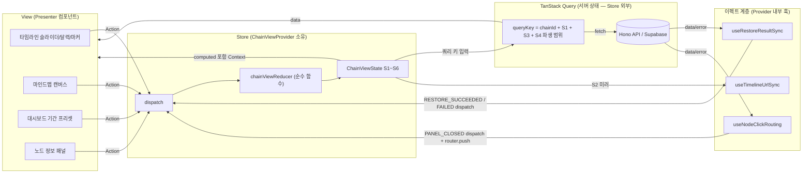
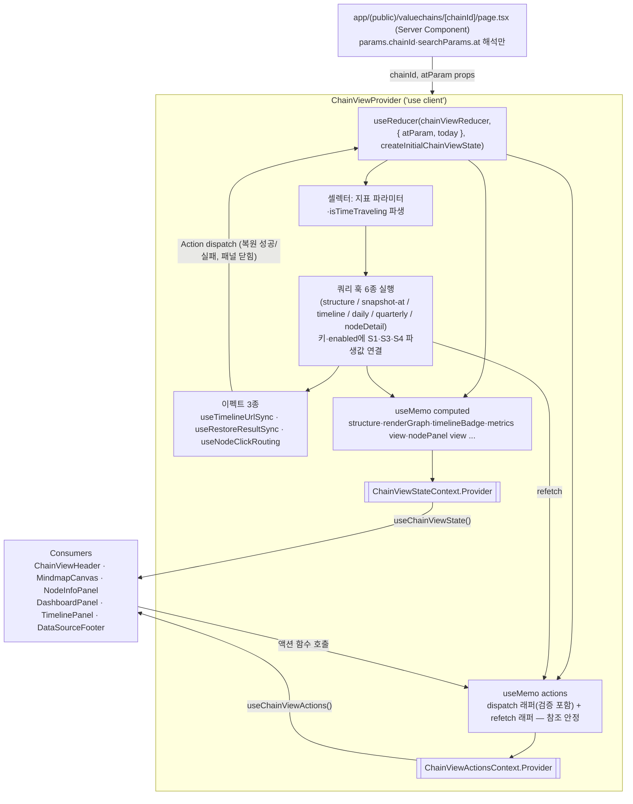

# 밸류체인 뷰 페이지 (chain-view) — 상태 관리 설계 (Level 3: Flux + Context)

> 근거: `docs/pages/chain-view/requirement.md`(§4 상태 정의 — 본 문서는 S1~S6 정의·전환 테이블을 그대로 승계한다), `docs/usecases/009~012/spec.md`, `docs/usecases/000_decisions.md`(C-1~C-8 — spec과 충돌 시 우선), `docs/techstack.md` §1(React 19 + TanStack Query 5, Redux/Zustand 기각 — 클라이언트 상태는 Context + `useReducer`)·§4(features 수직 슬라이스).
> **범위(Level 3)**: 상태 정의(승계) + Flux 패턴(Action/Reducer/View) + **Context 설계**(Provider 데이터 흐름, 노출 인터페이스, 사용 예시)까지.
> 코드는 타입 정의·시그니처 수준까지만 기술한다(컴포넌트 구현 없음). 서버 캐시는 TanStack Query가 단독 소유하며 **reducer에 응답 데이터를 복사 보관하지 않는다.**

---

## 1. 상태 데이터 목록 (requirement §4 승계 요약)

### 1.1 관리해야 할 상태 (Store 소유 — Context + useReducer)

| # | 상태 | 타입 | 초기값 | 비고 |
|---|---|---|---|---|
| S1 | `timeline.selectedDate` | `IsoDate \| null` | URL `?at=` 파싱값(형식/범위 무효 시 `null`) | `null` = 최신. 구조/지표 쿼리 키와 URL의 원천 |
| S2 | `timeline.lastAppliedDate` | `IsoDate \| null` | `null` | 마지막 **복원 성공** 시점 — 실패 시 되돌림 목적지 |
| S3 | `nodePanel.selectedNodeId` | `string \| null` | `null` | 클릭 노드(스냅샷 스코프). 노드 상세 쿼리 키 |
| S4 | `dashboard.range` | `MetricsRange` | `{ kind: 'preset', preset: '1Y' }` (C-5) | 지표 조회 기간. 실제 from/to는 파생 |
| S5 | `canvas.localNodePositions` | `Record<nodeId, NodePosition>` | `{}` | 드래그 로컬 좌표 오버라이드(미저장) |
| S6 | `canvas.collapsedGroupIds` | `readonly string[]` | `[]` | 접힌 그룹 클러스터 |

### 1.2 화면에 보이지만 상태가 아닌 것 (파생 — Store에 두지 않음)

| 데이터 | 원천 | 비고 |
|---|---|---|
| 구조(그룹/노드/엣지)·타임라인 메타·일별/분기 지표·노드 상세 | TanStack Query 캐시 | 서버 상태 6종 쿼리(§6) — reducer 복사 금지 |
| 렌더링용 그래프(좌표 우선순위·자동 레이아웃·접힘 필터) | 활성 구조 데이터 + S5 + S6 | `buildRenderGraph` 순수 함수(§5) |
| 활성 구조 선택(최신 vs 시점 복원)·시점 배지·"최신으로 돌아가기" 노출 | S1 + 쿼리 데이터 | computed(§8.2) |
| URL `?at=` 문자열 | S2 미러(상태→URL 단방향, §7.1) | 별도 저장 없음 |
| 추이 차트 선택 시점 하이라이트 (C-7) | S1 + 지표 시계열 | 재조회 없음(전체 추이 유지) |
| 대시보드 실제 조회 구간(from/to·분기 축) | S4 + 오늘 + `TIMESERIES_MIN_START_DATE` 하한 | 셀렉터(§5) |
| **시세 폴백 표시**(지표 오류 폴백/집계 준비 중/종가 미확정/이월/분기 "미제공") | 지표 쿼리 error·빈 시계열·`annotations.isClosingConfirmed`·`isCarriedForward`·`null` 값 | 전부 파생 — `MetricsPanelView` 판별 유니온(§8.2) |
| 노드 패널 모드(닫힘/로딩/자유주체/폴백/오류) | S3 + 노드 상세 쿼리 status·`nodeKind`·`securityResolved` | `NodePanelView`(§8.2) |
| 데이터 출처·최종 수집 시각, 편집 버튼 노출(`isOwner`) | 구조 쿼리 `dataFreshness`·`chain.isOwner` | |
| 체인 없음 폴백(404 통일 — C-2) | 구조 쿼리 error(404 + 방어적 401/403) | computed |
| 캔버스 줌/팬·드래그 중 실시간 좌표 | React Flow 내부(비제어) 상태 | 드래그 **종료** 시점에만 Action으로 S5 반영 |
| 로그인 여부 | 전역 인증 세션(Supabase) | 페이지 외부 소유 |

---

## 2. Flux 단방향 데이터 흐름



- 흐름은 항상 **View → Action(dispatch) → Reducer → State → (쿼리 키/Context) → View** 한 방향이다. View가 상태를 직접 변경하지 않는다.
- reducer는 부수효과를 수행하지 않는다. 서버 재조회는 상태의 파생값이 **queryKey에 포함**되어 TanStack Query가 자동 수행하고, URL 갱신·라우팅·토스트는 이펙트 계층(§7)이 담당한다.
- 이펙트도 상태를 직접 바꾸지 않고 **Action을 dispatch**한다(외부 사건 → Action이라는 Flux 규칙 유지). 서버 응답 데이터 자체는 reducer로 들어가지 않는다 — 들어가는 것은 "복원이 성공/실패했다"는 사건뿐이다.
- 재시도(`refetch`)는 클라이언트 상태를 바꾸지 않으므로 Action이 아니다(서버 상태 조작 — Query의 책임).

---

## 3. Action 정의

### 3.1 네이밍 컨벤션

- `<도메인>_<사건(과거형)>`의 UPPER_SNAKE_CASE — 명령("하라")이 아닌 사건("일어났다") 서술.
- 판별 유니온(discriminated union), payload는 최소 필드만.

### 3.2 Action 타입

```typescript
// apps/web/src/features/valuechains/state/chain-view.actions.ts
import type { IsoDate, NodePosition, MetricsRange } from '@domain/types';

export type ChainViewAction =
  | { type: 'TIMELINE_DATE_SELECTED'; payload: { date: IsoDate } }
  | { type: 'TIMELINE_RETURNED_TO_LATEST' }
  | { type: 'TIMELINE_RESTORE_SUCCEEDED'; payload: { date: IsoDate | null } }
  | { type: 'TIMELINE_RESTORE_FAILED'; payload: { failedDate: IsoDate } }
  | { type: 'NODE_SELECTED'; payload: { nodeId: string } }
  | { type: 'NODE_PANEL_CLOSED' }
  | { type: 'DASHBOARD_RANGE_CHANGED'; payload: { range: MetricsRange } }
  | { type: 'NODE_DRAG_ENDED'; payload: { nodeId: string; position: NodePosition } }
  | { type: 'GROUP_COLLAPSE_TOGGLED'; payload: { groupId: string } };
```

### 3.3 Action 카탈로그

| Action | 발생 지점 | payload | 의미 |
|---|---|---|---|
| `TIMELINE_DATE_SELECTED` | 슬라이더/달력 선택, 마커 클릭 (행동 F). 액션 래퍼가 dispatch **전에** 범위 1차 검증(미래·2015-01-01 이전 차단 — reducer 순수성 유지) | `{ date }` | 시점이 선택되었다 |
| `TIMELINE_RETURNED_TO_LATEST` | "최신으로 돌아가기" 클릭 (행동 G) | 없음 | 최신 조회로 복귀했다 |
| `TIMELINE_RESTORE_SUCCEEDED` | `useRestoreResultSync` 이펙트 — 구조(최신/시점) 쿼리 성공 시. 최신 구조 성공은 `date: null` | `{ date }` | 해당 시점 복원이 성공했다 |
| `TIMELINE_RESTORE_FAILED` | `useRestoreResultSync` 이펙트 — 시점 복원 쿼리 실패(`SNAPSHOT_NOT_FOUND`/네트워크/서버 오류) 시. 토스트는 이펙트가 dispatch 전에 발화 | `{ failedDate }` | 해당 시점 복원이 실패했다 |
| `NODE_SELECTED` | 노드 클릭 (행동 C) | `{ nodeId }` | 노드가 선택되었다(마지막 클릭 우선은 쿼리 키 교체로 자동 보장 — UC-011 E10) |
| `NODE_PANEL_CLOSED` | 패널 닫기(행동 D), 기업 상세 라우팅 직전(이펙트 §7.3) | 없음 | 노드 선택이 해제되었다 |
| `DASHBOARD_RANGE_CHANGED` | 기간 프리셋(1M/3M/6M/1Y/3Y/MAX)·커스텀 선택 (행동 E) | `{ range }` | 지표 조회 기간이 바뀌었다 |
| `NODE_DRAG_ENDED` | React Flow `onNodeDragStop` (행동 B) | `{ nodeId, position }` | 노드 드래그가 끝났다(로컬 좌표 확정) |
| `GROUP_COLLAPSE_TOGGLED` | 그룹 클러스터 접기/펼치기 토글 (행동 B) | `{ groupId }` | 그룹 접힘이 토글되었다 |

> Action을 만들지 않는 상호작용: 줌/팬·드래그 중 좌표(React Flow 내부 상태), 재시도(`refetch()`), 편집 버튼·체인 없음 폴백의 메인 이동(라우팅), 상장기업 노드의 기업 상세 이동(이펙트가 수행 — §7.3).

---

## 4. Store — State·초기값·Reducer

### 4.1 State 타입과 초기값 팩토리

```typescript
// apps/web/src/features/valuechains/state/chain-view.reducer.ts
import { TIMESERIES_MIN_START_DATE, DASHBOARD_DEFAULT_RANGE } from '@domain/constants';
import type { IsoDate, NodePosition } from '@domain/types';

export type MetricsRangePreset = '1M' | '3M' | '6M' | '1Y' | '3Y' | 'MAX';
export type MetricsRange =
  | { kind: 'preset'; preset: MetricsRangePreset }
  | { kind: 'custom'; from: IsoDate; to: IsoDate };

export interface ChainViewState {
  readonly timeline: {
    readonly selectedDate: IsoDate | null;      // S1
    readonly lastAppliedDate: IsoDate | null;   // S2
  };
  readonly nodePanel: {
    readonly selectedNodeId: string | null;     // S3
  };
  readonly dashboard: {
    readonly range: MetricsRange;               // S4 (초기값 DASHBOARD_DEFAULT_RANGE = 1Y 프리셋, C-5)
  };
  readonly canvas: {
    readonly localNodePositions: Readonly<Record<string, NodePosition>>; // S5
    readonly collapsedGroupIds: readonly string[];                        // S6
  };
}

/** URL ?at= 원본을 검증·파싱 — YYYY-MM-DD 형식 + [TIMESERIES_MIN_START_DATE, today] 범위, 무효 시 null */
export function parseAtParam(raw: string | null, today: IsoDate): IsoDate | null;

/** 초기 상태 팩토리 — "오늘"(Asia/Seoul, C-6)은 순수성 유지를 위해 인자로 주입 */
export function createInitialChainViewState(input: {
  atParam: string | null;
  today: IsoDate;
}): ChainViewState;
```

### 4.2 Reducer 시그니처와 전이 규칙

```typescript
export function chainViewReducer(
  state: ChainViewState,
  action: ChainViewAction,
): ChainViewState;
```

| Action | 전이 규칙 (requirement §4.5 전환 테이블과 1:1 대응) |
|---|---|
| `TIMELINE_DATE_SELECTED` | `payload.date === selectedDate`면 기존 state 반환(no-op). 아니면 `selectedDate ← date` **+ S3 ← null, S5 ← {}, S6 ← []** 동시 초기화(스냅샷 스코프 변경으로 무효). S2·S4는 유지 |
| `TIMELINE_RETURNED_TO_LATEST` | `selectedDate === null`이면 no-op. 아니면 `selectedDate ← null` + S3·S5·S6 초기화. S4 유지 |
| `TIMELINE_RESTORE_SUCCEEDED` | **경합 가드**: `payload.date !== selectedDate`면 기존 state 반환(뒤늦게 도착한 이전 시점 결과 무시). 일치하면 `lastAppliedDate ← payload.date` |
| `TIMELINE_RESTORE_FAILED` | **경합 가드**: `payload.failedDate !== selectedDate`면 no-op. 일치하면 `selectedDate ← lastAppliedDate`(직전 성공 시점으로 되돌림 — 직전 화면 유지의 근거). S5·S6은 초기화된 채 유지 |
| `NODE_SELECTED` | `selectedNodeId ← payload.nodeId` (동일 노드 재클릭이면 기존 state 반환) |
| `NODE_PANEL_CLOSED` | `selectedNodeId ← null` (멱등) |
| `DASHBOARD_RANGE_CHANGED` | `range ← payload.range` (동등 값이면 기존 state 반환 — 불필요 리렌더·재조회 방지) |
| `NODE_DRAG_ENDED` | `localNodePositions[nodeId] ← position` (새 객체 병합) |
| `GROUP_COLLAPSE_TOGGLED` | `collapsedGroupIds`에 있으면 제거, 없으면 추가 |
| 그 외 | `never` 소진 검사(exhaustive check)로 컴파일 타임 누락 방지 |

**순수성 규칙**: reducer는 인자만으로 결과가 결정된다. `Date.now()`·fetch·라우터·토스트 접근 금지, 기존 state 변이 금지(항상 새 객체). 날짜 검증·"오늘" 계산은 액션 래퍼/이펙트/셀렉터 인자 주입으로 밀어낸다. 따라서 `(이전 상태, Action) → 기대 상태` 단위 테스트(Vitest)가 렌더링 없이 가능하다(§12).

---

## 5. 셀렉터·파생 계산 (순수 함수 — 상태 아님)

```typescript
// apps/web/src/features/valuechains/state/chain-view.selectors.ts
import { TIMESERIES_MIN_START_DATE } from '@domain/constants';

/** S1 → 과거 시점 조회 중 여부 */
export function selectIsTimeTraveling(state: ChainViewState): boolean; // selectedDate !== null

/** S4 → 일별 지표 API 파라미터. from은 TIMESERIES_MIN_START_DATE 하한 클램프, to는 오늘 상한 보정 (UC-010 E8·E11) */
export function selectDailyMetricsParams(
  range: MetricsRange,
  today: IsoDate,
): { from: IsoDate; to: IsoDate };

/** S4 → 분기 지표 API 파라미터 (역년 정규화 축, 하한 2015Q1) */
export function selectQuarterlyMetricsParams(
  range: MetricsRange,
  today: IsoDate,
): { fromYear: number; fromQuarter: number; toYear: number; toQuarter: number };

/**
 * 렌더링용 그래프 조립 — 좌표 우선순위: S5 오버라이드 > 서버 position > 자동 레이아웃(UC-009 E11).
 * 접힌 그룹(S6)의 소속 노드·해당 노드로 이어지는 엣지는 숨기고 클러스터 요약(노드 수 표기)만 남긴다(UC-009 E4).
 * 빈 그룹은 라벨만 있는 빈 클러스터로 유지한다(C-1).
 */
export function buildRenderGraph(input: {
  structure: SnapshotStructure;                              // 활성 구조 쿼리 데이터
  localPositions: Readonly<Record<string, NodePosition>>;    // S5
  collapsedGroupIds: readonly string[];                      // S6
}): RenderGraph; // { nodes: RenderNode[]; edges: RenderEdge[]; groups: RenderGroup[] }
```

셀렉터 결과(`from/to`, 분기 축)는 그대로 **queryKey의 일부**가 된다 — 상태 변경이 서버 재조회로 이어지는 유일한 연결 고리다.

---

## 6. 서버 상태 계층 (TanStack Query — Store 외부, 연결 계약만 정의)

```typescript
// apps/web/src/features/valuechains/hooks/chain-view-query-keys.ts
export const chainViewQueryKeys = {
  structure: (chainId: string) => ['valuechains', chainId, 'structure'] as const,
  snapshotAt: (chainId: string, date: IsoDate) => ['valuechains', chainId, 'snapshot-at', date] as const,
  timeline: (chainId: string) => ['valuechains', chainId, 'timeline'] as const,
  dailyMetrics: (chainId: string, p: { from: IsoDate; to: IsoDate; at: IsoDate | null }) =>
    ['valuechains', chainId, 'metrics', 'daily', p] as const,
  quarterlyMetrics: (chainId: string, p: QuarterlyParams & { at: IsoDate | null }) =>
    ['valuechains', chainId, 'metrics', 'quarterly', p] as const,
  nodeDetail: (chainId: string, nodeId: string) => ['valuechains', chainId, 'nodes', nodeId] as const,
};
```

```typescript
// apps/web/src/features/valuechains/hooks/*.ts — 쿼리 훅 시그니처
function useChainStructure(chainId: string, options: { enabled: boolean }): UseQueryResult<ChainStructureResponse, ApiError>;
function useChainSnapshotAt(chainId: string, date: IsoDate | null): UseQueryResult<SnapshotAtResponse, ApiError>;
function useChainTimeline(chainId: string): UseQueryResult<TimelineMetaResponse, ApiError>;
function useChainDailyMetrics(chainId: string, params: { from: IsoDate; to: IsoDate; at: IsoDate | null }): UseQueryResult<DailyMetricsResponse, ApiError>;
function useChainQuarterlyMetrics(chainId: string, params: QuarterlyParams & { at: IsoDate | null }): UseQueryResult<QuarterlyMetricsResponse, ApiError>;
function useChainNodeDetail(chainId: string, nodeId: string | null): UseQueryResult<NodeDetailResponse, ApiError>;
```

| 훅 | 쿼리 키 입력 | enabled | 주요 옵션·비고 |
|---|---|---|---|
| `useChainStructure` | chainId | `selectedDate === null` | 행동 G의 캐시 재사용을 위해 페이지 체류 중 staleTime 유지. 404(+방어적 401/403)는 재시도 없음(C-2) |
| `useChainSnapshotAt` | chainId + S1 | `selectedDate !== null` | `placeholderData: keepPreviousData` — 로딩 중 직전 시점 구조 유지(빈 화면 금지). `SNAPSHOT_NOT_FOUND`(404)는 retry 없음 |
| `useChainTimeline` | chainId | 항상 | 마커(`effectiveAt` 목록) + 선택 가능 범위 |
| `useChainDailyMetrics` | chainId + S4 파생 + S1(`at`) | 항상 | `keepPreviousData`로 기간·시점 전환 시 차트 깜빡임 방지. 실패는 지표 패널만 폴백(행동 H) |
| `useChainQuarterlyMetrics` | chainId + S4 파생 + S1(`at`) | 항상 | 위와 동일 |
| `useChainNodeDetail` | chainId + S3 | `selectedNodeId !== null` | 키에 nodeId 포함 → 빠른 연속 클릭 시 마지막 클릭 쿼리만 관찰(UC-011 E10) |

- 3계열(구조/타임라인/지표)은 **독립 실패** 처리한다(행동 A·H) — 각 쿼리의 error가 서로 다른 영역 폴백으로만 파생된다.
- 시점 복원 응답(`snapshot-at`)에도 해당 일자 지표가 포함되지만, **지표 패널의 단일 원천은 일별/분기 지표 쿼리**(`at` 파라미터 포함)로 통일한다 — 이중 원천으로 인한 표시 불일치를 방지한다. `snapshot-at`의 metrics는 사용하지 않는다(구조·`snapshot.effectiveAt`만 사용).

---

## 7. 이펙트 계층 (Provider 내부 — reducer 밖의 부수효과 전담)

### 7.1 `useTimelineUrlSync` — 상태 → URL 단방향 동기화

```typescript
// apps/web/src/features/valuechains/hooks/effects/useTimelineUrlSync.ts
export function useTimelineUrlSync(input: {
  lastAppliedDate: IsoDate | null;   // S2 — URL은 S2의 미러
  hasRestoreConcluded: boolean;      // 구조 쿼리(최신/시점) 최초 1회 성공/실패 확정 여부 (쿼리 상태에서 파생)
}): void;
```

- **URL `?at=`는 S1이 아니라 S2(lastAppliedDate)를 미러**한다. 복원 **성공 시에만** URL이 `?at=D`로 갱신되고(행동 F.3), 실패 시 URL은 변경된 적이 없으므로 자동으로 "원복"된다(행동 F.4).
- `hasRestoreConcluded === false`(딥링크 최초 진입, 복원 미확정) 동안은 동기화를 보류해 URL의 `?at=`을 보존한다 — 확정 후 성공이면 그대로, 실패면 S2(=null) 기준으로 제거된다.
- `router.replace` 사용(히스토리 오염 방지 — 시점 탐색이 뒤로가기 스택을 늘리지 않음). 뒤로가기는 이전 페이지로 이동하므로 상태↔URL 충돌이 없다.

### 7.2 `useRestoreResultSync` — 구조 쿼리 결과 → Action 변환

```typescript
export function useRestoreResultSync(input: {
  selectedDate: IsoDate | null;                                   // S1
  latestQuery: UseQueryResult<ChainStructureResponse, ApiError>;
  snapshotAtQuery: UseQueryResult<SnapshotAtResponse, ApiError>;
  dispatch: Dispatch<ChainViewAction>;
  notifyRestoreFailure: (kind: 'snapshot-not-found' | 'error') => void; // 토스트(일회성 UI — 상태 아님)
}): void;
```

- 최신 구조 쿼리 성공 && S1 === null → `TIMELINE_RESTORE_SUCCEEDED { date: null }`.
- 시점 복원 쿼리(date=D) 성공 && S1 === D → `TIMELINE_RESTORE_SUCCEEDED { date: D }`.
- 시점 복원 쿼리(date=D) 실패 && S1 === D → `notifyRestoreFailure`(`SNAPSHOT_NOT_FOUND`는 "이전 스냅샷 없음", 그 외 오류 안내 + 재시도) 후 `TIMELINE_RESTORE_FAILED { failedDate: D }`.
- 이펙트는 현재 키의 쿼리만 관찰하고 reducer의 경합 가드(§4.2)가 이중 방어한다 — D1 선택 직후 D2로 바꾼 경우 D1 결과는 무시된다.

### 7.3 `useNodeClickRouting` — 노드 상세 결과 → 분기 라우팅

```typescript
export function useNodeClickRouting(input: {
  selectedNodeId: string | null;                              // S3
  nodeDetailQuery: UseQueryResult<NodeDetailResponse, ApiError>;
  selectedDate: IsoDate | null;                               // S1 — 시점 컨텍스트 전달용
  dispatch: Dispatch<ChainViewAction>;
  router: AppRouterInstance;
}): void;
```

- 노드 상세 성공 && `nodeKind === 'listed_company'` && `securityResolved === true`일 때만 동작: `dispatch({ type: 'NODE_PANEL_CLOSED' })` 후 `router.push('/companies/{ticker}' + (selectedDate ? '?asOf=' + selectedDate : ''))`.
  - `?asOf=`는 기업 상세 페이지의 시점 컨텍스트 안내 계약(`docs/pages/company-detail` — URL `asOf` + 안내 배너)과 정합한다(UC-011 E3).
  - 상장폐지/정지 종목도 이동은 허용하고 `listingStatus`는 기업 상세에서 배지 표시한다(UC-011 E4).
- `free_subject`·`securityResolved === false`·오류는 라우팅하지 않는다 — 패널 표시는 computed(`NodePanelView`)가 파생 처리한다.

---

## 8. Context 설계

### 8.1 Provider 데이터 흐름 (Provider → useReducer → effects → consumers)



데이터 로드·관리 흐름: **Provider가 유일하게** useReducer와 쿼리 훅을 소유한다 → 상태(S1·S3·S4 파생)가 쿼리 키를 구동해 서버 데이터를 불러온다 → 이펙트가 쿼리 결과를 관찰해 사건 Action을 되돌려 보내거나 URL/라우팅을 수행한다 → computed가 상태+캐시를 화면 단위 뷰모델로 파생한다 → consumer는 두 개의 훅으로만 읽고 호출한다. Consumer가 dispatch·쿼리 훅·라우터를 직접 만지는 일은 없다.

### 8.2 노출 인터페이스

```typescript
// apps/web/src/features/valuechains/context/chain-view-context.ts
import type { IsoDate, NodePosition } from '@domain/types';

// ── computed 뷰모델 타입 (판별 유니온 — 로딩/오류/폴백을 렌더 분기로 강제) ──

/** 활성 구조(최신 vs 시점 복원 자동 선택) */
export type StructureView =
  | { status: 'loading' }                       // 초회 로딩(표시할 직전 구조 없음)
  | { status: 'not-found' }                     // 404 + 방어적 401/403 → "체인 없음" 폴백, 메인 유도 (C-2)
  | { status: 'error' }                         // 500 등 → 캔버스 영역 오류 폴백 + 재시도 (행동 H)
  | {
      status: 'ready';
      data: SnapshotStructure;                  // 그룹/노드/엣지 + 좌표 (서버 캐시 참조 — 복사 아님)
      snapshotEffectiveAt: string;              // 기준 스냅샷 시각 (ISO datetime)
      isRestoring: boolean;                     // 시점 전환 로딩 중 직전 구조 표시 상태(행동 F.5)
    };

/** 시점 조회 중 배지 — null = 최신 조회(배지 없음) */
export interface TimelineBadge {
  selectedDate: IsoDate;
  snapshotEffectiveAt: string;
}

export type TimelineMetaView =
  | { status: 'loading' }
  | { status: 'error' }                         // 타임라인 영역만 폴백(구조·지표와 독립)
  | {
      status: 'ready';
      range: { minDate: IsoDate; maxDate: IsoDate };            // 2015-01-01 ~ 오늘 (C-6)
      markers: readonly SnapshotMarker[];                        // { snapshotId, effectiveAt, changeSource }
    };

/** 지표 패널 뷰모델 — 시세 폴백 표시의 단일 계약 */
export type MetricsPanelView<TCurrent, TPoint> =
  | { status: 'loading' }
  | { status: 'error' }                         // 지표 패널만 오류 폴백 + 재시도 (시세 폴백 원칙, 행동 H)
  | { status: 'empty' }                         // 빈 시계열 — "집계 준비 중" (0과 구분, UC-010 E12)
  | {
      status: 'ready';
      current: TCurrent | null;                 // null = 미산출/"미제공" 표기 (0과 구분 — C-8)
      series: readonly TPoint[];                // 거래일만 (isCarriedForward 플래그 포함)
      highlightedDate: IsoDate | null;          // C-7: 전체 추이 유지 + 선택 시점 하이라이트
      annotations: DailyAnnotations | QuarterlyAnnotations;
      // Daily: baseCurrency·fxBasis·sharesAsOfDateMin/Max(C-4)·isClosingConfirmed(종가 미확정 표기)
      // Quarterly: baseCurrency·fxBasis·revenueOverlapNotice(매출 중복 안내)
    };

export type DailyMetricsView = MetricsPanelView<DailyMetricCurrent, DailyMetricPoint>;
export type QuarterlyMetricsView = MetricsPanelView<QuarterlyMetricCurrent, QuarterlyMetricPoint>;

/** 노드 정보 패널 뷰모델 */
export type NodePanelView =
  | { status: 'closed' }
  | { status: 'loading'; nodeId: string }
  | { status: 'error'; nodeId: string }                          // 패널 영역만 폴백 + 재시도 (UC-011 E9)
  | { status: 'free-subject'; data: { name: string; subjectType: SubjectType; memo: string | null; groupName: string | null } }
  | { status: 'security-fallback'; nodeId: string }              // securityResolved=false — 이동 불가 안내 (UC-011 E1)
  | { status: 'routing' };                                       // 상장기업 해석 성공 — 라우팅 이펙트 처리 중(과도 상태)

// ── Context value ──

export interface ChainViewStateValue {
  chainId: string;

  // reducer 원천 상태 (S1~S6 — S2는 내부용이라 비노출)
  selectedDate: IsoDate | null;                                  // S1
  dashboardRange: MetricsRange;                                  // S4
  selectedNodeId: string | null;                                 // S3
  localNodePositions: Readonly<Record<string, NodePosition>>;    // S5
  collapsedGroupIds: readonly string[];                          // S6

  // computed (상태 + 서버 캐시 파생)
  isTimeTraveling: boolean;                                      // S1 !== null — "최신으로 돌아가기" 노출 조건
  structure: StructureView;
  renderGraph: RenderGraph | null;                               // structure ready일 때만 (buildRenderGraph 결과)
  timelineMeta: TimelineMetaView;
  timelineBadge: TimelineBadge | null;
  dailyMetrics: DailyMetricsView;
  quarterlyMetrics: QuarterlyMetricsView;
  nodePanel: NodePanelView;
  dataFreshness: DataFreshnessView | null;                       // 출처 + 잡별 최종 수집 시각 (C-3, 없으면 "수집 전")
  isOwner: boolean;                                              // 편집 버튼 노출 (구조 쿼리 chain.isOwner)
}

export interface ChainViewActionsValue {
  /** 시점 선택 — dispatch 전에 [minDate, today] 범위 검증, 무효 선택은 무시 (행동 F.1) */
  selectTimelineDate(date: IsoDate): void;
  /** 최신으로 복귀 — ?at= 제거는 URL 동기화 이펙트가 수행 (행동 G) */
  returnToLatest(): void;
  selectNode(nodeId: string): void;
  closeNodePanel(): void;
  changeDashboardRange(range: MetricsRange): void;
  /** React Flow onNodeDragStop에서 호출 — 로컬 표시용, 서버 저장 없음 (행동 B) */
  commitNodeDrag(nodeId: string, position: NodePosition): void;
  toggleGroupCollapse(groupId: string): void;

  // 서버 상태 재시도 (refetch 래퍼 — Action 아님, 행동 H)
  retryStructure(): void;
  retryDailyMetrics(): void;
  retryQuarterlyMetrics(): void;
  retryNodeDetail(): void;
}
```

```typescript
// Provider·훅 시그니처
export interface ChainViewProviderProps {
  chainId: string;
  atParam: string | null;    // Server Component가 해석한 searchParams.at 원본
  children: ReactNode;
}
export function ChainViewProvider(props: ChainViewProviderProps): ReactElement;

/** Provider 외부에서 호출 시 명시적 Error throw */
export function useChainViewState(): ChainViewStateValue;
export function useChainViewActions(): ChainViewActionsValue;
```

### 8.3 Context 분리와 성능

- **State/Actions 컨텍스트 2분할**: `ChainViewActionsValue`는 `dispatch`·`refetch` 참조만 의존하는 `useMemo`로 만들어 **참조가 불변**이다 — 액션만 쓰는 컴포넌트(예: "최신으로 돌아가기" 버튼)는 상태 변경에 리렌더되지 않는다.
- `ChainViewStateValue`는 `useMemo`로 조립하되, `renderGraph`·지표 뷰모델 등 비싼 파생은 입력(쿼리 data 참조 + S5·S6)별로 개별 `useMemo` 처리한다.
- 줌/팬·드래그 중 좌표는 React Flow 비제어 상태로 두어 고빈도 이벤트가 Context를 통과하지 않게 한다(드래그 종료 시 1회만 Action).

### 8.4 사용 예시 (consumer — 시그니처 수준)

```tsx
// 페이지 셸: app/(public)/valuechains/[chainId]/page.tsx (Server Component)
export default async function Page({ params, searchParams }: {
  params: Promise<{ chainId: string }>;
  searchParams: Promise<{ at?: string }>;
}) {
  const { chainId } = await params;
  const { at } = await searchParams;
  return (
    <ChainViewProvider chainId={chainId} atParam={at ?? null}>
      <ChainViewHeader />
      <MindmapCanvas />
      <NodeInfoPanel />
      <DashboardPanel />
      <TimelinePanel />
      <DataSourceFooter />
    </ChainViewProvider>
  );
}
```

```tsx
// 예시 1 — TimelinePanel (Presenter): 상태·액션을 훅으로만 소비
function TimelinePanel() {
  const { timelineMeta, selectedDate, isTimeTraveling, timelineBadge } = useChainViewState();
  const { selectTimelineDate, returnToLatest } = useChainViewActions();

  // timelineMeta.status 분기: loading 스켈레톤 / error 영역 폴백 / ready →
  //   슬라이더·달력(range 제한) + 스냅샷 마커 렌더, 선택 시 selectTimelineDate(date)
  // isTimeTraveling이면 timelineBadge(선택 날짜·기준 스냅샷 시각) + "최신으로 돌아가기"(returnToLatest) 표시
}

// 예시 2 — MindmapCanvas: 렌더 그래프 소비 + 캔버스 사건을 액션으로 변환
function MindmapCanvas() {
  const { structure, renderGraph } = useChainViewState();
  const { selectNode, commitNodeDrag, toggleGroupCollapse, retryStructure } = useChainViewActions();

  // structure.status 분기: loading / not-found(체인 없음 → 메인 유도) / error(폴백 + retryStructure)
  //   / ready → <ReactFlow nodes={renderGraph.nodes} edges={renderGraph.edges}
  //               onNodeClick={(_, n) => selectNode(n.id)}
  //               onNodeDragStop={(_, n) => commitNodeDrag(n.id, n.position)} />
  //   structure.isRestoring이면 캔버스 위 로딩 인디케이터(직전 구조는 계속 표시)
}
```

---

## 9. 컴포넌트 트리 (View 연결)

```
app/(public)/valuechains/[chainId]/page.tsx   # Server Component: params/searchParams 해석만
└─ ChainViewProvider ('use client')           # Store(useReducer) + 쿼리 6종 + 이펙트 3종 + Context 2종 (Container)
   ├─ ChainViewHeader                         # 체인명·시점 배지·"최신으로 돌아가기"·편집 버튼(isOwner)
   ├─ MindmapCanvas                           # React Flow — renderGraph 렌더, 클릭/드래그/접기 사건 → 액션
   ├─ NodeInfoPanel                           # nodePanel 뷰모델 분기(자유주체/폴백/오류/로딩)
   ├─ DashboardPanel
   │   ├─ MetricsRangeSelector                # dashboardRange + changeDashboardRange
   │   ├─ DailyMetricsChart                   # dailyMetrics 뷰모델 (recharts, 하이라이트·이월·미확정 표기)
   │   └─ QuarterlyMetricsChart               # quarterlyMetrics 뷰모델 ("미제공"·제외 기업 수·중복 안내)
   ├─ TimelinePanel                           # 슬라이더/달력 + 스냅샷 마커
   └─ DataSourceFooter                        # dataFreshness (출처·최종 수집 시각)
```

모든 하위 컴포넌트는 Presenter다 — `useChainViewState()`/`useChainViewActions()` 두 훅 외의 데이터 접근(쿼리 훅 직접 호출, dispatch 직접 사용, 라우터 조작)을 하지 않는다.

---

## 10. 대표 흐름 시나리오 (Action → Store → Effects → View)

### 10.1 시점 선택 성공 (행동 F)
1. 슬라이더에서 D 선택 → `selectTimelineDate(D)`(범위 검증 통과) → `TIMELINE_DATE_SELECTED` → S1=D, S3/S5/S6 초기화.
2. `useChainSnapshotAt` 활성(키=D) — 로딩 중 `keepPreviousData` + `structure.isRestoring=true`로 직전 구조 유지.
3. 성공 → 이펙트가 `TIMELINE_RESTORE_SUCCEEDED { date: D }` → S2=D → URL 동기화 이펙트가 `?at=D`로 replace.
4. computed 재파생: renderGraph(스냅샷 좌표), timelineBadge 표시, 지표 쿼리(`at=D`) 재키잉으로 현재값 교체, 추이 차트는 전체 유지 + D 하이라이트(C-7).

### 10.2 시점 선택 실패 — 첫 스냅샷 이전 (행동 F.4)
1. S1=D로 전환, `snapshot-at` 404 `SNAPSHOT_NOT_FOUND`.
2. 이펙트가 "이전 스냅샷 없음" 토스트 발화 후 `TIMELINE_RESTORE_FAILED { failedDate: D }` → S1 ← S2(직전 성공 시점).
3. URL은 S2 미러이므로 변경된 적 없음(원복 불필요). 직전 화면 그대로 유지.

### 10.3 딥링크 진입 (`?at=D`) (행동 A.4)
1. Server Component가 `atParam=D` 전달 → `createInitialChainViewState`가 S1=D(무효면 null)로 시작 — 최초부터 시점 복원 흐름.
2. URL 동기화는 `hasRestoreConcluded=false` 동안 보류(`?at=` 보존). 성공 시 S2=D(URL 그대로), 실패 시 S1←S2=null → 최신 조회 + `?at=` 제거.

### 10.4 노드 클릭 — 상장기업 (행동 C)
1. `selectNode(n1)` → S3=n1 → `useChainNodeDetail` 발화, `nodePanel.status='loading'`.
2. 성공(`listed_company`+`securityResolved`) → 라우팅 이펙트가 `NODE_PANEL_CLOSED` dispatch 후 `/companies/{ticker}?asOf=D`(시점 조회 중일 때) push.
3. `free_subject`면 정보 패널, `securityResolved=false`면 폴백 패널, 오류면 패널 폴백+`retryNodeDetail` — 전부 computed 분기, 라우팅 없음.

### 10.5 기간 변경 (행동 E) / 최신 복귀 (행동 G)
- `changeDashboardRange({kind:'preset',preset:'3M'})` → S4 변경 → 셀렉터가 하한 보정된 from/to 재계산 → 지표 쿼리 키 변경 → 자동 재조회.
- `returnToLatest()` → S1=null + S3/S5/S6 초기화 → 최신 구조 쿼리(캐시 히트 시 즉시) → 성공 이펙트로 S2=null → URL `?at=` 제거, 배지 제거.

---

## 11. 파일 배치 (techstack §4 컨벤션)

```
apps/web/src/features/valuechains/
├── state/
│   ├── chain-view.actions.ts        # ChainViewAction 유니온
│   ├── chain-view.reducer.ts        # State 타입·parseAtParam·초기값 팩토리·reducer(순수)
│   ├── chain-view.selectors.ts      # 지표 파라미터·buildRenderGraph 등 파생(순수)
│   └── chain-view.reducer.test.ts   # Vitest 단위 테스트 (렌더링 불필요)
├── context/
│   ├── chain-view-context.ts        # Context 2종 정의 + useChainViewState/useChainViewActions
│   └── ChainViewProvider.tsx        # useReducer + 쿼리 + 이펙트 + computed 조립 (Container)
├── hooks/
│   ├── chain-view-query-keys.ts
│   ├── useChainStructure.ts / useChainSnapshotAt.ts / useChainTimeline.ts
│   ├── useChainDailyMetrics.ts / useChainQuarterlyMetrics.ts / useChainNodeDetail.ts
│   └── effects/
│       ├── useTimelineUrlSync.ts
│       ├── useRestoreResultSync.ts
│       └── useNodeClickRouting.ts
└── components/                      # §9 Presenter들 (로직 없음)

packages/domain/constants/           # TIMESERIES_MIN_START_DATE('2015-01-01'), DASHBOARD_DEFAULT_RANGE(1Y 프리셋),
                                     # METRICS_RANGE_PRESETS, 타임라인 날짜 경계(Asia/Seoul, C-6) 상수
```

---

## 12. 테스트 전략 (reducer·셀렉터 — React 비의존 순수 모듈)

| # | 시나리오 (AAA) | 기대 |
|---|---|---|
| 1 | `parseAtParam('2026-05-02', today)` / 형식 오류·미래·2015 이전 | 유효 날짜 / `null` |
| 2 | S5·S6·S3가 채워진 상태에서 `TIMELINE_DATE_SELECTED(D)` | S1=D + S3=null·S5={}·S6=[] 동시 초기화, S2·S4 불변 |
| 3 | S1=D 상태에서 동일 D `TIMELINE_DATE_SELECTED` | 기존 state 참조 그대로 반환(no-op) |
| 4 | `TIMELINE_RESTORE_SUCCEEDED { date: D }` (S1=D) | S2=D |
| 5 | `TIMELINE_RESTORE_SUCCEEDED { date: D1 }` (S1=D2 — 경합) | 기존 state 반환(무시) |
| 6 | `TIMELINE_RESTORE_FAILED { failedDate: D }` (S1=D, S2=D0) | S1=D0 (되돌림) |
| 7 | `TIMELINE_RESTORE_FAILED` 경합(failedDate ≠ S1) | 기존 state 반환 |
| 8 | `TIMELINE_RETURNED_TO_LATEST` | S1=null + S3/S5/S6 초기화 |
| 9 | `NODE_DRAG_ENDED` 2회 후 `GROUP_COLLAPSE_TOGGLED` 토글 왕복 | S5 병합 누적 / S6 추가→제거, 원본 비변이(새 객체) |
| 10 | `selectDailyMetricsParams({preset:'MAX'}, today)` | from=`TIMESERIES_MIN_START_DATE` 클램프, to=today |
| 11 | `buildRenderGraph` — position null 노드 / 접힌 그룹 / 빈 그룹 | 자동 레이아웃 폴백 / 소속 노드·엣지 숨김+요약 / 라벨만 있는 빈 클러스터(C-1) |
| 12 | 모든 액션에서 입력 state 비변이(immutability) | 원본 참조 불변 |

- 이펙트 훅 3종은 mock router·mock 쿼리 결과 기반 훅 테스트로 별도 검증(성공/실패/경합·URL 보류 조건).
- 컴포넌트 상호작용·E2E는 구현 단계(plan.md) 범위.
