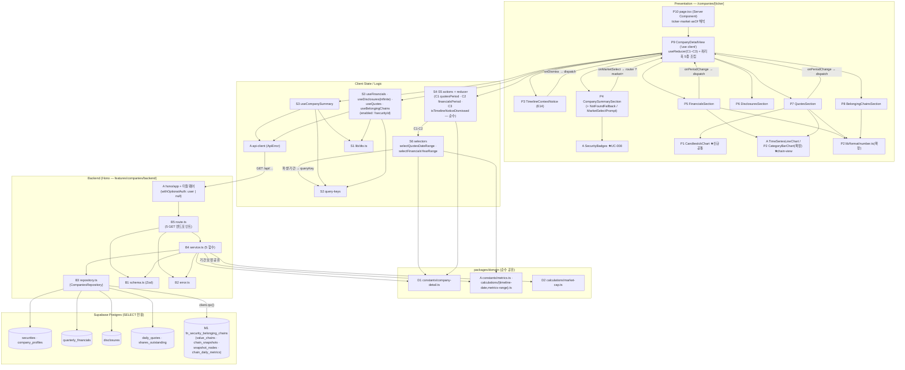

# Plan: 기업 상세 페이지 (company-detail)

> 경로: `/companies/[ticker]` (+ `?market=KRX|US` 시장 구분, `?asOf=YYYY-MM-DD` 시점 컨텍스트) — `(public)` 그룹, 비로그인 열람 가능.
>
> 근거 문서: `docs/pages/company-detail/requirement.md`(섹션 S1~S6·행동 2.1~2.7·상태 C1~C3), `docs/pages/company-detail/state_management.md`(**Level 2 Flux — 본 plan은 이 설계를 그대로 구현 단위로 옮긴다. Context 미도입, `useReducer`를 Container에서 직접 사용**), `docs/usecases/020/spec.md` + `docs/usecases/020/plan.md`(유스케이스 상세 plan — 본 plan이 페이지 수준에서 확정·통합), `docs/usecases/000_decisions.md`(B-5·B-6·C-5 — spec과 충돌 시 우선), `docs/techstack.md`(§4 Codebase Structure — SOT), `docs/database.md`, `.claude/skills/spec_to_plan/references/hono-backend-guide.md`, `docs/pages/chain-view/plan.md`·`docs/pages/main-explore/plan.md`(공통 모듈 선행 정의).
>
> **페이지 성격**: 조회 전용(사이드이펙트 없음 — 전 구간 SELECT, UC-020 §6.4). 서버 상태는 TanStack Query 5가 단독 소유(공시 목록은 `useInfiniteQuery`), 클라이언트 상태는 **`useReducer` 3필드(C1~C3)뿐**이다. 섹션 S2~S5는 독립적으로 로드·실패한다(E8·E16 — 한 섹션 오류가 페이지 전체로 확산 금지). 캔들차트는 `lightweight-charts`, 시총 추이·분기 재무 그래프는 `recharts`.
>
> **외부 서비스 연동**: **없음.** UC-020 spec §6.5 명시 — 화면의 모든 데이터는 배치(UC-026~028·031)가 사전 적재한 자체 DB에서만 읽으며 요청 시점 외부 API 호출이 없다. `docs/external/*`(OpenDART/SEC EDGAR/토스증권) 클라이언트 모듈은 워커(배치) plan 범위이므로 본 계획에 포함하지 않는다. 공시 원문 링크는 저장된 `disclosures.url`을 새 창으로 열 뿐(서버 프록시 없음)이다.
>
> **확정 결정 반영(000_decisions)**: **B-5**(폐지/정지 종목 접근 차단 없음 — 상태 배지 + 과거 데이터 표시), **B-6**(`/companies/[ticker]` 유지, 티커 충돌 시 `?market=` 쿼리 구분 — 시장 구분은 URL이 소유), **C-5 준용**(주가/시총 기본 조회 기간 = 최근 1년, `QUOTES_DEFAULT_PERIOD='1Y'` 상수).
>
> **코드베이스 현황**: `apps/`·`packages/` 스캐폴드 부재(마이그레이션 0001~0012만 존재). 본 plan의 경로는 전부 techstack §4 기준 신규 생성이며 기존 코드와 충돌 없음. 단 **선행 page plan(chain-view·main-explore)과 UC-020 plan 사이에 공통 모듈 위치·명명 경합**이 있어 §충돌 조정에서 단일 기준을 확정한다 — 구현자는 그 기준을 따르고, UC-020 plan의 해당 표기는 본 문서가 대체한다.

---

## 개요

### A. 공통/선행 모듈 (타 plan 정의 — 위치 참조만, 재정의·수정 금지)

| 모듈 | 위치 | 정의 plan | 본 페이지에서의 사용 |
| --- | --- | --- | --- |
| HTTP Result 헬퍼 | `apps/web/src/backend/http/response.ts` | chain-view I1 | `HandlerResult`/`success`/`failure`/`respond` 봉투 |
| Hono 앱·미들웨어 | `apps/web/src/backend/hono/*`, `backend/middleware/*` | chain-view I2~I4 | `errorBoundary → withAppContext → withSupabase → withOptionalAuth` 체인 통과 + `registerCompaniesRoutes(app)` 1줄 등록. `withOptionalAuth`는 S5 노출 범위(세션 유무) 판정의 전제 |
| FE API 클라이언트 | `apps/web/src/lib/http/api-client.ts` | chain-view I5 (§충돌 조정 R1) | 봉투 언랩·`ApiError{status,code,message}` — 404/409 폴백 분기 |
| React Query Provider | `apps/web/src/lib/react-query/query-provider.tsx` | chain-view I6 | 전역 캐시 |
| 경로 빌더 | `apps/web/src/lib/routes.ts` | chain-view I7 | `buildCompanyDetailPath({ticker,market,asOf})` — 본 페이지 진입 URL 계약의 **발신측**(UC-011). 본 plan은 `?market=`/`?asOf=`를 **읽기만** 하고 파라미터 이름을 변경하지 않는다 |
| 숫자 포맷터 | `apps/web/src/lib/format/number.ts` | chain-view I8 (§충돌 조정 R2) | `formatKrw` 계열 + 본 plan이 `formatCurrencyAmount` **추가만**(P2) |
| 지표·타임라인 상수 | `packages/domain/constants/{metrics.ts,timeline.ts}` | chain-view D1·D2 | `METRICS_RANGE_PRESETS`·`TIMESERIES_MIN_CALENDAR_YEAR(2015)`·`TIMESERIES_MIN_START_DATE`·`APP_TIMEZONE` |
| 날짜 경계 계산 | `packages/domain/calculations/timeline-date.ts` | chain-view D4 (§충돌 조정 R3) | `todayInSeoul(now)` — Container·route의 "오늘" 산출(항상 인자 주입) |
| 기간 보정 계산 | `packages/domain/calculations/metrics-range.ts` | chain-view D5 | `presetToDailyRange`·`resolveDailyMetricsRange` — quotes 기간 기본값·하한 클램프·미래 보정을 FE 셀렉터/BE 서비스가 **같은 함수**로 수행(DRY) |
| 차트 래퍼(라인·막대) | `apps/web/src/components/charts/{TimeSeriesLineChart,CategoryBarChart}.tsx` | chain-view P2 | 시총 추이(라인)·분기 재무(막대). `CategoryBarChart`는 다중 시리즈 props **하위호환 확장**(P2) |
| 종목 배지 | `apps/web/src/features/securities/components/SecurityBadges.tsx` | main-explore(UC-008 plan 15) | `MarketBadge`/`ListingStatusBadge` — S1 상장 상태 배지(B-5) |
| 출처 라벨 상수 | `packages/domain/constants/data-freshness.ts` | chain-view D3 | `DATA_SOURCE_LABELS`(DART/SEC EDGAR/토스증권) — S6 표기 |

### M. 마이그레이션 (조회용 RPC 함수 — 신규 테이블 없음)

| 모듈 | 위치 | 설명 |
| --- | --- | --- |
| M1. 소속 체인 RPC | `supabase/migrations/NNNN_fn_security_belonging_chains.sql` | `fn_security_belonging_chains(p_security_id, p_owner_id)` — 최신 스냅샷 LATERAL + 해당 종목 노드 매칭 + 최신 일별 지표 요약 + **노출 범위 필터(공식 ∪ 본인 체인) SQL 내장**(E12 1차 방어). UC-020 plan 모듈 3 그대로 — NNNN은 구현 시점 다음 빈 번호(§충돌 조정 R5) |

### D. `packages/domain` — 본 plan 신규 공통 순수 로직 (web·worker 공유, 프레임워크 독립)

| 모듈 | 위치 | 설명 |
| --- | --- | --- |
| D1. 기업 상세 상수 | `packages/domain/constants/company-detail.ts` | `QuotesPeriodPreset`/`FinancialsPeriodPreset` 유니온, `QUOTES_DEFAULT_PERIOD='1Y'`(C-5), `FINANCIALS_DEFAULT_PERIOD='5Y'`, `FINANCIALS_PRESET_YEARS`, `TIMESERIES_MIN_START_YEAR`(=metrics.ts 재수출 — SOT 이원화 금지), `DISCLOSURES_PAGE_SIZE=20`, `SHARES_SOURCE_PRIORITY`(state_management §1.1의 상수 배치 지점) |
| D2. 시총 계산·주식수 선별 | `packages/domain/calculations/market-cap.ts` | `calculateMarketCap`·`buildMarketCapSeries`·`pickLatestShares` 순수 함수 — 시총 산출 정책(종가 × 최신 상장주식수)의 단일 정의. UC-029 워커 집계와 공유 후보(재정의 금지) |

### B. 백엔드 — `features/companies/backend` (route → service → repository, 전부 SELECT 전용)

| 모듈 | 위치 | 설명 |
| --- | --- | --- |
| B1. Zod 스키마 | `.../backend/schema.ts` | 5개 엔드포인트의 Param/Query/Row(snake_case)/Response(camelCase) 분리 정의 — UC-020 spec §6.3 계약 1:1 |
| B2. 에러 코드 | `.../backend/error.ts` | `companiesErrorCodes` 13종(`COMPANY_NOT_FOUND`/`TICKER_AMBIGUOUS`/`INVALID_REQUEST` + 섹션별 `*_FETCH_ERROR`/`*_VALIDATION_ERROR`) — spec §6.3 표 1:1, 추가/변경 없음 |
| B3. 리포지토리 | `.../backend/repository.ts` | `CompaniesRepository` 인터페이스 + `createCompaniesRepository(client)` — securities/company_profiles/quarterly_financials/disclosures/daily_quotes/shares_outstanding SELECT + M1 RPC 호출 캡슐화(Persistence) |
| B4. 서비스 | `.../backend/service.ts` | `getCompanySummary`/`getFinancials`/`getDisclosures`/`getQuotes`/`getBelongingChains` — 식별 분기(404/409)·범위 보정·Row 검증·DTO 변환·Response 검증. repository 인터페이스에만 의존 |
| B5. 라우터 | `.../backend/route.ts` (+ `backend/hono/app.ts` 등록 1줄) | `GET /companies/:ticker` + `GET /securities/:securityId/{financials,disclosures,quotes,valuechains}` — 파싱·검증·주입·로깅·`respond()`만 |

### S. 프론트엔드 — 상태·쿼리 (`features/companies`, state_management.md §7 배치 그대로)

| 모듈 | 위치 | 설명 |
| --- | --- | --- |
| S1. DTO 재노출 | `.../lib/dto.ts` | backend schema의 Response 타입 재수출(FE의 backend 내부 직접 결합 차단) |
| S2. 쿼리 키 팩토리 | `.../hooks/company-detail-query-keys.ts` | summary/financials/disclosures/quotes/valuechains 5종 키 단일 정의 — C1·C2 파생 기간이 키에 들어가는 유일 지점 |
| S3. 서버 상태 훅 5종 | `.../hooks/{useCompanySummary,useFinancials,useDisclosures,useQuotes,useBelongingChains}.ts` | state_management §5 시그니처 그대로. S2~S5는 `enabled: !!securityId` 의존 체이닝, 공시는 `useInfiniteQuery` |
| S4. Actions | `.../state/company-detail.actions.ts` | `CompanyDetailAction` 판별 유니온 **3종**(§3.2): `QUOTES_PERIOD_CHANGED`/`FINANCIALS_PERIOD_CHANGED`/`TIMELINE_NOTICE_DISMISSED` |
| S5. Reducer | `.../state/company-detail.reducer.ts` (+ `company-detail.reducer.test.ts`) | `CompanyDetailState`(C1~C3 readonly)·`createInitialCompanyDetailState()`·`companyDetailReducer`(§4.2 전이 표 — 동일 값 no-op·불변성·exhaustive check). 순수 함수 |
| S6. 셀렉터 | `.../state/company-detail.selectors.ts` | `selectQuotesDateRange(period, today)`·`selectFinancialsYearRange(period, currentYear)` — §4.3 순수 함수(현재 시각 인자 주입), 결과가 그대로 queryKey 일부 |
| S7. 문구 상수 | `.../constants.ts` | 섹션 안내/오류/주석/배너 문구(하드코딩 금지) — E3·E5~E7·E9~E11·E14·E16 문구 전체 |

### P. 프레젠테이션 (Presenter는 로직 없음 — props 계약은 state_management §6.2)

| 모듈 | 위치 | 설명 |
| --- | --- | --- |
| P1. 캔들차트 래퍼 | `apps/web/src/components/charts/CandlestickChart.tsx` | lightweight-charts 5.x 일봉 캔들 공통 프레젠테이션(거래일만·미확정 마커) — **본 plan이 신규 정의하는 공통 모듈**(chain-view P2와 병렬 배치) |
| P2. 공통 확장(추가만) | `lib/format/number.ts` + `components/charts/CategoryBarChart.tsx` | `formatCurrencyAmount(value, currency, nullLabel)` 추가(KRW 조/억·USD $B/M), 막대차트 다중 시리즈 선택 props 추가 — **기존 심볼 시그니처 변경 금지**(§충돌 조정 R7) |
| P3. 배너·폴백·시장 선택 | `.../components/{TimelineContextNotice,CompanyNotFoundFallback,MarketSelectPrompt}.tsx` | E14 배너(닫기 = C3) / E1·E13 미존재 안내 + 메인·검색 유도 / E4 시장 선택 버튼(콜백만) |
| P4. S1+S6 섹션 | `.../components/CompanySummarySection.tsx` | 정형 정보·상장 상태 배지(B-5)·출처/최종 수집 시각 표기 + summary 쿼리 상태 분기(404→P3 폴백, 409→P3 시장 선택) |
| P5. S2 섹션 | `.../components/FinancialsSection.tsx` | 연도 범위 프리셋(C2) + 분기 재무 표·그룹 막대그래프 + E5/E6/E7 주석 |
| P6. S3 섹션 | `.../components/DisclosuresSection.tsx` | 공시 목록·더보기(`fetchNextPage` — Action 아님)·원문 새 창·E10 빈 목록 |
| P7. S4 섹션 | `.../components/QuotesSection.tsx` | 기간 프리셋(C1) + 캔들차트 + 시총 추이·'주식수 기준일' 주석·E9 미표시 폴백 |
| P8. S5 섹션 | `.../components/BelongingChainsSection.tsx` | 소속 체인 목록·현황 요약·행 클릭 시 `/valuechains/{chainId}` 라우팅(Action 아님)·E11 빈 목록 |
| P9. Container | `.../components/CompanyDetailView.tsx` | `'use client'` — **`useReducer` 유일 호출 지점** + 쿼리 훅 5종 조립 + dispatch 래퍼 콜백을 props로 하향 전달(§6.1, Context 미사용) |
| P10. 페이지 셸 | `apps/web/src/app/(public)/companies/[ticker]/page.tsx` | Server Component — `params`/`searchParams`(Promise, await) 해석·방어적 정규화만 하고 P9에 위임 |

---

## Diagram

데이터 흐름은 항상 **View → Action(dispatch) → Reducer → State(C1~C3) → 셀렉터 파생 → queryKey 변경 → TanStack Query 재조회 → View** 단방향(state_management §2). 서버 응답은 TanStack Query 캐시만 소유하며 reducer에 복사 보관하지 않는다. 더보기(`fetchNextPage`)·재시도(`refetch`)·시장 선택(`?market=` URL 갱신)·체인 이동(라우팅)은 클라이언트 상태를 바꾸지 않으므로 Action이 없다. 외부 서비스 노드 없음.

---

## Implementation Plan

### M1. 마이그레이션 — `NNNN_fn_security_belonging_chains.sql`

- 구현 내용: UC-020 plan 모듈 3 그대로.
  1. `CREATE OR REPLACE FUNCTION fn_security_belonging_chains(p_security_id uuid, p_owner_id uuid DEFAULT NULL) RETURNS TABLE (chain_id, name, chain_type, focus_type, node_count, metric_date, total_market_cap_krw text, covered_node_count, total_node_count)` — `LANGUAGE sql STABLE`, 멱등. 신규 테이블/컬럼/인덱스 없음.
  2. 본문: `value_chains`(`is_archived=false AND (chain_type='official' OR (p_owner_id IS NOT NULL AND owner_id=p_owner_id))` — **노출 범위 SQL 내장**, E12 1차 방어) → 최신 `chain_snapshots` LATERAL(`effective_at DESC LIMIT 1`) → `snapshot_nodes` 종목 매칭 → 스냅샷 전체 노드 수 서브쿼리 → 최신 `chain_daily_metrics` LEFT LATERAL(미존재 시 지표 컬럼 NULL). `numeric → text` 캐스팅(정밀도 보존), `ORDER BY (chain_type='official') DESC, name ASC`(결정적).
  3. 적용은 `mcp__supabase__apply_migration`(로컬 Supabase 금지), 적용 후 `generate_typescript_types`로 `packages/domain/types/database.ts` 재생성(techstack §7). **NNNN은 구현 시점 다음 빈 번호**(§충돌 조정 R5 — 0013·0014는 타 page plan이 선점 경합 중).
- 의존성: 기존 0005(value_chains)·0006(chain_snapshots·snapshot_nodes)·0010(chain_daily_metrics).

**Unit Tests (적용 후 시드 기반 SQL 검증 — UC-020 plan 모듈 3의 7개 시나리오 승계):**

- [ ] 공식 체인 최신 스냅샷에 종목 존재 → `p_owner_id=NULL`로도 반환 / **과거 스냅샷에만** 존재 → 미반환(최신 기준)
- [ ] 사용자 체인(소유자 A): `p_owner_id=A` → 반환, `B`/`NULL` → 미반환(E12) / `is_archived=true` → 미반환
- [ ] 지표 미집계 체인 → 지표 컬럼 NULL로 행 반환 / `node_count` = 스냅샷 전체 노드 수 / 소속 0건 → 0행(에러 아님, E11)

### D1. 기업 상세 도메인 상수 — `packages/domain/constants/company-detail.ts`

- 구현 내용: UC-020 plan 모듈 1 그대로 — state_management §1.1·requirement §4.1의 상수 배치 지점(하드코딩 금지).
  1. `QUOTES_PERIOD_PRESETS = METRICS_RANGE_PRESETS` 재수출(`'1M'|'3M'|'6M'|'1Y'|'3Y'|'MAX'`), `type QuotesPeriodPreset`, `QUOTES_DEFAULT_PERIOD: QuotesPeriodPreset = '1Y'`(C-5 준용).
  2. `FINANCIALS_PERIOD_PRESETS = ['3Y','5Y','10Y','ALL'] as const`, `type FinancialsPeriodPreset`, `FINANCIALS_DEFAULT_PERIOD = '5Y'`, `FINANCIALS_PRESET_YEARS = { '3Y':3, '5Y':5, '10Y':10 }` — FE 셀렉터(S6)와 BE 기본 범위(B4)가 같은 상수 공유.
  3. `TIMESERIES_MIN_START_YEAR = TIMESERIES_MIN_CALENDAR_YEAR`(metrics.ts 재수출 — 2015 SOT 단일화, §충돌 조정 R4), `DISCLOSURES_PAGE_SIZE = 20`, `SHARES_SOURCE_PRIORITY = ['toss','dart','sec'] as const`, `SHARES_LOOKUP_LIMIT = 5`.
  4. `as const`·프레임워크 의존성 없음, 배럴(`constants/index.ts`) 재수출.
- 의존성: chain-view D2(`metrics.ts` — 미존재 시 그 plan 명세대로 먼저 생성).
- Unit Tests: N/A(상수 — `QUOTES_PERIOD_PRESETS === METRICS_RANGE_PRESETS` 동일 참조 1건만 확인).

### D2. 시총 계산·주식수 선별 — `packages/domain/calculations/market-cap.ts` — Business Logic

- 구현 내용(전부 순수 함수 — I/O·`Date.now()` 금지, UC-020 plan 모듈 2 그대로):
  1. `calculateMarketCap(closePrice: number | null, shares: number): number | null` — 시총 산출 정책(spec §6.1)의 단일 정의.
  2. `buildMarketCapSeries(candles, shares)` — 거래일 순서 보존·입력 비변이, `close: null` 일자는 `marketCap: null`.
  3. `pickLatestShares(rows)` — ① `asOfDate` 최대 행 축소 ② 동률이면 `SHARES_SOURCE_PRIORITY` 타이브레이크 ③ 빈 배열 → `null`(E9 신호). `isMultiClassPartial` 플래그 보존.
- 의존성: D1.

**Unit Tests:**

- [ ] `calculateMarketCap(70000, 100)` → `7000000` / `(null, 100)` → `null`
- [ ] `buildMarketCapSeries` — 중간 `close:null` → 해당 일자만 null, 순서·길이 보존, 원본 비변이
- [ ] `pickLatestShares` — 최신 `asOfDate` 선택 / 동일 기준일 `dart`·`toss` 2행 → `toss` / 빈 배열 → `null` / `isMultiClassPartial` 보존

### B1. Zod 스키마 — `features/companies/backend/schema.ts`

- 구현 내용: UC-020 plan 모듈 4 그대로 — Request/Row/Response 분리(hono-backend-guide).
  1. Param/Query: `TickerParamSchema`(trim·대문자 정규화), `CompanySummaryQuerySchema`(`market?: 'KRX'|'US'`), `SecurityIdParamSchema`(uuid), `FinancialsQuerySchema`(coerce int — 보정은 service), `DisclosuresQuerySchema`(`page ≥ 1` default 1), `QuotesQuerySchema`(`from`/`to` — YYYY-MM-DD 정규식 + 실존 날짜 refine).
  2. Row(snake_case): `SecurityWithProfileRowSchema`(company_profiles 임베드 `| null`), `QuarterlyFinancialRowSchema`(numeric 문자열 → `z.coerce.number()`, `is_revenue_tag_unmapped` 등 플래그), `DisclosureRowSchema`, `DailyQuoteRowSchema`(`is_closing_confirmed`), `SharesRowSchema`, `BelongingChainRpcRowSchema`(M1 반환 컬럼 1:1 — `total_market_cap_krw`는 string nullable).
  3. Response(camelCase — spec §6.3의 5개 스키마 그대로): `CompanySummaryResponseSchema`/`FinancialsResponseSchema`/`DisclosuresResponseSchema`/`QuotesResponseSchema`/`CompanyValuechainsResponseSchema`. 전 타입 `z.infer` export — S1이 재수출해 FE와 계약 단일화.
- 의존성: D1, `packages/domain/types/database.ts`(참고).
- Unit Tests(coerce·transform 경계만 직접 — 나머지는 B4 테스트에서 간접 검증): `' aapl '`→`'AAPL'` / `from='2026-2-3'`·`'2026-02-30'` 실패 / `revenue:"1234.56"`→number·null 통과 / `page` 미지정→1·`page=0` 실패.

### B2. 에러 코드 — `features/companies/backend/error.ts`

- 구현 내용: `companiesErrorCodes` 13종(UC-020 plan 모듈 5 그대로 — `INVALID_REQUEST`(400·E15), `COMPANY_NOT_FOUND`(404·E1/E13), `TICKER_AMBIGUOUS`(409·E4), `COMPANY/FINANCIALS/DISCLOSURES/QUOTES/CHAINS_FETCH_ERROR` + `*_VALIDATION_ERROR`(500)). `CompaniesServiceError` 유니온 export. spec §6.3 표와 1:1 — 추가/변경 없음.
- 의존성: 없음. Unit Tests: N/A(상수 정의).

### B3. 리포지토리 — `features/companies/backend/repository.ts` — Persistence

- 구현 내용: UC-020 plan 모듈 6 그대로 — `CompaniesRepository` 인터페이스(서비스가 의존하는 유일 계약), 전 메서드 `RepoResult<T>` 반환(throw 금지), rows는 `unknown`(Zod 검증은 service 책임):
  1. `findSecuritiesByTicker(ticker, market|null)` — profiles 임베드, **배열 반환**(복수 시장 판정은 service — E4), `findLatestQuoteDate`/`findLatestDisclosureDate`(S6 메타), `findSecurityById`(4개 섹션 API 404 판정 공용 — DRY).
  2. `findQuarterlyFinancials(securityId, fromYear, toYear)`(연도 범위 + `fiscal_quarter` nullsLast 정렬), `findDisclosures(securityId, limit, offset)`(`disclosure_date DESC, id DESC` 결정적 정렬 + `range()` — service가 `pageSize+1` limit 전달, hasMore 계약), `findDailyQuotes(securityId, from, to)`(오름차순), `findRecentShares(securityId, SHARES_LOOKUP_LIMIT)`, `findBelongingChains(securityId, ownerId|null)`(M1 RPC).
  3. `createCompaniesRepository(client)` 팩토리. 테이블·컬럼·RPC 이름은 파일 상단 상수. 빈 결과는 `[]`/`null` 정규화.
- 의존성: M1, D1, 공통 인프라(A — SupabaseClient 주입 경로).

**Unit Tests (SupabaseClient mock — 쿼리 빌더 체인 검증, UC-020 plan 모듈 6 승계):**

- [ ] `findSecuritiesByTicker('005930', null)` → market 필터 없음 / `('AAPL','US')` → `eq('market','US')` / 0행 → `{ok:true, data:[]}`
- [ ] `findDisclosures(id, 21, 20)` → `range(20, 40)` 산식 / `findDailyQuotes` 오름차순 파라미터
- [ ] `findBelongingChains(id, null)` → `p_owner_id: null` / `(id,'u1')` → `'u1'`
- [ ] Supabase error mock → `{ok:false}`(예외 미전파) — 전 메서드 공통

### B4. 서비스 — `features/companies/backend/service.ts` — Business Logic

- 구현 내용: UC-020 plan 모듈 7 그대로 — 5개 함수 전부 `repo` 주입·`HandlerResult` 반환·로깅 없음(route 책임)·사이드이펙트 없음. 공통: repo `ok:false` → 500 `*_FETCH_ERROR`, Row safeParse 실패 → 500 `*_VALIDATION_ERROR`, Response 검증 후 `success()`.
  1. `getCompanySummary({ticker, market})`: 0행 → 404(E1) / 2행+ && market 미지정 → 409(E4) / 단건 → 최신 시세·공시 일자 병렬 조회(**실패 시 `null` 강등** — 요약 전체로 확산 금지) → DTO(`dataSources.financialSource = market==='KRX' ? 'dart' : 'sec'`, `listingStatus` 그대로 — B-5 차단 없음).
  2. `getFinancials({securityId, query, currentYear})`(currentYear는 route가 `todayInSeoul`로 주입): 404 체크 → `toYear ?? currentYear`, `fromYear`는 기본 5Y(`FINANCIALS_PRESET_YEARS`)·`TIMESERIES_MIN_START_YEAR` 하한 클램프(E5) → 보정 후 `fromYear > toYear` → 400(E15) → items DTO(플래그 그대로 — 재계산 금지, E6) + `annotations{minFiscalYear, isAnnualOnly}`(E7). 빈 배열 200.
  3. `getDisclosures({securityId, page})`: `limit = DISCLOSURES_PAGE_SIZE + 1` → `hasMore` 판정·초과 절단. 빈 배열 200(E10).
  4. `getQuotes({securityId, query, today})`: 범위 해석은 `resolveDailyMetricsRange`(A — FE 셀렉터와 동일 함수·동일 보정: 하한 클램프·미래 to 보정·역전 400) → `findDailyQuotes` + `findRecentShares` 병렬 → `pickLatestShares`(D2) → null이면 `sharesMeta:null` + `marketCapSeries:[]`(E9), 존재 시 `buildMarketCapSeries`. `candles:[]`도 200(E8 FE 폴백 몫).
  5. `getBelongingChains({securityId, currentUserId})`: RPC 결과에 **2차 방어 필터**(`chain_type='user'` && `currentUserId===null` 행 폐기 — E12 이중화) → `metric_date null` → `summary:null`, 아니면 숫자 변환. 빈 배열 200(E11).
- 의존성: D1·D2, B1~B3, A(`metrics-range.ts`, `response.ts`).

**Unit Tests (repository mock 주입 — UC-020 plan 모듈 7의 30개 시나리오 전체 승계, 핵심):**

- [ ] summary: KRX 단건→`dart`/US→`sec` / 0행→404 / 중복+market 미지정→409·지정→200 / `profile:null` 통과 / `delisted`→200 배지 입력(B-5) / 메타 일자 없음→null / repo 실패→500 `COMPANY_FETCH_ERROR` / Row 결손→500 `COMPANY_VALIDATION_ERROR`
- [ ] financials: 미존재 securityId→404 / 기본 5Y 범위 산출 / `fromYear=2010`→2015 클램프 / 역전→400 / 빈 시계열→200 `items:[]` / 미매핑 행 그대로 전달(E6) / annual만→`isAnnualOnly=true`(E7)
- [ ] disclosures: 21행 mock→20건+`hasMore=true` / `page=3`→`offset=40, limit=21` / 빈 배열→200(E10)
- [ ] quotes: 파라미터 없음+today→1Y 범위(C-5) / `to` 미래→보정·`from` 2010→클램프·역전→400 / `candles:[]`→200 / 주식수 없음→`sharesMeta:null`(E9) / 시총 = 종가×주식수·null 종가→null / 동일 기준일 복수 소스→toss 우선 / `is_closing_confirmed=false` 전달(E3)
- [ ] chains: Guest→`ownerId=null`·공식만 / 로그인→본인 체인 포함 / 오염 가정 user 행+Guest→2차 필터 제거(E12) / `metric_date:null`→`summary:null` / 소속 없음→200(E11) / repo 실패→500

### B5. 라우터 — `features/companies/backend/route.ts` + `hono/app.ts` 등록

- 구현 내용: UC-020 plan 모듈 8 그대로.
  1. `registerCompaniesRoutes(app)`: `GET /companies/:ticker`(Param+Query safeParse → 실패 400 `INVALID_REQUEST` — E15), `GET /securities/:securityId/financials`(`todayInSeoul(new Date())`로 `currentYear` 주입), `.../disclosures`, `.../quotes`(`today` 주입), `.../valuechains`(`getUser(c)?.id ?? null` — withOptionalAuth, 세션 해석 실패도 null로 계속).
  2. 공통: `getSupabase(c)` → repository 팩토리 → service 호출 → 500 계열만 `logger.error`(404/409는 warn/info), 응답 body에 DB 원문·details 미노출, `respond(c, result)`. 비즈니스 로직 없음. 인증 가드 없음(공개 API — S5만 세션을 "읽음").
  3. `app.ts`에 `registerCompaniesRoutes(app)` 1줄 추가 — 기존 `/securities/search`(UC-008, 2세그먼트)와 `/securities/:securityId/*`(3세그먼트)는 매칭 불충돌.
- 의존성: B1~B4, A(인프라·`timeline-date.ts`).

**QA Sheet (API 계약 — curl 검증, UC-020 plan 모듈 8의 16항목 승계):**

| # | 시나리오 | 기대 결과 |
| --- | --- | --- |
| 1 | `GET /api/companies/005930` 비로그인 | 200 — 스키마 일치, `security.id` 포함, `financialSource='dart'` |
| 2 | `GET /api/companies/AAPL?market=US` | 200 — `financialSource='sec'`, `currency='USD'` |
| 3 | 미존재 티커 / 양 시장 중복+market 미지정 | 404 `COMPANY_NOT_FOUND` / 409 `TICKER_AMBIGUOUS`(→`?market=` 재요청 시 200) |
| 4 | `market=JP` / securityId 비UUID / 미존재 UUID | 400 / 400 / 404(E13) |
| 5 | 상장폐지 종목 | 200 + `listingStatus='delisted'`(B-5·E2) |
| 6 | financials 파라미터 없음 / `fromYear=2010` / `fromYear>toYear` | 기본 5Y·`minFiscalYear=2015` / 2015 클램프 / 400(E15) |
| 7 | disclosures `page=1→2` 연속 / 공시 없음 | 중복·누락 없는 페이지네이션 / 200 `items:[]`(E10) |
| 8 | quotes 파라미터 없음 / `from>to` / `to=2030-01-01` | 최근 1년(C-5) / 400 / 200(오늘 보정) |
| 9 | 주식수 이력 없는 종목 | 200 — `sharesMeta:null`, `marketCapSeries:[]`(E9) |
| 10 | valuechains 비로그인 vs 소유자 세션 | 공식만 / 공식+본인 체인, 타인 체인은 어떤 세션에서도 미노출(E12) |
| 11 | DB 장애 시뮬레이션(각 엔드포인트) | 해당 API만 500 `*_FETCH_ERROR` + 서버 로그(E16 — 타 엔드포인트 무관) |
| 12 | 성공/실패 응답 봉투 | `{ok:true,data}` / `{ok:false,error:{code,message}}` 통일 |

---

### S1·S2. DTO 재노출·쿼리 키 팩토리

- 구현 내용:
  1. `lib/dto.ts` — B1 Response 타입 5종 재수출(런타임 코드 없음). FE는 이 경로만 import.
  2. `hooks/company-detail-query-keys.ts` — state_management §5 키 규약 팩토리 고정:
     `summary(ticker, market)` = `['companies', ticker, {market}]`, `financials(securityId, {fromYear,toYear})` = `['securities', securityId, 'financials', fromYear, toYear]`, `disclosures(securityId)` = `['securities', securityId, 'disclosures']`, `quotes(securityId, {from,to})` = `['securities', securityId, 'quotes', from, to]`, `valuechains(securityId)` = `['securities', securityId, 'valuechains']`. chain-view 키(`['valuechains', …]` 계열)와 루트 세그먼트가 달라 캐시 충돌 없음.
- 의존성: B1. Unit Tests: N/A(재수출·정적 팩토리 — S3 테스트에서 간접 검증).

### S3. 서버 상태 훅 5종 — `hooks/*.ts` — Business Logic

- 구현 내용(state_management §5 시그니처 그대로 — 응답을 reducer로 복사 금지):

| 훅 | 종류 | enabled | 옵션 |
| --- | --- | --- | --- |
| `useCompanySummary(ticker, market?)` | `useQuery` | 항상 | retry: `status ∈ {400,404,409}` 무재시도(409는 시장 선택 유도 — 결과 불변), 그 외 1회 |
| `useFinancials(securityId?, {fromYear,toYear})` | `useQuery` | `!!securityId` | `placeholderData: keepPreviousData`(범위 전환 시 표 유지) |
| `useDisclosures(securityId?)` | `useInfiniteQuery` | `!!securityId` | `initialPageParam: 1`, `getNextPageParam: last => last.hasMore ? last.page+1 : undefined` — 커서·누적·hasMore 전부 Query 소유(§1.2) |
| `useQuotes(securityId?, {from,to})` | `useQuery` | `!!securityId` | `keepPreviousData`(차트 깜빡임 방지) |
| `useBelongingChains(securityId?)` | `useQuery` | `!!securityId` | 기본 |

  공통: 404/400 무재시도·5xx 1회, `market` 미지정 시 쿼리 파라미터 생략, 타입은 S1 import. `enabled` 게이트가 "summary 404/409 시 S2~S5 미호출"(requirement 2.1)의 구현 지점.
- 의존성: S1·S2, A(api-client).

**Unit Tests (QueryClient 래퍼 + fetch mock — UC-020 plan 모듈 13 승계):**

- [ ] `useFinancials(undefined, …)` → fetch 미발생(의존 체이닝)
- [ ] `useCompanySummary` 409 → 재시도 없이 `ApiError{409, TICKER_AMBIGUOUS}` 노출
- [ ] `useDisclosures` — `fetchNextPage()` → `page=2` 요청·목록 누적 / `hasMore=false` → `hasNextPage=false`
- [ ] `useQuotes` — `from/to` 변경 → 새 키 재조회 + 직전 데이터 유지 / `market` 미지정 시 URL에 파라미터 없음

### S4·S5. Actions·Reducer — `state/company-detail.{actions,reducer}.ts` — Business Logic

- 구현 내용: **state_management §3~§4를 문자 그대로 구현**(본 plan이 SOT 구현 담당).
  1. `CompanyDetailAction` 3종 판별 유니온: `QUOTES_PERIOD_CHANGED{period}` / `FINANCIALS_PERIOD_CHANGED{period}` / `TIMELINE_NOTICE_DISMISSED`(payload 없음). 사건 과거형 명명.
  2. `CompanyDetailState`(readonly C1 `quotesPeriod`·C2 `financialsPeriod`·C3 `isTimelineNoticeDismissed`), `createInitialCompanyDetailState()` — 초기값 `QUOTES_DEFAULT_PERIOD`/`FINANCIALS_DEFAULT_PERIOD`/`false`(D1 상수).
  3. `companyDetailReducer` 전이 규칙(§4.2 표 1:1): 동일 값이면 **기존 state 참조 반환**(no-op 리렌더 방지), `TIMELINE_NOTICE_DISMISSED`는 멱등(`true`→기존 참조), `never` 소진 검사, 항상 새 객체(비변이). 순수성: `Date.now()`/fetch/라우터/토스트 접근 금지.
  4. 서버 데이터·페이지 커서·로딩 플래그를 state에 추가하지 않는다(§1.2 금지 목록 — 3필드가 전부).
- 의존성: D1.

**Unit Tests (`company-detail.reducer.test.ts` — Vitest, 렌더링 불필요, state_management §4.2 전이 표 전체):**

- [ ] 초기 상태: `{quotesPeriod:'1Y', financialsPeriod:'5Y', isTimelineNoticeDismissed:false}`
- [ ] `QUOTES_PERIOD_CHANGED('3M')` → C1만 변경(새 객체) / 동일 `'1Y'` 재선택 → 기존 참조 그대로
- [ ] `FINANCIALS_PERIOD_CHANGED('ALL')` → C2만 변경 / 동일 값 no-op
- [ ] `TIMELINE_NOTICE_DISMISSED` → C3=true / 재디스패치 → 기존 참조(멱등)
- [ ] 전 액션에서 입력 state 비변이(immutability)

### S6. 셀렉터 — `state/company-detail.selectors.ts` — Business Logic

- 구현 내용(§4.3 그대로 — 현재 시각 인자 주입으로 순수성 유지, 결과는 그대로 queryKey 일부):
  1. `selectQuotesDateRange(period: QuotesPeriodPreset, today: Date): {from, to}` — A `presetToDailyRange(period, today)` 재사용 + `TIMESERIES_MIN_START_DATE` 하한 클램프. **BE `resolveDailyMetricsRange`와 동일 계산**(FE/BE 이중 구현 금지 — DRY).
  2. `selectFinancialsYearRange(period: FinancialsPeriodPreset, currentYear: number): {fromYear, toYear}` — `'ALL'` → `{TIMESERIES_MIN_START_YEAR, currentYear}`, 그 외 → `fromYear = max(currentYear - FINANCIALS_PRESET_YEARS[period] + 1, TIMESERIES_MIN_START_YEAR)`(2015 클램프).
- 의존성: D1, A(`metrics-range.ts`).

**Unit Tests:**

- [ ] `selectQuotesDateRange('1Y', 2026-07-07)` → `{from:'2025-07-07', to:'2026-07-07'}` / `'MAX'` → `from='2015-01-01'`
- [ ] `selectFinancialsYearRange('3Y', 2026)` → `{2024, 2026}` / `('ALL', 2026)` → `{2015, 2026}` / `('10Y', 2020)` → fromYear 2015 클램프

### S7. 문구 상수 — `features/companies/constants.ts`

- 구현 내용: UC-020 plan 모듈 15 그대로 — 미존재/미상장 안내(E1), 시장 선택 유도(E4), 결측 안내("2015 사업연도 이전 미제공" 포함 — E5), "분기 미제공"(E7), 매출 미매핑 주석(E6), "종가 미확정"(E3), 시총 미표시 안내·'주식수 기준일'·다중 클래스 부분 집계(E9), 빈 공시/빈 체인(E10/E11), 섹션 오류+재시도(E16), E14 배너 템플릿("본 페이지는 최신 데이터 기준이며, 조회하시던 시점은 {asOf}입니다"). 출처 라벨은 A `DATA_SOURCE_LABELS` 재사용(중복 정의 금지).
- 의존성: A(D3). Unit Tests: N/A.

---

### P1. 캔들차트 래퍼 — `components/charts/CandlestickChart.tsx` — 공용 Presentation (신규)

- 구현 내용: UC-020 plan 모듈 9 그대로 — lightweight-charts 5.x `createChart`+`addSeries(CandlestickSeries)` 래퍼(`'use client'`). props: `candles`(time/OHLC/`isClosingConfirmed?`)·`height?`·`onCrosshairMove?`(툴팁 슬롯)·포맷터. **거래일만 시간축 나열**(보간 없음 — spec §6.1), OHLC null 포함 캔들은 시리즈 제외, `isClosingConfirmed=false`는 마커/색상 구분(E3). 마운트 생성·`setData` 갱신·언마운트 `remove()`(누수 방지)·ResizeObserver 반응형·라이트/다크 테마. 도메인 지식 없음(순수 프레젠테이션 — 통화·기간 의미는 호출측 주입).
- 의존성: `lightweight-charts`.

**QA Sheet:**

| # | 시나리오 | 기대 결과 |
| --- | --- | --- |
| 1 | 캔들 250개(1년) | 주말/휴장 갭 없이 거래일 연속 표시 |
| 2 | 마지막 캔들 미확정 | 미확정 마커/표기(E3) |
| 3 | 기간 전환 데이터 교체 | 차트 재생성 없이 `setData`, 깜빡임 최소 |
| 4 | 언마운트 / 컨테이너 폭 변경 | 인스턴스 remove(경고·누수 없음) / 리사이즈 추종 |
| 5 | 캔들 0~1개 | 크래시 없음(빈 상태 처리는 호출측) |

### P2. 공통 확장(추가만) — `lib/format/number.ts` · `components/charts/CategoryBarChart.tsx`

- 구현 내용: UC-020 plan 모듈 10 그대로 — **기존 심볼 시그니처 변경 금지**(chain-view plan "재사용만" 원칙과 양립 — 신규 심볼 추가만, §충돌 조정 R7).
  1. `formatCurrencyAmount(value: number|null, currency: 'KRW'|'USD', nullLabel: string)` 추가 — KRW는 기존 `formatKrw` 계열 위임(조/억), USD는 `$B/M` 축약, null → `nullLabel`(0과 구분).
  2. `CategoryBarChart`에 선택적 다중 시리즈 props(`series?`, `values?`) 추가 — 미지정 시 기존 단일 `y` 동작 유지(하위호환). 분기 재무 3계정(매출/영업이익/순이익) 그룹 막대에 사용.
- 의존성: A(chain-view I8·P2 — 미존재 시 그 plan 명세대로 먼저 생성).

**Unit Tests (`formatCurrencyAmount`):**

- [ ] `(1_234_500_000_000, 'KRW')` → 조/억 축약(기존 함수와 동일 결과) / `(1_500_000_000, 'USD')` → `$1.5B`
- [ ] `(null, 'USD', '미제공')` → `'미제공'` / `(0, 'KRW')` → 0 표기(라벨 아님)

### P3. 배너·폴백·시장 선택 — `TimelineContextNotice` / `CompanyNotFoundFallback` / `MarketSelectPrompt`

- 구현 내용(로직 없는 Presenter — props 계약 state_management §6.2 1:1):
  1. `TimelineContextNotice({asOfDate, isDismissed, onDismiss})` — `isDismissed=true`면 null. E14 배너 + 닫기(→ `TIMELINE_NOTICE_DISMISSED` dispatch는 Container 콜백).
  2. `CompanyNotFoundFallback()` — 미존재/미상장 안내 + 메인(`/`)·검색 유도(E1·E13).
  3. `MarketSelectPrompt({onMarketSelect})` — "동일 티커 양 시장 존재" 안내 + KRX/US 버튼(콜백만 — URL 갱신은 Container, Action 아님).
  4. shadcn-ui 설치: `npx shadcn@latest add alert button card skeleton badge tabs table`.
- 의존성: S7.

**QA Sheet:**

| # | 시나리오 | 기대 결과 |
| --- | --- | --- |
| 1 | `?asOf=2026-05-02` 진입 | 해당 일자 포함 배너 표시 / `asOf` 없음 → 미렌더 |
| 2 | 배너 닫기 | `onDismiss` 1회 호출 → 제거(재진입 전까지 미복원 — C3 단방향) |
| 3 | 404 폴백의 메인/검색 링크 | 각각 이동 동작 |
| 4 | KRX 버튼 클릭 | `onMarketSelect('KRX')` 1회 호출 |

### P4. CompanySummarySection (S1 + S6)

- 구현 내용: UC-020 plan 모듈 17 그대로 — props `{query: UseQueryResult<CompanySummaryResponse, ApiError>, onMarketSelect}`(§6.2, reducer 미관여). 분기: `isPending` 스켈레톤 / 404 → P3 NotFound / 409 → P3 MarketSelect / 그 외 오류 → 섹션 폴백+`refetch` / 성공 렌더. 표기: 회사명(+영문)·티커·`MarketBadge`·`ListingStatusBadge`(listed 미표시 — B-5)·업종·대표자·설립일·홈페이지(새 창, null 필드 행 생략 — 서술형 개요 없음). S6: `dataSources` 기반 시장별 출처(KRX=DART+토스 / US=SEC EDGAR+토스) + `profile.lastCollectedAt`/`lastQuoteDate`/`lastDisclosureDate`(`date-fns`+`APP_TIMEZONE`, null → "수집 전").
- 의존성: S1·S7, P3, A(SecurityBadges).

**QA Sheet:** UC-020 plan 모듈 17 QA 7항목 승계 — 정상 KRX(출처·수집 시각) / `profile:null` "미수집" / `suspended` 배지+정보 정상(E3) / 404 폴백 시 하위 섹션 미표시 / 409 시장 선택→콜백(E4) / null 필드 행 생략 / 홈페이지 새 창.

### P5. FinancialsSection (S2)

- 구현 내용: UC-020 plan 모듈 18 그대로 — props `{query, period, onPeriodChange}`(§6.2). 프리셋 버튼 4종(`FINANCIALS_PERIOD_PRESETS` — 현재 `period` 활성, 클릭 → `onPeriodChange`, 동일 값은 reducer no-op). 표: 기간 × {매출·영업이익·순이익}(`formatCurrencyAmount`), `isRevenueTagUnmapped` → "미매핑" 주석·타 계정 정상(E6), `amountBasis='derived_from_cumulative'` 툴팁. 그래프: `CategoryBarChart` 다중 시리즈 — `isAnnualOnly=false`면 분기 축(`{fiscalYear}Q{fiscalQuarter}`), true면 연간 축 + "분기 미제공"(E7). null 막대 미표시(0과 구분), 보고 통화 라벨 병기. 분기 상태: 로딩/오류+재시도/`items:[]` 결측 안내(E5)/성공.
- 의존성: S1·S7, P2.

**QA Sheet:** UC-020 plan 모듈 18 QA 8항목 승계 — 표+그룹 막대·분기 축 오름차순 / 프리셋 3Y 클릭 시 재조회(직전 데이터 유지 — keepPreviousData) / 매출 미매핑(E6) / 20-F 연간 축(E7) / `items:[]` 결측 안내(E5, 오류와 구분) / 부분 결측 보간 없음 / 500 섹션 한정 폴백(E16) / 재시도 복귀.

### P6. DisclosuresSection (S3)

- 구현 내용: UC-020 plan 모듈 19 그대로 — props `{query: UseInfiniteQueryResult<InfiniteData<DisclosuresResponse>, ApiError>}`(§6.2 — reducer 미관여). 전체 페이지 평탄화 → 최신순 목록(제목·일자·출처 배지), 항목 클릭 → `url` 새 창(`target="_blank" rel="noopener noreferrer"`). `hasNextPage` → "더보기"(`isFetchingNextPage` 로딩·중복 호출 방지), 빈 목록 → E10 안내(오류와 구분), 오류 → 폴백+재시도.
- 의존성: S1·S7.

**QA Sheet:** UC-020 plan 모듈 19 QA 5항목 승계 — 45건 종목 20→40→45 누적·버튼 소멸 / 원문 새 탭·페이지 상태 유지 / `items:[]` 안내(E10) / 500 폴백(E16) / 더보기 로딩 중 중복 없음.

### P7. QuotesSection (S4)

- 구현 내용: UC-020 plan 모듈 20 그대로 — props `{query, period, onPeriodChange}`(§6.2) + summary의 `currency`. 프리셋 6종(`QUOTES_PERIOD_PRESETS`). 캔들: P1에 `candles`(거래일만·미확정 마커 — E3). 시총: `sharesMeta !== null`일 때만 `TimeSeriesLineChart`에 `marketCapSeries`(null 단절) + "주식수 기준일: {asOfDate}" 주석 + `isMultiClassPartial` 부분 집계 주석; `null`이면 시총 영역 안내만(E9). 분기: 로딩 / `candles:[]`·오류 → **이 섹션만** 폴백+재시도(E8) / 성공. `keepPreviousData`로 기간 전환 중 직전 차트 유지.
- 의존성: S1·S7, P1·P2, A(TimeSeriesLineChart).

**QA Sheet:** UC-020 plan 모듈 20 QA 8항목 승계 — 기본 1년 캔들+시총+기준일 주석(C-5) / 3M 전환 시 직전 차트 유지 / 종가 미확정 표기(E3) / `sharesMeta:null` 시 캔들 정상+시총 미표시(E9) / 부분 집계 주석 / `candles:[]`·500 섹션 한정 폴백(E8) / 거래정지 마지막 관측값(E3) / USD `$` 표기(환산 없음).

### P8. BelongingChainsSection (S5)

- 구현 내용: UC-020 plan 모듈 21 그대로 — props `{query: UseQueryResult<CompanyValuechainsResponse, ApiError>}`(§6.2 — reducer 미관여). 체인 행: 이름·종류 배지(공식/내 체인)·기준(산업/기업)·"노드 n개"·현황 요약(`summary` 존재 시 `formatKrw` + "반영 c/전체 m", null → "집계 준비 중"). 행 클릭/Enter → `/valuechains/{chainId}` Link 이동(UC-009 — Action 아님). 빈 목록 E11, 오류 폴백+재시도. **노출 범위 분기 로직 없음**(서버 필터 — E12).
- 의존성: S1·S7, A(포맷터).

**QA Sheet:** UC-020 plan 모듈 21 QA 6항목 승계 — 비로그인 공식만 / 로그인 "내 체인" 배지 포함(E12) / 행 클릭 이동 / `summary:null` "집계 준비 중" / `items:[]` 안내(E11) / 500 폴백(E16).

### P9. Container — `CompanyDetailView.tsx`

- 구현 내용: **state_management §6.1 조립 절차 그대로**(Context 미사용 — Level 2 경계, 하위에는 props만).
  1. props: `{ticker: string; market: 'KRX'|'US'|null; asOf: string|null}`(P10이 URL 해석 후 전달 — URL이 이 3개의 소유자, §1.2).
  2. `useReducer(companyDetailReducer, undefined, createInitialCompanyDetailState)` — **유일한 Store 소유 지점**.
  3. `useCompanySummary(ticker, market)` → `securityId = data?.security.id`. "오늘"은 `todayInSeoul(new Date())`을 렌더당 1회 `useMemo`(셀렉터 인자 주입 — 순수성).
  4. `selectQuotesDateRange(state.quotesPeriod, today)`·`selectFinancialsYearRange(state.financialsPeriod, currentYear)` 파생 → S3 훅 4종 호출(전부 `enabled: !!securityId` — summary 404/409 시 미발화).
  5. 콜백(§6.2·§6.3): `onQuotesPeriodChange`/`onFinancialsPeriodChange`/`onDismissNotice`(dispatch 래퍼 — 유일한 Action 발생 경로 3종), `onMarketSelect(market)` → `router.replace`로 `?market=` 갱신(**asOf 쿼리 보존** — URL 상태, Action 아님).
  6. 렌더 트리(§6): `TimelineContextNotice`(asOf 존재 시 — `isDismissed=state.isTimelineNoticeDismissed`) → `CompanySummarySection` → summary 성공 시에만 S2~S5 4개 섹션 렌더. 각 섹션은 자기 쿼리 상태로 독립 렌더(E16 — 상호 차단 없음).
- 의존성: S3~S7, P3~P8, A(`timeline-date.ts`, Next `useRouter`).

**QA Sheet (UC-020 plan 모듈 22 승계 + 상태관리 §6.3 흐름 검증):**

| # | 시나리오 | 기대 결과 |
| --- | --- | --- |
| 1 | 정상 진입 | summary 1회 → 이후 4개 API **병렬** 호출(네트워크 탭) |
| 2 | summary 404 | 하위 4쿼리 미발화(요청 0건), NotFound 폴백만 |
| 3 | summary 409 → 시장 선택 | `?market=` URL 갱신(asOf 보존) → summary 재조회 → 전체 섹션 로드 |
| 4 | 주가 프리셋 클릭 | dispatch `QUOTES_PERIOD_CHANGED` → C1 → from/to 재파생 → **quotes 쿼리만** 재조회(타 쿼리 요청 없음) |
| 5 | 재무 프리셋 클릭 | dispatch `FINANCIALS_PERIOD_CHANGED` → **financials 쿼리만** 재조회 |
| 6 | 배너 닫기 | C3=true — 다른 쿼리·섹션 무영향 |
| 7 | 공시 더보기 / 섹션 재시도 | `fetchNextPage()`/`refetch()` — reducer state 불변(Action 미발생) |
| 8 | 한 섹션 500 + 나머지 정상 | 실패 섹션만 폴백, 페이지 전체 유지(E16) |
| 9 | 뒤로가기 재진입 | 캐시 히트 시 즉시 렌더(staleTime 내 재요청 억제) |

### P10. 페이지 셸 — `app/(public)/companies/[ticker]/page.tsx`

- 구현 내용: UC-020 plan 모듈 23 그대로 — Server Component(Next 16: `params`/`searchParams`는 Promise, await 필수). `ticker` 추출, `market`은 `'KRX'|'US'` 외 값 → null, `asOf`는 `YYYY-MM-DD` 형식 검사 실패 시 null(방어적 — 배너만 영향, 크래시 금지) → `<CompanyDetailView ticker market asOf />`. `generateMetadata`(티커 기반 title) 선택 구현. 인증 가드 없음(`(public)`).
- 의존성: P9.

**QA Sheet:**

| # | 시나리오 | 기대 결과 |
| --- | --- | --- |
| 1 | `/companies/005930` 직접 진입(비로그인) | 전체 페이지 정상 로드 |
| 2 | `/companies/AAPL?market=US`(검색/노드 경유) | 409 없이 즉시 식별 |
| 3 | `/companies/AAPL?market=US&asOf=2026-05-02`(UC-011 타임라인 경유) | 시점 컨텍스트 배너 표시(E14) |
| 4 | `?asOf=abc` 형식 오류 | 배너 미표시, 페이지 정상 |
| 5 | 미존재 티커 URL | NotFound 폴백 + 메인/검색 유도(E1) |
| 6 | 모바일 폭 | 6개 섹션이 가로 스크롤 없이 반응형 세로 배치 |

---

## 구현 순서 (의존성 역순)

1. **선행 공통 확인**: A그룹 모듈(인프라·`metrics.ts`·`timeline-date.ts`·`metrics-range.ts`·차트 래퍼·포맷터·SecurityBadges) 존재 확인 — 미존재 시 정의 plan(chain-view·main-explore) 명세대로 먼저 생성(§충돌 조정 기준 적용).
2. **M1** 마이그레이션(NNNN 확정 → 적용 → 타입 재생성 → 시드 SQL 검증) → **D1·D2** 도메인 상수·순수 함수(Vitest 선작성).
3. **백엔드 수직 슬라이스**: B2 → B1 → B3 → B4 → B5(에러 → 스키마 → 리포지토리 → 서비스 → 라우터, 각 단계 단위 테스트 통과 후 진행) → B5 QA를 curl로 검증.
4. **FE 순수 모듈**: S1·S2 → S4·S5 → S6 → S7 → S3(reducer·셀렉터·훅 단위 테스트 우선).
5. **프레젠테이션**: P1·P2(공용 차트·포맷 확장) → P3~P8(Presenter) → P9(Container 조립) → P10(페이지 셸) — QA Sheet 브라우저 수동 검증(특히 E4 409 흐름·E6/E7 재무 주석·E9 시총 미표시·E12 노출 범위·E14 배너·E16 섹션 독립 실패).
6. 최종: `npm run typecheck`·`lint`·`test` 전체 무오류 + Playwright 스모크(진입/404/409 시장 선택/기간 전환/더보기/asOf 배너).

## 충돌 조정 — 선행 plan 간 불일치의 단일 기준 (본 페이지 구현 시 이 표를 따른다)

| # | 충돌 | 조정 결정 |
| --- | --- | --- |
| R1 | FE API 클라이언트 위치: `lib/http/api-client.ts`(chain-view R1 확정) vs `lib/remote/api-client.ts`(main-explore) | **단일 모듈만 존재해야 한다** — 구현 시점에 이미 생성된 모듈을 재사용하고 새로 만들지 않는다(중복 생성 금지). 미생성 상태라면 chain-view R1의 `lib/http/api-client.ts`를 따른다. 본 문서 표기는 후자 기준 |
| R2 | 숫자 포맷터 위치: `lib/format/number.ts`(chain-view I8·UC-020) vs `lib/formatting/number.ts`(main-explore) | R1과 동일 규칙 — 기본 `lib/format/number.ts`. `formatCurrencyAmount`는 그 파일에 **추가만** |
| R3 | "오늘" 계산 함수: UC-020 plan의 `date-boundary.ts`/`todayInAppTz` 표기 vs chain-view R5의 `timeline-date.ts`/`todayInSeoul` 통일 | **`calculations/timeline-date.ts`의 `todayInSeoul` 사용** — chain-view R5가 이미 공유 모듈을 단일화했으므로 UC-020 plan의 해당 표기는 본 문서가 대체(`date-boundary.ts`는 만들지 않음) |
| R4 | 2015 상수 이원화 위험: spec의 `TIMESERIES_MIN_START_YEAR` vs chain-view D2의 `TIMESERIES_MIN_CALENDAR_YEAR` | D1에서 `TIMESERIES_MIN_START_YEAR = TIMESERIES_MIN_CALENDAR_YEAR` **재수출**(값 SOT는 metrics.ts, spec 명칭은 유지) |
| R5 | 마이그레이션 번호: main-explore가 0013·0014, chain-view가 0013·0014를 **서로 다르게** 선점 | 본 plan의 M1은 번호를 예약하지 않고 **구현 시점 다음 빈 번호**를 부여(UC-022 R-7 컨벤션). `CREATE OR REPLACE` 멱등이라 적용 순서 무관. 선행 4건의 번호 재조정은 해당 plan 소관(본 plan은 관여하지 않음) |
| R6 | quotes 기간 프리셋 유니온: state_management의 `QuotesPeriodPreset` vs chain-view D2의 `METRICS_RANGE_PRESETS` | 값이 동일 집합(`1M/3M/6M/1Y/3Y/MAX`)이므로 **재수출 타입 별칭**으로 정의(D1) — 리터럴 중복 정의 금지, state_management의 명칭 유지 |
| R7 | chain-view plan 말미의 "company-detail은 P2 차트 래퍼·I8 포맷터를 재사용만(수정 금지)" vs 본 plan P2의 확장 | **기존 심볼의 시그니처·동작 변경 없이 신규 심볼/선택적 props 추가만** 허용으로 해석 통일 — 기존 사용처(chain-view·main-explore) 무영향이므로 충돌 아님. 기존 심볼을 고치는 변경은 금지 유지 |
| R8 | 시총 추이 차트: 신규 캔들차트에 통합 vs 기존 라인차트 재사용 | 캔들(P1 신규)과 시총 추이(`TimeSeriesLineChart` 재사용)를 **분리** — 시총은 기존 공용 라인차트로 충분(신규 모듈 최소화) |
| R9 | S5 노출 범위 필터 위치: RPC SQL vs 서비스 | **이중화** — RPC(M1)가 1차(SQL 내장), 서비스(B4)가 2차 방어 필터(E12 불변식). FE는 분기 로직 없음(requirement 2.5) |

**기존 코드베이스와의 충돌**: `apps/`·`packages/` 미스캐폴딩 상태이므로 신규 생성 경로 간 충돌 없음. `features/securities`(main-explore)와 별개의 `features/companies` 수직 슬라이스를 신설하며, Hono 라우트 `/securities/search`(2세그먼트) ↔ `/securities/:securityId/*`(3세그먼트)는 매칭이 겹치지 않는다. `lib/routes.ts`의 `buildCompanyDetailPath`(chain-view I7)는 본 페이지 진입 URL의 발신측이므로 **수정하지 않고 쿼리 파라미터 이름(`market`/`asOf`)만 계약으로 고정**한다. 본 plan의 상태 모듈(S4~S6)·쿼리 키(S2)·Container(P9)는 state_management.md의 완성 정의이며, 이후 Context 도입(Level 3)이 필요해지면 별도 문서로 설계한다(본 plan 범위 밖).
