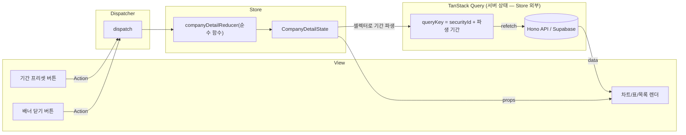

# 기업 상세 페이지 (company-detail) — 상태 관리 설계 (Level 2: Flux 패턴)

> 근거: `docs/pages/company-detail/requirement.md`, `docs/techstack.md` §1(React 19.2 + TanStack Query 5, Redux/Zustand 기각 — 로컬 상태는 `useReducer`)·§4(features 수직 슬라이스).
> **범위(Level 2)**: 상태 정의 + Flux 패턴(Action/Reducer/View 연결)까지. **Context 설계는 하지 않는다** — `useReducer`를 페이지 클라이언트 컴포넌트에서 직접 사용하고 하위에는 props로 전달한다.
> 코드는 타입 정의·시그니처 수준까지만 기술한다(컴포넌트 구현 없음).

---

## 1. 상태 데이터 목록

### 1.1 관리해야 할 상태 (Store가 보유 — useReducer)

| # | 상태 | 타입 | 초기값 |
|---|---|---|---|
| C1 | `quotesPeriod` | `QuotesPeriodPreset` | `QUOTES_DEFAULT_PERIOD` |
| C2 | `financialsPeriod` | `FinancialsPeriodPreset` | `FINANCIALS_DEFAULT_PERIOD` |
| C3 | `isTimelineNoticeDismissed` | `boolean` | `false` |

### 1.2 화면에 보이지만 상태가 아닌 것 (Store에 두지 않음)

| 데이터 | 소유자 | 비고 |
|---|---|---|
| `ticker` / `market` / `asOf` | URL(라우터) | 시장 선택은 `?market=` 갱신으로 처리 — reducer 미관여 |
| 기업 요약(`securityId` 포함)·재무·공시·일봉/시총·소속 체인 | TanStack Query 서버 캐시 | **reducer에 응답 데이터를 복사 보관하는 것을 금지** |
| 공시 페이지 커서·누적 목록·`hasMore` | `useInfiniteQuery` | 더보기 = `fetchNextPage()` 호출, Action 아님 |
| quotes `from`/`to`, financials `fromYear`/`toYear` | 파생 | C1·C2에서 순수 함수로 계산(§4 셀렉터) |
| 로딩/오류/빈 상태, 배지, 주석, 시장 선택 UI 노출 | 파생 | 쿼리 상태·응답 플래그에서 렌더 시 판정 |
| 로그인 여부 | 전역 인증 상태(Supabase 세션) | S5 노출 범위는 서버 필터 |

이 경계 덕분에 Store는 **순수 UI 선택 상태 3개**만 가지며, 서버 데이터의 로딩·재검증·캐싱 생명주기는 전부 TanStack Query에 위임된다.

---

## 2. Flux 단방향 데이터 흐름



- 흐름은 항상 **View → Action(dispatch) → Reducer → State → View** 한 방향이다. View가 상태를 직접 변경하지 않는다.
- 상태 변경의 부수효과(서버 재조회)는 reducer가 수행하지 않는다. reducer는 순수하게 상태만 바꾸고, 파생된 기간 값이 **queryKey에 포함**되어 있으므로 TanStack Query가 키 변경을 감지해 자동 재조회한다.
- 더보기(`fetchNextPage`)·재시도(`refetch`)는 클라이언트 상태를 바꾸지 않으므로 Action을 만들지 않는다(서버 상태 조작은 Query의 책임).

---

## 3. Action 정의

### 3.1 네이밍 컨벤션

- 형식: `<도메인>_<사건(과거형)>`의 UPPER_SNAKE_CASE — "무엇을 하라"(명령)가 아니라 "무슨 일이 일어났다"(사건)로 명명한다.
- 판별 유니온(discriminated union)으로 타입을 고정하고, payload는 필요한 최소 필드만 갖는다.

### 3.2 Action 타입

```typescript
// features/companies/state/company-detail.actions.ts
import type { QuotesPeriodPreset, FinancialsPeriodPreset } from '@domain/constants';

export type CompanyDetailAction =
  | { type: 'QUOTES_PERIOD_CHANGED'; payload: { period: QuotesPeriodPreset } }
  | { type: 'FINANCIALS_PERIOD_CHANGED'; payload: { period: FinancialsPeriodPreset } }
  | { type: 'TIMELINE_NOTICE_DISMISSED' };
```

| Action | 발생 지점(View) | payload | 의미 |
|---|---|---|---|
| `QUOTES_PERIOD_CHANGED` | S4 기간 프리셋 버튼 클릭 | `{ period }` | 주가/시총 조회 기간 프리셋이 바뀌었다 |
| `FINANCIALS_PERIOD_CHANGED` | S2 연도 범위 프리셋 클릭 | `{ period }` | 분기 재무 조회 범위 프리셋이 바뀌었다 |
| `TIMELINE_NOTICE_DISMISSED` | E14 안내 배너 닫기 클릭 | 없음 | 시점 컨텍스트 배너를 닫았다 |

---

## 4. Store — State·Reducer·셀렉터

### 4.1 State 타입과 초기값

```typescript
// features/companies/state/company-detail.reducer.ts
import {
  QUOTES_DEFAULT_PERIOD,
  FINANCIALS_DEFAULT_PERIOD,
  type QuotesPeriodPreset,
  type FinancialsPeriodPreset,
} from '@domain/constants';

export interface CompanyDetailState {
  readonly quotesPeriod: QuotesPeriodPreset;
  readonly financialsPeriod: FinancialsPeriodPreset;
  readonly isTimelineNoticeDismissed: boolean;
}

export const createInitialCompanyDetailState = (): CompanyDetailState => ({
  quotesPeriod: QUOTES_DEFAULT_PERIOD,
  financialsPeriod: FINANCIALS_DEFAULT_PERIOD,
  isTimelineNoticeDismissed: false,
});
```

### 4.2 Reducer 시그니처와 전이 규칙

```typescript
export function companyDetailReducer(
  state: CompanyDetailState,
  action: CompanyDetailAction,
): CompanyDetailState;
```

| Action | 전이 규칙 |
|---|---|
| `QUOTES_PERIOD_CHANGED` | `quotesPeriod ← payload.period`. 현재 값과 동일하면 기존 state 객체를 그대로 반환(불필요 리렌더 방지) |
| `FINANCIALS_PERIOD_CHANGED` | `financialsPeriod ← payload.period`. 동일 값이면 기존 state 반환 |
| `TIMELINE_NOTICE_DISMISSED` | `isTimelineNoticeDismissed ← true` (멱등 — 이미 `true`면 기존 state 반환) |
| 그 외 | `never` 소진 검사(exhaustive check)로 컴파일 타임에 누락 방지 |

**순수성 규칙**: reducer는 인자만으로 결과가 결정되는 순수 함수다. `Date.now()`·fetch·라우터 접근 등 부수효과 금지, 기존 state 변이(mutation) 금지(항상 새 객체 반환). 따라서 `(이전 상태, Action) → 기대 상태` 형태의 단위 테스트(Vitest)가 렌더링 없이 가능하다.

### 4.3 파생 값 셀렉터 (순수 함수 — 상태가 아님)

날짜 계산에 "오늘"이 필요하므로 현재 시각은 **인자로 주입**해 셀렉터의 순수성을 유지한다.

```typescript
// features/companies/state/company-detail.selectors.ts
import { TIMESERIES_MIN_START_YEAR } from '@domain/constants';

/** quotesPeriod 프리셋 → quotes API의 from/to (YYYY-MM-DD, to는 오늘로 보정) */
export function selectQuotesDateRange(
  period: QuotesPeriodPreset,
  today: Date,
): { from: string; to: string };

/** financialsPeriod 프리셋 → fromYear/toYear (fromYear는 2015 하한 클램프) */
export function selectFinancialsYearRange(
  period: FinancialsPeriodPreset,
  currentYear: number,
): { fromYear: number; toYear: number };
```

셀렉터 결과는 그대로 **queryKey의 일부**가 된다 — 상태 변경이 서버 재조회로 이어지는 유일한 연결 고리다.

---

## 5. 서버 상태 훅 경계 (Store 외부 — 시그니처만)

```typescript
// features/companies/hooks/*.ts — TanStack Query 훅 (reducer와 무관, 로직-표시 분리 지점)
function useCompanySummary(ticker: string, market?: Market): UseQueryResult<CompanySummaryResponse, ApiError>;
function useFinancials(securityId: string | undefined, range: { fromYear: number; toYear: number }): UseQueryResult<FinancialsResponse, ApiError>;
function useDisclosures(securityId: string | undefined): UseInfiniteQueryResult<InfiniteData<DisclosuresResponse>, ApiError>;
function useQuotes(securityId: string | undefined, range: { from: string; to: string }): UseQueryResult<QuotesResponse, ApiError>;
function useBelongingChains(securityId: string | undefined): UseQueryResult<CompanyValuechainsResponse, ApiError>;
```

- `securityId`는 summary 응답에서 오므로, S2~S5 훅은 `enabled: !!securityId`로 의존 쿼리 체이닝한다.
- queryKey 예: `['securities', securityId, 'quotes', range.from, range.to]` — reducer 상태(C1)의 파생값이 키에 들어가는 지점.
- 응답 DTO는 reducer state로 복사하지 않는다(캐시 중복 금지 원칙).

---

## 6. View 연결 — 컴포넌트 트리와 props 흐름

`useReducer`는 페이지 클라이언트 컴포넌트(`CompanyDetailView`) **한 곳**에서만 호출하고, 하위 Presenter에는 필요한 상태 조각과 콜백만 props로 내린다(Context 미사용 — Level 2 경계).

```
app/(public)/companies/[ticker]/page.tsx        # Server Component: params/searchParams 해석만
└─ CompanyDetailView                            # 'use client' — useReducer + 쿼리 훅 조립 (Container)
   ├─ TimelineContextNotice                     # E14 배너 (Presenter)
   ├─ CompanySummarySection                     # S1 정형 정보/배지/출처 (Presenter)
   ├─ FinancialsSection                         # S2 표+그래프 (Presenter)
   ├─ DisclosuresSection                        # S3 목록+더보기 (Presenter)
   ├─ QuotesSection                             # S4 캔들+시총 (Presenter)
   └─ BelongingChainsSection                    # S5 체인 목록 (Presenter)
```

### 6.1 Container(`CompanyDetailView`)의 조립 절차

1. `useReducer(companyDetailReducer, undefined, createInitialCompanyDetailState)` 호출.
2. URL에서 `ticker`/`market`/`asOf`를 받아 `useCompanySummary` 실행 → `securityId` 획득.
3. 셀렉터로 C1·C2를 기간 값으로 파생 → S2~S5 쿼리 훅 실행.
4. 각 Section Presenter에 **쿼리 결과 + 상태 조각 + dispatch를 감싼 콜백**을 props로 전달.

### 6.2 Presenter props 인터페이스 (시그니처 수준)

```typescript
interface TimelineContextNoticeProps {
  asOfDate: string;                                   // URL에서 파생
  isDismissed: boolean;                               // state.isTimelineNoticeDismissed
  onDismiss: () => void;                              // dispatch({ type: 'TIMELINE_NOTICE_DISMISSED' })
}

interface FinancialsSectionProps {
  query: UseQueryResult<FinancialsResponse, ApiError>;
  period: FinancialsPeriodPreset;                     // state.financialsPeriod
  onPeriodChange: (period: FinancialsPeriodPreset) => void;
                                                      // dispatch({ type: 'FINANCIALS_PERIOD_CHANGED', payload: { period } })
}

interface QuotesSectionProps {
  query: UseQueryResult<QuotesResponse, ApiError>;
  period: QuotesPeriodPreset;                         // state.quotesPeriod
  onPeriodChange: (period: QuotesPeriodPreset) => void;
                                                      // dispatch({ type: 'QUOTES_PERIOD_CHANGED', payload: { period } })
}

interface DisclosuresSectionProps {                   // reducer 미관여 — 서버 상태만
  query: UseInfiniteQueryResult<InfiniteData<DisclosuresResponse>, ApiError>;
}

interface CompanySummarySectionProps {                // reducer 미관여
  query: UseQueryResult<CompanySummaryResponse, ApiError>;
  onMarketSelect: (market: Market) => void;           // 409 시 URL ?market= 갱신 (라우터 — Action 아님)
}

interface BelongingChainsSectionProps {               // reducer 미관여
  query: UseQueryResult<CompanyValuechainsResponse, ApiError>;
}
```

### 6.3 상호작용별 흐름 요약

| 사용자 행동 | View 이벤트 | Flux 경로 | 화면 결과 |
|---|---|---|---|
| 주가 기간 프리셋 클릭 | `QuotesSection.onPeriodChange` | dispatch `QUOTES_PERIOD_CHANGED` → reducer → C1 변경 → `selectQuotesDateRange` 재계산 → queryKey 변경 → 재조회 | 캔들·시총 차트가 새 기간으로 갱신 |
| 재무 범위 프리셋 클릭 | `FinancialsSection.onPeriodChange` | dispatch `FINANCIALS_PERIOD_CHANGED` → C2 변경 → `selectFinancialsYearRange` → 재조회 | 표+그래프 갱신 |
| 배너 닫기 | `TimelineContextNotice.onDismiss` | dispatch `TIMELINE_NOTICE_DISMISSED` → C3 = true | 배너 제거 |
| 공시 더보기 | `DisclosuresSection` 내부 | `fetchNextPage()` — **Action 없음** (서버 상태) | 목록 누적 |
| 섹션 재시도 | 각 Section 내부 | `refetch()` — **Action 없음** | 해당 섹션 재로드 |
| 시장 선택(409) | `CompanySummarySection.onMarketSelect` | 라우터 `?market=` 갱신 — **Action 없음** (URL 상태) | summary 재조회 후 전체 섹션 로드 |
| 체인 항목 클릭 | `BelongingChainsSection` 내부 | 라우팅 이동 — **Action 없음** | 밸류체인 뷰(UC-009)로 이동 |

---

## 7. 파일 배치 (techstack §4 컨벤션)

```
apps/web/src/features/companies/
├── state/
│   ├── company-detail.actions.ts     # Action 유니온 타입
│   ├── company-detail.reducer.ts     # State 타입·초기값 팩토리·reducer(순수 함수)
│   ├── company-detail.selectors.ts   # 기간 파생 셀렉터(순수 함수)
│   └── company-detail.reducer.test.ts# Vitest 단위 테스트 (렌더링 불필요)
├── hooks/                            # useCompanySummary, useFinancials, useDisclosures, useQuotes, useBelongingChains
└── components/                       # 위 Presenter 컴포넌트들 (로직 없음)

packages/domain/constants/            # QuotesPeriodPreset·FinancialsPeriodPreset 유니온,
                                      # QUOTES_DEFAULT_PERIOD·FINANCIALS_DEFAULT_PERIOD·
                                      # TIMESERIES_MIN_START_YEAR·DISCLOSURES_PAGE_SIZE
```

> **Level 3(Context 설계)는 본 문서 범위 밖이다.** 하위 트리가 깊어져 props 전달이 과도해지는 시점에 Context + Provider 도입을 별도 문서로 설계한다.
