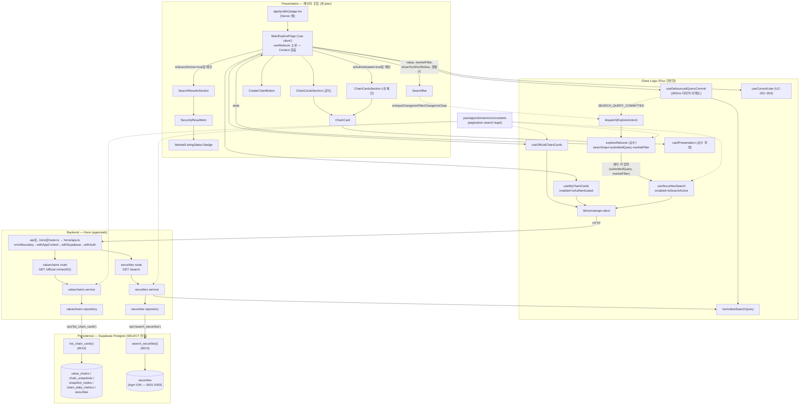

# Plan: main-explore (메인/탐색 페이지)

> 근거: `docs/pages/main-explore/requirement.md`, `docs/pages/main-explore/state_management.md`,
> `docs/usecases/007/spec.md`(메인/탐색 조회), `docs/usecases/008/spec.md`(기업 통합 검색),
> `docs/usecases/000_decisions.md`(B-1~B-7 — spec과 충돌 시 결정 우선), `docs/techstack.md` §4·§7(SOT),
> `docs/usecases/007/plan.md`, `docs/usecases/008/plan.md`, `.claude/skills/spec_to_plan/references/hono-backend-guide.md`.
>
> **본 문서의 역할과 범위 경계**
> - 본 문서는 **페이지 단위 통합 plan**이다. 개별 모듈의 상세 정의 SOT는 유스케이스 plan(UC-007·UC-008)에 있으며,
>   본 문서는 (1) 페이지를 구성하는 전체 모듈의 소유권·의존 관계 정리, (2) 유스케이스 plan 간 충돌 해소,
>   (3) 페이지 최종 조립(`MainExplorePage` 완전체)의 확정을 담당한다. **동일 모듈을 재정의하지 않는다(DRY).**
> - 상태관리는 `state_management.md`(Level 2)를 **그대로** 따른다: **Context 없음**, 페이지 클라이언트 컴포넌트가
>   `useReducer(exploreReducer, EXPLORE_INITIAL_STATE)`를 직접 소유하고 하위 Presenter에는 props로만 전달한다.
>   서버 상태(체인 목록·검색 결과·페이지네이션)는 TanStack Query가 단일 소스이며 reducer에 복제하지 않는다.
> - **외부 서비스 연동: 없음.** UC-007·UC-008 spec 모두 런타임 외부 API 호출이 없는 자체 DB 조회 전용 기능이다
>   (가치총액 등 지표의 원천 수집은 배치 UC-026~031 소관 — `docs/external/*` 문서는 본 페이지 범위 밖).
>   따라서 본 plan에 외부 서비스 클라이언트 모듈은 없다.
> - 인증 세션 전역 관리(`useCurrentUser`, 로그인/returnTo 처리)는 UC-001~003 plan 소관 — 본 plan은 훅 계약만 참조.
> - 푸터(면책 요약)는 전역 레이아웃 책임(UC-007 plan A-7에서 정의, UC-025 연계) — 본 페이지 상태 설계 범위 외.

---

## 0. 유스케이스 plan 간 충돌 해소 (본 문서가 확정)

코드베이스는 아직 스캐폴드 전(구현 산출물 없음 — `apps/`, `packages/` 미존재, `supabase/migrations`는 0001~0012)이므로
구현 코드와의 충돌은 없다. 단, 기작성된 plan 문서 간 아래 충돌을 본 문서가 조정한다.

| # | 충돌 | 확정 |
|---|---|---|
| 1 | **마이그레이션 번호 중복**: UC-007 plan은 `0013_list_chain_cards_function.sql`, UC-008 plan도 `0013_search_securities_function.sql`로 동일 번호 사용 | `0013_list_chain_cards_function.sql`(UC-007), **`0014_search_securities_function.sql`**(UC-008 — 번호만 0014로 재부여, 내용 불변). 이후 다른 plan이 0013/0014를 선점했다면 구현 시점의 최신 번호로 순차 부여한다(멱등 함수 정의라 순서 의존성 없음) |
| 2 | **domain 패키지 경로 표기 불일치**: UC-007 plan은 `packages/domain/src/constants/...`, UC-008 plan은 `packages/domain/constants/...` | 두 표기는 동일 모듈을 가리킨다. 스캐폴드 확정 구조(`packages/domain`의 src 유무)는 env_setupper 산출을 따르되, 본 문서는 **`packages/domain/src/...`로 통일 표기**한다. import는 배럴(`@iib/domain`) 경유로 통일해 내부 경로 변화에 비의존 |
| 3 | **쿼리 키 모듈 구성**: `state_management.md` §6은 `exploreQueryKeys` 단일 객체 예시, UC-007/008 plan은 기능별 분리(`valuechains/hooks/queryKeys.ts` + securities 훅 내 키 팩토리) | **기능별 분리 구현을 채택**(techstack §4 수직 슬라이스 원칙). 키 **값**은 state_management §6과 동일(`['valuechains','official']`, `['valuechains','mine']`, `['securities','search',{query,market}]`)해야 하며 이 값 계약이 검증 기준 |
| 4 | **`MainExplorePage` 소유권**: UC-007 plan(E-2)이 파일을 생성하되 검색 모듈은 "장착 지점"으로 예약, UC-008 plan(19)은 연결 계약만 정의 | 최종 조립 명세는 **본 문서 §E-2가 SOT**. UC-007 E-2(체인 목록 wiring) + UC-008 19(검색 wiring)를 하나의 컨테이너 명세로 통합 확정한다 |

---

## 개요

표기: **[정의 SOT]** = 해당 모듈의 상세 구현 명세·테스트가 있는 문서. 본 문서 소유 모듈만 아래 Implementation Plan에서 상세 기술한다.

### A. 공통/공유 모듈 (타 페이지와 공유 — 이미 존재하면 재사용, 재정의 금지)

| 모듈 | 위치 | 설명 | 정의 SOT |
| --- | --- | --- | --- |
| 페이지네이션 상수 | `packages/domain/src/constants/pagination.ts` | `CHAIN_LIST_PAGE_SIZE=20`, `LIST_PAGE_LIMIT_MAX=100` (결정 B-3) | UC-007 plan A-1 |
| 검색 상수 | `packages/domain/src/constants/search.ts` | `SEARCH_PAGE_SIZE=20`, `MIN_SEARCH_QUERY_LENGTH=1`, `SEARCH_DEBOUNCE_MS=300` (결정 B-3·B-4, 체인 목록 상수와 분리) | UC-008 plan 1 |
| 검색어 정규화 | `packages/domain/src/text/normalize-search-query.ts` | `normalizeSearchQuery(raw)` 순수 함수(NFKC+trim) — FE 디바운스 커밋·BE service 공유(DRY) | UC-008 plan 2 |
| 법적 고지 상수 | `packages/domain/src/constants/legal.ts` | 푸터 면책 문구(결정 G-2) | UC-007 plan A-2 |
| HTTP Result 헬퍼 | `apps/web/src/backend/http/response.ts` | `success()/failure()/respond()`, `HandlerResult` | UC-007 plan A-3 |
| 공통 페이지네이션 스키마 | `apps/web/src/backend/http/pagination.ts` | `createPaginationQuerySchema()`, `buildPagination()` | UC-007 plan A-4 |
| Hono 앱/컨텍스트/미들웨어/진입점 | `apps/web/src/backend/hono/*`, `apps/web/src/backend/middleware/*`, `apps/web/src/app/api/[[...hono]]/route.ts` | 싱글턴 앱, errorBoundary→withAppContext→withSupabase→withAuth 체인 | UC-007 plan A-5 |
| Supabase 클라이언트 팩토리 | `apps/web/src/lib/supabase/*` | service-role(서버 전용)·ssr 쿠키 클라이언트. 키는 환경변수로만 주입 | UC-007 plan A-6 |
| API 클라이언트 | `apps/web/src/lib/remote/api-client.ts` | fetch 래퍼(base `/api`, ApiError 정규화, AbortController 타임아웃) | UC-007 plan A-6 / UC-008 plan 0 |
| 라우트 경로 상수 | `apps/web/src/constants/routes.ts` | `ROUTES` + `withReturnTo()` 헬퍼 | UC-007 plan A-6 |
| 숫자 포맷 유틸 | `apps/web/src/lib/formatting/number.ts` | `formatKrwCompact()` — 대시보드·기업상세 재사용 | UC-007 plan A-6 |
| 전역 푸터 | `apps/web/src/components/common/AppFooter.tsx` | 면책 요약+정책 링크(루트 레이아웃 장착) | UC-007 plan A-7 |
| 인증 세션 훅 *(참조만)* | `apps/web/src/features/auth/hooks/useCurrentUser.ts` | `{ user, isAuthenticated, isLoading }` 계약 | UC-001~003 plan |

### B. 데이터베이스 (마이그레이션 — §0-1 번호 확정 반영)

| 모듈 | 위치 | 설명 | 정의 SOT |
| --- | --- | --- | --- |
| 체인 카드 목록 RPC | `supabase/migrations/0013_list_chain_cards_function.sql` | `list_chain_cards()` — 체인×최신 스냅샷×노드 수×최신 지표×기준 기업명 복합 조인(N+1 방지) | UC-007 plan B-1 |
| 검색 RPC | `supabase/migrations/0014_search_securities_function.sql` | `search_securities()` — 정확>접두>부분 정렬, ILIKE 이스케이프, `p_limit=pageSize+1` hasMore 계약 | UC-008 plan 3 (번호만 0014로 변경) |

### C. valuechains 기능 (체인 카드 목록 — UC-007)

| 모듈 | 위치 | 설명 | 정의 SOT |
| --- | --- | --- | --- |
| Zod 스키마 | `apps/web/src/features/valuechains/backend/schema.ts` | Query/RPC Row/`ChainCard`·`ChainCardListResponse` | UC-007 plan C-1 |
| 에러 코드 | `apps/web/src/features/valuechains/backend/error.ts` | `VALUECHAIN_LIST_*` 4종 | UC-007 plan C-2 |
| Repository | `apps/web/src/features/valuechains/backend/repository.ts` | `rpc('list_chain_cards')` 캡슐화 | UC-007 plan C-3 |
| Service | `apps/web/src/features/valuechains/backend/service.ts` | official/mine 목록 — Row 검증·DTO 변환·latestMetric null 규칙·페이지네이션 | UC-007 plan C-4 |
| Route | `apps/web/src/features/valuechains/backend/route.ts` | `GET /valuechains/official`(공개)·`GET /valuechains/mine`(401 방어) | UC-007 plan C-5 |
| DTO 재노출 | `apps/web/src/features/valuechains/lib/dto.ts` | FE 경계 모듈 | UC-007 plan D-1 |
| 카드 표시 파생 로직 | `apps/web/src/features/valuechains/lib/cardPresentation.ts` | 기준 라벨·가치총액 표시 모델(null↔0 구분, 이월·커버리지) 순수 함수 | UC-007 plan D-2 |
| 쿼리 키/훅 | `apps/web/src/features/valuechains/hooks/{queryKeys,useOfficialChainCards,useMyChainCards}.ts` | `useInfiniteQuery` 2종(mine은 `enabled`+401 무재시도+`isUnauthorized` 파생) | UC-007 plan D-3 |
| ChainCard | `apps/web/src/features/valuechains/components/ChainCard.tsx` | 카드 Presenter | UC-007 plan D-4 |
| ChainCardsSection | `apps/web/src/features/valuechains/components/ChainCardsSection.tsx` | 로딩/오류+재시도/빈 상태(`emptyVariant`)/목록/더보기 — 공식·내 체인 공용(결정 B-2) | UC-007 plan D-5 |

### D. securities 기능 (통합 검색 — UC-008)

| 모듈 | 위치 | 설명 | 정의 SOT |
| --- | --- | --- | --- |
| Zod 스키마 | `apps/web/src/features/securities/backend/schema.ts` | Query/Row/Response(`listingStatus` 포함 — 결정 B-5) | UC-008 plan 4 |
| 에러 코드 | `apps/web/src/features/securities/backend/error.ts` | `INVALID_QUERY`/`SEARCH_FAILED`/`SEARCH_VALIDATION_ERROR`(+429 예약) | UC-008 plan 5 |
| Repository | `apps/web/src/features/securities/backend/repository.ts` | `rpc('search_securities')` 캡슐화(인터페이스+팩토리) | UC-008 plan 6 |
| Service | `apps/web/src/features/securities/backend/service.ts` | 정규화·최소길이 재검증·`pageSize+1` hasMore 산출·DTO 변환 | UC-008 plan 7 |
| Route | `apps/web/src/features/securities/backend/route.ts` | `GET /securities/search`(공개) | UC-008 plan 8 |
| DTO 재노출 | `apps/web/src/features/securities/lib/dto.ts` | FE 경계 모듈 | UC-008 plan 10 |
| 검색 쿼리 훅 | `apps/web/src/features/securities/hooks/useSecuritiesSearch.ts` | `useInfiniteQuery` — 키에 `{query, market}` 참여, `enabled` 옵션, `market='ALL'`이면 파라미터 미전송 | UC-008 plan 11 |
| 오류 메시지 매핑 | `apps/web/src/features/securities/lib/search-error-message.ts` | 에러 코드→사용자 문구 순수 매핑 | UC-008 plan 18 |
| SecurityBadges | `apps/web/src/features/securities/components/SecurityBadges.tsx` | `MarketBadge`/`ListingStatusBadge`(결정 B-5, UC-020 재사용 후보) | UC-008 plan 15 |
| SecurityResultItem | `apps/web/src/features/securities/components/SecurityResultItem.tsx` | 결과 1행 Presenter | UC-008 plan 16 |
| SearchResultsSection | `apps/web/src/features/securities/components/SearchResultsSection.tsx` | 결과 패널 Presenter(로딩/빈 결과/오류+재시도/더보기) | UC-008 plan 17 |

### E. explore 기능 (페이지 상태·조립 — 본 페이지 전용)

| 모듈 | 위치 | 설명 | 정의 SOT |
| --- | --- | --- | --- |
| 페이지 상태 reducer | `apps/web/src/features/explore/state/exploreReducer.ts` | `ExplorePageState`(S1~S3)·`ExploreAction` 4종·`exploreReducer`·셀렉터 2종 — React 비의존 순수 모듈 | UC-008 plan 12 (= state_management §4·§5 그대로) |
| 디바운스 커밋 훅 | `apps/web/src/features/explore/hooks/useDebouncedQueryCommit.ts` | 300ms 타이머 → 정규화 → `SEARCH_QUERY_COMMITTED` dispatch (시간 사이드이펙트 전담) | UC-008 plan 13 |
| SearchBar | `apps/web/src/features/explore/components/SearchBar.tsx` | 검색 입력+필터 탭+지우기(X)+"검색 미실행" 안내 Presenter | UC-008 plan 14 |
| CreateChainButton | `apps/web/src/features/explore/components/CreateChainButton.tsx` | 생성 진입점(비로그인 시 `withReturnTo` 로그인 유도) | UC-007 plan D-6 |
| **페이지 컨테이너(최종 조립)** | `apps/web/src/features/explore/components/MainExplorePage.tsx` | `'use client'` — reducer 소유, 훅 5종 wiring, 핸들러→props 전달. **본 문서 E-2가 SOT(§0-4)** | **본 plan E-2** |
| **페이지 셸** | `apps/web/src/app/(public)/page.tsx` | Server Component — 클라이언트 경계 배치만 | **본 plan E-1** (UC-007 E-1 승계) |

---

## Diagram

데이터 흐름: View → dispatch(Action) → Reducer → State → (쿼리 키) → TanStack Query → Hono Route → Service → Repository → Postgres RPC.
서버 응답이 reducer로 되돌아오는 경로는 없다(단방향 — state_management §3).

---

## Implementation Plan

> 구현 순서: **① B(마이그레이션 0013·0014 작성/적용 + 타입 재생성) → ② A(공통 — 존재 시 생략) → ③ C·D 백엔드(TDD)
> → ④ C·D·E FE 모듈(순수 로직 테스트 우선) → ⑤ E-1·E-2 페이지 조립 → ⑥ 페이지 통합 QA**.
> A~D 그룹 및 E의 reducer/디바운스/SearchBar/CreateChainButton은 유스케이스 plan의 명세·Unit Test·QA Sheet를 **그대로** 따른다
> (아래에는 페이지 관점의 수용 기준만 요약). 본 문서가 상세 명세를 소유하는 것은 E-1·E-2다.

### B. 마이그레이션 (UC-007 plan B-1 / UC-008 plan 3 승계 — 번호만 §0-1로 확정)

- 구현 내용:
  1. `0013_list_chain_cards_function.sql`: UC-007 plan B-1 명세 그대로(반환 컬럼·`LEFT JOIN LATERAL`·정렬 B-1·`total_market_cap_krw::text`·`COUNT(*) OVER ()`).
  2. `0014_search_securities_function.sql`: UC-008 plan 3 명세 그대로(ILIKE 이스케이프·정확>접두>부분 `ORDER BY CASE`·`p_limit=pageSize+1` 계약). 파일명 번호만 0014.
  3. 두 함수 모두 `CREATE OR REPLACE`(멱등), 테이블/인덱스 변경 없음 → 기존 0001~0012와 충돌 없음.
  4. 적용은 `mcp__supabase__apply_migration`(로컬 Supabase 금지 — techstack §7), 적용 후 `generate_typescript_types`로 `packages/domain/src/types/database.ts` 재생성.
- 의존성: 기적용 마이그레이션 0001·0003·0005·0006·0010.
- Unit Tests(SQL 레벨): UC-007 plan B-1·UC-008 plan 3의 체크리스트 전체를 그대로 수행. 페이지 관점 필수 확인:
  - [ ] `list_chain_cards`: official=생성일 오름차순, user=수정일 내림차순(결정 B-1) / 지표 없는 체인 NULL 행 정상 반환
  - [ ] `search_securities`: `listing_status='delisted'`도 포함(결정 B-5) / 와일드카드 리터럴 매칭

### A. 공통/공유 모듈 (재사용 — 신규 정의 없음)

- 구현 내용: **이미 존재하면 그대로 재사용하고 생성하지 않는다.** 미존재 시 UC-007 plan A-1~A-7, UC-008 plan 0~2의 명세로 최초 1회 생성.
  본 페이지 신규 환경변수 없음(`NEXT_PUBLIC_SUPABASE_URL`/`NEXT_PUBLIC_SUPABASE_ANON_KEY`/`SUPABASE_SERVICE_ROLE_KEY`만 사용, 하드코딩 금지).
- 의존성: 없음(최우선 선행).
- 페이지 관점 수용 기준:
  - [ ] `SEARCH_PAGE_SIZE`와 `CHAIN_LIST_PAGE_SIZE`가 **서로 다른 파일의 독립 상수**로 존재(결정 B-3)
  - [ ] `normalizeSearchQuery`가 `packages/domain`에 단 1곳 존재하고 FE(디바운스 커밋)·BE(service)가 동일 함수를 import(정규화 이중 구현 금지)
  - [ ] api-client가 401/400/500 응답의 `error.code`를 보존(FE 분기용)

### C. valuechains 백엔드 + FE 모듈 (UC-007 plan C-1~C-5·D-1~D-5 승계)

- 구현 내용: UC-007 plan 명세·테스트 그대로. 요약 — Route(쿼리 Zod 검증 400, mine 무세션 401) → Service(Row 검증, `metric_date` 또는 `total_market_cap_krw`가 NULL이면 `latestMetric=null`, `buildPagination`) → Repository(`rpc('list_chain_cards')`). FE는 `useInfiniteQuery` 2종(`getNextPageParam: hasMore ? page+1 : undefined`, mine은 401 무재시도+`isUnauthorized`)과 카드/섹션 Presenter.
- 의존성: B(0013), A.
- 페이지 관점 수용 기준(상세 테스트는 UC-007 plan):
  - [ ] `latestMetric=null` 카드가 "0"이 아닌 미표시로 렌더(requirement D6)
  - [ ] `isCarriedForward=true` 이월 표기, 커버리지 "반영 n/전체 m" 표기
  - [ ] 공식/내 섹션이 동일 `ChainCardsSection` 공유(결정 B-2), `emptyVariant`로 빈 상태 문구만 분기

### D. securities 백엔드 + FE 모듈 (UC-008 plan 3~11·15~18 승계)

- 구현 내용: UC-008 plan 명세·테스트 그대로. 요약 — Route(공개, Zod 검증 400) → Service(`normalizeSearchQuery` 재검증 → 미달 시 400 방어, `offset=(page-1)*SEARCH_PAGE_SIZE`, `limit=SEARCH_PAGE_SIZE+1`로 hasMore 산출, `listingStatus` 포함 DTO) → Repository(`rpc('search_securities')`). FE는 `useSecuritiesSearch`(쿼리 키 `['securities','search',{query,market}]`, `enabled` 옵션, `'ALL'`→파라미터 미전송)와 결과 패널 Presenter 3종 + 배지 + 오류 문구 매핑.
- 의존성: B(0014), A.
- 페이지 관점 수용 기준(상세 테스트는 UC-008 plan):
  - [ ] `enabled=false`면 네트워크 요청 자체가 발생하지 않음(최소 길이 미만 API 미호출 보장 — requirement 3.2)
  - [ ] 쿼리 키 변경(검색어/필터) 시 누적 페이지 자동 1페이지 초기화(reducer의 페이지 관리 불필요 — state_management §8.2)
  - [ ] 빈 결과(200)와 500 오류의 UI가 명확히 구분(requirement 3.2-7)

### E-0. explore 상태 모듈 (UC-008 plan 12~14 승계 — state_management.md 구현체)

- 구현 내용: `exploreReducer.ts`(State·Action 4종·reducer·`selectIsSearchActive`·`selectShowTooShortNotice`),
  `useDebouncedQueryCommit.ts`(300ms 타이머, 만료 시 정규화 후 dispatch, 재입력 시 재시작, 언마운트 취소),
  `SearchBar.tsx`(Presenter — dispatch·Action 비인지), `CreateChainButton.tsx`(UC-007 plan D-6).
  전부 유스케이스 plan 명세 그대로 — **state_management.md §4·§5·§7과 타입·시그니처가 1:1로 일치해야 한다.**
- 의존성: A(상수·정규화).
- 페이지 관점 수용 기준(상세 테스트는 UC-008 plan 12·13, state_management §9 표 전체):
  - [ ] `SEARCH_CLEARED`가 `marketFilter`까지 `'ALL'`로 전체 초기화(requirement 6.1 — 다음 검색이 전체 시장 기준)
  - [ ] 정규화는 dispatch **이전** 이펙트 계층 수행(reducer 순수성 — 타이머/라우팅/API 사이드이펙트 금지)
  - [ ] 상태를 만들지 않는 상호작용(카드 클릭·더보기·재시도·생성 버튼)에 Action이 정의되어 있지 않음

### E-1. 페이지 셸 — `apps/web/src/app/(public)/page.tsx` (본 plan 소유)

- 구현 내용:
  1. Server Component. `<MainExplorePage />` 배치만 수행하고 데이터 페칭·로직 없음.
  2. SSR 프리페치는 하지 않는다(영역별 독립 로딩/오류 처리가 요구사항 — 클라이언트 쿼리 훅이 담당). 후속 SEO 최적화로 공식 목록 prefetch를 도입하더라도 본 plan 범위 밖.
  3. `(public)` 라우트 그룹(비로그인 허용 — techstack §4). 페이지 `metadata`(title 등)만 정의.
- 의존성: E-2.
- **QA Sheet:**

| # | 시나리오 | 기대 결과 |
| --- | --- | --- |
| 1 | 비로그인으로 `/` 진입 | 리다이렉트 없이 페이지 정상 렌더(공개 페이지 — Precondition 없음) |
| 2 | 로고/홈 내비게이션 재진입 | 동일 페이지 도달, 콘솔 오류 없음 |
| 3 | 서버 컴포넌트 확인 | 셸 자체에 `'use client'`·훅·fetch 없음(경계는 MainExplorePage) |

### E-2. 페이지 컨테이너(최종 조립) — `apps/web/src/features/explore/components/MainExplorePage.tsx` (본 plan 소유 — §0-4)

- 구현 내용 (`'use client'` — 본 페이지의 유일한 로직-표시 결합 지점, state_management §7 트리 그대로):
  1. **Store 소유**: `const [state, dispatch] = useReducer(exploreReducer, EXPLORE_INITIAL_STATE)` — Context 미사용, 하위에는 props만.
  2. **이펙트 연결**: `useDebouncedQueryCommit(state.searchInput, dispatch)`.
  3. **인증**: `useCurrentUser()` → `isAuthenticated`.
  4. **서버 상태 3종 연결**:
     - `useOfficialChainCards()` — 항상.
     - `useMyChainCards({ enabled: isAuthenticated })`.
     - `useSecuritiesSearch({ query: state.submittedQuery, market: state.marketFilter }, { enabled: selectIsSearchActive(state) })`.
  5. **파생 계산(상태 저장 금지)**: 각 쿼리 `items = data?.pages.flatMap(p => p.items) ?? []`, `isSearchActive = selectIsSearchActive(state)`, `showTooShortNotice = selectShowTooShortNotice(state)`. 서버 데이터·로딩·오류를 reducer/useState에 복제하지 않는다.
  6. **핸들러 wiring** (Presenter는 dispatch·Action·쿼리 객체를 모른다):
     - SearchBar: `onInputChange(v) → dispatch({type:'SEARCH_INPUT_CHANGED', payload:{value:v}})`, `onFilterChange(m) → dispatch(SEARCH_MARKET_FILTER_CHANGED)`, `onClear() → dispatch(SEARCH_CLEARED)`.
     - 검색 결과: `onSelect(ticker) → router.push(ROUTES.company(ticker))`(결정 B-6), `onLoadMore → fetchNextPage()`, `onRetry → refetch()`.
     - 체인 섹션(공식/내 각각 **독립 인스턴스**): `onSelect(chainId) → router.push(ROUTES.chainView(chainId))`, `onLoadMore`/`onRetry`는 해당 쿼리 인스턴스에만 바인딩(영역별 독립 — requirement 3.6).
     - `CreateChainButton`에 `isAuthenticated` 전달(비로그인 라우팅은 버튼 내부에서 `withReturnTo` — Action 아님).
  7. **렌더 구성** (requirement §2 노출 조건 표):
     - 상단: `SearchBar`(항상) — `value=state.searchInput`, `marketFilter=state.marketFilter`, `showTooShortNotice`.
     - `isSearchActive=true`일 때만 `SearchResultsSection`을 검색창 하단 패널로 렌더(`false`가 되면 언마운트 → 체인 목록 뷰 복귀).
     - `ChainCardsSection`(공식, `emptyVariant='official'`) — 항상 렌더.
     - 내 체인 섹션: `isAuthenticated && !isUnauthorized`일 때만 `ChainCardsSection`(`emptyVariant='mine'`) 렌더. `isUnauthorized`(401 — 세션 만료)면 섹션 대신 로그인 유도 배너로 대체하되 공식 목록·검색은 유지(게스트 뷰 전환, requirement 3.6).
     - `CreateChainButton`(항상).
     - 푸터는 렌더하지 않음(전역 레이아웃 책임 — AppFooter).
  8. 검색 결과 오류 표시는 `ApiError.code`를 `SearchResultsSection`의 `errorCode`로 전달(400 입력 오류 안내와 500 재시도 구분 — requirement 6.2).
- 의존성: C(D-3~D-5), D(11·14~18), E-0, A(routes·api-client), `useCurrentUser`(계약 참조).
- **QA Sheet** (requirement §3·§6·§8, state_management §8 시나리오 통합 — 페이지 최종 수용 기준):

| # | 시나리오 | 기대 결과 |
| --- | --- | --- |
| 1 | 비로그인 `/` 진입 | 검색창+필터 탭, 공식 체인 섹션, 생성 버튼, 푸터 노출. 내 체인 섹션 미노출. `/api/valuechains/mine` 호출 없음 |
| 2 | 로그인 `/` 진입 | 위 + "내 밸류체인" 섹션 노출(`/mine` 호출 발생). 공식=생성일순, 내 체인=최근 수정순(결정 B-1 — 서버 정렬) |
| 3 | "삼성" 타이핑(연속 입력) | 입력값 즉시 반영. 타이핑 중 검색 API 미호출, 마지막 입력 300ms 후 **1회만** `GET /api/securities/search?q=삼성` 호출 → 결과 패널 표시 |
| 4 | 결과 표시 중 "삼성전자"로 추가 입력 | 300ms 재디바운스 후 새 쿼리 키로 재조회, 1페이지부터 표시 |
| 5 | 공백만 입력 후 300ms | "검색 미실행" 안내(D2), API 미호출(`enabled=false`), 결과 패널 미표시 |
| 6 | 입력 전부 삭제(빈 문자열 커밋) | 결과 패널 닫힘 → 체인 목록 뷰 복귀 |
| 7 | 검색 활성 중 필터 탭 KRX 선택 | 동일 검색어 + `market=KRX`로 재조회, 누적 페이지 초기화(1페이지부터), KRX 종목만 표시 |
| 8 | X(지우기) 클릭 | 디바운스 대기 없이 즉시: 입력 비움, 결과 패널 닫힘, 필터 '전체' 복귀. 진행 중 타이머 취소(늦은 커밋 미발생) |
| 9 | 검색 결과 0건 | "검색 결과 없음" 빈 안내(오류 UI와 구분) |
| 10 | 검색 결과 21건 이상 | 첫 20건 + 더보기 → 클릭 시 `page=2` 요청, 기존 목록 뒤에 이어 붙음(중복 없음), `hasMore=false`면 버튼 숨김 |
| 11 | 폐지/정지 종목 포함 결과 | 해당 행에 "상장폐지"/"거래정지" 배지 표기(결정 B-5), 시장 배지 KRX/US 병기 |
| 12 | 결과 항목 클릭 | `/companies/[ticker]`로 이동(결정 B-6). 페이지 상태 변경 없음 |
| 13 | 체인 카드 클릭 | `/valuechains/[chainId]`로 이동. 상태 변경 없음 |
| 14 | 공식 체인 0건(시드 미적재) | 공식 섹션 빈 상태 안내(오류 아님). 다른 영역 정상 |
| 15 | 내 체인 0건 | 빈 상태 + 생성 유도 표시 |
| 16 | `latestMetric=null` 카드 | 가치총액 "미표시" 처리 — "0"과 시각적으로 구분. `isCarriedForward=true`면 이월 표기 |
| 17 | 공식 목록 500 | 공식 섹션에만 오류+재시도 버튼. 내 체인·검색 영역 정상 동작(영역 독립). 재시도 클릭 → 공식 쿼리만 재요청 |
| 18 | 내 체인 500 | 내 섹션에만 오류+재시도. 공식 목록·검색 유지 |
| 19 | 내 체인 401(세션 만료) | 게스트 뷰 전환: 내 섹션 미노출+로그인 유도, 공식 목록 유지, 자동 재시도 없음 |
| 20 | 검색 500 | 결과 패널에 오류+재시도. 체인 섹션 영향 없음 |
| 21 | 체인 목록 21건 이상 | 첫 20건(`CHAIN_LIST_PAGE_SIZE`) + 더보기, 섹션별 페이지 진행이 서로 독립 |
| 22 | 생성 버튼(로그인) | `/valuechains/new` 이동 |
| 23 | 생성 버튼(비로그인) | 로그인 페이지 이동 + `returnTo=/valuechains/new` 유지 |
| 24 | 페이지 재진입(캐시 존재) | TanStack Query 캐시로 즉시 표시 후 재검증. reducer는 초기 상태(검색 초기화) |
| 25 | React DevTools 검사 | 컨테이너 로컬 상태가 `searchInput`/`submittedQuery`/`marketFilter` 3개뿐(서버 데이터 복제 없음), Context Provider 부재 |
| 26 | 반응형(375px) | 검색창/탭/카드 그리드 1열 재배치, 가로 스크롤 없음 |

---

## 구현 순서 및 완료 기준

1. **B**: 0013·0014 마이그레이션 작성 → `apply_migration` 적용 → 타입 재생성
2. **A**: 공통 모듈(존재 확인 후 미존재분만 생성 — 계약 시그니처 일치 검증)
3. **C·D 백엔드**: schema → error → repository → service → route → 앱 등록 (vitest TDD, UC plan 체크리스트 순)
4. **C·D·E-0 FE**: 순수 모듈(reducer·셀렉터·정규화·cardPresentation·오류 매핑) 테스트 선행 → 쿼리 훅 → Presenter
5. **E-1·E-2**: 페이지 조립 → 본 문서 QA Sheet 전 항목 수행(브라우저 + 네트워크 탭 검증)
- 완료 기준: `npm run typecheck` / `npm run lint` / `npm run test` 전부 통과, UC-007·UC-008 plan의 Unit Test/QA 전 항목 + 본 문서 E-1·E-2 QA Sheet 전 항목 충족, 유스케이스 plan 문서와의 모듈 중복 정의 없음(§0 충돌 해소 반영).
