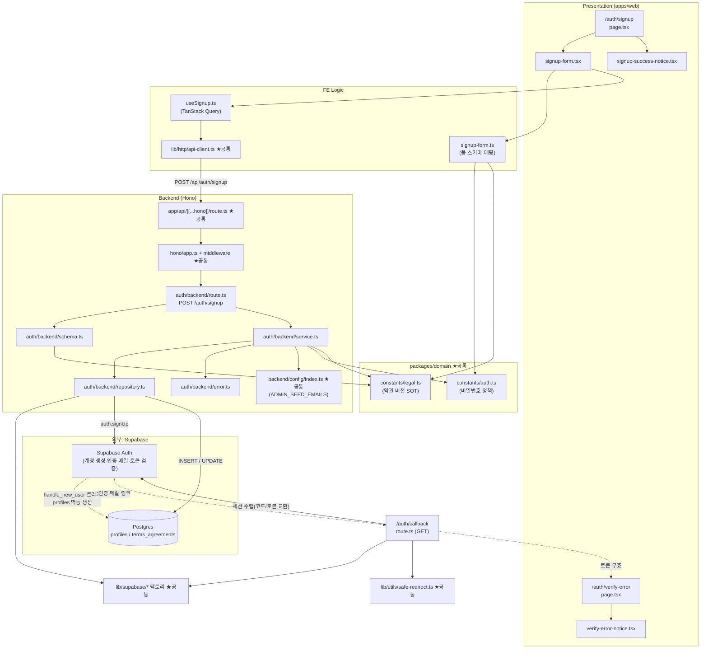

# Plan: UC-001 이메일 회원가입

> 근거: `docs/usecases/001/spec.md`, `docs/usecases/000_decisions.md`(A-1~A-4, G-1), `docs/techstack.md` §4·§7·§9,
> `docs/database.md` §3.1, `supabase/migrations/0002_profiles_and_terms.sql`,
> `.claude/skills/spec_to_plan/references/hono-backend-guide.md`(Hono 백엔드 컨벤션).
>
> - 인증 페이지(`/auth/*`)에 대한 `docs/pages/*/state_management.md` 문서는 존재하지 않으므로 폼 로컬 상태는
>   react-hook-form + zod, 서버 상태는 TanStack Query로 설계한다(별도 Context+useReducer 불요 — 단일 폼).
> - DB 스키마(`profiles`, `terms_agreements`, `handle_new_user()`)는 `0002` 마이그레이션으로 이미 존재한다.
>   **신규 마이그레이션 없음.** (0002의 "어드민 승격은 시드 스크립트 몫" 코멘트는 결정 A-1로 대체됨 —
>   승격 주체는 가입 직후 서비스 레이어. 코멘트 문구 차이는 기능 충돌이 아니므로 수정 마이그레이션은 만들지 않는다.)
> - 외부 연동은 **Supabase Auth**(관리형, `docs/external/` 별도 문서 없음 — techstack §7이 SOT)뿐이다.
> - 이 plan은 저장소의 **첫 구현 계획**이므로 공통(shared) 모듈을 함께 정의한다. 이후 유스케이스 plan은
>   본 문서의 공통 모듈 위치를 참조만 한다.

---

## 개요

### 공통(shared) 모듈 — 본 plan에서 최초 정의, 전 기능 재사용

| 모듈 | 위치 | 설명 |
| --- | --- | --- |
| Hono 진입점 | `apps/web/src/app/api/[[...hono]]/route.ts` | Next.js catch-all Route Handler(`runtime='nodejs'`), 싱글턴 Hono 앱에 위임 |
| Hono 앱/컨텍스트 | `apps/web/src/backend/hono/app.ts`, `apps/web/src/backend/hono/context.ts` | `createHonoApp()` 싱글턴, `AppEnv` 타입, `getSupabase(c)`/`getLogger(c)` 헬퍼 |
| HTTP 응답 헬퍼 | `apps/web/src/backend/http/response.ts` | `success()`/`failure()`/`respond()`, `HandlerResult<T,E,M>` 패턴 |
| 공통 미들웨어 | `apps/web/src/backend/middleware/error.ts`, `context.ts`, `supabase.ts` | `errorBoundary` → `withAppContext`(config/logger 주입) → `withSupabase`(service-role 클라이언트 주입) 체인 |
| 백엔드 환경설정 | `apps/web/src/backend/config/index.ts` | 환경변수(zod 검증): `SUPABASE_URL`, `SUPABASE_SERVICE_ROLE_KEY`, `ADMIN_SEED_EMAILS` 등 — 하드코딩 금지 규칙의 단일 진입점 |
| Supabase 클라이언트 팩토리 | `apps/web/src/lib/supabase/service-client.ts`, `server-client.ts`, `browser-client.ts` | service-role(백엔드 전용) / `@supabase/ssr` 서버(쿠키 세션) / 브라우저 클라이언트 생성. 공통 타임아웃 fetch 주입 |
| FE API 클라이언트 | `apps/web/src/lib/http/api-client.ts` | fetch 래퍼(베이스 URL `/api`, JSON 파싱, `HandlerResult` 형태 오류 언랩, 타임아웃) |
| 내부 경로 리다이렉트 가드 | `apps/web/src/lib/utils/safe-redirect.ts` | `sanitizeReturnTo(path)` — 내부 경로만 허용(오픈 리다이렉트 방지). UC-002/003과 공유 |
| 비밀번호 정책 상수/스키마 | `packages/domain/constants/auth.ts` | `PASSWORD_MIN_LENGTH=8`, `PASSWORD_PATTERN`(영문+숫자 포함), `passwordSchema`(zod) — 결정 A-2. FE/BE 공용 |
| 약관 문서 상수(SOT) | `packages/domain/constants/legal.ts` | `LEGAL_DOCS`(doc_type별 제목·본문 플레이스홀더·버전·시행일 — 결정 A-4/G-1), `REQUIRED_TERMS_DOC_TYPES`. UC-025 표기와 `terms_agreements.doc_version` 기록의 단일 SOT |

### 기능(auth — signup) 모듈

| 모듈 | 위치 | 설명 |
| --- | --- | --- |
| Zod 스키마 | `apps/web/src/features/auth/backend/schema.ts` | `SignupRequestSchema`/`SignupResponseSchema`/`TermsAgreementRowSchema` 등 Request·Row·Response 분리 정의 |
| 에러 코드 | `apps/web/src/features/auth/backend/error.ts` | `authErrorCodes`(spec의 Error Codes 매핑) |
| 리포지토리 | `apps/web/src/features/auth/backend/repository.ts` | Supabase Auth `signUp` 호출·`terms_agreements` INSERT·`profiles.role` UPDATE 캡슐화(Persistence). 서비스는 이 인터페이스에만 의존 |
| 서비스 | `apps/web/src/features/auth/backend/service.ts` | 가입 비즈니스 로직: 재검증 → 계정 생성 → 약관 이력 저장 → 어드민 승격(A-1) → 통일 응답 |
| 라우트 | `apps/web/src/features/auth/backend/route.ts` | `POST /auth/signup` — HTTP 파싱/검증/로깅만 |
| 라우터 등록 | `apps/web/src/backend/hono/app.ts` (수정) | `registerAuthRoutes(app)` 추가 |
| 가입 폼 스키마(FE) | `apps/web/src/features/auth/lib/signup-form.ts` | 폼 필드 zod 스키마(체크박스 boolean) + `toSignupRequest()` 매핑 순수 함수 |
| 가입 뮤테이션 훅 | `apps/web/src/features/auth/hooks/useSignup.ts` | TanStack Query `useMutation` — api-client로 `POST /api/auth/signup` |
| 가입 폼 컴포넌트 | `apps/web/src/features/auth/components/signup-form.tsx` | Presenter: 입력 4종 + 약관 체크 2종 + 제출. 로직은 훅/lib에 위임 |
| 가입 완료 안내 컴포넌트 | `apps/web/src/features/auth/components/signup-success-notice.tsx` | "가입 완료 + 인증 메일 발송 안내" 통일 문구 표시 |
| 인증 링크 무효 안내 컴포넌트 | `apps/web/src/features/auth/components/verify-error-notice.tsx` | 링크 만료/무효 안내 + 재발송 유도 진입점(UC-002 연계) |
| 회원가입 페이지 | `apps/web/src/app/auth/signup/page.tsx` | `/auth/signup` — `redirectTo` 쿼리 보존, 폼/완료 안내 전환만 담당 |
| 이메일 인증 콜백 | `apps/web/src/app/auth/callback/route.ts` | GET Route Handler(Hono 아님) — 코드/토큰 교환으로 세션 수립 후 `redirectTo` 복귀 |
| 인증 실패 안내 페이지 | `apps/web/src/app/auth/verify-error/page.tsx` | 토큰 무효/만료 시 랜딩 페이지 |
| 문구 상수 | `apps/web/src/features/auth/constants.ts` | 통일 안내 문구·필드 오류 문구 등 UI 텍스트 상수(하드코딩 금지) |

### 범위 밖 (다른 plan 소관)

- 로그인·인증 대기 안내·인증 메일 재발송 API: UC-002
- Google OAuth·자동 병합 UI: UC-003 (병합 자체는 Supabase Auth가 수행 — 본 기능은 관여 없음)
- 정책 문서 페이지(`/legal/*`): UC-025 (본 plan은 `LEGAL_DOCS` 상수 SOT만 정의)
- 레이트 리밋: 결정 A-3 — 자체 구현 없음. Supabase Auth 내장 리밋의 429를 매핑만 한다.

---

## Diagram

---

## Implementation Plan

### 1. 공통 — Hono 앱 골격 (`backend/hono/*`, `backend/http/response.ts`, `backend/middleware/*`, `app/api/[[...hono]]/route.ts`)

- 구현 내용:
  1. `backend/http/response.ts`: `HandlerResult<T, E, M>`(`ok`/`status`/`data` 또는 `error{code,message,details}`),
     `success(data, status=200)`, `failure(status, code, message, details?)`, `respond(c, result)` 헬퍼.
  2. `backend/hono/context.ts`: `AppEnv`(Variables: `supabase`, `logger`, `config`), `getSupabase(c)`, `getLogger(c)`.
  3. `backend/middleware/error.ts` `errorBoundary()`: 미처리 예외 → 500 통일 응답 + 로깅.
     `context.ts` `withAppContext()`: config(§3 참조)·logger 주입 + 요청 origin을 config에 노출(`emailRedirectTo` 조립용).
     `supabase.ts` `withSupabase()`: service-role 클라이언트 생성(팩토리 사용) 후 컨텍스트 주입.
  4. `backend/hono/app.ts`: `createHonoApp()` 싱글턴 — `basePath('/api')`, 미들웨어 체인
     (errorBoundary → withAppContext → withSupabase) 후 기능 라우터 등록.
  5. `app/api/[[...hono]]/route.ts`: `export const runtime = 'nodejs'`, GET/POST/PUT/PATCH/DELETE를 Hono `app.fetch`에 위임.
- 의존성: 없음(최초 골격). hono-backend-guide 컨벤션을 그대로 따른다.
- **Unit Tests** (`response.ts` — Business Logic 성격의 순수 헬퍼):
  - [ ] `success(data)`가 `{ok:true, status:200, data}`를 반환한다
  - [ ] `failure(400, 'X', 'msg', details)`가 `{ok:false, status:400, error:{code,message,details}}`를 반환한다
  - [ ] `respond()`가 result.status를 HTTP 상태 코드로 그대로 사용한다
- **QA Sheet** (진입점/미들웨어 — 통합 확인):

| # | 시나리오 | 기대 결과 |
| --- | --- | --- |
| 1 | 존재하지 않는 `/api/unknown` 호출 | 404 JSON 응답(HTML 아님) |
| 2 | 라우트 핸들러 내부 예외 발생 | errorBoundary가 500 통일 JSON 반환, 스택 로그 출력 |
| 3 | 등록된 라우트 호출 | 미들웨어 체인 통과 후 컨텍스트(`supabase`/`logger`/`config`) 접근 가능 |

### 2. 공통 — Supabase 클라이언트 팩토리 (`lib/supabase/*`) 【외부 서비스 연동 모듈】

- 구현 내용:
  1. `service-client.ts` `createServiceClient()`: `createClient(SUPABASE_URL, SERVICE_ROLE_KEY, { auth: { persistSession: false, autoRefreshToken: false } })`.
     **서버 전용** — `server-only` import로 클라이언트 번들 유입 차단.
  2. `server-client.ts` `createSsrServerClient(cookies)`: `@supabase/ssr` `createServerClient` — anon key + Next.js 쿠키 어댑터(콜백 세션 수립용).
  3. `browser-client.ts` `createBrowserClient()`: `@supabase/ssr` — anon key(추후 onAuthStateChange 등 UC-004/A-13에서 사용).
  4. 공통 `global.fetch` 래퍼로 **타임아웃**(AbortSignal, `packages/domain/constants`의 `HTTP_TIMEOUT_MS` 상수) 주입.
- 외부 연동 필수 항목:
  - 에러 처리: 팩토리는 생성만 담당, 호출 오류 분류는 repository 계층 책임(예외를 밖으로 던지지 않고 결과 객체로 변환).
  - 재시도: **가입 요청은 자동 재시도 금지**(인증 메일 중복 발송 방지). 사용자 재시도 유도로 갈음 — E6의 이메일 유니크 제약·트리거 멱등성으로 중복 계정은 생기지 않음.
  - 타임아웃: 위 fetch 래퍼로 일괄 적용.
  - 환경변수: `NEXT_PUBLIC_SUPABASE_URL`, `NEXT_PUBLIC_SUPABASE_ANON_KEY`, `SUPABASE_SERVICE_ROLE_KEY` — §3 config 모듈 경유, 코드 내 하드코딩 금지. service-role 키는 `NEXT_PUBLIC_` 접두어 금지.
- 의존성: `backend/config`(모듈 3).
- **Unit Tests**:
  - [ ] 환경변수 누락 시 명확한 오류 메시지로 실패한다(팩토리 생성 시점)
  - [ ] 타임아웃 fetch 래퍼가 지정 시간 초과 시 abort 한다(fake timer)
  - [ ] `service-client`가 `persistSession:false`로 생성된다(옵션 스냅샷)

### 3. 공통 — 백엔드 환경설정 (`backend/config/index.ts`)

- 구현 내용: zod 스키마로 `process.env` 검증·파싱. 항목: `NEXT_PUBLIC_SUPABASE_URL`, `NEXT_PUBLIC_SUPABASE_ANON_KEY`,
  `SUPABASE_SERVICE_ROLE_KEY`, `ADMIN_SEED_EMAILS`(optional, 콤마 구분 문자열 → **trim + 소문자 정규화된 배열**로 변환).
  모듈 스코프 lazy 싱글턴로 1회 파싱.
- 의존성: 없음.
- **Unit Tests**:
  - [ ] `ADMIN_SEED_EMAILS=" A@b.com , c@d.com "` → `['a@b.com','c@d.com']`로 파싱된다
  - [ ] `ADMIN_SEED_EMAILS` 미설정 시 빈 배열을 반환한다
  - [ ] 필수 키(`SUPABASE_SERVICE_ROLE_KEY`) 누락 시 검증 오류가 발생한다

### 4. 공통 — 도메인 상수 (`packages/domain/constants/auth.ts`, `legal.ts`)

- 구현 내용:
  1. `auth.ts`: `PASSWORD_MIN_LENGTH = 8`, `PASSWORD_PATTERN`(영문 1자 이상 + 숫자 1자 이상 — 결정 A-2),
     `passwordSchema`(zod: min + regex refine) export. **FE 폼(모듈 12)과 BE 서비스 재검증(모듈 10)**이 동일
     스키마를 import(DRY). BE 요청 스키마(모듈 7)에는 내장하지 않는다(오류 코드 구분 — 모듈 7 참조).
  2. `legal.ts`: `TermsDocType = 'terms_of_service' | 'privacy_policy'`(DB enum과 동일 리터럴),
     `LEGAL_DOCS: Record<TermsDocType, { title, body, version, effectiveDate }>` — 본문은 플레이스홀더(결정 G-1),
     버전은 정적 상수(결정 A-4, 예: `'v1.0'` + 시행일). `REQUIRED_TERMS_DOC_TYPES = ['terms_of_service','privacy_policy'] as const`.
     이 상수가 UC-025 페이지 표기와 `terms_agreements.doc_version` 기록의 **단일 SOT**(UC-025 BR-3).
- 의존성: 없음(프레임워크 독립 — techstack §4 `packages/domain` 원칙).
- **Unit Tests**:
  - [ ] `passwordSchema`: `'abcd1234'` 통과 / `'abcdefgh'`(숫자 없음) 실패 / `'12345678'`(영문 없음) 실패 / `'a1b2c3'`(7자 이하) 실패
  - [ ] `REQUIRED_TERMS_DOC_TYPES`가 `LEGAL_DOCS`의 키와 정확히 일치한다

### 5. 공통 — 내부 경로 리다이렉트 가드 (`lib/utils/safe-redirect.ts`)

- 구현 내용: `sanitizeReturnTo(raw: string | null | undefined, fallback = '/'): string` 순수 함수.
  허용: `/`로 시작하는 상대 경로. 차단: `//`, `\`, 스킴 포함(`http:`, `javascript:` 등), 빈 값 → fallback 반환.
- 의존성: 없음. UC-002(returnTo)·UC-003과 공유.
- **Unit Tests**:
  - [ ] `'/chains/new'` → 그대로 반환
  - [ ] `'https://evil.com'`, `'//evil.com'`, `'javascript:alert(1)'` → fallback `/`
  - [ ] `null`/`''`/`undefined` → fallback
  - [ ] 쿼리스트링 포함 내부 경로(`'/a?b=1'`) → 그대로 반환

### 6. 공통 — FE API 클라이언트 (`lib/http/api-client.ts`)

- 구현 내용: `apiFetch<T>(path, init)` — 베이스 `/api`, JSON 직렬화/파싱, 백엔드 `HandlerResult` 오류 형태
  (`{error:{code,message}}`)를 `ApiError extends Error{code,status}`로 변환해 throw(TanStack Query onError 연동),
  타임아웃(AbortSignal, 상수). 토큰 헤더 없음(세션은 HTTP-only 쿠키 — `credentials: 'same-origin'`).
- 의존성: 없음.
- **Unit Tests**:
  - [ ] 200 응답 시 `data`를 반환한다
  - [ ] 4xx/5xx 응답 시 `ApiError(code, status, message)`를 throw 한다
  - [ ] 네트워크 실패/타임아웃 시 일반 오류로 래핑되어 throw 된다

### 7. 스키마 정의 (`features/auth/backend/schema.ts`)

- 구현 내용:
  1. `SignupRequestSchema`(camelCase): `email`(zod email·trim·toLowerCase), `password`(`z.string().min(1)` —
     **형식 최소 검증만, 정책 검증 없음**), `passwordConfirm`(string),
     `termsAgreements`(array of `{docType: z.enum(REQUIRED_TERMS_DOC_TYPES), docVersion: z.string().min(1)}`),
     `redirectTo`(optional string).
     ※ **비밀번호 정책·`passwordConfirm` 일치·약관 2종 포함 여부는 스키마가 아닌 서비스 재검증**으로 판정한다
     — spec이 `INVALID_REQUEST`(형식: 이메일 형식/필드 누락)와 `AUTH_PASSWORD_POLICY_VIOLATION`/
     `AUTH_PASSWORD_CONFIRM_MISMATCH`/`AUTH_TERMS_NOT_AGREED`(정책) 코드를 구분하기 때문.
     password에 domain `passwordSchema`를 내장하면 정책 위반이 스키마 단계 `INVALID_REQUEST`로 흡수되어
     spec의 `AUTH_PASSWORD_POLICY_VIOLATION`이 도달 불가능해지므로 **금지**(선검증 지적 반영).
     domain `passwordSchema`는 서비스(모듈 10-1)와 FE 폼(모듈 12)에서만 사용한다.
  2. `SignupResponseSchema`: `{ email: z.string(), verificationEmailSent: z.literal(true) }` — 통일 응답 형태.
  3. `TermsAgreementRowSchema`(snake_case): `id`(uuid), `user_id`(uuid), `doc_type`, `doc_version`, `agreed_at`, `created_at`, `updated_at` — 0002 마이그레이션과 일치.
  4. 각 `z.infer` 타입 export.
- 의존성: 모듈 4(domain 상수).
- **Unit Tests**:
  - [ ] 유효 요청 body가 파싱되고 email이 소문자로 정규화된다
  - [ ] 이메일 형식 오류/필드 누락 시 실패한다(E5)
  - [ ] 정책 미달 비밀번호(`'abcdefgh'`, `'a1'`)도 **스키마는 통과**한다 — 정책 판정은 서비스 소관(오류 코드 구분 원칙)
  - [ ] `docType`에 enum 외 값이 오면 실패한다

### 8. 에러 코드 (`features/auth/backend/error.ts`)

- 구현 내용: `authErrorCodes`(`as const`) — spec Error Codes 그대로:
  `invalidRequest: 'INVALID_REQUEST'`(400), `passwordPolicyViolation: 'AUTH_PASSWORD_POLICY_VIOLATION'`(400),
  `passwordConfirmMismatch: 'AUTH_PASSWORD_CONFIRM_MISMATCH'`(400), `termsNotAgreed: 'AUTH_TERMS_NOT_AGREED'`(400),
  `rateLimited: 'AUTH_RATE_LIMITED'`(429), `signupFailed: 'AUTH_SIGNUP_FAILED'`(502),
  `termsSaveFailed: 'AUTH_TERMS_SAVE_FAILED'`(500). `AuthServiceError` 타입 export.
  UC-002~006이 같은 파일에 코드를 추가하게 될 공용 위치(본 plan은 위 7개만 정의).
- 의존성: 없음. Unit Tests: N/A(상수 정의).

### 9. 리포지토리 (`features/auth/backend/repository.ts`) 【외부 서비스 연동 모듈 — Supabase Auth】

- 구현 내용: 예외를 던지지 않는 discriminated union 결과를 반환하는 3개 함수(모두 `SupabaseClient`를 인자로 받음 — 서비스는 이 시그니처에만 의존):
  1. `signUpWithEmail(client, { email, password, emailRedirectTo })`
     → `supabase.auth.signUp({ email, password, options: { emailRedirectTo } })` 호출.
     결과 매핑:
     - 신규 생성: `{ kind: 'created', userId }` — Supabase가 인증 메일 발송, DB 트리거 `handle_new_user()`가 `profiles` 생성(BE는 profiles INSERT 안 함 — Business Rule 준수)
     - **기존 이메일**(Supabase가 계정 열거 방지를 위해 `identities: []`인 가짜 user를 반환): `{ kind: 'existing' }` — 신규 생성·메일 발송 없음(E1). 이 판별(identities 빈 배열)이 E1/E2 분기의 핵심이므로 구현 시 통합 테스트로 실동작 확인
     - 레이트 리밋(HTTP 429 / `over_request_rate_limit` 계열 코드): `{ kind: 'rate_limited' }`(E8, 결정 A-3 — Supabase 내장 리밋만 사용)
     - 그 외 오류: `{ kind: 'error', message }`(E6)
     ※ 검증된 동일 이메일의 Google 소셜 계정 자동 연동(E2)은 Supabase Auth 내부 동작 — repository는 `created`와 동일하게 취급(userId 반환).
  2. `insertTermsAgreements(client, userId, agreements: Array<{docType, docVersion, agreedAt}>)`
     → `terms_agreements`에 2행 INSERT(snake_case 변환). 실패 시 `{ ok: false, message }`(E7).
  3. `updateProfileRole(client, userId, role: 'admin')` → `profiles` UPDATE. 실패 시 `{ ok: false, message }`.
- 외부 연동 필수 항목:
  - 에러 처리: Supabase 오류 status/코드 → `rate_limited`/`error` 분류. 원문 메시지는 결과에 담아 라우트에서 로깅.
  - 재시도: 없음(모듈 2 정책 — 비재시도. 사용자 재제출 시 멱등 보장은 이메일 유니크+트리거 ON CONFLICT).
  - 타임아웃: 모듈 2의 팩토리 fetch 래퍼가 적용됨(리포지토리 자체 타이머 없음).
  - 환경변수: 키는 팩토리/컨텍스트 주입으로만 유입 — 이 모듈은 env를 직접 읽지 않는다.
- 의존성: 모듈 1(컨텍스트 타입), 모듈 7(Row 스키마).
- **Unit Tests** (supabase 클라이언트 mock):
  - [ ] signUp 성공 + identities 존재 → `{kind:'created', userId}` 반환
  - [ ] signUp 성공 + `identities: []` → `{kind:'existing'}` 반환(E1)
  - [ ] signUp 429 오류 → `{kind:'rate_limited'}` 반환
  - [ ] signUp 기타 오류 → `{kind:'error'}` 반환
  - [ ] `insertTermsAgreements`가 camelCase 입력을 snake_case 행 2개로 변환해 insert 한다
  - [ ] insert 오류 시 `{ok:false}` 반환(throw 없음)
  - [ ] `updateProfileRole`이 `id = userId` 조건으로 `role`만 갱신한다

### 10. 서비스 (`features/auth/backend/service.ts`)

- 구현 내용: `signUp(deps, config, request): Promise<HandlerResult<SignupResponse, AuthServiceError>>`
  (`deps`는 repository 함수 집합 — 테스트에서 mock 주입 가능하도록 인터페이스 타입으로 받음):
  1. **서버 재검증**(FE 검증과 독립 — Main Scenario 5. 요청 스키마는 정책을 거르지 않으므로(모듈 7)
     정책 위반 요청이 **여기까지 도달**하며, 본 분기가 spec E3 오류 코드의 유일한 발생 지점):
     비밀번호 정책(domain `passwordSchema`) 위반 → `failure(400, AUTH_PASSWORD_POLICY_VIOLATION)`;
     `password !== passwordConfirm` → `failure(400, AUTH_PASSWORD_CONFIRM_MISMATCH)`(E3);
     `termsAgreements`에 `REQUIRED_TERMS_DOC_TYPES` 2종이 모두 포함되지 않음 → `failure(400, AUTH_TERMS_NOT_AGREED)`(E4).
     docVersion은 `LEGAL_DOCS`의 현행 버전으로 **서버가 강제 기록**(클라이언트 값 신뢰하지 않음 — SOT 준수).
  2. `emailRedirectTo` 조립: `${요청 origin}/auth/callback?redirectTo=${encodeURIComponent(sanitizeReturnTo(request.redirectTo))}`.
  3. `repository.signUpWithEmail` 호출, 결과 분기:
     - `rate_limited` → `failure(429, AUTH_RATE_LIMITED)`
     - `error` → `failure(502, AUTH_SIGNUP_FAILED)`
     - `existing` → **약관 저장·승격 스킵** 후 곧바로 통일 성공 응답(E1 — 계정 존재 비노출)
     - `created` → 4~5 진행
  4. 약관 동의 이력 저장: `insertTermsAgreements(userId, 2종 × 현행 docVersion × agreedAt=now)`.
     실패 → `failure(500, AUTH_TERMS_SAVE_FAILED)`(E7 — 계정은 미인증 상태로 남아 재제출로 복구 가능).
  5. 어드민 승격(결정 A-1): 정규화(소문자·trim)된 가입 이메일이 `config.adminSeedEmails`에 포함되면
     `updateProfileRole(userId, 'admin')`. **승격 실패는 가입을 차단하지 않는다**
     — 결과 메타(`meta.adminPromotionFailed`)로 라우트에 전달해 경고 로깅만 수행(spec에 대응 오류 코드 없음, 운영 로그로 추적).
  6. `SignupResponseSchema`로 응답 검증 후 `success({ email, verificationEmailSent: true }, 200)` —
     `created`/`existing`/`병합` 모두 **동일 형태**(계정 열거 방지 Business Rule).
- 의존성: 모듈 4, 5, 7, 8, 9.
- **Unit Tests** (repository mock 주입):
  - [ ] 정상 신규 가입: signUp→terms 저장 순서로 호출되고 200 통일 응답을 반환한다
  - [ ] 비밀번호 정책 위반 → 400 `AUTH_PASSWORD_POLICY_VIOLATION`, repository 미호출
  - [ ] 확인 불일치 → 400 `AUTH_PASSWORD_CONFIRM_MISMATCH`, repository 미호출
  - [ ] 약관 1종만 포함 → 400 `AUTH_TERMS_NOT_AGREED`, repository 미호출
  - [ ] 동일 docType 2개(중복) + 누락 1종 → 400 `AUTH_TERMS_NOT_AGREED`(집합 기준 판정)
  - [ ] `existing` 결과 → terms/승격 호출 없이 200 통일 응답(성공 케이스와 body 완전 동일)
  - [ ] `rate_limited` → 429 `AUTH_RATE_LIMITED`
  - [ ] `error` → 502 `AUTH_SIGNUP_FAILED`
  - [ ] terms 저장 실패 → 500 `AUTH_TERMS_SAVE_FAILED`
  - [ ] `ADMIN_SEED_EMAILS`에 포함된 이메일(대소문자 상이) → `updateProfileRole('admin')` 호출됨
  - [ ] 미포함 이메일 → 승격 미호출
  - [ ] 승격 실패 → 그래도 200 통일 응답 + meta 플래그 설정
  - [ ] 저장되는 docVersion이 요청 값이 아닌 `LEGAL_DOCS` 현행 버전이다
  - [ ] 외부 `redirectTo='https://evil.com'` → emailRedirectTo의 redirectTo가 `/`로 대체된다

### 11. 라우트 (`features/auth/backend/route.ts`) + 등록 (`backend/hono/app.ts` 수정)

- 구현 내용: `registerAuthRoutes(app)` — `app.post('/auth/signup', ...)`:
  1. body 파싱 → `SignupRequestSchema.safeParse`. 실패 → `respond(failure(400, INVALID_REQUEST, details))`(E5).
  2. `getSupabase(c)`/`getLogger(c)`/`c.get('config')`·요청 origin 획득 → `signUp(...)` 호출.
  3. `!result.ok` 시 코드별 로깅(502/500은 error 레벨, 4xx는 warn). `meta.adminPromotionFailed`면 경고 로그.
     **응답 body에 Supabase 원문 오류를 노출하지 않는다**(details는 로그 전용).
  4. `respond(c, result)`.
  5. `app.ts`에 `registerAuthRoutes(app)` 1줄 추가(기존 라우터 없음 — 첫 등록).
- 의존성: 모듈 1, 7, 8, 10.
- **QA Sheet**:

| # | 시나리오 | 기대 결과 |
| --- | --- | --- |
| 1 | 유효 body로 `POST /api/auth/signup` | 200 `{email, verificationEmailSent:true}` + 인증 메일 수신 |
| 2 | 이미 가입된 이메일로 재요청 | #1과 **바이트 단위 동일한 형태**의 200 응답, 메일 미발송 |
| 3 | 이메일 형식 오류/필드 누락 | 400 `INVALID_REQUEST` |
| 4 | 8자 미만·숫자 없는 비밀번호(스키마는 통과) | 400 `AUTH_PASSWORD_POLICY_VIOLATION`(서비스 재검증 — spec E3) |
| 5 | `passwordConfirm` 불일치(스키마는 통과하는 형식) | 400 `AUTH_PASSWORD_CONFIRM_MISMATCH` |
| 6 | `termsAgreements`에 1종만 포함 | 400 `AUTH_TERMS_NOT_AGREED` |
| 7 | 연속 대량 요청(Supabase 내장 리밋 초과) | 429 `AUTH_RATE_LIMITED` |
| 8 | Supabase 장애 상황(모의) | 502 `AUTH_SIGNUP_FAILED` + error 로그 |
| 9 | `ADMIN_SEED_EMAILS` 이메일로 가입 | `profiles.role='admin'` 확인(DB 조회) |
| 10 | 일반 이메일로 가입 | `profiles.role='user'`, `terms_agreements` 2행(현행 버전) 확인 |

### 12. FE 폼 스키마·매핑 (`features/auth/lib/signup-form.ts`)

- 구현 내용:
  1. `signupFormSchema`(zod): `email`(email), `password`(domain `passwordSchema`), `passwordConfirm`,
     `agreeTerms: z.literal(true)`, `agreePrivacy: z.literal(true)` + `.refine(password === passwordConfirm)`
     — react-hook-form `zodResolver`용. 오류 메시지는 `features/auth/constants.ts` 상수 참조.
  2. `toSignupRequest(form, redirectTo?)` 순수 함수: 체크박스 2종 → `termsAgreements` 배열
     (`docVersion`은 `LEGAL_DOCS` 현행 버전) + `redirectTo` 첨부.
- 의존성: 모듈 4.
- **Unit Tests**:
  - [ ] 유효 입력 통과 / 약관 하나라도 false면 실패(E4) / 확인 불일치 실패(E3) / 정책 미달 실패
  - [ ] `toSignupRequest`가 2종 docType과 현행 docVersion을 포함한 배열을 생성한다
  - [ ] `redirectTo` 미존재 시 필드가 생략된다

### 13. 가입 뮤테이션 훅 (`features/auth/hooks/useSignup.ts`)

- 구현 내용: `useMutation<SignupResponse, ApiError, SignupRequest>` — `apiFetch('/auth/signup', {method:'POST', body})`.
  재시도 없음(`retry: 0` — 비멱등 UX 정책, E6은 사용자 수동 재시도). 오류 코드→사용자 문구 매핑 함수
  `signupErrorMessage(error)` 포함(429는 "잠시 후 재시도", 5xx는 "일시적인 오류" + 재시도 유도, 400 계열은 필드 오류로 전달).
- 의존성: 모듈 6, 7(타입), 8(코드 상수).
- **Unit Tests**:
  - [ ] `signupErrorMessage`: `AUTH_RATE_LIMITED` → 대기 안내 문구 / `AUTH_SIGNUP_FAILED`·`AUTH_TERMS_SAVE_FAILED` → 재시도 유도 문구 / 알 수 없는 코드 → 기본 문구

### 14. 가입 폼 컴포넌트 (`features/auth/components/signup-form.tsx`)

- 구현 내용: `'use client'` Presenter. react-hook-form + `zodResolver(signupFormSchema)`.
  필드: 이메일, 비밀번호, 비밀번호 확인(각각 필드 단위 오류 표시), 약관 체크 2종(각 라벨에 `/legal/terms`·`/legal/privacy`
  새 탭 링크 — UC-025), 제출 버튼. `useSignup` 훅 사용, 제출 중 버튼 비활성+로딩, 성공 시 `onSuccess(email)` 콜백 호출(페이지가 화면 전환).
  shadcn-ui `form`/`input`/`checkbox`/`button` 사용(신규 컴포넌트 설치 안내 필요 시 명시).
- 의존성: 모듈 12, 13.
- **QA Sheet**:

| # | 시나리오 | 기대 결과 |
| --- | --- | --- |
| 1 | 모든 필드 유효 + 약관 2종 체크 후 제출 | 제출 버튼 로딩 → 성공 시 완료 안내 화면 전환 |
| 2 | 이메일 형식 오류 입력 후 blur/제출 | 이메일 필드 아래 오류 문구, 제출 차단 |
| 3 | `abcdefgh`(숫자 없음) 입력 | 비밀번호 필드 오류(정책 안내: 8자 이상·영문+숫자), 제출 차단 |
| 4 | 비밀번호 확인 불일치 | 확인 필드 오류, 제출 차단 |
| 5 | 약관 1종만 체크 | 미체크 항목 오류 표시, 제출 차단 |
| 6 | 제출 중 재클릭 | 버튼 비활성 — 중복 제출 없음 |
| 7 | 서버 429 응답 | 폼 상단에 "잠시 후 다시 시도" 안내, 입력값 유지 |
| 8 | 서버 5xx 응답 | 재시도 유도 문구 표시, 입력값 유지, 재제출 가능(E6/E7) |
| 9 | 이미 가입된 이메일 제출 | 신규 가입과 **동일한** 완료 안내 화면(차이 없음 — E1) |
| 10 | 약관 라벨 링크 클릭 | 새 탭으로 `/legal/terms`·`/legal/privacy` 열림, 폼 상태 유지 |

### 15. 가입 완료 안내 컴포넌트 (`features/auth/components/signup-success-notice.tsx`)

- 구현 내용: 순수 Presenter — props `{ email }`. 통일 문구(constants): "가입이 완료되었습니다. {email}로 발송된
  인증 메일을 확인해 주세요." + 메일이 오지 않을 경우 안내(스팸함 확인·재발송은 로그인 화면에서 — UC-002 진입 링크).
- 의존성: 모듈 18(constants).
- **QA Sheet**:

| # | 시나리오 | 기대 결과 |
| --- | --- | --- |
| 1 | 가입 성공 직후 | 입력 이메일이 포함된 발송 안내 문구 표시 |
| 2 | 로그인 링크 클릭 | `/auth/login` 이동(redirectTo 쿼리 유지) |

### 16. 회원가입 페이지 (`apps/web/src/app/auth/signup/page.tsx`)

- 구현 내용: `/auth/signup` 페이지(Next.js 16 — `searchParams`는 Promise, `await` 필수).
  `redirectTo` 쿼리를 읽어 `sanitizeReturnTo`로 정제 후 폼에 전달(Precondition의 진입 컨텍스트 보존).
  로컬 상태 1개(`submittedEmail: string | null`)로 폼 ↔ 완료 안내 전환. 이미 로그인 상태면 메인으로 redirect(서버에서 세션 확인).
- 의존성: 모듈 5, 14, 15.
- **QA Sheet**:

| # | 시나리오 | 기대 결과 |
| --- | --- | --- |
| 1 | `/auth/signup` 직접 진입 | 가입 폼 렌더 |
| 2 | `/auth/signup?redirectTo=/chains/new` 진입 후 가입 | 인증 메일 링크의 콜백이 `redirectTo=/chains/new`를 보존 |
| 3 | `redirectTo=https://evil.com` | 무시되고 `/`로 대체(오픈 리다이렉트 차단) |
| 4 | 로그인 상태로 진입 | 메인으로 리다이렉트 |
| 5 | 가입 성공 | 같은 URL에서 완료 안내로 전환(뒤로가기 시 폼 복귀 허용) |

### 17. 이메일 인증 콜백 (`apps/web/src/app/auth/callback/route.ts`) + 실패 안내 (`app/auth/verify-error/page.tsx`, `features/auth/components/verify-error-notice.tsx`)

- 구현 내용:
  1. `GET /auth/callback` Route Handler(**Hono 미경유** — spec API 명세 2). 쿼리: `code`(PKCE) 또는
     `token_hash`+`type`(Supabase 이메일 링크 유형에 따라 둘 다 지원), `redirectTo`, `error`/`error_description`.
  2. `createSsrServerClient(cookies)`로 `exchangeCodeForSession(code)` 또는 `verifyOtp({token_hash, type})` 수행
     → 성공 시 HTTP-only 쿠키로 세션 수립(Main Scenario 10~11), `NextResponse.redirect(sanitizeReturnTo(redirectTo))`.
  3. 실패(만료/재사용/위조 — E9, Supabase가 `error` 파라미터로 리다이렉트한 경우 포함):
     `/auth/verify-error?redirectTo=...`로 이동.
  4. `verify-error-notice.tsx`: 무효/만료 안내 문구 + "인증 메일 재발송" 진입 CTA — 재발송 API는 UC-002 소관이므로
     본 plan에서는 `/auth/login`(인증 안내 화면) 링크로 연결.
- 외부 연동 필수 항목: 오류는 전부 redirect로 수렴(500 화면 금지), 타임아웃은 모듈 2 fetch 래퍼, 재시도 없음(토큰은 1회성),
  키는 anon key(쿠키 세션 수립 용도 — service-role 사용 금지).
- 의존성: 모듈 2, 5.
- **QA Sheet**:

| # | 시나리오 | 기대 결과 |
| --- | --- | --- |
| 1 | 유효한 인증 링크 클릭 | 세션 쿠키 수립 → `redirectTo` 경로로 이동, 헤더가 로그인 상태 |
| 2 | `redirectTo` 없음 | 메인(`/`)으로 이동 |
| 3 | 만료된 링크 클릭 | `/auth/verify-error` 이동, 무효 안내 + 재발송 유도 표시 |
| 4 | 동일 링크 재클릭(재사용) | #3과 동일(세션 중복 수립 없음) |
| 5 | `redirectTo`에 외부 URL | `/`로 대체 |
| 6 | 인증 완료 후 `auth.users.email_confirmed_at` | 값 설정됨(DB 확인), 이후 로그인 가능(UC-002) |

### 18. 문구 상수 (`features/auth/constants.ts`)

- 구현 내용: 통일 안내 문구(가입 완료·메일 발송), 필드 오류 문구(이메일 형식/비밀번호 정책/확인 불일치/약관 필수),
  서버 오류 문구(레이트 리밋/일시 오류), 인증 링크 무효 안내 문구. 컴포넌트/훅 하드코딩 금지 규칙 이행.
- 의존성: 없음. Unit Tests: N/A(상수 정의).

---

## 구현 순서 및 검증

1. 모듈 3 → 4 → 5 → 2 → 1 → 6 (공통 골격, 각 단계 Vitest 선작성 — TDD Red→Green)
2. 모듈 7 → 8 → 9 → 10 → 11 (백엔드 수직 슬라이스, service 단위 테스트 필수)
3. 모듈 18 → 12 → 13 → 14 → 15 → 16 (FE)
4. 모듈 17 (콜백·실패 안내)
5. 통합 검증: `npm run typecheck && npm run lint && npm run test` 무오류 + QA Sheet 수동 확인
   (Supabase 대시보드에서 이메일 확인 활성화·Site URL/Redirect URL에 `/auth/callback` 등록 — 환경 설정 체크리스트에 포함)

## 다른 유스케이스와의 접점 (충돌 방지 메모)

- `features/auth/backend/{schema,error,repository,service,route}.ts`는 UC-002~006이 **같은 파일에 함수를 추가**하는 공용 위치다. 본 plan은 signup 관련 심볼만 정의하며, 파일 분할이 필요해지면 후속 plan에서 결정한다.
- `packages/domain/constants/legal.ts`는 UC-025(정책 페이지)·UC-003(소셜 가입 동의 기록, 결정 A-7)의 SOT — 버전 값 변경은 반드시 이 파일에서만 한다.
- `lib/utils/safe-redirect.ts`, `lib/http/api-client.ts`, `lib/supabase/*`, `backend/*` 공통 골격은 이후 모든 plan이 재정의 없이 참조한다.
