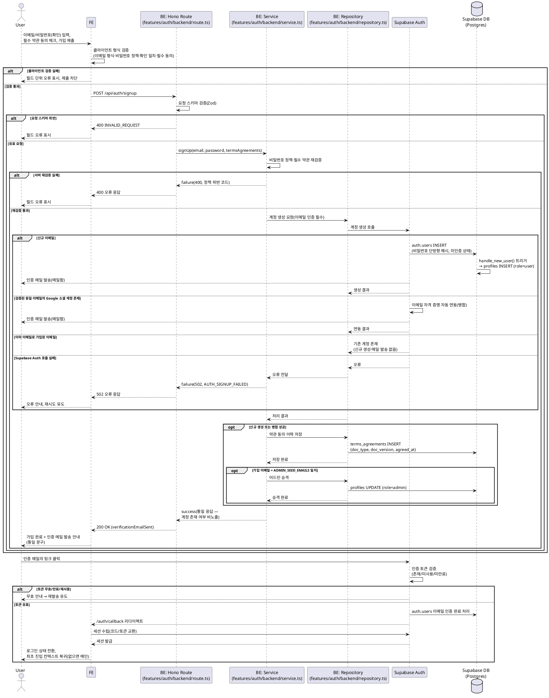

# UC-001: 이메일 회원가입

> 근거 문서: `docs/prd.md`(3장 로그인/회원가입 페이지, 2장 역할 정책), `docs/userflow.md`(001, 용어·전제), `docs/database.md`(§3.1 인증·계정), `docs/techstack.md`(§4 계층 구조, §7 인증).
> 인증 기반은 **Supabase Auth**(관리형 외부 서비스)이며, `docs/external/`에 별도 연동 문서는 없다(연동 기준: `docs/techstack.md` §7).

---

## Primary Actor

- **Guest** (비로그인 방문자)

## Precondition (사용자 관점)

- 사용자는 비로그인 상태다.
- 사용자는 가입에 사용할 이메일의 메일함에 접근할 수 있다.
- (선택) 보호 동작(예: "새 밸류체인 만들기") 시도 중 로그인 유도로 진입한 경우, 복귀할 진입 컨텍스트가 존재할 수 있다.

## Trigger

- 사용자가 회원가입 페이지(`/auth/signup`)에서 이메일·비밀번호(및 확인)를 입력하고 필수 약관(이용약관·개인정보처리방침)에 동의한 뒤 가입을 제출한다.

## Main Scenario

1. Guest가 회원가입 페이지에 진입한다. (보호 동작에서 유도된 경우 복귀 컨텍스트를 보존한다.)
2. 이메일, 비밀번호, 비밀번호 확인을 입력하고 필수 약관 2종 동의를 체크한 후 제출한다.
3. FE가 클라이언트 형식 검증을 수행한다: 이메일 형식, 비밀번호 정책, 확인 일치, 필수 동의 여부. 실패 시 필드 단위 오류를 표시하고 제출을 차단한다.
4. FE가 회원가입 API(`POST /api/auth/signup`)를 호출한다.
5. BE 라우트가 요청 스키마를 검증하고, 서비스가 비밀번호 정책·필수 약관 동의를 재검증한다.
6. 서비스가 리포지토리를 통해 Supabase Auth에 계정 생성을 요청한다. 비밀번호는 단방향 해시로 저장되고 계정은 **이메일 미인증 상태**로 생성된다. `auth.users` INSERT 시 DB 트리거(`handle_new_user`)가 `profiles` 행을 `role=user`로 멱등 생성한다.
7. Supabase Auth가 사용자 메일함으로 인증 메일을 발송한다.
8. 서비스가 약관 동의 이력(`terms_agreements`: 문서 종류·버전·동의 시각)을 저장하고, 가입 이메일이 `ADMIN_SEED_EMAILS`와 일치하면 `profiles.role`을 `admin`으로 승격한다.
9. BE가 **계정 존재 여부와 무관한 통일 형태**의 성공 응답을 반환하고, FE는 "가입 완료 + 인증 메일 발송 안내"를 표시한다.
10. 사용자가 메일함에서 인증 링크를 클릭한다. Supabase Auth가 인증 토큰을 검증해 이메일 인증을 완료 처리하고 앱 콜백(`/auth/callback`)으로 리다이렉트한다.
11. FE가 콜백에서 세션을 수립해 로그인 상태로 전환하고, 보존된 최초 진입 컨텍스트로 복귀한다(없으면 메인으로 이동).

## Edge Cases

| # | 상황 | 처리 |
|---|------|------|
| E1 | 이미 이메일로 가입된 이메일 | 계정 열거 방지: 신규 생성·인증 메일 발송 없이 성공과 **동일한 통일 응답** 반환(존재 여부 비노출) |
| E2 | Google 소셜로 이미 가입된 **검증된 동일 이메일** | 이메일 자격 증명을 기존 계정에 **자동 연동(병합)** 처리(Supabase Auth identity 연동), 별도 충돌 안내 없음 |
| E3 | 비밀번호 정책 미충족 / 확인 불일치 | FE 필드 단위 오류 표시·제출 차단, 서버 재검증 실패 시 400 오류 코드 반환 |
| E4 | 필수 약관 미동의 | FE 제출 차단, 서버 재검증 실패 시 400 오류 코드 반환 |
| E5 | 이메일 형식 오류/필드 누락 | FE 필드 오류, 서버 스키마 검증 시 400 `INVALID_REQUEST` |
| E6 | 네트워크/서버 오류 | 재시도 유도. 동일 요청 재제출 시 이메일 유니크 제약과 트리거 멱등성으로 중복 계정 생성 방지(idempotency) |
| E7 | 약관 동의 이력 저장 실패 | 500 오류 응답·재시도 유도(계정은 미인증 상태로 유지되므로 재제출로 복구 가능) |
| E8 | 봇/무차별 가입 시도 | 레이트 리밋 적용, 초과 시 429 반환(캡차 등 추가 수단은 정책 미확정 — Open Question) |
| E9 | 인증 링크 만료/재사용/위조 | Supabase Auth가 토큰 무효 처리 → 무효 안내 + 인증 메일 재발송 유도 |
| E10 | 인증 완료 전 로그인 시도 | 로그인 차단 + 인증 안내 화면 유도, 재발송 진입 제공(UC-002 연계) |

## Business Rules

### 계정 생성 규칙

- 비밀번호는 단방향 해시로만 저장한다(평문 저장 금지). 해시 저장은 Supabase Auth에 위임한다.
- `role`은 기본 `user`. 가입 이메일이 환경변수 `ADMIN_SEED_EMAILS`(콤마 구분)와 일치하면 `admin`으로 부여한다.
- `profiles` 행은 `auth.users` AFTER INSERT 트리거 `handle_new_user()`가 멱등 생성한다(BE에서 직접 INSERT하지 않음).
- 탈퇴 후 동일 이메일 재가입은 즉시 허용한다(UC-006 연계).

### 이메일 인증 규칙

- 이메일 인증은 **필수**다. 인증 완료 전에는 미인증 상태로 서비스 이용이 불가하며, 로그인 시 인증 안내 화면으로 유도한다(UC-002).
- 인증 링크 검증(존재/미사용/미만료)은 Supabase Auth가 수행한다.
- 인증 완료 시 로그인 상태로 전환하고 최초 진입 컨텍스트로 복귀한다.

### 계정 열거 방지 규칙

- 가입 응답은 계정 존재 여부와 무관하게 **동일한 형태·문구**로 반환한다(userflow 용어·전제). 중복 이메일에 대한 별도 오류 코드를 노출하지 않는다.

### 약관 동의 규칙

- 이용약관(`terms_of_service`)·개인정보처리방침(`privacy_policy`) 2종 모두 필수 동의다. 미동의 시 가입 불가.
- 동의 이력은 문서 종류·버전·동의 시각과 함께 `terms_agreements`에 기록한다.

### 남용 방지 규칙

- 가입 요청에 레이트 리밋을 적용한다(수치는 상수 관리). 초과 시 429를 반환한다.

### External Service Integration

- **Supabase Auth** (관리형 인증 서비스, `docs/techstack.md` §7 기준 — `docs/external/`에 별도 문서 없음):
  - 계정 생성·비밀번호 단방향 해시 저장·이메일 유니크 보장.
  - 인증 메일 발송(내장 이메일) 및 인증 토큰 검증·이메일 인증 완료 처리.
  - 세션/토큰 발급(인증 완료 후 콜백에서 세션 수립).
  - 검증된 동일 이메일의 소셜(Google) 계정과 이메일 자격 증명 자동 연동(병합).
  - 세션·인증 토큰·소셜 식별자는 `auth` 스키마에서 Supabase Auth가 관리하며 자체 테이블을 두지 않는다.
- BE는 서버 전용 키(service-role)로 Supabase Auth를 호출하고, FE는 콜백에서의 세션 수립에만 관여한다.

### API Specification

#### 1) `POST /api/auth/signup` — 회원가입

- **Request Schema** (`SignupRequestSchema`)

  ```typescript
  {
    email: string,                 // 이메일 형식
    password: string,              // 비밀번호 정책 준수(정책 수치는 상수 관리)
    passwordConfirm: string,       // password와 일치
    termsAgreements: Array<{
      docType: 'terms_of_service' | 'privacy_policy',
      docVersion: string
    }>,                            // 필수 2종 모두 포함되어야 함
    redirectTo?: string            // 인증 완료 후 복귀할 진입 컨텍스트 경로(선택)
  }
  ```

- **Response Schema** (`SignupResponseSchema`, HTTP 200 — 계정 존재 여부와 무관한 통일 형태)

  ```typescript
  {
    email: string,
    verificationEmailSent: true    // 항상 동일 형태(계정 열거 방지)
  }
  ```

- **Error Codes**
  - `INVALID_REQUEST` (400): 요청 스키마 검증 실패(이메일 형식/필드 누락)
  - `AUTH_PASSWORD_POLICY_VIOLATION` (400): 비밀번호 정책 미충족
  - `AUTH_PASSWORD_CONFIRM_MISMATCH` (400): 비밀번호 확인 불일치
  - `AUTH_TERMS_NOT_AGREED` (400): 필수 약관 미동의(2종 미포함)
  - `AUTH_RATE_LIMITED` (429): 가입 요청 레이트 리밋 초과
  - `AUTH_SIGNUP_FAILED` (502): Supabase Auth 호출 실패(외부 서비스 오류)
  - `AUTH_TERMS_SAVE_FAILED` (500): 약관 동의 이력 저장 실패
  - ※ 중복 이메일은 오류 코드를 반환하지 않고 200 통일 응답으로 처리한다.

#### 2) `GET /auth/callback` — 이메일 인증 콜백 (페이지 라우트, Hono API 아님)

- 인증 메일 링크 → Supabase Auth 토큰 검증 → 본 콜백으로 리다이렉트.
- 콜백에서 세션을 수립(코드/토큰 교환)한 뒤 `redirectTo`(보존된 진입 컨텍스트) 또는 메인으로 이동.
- 토큰 무효/만료 시: 무효 안내 화면 + 인증 메일 재발송 유도.

### Database Operations

| 테이블 | 연산 | 내용 |
|---|---|---|
| `auth.users` (Supabase Auth 관리) | INSERT | 계정 생성(비밀번호 단방향 해시, 이메일 미인증 상태). 인증 완료 시 인증 상태 UPDATE도 Supabase Auth가 수행 |
| `profiles` | INSERT (트리거) | `handle_new_user()` 트리거가 `role='user'`로 멱등 생성 |
| `profiles` | UPDATE | 가입 이메일이 `ADMIN_SEED_EMAILS`와 일치할 때 `role='admin'` 승격 |
| `terms_agreements` | INSERT | 문서 종류(`doc_type`)별 1행 — `doc_version`, `agreed_at` 기록 |

- RLS: 전면 비활성(인가는 Hono 미들웨어 서버측 검증) — `docs/database.md` 원칙.

## Sequence Diagram


