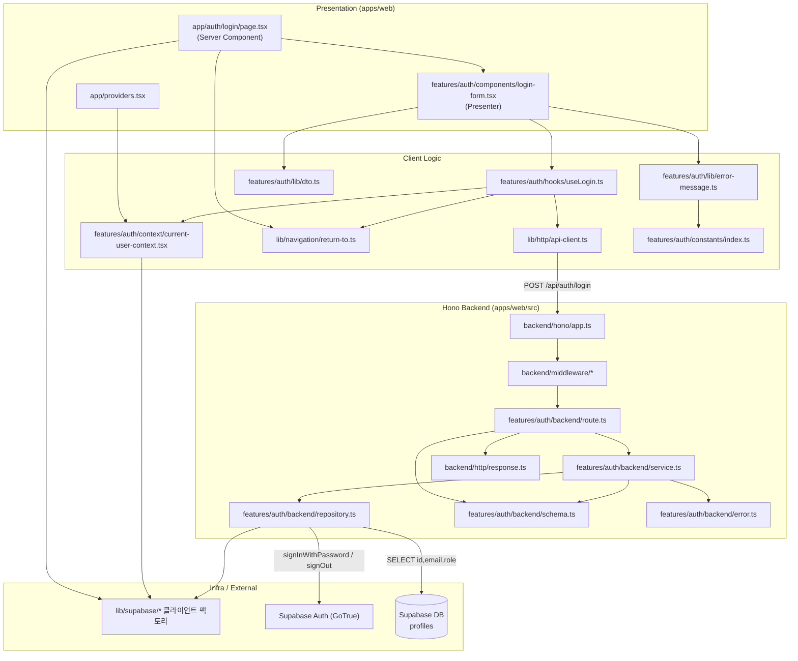

# Plan: UC-002 이메일 로그인

> 근거: `docs/usecases/002/spec.md`, `docs/usecases/000_decisions.md`(A-5·A-6·A-13), `docs/techstack.md` §4·§7·§9, `docs/database.md` §3.1, `.claude/skills/spec_to_plan/references/hono-backend-guide.md`.
> 로그인 페이지는 복잡도 L1로 `docs/pages/`에 상태관리 문서가 없다(pipeline_state Phase 6 결정). 페이지 상태는 Context+useReducer 없이 **react-hook-form 로컬 상태 + TanStack Query mutation**으로 관리한다.
> 작성 시점 기준 `apps/` 스캐폴드와 다른 plan.md가 존재하지 않으므로, 아래 "공통" 표기 모듈은 본 plan이 최초 정의하며 이후 유스케이스 plan(001, 003~006 등)은 위치만 참조해 재사용한다.

## 개요

| 모듈 | 위치 | 설명 |
| --- | --- | --- |
| **[공통]** Hono 앱 싱글턴 | `apps/web/src/backend/hono/app.ts` | `createHonoApp()` 싱글턴, 미들웨어 체인(errorBoundary → withAppContext → withSupabase), feature 라우터 등록 |
| **[공통]** Hono 컨텍스트 | `apps/web/src/backend/hono/context.ts` | `AppEnv` 타입, `getSupabase(c)`/`getSupabaseAuth(c)`/`getLogger(c)`/`getConfig(c)` 접근자 |
| **[공통]** HTTP 응답 헬퍼 | `apps/web/src/backend/http/response.ts` | `HandlerResult<T,E,M>`, `success()`/`failure()`/`respond()` — 표준 응답 envelope |
| **[공통]** 백엔드 미들웨어 | `apps/web/src/backend/middleware/{error.ts,context.ts,supabase.ts}` | errorBoundary(전역 예외→500), withAppContext(logger/config 주입), withSupabase(서비스롤 + 요청 쿠키 바인딩 인증 클라이언트 주입) |
| **[공통]** Supabase 클라이언트 팩토리 | `apps/web/src/lib/supabase/{service-role.ts,route-client.ts,server-component.ts,browser.ts}` | 서비스롤 클라이언트, Hono 요청/응답 쿠키 어댑터 기반 `@supabase/ssr` 클라이언트, RSC용 읽기 클라이언트, 브라우저 클라이언트. 타임아웃 fetch 주입·환경변수 관리 포함(외부 연동 계층) |
| **[공통]** API fetch 유틸 | `apps/web/src/lib/http/api-client.ts` | FE→`/api/*` 호출 래퍼. 응답 envelope 파싱, `ApiError`(code/status/message) 변환, 타임아웃 |
| **[공통]** returnTo 안전 검증 | `apps/web/src/lib/navigation/return-to.ts` | 오픈 리다이렉트 방지 순수 함수 `sanitizeReturnTo()` (001/003의 복귀 컨텍스트에서도 재사용) |
| **[공통]** 루트 Providers | `apps/web/src/app/providers.tsx` | `QueryClientProvider` + `CurrentUserProvider` 래핑 (Client Component) |
| **[auth 공통]** Zod 스키마 | `apps/web/src/features/auth/backend/schema.ts` | `LoginRequestSchema`/`ProfileRowSchema`/`LoginResponseSchema` (001~006이 같은 파일에 스키마 추가) |
| **[auth 공통]** 에러 코드 | `apps/web/src/features/auth/backend/error.ts` | `authErrorCodes` 상수(`as const`) + `AuthServiceError` 타입 |
| **[auth 공통]** 리포지토리 | `apps/web/src/features/auth/backend/repository.ts` | Supabase Auth 호출(`signInWithPassword`·세션 폐기)과 `profiles` 조회 캡슐화 (Persistence + 외부 연동) |
| 서비스 | `apps/web/src/features/auth/backend/service.ts` | `loginWithEmail()` — 인증 결과 매핑, 프로필 결합, 세션 폐기 지시, DTO 변환·검증 (순수 비즈니스 로직) |
| 라우트 | `apps/web/src/features/auth/backend/route.ts` | `POST /auth/login` — 요청 파싱·Zod 검증·서비스 호출·에러 로깅·`respond()` |
| **[auth 공통]** DTO 재노출 | `apps/web/src/features/auth/lib/dto.ts` | backend `schema.ts`의 Request/Response 스키마·타입을 FE에서 import하도록 재노출 (FE↔BE 검증 규칙 단일화) |
| **[auth 공통]** 메시지·경로 상수 | `apps/web/src/features/auth/constants/index.ts` | 통일 실패 문구(Google 대체 안내 포함, A-5), 미인증·레이트리밋·일시 오류 문구, `/auth/login`·인증 안내 경로 상수 |
| 에러→메시지 매핑 | `apps/web/src/features/auth/lib/error-message.ts` | `mapLoginErrorToMessage()` 순수 함수 — 에러 코드→사용자 문구·후속 동작 결정 |
| 로그인 mutation 훅 | `apps/web/src/features/auth/hooks/useLogin.ts` | TanStack Query `useMutation` — API 호출, 성공 시 현재 사용자 갱신·리다이렉트 위임 |
| **[auth 공통]** 현재 사용자 컨텍스트 | `apps/web/src/features/auth/context/current-user-context.tsx` | 브라우저 Supabase 클라이언트 `onAuthStateChange` 구독(A-13) 기반 로그인 상태 전역 제공 — 헤더 갱신·타 탭 동기화 |
| 로그인 폼 | `apps/web/src/features/auth/components/login-form.tsx` | Presenter — react-hook-form + zodResolver, 필드 오류·제출 상태·서버 오류 표시 |
| 로그인 페이지 | `apps/web/src/app/auth/login/page.tsx` | Server Component — 로그인 상태면 리다이렉트, `returnTo` searchParam 파싱 후 폼에 전달 |

- DB 마이그레이션: 신규 없음. `supabase/migrations/0002_profiles_and_terms.sql`(profiles + `handle_new_user()`)을 그대로 사용한다(조회 전용).
- `docs/external/` 문서 없음: Supabase Auth는 스택 구성요소로 `docs/techstack.md` §7이 SOT (spec 명시).

## Diagram



데이터 흐름: Presentation(폼) → hooks(mutation) → api-client → Hono route → service → repository → Supabase Auth/DB. 세션 쿠키는 route에 바인딩된 `@supabase/ssr` 클라이언트가 `Set-Cookie`로 기록한다(응답 바디 토큰 미포함).

## Implementation Plan

### 1. [공통] HTTP 응답 헬퍼 — `backend/http/response.ts`

- 구현 내용:
  1. `HandlerResult<T, E extends string, M>` 판별 유니온(`ok: true → { status, data }` / `ok: false → { status, error: { code, message, details? } }`) 정의.
  2. `success(data, status=200)`, `failure(status, code, message, details?)`, `respond(c, result)`(Hono Context에 status+JSON envelope 기록) 구현. hono-backend-guide의 시그니처를 그대로 따른다.
- 의존성: 없음 (최우선 구현).

**Business Logic — Unit Tests:**

- [ ] `success(data)`가 `ok=true, status=200, data` 형태를 반환한다.
- [ ] `failure(401, 'X', 'msg', details)`가 `ok=false`와 error 필드 전체를 보존한다.
- [ ] `respond()`가 성공 결과를 해당 status의 JSON으로, 실패 결과를 `{ error: { code, message } }` envelope으로 직렬화한다.

### 2. [공통] Supabase 클라이언트 팩토리 — `lib/supabase/*` (외부 연동 모듈)

- 구현 내용:
  1. `service-role.ts`: `createClient(NEXT_PUBLIC_SUPABASE_URL, SUPABASE_SERVICE_ROLE_KEY, { auth: { persistSession: false } })` 팩토리. 서버 전용(클라이언트 번들 유입 금지 — `server-only` import).
  2. `route-client.ts`: `createRouteAuthClient(c: Context)` — `@supabase/ssr`의 `createServerClient(URL, NEXT_PUBLIC_SUPABASE_ANON_KEY, { cookies: { getAll, setAll } })`. `getAll`은 Hono `c.req` 쿠키 파싱, `setAll`은 `c.header('Set-Cookie', ..., { append: true })`로 HTTP-only 세션 쿠키 기록. **로그인/로그아웃 등 세션 확립·폐기 전용.**
  3. `server-component.ts`: Next `cookies()` 기반 RSC 읽기 전용 클라이언트(`getUser()`용, 쿠키 쓰기 no-op).
  4. `browser.ts`: `createBrowserClient(URL, ANON_KEY)` 모듈 싱글턴 — `onAuthStateChange` 구독용.
  5. 모든 팩토리에 `AbortSignal.timeout(SUPABASE_FETCH_TIMEOUT_MS)`을 적용한 커스텀 fetch 주입. 타임아웃 상수는 `apps/web/src/config/constants.ts`(또는 `packages/domain/constants`)에서 관리, 하드코딩 금지.
- 의존성: 없음.
- **외부 서비스 연동 필수 항목:**
  - 에러 처리: 팩토리 자체는 예외를 삼키지 않고 호출부(repository)로 전달. env 누락 시 기동 시점에 명시적 오류(`assertEnv`).
  - 재시도: 로그인 요청은 **자동 재시도 없음**(레이트 리밋 악화 방지, 사용자 트리거 재시도만 — spec Edge Case).
  - 타임아웃: 커스텀 fetch AbortSignal(상수 관리).
  - 환경변수: `NEXT_PUBLIC_SUPABASE_URL`, `NEXT_PUBLIC_SUPABASE_ANON_KEY`, `SUPABASE_SERVICE_ROLE_KEY`(techstack §9). 서비스롤 키는 서버 전용.
  - 단위 테스트: env 누락 시 명시적 오류 / `route-client`의 `getAll`이 요청 쿠키를 정확히 파싱 / `setAll`이 `Set-Cookie` append 호출.

### 3. [공통] Hono 컨텍스트·미들웨어·앱 — `backend/hono/*`, `backend/middleware/*`

- 구현 내용:
  1. `context.ts`: `AppEnv = { Variables: { supabase, supabaseAuth, logger, config } }`, 접근자 `getSupabase`/`getSupabaseAuth`/`getLogger`/`getConfig` (직접 `c.env`/`c.var` 접근 금지 규칙 준수).
  2. `middleware/error.ts` errorBoundary: 미처리 예외를 잡아 500 envelope + 로깅.
  3. `middleware/context.ts` withAppContext: logger(console 래퍼)와 config(env 스냅샷) 주입.
  4. `middleware/supabase.ts` withSupabase: 서비스롤 클라이언트(모듈 2-1)와 요청 바인딩 인증 클라이언트(모듈 2-2)를 컨텍스트에 주입. (admin role 검증 미들웨어는 어드민 유스케이스 plan 소관 — 본 라우트는 공개 엔드포인트.)
  5. `hono/app.ts` createHonoApp: 싱글턴 + `basePath('/api')` + 미들웨어 체인 + `registerAuthRoutes(app)` 등록.
  6. `app/api/[[...hono]]/route.ts`: `runtime='nodejs'`, GET/POST 등 메서드를 Hono 앱에 위임.
- 의존성: 모듈 1, 2.

**QA Sheet (통합 스모크):**

| # | 시나리오 | 기대 결과 |
| --- | --- | --- |
| 1 | 존재하지 않는 `/api/unknown` 호출 | 404 envelope 응답 |
| 2 | 미들웨어에서 예외 강제 발생 | 500 + 에러 로깅, 프로세스 생존 |
| 3 | `/api/auth/login` 라우팅 | auth 라우터로 정상 도달(모듈 8 등록 후) |

### 4. [공통] returnTo 안전 검증 — `lib/navigation/return-to.ts`

- 구현 내용: `sanitizeReturnTo(raw: string | null | undefined): string` 순수 함수. 규칙 — `/` 하나로 시작하는 **내부 경로만 허용**, 위반 시 `DEFAULT_RETURN_PATH('/')` 반환(spec Business Rule: 오픈 리다이렉트 방지). `/auth/`로 시작하는 경로는 리다이렉트 루프 방지를 위해 기본 경로로 대체.
- 의존성: 없음.

**Business Logic — Unit Tests:**

- [ ] `/valuechains/new` → 그대로 반환 (정상)
- [ ] `undefined`·빈 문자열 → `/`
- [ ] `https://evil.com`, `javascript:alert(1)` → `/` (절대 URL·스킴 차단)
- [ ] `//evil.com`, `/\evil.com` → `/` (프로토콜 상대·백슬래시 트릭 차단)
- [ ] `/auth/login?returnTo=/x` → `/` (루프 방지)
- [ ] 쿼리스트링 포함 내부 경로 `/companies/005930?tab=finance` → 그대로 반환

### 5. [auth 공통] Zod 스키마 — `features/auth/backend/schema.ts`

- 구현 내용:
  1. `LoginRequestSchema`: `email`(필수, `z.string().email()`), `password`(필수, `z.string().min(1)` — 로그인은 형식 검증만, 정책 강도 미적용: spec Validation Rules).
  2. `ProfileRowSchema`(snake_case): `id`(uuid), `email`(string), `role`(`z.enum(['user','admin'])`) — migration 0002와 일치.
  3. `LoginResponseSchema`(camelCase): `userId`(uuid), `email`, `role`. **토큰 필드 없음**(세션은 Set-Cookie 전용).
  4. `z.infer` 타입 전부 export. UC-001 등 다른 auth 스키마가 같은 파일에 추가되므로 스키마명은 `Login*` 접두 유지.
- 의존성: 없음.
- Unit Tests: 불필요(스키마 정의) — 검증 동작은 서비스/라우트 테스트에서 커버.

### 6. [auth 공통] 에러 코드 — `features/auth/backend/error.ts`

- 구현 내용: spec API Specification의 코드 그대로 정의.

  ```
  invalidCredentials: 'AUTH_INVALID_CREDENTIALS'   // 401
  emailNotConfirmed:  'AUTH_EMAIL_NOT_CONFIRMED'   // 403
  rateLimited:        'AUTH_RATE_LIMITED'          // 429
  profileNotFound:    'AUTH_PROFILE_NOT_FOUND'     // 500
  serviceError:       'AUTH_SERVICE_ERROR'         // 502
  validationError:    'AUTH_VALIDATION_ERROR'      // 500 (Row/DTO 검증 실패)
  ```

  `as const` + `AuthServiceError` 타입 export. (`INVALID_REQUEST`(400)는 라우트 계층 공통 코드로 route.ts에서 직접 사용 — guide 컨벤션.) UC-001의 가입 관련 코드는 UC-001 plan이 이 파일에 추가한다.
- 의존성: 없음. Unit Tests: 불필요(상수).

### 7. [auth 공통] 리포지토리 — `features/auth/backend/repository.ts`

- 구현 내용 (Persistence + Supabase Auth 외부 연동 캡슐화. service는 이 인터페이스만 알고 Supabase SDK 문법을 모른다):
  1. `signInWithPassword(authClient, email, password): Promise<SignInOutcome>` — `authClient.auth.signInWithPassword()` 호출 후 결과를 판별 유니온으로 매핑:
     - 성공 → `{ kind: 'success', userId, email }` (세션 쿠키는 이 호출 시점에 route-client의 `setAll`로 기록됨. `last_sign_in_at` 갱신은 Supabase Auth 내부 동작 — 앱 코드 없음)
     - `AuthApiError.code === 'invalid_credentials'` → `{ kind: 'invalid_credentials' }` (미가입·오입력·소셜 전용·탈퇴 계정 모두 동일 — 계정 열거 방지 자동 충족)
     - `code === 'email_not_confirmed'` → `{ kind: 'email_not_confirmed' }`
     - `status === 429` 또는 `code === 'over_request_rate_limit'` → `{ kind: 'rate_limited' }`
     - 그 외 오류·타임아웃·네트워크 예외(try/catch) → `{ kind: 'service_error', message }`
  2. `discardSession(authClient): Promise<void>` — `authClient.auth.signOut()`으로 확립된 세션 폐기(쿠키 제거). 실패해도 예외 전파하지 않고 결과만 반환(폐기 실패는 로깅 대상).
  3. `findProfileById(serviceClient, userId)` — `from('profiles').select('id, email, role').eq('id', userId).maybeSingle()`. 반환: `{ kind: 'found', row } | { kind: 'not_found' } | { kind: 'error', message }`.
- 의존성: 모듈 2(클라이언트 타입), 모듈 5(Row 타입 참조).
- **외부 서비스 연동 필수 항목:**
  - 에러 처리: 모든 Supabase 호출 try/catch, 오류를 판별 유니온으로 변환(예외 전파 금지 — Result 패턴).
  - 재시도: 없음(로그인 자동 재시도 금지 — 모듈 2와 동일 근거).
  - 타임아웃: 모듈 2의 팩토리 주입 fetch가 담당(이중 구현 금지).
  - 환경변수: 직접 접근 금지 — 주입된 클라이언트만 사용.

**Business Logic — Unit Tests (Supabase 클라이언트 mock):**

- [ ] signIn 성공 응답 → `{ kind: 'success', userId, email }` 매핑
- [ ] `invalid_credentials` 에러 → `{ kind: 'invalid_credentials' }`
- [ ] `email_not_confirmed` 에러 → `{ kind: 'email_not_confirmed' }`
- [ ] status 429 → `{ kind: 'rate_limited' }`
- [ ] fetch 타임아웃/네트워크 예외 throw → `{ kind: 'service_error' }` (예외 미전파)
- [ ] `findProfileById`: 행 존재 → `found`, `maybeSingle` null → `not_found`, 쿼리 오류 → `error`
- [ ] `discardSession`: signOut 실패(throw)해도 예외를 전파하지 않는다

### 8. 서비스 — `features/auth/backend/service.ts`

- 구현 내용: `loginWithEmail(serviceClient, authClient, request): Promise<HandlerResult<LoginResponse, AuthServiceError, unknown>>`
  1. `repository.signInWithPassword()` 호출, outcome을 에러 코드로 매핑: `invalid_credentials`→`failure(401, AUTH_INVALID_CREDENTIALS)` / `email_not_confirmed`→`failure(403, AUTH_EMAIL_NOT_CONFIRMED)` / `rate_limited`→`failure(429, AUTH_RATE_LIMITED)` / `service_error`→`failure(502, AUTH_SERVICE_ERROR)`.
  2. 성공 시 `repository.findProfileById(serviceClient, userId)` 호출.
  3. 프로필 `not_found`/`error` 시 **`repository.discardSession(authClient)`을 반드시 호출한 뒤** `failure(500, AUTH_PROFILE_NOT_FOUND)` 반환 — "로그인 성공 = 인증 성공 + 프로필 조회 성공" 규칙, 반쪽 로그인 방지(spec Business Rule).
  4. `ProfileRowSchema.safeParse`로 Row 검증 → 실패 시 세션 폐기 후 `failure(500, AUTH_VALIDATION_ERROR)`.
  5. snake_case→camelCase DTO 변환(`id→userId`) 후 `LoginResponseSchema.safeParse` → 실패 시 세션 폐기 후 `failure(500, AUTH_VALIDATION_ERROR)`.
  6. `success(loginResponse)` 반환. 서비스는 HTTP·쿠키·로깅을 직접 다루지 않는다(로깅은 route, 쿠키는 repository/route-client).
- 의존성: 모듈 1, 5, 6, 7.

**Business Logic — Unit Tests (repository mock):**

- [ ] 인증 성공 + 프로필 조회 성공 → `success`에 `{ userId, email, role }` camelCase DTO 반환
- [ ] `role='admin'` 프로필 → 응답 `role`이 `admin` (FE 어드민 메뉴 노출 판단용)
- [ ] `invalid_credentials` → 401 `AUTH_INVALID_CREDENTIALS`
- [ ] `email_not_confirmed` → 403 `AUTH_EMAIL_NOT_CONFIRMED`
- [ ] `rate_limited` → 429 `AUTH_RATE_LIMITED`
- [ ] `service_error` → 502 `AUTH_SERVICE_ERROR`
- [ ] 프로필 `not_found` → 500 `AUTH_PROFILE_NOT_FOUND` **이고 `discardSession`이 정확히 1회 호출됨**
- [ ] 프로필 조회 `error` → 500 + `discardSession` 호출
- [ ] Row 검증 실패(예: role='superuser') → 500 `AUTH_VALIDATION_ERROR` + `discardSession` 호출
- [ ] 인증 실패 경로에서는 `findProfileById`·`discardSession`이 호출되지 않음

### 9. 라우트 — `features/auth/backend/route.ts`

- 구현 내용: `registerAuthRoutes(app: Hono<AppEnv>)`에 `app.post('/auth/login', ...)` 등록 (마운트 결과 `POST /api/auth/login`, 공개 엔드포인트).
  1. `c.req.json()` 파싱(파싱 실패도 400) → `LoginRequestSchema.safeParse` → 실패 시 `respond(c, failure(400, 'INVALID_REQUEST', ..., error.format()))` — FE와 동일 규칙의 서버 재검증.
  2. `getSupabase(c)`(서비스롤)·`getSupabaseAuth(c)`(쿠키 바인딩)·`getLogger(c)` 주입.
  3. `loginWithEmail(...)` 호출. `ok=false`이고 코드가 `AUTH_PROFILE_NOT_FOUND`/`AUTH_VALIDATION_ERROR`/`AUTH_SERVICE_ERROR`면 `logger.error` 기록(401/403/429는 정상 사용자 흐름이라 debug 수준).
  4. `respond(c, result)` 반환. 성공 응답 바디에는 `LoginResponse`만 포함되고 세션 토큰은 `Set-Cookie`(HTTP-only)로만 나간다.
- 의존성: 모듈 1, 3, 5, 6, 8. `hono/app.ts`에 `registerAuthRoutes(app)` 1줄 추가.

**Presentation(서버측 계약) — QA Sheet (curl/Postman + Supabase 테스트 계정):**

| # | 시나리오 | 기대 결과 |
| --- | --- | --- |
| 1 | 유효 자격 증명 POST | 200, 바디 `{ userId, email, role }`, `Set-Cookie`에 HTTP-only 세션 쿠키 존재 |
| 2 | 응답 바디 검사 | access/refresh 토큰 문자열이 바디에 없음 |
| 3 | 이메일 형식 오류/password 누락 | 400 `INVALID_REQUEST` + zod details |
| 4 | JSON 아닌 바디 | 400 `INVALID_REQUEST` |
| 5 | 틀린 비밀번호 / 미가입 이메일 | 두 경우 모두 **동일한** 401 `AUTH_INVALID_CREDENTIALS` 응답(바디·소요시간 관찰상 구분 불가) |
| 6 | 이메일 미인증 계정 | 403 `AUTH_EMAIL_NOT_CONFIRMED` |
| 7 | 짧은 시간 반복 실패 | 429 `AUTH_RATE_LIMITED` (Supabase 내장 리밋, A-6: 별도 잠금 없음) |
| 8 | profiles 행을 임시 삭제한 계정으로 로그인 | 500 `AUTH_PROFILE_NOT_FOUND`, 응답 쿠키로 유효 세션이 남지 않음(후속 `getUser()` 미인증), 서버 에러 로그 기록 |
| 9 | 이미 유효 세션 쿠키를 가진 상태로 재호출 | 200 + 새 세션 재발급(멱등) |

### 10. [auth 공통] DTO 재노출 — `features/auth/lib/dto.ts`

- 구현 내용: `export { LoginRequestSchema, LoginResponseSchema } from '../backend/schema'` 및 타입 재노출. FE(폼·훅)는 backend 경로를 직접 import하지 않고 이 파일만 참조(FE/BE 검증 규칙 단일 소스 — DRY).
- 의존성: 모듈 5. Unit Tests: 불필요(재노출).

### 11. [auth 공통] 메시지·경로 상수 — `features/auth/constants/index.ts`

- 구현 내용(하드코딩 금지 규칙 이행 — 모든 문구·경로를 상수화):
  - `LOGIN_ERROR_MESSAGES`: 401 통일 문구(**"이메일 또는 비밀번호가 올바르지 않습니다. Google로 가입하셨다면 Google 로그인을 이용해 주세요."** — 계정 존재 여부 비노출 + A-5의 대체 경로 안내), 403 인증 안내, 429 재시도 안내, 500/502 일시 오류 문구.
  - `AUTH_PATHS`: `/auth/login`, 이메일 인증 안내 경로(`/auth/verify-email` — 화면 자체는 UC-001 plan 소관), `RETURN_TO_PARAM='returnTo'`.
- 의존성: 없음. Unit Tests: 불필요(상수).

### 12. 에러→메시지 매핑 — `features/auth/lib/error-message.ts`

- 구현 내용: `mapLoginError(error: ApiError): LoginErrorView` 순수 함수. 반환 형태 `{ message: string, action: 'none' | 'goToVerifyEmail' }` — 403이면 `goToVerifyEmail`(인증 안내 화면 이동 + 재발송 진입점), 그 외는 문구만. 알 수 없는 코드·네트워크 오류는 일시 오류 문구로 폴백.
- 의존성: 모듈 6(코드), 11(문구).

**Business Logic — Unit Tests:**

- [ ] `AUTH_INVALID_CREDENTIALS` → 통일 문구(Google 안내 포함), action `none`
- [ ] `AUTH_EMAIL_NOT_CONFIRMED` → 인증 안내 문구, action `goToVerifyEmail`
- [ ] `AUTH_RATE_LIMITED` → 재시도 안내 문구
- [ ] `AUTH_PROFILE_NOT_FOUND`/`AUTH_SERVICE_ERROR`/`INVALID_REQUEST` → 일시 오류·입력 확인 문구
- [ ] 정의되지 않은 코드/네트워크 오류(status 0) → 일시 오류 폴백

### 13. [공통] API fetch 유틸 — `lib/http/api-client.ts`

- 구현 내용: `apiPost<TReq, TRes>(path, body)` 등 최소 래퍼. `credentials: 'same-origin'`(세션 쿠키), JSON 직렬화, 응답 envelope 파싱 후 실패 시 `ApiError { status, code, message }` throw(TanStack Query onError 소비용), `AbortSignal.timeout(API_TIMEOUT_MS)` 상수 적용.
- 의존성: 없음.

**Business Logic — Unit Tests (fetch mock):**

- [ ] 200 envelope → data 반환
- [ ] 401 envelope → `ApiError(code='AUTH_INVALID_CREDENTIALS', status=401)` throw
- [ ] 네트워크 예외/타임아웃 → `ApiError(status=0)` 정규화
- [ ] envelope 형식이 아닌 응답 → 일반 오류로 정규화

### 14. [auth 공통] 현재 사용자 컨텍스트 — `features/auth/context/current-user-context.tsx`

- 구현 내용: `CurrentUserProvider`(Client Component) + `useCurrentUser()` 훅.
  1. 마운트 시 브라우저 클라이언트 `auth.getUser()`로 초기 상태 로드(`loading → authenticated | unauthenticated`).
  2. `onAuthStateChange` 구독으로 로그인/로그아웃·타 탭 변경을 즉시 반영(000_decisions A-13). 언마운트 시 구독 해제.
  3. `refresh()` 노출 — 로그인 성공 직후 훅(모듈 15)이 호출해 헤더 UI 즉시 갱신. `role`은 로그인 응답으로 수신해 컨텍스트에 반영(어드민 메뉴 노출용 — 인가 자체는 항상 서버 재검증, spec Business Rule).
  4. `app/providers.tsx`에서 `QueryClientProvider`와 함께 래핑.
- 의존성: 모듈 2(browser.ts), 8(providers).

**Presentation — QA Sheet:**

| # | 시나리오 | 기대 결과 |
| --- | --- | --- |
| 1 | 비로그인 첫 진입 | 헤더가 로그인/회원가입 상태로 렌더 |
| 2 | 로그인 성공 직후 | 새로고침 없이 헤더가 로그인 상태로 갱신 |
| 3 | 다른 탭에서 로그아웃 | 현재 탭도 비로그인 상태로 동기화(A-13) |
| 4 | admin 계정 로그인 | 어드민 메뉴 노출 플래그 true |

### 15. 로그인 mutation 훅 — `features/auth/hooks/useLogin.ts`

- 구현 내용: `useLogin(returnTo?: string)` — `useMutation`으로 `apiPost('/api/auth/login', LoginRequest)` 호출.
  - `onSuccess`: `useCurrentUser().refresh()` 호출 → `router.replace(sanitizeReturnTo(returnTo))` (내부 경로만, 없으면 메인 — 모듈 4 재사용).
  - `onError`: `mapLoginError()` 결과를 상태로 노출. `action === 'goToVerifyEmail'`이면 `AUTH_PATHS.verifyEmail + '?email=...'`로 이동.
  - `isPending`을 폼 제출 중 상태로 노출(제출 중 재제출 차단, 실패 시 즉시 해제 — spec Edge Case "FE는 제출 중 상태 해제").
- 의존성: 모듈 4, 10, 12, 13, 14.

**Business Logic — Unit Tests (api-client·router mock):**

- [ ] 성공 시 `refresh()` 호출 후 `sanitizeReturnTo(returnTo)` 경로로 replace
- [ ] returnTo 미지정 시 `/`로 이동
- [ ] returnTo가 외부 URL이면 `/`로 이동(오픈 리다이렉트 방지)
- [ ] 403 오류 시 인증 안내 경로로 이동(email 쿼리 포함)
- [ ] 401 오류 시 이동 없이 오류 메시지 상태만 설정, `isPending` 해제

### 16. 로그인 폼 — `features/auth/components/login-form.tsx` (Presenter)

- 구현 내용: `'use client'`. props: `{ returnTo?: string }`.
  1. react-hook-form + `zodResolver(LoginRequestSchema)`(모듈 10 재노출본) — 이메일 형식·비밀번호 필수 필드 단위 검증, 오류 시 제출 차단(FE/BE 동일 규칙 이중 검증).
  2. `useLogin(returnTo)` 호출, `isPending` 동안 버튼 비활성 + 로딩 표시.
  3. 서버 오류 메시지 영역(폼 상단), 회원가입(`/auth/signup?returnTo=...`)·비밀번호 재설정 링크(returnTo 전파).
  4. shadcn-ui `Input`/`Button`/`Form` 프리미티브 사용, 비즈니스 로직 없음(훅에 위임).
- 의존성: 모듈 10, 11, 15.

**Presentation — QA Sheet:**

| # | 시나리오 | 기대 결과 |
| --- | --- | --- |
| 1 | 잘못된 이메일 형식 입력 후 제출 | 이메일 필드 아래 오류 표시, API 미호출 |
| 2 | 비밀번호 빈 값 제출 | 비밀번호 필드 오류, API 미호출 |
| 3 | 유효 입력 제출 | 버튼 비활성+로딩 → 성공 시 returnTo(없으면 메인) 이동, 헤더 로그인 상태 |
| 4 | 틀린 비밀번호 제출 | 폼 상단에 통일 문구(Google 대체 안내 포함) 표시, 입력값 유지, 재제출 가능 |
| 5 | 미인증 계정 제출 | 인증 안내 화면으로 이동, 재발송 진입점 노출 |
| 6 | 연속 실패로 429 수신 | "잠시 후 재시도" 안내, 제출 상태 해제 |
| 7 | 서버 500/502 | 일시 오류 안내, 제출 상태 해제, 재시도 가능 |
| 8 | Enter 키 제출 | 버튼 클릭과 동일 동작 |
| 9 | 제출 중 버튼 연타 | 중복 요청 미발생 |
| 10 | 모바일 뷰포트(375px) | 폼 레이아웃 깨짐 없음(반응형) |

### 17. 로그인 페이지 — `app/auth/login/page.tsx`

- 구현 내용: Server Component (Next 16 — `searchParams`는 Promise, `await` 필수).
  1. `const { returnTo } = await searchParams` 파싱.
  2. RSC 클라이언트(모듈 2-3) `auth.getUser()`로 세션 확인 — **이미 로그인 상태면 `redirect(sanitizeReturnTo(returnTo))`** (spec Edge Case).
  3. 비로그인일 때 `<LoginForm returnTo={returnTo} />` 렌더(원시값 그대로 전달, sanitize는 이동 시점에 수행).
  4. `metadata`로 페이지 title 지정. `app/auth/` 그룹은 techstack §4 구조 준수.
- 의존성: 모듈 2, 4, 16.

**Presentation — QA Sheet:**

| # | 시나리오 | 기대 결과 |
| --- | --- | --- |
| 1 | 비로그인으로 `/auth/login` 접근 | 로그인 폼 렌더 |
| 2 | 로그인 상태로 `/auth/login` 접근 | 메인으로 즉시 리다이렉트 |
| 3 | 로그인 상태 + `?returnTo=/valuechains/new` | 해당 내부 경로로 리다이렉트 |
| 4 | `?returnTo=https://evil.com` 상태에서 로그인 성공 | 메인으로 이동(외부 URL 무시) |
| 5 | 보호 경로에서 유도되어 진입 → 로그인 성공 | 원래 목적지로 복귀 |

---

## 구현 순서 및 충돌 검토

1. **구현 순서**: 모듈 1→2→3(공통 인프라) → 4→5→6(순수 정의) → 7→8→9(백엔드 계층, TDD: service 테스트 선행) → 10~13(FE 로직) → 14→15 → 16→17(Presentation).
2. **기존 코드베이스 충돌 없음**: `apps/` 미스캐폴드 상태라 신규 생성만 존재. DB는 기존 마이그레이션 0002를 조회 전용으로 사용하며 신규 마이그레이션·스키마 변경 없음.
3. **UC-001과의 경계**: `features/auth/backend/{schema,error,repository,service,route}.ts`·`lib/dto.ts`·`constants`는 auth 공통 파일로, UC-001(가입)·UC-004(재설정)·UC-005(로그아웃) plan은 **같은 파일에 함수/스키마/코드를 추가**한다(파일 재정의 금지). 이메일 인증 안내 화면(`/auth/verify-email`)과 재발송 API는 UC-001 소관 — 본 plan은 경로 상수로만 참조.
4. **결정 사항 반영 확인**: A-5(통일 문구 내 Google 안내 — 모듈 11), A-6(별도 계정 잠금 없음 — Supabase 내장 리밋만, 모듈 7/9), A-13(onAuthStateChange 동기화 — 모듈 14). `last_sign_in_at` 갱신·비밀번호 해시 대조·레이트 리밋은 전부 Supabase Auth 위임으로 앱 코드 없음(spec Business Rules).
