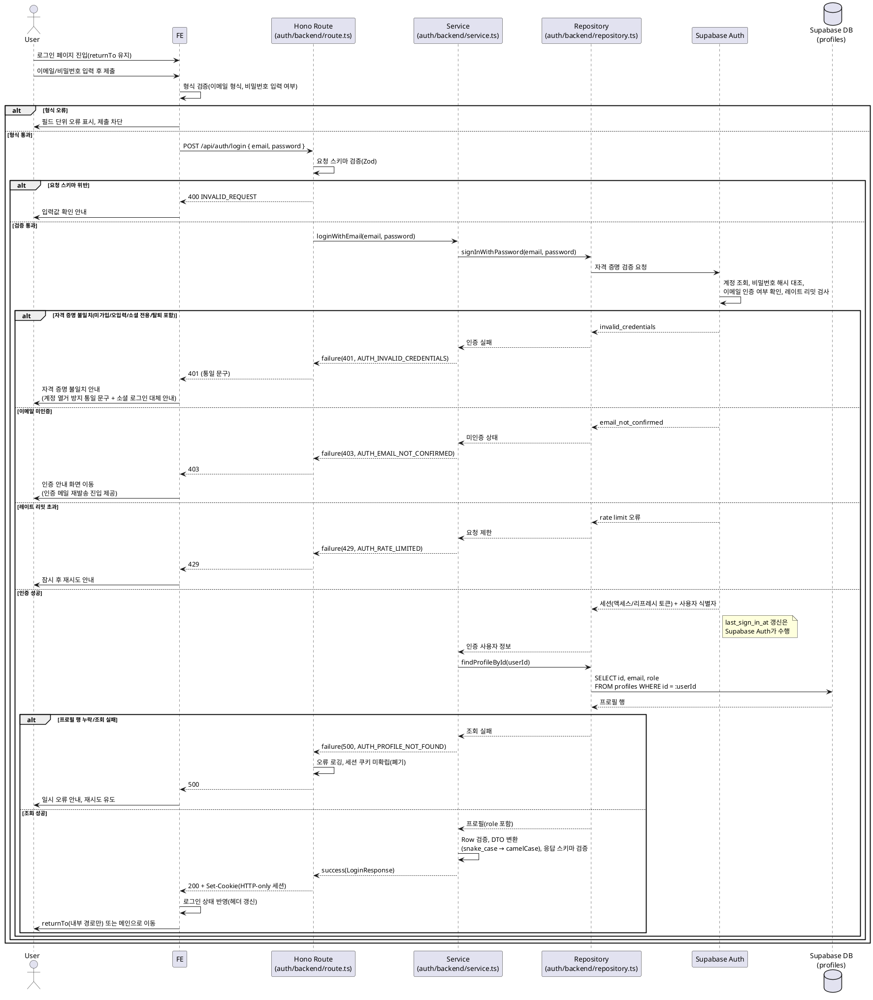

# UC-002: 이메일 로그인

> 근거 문서: `docs/userflow.md` 002, `docs/prd.md` 3장(로그인/회원가입 · 계정 페이지)·5장 IA(`/auth/login`), `docs/database.md` 3.1(인증·계정), `docs/techstack.md` §7(Supabase Auth)·§4(Hono 백엔드 컨벤션).
> 인증 기반은 Supabase Auth(이메일+비밀번호 내장 인증)이며, 세션·비밀번호 해시·이메일 인증 상태는 Supabase `auth` 스키마가 관리한다. 애플리케이션 자체 테이블은 `profiles`(role 보관)만 관여한다.

---

## Primary Actor

- **Guest** (비로그인 방문자)

## Precondition

- 사용자가 이메일/비밀번호로 가입된 계정을 보유하고 있다(UC-001, 또는 소셜 가입 후 이메일 계정이 병합되어 비밀번호가 설정된 경우).
- 사용자가 현재 비로그인 상태다.

## Trigger

- 사용자가 로그인 페이지(`/auth/login`)에서 이메일과 비밀번호를 입력하고 로그인을 제출한다.
- (선행 맥락) 보호 경로(예: "새 밸류체인 만들기") 접근으로 로그인 페이지로 유도된 경우, 복귀 목적지 정보가 함께 전달된다.

## Main Scenario

1. Guest가 로그인 페이지에 진입한다. 보호 경로에서 리다이렉트된 경우 복귀 목적지(returnTo)가 유지된다.
2. 이메일과 비밀번호를 입력한다. FE가 형식을 검증한다(이메일 형식, 비밀번호 입력 여부). 형식 오류 시 필드 단위 오류를 표시하고 제출을 차단한다.
3. 로그인 제출 시 FE가 BE(`POST /api/auth/login`)로 자격 증명을 전송한다.
4. Hono 라우트가 요청 스키마를 검증한다(위반 시 400).
5. 서비스가 리포지토리를 통해 Supabase Auth에 자격 증명 검증을 요청한다. 계정 조회·비밀번호 해시 대조·이메일 인증 여부 확인·로그인 시도 레이트 리밋은 Supabase Auth가 수행한다.
6. 인증 성공 시 Supabase Auth가 세션(액세스/리프레시 토큰)을 발급하고, 최근 로그인 시각(`last_sign_in_at`)을 갱신한다. 세션은 HTTP-only 쿠키로 확립된다.
7. 서비스가 `profiles` 테이블에서 사용자 프로필(`id`, `email`, `role`)을 조회하고, Row 검증 및 응답 DTO 변환·검증을 수행한다.
8. BE가 성공 응답(사용자 식별자·이메일·role)과 세션 쿠키를 반환한다.
9. FE가 로그인 상태로 전환하고(헤더 UI 갱신), 복귀 목적지가 있으면 해당 경로로, 없으면 메인으로 이동한다.

## Edge Cases

| 상황 | 처리 |
|---|---|
| 이메일 형식 오류/비밀번호 미입력 | FE 필드 단위 오류 표시, 제출 차단. 서버도 400(`INVALID_REQUEST`)으로 재검증 |
| 자격 증명 불일치(미가입 이메일, 비밀번호 오입력) | 401 응답. **계정 열거 방지 통일 문구**로 안내(계정 존재 여부 비노출). 실패 횟수 누적은 Supabase Auth 레이트 리밋이 담당 |
| 이메일 미인증(인증 대기) 계정 | 로그인 차단(403), 인증 안내 화면으로 유도하고 인증 메일 재발송 진입점 제공(UC-001 연계) |
| 소셜(Google) 전용 계정(비밀번호 없음) | Supabase Auth가 자격 증명 불일치와 동일하게 응답 → 통일 문구 유지. 통일 실패 문구에 "소셜 계정으로 가입했다면 Google 로그인 이용" 대체 경로 안내를 포함(존재 여부 비노출 유지) |
| 탈퇴 처리된 계정 | 탈퇴 시 계정이 즉시 삭제되므로(UC-006) 자격 증명 불일치와 동일한 통일 문구로 응답 |
| 반복 실패(무차별 대입) | Supabase Auth 내장 레이트 리밋으로 429 응답, 잠시 후 재시도 안내 |
| 토큰 만료/무효 상태에서 재로그인 | 기존 세션 상태와 무관하게 새 세션 정상 재발급(멱등) |
| 인증 성공 후 `profiles` 행 누락/조회 실패 | 500 응답, 세션 미확립(확립된 세션 폐기)으로 반쪽 로그인 상태 방지. 오류 로깅 후 재시도 유도 |
| 네트워크/Supabase Auth 장애 | 오류 안내 및 재시도 유도. FE는 제출 중 상태 해제 |
| 이미 로그인 상태에서 로그인 페이지 접근 | 메인(또는 복귀 목적지)으로 리다이렉트 |

## Business Rules

### Authentication & Session Rules

- 비밀번호는 단방향 해시로만 저장·대조된다(Supabase Auth 관리, 애플리케이션은 평문·해시에 접근하지 않음).
- 이메일 미인증 계정은 로그인(세션 확립)이 차단된다. 인증 완료 후에만 서비스 이용 가능(UC-001 정책).
- 로그인 실패 응답은 계정 존재 여부와 무관하게 **통일 문구**를 사용한다(계정 열거 방지, userflow 용어·전제).
- 세션은 HTTP-only 쿠키(액세스/리프레시 토큰)로 관리하며, 응답 바디에 토큰을 포함하지 않는다(`@supabase/ssr` 서버 클라이언트가 쿠키를 관리).
- 로그인 성공 = "Supabase Auth 인증 성공 + `profiles` 조회 성공"이 모두 충족된 경우에만 성립한다. 프로필 조회 실패 시 세션을 확립하지 않는다.
- 최근 로그인 시각 갱신은 Supabase Auth의 `auth.users.last_sign_in_at`으로 충족한다(별도 테이블/컬럼 없음).
- 복귀 목적지(returnTo) 리다이렉트는 **내부 경로만 허용**한다(오픈 리다이렉트 방지). 외부 URL이면 무시하고 메인으로 이동한다.
- 로그인 성공 후 `role`(user/admin)을 응답에 포함해 FE가 어드민 메뉴 노출 여부를 결정하되, 어드민 라우트/API 접근 인가는 항상 서버 측(Hono 미들웨어)에서 재검증한다(PRD 2장).

### Validation Rules

- 이메일: 필수, 이메일 형식.
- 비밀번호: 필수, 1자 이상(형식 검증만 수행 — 정책 강도 검증은 가입/재설정 시점의 규칙이며 로그인에서는 적용하지 않음).
- FE(react-hook-form + zod)와 BE(Hono 라우트의 zod 스키마)에서 동일 규칙으로 이중 검증한다.

### API Specification

- **Endpoint**: `POST /api/auth/login`
- **인증**: 불필요(공개 엔드포인트)
- **Request Schema**: `LoginRequestSchema`

  ```json
  {
    "email": "string (이메일 형식, 필수)",
    "password": "string (1자 이상, 필수)"
  }
  ```

- **Response Schema (200)**: `LoginResponseSchema` — 세션 토큰은 바디가 아닌 `Set-Cookie`(HTTP-only)로 전달

  ```json
  {
    "userId": "string (uuid)",
    "email": "string",
    "role": "user | admin"
  }
  ```

- **Error Codes**:

  | 코드 | HTTP | 의미 / 사용자 안내 |
  |---|---|---|
  | `INVALID_REQUEST` | 400 | 요청 스키마 검증 실패(이메일 형식·필수값) |
  | `AUTH_INVALID_CREDENTIALS` | 401 | 자격 증명 불일치 — 미가입·오입력·소셜 전용·탈퇴 계정 모두 동일 통일 문구 |
  | `AUTH_EMAIL_NOT_CONFIRMED` | 403 | 이메일 미인증 — 인증 안내 화면 유도 + 재발송 진입 |
  | `AUTH_RATE_LIMITED` | 429 | 로그인 시도 제한 초과 — 잠시 후 재시도 안내 |
  | `AUTH_PROFILE_NOT_FOUND` | 500 | 인증은 성공했으나 `profiles` 행 누락/조회 실패 — 세션 미확립 |
  | `AUTH_SERVICE_ERROR` | 502 | Supabase Auth 호출 실패/장애 — 재시도 유도 |

- **구현 위치(계층)**: `features/auth/backend/`의 `route.ts`(HTTP 파싱·검증) → `service.ts`(비즈니스 로직, HandlerResult 패턴) → `repository.ts`(Supabase Auth 호출·`profiles` 조회 캡슐화) — techstack.md §4 컨벤션.

### Database Operations

| 테이블 | 연산 | 내용 |
|---|---|---|
| `auth.users` (Supabase Auth 관리) | — | 계정 조회·비밀번호 해시 대조·이메일 인증 상태 확인·`last_sign_in_at` 갱신·세션 발급은 모두 Supabase Auth API 경유. 애플리케이션의 직접 SQL 접근 없음 |
| `profiles` | SELECT | 인증 성공 후 `id = :auth_user_id` 단건 조회(`id`, `email`, `role`). PK 조회 |

- 본 기능에서 애플리케이션 직접 INSERT/UPDATE/DELETE는 없다(조회 전용).
- RLS는 전면 비활성이며 service-role 키로 접근한다. 인가는 Hono 미들웨어의 서버 측 검증으로 처리한다(techstack.md §7).

### External Service Integration

- **Supabase Auth (GoTrue)** — 플랫폼 내장 인증 서비스(techstack.md §7이 SOT, `docs/external/` 별도 문서 없음. 외부 배치 API인 OpenDART/SEC/토스증권과 달리 스택 구성요소).
  - 사용 기능: 이메일+비밀번호 로그인(`signInWithPassword`), 세션(액세스/리프레시 토큰) 발급, 이메일 인증 상태 검사, 로그인 시도 레이트 리밋.
  - 오류 매핑: `invalid_credentials` → `AUTH_INVALID_CREDENTIALS`(401), `email_not_confirmed` → `AUTH_EMAIL_NOT_CONFIRMED`(403), 레이트 리밋 → `AUTH_RATE_LIMITED`(429), 그 외 호출 실패 → `AUTH_SERVICE_ERROR`(502).
  - 계정 열거 방지: Supabase Auth의 자격 증명 불일치 응답은 이메일 존재 여부와 무관하게 동일하므로 통일 문구 정책을 자동 충족한다.
  - 세션 쿠키 관리: `@supabase/ssr` 서버 클라이언트가 요청/응답 쿠키 어댑터를 통해 HTTP-only 세션 쿠키를 읽고 쓴다.

## Sequence Diagram


