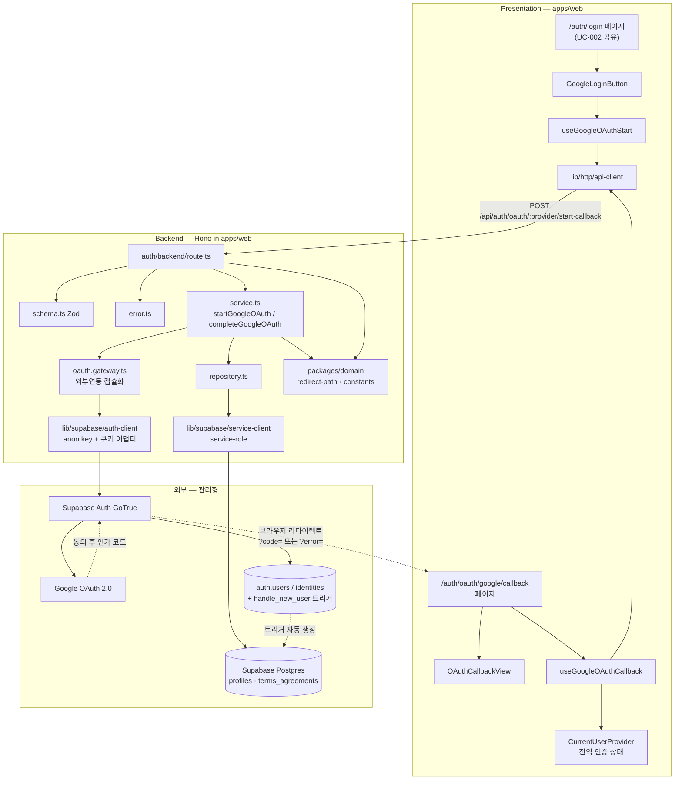

# Plan: UC-003 Google 소셜 로그인

> 근거: `docs/usecases/003/spec.md`, `docs/usecases/000_decisions.md`(A-1·A-4·A-7·A-8·A-13), `docs/techstack.md` §4·§7·§9, `docs/database.md` 3.1, `supabase/migrations/0002_profiles_and_terms.sql`, `.claude/skills/spec_to_plan/references/hono-backend-guide.md`.
>
> **결정 문서 우선 반영(spec과의 차이점)**
> - **A-8**: Google 이메일 미제공/미검증 시 **세션만 미발급(signOut)하고 계정은 잔존**시킨다. spec 본문·시퀀스의 "신규 계정 정리(삭제)"는 A-8이 대체한다. 응답은 `403 AUTH_OAUTH_EMAIL_UNVERIFIED` 유지.
> - **A-1**: 어드민 승격은 별도 시드 스크립트가 아니라 **콜백 확정 단계의 서비스 레이어**가 `ADMIN_SEED_EMAILS` 대조 후 즉시 수행한다(멱등 — 과거 누락 보정 겸용).
> - **A-4**: 약관 `doc_version`은 `packages/domain/constants`의 정적 상수를 사용한다.
> - **A-7**: 별도 동의 체크 강제 없음 — 버튼 위 고지 문구 + 클릭 시(신규 가입 확정 시) 서버가 동의 이력을 기록한다.
>
> **충돌 검토(기존 자산)**
> - DB: `profiles`/`terms_agreements`/`handle_new_user()`는 0002 마이그레이션에 이미 정의됨 → **신규 마이그레이션 불필요**. `terms_agreements`에는 `(user_id, doc_type, doc_version)` unique 제약이 없으므로 멱등성은 리포지토리 계층에서 SELECT 후 미존재분만 INSERT로 보장한다(spec DB Operations와 일치).
> - 코드: `apps/`·`packages/`는 미스캐폴딩 상태다. 아래 "공통 모듈"은 본 plan이 최초 생성 위치를 확정하며, UC-001/002/004/005 plan은 동일 위치를 참조해야 한다(중복 정의 금지).
> - 라우팅: OAuth 라우트는 BR-8(확장 대비)을 위해 `:provider` 파라미터로 선언하되 화이트리스트는 `google`만 허용한다. 기존 라우트 없음 → 충돌 없음.

## 개요

### 공통 모듈 (본 plan 최초 생성 — 전 기능 공용, 타 plan은 위치만 참조)

| 모듈 | 위치 | 설명 |
| --- | --- | --- |
| Hono 진입점 | `apps/web/src/app/api/[[...hono]]/route.ts` | Next.js catch-all Route Handler(`runtime='nodejs'`), Hono 앱에 위임 |
| Hono 싱글턴 앱 | `apps/web/src/backend/hono/app.ts` | `createHonoApp()` — 미들웨어 체인 + feature 라우터 등록, `basePath('/api')` |
| Hono 컨텍스트 헬퍼 | `apps/web/src/backend/hono/context.ts` | `AppEnv` 타입, `getSupabase(c)`/`getLogger(c)`/`getConfig(c)` |
| HTTP 응답 헬퍼 | `apps/web/src/backend/http/response.ts` | `success()/failure()/respond()`, `HandlerResult<T,E,M>` — 실패 본문 `{ error: { code, message } }` |
| 공통 미들웨어 | `apps/web/src/backend/middleware/{error-boundary.ts, app-context.ts, supabase.ts}` | errorBoundary → withAppContext(config·logger 주입) → withSupabase(service-role 클라이언트 주입) |
| Supabase 서비스 클라이언트 팩토리 | `apps/web/src/lib/supabase/service-client.ts` | service-role key 기반 서버 클라이언트(DB 접근용) |
| Supabase 인증(SSR) 클라이언트 팩토리 | `apps/web/src/lib/supabase/auth-client.ts` | `@supabase/ssr` `createServerClient`(anon key, PKCE) — Hono 요청/응답 쿠키 어댑터 바인딩. **외부 연동 성격 모듈** |
| Supabase 브라우저 클라이언트 | `apps/web/src/lib/supabase/browser-client.ts` | `createBrowserClient` — A-13 `onAuthStateChange` 구독용(본 UC에서는 위치만 확정) |
| API fetch 유틸 | `apps/web/src/lib/http/api-client.ts` | FE→`/api` 호출 공통 fetch 래퍼(JSON, `credentials:'include'`, 오류 본문 파싱) |
| 인증 도메인 상수 | `packages/domain/constants/auth.ts` | `TERMS_DOC_VERSIONS`(A-4), `REQUIRED_TERMS_DOC_TYPES`, `SUPPORTED_OAUTH_PROVIDERS=['google']`, `DEFAULT_REDIRECT_PATH='/'`, `NEW_USER_DETECTION_WINDOW_SECONDS`, `AUTH_HTTP_TIMEOUT_MS` |
| redirectPath 검증 함수 | `packages/domain/validation/redirect-path.ts` | 오픈 리다이렉트 방지(BR-6) 순수 함수 — FE/BE 공용 |
| 인증 전역 상태 Provider | `apps/web/src/features/auth/context/current-user-provider.tsx` | Context + `useReducer` — 로그인 사용자(`id/email/role`) 전역 상태. 헤더·가드가 구독 |

### UC-003 기능 모듈

| 모듈 | 위치 | 설명 |
| --- | --- | --- |
| Auth Zod 스키마(OAuth) | `apps/web/src/features/auth/backend/schema.ts` | start/callback Request·Response, `ProfileRow`·`TermsAgreementRow` 스키마 |
| Auth 에러 코드 | `apps/web/src/features/auth/backend/error.ts` | `AUTH_*` 에러 코드 상수(UC-001/002와 파일 공유, OAuth 코드 추가) |
| Google OAuth 게이트웨이 | `apps/web/src/features/auth/backend/oauth.gateway.ts` | Supabase Auth(GoTrue) 호출 캡슐화 — 인가 URL 발급/코드-세션 교환/signOut. **외부 서비스 연동 모듈** |
| Auth 리포지토리 | `apps/web/src/features/auth/backend/repository.ts` | `profiles` 조회·role 승격, `terms_agreements` 조회·멱등 INSERT (Supabase 쿼리 캡슐화) |
| Auth 서비스(OAuth) | `apps/web/src/features/auth/backend/service.ts` | `startGoogleOAuth`/`completeGoogleOAuth` — 순수 비즈니스 로직, gateway·repository 인터페이스에만 의존 |
| Auth 라우트(OAuth) | `apps/web/src/features/auth/backend/route.ts` | `POST /api/auth/oauth/:provider/start`, `POST /api/auth/oauth/:provider/callback` — HTTP 파싱/검증/로깅만 |
| DTO 재노출 | `apps/web/src/features/auth/lib/dto.ts` | backend schema의 Request/Response 타입을 FE에서 재사용하도록 재노출 |
| OAuth 시작 훅 | `apps/web/src/features/auth/hooks/useGoogleOAuthStart.ts` | React Query mutation — start API 호출 후 `authorizationUrl`로 브라우저 이동 |
| OAuth 콜백 훅 | `apps/web/src/features/auth/hooks/useGoogleOAuthCallback.ts` | 콜백 쿼리 해석(code/error), callback API 1회 호출, 성공 시 전역 상태 갱신+이동 |
| Google 로그인 버튼 | `apps/web/src/features/auth/components/google-login-button.tsx` | Presenter — 버튼 + 약관 동의 고지 문구(A-7) + 로딩/오류 표시 |
| 콜백 뷰 | `apps/web/src/features/auth/components/oauth-callback-view.tsx` | Presenter — 처리 중/취소 복귀/오류 코드별 안내 화면 |
| 콜백 페이지 | `apps/web/src/app/auth/oauth/google/callback/page.tsx` | FE 진입점 페이지(라우팅만) — 콜백 훅+뷰 조립 |
| 로그인 페이지 통합 | `apps/web/src/app/auth/login/page.tsx` | UC-002 소유 페이지 — 본 plan은 `GoogleLoginButton` 삽입만 담당(폼 등은 수정 금지) |

### 코드 외 산출물

| 항목 | 위치 | 설명 |
| --- | --- | --- |
| 환경 변수 | `.env`, `.env.example` | `NEXT_PUBLIC_SUPABASE_URL`, `NEXT_PUBLIC_SUPABASE_ANON_KEY`, `SUPABASE_SERVICE_ROLE_KEY`, `ADMIN_SEED_EMAILS`(기존 목록) + **`NEXT_PUBLIC_APP_URL`(신규 — 앱 콜백 절대 URL 생성용, 미설정 시 요청 Origin 폴백)** |
| Supabase/Google 사전 설정 체크리스트 | 본 문서 마지막 섹션 | 대시보드 provider 활성화·Redirect URL 허용 목록 등록(코드 배포 전 수동 1회) |

## Diagram

## Implementation Plan

구현 순서: ① 공통 모듈(도메인 → lib → backend 골격) → ② backend 기능 모듈(schema → error → gateway → repository → service → route → 등록) → ③ FE(hooks → components → pages). TDD 원칙에 따라 각 Business Logic 모듈은 실패 테스트 작성 후 구현한다.

---

### 1. `packages/domain/constants/auth.ts` — 인증 도메인 상수 (공통)

- 구현 내용:
  1. `TERMS_DOC_VERSIONS: Record<TermsDocType, string>` — 이용약관/개인정보처리방침 현행 버전 문자열(A-4, 예: `'v1.0'` — G-1 플레이스홀더 정책과 정합).
  2. `REQUIRED_TERMS_DOC_TYPES = ['terms_of_service', 'privacy_policy'] as const` — 0002 마이그레이션 `terms_doc_type` enum과 동일 값.
  3. `SUPPORTED_OAUTH_PROVIDERS = ['google'] as const`(BR-8), `DEFAULT_REDIRECT_PATH = '/'`, `NEW_USER_DETECTION_WINDOW_SECONDS = 60`(isNewUser 판별 창), `AUTH_HTTP_TIMEOUT_MS = 10_000`(게이트웨이 타임아웃).
  4. 하드코딩 금지 원칙에 따라 서비스/게이트웨이/FE 문구 외 수치는 전부 이 파일에서 import.
- 의존성: 없음(순수 상수, 프레임워크 독립).
- Unit Tests: 해당 없음(상수 정의).

### 2. `packages/domain/validation/redirect-path.ts` — redirectPath 검증 (공통, Business Logic)

- 구현 내용:
  1. `isSafeInternalPath(path: string): boolean` — `/`로 시작하는 단일 슬래시 내부 경로만 허용. `//`, `/\`, 스킴 포함(`http:`, `javascript:` 등), 제어문자·개행 포함, 빈 문자열 거부.
  2. `sanitizeRedirectPath(path: string | undefined | null): string` — 유효하면 원본 반환, 아니면 `DEFAULT_REDIRECT_PATH` 반환(Edge 6 "무시하고 메인").
  3. FE(콜백 훅)·BE(서비스) 양쪽에서 동일 함수를 import — DRY.
- 의존성: 모듈 1(상수).

**Unit Tests:**

- [ ] `'/valuechains/new'` → 허용
- [ ] `'/path?query=1#hash'` → 허용
- [ ] `undefined` / `null` / `''` → `sanitizeRedirectPath`가 `'/'` 반환
- [ ] `'https://evil.com'`, `'http://evil.com'` → 거부
- [ ] `'//evil.com'`(프로토콜 상대), `'/\\evil.com'`(백슬래시 우회) → 거부
- [ ] `'javascript:alert(1)'`, `'data:text/html,...'` → 거부
- [ ] `'foo/bar'`(슬래시 미시작) → 거부
- [ ] 개행/제어문자 포함 경로 → 거부

### 3. Hono 백엔드 골격 (공통) — `app/api/[[...hono]]/route.ts`, `backend/hono/{app.ts,context.ts}`, `backend/http/response.ts`, `backend/middleware/*`

- 구현 내용:
  1. `response.ts`: hono-backend-guide의 `HandlerResult<T,E,M>`·`success()/failure()/respond()` 그대로 구현. 실패 본문은 `{ error: { code, message } }`(spec API 공통 규약).
  2. `context.ts`: `AppEnv`(Variables: `supabase`, `logger`, `config`), `getSupabase/getLogger/getConfig` 헬퍼.
  3. `middleware/error-boundary.ts`: 미처리 예외 → 500 표준 실패 응답 + 로깅. `middleware/app-context.ts`: config(env 파싱: Supabase URL/키, `ADMIN_SEED_EMAILS` 콤마 파싱, `NEXT_PUBLIC_APP_URL`)와 logger 주입. `middleware/supabase.ts`: 모듈 4의 service-role 클라이언트를 컨텍스트에 주입.
  4. `app.ts`: 싱글턴 `createHonoApp()` — `basePath('/api')`, 미들웨어 체인(errorBoundary → withAppContext → withSupabase) 후 `registerAuthRoutes(app)` 등록.
  5. `app/api/[[...hono]]/route.ts`: `runtime='nodejs'`, GET/POST 등 메서드를 Hono 앱 `fetch`로 위임.
- 의존성: 없음(최초 생성). 이후 모든 feature plan이 이 골격을 공유한다.
- Unit Tests(response.ts만):
  - [ ] `success(data, 201)` → `{ ok: true, status: 201, data }`
  - [ ] `failure(400, 'CODE', 'msg')` → `{ ok: false, status: 400, error: { code, message } }`
  - [ ] `respond()`가 성공/실패 각각 올바른 HTTP 상태·본문으로 직렬화

### 4. Supabase 클라이언트 팩토리 (공통) — `lib/supabase/{service-client.ts, auth-client.ts, browser-client.ts}`

- 구현 내용:
  1. `service-client.ts`: `createClient(NEXT_PUBLIC_SUPABASE_URL, SUPABASE_SERVICE_ROLE_KEY, { auth: { persistSession: false } })` — 리포지토리 전용. 키는 환경변수에서만 로드(클라이언트 노출 금지).
  2. `auth-client.ts` **(외부 연동 성격)**: `@supabase/ssr`의 `createServerClient(url, anonKey, { cookies: { getAll, setAll } })` — Hono `Context`의 쿠키를 읽고, `setAll`은 `c.header('Set-Cookie', ..., { append: true })`로 응답에 기록하는 어댑터. `flowType: 'pkce'`(PKCE `code_verifier` 쿠키 관리 — spec 3단계). `global.fetch`에 `AbortSignal.timeout(AUTH_HTTP_TIMEOUT_MS)` 적용 fetch 래퍼 주입.
  3. `browser-client.ts`: `createBrowserClient` 싱글턴 — 본 UC에서는 파일 생성과 시그니처만(A-13 `onAuthStateChange` 구독은 UC-005 plan 소유).
- 의존성: 모듈 1(타임아웃 상수).
- 환경변수: `NEXT_PUBLIC_SUPABASE_URL`, `NEXT_PUBLIC_SUPABASE_ANON_KEY`, `SUPABASE_SERVICE_ROLE_KEY` — 하드코딩 금지, `app-context.ts` config 경유.
- Unit Tests:
  - [ ] auth-client 쿠키 어댑터: 요청 쿠키를 `getAll`로 노출하고 `setAll` 호출 시 응답 헤더에 Set-Cookie가 append 된다(모의 Hono Context)
  - [ ] 주입된 fetch가 `AUTH_HTTP_TIMEOUT_MS` 초과 시 Abort 에러를 던진다(가짜 타이머)

### 5. `features/auth/backend/schema.ts` — OAuth Zod 스키마

- 구현 내용:
  1. `OAuthStartRequestSchema = { redirectPath?: string }`, `OAuthStartResponseSchema = { authorizationUrl: string(url) }`.
  2. `OAuthCallbackRequestSchema = { code: string(min 1), redirectPath?: string }`, `OAuthCallbackResponseSchema = { user: { id: uuid, email: string, role: 'user'|'admin' }, isNewUser: boolean, redirectPath: string }` — spec API 명세와 필드 1:1.
  3. `OAuthProviderParamSchema = z.enum(SUPPORTED_OAUTH_PROVIDERS)` — `:provider` 경로 파라미터 검증(BR-8).
  4. Row 스키마(snake_case, 0002 마이그레이션과 일치): `ProfileRowSchema = { id: uuid, email: string.nullable(), role: enum(user/admin), created_at, updated_at }`, `TermsAgreementRowSchema = { id, user_id, doc_type: enum(terms_of_service/privacy_policy), doc_version, agreed_at, created_at, updated_at }`.
  5. UC-001/002가 같은 파일에 로그인/가입 스키마를 추가하므로 OAuth 섹션 주석으로 구획.
- 의존성: 모듈 1.
- Unit Tests: 해당 없음(스키마 정의 — 검증 동작은 서비스/라우트 테스트에서 간접 검증).

### 6. `features/auth/backend/error.ts` — 에러 코드

- 구현 내용: `as const` 객체 + 유니온 타입. UC-003 추가분:
  - `AUTH_VALIDATION_ERROR`(400), `AUTH_INVALID_REDIRECT_PATH`(400), `AUTH_UNSUPPORTED_PROVIDER`(400)
  - `AUTH_OAUTH_START_FAILED`(502), `AUTH_OAUTH_EXCHANGE_FAILED`(401), `AUTH_OAUTH_EMAIL_UNVERIFIED`(403), `AUTH_OAUTH_PROVIDER_ERROR`(502), `AUTH_PROFILE_LOAD_FAILED`(500)
  - HTTP 상태 매핑은 서비스가 `failure(status, code, ...)`로 결정(spec Error Codes 표 그대로).
- 의존성: 없음.
- Unit Tests: 해당 없음(상수 정의).

### 7. `features/auth/backend/oauth.gateway.ts` — Supabase Auth 게이트웨이 (외부 서비스 연동 모듈)

- 구현 내용:
  1. **Contract(인터페이스) 우선 정의** — 서비스는 이 인터페이스에만 의존(Internal Logic ↔ 외부 계약 분리):
     - `createAuthorizationUrl(input: { provider: 'google'; redirectTo: string }): Promise<GatewayResult<{ authorizationUrl: string }>>`
     - `exchangeCodeForSession(code: string): Promise<GatewayResult<OAuthSessionUser>>` — `OAuthSessionUser = { id, email: string|null, emailVerified: boolean, createdAt: string, lastSignInAt: string|null }`
     - `signOut(): Promise<void>` — 실패해도 throw하지 않는 베스트 에포트(세션 쿠키 정리)
     - `GatewayResult` 실패 종별: `'provider_unavailable'`(네트워크/타임아웃/GoTrue 5xx) | `'exchange_rejected'`(4xx: 코드 만료·재사용·PKCE 불일치) | `'start_rejected'`(인가 URL 발급 4xx/5xx)
  2. 구현: 모듈 4의 auth-client로 `supabase.auth.signInWithOAuth({ provider: 'google', options: { redirectTo, skipBrowserRedirect: true } })` 호출 → `data.url` 반환(PKCE `code_verifier` 쿠키는 쿠키 어댑터가 응답에 기록). `exchangeCodeForSession(code)` 호출 → 세션 사용자 매핑. `emailVerified`는 `user.email_confirmed_at` 존재 또는 Google identity의 `identity_data.email_verified === true`로 판정.
  3. **에러 처리/재시도**: `AuthApiError` status 4xx → `exchange_rejected`/`start_rejected`, 5xx·`AuthRetryableFetchError`·Abort(타임아웃) → `provider_unavailable`. **자동 재시도 없음** — 인가 코드는 1회성(BR-7)이라 exchange 재시도는 금지하고, start는 사용자 재클릭으로 복구(스팸 방지). 사유를 코드 주석에 명기.
  4. **타임아웃**: 모듈 4에서 주입된 `AUTH_HTTP_TIMEOUT_MS` fetch 래퍼 사용.
  5. **인증 정보**: anon key·URL은 환경변수만 사용, Google Client ID/Secret은 앱이 보유하지 않음(Supabase 대시보드 관리 — spec External Service Integration).
- 의존성: 모듈 1, 4, 6.

**Unit Tests (Supabase 클라이언트 모킹):**

- [ ] `createAuthorizationUrl` 성공 → `authorizationUrl` 반환, `signInWithOAuth`가 `skipBrowserRedirect: true`·전달된 `redirectTo`로 호출됨
- [ ] `signInWithOAuth`가 5xx/네트워크 에러 → `provider_unavailable`
- [ ] `exchangeCodeForSession` 성공(검증 이메일) → `emailVerified: true` 사용자 매핑
- [ ] `email_confirmed_at` 없음 + identity `email_verified: false` → `emailVerified: false`
- [ ] 교환 4xx(invalid grant) → `exchange_rejected`
- [ ] 교환 중 타임아웃(Abort) → `provider_unavailable`
- [ ] `signOut` 내부 실패 시에도 throw하지 않음

### 8. `features/auth/backend/repository.ts` — Auth 리포지토리 (Persistence)

- 구현 내용(모두 service-role 클라이언트 파라미터 주입, Supabase 쿼리 캡슐화):
  1. `findProfileById(client, userId): Promise<ProfileRow | null>` — `profiles` 단건 SELECT(`maybeSingle`), Row 스키마 검증.
  2. `promoteProfileToAdmin(client, userId): Promise<void>` — `UPDATE profiles SET role='admin' WHERE id=... AND role='user'`(멱등, A-1).
  3. `listTermsAgreements(client, userId, docTypes): Promise<TermsAgreementRow[]>` — 기존 동의 이력 SELECT.
  4. `insertTermsAgreements(client, rows: { user_id, doc_type, doc_version, agreed_at }[]): Promise<void>` — 미존재분만 벌크 INSERT. **멱등성은 3→4 순차 호출로 앱 계층 보장**(DB unique 제약 없음 — 0002 유지, 마이그레이션 변경 금지. 인가 코드 1회성 덕분에 동시 중복 위험 무시 가능 수준).
  5. 반환은 도메인 친화 타입(Row) — DB 에러는 typed error로 반환(throw 금지, HandlerResult 규약과 정합).
- 의존성: 모듈 3(context 아님 — 클라이언트 주입), 4, 5.

**Unit Tests (Supabase 쿼리 빌더 모킹):**

- [ ] `findProfileById`: 행 존재 → ProfileRow 반환 / 행 없음 → null / DB 에러 → 실패 반환
- [ ] `findProfileById`: role 컬럼이 스키마 위반 값이면 검증 실패 반환
- [ ] `promoteProfileToAdmin`: `role='user'` 조건 포함 UPDATE 호출 확인(이미 admin이면 no-op)
- [ ] `listTermsAgreements`: `user_id`+`doc_type IN` 필터로 조회
- [ ] `insertTermsAgreements`: 전달된 행만 INSERT, 빈 배열이면 쿼리 미실행

### 9. `features/auth/backend/service.ts` — OAuth 서비스 (Business Logic)

- 구현 내용:
  1. `startGoogleOAuth(deps: { gateway }, input: { provider: string; redirectPath?: string; appOrigin: string }): Promise<HandlerResult<OAuthStartResponse, AuthServiceError>>`
     - provider가 `SUPPORTED_OAUTH_PROVIDERS`에 없으면 `failure(400, AUTH_UNSUPPORTED_PROVIDER)`(BR-8).
     - `redirectPath` 존재 시 `isSafeInternalPath` 검증 → 위반 `failure(400, AUTH_INVALID_REDIRECT_PATH)`.
     - 앱 콜백 URL 생성: `{appOrigin}/auth/oauth/google/callback?next={encodeURIComponent(redirectPath)}` — `next` 쿼리로 복귀 경로를 왕복 유지(spec "시작 시점 값 유지"). `appOrigin`은 config의 `NEXT_PUBLIC_APP_URL`, 미설정 시 요청 Origin(라우트가 전달).
     - `gateway.createAuthorizationUrl` 호출 → `start_rejected`/`provider_unavailable`은 `failure(502, AUTH_OAUTH_START_FAILED)`, 성공 시 `success({ authorizationUrl })`.
  2. `completeGoogleOAuth(deps: { gateway; repository; dbClient }, input: { provider; code; redirectPath?; adminSeedEmails: string[]; now: () => Date }): Promise<HandlerResult<OAuthCallbackResponse, AuthServiceError>>`
     - provider 화이트리스트 검증(모듈 1과 동일 규칙).
     - `sanitizeRedirectPath(redirectPath)`로 복귀 경로 확정(Edge 6 — 위반은 오류가 아니라 `/`로 대체).
     - `gateway.exchangeCodeForSession(code)`: `exchange_rejected` → `failure(401, AUTH_OAUTH_EXCHANGE_FAILED)`(Edge 2·7), `provider_unavailable` → `failure(502, AUTH_OAUTH_PROVIDER_ERROR)`(Edge 4).
     - **이메일 검증(BR-1)**: `email` 부재 또는 `emailVerified === false` → `gateway.signOut()`(세션 쿠키 미발급·정리)만 수행하고 **계정은 잔존**(A-8이 spec의 "계정 정리"를 대체) → `failure(403, AUTH_OAUTH_EMAIL_UNVERIFIED)`.
     - `isNewUser` 판별: `createdAt`과 `now()` 차이가 `NEW_USER_DETECTION_WINDOW_SECONDS` 이내(휴리스틱, 상수 관리 — Supabase가 신규 여부를 직접 제공하지 않음).
     - `repository.findProfileById` → null/에러 시 `failure(500, AUTH_PROFILE_LOAD_FAILED)`(트리거 `handle_new_user()`가 생성했어야 함).
     - **어드민 승격(A-1)**: `profile.role === 'user'`이고 이메일이 `adminSeedEmails`(대소문자 무시)와 일치하면 `promoteProfileToAdmin` 후 응답 role을 `admin`으로 확정 — 멱등이라 신규 가입 직후뿐 아니라 과거 누락도 보정.
     - **약관 동의 이력(BR-5, Edge 8)**: 매 성공 콜백마다 `listTermsAgreements`로 `REQUIRED_TERMS_DOC_TYPES` × `TERMS_DOC_VERSIONS` 기존분을 대조, 미존재분만 `insertTermsAgreements`(멱등 — 신규 기록과 "다음 로그인 시 보정"을 동일 경로로 처리). **기록 실패 시에도 로그인은 성공 응답**(Edge 8 — 실패 사실은 메타로 라우트에 전달해 경고 로깅).
     - 성공: `success({ user: { id, email, role }, isNewUser, redirectPath })` — 세션 쿠키는 gateway/auth-client 쿠키 어댑터가 이미 응답에 기록(BR-9).
  3. 서비스는 gateway·repository **인터페이스 타입에만 의존**(Supabase SDK import 금지), 시간은 `now` 주입으로 테스트 가능하게.
- 의존성: 모듈 1, 2, 5, 6, 7(계약), 8(계약).

**Unit Tests (gateway·repository 모킹):**

startGoogleOAuth
- [ ] 정상: `redirectPath='/valuechains/new'` → redirectTo에 `next` 인코딩 포함, `authorizationUrl` 반환
- [ ] `redirectPath` 미지정 → `next=/`(기본값)로 진행
- [ ] provider `'naver'` → 400 `AUTH_UNSUPPORTED_PROVIDER` (Edge 10)
- [ ] `redirectPath='https://evil.com'` → 400 `AUTH_INVALID_REDIRECT_PATH`
- [ ] gateway `provider_unavailable` → 502 `AUTH_OAUTH_START_FAILED`

completeGoogleOAuth
- [ ] 기존 사용자 정상 로그인: 교환 성공 → profile 조회 → `isNewUser=false`, 약관 이력 기존 존재 시 INSERT 미호출(멱등)
- [ ] 신규 가입: `createdAt≈now` → `isNewUser=true`, 필수 약관 2종(`doc_version`=상수) INSERT 호출
- [ ] 신규 가입 + `ADMIN_SEED_EMAILS` 일치 → `promoteProfileToAdmin` 호출, 응답 role `admin` (A-1)
- [ ] 기존 사용자 + 시드 일치 + role=user(과거 누락) → 승격 보정 수행
- [ ] 이메일 미검증 → `signOut` 호출됨 + 계정 삭제성 호출 없음 + 403 `AUTH_OAUTH_EMAIL_UNVERIFIED` (A-8)
- [ ] 이메일 미제공(null) → 동일 403
- [ ] 교환 `exchange_rejected`(코드 재사용/만료/PKCE 불일치) → 401 `AUTH_OAUTH_EXCHANGE_FAILED` (Edge 2·7)
- [ ] 교환 `provider_unavailable`(타임아웃) → 502 `AUTH_OAUTH_PROVIDER_ERROR` (Edge 4)
- [ ] profile 조회 실패/null → 500 `AUTH_PROFILE_LOAD_FAILED`
- [ ] 약관 INSERT 실패 → 성공 응답 유지 + 경고 메타 포함 (Edge 8)
- [ ] `redirectPath='//evil.com'` → 오류 없이 `redirectPath='/'`로 성공 응답 (Edge 6)
- [ ] 약관 일부(1종)만 기존 존재 → 누락 1종만 INSERT (Edge 8 보정)

### 10. `features/auth/backend/route.ts` — OAuth 라우트 + `app.ts` 등록 (Presentation, 서버측)

- 구현 내용:
  1. `registerAuthRoutes(app: Hono<AppEnv>)`에 두 엔드포인트 추가(UC-001/002 라우트와 같은 함수에 공존):
     - `POST /auth/oauth/:provider/start`: `:provider`+body를 Zod 검증(실패 → 400 `AUTH_VALIDATION_ERROR`) → 요청별 auth-client·gateway 생성(모듈 4·7 팩토리) → `startGoogleOAuth` 호출(appOrigin: config `NEXT_PUBLIC_APP_URL` ?? 요청 Origin) → `respond()`.
     - `POST /auth/oauth/:provider/callback`: body Zod 검증(`code` 누락 → 400 `AUTH_VALIDATION_ERROR`) → `completeGoogleOAuth` 호출(config의 `ADMIN_SEED_EMAILS` 배열 전달) → 실패 시 코드별 `logger.error`, 약관 기록 실패 메타는 `logger.warn` → `respond()`.
  2. 라우트는 HTTP 파싱/검증/의존성 조립/로깅만 담당 — 비즈니스 분기 금지.
  3. `backend/hono/app.ts`에 `registerAuthRoutes(app)` 등록(공통 모듈 3에서 이미 계획).
- 의존성: 모듈 3, 4, 5, 6, 7, 9.

**QA Sheet:**

| # | 시나리오 | 기대 결과 |
| --- | --- | --- |
| 1 | `POST /api/auth/oauth/google/start` body `{}` | 200 + `authorizationUrl`(accounts.google.com 경유 Supabase URL) + PKCE `code_verifier` 쿠키 Set-Cookie |
| 2 | `POST /api/auth/oauth/google/start` body `{ redirectPath: '/companies/005930' }` | 200, `authorizationUrl`의 `redirect_to`에 `next=%2Fcompanies%2F005930` 포함 |
| 3 | `POST /api/auth/oauth/naver/start` | 400 `{ error: { code: 'AUTH_UNSUPPORTED_PROVIDER' } }` |
| 4 | `redirectPath: 'https://evil.com'` | 400 `AUTH_INVALID_REDIRECT_PATH` |
| 5 | Supabase URL을 잘못된 호스트로 바꾼 뒤 start 호출(장애 모사) | 502 `AUTH_OAUTH_START_FAILED`, 에러 로그 출력 |
| 6 | `POST /api/auth/oauth/google/callback` body `{}` | 400 `AUTH_VALIDATION_ERROR` |
| 7 | 유효한 `code`로 callback | 200 `{ user: { id, email, role }, isNewUser, redirectPath }` + `sb-*` 세션 쿠키 Set-Cookie |
| 8 | 동일 `code`로 재호출(재사용) | 401 `AUTH_OAUTH_EXCHANGE_FAILED`, 세션 쿠키 미설정 |
| 9 | 신규 Google 계정으로 최초 로그인 | `isNewUser: true`, DB에 `profiles` 1행 + `terms_agreements` 2행(doc_version=상수) 생성 |
| 10 | 같은 계정 재로그인 | `isNewUser: false`, `terms_agreements` 행 수 불변(멱등) |
| 11 | `ADMIN_SEED_EMAILS`에 등록된 이메일로 신규 로그인 | 응답 `role: 'admin'`, DB `profiles.role='admin'` |
| 12 | 응답 스키마 | 성공은 `OAuthCallbackResponseSchema`, 실패는 `{ error: { code, message } }` 형식 일치 |

### 11. `features/auth/lib/dto.ts` — DTO 재노출

- 구현 내용: `backend/schema.ts`의 OAuth Request/Response 타입·스키마를 FE hooks가 import하도록 재노출(FE가 backend 내부 경로를 직접 참조하지 않게 하는 경계 파일).
- 의존성: 모듈 5.
- Unit Tests: 해당 없음(재노출).

### 12. `lib/http/api-client.ts` — API fetch 유틸 (공통)

- 구현 내용: `apiPost<TRes>(path, body)` 등 최소 래퍼 — `credentials: 'include'`(세션/PKCE 쿠키 왕복), JSON 직렬화, 비 2xx 시 `{ code, message, status }` 형태의 typed error 반환(throw 대신 Result 또는 정규화된 에러 — React Query의 error로 소비). 베이스 경로 `'/api'` 상수화.
- 의존성: 없음.
- Unit Tests (fetch 모킹):
  - [ ] 2xx → 파싱된 본문 반환
  - [ ] 4xx/5xx + `{ error: { code, message } }` 본문 → code 보존한 에러 정규화
  - [ ] 네트워크 실패 → 일반 네트워크 에러 코드로 정규화
  - [ ] 요청에 `credentials: 'include'` 포함

### 13. `features/auth/context/current-user-provider.tsx` — 인증 전역 상태 (공통, Business Logic 포함)

- 구현 내용:
  1. Context + `useReducer`(spec_to_plan 컨벤션): state `{ status: 'unknown'|'guest'|'authenticated', user: { id, email, role } | null }`, actions `SET_USER`, `CLEAR_USER`.
  2. `useCurrentUser()` 훅 노출. 헤더(로그인 상태 UI)·콜백 훅이 소비.
  3. 초기화(세션 복원)·`onAuthStateChange` 구독(A-13)은 UC-004/005 plan 소유 — 본 plan은 Provider 골격과 reducer, `SET_USER` 경로까지만 구현.
- 의존성: 없음(React만).

**Unit Tests (reducer):**

- [ ] `SET_USER` → `status='authenticated'`, user 저장
- [ ] `CLEAR_USER` → `status='guest'`, user null
- [ ] 초기 상태는 `status='unknown'`

### 14. `features/auth/hooks/useGoogleOAuthStart.ts` — OAuth 시작 훅 (Business Logic, FE)

- 구현 내용:
  1. `useMutation`: `apiPost('/auth/oauth/google/start', { redirectPath })` → 성공 시 `window.location.assign(authorizationUrl)`(spec 4단계 — 전체 페이지 리다이렉트).
  2. `redirectPath`는 로그인 페이지의 `?redirect=` 쿼리에서 획득(보호 경로 복귀 컨텍스트) — 호출 측에서 파라미터로 주입, 훅은 값 전달만.
  3. 오류 시 코드별 사용자 문구 매핑(`AUTH_OAUTH_START_FAILED`/네트워크 → "일시적인 오류... 이메일 로그인 이용" Edge 4).
- 의존성: 모듈 11, 12.

**Unit Tests (api-client·location 모킹):**

- [ ] 성공 → 응답 `authorizationUrl`로 `location.assign` 호출
- [ ] 502 오류 → assign 미호출, 이메일 로그인 대체 안내 문구 상태 노출
- [ ] pending 중 재클릭 → 중복 mutate 방지(isPending 가드)

### 15. `features/auth/hooks/useGoogleOAuthCallback.ts` — OAuth 콜백 훅 (Business Logic, FE)

- 구현 내용:
  1. 콜백 페이지 쿼리 해석: `code`, `error`(+`error_description`), `next`.
  2. `error` 존재(취소/거부) → **BE 호출 없이** `router.replace('/auth/login?notice=oauth_cancelled')`(Edge 1 — 오류 노출 최소화).
  3. `code` 존재 → `apiPost('/auth/oauth/google/callback', { code, redirectPath: next })` **1회만 호출** — `useRef` 가드로 React StrictMode/재렌더 이중 실행 방지(코드 1회성 보호).
  4. 성공 → `dispatch(SET_USER)`(모듈 13) + `router.replace(sanitizeRedirectPath(redirectPath))` — 응답의 검증된 경로 사용, FE에서도 모듈 2로 이중 방어.
  5. 실패 매핑: `AUTH_OAUTH_EXCHANGE_FAILED` → 이미 인증 상태(`status==='authenticated'`)면 목적지로 멱등 이동(Edge 7), 아니면 재시도 유도 화면. `AUTH_OAUTH_EMAIL_UNVERIFIED` → 이메일 가입 안내(+`/auth/signup` 링크). `AUTH_OAUTH_PROVIDER_ERROR` → 오류 안내 + 이메일 로그인 링크(Edge 4). 기타 → 일반 오류.
  6. `code`도 `error`도 없음 → 로그인 페이지로 복귀.
  7. 상태 머신 `{ phase: 'processing'|'error', errorCode? }`를 뷰(모듈 16)에 제공.
- 의존성: 모듈 2, 11, 12, 13.

**Unit Tests (api-client·router 모킹):**

- [ ] `?error=access_denied` → API 미호출, 로그인 페이지로 replace (Edge 1)
- [ ] `?code=abc&next=/companies/005930` 성공 → SET_USER dispatch + `/companies/005930` replace
- [ ] `next='//evil.com'` → `/`로 replace (Edge 6 이중 방어)
- [ ] StrictMode 모사(2회 마운트 효과) → API 1회만 호출
- [ ] 401 + 미인증 상태 → `phase='error'`, `errorCode='AUTH_OAUTH_EXCHANGE_FAILED'`
- [ ] 401 + 이미 인증 상태 → 목적지로 replace(멱등, Edge 7)
- [ ] 403 → 이메일 가입 안내 상태
- [ ] 502 → 이메일 로그인 대체 안내 상태
- [ ] 쿼리 없음 → 로그인 페이지로 replace

### 16. `features/auth/components/google-login-button.tsx` — Google 로그인 버튼 (Presentation)

- 구현 내용:
  1. Presenter — props: `{ onClick, isPending, errorMessage? }`. 로직 없음(모듈 14 훅은 상위 조립부에서 연결).
  2. Google 브랜드 가이드에 맞춘 버튼(shadcn-ui `Button` 변형) + **버튼 상단/하단에 A-7 고지 문구**: "계속하면 이용약관 및 개인정보처리방침에 동의하는 것으로 간주됩니다"(약관 페이지 `/terms`, `/privacy` 링크 — UC-025 경로).
  3. `isPending` 시 스피너+비활성, `errorMessage` 존재 시 하단 경고 문구(이메일 로그인 대체 링크 포함).
- 의존성: 모듈 14(조립 시), shadcn-ui Button(`npx shadcn@latest add button` — 미설치 시 안내).

**QA Sheet:**

| # | 시나리오 | 기대 결과 |
| --- | --- | --- |
| 1 | 로그인 페이지 렌더 | Google 버튼과 약관 동의 고지 문구가 함께 노출(A-7), 문구 내 약관/방침 링크 동작 |
| 2 | 버튼 클릭 | onClick 1회 호출, 즉시 로딩 스피너 + 버튼 비활성 |
| 3 | 로딩 중 연타 | 추가 호출 없음(disabled) |
| 4 | `errorMessage` 전달 | 경고 문구 + "이메일로 로그인" 대체 링크 노출 |
| 5 | 키보드 접근(Tab→Enter) | 버튼 포커스 링 표시, Enter로 동작 |
| 6 | 모바일 뷰포트(360px) | 버튼·고지 문구 레이아웃 깨짐 없음 |

### 17. `features/auth/components/oauth-callback-view.tsx` — 콜백 뷰 (Presentation)

- 구현 내용: Presenter — props `{ phase, errorCode? }`(모듈 15 상태 머신 소비).
  - `processing`: 스피너 + "로그인 처리 중…"
  - `error` + `AUTH_OAUTH_EXCHANGE_FAILED`: "인증이 거부되었습니다" + [다시 Google로 로그인](`/auth/login`) 버튼
  - `error` + `AUTH_OAUTH_EMAIL_UNVERIFIED`: "Google 계정의 이메일을 확인할 수 없어 가입이 제한됩니다" + [이메일로 가입하기](`/auth/signup`)
  - `error` + `AUTH_OAUTH_PROVIDER_ERROR`: "일시적인 오류가 발생했습니다" + [이메일로 로그인](`/auth/login`) 대체 경로
  - 기타: 일반 오류 + 로그인 페이지 링크
  - 문구는 컴포넌트 내 상수 객체(코드→문구 매핑)로 관리(하드코딩 산재 금지).
- 의존성: 모듈 6(에러 코드 타입 — dto 경유).

**QA Sheet:**

| # | 시나리오 | 기대 결과 |
| --- | --- | --- |
| 1 | `phase='processing'` | 스피너와 처리 중 문구만 표시(오류 UI 없음) |
| 2 | `errorCode='AUTH_OAUTH_EXCHANGE_FAILED'` | 인증 거부 문구 + 재시도 링크가 로그인 페이지로 이동 |
| 3 | `errorCode='AUTH_OAUTH_EMAIL_UNVERIFIED'` | 이메일 가입 안내 + `/auth/signup` 이동 |
| 4 | `errorCode='AUTH_OAUTH_PROVIDER_ERROR'` | 오류 안내 + 이메일 로그인 대체 링크(Edge 4) |
| 5 | 알 수 없는 코드 | 일반 오류 문구 + 로그인 링크(화면 깨짐 없음) |
| 6 | 취소 복귀 케이스 | 이 뷰가 아닌 로그인 페이지로 즉시 이동(오류 화면 미노출, Edge 1) |

### 18. `app/auth/oauth/google/callback/page.tsx` — 콜백 페이지 (Presentation)

- 구현 내용:
  1. Client Component(`'use client'`) — `useSearchParams` 필요. `Suspense` 경계로 감싼 조립부: `useGoogleOAuthCallback()` 결과를 `OAuthCallbackView`에 전달만.
  2. 페이지 파일은 라우팅/조립 책임만(비즈니스 로직 금지 — techstack §4 `app/`은 라우팅/레이아웃만).
- 의존성: 모듈 15, 17.

**QA Sheet:**

| # | 시나리오 | 기대 결과 |
| --- | --- | --- |
| 1 | Google 동의 완료 후 리다이렉트 착지(`?code=...&next=...`) | 처리 중 → 성공 시 목적지로 이동, 헤더가 로그인 상태로 갱신 |
| 2 | `next` 없이 착지 | 성공 후 메인(`/`)으로 이동 |
| 3 | `?error=access_denied` 착지 | 로그인 페이지로 즉시 복귀(취소 안내 notice) |
| 4 | 콜백 페이지 새로고침(코드 소진 후) | 비로그인: 인증 거부 안내 / 기존 세션 유효: 목적지로 멱등 이동(Edge 7) |
| 5 | 직접 URL 진입(쿼리 없음) | 로그인 페이지로 복귀 |
| 6 | 브라우저 뒤로가기로 콜백 재진입 | 무한 루프 없이 4와 동일 처리 |

### 19. `app/auth/login/page.tsx` 통합 — 로그인 페이지 버튼 배치 (Presentation, UC-002 공유)

- 구현 내용:
  1. UC-002가 소유하는 로그인 페이지에 `GoogleLoginButton` 조립부(컨테이너)를 추가: `useGoogleOAuthStart` 연결, `?redirect=` 쿼리를 `redirectPath`로 전달, 이메일 로그인 폼과 구분선("또는")으로 배치.
  2. UC-002 plan의 폼/상태 설계는 변경하지 않는다 — 본 plan 산출은 버튼 영역 삽입뿐. UC-002보다 먼저 구현될 경우 임시로 버튼만 있는 최소 페이지를 생성하고 UC-002가 폼을 추가한다.
  3. `?notice=oauth_cancelled` 수신 시 취소 안내 배너(비침습적 정보성 문구, Edge 1).
- 의존성: 모듈 14, 16.

**QA Sheet:**

| # | 시나리오 | 기대 결과 |
| --- | --- | --- |
| 1 | `/auth/login` 접근 | 이메일 폼 영역과 Google 버튼이 구분선으로 분리 표시 |
| 2 | `/auth/login?redirect=/valuechains/new`에서 버튼 클릭 | 로그인 완료 후 `/valuechains/new`로 복귀 |
| 3 | `?notice=oauth_cancelled`로 복귀 | 취소 안내 배너 표시, 오류 스타일 아님 |
| 4 | 이미 로그인 상태로 `/auth/login` 접근 | (UC-002/004 가드 정책 준수 — 본 기능이 이를 깨지 않음) |

### 20. 환경 변수 및 외부 사전 설정 (코드 외)

- 구현 내용:
  1. `.env.example`에 키 추가(값 비움): `NEXT_PUBLIC_SUPABASE_URL`, `NEXT_PUBLIC_SUPABASE_ANON_KEY`, `SUPABASE_SERVICE_ROLE_KEY`, `ADMIN_SEED_EMAILS`, **`NEXT_PUBLIC_APP_URL`**(신규 — techstack §9 목록에 없던 항목, 콜백 절대 URL용. 미설정 시 요청 Origin 폴백이므로 로컬은 생략 가능).
  2. **Supabase 대시보드(1회 수동)**: Authentication → Providers → Google 활성화(Client ID/Secret 입력), Authentication → URL Configuration → Redirect URLs에 `http://localhost:3000/auth/oauth/google/callback` 및 배포 도메인 콜백 등록(미등록 시 `redirectTo` 무시됨 — QA 선행 조건).
  3. **Google Cloud Console(1회 수동)**: OAuth 클라이언트(웹) 생성, 승인된 리디렉션 URI에 `https://plvsbserqcdwaowblzhd.supabase.co/auth/v1/callback` 등록(spec External Service Integration).
  4. 모든 키는 환경변수로만 관리 — 코드/문서에 실값 하드코딩 금지.
- 의존성: 없음(구현 착수 전 완료 권장).
- 검증 체크리스트:
  - [ ] `.env.example`에 신규 키 반영, 실값 미포함
  - [ ] 대시보드 Google provider Enabled 상태
  - [ ] Redirect URLs에 로컬/배포 콜백 2건 등록
  - [ ] start API 응답 URL로 실제 Google 동의 화면 도달(수동 스모크)
