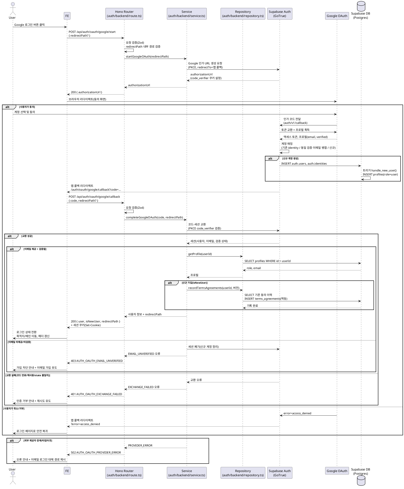

# UC-003: Google 소셜 로그인

> 근거 문서: `docs/userflow.md` 003, `docs/prd.md` 3장(로그인/회원가입 페이지)·5장(IA `/auth`), `docs/database.md` 3.1(profiles/terms_agreements), `docs/techstack.md` §1·§7(Supabase Auth 네이티브 Google OAuth).
> 네이버·카카오는 확장 대비 설계만 하며 실제 구현은 MVP 제외(PRD Non-Goals).

---

## Primary Actor

- **Guest** (비로그인 방문자)

## Precondition (사용자 관점)

- 사용자가 로그인 상태가 아니다.
- 사용자가 유효한 Google 계정을 보유하고 있다.
- 사용자가 로그인/회원가입 페이지(`/auth/login`)에 접근할 수 있다.

## Trigger

- 사용자가 로그인 페이지에서 **"Google로 로그인" 버튼을 클릭**한다.
  (로그인 전 접근하려던 보호 경로가 있으면 해당 복귀 경로 컨텍스트가 함께 전달된다.)

---

## Main Scenario

1. Guest가 로그인 페이지에서 Google 로그인 버튼을 클릭한다. 버튼 주변에 "가입 시 이용약관·개인정보처리방침에 동의" 고지가 노출된다.
2. FE가 BE에 OAuth 시작을 요청한다(`POST /api/auth/oauth/google/start`, 복귀 경로 `redirectPath` 포함 가능).
3. BE Service가 Supabase Auth에 Google 인가 URL 생성을 요청한다(PKCE — `code_verifier`는 쿠키로 관리). BE는 `authorizationUrl`을 FE에 반환한다.
4. FE가 브라우저를 Google 동의 화면으로 리다이렉트한다.
5. 사용자가 Google 동의 화면에서 계정을 선택하고 동의한다.
6. Google이 Supabase Auth 콜백(`https://<project-ref>.supabase.co/auth/v1/callback`)으로 인가 코드를 전달하고, Supabase Auth가 Google과 토큰 교환 및 프로필(이메일, 이메일 검증 상태 등) 획득을 수행한다.
7. Supabase Auth가 계정 매칭을 수행한다.
   - 기존 Google 식별자(identity) 연결 있음 → 해당 계정으로 로그인.
   - 검증된 동일 이메일의 기존(이메일 가입) 계정 존재 → 해당 계정에 Google identity 자동 연동(병합) 후 로그인.
   - 신규 → `auth.users` 계정 생성. `auth.users` AFTER INSERT 트리거 `handle_new_user()`가 `profiles` 행을 멱등 생성한다(`role=user`).
8. Supabase Auth가 앱 콜백 페이지(`/auth/oauth/google/callback?code=...`)로 브라우저를 리다이렉트한다.
9. FE 콜백 페이지가 쿼리의 `code`를 추출해 BE에 세션 확립을 요청한다(`POST /api/auth/oauth/google/callback`).
10. BE Service가 Supabase Auth와 코드-세션 교환을 수행하고(PKCE 검증 포함), 획득한 사용자 이메일의 **제공·검증 상태를 확인**한다. 미제공/미검증이면 세션을 발급하지 않고 정리 후 오류를 반환한다(Edge Case 3).
11. BE Repository가 `profiles`에서 `role`·프로필을 조회한다. **신규 가입으로 판별되면** `terms_agreements`에 필수 약관(이용약관·개인정보처리방침) 동의 이력(문서 버전/시각)을 멱등 기록한다. 소셜 인증 계정은 **이메일 인증 완료로 간주**한다(별도 인증 메일 없음).
12. BE가 세션 쿠키를 설정하고 사용자 정보(`id`, `email`, `role`)와 검증된 `redirectPath`를 반환한다.
13. FE가 로그인 상태로 전환하고, 원래 목적지(`redirectPath`) 또는 메인으로 이동하며 헤더 UI를 로그인 상태로 갱신한다.

---

## Edge Cases

| # | 상황 | 처리 |
|---|------|------|
| 1 | 사용자가 Google 동의 화면에서 취소/거부 | 앱 콜백에 `error=access_denied` 등 오류 파라미터 도착 → FE는 BE 호출 없이 로그인 페이지로 안전 복귀(취소 안내, 오류 노출 최소화) |
| 2 | 인가 코드 만료/재사용/CSRF(state·PKCE 불일치) | 세션 교환 실패 → `401 AUTH_OAUTH_EXCHANGE_FAILED` → 인증 거부 안내 + 재시도(다시 Google 로그인) 유도 |
| 3 | Google 프로필 이메일 미제공/미검증 | 가입 차단: 세션 미발급(교환된 세션·신규 계정은 정리) → `403 AUTH_OAUTH_EMAIL_UNVERIFIED` → 이메일 가입 안내 |
| 4 | 외부 제공자(Google/Supabase Auth) 장애·타임아웃 | `502 AUTH_OAUTH_PROVIDER_ERROR` → 오류 안내 + **이메일 로그인 대체 경로** 제시 |
| 5 | 검증된 동일 이메일의 이메일 가입 계정 존재 | 자동 연동(병합) 후 정상 로그인. **별도 충돌 안내 없음**(계정 열거 방지) |
| 6 | `redirectPath`가 외부 URL/비정상 경로 | 오픈 리다이렉트 방지: 내부 경로만 허용, 위반 시 무시하고 메인(`/`)으로 이동 |
| 7 | 이미 로그인된 상태에서 콜백 재진입/새로고침(코드 재사용) | 교환 실패는 #2와 동일 처리. 유효 세션이 이미 있으면 목적지로 멱등 이동 |
| 8 | 신규 가입 약관 동의 이력 기록 실패(부분 실패) | 로그인 자체는 유효하되 이력 누락 방지를 위해 멱등 재기록(다음 로그인 시 보정) — 동일 (사용자, 문서, 버전) 중복 기록 금지 |
| 9 | 탈퇴 후 동일 Google 계정으로 재로그인 | 계정이 삭제된 상태이므로 신규 가입 흐름으로 처리(즉시 재가입 허용, userflow 006) |
| 10 | 미지원 provider 요청(naver/kakao 등) | MVP는 `google`만 허용 → `400 AUTH_UNSUPPORTED_PROVIDER` (확장 대비 인터페이스만 유지) |

---

## Business Rules

### 인증·계정 규칙

- **BR-1. 이메일 검증 필수**: Google 프로필의 이메일이 미제공이거나 미검증이면 가입/로그인을 차단하고 이메일 가입을 안내한다.
- **BR-2. 소셜 계정 = 이메일 인증 완료 간주**: Google 인증으로 생성/로그인된 계정은 별도 이메일 인증 절차 없이 서비스 이용이 가능하다.
- **BR-3. 계정 매칭 우선순위**: ① 기존 Google 식별자 연결 → 로그인, ② 검증된 동일 이메일 계정 → 자동 연동(병합), ③ 신규 → 계정 생성. 병합 시 별도 충돌 안내를 하지 않는다(계정 열거 방지).
- **BR-4. role 부여**: 신규 가입 시 `profiles.role`은 기본 `user`로 생성된다(`handle_new_user()` 트리거). `ADMIN_SEED_EMAILS` 일치 계정의 `admin` 승격은 별도 시드 스크립트가 담당한다(database.md 3.1).
- **BR-5. 약관 동의 이력**: 신규 소셜 가입 확정 시 필수 약관(이용약관·개인정보처리방침)의 동의 이력을 문서 버전·시각과 함께 기록한다. 동일 (사용자, 문서 타입, 버전) 조합은 중복 기록하지 않는다(멱등).
- **BR-6. 오픈 리다이렉트 방지**: 로그인 후 복귀 경로(`redirectPath`)는 서비스 내부 경로만 허용한다.
- **BR-7. CSRF/재사용 방지**: OAuth 상태 검증은 PKCE(state·code_verifier)로 수행하며 Supabase Auth가 관리한다. 인가 코드는 1회성이다.
- **BR-8. 확장 대비**: provider는 파라미터화 가능한 구조로 설계하되 MVP에서는 `google`만 허용한다(네이버·카카오는 설계만, 구현 제외).
- **BR-9. 세션 정책**: 세션 발급/갱신은 Supabase Auth가 관리하고(쿠키 기반), 앱 DB에 별도 세션 테이블을 두지 않는다.

### External Service Integration

| 항목 | 내용 |
|---|---|
| 연동 대상 | **Google OAuth 2.0** — Supabase Auth **네이티브 provider** 경유 (관리형) |
| 호출 방식 | 앱은 Google API를 **직접 호출하지 않는다**. 인가 요청 URL 생성, Google과의 토큰 교환, 프로필 획득, identity 자동 연동(병합)은 모두 Supabase Auth(GoTrue)가 대행한다 |
| 사전 설정 | Google Cloud Console에 OAuth 클라이언트(웹) 생성 → 승인된 리디렉션 URI에 `https://<project-ref>.supabase.co/auth/v1/callback` 등록 → Supabase 대시보드에서 Google provider 활성화(Client ID/Secret 입력) |
| 앱 콜백 | Supabase Auth → 앱 `/auth/oauth/google/callback` 리다이렉트(성공 시 `?code=`, 취소/실패 시 `?error=`) |
| 참조 문서 | `docs/external/`에 Google OAuth 개별 문서 없음 — 배치용 외부 API(토스/DART/SEC)와 달리 Supabase 관리형 연동이므로 어댑터 계층 불필요. 필요 설정은 techstack.md §7 및 본 문서 기준 |
| 장애 처리 | 제공자 장애/타임아웃 시 오류 안내 + 이메일 로그인 대체 경로 제시(Edge Case 4) |

### API Specification

> 공통: 응답 포맷은 `src/backend/http/response.ts`의 성공/실패 헬퍼 규약을 따른다. 실패 응답 본문은 `{ "error": { "code": string, "message": string } }` 형태를 기준으로 한다. 아래 라우트는 `features/auth/backend/route.ts`에 등록한다.

#### 1) `POST /api/auth/oauth/google/start` — OAuth 시작(인가 URL 발급)

- **Request Body**

  | 필드 | 타입 | 필수 | 설명 |
  |---|---|---|---|
  | `redirectPath` | string | X | 로그인 후 복귀할 **내부 경로**(예: `/valuechains/new`). 미지정 시 `/` |

- **Response `200`**

  | 필드 | 타입 | 설명 |
  |---|---|---|
  | `authorizationUrl` | string | 브라우저를 리다이렉트할 Google 동의 화면 URL(Supabase Auth 발급) |

  사이드이펙트: PKCE `code_verifier` 쿠키 설정.

- **Error Codes**

  | HTTP | code | 조건 |
  |---|---|---|
  | 400 | `AUTH_INVALID_REDIRECT_PATH` | `redirectPath`가 내부 경로가 아님 |
  | 400 | `AUTH_UNSUPPORTED_PROVIDER` | google 외 provider 요청(확장 대비 경로 재사용 시) |
  | 502 | `AUTH_OAUTH_START_FAILED` | Supabase Auth 인가 URL 발급 실패/장애 |

#### 2) `GET /auth/oauth/google/callback` — 앱 콜백 **페이지** (API 아님)

- Supabase Auth가 리다이렉트하는 FE 진입점(Next.js 페이지 라우트).
- **Query**: 성공 시 `code`, 취소/실패 시 `error`(+`error_description`).
- 동작: `code` 존재 시 아래 3) API 호출, `error` 존재 시 로그인 페이지로 안전 복귀.

#### 3) `POST /api/auth/oauth/google/callback` — 코드-세션 교환 및 로그인 확정

- **Request Body**

  | 필드 | 타입 | 필수 | 설명 |
  |---|---|---|---|
  | `code` | string | O | Supabase Auth가 앱 콜백에 전달한 1회성 인가 코드 |
  | `redirectPath` | string | X | 복귀 경로(내부 경로만, 시작 시점 값 유지) |

- **Response `200`**

  | 필드 | 타입 | 설명 |
  |---|---|---|
  | `user.id` | string(uuid) | 사용자 식별자(`auth.users.id`) |
  | `user.email` | string | 로그인 이메일 |
  | `user.role` | `user` \| `admin` | `profiles.role` |
  | `isNewUser` | boolean | 이번 요청으로 신규 가입되었는지 여부 |
  | `redirectPath` | string | 검증 통과한 복귀 경로(기본 `/`) |

  사이드이펙트: 세션 쿠키(Set-Cookie) 설정, (신규 시) 약관 동의 이력 기록.

- **Error Codes**

  | HTTP | code | 조건 | 사용자 안내 |
  |---|---|---|---|
  | 400 | `AUTH_VALIDATION_ERROR` | `code` 누락/형식 오류 | 재시도 유도 |
  | 401 | `AUTH_OAUTH_EXCHANGE_FAILED` | 코드 만료/재사용/PKCE·state 불일치 | 인증 거부, 다시 로그인 유도 |
  | 403 | `AUTH_OAUTH_EMAIL_UNVERIFIED` | Google 이메일 미제공/미검증 | 가입 차단 + 이메일 가입 안내 |
  | 502 | `AUTH_OAUTH_PROVIDER_ERROR` | Google/Supabase Auth 장애·타임아웃 | 오류 안내 + 이메일 로그인 대체 경로 |
  | 500 | `AUTH_PROFILE_LOAD_FAILED` | 세션은 유효하나 `profiles` 조회 실패 | 재시도 유도 |

### Database Operations

| 테이블 | 연산 | 주체/시점 | 내용 |
|---|---|---|---|
| `auth.users`, `auth.identities` | SELECT / INSERT / UPDATE | **Supabase Auth 내부** | 계정 매칭·identity 연동(병합)·신규 생성. 앱이 직접 조작하지 않음(관리형) |
| `profiles` | INSERT | `handle_new_user()` 트리거(신규 가입 시 자동) | `id`(=auth.users.id), `email`, `role='user'` 멱등 생성 |
| `profiles` | SELECT | Service → Repository (콜백 확정 단계) | `role`·프로필 로드(로그인 상태 구성) |
| `terms_agreements` | SELECT + INSERT | Service → Repository (신규 가입 판별 시) | 필수 약관 2종(`terms_of_service`, `privacy_policy`)의 `doc_version`·`agreed_at` 기록. 동일 (user, doc_type, version) 존재 시 스킵(멱등) |

> 세션·비밀번호·소셜 식별자·이메일 검증 상태는 모두 Supabase `auth` 스키마가 관리하므로 앱 테이블이 없다(database.md 3.1).

---

## Sequence Diagram

