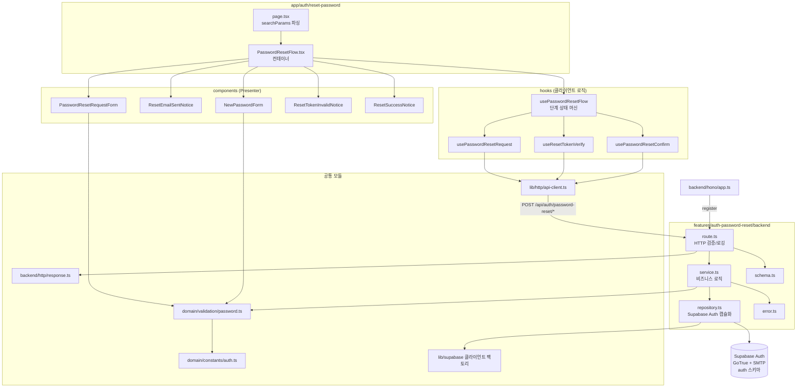

# Plan: UC-004 비밀번호 재설정

> 근거: `docs/usecases/004/spec.md`, `docs/usecases/000_decisions.md`(A-2·A-9·A-10·A-11), `docs/techstack.md` §4·§7·§9, `docs/database.md` §3.1, `.claude/skills/spec_to_plan/references/hono-backend-guide.md`.
> 본 기능이 속한 페이지(`/auth/reset-password`)는 복잡도 L1으로 `docs/pages/` 상태관리 문서가 없다(pipeline_state.md Phase 6 결정). 폼 상태는 react-hook-form, 서버 상태는 TanStack Query, 단계 전환은 로컬 훅으로 관리한다.

## 개요

### 확정 결정 반영 (000_decisions.md)

- **A-2**: 비밀번호 정책 = 최소 8자 + 영문·숫자 포함. `packages/domain/constants` 상수로 관리, FE·BE 동일 스키마로 이중 검증.
- **A-9**: 재설정 레이트 리밋은 MVP에서 **Supabase Auth 내장 발송 간격 제한만** 사용한다. 자체 "일 5회" 집계 테이블/캐시는 만들지 않는다(2단계). 서비스는 Supabase Auth의 레이트 리밋 오류를 `429 PASSWORD_RESET_RATE_LIMITED`로 매핑만 한다. spec 4단계의 "service가 레이트 리밋 검사"는 이 결정으로 대체된다.
- **A-10**: 소셜 전용 계정에도 재설정 메일 발송을 **허용**한다(비밀번호 설정 = 이메일 로그인 수단 추가). 계정 유형 분기 로직을 두지 않는다.
- **A-11**: 전체 세션 폐기 후에도 이미 발급된 액세스 JWT는 기본 만료(1시간)까지 유효함을 허용한다(단축 없음).

### 충돌·정합성 검토

- 서비스 소유 테이블 변경 없음(BR-6) → **신규 마이그레이션 없음**. `supabase/migrations/0001~0012`와 충돌 없음.
- UC-001/002/005 spec은 `features/auth/`를, UC-004 spec 다이어그램은 `auth-password-reset`을 명시한다. "1 폴더 = 1 책임"(techstack §4) 원칙에 따라 본 기능은 **독립 슬라이스 `features/auth-password-reset/`** 로 구현하고, 회원가입(UC-001)과 공유하는 비밀번호 정책 검증은 `packages/domain`으로 분리해 중복을 제거한다.
- 전역 인프라 모듈(Hono 앱·response 헬퍼·미들웨어·Supabase 클라이언트 팩토리)은 모든 기능이 공유한다. 본 계획에서는 위치와 요구 계약만 참조하고, 최초 구현은 환경설정(Phase 9)/선행 유스케이스 구현에서 담당한다.
- 로그인 페이지의 "비밀번호 재설정" 진입 링크는 UC-002(로그인) 범위이므로 본 계획에서 제외한다.

### 모듈 목록

| 모듈 | 위치 | 설명 |
| --- | --- | --- |
| **[공통·참조]** 인증 도메인 상수 | `packages/domain/constants/auth.ts` | 비밀번호 정책(A-2)·재설정 토큰 TTL·재발송 간격·리다이렉트 경로 상수. UC-001과 공유 |
| **[공통·신규]** 비밀번호 정책 검증 | `packages/domain/validation/password.ts` | 비밀번호 정책 zod 스키마 + 순수 검증 함수. FE·BE·UC-001과 공유 |
| **[공통·참조]** HTTP Result 헬퍼 | `apps/web/src/backend/http/response.ts` | `success()/failure()/respond()/HandlerResult` (hono-backend-guide 계약) |
| **[공통·참조]** Hono 앱·컨텍스트 | `apps/web/src/backend/hono/app.ts`, `context.ts` | 싱글턴 앱, 미들웨어 체인. 본 계획은 라우터 등록 1줄만 추가 |
| **[공통·참조]** Supabase 클라이언트 팩토리 | `apps/web/src/lib/supabase/` | anon 서버 클라이언트·쿠키 바인딩 SSR 클라이언트(`@supabase/ssr`) 팩토리. 타임아웃 주입 지점 |
| **[공통·참조]** FE fetch 유틸 | `apps/web/src/lib/http/api-client.ts` | `/api` 호출 공통 유틸(에러 응답 `{error:{code,message}}` 파싱 포함) |
| Zod 스키마 | `apps/web/src/features/auth-password-reset/backend/schema.ts` | 3개 엔드포인트의 Request/Response 스키마 정의 |
| 에러 코드 | `apps/web/src/features/auth-password-reset/backend/error.ts` | spec BR-5의 7개 에러 코드 상수 |
| Repository (외부연동) | `apps/web/src/features/auth-password-reset/backend/repository.ts` | Supabase Auth(GoTrue) 호출 캡슐화: 메일 발송·토큰 검증·비밀번호 갱신·전역 세션 폐기 |
| Service | `apps/web/src/features/auth-password-reset/backend/service.ts` | 순수 비즈니스 로직: 통일 응답(열거 방지)·정책 재검증·에러 매핑. repository 인터페이스에만 의존 |
| Route | `apps/web/src/features/auth-password-reset/backend/route.ts` | `POST /auth/password-reset/{request,verify,confirm}` HTTP 파싱/검증/로깅 |
| 앱 등록 | `apps/web/src/backend/hono/app.ts` (수정) | `registerPasswordResetRoutes(app)` 등록 |
| DTO 재노출 | `apps/web/src/features/auth-password-reset/lib/dto.ts` | backend/schema의 Request/Response 타입 FE 재노출(경계 명시) |
| Mutation 훅 3종 | `apps/web/src/features/auth-password-reset/hooks/usePasswordResetRequest.ts`, `useResetTokenVerify.ts`, `usePasswordResetConfirm.ts` | 엔드포인트별 TanStack Query mutation |
| 플로우 훅 | `apps/web/src/features/auth-password-reset/hooks/usePasswordResetFlow.ts` | 단계 상태 머신(request→sent / verifying→form→done / invalid). Container 로직 |
| 요청 폼 컴포넌트 | `apps/web/src/features/auth-password-reset/components/PasswordResetRequestForm.tsx` | 이메일 입력·제출 (Presenter) |
| 발송 안내 컴포넌트 | `apps/web/src/features/auth-password-reset/components/ResetEmailSentNotice.tsx` | 통일 발송 안내 + 재요청 버튼 (Presenter) |
| 새 비밀번호 폼 컴포넌트 | `apps/web/src/features/auth-password-reset/components/NewPasswordForm.tsx` | 새 비밀번호/확인 입력·정책 검증 표시 (Presenter) |
| 무효 안내 컴포넌트 | `apps/web/src/features/auth-password-reset/components/ResetTokenInvalidNotice.tsx` | 토큰 무효 통일 안내 + 재요청 유도 (Presenter) |
| 완료 안내 컴포넌트 | `apps/web/src/features/auth-password-reset/components/ResetSuccessNotice.tsx` | 성공 피드백 + 로그인 이동 (Presenter) |
| 페이지 | `apps/web/src/app/auth/reset-password/page.tsx` | 서버 컴포넌트: `searchParams`에서 `token_hash` 추출 후 플로우 컨테이너 렌더 |
| 플로우 컨테이너 | `apps/web/src/features/auth-password-reset/components/PasswordResetFlow.tsx` | 클라이언트 컨테이너: 플로우 훅과 Presenter 결선 |
| Supabase Auth 설정 체크리스트 | (코드 아님 — Supabase 대시보드) | 토큰 만료 1시간·발송 최소 간격 60초·한국어 메일 템플릿·redirect 허용 목록 |

구현 순서: 도메인 상수/검증 → backend(schema → error → repository → service → route → 앱 등록) → dto/훅 → 컴포넌트 → 페이지 → Supabase 설정 → 통합 QA.

## Diagram

## Implementation Plan

### 1. 인증 도메인 상수 — `packages/domain/constants/auth.ts` [공통·참조]

- 구현 내용:
  1. UC-001 계획이 정의할 공통 모듈이며, 본 기능은 아래 상수의 존재만 요구한다(미구현 시 본 계획에서 함께 생성):
     - `PASSWORD_MIN_LENGTH = 8`, 영문·숫자 포함 요구를 표현하는 패턴 상수(A-2)
     - `PASSWORD_RESET_TOKEN_TTL_SECONDS = 3600` (BR-2, Supabase 설정 정렬용 문서 상수)
     - `PASSWORD_RESET_RESEND_INTERVAL_SECONDS = 60` (BR-3 분당 1회 — Supabase 설정 정렬용)
     - `PASSWORD_RESET_DAILY_LIMIT = 5` (BR-3 — **A-9에 따라 MVP 미사용, 2단계 예약** 주석 명기)
     - `PASSWORD_RESET_REDIRECT_PATH = '/auth/reset-password'` (BR-7 메일 링크 리다이렉트 경로)
  2. 하드코딩 금지 원칙에 따라 FE 안내 문구에 쓰이는 수치(만료 1시간 등)도 이 상수에서 파생한다.
- 의존성: 없음 (순수 상수)
- Unit Tests: N/A (상수 정의)

### 2. 비밀번호 정책 검증 — `packages/domain/validation/password.ts` [공통·신규]

- 구현 내용:
  1. `passwordPolicySchema`(zod): 최소 `PASSWORD_MIN_LENGTH`자 + 영문 1자 이상 + 숫자 1자 이상. 실패 사유별 한국어 메시지 포함.
  2. `isPasswordPolicyCompliant(password): boolean` 순수 함수(스키마 래핑) — BE service 재검증용.
  3. 프레임워크 의존성 없음(zod만). UC-001 회원가입 폼·서비스와 공유한다.
- 의존성: 모듈 1
- **Unit Tests:**
  - [ ] 8자 + 영문 + 숫자 조합("abcd1234")은 통과한다
  - [ ] 7자 이하("abc1234")는 실패한다 (최소 길이)
  - [ ] 영문만 8자("abcdefgh")는 실패한다 (숫자 미포함)
  - [ ] 숫자만 8자("12345678")는 실패한다 (영문 미포함)
  - [ ] 특수문자 포함("abcd123!")은 통과한다 (영문+숫자 충족 시 추가 문자 허용)
  - [ ] 빈 문자열·공백만 입력은 실패한다
  - [ ] 실패 시 사유별 메시지가 구분되어 반환된다 (FE 필드 오류 표기용)

### 3. Zod 스키마 — `features/auth-password-reset/backend/schema.ts`

- 구현 내용 (BR-5의 계약을 그대로 코드화, camelCase):
  1. `PasswordResetRequestRequestSchema`: `{ email: 이메일 형식 }`
  2. `PasswordResetRequestResponseSchema`: `{ message: string }` — 통일 성공 응답
  3. `VerifyResetTokenRequestSchema`: `{ tokenHash: 비어있지 않은 문자열 }`
  4. `VerifyResetTokenResponseSchema`: `{ verified: literal(true) }`
  5. `ConfirmPasswordResetRequestSchema`: `{ newPassword: passwordPolicySchema }` — 모듈 2 재사용(확인 값 일치는 FE 책임이므로 요청에 포함하지 않음, spec BR-5-3)
  6. `ConfirmPasswordResetResponseSchema`: `{ message: string }`
  7. 각 스키마의 `z.infer` 타입 export. DB Row 스키마는 없음(BR-6: 서비스 소유 테이블 조작 없음).
- 의존성: 모듈 2
- Unit Tests: N/A (스키마 정의 — 정책 검증은 모듈 2 테스트가 커버)

### 4. 에러 코드 — `features/auth-password-reset/backend/error.ts`

- 구현 내용: `passwordResetErrorCodes`를 `as const`로 정의하고 union 타입 export. spec BR-5와 1:1 대응:
  - `PASSWORD_RESET_INVALID_EMAIL` (400) — 요청 스키마 위반
  - `PASSWORD_RESET_RATE_LIMITED` (429) — Supabase 내장 레이트 리밋 매핑(A-9)
  - `PASSWORD_RESET_SEND_FAILED` (500) — 발송 장애
  - `PASSWORD_RESET_TOKEN_INVALID` (400) — 만료/사용됨/위조 **통일 코드**(BR-1: 사유 미구분)
  - `PASSWORD_RESET_VERIFY_FAILED` (500) — 검증 장애
  - `PASSWORD_RESET_POLICY_VIOLATION` (400) — 정책 미충족
  - `PASSWORD_RESET_SESSION_INVALID` (401) — 재설정 세션 없음/만료
  - `PASSWORD_RESET_UPDATE_FAILED` (500) — 갱신/세션 폐기 장애
- 의존성: 없음
- Unit Tests: N/A (상수 정의)

### 5. Repository — `features/auth-password-reset/backend/repository.ts` [외부 서비스 연동: Supabase Auth]

- 구현 내용 (Supabase Auth 호출을 캡슐화, service는 이 인터페이스에만 의존):
  1. `sendPasswordResetEmail(client, email, redirectTo)` — anon 서버 클라이언트의 `auth.resetPasswordForEmail` 호출. 결과를 판별 유니온으로 정규화: `{ ok: true } | { ok: false, reason: 'rate_limited' | 'send_failed' }`.
     - "사용자 없음" 계열 응답은 `ok: true`로 **정규화**한다(BR-1 열거 방지 — 존재 여부를 상위 계층에 전달하지 않음).
     - Supabase 오류 코드 `over_email_send_rate_limit`/HTTP 429 → `rate_limited`. 그 외 오류 → `send_failed`.
  2. `verifyRecoveryToken(cookieClient, tokenHash)` — 쿠키 바인딩 SSR 클라이언트의 `auth.verifyOtp({ type: 'recovery', token_hash })` 호출. 성공 시 `@supabase/ssr`이 응답 쿠키에 재설정 세션을 기록한다. 반환: `{ ok: true } | { ok: false, reason: 'token_invalid' | 'verify_failed' }` (만료/사용됨/위조는 전부 `token_invalid`로 통일 — BR-1).
  3. `getRecoverySessionUser(cookieClient)` — `auth.getUser()`로 재설정 세션 사용자 조회. 없으면 null.
  4. `updatePasswordAndRevokeAllSessions(cookieClient, newPassword)` — ① `auth.updateUser({ password })` ② 성공 시 `auth.signOut({ scope: 'global' })`로 해당 사용자의 **전 기기 리프레시 토큰 폐기 + 현재 재설정 세션 쿠키 제거**(BR-4, 자동 로그인 없음). 반환: `{ ok: true } | { ok: false, reason: 'session_invalid' | 'policy_violation' | 'update_failed' }`.
     - ②가 실패해도 비밀번호 갱신은 완료된 상태이므로 `update_failed`로 반환하되, FE 재시도 안내가 가능하도록 한다(토큰은 이미 소모되어 재실행 시 401 → 재요청 유도로 수렴, 멱등 실패).
  5. 두 종류의 클라이언트를 파라미터로 주입받는다(직접 생성 금지): anon 서버 클라이언트(요청 단계 — 세션 불필요), 쿠키 바인딩 SSR 클라이언트(검증·확정 단계 — `apps/web/src/lib/supabase/` 팩토리가 Hono 컨텍스트의 요청/응답 쿠키에 바인딩해 생성, `withSupabase` 미들웨어 경유).
- **외부 연동 필수 항목:**
  - 에러 처리: 모든 Supabase 오류를 판별 유니온 reason으로 정규화. GoTrue 오류 코드(`otp_expired`, `over_email_send_rate_limit` 등)와 HTTP status 이중 매핑. 오류 원문 메시지는 로깅용 메타로만 전달(사용자 노출 금지 — BR-1).
  - 재시도: **메일 발송·토큰 검증·비밀번호 갱신 모두 자동 재시도 금지.** 발송은 중복 메일, 검증/갱신은 일회성 토큰 소모와 충돌한다(멱등하지 않음). 재시도는 사용자 주도(FE 재요청 유도)로만 한다.
  - 타임아웃: `lib/supabase` 클라이언트 팩토리에서 custom fetch에 `AbortSignal.timeout(SUPABASE_AUTH_TIMEOUT_MS)` 주입(공통 상수, 예: 10초). repository는 타임아웃 초과를 각 함수의 장애 reason(`send_failed`/`verify_failed`/`update_failed`)으로 매핑.
  - 환경변수: `NEXT_PUBLIC_SUPABASE_URL`, `NEXT_PUBLIC_SUPABASE_ANON_KEY`(techstack §9). 키는 클라이언트 팩토리만 읽으며 repository에 하드코딩하지 않는다. service-role 키는 본 기능에 불필요(전역 폐기는 사용자 자신의 세션 scope global로 수행).
- 의존성: 공통 Supabase 클라이언트 팩토리, 모듈 4
- **Unit Tests (Supabase 클라이언트 mock):**
  - [ ] `sendPasswordResetEmail`: 정상 응답 → `ok: true`
  - [ ] `sendPasswordResetEmail`: user not found 계열 오류 → `ok: true`로 정규화 (열거 방지)
  - [ ] `sendPasswordResetEmail`: 429/`over_email_send_rate_limit` → `reason: 'rate_limited'`
  - [ ] `sendPasswordResetEmail`: 네트워크 오류/타임아웃 → `reason: 'send_failed'`
  - [ ] `verifyRecoveryToken`: 유효 토큰 → `ok: true` (verifyOtp 호출 인자 `type: 'recovery'` 확인)
  - [ ] `verifyRecoveryToken`: 만료/사용됨/위조 오류 각각 → 전부 동일한 `reason: 'token_invalid'`
  - [ ] `verifyRecoveryToken`: GoTrue 5xx → `reason: 'verify_failed'`
  - [ ] `updatePasswordAndRevokeAllSessions`: 갱신+전역 signOut 모두 성공 → `ok: true`, signOut이 `scope: 'global'`로 호출됨
  - [ ] `updatePasswordAndRevokeAllSessions`: 세션 없음(401 계열) → `reason: 'session_invalid'`
  - [ ] `updatePasswordAndRevokeAllSessions`: updateUser 성공 후 signOut 실패 → `reason: 'update_failed'`

### 6. Service — `features/auth-password-reset/backend/service.ts`

- 구현 내용 (repository 인터페이스에만 의존, Supabase 문법 무지, `HandlerResult` 반환):
  1. `requestPasswordReset(deps, email, origin)`:
     - `redirectTo = origin + PASSWORD_RESET_REDIRECT_PATH`(상수) 조립 후 `repo.sendPasswordResetEmail` 호출.
     - `ok: true` → `success({ message: 통일 문구 })` (계정 존재 여부와 무관한 단일 경로 — BR-1).
     - `rate_limited` → `failure(429, PASSWORD_RESET_RATE_LIMITED)` (A-9: 자체 카운터 없음, Supabase 내장 제한 매핑만).
     - `send_failed` → `failure(500, PASSWORD_RESET_SEND_FAILED)` (오류 응답에도 계정 존재 여부 힌트 없음).
  2. `verifyResetToken(deps, tokenHash)`:
     - `repo.verifyRecoveryToken` 호출. `ok` → `success({ verified: true })`. `token_invalid` → `failure(400, PASSWORD_RESET_TOKEN_INVALID)` (사유 미구분). `verify_failed` → `failure(500, PASSWORD_RESET_VERIFY_FAILED)`.
  3. `confirmPasswordReset(deps, newPassword)`:
     - ① `isPasswordPolicyCompliant` 재검증(모듈 2) — 위반 시 `failure(400, PASSWORD_RESET_POLICY_VIOLATION)`.
     - ② `repo.getRecoverySessionUser` — null이면 `failure(401, PASSWORD_RESET_SESSION_INVALID)` (Edge: 세션 없이/만료 후 제출).
     - ③ `repo.updatePasswordAndRevokeAllSessions` — `session_invalid` → 401, `policy_violation` → 400, `update_failed` → 500, 성공 → `success({ message })`.
  4. 로깅·HTTP 파싱 없음(route 책임). 소셜 전용 계정 분기 없음(A-10).
- 의존성: 모듈 2, 4, 5, 공통 response 헬퍼
- **Unit Tests (repository mock):**
  - [ ] request: repo 성공 → 200 통일 응답. **미가입/가입 케이스 모두 응답 객체가 완전히 동일**함을 단언 (repo가 이미 정규화하므로 단일 경로 검증)
  - [ ] request: `rate_limited` → 429 + `PASSWORD_RESET_RATE_LIMITED`
  - [ ] request: `send_failed` → 500 + `PASSWORD_RESET_SEND_FAILED`, 메시지에 이메일/계정 정보 미포함
  - [ ] verify: `ok` → 200 `{ verified: true }`
  - [ ] verify: `token_invalid` → 400 + `PASSWORD_RESET_TOKEN_INVALID` (만료·사용됨·위조 입력 모두 동일 결과)
  - [ ] verify: `verify_failed` → 500 + `PASSWORD_RESET_VERIFY_FAILED`
  - [ ] confirm: 정책 위반 비밀번호("short1") → repo 호출 없이 400 + `PASSWORD_RESET_POLICY_VIOLATION`
  - [ ] confirm: 재설정 세션 없음 → 401 + `PASSWORD_RESET_SESSION_INVALID`
  - [ ] confirm: repo `update_failed` → 500 + `PASSWORD_RESET_UPDATE_FAILED`
  - [ ] confirm: 성공 → 200 + 완료 메시지, `updatePasswordAndRevokeAllSessions`가 정확히 1회 호출됨

### 7. Route — `features/auth-password-reset/backend/route.ts`

- 구현 내용 (`registerPasswordResetRoutes(app)`, Hono 앱 `/api` 하위):
  1. `POST /auth/password-reset/request`: body를 `PasswordResetRequestRequestSchema`로 검증 — 실패 시 `failure(400, PASSWORD_RESET_INVALID_EMAIL)`. 요청 URL에서 origin 추출 후 service 호출. 실패 시 `getLogger(c)`로 코드별 로깅(단, 로그에도 계정 존재 추정 정보 금지). `respond()`로 반환.
  2. `POST /auth/password-reset/verify`: `VerifyResetTokenRequestSchema` 검증(실패 시 400 `PASSWORD_RESET_TOKEN_INVALID` — 형식 불량도 위조와 동일 취급, BR-1). 쿠키 바인딩 클라이언트를 컨텍스트에서 취득해 service 호출. 성공 시 SSR 어댑터가 세팅한 세션 쿠키가 응답에 포함되는지 보장.
  3. `POST /auth/password-reset/confirm`: `ConfirmPasswordResetRequestSchema` 검증(실패 시 400 `PASSWORD_RESET_POLICY_VIOLATION`). service 호출 후 `respond()`.
  4. 세 핸들러 모두 비즈니스 로직 없음 — 파싱/검증/의존성 주입/로깅/응답만.
- 의존성: 모듈 3, 4, 6, 공통(context·response·미들웨어)
- **QA Sheet:**

| # | 시나리오 | 기대 결과 |
| --- | --- | --- |
| 1 | `POST /api/auth/password-reset/request` 유효 이메일 | 200 + `{ message }` 통일 응답 |
| 2 | 동일 요청을 미가입 이메일로 | #1과 **바이트 단위 동일한** 200 응답 |
| 3 | request에 이메일 형식 오류(`"abc"`) | 400 + `PASSWORD_RESET_INVALID_EMAIL` |
| 4 | request 60초 내 재호출(Supabase 내장 제한) | 429 + `PASSWORD_RESET_RATE_LIMITED` |
| 5 | `POST .../verify` 유효 `tokenHash` | 200 + `{ verified: true }` + `Set-Cookie`(재설정 세션) |
| 6 | verify에 만료/사용됨/임의 문자열 토큰 | 모두 400 + `PASSWORD_RESET_TOKEN_INVALID` (구분 없음) |
| 7 | verify body 누락/빈 문자열 | 400 + `PASSWORD_RESET_TOKEN_INVALID` |
| 8 | `POST .../confirm` 재설정 세션 쿠키 + 정책 충족 비밀번호 | 200 + 완료 메시지, 세션 쿠키 제거됨 |
| 9 | confirm 세션 쿠키 없이 호출 | 401 + `PASSWORD_RESET_SESSION_INVALID` |
| 10 | confirm에 정책 미달 비밀번호("abc") | 400 + `PASSWORD_RESET_POLICY_VIOLATION` |
| 11 | confirm 성공 직후 동일 토큰으로 verify 재시도 | 400 + `PASSWORD_RESET_TOKEN_INVALID` (일회성 소모 확인) |
| 12 | confirm 성공 후 기존 로그인 기기의 리프레시 시도 | 갱신 실패(전 세션 폐기) → 재로그인 유도 |
| 13 | 오류 응답 형태 | 전부 `{ error: { code, message } }` (failure 규약) |

### 8. 앱 등록 — `apps/web/src/backend/hono/app.ts` (수정)

- 구현 내용: `registerPasswordResetRoutes(app)`를 기존 미들웨어 체인(errorBoundary → withAppContext → withSupabase) 뒤 라우터 등록부에 추가. 인증 미들웨어 강제 구간에 넣지 않는다(3개 엔드포인트 모두 Guest 접근 — confirm의 인증은 service가 재설정 세션으로 판정).
- 의존성: 모듈 7
- QA: `/api/auth/password-reset/*` 경로 접근 가능, 다른 feature 라우트와 경로 충돌 없음(UC-001 `/auth/signup`, UC-002 `/auth/login`과 프리픽스 상이).

### 9. DTO 재노출 — `features/auth-password-reset/lib/dto.ts`

- 구현 내용: backend/schema의 Request/Response 스키마·타입을 re-export. FE(훅·컴포넌트)는 backend 딥 임포트 대신 이 파일만 사용해 경계를 명시한다.
- 의존성: 모듈 3
- Unit Tests: N/A (재노출)

### 10. Mutation 훅 3종 — `features/auth-password-reset/hooks/`

- 구현 내용 (각 파일 1책임, 공통 fetch 유틸 사용, credentials 포함 요청):
  1. `usePasswordResetRequest.ts`: `POST /api/auth/password-reset/request` mutation. 429/500 오류 코드를 그대로 노출(문구 매핑은 Presenter).
  2. `useResetTokenVerify.ts`: `POST .../verify` mutation. 쿠키 수신을 위해 same-origin 기본 설정 유지.
  3. `usePasswordResetConfirm.ts`: `POST .../confirm` mutation.
  4. 셋 다 서버 상태 캐싱 불필요(mutation 전용), 재시도 `retry: false`(멱등하지 않은 흐름 — repository 항목과 동일 근거).
- 의존성: 모듈 9, 공통 fetch 유틸
- **Unit Tests (fetch mock):**
  - [ ] 각 훅이 올바른 엔드포인트/메서드/바디로 호출한다
  - [ ] 성공 응답이 Response 스키마 파싱을 통과해 반환된다
  - [ ] `{ error: { code } }` 오류 응답에서 code가 보존되어 onError로 전달된다
  - [ ] 오류 시 자동 재시도가 발생하지 않는다

### 11. 플로우 훅 — `features/auth-password-reset/hooks/usePasswordResetFlow.ts`

- 구현 내용 (Container 로직 — Presenter와 분리):
  1. 입력: `tokenHash: string | null`(페이지 searchParams).
  2. 단계 상태 머신: `request`(이메일 폼) → `sent`(발송 안내) / `verifying`(토큰 검증 중) → `newPassword`(새 비밀번호 폼) → `done`(완료) / `invalid`(무효 안내).
  3. 마운트 시 `tokenHash` 존재하면 `verifying`으로 시작해 verify mutation 자동 1회 실행(StrictMode 중복 실행 가드 포함) — 성공 시 `newPassword`, 400 시 `invalid`, 500 시 `invalid`가 아닌 오류 배너 + 재시도 버튼(검증 자체 장애는 재진입 여지 유지).
  4. `tokenHash` 없으면 `request`로 시작.
  5. request mutation 성공 → `sent`(에러 코드별 메시지 키 노출: rate_limited/send_failed). `sent`에서 "다시 요청" → `request` 복귀.
  6. confirm mutation 성공 → `done`. 401 수신 → `invalid`(링크 재진입/재요청 유도). 400 정책 위반 → 필드 오류로 전달.
  7. 반환: `{ step, errorCode, actions: { submitEmail, submitNewPassword, backToRequest } }` + 각 mutation의 `isPending`.
- 의존성: 모듈 10
- **Unit Tests (mutation mock, renderHook):**
  - [ ] tokenHash 없음 → 초기 step이 `request`
  - [ ] tokenHash 있음 → `verifying`에서 verify가 정확히 1회 호출되고 성공 시 `newPassword`
  - [ ] verify 400 → `invalid`
  - [ ] verify 500 → step 유지 + errorCode 세팅(재시도 액션 제공)
  - [ ] submitEmail 성공 → `sent`
  - [ ] submitEmail 429 → step `request` 유지 + errorCode `PASSWORD_RESET_RATE_LIMITED`
  - [ ] submitNewPassword 성공 → `done`
  - [ ] submitNewPassword 401 → `invalid`
  - [ ] `sent`에서 backToRequest → `request`

### 12. 요청 폼 — `components/PasswordResetRequestForm.tsx`

- 구현 내용: 이메일 입력 1필드 + 제출 버튼. react-hook-form + zod(이메일 형식). props: `onSubmit`, `isPending`, `errorCode`. errorCode → 한국어 문구 매핑(429: "요청이 잦습니다. 잠시 후 다시 시도해 주세요.", 500: "일시적인 오류입니다. 다시 시도해 주세요."). 비즈니스 로직 없음.
- 의존성: 모듈 11(컨테이너 경유), shadcn-ui 폼 프리미티브
- **QA Sheet:**

| # | 시나리오 | 기대 결과 |
| --- | --- | --- |
| 1 | 빈 값으로 제출 | 필드 오류 "이메일을 입력해 주세요" + API 미호출 |
| 2 | 형식 오류("abc") 제출 | 필드 오류 표시 + 제출 차단 |
| 3 | 유효 이메일 제출 | onSubmit 1회 호출, 버튼 로딩 상태 |
| 4 | isPending 중 재클릭 | 버튼 비활성 — 중복 제출 차단 |
| 5 | errorCode=429 전달 | 재시도 안내 문구 표시(계정 존재 여부 무관 문구) |
| 6 | errorCode=500 전달 | 일시 오류 + 재시도 유도 문구 |
| 7 | 키보드만으로 입력·제출 | 포커스 이동·Enter 제출 가능(접근성) |
| 8 | 모바일 뷰포트(375px) | 레이아웃 깨짐 없음(반응형) |

### 13. 발송 안내 — `components/ResetEmailSentNotice.tsx`

- 구현 내용: 통일 안내 문구("입력하신 주소로 안내 메일을 발송했습니다. 메일함을 확인해 주세요." — 계정 존재 여부 비노출, BR-1) + 만료 1시간 고지(상수 파생) + "다시 요청" 버튼(`onBack`).
- 의존성: 모듈 1(상수)
- **QA Sheet:**

| # | 시나리오 | 기대 결과 |
| --- | --- | --- |
| 1 | 가입/미가입 이메일 어느 쪽으로 도달해도 | 완전히 동일한 문구 (분기 없음) |
| 2 | 만료 안내 | "1시간" 표기가 상수에서 파생됨 (하드코딩 아님) |
| 3 | "다시 요청" 클릭 | 이메일 폼으로 복귀 |

### 14. 새 비밀번호 폼 — `components/NewPasswordForm.tsx`

- 구현 내용: 새 비밀번호 + 확인 2필드. react-hook-form + zod — `passwordPolicySchema`(모듈 2) 재사용 + 확인 일치 refine(확인 일치는 FE 전담, spec 9단계). props: `onSubmit(newPassword)`, `isPending`, `errorCode`. 정책 요건 안내 문구(8자·영문·숫자)는 상수 파생. 서버 400 `PASSWORD_RESET_POLICY_VIOLATION` 수신 시 필드 오류로 표기.
- 의존성: 모듈 2, 모듈 11(컨테이너 경유)
- **QA Sheet:**

| # | 시나리오 | 기대 결과 |
| --- | --- | --- |
| 1 | 7자 이하 입력 | 필드 오류 + 제출 차단 |
| 2 | 영문만/숫자만 입력 | 정책 오류 문구 + 제출 차단 |
| 3 | 확인 값 불일치 | "비밀번호가 일치하지 않습니다" + 제출 차단, API 미호출 |
| 4 | 정책 충족 + 일치 | onSubmit 1회 호출 |
| 5 | isPending 중 더블 클릭 | 버튼 비활성 — 중복 제출 차단(Edge: 더블 클릭) |
| 6 | 서버 400 정책 위반 응답 | 필드 오류로 표기(폼 유지) |
| 7 | 비밀번호 마스킹/표시 토글 | 입력값 마스킹 기본, 토글 동작 |
| 8 | 정책 안내 문구 | "최소 8자, 영문+숫자" — 상수 파생 확인 |

### 15. 무효 안내 — `components/ResetTokenInvalidNotice.tsx`

- 구현 내용: 사유 미구분 통일 안내("링크가 유효하지 않습니다. 재설정을 다시 요청해 주세요." — BR-1: 만료/사용됨/위조 구분 없음) + "재설정 다시 요청" 버튼(`onRequestAgain` → request 단계로).
- 의존성: 없음
- **QA Sheet:**

| # | 시나리오 | 기대 결과 |
| --- | --- | --- |
| 1 | 만료 토큰으로 진입 | 통일 무효 안내 |
| 2 | 사용된 토큰으로 재진입 | #1과 동일 문구 |
| 3 | 임의 변조 토큰으로 진입 | #1과 동일 문구 (위조 여부 비노출) |
| 4 | "다시 요청" 클릭 | 이메일 요청 폼 표시 |

### 16. 완료 안내 — `components/ResetSuccessNotice.tsx`

- 구현 내용: 성공 피드백("비밀번호가 재설정되었습니다. 새 비밀번호로 로그인해 주세요.") + 로그인 페이지(`/auth/login`) 이동 버튼. 자동 로그인 없음(BR-4). 기존 기기 로그아웃 고지 문구 포함.
- 의존성: 없음
- **QA Sheet:**

| # | 시나리오 | 기대 결과 |
| --- | --- | --- |
| 1 | confirm 성공 도달 | 성공 문구 + 로그인 이동 버튼 |
| 2 | 로그인 이동 클릭 | `/auth/login` 라우팅 |
| 3 | 완료 화면에서 로그인 상태 | 비로그인 상태(재설정 세션도 폐기됨) |

### 17. 페이지 — `app/auth/reset-password/page.tsx`

- 구현 내용: **서버 컴포넌트.** Next 16 규약에 따라 `searchParams: Promise<...>`를 await하여 `token_hash`(문자열|undefined)를 추출하고 `<PasswordResetFlow tokenHash={...} />`를 렌더. 메타데이터(title) 설정. 라우팅/레이아웃 외 로직 없음(`app/`은 Presentation 전용 — techstack §4).
- 의존성: 모듈 18
- **QA Sheet:**

| # | 시나리오 | 기대 결과 |
| --- | --- | --- |
| 1 | `/auth/reset-password` 직접 접근 | 이메일 요청 폼 표시 |
| 2 | `/auth/reset-password?token_hash=...` (메일 링크) | 토큰 검증 → 새 비밀번호 폼(유효) / 무효 안내 |
| 3 | 로그인 상태로 접근 | 정상 동작(Guest 필수 아님 — Precondition상 로그인 불요) |
| 4 | 새로고침(토큰 소모 후) | 무효 안내로 수렴(일회성) |

### 18. 플로우 컨테이너 — `components/PasswordResetFlow.tsx`

- 구현 내용: `'use client'` 컨테이너. `usePasswordResetFlow(tokenHash)` 호출 후 step에 따라 모듈 12~16 Presenter를 조건 렌더. `verifying` 단계 스피너 표시. Presenter에는 콜백·상태 props만 전달(Container/Presenter 패턴).
- 의존성: 모듈 11~16
- **QA Sheet:**

| # | 시나리오 | 기대 결과 |
| --- | --- | --- |
| 1 | step 전환 전체 경로(request→sent, verifying→newPassword→done, →invalid) | 각 단계에 해당 Presenter만 렌더 |
| 2 | verifying 중 | 로딩 인디케이터 표시, 폼 미노출 |
| 3 | invalid에서 재요청 | request 폼으로 전환(URL 토큰 무시) |
| 4 | confirm 401 발생 | invalid 안내로 전환 |

### 19. Supabase Auth 설정 체크리스트 (코드 아님 — 대시보드/설정, 구현 단계에서 수행)

- 구현 내용 (BR-2·BR-3·BR-7 정렬, `supabase/migrations` 변경 없음):
  1. 재설정(recovery) 토큰 만료 = 3600초(`PASSWORD_RESET_TOKEN_TTL_SECONDS`와 정렬).
  2. 이메일 발송 최소 간격 = 60초(`PASSWORD_RESET_RESEND_INTERVAL_SECONDS`와 정렬 — A-9: 내장 제한만 사용).
  3. Reset Password 메일 템플릿을 **한국어**로 구성하고, 링크를 `{SITE_URL}/auth/reset-password?token_hash={{ .TokenHash }}` 형태(토큰 해시 직접 전달)로 설정 — FE→verify API 흐름(BR-5-2)과 정합.
  4. Redirect URLs 허용 목록에 배포/로컬 origin + `/auth/reset-password` 등록.
  5. 소셜 전용 계정 발송 차단 설정 없음(A-10: 허용).
- 의존성: 없음 (구현과 병행 가능, 통합 QA 전 완료 필수)
- 검증: QA Sheet #5(모듈 7)와 E2E로 실제 메일 링크 왕복 확인.
