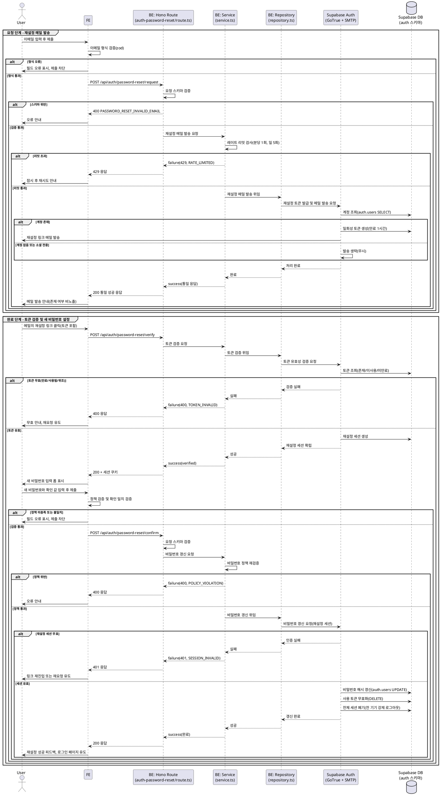

# UC-004: 비밀번호 재설정

> 근거: `docs/userflow.md` 004, `docs/prd.md` 3장(로그인/회원가입 · 계정 페이지) · 5장 IA(`/auth/reset-password`), `docs/database.md` 3.1(인증·계정), `docs/techstack.md` §7(Supabase Auth).
> 표준 이메일 재설정 링크 플로우. 세션·재설정 토큰은 Supabase Auth(`auth` 스키마)가 관리하며 서비스 자체 토큰 테이블은 두지 않는다.

---

## Primary Actor

- **Guest** (비로그인 방문자 — 비밀번호를 분실한 기존 이메일 가입자)

## Precondition (사용자 관점)

- 사용자가 로그인 페이지 또는 재설정 페이지(`/auth/reset-password`)에 접근할 수 있다.
- (완료 단계) 사용자가 자신의 이메일 수신함에 접근할 수 있다.
- 로그인 상태일 필요는 없다.

## Trigger

- 로그인 페이지에서 "비밀번호 재설정" 진입 후 이메일을 입력·제출한다.

---

## Main Scenario

### 요청 단계 (재설정 메일 발송)

1. 사용자가 재설정 페이지에서 이메일을 입력하고 제출한다.
2. FE가 이메일 형식을 검증(zod)하고, 통과 시 재설정 요청 API를 호출한다.
3. BE(route)가 요청 스키마를 검증하고 service에 위임한다.
4. service가 레이트 리밋(분당 1회/일 5회, 상수)을 검사한다. 초과 시 요청을 거절한다.
5. service가 repository를 통해 Supabase Auth에 재설정 메일 발송을 요청한다.
   - 계정이 존재하면 Supabase Auth가 **만료 1시간의 일회성 재설정 토큰**을 생성하고, 재설정 링크(`/auth/reset-password` 리다이렉트)가 담긴 메일을 발송한다.
   - 계정이 없거나 소셜 전용 계정이어도 BE 응답은 동일하다(계정 열거 방지).
6. BE가 계정 존재 여부와 무관한 **통일 성공 응답**을 반환하고, FE는 "메일 발송 안내"를 표시한다.

### 완료 단계 (링크 진입 → 새 비밀번호 설정)

7. 사용자가 메일의 재설정 링크를 클릭해 재설정 페이지에 진입한다(링크에 토큰 포함).
8. FE가 토큰 검증 API를 호출하고, BE(route → service → repository)가 Supabase Auth에 토큰 유효성(존재/미사용/미만료)을 검증한다.
   - 유효: 일회성 **재설정 세션**(비밀번호 변경만 허용되는 임시 인증 컨텍스트)이 확립되고 새 비밀번호 입력 폼이 표시된다.
   - 무효: 무효 안내와 함께 재요청 화면으로 유도한다.
9. 사용자가 새 비밀번호와 확인 값을 입력·제출한다. FE가 비밀번호 정책(회원가입 001과 동일 정책)과 확인 일치를 검증한다.
10. BE(route)가 스키마를 검증하고, service가 비밀번호 정책을 재검증한 뒤 repository를 통해 Supabase Auth에 비밀번호 갱신을 요청한다.
11. Supabase Auth가 비밀번호를 단방향 해시로 갱신하고, 사용한 토큰을 무효화하며, **해당 사용자의 전체 세션(모든 기기 리프레시 토큰)을 폐기**한다.
12. FE가 재설정 성공 피드백을 표시하고 로그인 페이지로 유도한다(자동 로그인 없음).

---

## Edge Cases

| 상황 | 처리 |
|---|---|
| 미가입 이메일로 요청 | 계정 열거 방지: 발송 없이 통일 성공 응답(가입 계정과 동일 문구·동일 응답 형태) |
| 소셜 전용(비밀번호 없는) 계정으로 요청 | 계정 열거 방지 범위 내 일관 응답. 실제 발송/비밀번호 설정 허용 여부는 Open Question 참조 |
| 재요청 남용 (분당 1회/일 5회 초과) | 429 거절 + 잠시 후 재시도 안내. 상수로 관리 |
| 만료(1시간 초과) 토큰으로 진입 | 무효 안내 → 재요청 유도 (사유 구분 없이 동일 안내) |
| 이미 사용된 토큰 재사용 | 무효 안내 → 재요청 유도 |
| 위조/변조 토큰 | 무효 안내 → 재요청 유도 (위조 여부를 노출하지 않음) |
| 새 비밀번호 정책 미충족 | FE 필드 오류 표기 + 제출 차단, BE도 재검증 후 400 거절 |
| 확인 값 불일치 | FE에서 제출 차단 |
| 재설정 세션 없이/만료 후 비밀번호 제출 | 401 거절 → 링크 재진입 또는 재요청 유도 |
| 메일 발송 실패(Supabase/SMTP 장애) | 5xx 오류 안내 + 재시도 유도. 계정 존재 여부는 오류에도 비노출 |
| 갱신 요청 중복 제출(더블 클릭) | 토큰 일회성으로 두 번째 요청은 무효 처리(멱등하게 실패) |
| 재설정 완료 후 기존 로그인 기기 | 전체 세션 폐기로 다음 요청 시 인증 실패 → 재로그인 유도 |

---

## Business Rules

### BR-1. 계정 열거 방지

- 요청 단계 응답은 계정 존재 여부·소셜 전용 여부와 무관하게 **동일한 성공 응답**(문구·상태 코드·응답 형태)을 사용한다.
- 토큰 무효 사유(만료/사용됨/위조)는 사용자에게 구분해 노출하지 않는다.

### BR-2. 토큰 정책

- 재설정 토큰은 **일회성**이며 **만료 1시간**(상수)이다.
- 새 토큰 발급 시 동일 사용자의 이전 미사용 재설정 토큰은 Supabase Auth 정책에 따라 대체된다.
- 토큰 생성·검증·소모는 Supabase Auth가 전담하며 서비스 DB에 토큰을 저장하지 않는다.

### BR-3. 레이트 리밋

- 재설정 메일 재요청은 **분당 1회 / 일 5회**(상수, `packages/domain/constants`)로 제한한다.
- 초과 시 메일 발송 없이 429로 거절한다(이 응답은 계정 존재 여부와 무관하게 요청 빈도만으로 결정되므로 열거 방지 원칙과 충돌하지 않음).

### BR-4. 비밀번호 정책 및 세션 무효화

- 새 비밀번호는 회원가입(001)과 동일한 비밀번호 정책을 FE·BE 양쪽에서 검증한다.
- 비밀번호는 단방향 해시로만 저장한다(Supabase Auth 내장).
- 재설정 성공 시 해당 사용자의 **전체 세션을 강제 로그아웃**한다(모든 기기 리프레시 토큰 폐기). 재설정 직후 자동 로그인은 하지 않고 로그인 페이지로 유도한다.

### BR-5. API Specification

공통 규약: Hono 싱글턴 앱(`/api/[[...hono]]`) 하위, 성공 응답은 `success()` 데이터 본문, 실패 응답은 `failure()` 형태 `{ "error": { "code": string, "message": string } }` (techstack §4, hono-backend-guide).

#### 1) 재설정 메일 발송 요청

- **Endpoint**: `POST /api/auth/password-reset/request`
- **인증**: 불필요 (Guest)
- **Request Body**

  ```json
  { "email": "user@example.com" }
  ```

- **Response `200 OK`** — 계정 존재 여부와 무관한 통일 응답

  ```json
  { "message": "재설정 안내 메일 발송 처리됨" }
  ```

- **Error Codes**

  | HTTP | code | 조건 |
  |---|---|---|
  | 400 | `PASSWORD_RESET_INVALID_EMAIL` | 이메일 형식 오류 |
  | 429 | `PASSWORD_RESET_RATE_LIMITED` | 분당 1회/일 5회 초과 |
  | 500 | `PASSWORD_RESET_SEND_FAILED` | Supabase Auth/메일 발송 장애 |

#### 2) 재설정 토큰 검증

- **Endpoint**: `POST /api/auth/password-reset/verify`
- **인증**: 불필요 (메일 링크의 토큰이 자격 증명)
- **Request Body**

  ```json
  { "tokenHash": "<재설정 링크에 포함된 일회성 토큰>" }
  ```

- **Response `200 OK`** — 재설정 세션 확립(세션 자격 증명은 쿠키로 전달, `@supabase/ssr`)

  ```json
  { "verified": true }
  ```

- **Error Codes**

  | HTTP | code | 조건 |
  |---|---|---|
  | 400 | `PASSWORD_RESET_TOKEN_INVALID` | 만료/사용됨/위조 토큰 (사유 미구분 통일 코드) |
  | 500 | `PASSWORD_RESET_VERIFY_FAILED` | Supabase Auth 장애 |

#### 3) 새 비밀번호 확정

- **Endpoint**: `POST /api/auth/password-reset/confirm`
- **인증**: 필요 — 2)에서 확립된 재설정 세션
- **Request Body**

  ```json
  { "newPassword": "<새 비밀번호>" }
  ```

  (확인 값 일치 검증은 FE 책임, BE는 정책만 재검증)

- **Response `200 OK`**

  ```json
  { "message": "비밀번호 재설정 완료" }
  ```

- **Error Codes**

  | HTTP | code | 조건 |
  |---|---|---|
  | 400 | `PASSWORD_RESET_POLICY_VIOLATION` | 비밀번호 정책 미충족 |
  | 401 | `PASSWORD_RESET_SESSION_INVALID` | 재설정 세션 없음/만료 |
  | 500 | `PASSWORD_RESET_UPDATE_FAILED` | 비밀번호 갱신/세션 폐기 장애 |

### BR-6. Database Operations

서비스 소유 테이블(public 스키마)에 대한 직접 조작은 **없다**. 모든 저장소 변경은 Supabase Auth가 `auth` 스키마 내부에서 수행한다(database.md 3.1: 재설정 토큰·세션은 Supabase Auth 관리, 별도 테이블 없음).

| 단계 | 스키마.테이블 (Supabase Auth 관리) | 연산 | 내용 |
|---|---|---|---|
| 요청 | `auth.users` | SELECT | 이메일로 계정 조회 (존재 시에만 후속 진행) |
| 요청 | `auth.one_time_tokens` | INSERT | 일회성 재설정 토큰 생성(만료 1시간) |
| 검증 | `auth.one_time_tokens` | SELECT | 토큰 존재/미사용/미만료 검증 |
| 검증 | `auth.sessions` / `auth.refresh_tokens` | INSERT | 재설정 세션 확립 |
| 확정 | `auth.users` | UPDATE | `encrypted_password` 단방향 해시 갱신 |
| 확정 | `auth.one_time_tokens` | DELETE | 사용한 토큰 소모/무효화 |
| 확정 | `auth.sessions` / `auth.refresh_tokens` | DELETE | 해당 사용자 전체 세션 폐기(강제 로그아웃) |

- `public.profiles`, `public.terms_agreements`는 본 기능에서 변경되지 않는다.
- 일 5회 레이트 리밋 집계의 저장 위치는 미확정(Open Question).

### BR-7. External Service Integration

- **Supabase Auth (GoTrue)** — 인증 인프라 (techstack §1·§7이 SOT, `docs/external/`에 별도 연동 문서 없음):
  - 재설정 토큰 생성/검증/소모, 비밀번호 해시 갱신, 세션(리프레시 토큰) 전역 폐기를 전담한다.
  - 토큰 만료(1시간)와 재발송 최소 간격(분당 1회)은 Supabase Auth 프로젝트 설정으로 정렬한다.
  - BE는 repository 계층에서만 Supabase Auth를 호출하고, service는 repository 인터페이스에만 의존한다(계층 분리 Must 규칙).
- **이메일 발송** — Supabase Auth 내장 메일(SMTP) 사용. 재설정 메일 템플릿은 한국어로 구성하고, 링크의 리다이렉트 대상은 `/auth/reset-password`이다.
- 그 외 외부 API(OpenDART/SEC/토스증권)는 본 기능과 무관하다(배치 전용).

---

## Sequence Diagram



---

## Open Questions

1. **일 5회 레이트 리밋의 집계 저장 위치**: database.md는 인증 관련 자체 테이블을 두지 않는다고 명시했다. Supabase Auth 내장 레이트 리밋 설정(발송 최소 간격)으로 분당 1회는 커버되지만, "일 5회" 집계는 내장 설정만으로 표현이 어렵다. 별도 저장(경량 테이블 또는 메모리/캐시) 도입 여부와 위치 확정 필요.
2. **소셜 전용 계정의 재설정 메일 처리**: userflow는 "일관 응답"만 규정한다. Supabase Auth 기본 동작상 소셜 전용 계정에도 재설정 메일이 발송되어 비밀번호 설정(사실상 이메일 로그인 수단 추가)이 가능해질 수 있다. 001의 자동 연동(병합) 정책과 정합하므로 허용이 자연스러우나, 발송 자체를 차단할지 여부는 정책 확정 필요.
