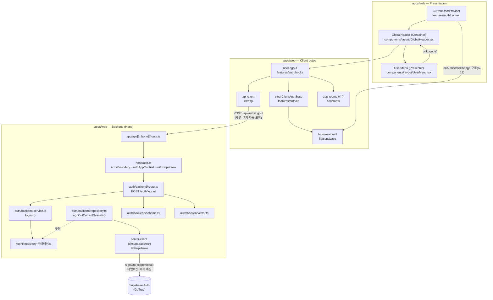

# Plan: UC-005 로그아웃

> 근거: `docs/usecases/005/spec.md`, `docs/usecases/000_decisions.md`(A-11·A-12·A-13), `docs/techstack.md` §4·§7,
> `.claude/skills/spec_to_plan/references/hono-backend-guide.md`(Hono 백엔드 컨벤션), `docs/database.md` 3.1(세션은 Supabase Auth 관리).
> 본 문서는 계획만 기술하며 구현 코드를 포함하지 않는다.

## 확정 결정 반영 (000_decisions.md)

| 결정 | 반영 내용 |
|---|---|
| A-11 | JWT 잔여 유효시간은 Supabase 기본(1시간) 유지. **본 기능에서 설정 변경·구현 작업 없음** (쿠키 제거로 클라이언트 사용 경로만 차단) |
| A-12 | Supabase Auth 장애로 500(`AUTH_LOGOUT_FAILED`) 수신 시에도 FE는 **로컬 인증 상태·쿠키를 제거하고 비로그인으로 전환**(베스트 에포트) 후 오류 안내 |
| A-13 | 동일 브라우저 타 탭 동기화는 **`onAuthStateChange` 이벤트 구독 기반 즉시 동기화** (다음 요청 401 처리는 보조 수단) |

## 개요

로그아웃은 인증 기능군(UC-001~006)이 공유하는 `features/auth` 수직 슬라이스에 속한다. 아직 다른 plan.md가 없으므로 공통 인프라 모듈은 본 문서가 최초 정의하되, **다른 유스케이스 plan과 공유되는 파일은 "확장 지점"으로 표기**한다(해당 파일에 로그아웃 관련 항목만 추가하며, 타 유스케이스 몫의 내용은 본 plan 범위가 아니다).

### UC-005 고유 모듈

| 모듈 | 위치 | 설명 |
| --- | --- | --- |
| Logout Schema | `apps/web/src/features/auth/backend/schema.ts` *(공유 파일 확장)* | `LogoutResponseSchema` 정의 (`{ loggedOut: boolean }`) |
| Auth Error Codes | `apps/web/src/features/auth/backend/error.ts` *(공유 파일 확장)* | `AUTH_LOGOUT_FAILED` 에러 코드 추가 |
| Auth Repository — signOut | `apps/web/src/features/auth/backend/repository.ts` *(공유 파일 확장)* | Supabase Auth `signOut(scope: local)` 호출 캡슐화, 결과를 도메인 결과 타입으로 매핑 |
| Auth Service — logout | `apps/web/src/features/auth/backend/service.ts` *(공유 파일 확장)* | 멱등 로그아웃 비즈니스 로직 (`HandlerResult` 반환, Repository 인터페이스에만 의존) |
| Auth Route — POST /auth/logout | `apps/web/src/features/auth/backend/route.ts` *(공유 파일 확장)* | HTTP 계층: 본문 검증 없음, Service 위임, 오류 로깅, `respond()` 응답 |
| clearClientAuthState | `apps/web/src/features/auth/lib/clearClientAuthState.ts` | 클라이언트 인증 상태 일괄 초기화 순수 조율 함수 (캐시 제거 + 브라우저 세션 제거 + 컨텍스트 리셋) |
| useLogout | `apps/web/src/features/auth/hooks/useLogout.ts` | 로그아웃 mutation 훅 (API 호출 → 상태 초기화 → 메인 이동, A-12 베스트 에포트 포함) |
| UserMenu (Presenter) | `apps/web/src/components/layout/UserMenu.tsx` | 계정 메뉴 프레젠터 — 로그아웃 항목 렌더링·클릭 이벤트만 (로직 없음) |

### 공통(shared) 모듈 — 본 plan이 최초 정의, 인증 기능군(001~006)·전 기능 공유

| 모듈 | 위치 | 설명 |
| --- | --- | --- |
| HTTP Response 헬퍼 | `apps/web/src/backend/http/response.ts` | `success()`/`failure()`/`respond()` + `HandlerResult<T, E, M>` 패턴 |
| Hono 앱/컨텍스트 | `apps/web/src/backend/hono/{app.ts, context.ts}` | 싱글턴 앱, `AppEnv`, `getSupabase(c)`/`getLogger(c)`, 기능 라우터 등록 |
| 미들웨어 체인 | `apps/web/src/backend/middleware/{error.ts, context.ts, supabase.ts}` | errorBoundary → withAppContext(설정·로거 주입) → withSupabase(쿠키 기반 요청 스코프 클라이언트) |
| Hono 진입점 | `apps/web/src/app/api/[[...hono]]/route.ts` | Next.js 단일 Route Handler (`runtime='nodejs'`), POST 등 메서드 export |
| Supabase 클라이언트 팩토리 | `apps/web/src/lib/supabase/{server-client.ts, browser-client.ts}` | `@supabase/ssr` 기반. 서버: 요청/응답 쿠키 어댑터, 타임아웃 fetch. 브라우저: 싱글턴 |
| API fetch 유틸 | `apps/web/src/lib/http/api-client.ts` | FE→Hono 호출 공통 래퍼 (쿠키 포함, HTTP 오류/네트워크 오류 구분 정규화) |
| 앱 라우트 상수 | `apps/web/src/constants/app-routes.ts` | `/`(메인) 등 내부 경로 상수 (하드코딩 금지 원칙) |
| CurrentUserProvider | `apps/web/src/features/auth/context/CurrentUserProvider.tsx` (+ `useCurrentUser`) | 전역 인증 컨텍스트. `onAuthStateChange` 구독으로 탭 간 동기화(A-13) |
| Providers 조립 | `apps/web/src/app/providers.tsx` | `QueryClientProvider` + `CurrentUserProvider`를 루트 레이아웃에 장착 |
| GlobalHeader (Container) | `apps/web/src/components/layout/GlobalHeader.tsx` | 전역 헤더. `useCurrentUser`/`useLogout` 훅 소비, 로그인/비로그인 UI 분기 |

- 데이터베이스 작업 없음: 애플리케이션 테이블 미접근, 마이그레이션 불필요 (`auth.sessions`/`auth.refresh_tokens` 폐기는 Supabase Auth 내부 처리 — database.md 3.1).
- 배치/외부 배치 API(`docs/external/`) 무관. 외부 연동은 스택 구성요소인 Supabase Auth(GoTrue)뿐이며, 연동 세부(타임아웃·에러 매핑·환경변수)는 Supabase 클라이언트 팩토리·Repository 절에 포함한다.

## Diagram



데이터 흐름: Presentation(UserMenu 클릭) → Client Logic(useLogout) → HTTP → Hono Route → Service → Repository → Supabase Auth. 응답 후 역방향으로 쿠키 제거(Set-Cookie 만료) → 클라이언트 상태 초기화 → 메인 이동.

## Implementation Plan

### 1. HTTP Response 헬퍼 (공통) — `apps/web/src/backend/http/response.ts`

- 구현 내용:
  1. `HandlerResult<T, E, M>` 판별 유니언(`ok: true | false`), `success(data, status?)`, `failure(status, code, message, details?)`, `respond(c, result)` 정의 — hono-backend-guide 패턴 그대로.
  2. 오류 응답 바디 형식 통일: `{ error: { code, message, details? } }`.
- 의존성: 없음 (최초 구현).

**Unit Tests:**

- [ ] `success(data)`가 `ok: true`와 기본 상태 200을 갖는다
- [ ] `failure(500, 'X', 'msg')`가 `ok: false`, code/message를 보존한다
- [ ] `respond()`가 success/failure 각각에 대해 올바른 HTTP 상태·바디를 생성한다

### 2. Hono 앱·미들웨어·진입점 (공통) — `backend/hono/`, `backend/middleware/`, `app/api/[[...hono]]/route.ts`

- 구현 내용:
  1. `context.ts`: `AppEnv`(Variables: `supabase`, `logger`, `config`), `getSupabase(c)`, `getLogger(c)` 헬퍼.
  2. `middleware/error.ts` — `errorBoundary()`: 미처리 예외를 500 표준 오류 응답으로 변환 + 로깅.
  3. `middleware/context.ts` — `withAppContext()`: zod로 검증된 환경설정(`NEXT_PUBLIC_SUPABASE_URL`, `NEXT_PUBLIC_SUPABASE_ANON_KEY` 등)과 로거를 컨텍스트에 주입. 환경변수 누락 시 기동 오류(하드코딩 금지).
  4. `middleware/supabase.ts` — `withSupabase()`: **요청 쿠키 기반의 요청 스코프 `@supabase/ssr` 서버 클라이언트**를 생성해 주입. 쿠키 어댑터는 Hono 요청에서 읽고(getAll) **Hono 응답에 Set-Cookie를 기록**(setAll)한다 — 로그아웃 시 세션 쿠키 제거(만료 Set-Cookie)가 이 어댑터를 통해 자동 반영되는 것이 핵심 계약.
  5. `hono/app.ts`: 싱글턴 `createHonoApp()`, 미들웨어 순서 고정(errorBoundary → withAppContext → withSupabase), `registerAuthRoutes(app)` 등록. `basePath('/api')`.
  6. `app/api/[[...hono]]/route.ts`: `runtime = 'nodejs'`, Hono 앱으로 위임하는 GET/POST/PUT/PATCH/DELETE export.
- 의존성: 모듈 1, 모듈 3(서버 클라이언트 팩토리).

**QA Sheet:**

| # | 시나리오 | 기대 결과 |
| --- | --- | --- |
| 1 | 존재하지 않는 경로 `POST /api/unknown` | 404 (미들웨어 체인 통과 후 미매칭) |
| 2 | 핸들러 내부에서 예외 발생 | errorBoundary가 500 표준 오류 바디 반환 + 서버 로그 기록 |
| 3 | 필수 환경변수 누락 상태 기동 | 명시적 설정 오류 (무의미한 런타임 오류 아님) |
| 4 | 세션 쿠키가 있는 요청 | `getSupabase(c)`가 해당 세션 컨텍스트를 가진 클라이언트 반환 |

### 3. Supabase 클라이언트 팩토리 (공통, 외부 연동 접점) — `apps/web/src/lib/supabase/`

- 구현 내용:
  1. `server-client.ts`: `createServerSupabase(cookieAdapter)` — `@supabase/ssr`의 `createServerClient(url, anonKey, { cookies, global: { fetch: fetchWithTimeout } })`. 요청 단위 생성(전역 재사용 금지).
  2. `browser-client.ts`: `getBrowserSupabase()` — `createBrowserClient` 싱글턴. `CurrentUserProvider`의 `onAuthStateChange` 구독과 `clearClientAuthState`의 로컬 세션 제거에 사용.
  3. **타임아웃**: `fetchWithTimeout`(AbortSignal 기반)을 서버 클라이언트에 주입. 시간 값은 `apps/web/src/constants/supabase.ts`의 `SUPABASE_REQUEST_TIMEOUT_MS` 상수로 관리(하드코딩 금지). 타임아웃 발생 시 호출부(Repository)에서 제공자 오류로 매핑된다.
  4. **환경변수 관리**: `NEXT_PUBLIC_SUPABASE_URL`, `NEXT_PUBLIC_SUPABASE_ANON_KEY`만 사용(로그아웃은 사용자 세션 컨텍스트가 필요하므로 anon 키 + 쿠키. `SUPABASE_SERVICE_ROLE_KEY`는 본 기능에서 불필요·미사용). 키 값 하드코딩 금지, `withAppContext`의 zod 검증 config 경유.
  5. **에러 처리/재시도**: 로그아웃은 멱등이므로 클라이언트 팩토리 수준의 자동 재시도는 두지 않는다(재시도는 FE 사용자 유도 — spec Edge 4). 오류는 그대로 Repository로 전달해 매핑한다.
- 의존성: 모듈 2의 config(zod 검증 환경변수).

**Unit Tests:**

- [ ] `fetchWithTimeout`이 `SUPABASE_REQUEST_TIMEOUT_MS` 초과 시 Abort 오류를 던진다
- [ ] 서버 클라이언트가 쿠키 어댑터의 getAll/setAll을 그대로 사용한다 (어댑터 mock으로 검증)
- [ ] 브라우저 클라이언트가 싱글턴으로 재사용된다

### 4. Logout Schema — `apps/web/src/features/auth/backend/schema.ts` *(공유 파일 확장)*

- 구현 내용:
  1. `LogoutResponseSchema = z.object({ loggedOut: z.boolean() })` + `LogoutResponse` 타입 export. 응답 값은 항상 `{ loggedOut: true }`(멱등 성공).
  2. 요청 스키마 없음(본문 없는 POST) — Request 스키마를 정의하지 않는 것이 계약임을 주석으로 명시.
  3. UC-002 등의 다른 인증 스키마와 같은 파일에 공존(파일은 공유, 본 plan은 Logout 항목만 추가).
- 의존성: 없음.
- Unit Tests: 해당 없음 (스키마 정의).

### 5. Auth Error Codes — `apps/web/src/features/auth/backend/error.ts` *(공유 파일 확장)*

- 구현 내용:
  1. `authErrorCodes` 상수 객체(`as const`)에 `logoutFailed: 'AUTH_LOGOUT_FAILED'` 추가. `AuthServiceError` 유니언 타입 export.
  2. 4xx 로그아웃 오류 코드는 정의하지 않는다(세션 부재 = 멱등 성공이 스펙 계약).
- 의존성: 없음.
- Unit Tests: 해당 없음 (상수 정의).

### 6. Auth Repository — `apps/web/src/features/auth/backend/repository.ts` *(공유 파일 확장, 외부 연동 모듈)*

- 구현 내용:
  1. Service가 의존할 인터페이스에 메서드 추가:

     ```ts
     signOutCurrentSession(): Promise<
       | { kind: 'revoked' }            // 정상 폐기
       | { kind: 'session_missing' }    // 세션 부재/이미 만료 (멱등 성공 신호)
       | { kind: 'provider_error'; message: string } // 장애/타임아웃
     >
     ```

  2. 구현체 `createAuthRepository(client: SupabaseClient)`: `client.auth.signOut({ scope: 'local' })` 호출(현재 기기 세션만 폐기, 타 기기 유지 — spec Business Rule).
  3. **에러 매핑**: 반환 오류가 세션 부재 계열(`AuthSessionMissingError`, `session_not_found`)이면 `session_missing`으로, 그 외 오류·타임아웃(Abort)·예외는 `provider_error`로 매핑. Supabase 오류 타입이 계층 밖으로 새지 않게 한다(Service는 Supabase를 모름).
  4. **타임아웃**: 모듈 3의 `fetchWithTimeout`이 적용된 클라이언트를 주입받으므로 Repository 자체 타이머는 두지 않는다(단일 책임).
  5. **재시도 없음**: 멱등 연산이며 재시도 정책은 FE 사용자 유도(spec Edge 4)로 처리 — 서버 자동 재시도는 이중 지연만 유발하므로 배제.
  6. **환경변수**: 직접 접근 금지 — 클라이언트는 미들웨어에서 주입.
- 의존성: 모듈 3.

**Unit Tests (Supabase 클라이언트 mock):**

- [ ] `signOut`이 정확히 `{ scope: 'local' }` 인자로 1회 호출된다
- [ ] `signOut`이 `error: null` 반환 → `{ kind: 'revoked' }`
- [ ] `signOut`이 세션 부재 오류(AuthSessionMissingError/`session_not_found`) 반환 → `{ kind: 'session_missing' }`
- [ ] `signOut`이 기타 오류(5xx/네트워크) 반환 → `{ kind: 'provider_error', message }` (message 보존)
- [ ] `signOut`이 예외를 던짐(타임아웃 Abort 포함) → `{ kind: 'provider_error' }`로 흡수 (예외 전파 금지)

### 7. Auth Service — `apps/web/src/features/auth/backend/service.ts` *(공유 파일 확장)*

- 구현 내용:
  1. `logout(repo: AuthRepository): Promise<HandlerResult<LogoutResponse, AuthServiceError, unknown>>`.
  2. **멱등 규칙**(spec Business Rule): `revoked`·`session_missing` 모두 `success({ loggedOut: true })`. 중복 요청·만료 세션·비로그인 레이스(Edge 1·4·5)를 이 규칙 하나로 흡수.
  3. `provider_error`만 `failure(500, authErrorCodes.logoutFailed, message)` (Edge 3).
  4. 응답 DTO를 `LogoutResponseSchema.safeParse`로 검증 후 반환(가이드 컨벤션).
  5. Repository 인터페이스에만 의존 — Supabase·HTTP·쿠키를 알지 못한다(로깅도 Route 책임).
- 의존성: 모듈 4, 5, 6(인터페이스), 1.

**Unit Tests (Repository mock):**

- [ ] repo가 `revoked` → `ok: true`, `{ loggedOut: true }`, status 200
- [ ] repo가 `session_missing` → 동일하게 `ok: true`, `{ loggedOut: true }` (멱등)
- [ ] repo가 `provider_error` → `ok: false`, status 500, code `AUTH_LOGOUT_FAILED`, message 보존
- [ ] 동일 입력 2회 연속 호출 결과가 동일하다 (멱등성 회귀 테스트)
- [ ] 성공 시 응답이 `LogoutResponseSchema`를 통과한다

### 8. Auth Route — `apps/web/src/features/auth/backend/route.ts` *(공유 파일 확장)*

- 구현 내용:
  1. `registerAuthRoutes(app)`에 `app.post('/auth/logout', handler)` 추가 (최종 경로 `/api/auth/logout`).
  2. 본문 파싱/검증 없음(요청 본문 없는 계약). 인증 가드도 두지 않는다 — 비로그인 요청도 멱등 성공이어야 하므로 401 차단 미들웨어를 적용하지 않는 것이 계약임을 주석으로 명시.
  3. `getSupabase(c)`로 요청 스코프 클라이언트 획득 → `createAuthRepository(client)` → `logout(repo)` 호출.
  4. 실패(`AUTH_LOGOUT_FAILED`) 시 `getLogger(c)`로 오류 로깅(원인 message 포함). 성공 경로는 로깅 불요.
  5. `respond(c, result)` 반환. **세션 쿠키 제거는 별도 코드 없이** 모듈 2의 쿠키 어댑터가 `signOut` 과정의 쿠키 삭제를 Set-Cookie 만료 헤더로 응답에 기록한다(이 계약을 route 테스트에서 검증).
  6. `hono/app.ts`에 `registerAuthRoutes(app)` 등록(공유 — 이미 등록되어 있으면 변경 없음).
- 의존성: 모듈 2, 5, 6, 7.

**QA Sheet:**

| # | 시나리오 | 기대 결과 |
| --- | --- | --- |
| 1 | 유효 세션 쿠키로 `POST /api/auth/logout` | 200 `{ loggedOut: true }` + 세션 쿠키 만료 Set-Cookie 헤더 포함 |
| 2 | 쿠키 없이(비로그인) 호출 | 200 `{ loggedOut: true }` (멱등, 4xx 없음) |
| 3 | 만료/무효 세션 쿠키로 호출 | 200 `{ loggedOut: true }` |
| 4 | 동일 세션으로 연속 2회 호출 | 두 번 모두 200 (결과 동일) |
| 5 | Supabase Auth 장애 mock | 500 `{ error: { code: 'AUTH_LOGOUT_FAILED' } }` + 서버 오류 로그 1건 |
| 6 | 요청 본문에 임의 JSON 포함 | 무시하고 정상 처리 (본문 계약 없음) |
| 7 | `GET /api/auth/logout` | 404 (POST만 등록) |
| 8 | 로그아웃 후 동일 쿠키로 보호 API 호출 | 401 (세션 폐기 확인 — 통합 검증) |

### 9. API fetch 유틸 (공통) — `apps/web/src/lib/http/api-client.ts`

- 구현 내용:
  1. `apiClient.post<T>(path, body?)` 등 얇은 fetch 래퍼. `credentials: 'same-origin'`(쿠키 자동 포함), JSON 직렬화/역직렬화.
  2. 오류 정규화: **HTTP 오류**(응답 수신, `{ status, code, message }` 보유)와 **네트워크 오류**(응답 유실)를 판별 가능한 타입(`ApiError` 판별 유니언)으로 구분 — useLogout이 A-12(500 → 베스트 에포트 전환)와 Edge 4(네트워크 → 재시도 유도)를 분기하는 데 필수.
- 의존성: 없음.

**Unit Tests:**

- [ ] 2xx 응답 → 파싱된 바디 반환
- [ ] 5xx 응답 → `kind: 'http'`, status·code·message 보존한 오류
- [ ] fetch reject(네트워크 중단) → `kind: 'network'` 오류
- [ ] 요청에 쿠키 포함 옵션(`credentials`)이 설정된다

### 10. CurrentUserProvider (공통) — `apps/web/src/features/auth/context/CurrentUserProvider.tsx`

- 구현 내용:
  1. 컨텍스트 값: `{ status: 'loading' | 'authenticated' | 'unauthenticated', user: { id, email, role } | null }` + `reset()`(비로그인 전환)·`refresh()`. `useCurrentUser()` 훅 제공. `isAuthenticated`는 파생값.
  2. 마운트 시 브라우저 클라이언트로 현재 세션/사용자 확인 후 초기 상태 확정.
  3. **A-13 탭 동기화**: `getBrowserSupabase().auth.onAuthStateChange` 구독. `SIGNED_OUT` 수신 시 컨텍스트를 비로그인으로 초기화하고 사용자 종속 쿼리 캐시를 제거한다(`clearClientAuthState`의 캐시 제거 재사용 — DRY). 언마운트 시 구독 해제.
  4. 이벤트 미수신 폴백: 사용자 종속 API의 401 응답 처리(전역 fetch 유틸/쿼리 계층에서 `reset()` 호출)는 보조 동기화 경로로 유지(spec Edge 2).
  5. `app/providers.tsx`에서 `QueryClientProvider` 내부에 장착(캐시 제거를 위해 queryClient 접근 필요).
- 의존성: 모듈 3(browser-client), 12(clearClientAuthState — 캐시 제거 부분), 9.

**Unit Tests (browser client mock):**

- [ ] 세션 존재 시 `status: 'authenticated'` + user 설정
- [ ] 세션 부재 시 `status: 'unauthenticated'`, `user: null`
- [ ] `SIGNED_OUT` 이벤트 수신 → `user: null` 전환 + 캐시 제거 함수 호출 (타 탭 동기화)
- [ ] 언마운트 시 `onAuthStateChange` 구독 해제

### 11. 앱 라우트 상수 (공통) — `apps/web/src/constants/app-routes.ts`

- 구현 내용: `APP_ROUTES = { home: '/', login: '/auth/login', ... } as const`. 로그아웃 후 이동 목적지는 `APP_ROUTES.home`(공개 메인 — spec Business Rule) 상수 참조로만 사용.
- 의존성: 없음. Unit Tests: 해당 없음 (상수 정의).

### 12. clearClientAuthState — `apps/web/src/features/auth/lib/clearClientAuthState.ts`

- 구현 내용:
  1. 시그니처: `clearClientAuthState(deps: { queryClient, resetAuthContext, browserSupabase }): Promise<void>` — 의존성 주입으로 순수 테스트 가능.
  2. 수행 순서: (a) 브라우저 클라이언트 `auth.signOut({ scope: 'local' })`을 **베스트 에포트**로 호출(로컬 세션 스토리지 정리 + `SIGNED_OUT` 이벤트 발화 → A-13 타 탭 전파. 서버 폐기는 이미 API가 수행했으므로 이 호출의 오류는 무시) → (b) `resetAuthContext()` → (c) 쿼리 캐시 제거.
  3. 캐시 제거 전략: MVP는 `queryClient.clear()`(사용자 종속 캐시 제거의 상위 집합, 가장 단순 — techstack 설계 원칙 4). 공개 데이터 캐시 보존이 필요해지면 사용자 종속 키 프리픽스 기반 `removeQueries`로 좁힌다(TODO 주석).
  4. 어떤 단계가 실패해도 나머지 단계를 계속 수행하고 예외를 밖으로 던지지 않는다(전량 베스트 에포트).
- 의존성: 모듈 3(browser-client), 10(컨텍스트 reset 콜백).

**Unit Tests (deps mock):**

- [ ] 정상 경로: signOut(local) → 컨텍스트 reset → 캐시 clear가 모두 1회씩 호출된다
- [ ] `signOut`이 오류를 반환/던져도 reset·clear는 수행되고 함수는 정상 종료한다
- [ ] `signOut` 호출 인자가 `{ scope: 'local' }`이다
- [ ] 함수가 어떤 경우에도 예외를 전파하지 않는다

### 13. useLogout — `apps/web/src/features/auth/hooks/useLogout.ts`

- 구현 내용:
  1. TanStack Query `useMutation` 기반. `mutationFn`: `apiClient.post('/api/auth/logout')`.
  2. 결과 분기(spec Edge + A-12):
     - **성공(200)**: `clearClientAuthState()` → `router.replace(APP_ROUTES.home)`.
     - **HTTP 500 `AUTH_LOGOUT_FAILED`**: 동일하게 `clearClientAuthState()` + 메인 이동(베스트 에포트 비로그인 전환, A-12) + 오류 토스트("로그아웃 처리 중 문제가 발생했으나 이 기기에서는 로그아웃되었습니다" 성격의 안내).
     - **네트워크 오류(`kind: 'network'`)**: 로컬 상태 유지, 재시도 유도 토스트만 표시(서버 멱등이므로 재클릭 안전 — Edge 4).
  3. `isPending` 노출 → 호출부가 버튼 비활성화(더블 클릭 방지 1차 방어, 서버 멱등이 2차 방어).
  4. 훅은 라우팅·토스트 등 사이드이펙트의 조율만 담당하고 판단 로직(오류 분기)은 순수 함수 `resolveLogoutOutcome(error): 'clear-and-go' | 'stay-and-retry'`로 분리해 단위 테스트한다.
- 의존성: 모듈 9, 11, 12.

**Unit Tests:**

- [ ] `resolveLogoutOutcome(undefined /* 성공 */)` → `'clear-and-go'`
- [ ] `resolveLogoutOutcome(http 500 AUTH_LOGOUT_FAILED)` → `'clear-and-go'` (A-12)
- [ ] `resolveLogoutOutcome(network error)` → `'stay-and-retry'`
- [ ] mutation 성공 시 `clearClientAuthState` 1회 → `router.replace('/')` 순서로 호출 (mock 검증)
- [ ] 네트워크 오류 시 `clearClientAuthState`·라우팅 미호출, pending 해제

### 14. GlobalHeader (Container, 공통) — `apps/web/src/components/layout/GlobalHeader.tsx`

- 구현 내용:
  1. `'use client'`. `useCurrentUser()`로 인증 상태·사용자 정보, `useLogout()`으로 `logout`/`isPending`을 획득해 하위 프레젠터에 props로 전달(훅 = 로직-표시 분리 지점, techstack §4).
  2. 분기: `authenticated` → `UserMenu` 렌더, `unauthenticated` → 로그인/회원가입 진입점, `loading` → 스켈레톤(레이아웃 흔들림 방지).
  3. 루트 레이아웃(`app/layout.tsx`)에 배치 — 공개/보호 페이지 공통 노출(spec Precondition).
  4. 비즈니스 로직·API 호출 코드 없음(훅 소비만).
- 의존성: 모듈 10, 13, 15.

**QA Sheet:**

| # | 시나리오 | 기대 결과 |
| --- | --- | --- |
| 1 | 로그인 상태로 아무 페이지 진입 | 헤더에 계정 메뉴(UserMenu) 노출 |
| 2 | 비로그인 상태 진입 | 로그인/회원가입 진입점 노출, 로그아웃 미노출 |
| 3 | 초기 세션 확인 중 | 스켈레톤 표시 (로그인/비로그인 UI 깜빡임 없음) |
| 4 | 로그아웃 완료 직후 | 같은 렌더 사이클에서 비로그인 UI로 갱신 |

### 15. UserMenu (Presenter) — `apps/web/src/components/layout/UserMenu.tsx`

- 구현 내용:
  1. props: `{ email, role, isLoggingOut, onLogout }` — dispatch·훅·라우터를 모르는 순수 프레젠터.
  2. shadcn-ui DropdownMenu 기반 계정 메뉴. 로그아웃 항목 클릭 시 `onLogout()` 호출만.
  3. `isLoggingOut` 동안 로그아웃 항목 비활성 + 로딩 인디케이터(더블 클릭 방지).
  4. `role === 'admin'`이면 어드민 메뉴 항목 노출(표시만 — 인가는 서버 재검증, UC-002 규칙과 일관).
- 의존성: shadcn-ui 프리미티브(`components/ui/`).

**QA Sheet:**

| # | 시나리오 | 기대 결과 |
| --- | --- | --- |
| 1 | 계정 메뉴 클릭 | 드롭다운에 로그아웃 항목 노출 |
| 2 | 로그아웃 클릭 | `onLogout` 1회 호출, 항목 즉시 비활성 + 로딩 표시 |
| 3 | 로딩 중 재클릭(더블 클릭) | 추가 호출 없음 |
| 4 | 로그아웃 성공 | 메인(`/`) 이동 + 헤더 비로그인 UI |
| 5 | 보호 페이지(편집/계정)에서 로그아웃 | 메인으로 이동, 이후 보호 경로 재접근 시 로그인 유도(002 연계) |
| 6 | 같은 브라우저 다른 탭 | `SIGNED_OUT` 동기화로 해당 탭 헤더도 비로그인 UI 전환 (A-13) |
| 7 | Supabase Auth 장애(500) 시 로그아웃 | 비로그인 전환 + 오류 안내 토스트 (A-12) |
| 8 | 네트워크 중단 시 로그아웃 | 로그인 상태 유지 + 재시도 안내, 재클릭 시 정상 동작 |
| 9 | 타 기기(다른 브라우저) 세션 | 로그아웃 영향 없음 — 계속 로그인 유지 (scope=local) |

---

## 구현 순서 및 충돌 검토

1. **구현 순서**: 모듈 1→2→3(백엔드 공통 인프라) → 4·5(계약) → 6→7→8(백엔드 계층, TDD: service/repository 단위 테스트 선행) → 9·11(FE 공통) → 12→13(FE 로직) → 10→14→15(전역 상태·헤더).
2. **기존 코드베이스 충돌**: 현재 저장소에 `apps/` 스캐폴딩과 다른 plan.md가 없어 직접 충돌 없음. 단, 모듈 1~3·9~11·14는 인증 기능군(001~006)과 전 기능이 공유하므로 **다른 plan 구현 시 이미 존재하면 재생성하지 말고 확장만** 한다(특히 `features/auth/backend/*`는 파일 공유 — 로그아웃 항목 추가 방식).
3. **페이지 상태관리 문서와의 정합**: 로그아웃은 특정 페이지 소유 상태가 아니라 전역 헤더 기능이다. `docs/pages/main-explore/state_management.md` §2.2가 "로그인 여부는 전역 인증 세션(페이지 외부 소유)"으로 규정한 계약을 모듈 10(`CurrentUserProvider`)이 제공한다. 로그아웃에 대한 페이지 reducer Action은 정의하지 않는다(내비게이션/캐시 조작 사이드이펙트 — 동 문서 §4 컨벤션).
4. **DB/마이그레이션 없음**: `auth` 스키마 직접 DML 금지(database.md 3.1). 본 plan에 마이그레이션 작업이 없음을 재확인.
5. **A-11**: JWT 만료 설정 변경 없음 — 구현 작업 아님(문서화만).
