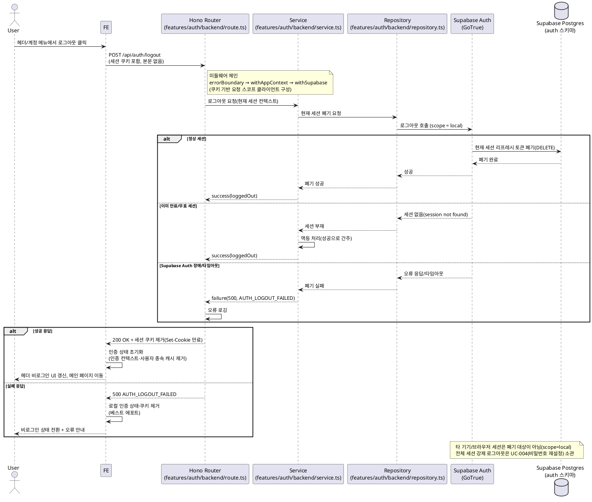

# UC-005: 로그아웃

> 근거 문서: `docs/userflow.md` 005, `docs/prd.md` 3장(로그인/회원가입 · 계정 페이지), `docs/database.md` 3.1(세션은 Supabase Auth 관리, 별도 앱 테이블 없음), `docs/techstack.md` §4·§7(Hono route → service → repository → Supabase, Supabase Auth).
> 본 문서는 계약(스펙)만 기술하며 구현 코드를 포함하지 않는다.

---

## Primary Actor

- **User / Admin** (로그인된 사용자. 로그아웃 동작은 role과 무관하게 동일)

## Precondition (사용자 관점)

- 사용자가 이메일 로그인(002) 또는 Google 소셜 로그인(003)으로 로그인된 상태로 서비스를 이용 중이다.
- 전역 헤더(또는 계정 메뉴)에 로그아웃 진입점이 노출되어 있다.

## Trigger

- 사용자가 전역 헤더/계정 메뉴에서 **로그아웃** 상호작용을 수행한다.

## Main Scenario

1. User가 헤더/계정 메뉴에서 로그아웃을 클릭한다.
2. FE가 `POST /api/auth/logout`을 호출한다(세션 쿠키 자동 포함, 요청 본문 없음).
3. Hono 미들웨어 체인(errorBoundary → withAppContext → withSupabase)이 요청 쿠키 기반의 요청 스코프 Supabase 클라이언트를 구성한다.
4. Route가 별도 본문 검증 없이 Service에 로그아웃을 위임한다.
5. Service가 Repository 인터페이스를 통해 **현재 세션(현재 기기)만** 폐기를 요청한다.
6. Repository가 Supabase Auth에 현재 세션 범위(scope=local)의 로그아웃을 호출하고, Supabase Auth가 해당 세션의 리프레시 토큰을 서버측에서 폐기한다(타 기기 세션은 유지).
7. Route가 응답에서 세션 쿠키를 제거하고 200 성공을 반환한다.
8. FE가 인증 상태를 초기화한다(인증 컨텍스트 초기화 + 사용자 종속 서버 상태 캐시 제거/무효화).
9. FE가 헤더를 비로그인 UI로 갱신하고 공개 페이지(메인)로 이동한다.

## Edge Cases

| # | 케이스 | 처리 |
|---|--------|------|
| 1 | 이미 만료/무효 세션에서 로그아웃 | **멱등 처리**: 세션 부재(session not found)도 성공(200)으로 응답하고 비로그인 상태로 전환 |
| 2 | 다중 탭/기기 로그인 | **현재 기기(세션)만** 로그아웃. 동일 브라우저의 다중 탭은 동일 세션(쿠키 공유)이므로 함께 로그아웃되고, 타 기기/브라우저 세션은 유지. 같은 브라우저의 다른 탭은 인증 상태 변경 감지 또는 다음 요청의 401 처리로 비로그인 UI로 동기화 |
| 3 | Supabase Auth 장애/타임아웃(서버측 폐기 실패) | 500(`AUTH_LOGOUT_FAILED`) 응답. FE는 로컬 인증 상태·쿠키를 제거하고 비로그인 상태로 전환(베스트 에포트) 후 오류 안내 |
| 4 | 네트워크 중단(요청/응답 유실) | FE 재시도 유도. 서버 처리가 멱등이므로 중복 요청에도 안전 |
| 5 | 비로그인 상태에서의 로그아웃 요청(레이스/중복 클릭) | 멱등 성공(200) 처리, 비로그인 상태 유지 |
| 6 | 보호 페이지(생성/편집·계정 등)에서 로그아웃 | 로그아웃 완료 후 공개 페이지(메인)로 이동. 이후 보호 경로 접근 시 로그인 유도(002 연계) |

## Business Rules

### 로그아웃 범위 (userflow 005)

- 무효화 대상은 **현재 기기(세션)의 세션/토큰만**이다. Supabase Auth의 현재 세션 범위(scope=local) 로그아웃을 사용하며, 타 기기 세션은 유지된다.
- 전체 세션 강제 로그아웃은 본 기능 범위가 아니다(비밀번호 재설정 성공 시의 전체 세션 로그아웃은 UC-004 소관).

### 멱등성

- 만료/무효/부재 세션에 대한 로그아웃 요청도 항상 성공(200)으로 종료한다(정상 종료 처리).
- 동일 요청의 중복 수행(더블 클릭, 재시도)은 결과가 동일하다.

### 인증 상태 초기화

- 서버: 응답에서 세션 쿠키(@supabase/ssr 관리 쿠키)를 제거한다.
- 클라이언트: 인증 컨텍스트를 초기화하고, 사용자 종속 서버 상태 캐시(내 밸류체인 목록 등)를 제거/무효화한다.
- 로그아웃 후 화면은 공개 페이지(메인)로 이동하고 헤더는 비로그인 UI로 갱신된다.

### API Specification

- **Endpoint**: `POST /api/auth/logout`
- **인증**: 세션 쿠키 기반(@supabase/ssr). 별도 Authorization 헤더 불요
- **Request**: 본문 없음
- **Response Schema** (`LogoutResponse`, 200):

  ```
  {
    loggedOut: boolean   // 항상 true (멱등 성공)
  }
  ```

  응답과 함께 세션 쿠키 제거(Set-Cookie 만료) 헤더가 포함된다.

- **Error Codes**:
  - `AUTH_LOGOUT_FAILED` (500): Supabase Auth 세션 폐기 호출 실패(제공자 장애/타임아웃). 세션 부재는 오류가 아니라 멱등 성공으로 처리하므로 4xx 오류 코드는 없다.

- **모듈 위치**(techstack §4 컨벤션): `src/features/auth/backend/{schema.ts, service.ts, repository.ts, error.ts, route.ts}` — Service는 Repository 인터페이스에만 의존하고 Supabase 호출 세부를 알지 못한다.

### Database Operations

- **애플리케이션 테이블**: 조작 없음(`profiles` 등 미접근).
- **Supabase Auth 관리 스키마**(`auth.sessions`, `auth.refresh_tokens`): 현재 세션 행의 폐기(DELETE/REVOKE)가 수행되며, 이는 **Supabase Auth가 내부적으로 처리**한다. 앱이 `auth` 스키마에 직접 DML을 수행하지 않는다(database.md 3.1: 세션·토큰은 Supabase Auth 관리, 별도 테이블 없음).

### External Service Integration

- **Supabase Auth (GoTrue)** — techstack.md §7 (DB + Auth 스택, 별도 인증 인프라 없음):
  - 현재 세션 범위(scope=local) 로그아웃 API로 해당 세션의 리프레시 토큰을 서버측에서 폐기한다(타 기기 세션 유지).
  - 액세스 토큰(JWT)은 서버 블랙리스트 없이 만료 시각까지 기술적으로 유효하나, 쿠키 제거로 클라이언트의 사용 경로를 차단한다. 잔여 유효시간은 Supabase Auth의 JWT 만료 설정을 따른다.
  - 배치 전용 외부 API(토스증권/OpenDART/SEC EDGAR, `docs/external/`)는 본 기능과 무관하다.

## Sequence Diagram



## Open Questions

1. **액세스 토큰(JWT) 잔여 유효시간**: Supabase Auth는 로그아웃 시 리프레시 토큰만 서버측 폐기하고 액세스 토큰은 만료까지 유효하다(블랙리스트 없음). JWT 만료 시간(Supabase 기본 1시간)을 단축할지 여부는 구현 단계에서 확정 필요.
2. **Supabase Auth 장애 시 베스트 에포트 정책**: 500 응답 시에도 FE가 로컬 인증 상태·쿠키를 제거하고 비로그인으로 전환하는 안을 제안했다(userflow의 "서버 세션 폐기 또는 클라이언트 토큰 제거" 병행 원칙 기반). 최종 UX(전환 vs 로그인 상태 유지 후 재시도) 확정 필요.
3. **동일 브라우저 타 탭의 동기화 방식**: 인증 상태 변경 이벤트 구독 기반 즉시 동기화 vs 다음 API 요청의 401 처리 기반 지연 동기화 중 선택은 구현 단계에서 확정.
