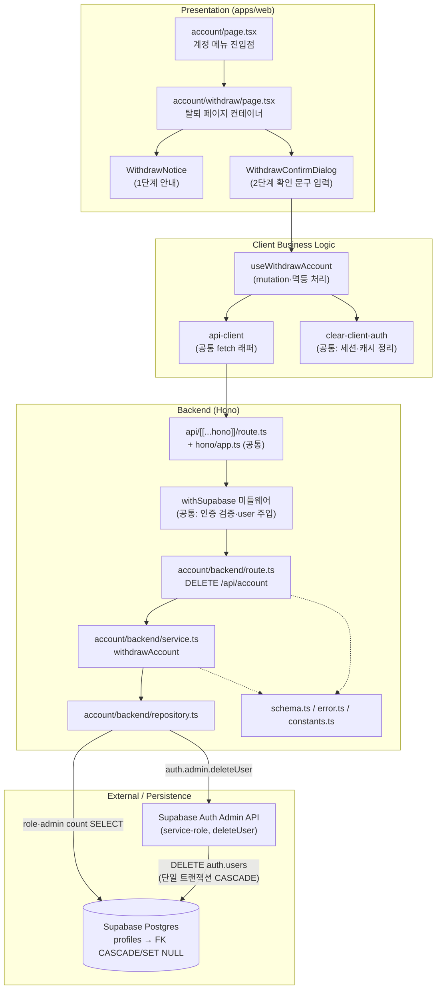

# Plan: UC-006 회원 탈퇴

> 근거: `docs/usecases/006/spec.md`, `docs/usecases/000_decisions.md`(A-14·A-15), `docs/techstack.md` §4·§7·§9, `docs/database.md` §5(삭제 전파), `supabase/migrations/0002·0005·0006·0011`, `.claude/skills/spec_to_plan/references/hono-backend-guide.md`.
> DB 스키마는 이미 FK CASCADE / SET NULL로 삭제 전파가 완결되어 있으므로(0002~0011 적용 완료 전제) **본 계획에 마이그레이션 추가는 없다.**
> `/account`·`/account/withdraw` 페이지는 `docs/pages/`에 상태관리 문서가 없으므로, FE 상태는 TanStack Query mutation + 로컬 컴포넌트 상태(useState)로 최소 구성한다(별도 Context 불필요).

---

## 개요

### 기능 모듈 (UC-006 소유)

| 모듈 | 위치 | 설명 |
| --- | --- | --- |
| Account Schema | `apps/web/src/features/account/backend/schema.ts` | `WithdrawAccountResponse` DTO·`ProfileRoleRow` Zod 스키마 정의 |
| Account Error Codes | `apps/web/src/features/account/backend/error.ts` | `SOLE_ADMIN_WITHDRAWAL_BLOCKED` 등 기능별 에러 코드 상수 |
| Account Repository | `apps/web/src/features/account/backend/repository.ts` | `profiles` 조회 + Supabase Auth Admin API 계정 삭제 캡슐화(Persistence + 외부 연동) |
| Account Service | `apps/web/src/features/account/backend/service.ts` | 유일 Admin 차단(BR-3) → 계정 삭제 → 응답 DTO 구성의 순수 비즈니스 로직 |
| Account Route | `apps/web/src/features/account/backend/route.ts` | `DELETE /api/account` HTTP 계약(파싱·인증 컨텍스트 확인·로깅·응답) |
| Account Constants | `apps/web/src/features/account/constants.ts` | 탈퇴 확인 문구(A-14), 안내 문구, Admin API 타임아웃 등 상수(하드코딩 금지) |
| Account DTO 재노출 | `apps/web/src/features/account/lib/dto.ts` | backend `schema.ts` 타입을 FE에서 재사용하도록 재노출 |
| useWithdrawAccount Hook | `apps/web/src/features/account/hooks/useWithdrawAccount.ts` | 탈퇴 mutation + 성공/401 멱등 처리 시 세션·캐시 정리 및 라우팅 |
| WithdrawNotice | `apps/web/src/features/account/components/withdraw-notice.tsx` | 삭제 범위·복구 불가 안내(1단계) Presenter |
| WithdrawConfirmDialog | `apps/web/src/features/account/components/withdraw-confirm-dialog.tsx` | 확인 문구 입력(2단계, A-14) Presenter |
| Withdraw Page | `apps/web/src/app/(protected)/account/withdraw/page.tsx` | 탈퇴 페이지 컨테이너(단계 진행 상태 보유, 로직은 Hook에 위임) |
| Account Menu 진입점 | `apps/web/src/app/(protected)/account/page.tsx` | 계정 메뉴에 "회원 탈퇴" 링크 노출(본 계획에서는 링크 1건만 추가) |

### 공통(shared) 모듈 — 다른 유스케이스(001~005 등)와 공유

> 아직 다른 plan.md가 없으므로 아래 계약을 본 문서가 최초 정의한다. 이후 auth 계열 plan이 동일 위치·계약을 재사용한다(중복 정의 금지, DRY).

| 모듈 | 위치 | 설명 |
| --- | --- | --- |
| HTTP Result 헬퍼 | `apps/web/src/backend/http/response.ts` | `success()/failure()/respond()` + `HandlerResult<T,E,M>` (hono-backend-guide 표준) |
| Hono Context 헬퍼 | `apps/web/src/backend/hono/context.ts` | `AppEnv`, `getSupabase(c)`(service-role), `getAuthUser(c)`, `getLogger(c)`, `getConfig(c)` |
| Hono 미들웨어 | `apps/web/src/backend/middleware/{error.ts,context.ts,supabase.ts}` | `errorBoundary` → `withAppContext` → `withSupabase`(요청 인증 검증·user 주입) |
| Hono App 등록 | `apps/web/src/backend/hono/app.ts` | 싱글턴 앱 + `registerAccountRoutes(app)` 등록 |
| Next API 진입점 | `apps/web/src/app/api/[[...hono]]/route.ts` | catch-all Route Handler(`runtime='nodejs'`), Hono 앱 위임 |
| Supabase 클라이언트 팩토리 | `apps/web/src/lib/supabase/{service-client.ts,browser-client.ts,server-client.ts}` | service-role(Admin API 포함)·브라우저(@supabase/ssr)·요청 스코프 클라이언트 생성 |
| FE API 클라이언트 | `apps/web/src/lib/remote/api-client.ts` | fetch 래퍼(기본 타임아웃·JSON 파싱·에러 정규화) |
| 클라이언트 인증 정리 | `apps/web/src/features/auth/lib/clear-client-auth.ts` | 로컬 세션(signOut scope=local 베스트 에포트) + TanStack Query 캐시 초기화 — UC-005 로그아웃과 공유 |

---

## Diagram



---

## Implementation Plan

### 1. 공통 인프라 모듈 (response / context / middleware / app / 진입점)

- 구현 내용:
  1. `backend/http/response.ts`: hono-backend-guide의 `HandlerResult<T, E, M>`, `success(data, status?)`, `failure(status, code, message, details?)`, `respond(c, result)`를 그대로 구현. 에러 응답 본문은 `{ error: { code, message, details? } }` 형태로 통일.
  2. `backend/hono/context.ts`: `AppEnv`(Variables: `supabase`(service-role 클라이언트), `user`(인증 사용자 | null), `logger`, `config`) 정의 + `getSupabase/getAuthUser/getLogger/getConfig` 접근자.
  3. `backend/middleware/error.ts`(`errorBoundary`): 미처리 예외를 500 `INTERNAL_ERROR`로 정규화 + 로깅.
  4. `backend/middleware/context.ts`(`withAppContext`): 환경변수(`NEXT_PUBLIC_SUPABASE_URL`, `SUPABASE_SERVICE_ROLE_KEY`) 로드·검증 후 `config`·`logger` 주입. 누락 시 기동 오류(500)로 즉시 실패.
  5. `backend/middleware/supabase.ts`(`withSupabase`): service-role 클라이언트를 `supabase`로 주입하고, 요청의 인증 컨텍스트(세션 쿠키 — @supabase/ssr 요청 스코프 클라이언트, 또는 `Authorization: Bearer`)에서 `auth.getUser()`로 **서버 검증**해 `user`를 주입. 검증 실패 시 `user=null`(401 응답 여부는 각 라우트가 결정 — 공개 API 공존 대비). 계정이 이미 삭제된 토큰은 `getUser()`가 실패하므로 자연히 401 경로로 수렴(E5/E6 근거).
  6. `backend/hono/app.ts`: 싱글턴 `createHonoApp()` — `errorBoundary → withAppContext → withSupabase` 순서 고정, `basePath('/api')`, `registerAccountRoutes(app)` 등록.
  7. `app/api/[[...hono]]/route.ts`: `runtime = 'nodejs'`, 모든 HTTP 메서드(DELETE 포함)를 Hono 앱에 위임.
- 의존성: 없음(최초 구현). 이후 모든 기능 plan이 재사용.

**Business Logic(미들웨어) — Unit Tests:**

- [ ] `withSupabase`: 유효 세션 쿠키/Bearer 토큰 요청 → `getAuthUser(c)`가 사용자 반환
- [ ] `withSupabase`: 토큰 없음/만료/삭제된 계정의 토큰(`getUser()` 실패 모킹) → `user=null`
- [ ] `withAppContext`: 필수 환경변수 누락 시 500 실패(민감값은 로그에 미출력)
- [ ] `errorBoundary`: 라우트에서 throw 발생 → 500 `INTERNAL_ERROR` JSON 응답 + 로깅
- [ ] `respond`: `failure(409, ...)` → HTTP 409 + `{error:{code,message}}` 본문

---

### 2. Supabase 클라이언트 팩토리 (공통, 외부 연동 기반)

- 구현 내용:
  1. `lib/supabase/service-client.ts`: `createServiceClient()` — `NEXT_PUBLIC_SUPABASE_URL` + `SUPABASE_SERVICE_ROLE_KEY`로 생성(`auth: { persistSession: false, autoRefreshToken: false }`). **서버 전용**(`server-only` import로 클라이언트 번들 유입 차단). Auth Admin API(`auth.admin.*`)는 이 클라이언트에서만 접근.
  2. `lib/supabase/server-client.ts`: `@supabase/ssr`의 요청 쿠키 기반 클라이언트(사용자 검증용, anon key).
  3. `lib/supabase/browser-client.ts`: 브라우저 클라이언트(anon key) — FE 세션 정리(signOut) 등에 사용.
  4. 타임아웃: 팩토리에서 `fetch` 옵션에 `AbortSignal.timeout(ms)` 래핑 fetch를 주입할 수 있게 `timeoutMs` 파라미터를 받는다(기본값 상수 `SUPABASE_FETCH_TIMEOUT_MS`, `features/account/constants.ts`가 아닌 `lib/supabase/constants.ts`에 공통 상수로 정의).
- 외부 연동 필수 항목:
  - **에러 처리**: supabase-js 오류 객체(`AuthError`/`PostgrestError`)를 그대로 상위에 전달하지 않고 각 repository에서 도메인 결과로 매핑.
  - **재시도**: 팩토리 레벨 자동 재시도 없음(각 호출처의 멱등성 판단에 위임 — 계정 삭제는 사용자 수동 재시도 정책, spec E10).
  - **타임아웃**: 위 `AbortSignal.timeout` 주입.
  - **환경변수**: `NEXT_PUBLIC_SUPABASE_URL`, `NEXT_PUBLIC_SUPABASE_ANON_KEY`, `SUPABASE_SERVICE_ROLE_KEY`(techstack §9). service-role 키는 서버 전용 — 클라이언트 노출 금지(spec §6.4).
- 의존성: 없음.

**Unit Tests:**

- [ ] `createServiceClient()`: 환경변수 정상 시 클라이언트 생성, `SUPABASE_SERVICE_ROLE_KEY` 누락 시 명시적 오류
- [ ] 주입된 fetch가 `timeoutMs` 초과 시 Abort되는지(가짜 지연 fetch로 검증)
- [ ] `browser-client`가 service-role 키를 참조하지 않음(모듈 정적 검증)

---

### 3. Account Schema (`features/account/backend/schema.ts`)

- 구현 내용:
  1. `ProfileRoleRowSchema` (snake_case, DB Row): `{ id: uuid, role: enum('user','admin') }` — `profiles` 테이블(0002)과 일치.
  2. `WithdrawAccountResponseSchema` (camelCase, DTO): `{ userId: uuid 문자열, withdrawnAt: ISO8601 datetime 문자열 }` — spec §6.2와 일치.
  3. 요청 스키마 없음(본문 없는 DELETE — Request Zod 정의 생략을 주석으로 명시).
  4. `z.infer` 타입 전부 export.
- 의존성: 없음.
- Unit Tests: 불필요(스키마 정의 — hono-backend-guide 규칙). 단, Response 스키마 검증은 Service 테스트에서 간접 검증.

---

### 4. Account Error Codes (`features/account/backend/error.ts`)

- 구현 내용: `as const` 상수 객체 + 유니온 타입 export.
  - `soleAdminBlocked: 'SOLE_ADMIN_WITHDRAWAL_BLOCKED'` (409)
  - `withdrawalFailed: 'ACCOUNT_WITHDRAWAL_FAILED'` (500)
  - `validationError: 'ACCOUNT_VALIDATION_ERROR'` (500)
  - 401 `UNAUTHORIZED`는 기능 코드가 아니라 라우트 공통 처리(미들웨어 검증 결과)로 반환 — 여기 정의하지 않음(중복 방지).
- 의존성: 없음. Unit Tests: 불필요(상수 정의).

---

### 5. Account Constants (`features/account/constants.ts`)

- 구현 내용(하드코딩 금지 원칙에 따른 상수 집약):
  - `WITHDRAW_CONFIRM_PHRASE = '회원 탈퇴'` — A-14 확정: 확인 문구 입력 방식(이메일/소셜 공통).
  - `WITHDRAW_NOTICE_ITEMS` — 안내 문구 목록(내가 만든 밸류체인 즉시 삭제·복구 불가·전 기기 로그아웃·동일 이메일 즉시 재가입 가능).
  - `AUTH_ADMIN_DELETE_TIMEOUT_MS` — Auth Admin 삭제 호출 타임아웃(예: 10_000).
  - `WITHDRAW_REDIRECT_PATH = '/'` — 완료 후 이동 경로.
- 의존성: 없음. (worker와 공유되지 않는 웹 전용 값이므로 `packages/domain/constants`가 아닌 feature 상수로 둔다.)

---

### 6. Account Repository (`features/account/backend/repository.ts`) — Persistence + 외부 연동(Supabase Auth Admin API)

- 구현 내용:
  1. Service가 의존할 인터페이스를 함께 정의(비즈니스-퍼시스턴스 분리, techstack §4):

     ```
     interface AccountRepository {
       findRoleByUserId(userId): Promise<{ role: 'user' | 'admin' } | null>
       countAdmins(): Promise<number>
       deleteAuthUser(userId): Promise<{ deleted: true } | { deleted: false; reason: 'not_found' | 'error'; message: string }>
     }
     createAccountRepository(client: SupabaseClient): AccountRepository
     ```

  2. `findRoleByUserId`: `profiles`에서 `id, role`을 `maybeSingle()` 조회 → `ProfileRoleRowSchema` 검증 후 반환, 미존재 시 `null`, DB 오류는 throw 대신 오류 결과로 래핑해 상위 매핑(HandlerResult는 service 책임이므로 repository는 값/오류 신호만 반환).
  3. `countAdmins`: `profiles`에서 `role='admin'` 대상 `count: 'exact', head: true` 조회(행 미전송, `idx_profiles_role` 활용).
  4. `deleteAuthUser`: `client.auth.admin.deleteUser(userId)` 호출(외부 연동 지점).
     - `user_not_found` 계열 오류 → `{ deleted: false, reason: 'not_found' }`(멱등 신호 — 이미 삭제됨).
     - 타임아웃(Abort)·기타 오류 → `{ deleted: false, reason: 'error', message }`.
     - **soft delete 금지**: `shouldSoftDelete` 옵션을 사용하지 않음(물리 삭제 — BR-5 재가입 즉시 허용, E7 이메일 즉시 해제의 전제).
     - 이 단일 호출이 `auth.users` DELETE → FK 전파(profiles→terms_agreements→value_chains→snapshots→nodes/edges/groups→chain 지표 CASCADE, 공식 체인 `created_by`·`reviewed_by` SET NULL)를 하나의 트랜잭션으로 수행 — DB 레벨 원자성(BR-1·BR-2), 앱 코드에서 추가 삭제 쿼리 없음.
- 외부 연동 필수 항목:
  - 에러 처리: 위 결과 유니온으로 정규화(예외 throw 금지).
  - 재시도: **자동 재시도 없음** — 실패 시 500 반환 후 사용자 수동 재시도(spec E3·E10). 재시도가 도착해도 삭제 완료 후면 미들웨어 401(E5) 또는 `not_found` 멱등 처리로 안전.
  - 타임아웃: `AUTH_ADMIN_DELETE_TIMEOUT_MS` — service-client 팩토리의 타임아웃 fetch 주입으로 적용.
  - 환경변수: service-role 클라이언트 경유(모듈 2) — repository 자체는 키를 알지 못함.
- 의존성: 모듈 2(service-client), 모듈 3(schema).

**Unit Tests (Supabase 클라이언트 모킹):**

- [ ] `findRoleByUserId`: 행 존재 → `{role}` 반환 / 행 없음 → `null` / Row 스키마 불일치 → 오류 신호
- [ ] `countAdmins`: count 응답 → 숫자 반환 / DB 오류 → 오류 신호
- [ ] `deleteAuthUser`: 성공 → `{deleted:true}`
- [ ] `deleteAuthUser`: `user_not_found` 오류 → `{deleted:false, reason:'not_found'}`
- [ ] `deleteAuthUser`: 타임아웃/네트워크 오류 → `{deleted:false, reason:'error'}` + 원인 메시지 보존
- [ ] `deleteAuthUser`가 `shouldSoftDelete`를 전달하지 않음(물리 삭제 보장)

---

### 7. Account Service (`features/account/backend/service.ts`) — 핵심 비즈니스 로직

- 구현 내용:

  ```
  withdrawAccount(
    repository: AccountRepository,
    userId: string,
  ): Promise<HandlerResult<WithdrawAccountResponse, AccountServiceError, unknown>>
  ```

  처리 순서(spec §6.3 순서 그대로):
  1. `findRoleByUserId(userId)` — 조회 실패(오류 신호) 또는 프로필 부재(인증은 통과했으나 profiles 행 없음 = 비정상 정합) → `failure(500, ACCOUNT_VALIDATION_ERROR)`.
  2. `role === 'admin'`이면 `countAdmins()` 호출. `adminCount <= 1`이면 삭제 실행 **전** `failure(409, SOLE_ADMIN_WITHDRAWAL_BLOCKED)` (BR-3, E2 — repository.deleteAuthUser 미호출 보장).
  3. `deleteAuthUser(userId)` 호출.
     - `{deleted:true}` → 응답 DTO `{ userId, withdrawnAt: 현재시각 ISO8601 }` 구성.
     - `{reason:'not_found'}` → 이미 삭제된 계정(레이스) — **멱등 성공**으로 동일 DTO 반환(E5/E6 정합).
     - `{reason:'error'}` → `failure(500, ACCOUNT_WITHDRAWAL_FAILED)` (DB 전체 롤백 전제, E3).
  4. `WithdrawAccountResponseSchema.safeParse`로 응답 검증 실패 시 `failure(500, ACCOUNT_VALIDATION_ERROR)`.
  - 세션 무효화(BR-6)는 `auth.users` 삭제에 수반되는 Supabase Auth 동작이므로 service에 별도 로직 없음(주석으로 근거 명시).
  - **알려진 한계(문서화)**: admin 2명이 동시에 탈퇴하면 둘 다 `adminCount=2` 검증을 통과할 수 있는 이론적 레이스가 존재. MVP는 허용(어드민 수 극소·수동 시드)하고, 필요 시 `pg_advisory_xact_lock` 기반 RPC로 검증+삭제 직렬화하는 개선안을 주석으로 남긴다.
- 의존성: 모듈 3(schema), 모듈 4(error), 모듈 6(repository 인터페이스), 모듈 1(response 헬퍼). Supabase 클라이언트/HTTP를 직접 알지 못함.

**Unit Tests (repository 모킹):**

- [ ] role=user → `deleteAuthUser` 호출되고 `success({userId, withdrawnAt})` 반환, `countAdmins` 미호출
- [ ] role=admin & adminCount=2 → 삭제 진행, 성공 DTO 반환
- [ ] role=admin & adminCount=1 → `failure(409, SOLE_ADMIN_WITHDRAWAL_BLOCKED)`, `deleteAuthUser` **미호출**
- [ ] 프로필 부재(null) → `failure(500, ACCOUNT_VALIDATION_ERROR)`, 삭제 미호출
- [ ] `findRoleByUserId` 오류 신호 → `failure(500, ACCOUNT_VALIDATION_ERROR)`
- [ ] `deleteAuthUser` → `not_found` → **멱등 성공** DTO 반환
- [ ] `deleteAuthUser` → `error` → `failure(500, ACCOUNT_WITHDRAWAL_FAILED)`
- [ ] 성공 DTO의 `withdrawnAt`이 유효한 ISO8601, `userId`가 요청 userId와 동일

---

### 8. Account Route (`features/account/backend/route.ts`)

- 구현 내용:
  1. `registerAccountRoutes(app: Hono<AppEnv>)` — `app.delete('/account', handler)` 1건.
  2. handler: 본문 파싱 없음(스키마 없음). `getAuthUser(c)`가 `null`이면 즉시 `respond(c, failure(401, 'UNAUTHORIZED', ...))` (E1·E5 — 이미 삭제된 계정 토큰도 미들웨어 검증 실패로 여기 수렴). 요청 본문/파라미터로 대상 사용자를 절대 받지 않음(BR-7 — userId는 토큰에서만).
  3. `createAccountRepository(getSupabase(c))` 생성 후 `withdrawAccount(repository, user.id)` 호출.
  4. 실패 시 코드별 로깅(`SOLE_ADMIN_WITHDRAWAL_BLOCKED`는 warn, 500 계열은 error) 후 `respond(c, result)`.
  5. `backend/hono/app.ts`에 `registerAccountRoutes(app)` 추가(공통 모듈 1의 등록 지점).
- 의존성: 모듈 1(공통 인프라), 4, 6, 7.

**Presentation(서버 HTTP 계약) — QA Sheet:**

| # | 시나리오 | 기대 결과 |
| --- | --- | --- |
| 1 | 인증 없이 `DELETE /api/account` | 401 `UNAUTHORIZED` |
| 2 | 만료/이미 탈퇴된 계정의 토큰으로 호출 | 401 `UNAUTHORIZED` (미들웨어 `getUser()` 실패) |
| 3 | 일반 user 계정으로 호출 | 200 + `{userId, withdrawnAt}` — `WithdrawAccountResponseSchema` 일치 |
| 4 | admin 2명 중 1명이 호출 | 200, 삭제 수행 |
| 5 | 유일 admin이 호출 | 409 `SOLE_ADMIN_WITHDRAWAL_BLOCKED`, 계정·데이터 유지 |
| 6 | Auth Admin API 오류 주입(모킹) | 500 `ACCOUNT_WITHDRAWAL_FAILED` + error 로그, 데이터 유지 |
| 7 | 본문에 임의 userId를 담아 호출 | 무시되고 토큰의 본인 계정만 대상(BR-7) |
| 8 | 성공 후 동일 토큰으로 재호출(더블 클릭) | 401 — FE 멱등 처리 대상(E5) |
| 9 | 성공 후 DB 확인 | `profiles`·소유 `value_chains`·스냅샷/노드/엣지/그룹/지표·`terms_agreements` 전부 삭제, 공식 체인 스냅샷 `created_by=NULL`·`llm_relation_proposals.reviewed_by=NULL`, `securities`·시계열·`relation_types`·`batch_*` 무변화(E4·BR-4) |
| 10 | 성공 후 동일 이메일로 재가입 시도 | 즉시 가입 가능(E7·BR-5) |

---

### 9. Account DTO 재노출 (`features/account/lib/dto.ts`)

- 구현 내용: `backend/schema.ts`의 `WithdrawAccountResponseSchema`·타입을 re-export. FE(hook)가 backend 디렉토리를 직접 import하지 않도록 하는 경계 모듈.
- 의존성: 모듈 3. Unit Tests: 불필요(재노출).

---

### 10. useWithdrawAccount Hook (`features/account/hooks/useWithdrawAccount.ts`) — 클라이언트 비즈니스 로직

- 구현 내용:
  1. `useMutation`으로 `api-client.delete('/api/account')` 호출(`'use client'`).
  2. `onSuccess`: `clearClientAuth()`(공통 — 브라우저 세션 signOut 베스트 에포트 + `queryClient.clear()`) → 탈퇴 완료 피드백(toast) → `router.replace(WITHDRAW_REDIRECT_PATH)` (Main 10단계).
  3. `onError` 분기:
     - **401** → E5/E6 멱등 처리: 성공과 동일하게 `clearClientAuth()` + 완료 안내 + 메인 이동(요청이 실제 도달했는지와 무관하게, 세션이 무효면 재로그인 불가 상태이므로 완료로 수렴).
     - **409** (`SOLE_ADMIN_WITHDRAWAL_BLOCKED`) → "다른 Admin 지정 전에는 탈퇴할 수 없습니다" 안내, 세션·데이터 유지(E2).
     - **500/네트워크** → 오류 안내 + 재시도 유도, 인증 상태 유지(E10).
  4. 로딩 상태(`isPending`)를 노출해 확인 버튼 비활성화(중복 전송 방지).
- 의존성: 모듈 5(constants), 9(dto), 공통 `api-client`·`clear-client-auth`.

**Unit Tests (fetch·router·queryClient 모킹):**

- [ ] 200 응답 → `clearClientAuth` 호출 → 메인 경로로 replace
- [ ] 401 응답 → 멱등 완료 처리(clear + 메인 이동), 오류 토스트 없음
- [ ] 409 응답 → 유일 Admin 안내 표출, `clearClientAuth` **미호출**, 이동 없음
- [ ] 500/네트워크 오류 → 재시도 안내, 인증 상태 유지
- [ ] `isPending` 동안 중복 mutate 호출이 억제되는지

---

### 11. WithdrawNotice (`features/account/components/withdraw-notice.tsx`)

- 구현 내용: `WITHDRAW_NOTICE_ITEMS`를 렌더링하는 순수 Presenter. "내가 만든 밸류체인과 모든 데이터가 즉시 삭제되며 복구할 수 없음", "모든 기기에서 로그아웃됨", "동일 이메일로 즉시 재가입 가능" 안내 + "계속" / "취소" 버튼(콜백 props). 로직 없음.
- 의존성: 모듈 5. shadcn-ui `card`/`button` 사용(신규 컴포넌트 필요 시 `npx shadcn@latest add` 안내).

**QA Sheet:**

| # | 시나리오 | 기대 결과 |
| --- | --- | --- |
| 1 | 페이지 진입 | 삭제 범위·복구 불가·전 기기 로그아웃·재가입 안내가 모두 표시 |
| 2 | "취소" 클릭 | `onCancel` 콜백 호출(페이지가 `/account`로 복귀 — E9, 요청 미전송) |
| 3 | "계속" 클릭 | `onProceed` 콜백 호출(2단계 다이얼로그 오픈) |
| 4 | 모바일 뷰포트 | 레이아웃 깨짐 없음(반응형) |

---

### 12. WithdrawConfirmDialog (`features/account/components/withdraw-confirm-dialog.tsx`)

- 구현 내용: A-14 확정안 — **확인 문구 입력 방식**(이메일/소셜 공통, 재인증 비밀번호 없음). shadcn-ui `dialog` + 입력 필드. 입력값이 `WITHDRAW_CONFIRM_PHRASE`와 정확히 일치할 때만 "영구 삭제" 버튼 활성화. `isPending`·`errorMessage`를 props로 받아 표시만 담당(로직은 페이지/훅 소유).
- 의존성: 모듈 5.

**QA Sheet:**

| # | 시나리오 | 기대 결과 |
| --- | --- | --- |
| 1 | 다이얼로그 오픈 직후 | 확인 버튼 비활성, 안내 문구("'회원 탈퇴'를 입력하세요") 표시 |
| 2 | 불일치 문구 입력(공백 포함/부분 일치) | 확인 버튼 비활성 유지 |
| 3 | 정확한 확인 문구 입력 | 확인 버튼 활성화 |
| 4 | 확인 클릭 후 `isPending=true` | 버튼 비활성 + 진행 표시(더블 클릭 방지) |
| 5 | 닫기/취소 | `onClose` 호출, 입력값 초기화, 요청 미전송(E9) |
| 6 | `errorMessage` 전달(409/500) | 다이얼로그 내 오류 문구 표시, 재시도 가능 상태 유지 |

---

### 13. Withdraw Page (`apps/web/src/app/(protected)/account/withdraw/page.tsx`)

- 구현 내용:
  1. `(protected)` 그룹 — 공통 인증 가드(레이아웃)가 비로그인 접근을 로그인 페이지로 유도(E1). 가드 자체는 auth 계열 공통 모듈로, 본 계획은 사용만 한다.
  2. `'use client'` 컨테이너: 단계 상태(`notice` → `confirm`)를 `useState`로 보유하고, `WithdrawNotice`·`WithdrawConfirmDialog`·`useWithdrawAccount`를 조립. 취소 시 `/account`로 복귀.
  3. 비즈니스 로직 없음(훅에 위임) — Container/Presenter 분리 준수.
- 의존성: 모듈 10, 11, 12 + 공통 인증 가드.

**QA Sheet:**

| # | 시나리오 | 기대 결과 |
| --- | --- | --- |
| 1 | 비로그인으로 `/account/withdraw` 직접 접근 | 로그인 페이지로 리다이렉트(E1) |
| 2 | 로그인 후 진입 | 1단계 안내(WithdrawNotice) 표시 |
| 3 | 안내에서 취소 | `/account` 복귀, API 호출 0건(E9) |
| 4 | 계속 → 문구 입력 → 확정 | `DELETE /api/account` 1회 호출 → 완료 피드백 → 비로그인 상태로 메인 이동 |
| 5 | 유일 admin 계정으로 확정 | 다이얼로그에 409 안내 표시, 로그인 상태·계정 유지 |
| 6 | 서버 500 | 오류 안내 + 재시도 가능, 계정·데이터 유지(E10) |
| 7 | 네트워크 단절 후 재시도(직전 요청은 실제 성공) | 재시도가 401 → 완료로 간주하고 메인 이동(E6) |
| 8 | 탈퇴 완료 후 뒤로가기로 보호 페이지 접근 | 인증 가드에 의해 로그인 유도 |

---

### 14. Account Menu 진입점 (`apps/web/src/app/(protected)/account/page.tsx`)

- 구현 내용: 계정 메뉴 페이지에 "회원 탈퇴" 링크(`/account/withdraw`) 1건 추가. 계정 페이지 본체(프로필 표시·로그아웃 버튼 등)는 UC-005 등 다른 plan 소관이므로 **본 계획은 링크 노출만** 책임진다. 페이지가 아직 없으면 최소 골격(제목 + 탈퇴 링크)으로 생성하고, 이후 다른 plan이 확장한다(충돌 없음).
- 의존성: 없음.

**QA Sheet:**

| # | 시나리오 | 기대 결과 |
| --- | --- | --- |
| 1 | 로그인 후 `/account` 진입 | "회원 탈퇴" 진입점이 노출 |
| 2 | 링크 클릭 | `/account/withdraw`로 이동 |

---

### 15. 클라이언트 인증 정리 (`features/auth/lib/clear-client-auth.ts`) — 공통

- 구현 내용: `clearClientAuth(queryClient)` — (1) 브라우저 Supabase 클라이언트 `signOut({ scope: 'local' })`을 **베스트 에포트**로 호출(계정이 이미 삭제되어 실패해도 무시하고 진행 — A-12 준용), (2) `queryClient.clear()`로 사용자 종속 서버 상태 캐시 제거, (3) 실패해도 예외를 전파하지 않음. UC-005 로그아웃 FE 정리와 동일 로직이므로 auth feature 하위에 두고 양쪽에서 재사용(DRY).
- 의존성: 모듈 2(browser-client).

**Unit Tests:**

- [ ] 정상: signOut 호출 + queryClient.clear 호출
- [ ] signOut이 오류를 던져도(세션 이미 무효) clear는 수행되고 예외 미전파
- [ ] scope가 `local`로 전달되는지(타 기능 재사용 시 전 기기 로그아웃 오동작 방지 — 탈퇴의 전 기기 무효화는 서버측 계정 삭제가 담당)

---

## 구현 순서 및 검증

1. 공통 인프라(모듈 1·2) → 2. backend 수직 슬라이스(3→4→5→6→7→8, TDD: service·repository 테스트 선행) → 3. FE(9→10→15→11→12→13→14).
2. 완료 기준: `npm run typecheck`·`npm run lint`·`npm run test`(vitest) 무오류 + 모듈 8·13 QA Sheet 수동 검증.
3. 마이그레이션 변경 없음. 삭제 전파의 실동작(QA 8-#9)은 Supabase 원격 DB에서 테스트 계정으로 확인한다(로컬 Supabase 실행 금지 — techstack §7).
