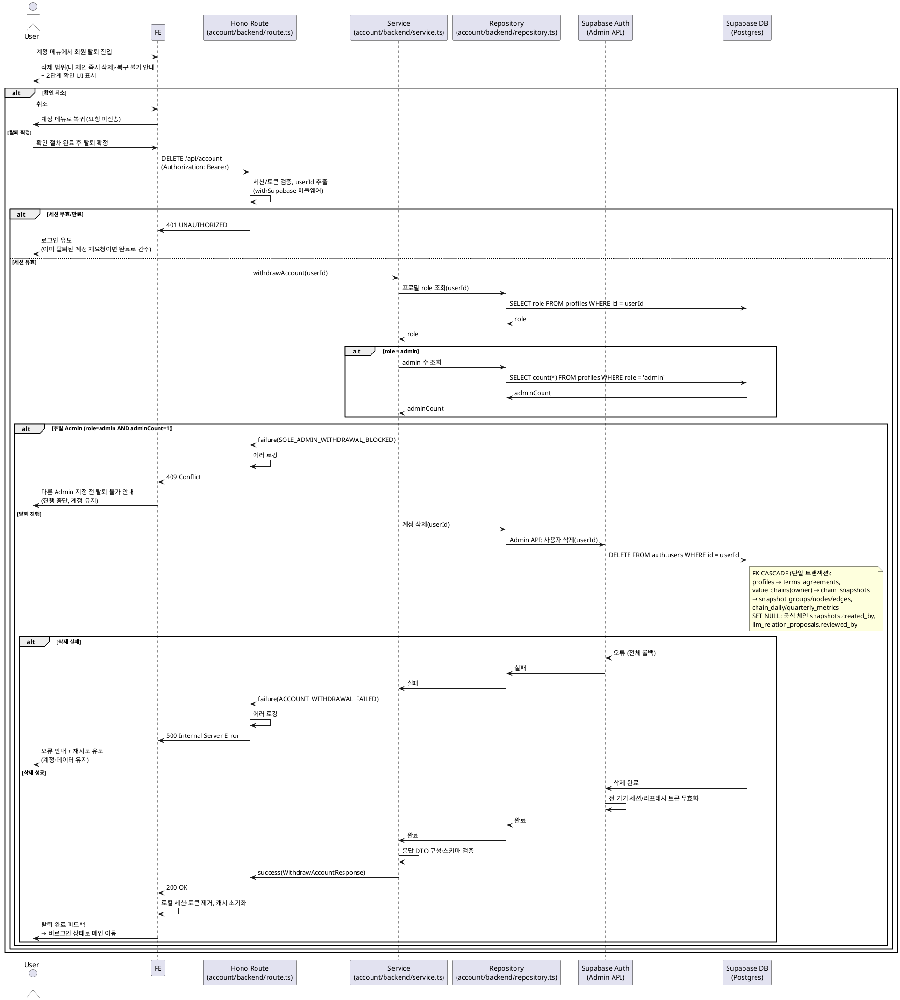

# UC-006: 회원 탈퇴

> 근거 문서: `docs/prd.md`(3장 계정 페이지, 8장 가정·제약), `docs/userflow.md` 006, `docs/database.md`(§3.1, §5 삭제 전파), `docs/techstack.md`(§4 계층 구조, §7 Supabase Auth).
> 관련 유저플로우: 001(재가입), 002(탈퇴 계정 로그인 불가), 005(세션), 019(체인 삭제와 동일한 종속 삭제 규칙), 029(지표 집계 배치와의 동시성).

---

## 1. Primary Actor

- **User** (로그인 사용자, 본인 계정). role=admin인 사용자도 본 기능으로 탈퇴할 수 있으나 "유일 Admin" 검증의 대상이 된다.

## 2. Precondition (사용자 관점)

- 사용자가 로그인 상태이다(유효한 인증 세션 보유).
- 사용자가 계정 메뉴(`/account`)에 접근할 수 있다.

## 3. Trigger

- 사용자가 계정 메뉴에서 "회원 탈퇴"(`/account/withdraw`)에 진입해 2단계 확인(확인 다이얼로그/재인증)을 완료하고 탈퇴를 확정한다.

## 4. Main Scenario

1. User가 계정 메뉴에서 회원 탈퇴 진입점을 선택한다.
2. FE가 탈퇴 안내(사용자 생성 밸류체인 즉시 삭제, 복구 불가)와 2단계 확인 UI를 표시한다.
3. User가 확인 절차를 완료하고 탈퇴를 확정한다.
4. FE가 인증 토큰과 함께 탈퇴 요청(`DELETE /api/account`)을 전송한다.
5. BE(Hono route)가 세션/토큰을 검증해 요청자 본인(userId)을 식별한다.
6. BE(service)가 요청자의 `role`을 조회하고, **admin이면 전체 admin 수를 확인**한다. 유일한 admin이면 탈퇴를 차단한다(진행 중단).
7. BE(service)가 계정 삭제를 실행한다: Supabase Auth Admin API로 `auth.users` 레코드를 삭제하면 DB의 FK CASCADE에 의해 `profiles` → 사용자 소유 `value_chains` → 종속 데이터(스냅샷/노드/엣지/그룹/체인 지표)와 `terms_agreements`가 **하나의 원자적 삭제로 즉시 제거**된다.
8. Supabase Auth가 해당 사용자의 모든 세션/리프레시 토큰을 무효화한다(계정 삭제에 수반).
9. BE가 탈퇴 완료 응답을 반환한다.
10. FE가 로컬 세션/토큰과 서버 상태 캐시를 정리하고, 탈퇴 완료 피드백을 표시한 뒤 비로그인 상태로 메인 페이지로 이동한다.

## 5. Edge Cases

| # | 상황 | 처리 |
|---|------|------|
| E1 | 미로그인/세션 만료 상태의 요청 | 401 거부, 로그인 페이지 유도 |
| E2 | 요청자가 **유일한 Admin** | 409 차단, "다른 Admin 지정 전 탈퇴 불가" 안내(진행 중단) |
| E3 | 삭제 중 부분 실패(DB 오류 등) | 단일 원자 삭제(FK CASCADE)이므로 전체 롤백 — 어떤 데이터도 부분적으로 남지 않음. 500 반환 후 재시도 유도 |
| E4 | 공용 데이터 오삭제 우려 | 공식 체인(`owner_id=NULL`)·종목 마스터·시세/재무 시계열은 삭제 경로에 포함되지 않음. 탈퇴자가 과거 작성한 공식 체인 스냅샷 이력은 `created_by=NULL`, LLM 제안 검토 이력은 `reviewed_by=NULL`로 보존 |
| E5 | 이미 탈퇴된 계정의 중복 요청(더블 클릭, 재시도) | 세션이 이미 무효이므로 401 — FE는 탈퇴 완료 상태로 간주하고 메인으로 이동(멱등 처리) |
| E6 | 응답 유실 후 재시도 | E5와 동일 — 삭제는 이미 완료, 재요청은 401로 수렴 |
| E7 | 탈퇴 직후 동일 이메일 재가입 | `auth.users` 물리 삭제로 이메일이 즉시 해제되어 재가입 즉시 허용(001 신규 가입 플로우) |
| E8 | 진행 중 배치가 사용자 데이터 참조 | 수집 배치(026~028)는 종목 마스터 전 종목 대상이라 영향 없음. 지표 집계 배치(029)가 동시 실행 중 삭제된 체인에 기록을 시도하면 FK 제약으로 거부되어 정합성 유지(배치는 항목 실패로 기록) |
| E9 | 2단계 확인 미완료/취소 | 요청 미전송, 계정 메뉴로 복귀 |
| E10 | 네트워크/서버 오류 | 오류 안내 + 재시도 유도(삭제 실패 시 계정·데이터는 그대로 유지) |

## 6. Business Rules

### 6.1 정책 규칙

- **BR-1 (즉시 삭제)**: 탈퇴 확정 시 계정과 사용자 소유 밸류체인 및 모든 종속 데이터(노드/관계/그룹/스냅샷/체인 지표)를 **즉시** 삭제한다. 유예 기간 없음(PRD 8장).
- **BR-2 (원자성)**: 삭제는 트랜잭션 단위로 전부 성공 또는 전부 롤백된다. 본 설계에서는 `auth.users` 단일 DELETE + FK CASCADE로 원자성이 DB 레벨에서 보장된다.
- **BR-3 (유일 Admin 차단)**: 탈퇴 요청자가 시스템의 유일한 `role=admin`이면 탈퇴를 차단한다. 삭제 실행 **전에** 검증한다.
- **BR-4 (공용 데이터 보존)**: 공식 체인, 관계 종류 마스터, 종목 마스터, 시세/재무/환율 시계열, 배치 이력은 삭제 대상이 아니다. 탈퇴자의 공식 체인 편집/검토 이력은 행위자 참조만 NULL 처리하고 이력 자체는 보존한다.
- **BR-5 (재가입 즉시 허용)**: 탈퇴 후 동일 이메일 재가입은 즉시 허용된다(물리 삭제 전제).
- **BR-6 (전체 세션 무효화)**: 탈퇴 완료 시 해당 사용자의 모든 기기 세션이 무효화된다(로그아웃 005의 "현재 기기만"과 다름).
- **BR-7 (본인 한정)**: 탈퇴는 본인 계정에 대해서만 가능하다. 타인 계정 탈퇴 API는 존재하지 않는다(요청자 = 삭제 대상, 세션에서 식별).
- **BR-8 (2단계 확인)**: FE에서 삭제 범위·복구 불가 안내와 함께 명시적 확인 절차를 거친 후에만 요청을 전송한다.

### 6.2 API Specification

- **Endpoint**: `DELETE /api/account`
- **인증**: 필수 — `Authorization: Bearer <access_token>` (Hono 미들웨어 `withSupabase`에서 세션 검증, 요청자 userId는 토큰에서 추출. 요청 본문/파라미터로 대상 사용자를 받지 않음)
- **Request Schema**: 본문 없음
- **Response Schema** (`200 OK`, `WithdrawAccountResponse`):

  ```
  {
    userId: string (uuid),        // 삭제된 계정 식별자
    withdrawnAt: string (ISO8601) // 탈퇴 처리 시각
  }
  ```

- **Error Codes**:

  | HTTP | 코드 | 의미 |
  |------|------|------|
  | 401 | `UNAUTHORIZED` | 미로그인/세션 만료/이미 삭제된 계정의 토큰 |
  | 409 | `SOLE_ADMIN_WITHDRAWAL_BLOCKED` | 요청자가 유일한 Admin — 다른 Admin 지정 필요 |
  | 500 | `ACCOUNT_WITHDRAWAL_FAILED` | 계정/데이터 삭제 실패(전체 롤백됨, 재시도 가능) |
  | 500 | `ACCOUNT_VALIDATION_ERROR` | 프로필 조회/응답 스키마 검증 실패 |

### 6.3 Database Operations

| 순서 | 테이블 | 연산 | 목적 |
|------|--------|------|------|
| 1 | `profiles` | SELECT | 요청자 `role` 조회 |
| 2 | `profiles` | SELECT (count) | `role='admin'` 전체 수 — 유일 Admin 검증(요청자가 admin일 때만) |
| 3 | `auth.users` | DELETE (Supabase Auth Admin API 경유) | 계정 물리 삭제 — 아래 전파의 시작점 |
| 3a | `profiles` | DELETE (CASCADE ← auth.users) | 프로필 삭제 |
| 3b | `terms_agreements` | DELETE (CASCADE ← profiles) | 약관 동의 이력 삭제 |
| 3c | `value_chains` | DELETE (CASCADE ← profiles.owner_id) | 사용자 소유 체인 삭제(공식 체인은 owner_id=NULL이라 비대상) |
| 3d | `chain_snapshots` | DELETE (CASCADE ← value_chains) | 사용자 체인 스냅샷 삭제 |
| 3e | `snapshot_groups` / `snapshot_nodes` / `snapshot_edges` | DELETE (CASCADE ← chain_snapshots) | 그룹/노드/엣지 삭제 |
| 3f | `chain_daily_metrics` / `chain_quarterly_metrics` | DELETE (CASCADE ← value_chains) | 사용자 체인 지표 집계 삭제 |
| 3g | `chain_snapshots.created_by` | UPDATE SET NULL | 탈퇴자가 작성한 **공식 체인** 스냅샷 이력 보존(행위자만 익명화) |
| 3h | `llm_relation_proposals.reviewed_by` | UPDATE SET NULL | 탈퇴 admin의 검토 이력 보존(행위자만 익명화) |

- 3~3h는 단일 DELETE 문의 FK 전파로 하나의 트랜잭션에서 원자적으로 수행된다(부분 실패 시 전체 롤백).
- `securities`, 시세/재무/환율/장운영 시계열, `relation_types`, `batch_*` 테이블은 본 유스케이스에서 접근하지 않는다.

### 6.4 External Service Integration

- **Supabase Auth (Admin API)**: 계정 삭제는 서버 측에서 service role 권한의 Auth Admin API(사용자 삭제)로 수행한다. 이 호출이 `auth.users` 삭제와 전 기기 세션/리프레시 토큰 무효화를 함께 처리한다. 클라이언트에는 service role 키를 절대 노출하지 않는다(techstack §9).
- `docs/external/`의 배치 전용 외부 API(OpenDART, SEC EDGAR, 토스증권)는 본 기능과 무관하다 — 사용자 데이터는 배치 수집 대상이 아니므로 탈퇴가 외부 연동에 영향을 주지 않는다.

## 7. Sequence Diagram


