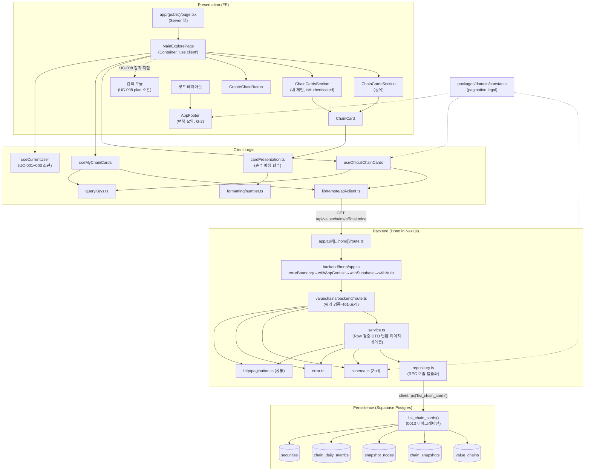

# Plan: UC-007 메인/탐색 페이지 조회

> 근거: `docs/usecases/007/spec.md`, `docs/usecases/000_decisions.md`(B-1~B-3, D-2, G-2), `docs/techstack.md` §4·§7, `docs/database.md` §3.3·§3.7·§4, `docs/pages/main-explore/{requirement.md, state_management.md}`, `.claude/skills/spec_to_plan/references/hono-backend-guide.md`.
>
> **범위 경계**
> - 본 plan은 메인/탐색 페이지의 **체인 카드 목록(공식/내 체인) 조회·페이지 셸·생성 진입점·푸터 노출**을 다룬다.
> - 기업 통합 검색(검색창·결과 패널·`exploreReducer`·`useDebouncedQueryCommit`·`features/securities`)은 **UC-008 plan 소관** — 본 plan은 컨테이너에 장착 지점만 정의한다.
> - 약관/정책 페이지 본문은 **UC-025 소관** — 본 plan은 푸터 컴포넌트(면책 요약 + 링크)까지만 정의한다.
> - 인증 세션 전역 관리(`useCurrentUser`, 로그인/returnTo 흐름)는 **UC-001~003 plan 소관** — 본 plan은 훅 시그니처 계약만 참조한다.
> - 외부 서비스 연동: **없음** (조회 전용, 자체 DB만 읽음 — 외부 API는 배치 UC-026~029 책임).
> - 본 plan은 최초 작성되는 plan이므로 공통 모듈을 여기서 정의한다. 이후 유스케이스 plan은 아래 "공통" 표기 모듈을 재정의하지 말고 위치만 참조할 것(DRY).

---

## 개요

### A. 공통 모듈 (본 plan에서 최초 정의 — 전 유스케이스 공유)

| 모듈 | 위치 | 설명 |
| --- | --- | --- |
| 페이지네이션 상수 | `packages/domain/src/constants/pagination.ts` | `CHAIN_LIST_PAGE_SIZE=20`(결정 B-3, 검색 상수와 분리), `LIST_PAGE_LIMIT_MAX=100`(limit 상한). 하드코딩 금지 원칙의 SOT |
| 법적 고지 상수 | `packages/domain/src/constants/legal.ts` | 푸터 면책 요약 문구(결정 G-2 임시 문안), 약관/개인정보 문서 버전 상수(A-4와 공유) |
| HTTP Result 헬퍼 | `apps/web/src/backend/http/response.ts` | `success()/failure()/respond()`, `HandlerResult<T,E,M>` 타입 (hono-backend-guide 표준) |
| 공통 페이지네이션 스키마/계산 | `apps/web/src/backend/http/pagination.ts` | `createPaginationQuerySchema(defaultLimit, maxLimit)`(Zod, coerce·기본값), `buildPagination(page, limit, totalCount)` 순수 함수. UC-008 검색도 재사용 |
| Hono 앱/컨텍스트 | `apps/web/src/backend/hono/app.ts`, `apps/web/src/backend/hono/context.ts` | 싱글턴 `createHonoApp()`(basePath `/api`), `AppEnv`, `getSupabase(c)/getLogger(c)/getAuthUser(c)` 접근자 |
| 공통 미들웨어 | `apps/web/src/backend/middleware/{error.ts, context.ts, supabase.ts, auth.ts}` | `errorBoundary` → `withAppContext`(config/logger) → `withSupabase`(service-role 클라이언트 주입) → `withAuth`(쿠키 세션 → 사용자 식별, 비차단) 체인 |
| Next API 진입점 | `apps/web/src/app/api/[[...hono]]/route.ts` | 단일 catch-all Route Handler(`runtime='nodejs'`), Hono 앱에 위임 |
| Supabase 클라이언트 팩토리 | `apps/web/src/lib/supabase/{service-client.ts, server-client.ts, browser-client.ts}` | service-role(백엔드 전용)·`@supabase/ssr` 쿠키 기반 서버/브라우저 클라이언트. 키는 환경변수(`SUPABASE_SERVICE_ROLE_KEY` 등)로만 주입 |
| API 클라이언트 | `apps/web/src/lib/remote/api-client.ts` | FE fetch 래퍼(base `/api`, JSON 파싱, 표준 에러 객체 변환 — status/code/message 보존) |
| 라우트 경로 상수 | `apps/web/src/constants/routes.ts` | `ROUTES.home/login/newChain/chainView(id)/company(ticker)/terms/privacy` + `withReturnTo(path)` 헬퍼 |
| 숫자 포맷 유틸 | `apps/web/src/lib/formatting/number.ts` | `formatKrwCompact(value: string): string`(조/억 단위 축약, numeric 문자열 입력). 대시보드(UC-010)·기업상세(UC-020) 재사용 |
| 전역 푸터 | `apps/web/src/components/common/AppFooter.tsx` | 면책 요약(G-2 상수) + 약관/개인정보 링크. 루트 레이아웃에 장착(전 페이지 공통, UC-025 연계) |
| 인증 세션 훅 *(참조만)* | `apps/web/src/features/auth/hooks/useCurrentUser.ts` | `{ user, isAuthenticated, isLoading }` 반환 계약. **구현은 UC-001~003 plan 소관** — 본 plan은 이 시그니처에만 의존 |

### B. 데이터베이스 (마이그레이션)

| 모듈 | 위치 | 설명 |
| --- | --- | --- |
| 체인 카드 목록 RPC 함수 | `supabase/migrations/0013_list_chain_cards_function.sql` | `list_chain_cards()` Postgres 함수 — 체인×최신 스냅샷×노드 수×최신 일별 지표×기준 기업명 복합 조인을 캡슐화(N+1 방지, techstack §7). 멱등(`CREATE OR REPLACE`) |

### C. valuechains 기능 — 백엔드 (Hono 계층)

| 모듈 | 위치 | 설명 |
| --- | --- | --- |
| Zod 스키마 | `apps/web/src/features/valuechains/backend/schema.ts` | 목록 쿼리(Request)·RPC Row(snake_case)·`ChainCard`/`ChainCardListResponse`(camelCase DTO) 스키마 |
| 에러 코드 | `apps/web/src/features/valuechains/backend/error.ts` | `VALUECHAIN_LIST_INVALID_QUERY/UNAUTHORIZED/FETCH_FAILED/VALIDATION_ERROR` 상수 |
| Repository | `apps/web/src/features/valuechains/backend/repository.ts` | `list_chain_cards` RPC 호출 캡슐화(Persistence). Supabase 문법을 아는 유일한 계층 |
| Service | `apps/web/src/features/valuechains/backend/service.ts` | `listOfficialChainCards`/`listMyChainCards` — Row 검증, DTO 변환(latestMetric null 규칙), 페이지네이션 계산. repository 인터페이스에만 의존 |
| Route | `apps/web/src/features/valuechains/backend/route.ts` | `GET /valuechains/official`, `GET /valuechains/mine` — 쿼리 검증(400), 세션 검증(401), 에러 로깅, `respond()` |
| 앱 등록 | `apps/web/src/backend/hono/app.ts`(수정) | `registerValuechainsRoutes(app)` 1줄 추가 |

### D. valuechains 기능 — 프론트엔드

| 모듈 | 위치 | 설명 |
| --- | --- | --- |
| DTO 재노출 | `apps/web/src/features/valuechains/lib/dto.ts` | backend/schema의 `ChainCard`/`ChainCardListResponse` 타입·스키마 재노출(FE가 backend 내부 경로를 직접 import하지 않도록) |
| 카드 표시 파생 로직 | `apps/web/src/features/valuechains/lib/cardPresentation.ts` | 순수 함수: 기준 표기(산업/기업+기업명), 가치총액 표시 문자열(null→미표시, 이월 표기, 커버리지 "반영 n/전체 m"), 노드 수 표기 |
| 쿼리 키 | `apps/web/src/features/valuechains/hooks/queryKeys.ts` | `chainCardQueryKeys.official / mine` (state_management §6 계약) |
| 공식 목록 훅 | `apps/web/src/features/valuechains/hooks/useOfficialChainCards.ts` | `useInfiniteQuery` — `limit=CHAIN_LIST_PAGE_SIZE`, `getNextPageParam: hasMore ? page+1 : undefined` |
| 내 목록 훅 | `apps/web/src/features/valuechains/hooks/useMyChainCards.ts` | 동일 구조 + `enabled: isAuthenticated`, 401은 재시도 없이 오류 노출 |
| 체인 카드 | `apps/web/src/features/valuechains/components/ChainCard.tsx` | Presenter — 이름·기준·노드 수·가치총액 요약 렌더링, 클릭 시 `onSelect(chainId)` |
| 카드 섹션 | `apps/web/src/features/valuechains/components/ChainCardsSection.tsx` | Presenter — 로딩/오류+재시도/빈 상태(`emptyVariant`)/목록/더보기. 공식·내 체인 공용(결정 B-2) |

### E. 페이지 (Presentation 조립)

| 모듈 | 위치 | 설명 |
| --- | --- | --- |
| 페이지 셸 | `apps/web/src/app/(public)/page.tsx` | Server Component — 클라이언트 경계 배치만(로직 없음) |
| 페이지 컨테이너 | `apps/web/src/features/explore/components/MainExplorePage.tsx` | `'use client'` Container — 쿼리 훅 2종 + 인증 훅 연결, 핸들러로 감싸 Presenter에 props 전달. UC-008 검색 모듈(reducer·SearchBar 등) 장착 지점 보유 |
| 생성 진입점 | `apps/web/src/features/explore/components/CreateChainButton.tsx` | Presenter — 로그인: `/valuechains/new` 라우팅, 비로그인: `withReturnTo`로 로그인 유도 |

---

## Diagram

---

## Implementation Plan

> 구현 순서: **B(0013 마이그레이션) → A(공통) → C(백엔드) → D(FE 로직/컴포넌트) → E(페이지 조립)**.
> 코드베이스는 아직 스캐폴드 전(Phase 9)이므로 충돌 없음. 공통 모듈(A)은 env_setupper가 스캐폴드 시 일부 생성할 수 있다 — 이미 존재하면 재정의하지 말고 계약(시그니처)만 일치 확인 후 재사용한다.

---

### B-1. `list_chain_cards` RPC 함수 (`supabase/migrations/0013_list_chain_cards_function.sql`)

- 구현 내용:
  1. `CREATE OR REPLACE FUNCTION list_chain_cards(p_chain_type chain_type, p_owner_id uuid, p_limit integer, p_offset integer) RETURNS TABLE (...)` — 멱등, `LANGUAGE sql STABLE`, `SET search_path = public`.
  2. 반환 컬럼: `id uuid, name text, chain_type chain_type, focus_type chain_focus_type, focus_company_name text, node_count bigint, metric_date date, total_market_cap_krw text, covered_node_count integer, total_node_count integer, is_carried_forward boolean, updated_at timestamptz, total_count bigint`.
     - `total_market_cap_krw`는 **`numeric::text` 캐스팅**으로 반환 — PostgREST의 JSON number 직렬화로 인한 numeric 정밀도 손실 방지(spec의 "문자열" 계약 이행).
     - `total_count`는 `COUNT(*) OVER ()` 윈도우 — 필터 적용 후 전체 건수(페이지네이션·D-2 소유 수 확인용).
  3. 조인 구성 (모두 `LEFT JOIN LATERAL` — 스냅샷/지표 부재 체인도 카드 반환, 엣지 3·9):
     - `value_chains vc` 기준. 필터: `vc.chain_type = p_chain_type AND vc.is_archived = false`, `p_chain_type='user'`이면 `vc.owner_id = p_owner_id` 추가(함수 본문에서 user인데 `p_owner_id IS NULL`이면 0행 — 방어).
     - 최신 스냅샷: `SELECT id FROM chain_snapshots s WHERE s.chain_id = vc.id ORDER BY s.effective_at DESC LIMIT 1`.
     - 노드 수: 최신 스냅샷의 `snapshot_nodes` COUNT — 스냅샷 없으면 `COALESCE(..., 0)`.
     - 최신 지표: `SELECT metric_date, total_market_cap_krw, covered_node_count, total_node_count, is_carried_forward FROM chain_daily_metrics m WHERE m.chain_id = vc.id ORDER BY m.metric_date DESC LIMIT 1` — 없으면 전부 NULL.
     - 기준 기업명: `vc.focus_type='company' AND vc.focus_security_id IS NOT NULL`일 때만 `securities.name`, 아니면 NULL(결정 D-1: 기업 중심이라도 대상 기업 미지정 가능).
  4. 정렬(결정 B-1): `ORDER BY CASE WHEN p_chain_type='official' THEN 정렬키(created_at ASC) ELSE 정렬키(updated_at DESC) END` — 공식=생성일 오름차순(어드민 큐레이션), 사용자=최근 수정 내림차순. 동률 tie-break는 `id`.
  5. `LIMIT p_limit OFFSET p_offset`.
  6. 적용은 Phase 9에서 `mcp__supabase__apply_migration`으로 수행(파일 생성만 본 단계). 적용 후 `generate_typescript_types`로 `packages/domain/types/database.ts` 재생성.
- 의존성: 마이그레이션 0003(securities), 0005(value_chains), 0006(chain_snapshots·snapshot_nodes), 0010(chain_daily_metrics) — 전부 기작성됨. 스키마 변경 없음(함수 추가만)이므로 기존 마이그레이션과 충돌 없음.

**Business Logic (SQL) — Unit Tests** (마이그레이션 적용 후 SQL 레벨 검증 시나리오, 통합 테스트로 수행):

- [ ] official 조회: `chain_type='official' AND is_archived=false`만 반환, `is_archived=true` 체인 제외
- [ ] official 조회에 사용자 체인이 섞이지 않음 / user 조회에 타인·공식 체인이 섞이지 않음(owner 격리)
- [ ] user 조회인데 `p_owner_id IS NULL`이면 0행 반환(방어)
- [ ] 스냅샷 없는 체인 → `node_count=0`, 행은 정상 반환(엣지 9)
- [ ] `chain_daily_metrics` 없는 체인 → 지표 컬럼 전부 NULL, 행은 정상 반환(엣지 3)
- [ ] 지표 여러 일자 존재 시 최신 `metric_date` 1행만 반영
- [ ] 스냅샷 여러 개 존재 시 `effective_at` 최대 스냅샷의 노드 수만 계산
- [ ] `focus_type='company'` + `focus_security_id` 지정 → `focus_company_name`=종목명 / 미지정 → NULL / `focus_type='industry'` → NULL
- [ ] 정렬: official은 created_at 오름차순, user는 updated_at 내림차순
- [ ] `total_count`가 LIMIT/OFFSET과 무관하게 필터 후 전체 건수 / `p_offset` 초과 페이지는 0행이어도 함수 자체는 정상(0행 시 total_count는 앱에서 0 처리)
- [ ] `total_market_cap_krw`가 text 타입으로 반환되어 소수부 정밀도 보존

---

### A-1. 페이지네이션 상수 (`packages/domain/src/constants/pagination.ts`)

- 구현 내용: `CHAIN_LIST_PAGE_SIZE = 20`(결정 B-3 — UC-008의 `SEARCH_PAGE_SIZE`와 **별도 상수**), `LIST_PAGE_LIMIT_MAX = 100`(limit 쿼리 상한). `as const` export. `packages/domain`은 프레임워크 비의존 순수 모듈 원칙 준수.
- 의존성: 없음.
- Unit Tests: 해당 없음(상수 정의).

### A-2. 법적 고지 상수 (`packages/domain/src/constants/legal.ts`)

- 구현 내용: `DISCLAIMER_SUMMARY_TEXT`(결정 G-2 임시 문구 그대로: "본 서비스의 모든 정보는 투자 판단의 참고 자료이며, 투자 권유가 아닙니다. 투자의 책임은 투자자 본인에게 있습니다."). 약관 버전 상수(A-4)는 인증 plan에서 같은 파일에 추가하도록 파일만 선점.
- 의존성: 없음. / Unit Tests: 해당 없음.

### A-3. HTTP Result 헬퍼 (`apps/web/src/backend/http/response.ts`) — 공통

- 구현 내용: hono-backend-guide 표준 그대로 — `HandlerResult<T, E, M>` 타입(`ok`, `status`, `data | error`), `success(data, status=200)`, `failure(status, code, message, details?)`, `respond(c, result)`(성공 시 data JSON, 실패 시 `{ error: { code, message, details } }`).
- 의존성: 없음.
- **Unit Tests**:
  - [ ] `success(data)` → `ok=true`, status 기본 200, data 보존
  - [ ] `failure(400, 'CODE', 'msg', details)` → `ok=false`, error 필드 전부 보존
  - [ ] `respond()`가 성공/실패 각각 올바른 status·body 형태로 직렬화

### A-4. 공통 페이지네이션 스키마/계산 (`apps/web/src/backend/http/pagination.ts`) — 공통

- 구현 내용:
  1. `createPaginationQuerySchema({ defaultLimit, maxLimit })` — Zod: `page`=`z.coerce.number().int().min(1).default(1)`, `limit`=`z.coerce.number().int().min(1).max(maxLimit).default(defaultLimit)`. 음수·비숫자·상한 초과는 파싱 실패(엣지 6의 원천).
  2. `buildPagination(page, limit, totalCount)` 순수 함수 → `{ page, limit, totalCount, hasMore: page * limit < totalCount }`.
- 의존성: 없음(zod만).
- **Unit Tests**:
  - [ ] 파라미터 생략 → 기본값 `{page:1, limit:defaultLimit}` 적용
  - [ ] 문자열 숫자(`"2"`) coerce 성공 / `"abc"`·`"-1"`·`"0"`·소수 → 파싱 실패
  - [ ] `limit > maxLimit` → 파싱 실패
  - [ ] `buildPagination(1, 20, 0)` → `hasMore=false` / `(1,20,21)` → `true` / `(2,20,40)` → `false` / `(2,20,41)` → `true`

### A-5. Hono 앱/컨텍스트 + 미들웨어 + Next 진입점 — 공통

(`apps/web/src/backend/hono/{app.ts, context.ts}`, `apps/web/src/backend/middleware/{error.ts, context.ts, supabase.ts, auth.ts}`, `apps/web/src/app/api/[[...hono]]/route.ts`)

- 구현 내용:
  1. `context.ts`: `AppEnv`(Variables: `supabase`, `logger`, `config`, `authUser`), 접근자 `getSupabase(c)/getLogger(c)/getAuthUser(c)`.
  2. `middleware/error.ts` `errorBoundary()`: 미처리 예외 → 로깅 후 500 표준 응답.
  3. `middleware/context.ts` `withAppContext()`: 환경변수 검증(Supabase URL/키 존재) 후 `config`·`logger` 주입.
  4. `middleware/supabase.ts` `withSupabase()`: `lib/supabase/service-client.ts`로 service-role 클라이언트 생성·주입(RLS 비활성 전제, 인가는 서버 검증).
  5. `middleware/auth.ts` `withAuth()`: `@supabase/ssr` 쿠키 기반 서버 클라이언트로 `auth.getUser()` 수행 → `authUser`(user 또는 null) 주입. **비차단**(공개 라우트 허용) — 401 판단은 각 route 책임. Auth 조회 실패는 null로 폴백(세션 만료와 동일 취급).
  6. `app.ts`: 싱글턴 `createHonoApp()` — `basePath('/api')`, 미들웨어 체인(error→context→supabase→auth) 등록, feature 라우터 등록(`registerValuechainsRoutes` 포함).
  7. `app/api/[[...hono]]/route.ts`: `runtime='nodejs'`, GET/POST 등 메서드를 Hono 앱 `fetch`에 위임.
- 의존성: A-3, Supabase 클라이언트 팩토리(아래 A-6).
- **QA Sheet** (통합 확인):

| # | 시나리오 | 기대 결과 |
| --- | --- | --- |
| 1 | `/api` 하위 임의 경로 호출 | Hono 앱이 응답(등록 안 된 경로는 404) |
| 2 | 라우트 핸들러 내부에서 예외 발생 | errorBoundary가 500 표준 오류 JSON 반환 + 서버 로그 |
| 3 | 세션 쿠키 없이 호출 | `getAuthUser(c)`가 null (요청 자체는 정상 진행) |
| 4 | 유효 세션 쿠키로 호출 | `getAuthUser(c)`가 사용자 반환 |
| 5 | `SUPABASE_SERVICE_ROLE_KEY` 미설정 상태 부팅 | withAppContext가 명시적 설정 오류 로그(silent 실패 금지) |

### A-6. Supabase 클라이언트 팩토리 + API 클라이언트 + 라우트 상수 — 공통

(`apps/web/src/lib/supabase/*`, `apps/web/src/lib/remote/api-client.ts`, `apps/web/src/constants/routes.ts`)

- 구현 내용:
  1. `service-client.ts`: `createClient(NEXT_PUBLIC_SUPABASE_URL, SUPABASE_SERVICE_ROLE_KEY)` — 서버 전용(클라이언트 번들 유입 금지, `server-only` import 가드).
  2. `server-client.ts`/`browser-client.ts`: `@supabase/ssr` 쿠키 연동 클라이언트(anon key) — 인증 세션용.
  3. `api-client.ts`: `apiGet<T>(path, { query })` — base `/api`, 쿼리스트링 직렬화, 비 2xx 시 `{ status, code, message }` 형태 `ApiError`로 변환(응답 body의 `error.code` 보존 → FE가 401/400 분기 가능).
  4. `routes.ts`: `ROUTES` 상수 객체 + `withReturnTo(target: string): string`(로그인 경로에 `returnTo` 쿼리 부착).
- 의존성: 없음.
- **Unit Tests** (api-client·routes 순수 로직):
  - [ ] `apiGet`이 2xx JSON을 타입 그대로 반환
  - [ ] 400/401/500 응답 body의 `error.code`·`message`가 `ApiError`에 보존
  - [ ] 네트워크 실패 시에도 일관된 `ApiError` 형태로 변환
  - [ ] `withReturnTo('/valuechains/new')` → 로그인 경로 + 인코딩된 returnTo 쿼리

### A-7. 전역 푸터 (`apps/web/src/components/common/AppFooter.tsx`) — 공통

- 구현 내용: `DISCLAIMER_SUMMARY_TEXT` 노출 + `ROUTES.terms`/`ROUTES.privacy` 링크. 순수 Presenter(상태·로직 없음). 루트 레이아웃(`apps/web/src/app/layout.tsx`)에 장착해 전 페이지 상시 노출(UC-025 규칙). 정책 페이지 본문은 UC-025 plan 소관.
- 의존성: A-2, A-6(routes).
- **QA Sheet**:

| # | 시나리오 | 기대 결과 |
| --- | --- | --- |
| 1 | 메인 페이지 진입 | 푸터에 면책 요약 문구(G-2 문안 그대로) 표시 |
| 2 | 약관/개인정보 링크 클릭 | 각각 `/terms`, `/privacy`로 이동(UC-025 페이지) |
| 3 | 임의의 다른 페이지 진입 | 동일 푸터 상시 노출(전역 레이아웃) |
| 4 | 반응형(모바일 폭) | 문구 줄바꿈 정상, 가로 스크롤 없음 |

---

### C-1. Zod 스키마 (`apps/web/src/features/valuechains/backend/schema.ts`)

- 구현 내용:
  1. `ChainCardListQuerySchema` = `createPaginationQuerySchema({ defaultLimit: CHAIN_LIST_PAGE_SIZE, maxLimit: LIST_PAGE_LIMIT_MAX })` 재사용(A-4).
  2. `ChainCardRpcRowSchema`(snake_case — 0013 반환 컬럼과 1:1):
     `id`(uuid) / `name` / `chain_type`(enum official·user) / `focus_type`(enum industry·company) / `focus_company_name`(nullable) / `node_count`(int ≥0, bigint→number coerce) / `metric_date`(nullable) / `total_market_cap_krw`(**string** nullable — text 캐스팅 계약) / `covered_node_count`(nullable int) / `total_node_count`(nullable int) / `is_carried_forward`(nullable boolean) / `updated_at`(string) / `total_count`(int ≥0).
  3. `ChainCardMetricSchema`(camelCase): `{ metricDate, totalMarketCapKrw: string, coveredNodeCount, totalNodeCount, isCarriedForward }` — spec 계약 그대로 필드 전부 non-null.
  4. `ChainCardSchema`: `{ id, name, chainType, focusType, focusCompanyName: nullable, nodeCount, latestMetric: ChainCardMetricSchema.nullable(), updatedAt }`.
  5. `ChainCardListResponseSchema`: `{ items: ChainCard[], pagination: { page, limit, totalCount, hasMore } }`.
  6. 전 타입 `z.infer` export.
- 의존성: A-1, A-4.
- Unit Tests: 해당 없음(스키마 정의 — 검증 동작은 C-3 service 테스트에서 간접 검증).

### C-2. 에러 코드 (`apps/web/src/features/valuechains/backend/error.ts`)

- 구현 내용: `valuechainListErrorCodes = { invalidQuery: 'VALUECHAIN_LIST_INVALID_QUERY', unauthorized: 'VALUECHAIN_LIST_UNAUTHORIZED', fetchFailed: 'VALUECHAIN_LIST_FETCH_FAILED', validationError: 'VALUECHAIN_LIST_VALIDATION_ERROR' } as const` + `ValuechainListServiceError` 타입. spec의 에러 코드 표와 1:1.
- 의존성: 없음. / Unit Tests: 해당 없음(상수).

### C-3. Repository (`apps/web/src/features/valuechains/backend/repository.ts`)

- 구현 내용:
  1. 조회 파라미터 타입 `FindChainCardsParams = { chainType: 'official' | 'user'; ownerId: string | null; limit: number; offset: number }`.
  2. `findChainCards(client: SupabaseClient, params): Promise<{ rows: unknown[]; error: string | null }>` — `client.rpc('list_chain_cards', { p_chain_type, p_owner_id, p_limit, p_offset })` 호출. Supabase error 발생 시 `{ rows: [], error: message }` 반환(예외 던지지 않음 — Result 지향). RPC 함수명·파라미터명은 파일 상단 상수로 관리(하드코딩 금지).
  3. Row 해석/검증은 하지 않는다(그대로 service에 전달 — Persistence는 접근만 담당).
- 의존성: B-1(RPC 계약).
- **Unit Tests** (Supabase client mock):
  - [ ] official 조회 시 `p_chain_type='official'`, `p_owner_id=null`, page/limit → offset 변환값으로 RPC가 정확히 1회 호출됨
  - [ ] mine 조회 시 `p_owner_id`에 사용자 id 전달
  - [ ] RPC 성공 → `{ rows: [...], error: null }`
  - [ ] RPC 오류(`error` 객체) → `{ rows: [], error: message }`, 예외 미발생
  - [ ] data가 null(빈 응답) → `rows: []`로 정규화

### C-4. Service (`apps/web/src/features/valuechains/backend/service.ts`)

- 구현 내용:
  1. 시그니처:
     - `listOfficialChainCards(client, query: { page, limit }): Promise<HandlerResult<ChainCardListResponse, ValuechainListServiceError, unknown>>`
     - `listMyChainCards(client, userId: string, query: { page, limit }): Promise<HandlerResult<...>>`
     - 두 함수는 내부 공통 함수 `listChainCards(client, { chainType, ownerId }, query)`로 위임(DRY).
  2. 처리 순서: `offset = (page-1) * limit` 계산 → repository 호출 → `error`면 `failure(500, fetchFailed)` → 각 row `ChainCardRpcRowSchema.safeParse`(실패 시 `failure(500, validationError, ..., format())`) → DTO 변환 → `ChainCardListResponseSchema.safeParse` 최종 검증 → `success()`.
  3. **latestMetric null 규칙**(엣지 3): `metric_date IS NULL` **또는** `total_market_cap_krw IS NULL`이면 `latestMetric = null`(집계 미존재/시세 장애 — 0과 구분). 그 외에는 5개 필드 전부 채워 반환.
  4. `nodeCount`: row 값 그대로(스냅샷 없으면 RPC가 0 반환 — 엣지 9).
  5. 페이지네이션: `totalCount = rows[0]?.total_count ?? 0`(0행이면 0), `buildPagination(page, limit, totalCount)`(A-4). 빈 목록도 200 정상 응답(엣지 1·2). **mine의 `pagination.totalCount`가 곧 소유 체인 수** — UC-013 체인 상한 사전 확인이 이 값을 재사용한다(결정 D-2, 별도 quota API 없음).
  6. 정렬은 RPC 책임(결정 B-1) — service는 순서를 재조작하지 않는다.
- 의존성: C-1, C-2, C-3, A-3, A-4.
- **Unit Tests** (repository mock):
  - [ ] 정상 2행 → 200 success, snake→camel 전 필드 매핑 정확(`focus_company_name`→`focusCompanyName` 등)
  - [ ] 0행 → `items: []`, `pagination.totalCount=0`, `hasMore=false`, success(빈 목록 200)
  - [ ] `metric_date=null` row → `latestMetric=null` (0이 아닌 null)
  - [ ] `metric_date` 존재하나 `total_market_cap_krw=null` → `latestMetric=null`(방어 규칙)
  - [ ] 지표 정상 row → `latestMetric` 5필드 채움, `totalMarketCapKrw`가 문자열 그대로 보존(정밀도)
  - [ ] `is_carried_forward=true` row → `latestMetric.isCarriedForward=true`
  - [ ] `node_count=0` row → `nodeCount=0` 카드 정상 생성(엣지 9)
  - [ ] repository error → `failure(500, VALUECHAIN_LIST_FETCH_FAILED)`
  - [ ] Row 스키마 위반(예: `id`가 uuid 아님) → `failure(500, VALUECHAIN_LIST_VALIDATION_ERROR)`
  - [ ] `page=2, limit=20` → repository에 `offset=20` 전달
  - [ ] `totalCount=41, page=2, limit=20` → `hasMore=true` / `totalCount=40` → `false`
  - [ ] mine: `ownerId`가 repository 파라미터로 정확히 전달, `chainType='user'`

### C-5. Route (`apps/web/src/features/valuechains/backend/route.ts`) + 앱 등록

- 구현 내용:
  1. `registerValuechainsRoutes(app: Hono<AppEnv>)` export.
  2. `GET /valuechains/official`: 쿼리 파싱(`c.req.query()`) → `ChainCardListQuerySchema.safeParse` 실패 시 `respond(failure(400, VALUECHAIN_LIST_INVALID_QUERY, ..., format()))`(엣지 6) → `listOfficialChainCards(getSupabase(c), parsed.data)` → 실패 시 `getLogger(c).error` 로깅 → `respond(c, result)`. 인증 불필요(공개).
  3. `GET /valuechains/mine`: `getAuthUser(c)`가 null이면 `respond(failure(401, VALUECHAIN_LIST_UNAUTHORIZED, ...))`(엣지 4·7 — 무인증 방어) → 쿼리 검증(동일 400) → `listMyChainCards(client, user.id, parsed.data)` → 로깅 → respond.
  4. Service가 HTTP를 모르도록 상태 코드 매핑은 route/failure의 status 인자로만 처리(가이드 원칙).
  5. `backend/hono/app.ts`에 `registerValuechainsRoutes(app)` 등록(다른 feature 라우터와 경로 충돌 없음 — `/valuechains/*` 프리픽스는 본 feature 전용. UC-009 이후 상세 조회 라우트도 이 파일에 추가된다).
- 의존성: C-1~C-4, A-5.
- **QA Sheet** (Presentation 서버측 계약 — HTTP 통합 확인):

| # | 시나리오 | 기대 결과 |
| --- | --- | --- |
| 1 | `GET /api/valuechains/official` (파라미터 없음) | 200, `items` + `pagination{page:1, limit:20}`, 카드 스키마 일치 |
| 2 | `GET /api/valuechains/official?page=2&limit=10` | 200, 2페이지 항목, `pagination.page=2` |
| 3 | `?page=0` / `?page=-1` / `?page=abc` / `?limit=101` | 400 `VALUECHAIN_LIST_INVALID_QUERY` + details |
| 4 | 공식 체인 0건(시드 미적재) | 200, `items: []`, `totalCount: 0`(오류 아님) |
| 5 | `GET /api/valuechains/mine` 무세션 | 401 `VALUECHAIN_LIST_UNAUTHORIZED` |
| 6 | `GET /api/valuechains/mine` 유효 세션 | 200, 본인 소유 체인만(타인 체인 절대 미포함), `chainType='user'` |
| 7 | mine 0건 | 200 빈 목록(생성 유도는 FE 책임) |
| 8 | DB 장애 시뮬레이션(RPC 오류) | 500 `VALUECHAIN_LIST_FETCH_FAILED` + 서버 오류 로그 기록 |
| 9 | 지표 미집계 체인 포함 응답 | 해당 카드 `latestMetric: null`(0 아님) |
| 10 | 응답의 `totalMarketCapKrw` | JSON string 타입(number 아님) |

---

### D-1. DTO 재노출 (`apps/web/src/features/valuechains/lib/dto.ts`)

- 구현 내용: `backend/schema.ts`에서 `ChainCard`, `ChainCardMetric`, `ChainCardListResponse` 타입·스키마를 재노출. FE 모듈은 이 파일만 import(백엔드 내부 구조 결합 차단).
- 의존성: C-1. / Unit Tests: 해당 없음(re-export).

### D-2. 카드 표시 파생 로직 (`apps/web/src/features/valuechains/lib/cardPresentation.ts`)

- 구현 내용 (전부 순수 함수 — React 비의존, state_management §2.2 D6·D9 파생 계산의 단일 구현처):
  1. `formatFocusLabel(focusType, focusCompanyName)`: `industry` → "산업 중심" / `company`+기업명 → "기업 중심 · {기업명}" / `company`+null → "기업 중심"(결정 D-1).
  2. `formatMetricDisplay(latestMetric)`: `null` → `{ kind: 'unavailable' }`(값 미표시 — **0과 구분**, 엣지 3) / 값 존재 → `{ kind: 'value', text: formatKrwCompact(totalMarketCapKrw), coverageText: '반영 n/전체 m', isCarriedForward, metricDate }` 형태의 표시 모델 반환.
  3. `formatNodeCount(count)`: "노드 N개".
  4. 문자열 리터럴("산업 중심" 등)은 파일 내 상수 객체로 관리.
- 의존성: A-6(number 포맷), D-1.
- **Unit Tests**:
  - [ ] `formatFocusLabel('industry', null)` → "산업 중심"
  - [ ] `formatFocusLabel('company', '삼성전자')` → 기업명 포함 라벨
  - [ ] `formatFocusLabel('company', null)` → 기업명 없는 "기업 중심"(D-1)
  - [ ] `formatMetricDisplay(null)` → `unavailable` (0 표기 아님)
  - [ ] 정상 metric → KRW 축약 문자열 + "반영 3/전체 5" 커버리지 문자열
  - [ ] `isCarriedForward=true` → 이월 플래그 전달(카드에서 이월 배지 표기)
  - [ ] `totalMarketCapKrw='0'` → "0원" 계열 **값 표기**(unavailable 아님 — 0과 null 구분의 역방향 검증)
  - [ ] `formatKrwCompact`: `'1234567890123'` → 조/억 축약, `'0'` → "0", 소수부 문자열 입력 정상 처리(A-6에서 테스트)

### D-3. 쿼리 훅 (`apps/web/src/features/valuechains/hooks/{queryKeys.ts, useOfficialChainCards.ts, useMyChainCards.ts}`)

- 구현 내용:
  1. `queryKeys.ts`: `chainCardQueryKeys = { official: ['valuechains','official'], mine: ['valuechains','mine'] } as const`(state_management §6 계약).
  2. `useOfficialChainCards()`: `useInfiniteQuery` — `queryFn: apiGet<ChainCardListResponse>('/valuechains/official', { query: { page: pageParam, limit: CHAIN_LIST_PAGE_SIZE } })`, `initialPageParam: 1`, `getNextPageParam: (last) => last.pagination.hasMore ? last.pagination.page + 1 : undefined`.
  3. `useMyChainCards({ enabled })`: 동일 구조 + `enabled`(호출측이 `isAuthenticated` 전달), `retry: (count, err) => err.status !== 401 && count < 기본횟수` — 401은 재시도 없이 즉시 오류 노출(엣지 7: 게스트 뷰 전환용). 401 발생 여부를 반환값에서 판별 가능하도록 `isUnauthorized` 파생 필드 제공.
  4. 응답은 `ChainCardListResponseSchema.safeParse`로 런타임 검증 후 캐시에 저장(계약 위반 조기 발견).
  5. 서버 데이터는 TanStack Query 캐시가 단일 소스 — reducer 등에 복제 금지(state_management §1).
- 의존성: A-6(api-client), A-1(상수), D-1.
- **Unit Tests** (순수 로직 부분):
  - [ ] `getNextPageParam`: `hasMore=true, page=1` → 2 / `hasMore=false` → `undefined`
  - [ ] 401 `ApiError` → retry 함수가 false 반환(재시도 안 함) / 500 → 기본 재시도 허용
  - [ ] 응답 스키마 위반 payload → 쿼리 오류로 전환(성공 캐시 오염 방지)

### D-4. 체인 카드 Presenter (`apps/web/src/features/valuechains/components/ChainCard.tsx`)

- 구현 내용: props `{ card: ChainCard; onSelect: (chainId: string) => void }`. `cardPresentation` 파생값으로 이름·기준 라벨·노드 수·가치총액(또는 미표시)·커버리지·이월 배지를 렌더링. 클릭/Enter 시 `onSelect(card.id)`. 로직 없음(파생 계산은 D-2 위임). shadcn-ui `card` 프리미티브 사용(신규 설치 필요 시 안내: `npx shadcn@latest add card`).
- 의존성: D-1, D-2.
- **QA Sheet**:

| # | 시나리오 | 기대 결과 |
| --- | --- | --- |
| 1 | 정상 카드(지표 있음) | 이름·기준·노드 수·가치총액(KRW 축약)·커버리지("반영 n/전체 m") 표시 |
| 2 | `latestMetric: null` 카드 | 가치총액 영역 "미제공" 류 미표시 처리 — "0"과 시각적으로 다름 |
| 3 | `isCarriedForward: true` | 이월 표기(배지/캡션) 추가 표시 |
| 4 | `totalMarketCapKrw: "0"` | "0" 값으로 표시(미표시 처리 아님) |
| 5 | 기업 중심 + 기업명 있음 | "기업 중심 · {기업명}" 표기 |
| 6 | 기업 중심 + 기업명 null | "기업 중심"만 표기(깨짐 없음) |
| 7 | `nodeCount: 0` | "노드 0개"로 정상 렌더링(엣지 9) |
| 8 | 카드 클릭 / 키보드 Enter | `onSelect(chainId)` 1회 호출(라우팅은 Container 책임) |
| 9 | 긴 체인 이름 | 말줄임 처리, 레이아웃 붕괴 없음 |

### D-5. 카드 섹션 Presenter (`apps/web/src/features/valuechains/components/ChainCardsSection.tsx`)

- 구현 내용: state_management §7의 `ChainCardsSectionProps` 계약 그대로 — `{ title, items, isPending, isError, hasNextPage, isFetchingNextPage, emptyVariant: 'official' | 'mine', onLoadMore, onRetry, onSelect }`. 조건 렌더링: 로딩 스켈레톤 → 오류(안내+재시도 버튼) → 빈 상태(`official`: 안내만 / `mine`: 안내+생성 유도) → 카드 그리드 + 더보기 버튼(`hasNextPage`일 때만, `isFetchingNextPage` 동안 로딩 표시). 공식/내 체인이 동일 컴포넌트 공유(결정 B-2 — 카드 스키마 동일).
- 의존성: D-4.
- **QA Sheet**:

| # | 시나리오 | 기대 결과 |
| --- | --- | --- |
| 1 | `isPending=true` | 스켈레톤 표시, 카드/빈 상태 미표시 |
| 2 | `isError=true` | 오류 안내 + "재시도" 버튼 → 클릭 시 `onRetry` 1회 호출 |
| 3 | 성공 + `items=[]` + `emptyVariant='official'` | "공식 체인 준비 중" 류 빈 상태 안내(엣지 1) |
| 4 | 성공 + `items=[]` + `emptyVariant='mine'` | 빈 상태 + "새 밸류체인 만들기" 유도(엣지 2) |
| 5 | `hasNextPage=true` | 더보기 버튼 노출 → 클릭 시 `onLoadMore` 호출 |
| 6 | `isFetchingNextPage=true` | 더보기 버튼 로딩 상태(중복 클릭 방지) |
| 7 | `hasNextPage=false` | 더보기 버튼 미노출 |
| 8 | 더보기 후 | 기존 목록 뒤에 새 항목 이어 붙음(교체 아님 — 데이터는 Container의 `pages.flatMap` 파생) |
| 9 | 오류 상태의 한 섹션 | 다른 섹션 렌더링에 영향 없음(영역별 독립 — 엣지 8) |

### D-6. 생성 진입점 (`apps/web/src/features/explore/components/CreateChainButton.tsx`)

- 구현 내용: props `{ isAuthenticated: boolean }`. 클릭 시 로그인 상태면 `router.push(ROUTES.newChain)`, 비로그인이면 `router.push(withReturnTo(ROUTES.newChain))`(로그인 후 원래 목적지 복귀 — UC-002/003 연계, 엣지 10). 상태 없음(내비게이션 사이드이펙트만 — state_management §4 "Action 미정의" 규칙).
- 의존성: A-6(routes).
- **QA Sheet**:

| # | 시나리오 | 기대 결과 |
| --- | --- | --- |
| 1 | 로그인 상태에서 클릭 | `/valuechains/new`로 이동 |
| 2 | 비로그인 상태에서 클릭 | 로그인 페이지로 이동 + `returnTo=/valuechains/new` 쿼리 유지 |
| 3 | (연계) 로그인 완료 후 | 생성 흐름으로 복귀(returnTo 처리 자체는 UC-002/003 QA) |

---

### E-1. 페이지 셸 (`apps/web/src/app/(public)/page.tsx`)

- 구현 내용: Server Component — `<MainExplorePage />` 배치만. 데이터 페칭·로직 없음(목록은 클라이언트 쿼리 훅이 담당 — 영역별 독립 로딩/오류 처리를 위해 SSR 프리페치는 하지 않는 최소 구성. 필요 시 후속 최적화로 prefetch 추가 가능하나 본 plan 범위 밖).
- 의존성: E-2.
- **QA Sheet**:

| # | 시나리오 | 기대 결과 |
| --- | --- | --- |
| 1 | `/` 진입(비로그인) | 페이지 정상 렌더(공개 접근 — Precondition 없음) |
| 2 | 로고/홈 내비게이션 재진입 | 동일 페이지 도달 |

### E-2. 페이지 컨테이너 (`apps/web/src/features/explore/components/MainExplorePage.tsx`)

- 구현 내용 (`'use client'` — 본 페이지의 유일한 로직-표시 결합 지점):
  1. `useCurrentUser()`로 `isAuthenticated` 획득(UC-001~003 훅 계약 의존).
  2. `useOfficialChainCards()` 호출 → `items = data.pages.flatMap(p => p.items)` 파생 → 공식 섹션 props 구성.
  3. `useMyChainCards({ enabled: isAuthenticated })` 호출 → 내 섹션 props 구성. **`isAuthenticated=false` 또는 401(`isUnauthorized`)이면 내 섹션 자체를 렌더하지 않고 로그인 유도 배너로 대체**(엣지 4·7 — 게스트 뷰, 공식 목록은 유지).
  4. 핸들러: `onSelectChain = (id) => router.push(ROUTES.chainView(id))`, `onLoadMore = fetchNextPage`, `onRetry = refetch` — 섹션별 독립 인스턴스로 전달(영역별 독립 오류 처리, 엣지 8).
  5. `CreateChainButton`에 `isAuthenticated` 전달.
  6. **UC-008 장착 지점**: 검색창·결과 패널 영역을 상단에 예약(주석/슬롯). `useReducer(exploreReducer, ...)`·`SearchBar`·`SearchResultsSection` 연결은 UC-008 plan이 이 컴포넌트를 수정하며 수행(state_management §7 구조 준수 — 본 plan에서는 자리만 확보하고 검색 모듈을 import하지 않는다).
  7. 서버 상태를 로컬 상태로 복제하지 않음(파생만). Presenter에 dispatch/쿼리 객체를 직접 넘기지 않고 의도가 드러나는 핸들러로 감싼다.
- 의존성: D-3, D-5, D-6, A-6, `useCurrentUser`(참조).
- **QA Sheet** (Main Scenario·Edge Cases 대응):

| # | 시나리오 | 기대 결과 |
| --- | --- | --- |
| 1 | 비로그인 진입 | 공식 체인 섹션 + 검색 진입 영역 + 생성 버튼 + 푸터 노출. 내 체인 섹션 미노출(로그인 유도 배너 허용) |
| 2 | 로그인 진입 | 위 + "내 밸류체인" 섹션 추가 노출(최근 수정순 — B-1은 서버 정렬 확인) |
| 3 | 공식 목록 로딩 중 | 공식 섹션만 스켈레톤 — 다른 영역 블로킹 없음 |
| 4 | 공식 목록 500 | 공식 섹션에만 오류+재시도, 내 체인 섹션은 정상 동작(독립성) |
| 5 | 내 체인 500 | 내 섹션에만 오류+재시도, 공식 목록 유지 |
| 6 | 내 체인 호출 중 세션 만료(401) | 게스트 뷰 전환(내 섹션 미노출) + 로그인 유도, 공식 목록 유지, 자동 재시도 없음 |
| 7 | 카드 클릭 | `/valuechains/[chainId]`로 이동(UC-009) |
| 8 | 공식 섹션 더보기 | 다음 페이지가 기존 목록 뒤에 이어 붙음, 내 섹션 페이지에 영향 없음 |
| 9 | 21건 이상 목록 | 첫 화면 20건(`CHAIN_LIST_PAGE_SIZE`) + 더보기 노출(엣지 5) |
| 10 | 새 밸류체인 만들기(로그인/비로그인) | D-6 QA 1·2와 동일 동작 |
| 11 | 재진입(캐시 존재) | TanStack Query 캐시로 즉시 표시 후 재검증(중복 상태 저장 없음) |
| 12 | 반응형(모바일) | 카드 그리드 1열 축소, 가로 스크롤 없음 |

---

### 구현 순서 및 완료 기준

1. **B-1** 마이그레이션 파일 작성(적용은 Phase 9) → 2. **A-1~A-7** 공통 모듈 → 3. **C-1~C-5** 백엔드(vitest 단위 테스트 동반, TDD Red→Green) → 4. **D-1~D-6** FE 로직·컴포넌트(순수 함수 테스트 우선) → 5. **E-1~E-2** 페이지 조립 → 6. QA Sheet 전 항목 수동 확인.
- 완료 기준: `npm run typecheck`·`npm run lint`·`npm run test` 전부 통과, 본 문서의 QA Sheet 전 항목 충족, 타 유스케이스 산출물 미수정.
