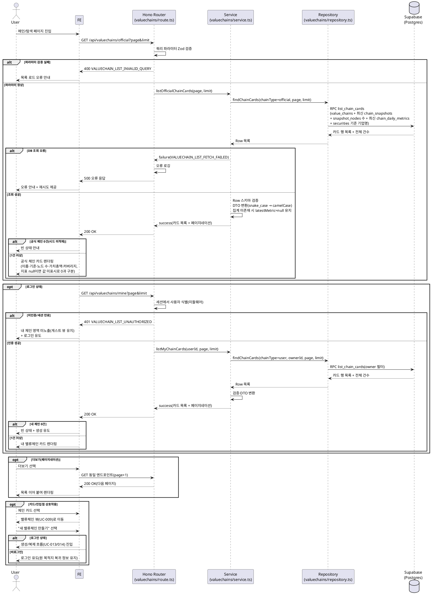

# UC-007: 메인/탐색 페이지 조회

> 근거: `docs/userflow.md` 007, `docs/prd.md` 3장(메인/탐색 페이지)·5장(IA), `docs/database.md` §3.3·§3.7·§4, `docs/techstack.md` §4·§7.
> 외부 서비스 연동 없음 — 화면 데이터는 전부 자체 DB(사전 집계 포함)에서 제공한다(외부 API는 배치 전용).

---

## Primary Actor

- Guest(비로그인 방문자) / User(로그인 사용자)

## Precondition (사용자 관점)

- 없음. 공개 페이지로 누구나 접근 가능하다.
- 단, "내 밸류체인" 목록은 로그인 상태인 경우에만 표시된다.

## Trigger

- 사용자가 서비스 루트 URL(`/`)로 진입하거나, 로고/홈 내비게이션으로 메인/탐색 페이지에 도달한다.

## Main Scenario

1. 사용자가 메인/탐색 페이지에 진입한다.
2. FE가 공식 밸류체인 목록 API(`GET /api/valuechains/official`)를 호출한다.
3. BE가 쿼리 파라미터(페이지네이션)를 검증하고, 보관되지 않은(`is_archived=false`) 공식 체인 목록을 조회한다. 각 체인에 대해:
   - 최신 스냅샷 기준 **노드 수**
   - 기준(산업 중심/기업 중심, 기업 중심이면 기준 기업명)
   - 사전 집계 테이블의 최신 일자 **가치총액(KRW)** + 커버리지(반영 n/전체 m) + 이월(carry-forward) 여부
   를 함께 반환한다.
4. FE가 공식 체인 카드 목록(이름·기준·노드 수·가치총액 요약)을 렌더링한다.
5. 로그인 상태이면 FE가 내 밸류체인 목록 API(`GET /api/valuechains/mine`)를 추가 호출하고, BE가 세션 검증 후 본인 소유 사용자 체인만 동일 카드 형태로 반환한다. FE는 "내 밸류체인" 섹션을 렌더링한다.
6. FE가 기업 통합 검색창(UC-008 진입점)과 "새 밸류체인 만들기" 진입점을 노출한다.
7. FE가 푸터에 면책 요약·정책 링크를 노출한다(UC-025 연계).
8. 사용자가 체인 카드를 선택하면 밸류체인 뷰(UC-009)로 이동한다.
9. 사용자가 "새 밸류체인 만들기"를 선택하면: 로그인 상태 → 생성/복제 흐름(UC-013/014) 진입, 비로그인 → 로그인 유도(로그인 후 원래 목적지 복귀).
10. 목록이 페이지당 상한(상수)을 초과하면 "더보기"로 다음 페이지를 이어서 로드한다.

## Edge Cases

| # | 상황 | 처리 |
|---|------|------|
| 1 | 공식 체인이 아직 없음(시드 미적재) | 빈 목록(200) 응답 → FE가 빈 상태 안내 표시 |
| 2 | 로그인 사용자의 내 체인 0개 | 빈 목록(200) 응답 → 빈 상태 + 생성 유도 표시 |
| 3 | 가치총액 집계값 미존재(집계 배치 미실행)/시세 장애 | `latestMetric=null`로 응답 → FE는 값 미표시 처리(**0과 명확히 구분**). 이월 집계값이면 `isCarriedForward=true`로 표기 |
| 4 | 비로그인 사용자의 "내 밸류체인" 영역 | FE는 영역 미노출(또는 로그인 유도 배너). BE는 `/mine` 무인증 호출을 401로 방어 |
| 5 | 목록 대량(1인당 체인 상한 근접 등) | 페이지당 상한(상수) 기준 페이지네이션 + 더보기 |
| 6 | 잘못된 페이지네이션 파라미터(음수·비숫자·상한 초과) | 400 `VALUECHAIN_LIST_INVALID_QUERY` → FE 오류 안내 |
| 7 | 세션 만료 상태에서 내 체인 호출 | 401 응답 → FE는 게스트 뷰로 전환(공식 목록은 유지) + 로그인 유도 |
| 8 | DB 조회 실패/응답 스키마 검증 실패 | 500 응답 → FE 오류 안내 + 재시도 제공(공식/내 체인 영역별 독립 오류 처리) |
| 9 | 스냅샷이 없는 체인(방어적 케이스 — 저장 1회=1스냅샷 원칙상 정상 발생 없음) | 노드 수 0으로 응답, 카드 정상 렌더링 |
| 10 | 비로그인 상태에서 "새 밸류체인 만들기" 클릭 | 로그인 페이지로 유도, 로그인 후 생성 흐름 복귀 |

## Business Rules

### 일반 규칙

- **조회 전용**: 본 기능은 어떤 데이터도 생성/변경하지 않는다(사이드이펙트 없음).
- **자체 DB 원칙**: 카드 요약 지표(가치총액)는 요청 시 계산하지 않고 배치(UC-029)가 사전 집계한 `chain_daily_metrics`의 최신 행에서만 읽는다. 외부 API 호출 금지.
- **노출 범위**: 공식 체인은 `chain_type='official'` AND `is_archived=false`만 노출. 내 체인은 `chain_type='user'` AND `owner_id=현재 사용자`만 노출(서버 측 세션 검증, RLS 미사용 — Hono 미들웨어 인가).
- **지표 표기**: 가치총액은 KRW 기준. 집계값 미존재는 `null`로 내려 0과 구분한다. 커버리지("반영 n/전체 m")와 이월 여부를 함께 제공한다.
- **페이지네이션**: 페이지당 건수는 상수로 관리(기본 20건, 하드코딩 금지)하며 "더보기" 방식으로 이어 붙인다.
- **노드 수 산정**: 체인별 최신 스냅샷(`effective_at` 최대)의 `snapshot_nodes` 건수.
- **로그인 유도**: 생성 진입점은 비로그인 시 로그인으로 유도하고, 로그인 후 원래 컨텍스트로 복귀한다(UC-002/003 연계).
- **푸터 면책**: 전 페이지 공통 규칙에 따라 면책 요약·정책 링크를 상시 노출(UC-025).

### API Specification

#### 1) 공식 밸류체인 목록

- **Endpoint**: `GET /api/valuechains/official`
- **인증**: 불필요(공개)
- **Query Parameters**:

  | 파라미터 | 타입 | 필수 | 설명 |
  |---|---|---|---|
  | `page` | integer (≥1) | 아니오 | 기본 1 |
  | `limit` | integer (1~상수 상한) | 아니오 | 기본: 페이지당 건수 상수(20) |

- **Response 200** (`ChainCardListResponse`):

  ```
  {
    items: ChainCard[],
    pagination: {
      page: number,
      limit: number,
      totalCount: number,
      hasMore: boolean
    }
  }

  ChainCard {
    id: string (uuid),
    name: string,
    chainType: "official" | "user",
    focusType: "industry" | "company",
    focusCompanyName: string | null,     // focusType=company일 때 기준 기업명
    nodeCount: number,                    // 최신 스냅샷 기준
    latestMetric: {
      metricDate: string (YYYY-MM-DD),
      totalMarketCapKrw: string,          // Postgres numeric 정밀도 보존을 위한 문자열
      coveredNodeCount: number,           // 커버리지 n
      totalNodeCount: number,             // 커버리지 m
      isCarriedForward: boolean           // 결측 이월 집계 여부
    } | null,                             // 집계 미존재/시세 장애 시 null (0과 구분)
    updatedAt: string (ISO 8601)
  }
  ```

- **Error Codes**:

  | 코드 | HTTP | 의미 |
  |---|---|---|
  | `VALUECHAIN_LIST_INVALID_QUERY` | 400 | 페이지네이션 파라미터 검증 실패 |
  | `VALUECHAIN_LIST_FETCH_FAILED` | 500 | DB 조회 실패 |
  | `VALUECHAIN_LIST_VALIDATION_ERROR` | 500 | Row/Response 스키마 검증 실패 |

#### 2) 내 밸류체인 목록

- **Endpoint**: `GET /api/valuechains/mine`
- **인증**: 필수(Supabase Auth 세션 — 미들웨어에서 사용자 식별)
- **Query Parameters**: 공식 목록과 동일(`page`, `limit`)
- **Response 200**: `ChainCardListResponse` 동일(단 `chainType="user"`)
- **Error Codes**:

  | 코드 | HTTP | 의미 |
  |---|---|---|
  | `VALUECHAIN_LIST_INVALID_QUERY` | 400 | 파라미터 검증 실패 |
  | `VALUECHAIN_LIST_UNAUTHORIZED` | 401 | 세션 없음/만료 |
  | `VALUECHAIN_LIST_FETCH_FAILED` | 500 | DB 조회 실패 |
  | `VALUECHAIN_LIST_VALIDATION_ERROR` | 500 | 스키마 검증 실패 |

> 구현 위치: `apps/web/src/features/valuechains/backend/`의 `route.ts`(HTTP 검증) → `service.ts`(비즈니스 로직·DTO 변환) → `repository.ts`(Supabase 접근) 계층을 따른다(techstack §4, hono-backend-guide).

### Database Operations

| 테이블/객체 | 연산 | 용도 |
|---|---|---|
| `value_chains` | SELECT | 공식(`chain_type='official'`, `is_archived=false`) / 내 체인(`chain_type='user'`, `owner_id=:userId`) 목록 + 전체 건수(count) |
| `chain_snapshots` | SELECT | 체인별 최신 스냅샷 1건(`ORDER BY effective_at DESC LIMIT 1`, LATERAL) |
| `snapshot_nodes` | SELECT | 최신 스냅샷의 노드 수 COUNT |
| `chain_daily_metrics` | SELECT | 체인별 최신 `metric_date` 1행(가치총액·커버리지·이월 여부) |
| `securities` | SELECT | `focus_security_id` → 기준 기업명(`name`) 조인(기업 중심 체인) |

- INSERT / UPDATE / DELETE: **없음** (조회 전용).
- 체인×최신 스냅샷×노드 수×최신 집계의 복합 조인은 techstack §7 원칙에 따라 **Postgres 함수(예: `list_chain_cards`)로 캡슐화**하고 repository에서 `client.rpc()`로 호출한다(N+1 방지). 함수 SQL은 마이그레이션에 포함해 SOT를 유지한다.

### External Service Integration

- **해당 없음.** 본 기능은 자체 DB 조회만 수행한다. 가치총액 등 지표의 원천이 되는 외부 API(토스증권/OpenDART/SEC EDGAR) 호출은 배치(UC-026~029) 책임이며 본 유스케이스 범위 밖이다.

---

## Sequence Diagram


