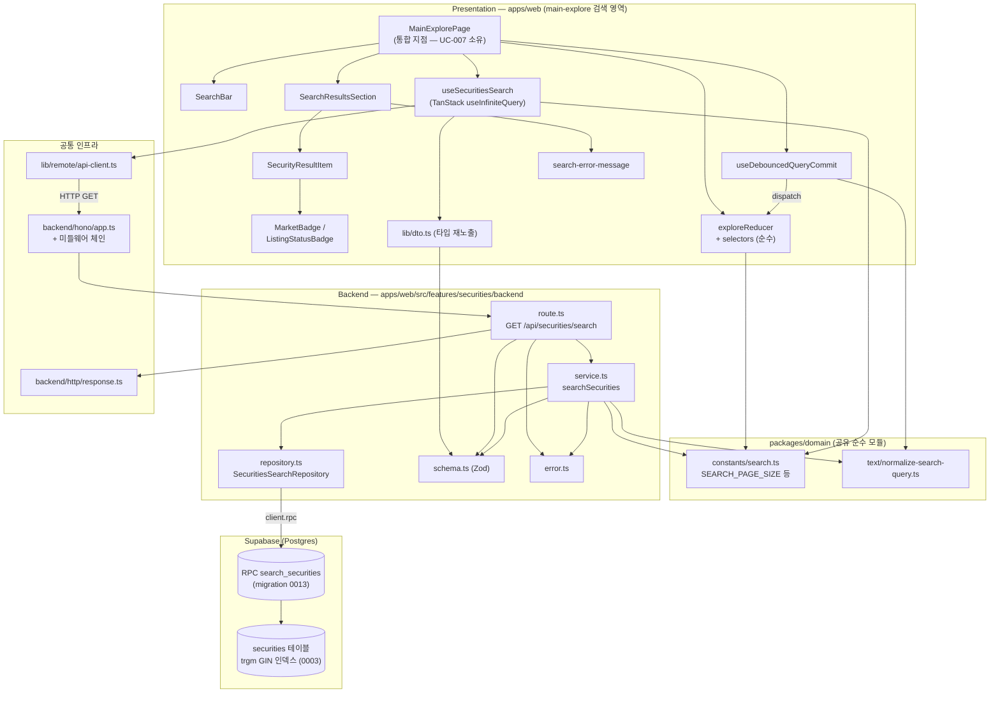

# Plan: UC-008 기업 통합 검색

> 근거: `docs/usecases/008/spec.md`, `docs/usecases/000_decisions.md`(B-3~B-7), `docs/techstack.md` §4·§7,
> `docs/database.md` 3.2·4.3, `docs/pages/main-explore/requirement.md`, `docs/pages/main-explore/state_management.md`,
> `.claude/skills/spec_to_plan/references/hono-backend-guide.md`, `supabase/migrations/0003_securities_master.sql`.
>
> **결정 반영 사항(spec과의 차이)**
> - 결정 B-5(폐지/정지 종목 노출 + 상태 배지)에 따라 응답 DTO에 `listingStatus`(`listed|suspended|delisted`)를 **추가**한다. spec의 Response Schema에는 없으나 `000_decisions.md`가 spec에 우선한다(main-explore requirement D7과 정합).
> - 결정 B-4: 최소 검색어 길이 `MIN_SEARCH_QUERY_LENGTH=1`, 디바운스 `SEARCH_DEBOUNCE_MS=300`.
> - 결정 B-7: MVP는 FE 디바운스만 — 서버 측 레이트 리밋은 **구현하지 않는다**. `TOO_MANY_REQUESTS` 에러 코드 상수만 예약 정의하고 FE 오류 매핑에 방어적으로 포함한다.
> - 결정 B-6: 결과 항목 선택 시 `/companies/[ticker]` 라우팅.
> - 런타임 외부 서비스 연동 **없음**(조회 전용, 자체 DB만). 종목 마스터 적재는 UC-027/031 배치 plan의 책임이므로 본 plan 범위 외.

---

## 개요

### A. 공통/선행 모듈 (다른 유스케이스 plan과 공유 — 이미 존재하면 재사용, 없으면 본 plan에서 최초 1회 생성)

| 모듈 | 위치 | 설명 |
| --- | --- | --- |
| Hono 앱 뼈대(공통) | `apps/web/src/backend/hono/app.ts`, `apps/web/src/backend/hono/context.ts` | 싱글턴 Hono 앱, `AppEnv`/`getSupabase`/`getLogger`. 미들웨어 체인(errorBoundary → withAppContext → withSupabase) 등록. hono-backend-guide 컨벤션 |
| HTTP 응답 헬퍼(공통) | `apps/web/src/backend/http/response.ts` | `success()`/`failure()`/`respond()` + `HandlerResult<T, E, M>` 패턴 |
| 공통 미들웨어 | `apps/web/src/backend/middleware/{error.ts,context.ts,supabase.ts}` | errorBoundary, withAppContext(config/logger 주입), withSupabase(service-role 클라이언트 주입) |
| Hono 진입점(공통) | `apps/web/src/app/api/[[...hono]]/route.ts` | Next.js catch-all Route Handler, `runtime='nodejs'` |
| API 클라이언트(공통) | `apps/web/src/lib/remote/api-client.ts` | fetch 기반 공용 HTTP 유틸(baseURL `/api`, JSON 파싱, `ErrorResult` 정규화). FE 훅 전체가 공유 |
| 검색 상수(공통) | `packages/domain/constants/search.ts` | `SEARCH_PAGE_SIZE=20`, `MIN_SEARCH_QUERY_LENGTH=1`, `SEARCH_DEBOUNCE_MS=300` — FE/BE 공용, 하드코딩 금지. `CHAIN_LIST_PAGE_SIZE`(UC-007)와 분리된 독립 상수(결정 B-3) |
| 검색어 정규화(공통) | `packages/domain/text/normalize-search-query.ts` | `normalizeSearchQuery(raw): string` 순수 함수(NFKC 전각→반각 + trim). FE 디바운스 커밋과 BE service가 동일 구현 공유(DRY) |

### B. Database

| 모듈 | 위치 | 설명 |
| --- | --- | --- |
| 검색 RPC 함수 마이그레이션 | `supabase/migrations/0013_search_securities_function.sql` | `search_securities(p_query, p_limit, p_offset, p_market)` Postgres 함수. 정확>접두>부분 정렬은 `ORDER BY CASE`라 supabase-js 쿼리빌더로 표현 불가 → techstack §7 규칙(복잡 쿼리는 함수/뷰 + `client.rpc`)에 따라 SQL을 마이그레이션에 SOT로 보관 |

### C. Backend — `apps/web/src/features/securities/backend/`

| 모듈 | 위치 | 설명 |
| --- | --- | --- |
| Zod 스키마 | `apps/web/src/features/securities/backend/schema.ts` | Request(Query)/Row/Response 스키마 및 타입 정의 |
| 에러 코드 | `apps/web/src/features/securities/backend/error.ts` | `INVALID_QUERY`, `SEARCH_FAILED`, `SEARCH_VALIDATION_ERROR`(+`TOO_MANY_REQUESTS` 예약) |
| Repository | `apps/web/src/features/securities/backend/repository.ts` | Supabase `rpc('search_securities')` 호출 캡슐화(Persistence). 인터페이스 + 구현 팩토리 |
| Service | `apps/web/src/features/securities/backend/service.ts` | 정규화·최소길이 재검증·페이지 산식·Row 검증·DTO 변환·hasMore 산출(순수 비즈니스 로직, repository 인터페이스에만 의존) |
| Route | `apps/web/src/features/securities/backend/route.ts` | `GET /securities/search` — 쿼리 파라미터 Zod 검증, service 호출, 에러 로깅, `respond()` |
| 라우터 등록(수정) | `apps/web/src/backend/hono/app.ts` | `registerSecuritiesRoutes(app)` 1줄 추가 |

### D. Frontend — 검색 UI (main-explore 페이지 내 검색 영역, `state_management.md` 설계 준수)

| 모듈 | 위치 | 설명 |
| --- | --- | --- |
| DTO 재노출 | `apps/web/src/features/securities/lib/dto.ts` | backend `schema.ts`의 Response 타입을 FE용으로 재수출(FE가 backend 내부 경로에 직접 의존하지 않도록 경계 제공) |
| 검색 쿼리 훅 | `apps/web/src/features/securities/hooks/useSecuritiesSearch.ts` | `useInfiniteQuery` — 쿼리 키 `['securities','search',{query,market}]`, `enabled` 옵션, `getNextPageParam` |
| 페이지 상태 reducer | `apps/web/src/features/explore/state/exploreReducer.ts` | `ExplorePageState`/`ExploreAction`/`exploreReducer`/`EXPLORE_INITIAL_STATE` + 셀렉터 2종 — React 비의존 순수 모듈. 본 유스케이스(검색) 상태 3종이 전부이므로 본 plan이 정의(UC-007 plan은 참조만) |
| 디바운스 커밋 훅 | `apps/web/src/features/explore/hooks/useDebouncedQueryCommit.ts` | 입력 감시 → 300ms 후 정규화 → `SEARCH_QUERY_COMMITTED` dispatch(시간 사이드이펙트 전담) |
| SearchBar | `apps/web/src/features/explore/components/SearchBar.tsx` | 검색 입력 + 시장 필터 탭(전체/KRX/US) + 지우기(X) + "검색 미실행" 안내 — Presenter(로직 없음) |
| SearchResultsSection | `apps/web/src/features/securities/components/SearchResultsSection.tsx` | 결과 목록/로딩/빈 결과/오류+재시도/더보기 — Presenter |
| SecurityResultItem | `apps/web/src/features/securities/components/SecurityResultItem.tsx` | 종목명·티커·시장 배지·상태 배지 1행 — Presenter |
| 배지 컴포넌트 | `apps/web/src/features/securities/components/SecurityBadges.tsx` | `MarketBadge`(KRX/US), `ListingStatusBadge`(정지/폐지만 표기) — UC-020 기업 상세에서 재사용 예정(공통 후보) |
| 오류 메시지 매핑 | `apps/web/src/features/securities/lib/search-error-message.ts` | 에러 코드 → 사용자 문구 순수 매핑(`INVALID_QUERY`/`TOO_MANY_REQUESTS`/기본 오류) |
| 페이지 통합 지점 | `apps/web/src/features/explore/components/MainExplorePage.tsx` (UC-007 소유) | reducer 소유·훅 연결·핸들러 wiring. **본 plan은 연결 계약만 명시**하고 페이지 셸 구현은 UC-007 plan 책임 — 수정 충돌 없음 |

---

## Diagram



---

## Implementation Plan

### 0. 공통/선행 모듈 (Hono 뼈대·response 헬퍼·미들웨어·api-client)

- 구현 내용:
  1. **이미 존재하면 그대로 재사용하고 이 단계 전체를 건너뛴다** (다른 유스케이스 plan과 공유되는 인프라 — 중복 생성 금지).
  2. 없을 경우 hono-backend-guide 컨벤션 그대로 생성:
     - `backend/http/response.ts`: `HandlerResult<T, E, M>`, `success(data, status?)`, `failure(status, code, message, details?)`, `respond(c, result)`.
     - `backend/middleware/error.ts`(errorBoundary — 미처리 예외를 500 응답으로 변환+로깅), `context.ts`(withAppContext — config/logger 주입), `supabase.ts`(withSupabase — **service-role 키**로 서버 전용 클라이언트 생성·주입).
     - `backend/hono/context.ts`: `AppEnv`, `getSupabase(c)`, `getLogger(c)`.
     - `backend/hono/app.ts`: 싱글턴 `createHonoApp()` — 미들웨어 체인 순서 고수(errorBoundary → withAppContext → withSupabase), basePath `/api`.
     - `app/api/[[...hono]]/route.ts`: `runtime='nodejs'`, GET/POST 등 메서드를 Hono 앱에 위임.
     - `lib/remote/api-client.ts`: fetch 래퍼 — 쿼리스트링 직렬화, JSON 파싱, 비 2xx 시 `{ status, error: { code, message } }` 형태로 정규화하여 reject. 타임아웃(상수, AbortController) 포함.
  3. 환경변수는 기존 공통 항목만 사용(`NEXT_PUBLIC_SUPABASE_URL`, `SUPABASE_SERVICE_ROLE_KEY`) — **본 유스케이스 신규 환경변수 없음**, 하드코딩 금지.
- 의존성: 없음(최우선 선행).

**Unit Tests (`response.ts` 한정 — 나머지는 통합 테스트 영역):**

- [ ] `success(data)` → `{ ok: true, status: 200, data }` 형태 반환
- [ ] `failure(400, 'X', 'msg', details)` → `{ ok: false, status: 400, error: { code, message, details } }` 형태 반환
- [ ] `respond()`가 result의 status를 HTTP 상태 코드로 그대로 사용

---

### 1. 도메인 상수 — `packages/domain/constants/search.ts`

- 구현 내용:
  1. `export const SEARCH_PAGE_SIZE = 20;` (UC-008, 결정 B-3에 따라 `CHAIN_LIST_PAGE_SIZE`와 **별도 상수**)
  2. `export const MIN_SEARCH_QUERY_LENGTH = 1;` (결정 B-4)
  3. `export const SEARCH_DEBOUNCE_MS = 300;` (결정 B-4)
  4. `packages/domain/constants/index.ts` 배럴에서 재수출. 프레임워크 의존성 없음.
- 의존성: 없음.
- Unit Tests: 해당 없음(상수 정의).

### 2. 검색어 정규화 — `packages/domain/text/normalize-search-query.ts`

- 구현 내용:
  1. `export function normalizeSearchQuery(raw: string): string` — 순수 함수.
  2. 처리: ① Unicode NFKC 정규화(전각 영숫자·전각 공백 → 반각), ② `trim()`(U+3000 포함 앞뒤 공백 제거). 대소문자 변환은 하지 않는다(대소문자 무시 매칭은 서버 `ILIKE` 책임 — state_management.md와 정합).
  3. FE(`useDebouncedQueryCommit`)와 BE(`service.ts`)가 **동일 함수를 공유**(DRY — 정규화 이중 구현 금지).
- 의존성: 없음.

**Unit Tests:**

- [ ] `normalizeSearchQuery('  삼성전자  ')` → `'삼성전자'`
- [ ] `normalizeSearchQuery('　ＳＡＭＳＵＮＧ　')`(전각 공백+전각 영문) → `'SAMSUNG'`
- [ ] `normalizeSearchQuery('   ')`(공백만) → `''`
- [ ] `normalizeSearchQuery('AAPL')` → `'AAPL'` (대소문자 보존 — 소문자화하지 않음)
- [ ] `normalizeSearchQuery('')` → `''`

---

### 3. 마이그레이션 — `supabase/migrations/0013_search_securities_function.sql`

- 구현 내용:
  1. `CREATE OR REPLACE FUNCTION search_securities(p_query text, p_limit integer, p_offset integer, p_market market_code DEFAULT NULL)`(DEFAULT 파라미터는 맨 뒤 — SQL 문법 제약) — `RETURNS TABLE (id uuid, ticker text, name text, english_name text, market market_code, listing_status listing_status)`, `LANGUAGE sql STABLE`, `SET search_path = public, extensions`. `CREATE OR REPLACE`로 멱등성 보장(저장소 SQL 가이드라인).
  2. 본문은 `docs/database.md` 4.3 쿼리를 그대로 함수화하되 다음을 보강:
     - **ILIKE 와일드카드 이스케이프**: `p_query`의 `\`, `%`, `_`를 이스케이프한 값으로 `'%' || escaped || '%'` 패턴 구성(부분/접두 일치용). 정확 일치 비교(`lower(컬럼) = lower(p_query)`)는 원값 사용. 이스케이프를 함수 내부에 두어 SOT 단일화(레포지토리/서비스에서 재구현 금지).
     - **WHERE**: `(p_market IS NULL OR market = p_market) AND (ticker ILIKE 패턴 OR name ILIKE 패턴 OR english_name ILIKE 패턴)` — `english_name`은 NULL 가능(ILIKE의 NULL은 자동 불일치). `listing_status` 필터 없음(결정 B-5: 폐지/정지도 노출).
     - **ORDER BY**: `CASE`(정확=0 / 접두=1 / 부분=2) → `name ASC` → `ticker ASC`(동일 종목명이 시장 간 중복될 때 결정적 정렬 보장을 위한 안정화 키 추가 — database.md 4.3의 의도 유지).
     - **LIMIT `p_limit` OFFSET `p_offset`** — hasMore 산출을 위해 호출측(repository)이 `pageSize + 1`을 limit으로 전달하는 계약(COUNT 쿼리 불필요).
  3. 트라이그램 GIN 인덱스(0001·0003 기적용)가 부분 일치를 지원하므로 **본 마이그레이션에서 테이블/인덱스 변경 없음** → 기존 0001~0012와 충돌 없음.
  4. 적용은 `mcp__supabase__apply_migration`(로컬 Supabase 실행 금지 — techstack §7). 적용 후 `generate_typescript_types`로 `packages/domain/types/database.ts` 재생성.
- 의존성: 0001(pg_trgm), 0003(securities) — 기적용 완료.

**Unit Tests (적용 후 SQL 레벨 검증 — `execute_sql`로 시드 삽입 후 확인):**

- [ ] `q='삼성'` — name 접두 일치 종목이 부분 일치 종목보다 먼저 반환
- [ ] `q='005930'` — ticker 정확 일치가 rank 0으로 최상단
- [ ] `q='samsung'` — `english_name` 대소문자 무시 매칭
- [ ] `p_market='KRX'` 지정 시 US 종목 미포함, `NULL`이면 양 시장 포함
- [ ] `q='100%'` 같은 와일드카드 포함 검색어가 리터럴로 매칭됨(전건 매칭으로 폭주하지 않음)
- [ ] `p_limit=21, p_offset=0` → 최대 21행 반환(hasMore 계약), `p_offset=20` → 2페이지 구간 반환
- [ ] 매칭 0건 → 빈 결과(에러 아님)
- [ ] `listing_status='delisted'` 종목도 결과에 포함(결정 B-5)

---

### 4. Zod 스키마 — `apps/web/src/features/securities/backend/schema.ts`

- 구현 내용:
  1. **Request(Query) 스키마** `SecuritySearchQuerySchema`:
     - `q: z.string().min(1)` — 원본 존재 검증(정규화·최소길이 재검증은 service 책임, spec 시퀀스 준수)
     - `market: z.enum(['KRX', 'US']).optional()`
     - `page: z.coerce.number().int().min(1).default(1)` (쿼리스트링은 문자열이므로 coerce)
  2. **Row 스키마** `SecuritySearchRowSchema`(snake_case — RPC 반환 컬럼과 1:1):
     `{ id: uuid, ticker: string, name: string, english_name: string.nullable, market: enum(KRX|US), listing_status: enum(listed|suspended|delisted) }`
  3. **Response 스키마**(camelCase):
     - `SecuritySearchItemSchema`: `{ id, ticker, name, englishName: nullable, market, listingStatus }` — `listingStatus`는 결정 B-5 반영(본 문서 상단 결정 반영 사항 참조)
     - `SecuritySearchResponseSchema`: `{ items: array(Item), page: number, pageSize: number, hasMore: boolean }`
  4. 모든 타입 `z.infer`로 export. 마이그레이션 0003/0013의 컬럼 타입과 일치 확인.
- 의존성: 없음.
- Unit Tests: 해당 없음(스키마 정의 — service 테스트에서 간접 검증).

### 5. 에러 코드 — `apps/web/src/features/securities/backend/error.ts`

- 구현 내용:
  ```
  securitiesSearchErrorCodes = {
    invalidQuery: 'INVALID_QUERY',              // 400
    searchFailed: 'SEARCH_FAILED',              // 500 (DB 조회 실패)
    validationError: 'SEARCH_VALIDATION_ERROR', // 500 (Row/DTO 검증 실패)
    tooManyRequests: 'TOO_MANY_REQUESTS',       // 429 — 결정 B-7로 MVP 미사용, 예약만
  } as const
  ```
  `SecuritiesSearchServiceError` 타입 export.
- 의존성: 없음.
- Unit Tests: 해당 없음(상수 정의).

### 6. Repository — `apps/web/src/features/securities/backend/repository.ts`

- 구현 내용:
  1. **인터페이스(계약)**와 **구현**을 한 파일에 분리 정의(techstack §4: service는 인터페이스에만 의존):
     ```
     interface SecuritiesSearchRepository {
       searchByText(params: {
         query: string;             // 정규화 완료된 검색어
         market: 'KRX' | 'US' | null;
         limit: number;             // service가 pageSize+1 전달
         offset: number;
       }): Promise<
         | { ok: true; rows: unknown[] }
         | { ok: false; message: string }
       >;
     }
     ```
  2. `createSecuritiesSearchRepository(client: SupabaseClient): SecuritiesSearchRepository` — `client.rpc('search_securities', { p_query, p_limit, p_offset, p_market })` 호출. `market=null`이면 `p_market: null` 전달.
  3. Supabase error 발생 시 예외를 던지지 않고 `{ ok: false, message }` 반환(에러는 값으로 — 가이드라인). rows는 `unknown[]`로 반환하고 **Zod 검증은 service 책임**(계층 책임 분리).
  4. RPC 함수명·파라미터명은 파일 상단 상수로 관리(하드코딩 금지).
- 의존성: 모듈 3(RPC 함수).

**Unit Tests (SupabaseClient mock):**

- [ ] `market=null` → `p_market: null`, `market='KRX'` → `p_market: 'KRX'`로 rpc 파라미터 매핑
- [ ] `limit/offset`이 `p_limit/p_offset`으로 그대로 전달
- [ ] rpc 성공(`{ data, error: null }`) → `{ ok: true, rows: data }`
- [ ] rpc 실패(`{ data: null, error }`) → `{ ok: false, message: error.message }` (예외 미발생)
- [ ] `data: null`이며 error 없음(빈 결과) → `{ ok: true, rows: [] }`로 정규화

### 7. Service — `apps/web/src/features/securities/backend/service.ts`

- 구현 내용:
  1. 시그니처:
     ```
     searchSecurities(
       repository: SecuritiesSearchRepository,
       input: SecuritySearchQuery,   // route에서 Zod 검증 완료된 값
     ): Promise<HandlerResult<SecuritySearchResponse, SecuritiesSearchServiceError, unknown>>
     ```
     `SupabaseClient`를 직접 받지 않는다(repository 인터페이스에만 의존 — 퍼시스턴스 분리).
  2. 처리 순서:
     1. `normalizeSearchQuery(input.q)` (packages/domain 공유 함수)
     2. 정규화 결과 길이 < `MIN_SEARCH_QUERY_LENGTH` → `failure(400, invalidQuery, ...)` (우회 호출 방어 — spec Edge Case)
     3. `offset = (page - 1) * SEARCH_PAGE_SIZE`, `limit = SEARCH_PAGE_SIZE + 1`로 `repository.searchByText()` 호출
     4. repository 실패 → `failure(500, searchFailed, message)`
     5. `hasMore = rows.length > SEARCH_PAGE_SIZE`, 초과분 1행 절단(slice)
     6. 각 행 `SecuritySearchRowSchema.safeParse` — 실패 시 `failure(500, validationError, ..., details)`
     7. snake_case → camelCase DTO 매핑(`english_name→englishName`, `listing_status→listingStatus`)
     8. `SecuritySearchResponseSchema.safeParse`로 응답 검증 → `success({ items, page, pageSize: SEARCH_PAGE_SIZE, hasMore })`
  3. 사이드이펙트 없음(SELECT 전용), 로깅 없음(로깅은 route 책임).
- 의존성: 모듈 1, 2, 4, 5, 6, 공통 `response.ts`.

**Unit Tests (repository mock — DB 불필요):**

- [ ] 정상: 20행 + hasMore 판단용 1행(총 21행) 반환 시 → `items.length=20`, `hasMore=true`, `pageSize=20`
- [ ] 정상: 5행 반환 → `items.length=5`, `hasMore=false`
- [ ] 정상: 0행 → `items: []`, `hasMore=false`, **success**(빈 결과는 오류 아님)
- [ ] `page=3` → repository에 `offset=40, limit=21` 전달(산식 검증)
- [ ] `q='　ＡＡＰＬ　'`(전각) → repository에 정규화된 `'AAPL'` 전달
- [ ] 공백만 입력(`q='   '`) → `failure(400, INVALID_QUERY)` + repository **미호출**
- [ ] repository `{ ok: false }` → `failure(500, SEARCH_FAILED)`
- [ ] Row 스키마 위반(예: `market: 'JP'`) → `failure(500, SEARCH_VALIDATION_ERROR)`
- [ ] snake→camel 매핑 정확성: `english_name: null` → `englishName: null`, `listing_status: 'suspended'` → `listingStatus: 'suspended'`
- [ ] `market='KRX'` 입력 시 repository에 `market: 'KRX'`, 미지정 시 `null` 전달

### 8. Route — `apps/web/src/features/securities/backend/route.ts`

- 구현 내용:
  1. `export const registerSecuritiesRoutes = (app: Hono<AppEnv>) => { app.get('/securities/search', ...) }`
  2. 핸들러: ① `c.req.query()`를 `SecuritySearchQuerySchema.safeParse` → 실패 시 `respond(c, failure(400, 'INVALID_QUERY', ..., error.format()))` ② `getSupabase(c)`로 repository 생성 ③ `searchSecurities(repository, parsed.data)` 호출 ④ `!result.ok`이고 status ≥ 500이면 `getLogger(c).error(...)` 로깅 ⑤ `respond(c, result)`.
  3. 인증/인가 검사 없음(공개 API — 공통 미들웨어 체인만 통과).
  4. HTTP 개념(쿼리 파싱·상태 코드 응답)만 다루고 비즈니스 로직 없음.
- 의존성: 모듈 4, 5, 6, 7, 공통 모듈 0.

**QA Sheet (API 계약 검증):**

| # | 시나리오 | 기대 결과 |
| --- | --- | --- |
| 1 | `GET /api/securities/search?q=삼성` | 200, `items[]` 정렬(정확>접두>부분), `page=1`, `pageSize=20` |
| 2 | `q` 누락 | 400 `INVALID_QUERY` + Zod 상세 |
| 3 | `q=` (빈 값) / `q=%20%20`(공백만) | 400 `INVALID_QUERY` |
| 4 | `market=JP` (잘못된 enum) | 400 `INVALID_QUERY` |
| 5 | `page=0`, `page=abc`, `page=1.5` | 400 `INVALID_QUERY` |
| 6 | `page` 미지정 | 200, `page=1`로 동작 |
| 7 | `q=zzzzzz없는종목` | 200, `items: []`, `hasMore=false` (오류 아님) |
| 8 | `market=KRX` 지정 | KRX 종목만 반환, 각 item `market='KRX'` |
| 9 | 매칭 21건 이상일 때 `page=1` → `page=2` 연속 호출 | 1페이지 `hasMore=true`·20건, 2페이지에 이어지는 항목·중복 없음 |
| 10 | DB 장애 시뮬레이션(RPC 실패) | 500 `SEARCH_FAILED` + 서버 로그 기록 |
| 11 | 비로그인(쿠키 없음) 호출 | 200 정상(공개 API) |
| 12 | 응답 바디 | `SecuritySearchResponseSchema`와 일치(camelCase, `listingStatus` 포함) |

### 9. 라우터 등록 — `apps/web/src/backend/hono/app.ts` (수정)

- 구현 내용: `registerSecuritiesRoutes(app)` 1줄 추가(기존 등록 라우트 뒤). 미들웨어 체인 순서 불변.
- 의존성: 모듈 0, 8.
- QA: `/api/securities/search` 접근 가능, 기존 다른 feature 라우트와 경로 충돌 없음.

---

### 10. DTO 재노출 — `apps/web/src/features/securities/lib/dto.ts`

- 구현 내용: `backend/schema.ts`의 `SecuritySearchItem`, `SecuritySearchResponse` **타입만** 재수출(FE 컴포넌트·훅이 backend 디렉토리 경로에 직접 의존하지 않도록 경계 모듈 제공). 런타임 코드 없음.
- 의존성: 모듈 4.
- Unit Tests: 해당 없음(타입 재수출).

### 11. 검색 쿼리 훅 — `apps/web/src/features/securities/hooks/useSecuritiesSearch.ts`

- 구현 내용:
  1. 시그니처(state_management.md §6 계약 그대로):
     ```
     useSecuritiesSearch(
       params: { query: string; market: MarketFilter },   // 'ALL' | 'KRX' | 'US'
       options: { enabled: boolean },
     ): UseInfiniteQueryResult<InfiniteData<SecuritySearchResponse>>
     ```
  2. 쿼리 키: `['securities', 'search', { query, market }]` — 검색어/필터 변경 시 키 변경으로 누적 페이지 자동 초기화.
  3. `queryFn`: api-client로 `GET /api/securities/search?q&market&page` — `market='ALL'`이면 `market` 파라미터 **미전송**(전체). `pageParam` 초기값 1.
  4. `getNextPageParam: (last) => last.hasMore ? last.page + 1 : undefined`.
  5. `enabled: options.enabled` — 최소 길이 미만 시 **API 호출 자체가 발생하지 않음** 보장(spec Edge Case의 FE 미호출).
  6. `'use client'` 훅 — 비즈니스 로직 없음(서버 상태 연결만).
- 의존성: 모듈 0(api-client), 1, 10.

**Unit Tests (QueryClient 래퍼 + fetch mock):**

- [ ] `enabled=false`면 fetch 미호출
- [ ] `market='ALL'` → 요청 URL에 `market` 파라미터 없음, `'KRX'` → `market=KRX` 포함
- [ ] `hasMore=true` 응답 후 `fetchNextPage()` → `page=2`로 재요청
- [ ] `hasMore=false` → `hasNextPage=false`
- [ ] query/market 변경 → 새 쿼리 키로 1페이지부터 요청

### 12. 페이지 상태 reducer — `apps/web/src/features/explore/state/exploreReducer.ts`

- 구현 내용: `docs/pages/main-explore/state_management.md` §4·§5를 **그대로** 구현(본 plan이 SOT 구현 담당, UC-007 plan은 이 모듈을 참조만 한다 — 중복 정의 금지).
  1. `ExplorePageState { searchInput, submittedQuery, marketFilter }`, `EXPLORE_INITIAL_STATE`, `MarketFilter` 타입.
  2. `ExploreAction` 4종: `SEARCH_INPUT_CHANGED` / `SEARCH_QUERY_COMMITTED` / `SEARCH_MARKET_FILTER_CHANGED` / `SEARCH_CLEARED`.
  3. `exploreReducer` — 순수 함수, 불변 갱신, 상태 전이는 state_management.md 표와 동일(`SEARCH_CLEARED`는 초기 상태 전체 복귀).
  4. 셀렉터: `selectIsSearchActive` (`submittedQuery.length >= MIN_SEARCH_QUERY_LENGTH`), `selectShowTooShortNotice` (원본 입력 존재 && 정규화 결과 최소 길이 미만 — `normalizeSearchQuery` 사용).
  5. React 비의존 순수 모듈(디바운스 타이머·라우팅 등 사이드이펙트 금지).
- 의존성: 모듈 1, 2.

**Unit Tests (state_management.md §9 표 전체 — 렌더링 없이 검증):**

- [ ] 초기 상태에서 `SEARCH_INPUT_CHANGED('삼성')` → `searchInput='삼성'`, 나머지 초기값 유지
- [ ] `SEARCH_QUERY_COMMITTED('삼성')` → `submittedQuery='삼성'`, `searchInput` 불변
- [ ] `SEARCH_QUERY_COMMITTED('')` → `submittedQuery=''` → `selectIsSearchActive=false`
- [ ] `SEARCH_MARKET_FILTER_CHANGED('US')` → `marketFilter='US'`, 검색어 필드 불변
- [ ] 임의 상태에서 `SEARCH_CLEARED` → `EXPLORE_INITIAL_STATE`와 동등
- [ ] 모든 액션에서 원본 state 객체 비변이(새 객체 반환)
- [ ] `selectShowTooShortNotice({ searchInput: '  ', submittedQuery: '', ... })` → `true`
- [ ] `selectShowTooShortNotice({ searchInput: '삼', ... })` → `false` (1자는 유효 — 결정 B-4)

### 13. 디바운스 커밋 훅 — `apps/web/src/features/explore/hooks/useDebouncedQueryCommit.ts`

- 구현 내용:
  1. `useDebouncedQueryCommit(searchInput: string, dispatch: Dispatch<ExploreAction>): void`
  2. `searchInput` 변경 감시 → `SEARCH_DEBOUNCE_MS`(300) 타이머 시작, 재변경 시 기존 타이머 취소 후 재시작.
  3. 만료 시 `normalizeSearchQuery(searchInput)` 결과로 `SEARCH_QUERY_COMMITTED` dispatch(정규화는 dispatch **이전** 이펙트 계층 수행 — reducer 순수성 유지).
  4. 언마운트 시 타이머 정리(cleanup).
- 의존성: 모듈 1, 2, 12.

**Unit Tests (fake timers):**

- [ ] 입력 후 300ms 경과 → `SEARCH_QUERY_COMMITTED` 1회 dispatch, payload는 정규화값
- [ ] 300ms 내 재입력 → 타이머 재시작, 최종 입력 기준 1회만 dispatch
- [ ] 299ms 시점 dispatch 미발생
- [ ] 언마운트 후 타이머 만료 → dispatch 미발생
- [ ] `'  '` 입력 커밋 → payload `''`(정규화 결과)

### 14. SearchBar — `apps/web/src/features/explore/components/SearchBar.tsx`

- 구현 내용:
  1. Presenter 컴포넌트(`'use client'`) — props: `{ value, marketFilter, showTooShortNotice, onInputChange, onFilterChange, onClear }` (state_management.md §7 인터페이스 그대로). dispatch·Action 타입을 모른다.
  2. 구성: 검색 입력(제어 컴포넌트, shadcn `Input`) + 시장 필터 탭(전체/KRX/US, shadcn `Tabs` 또는 `ToggleGroup`) + 입력 존재 시 지우기(X) 버튼 + `showTooShortNotice=true` 시 "검색 미실행" 안내 문구.
  3. 접근성: 검색 input `aria-label`, 필터 탭 키보드 조작. 반응형(모바일 폭 대응).
  4. 필요 shadcn 컴포넌트 미설치 시 설치 명령 안내: `npx shadcn@latest add input tabs button badge`.
- 의존성: 모듈 12(타입만).

**QA Sheet:**

| # | 시나리오 | 기대 결과 |
| --- | --- | --- |
| 1 | 검색창 타이핑 | 입력값 즉시 반영(`onInputChange` 매 입력 호출) |
| 2 | 공백만 입력 후 300ms 대기 | "검색 미실행" 안내 표시, 결과 패널 미표시 |
| 3 | "삼성" 입력 후 300ms 대기 | 안내 미표시(1자 이상 유효) |
| 4 | 시장 필터 탭 클릭(전체→KRX) | 활성 탭 시각 변경 + `onFilterChange('KRX')` 호출 |
| 5 | 입력 존재 시 | X(지우기) 버튼 노출 |
| 6 | X 클릭 | `onClear` 호출(입력·필터 초기화는 상위 책임) |
| 7 | 입력 없음 | X 버튼 미노출 |
| 8 | 모바일 폭(375px) | 입력/탭 줄바꿈 등 레이아웃 깨짐 없음 |

### 15. SecurityBadges — `apps/web/src/features/securities/components/SecurityBadges.tsx`

- 구현 내용:
  1. `MarketBadge({ market: 'KRX' | 'US' })` — 시장 배지(색상 구분, shadcn `Badge`).
  2. `ListingStatusBadge({ status: 'listed' | 'suspended' | 'delisted' })` — `listed`는 **렌더링 없음**(null 반환), `suspended`="거래정지", `delisted`="상장폐지" 배지(결정 B-5). 라벨 매핑은 컴포넌트 내 상수 객체로 관리.
  3. 순수 Presenter — UC-020(기업 상세) plan에서 재사용 예정(공통 후보로 명시, 이동 시 위치만 변경).
- 의존성: 없음(shadcn `Badge`).

**QA Sheet:**

| # | 시나리오 | 기대 결과 |
| --- | --- | --- |
| 1 | `market='KRX'` / `'US'` | 각각 구분되는 배지 렌더링 |
| 2 | `status='listed'` | 아무것도 렌더링하지 않음 |
| 3 | `status='suspended'` | "거래정지" 배지 |
| 4 | `status='delisted'` | "상장폐지" 배지 |

### 16. SecurityResultItem — `apps/web/src/features/securities/components/SecurityResultItem.tsx`

- 구현 내용:
  1. props: `{ item: SecuritySearchItem, onSelect: (ticker: string) => void }` — Presenter, 라우팅 로직 없음(콜백만).
  2. 표기: 종목명(`name`) + 티커 + `englishName`(존재 시 보조 표기) + `MarketBadge` + `ListingStatusBadge`.
  3. 행 전체 클릭/Enter 시 `onSelect(item.ticker)` 호출(키보드 접근성 포함).
- 의존성: 모듈 10, 15.

**QA Sheet:**

| # | 시나리오 | 기대 결과 |
| --- | --- | --- |
| 1 | 일반 상장 종목 | 종목명·티커·시장 배지 표시, 상태 배지 없음 |
| 2 | `englishName=null` | 영문명 영역 미표시(레이아웃 깨짐 없음) |
| 3 | 폐지 종목 | "상장폐지" 배지 병기 |
| 4 | 클릭 / Enter 키 | `onSelect(ticker)` 1회 호출 |
| 5 | 동일 종목명 KRX/US 중복 | 두 행 모두 표시되고 시장 배지로 구분 가능 |

### 17. SearchResultsSection — `apps/web/src/features/securities/components/SearchResultsSection.tsx`

- 구현 내용:
  1. props(state_management.md §7 그대로): `{ items, isPending, isError, hasNextPage, isFetchingNextPage, onLoadMore, onRetry, onSelect }` (+ 오류 코드 전달용 `errorCode?: string`).
  2. 분기 렌더링(상태 아님 — 전부 props 파생): 로딩 스켈레톤 → 결과 목록(`SecurityResultItem`) / 빈 결과 안내("검색 결과가 없습니다" — 오류와 문구·스타일 구분) / 오류 안내 + 재시도 버튼.
  3. 오류 문구는 `search-error-message.ts` 매핑 사용(`INVALID_QUERY`→입력 확인 안내, `TOO_MANY_REQUESTS`→잠시 후 재시도, 기타→일반 오류+재시도).
  4. `hasNextPage=true`면 "더보기" 버튼, `isFetchingNextPage` 동안 버튼 로딩 표시.
- 의존성: 모듈 10, 16, 18.

**QA Sheet:**

| # | 시나리오 | 기대 결과 |
| --- | --- | --- |
| 1 | `isPending=true` | 로딩 스켈레톤 표시 |
| 2 | 결과 0건 성공 | "빈 결과 안내" 표시(오류 UI와 명확히 구분) |
| 3 | 결과 20건 + `hasNextPage=true` | 목록 20행 + "더보기" 버튼 |
| 4 | 더보기 클릭 | `onLoadMore` 호출, `isFetchingNextPage` 동안 버튼 로딩 |
| 5 | `hasNextPage=false` | 더보기 버튼 미노출 |
| 6 | `isError=true` (500) | 오류 안내 + "재시도" 버튼 → 클릭 시 `onRetry` 호출 |
| 7 | 대량 결과 시 | 시장 필터 활용 유도 문구(더보기 영역 근처) 노출 — spec Edge Case |
| 8 | 결과 항목 클릭 | `onSelect(ticker)` 전파 |

### 18. 오류 메시지 매핑 — `apps/web/src/features/securities/lib/search-error-message.ts`

- 구현 내용: `getSearchErrorMessage(code?: string): string` 순수 함수. 코드→한국어 문구 상수 맵(`INVALID_QUERY`, `TOO_MANY_REQUESTS`, `SEARCH_FAILED`/`SEARCH_VALIDATION_ERROR`/미지정→기본 "일시적인 오류가 발생했습니다. 다시 시도해주세요.").
- 의존성: 없음.

**Unit Tests:**

- [ ] `'INVALID_QUERY'` → 입력 확인 안내 문구
- [ ] `'TOO_MANY_REQUESTS'` → 잠시 후 재시도 문구
- [ ] `'SEARCH_FAILED'` / `undefined` / 미지의 코드 → 기본 오류 문구

### 19. 페이지 통합 지점 — `MainExplorePage` (UC-007 plan 소유, 본 plan은 계약만 정의)

- 구현 내용(**본 plan에서 파일을 만들지 않음** — UC-007 메인/탐색 plan이 페이지 셸을 구현할 때 아래 계약대로 본 plan 모듈들을 연결):
  1. `useReducer(exploreReducer, EXPLORE_INITIAL_STATE)` 소유(모듈 12).
  2. `useDebouncedQueryCommit(state.searchInput, dispatch)` 연결(모듈 13).
  3. `useSecuritiesSearch({ query: state.submittedQuery, market: state.marketFilter }, { enabled: selectIsSearchActive(state) })` 연결(모듈 11).
  4. `selectIsSearchActive=true`일 때만 `SearchResultsSection` 렌더(false면 체인 목록 뷰 복귀).
  5. `onSelect(ticker)` → `router.push('/companies/' + ticker)` (결정 B-6 — 라우팅 사이드이펙트는 페이지 핸들러에서 수행, Action 아님).
  6. dispatch는 의도가 드러나는 핸들러(`onInputChange`/`onFilterChange`/`onClear`)로 감싸 Presenter에 props 전달.
- 의존성: 모듈 11~17. UC-007 plan과의 충돌 없음(본 plan은 검색 관련 모듈 정의, UC-007은 페이지 조립·체인 목록 담당).

---

## 구현 순서 및 검증

1. **선행**: 모듈 0(공통 인프라 — 존재 시 생략) → 모듈 1, 2(domain)
2. **DB**: 모듈 3(마이그레이션 0013 적용 + 타입 재생성)
3. **Backend**: 모듈 4 → 5 → 6 → 7 → 8 → 9 (TDD: 각 모듈 Unit Test 선작성 — Red→Green→Refactor)
4. **Frontend**: 모듈 10 → 11 → 12 → 13 → 18 → 15 → 16 → 17 → 14 → (통합은 UC-007에서)
5. **검증**: `npm run typecheck` / `npm run lint` / `npm run test` 전체 통과, Route QA Sheet를 curl로, Presentation QA Sheet를 브라우저로 수행. 종목 마스터 미적재 상태에서는 빈 결과 동작만 확인(시드는 UC-031 책임).
