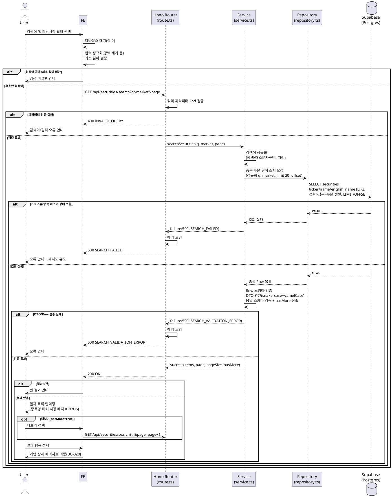

# UC-008: 기업 통합 검색

> 티커 또는 종목명(부분 일치)으로 국내(KRX)·미국(US) 상장기업을 통합 검색한다.
> 참조: `docs/userflow.md` 008, `docs/prd.md` 3장(메인/탐색)·5장(IA `/search`), `docs/database.md` 3.2·4.3, `docs/techstack.md` §4(Hono route → service → repository → Supabase).

---

## Primary Actor

- Guest / User (로그인 불필요, 권한 구분 없음)

## Precondition

- 사용자가 메인/탐색 페이지(또는 검색 결과 페이지)에 진입해 검색창을 사용할 수 있는 상태다.

## Trigger

- 사용자가 검색창에 검색어(티커/종목명)를 입력하고 검색을 실행한다(디바운스 자동 검색 포함).
- 또는 검색 결과 화면에서 시장 필터(KRX/US/전체)를 변경하거나 "더보기"를 선택한다.

## Main Scenario

1. 사용자가 검색어를 입력한다. FE는 디바운스(상수) 후 입력을 정규화(앞뒤 공백 제거 등)하고 최소 길이(상수)를 검증한다.
2. 최소 길이를 충족하면 FE가 검색 API를 호출한다(검색어 + 시장 필터 + 페이지).
3. Hono Router가 쿼리 파라미터를 Zod 스키마로 검증한다(검색어 필수·최소 길이, 시장 필터 enum, 페이지 정수).
4. Service가 검색어를 정규화한다(공백/대소문자/전각→반각 처리, 대소문자 무시 매칭 전제).
5. Service가 Repository를 통해 종목 마스터(`securities`)에서 `ticker`·`name`·`english_name` 3필드 부분 일치로 조회한다. 시장 필터가 지정되면 `market` 조건을 적용한다.
6. 정렬은 **정확 일치 > 접두 일치 > 부분 일치** 순(동순위는 종목명 순), 페이지당 20건(상수) + 더보기 여부(hasMore)를 산출한다.
7. Service가 DB Row를 검증하고 응답 DTO로 변환한다(snake_case → camelCase, 시장 배지 렌더링용 `market` 포함).
8. FE가 결과 목록(종목명, 티커, 시장 배지 KRX/US)을 렌더링한다. 더 있는 경우 "더보기"(다음 페이지 요청)를 노출한다.
9. 사용자가 결과 항목을 선택하면 해당 기업 상세 페이지(UC-020)로 라우팅한다.

## Edge Cases

| 케이스 | 처리 |
|---|---|
| 검색어 공백/최소 길이 미만 | FE에서 API 미호출 + 검색 미실행 안내. 우회 호출 시 BE가 400(`INVALID_QUERY`) 반환 |
| 결과 없음 | 200 + 빈 배열 → FE가 빈 결과 안내 표시(오류와 구분) |
| 동일 종목명이 시장 간 중복 | 두 결과 모두 반환, 시장 배지(KRX/US)로 구분 표시 |
| 자유 주체(비상장) 노드 | 종목 마스터 미연결이므로 검색 대상 아님(검색은 `securities` 기준) — 결과에 나타나지 않음 |
| 대량 매칭 | 페이지당 20건만 반환 + 더보기(페이지네이션), FE에서 시장 필터 활용 유도 |
| 종목 마스터 미수집/DB 장애 | 500(`SEARCH_FAILED`) → FE가 오류 안내 + 재시도 유도 |
| 부분 일치 남용(과도한 요청) | FE 디바운스(상수)로 1차 억제, 서버 측 레이트 리밋 시 429(`TOO_MANY_REQUESTS`) 안내 |
| 잘못된 시장 필터/페이지 값 | 400(`INVALID_QUERY`) — Zod 검증 실패 상세 포함 |

## Business Rules

### 검색 규칙

- 검색 대상은 **종목 마스터(`securities`)만**이다. 밸류체인의 자유 주체 노드는 대상이 아니다.
- 매칭 필드: `ticker`, `name`(한글 종목명), `english_name` — 3필드 **부분 일치**(대소문자 무시).
- 정렬 우선순위: 정확 일치(0) > 접두 일치(1) > 부분 일치(2), 동순위는 종목명 오름차순.
- 시장 필터: `KRX` / `US` / 전체(미지정). 결과의 `market` 값으로 시장 배지를 렌더링한다.
- 페이지당 20건(상수 `SEARCH_PAGE_SIZE`, `packages/domain/constants`) + 더보기(페이지네이션).
- 조회 전용 기능 — 어떠한 데이터 변경(사이드이펙트)도 없다.
- 입력 정규화: 앞뒤 공백 제거, 전각 문자 정규화, 대소문자 무시. 최소 길이(상수) 미만은 검색을 실행하지 않는다.
- FE는 디바운스(상수) 적용으로 과도한 요청을 억제한다.

### API Specification

- **Endpoint**: `GET /api/securities/search`
- **Query Parameters**:

  | 파라미터 | 타입 | 필수 | 설명 |
  |---|---|---|---|
  | `q` | string | O | 검색어(티커/종목명). 정규화 후 최소 길이(상수) 이상 |
  | `market` | enum `KRX` \| `US` | X | 시장 필터. 미지정 시 전체 |
  | `page` | integer (≥1) | X | 페이지 번호. 기본 1. 페이지당 20건(상수) |

- **Response Schema** (`200 OK`):

  ```
  {
    items: [
      {
        id: string (uuid),        // securities.id
        ticker: string,           // 티커
        name: string,             // 종목명(한글)
        englishName: string|null, // 영문 종목명
        market: "KRX" | "US"      // 시장 배지 렌더링용
      }
    ],
    page: number,       // 현재 페이지
    pageSize: number,   // 페이지당 건수(상수 20)
    hasMore: boolean    // 더보기(다음 페이지) 존재 여부
  }
  ```

  결과 없음은 `items: []`(200)로 응답하며 오류가 아니다.

- **Error Codes**:

  | 코드 | HTTP | 조건 |
  |---|---|---|
  | `INVALID_QUERY` | 400 | 검색어 누락/최소 길이 미만, 잘못된 `market`/`page` 값(Zod 검증 실패) |
  | `TOO_MANY_REQUESTS` | 429 | 서버 측 레이트 리밋 초과(남용 방지 정책 적용 시) |
  | `SEARCH_FAILED` | 500 | DB 조회 실패(종목 마스터 장애 포함) |
  | `SEARCH_VALIDATION_ERROR` | 500 | DB Row/응답 DTO 스키마 검증 실패 |

- **인증/인가**: 불필요(공개 API). Hono 공통 미들웨어 체인(errorBoundary → withAppContext → withSupabase)만 통과한다.

### Database Operations

- **사용 테이블**: `securities` (SELECT 전용 — INSERT/UPDATE/DELETE 없음)
- **조회 패턴** (`docs/database.md` 4.3 기준):
  - `WHERE (market 필터) AND (ticker ILIKE '%q%' OR name ILIKE '%q%' OR english_name ILIKE '%q%')`
  - `ORDER BY (정확=0 / 접두=1 / 부분=2), name` → `LIMIT 20 OFFSET (page-1)*20`
- **인덱스**: `ticker`/`name`/`english_name` 트라이그램 GIN(`extensions.gin_trgm_ops`, migration 0001·0003)이 부분 일치를 지원한다.
- RLS 비활성(전역 정책) — service-role 클라이언트로 조회하며, 공개 데이터이므로 별도 행 필터 없음.

### External Service Integration

- **런타임 외부 연동 없음.** 검색은 자체 DB(종목 마스터)만 조회한다(PRD 전역 정책: 외부 API는 배치 적재 전용).
- 종목 마스터 데이터의 원천은 배치가 사전 적재한다: 재무/공시/기업정보 수집 배치(UC-027, OpenDART·SEC EDGAR·토스증권)와 최초 백필 배치(UC-031). 배치 미실행/장애로 데이터가 비어 있으면 본 기능은 빈 결과 또는 오류 안내로 동작한다(Edge Cases 참조).

## Sequence Diagram


