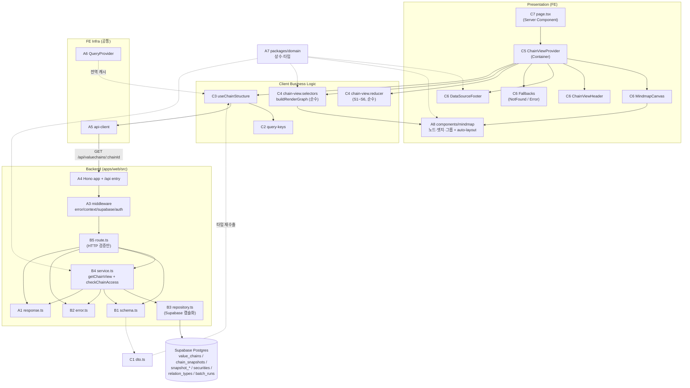

# Plan: UC-009 밸류체인 뷰 조회 (구조 로드 + 마인드맵 렌더링)

> 근거: `docs/usecases/009/spec.md`, `docs/usecases/000_decisions.md`(C-1·C-2·C-3 — spec과 충돌 시 우선), `docs/techstack.md` §4(Codebase Structure)·§7(DB 접근), `docs/database.md` §3.3·§3.9·§4.1, `docs/pages/chain-view/state_management.md`(본 기능이 속한 페이지의 상태 설계 — 그대로 승계), `.claude/skills/spec_to_plan/references/hono-backend-guide.md`.
>
> **확정 결정 반영(000_decisions)**
> - **C-2**: 사용자 체인에 대한 비로그인/비소유자 접근은 spec의 401(`AUTH_REQUIRED`)/403(`CHAIN_ACCESS_DENIED`) 대신 **404 `CHAIN_NOT_FOUND`로 통일**한다(체인 존재 자체 비노출). FE는 방어적으로 401/403 응답도 동일한 "체인 없음" 폴백으로 처리한다.
> - **C-1**: 빈 그룹은 라벨만 있는 빈 클러스터로 표시한다.
> - **C-3**: 최종 수집 시각 = `batch_runs`의 잡별 최근 성공(`success`/`partial_success`) 실행 **종료 시각(`finished_at`)**.
>
> **범위**: `GET /api/valuechains/{chainId}`(최신 스냅샷 구조 조회) 백엔드 전 계층 + 마인드맵 렌더링 FE. 대시보드 패널(UC-010)·노드 클릭(UC-011)·시점 타임라인(UC-012)은 별도 plan이며, 본 plan은 그들이 재사용할 **공통 지점(상태 모듈·쿼리 키·Provider 골격)** 을 최초 정의한다.
>
> **선행 조건**: 본 문서는 최초 작성 plan이므로 프로젝트 공통 인프라 모듈(A 그룹)의 구현 계획을 포함한다. 이후 다른 유스케이스 plan은 A 그룹 모듈을 **위치만 참조**하고 재정의하지 않는다. 모노레포 스캐폴드(npm workspaces, Next.js 16, Vitest 설정)는 파이프라인 Phase 9(환경설정)가 담당하며 본 plan은 그 구조를 전제한다.

---

## 개요

### A. 공통 모듈 (프로젝트 최초 정의 — 전 기능 공유)

| 모듈 | 위치 | 설명 |
| --- | --- | --- |
| A1. HTTP Result 헬퍼 | `apps/web/src/backend/http/response.ts` | `HandlerResult<T,E,M>`·`success()`·`failure()`·`respond()` — `{ok,data}`/`{ok:false,error{code,message}}` 응답 봉투의 단일 정의 |
| A2. Hono Context 계약 | `apps/web/src/backend/hono/context.ts` | `AppEnv` 타입, `getSupabase(c)`/`getLogger(c)`/`getUser(c)` 접근자 |
| A3. 공통 미들웨어 | `apps/web/src/backend/middleware/{error,context,supabase,auth}.ts` | `errorBoundary`(최종 예외 방어) / `withAppContext`(config·logger 주입) / `withSupabase`(service-role 클라이언트 주입) / `withOptionalAuth`(세션 쿠키 → `user` 주입, 없으면 `null`) |
| A4. Hono 앱 싱글턴 + Next 진입점 | `apps/web/src/backend/hono/app.ts`, `apps/web/src/app/api/[[...hono]]/route.ts` | 미들웨어 체인 + feature 라우터 등록, Next.js catch-all Route Handler(`runtime='nodejs'`) |
| A5. FE API 클라이언트 | `apps/web/src/lib/http/api-client.ts` | 응답 봉투 해석·`ApiError{status,code,message}` 변환하는 typed fetch 래퍼 |
| A6. React Query Provider | `apps/web/src/lib/react-query/query-provider.tsx` | 앱 루트 `QueryClientProvider`(전역 기본 옵션) |
| A7. 도메인 상수·타입 | `packages/domain/constants/{chain.ts,data-freshness.ts}`, `packages/domain/types/common.ts` | `MAX_NODES_PER_CHAIN=100`(BR-5), 데이터 출처 라벨, 수집 잡 매핑, `IsoDate`·`NodePosition` 등 순수 타입 |
| A8. 마인드맵 공용 프레젠테이션 | `apps/web/src/components/mindmap/{types.ts,auto-layout.ts,CompanyNode.tsx,FreeSubjectNode.tsx,GroupNode.tsx,RelationEdge.tsx}` | React Flow 커스텀 노드/엣지/그룹 컴포넌트 + 자동 레이아웃 순수 함수 — **뷰(009~012)와 편집(015~018) 공용** |

### B. 백엔드 — `features/valuechains/backend` (Hono route → service → repository 계층)

| 모듈 | 위치 | 설명 |
| --- | --- | --- |
| B1. Zod 스키마 | `apps/web/src/features/valuechains/backend/schema.ts` | Path param / DB Row(snake_case) / Response DTO(camelCase) 스키마 분리 정의 |
| B2. 에러 코드 | `apps/web/src/features/valuechains/backend/error.ts` | `INVALID_CHAIN_ID`·`CHAIN_NOT_FOUND`·`SNAPSHOT_MISSING`·`STRUCTURE_LOAD_FAILED` (C-2로 401/403 코드 제거) |
| B3. 리포지토리 | `apps/web/src/features/valuechains/backend/repository.ts` | Supabase 쿼리 캡슐화(체인 헤더·최신 스냅샷·그룹/노드/엣지·batch_runs 수집 시각) — Persistence 계층 |
| B4. 서비스 | `apps/web/src/features/valuechains/backend/service.ts` | `getChainView` 비즈니스 로직 + `checkChainAccess` 순수 접근 제어 함수(BR-1+C-2). repository **인터페이스에만** 의존 |
| B5. 라우터 | `apps/web/src/features/valuechains/backend/route.ts` | `GET /valuechains/:chainId` — param 검증·의존성 주입·에러 로깅·`respond()` 만 담당 |

### C. 프론트엔드 — `features/valuechains` + 페이지

| 모듈 | 위치 | 설명 |
| --- | --- | --- |
| C1. DTO 재노출 | `apps/web/src/features/valuechains/lib/dto.ts` | backend `schema.ts`의 Response 타입을 FE용으로 재수출(FE가 backend 내부 구조에 직접 결합하지 않도록) |
| C2. 쿼리 키 팩토리 | `apps/web/src/features/valuechains/hooks/chain-view-query-keys.ts` | 페이지 전체(009~012) 쿼리 키의 단일 정의 — state_management §6 그대로 |
| C3. 구조 쿼리 훅 | `apps/web/src/features/valuechains/hooks/useChainStructure.ts` | 최신 구조 조회 TanStack Query 훅(404류 재시도 금지) |
| C4. 상태 모듈 (Store) | `apps/web/src/features/valuechains/state/{chain-view.actions.ts,chain-view.reducer.ts,chain-view.selectors.ts}` | S1~S6 전체 Action/Reducer/셀렉터 — state_management §3~§5 승계. **UC-010~012 plan은 이 모듈을 참조만**(지표 파라미터 셀렉터만 UC-010에서 추가) |
| C5. Context + Provider | `apps/web/src/features/valuechains/context/{chain-view-context.ts,ChainViewProvider.tsx}` | Store·쿼리·computed를 조립하는 Container. UC-009 범위(구조·캔버스)만 연결, 010~012 확장 포인트 명시 |
| C6. Presenter 컴포넌트 | `apps/web/src/features/valuechains/components/{MindmapCanvas.tsx,ChainViewHeader.tsx,DataSourceFooter.tsx,ChainNotFoundFallback.tsx,StructureErrorFallback.tsx}` | 마인드맵 캔버스·헤더·출처 표기·폴백 — 로직 없는 Presenter |
| C7. 페이지 셸 | `apps/web/src/app/(public)/valuechains/[chainId]/page.tsx` | Server Component — `params`/`searchParams` 해석만 하고 Provider에 위임 |

---

## Diagram



데이터 흐름: Presentation(C6) → Actions/Query(C4·C3) → api-client(A5) → Hono route(B5) → Service(B4) → Repository(B3) → Postgres. 외부 서비스 연동 **없음**(BR-8 — 출처·수집 시각도 DB `batch_runs`에서 읽음).

---

## Implementation Plan

### A1. HTTP Result 헬퍼 (`backend/http/response.ts`) — 공통

- 구현 내용:
  1. `HandlerResult<T, E extends string, M> = { ok: true; status: number; data: T } | { ok: false; status: number; error: { code: E; message: string; details?: M } }` 판별 유니온 정의.
  2. `success(data, status = 200)` / `failure(status, code, message, details?)` 팩토리.
  3. `respond(c, result)` — result를 spec BR-6의 응답 봉투(`{ok:true,data}` / `{ok:false,error:{code,message}}`)로 직렬화해 해당 HTTP status로 반환. `details`는 응답에 포함하지 않고 로깅 전용.
- 의존성: 없음.

**Unit Tests:**

- [ ] `success(data)` → `{ok:true,status:200,data}` 형태 반환
- [ ] `failure(404,'X','msg')` → `{ok:false,status:404,error:{code:'X',message:'msg'}}`
- [ ] `respond()`가 성공/실패 각각 올바른 status·JSON 봉투를 만든다(details 미노출 포함)

### A2. Hono Context 계약 (`backend/hono/context.ts`) — 공통

- 구현 내용:
  1. `AppEnv = { Variables: { supabase: SupabaseClient; logger: AppLogger; config: AppConfig; user: AuthUser | null } }` 정의(`AuthUser = { id: string }` 최소형).
  2. `getSupabase(c)`, `getLogger(c)`, `getUser(c)` 접근자 — 라우터가 `c.get()`을 직접 만지지 않게 캡슐화.
- 의존성: 없음.
- Unit Tests: N/A (타입·접근자 정의).

### A3. 공통 미들웨어 (`backend/middleware/*.ts`) — 공통

- 구현 내용:
  1. `error.ts` — `errorBoundary()`: 하위 예외를 잡아 로깅 후 500 `UNHANDLED_ERROR` `failure` 응답(스택은 로그로만).
  2. `context.ts` — `withAppContext()`: 환경변수(`NEXT_PUBLIC_SUPABASE_URL`, `SUPABASE_SERVICE_ROLE_KEY`)를 **모듈 로드 시 1회 zod 검증**해 `config`로 주입(하드코딩 금지, 누락 시 명시적 기동 실패). 콘솔 기반 `logger` 주입.
  3. `supabase.ts` — `withSupabase()`: service-role 키로 `createClient`(모듈 스코프 싱글턴)한 클라이언트를 `c.set('supabase', …)`.
  4. `auth.ts` — `withOptionalAuth()`: `@supabase/ssr`의 `createServerClient`로 요청 쿠키에서 세션을 읽어 `user`(`{id}`) 또는 `null` 주입. **세션 해석 실패는 요청을 중단하지 않고 `null` 처리**(공식 체인 무인증 열람 보장 — BR-6 "인증 선택적").
- 의존성: A1, A2.

**Unit Tests:**

- [ ] `errorBoundary`: 하위에서 throw 시 500 `UNHANDLED_ERROR` 봉투 응답 + 로거 호출
- [ ] `withOptionalAuth`: 유효 세션 쿠키 → `user.id` 주입 / 쿠키 없음·무효 → `user=null`이고 요청은 계속 진행
- [ ] env 검증: 필수 키 누락 시 명시적 에러(zod) — 부분 통합 테스트

### A4. Hono 앱 싱글턴 + Next 진입점 — 공통

- 구현 내용:
  1. `backend/hono/app.ts` — `createHonoApp()` 싱글턴. `basePath('/api')`, 미들웨어 순서 고정: `errorBoundary → withAppContext → withSupabase → withOptionalAuth`. `registerValuechainsRoutes(app)` 등록(이후 feature는 각자 plan에서 등록 라인만 추가).
  2. `app/api/[[...hono]]/route.ts` — `export const runtime = 'nodejs'`; `GET/POST/PUT/PATCH/DELETE`를 `handle(createHonoApp())`로 위임.
- 의존성: A1~A3, B5.

**QA Sheet:**

| # | 시나리오 | 기대 결과 |
| --- | --- | --- |
| 1 | `GET /api/valuechains/{유효UUID}` 호출 | Hono 라우터에 도달, 미들웨어 체인 통과 |
| 2 | 등록되지 않은 경로 `GET /api/unknown` | 404 (Hono 기본 not-found, 봉투 형식) |
| 3 | 미들웨어 내부 예외 발생 | 500 `UNHANDLED_ERROR` 응답, 콘솔 로그 |

### A5. FE API 클라이언트 (`lib/http/api-client.ts`) — 공통

- 구현 내용:
  1. `apiGet<T>(path: string): Promise<T>` — 동일 오리진 `/api` 상대 경로 fetch. 응답 봉투 파싱: `ok:true`면 `data` 반환, `ok:false`면 `ApiError` throw.
  2. `class ApiError extends Error { status: number; code: string }` — FE 폴백 분기(404/401/403 → not-found 등)의 단일 근거.
  3. 네트워크 실패·JSON 파싱 실패는 `ApiError(status=0, code='NETWORK_ERROR')`로 정규화.
- 의존성: 없음.

**Unit Tests:**

- [ ] 200 + `{ok:true,data}` → data 반환
- [ ] 404 + `{ok:false,error:{code:'CHAIN_NOT_FOUND'}}` → `ApiError{status:404,code:'CHAIN_NOT_FOUND'}` throw
- [ ] fetch reject(네트워크) → `ApiError{status:0,code:'NETWORK_ERROR'}`

### A6. React Query Provider (`lib/react-query/query-provider.tsx`) — 공통

- 구현 내용: `'use client'` 컴포넌트. `QueryClient` 기본 옵션(전역 `retry`는 보수적으로 1회 — 404류 무재시도는 개별 훅에서 오버라이드, `staleTime` 기본 상수). 루트 `app/layout.tsx`에 장착.
- 의존성: 없음.
- Unit Tests: N/A (설정 컴포넌트 — E2E에서 검증).

### A7. 도메인 상수·타입 (`packages/domain`) — 공통

- 구현 내용:
  1. `constants/chain.ts` — `MAX_NODES_PER_CHAIN = 100`(BR-5).
  2. `constants/data-freshness.ts` — `DATA_SOURCE_LABELS = ['금융감독원 DART', 'SEC EDGAR', '토스증권'] as const`(BR-4 법적 고지 — 하드코딩 금지 원칙에 따라 상수화), `FRESHNESS_JOBS = { quotes: 'collect_quotes', financials: 'collect_financials', fxAndMarketHours: 'collect_fx_market_hours' } as const`(C-3, DB enum `batch_job_type`과 문자열 일치).
  3. `types/common.ts` — `IsoDate`(브랜드형 string), `NodePosition = { x: number; y: number }` 등 프레임워크 독립 타입.
  4. (참고) `types/database.ts`는 Phase 9에서 `mcp__supabase__generate_typescript_types`로 생성 — 본 plan은 참조만.
- 의존성: 없음. 프레임워크 의존성 금지(techstack §3).
- Unit Tests: N/A (상수·타입 정의).

### A8. 마인드맵 공용 프레젠테이션 (`components/mindmap/*`) — 공통 (뷰·편집 공용)

- 구현 내용:
  1. `types.ts` — 렌더 모델 단일 정의: `RenderNode { id; kind: 'listed_company'|'free_subject'; label; sublabel?; market?; listingStatus?; groupId: string|null; position: NodePosition }`, `RenderEdge { id; source; target; label; isDirected }`, `RenderGroup { id; label; isCollapsed; memberCount }`, `RenderGraph { nodes; edges; groups }`.
  2. `auto-layout.ts` — `applyAutoLayout(nodes, groups): Record<nodeId, NodePosition>` **순수 함수**. 좌표 없는 노드만 배치(E11): 그룹별 컬럼 구획 + 그룹 내 그리드, 미소속 노드는 별도 우측 구획(E6). 입력이 같으면 항상 같은 출력(결정적) — 간격·셀 크기는 파일 상단 상수.
  3. `CompanyNode.tsx` — 티커·종목명·시장 배지 + `listingStatus !== 'listed'`면 상장폐지/거래정지 배지(E10). props 콜백만 사용, 로직 없음.
  4. `FreeSubjectNode.tsx` — 주체 이름 + 주체 유형 뱃지(consumer/government/private_company/other 라벨 상수).
  5. `GroupNode.tsx` — React Flow group(parent) 노드: 배경 영역 + 그룹 라벨. 접힘 상태면 라벨 + "노드 n개" 요약만(E4). **멤버 0개여도 라벨만 있는 빈 클러스터 렌더(C-1)**. 접기/펼치기 토글 버튼(`onToggleCollapse` prop).
  6. `RelationEdge.tsx` — 관계 라벨 + `isDirected ? markerEnd 화살표 : 무화살표`(BR-4).
- 의존성: A7, `@xyflow/react`.

**Unit Tests (auto-layout — 순수 로직):**

- [ ] 좌표 있는 노드는 건드리지 않고, null 좌표 노드에만 좌표 부여
- [ ] 같은 그룹의 노드들이 같은 구획 안에 배치된다
- [ ] 미소속 노드는 그룹 구획 밖(별도 구획)에 배치된다(E6)
- [ ] 동일 입력 2회 호출 → 동일 출력(결정성), 입력 배열 비변이

**QA Sheet (노드/엣지/그룹 컴포넌트):**

| # | 시나리오 | 기대 결과 |
| --- | --- | --- |
| 1 | 상장기업 노드(listed) 렌더 | 티커·종목명·시장 배지 표시, 상태 배지 없음 |
| 2 | 상장폐지(delisted)/정지(suspended) 종목 노드 | 상태 배지 표시, 노드 자체는 정상 렌더(E10) |
| 3 | 자유 주체 노드(consumer) | 이름 + "소비자" 유형 뱃지 |
| 4 | 유향 관계 엣지 | 라벨 + target 방향 화살표 |
| 5 | 무향 관계 엣지 | 라벨 표시, 화살표 없음 |
| 6 | 그룹(노드 3개) 펼침 상태 | 배경 클러스터 + 라벨 + 내부 노드 표시 |
| 7 | 그룹 접힘 상태 | 라벨 + "노드 3개" 요약, 멤버 노드 숨김 |
| 8 | 빈 그룹(멤버 0) | 라벨만 있는 빈 클러스터 표시(C-1), 접기 토글은 비활성 또는 무의미 동작 없음 |

---

### B1. Zod 스키마 (`features/valuechains/backend/schema.ts`)

- 구현 내용:
  1. **Param**: `ChainIdParamSchema = z.object({ chainId: z.string().uuid() })` (E12 → 400).
  2. **Row 스키마(snake_case — 마이그레이션 0005/0006/0003/0004/0012와 1:1)**:
     - `ValueChainRowSchema`: `id, chain_type('official'|'user'), owner_id(nullable), name, focus_type('industry'|'company'), focus_security_id(nullable), is_archived, source_chain_id(nullable)` + 조인 `focus_security: {id,ticker,name,market} | null`.
     - `ChainSnapshotRowSchema`: `id, chain_id, effective_at, change_source('user_save'|'admin_edit'|'llm_approval')`.
     - `SnapshotGroupRowSchema`: `id, name`.
     - `SnapshotNodeRowSchema`: `id, group_id(nullable), node_kind, security_id(nullable), subject_name/type/memo(nullable), position_x/y(number nullable)` + 조인 `security: {id,ticker,name,market,listing_status} | null`.
     - `SnapshotEdgeRowSchema`: `id, source_node_id, target_node_id` + 조인 `relation_type: {id,name,is_directed,is_active}`.
     - `BatchRunFreshnessRowSchema`: `finished_at(nullable)`.
  3. **Response DTO(camelCase — spec BR-6 응답 예시와 1:1)**: `ChainViewResponseSchema = z.object({ chain, snapshot, groups, nodes, edges, dataFreshness })`.
     - `chain.focusSecurity`: `focus_type='company'`이고 조인 성공 시만 객체, 그 외 `null`.
     - `nodes[].position`: `{x,y}` 또는 `null`(둘 중 하나라도 null이면 null — E11).
     - `dataFreshness.lastCollectedAt.{quotes,financials,fxAndMarketHours}`: `string | null`(E13).
     - `dataFreshness.sources`: `DATA_SOURCE_LABELS` 값.
  4. 모든 타입 `z.infer` export.
- 의존성: A7(타입 참고). UC-010~012는 이 파일에 각자 스키마를 **추가**한다(본 plan의 스키마는 수정 금지 원칙).
- Unit Tests: N/A (스키마 정의 — 서비스 테스트에서 간접 검증).

### B2. 에러 코드 (`features/valuechains/backend/error.ts`)

- 구현 내용:

  ```
  valuechainsErrorCodes = {
    invalidChainId: 'INVALID_CHAIN_ID',        // 400 (E12)
    chainNotFound: 'CHAIN_NOT_FOUND',          // 404 (E1 + C-2: 비로그인/비소유자 사용자 체인 접근 포함)
    snapshotMissing: 'SNAPSHOT_MISSING',       // 500 (E9 정합성 예외)
    structureLoadFailed: 'STRUCTURE_LOAD_FAILED', // 500 (E8 DB 오류/스키마 검증 실패)
  } as const
  ```

  `ValuechainsServiceError` 타입 export. **spec BR-6의 `AUTH_REQUIRED`(401)/`CHAIN_ACCESS_DENIED`(403)는 C-2 확정으로 정의하지 않는다.** UC-010~012의 추가 코드(`SNAPSHOT_NOT_FOUND` 등)는 해당 plan에서 이 객체에 추가.
- 의존성: 없음.
- Unit Tests: N/A (상수 정의).

### B3. 리포지토리 (`features/valuechains/backend/repository.ts`)

- 구현 내용:
  1. 인터페이스(포트) 정의 — 서비스는 이 타입에만 의존:

     ```typescript
     interface ValuechainsViewRepository {
       findChainById(chainId: string): Promise<unknown | null>;              // value_chains + focus_security 조인
       findLatestSnapshot(chainId: string): Promise<unknown | null>;         // effective_at DESC LIMIT 1 (BR-2, database.md 4.1)
       findSnapshotGroups(snapshotId: string): Promise<unknown[]>;
       findSnapshotNodes(snapshotId: string): Promise<unknown[]>;            // securities 조인
       findSnapshotEdges(snapshotId: string): Promise<unknown[]>;            // relation_types 조인
       findLatestBatchSuccessAt(jobType: BatchJobType): Promise<string | null>; // C-3
     }
     ```

     반환은 `unknown`(원시 행) — **Row 스키마 검증은 서비스 책임**(계층 분리: 리포지토리는 접근만).
  2. `createValuechainsViewRepository(client: SupabaseClient): ValuechainsViewRepository` 구현:
     - `findChainById`: `from('value_chains').select('*, focus_security:securities!value_chains_focus_security_id_fkey(id,ticker,name,market)').eq('id', chainId).maybeSingle()`.
     - `findLatestSnapshot`: `from('chain_snapshots').select(...).eq('chain_id', …).order('effective_at', {ascending:false}).limit(1).maybeSingle()`.
     - `findSnapshotNodes`: `select('*, security:securities(id,ticker,name,market,listing_status)')`, `eq('snapshot_id', …)`.
     - `findSnapshotEdges`: `select('*, relation_type:relation_types(id,name,is_directed,is_active)')` — 비활성 관계 종류도 그대로 반환(E5, 필터 없음).
     - `findLatestBatchSuccessAt`: `from('batch_runs').select('finished_at').eq('job_type', jobType).in('status', ['success','partial_success']).order('finished_at', {ascending:false, nullsFirst:false}).limit(1).maybeSingle()` → `finished_at ?? null`.
     - 테이블·컬럼명은 파일 상단 상수로 관리(하드코딩 금지).
  3. Supabase `error` 발생 시 `RepositoryError(message)` throw — 서비스가 catch해 `STRUCTURE_LOAD_FAILED`로 변환. "행 없음"은 throw가 아닌 `null` 반환(`maybeSingle`).
  4. (DRY 메모) `findLatestBatchSuccessAt`는 기업 상세(UC-020) 등에서도 필요해질 수 있다 — 그 시점에 공용 모듈로 추출하고, 본 plan에서는 valuechains 내부에 둔다.
- 의존성: A7(`FRESHNESS_JOBS` 잡 타입).

**Unit Tests (Supabase 클라이언트 mock — 쿼리 빌더 체인 검증):**

- [ ] `findChainById`: `value_chains`에 `eq('id')` 필터·focus_security 조인 select 문자열로 호출, 행 없으면 `null`
- [ ] `findLatestSnapshot`: `order('effective_at', desc)`+`limit(1)` 적용 확인
- [ ] `findSnapshotEdges`: `is_active` 필터가 **없어야** 함(E5 — 비활성 관계도 반환)
- [ ] `findLatestBatchSuccessAt`: `in('status', ['success','partial_success'])` 필터, 이력 없으면 `null`(E13)
- [ ] Supabase error 응답 시 `RepositoryError` throw

### B4. 서비스 (`features/valuechains/backend/service.ts`)

- 구현 내용:
  1. **`checkChainAccess(chain, currentUserId): { allowed: true; isOwner: boolean } | { allowed: false }`** — 순수 함수(BR-1 + C-2):
     - `is_archived === true` → 불허(404).
     - `chain_type === 'official'` → 허용, `isOwner=false`.
     - `chain_type === 'user'` → `currentUserId !== null && currentUserId === owner_id`일 때만 허용(`isOwner=true`). **비로그인·비소유자 모두 `{allowed:false}` → 404**(C-2 — 401/403 분기 없음).
  2. **`getChainView(repo: ValuechainsViewRepository, chainId: string, currentUserId: string | null): Promise<HandlerResult<ChainViewResponse, ValuechainsServiceError, unknown>>`**:
     1. `repo.findChainById` → `null`이면 `failure(404, chainNotFound)`.
     2. `ValueChainRowSchema.safeParse` → 실패 시 `failure(500, structureLoadFailed, …, format())`.
     3. `checkChainAccess` → 불허면 `failure(404, chainNotFound)` (미존재와 동일 메시지 — 존재 비노출).
     4. `repo.findLatestSnapshot` → `null`이면 `failure(500, snapshotMissing)` (E9).
     5. `Promise.all`: `findSnapshotGroups` / `findSnapshotNodes` / `findSnapshotEdges` / `FRESHNESS_JOBS` 3종 각각 `findLatestBatchSuccessAt`.
     6. 각 Row 배열 `safeParse` → 실패 시 `failure(500, structureLoadFailed)`.
     7. DTO 변환(snake→camel): 노드 `position_x/y` 중 하나라도 null → `position: null`(E11), `focus_type !== 'company'` → `focusSecurity: null`, `isOwner` = 3의 결과, `dataFreshness.sources = DATA_SOURCE_LABELS`, `lastCollectedAt.* = finished_at | null`(E13).
     8. `ChainViewResponseSchema.safeParse` → 실패 시 `failure(500, structureLoadFailed)`.
     9. `success(parsed.data)`.
  3. 전 과정 try/catch — `RepositoryError` 포함 예외는 `failure(500, structureLoadFailed, message)` (E8).
  4. 서비스는 로깅·HTTP 개념(Hono Context)에 접근하지 않는다. INSERT/UPDATE/DELETE 없음(BR-3).
- 의존성: A1, A7, B1, B2, B3(인터페이스 타입만).

**Unit Tests (repository mock 주입 — DB 불필요):**

- [ ] 공식 체인 + Guest(`currentUserId=null`) → 200 성공, `chain.isOwner=false`
- [ ] 공식 체인 + `is_archived=true` → 404 `CHAIN_NOT_FOUND` (E1/BR-1)
- [ ] 미존재 체인(`findChainById=null`) → 404 `CHAIN_NOT_FOUND` (E1)
- [ ] 사용자 체인 + 비로그인 → 404 `CHAIN_NOT_FOUND` (C-2 — 401 아님)
- [ ] 사용자 체인 + 로그인했으나 비소유자 → 404 `CHAIN_NOT_FOUND` (C-2 — 403 아님)
- [ ] 사용자 체인 + 소유자 → 200 성공, `isOwner=true`
- [ ] 스냅샷 0건 → 500 `SNAPSHOT_MISSING` (E9)
- [ ] repository throw(`RepositoryError`) → 500 `STRUCTURE_LOAD_FAILED` (E8)
- [ ] Row 스키마 검증 실패(노드 행 필드 결손) → 500 `STRUCTURE_LOAD_FAILED`
- [ ] snake→camel 변환 정확성: `position_x/y` → `position.{x,y}`, `relation_type.is_directed` → `relationType.isDirected`
- [ ] `position_x`만 있고 `position_y=null`인 노드 → `position: null` (E11 방어)
- [ ] `focus_type='industry'` → `focusSecurity: null` / `'company'`+조인 성공 → 객체 포함
- [ ] 비활성 관계 종류 엣지 → 응답에 포함되고 `relationType.isActive=false` (E5)
- [ ] 빈 그룹·고립 노드·그룹 미소속 노드 → 응답에 그대로 포함 (E6/E7)
- [ ] batch_runs 이력 전무 → `lastCollectedAt` 3필드 모두 `null`, 나머지 응답 정상 (E13)
- [ ] `checkChainAccess` 순수 함수 자체 케이스 표(위 접근 6조합) 별도 검증

### B5. 라우터 (`features/valuechains/backend/route.ts`)

- 구현 내용:
  1. `registerValuechainsRoutes(app: Hono<AppEnv>)` — `app.get('/valuechains/:chainId', …)`:
     1. `ChainIdParamSchema.safeParse(c.req.param())` → 실패 시 `respond(c, failure(400, invalidChainId, '잘못된 밸류체인 경로입니다.'))` (E12).
     2. `getSupabase(c)` → `createValuechainsViewRepository(client)`, `getUser(c)?.id ?? null`.
     3. `getChainView(repo, chainId, currentUserId)` 호출.
     4. `!result.ok && result.status >= 500`이면 `getLogger(c).error(...)` — `SNAPSHOT_MISSING`은 정합성 예외로 별도 식별 로그(E9 운영 추적).
     5. `respond(c, result)`.
  2. 쿼리 파라미터 없음(시점 `at` 확장은 UC-012 plan의 `snapshot-at` 별도 엔드포인트).
- 의존성: A1~A3, B1, B2, B4. A4에 등록 라인 1줄 추가.

**QA Sheet:**

| # | 시나리오 | 기대 결과 |
| --- | --- | --- |
| 1 | `GET /api/valuechains/{공식체인 UUID}` (비로그인) | 200, BR-6 응답 스키마와 일치(chain/snapshot/groups/nodes/edges/dataFreshness) |
| 2 | `GET /api/valuechains/not-a-uuid` | 400 `INVALID_CHAIN_ID` |
| 3 | 존재하지 않는 UUID | 404 `CHAIN_NOT_FOUND` |
| 4 | 보관된 공식 체인 | 404 `CHAIN_NOT_FOUND` |
| 5 | 타인 사용자 체인 UUID (비로그인/타 계정 로그인) | **둘 다 404** `CHAIN_NOT_FOUND` (C-2), 응답 본문에서 체인 존재 추정 불가 |
| 6 | 본인 사용자 체인 (세션 쿠키 포함) | 200, `chain.isOwner=true` |
| 7 | 스냅샷 0건인 체인(테스트 데이터) | 500 `SNAPSHOT_MISSING` + 서버 로그 기록 |
| 8 | DB 중단 상태에서 호출 | 500 `STRUCTURE_LOAD_FAILED` + 서버 로그 기록 |
| 9 | 배치 이력 없는 초기 상태 | 200, `dataFreshness.lastCollectedAt` 전부 `null` (구조는 정상 — E13) |

---

### C1. DTO 재노출 (`features/valuechains/lib/dto.ts`)

- 구현 내용: `export type { ChainViewResponse, ChainViewNode, ChainViewEdge, ChainViewGroup, DataFreshness } from '../backend/schema'` — FE(훅·셀렉터·컴포넌트)는 이 경로만 import. UC-010~012 DTO도 이후 이 파일에 추가.
- 의존성: B1.
- Unit Tests: N/A (재수출).

### C2. 쿼리 키 팩토리 (`features/valuechains/hooks/chain-view-query-keys.ts`)

- 구현 내용: state_management §6의 `chainViewQueryKeys` 객체를 **전체(6종) 그대로** 정의한다(구조/snapshot-at/timeline/daily/quarterly/nodeDetail). UC-009는 `structure`만 사용하지만, 키 체계는 페이지 단일 계약이므로 최초 1회 완성 정의(UC-010~012 plan은 참조만 — 충돌 방지).
- 의존성: A7(`IsoDate`).
- Unit Tests: N/A (상수 팩토리 — 키 충돌은 타입으로 방지).

### C3. 구조 쿼리 훅 (`features/valuechains/hooks/useChainStructure.ts`)

- 구현 내용:
  1. `useChainStructure(chainId: string, options: { enabled: boolean }): UseQueryResult<ChainViewResponse, ApiError>`.
  2. `queryKey: chainViewQueryKeys.structure(chainId)`, `queryFn: () => apiGet('/valuechains/' + chainId)`.
  3. `retry`: `ApiError.status`가 400/401/403/404면 재시도 금지(C-2 — 결과 불변), 그 외(500/네트워크)만 1회 재시도. 수동 재시도는 `refetch()`(행동 H).
  4. `staleTime`: 페이지 체류 중 캐시 재사용 상수(state_management §6 — UC-012 "최신으로 돌아가기" 캐시 히트 대비).
- 의존성: A5, C1, C2.

**Unit Tests:**

- [ ] `enabled=false`면 fetch 미발생
- [ ] 성공 시 `ChainViewResponse` 타입 데이터 노출
- [ ] 404 `ApiError` → 자동 재시도 없음 / 500 → 1회 재시도

### C4. 상태 모듈 — Actions·Reducer·셀렉터 (`features/valuechains/state/*`)

- 구현 내용: **state_management.md §3~§5를 그대로 구현**한다(본 plan이 최초 구현 담당 — UC-010~012 plan은 이 모듈을 수정하지 않고 참조).
  1. `chain-view.actions.ts` — `ChainViewAction` 판별 유니온 9종 전체(§3.2).
  2. `chain-view.reducer.ts` — `ChainViewState`(S1~S6), `parseAtParam`, `createInitialChainViewState`, `chainViewReducer` 전이 규칙 전체(§4.2 표, 경합 가드·no-op·불변성·exhaustive check 포함). 순수 함수 — `Date.now()`/fetch/라우터 접근 금지.
  3. `chain-view.selectors.ts` — UC-009 범위 셀렉터:
     - `selectIsTimeTraveling(state)` (§5).
     - `buildRenderGraph({ structure, localPositions, collapsedGroupIds }): RenderGraph` — 좌표 우선순위 **S5 오버라이드 > 서버 position > `applyAutoLayout`(A8)**(E11), 접힌 그룹의 멤버 노드와 그 노드에 닿는 엣지 숨김 + 멤버 수 요약(E4), 빈 그룹은 빈 클러스터 유지(C-1), 미소속·고립 노드 통과(E6). 출력은 A8 `RenderGraph` 타입.
     - `selectDailyMetricsParams`/`selectQuarterlyMetricsParams`는 **UC-010 plan 범위**(이 파일에 이후 추가) — 본 plan에서 구현하지 않음.
- 의존성: A7, A8(types·auto-layout), C1.

**Unit Tests (state_management §12 승계 — Vitest, 렌더링 불필요):**

- [ ] `parseAtParam`: 유효 날짜 / 형식 오류 / 미래 / `TIMESERIES_MIN_START_DATE` 이전 → 값 / `null`
- [ ] `TIMELINE_DATE_SELECTED(D)`: S1=D + S3=null·S5={}·S6=[] 동시 초기화, S2·S4 불변 / 동일 D 재선택 → 기존 state 참조 반환
- [ ] `TIMELINE_RESTORE_SUCCEEDED`/`FAILED` 경합 가드(payload ≠ S1이면 무시), 실패 시 S1←S2 되돌림
- [ ] `TIMELINE_RETURNED_TO_LATEST`: S1=null + S3/S5/S6 초기화
- [ ] `NODE_DRAG_ENDED` 2회 누적 병합 / `GROUP_COLLAPSE_TOGGLED` 추가↔제거 왕복 — 원본 비변이
- [ ] 모든 액션에서 입력 state immutability(참조 불변) 확인
- [ ] `buildRenderGraph`: position null 노드 → auto-layout 좌표 폴백(E11) / S5 오버라이드가 서버 좌표보다 우선 / 접힌 그룹 멤버 노드·관련 엣지 숨김 + memberCount(E4) / 빈 그룹 → 빈 클러스터 유지(C-1) / 고립·미소속 노드 통과(E6)

### C5. Context + Provider (`features/valuechains/context/*`)

- 구현 내용:
  1. `chain-view-context.ts` — state_management §8.2의 `StructureView`·`ChainViewStateValue`·`ChainViewActionsValue` 타입과 `ChainViewStateContext`/`ChainViewActionsContext` 2분할 Context, `useChainViewState()`/`useChainViewActions()`(Provider 밖 호출 시 명시적 Error). **UC-009 시점에는 UC-009가 채우는 필드만 타입에 포함**하고(아래), 010~012 필드는 각 plan에서 확장:
     - State: `chainId`, `selectedDate`(S1), `localNodePositions`(S5), `collapsedGroupIds`(S6), `isTimeTraveling`, `structure: StructureView`, `renderGraph: RenderGraph | null`, `dataFreshness`, `isOwner`.
     - Actions: `commitNodeDrag`, `toggleGroupCollapse`, `retryStructure`.
  2. `ChainViewProvider.tsx`(`'use client'`, Container) — §8.1 골격의 UC-009 부분 조립:
     - **`?at=` 배선 규칙(UC-009 단계 확정)**: Provider는 props로 `atParam`을 받되(시그니처는 state_management §8.2 계약 유지) **UC-009 단계에서는 이를 초기 상태에 주입하지 않는다** — `useReducer(chainViewReducer, { atParam: null, today }, createInitialChainViewState)`로 S1을 항상 `null`에서 시작한다. UC-009에는 시점 복원 쿼리(`snapshot-at`)가 없으므로, atParam을 그대로 주입하면 유효한 과거 날짜 딥링크(예: `?at=2026-05-02`)에서 S1≠null이 되어 구조 쿼리가 영구 비활성(`enabled=false`) → 무한 로딩에 빠지기 때문이다. **atParam→`parseAtParam`→S1 주입 복원은 UC-012 plan(모듈 12·16)이 snapshot-at 쿼리 배선과 반드시 동일 변경으로 수행**한다(주입만 복원되고 쿼리가 없는 부분 배선 상태 금지). `today`는 Asia/Seoul 기준(C-6)으로 Provider에서 1회 계산해 주입(reducer 순수성 유지).
     - `useChainStructure(chainId, { enabled: selectedDate === null })` — enabled 조건은 state_management §6 계약대로 두되, 위 배선 규칙으로 UC-009 단계에서는 S1이 항상 `null`임이 보장되므로 구조 쿼리는 유효/무효 `?at=` 진입 모두에서 항상 발화한다(항상 최신 구조 표시). UC-012가 atParam 주입을 복원해도 이 줄은 무변경.
     - computed(`useMemo`):
       - `structure`: 쿼리 `pending → {status:'loading'}` / error `status ∈ {400,401,403,404}` → `{status:'not-found'}`(C-2 방어적 통일 + E12) / 그 외 error → `{status:'error'}` / 성공 → `{status:'ready', data, snapshotEffectiveAt, isRestoring:false}`.
       - `renderGraph`: `structure.status==='ready'`일 때만 `buildRenderGraph(...)`(S5·S6·데이터 참조 입력별 개별 `useMemo`).
       - `dataFreshness`·`isOwner`: 구조 쿼리 데이터에서 파생.
     - actions(`useMemo`, dispatch·refetch 참조만 의존 — 참조 안정): `commitNodeDrag` → `NODE_DRAG_ENDED`, `toggleGroupCollapse` → `GROUP_COLLAPSE_TOGGLED`, `retryStructure` → `refetch()`.
     - **확장 포인트 주석 명시**: 나머지 쿼리 5종·이펙트 3종·computed(§8.1)는 UC-010(지표)·UC-011(노드 패널)·UC-012(타임라인) plan이 이 파일에 추가한다.
- 의존성: C2, C3, C4, A7.

**QA Sheet:**

| # | 시나리오 | 기대 결과 |
| --- | --- | --- |
| 1 | Provider 마운트(유효 공식 체인) | 구조 쿼리 1회 발화 → `structure.status: 'loading' → 'ready'` |
| 2 | Provider 없이 `useChainViewState()` 호출 | 명시적 Error throw |
| 3 | 404 응답 | `structure.status='not-found'` (401/403/400 응답도 동일 — C-2 방어) |
| 4 | 500 응답 | `structure.status='error'`, `retryStructure()` 호출 시 재조회 |
| 5 | `commitNodeDrag` 호출 | `renderGraph`의 해당 노드 좌표만 변경, 네트워크 요청 없음(BR-3) |
| 6 | `toggleGroupCollapse` 호출 | `renderGraph`에서 멤버 노드·엣지 숨김/복원 |
| 7 | 액션만 소비하는 컴포넌트 | 상태 변경 시 리렌더되지 않음(Context 2분할 검증) |
| 8 | 유효한 과거 날짜 `atParam='2026-05-02'`로 Provider 마운트 | S1=null 유지(atParam 미주입 — `?at=` 배선 규칙), 구조 쿼리 정상 발화 → `structure.status='ready'`(무한 로딩 없음) |

### C6. Presenter 컴포넌트 (`features/valuechains/components/*`)

- 구현 내용 (모두 `useChainViewState()`/`useChainViewActions()` 두 훅 외 데이터 접근 금지 — 쿼리 훅·dispatch·라우터 직접 사용 불가):
  1. `MindmapCanvas.tsx` — `structure.status` 분기: `loading` → 캔버스 스켈레톤 / `not-found` → `ChainNotFoundFallback` / `error` → `StructureErrorFallback` / `ready` → `<ReactFlow>`:
     - `nodeTypes`/`edgeTypes`에 A8 컴포넌트 매핑, `renderGraph`를 React Flow `nodes`(그룹은 parent 노드 + 멤버 `parentId`)·`edges`로 변환.
     - `onNodeDragStop={(_, n) => commitNodeDrag(n.id, n.position)}`(행동 B — 로컬만, BR-3), 그룹 라벨 토글 → `toggleGroupCollapse`.
     - 줌/팬은 React Flow 비제어 내부 상태(앱 상태 아님), `onlyRenderVisibleElements` 활성화(E4 가상화), `fitView`로 초기 화면 맞춤.
     - 노드 클릭 핸들러는 **UC-011 plan에서 연결**(본 plan에서는 미배선).
  2. `ChainViewHeader.tsx` — 체인명, 체인 종류/기준 표기(기업 중심이면 `focusSecurity` 티커·종목명 병기, 산업 중심이면 생략), `isOwner=true`일 때만 편집 진입 링크(`/valuechains/[chainId]/edit` — 이동만, 편집 화면은 UC-015~018).
  3. `DataSourceFooter.tsx` — `DATA_SOURCE_LABELS` 출처 3종 + `lastCollectedAt` 잡별 시각(`date-fns`+`date-fns-tz`로 Asia/Seoul 포맷). `null`이면 해당 항목 "수집 전" 표기(E13). 구조 렌더와 독립(수집 시각 없음이 캔버스에 영향 없음 — BR-4).
  4. `ChainNotFoundFallback.tsx` — "체인을 찾을 수 없습니다" 안내 + 메인(`/`) 이동 버튼(E1·E12·C-2 공용, 재시도 버튼 없음).
  5. `StructureErrorFallback.tsx` — 오류 안내 + 재시도 버튼(`retryStructure`) (E8). 캔버스 영역에만 표시(대시보드·타임라인과 독립 — 행동 H).
- 의존성: A8, C5. shadcn-ui 프리미티브 필요 시 설치 명령을 구현 단계에서 안내(button, badge, skeleton 예상).

**QA Sheet:**

| # | 시나리오 | 기대 결과 |
| --- | --- | --- |
| 1 | 공식 체인 진입(비로그인) | 마인드맵 렌더: 노드·엣지 라벨·그룹 클러스터 표시, 편집 버튼 없음 |
| 2 | 저장 좌표가 있는 노드 | 저장 위치 그대로 배치 |
| 3 | 좌표 NULL 노드 | 자동 레이아웃 위치에 배치(E11), 콘솔 오류 없음 |
| 4 | 유향/무향 엣지 혼재 체인 | 유향만 화살표, 라벨은 관계 종류 최신 이름(BR-4) |
| 5 | 비활성 관계 종류의 기존 엣지 | 정상 표시(E5 — 뷰 영향 없음) |
| 6 | 그룹 접기 토글 | 멤버 노드·관련 엣지 숨김 + "노드 n개" 요약, 재토글 시 복원 |
| 7 | 빈 그룹 포함 체인 | 라벨만 있는 빈 클러스터 표시(C-1/E7) |
| 8 | 고립 노드·그룹 미소속 노드 | 정상 표시, 미소속 노드는 클러스터 밖(E6) |
| 9 | 노드 드래그 후 놓기 | 위치 유지(로컬), 새로고침 시 원위치(서버 미저장 — BR-3) |
| 10 | 줌/팬 조작 | 부드럽게 동작, 네트워크 요청 없음 |
| 11 | 노드 90개+ 체인(상한 근접) | 뷰포트 밖 요소 렌더 생략으로 조작 지연 없음(E4) |
| 12 | 상장폐지/정지 종목 노드 | 상태 배지로 구분 표시(E10) |
| 13 | 존재하지 않는 체인/보관 체인/타인 체인 | 동일한 "체인 없음" 폴백 + 메인 유도(E1·C-2) |
| 14 | UUID 아닌 경로로 진입 | 동일 폴백 + 메인 유도(E12) |
| 15 | 구조 로드 500 실패 | 캔버스 영역 오류 폴백 + 재시도 버튼, 클릭 시 재조회(E8) |
| 16 | 본인 사용자 체인 진입 | 렌더 정상 + 편집 버튼 노출(isOwner) |
| 17 | 하단 출처 표기 | "금융감독원 DART, SEC EDGAR, 토스증권" + 잡별 최종 수집 시각(Asia/Seoul), 이력 없으면 "수집 전"(E13) |

### C7. 페이지 셸 (`app/(public)/valuechains/[chainId]/page.tsx`)

- 구현 내용: Server Component. `const { chainId } = await params; const { at } = await searchParams;`(Next.js 16 Promise params 규칙) → `<ChainViewProvider chainId={chainId} atParam={at ?? null}>` 아래 `ChainViewHeader`·`MindmapCanvas`·`DataSourceFooter` 배치. `at`은 state_management §9 계약대로 Provider에 전달하지만, **UC-009 단계 Provider는 C5의 `?at=` 배선 규칙에 따라 이를 무시(S1=null 고정)** 하므로 유효한 과거 날짜 딥링크도 최신 구조를 표시한다(시점 복원은 UC-012에서 활성화). `NodeInfoPanel`(UC-011)·`DashboardPanel`(UC-010)·`TimelinePanel`(UC-012)은 각 plan에서 이 트리에 추가(state_management §9 순서 유지). 메타데이터(`generateMetadata`)로 체인명 기반 title은 선택 구현.
- 의존성: C5, C6.

**QA Sheet:**

| # | 시나리오 | 기대 결과 |
| --- | --- | --- |
| 1 | `/valuechains/{uuid}` 직접 진입 | 페이지 SSR 셸 + 클라이언트 구조 로드 정상 |
| 2 | `/valuechains/{uuid}?at=2026-05-02`(유효 과거 날짜) 또는 무효 `?at=` 값으로 진입 | 둘 다 최신 구조 표시 — C5 배선 규칙상 atParam이 S1에 주입되지 않아 구조 쿼리가 항상 발화(무한 로딩·오류 없음). 시점 복원 동작은 UC-012에서 활성화 |
| 3 | 카드 목록/기업 상세에서 링크 진입 | 동일 렌더 결과 |

---

## 구현 순서 및 의존성 요약

1. **A7 → A1~A4** (도메인 상수 → 백엔드 공통 인프라) — 이후 모든 feature의 전제.
2. **B1 → B2 → B3 → B4 → B5** (스키마 → 에러 → 리포지토리 → 서비스 → 라우터) — 각 단계 완료 시 해당 단위 테스트 통과(TDD: Red→Green→Refactor).
3. **A5·A6 → C1·C2 → C3** (FE 인프라 → DTO/키 → 쿼리 훅).
4. **A8 → C4** (마인드맵 프리미티브·auto-layout → 셀렉터/리듀서) — 순수 모듈 테스트 우선.
5. **C5 → C6 → C7** (Provider → Presenter → 페이지) — QA Sheet 수동 검증 + Playwright 스모크(진입/404 폴백/렌더).

**다른 plan과의 경계(충돌 방지):**

- C4 상태 모듈(리듀서·액션 9종)과 C2 쿼리 키는 본 plan이 **완성 정의**하며 UC-010~012는 수정하지 않는다.
- **`?at=` 딥링크 배선 핸드오프**: UC-009 단계 Provider는 atParam을 초기 상태에 주입하지 않는다(S1=null 고정 — C5 배선 규칙). atParam→`parseAtParam`→S1 주입과 snapshot-at 쿼리 배선은 **UC-012 plan(모듈 12·16)이 하나의 변경으로 동시에** 수행한다 — 부분 배선(주입만 복원, 쿼리 미구현) 상태는 어느 시점에도 존재해서는 안 된다(유효 딥링크 무한 로딩 방지).
- B1/B2/C1/C5는 UC-010~012가 **추가만** 한다(기존 심볼 변경 금지).
- A8 마인드맵 프리미티브는 편집(UC-015~018)과 공용 — 뷰 전용 로직(접힘 요약 등)은 props로 제어해 편집에서 재사용 가능하게 유지한다.
- 외부 서비스 연동 모듈 없음(BR-8) — OpenDART/SEC/토스 어댑터는 배치 유스케이스(026~031) plan 범위.
