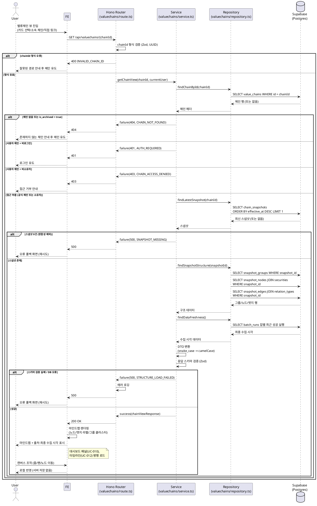

# UC-009: 밸류체인 뷰 조회 (마인드맵·그룹 렌더링)

> 근거 문서: `docs/prd.md`(3장 밸류체인 뷰 페이지, 6장 데이터 정책), `docs/userflow.md` 009, `docs/database.md`(3.3 스냅샷 테이블, 4.1 스냅샷 복원 쿼리), `docs/techstack.md`(§4 계층 구조, §7 DB 접근).
> 연계 유스케이스: 010(대시보드 패널), 011(노드 클릭), 012(시점 타임라인) — 같은 페이지에서 병행 동작하며 각각 별도 문서로 다룬다. 본 문서는 **구조(노드/엣지/그룹) 로드와 마인드맵 렌더링**만 다룬다.

---

## Primary Actor

- **Guest**(비로그인 방문자) — 공식 밸류체인 열람.
- **User**(로그인 사용자) — 공식 밸류체인 + 본인 소유 사용자 밸류체인 열람.

## Precondition (사용자 관점)

- 사용자가 밸류체인 뷰 페이지(`/valuechains/[chainId]`)에 진입할 수 있는 경로(메인 카드 목록, 기업 상세의 소속 체인 목록, 직접 링크)를 확보한 상태다.
- 사용자 체인을 열람하려는 경우, 해당 체인의 소유자로 로그인된 상태다.
- (공식 체인 열람에는 로그인이 필요 없다.)

## Trigger

- 사용자가 공식/내 밸류체인 카드를 선택하거나, 기업 상세의 소속 체인 항목을 선택하거나, 뷰 페이지 URL로 직접 진입한다.

## Main Scenario

1. 사용자가 밸류체인 뷰 페이지(`/valuechains/[chainId]`)에 진입한다.
2. FE가 체인 구조 조회 API(`GET /api/valuechains/{chainId}`)를 호출한다.
3. BE(Hono Router)가 `chainId` 경로 파라미터 형식을 검증한다.
4. BE(Service)가 체인 헤더를 조회하고 접근 권한을 검증한다.
   - 공식 체인(`chain_type=official`, `is_archived=false`): 누구나 열람 가능.
   - 사용자 체인(`chain_type=user`): 로그인 + 소유자(`owner_id`)만 열람 가능.
   - 미존재/보관(`is_archived=true`) 체인: 조회 불가 처리.
5. BE(Service)가 현재 시점 기준 구성을 로드한다. 시점 미지정이므로 **최신 스냅샷**(`effective_at` 최대 1건)을 조회한다.
6. BE(Repository)가 해당 스냅샷의 그룹(`snapshot_groups`), 노드(`snapshot_nodes`), 엣지(`snapshot_edges`)를 로드한다.
   - 상장기업 노드(`node_kind=listed_company`)는 종목 마스터(`securities`)를 조인해 표시 정보(티커/종목명/시장/상장상태)를 포함한다.
   - 엣지는 관계 종류 마스터(`relation_types`)를 조인해 라벨(최신 이름)·방향성(`is_directed`)을 포함한다.
7. BE(Repository)가 데이터 출처·최종 수집 시각 표기용 데이터(배치 실행 이력의 최근 성공 시각)를 로드한다.
8. BE(Service)가 조회 결과를 응답 DTO로 변환(snake_case → camelCase)하고 응답 스키마를 검증한 뒤 반환한다.
9. FE가 응답을 받아 마인드맵을 렌더링한다.
   - 노드: 주체(상장기업/자유 주체) 표시. 저장된 좌표(`position`)가 있으면 그대로 배치, 없으면 자동 레이아웃으로 배치.
   - 엣지: 관계 종류 라벨 표시, 방향성 속성(유향/무향)에 따라 화살표 표시.
   - 그룹: 같은 그룹의 노드들을 시각적 묶음(배경 영역/클러스터)과 그룹 라벨로 표시.
10. FE가 데이터 출처(금융감독원 DART, SEC EDGAR, 토스증권)와 최종 수집 시각을 화면에 표기한다.
11. FE가 동일 페이지의 대시보드 패널(UC-010)·시점 타임라인(UC-012)을 병행 로드한다.
12. 사용자가 캔버스를 조작(줌/팬/노드 위치 이동)하면 FE가 로컬에서만 반영한다(서버 저장 없음 — 편집·저장은 UC-015~018).

## Edge Cases

| # | 상황 | 처리 |
|---|---|---|
| E1 | 존재하지 않는/삭제(보관)된 체인 진입 | 404 응답 → FE가 안내 메시지 표시 후 메인으로 유도 |
| E2 | 사용자 체인에 비로그인 상태로 접근 | 401 응답 → 로그인 유도 |
| E3 | 사용자 체인에 로그인했으나 비소유자가 접근 | 403 응답 → 접근 거부 안내 |
| E4 | 노드/엣지 대량(체인당 상한 100개 근접)으로 렌더링 성능 저하 | FE에서 뷰포트 밖 요소 렌더링 생략(가상화)·그룹 클러스터 접힘 등으로 대응. API는 단일 응답 유지(상한 100개 규모) |
| E5 | 관계 종류가 비활성화(`is_active=false`)된 엣지 | 기존 엣지·과거 스냅샷은 유지·표시(라벨은 관계 종류의 최신 이름). 비활성화는 신규 선택만 차단하는 정책이므로 뷰에는 영향 없음 |
| E6 | 고립 노드(연결 엣지 없음)/그룹 미소속 노드 | 정상 표시(그룹 미소속 노드는 클러스터 밖에 배치) |
| E7 | 그룹만 있고 소속 노드 0개(빈 그룹) | 스냅샷에 존재하는 빈 그룹은 라벨만 있는 빈 클러스터로 표시(기본안 — Open Question 참조) |
| E8 | 구조 데이터 로드 실패(DB 오류/응답 스키마 검증 실패) | 500 응답 → FE가 오류 폴백 화면(재시도 버튼) 표시. 대시보드/타임라인 로드 실패와 독립적으로 처리 |
| E9 | 체인은 존재하나 스냅샷이 0건(정합성 예외 — 저장 1회=1스냅샷 원칙상 정상 경로에서는 발생 불가) | 500(정합성 오류) 응답 → 오류 폴백. 운영 로그로 추적 |
| E10 | 상장기업 노드의 종목이 상장폐지/거래정지 상태 | 노드는 유지·표시(`securities.listing_status`는 소프트 상태), 상태 정보를 응답에 포함해 FE가 배지 등으로 구분 표시 가능 |
| E11 | 저장된 노드 좌표(`position_x/y`)가 NULL | FE 자동 레이아웃으로 폴백 배치 |
| E12 | `chainId` 형식 오류(UUID 아님) | 400 응답 → 잘못된 경로 안내 후 메인 유도 |
| E13 | 최종 수집 시각 데이터 없음(배치 미실행 초기 상태) | 수집 시각 미표기 또는 "수집 전" 표기. 구조 렌더링은 정상 진행(구조는 시세와 무관) |

## Business Rules

### BR-1. 접근 제어

- 공식 체인(`official`)은 전체 공개 — 비로그인 열람 허용.
- 사용자 체인(`user`)은 소유자 본인만 열람 가능. 서버 측에서 세션 기반으로 `owner_id` 대조(클라이언트 우회 방지).
- 보관된 공식 체인(`is_archived=true` — UC-021의 "삭제=보관" 정책)은 일반 뷰에서 미존재와 동일하게 처리(404).

### BR-2. 현재 구성 = 최신 스냅샷

- 별도 "현재 구성" 테이블 없이, `chain_snapshots`에서 `effective_at`이 가장 큰 스냅샷 1건이 현재 구성이다(이벤트 소싱, database.md 1.2).
- 시점 지정 조회(`?at=날짜`)는 UC-012 범위이며, 본 유스케이스는 시점 미지정(최신) 경로만 다룬다.

### BR-3. 조회 전용 (사이드이펙트 없음)

- 본 기능은 어떤 데이터도 생성/수정/삭제하지 않는다.
- 뷰에서의 노드 위치 이동은 표시용이며 저장하지 않는다(좌표 저장은 편집 저장 UC-018에서만 수행).

### BR-4. 렌더링 규칙

- 노드는 상장기업 노드(종목 마스터 연결)와 자유 주체 노드(이름/주체 유형/설명 메모)를 구분해 표시한다.
- 엣지 라벨은 관계 종류 마스터의 **최신 이름**을 따른다(라벨 이력 미보존 — UC-024 정책). 비활성 관계 종류의 기존 엣지도 유지·표시한다.
- 그룹은 시각적 묶음 + 그룹 라벨로 표시하며, 한 노드는 최대 1개 그룹에 속한다(중첩 없음).
- 엣지 방향성은 관계 종류 마스터의 `is_directed` 속성을 따른다(유향=화살표, 무향=무화살표).
- 데이터 출처(DART/SEC EDGAR/토스증권)·최종 수집 시각을 화면에 표기한다(PRD 법적 고지 정책).
- 시세 데이터 미수집/장애 시에도 구조 렌더링은 영향 없이 동작한다(폴백은 UC-010에서 지표 영역만 처리).

### BR-5. 규모 상한

- 체인당 노드 최대 100개(상수 `MAX_NODES_PER_CHAIN`, `packages/domain/constants`)를 전제로 단일 응답·단일 캔버스 렌더링을 설계한다. 상한 근접 시 FE 성능 대응(E4)을 적용한다.

### BR-6. API Specification

#### `GET /api/valuechains/{chainId}` — 밸류체인 구조(최신 스냅샷) 조회

- **인증**: 선택적(Optional). 세션이 있으면 사용자 식별에 사용, 없으면 Guest로 처리. 공식 체인은 무인증 접근 허용, 사용자 체인은 세션 필수.
- **Path Parameters**

| 이름 | 타입 | 필수 | 설명 |
|---|---|---|---|
| `chainId` | string (UUID) | Y | 조회할 밸류체인 ID |

- **Query Parameters**: 없음. (시점 지정 `at` 파라미터는 UC-012에서 동일 엔드포인트 확장으로 정의)

- **Response 200 (성공)**

```json
{
  "ok": true,
  "data": {
    "chain": {
      "id": "c3f1…(uuid)",
      "name": "2차전지",
      "chainType": "official",
      "focusType": "industry",
      "focusSecurity": null,
      "isOwner": false
    },
    "snapshot": {
      "id": "a9d2…(uuid)",
      "effectiveAt": "2026-07-01T09:30:00+09:00",
      "changeSource": "admin_edit"
    },
    "groups": [
      { "id": "g1…(uuid)", "name": "소재" }
    ],
    "nodes": [
      {
        "id": "n1…(uuid)",
        "groupId": "g1…(uuid)",
        "nodeKind": "listed_company",
        "security": {
          "id": "s1…(uuid)",
          "ticker": "005930",
          "name": "삼성전자",
          "market": "KRX",
          "listingStatus": "listed"
        },
        "subjectName": null,
        "subjectType": null,
        "subjectMemo": null,
        "position": { "x": 120.5, "y": -80.0 }
      },
      {
        "id": "n2…(uuid)",
        "groupId": null,
        "nodeKind": "free_subject",
        "security": null,
        "subjectName": "소비자",
        "subjectType": "consumer",
        "subjectMemo": "최종 수요층",
        "position": null
      }
    ],
    "edges": [
      {
        "id": "e1…(uuid)",
        "sourceNodeId": "n1…(uuid)",
        "targetNodeId": "n2…(uuid)",
        "relationType": {
          "id": "r1…(uuid)",
          "name": "공급",
          "isDirected": true,
          "isActive": true
        }
      }
    ],
    "dataFreshness": {
      "sources": ["금융감독원 DART", "SEC EDGAR", "토스증권"],
      "lastCollectedAt": {
        "quotes": "2026-07-05T15:10:00+09:00",
        "financials": "2026-07-05T06:00:00+09:00",
        "fxAndMarketHours": "2026-07-05T05:30:00+09:00"
      }
    }
  }
}
```

  - `chain.focusSecurity`: 기업 중심 체인(`focusType=company`)일 때만 `{ id, ticker, name, market }`, 산업 중심이면 `null`.
  - `chain.isOwner`: 로그인 사용자가 소유자인지 여부(FE의 편집 진입 버튼 노출 판단용). Guest·공식 체인은 `false`.
  - `nodes[].position`: 저장 당시 좌표. `null`이면 FE 자동 레이아웃(E11).
  - `dataFreshness.lastCollectedAt.*`: 각 수집 배치의 최근 성공 실행 종료 시각. 해당 배치 이력이 없으면 `null`(E13).

- **Error Responses** (에러 코드는 feature `error.ts`에 정의)

| HTTP | code | 조건 |
|---|---|---|
| 400 | `INVALID_CHAIN_ID` | `chainId`가 UUID 형식이 아님 (E12) |
| 401 | `AUTH_REQUIRED` | 사용자 체인에 비로그인 접근 (E2) |
| 403 | `CHAIN_ACCESS_DENIED` | 사용자 체인에 비소유자 접근 (E3) |
| 404 | `CHAIN_NOT_FOUND` | 미존재 체인 또는 보관(`is_archived=true`)된 공식 체인 (E1) |
| 500 | `SNAPSHOT_MISSING` | 체인은 존재하나 스냅샷 0건 — 정합성 예외 (E9) |
| 500 | `STRUCTURE_LOAD_FAILED` | DB 조회 실패 또는 행/응답 스키마 검증 실패 (E8) |

  에러 응답 형태(공통 `failure()` 헬퍼):

```json
{
  "ok": false,
  "error": {
    "code": "CHAIN_NOT_FOUND",
    "message": "체인을 찾을 수 없습니다."
  }
}
```

### BR-7. Database Operations

모든 연산은 **SELECT 전용**이다(INSERT/UPDATE/DELETE 없음). 복잡한 스냅샷 복원 조회는 techstack §7에 따라 Postgres 함수/뷰로 캡슐화하고 `client.rpc()`로 호출할 수 있다(UC-012의 시점 복원 함수와 공유 — 본 유스케이스는 `as_of = 현재`인 특수 케이스).

| 순서 | 테이블 | 연산 | 목적 |
|---|---|---|---|
| 1 | `value_chains` | SELECT (id 단건) | 체인 헤더 조회, `chain_type`/`owner_id`/`is_archived` 기반 접근 제어(BR-1), `focus_security_id` 확인 |
| 2 | `chain_snapshots` | SELECT (`chain_id` 기준 `effective_at DESC LIMIT 1`) | 최신 스냅샷 1건 식별(BR-2, database.md 4.1) |
| 3 | `snapshot_groups` | SELECT (`snapshot_id` 기준) | 그룹 목록(클러스터·라벨) |
| 4 | `snapshot_nodes` | SELECT (`snapshot_id` 기준, `securities` 조인) | 노드 목록 + 상장기업 노드 표시 정보(티커/종목명/시장/상장상태) + 좌표 |
| 5 | `snapshot_edges` | SELECT (`snapshot_id` 기준, `relation_types` 조인) | 엣지 목록 + 관계 라벨(최신 이름)·방향성·활성 여부 |
| 6 | `securities` | SELECT (단건, `focus_security_id`) | 기업 중심 체인의 기준 종목 표시 정보(1의 조인으로 대체 가능) |
| 7 | `batch_runs` | SELECT (`job_type`별 최근 `success`/`partial_success` 1건) | 최종 수집 시각 표기 데이터(`collect_quotes`/`collect_financials`/`collect_fx_market_hours`) |

### BR-8. External Service Integration

- **없음.** 본 기능은 자체 DB만 조회한다. 외부 API(OpenDART, SEC EDGAR, 토스증권 Open API)는 배치 적재 전용이며(PRD 8장), 뷰 조회 요청 경로에서 호출되지 않는다.
- 화면의 데이터 출처·최종 수집 시각 표기는 외부 호출이 아니라 DB(`batch_runs`)에 기록된 배치 이력에서 읽는다.

---

## Sequence Diagram


