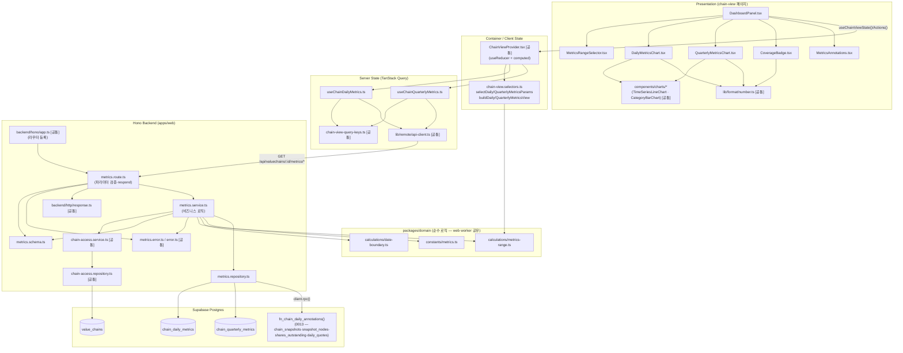

# Plan: UC-010 밸류체인 대시보드 패널 조회

> 근거: `docs/usecases/010/spec.md`, `docs/usecases/000_decisions.md`(C-2·C-4~C-8 — spec과 충돌 시 우선), `docs/techstack.md` §4(모노레포 Codebase Structure)·§7(DB 접근), `docs/database.md` §3.7·§4.2, `docs/pages/chain-view/state_management.md`(본 기능이 속한 페이지의 상태관리 SOT — FE 계약을 그대로 따름), `.claude/skills/spec_to_plan/references/hono-backend-guide.md`.
>
> **확정 결정 반영(spec 본문 대체)**:
> - **C-2**: 사용자 체인 비소유자·비로그인 접근은 `403 CHAIN_ACCESS_DENIED`가 아니라 **`404 CHAIN_NOT_FOUND`로 통일**(체인 존재 자체 비노출). spec §6.3의 403 기술을 본 결정이 대체한다.
> - **C-4**: 주식수 기준일은 구성 종목 `as_of_date`의 min~max 범위로 표기.
> - **C-5**: 대시보드 기본 조회 기간 = 최근 1년(상수).
> - **C-6**: 날짜 경계 시간대 Asia/Seoul 고정, 당일 종료(23:59:59) 경계 포함, 상수 관리.
> - **C-7**: 시점 선택 시 추이 그래프는 전체 유지 + 선택 시점 하이라이트(FE 파생, 시리즈 재구성 없음).
> - **C-8**: 미확정(진행 중) 분기 지표는 `null` 응답 + "미제공" 표기(폴백 없음).
>
> **외부 서비스 연동**: spec §6.5에 따라 **요청 시점 외부 연동 없음**. 모든 지표는 배치(UC-026~029)가 사전 집계한 자체 DB에서만 SELECT한다. 따라서 본 plan에는 외부 서비스 클라이언트 모듈이 없다(간접 의존은 UC-026~029 plan 범위).
>
> **코드베이스 충돌 검토**: 현재 저장소에 `apps/`·`packages/` 스캐폴드와 다른 유스케이스 plan.md가 아직 없다(파이프라인 Phase 8 최초 plan). 본 plan이 정의하는 [공통] 모듈(체인 접근 검증, 도메인 상수/계산, HTTP 인프라, 차트 래퍼)은 UC-009/011/012 plan이 **위치만 참조**하는 기준이 된다. 마이그레이션은 0001~0012가 존재하므로 신규 함수는 **0013** 번호를 사용한다.

---

## 개요

| 모듈 | 위치 | 설명 |
| --- | --- | --- |
| **[공통] 지표 상수** | `packages/domain/constants/metrics.ts` | `TIMESERIES_MIN_START_DATE('2015-01-01')`, `TIMESERIES_MIN_CALENDAR_YEAR(2015)`, `DASHBOARD_DEFAULT_RANGE_PRESET('1Y', C-5)`, `METRICS_RANGE_PRESETS`, `APP_TIMEZONE('Asia/Seoul', C-6)` 등. UC-012·UC-029·FE 셀렉터 공유 |
| **[공통] 기간 보정·분기 축 계산** | `packages/domain/calculations/metrics-range.ts` | 일별 from/to 기본값·하한/상한 보정(E8·E11), 역년 분기 변환(`dateToCalendarQuarter`)·분기 범위 해석·비교. 순수 함수 — web BE/FE·worker(029) 공유 |
| **[공통] 날짜 경계 계산** | `packages/domain/calculations/date-boundary.ts` | `toDayEndBoundary(date)` — Asia/Seoul 당일 종료(23:59:59) 경계 timestamptz 문자열 산출(C-6). UC-012 스냅샷 복원과 공유 |
| **[공통] HTTP 응답 인프라** | `apps/web/src/backend/http/response.ts` | `success()/failure()/respond()/HandlerResult` — 전 기능 공유(hono-backend-guide 컨벤션). 본 plan은 위치만 참조 |
| **[공통] Hono 앱·미들웨어** | `apps/web/src/backend/hono/app.ts`, `apps/web/src/backend/middleware/*` | 싱글턴 앱, `errorBoundary`→`withAppContext`→`withSupabase` 체인, 선택적 인증(세션 있으면 userId 주입). 본 plan은 라우터 등록 1줄만 추가 |
| **[공통] 체인 공통 에러 코드** | `apps/web/src/features/valuechains/backend/error.ts` | `CHAIN_NOT_FOUND`, `INVALID_REQUEST` 등 valuechains 기능 공통 코드(UC-009~012 공유) |
| **[공통] 체인 접근 검증 Repository** | `apps/web/src/features/valuechains/backend/chain-access.repository.ts` | `value_chains` 단건 SELECT 캡슐화(UC-009~012 공유) |
| **[공통] 체인 접근 검증 Service** | `apps/web/src/features/valuechains/backend/chain-access.service.ts` | 공식/사용자/보관 체인 열람 권한 판정(C-2: 404 통일). UC-009~012 공유 |
| 지표 스키마 | `apps/web/src/features/valuechains/backend/metrics.schema.ts` | Query/Row/Response Zod 스키마(일별·분기) + 타입 export |
| 지표 에러 코드 | `apps/web/src/features/valuechains/backend/metrics.error.ts` | `METRICS_FETCH_ERROR`, `METRICS_VALIDATION_ERROR` |
| 지표 Repository | `apps/web/src/features/valuechains/backend/metrics.repository.ts` | `chain_daily_metrics`/`chain_quarterly_metrics` SELECT + 주석 메타 RPC 호출 캡슐화. `ChainMetricsRepository` 인터페이스 노출 |
| 지표 Service | `apps/web/src/features/valuechains/backend/metrics.service.ts` | 접근 검증→기간 해석→조회→커버리지/주석 구성→Row 검증→DTO 변환→Response 검증(`HandlerResult`) |
| 지표 Route | `apps/web/src/features/valuechains/backend/metrics.route.ts` | `GET /valuechains/:chainId/metrics/daily`·`/quarterly` — 파라미터 Zod 검증·서비스 호출·에러 로깅·`respond()` |
| 주석 메타 DB 함수 | `supabase/migrations/0013_fn_chain_daily_annotations.sql` | 유효 스냅샷→상장기업 노드→최신 `shares_outstanding` 기준일 min/max + 종가 확정 여부를 단일 RPC로 캡슐화(techstack §7) |
| **[공통] API 클라이언트** | `apps/web/src/lib/remote/api-client.ts` | fetch 래퍼(공통 에러 파싱 → `ApiError`). 전 기능 공유 — 위치만 참조 |
| **[공통] 쿼리 키** | `apps/web/src/features/valuechains/hooks/chain-view-query-keys.ts` | chain-view 페이지 공유 쿼리 키 팩토리. 본 plan은 `dailyMetrics`/`quarterlyMetrics` 키 2종 담당 |
| 일별 지표 쿼리 훅 | `apps/web/src/features/valuechains/hooks/useChainDailyMetrics.ts` | TanStack Query — `keepPreviousData`, 지표 패널 독립 실패 |
| 분기 지표 쿼리 훅 | `apps/web/src/features/valuechains/hooks/useChainQuarterlyMetrics.ts` | 위와 동일(분기 축) |
| **[공통] 셀렉터·뷰모델 빌더** | `apps/web/src/features/valuechains/state/chain-view.selectors.ts` | 상태관리 문서 §5 공유 파일. 본 plan 담당: `selectDailyMetricsParams`/`selectQuarterlyMetricsParams`/`buildDailyMetricsView`/`buildQuarterlyMetricsView`(순수 함수) |
| **[공통] ChainViewProvider 연결부** | `apps/web/src/features/valuechains/context/ChainViewProvider.tsx` | 페이지 공유 Container(상태관리 문서 §8). 본 plan 담당: 지표 쿼리 2종 실행 + `dailyMetrics`/`quarterlyMetrics` computed 조립 + `changeDashboardRange`/`retry*Metrics` 액션 |
| **[공통] 시계열 라인차트 래퍼** | `apps/web/src/components/charts/TimeSeriesLineChart.tsx` | recharts 라인차트 프레젠테이션 래퍼(카테고리 x축·하이라이트·툴팁 슬롯). company-detail 등 재사용 가능 |
| **[공통] 카테고리 막대차트 래퍼** | `apps/web/src/components/charts/CategoryBarChart.tsx` | recharts 막대차트 래퍼(분기 축·null 구간 표시). 재사용 가능 |
| **[공통] KRW 숫자 포맷터** | `apps/web/src/lib/format/number.ts` | 조/억 단위 KRW 표기·null → "미산출/미제공" 구분 문자열. 전 기능 공유 |
| 대시보드 패널 컨테이너 | `apps/web/src/features/valuechains/components/DashboardPanel.tsx` | 현재값 카드 + 기간 선택 + 차트 2종 배치(Presenter — Context 훅만 소비) |
| 기간 선택기 | `apps/web/src/features/valuechains/components/MetricsRangeSelector.tsx` | 1M/3M/6M/1Y/3Y/MAX 프리셋 + 커스텀(하한 제한, E8) |
| 일별 지표 차트 | `apps/web/src/features/valuechains/components/DailyMetricsChart.tsx` | 가치총액 추이(거래일만·이월/미확정 표기·하이라이트 C-7) |
| 분기 지표 차트 | `apps/web/src/features/valuechains/components/QuarterlyMetricsChart.tsx` | 분기 매출 합계(역년 축·"미제공"·제외 기업 수) |
| 커버리지 배지 | `apps/web/src/features/valuechains/components/CoverageBadge.tsx` | "지표 반영 n / 전체 m 노드"(일별·분기 공용) |
| 지표 주석/툴팁 | `apps/web/src/features/valuechains/components/MetricsAnnotations.tsx` | 주식수 기준일 범위(C-4)·환산 기준·매출 중복 안내·기준 통화 KRW |

---

## Diagram

데이터 흐름: Presenter → (Context 훅) → Provider/Query → api-client → route → service → repository → Supabase. 외부 서비스 노드 없음(조회 전용 — 집계 데이터는 UC-026~029 배치가 공급).

---

## Implementation Plan

### 1. [공통] 지표 상수 — `packages/domain/constants/metrics.ts`

- 구현 내용:
  1. `TIMESERIES_MIN_START_DATE = '2015-01-01'` (E8 하한), `TIMESERIES_MIN_CALENDAR_YEAR = 2015`, `TIMESERIES_MIN_QUARTER = 1`.
  2. `DASHBOARD_DEFAULT_RANGE_PRESET = '1Y'` (C-5), `METRICS_RANGE_PRESETS = ['1M','3M','6M','1Y','3Y','MAX'] as const`.
  3. `APP_TIMEZONE = 'Asia/Seoul'`, `DAY_END_TIME = '23:59:59'` (C-6).
  4. `BASE_CURRENCY = 'KRW'`, `FX_BASIS_DAILY = 'daily'`, `FX_BASIS_QUARTER_END = 'quarter_end'`(annotations 리터럴 원천).
  5. 프레임워크 의존성 없는 순수 상수만 포함. `as const` + 리터럴 타입 export.
- 의존성: 없음(최하위 모듈).
- Unit Tests: 상수 정의만 — 테스트 불필요(N/A).

### 2. [공통] 기간 보정·분기 축 계산 — `packages/domain/calculations/metrics-range.ts`

- 구현 내용:
  1. `presetToDailyRange(preset, today): { from, to }` — 프리셋별 시작일 산출(`MAX`는 `TIMESERIES_MIN_START_DATE`부터). `date-fns` 사용, "오늘"은 항상 인자 주입(순수성).
  2. `resolveDailyMetricsRange(input: { from?, to?, at?, today }): { ok: true; from; to; at: string | null } | { ok: false; reason: 'FROM_AFTER_TO' | 'AT_OUT_OF_RANGE' }`
     - 기본값: from/to 미지정 시 `DASHBOARD_DEFAULT_RANGE_PRESET`(1Y) 적용(C-5).
     - 보정: `from < TIMESERIES_MIN_START_DATE` → 하한으로 클램프(E8), `to > today` → today로 보정(E11).
     - 보정 후 `from > to` → `FROM_AFTER_TO`(보정 불가 조합만 실패 — E11).
     - `at`이 `[TIMESERIES_MIN_START_DATE, today]` 범위 밖이면 `AT_OUT_OF_RANGE`.
  3. `dateToCalendarQuarter(date): { calendarYear, calendarQuarter }` — 역년 정규화 분기 변환(UC-029 워커 집계와 공유되는 단일 정의 — DRY).
  4. `quarterOrdinal(year, quarter): number`(= year*4 + quarter-1)와 `resolveQuarterlyMetricsRange(input: { fromYear?, fromQuarter?, toYear?, toQuarter?, at?, today }): { ok: true; from: {year,quarter}; to: {year,quarter}; atQuarter: {year,quarter} | null } | { ok: false; reason }`
     - 기본값: 오늘 기준 최근 1년(오늘 분기 포함 직전 4개 분기 ~ 오늘 분기, C-5).
     - 하한 2015Q1 클램프, `to` 미래 분기 → 오늘 분기로 보정, from > to → 실패.
     - `at` 지정 시 `dateToCalendarQuarter(at)`를 `atQuarter`로 산출.
  5. 모든 함수는 순수 함수 — I/O·`Date.now()` 금지.
- 의존성: 모듈 1.
- **Unit Tests:**
  - [ ] `presetToDailyRange('1Y', '2026-07-06')` → from `2025-07-06`, to `2026-07-06`.
  - [ ] `presetToDailyRange('MAX', today)` → from = `TIMESERIES_MIN_START_DATE`.
  - [ ] `resolveDailyMetricsRange({ today })` (파라미터 전부 미지정) → 기본 1Y 범위(C-5).
  - [ ] `from='2010-01-01'` → `2015-01-01`로 클램프(E8).
  - [ ] `to='2030-01-01'` → today로 보정(E11).
  - [ ] `from='2026-07-01', to='2026-06-01'` → `{ ok: false, reason: 'FROM_AFTER_TO' }`.
  - [ ] `at='2030-01-01'` 또는 `at='2014-12-31'` → `AT_OUT_OF_RANGE`.
  - [ ] `dateToCalendarQuarter('2026-01-01')`→2026Q1, `('2026-03-31')`→Q1, `('2026-04-01')`→Q2, `('2026-12-31')`→Q4 (경계값).
  - [ ] `resolveQuarterlyMetricsRange` 기본값 → 오늘 분기 포함 최근 5개 분기 범위, 하한 2015Q1 클램프, fromOrdinal > toOrdinal → 실패.
  - [ ] fromYear만 있고 fromQuarter 누락 등 짝 불일치 → 실패(`INVALID_PAIR`).

### 3. [공통] 날짜 경계 계산 — `packages/domain/calculations/date-boundary.ts`

- 구현 내용:
  1. `toDayEndBoundary(date: IsoDate): string` — `date-fns-tz`로 `APP_TIMEZONE` 기준 해당 일자 23:59:59를 UTC ISO 문자열(timestamptz 파라미터용)로 변환(C-6). UC-010의 유효 스냅샷 판정(`effective_at <= 경계`)과 UC-012 시점 복원이 동일 함수를 사용한다(DRY).
  2. `todayInAppTz(now: Date): IsoDate` — 서버/클라이언트에서 "오늘"(Asia/Seoul) 산출. `now`는 인자 주입.
- 의존성: 모듈 1.
- **Unit Tests:**
  - [ ] `toDayEndBoundary('2026-07-06')` → `2026-07-06T14:59:59.000Z`(KST 23:59:59의 UTC 표현).
  - [ ] 연말 경계 `'2026-12-31'` → 올바른 UTC 변환(연도 전환 무결성).
  - [ ] `todayInAppTz(new Date('2026-07-06T16:00:00Z'))` → `'2026-07-07'`(UTC 16시 = KST 익일 01시).

### 4. [공통] HTTP 인프라·Hono 앱·미들웨어 — `apps/web/src/backend/{http,hono,middleware}` (위치 참조)

- 구현 내용: hono-backend-guide 컨벤션 그대로 — `response.ts`(`success/failure/respond/HandlerResult`), `hono/app.ts`(싱글턴 + 미들웨어 체인), `hono/context.ts`(`getSupabase/getLogger/AppEnv`), `middleware/`(errorBoundary·withAppContext·withSupabase). **선택적 인증**: withAppContext가 Supabase 세션을 해석해 `currentUserId: string | null`을 컨텍스트에 주입(공식 체인 무인증 열람 허용의 전제). 이 인프라는 전 기능 공통이므로 최초 구현 plan(환경설정 단계 또는 선행 기능 plan)에서 1회 생성하며, 본 plan에서는 **`app.ts`에 `registerValuechainMetricsRoutes(app)` 1줄 등록만** 수행한다.
- 의존성: 없음(전역 인프라).
- **QA Sheet (등록 확인):**

| # | 시나리오 | 기대 결과 |
| --- | --- | --- |
| 1 | `GET /api/valuechains/{uuid}/metrics/daily` 호출 | 404가 아닌 기능 응답(200/400/404)이 반환됨 — 라우트 등록 확인 |
| 2 | 미들웨어 체인 통과 | 로그·컨텍스트(`getSupabase`) 정상 주입, 세션 없는 요청도 통과(Optional auth) |
| 3 | 기존 라우트(UC-009 구조 API 등)와 경로 충돌 없음 | `/valuechains/:chainId`와 `/valuechains/:chainId/metrics/*` 공존 |

### 5. [공통] 체인 공통 에러 코드 — `apps/web/src/features/valuechains/backend/error.ts`

- 구현 내용:
  1. `valuechainErrorCodes = { invalidRequest: 'INVALID_REQUEST', chainNotFound: 'CHAIN_NOT_FOUND' } as const` + 타입 export.
  2. **C-2에 따라 `CHAIN_ACCESS_DENIED`(403)·`AUTH_REQUIRED`(401)는 뷰 조회 계열(009~012)에서 정의·사용하지 않는다** — 사용자 체인 비소유자/비로그인은 `CHAIN_NOT_FOUND`(404)로 응답(존재 비노출). FE는 방어적으로 401/403도 not-found 처리(상태관리 문서 §8.2).
  3. UC-009/011/012 plan은 이 파일을 참조·확장한다(중복 정의 금지).
- 의존성: 없음.
- Unit Tests: 상수 정의 — N/A.

### 6. [공통] 체인 접근 검증 Repository — `apps/web/src/features/valuechains/backend/chain-access.repository.ts`

- 구현 내용:
  1. `ChainAccessRepository` 인터페이스: `findChainHeader(chainId: string): Promise<ChainHeaderRow | null>`.
  2. `createChainAccessRepository(client: SupabaseClient): ChainAccessRepository` — `value_chains`에서 `id, chain_type, owner_id, is_archived` 단건 SELECT(`maybeSingle`). DB 오류는 repository 전용 에러 값(`{ kind: 'db_error', message }`)으로 반환(throw 금지 — Result 스타일).
  3. Supabase 쿼리 문법은 이 파일 밖으로 노출하지 않는다(service는 인터페이스에만 의존).
- 의존성: 모듈 4(SupabaseClient 주입 경로).
- **Unit Tests:**
  - [ ] 존재하는 chainId → 헤더 Row 반환(필드 매핑 확인).
  - [ ] 미존재 chainId → `null`.
  - [ ] Supabase error 응답 mock → `db_error` 반환(예외 미발생).

### 7. [공통] 체인 접근 검증 Service — `apps/web/src/features/valuechains/backend/chain-access.service.ts`

- 구현 내용:
  1. `verifyChainReadAccess(repo: ChainAccessRepository, chainId: string, currentUserId: string | null): Promise<{ ok: true; chain: ChainHeader } | { ok: false; status: 404 | 500; code: 'CHAIN_NOT_FOUND' | 'METRICS_FETCH_ERROR'; message }>` 형태의 판정 함수(HandlerResult 호환 구조).
  2. 판정 규칙(spec §6.2 + C-2):
     - 체인 미존재 → 404 `CHAIN_NOT_FOUND` (E9).
     - `is_archived = true` → 404 `CHAIN_NOT_FOUND` (E9 — 공식/사용자 공통).
     - `chain_type = 'official'` → 허용(비로그인 포함).
     - `chain_type = 'user'` && `owner_id === currentUserId` → 허용.
     - `chain_type = 'user'` && (비로그인 또는 비소유자) → **404 `CHAIN_NOT_FOUND`** (C-2, E10 대체).
     - repository `db_error` → 500(호출 기능의 fetch 에러 코드로 매핑은 호출측 책임 — 코드 파라미터화).
  3. UC-009/011/012의 service가 동일 함수를 재사용한다(DRY — 각 plan은 본 모듈 참조).
- 의존성: 모듈 5, 6.
- **Unit Tests:**
  - [ ] 공식 체인 + 비로그인(`currentUserId=null`) → 허용.
  - [ ] 공식 체인 + `is_archived=true` → 404.
  - [ ] 사용자 체인 + 소유자 → 허용.
  - [ ] 사용자 체인 + 비소유자 → **404**(403 아님 — C-2).
  - [ ] 사용자 체인 + 비로그인 → **404**(C-2).
  - [ ] 미존재 체인 → 404.
  - [ ] repository db_error → 500.

### 8. 지표 스키마 — `apps/web/src/features/valuechains/backend/metrics.schema.ts`

- 구현 내용:
  1. **Query 스키마(camelCase 아님 — 쿼리스트링 그대로)**:
     - `DailyMetricsQuerySchema`: `{ from?, to?, at? }` — 각각 `YYYY-MM-DD` 정규식 + 실존 날짜 검증(zod refine). `from > to` 판정은 보정 이후이므로 여기서 하지 않는다(모듈 2가 담당).
     - `QuarterlyMetricsQuerySchema`: `{ fromYear?, fromQuarter?, toYear?, toQuarter?, at? }` — `z.coerce.number().int()`, quarter는 1~4. 연/분기 짝 일치(refine: fromYear ↔ fromQuarter 동시 존재).
     - `ChainIdParamSchema`: `z.string().uuid()`.
  2. **Row 스키마(snake_case — 마이그레이션 0010과 1:1)**:
     - `DailyMetricRowSchema`: `{ metric_date: string, total_market_cap_krw: (문자열/숫자 → number 변환) | null, covered_node_count: int, total_node_count: int, is_carried_forward: boolean, based_on_snapshot_id: string(uuid) | null }` — `numeric(28,2)`는 supabase-js가 문자열로 반환하므로 `z.coerce.number().nullable()` 처리.
     - `QuarterlyMetricRowSchema`: `{ calendar_year, calendar_quarter, total_revenue_krw | null, covered_node_count, total_node_count, excluded_unmapped_count, based_on_snapshot_id | null }`.
     - `DailyAnnotationsRowSchema`(RPC 결과): `{ shares_as_of_min: string | null, shares_as_of_max: string | null, all_closing_confirmed: boolean }`.
  3. **Response 스키마(camelCase — spec §6.3)**:
     - `DailyMetricsResponseSchema`: `{ chainId, current: {...} | null, series: [...], annotations: { baseCurrency: 'KRW', fxBasis: 'daily', sharesAsOfDateMin | null, sharesAsOfDateMax | null, isClosingConfirmed: boolean } }`.
     - `QuarterlyMetricsResponseSchema`: `{ chainId, current | null, series, annotations: { baseCurrency: 'KRW', fxBasis: 'quarter_end', revenueOverlapNotice: true } }`.
     - **구현 노트(spec 보정)**: `current.basedOnSnapshotId`는 DB FK가 `ON DELETE SET NULL`이므로 **`string | null`**로 정의한다(spec 표기는 non-null이나 Row 정합 우선 — 검증 오류 방지). `totalMarketCapKrw`/`totalRevenueKrw`는 `number | null`(미산출 null과 0 구분 — E1·C-8).
  4. 모든 타입(`z.infer`) export — FE 훅이 동일 타입을 import(단일 계약).
- 의존성: 모듈 1(리터럴 상수 참조).
- Unit Tests: 스키마 정의는 서비스 테스트에서 간접 검증 — 단, coerce 경계만 직접 테스트:
  - [ ] `total_market_cap_krw: "1234567.89"`(문자열) → `1234567.89`(number) 변환.
  - [ ] `at: '2026-2-3'`(형식 오류) → safeParse 실패.
  - [ ] `fromYear`만 있고 `fromQuarter` 없음 → safeParse 실패.

### 9. 지표 에러 코드 — `apps/web/src/features/valuechains/backend/metrics.error.ts`

- 구현 내용: `metricsErrorCodes = { fetchError: 'METRICS_FETCH_ERROR', validationError: 'METRICS_VALIDATION_ERROR' } as const` + `MetricsServiceError` 타입. 400/404 계열은 [공통] `error.ts`(모듈 5)의 코드를 사용한다(중복 정의 금지).
- 의존성: 없음.
- Unit Tests: N/A.

### 10. 주석 메타 DB 함수 — `supabase/migrations/0013_fn_chain_daily_annotations.sql`

- 구현 내용:
  1. `CREATE OR REPLACE FUNCTION fn_chain_daily_annotations(p_chain_id uuid, p_as_of timestamptz, p_metric_date date) RETURNS TABLE (shares_as_of_min date, shares_as_of_max date, all_closing_confirmed boolean)` — 멱등(OR REPLACE), 저장소 SQL 가이드라인 준수. 신규 테이블 없음(함수만) — 기존 0001~0012와 충돌 없음.
  2. 내부 로직(database.md §4.1·§4.4 패턴):
     - 유효 스냅샷: `chain_snapshots WHERE chain_id = p_chain_id AND effective_at <= p_as_of ORDER BY effective_at DESC LIMIT 1`(`idx(chain_id, effective_at DESC)` 활용). `p_as_of`는 호출측이 `toDayEndBoundary(at)` 또는 `now()`(최신)를 전달.
     - 상장기업 노드: `snapshot_nodes WHERE snapshot_id = ... AND node_kind = 'listed_company'` → `security_id` 목록.
     - 주식수 기준일: `SELECT DISTINCT ON (security_id) as_of_date FROM shares_outstanding WHERE security_id = ANY(...) ORDER BY security_id, as_of_date DESC` → `min()/max()`(C-4).
     - 종가 확정: `p_metric_date IS NOT NULL`일 때 `NOT EXISTS (SELECT 1 FROM daily_quotes WHERE security_id = ANY(...) AND trade_date = p_metric_date AND is_closing_confirmed = false)` → `all_closing_confirmed`. `p_metric_date IS NULL`(현재값 없음)이면 `true`.
     - 상장기업 노드 0개(E1)·스냅샷 0건이면 `(null, null, true)` 반환.
  3. `STABLE` 함수로 선언(SELECT 전용). RLS 전면 비활성 환경 — service-role 키로 `client.rpc()` 호출.
  4. 적용은 `mcp__supabase__apply_migration`(로컬 Supabase 실행 금지), 적용 후 `generate_typescript_types`로 `packages/domain/types/database.ts` 재생성.
- 의존성: 기존 마이그레이션 0006(chain_snapshots·snapshot_nodes)·0007(daily_quotes)·0008(shares_outstanding).
- **Unit Tests (SQL — 시드 기반 통합 테스트 시나리오):**
  - [ ] 스냅샷 2개(과거 D1, 최신 D2) 체인에서 `p_as_of = D1 당일 경계` → D1 스냅샷 구성 기준의 min/max 반환(E7 정합).
  - [ ] 상장기업 2종목, `shares_outstanding` 기준일 상이 → min ≠ max 반환(C-4).
  - [ ] 상장기업 0개(자유 주체만) → `(null, null, true)`(E1).
  - [ ] `p_metric_date` 당일에 미확정(`is_closing_confirmed=false`) 종목 1개 존재 → `all_closing_confirmed = false`(E3 표기 입력).
  - [ ] `p_metric_date = NULL` → `all_closing_confirmed = true`.

### 11. 지표 Repository — `apps/web/src/features/valuechains/backend/metrics.repository.ts`

- 구현 내용:
  1. `ChainMetricsRepository` 인터페이스 정의(서비스가 의존하는 유일한 계약):
     - `findDailySeries(chainId, from, to): Promise<RepoResult<unknown[]>>` — `chain_daily_metrics` SELECT, `metric_date BETWEEN from AND to`, `ORDER BY metric_date ASC`(database.md §4.2, `uq(chain_id, metric_date)` 활용).
     - `findLatestDaily(chainId): Promise<RepoResult<unknown | null>>` — `ORDER BY metric_date DESC LIMIT 1`.
     - `findDailyByDate(chainId, date): Promise<RepoResult<unknown | null>>` — `at` 일자 정확 일치 조회(`maybeSingle`).
     - `findQuarterlySeries(chainId, fromYear, toYear): Promise<RepoResult<unknown[]>>` — `calendar_year BETWEEN` + `ORDER BY calendar_year, calendar_quarter`. 경계 분기 필터(from/to의 quarter 절단)는 **service가 순수 로직으로 수행**(supabase-js 튜플 비교 한계 — 체인당 분기 행은 최대 수십 건이라 성능 문제 없음).
     - `findLatestQuarterly(chainId)` / `findQuarterlyByQuarter(chainId, year, quarter)`.
     - `fetchDailyAnnotations(chainId, asOfIso, metricDate | null): Promise<RepoResult<unknown>>` — `client.rpc('fn_chain_daily_annotations', {...})`.
  2. `createChainMetricsRepository(client: SupabaseClient): ChainMetricsRepository` 팩토리. 반환 Row의 스키마 검증은 service 책임(repository는 전송만) — `unknown`으로 반환해 계층 간 검증 위치를 강제.
  3. 모든 메서드는 throw 대신 `RepoResult = { ok: true; data } | { ok: false; message }` 반환.
- 의존성: 모듈 4(클라이언트), 10(RPC 함수 존재).
- **Unit Tests (supabase-js 클라이언트 mock):**
  - [ ] `findDailySeries` — 테이블명·범위 조건·정렬 파라미터가 올바르게 구성되는지 확인, 정상 rows 반환.
  - [ ] `findDailyByDate` — 0행이면 `{ ok: true, data: null }`(에러 아님 — E12 입력).
  - [ ] `fetchDailyAnnotations` — rpc 함수명·파라미터(`p_chain_id/p_as_of/p_metric_date`) 매핑 확인.
  - [ ] Supabase error mock → `{ ok: false }` 반환(예외 미전파).

### 12. 지표 Service — `apps/web/src/features/valuechains/backend/metrics.service.ts`

- 구현 내용:
  1. 시그니처(repository 인터페이스 주입 — Supabase 문법 비의존):
     - `getDailyMetrics(deps: { accessRepo: ChainAccessRepository; metricsRepo: ChainMetricsRepository }, input: { chainId: string; currentUserId: string | null; query: DailyMetricsQuery; today: IsoDate }): Promise<HandlerResult<DailyMetricsResponse, MetricsServiceError | 'CHAIN_NOT_FOUND' | 'INVALID_REQUEST', unknown>>`
     - `getQuarterlyMetrics(...)` 동형.
  2. `getDailyMetrics` 흐름:
     - (a) `verifyChainReadAccess`(모듈 7) → 실패 시 그대로 failure 전파(404/500).
     - (b) `resolveDailyMetricsRange`(모듈 2)로 from/to/at 해석 — `ok: false`면 `failure(400, INVALID_REQUEST)`(E11).
     - (c) `findDailySeries(from, to)` → Row 배열 각각 `DailyMetricRowSchema.safeParse` — 실패 시 `failure(500, METRICS_VALIDATION_ERROR)`(E13). 빈 배열은 정상(E12 — 200 + 빈 시계열).
     - (d) current: `at` 지정 시 `findDailyByDate(at)`(행 없으면 `current: null` — 0과 구분), 미지정 시 `findLatestDaily`(행 없으면 `null`).
     - (e) annotations: `fetchDailyAnnotations(chainId, at ? toDayEndBoundary(at) : nowIso, current?.metric_date ?? null)` → `sharesAsOfDateMin/Max`(C-4)·`isClosingConfirmed`(E3·E4 표기 입력). `baseCurrency: 'KRW'`·`fxBasis: 'daily'`는 상수(모듈 1).
     - (f) DTO 변환(snake→camel — `metric_date`→`metricDate` 등) → `DailyMetricsResponseSchema.safeParse` → 실패 시 `METRICS_VALIDATION_ERROR`, 성공 시 `success()`.
     - DB 오류(RepoResult `ok:false`)는 모두 `failure(500, METRICS_FETCH_ERROR)`(E13).
  3. `getQuarterlyMetrics` 흐름: (a) 접근 검증 동일 → (b) `resolveQuarterlyMetricsRange` → (c) `findQuarterlySeries(fromYear, toYear)` 후 **경계 분기 절단 필터**(`quarterOrdinal` 비교 — 순수 로직) → (d) current: `at` 지정 시 `atQuarter` 행 조회(행 없거나 revenue null → C-8 "미제공"의 데이터 계약: 행 없음이면 `current: null`, 행 있고 revenue null이면 `totalRevenueKrw: null`), 미지정 시 최신 분기 행 → (e) annotations `{ baseCurrency: 'KRW', fxBasis: 'quarter_end', revenueOverlapNotice: true }` → (f) Row/Response 검증·변환. `excludedUnmappedCount`는 Row 값 그대로 전달(E5).
  4. 비재계산 원칙(E7): series/current 값은 집계 행 그대로 반환 — service에서 어떤 지표 재계산도 하지 않는다(배치 029의 사전 집계가 유일 원천).
  5. 로깅 금지(route 책임), throw 금지(HandlerResult), HTTP 개념은 failure의 status 인자로만.
- 의존성: 모듈 1, 2, 3, 7, 8, 9, 11.
- **Unit Tests (repository mock 주입):**
  - [ ] 공식 체인 + 비로그인 + 정상 집계 데이터 → 200 success, series 오름차순·현재값=최신 일자.
  - [ ] 사용자 체인 + 소유자 → success / 비소유자·비로그인 → 404 `CHAIN_NOT_FOUND`(C-2).
  - [ ] archived 체인 → 404(E9).
  - [ ] from/to 미지정 → repository가 기본 1Y 범위로 호출됨(C-5 검증).
  - [ ] `from='2010-01-01'` → repository 호출 인자가 `2015-01-01`로 클램프됨(E8).
  - [ ] 보정 후 from > to → 400 `INVALID_REQUEST`(E11).
  - [ ] 집계 행 0건 → 200 + `series: []` + `current: null`(E12 — 500 아님).
  - [ ] `at` 지정 + 해당 일자 행 존재 → current가 그 일자 행(basedOnSnapshotId 포함).
  - [ ] `at` 지정 + 행 결측 → `current: null`(0과 구분).
  - [ ] `total_market_cap_krw: null` 행(E1) → `totalMarketCapKrw: null` 그대로(0 아님), 커버리지 `0/m` 전달.
  - [ ] `is_carried_forward: true` 행 → `isCarriedForward: true` 그대로(E6).
  - [ ] annotations RPC 결과 `(null, null, true)`(상장기업 0) → `sharesAsOfDateMin/Max: null`(E1).
  - [ ] annotations RPC `all_closing_confirmed: false` → `isClosingConfirmed: false`(E3).
  - [ ] repository db_error → 500 `METRICS_FETCH_ERROR`(E13).
  - [ ] Row에 필드 누락 mock → 500 `METRICS_VALIDATION_ERROR`(E13).
  - [ ] snake→camel 매핑 전 필드 검증(`covered_node_count`→`coveredNodeCount` 등).
  - [ ] quarterly: fromYear=2025,fromQuarter=3 ~ toYear=2026,toQuarter=1 요청 시 2025Q1·Q2와 2026Q2 이후 행이 절단됨(경계 필터).
  - [ ] quarterly: `at` 소속 분기 행 없음 → `current: null`(C-8 "미제공").
  - [ ] quarterly: `excluded_unmapped_count` 값 전달(E5).

### 13. 지표 Route — `apps/web/src/features/valuechains/backend/metrics.route.ts`

- 구현 내용:
  1. `registerValuechainMetricsRoutes(app: Hono<AppEnv>)`:
     - `GET /valuechains/:chainId/metrics/daily`
     - `GET /valuechains/:chainId/metrics/quarterly`
  2. 각 핸들러: (a) `ChainIdParamSchema`·Query 스키마 safeParse → 실패 시 `respond(failure(400, INVALID_REQUEST, ..., error.format()))` — E11의 형식 오류. (b) `getSupabase(c)`·`getLogger(c)`·컨텍스트의 `currentUserId`(비로그인 null) 취득, `todayInAppTz(new Date())`(모듈 3)로 오늘 산출. (c) repository 팩토리 2종 생성 후 service 호출. (d) `!result.ok`이면 코드별 `logger.error`(500 계열만 error 레벨, 404는 info) 후 `respond(c, result)`.
  3. 비즈니스 로직 없음(파싱·주입·로깅·응답만 — Presentation 서버측 계약).
- 의존성: 모듈 4, 5, 8, 9, 11, 12.
- **QA Sheet:**

| # | 시나리오 | 기대 결과 |
| --- | --- | --- |
| 1 | `GET /api/valuechains/{공식체인}/metrics/daily` (비로그인, 파라미터 없음) | 200 — 기본 1Y 범위, `DailyMetricsResponseSchema` 형태 |
| 2 | `?from=2026-01-01&to=2026-06-30` | 200 — 해당 구간 series만 |
| 3 | `?at=2026-05-02` | 200 — `current.metricDate = '2026-05-02'`(행 존재 시) |
| 4 | `?from=2026-07-01&to=2026-06-01` | 400 `INVALID_REQUEST` |
| 5 | `?from=2026/01/01`(형식 오류) | 400 `INVALID_REQUEST` + zod 상세 |
| 6 | `?to=2030-01-01`(미래) | 200 — to가 오늘로 보정(400 아님, E11) |
| 7 | chainId가 UUID 아님 | 400 `INVALID_REQUEST` |
| 8 | 미존재/보관 체인 | 404 `CHAIN_NOT_FOUND` |
| 9 | 사용자 체인에 비소유자 세션/무세션 | **404** `CHAIN_NOT_FOUND`(403/401 미노출 — C-2) |
| 10 | 집계 미존재 신규 체인 | 200 + `series: []`(E12) |
| 11 | DB 장애(연결 실패 mock) | 500 `METRICS_FETCH_ERROR` + 서버 로그 기록 |
| 12 | `GET .../metrics/quarterly?fromYear=2025&fromQuarter=1&toYear=2026&toQuarter=2` | 200 — 역년 분기 축 series, `annotations.fxBasis='quarter_end'` |
| 13 | quarterly `fromYear=2025`만 지정(fromQuarter 누락) | 400 `INVALID_REQUEST` |
| 14 | quarterly `fromYear=2010&fromQuarter=1` | 200 — 2015Q1로 클램프(E8) |
| 15 | 성공/실패 응답 공통 포맷 | `{ ok: true, data }` / `{ ok: false, error: { code, message } }` (`respond()` 헬퍼) |

### 14. [공통] API 클라이언트 — `apps/web/src/lib/remote/api-client.ts` (위치 참조)

- 구현 내용: fetch 래퍼 — `{ ok: false, error }` 응답을 `ApiError { status, code, message }`로 정규화해 throw(TanStack Query error 채널). 쿼리스트링 직렬화 유틸 포함. 전 기능 공통 인프라 — 본 plan에서는 사용만 하고 최초 생성은 공통 인프라 구현 시 1회.
- 의존성: 없음.
- Unit Tests(공통 인프라 plan 범위): 성공 파싱 / 에러 코드 매핑 / 네트워크 오류 → `ApiError` 변환.

### 15. [공통] 쿼리 키 — `apps/web/src/features/valuechains/hooks/chain-view-query-keys.ts`

- 구현 내용: 상태관리 문서 §6의 `chainViewQueryKeys` 팩토리. 본 plan 담당분:
  - `dailyMetrics: (chainId, { from, to, at }) => ['valuechains', chainId, 'metrics', 'daily', { from, to, at }] as const`
  - `quarterlyMetrics: (chainId, { fromYear, fromQuarter, toYear, toQuarter, at }) => [...] as const`
  - `structure`/`snapshotAt`/`timeline`/`nodeDetail` 키는 UC-009/011/012 plan이 같은 파일에 추가한다(파일 공유·키 네임스페이스 충돌 없음 — 세그먼트 설계가 상호 배타적).
- 의존성: 없음.
- Unit Tests: N/A(정적 팩토리 — 셀렉터 테스트에서 간접 검증).

### 16. 일별 지표 쿼리 훅 — `apps/web/src/features/valuechains/hooks/useChainDailyMetrics.ts`

- 구현 내용:
  1. `useChainDailyMetrics(chainId: string, params: { from: IsoDate; to: IsoDate; at: IsoDate | null }): UseQueryResult<DailyMetricsResponse, ApiError>` — 상태관리 문서 §6 계약 그대로.
  2. queryKey = `chainViewQueryKeys.dailyMetrics(...)`, queryFn = api-client GET(at은 null이면 쿼리스트링 생략).
  3. 옵션: `placeholderData: keepPreviousData`(기간·시점 전환 시 차트 깜빡임 방지), `staleTime` 상수(집계는 1일 1회 갱신 — 페이지 체류 중 재요청 억제), 404는 `retry: false`(C-2 not-found), 500은 기본 재시도.
  4. 응답 타입은 `metrics.schema.ts`의 `DailyMetricsResponse`를 import(계약 단일화 — 별도 DTO 중복 정의 금지).
- 의존성: 모듈 8(타입), 14, 15.
- **Unit Tests:**
  - [ ] `at` 변경 시 queryKey가 바뀌어 재조회가 트리거된다(키 구성 검증).
  - [ ] 404 오류 시 재시도하지 않는다.
  - [ ] `keepPreviousData`로 로딩 중 직전 데이터가 유지된다.

### 17. 분기 지표 쿼리 훅 — `apps/web/src/features/valuechains/hooks/useChainQuarterlyMetrics.ts`

- 구현 내용: 모듈 16과 동형 — `useChainQuarterlyMetrics(chainId, params: QuarterlyParams & { at: IsoDate | null }): UseQueryResult<QuarterlyMetricsResponse, ApiError>`. 파라미터 직렬화(`fromYear/fromQuarter/toYear/toQuarter/at`)만 상이.
- 의존성: 모듈 8, 14, 15.
- **Unit Tests:** 모듈 16과 동일 3종(분기 파라미터 직렬화 확인 포함).

### 18. [공통] 셀렉터·뷰모델 빌더 — `apps/web/src/features/valuechains/state/chain-view.selectors.ts`

- 구현 내용(상태관리 문서 §5 공유 파일 — 본 plan 담당 함수만; `buildRenderGraph` 등은 UC-009 plan 담당):
  1. `selectDailyMetricsParams(range: MetricsRange, today: IsoDate): { from; to }` — 프리셋/커스텀을 `presetToDailyRange`·`resolveDailyMetricsRange`(모듈 2 재사용 — FE/BE 동일 보정 로직, DRY)로 해석. E8 하한·오늘 상한 클램프.
  2. `selectQuarterlyMetricsParams(range, today): { fromYear; fromQuarter; toYear; toQuarter }` — `resolveQuarterlyMetricsRange` 재사용.
  3. `buildDailyMetricsView(input: { query: { status, data?, error? }, highlightedDate: IsoDate | null }): DailyMetricsView` — 판별 유니온 조립(상태관리 문서 §8.2 `MetricsPanelView` 계약):
     - query error → `{ status: 'error' }`(지표 패널만 폴백 — E13, 재시도는 actions).
     - data 존재 + `series.length === 0` → `{ status: 'empty' }`("집계 준비 중" — E12, 0과 구분).
     - ready → `{ status: 'ready', current, series, highlightedDate, annotations }` — `highlightedDate = S1`(C-7: 전체 추이 유지 + 하이라이트, 재조회·재구성 없음).
  4. `buildQuarterlyMetricsView(...)`: 동형. current null → "미제공"(C-8), `excludedUnmappedCount`·`revenueOverlapNotice` 전달.
  5. 전부 순수 함수(React 비의존) — Vitest 단독 테스트 가능.
- 의존성: 모듈 1, 2, 8(타입).
- **Unit Tests:**
  - [ ] `selectDailyMetricsParams({ kind: 'preset', preset: '1Y' }, '2026-07-06')` → `{ from: '2025-07-06', to: '2026-07-06' }`(C-5 기본).
  - [ ] `preset: 'MAX'` → from이 `TIMESERIES_MIN_START_DATE`로 클램프(E8).
  - [ ] custom `from: '2013-01-01'` → 클램프.
  - [ ] `buildDailyMetricsView` — error 쿼리 → `{ status: 'error' }`.
  - [ ] 빈 시계열 → `{ status: 'empty' }`(E12, `current: null`과 구분).
  - [ ] `current.totalMarketCapKrw: null` → ready 유지 + null 그대로(E1 — "지표 미산출" 표기는 컴포넌트 몫).
  - [ ] `highlightedDate` 전달 시 ready 뷰모델에 포함(C-7).
  - [ ] `buildQuarterlyMetricsView` — `current: null` → ready + current null("미제공" — C-8).

### 19. [공통] ChainViewProvider 연결부 — `apps/web/src/features/valuechains/context/ChainViewProvider.tsx`

- 구현 내용(Provider 골격·S1~S6 reducer·이펙트는 상태관리 문서 §8 및 UC-009/012 plan 담당 — 본 plan은 **지표 연결부만**):
  1. `selectDailyMetricsParams(S4, today)`·`selectQuarterlyMetricsParams` 파생값 + `at = S1`으로 `useChainDailyMetrics`/`useChainQuarterlyMetrics` 실행(enabled: 항상 — 구조 실패와 독립, E3).
  2. computed: `dailyMetrics = useMemo(() => buildDailyMetricsView({ query, highlightedDate: S1 }), [...])`, `quarterlyMetrics` 동형 — `ChainViewStateValue`에 노출.
  3. actions: `changeDashboardRange(range)`(dispatch 래퍼 — `DASHBOARD_RANGE_CHANGED`), `retryDailyMetrics()`/`retryQuarterlyMetrics()`(refetch 래퍼 — Action 아님) — `ChainViewActionsValue`에 노출.
  4. 서버 응답을 reducer에 복사 보관하지 않는다(상태관리 문서 원칙 — Query 캐시가 단독 원천).
- 의존성: 모듈 16, 17, 18 + UC-009 plan의 Provider 골격.
- **QA Sheet:**

| # | 시나리오 | 기대 결과 |
| --- | --- | --- |
| 1 | 페이지 진입 | 지표 쿼리 2종이 기본 1Y 범위로 자동 발화(C-5) |
| 2 | 기간 프리셋 변경(3M) | S4 변경 → 셀렉터 재계산 → queryKey 변경 → 자동 재조회(수동 refetch 없음) |
| 3 | 타임라인 시점 선택(S1=D) | `at=D` 포함 키로 재조회, 추이 시리즈 범위는 유지(C-7) |
| 4 | 구조 쿼리 500 실패 상태 | 지표 쿼리는 독립 동작 — 대시보드 정상 표시(E3 역방향 독립성) |
| 5 | 지표 쿼리만 실패 | `dailyMetrics.status='error'` — 캔버스·타임라인은 정상(E13) |
| 6 | 동일 기간 재선택 | reducer no-op → 재조회 없음 |

### 20. [공통] 차트 래퍼 — `apps/web/src/components/charts/TimeSeriesLineChart.tsx` · `CategoryBarChart.tsx`

- 구현 내용:
  1. `TimeSeriesLineChart`: recharts `LineChart` 래퍼. props: `data: Array<{ x: string; y: number | null; flags?: Record<string, boolean> }>`, `highlightedX?: string | null`(ReferenceDot/ReferenceLine), `renderTooltip?: (point) => ReactNode`, `yFormatter`. **x축은 카테고리형** — 전달된 포인트만 나열(빈 일자 미보간 → "거래일만 표시" 규칙의 구현 지점). `y: null` 포인트는 라인 단절(`connectNulls: false`)로 미산출 구간을 시각 구분.
  2. `CategoryBarChart`: recharts `BarChart` 래퍼. `y: null`은 막대 미표시 + 커스텀 라벨 슬롯("미제공").
  3. 도메인 지식 없음(순수 프레젠테이션 — 기간·통화·지표 의미는 호출측 주입). company-detail(분기 재무 차트) 등에서 재사용하는 공통 모듈.
  4. dataviz 스킬 가이드에 따라 테마(라이트/다크) 대응 색상 토큰 사용.
- 의존성: recharts.
- **QA Sheet:**

| # | 시나리오 | 기대 결과 |
| --- | --- | --- |
| 1 | 30개 포인트 전달 | 카테고리 축에 30개만 등간격 표시(중간 결측 일자 보간 없음) |
| 2 | `y: null` 포인트 포함 | 라인 단절/막대 미표시(0으로 그리지 않음) |
| 3 | `highlightedX` 지정 | 해당 포인트에 하이라이트 마커 표시(C-7) |
| 4 | 포인트 hover | `renderTooltip` 슬롯 내용 표시 |
| 5 | 데이터 1개/0개 | 크래시 없이 렌더(0개는 호출측이 empty 처리하므로 방어만) |
| 6 | 다크 모드 | 축·그리드·라인 색상 테마 추종 |

### 21. [공통] KRW 숫자 포맷터 — `apps/web/src/lib/format/number.ts`

- 구현 내용:
  1. `formatKrwCompact(value: number | null, nullLabel: string): string` — 조/억 단위 축약(예: `1,234조 5,678억`), `null`이면 호출측 지정 라벨("미산출"/"미제공") 반환 — **null과 0 구분의 표시 계약**(spec §6.1).
  2. `formatCount(n: number)` 등 보조 포맷터. 하드코딩 라벨 금지(호출측 상수 주입).
- 의존성: 없음(순수 함수).
- **Unit Tests:**
  - [ ] `formatKrwCompact(1_234_567_800_000_000, ...)` → 조/억 축약 문자열.
  - [ ] `formatKrwCompact(0, ...)` → `"0원"` 계열(미산출 라벨 아님 — 0 구분).
  - [ ] `formatKrwCompact(null, '미산출')` → `'미산출'`.
  - [ ] 음수/소수 입력 방어.

### 22. 대시보드 패널 컨테이너 — `apps/web/src/features/valuechains/components/DashboardPanel.tsx`

- 구현 내용:
  1. `useChainViewState()`에서 `dailyMetrics`/`quarterlyMetrics`/`dashboardRange`, `useChainViewActions()`에서 `changeDashboardRange`/`retryDailyMetrics`/`retryQuarterlyMetrics`만 소비(Presenter — 쿼리 훅·dispatch 직접 접근 금지).
  2. 레이아웃: 현재값 카드 2장(가치총액·구성 기업 매출 합계) + `MetricsRangeSelector` + `DailyMetricsChart` + `QuarterlyMetricsChart`.
  3. 뷰모델 status 분기: `loading` 스켈레톤 / `error` 영역 폴백(재시도 버튼 → retry 액션, E13) / `empty` "집계 준비 중/값 없음" 안내(E12) / `ready` 렌더. 일별·분기 각각 **독립 분기**(한쪽 실패가 다른 쪽을 막지 않음).
  4. 현재값 카드: `formatKrwCompact` + null 시 "지표 미산출"(E1)·"미제공"(C-8) 라벨, `CoverageBadge`, `MetricsAnnotations` 병치. `current.isCarriedForward`면 이월 배지, `annotations.isClosingConfirmed === false`면 "종가 미확정" 배지(E3·E6).
- 의존성: 모듈 19, 21, 23~26.
- **QA Sheet:**

| # | 시나리오 | 기대 결과 |
| --- | --- | --- |
| 1 | 정상 데이터 페이지 진입 | 현재값 2종 + 차트 2종 + 커버리지 + 주석 렌더 |
| 2 | `dailyMetrics.status='error'` | 일별 영역만 오류 폴백 + 재시도 버튼, 분기 영역은 정상(독립 실패) |
| 3 | 재시도 클릭 | `retryDailyMetrics` 호출 → 성공 시 정상 렌더 복귀 |
| 4 | `status='empty'` | "집계 준비 중/값 없음" 안내 — 0이나 오류와 시각적으로 구분(E12) |
| 5 | `current.totalMarketCapKrw === null` + 커버리지 `0/5` | "지표 미산출" 표기 + "반영 0 / 전체 5"(E1) |
| 6 | `isClosingConfirmed=false` | 현재값 옆 "종가 미확정" 표기(E3) |
| 7 | `current.isCarriedForward=true` | 이월값 안내 배지(E6) |
| 8 | 분기 current null | "미제공" 표기(C-8) — 오류 폴백 아님 |
| 9 | 시점 선택 중(S1=D) | 현재값이 D 기준으로 교체, 라벨에 시점 문맥 표기(UC-012 연계) |
| 10 | 반응형(모바일 폭) | 카드·차트 세로 스택, 가로 스크롤 없음 |

### 23. 기간 선택기 — `apps/web/src/features/valuechains/components/MetricsRangeSelector.tsx`

- 구현 내용:
  1. `METRICS_RANGE_PRESETS` 프리셋 버튼 그룹(1M/3M/6M/1Y/3Y/MAX) + 커스텀 날짜 범위 입력(달력) — 현재 `dashboardRange` 활성 표시.
  2. 커스텀 입력 제한: 달력 min = `TIMESERIES_MIN_START_DATE`, max = 오늘(E8 — FE 기간 선택 UI 하한 제한). from > to 조합은 선택 단계에서 차단(적용 버튼 비활성).
  3. 선택 시 `changeDashboardRange(range)` 호출만(비즈니스 로직 없음).
- 의존성: 모듈 1, 19.
- **QA Sheet:**

| # | 시나리오 | 기대 결과 |
| --- | --- | --- |
| 1 | 초기 상태 | `1Y` 프리셋 활성(C-5) |
| 2 | `3M` 클릭 | 활성 전환 + 차트 범위 자동 갱신(재조회) |
| 3 | 커스텀 달력에서 2015-01-01 이전 날짜 | 선택 불가(비활성 일자, E8) |
| 4 | 커스텀 from > to 지정 시도 | 적용 불가(버튼 비활성 또는 즉시 보정) |
| 5 | 미래 일자 | 선택 불가(max=오늘) |
| 6 | 동일 프리셋 재클릭 | 재조회 없음(reducer no-op) |

### 24. 일별 지표 차트 — `apps/web/src/features/valuechains/components/DailyMetricsChart.tsx`

- 구현 내용:
  1. `DailyMetricsView(ready)`의 series를 `TimeSeriesLineChart` data로 매핑: `x = metricDate`, `y = totalMarketCapKrw`(null 유지), flags `{ isCarriedForward }`. **응답 시계열의 일자만 x축에 나열**(거래일만 표시 — 결측 일자 보간 금지, spec §6.1).
  2. `highlightedX = highlightedDate`(C-7 — 시점 선택 하이라이트, 시리즈 재구성·재조회 없음).
  3. 툴팁: 일자·가치총액(KRW 포맷)·커버리지 n/m·`isCarriedForward`면 "직전 관측값 이월" 문구(E6)·환산 기준(당일 환율).
- 의존성: 모듈 18(뷰모델 타입), 20, 21.
- **QA Sheet:**

| # | 시나리오 | 기대 결과 |
| --- | --- | --- |
| 1 | 정상 시계열 | 일 단위 라인차트, x축에 응답 일자만(주말 갭 없음) |
| 2 | 중간 `totalMarketCapKrw: null` 구간 | 라인 단절(0으로 안 그림) |
| 3 | 이월 포인트 hover | 툴팁에 "직전 관측값 이월" 표기(E6) |
| 4 | 시점 선택(S1=D) | D 포인트 하이라이트, 나머지 추이 유지(C-7) |
| 5 | 포인트 hover 공통 | 일자·KRW 값·커버리지 n/m·환산 기준(당일 환율) 표시 |
| 6 | 기간 전환 중 | `keepPreviousData`로 직전 차트 유지(빈 화면 없음) |

### 25. 분기 지표 차트 — `apps/web/src/features/valuechains/components/QuarterlyMetricsChart.tsx`

- 구현 내용:
  1. `QuarterlyMetricsView(ready)`의 series를 `CategoryBarChart` data로 매핑: `x = "{calendarYear}Q{calendarQuarter}"`(역년 정규화 축), `y = totalRevenueKrw`.
  2. `y: null` 분기는 "미제공" 라벨(C-8 — 미확정/미산출, 0 막대와 구분).
  3. 툴팁: 분기·매출 합계(KRW)·커버리지 n/m·제외 기업 수(`excludedUnmappedCount`, E5)·환산 기준(분기 말일 환율)·`revenueOverlapNotice`에 따른 매출 중복·비관련 사업부 안내.
  4. `highlightedDate`가 속한 분기(뷰모델이 산출) 하이라이트(C-7 일관성).
- 의존성: 모듈 18, 20, 21.
- **QA Sheet:**

| # | 시나리오 | 기대 결과 |
| --- | --- | --- |
| 1 | 정상 시계열 | 분기 막대차트, x축 `2025Q4` 형식 역년 축 |
| 2 | null 분기 | 막대 없음 + "미제공"(C-8) — 0 막대와 구분 |
| 3 | 막대 hover | 매출 합계·커버리지·제외 기업 수·환산 기준 표시(E5) |
| 4 | `revenueOverlapNotice` | 중복 매출 가능성 안내 아이콘/문구 노출(§6.1) |
| 5 | 시점 선택 시 | 해당 분기 하이라이트 |

### 26. 커버리지 배지 · 지표 주석 — `CoverageBadge.tsx` · `MetricsAnnotations.tsx`

- 구현 내용:
  1. `CoverageBadge({ covered, total, excludedUnmappedCount? })`: "지표 반영 {n} / 전체 {m} 노드" + 분기용 옵션으로 "제외 {k}개(태그 미매핑·연간 전용)" 병기(E2·E5). 일별·분기 공용(단일 컴포넌트 — DRY).
  2. `MetricsAnnotations({ variant: 'daily' | 'quarterly', annotations })`: 정보 아이콘 + 팝오버 —
     - daily: 기준 통화 KRW·환산 기준(일별 = 당일 환율)·주식수 기준일 `sharesAsOfDateMin ~ Max` 범위(C-4, E4; 둘 다 null이면 항목 생략 — E1)·`isClosingConfirmed=false`면 미확정 고지.
     - quarterly: 기준 통화·환산 기준(분기 말일 환율)·매출 중복/비관련 사업부 포함 가능성 안내.
  3. 문구는 상수 파일에서 주입(하드코딩 금지).
- 의존성: 모듈 8(annotations 타입), shadcn-ui(Tooltip/Popover — 미설치 시 설치 안내 필요).
- **QA Sheet:**

| # | 시나리오 | 기대 결과 |
| --- | --- | --- |
| 1 | `covered=3, total=7` | "지표 반영 3 / 전체 7 노드" |
| 2 | `excludedUnmappedCount=2` | "제외 2개" 병기(분기, E5) |
| 3 | 주석 아이콘 클릭/hover | 주식수 기준일 min~max·환산 기준·KRW 고지 팝오버(C-4) |
| 4 | `sharesAsOfDateMin/Max = null` | 주식수 기준일 항목 미표시(E1) |
| 5 | min == max | 단일 일자로 표기(범위 기호 없음) |
| 6 | 키보드 포커스 | 팝오버 접근 가능(a11y) |

---

## 구현 순서 및 검증 게이트

1. **도메인 계층**(모듈 1→2→3): 순수 함수 + Vitest — 다른 모든 모듈의 선행. TDD(Red→Green→Refactor).
2. **DB 함수**(모듈 10): 마이그레이션 0013 작성 → `mcp__supabase__apply_migration` 적용 → 타입 재생성.
3. **백엔드 수직 슬라이스**(모듈 5→6→7→8→9→11→12→13→4 등록): service 단위 테스트(repository mock) 전부 통과 후 route QA를 curl로 검증.
4. **FE 서버 상태**(모듈 15→16→17) → **셀렉터/뷰모델**(모듈 18, 순수 함수 테스트) → **Provider 연결부**(모듈 19).
5. **프레젠테이션**(모듈 20→21→26→23→24→25→22): QA Sheet 수동 검증(브라우저) — 특히 E1/E12(0·null·빈 시계열 3종 구분), C-2(404 통일), C-7(하이라이트), C-8(미제공).
6. 최종: `npm run typecheck`·`npm run lint`·`npm run test` 전체 무오류(CLAUDE.md Must).

## 비고 (충돌 방지·경계 명세)

- **UC-009와의 경계**: 체인 구조(`GET /api/valuechains/:chainId`)·마인드맵·Provider 골격·`buildRenderGraph`는 UC-009 plan 범위. 본 plan은 지표 2개 엔드포인트와 대시보드 패널만 담당하며, 공유 파일(`error.ts`, `chain-access.*`, `chain-view-query-keys.ts`, `chain-view.selectors.ts`, `ChainViewProvider.tsx`)은 본 문서가 최초 정의한 [공통] 계약을 따른다.
- **UC-012와의 경계**: `/timeline`·`/snapshot-at` 엔드포인트와 S1 reducer 전이는 UC-012 plan 범위. 시점 선택 시 지표 재조회는 **본 plan의 지표 API(`at` 파라미터)** 를 재사용한다 — UC-012는 신규 지표 API를 만들지 않는다. 지표 패널의 단일 원천은 지표 쿼리 2종(상태관리 문서 §6 — `snapshot-at` 응답의 metrics는 사용하지 않음).
- **UC-029와의 경계**: `chain_daily_metrics`/`chain_quarterly_metrics` 쓰기(집계·UPSERT)는 워커 plan 범위. 본 기능은 SELECT 전용이며 어떤 재계산도 하지 않는다(E7). `dateToCalendarQuarter` 등 역년 축 계산은 `packages/domain`으로 공유해 이중 구현을 금지한다.
- **spec 대비 명시 변경점**: (1) 403 `CHAIN_ACCESS_DENIED` → 404 `CHAIN_NOT_FOUND`(C-2), (2) `basedOnSnapshotId`를 `string | null`로 정의(DB `ON DELETE SET NULL` 정합).
