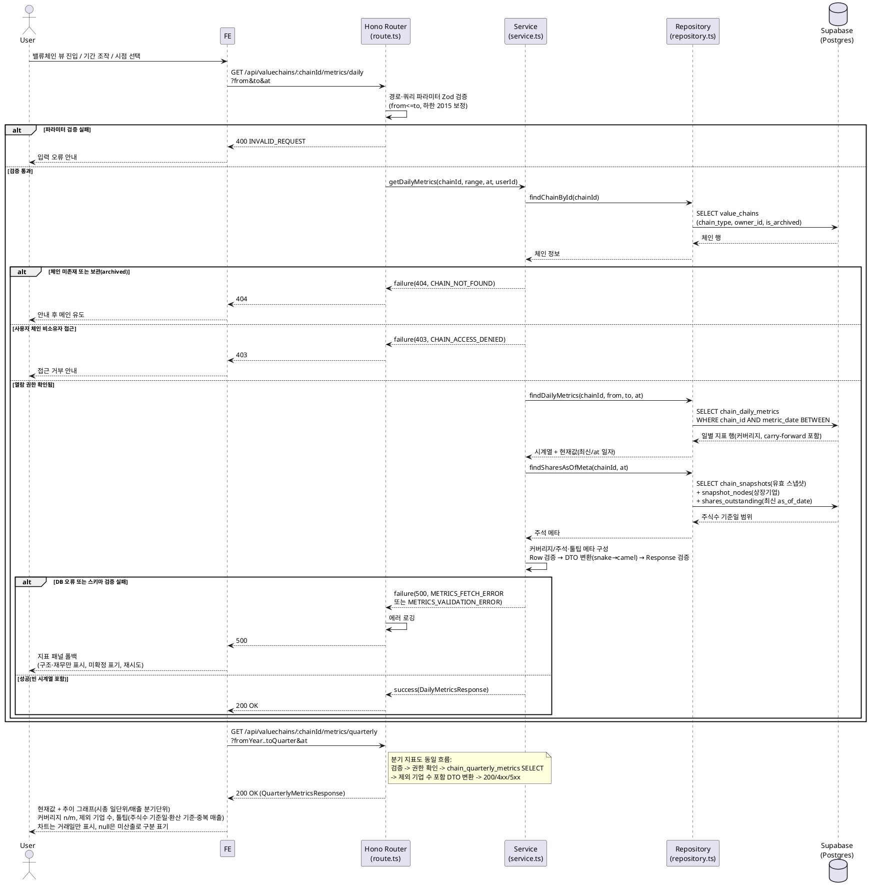

# UC-010: 밸류체인 대시보드 패널 조회

> 근거: `docs/userflow.md` 010, `docs/prd.md` 3장(밸류체인 뷰 페이지)·6장(지표·통화 정책), `docs/database.md` §3.7·§4.2·§4.5, `docs/techstack.md` §4(Hono route → service → repository → Supabase).
> 본 기능은 **조회 전용**이다. 화면에 표시되는 모든 지표는 배치(026~029)가 사전 집계한 자체 DB 테이블에서만 읽으며, 요청 시점에 외부 API를 호출하지 않는다(PRD 8장).

---

## 1. Primary Actor

- **Guest / User** — 해당 체인 열람 권한 내에서 조회.
  - 공식 체인: Guest/User 모두 열람 가능.
  - 사용자 체인: 소유자(User)만 열람 가능.

## 2. Precondition (사용자 관점)

- 사용자가 열람 가능한 밸류체인의 뷰 페이지(UC-009)에 진입해 있다.
- 사용자 체인을 조회하는 경우, 해당 체인의 소유자 계정으로 로그인되어 있다.
- (공식 체인 조회 시 로그인은 불필요하다.)

## 3. Trigger

- 밸류체인 뷰 페이지 진입 시 대시보드 패널이 자동 로드된다(UC-009 연계).
- 사용자가 지표 그래프의 **기간 범위**를 조작한다.
- 사용자가 타임라인에서 **시점을 선택**한다(UC-012 연계 — 해당 일자 값 재조회).

## 4. Main Scenario

1. 사용자가 밸류체인 뷰 페이지에 진입하면 FE가 대시보드 패널 로드를 시작한다.
2. FE가 일별 지표 API(`GET /api/valuechains/:chainId/metrics/daily`)와 분기 지표 API(`GET /api/valuechains/:chainId/metrics/quarterly`)를 호출한다(기간 범위·선택 시점 파라미터 포함).
3. Hono Router(route.ts)가 경로·쿼리 파라미터를 Zod 스키마로 검증한다.
4. Service(service.ts)가 Repository를 통해 체인(`value_chains`)을 조회해 **접근 권한을 검증**한다 — 공식 체인은 전체 공개, 사용자 체인은 소유자 일치 여부 확인, 보관(`is_archived`) 체인은 미노출.
5. Repository(repository.ts)가 `chain_daily_metrics`에서 기간 내 일별 가치총액 시계열과 현재값(최신 일자 또는 선택 시점 `at` 일자 행)을 조회한다.
6. Repository가 `chain_quarterly_metrics`에서 분기 매출 합계 시계열(역년 정규화 축)과 제외 기업 수를 조회한다.
7. Repository가 주석 메타 산출을 위해 유효 스냅샷(`chain_snapshots` 최신 또는 선택 시점 기준)의 상장기업 노드(`snapshot_nodes`)별 최신 상장주식수 기준일(`shares_outstanding.as_of_date`)을 조회한다.
8. Service가 조회 결과로 커버리지("반영 n / 전체 m"), carry-forward 플래그, 주석/툴팁 메타(주식수 기준일, 환산 기준, 매출 중복·비관련 사업부 포함 가능성 안내, 기준 통화 KRW)를 구성한다.
9. Service가 Row 스키마 검증 → DTO 변환(snake_case → camelCase) → Response 스키마 검증 후 `success()`를 반환한다.
10. FE가 응답을 받아 렌더링한다:
    - 현재값(가치총액·구성 기업 매출 합계) + 과거 추이 그래프(시총 **일 단위**, 매출 **분기 단위**).
    - 커버리지 표기("지표 반영 n / 전체 m 노드"), 제외 기업 수(태그 미매핑·연간 전용).
    - 툴팁/주석: 주식수 기준일, 환산 기준(일별=당일 환율, 분기=분기 말일 환율), 매출 중복 가능성, 기준 통화.
    - 차트는 **거래일만** 표시(결측 일자는 이월값으로 집계되어 있으나 x축에서 제외).

## 5. Edge Cases

| # | 상황 | 처리 |
|---|---|---|
| E1 | 상장기업 노드 0개(전부 자유 주체) | 커버리지 `0/m` 반환, 지표값 `null`(0과 구분) → FE는 "지표 미산출" 안내 표시 |
| E2 | 일부 노드만 지표 반영 | `coveredNodeCount/totalNodeCount` 커버리지로 명시, 부분 합산값 그대로 표시 |
| E3 | 시세 데이터 미수집/장애(집계 행 결측·종가 미확정) | 지표 영역만 폴백(미확정 표기), 마인드맵 구조·재무 정보는 정상 동작(UC-009는 영향 없음) |
| E4 | 상장주식수 미갱신/기준일 과거 | 응답의 주식수 기준일 메타를 FE가 주석으로 명시(값은 최신 보관값 기준) |
| E5 | 미국 매출 태그 미매핑·연간 전용(20-F) 기업 | 매출 합계에서 제외, `excludedUnmappedCount`로 제외 기업 수 표기(UC-027 연계) |
| E6 | 환율/시세 결측 일자(휴장 등) | `isCarriedForward=true` 행(직전 관측값 이월)을 그대로 표시, 차트는 거래일만 표시(UC-029 연계) |
| E7 | 과거 구조 변경 이전 구간 조회 | 각 행의 `basedOnSnapshotId` 기준(그 시점 스냅샷 구성) 집계값을 그대로 사용 — 재계산하지 않음 |
| E8 | 2015 사업연도 이전 구간 요청 | 시계열 최소 시작 시점(상수) 이전은 미제공 — `from`을 하한으로 보정하고 FE 기간 선택 UI도 하한 제한 |
| E9 | 존재하지 않는/보관(archived)된 체인 | `404 CHAIN_NOT_FOUND` → FE 안내 후 메인 유도 |
| E10 | 사용자 체인 비소유자(또는 비로그인) 접근 | `403 CHAIN_ACCESS_DENIED` → 접근 거부 안내 |
| E11 | 잘못된 파라미터(날짜 형식 오류, from > to, 미래 일자 등) | `400 INVALID_REQUEST` — 미래 `to`는 오늘로 보정 가능(보정 불가 조합만 400) |
| E12 | 집계 데이터 자체 미존재(신규 체인·배치 미실행) | 200 + 빈 시계열 반환 → FE는 "집계 준비 중/값 없음"으로 0과 구분해 안내 |
| E13 | DB 조회 실패/스키마 검증 실패 | `500` 반환 → FE는 지표 패널만 오류 폴백, 재시도 제공 |

## 6. Business Rules

### 6.1 지표 산정·표시 규칙

- 지표 합산 대상은 **종목 마스터에 연결된 상장기업 노드**로 한정한다(자유 주체 노드 제외).
- **가치총액** = 구성 상장기업 시가총액 합산(일 단위). 시가총액 = 일별 종가 × 최신 상장주식수. 배치(029)가 사전 집계한 `chain_daily_metrics` 값만 사용한다.
- **구성 기업 매출 합계** = 분기 매출 합산(분기 단위, 역년 정규화 축). `chain_quarterly_metrics` 값만 사용한다.
- **KRW 환산**: 일별 지표는 당일 환율, 분기 매출은 분기 말일 환율(집계 시 이미 반영). UI는 KRW 표시 + 환산 기준 툴팁.
- **커버리지**: "지표 반영 n / 전체 m 노드" = `covered_node_count / total_node_count`.
- **결측 이월(carry-forward)**: 시세/환율 결측 일자는 직전 관측값 이월로 집계된 값을 표시하고, 차트는 거래일만 표시한다.
- **구조 변경 비재계산**: 과거 구간 값은 각 시점의 유효 스냅샷(`based_on_snapshot_id`) 구성 기준이며, 구조 변경으로 과거를 재계산하지 않는다.
- **시계열 하한**: 최소 시작 시점(2015 사업연도, 상수 `TIMESERIES_MIN_START_DATE`) 이전 구간은 제공하지 않는다.
- 지표값 `null`(미산출)과 `0`(집계 결과 0)을 구분해 표기한다.

### 6.2 접근 권한 규칙

- 공식 체인(`chain_type=official`): 비로그인 포함 전체 열람 가능. 단 `is_archived=true`는 미노출(404).
- 사용자 체인(`chain_type=user`): `owner_id`가 요청자와 일치할 때만 열람 가능. 불일치·비로그인은 403.
- 권한 검증은 서버 측(Hono 미들웨어 + Service)에서 수행한다(RLS 비활성 정책).

### 6.3 API Specification

#### (1) 일별 지표(가치총액) 조회

- **Endpoint**: `GET /api/valuechains/:chainId/metrics/daily`
- **Query Parameters** (`DailyMetricsQuerySchema`):

  ```typescript
  {
    from?: string,   // YYYY-MM-DD, 기본값: 기본 조회 기간 상수, 하한 TIMESERIES_MIN_START_DATE로 보정
    to?: string,     // YYYY-MM-DD, 기본값: 오늘(미래 일자는 오늘로 보정)
    at?: string      // YYYY-MM-DD, 타임라인 선택 시점(UC-012) — 지정 시 latest 대신 해당 일자 값 반환
  }
  ```

- **Response Schema** (`DailyMetricsResponseSchema`):

  ```typescript
  {
    chainId: string,
    current: {                          // at 지정 시 해당 일자, 미지정 시 최신 일자 (없으면 null)
      metricDate: string,               // YYYY-MM-DD
      totalMarketCapKrw: number | null, // 미산출 시 null(0과 구분)
      coveredNodeCount: number,         // n
      totalNodeCount: number,           // m
      isCarriedForward: boolean,
      basedOnSnapshotId: string
    } | null,
    series: Array<{
      metricDate: string,
      totalMarketCapKrw: number | null,
      coveredNodeCount: number,
      totalNodeCount: number,
      isCarriedForward: boolean
    }>,
    annotations: {
      baseCurrency: 'KRW',
      fxBasis: 'daily',                    // 일별 = 당일 환율 환산
      sharesAsOfDateMin: string | null,    // 구성 상장기업 상장주식수 기준일 범위(주석용)
      sharesAsOfDateMax: string | null,
      isClosingConfirmed: boolean          // 최신 일자 종가 확정 여부(미확정 표기용)
    }
  }
  ```

- **Error Codes**:
  - `INVALID_REQUEST` (400): 파라미터 검증 실패(날짜 형식, from > to 등)
  - `CHAIN_NOT_FOUND` (404): 체인 미존재 또는 보관(archived) 상태
  - `CHAIN_ACCESS_DENIED` (403): 사용자 체인 비소유자/비로그인 접근
  - `METRICS_FETCH_ERROR` (500): DB 조회 실패
  - `METRICS_VALIDATION_ERROR` (500): Row/Response 스키마 검증 실패

#### (2) 분기 지표(매출 합계) 조회

- **Endpoint**: `GET /api/valuechains/:chainId/metrics/quarterly`
- **Query Parameters** (`QuarterlyMetricsQuerySchema`):

  ```typescript
  {
    fromYear?: number,     // 역년(calendar year), 기본값: 기본 조회 기간 상수, 하한 2015
    fromQuarter?: number,  // 1~4
    toYear?: number,
    toQuarter?: number,
    at?: string            // YYYY-MM-DD, 시점 선택 시 그 일자가 속한 분기를 current로 반환
  }
  ```

- **Response Schema** (`QuarterlyMetricsResponseSchema`):

  ```typescript
  {
    chainId: string,
    current: {
      calendarYear: number,
      calendarQuarter: number,           // 1~4 (역년 정규화 축)
      totalRevenueKrw: number | null,
      coveredNodeCount: number,
      totalNodeCount: number,
      excludedUnmappedCount: number,     // 태그 미매핑·연간 전용 제외 기업 수
      basedOnSnapshotId: string
    } | null,
    series: Array<{
      calendarYear: number,
      calendarQuarter: number,
      totalRevenueKrw: number | null,
      coveredNodeCount: number,
      totalNodeCount: number,
      excludedUnmappedCount: number
    }>,
    annotations: {
      baseCurrency: 'KRW',
      fxBasis: 'quarter_end',            // 분기 말일 환율 환산
      revenueOverlapNotice: true         // 단계 간 거래 중복·비관련 사업부 포함 가능성 툴팁 플래그
    }
  }
  ```

- **Error Codes**: (1)과 동일 — `INVALID_REQUEST`(400) / `CHAIN_NOT_FOUND`(404) / `CHAIN_ACCESS_DENIED`(403) / `METRICS_FETCH_ERROR`(500) / `METRICS_VALIDATION_ERROR`(500)

### 6.4 Database Operations

조회 전용 유스케이스 — **SELECT만 수행**하며 INSERT/UPDATE/DELETE는 없다.

| 테이블 | 연산 | 용도 |
|---|---|---|
| `value_chains` | SELECT | 체인 존재·유형(`chain_type`)·소유자(`owner_id`)·보관(`is_archived`) 확인 → 접근 권한 검증 |
| `chain_daily_metrics` | SELECT | 기간 내 일별 가치총액·커버리지·carry-forward 시계열, 최신/선택 일자 현재값 (`uq(chain_id, metric_date)` 활용, database.md §4.2 패턴) |
| `chain_quarterly_metrics` | SELECT | 역년 분기 매출 합계·커버리지·제외 기업 수 시계열 (`uq(chain_id, calendar_year, calendar_quarter)`) |
| `chain_snapshots` | SELECT | 유효 스냅샷 식별(최신 또는 `at` 이전 마지막, `idx(chain_id, effective_at DESC)`) — 주석 메타 산출 입력 |
| `snapshot_nodes` | SELECT | 유효 스냅샷의 상장기업 노드(`node_kind=listed_company`)의 `security_id` 목록 |
| `shares_outstanding` | SELECT | 구성 종목별 최신 `as_of_date` 조회(`DISTINCT ON ... ORDER BY as_of_date DESC`, database.md §4.4 패턴) → 주식수 기준일 주석 |

- 복잡한 조인·집계 캡슐화가 필요하면 Postgres 함수/뷰로 정의해 `client.rpc()`로 호출한다(techstack §7). 마이그레이션 SQL이 SOT.
- RLS 비활성 — 인가는 Hono 미들웨어·Service의 서버 측 role/소유자 검증으로 처리.

### 6.5 External Service Integration

- **본 유스케이스는 요청 시점의 외부 서비스 직접 연동이 없다.** 클라이언트가 보는 모든 지표는 자체 DB(사전 집계 테이블)에서 제공된다(PRD 8장).
- 데이터 공급 경로(간접 의존, 별도 유스케이스): 토스증권 Open API 시세·환율(UC-026/028) + OpenDART·SEC EDGAR 재무(UC-027) → 일별 체인 지표 사전 집계 배치(UC-029) → `chain_daily_metrics` / `chain_quarterly_metrics`.
- 배치 장애로 집계가 지연·결측되어도 본 API는 가용한 집계값 범위 내에서 응답하며(폴백·미확정 표기), 외부 API를 대체 호출하지 않는다.

---

## 7. Sequence Diagram


