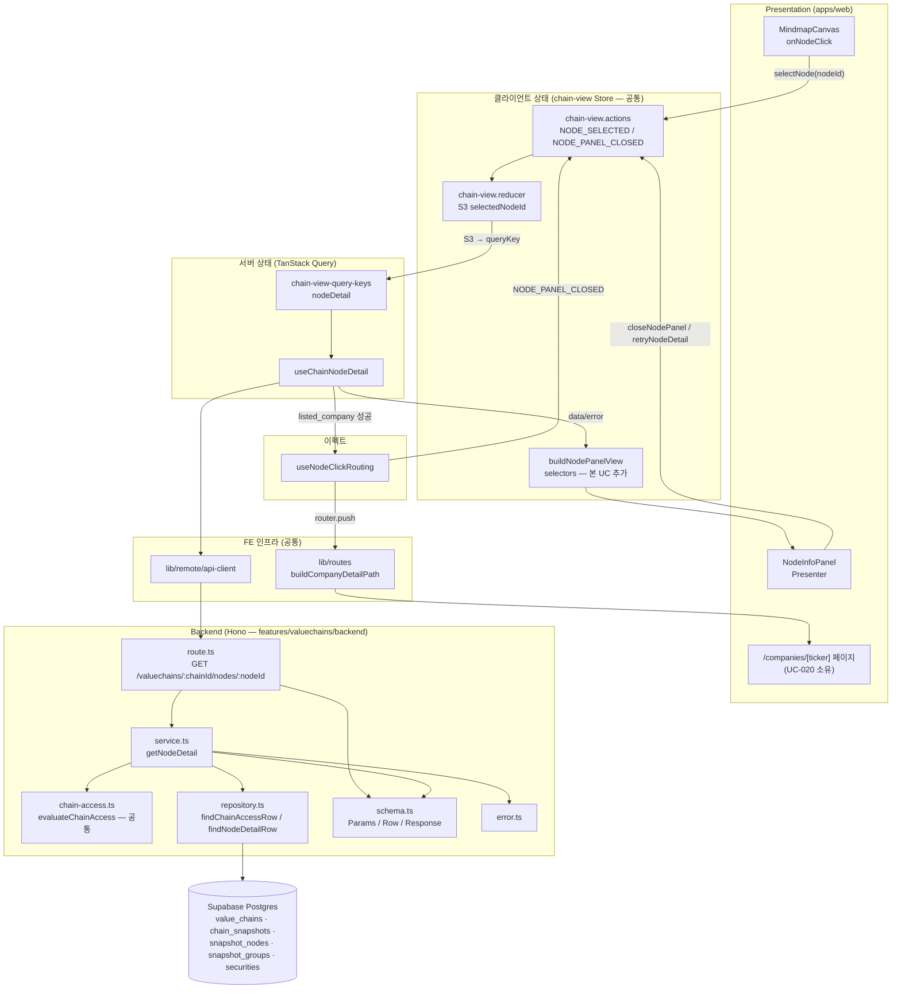

# Plan: UC-011 노드 클릭 상호작용

> 근거 문서: `docs/usecases/011/spec.md`, `docs/usecases/000_decisions.md`(C-2·C-6·B-6), `docs/techstack.md` §4(Codebase Structure)·§7(DB 접근),
> `docs/pages/chain-view/state_management.md`(S3·NodePanelView·useNodeClickRouting 계약 — 본 계획은 이 설계를 그대로 따른다),
> `docs/pages/company-detail/state_management.md`(`?asOf=`/`?market=` URL 계약), `.claude/skills/spec_to_plan/references/hono-backend-guide.md`(schema/service/route/error + `HandlerResult` 컨벤션), `docs/database.md` §3.2~3.3.
>
> **확정 결정 반영(중요)**: `000_decisions.md` C-2(비소유자의 사용자 체인 접근은 **404 통일**, 체인 존재 자체 비노출)를 본 유스케이스에도 준용한다.
> spec E5의 "403 `CHAIN_ACCESS_DENIED`"는 C-2가 대체한다 — 노드 상세 API에서 403을 반환하면 체인 존재가 노출되어 UC-009의 404 통일이 무력화되기 때문이다.
> 따라서 비로그인·비소유자의 사용자 체인 노드 조회는 **404 `CHAIN_NOT_FOUND`** 로 응답한다. FE는 방어적으로 401/403도 오류 폴백으로 처리한다(상태관리 문서와 동일).
>
> **외부 서비스 연동**: 해당 없음(spec 명시). 요청 경로에서 외부 API 호출이 없으므로 외부 연동 클라이언트 모듈은 계획에 포함하지 않는다.

---

## 개요

### 공통/shared 모듈 (다른 plan과 공유 — 이미 존재하면 재사용, 없으면 선행 구현이 전제 조건)

| 모듈 | 위치 | 설명 |
| --- | --- | --- |
| HTTP 응답 헬퍼 (공통 인프라) | `apps/web/src/backend/http/response.ts` | `success()/failure()/respond()` + `HandlerResult<T,E,M>` — hono-backend-guide 표준. UC-009 등 전 기능 공유 |
| Hono 앱/컨텍스트 (공통 인프라) | `apps/web/src/backend/hono/app.ts`, `apps/web/src/backend/hono/context.ts` | 싱글턴 앱 + `getSupabase(c)/getLogger(c)`. 본 계획은 라우터 등록 1줄만 추가 |
| 미들웨어 체인 (공통 인프라) | `apps/web/src/backend/middleware/` | `errorBoundary → withAppContext → withSupabase`. `withAppContext`가 세션 쿠키(@supabase/ssr)에서 **선택적 인증** 사용자를 해석해 `getCurrentUserId(c): string \| null` 제공 (UC-001~ 인증 plan 소유) |
| 체인 접근 판정 (공통 BL) | `apps/web/src/features/valuechains/backend/chain-access.ts` | `evaluateChainAccess(chain, requesterUserId)` 순수 함수 — UC-009/010/011/012 공유 (C-2 단일 구현 지점) |
| valuechains 에러 코드 | `apps/web/src/features/valuechains/backend/error.ts` | 기능 공통 에러 코드 상수 — 본 계획은 노드 상세용 코드를 **추가** |
| valuechains 리포지토리 | `apps/web/src/features/valuechains/backend/repository.ts` | Supabase 접근 캡슐화. `findChainAccessRow`(공유) + `findNodeDetailRow`(본 UC 추가) |
| chain-view 상태 모듈 | `apps/web/src/features/valuechains/state/` (`chain-view.actions.ts`/`chain-view.reducer.ts`/`chain-view.selectors.ts`) | S3(`selectedNodeId`)·`NODE_SELECTED`/`NODE_PANEL_CLOSED` 전이는 상태관리 문서가 소유. 본 계획은 `buildNodePanelView` 셀렉터만 **추가** |
| chain-view Context/Provider | `apps/web/src/features/valuechains/context/` (`chain-view-context.ts`, `ChainViewProvider.tsx`) | 상태관리 문서 소유 컨테이너. 본 계획은 노드 상세 쿼리·라우팅 이펙트·`nodePanel` computed **연결분만** 추가 |
| 쿼리 키 카탈로그 | `apps/web/src/features/valuechains/hooks/chain-view-query-keys.ts` | `nodeDetail(chainId, nodeId)` 키 — 상태관리 문서 §6 정의 그대로 |
| FE API 클라이언트 (공통 인프라) | `apps/web/src/lib/remote/api-client.ts` | fetch 래퍼(`{ok,data}/{ok,error}` 언랩, `ApiError{status,code,message}` 변환, 타임아웃 상수) |
| 경로 빌더 (공통 유틸) | `apps/web/src/lib/routes.ts` | `buildCompanyDetailPath({ticker, market, asOf})` — UC-008(검색 이동)·UC-011 공유, B-6(`?market=`)·E3(`?asOf=`) 계약 단일화 |
| 자유 주체 유형 라벨 (공통 상수) | `packages/domain/constants/subject-types.ts` | `SUBJECT_TYPE_LABELS`(consumer→소비자 등) — 노드 패널(011)·편집 폼(016)·어드민 화면 공유 |

### 본 유스케이스 고유 모듈

| 모듈 | 위치 | 설명 |
| --- | --- | --- |
| 노드 상세 Zod 스키마 | `apps/web/src/features/valuechains/backend/schema.ts` (노드 상세 섹션 추가) | `NodeDetailParamsSchema` / `NodeDetailRowSchema`(snake_case 조인 행) / `NodeDetailResponseSchema`(camelCase DTO) |
| 노드 상세 서비스 | `apps/web/src/features/valuechains/backend/service.ts` (함수 추가) | `getNodeDetail` — 접근 검증 → 노드 조회 → `node_kind` 분기 DTO 구성(BR-1, E1) |
| 노드 상세 라우트 | `apps/web/src/features/valuechains/backend/route.ts` (핸들러 추가) | `GET /valuechains/:chainId/nodes/:nodeId` — 파라미터 UUID 검증·서비스 호출·에러 로깅 |
| FE DTO 재노출 | `apps/web/src/features/valuechains/lib/dto.ts` | backend `schema.ts`의 Response 타입을 FE에 재노출 (FE가 backend 모듈을 직접 import하지 않도록 격리) |
| 노드 상세 쿼리 훅 | `apps/web/src/features/valuechains/hooks/useChainNodeDetail.ts` | TanStack Query 훅 — S3 기반 enabled, 4xx 비재시도, staleTime 상수(BR-5) |
| 노드 패널 뷰모델 셀렉터 | `apps/web/src/features/valuechains/state/chain-view.selectors.ts` (함수 추가) | `buildNodePanelView` 순수 함수 — closed/loading/error/free-subject/security-fallback/routing 판별 유니온 파생 |
| 라우팅 이펙트 | `apps/web/src/features/valuechains/hooks/effects/useNodeClickRouting.ts` | 상장기업 해석 성공 시 1회만 `NODE_PANEL_CLOSED` dispatch 후 `router.push` (E3·E4·E10) |
| 노드 정보 패널 | `apps/web/src/features/valuechains/components/NodeInfoPanel.tsx` | Presenter — 자유 주체 3필드+그룹 부가(BR-2)/폴백(E1)/오류+재시도(E9)/로딩 |
| 캔버스 클릭 연결 (기존 모듈 수정) | `apps/web/src/features/valuechains/components/MindmapCanvas.tsx` | React Flow `onNodeClick` → `selectNode(nodeId)` 액션 연결 1건 (UC-009 모듈에 대한 최소 수정) |
| 기능 상수 | `apps/web/src/features/valuechains/constants.ts` | `NODE_DETAIL_STALE_TIME_MS` 등 FE 캐싱 상수 (하드코딩 금지 원칙) |

---

## Diagram



데이터 흐름은 항상 View → Action → Reducer(S3) → 쿼리 키 → API → (뷰모델 파생 | 라우팅 이펙트) 단방향이며, 서버 응답은 TanStack Query 캐시만 소유한다(reducer 복사 금지 — 상태관리 문서 원칙).

---

## Implementation Plan

### 1. `schema.ts` — 노드 상세 Zod 스키마 (Backend, 기존 파일에 섹션 추가)

- 구현 내용:
  1. `NodeDetailParamsSchema = z.object({ chainId: z.string().uuid(), nodeId: z.string().uuid() })` — 경로 파라미터 검증(400 `INVALID_PARAMS` 근거).
  2. `NodeDetailRowSchema`(snake_case) — repository 조인 결과 행 검증:
     - `id`, `snapshot_id`, `node_kind`(`z.enum(['listed_company','free_subject'])`), `group_id`(nullable),
       `subject_name`/`subject_type`/`subject_memo`(nullable),
       `chain_snapshots: { chain_id }`(inner join 검증용),
       `snapshot_groups: { id, name } | null`(LEFT JOIN, E8),
       `securities: { id, ticker, market, name, listing_status } | null`(LEFT JOIN, E1/E4).
     - `market`는 `z.enum(['KRX','US'])`, `listing_status`는 `z.enum(['listed','suspended','delisted'])`, `subject_type`은 `z.enum(['consumer','government','private_company','other'])` — DB enum(§3.10)과 1:1.
  3. `NodeDetailResponseSchema`(camelCase) — spec Response 200 계약 그대로:
     `nodeId`, `snapshotId`, `nodeKind`, `group: { groupId, name } | null`,
     `freeSubject: { name, subjectType, memo: string | null } | null`,
     `security: { securityId, ticker, market, name, listingStatus } | null`,
     `securityResolved: boolean`.
  4. 모든 타입 `z.infer`로 export. UC-009가 이미 정의한 스키마(구조 조회)와 같은 파일에 공존하되 섹션 주석으로 구분(다른 유스케이스 정의는 수정하지 않음).
- 의존성: 없음 (마이그레이션 0005/0006/0003 스키마와 필드 일치 — `docs/database.md` §3.2~3.3 대조 완료).
- Unit Tests: 스키마 정의는 테스트 생략(hono-backend-guide 관례). 단, Row→Response 변환 검증은 service 테스트에서 수행.

### 2. `error.ts` — 에러 코드 추가 (Backend, 기존 파일에 추가)

- 구현 내용: `valuechainErrorCodes`에 다음을 추가(`as const` 유지, 기존 UC-009 코드와 충돌 없음 확인).
  - `invalidParams: 'INVALID_PARAMS'` (400)
  - `chainNotFound: 'CHAIN_NOT_FOUND'` (404 — UC-009와 공유, 이미 있으면 재사용)
  - `nodeNotFound: 'NODE_NOT_FOUND'` (404, E7)
  - `internalError: 'INTERNAL_ERROR'` (500 — DB 조회 실패·행/응답 스키마 검증 실패)
  - **`CHAIN_ACCESS_DENIED`(403)는 정의하지 않는다** — C-2 준용으로 접근 거부는 `CHAIN_NOT_FOUND`(404)로 응답(문서 상단 결정 참조).
- 의존성: 없음.
- Unit Tests: 상수 정의로 생략.

### 3. `chain-access.ts` — 체인 접근 판정 순수 함수 (Backend 공통 BL)

> UC-009/010/012 plan과 공유하는 모듈. 이미 구현되어 있으면 그대로 재사용하고 본 섹션은 계약 확인만 수행한다.

- 구현 내용:
  1. 입력 타입 `ChainAccessRow = { id, chain_type: 'official' | 'user', owner_id: string | null, is_archived: boolean }`.
  2. `evaluateChainAccess(chain: ChainAccessRow | null, requesterUserId: string | null): 'allowed' | 'not_found'` 순수 함수:
     - `chain === null` → `'not_found'` (E6)
     - `chain.is_archived === true` → `'not_found'` (E6, 보관=비노출)
     - `chain.chain_type === 'official'` → `'allowed'` (BR-6, 비로그인 포함)
     - `chain.chain_type === 'user'` → `requesterUserId !== null && requesterUserId === chain.owner_id ? 'allowed' : 'not_found'` (BR-6 + **C-2: 거부도 not_found로 통일**)
  3. 반환은 2값 판별 문자열로 고정 — 403 계열 반환값을 만들지 않아 호출부가 실수로 체인 존재를 노출할 수 없게 한다.
- 의존성: 없음 (프레임워크·DB 독립 순수 함수).
- Unit Tests:
  - [ ] 공식 체인 + 비로그인(null) → `allowed`
  - [ ] 공식 체인 + 임의 로그인 사용자 → `allowed`
  - [ ] 사용자 체인 + 소유자 본인 → `allowed`
  - [ ] 사용자 체인 + 비로그인(null) → `not_found` (C-2)
  - [ ] 사용자 체인 + 타 사용자 → `not_found` (C-2, E5)
  - [ ] `is_archived=true`(공식/사용자 각각) → `not_found` (E6)
  - [ ] `chain === null` → `not_found`

### 4. `repository.ts` — 데이터 액세스 (Backend Persistence, 기존 파일에 함수 추가)

- 구현 내용:
  1. `findChainAccessRow(client: SupabaseClient, chainId: string): Promise<{ row: ChainAccessRow | null } | { dbError: string }>` — `value_chains`에서 `id, chain_type, owner_id, is_archived`를 `maybeSingle()`로 조회. **UC-009와 공유** — 이미 있으면 재사용.
  2. `findNodeDetailRow(client, chainId, nodeId)` — 단일 쿼리로 노드+검증+부가정보 조회:
     ```
     from('snapshot_nodes')
       .select(`id, snapshot_id, node_kind, group_id,
                subject_name, subject_type, subject_memo,
                chain_snapshots!inner(chain_id),
                snapshot_groups(id, name),
                securities(id, ticker, market, name, listing_status)`)
       .eq('id', nodeId)
       .eq('chain_snapshots.chain_id', chainId)
       .maybeSingle()
     ```
     - `chain_snapshots!inner` + `eq('chain_snapshots.chain_id', …)`로 **노드의 체인 소속을 DB 조회 단계에서 검증**(E7: 타 체인 노드 → 0행 → null 반환).
     - `snapshot_groups`/`securities`는 outer(LEFT) 임베드 — 그룹 미소속(E8)·종목 매핑 유실(E1) 시 null.
     - `nodeId`는 스냅샷 스코프 PK이므로 시점 파라미터 불필요(BR-3, E2 자동 충족).
  3. 반환은 원시 행(snake_case) + DB 에러 문자열의 단순 형태로 한정 — 판정·변환·에러코드 매핑은 service 책임(계층 분리).
- 의존성: 공통 인프라(`getSupabase` 주입은 route에서 수행), 마이그레이션 0005/0006 적용 상태.
- Unit Tests (Supabase client mock):
  - [ ] `findNodeDetailRow` 정상 행 반환 시 select 체인이 올바른 필터(`id`, `chain_snapshots.chain_id`)로 호출됨
  - [ ] 0행(`maybeSingle` → null) 시 `{ row: null }` 반환 (에러로 취급하지 않음)
  - [ ] Supabase error 객체 반환 시 `{ dbError }` 반환

### 5. `service.ts` — `getNodeDetail` (Backend BL, 기존 파일에 함수 추가)

- 구현 내용:
  1. 시그니처:
     ```typescript
     getNodeDetail(
       client: SupabaseClient,
       params: { chainId: string; nodeId: string },
       requesterUserId: string | null,
     ): Promise<HandlerResult<NodeDetailResponse, ValuechainServiceError, unknown>>
     ```
  2. 처리 순서:
     - (a) `findChainAccessRow` → dbError면 `failure(500, internalError)`.
     - (b) `evaluateChainAccess(row, requesterUserId)` → `'not_found'`면 `failure(404, chainNotFound)` (E5/E6 — C-2 통일).
     - (c) `findNodeDetailRow` → dbError면 `failure(500, internalError)`; null이면 `failure(404, nodeNotFound)` (E7).
     - (d) `NodeDetailRowSchema.safeParse` — 실패 시 `failure(500, internalError, 'row validation failed', format())`.
     - (e) DTO 조립(snake→camel):
       - `group`: `snapshot_groups` 임베드가 있으면 `{ groupId, name }`, 없으면 `null` (E8).
       - `node_kind === 'free_subject'` → `freeSubject = { name: subject_name, subjectType: subject_type, memo: subject_memo }`, `security = null`, `securityResolved = true` (spec 계약).
       - `node_kind === 'listed_company'` → `securities` 임베드 존재 시 `security = { securityId, ticker, market, name, listingStatus }`, `securityResolved = true`; 임베드 null이면 `security = null`, `securityResolved = false` (E1 방어적 폴백 — DB RESTRICT로 통상 발생 불가하나 정합 이상 대비). `freeSubject = null`.
     - (f) `NodeDetailResponseSchema.safeParse` 후 `success(parsed.data)` (200).
  3. 조회 전용 — INSERT/UPDATE/DELETE 없음(BR-4). 트랜잭션 불필요.
  4. service는 로깅·HTTP 개념(`respond`)을 모른다 — `HandlerResult`만 반환(hono-backend-guide).
- 의존성: 모듈 1(schema)·2(error)·3(chain-access)·4(repository).
- Unit Tests (repository/client mock, AAA):
  - [ ] 공식 체인 + 자유 주체 노드(그룹 소속) → 200 DTO: `freeSubject` 3필드 + `group.name` 포함, `security=null`, `securityResolved=true`
  - [ ] 자유 주체 노드 `subject_memo=null` → `freeSubject.memo === null` (BR-2 선택 필드)
  - [ ] 그룹 미소속 자유 주체 노드 → `group === null` (E8)
  - [ ] 상장기업 노드(종목 해석 성공, `listing_status='delisted'`) → `security.listingStatus='delisted'` 포함, `securityResolved=true` (E4 — 이동 허용 데이터 제공)
  - [ ] 상장기업 노드 + `securities` 임베드 null → `security=null`, `securityResolved=false`, HTTP 200 (E1)
  - [ ] 체인 미존재 → 404 `CHAIN_NOT_FOUND` (E6)
  - [ ] `is_archived=true` 체인 → 404 `CHAIN_NOT_FOUND` (E6)
  - [ ] 사용자 체인 + 비소유자(및 비로그인) → 404 `CHAIN_NOT_FOUND` — **403이 아님을 명시 검증** (C-2)
  - [ ] 사용자 체인 + 소유자 → 200
  - [ ] 노드 미존재 / 타 체인의 nodeId → 404 `NODE_NOT_FOUND` (E7)
  - [ ] `findChainAccessRow`/`findNodeDetailRow` dbError → 500 `INTERNAL_ERROR`
  - [ ] Row 스키마 위반(예: node_kind 이상값) → 500 `INTERNAL_ERROR`
  - [ ] snake_case → camelCase 필드 매핑 정확성 (`subject_name`→`freeSubject.name`, `listing_status`→`security.listingStatus` 등)

### 6. `route.ts` — `GET /valuechains/:chainId/nodes/:nodeId` (Backend Presentation, 기존 파일에 핸들러 추가)

- 구현 내용:
  1. `registerValuechainRoutes(app)` 내부에 핸들러 추가 (UC-009의 `GET /valuechains/:chainId`와 같은 등록 함수 — **경로가 더 구체적이므로 등록 순서 충돌 없음**, Hono는 정적 세그먼트 우선 매칭).
  2. `c.req.param()` → `NodeDetailParamsSchema.safeParse` — 실패 시 `respond(c, failure(400, invalidParams, …, format()))`.
  3. `getSupabase(c)`, `getLogger(c)`, `getCurrentUserId(c)`(선택적 인증 — 세션 없으면 null) 주입 후 `getNodeDetail` 호출.
  4. `!result.ok`이고 status ≥ 500이면 `logger.error('node detail failed', …)` 기록(404는 정상 흐름이므로 warn 미만).
  5. `respond(c, result)` 반환 — `{ ok, data } / { ok, error: { code, message } }` 공통 엔벨로프.
- 의존성: 모듈 1·2·5, 공통 인프라(hono app/middleware/response).
- QA Sheet:

| # | 시나리오 | 기대 결과 |
| --- | --- | --- |
| 1 | 공식 체인의 자유 주체 노드를 비로그인으로 GET | 200, `freeSubject` 3필드 + `group`, `securityResolved=true` |
| 2 | 공식 체인의 상장기업 노드 GET | 200, `security.ticker/market/name/listingStatus` 포함 |
| 3 | `chainId`에 UUID 아닌 문자열 | 400 `INVALID_PARAMS` |
| 4 | `nodeId`에 UUID 아닌 문자열 | 400 `INVALID_PARAMS` |
| 5 | 존재하지 않는 chainId | 404 `CHAIN_NOT_FOUND` |
| 6 | 보관(`is_archived=true`)된 체인의 노드 | 404 `CHAIN_NOT_FOUND` |
| 7 | 사용자 체인 노드를 비로그인/타 사용자 세션으로 직접 호출 | 404 `CHAIN_NOT_FOUND` (403 아님 — C-2), 응답 본문에 체인 정보 없음 |
| 8 | 사용자 체인 노드를 소유자 세션으로 호출 | 200 |
| 9 | 다른 체인 소속 nodeId 지정 | 404 `NODE_NOT_FOUND` |
| 10 | DB 장애(모의) | 500 `INTERNAL_ERROR` + 서버 로그 1건 |
| 11 | 응답 엔벨로프 | 성공 `{ok:true,data}`, 실패 `{ok:false,error:{code,message}}` 형식 준수 |

### 7. `app.ts` 라우터 등록 (공통 인프라 수정)

- 구현 내용: `registerValuechainRoutes(app)`가 이미 등록되어 있으면 **변경 없음**(같은 등록 함수에 핸들러가 추가되므로). 미등록 상태면 `createHonoApp()`에 1줄 추가.
- 의존성: 모듈 6.
- QA Sheet:

| # | 시나리오 | 기대 결과 |
| --- | --- | --- |
| 1 | `/api/valuechains/{uuid}/nodes/{uuid}` 접근 | 미들웨어 체인(errorBoundary→withAppContext→withSupabase) 통과 후 핸들러 도달 |
| 2 | 기존 UC-009 경로 `/api/valuechains/{uuid}` | 회귀 없음(기존 응답 유지) |

### 8. `packages/domain/constants/subject-types.ts` — 자유 주체 유형 라벨 (공통 상수)

- 구현 내용: `SUBJECT_TYPES = ['consumer','government','private_company','other'] as const`, `SUBJECT_TYPE_LABELS: Record<SubjectType, string>`(소비자/정부/비상장기업/기타). 프레임워크 의존성 없는 순수 상수 — 노드 패널 표시(본 UC)·편집 폼(UC-016)·검증에 공유.
- 의존성: 없음.
- Unit Tests:
  - [ ] 4개 유형 모두 라벨 존재(누락 시 타입 오류로 컴파일 차단 — `satisfies Record<SubjectType, string>` 사용 확인)

### 9. `lib/routes.ts` — `buildCompanyDetailPath` (공통 유틸, UC-008과 공유)

- 구현 내용:
  1. `buildCompanyDetailPath(input: { ticker: string; market: 'KRX' | 'US'; asOf?: IsoDate | null }): string`
     - 기본 `/companies/{ticker}?market={market}` — B-6(티커 충돌 시 `?market=` 구분)과 company-detail 페이지의 URL 계약(`ticker/market/asOf`는 URL 소유)에 정합.
     - `asOf`가 있으면 `&asOf={YYYY-MM-DD}` 추가 — 과거 시점 조회 중 진입 시 기업 상세의 시점 컨텍스트 배너 트리거(E3, UC-020 E14).
  2. `ticker`는 `encodeURIComponent` 처리(순수 함수, 라우터 비의존).
- 의존성: 없음.
- Unit Tests:
  - [ ] `{ticker:'005930', market:'KRX'}` → `/companies/005930?market=KRX`
  - [ ] `asOf:'2025-03-10'` 포함 → `?market=…&asOf=2025-03-10`
  - [ ] `asOf: null` → `asOf` 파라미터 없음
  - [ ] 특수문자 티커 인코딩

### 10. `lib/dto.ts` — FE DTO 재노출 (features/valuechains)

- 구현 내용: `export type { NodeDetailResponse } from '../backend/schema'` 형태의 타입 전용 재노출(+UC-009 구조 응답 타입 등 기능 내 다른 DTO와 공존). FE 훅·컴포넌트는 이 모듈만 import — backend 내부 구조 변경이 FE로 전파되지 않게 격리.
- 의존성: 모듈 1.
- Unit Tests: 타입 재노출로 생략.

### 11. `constants.ts` — valuechains FE 상수 (features/valuechains)

- 구현 내용: `NODE_DETAIL_STALE_TIME_MS`(예: 5분 — 구조 데이터와 동일 원천이라 세션 내 재클릭 시 재호출 억제, BR-5), 필요 시 기존 파일에 추가. 하드코딩 금지 원칙에 따라 훅에서 리터럴 사용 금지.
- 의존성: 없음.
- Unit Tests: 상수 정의로 생략.

### 12. `useChainNodeDetail.ts` — 노드 상세 쿼리 훅 (FE Business Logic)

- 구현 내용:
  1. 시그니처(상태관리 문서 §6 계약 그대로):
     ```typescript
     useChainNodeDetail(chainId: string, nodeId: string | null):
       UseQueryResult<NodeDetailResponse, ApiError>
     ```
  2. `queryKey: chainViewQueryKeys.nodeDetail(chainId, nodeId)` — 키에 nodeId 포함이므로 빠른 연속 클릭 시 **마지막 클릭 키의 쿼리만 관찰**되어 진행 중 이전 요청 결과가 화면에 반영되지 않음(E10 — 취소 대신 키 교체로 무시).
  3. `enabled: nodeId !== null` (S3 null = 패널 닫힘).
  4. `queryFn`: `apiClient.get(/valuechains/${chainId}/nodes/${nodeId})` — 공통 클라이언트가 에러 엔벨로프를 `ApiError{status,code,message}`로 변환.
  5. `retry: (count, error) => error.status >= 500 && count < 1` — 4xx(400/404)는 재시도 없음, 5xx/네트워크는 1회. 수동 재시도는 `refetch`(E9)로 제공.
  6. `staleTime: NODE_DETAIL_STALE_TIME_MS` (BR-5 — 동일 노드 재클릭 시 캐시 사용).
- 의존성: 모듈 9(api-client는 공통)·10·11, 쿼리 키 카탈로그(공통).
- Unit Tests (QueryClient + api-client mock):
  - [ ] `nodeId=null`이면 fetch 미발생(enabled=false)
  - [ ] `nodeId` 지정 시 올바른 URL로 1회 호출, 성공 데이터 반환
  - [ ] 404 응답 → `ApiError.status=404`로 실패, 재시도 0회
  - [ ] 500 응답 → 1회 재시도 후 실패
  - [ ] nodeId A→B 연속 변경 시 B 키의 결과만 최종 관찰(E10)

### 13. `buildNodePanelView` — 노드 패널 뷰모델 셀렉터 (FE Business Logic, `chain-view.selectors.ts`에 추가)

- 구현 내용:
  1. 순수 함수:
     ```typescript
     buildNodePanelView(input: {
       selectedNodeId: string | null;                                  // S3
       query: { status: 'pending' | 'error' | 'success'; data?: NodeDetailResponse; };
     }): NodePanelView
     ```
  2. 파생 규칙(상태관리 문서 §8.2 `NodePanelView` 판별 유니온과 1:1):
     - `selectedNodeId === null` → `{ status: 'closed' }`
     - 쿼리 pending → `{ status: 'loading', nodeId }`
     - 쿼리 error → `{ status: 'error', nodeId }` (E9 — 패널 영역 폴백 + 재시도)
     - success + `nodeKind='free_subject'` → `{ status: 'free-subject', data: { name, subjectType, memo, groupName: group?.name ?? null } }` (BR-2 3필드 + 그룹 부가, E8)
     - success + `nodeKind='listed_company'` + `securityResolved=false` → `{ status: 'security-fallback', nodeId }` (E1)
     - success + `nodeKind='listed_company'` + `securityResolved=true` → `{ status: 'routing' }` (과도 상태 — 라우팅 이펙트가 처리)
  3. 응답 데이터의 스냅샷 스코프 특성상 과거 시점 정보가 자동 반영(E2 — 별도 분기 불필요).
- 의존성: 모듈 10, 기존 `chain-view.selectors.ts`(공통 — 다른 셀렉터 수정 없음).
- Unit Tests:
  - [ ] S3 null → `closed` (쿼리 상태와 무관)
  - [ ] pending → `loading` + nodeId 전달
  - [ ] error → `error` + nodeId 전달
  - [ ] free_subject(그룹 소속) → `free-subject`, `groupName` 포함
  - [ ] free_subject(그룹 미소속, memo null) → `groupName=null`, `memo=null` (E8)
  - [ ] listed_company + resolved=false → `security-fallback` (E1)
  - [ ] listed_company + resolved=true → `routing`
  - [ ] 입력 불변성(원본 객체 비변이)

### 14. `useNodeClickRouting.ts` — 라우팅 이펙트 (FE Effect)

- 구현 내용:
  1. 시그니처(상태관리 문서 §7.3 계약 그대로):
     ```typescript
     useNodeClickRouting(input: {
       selectedNodeId: string | null;                       // S3
       nodeDetailQuery: UseQueryResult<NodeDetailResponse, ApiError>;
       selectedDate: IsoDate | null;                        // S1 — 시점 컨텍스트
       dispatch: Dispatch<ChainViewAction>;
       router: AppRouterInstance;
     }): void
     ```
  2. 발화 조건: `selectedNodeId !== null` && 쿼리 success && `data.nodeId === selectedNodeId` && `nodeKind === 'listed_company'` && `securityResolved === true` && `security !== null`.
  3. 실행: `dispatch({ type: 'NODE_PANEL_CLOSED' })` 후 `router.push(buildCompanyDetailPath({ ticker: security.ticker, market: security.market, asOf: selectedDate }))`.
     - `asOf`는 과거 시점 조회 중(S1 ≠ null)일 때만 부여 — 기업 상세가 최신 데이터 기준임을 알리는 시점 컨텍스트 배너 트리거(E3, UC-020 E14).
     - 상장폐지/정지 종목도 이동 허용 — 상태 배지는 기업 상세(UC-020) 책임(E4, 본 이펙트는 분기 없음).
  4. **중복 라우팅 가드(E10)**: `useRef<string | null>`에 라우팅 완료 nodeId를 기록하고 동일 선택 인스턴스에서 재실행 방지. `selectedNodeId`가 null로 바뀌면 ref 리셋 — 뒤로가기 후 같은 노드 재클릭 시(캐시 히트로 즉시 success) 다시 라우팅 가능.
  5. `free_subject`/`securityResolved=false`/error에서는 아무것도 하지 않음(패널 파생은 모듈 13 책임 — 라우팅 없음, E9 "라우팅은 수행하지 않는다").
- 의존성: 모듈 9·10·12, chain-view actions(공통).
- Unit Tests (renderHook + mock router/dispatch):
  - [ ] listed+resolved 성공 → `NODE_PANEL_CLOSED` dispatch가 `router.push`보다 먼저 1회씩 호출
  - [ ] S1=null → push URL에 `asOf` 없음, `market` 포함
  - [ ] S1='2025-03-10' → push URL에 `asOf=2025-03-10` 포함 (E3)
  - [ ] `listingStatus='delisted'`여도 push 수행 (E4)
  - [ ] free_subject 성공 → push/dispatch 미호출
  - [ ] `securityResolved=false` → push/dispatch 미호출 (E1)
  - [ ] 쿼리 error → push 미호출 (E9)
  - [ ] 동일 데이터로 리렌더 반복 → push 1회만 (E10 중복 라우팅 방지)
  - [ ] `data.nodeId !== selectedNodeId`(이전 노드의 캐시 데이터가 잠시 관찰되는 경합) → push 미호출
  - [ ] S3 null 복귀 후 동일 노드 재선택 → push 재수행(ref 리셋 확인)

### 15. `NodeInfoPanel.tsx` — 노드 정보 패널 (FE Presentation)

- 구현 내용:
  1. Presenter 컴포넌트 — `useChainViewState()`의 `nodePanel: NodePanelView`와 `useChainViewActions()`의 `closeNodePanel`/`retryNodeDetail`만 사용(직접 쿼리·dispatch·라우터 접근 금지).
  2. `nodePanel.status` 판별 렌더:
     - `closed` → 미렌더(null).
     - `loading` → 패널 스켈레톤(이름/유형/메모 3줄) + 닫기 버튼.
     - `free-subject` → **정확히 3개 필드**: 이름 / 주체 유형(`SUBJECT_TYPE_LABELS` 한글 라벨) / 설명 메모(null이면 "—" 표기). 그룹 소속 시 그룹 이름을 부가 배지로 표시, 미소속 시 배지 생략(E8). 추가 필드 없음(BR-2 — PRD Non-Goals).
     - `security-fallback` → 노드 이름 불명 상황이므로 "기업 정보를 확인할 수 없어 상세 페이지로 이동할 수 없습니다" 안내(E1) + 닫기 버튼.
     - `error` → 오류 안내 + "다시 시도" 버튼(`retryNodeDetail`) + 닫기 버튼(E9).
     - `routing` → 미렌더 또는 최소 로딩 표시(즉시 페이지 전환되는 과도 상태).
  3. shadcn-ui 프리미티브(Card/Badge/Button/Skeleton) 사용, Tailwind 스타일, 반응형(모바일에서 하단 시트형 배치 허용).
- 의존성: 모듈 8·13, chain-view Context(공통).
- QA Sheet:

| # | 시나리오 | 기대 결과 |
| --- | --- | --- |
| 1 | 노드 미선택 상태 | 패널 미표시 |
| 2 | 자유 주체 노드 클릭(그룹 소속, 메모 있음) | 로딩 스켈레톤 → 이름·주체 유형(한글 라벨)·메모 3필드 + 그룹 배지 표시 |
| 3 | 자유 주체 노드(메모 없음, 그룹 미소속) | 메모 "—" 표기, 그룹 배지 없음, 오류 없음 (E8) |
| 4 | 과거 시점 조회 중 자유 주체 노드 클릭 | 해당 시점 스냅샷의 값으로 패널 표시 (E2 — nodeId가 시점 스코프) |
| 5 | 상장기업 노드(해석 실패 응답) 클릭 | 폴백 패널: 이동 불가 안내 표시, 라우팅 없음 (E1) |
| 6 | 서버 500/네트워크 오류 | 패널 영역에 오류 폴백 + "다시 시도" 버튼, 라우팅 없음 (E9) |
| 7 | 오류 패널에서 "다시 시도" 클릭 | 재조회 후 성공 시 정상 패널로 전환 |
| 8 | 닫기 버튼 클릭 | 패널 닫힘(S3=null), 캔버스 하이라이트 해제 |
| 9 | 노드 A 클릭 직후 노드 B 연속 클릭 | 최종적으로 B의 정보만 표시(A 응답이 늦게 와도 미반영, E10) |
| 10 | 주체 유형 4종(소비자/정부/비상장기업/기타) 각각 | 라벨이 한글로 정확히 표기 |
| 11 | 좁은 화면(모바일 폭) | 패널이 레이아웃을 깨지 않고 표시(가로 스크롤 없음) |

### 16. `MindmapCanvas.tsx` 클릭 연결 (기존 UC-009 모듈 최소 수정)

- 구현 내용: React Flow `onNodeClick={(_, node) => selectNode(node.id)}` 연결 + 선택 노드 하이라이트(선택 nodeId를 노드 스타일에 반영). 그 외 캔버스 로직(레이아웃/드래그/접기)은 수정하지 않음. 그룹 클러스터(Sub Flow 부모 노드) 클릭은 `selectNode` 대상에서 제외(노드 유형이 아님).
- 의존성: UC-009 캔버스 모듈, chain-view actions(공통).
- QA Sheet:

| # | 시나리오 | 기대 결과 |
| --- | --- | --- |
| 1 | 상장기업 노드 클릭 | 노드 상세 조회 시작(패널 로딩) 후 `/companies/{ticker}?market=…`로 이동 |
| 2 | 과거 시점 조회 중 상장기업 노드 클릭 | `?asOf=선택일` 포함 이동, 기업 상세에서 시점 배너 노출(E3, UC-020 연계) |
| 3 | 자유 주체 노드 클릭 | 페이지 이동 없이 정보 패널 표시 |
| 4 | 그룹 클러스터(빈 영역/라벨) 클릭 | 노드 상세 조회 미발생 |
| 5 | 노드 드래그 후 놓기(클릭 아님) | 노드 상세 조회 미발생(드래그와 클릭 구분 — React Flow 기본 동작) |
| 6 | 동일 노드 재클릭 | reducer no-op + 캐시 히트로 패널 즉시 표시(불필요 재조회 없음, BR-5) |

### 17. `ChainViewProvider.tsx` 연결 (공통 컨테이너 수정 — 본 UC 분량만)

- 구현 내용(상태관리 문서 §8.1 조립 지점에 추가):
  1. `useChainNodeDetail(chainId, state.nodePanel.selectedNodeId)` 실행.
  2. `useNodeClickRouting({ selectedNodeId, nodeDetailQuery, selectedDate, dispatch, router })` 이펙트 연결.
  3. computed `nodePanel = useMemo(() => buildNodePanelView(...), [selectedNodeId, query.status, query.data])`.
  4. actions `retryNodeDetail = () => nodeDetailQuery.refetch()` — Actions Context에 포함(참조 안정 useMemo).
  5. reducer/다른 쿼리·이펙트는 수정하지 않음(다른 유스케이스 소유).
- 의존성: 모듈 12·13·14, chain-view Provider 골격(공통 — UC-009 plan 선행).
- QA Sheet:

| # | 시나리오 | 기대 결과 |
| --- | --- | --- |
| 1 | Provider 하위에서 `useChainViewState().nodePanel` 접근 | 판별 유니온 값 제공, Provider 외부 사용 시 명시적 Error |
| 2 | 노드 선택 → 패널 → 닫기 전체 사이클 | S3 전이·쿼리 발화·computed 갱신이 단방향 흐름으로 동작 |
| 3 | 액션만 소비하는 컴포넌트(닫기 버튼) | 상태 변경 시 리렌더 없음(Actions Context 참조 불변) |

---

## 구현 순서 및 전제

1. **전제(선행)**: 공통 인프라(hono app/middleware/response, api-client, chain-view Store/Provider 골격, UC-009 구조 조회·MindmapCanvas)가 존재해야 한다. 미구현 상태라면 UC-009 plan을 먼저 구현한다. 마이그레이션 0003·0005·0006은 적용 완료 상태여야 한다.
2. 백엔드: 모듈 2 → 1 → 3 → 4 → 5 → 6 → 7 (TDD: 모듈 3·5의 실패 테스트 먼저 작성 → 구현 → 리팩터).
3. 공통 유틸: 모듈 8 → 9 → 10 → 11.
4. 프론트엔드: 모듈 12 → 13 → 14 → 15 → 16 → 17 → QA Sheet 수동 검증.
5. 완료 기준: `npm run typecheck`·`npm run lint`·`npm run test` 전부 통과 + 모듈 6/15/16 QA Sheet 전 항목 확인. 본 유스케이스는 조회 전용이므로 DB 마이그레이션 추가 없음.
