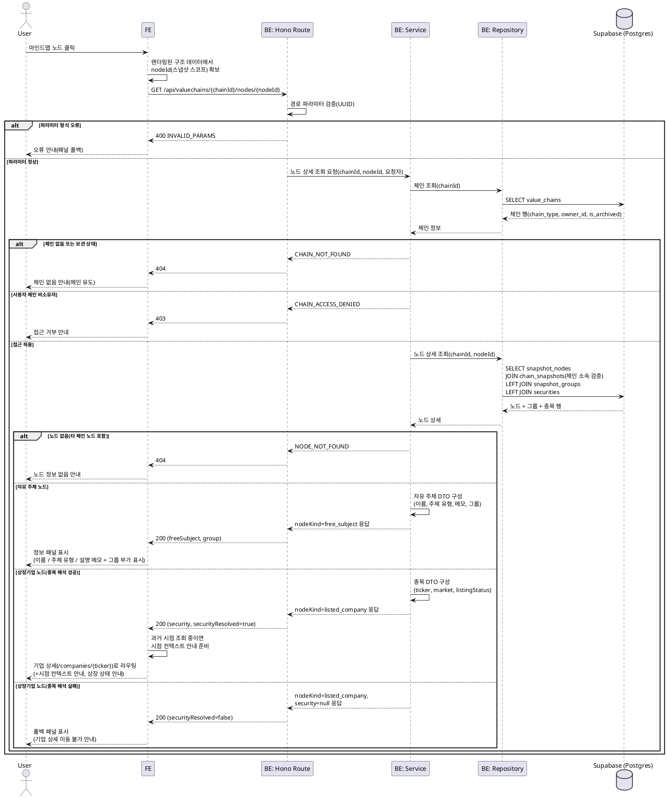

# UC-011: 노드 클릭 상호작용

> 밸류체인 뷰 페이지의 마인드맵에서 노드를 클릭하면, 노드 유형에 따라 **상장기업 노드 → 기업 상세 페이지 이동**, **자유 주체 노드 → 정보 패널 표시**로 분기한다.
> 참조: `docs/userflow.md` 011, `docs/prd.md` 3장(밸류체인 뷰), `docs/database.md` 3.3(스냅샷 계열 테이블), `docs/techstack.md` 4장(계층 구조). 연계 유스케이스: 009(뷰 조회), 012(타임라인), 020(기업 상세).

---

## Primary Actor

- **Guest / User** — 공식 체인은 누구나, 사용자 체인은 소유자 본인만 조작한다.

## Precondition

- 사용자가 밸류체인 뷰 페이지에 진입하여 마인드맵(노드/엣지/그룹)이 렌더링된 상태다(UC-009).
- 사용자 체인을 보고 있는 경우, 해당 체인의 소유자로 로그인된 상태다.
- (선택) 타임라인으로 과거 시점을 선택해 과거 스냅샷 구조가 표시된 상태일 수 있다(UC-012).

## Trigger

- 사용자가 마인드맵 캔버스에서 특정 노드를 클릭한다.

## Main Scenario

1. 사용자가 마인드맵의 노드를 클릭한다.
2. FE가 현재 렌더링 중인 구조 데이터에서 클릭된 노드의 식별자(`nodeId`, 스냅샷 스코프)를 확보하고, 노드 상세 조회 API를 호출한다.
3. BE(route)가 경로 파라미터(`chainId`, `nodeId`) 형식을 검증한다.
4. BE(service)가 체인 접근 권한을 검증한다 — 공식 체인은 전체 공개, 사용자 체인은 요청자가 소유자인 경우에만 허용.
5. BE(repository)가 노드·소속 그룹·연결 종목 정보를 조회한다. 이때 노드가 해당 체인의 스냅샷에 소속되어 있는지 함께 검증한다.
6. BE(service)가 노드 유형(`node_kind`)에 따라 응답 DTO를 구성해 반환한다.
7. FE가 응답의 노드 유형에 따라 분기한다.
   - **7a. 자유 주체 노드**: 정보 패널에 3개 필드 — **이름, 주체 유형(소비자/정부/비상장기업/기타), 설명 메모(선택)** — 를 표시한다. 그룹 소속(그룹 이름)은 부가 정보로 함께 표시한다.
   - **7b. 상장기업 노드(종목 해석 성공)**: 연결된 종목의 티커 기준으로 기업 상세 페이지(`/companies/{ticker}`)로 라우팅한다(UC-020). 과거 시점 조회 중이었다면, 기업 상세는 최신 데이터 기준임을 알리는 **시점 컨텍스트 안내**를 함께 노출한다.
8. 조회 전용 상호작용이므로 어떤 데이터도 생성/변경되지 않는다.

## Edge Cases

| # | 케이스 | 처리 |
|---|--------|------|
| E1 | 상장기업 노드지만 종목 매핑 유실/종목 마스터에서 해석 실패 | 기업 상세 이동 대신 **폴백 패널**(노드 이름 + 상세 이동 불가 안내)을 표시한다. 서버는 200 응답에 `securityResolved=false`로 반환한다. |
| E2 | 과거 시점(스냅샷) 조회 중 자유 주체 노드 클릭 | `nodeId`가 스냅샷 스코프이므로 **해당 시점의 노드 정보** 기준으로 패널을 표시한다. |
| E3 | 과거 시점(스냅샷) 조회 중 상장기업 노드 클릭 | **현재(최신) 기업 상세**로 이동하되, 조회 중이던 시점 컨텍스트를 안내한다(기업 상세는 최신 데이터 기준). |
| E4 | 상장폐지(delisted)/거래정지(suspended) 종목 노드 클릭 | 이동은 허용하고 `listingStatus`를 응답에 포함해 FE가 상태를 안내한다(폐지 종목의 과거 데이터 표시 정책은 UC-020). |
| E5 | 사용자 체인 비소유자의 API 직접 호출 | 서버 측 검증으로 403 거부(클라이언트 우회 방지). |
| E6 | 체인이 삭제/보관(비공개 전환)되었거나 존재하지 않음 | 404 반환, FE는 안내 후 메인 유도(UC-009 엣지케이스와 동일 처리). |
| E7 | 노드가 존재하지 않거나 다른 체인의 노드를 지정 | 404(NODE_NOT_FOUND) 반환, FE는 노드 정보 없음 안내. |
| E8 | 그룹 미소속 노드 클릭 | 그룹 부가 표시를 생략하고 정상 동작. |
| E9 | 네트워크/서버 오류 | 패널 영역에 오류 폴백 표시 + 재시도 제공. 라우팅은 수행하지 않는다. |
| E10 | 빠른 연속 클릭/중복 클릭 | 마지막 클릭 기준으로 패널을 갱신하고 진행 중 요청은 무시/취소한다(중복 라우팅 방지). |

## Business Rules

### 분기·표시 규칙

- **BR-1**: 노드 유형 분기는 `snapshot_nodes.node_kind` 값을 기준으로 한다 — `listed_company` → 기업 상세 라우팅, `free_subject` → 정보 패널.
- **BR-2**: 자유 주체 정보 패널은 정확히 3개 필드(이름·주체 유형·설명 메모)를 표시하며, 그룹 소속은 부가 표시 항목이다. 서술형 기업 개요 등 추가 필드는 제공하지 않는다(PRD Non-Goals).
- **BR-3**: `nodeId`는 스냅샷 스코프 식별자다. 과거 시점 조회 중의 패널 정보는 자동으로 해당 스냅샷 시점 기준이 된다(별도 시점 파라미터 불필요).
- **BR-4**: 본 상호작용은 **조회 전용**이다. 사이드이펙트가 없으며, 뷰에서의 노드 위치 조정 등도 저장하지 않는다(편집은 UC-015~018).
- **BR-5**: 응답 데이터는 UC-009/012에서 로드한 스냅샷 구조 데이터와 동일 원천(동일 스냅샷 행)이므로, FE는 클라이언트 캐시(TanStack Query)로 중복 호출을 줄일 수 있다.

### 권한 규칙

- **BR-6**: 공식 체인의 노드는 비로그인 포함 누구나 조회 가능하다. 사용자 체인의 노드는 소유자만 조회 가능하며, 판정은 반드시 서버 측에서 수행한다(RLS 미사용 — Hono 미들웨어/서비스 계층 검증).

### API Specification

#### GET `/api/valuechains/{chainId}/nodes/{nodeId}` — 노드 상세 조회

- **인증**: 선택(세션 있으면 소유자 판정에 사용). 공식 체인은 인증 불필요, 사용자 체인은 소유자 세션 필수.
- **Path Parameters**

| 이름 | 타입 | 설명 |
|---|---|---|
| `chainId` | UUID | 밸류체인 식별자(`value_chains.id`) |
| `nodeId` | UUID | 스냅샷 노드 식별자(`snapshot_nodes.id`, 스냅샷 스코프) |

- **Response 200** (`application/json`)

```json
{
  "ok": true,
  "data": {
    "nodeId": "uuid",
    "snapshotId": "uuid",
    "nodeKind": "listed_company | free_subject",
    "group": { "groupId": "uuid", "name": "string" },
    "freeSubject": {
      "name": "string",
      "subjectType": "consumer | government | private_company | other",
      "memo": "string | null"
    },
    "security": {
      "securityId": "uuid",
      "ticker": "string",
      "market": "KRX | US",
      "name": "string",
      "listingStatus": "listed | suspended | delisted"
    },
    "securityResolved": true
  }
}
```

  - `group`: 그룹 미소속이면 `null`.
  - `freeSubject`: `nodeKind=free_subject`일 때만 값 존재, 그 외 `null`.
  - `security`: `nodeKind=listed_company`이고 종목 해석 성공 시에만 값 존재, 그 외 `null`.
  - `securityResolved`: `listed_company`인데 종목 해석에 실패하면 `false`(FE 폴백 패널 트리거, E1). `free_subject`는 항상 `true`.

- **Error Responses**

| HTTP | 에러 코드 | 조건 |
|---|---|---|
| 400 | `INVALID_PARAMS` | `chainId`/`nodeId` UUID 형식 오류 |
| 403 | `CHAIN_ACCESS_DENIED` | 사용자 체인을 비소유자(비로그인 포함)가 조회 |
| 404 | `CHAIN_NOT_FOUND` | 체인 미존재 또는 보관(비공개 전환) 상태 |
| 404 | `NODE_NOT_FOUND` | 노드 미존재 또는 해당 체인 소속 스냅샷의 노드가 아님 |
| 500 | `INTERNAL_ERROR` | DB 조회 실패 등 서버 내부 오류 |

#### FE 라우팅 계약 (API 아님)

- 상장기업 노드 해석 성공 시 FE는 `/companies/{ticker}` 페이지로 이동한다. 기업 상세 데이터 로드는 UC-020의 API 계약을 따른다.

### Database Operations

| 테이블 | 작업 | 목적 |
|---|---|---|
| `value_chains` | SELECT | 체인 존재·`chain_type`·`owner_id`·`is_archived` 확인(접근 권한 검증, BR-6/E5/E6) |
| `chain_snapshots` | SELECT (JOIN) | 노드가 요청한 체인의 스냅샷에 소속되어 있는지 검증(E7) |
| `snapshot_nodes` | SELECT | 노드 유형(`node_kind`)·자유 주체 필드(`subject_name/type/memo`)·`group_id`·`security_id` 조회 |
| `snapshot_groups` | SELECT (LEFT JOIN) | 그룹 이름 부가 표시(E8: 미소속이면 결과 없음) |
| `securities` | SELECT (LEFT JOIN) | 상장기업 노드의 `ticker`/`market`/`name`/`listing_status` 해석(E1/E4) |

- INSERT / UPDATE / DELETE: **없음** (조회 전용, BR-4).
- 참고: `snapshot_nodes.security_id`는 `ON DELETE RESTRICT`라 종목 물리 삭제로 인한 매핑 유실은 DB 레벨에서 차단되지만, E1은 데이터 정합 이상 등 예외 상황에 대한 방어적 폴백으로 유지한다.

### External Service Integration

- **해당 없음.** 클라이언트에 노출되는 모든 데이터는 자체 DB에서 제공되며, 외부 API(OpenDART/SEC EDGAR/토스증권)는 배치 적재 용도로만 사용된다(PRD 8장). 본 유스케이스의 요청 경로에서 외부 서비스 호출은 발생하지 않는다.

---

## Sequence Diagram


