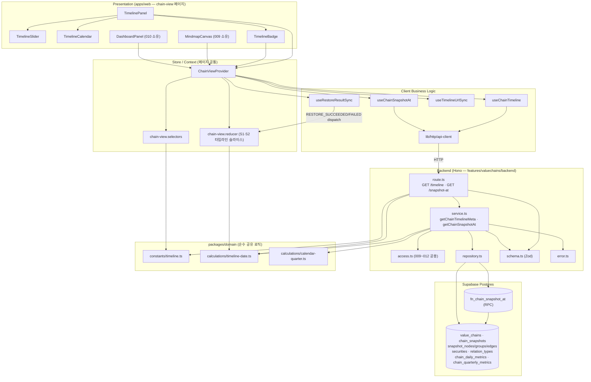

# Plan: UC-012 시점 타임라인 조회 (스냅샷 복원)

> 근거 문서: `docs/usecases/012/spec.md`, `docs/usecases/000_decisions.md`(C-2·C-6·C-7·C-8 — spec과 충돌 시 우선),
> `docs/techstack.md` §4(Codebase Structure)·§7(RPC 규약), `docs/database.md` §3.3·§3.7·§4.1·§4.2,
> `docs/pages/chain-view/state_management.md`(본 기능이 속한 밸류체인 뷰 페이지의 상태 설계 — **그대로 승계**),
> `.claude/skills/spec_to_plan/references/hono-backend-guide.md`(백엔드 모듈 컨벤션).
>
> **결정 반영 요약**
> - **C-2**: 사용자 체인 비소유자 접근은 spec의 401/403 대신 **404(`CHAIN_NOT_FOUND`) 통일**(체인 존재 비노출). FE는 방어적으로 401/403도 not-found 폴백으로 처리.
> - **C-6**: 날짜 경계는 **Asia/Seoul 고정, 당일 종료(23:59:59) 포함**, 상수 관리.
> - **C-7**: 시점 선택 시 추이 차트는 전체 유지 + 선택 시점 하이라이트(재조회 없음 — 010 소유 영역, 본 계획은 `at` 하이라이트 입력만 제공).
> - **C-8**: 미확정 분기 지표는 `null` 응답 + FE "미제공" 표기(0과 구분).
> - **외부 서비스 연동 없음**: 자체 DB(스냅샷·사전 집계 테이블) 조회 전용. 외부 API 클라이언트 모듈 불필요(spec §External Service Integration).
> - **조회 전용**: INSERT/UPDATE/DELETE 없음. 스냅샷 구조 복원(다중 테이블 조인)만 techstack §7 규약에 따라 **Postgres 함수 + RPC**로 캡슐화.

---

## 개요

### A. 공통/Shared 모듈 (다른 유스케이스와 공유 — DRY)

| 모듈 | 위치 | 설명 | 공유 대상 |
| --- | --- | --- | --- |
| 타임라인 상수 | `packages/domain/constants/timeline.ts` | `TIMESERIES_MIN_START_DATE('2015-01-01')`, `TIMELINE_TIMEZONE('Asia/Seoul')`, 당일 종료 경계 상수 (C-6, BR-4·8) | 010(대시보드), 020(기업상세), 029(집계 배치 — 당일 유효 구성 판정 동일 기준) |
| 타임라인 날짜 계산 | `packages/domain/calculations/timeline-date.ts` | `toSeoulDayEndIso(D)`(당일 종료 경계 timestamptz 문자열), `todayInSeoul(now)`, `isWithinTimelineRange(D, today)`, `isValidIsoDate(raw)` — 순수 함수 | web FE/BE + worker(029) |
| 역년 분기 계산 | `packages/domain/calculations/calendar-quarter.ts` | `calendarQuarterOf(D)` → `{ year, quarter }` — D가 속한 역년 정규화 분기 산출 순수 함수 | 010, 020, 029 |
| Hono 공통 인프라 | `apps/web/src/backend/hono/app.ts`, `apps/web/src/backend/http/response.ts`, `apps/web/src/backend/middleware/*` | 싱글턴 앱·`success()/failure()/respond()`·`errorBoundary`/`withAppContext`/`withSupabase`(세션에서 viewer 식별, 비로그인 허용) — hono-backend-guide 패턴 | 전 백엔드 유스케이스 공통. 타 plan 미구현 상태면 본 구현에서 최초 생성 |
| FE API 클라이언트 | `apps/web/src/lib/http/api-client.ts` | fetch 래퍼(타임아웃·JSON 파싱·`{error:{code,message}}` → `ApiError` 변환) | 전 FE 유스케이스 공통 |
| 체인 열람 접근 판정 | `apps/web/src/features/valuechains/backend/access.ts` | `resolveChainAccess(chain, viewerId)` 순수 함수 — 공식=전체 공개, 사용자 체인=소유자만, 보관=거부, **불가 사유 전부 not-found 통일(C-2)** | 009(뷰 조회)·010(대시보드)·011(노드 클릭)과 공용 |
| chain-view Store (페이지 공통) | `apps/web/src/features/valuechains/state/chain-view.{actions,reducer,selectors}.ts` | 페이지 단일 Store(S1~S6). 012는 이 중 **타임라인 슬라이스**(S1·S2, `TIMELINE_*` 액션·전이, `parseAtParam`)를 담당 | 009~012 (state_management.md §4 승계) |
| 쿼리 키 레지스트리 | `apps/web/src/features/valuechains/hooks/chain-view-query-keys.ts` | `timeline`/`snapshotAt` 키 추가 (state_management §6) | 009~012 |
| ChainViewProvider (페이지 공통) | `apps/web/src/features/valuechains/context/{chain-view-context.ts,ChainViewProvider.tsx}` | Store+쿼리 6종+이펙트 3종+computed 조립 Container. 012는 타임라인 쿼리 2종·이펙트 2종·computed(`timelineMeta`/`timelineBadge`/`isTimeTraveling`/`structure.isRestoring`) 연결분 | 009~012 |

### B. UC-012 소유 모듈

| 모듈 | 위치 | 설명 |
| --- | --- | --- |
| 스냅샷 복원 RPC 마이그레이션 | `supabase/migrations/0013_chain_snapshot_restore_fn.sql` | `fn_chain_snapshot_at(chain_id, as_of)` Postgres 함수 — 직전 스냅샷 1건 + 노드(securities 조인)/그룹/엣지(relation_types 조인)를 단일 왕복 jsonb로 반환 (techstack §7·database §4.1) |
| Zod 스키마 | `apps/web/src/features/valuechains/backend/schema.ts` (기능 공용 파일에 012 섹션 추가) | `ChainIdParamSchema`, `SnapshotAtQuerySchema`, RPC 결과 Row 스키마, `TimelineMetaResponseSchema`, `SnapshotAtResponseSchema` |
| 에러 코드 | `apps/web/src/features/valuechains/backend/error.ts` (기능 공용 파일에 추가) | `INVALID_CHAIN_ID`/`INVALID_DATE`/`DATE_OUT_OF_RANGE`/`CHAIN_NOT_FOUND`/`SNAPSHOT_NOT_FOUND`/`TIMELINE_QUERY_FAILED` |
| Repository | `apps/web/src/features/valuechains/backend/repository.ts` (기능 공용 파일에 추가) | `findChainForView`, `findSnapshotMarkers`, `findSnapshotStructureAt`(RPC 호출), `findDailyMetricAt`(이월 포함), `findQuarterlyMetric` — Supabase 접근 캡슐화 |
| Service | `apps/web/src/features/valuechains/backend/service.ts` (기능 공용 파일에 추가) | `getChainTimelineMeta`, `getChainSnapshotAt` — 접근 검증·경계 계산·구조/지표 조립·DTO 변환·응답 스키마 검증 (repository 인터페이스에만 의존) |
| Route | `apps/web/src/features/valuechains/backend/route.ts` (기능 공용 파일에 추가) | `GET /valuechains/:chainId/timeline`, `GET /valuechains/:chainId/snapshot-at` — 파라미터 검증·서비스 호출·로깅·응답 |
| DTO 재노출 | `apps/web/src/features/valuechains/lib/dto.ts` | backend schema의 Response 타입을 FE로 재노출 (FE↔BE 계약 단일화) |
| 타임라인 쿼리 훅 | `apps/web/src/features/valuechains/hooks/useChainTimeline.ts`, `useChainSnapshotAt.ts` | TanStack Query 훅 — 키·enabled·`keepPreviousData`·재시도 정책 (state_management §6) |
| URL 동기화 이펙트 | `apps/web/src/features/valuechains/hooks/effects/useTimelineUrlSync.ts` | S2(lastAppliedDate) → `?at=` 단방향 미러, `router.replace` (state_management §7.1) |
| 복원 결과 이펙트 | `apps/web/src/features/valuechains/hooks/effects/useRestoreResultSync.ts` | 구조 쿼리 성공/실패 → `TIMELINE_RESTORE_SUCCEEDED/FAILED` dispatch + 실패 토스트 (state_management §7.2) |
| TimelinePanel | `apps/web/src/features/valuechains/components/TimelinePanel.tsx` | 슬라이더/달력/마커 컨테이너 Presenter — `useChainViewState/Actions` 훅만 소비 |
| TimelineSlider | `apps/web/src/features/valuechains/components/TimelineSlider.tsx` | 일 단위 슬라이더 + 마커 오버레이 (순수 Presenter, props 입력) |
| TimelineCalendar | `apps/web/src/features/valuechains/components/TimelineCalendar.tsx` | 달력 팝오버(범위 밖 비활성) (shadcn-ui calendar 기반 Presenter) |
| TimelineBadge | `apps/web/src/features/valuechains/components/TimelineBadge.tsx` | "시점 조회 중" 배지(선택 날짜·기준 스냅샷 시각) + "최신으로 돌아가기" 버튼 |

> 참고: `MindmapCanvas`·`DashboardPanel`(구조/지표 렌더 본체)은 009·010 소유 Presenter다. 012는 이들이 소비하는 computed(`structure`(시점 복원 데이터로 교체됨)·`renderGraph`·`dailyMetrics.highlightedDate`)의 **입력을 바꾸는 쪽**이며 컴포넌트 자체를 만들지 않는다.

---

## Diagram

데이터 흐름은 항상 Presentation → Store/Hooks → api-client → route → service → repository → DB 단방향이며, 서버 응답 데이터는 TanStack Query 캐시가 단독 소유한다(reducer 복사 금지 — state_management 원칙).

---

## Implementation Plan

### 1. `packages/domain/constants/timeline.ts` — 타임라인 상수 (공통)

- 구현 내용:
  1. `TIMESERIES_MIN_START_DATE = '2015-01-01'` (BR-4, 선택 범위 하한).
  2. `TIMELINE_TIMEZONE = 'Asia/Seoul'` (C-6).
  3. `TIMELINE_DAY_END = { hours: 23, minutes: 59, seconds: 59 }` — "그 날짜 이전" 경계의 당일 종료 시각 판정 상수 (BR-8, C-6).
  4. 하드코딩 금지 원칙에 따라 BE(route 범위 검증·service 경계 계산)·FE(슬라이더 범위·`parseAtParam`)·worker(029) 전부 이 상수만 참조.
- 의존성: 없음 (순수 상수 — 프레임워크 독립).
- Unit Tests: N/A (상수 정의).

### 2. `packages/domain/calculations/timeline-date.ts` — 날짜 경계 계산 (공통, Business Logic)

- 구현 내용:
  1. `isValidIsoDate(raw: string): boolean` — `YYYY-MM-DD` 형식 + 실존 날짜(2026-02-30 거부) 검증.
  2. `todayInSeoul(now: Date): IsoDate` — 주입된 `now`를 Asia/Seoul 기준 날짜 문자열로 변환(`date-fns-tz`). 순수성 유지를 위해 `Date.now()` 내부 호출 금지, 항상 인자 주입.
  3. `toSeoulDayEndIso(date: IsoDate): string` — `D 23:59:59 Asia/Seoul`을 timestamptz ISO 문자열로 변환. `chain_snapshots.effective_at <= 경계` 비교의 단일 원천 (BR-1·8). 029 집계 배치의 당일 유효 구성 판정도 동일 함수 사용(엣지케이스 "스냅샷과 집계 시점 경계" 정합).
  4. `isWithinTimelineRange(date: IsoDate, today: IsoDate): boolean` — `TIMESERIES_MIN_START_DATE ≤ date ≤ today` (BR-4).
- 의존성: 모듈 1, `date-fns` + `date-fns-tz`.
- **Unit Tests:**
  - [ ] `isValidIsoDate`: `'2026-05-02'` true / `'2026-5-2'`·`'20260502'`·`'2026-02-30'`·빈 문자열 false
  - [ ] `todayInSeoul`: UTC 2026-07-05T16:00:00Z(서울 06일 01시) 입력 → `'2026-07-06'` (시간대 경계 넘김)
  - [ ] `toSeoulDayEndIso('2026-05-02')` → 2026-05-02T23:59:59+09:00과 동일 시각(UTC 14:59:59)
  - [ ] `isWithinTimelineRange`: 하한 당일(2015-01-01) true / 하한 전날 false / 오늘 true / 내일 false

### 3. `packages/domain/calculations/calendar-quarter.ts` — 역년 분기 산출 (공통, Business Logic)

- 구현 내용: `calendarQuarterOf(date: IsoDate): { year: number; quarter: 1|2|3|4 }` — 월 → 역년 정규화 분기 매핑 (BR-3, `chain_quarterly_metrics` 조회 키 산출).
- 의존성: 없음 (순수 함수).
- **Unit Tests:**
  - [ ] 1·2·3월 → Q1, 4~6월 → Q2, 7~9월 → Q3, 10~12월 → Q4
  - [ ] 분기 경계일(3/31, 4/1) 각각 Q1/Q2
  - [ ] 연도 그대로 반환(회계연도 아님 — 역년 축)

### 4. `supabase/migrations/0013_chain_snapshot_restore_fn.sql` — 스냅샷 복원 RPC 함수

- 구현 내용:
  1. `CREATE OR REPLACE FUNCTION public.fn_chain_snapshot_at(p_chain_id uuid, p_as_of timestamptz) RETURNS jsonb` — 멱등(`OR REPLACE`), `STABLE`, `SECURITY INVOKER`, `SET search_path = ''`.
  2. 내부 로직 (database.md §4.1 기준 쿼리를 단일 함수로 캡슐화):
     - (a) `chain_snapshots`에서 `chain_id = p_chain_id AND effective_at <= p_as_of ORDER BY effective_at DESC LIMIT 1` — 기존 인덱스 `idx(chain_id, effective_at DESC)` 활용.
     - (b) 0건이면 `NULL` 반환 (→ 서비스가 `SNAPSHOT_NOT_FOUND` 매핑).
     - (c) 1건이면 jsonb 조립: `{ snapshot: {id, effective_at, change_source}, groups: [...], nodes: [...(securities LEFT JOIN: ticker, name, market)], edges: [...(relation_types JOIN: name, is_directed, is_active)] }`.
     - 노드는 `node_kind`·`group_id`·`security_id`·`subject_name/type/memo`·`position_x/y` 포함(좌표 복원 — BR-1). 비활성 관계 종류 엣지도 필터 없이 포함하고 라벨은 마스터 최신 이름(엣지케이스 "비활성화된 관계 종류").
  3. 함수 주석(COMMENT)으로 경계 규칙(당일 종료, 앱에서 계산해 전달)을 문서화.
  4. 마커 목록·지표 조회는 단순 단일 테이블 SELECT이므로 함수화하지 않는다(repository 직접 쿼리 — 오버엔지니어링 금지).
- 의존성: 기존 `0005`·`0006`·`0010` 마이그레이션(테이블). 적용은 `mcp__supabase__apply_migration`, 적용 후 `generate_typescript_types`로 `packages/domain/types/database.ts` 재생성 (techstack §7).
- **Unit Tests (통합 — 적용 후 SQL 검증 시나리오):**
  - [ ] 스냅샷 3건(5/1, 5/2 09:30, 6/1) 체인에서 `p_as_of = 5/2 23:59:59+09` → 5/2 스냅샷 반환(당일 발생 포함)
  - [ ] `p_as_of`가 첫 스냅샷 이전 → `NULL`
  - [ ] 노드/그룹/엣지 0건 스냅샷(이론상 그룹만 존재) → 빈 배열로 반환(널 아님)
  - [ ] 상장기업 노드에 securities 표시 필드 포함, 자유 주체 노드는 security 없이 subject 필드 포함
  - [ ] `is_active = false` 관계 종류 엣지 포함 + 최신 `name` 반환

### 5. `features/valuechains/backend/schema.ts` — Zod 스키마 (012 추가분)

- 구현 내용 (hono-backend-guide 컨벤션 — Request/Row/Response 분리, Row는 snake_case·Response는 camelCase):
  1. `ChainIdParamSchema = z.object({ chainId: z.string().uuid() })` — 009와 공용(이미 있으면 재사용).
  2. `SnapshotAtQuerySchema = z.object({ date: z.string() })` + 형식 검증은 route에서 `isValidIsoDate`로 수행(에러 코드 분기 목적).
  3. RPC 결과 Row 스키마: `SnapshotAtRpcRowSchema`(snapshot/groups/nodes/edges jsonb 구조, snake_case), `ChainRowSchema`(공용), `DailyMetricRowSchema`, `QuarterlyMetricRowSchema`, `SnapshotMarkerRowSchema`.
  4. Response 스키마 (spec §API Specification과 1:1):
     - `TimelineMetaResponseSchema = { range: { minDate, maxDate }, markers: [{ snapshotId, effectiveAt, changeSource }] }`
     - `SnapshotAtResponseSchema = { snapshot: { snapshotId, effectiveAt, changeSource, groups, nodes, edges }, metrics: { daily: DailyMetricSchema.nullable(), quarterly: QuarterlyMetricSchema.nullable() } }`
     - `nodes[].security`는 `listed_company`일 때만, `subject*`는 `free_subject`일 때만 존재하는 판별 유니온으로 정의. 금액(`totalMarketCapKrw`/`totalRevenueKrw`)은 정밀도 보존을 위해 **문자열**(spec 예시 준수, numeric → string).
  5. 전체 타입 export — FE는 `lib/dto.ts` 재노출로만 참조.
- 의존성: 모듈 4(생성 타입 참고), `zod`.
- Unit Tests: N/A (스키마 정의 — 서비스 테스트에서 간접 검증).

### 6. `features/valuechains/backend/error.ts` — 에러 코드 (012 추가분)

- 구현 내용: `valuechainErrorCodes`에 추가 — `invalidChainId: 'INVALID_CHAIN_ID'`, `invalidDate: 'INVALID_DATE'`, `dateOutOfRange: 'DATE_OUT_OF_RANGE'`, `chainNotFound: 'CHAIN_NOT_FOUND'`, `snapshotNotFound: 'SNAPSHOT_NOT_FOUND'`, `timelineQueryFailed: 'TIMELINE_QUERY_FAILED'` + `ValuechainServiceError` 유니온 타입.
  - **C-2 반영**: spec의 `UNAUTHORIZED`/`CHAIN_ACCESS_DENIED`는 뷰 조회 경로에서 **발급하지 않는다**(전부 `CHAIN_NOT_FOUND` 404 통일). 코드 상수 자체를 만들지 않아 오사용을 컴파일 타임에 차단.
- 의존성: 없음.
- Unit Tests: N/A (상수 정의).

### 7. `features/valuechains/backend/access.ts` — 체인 열람 접근 판정 (공통, Business Logic)

- 구현 내용:
  1. `resolveChainAccess(chain: { chainType, ownerId, isArchived } | null, viewerId: string | null): 'viewable' | 'not-found'` — 순수 함수.
  2. 판정 규칙 (BR-6 + C-2): 체인 없음 → not-found / `isArchived` → not-found(보관 공식 체인 비공개 전환) / official → viewable / user 체인 & `viewerId === ownerId` → viewable / 그 외(비로그인 포함) → not-found.
  3. 009~012 서비스가 공유 — 각 서비스는 이 함수 결과만 분기하고 자체 권한 로직을 두지 않는다(DRY).
- 의존성: 없음.
- **Unit Tests:**
  - [ ] 공식 체인 + viewerId null(게스트) → viewable
  - [ ] 사용자 체인 + 소유자 → viewable
  - [ ] 사용자 체인 + 타인/비로그인 → not-found (403/401 아님 — C-2)
  - [ ] archived 공식 체인 → not-found
  - [ ] chain null → not-found

### 8. `features/valuechains/backend/repository.ts` — Repository (012 추가분)

- 구현 내용 (Supabase 쿼리 캡슐화 — service는 이 함수 시그니처에만 의존):
  1. `findChainForView(client, chainId)` → `{ id, chainType, ownerId, isArchived } | null` — `value_chains` 단건 SELECT.
  2. `findSnapshotMarkers(client, chainId)` → `{ snapshotId, effectiveAt, changeSource }[]` — `chain_snapshots` `effective_at` 오름차순 전체 (database §4.1 마커 쿼리).
  3. `findSnapshotStructureAt(client, chainId, asOfIso)` → RPC `fn_chain_snapshot_at` 호출, `null`(스냅샷 없음) 또는 구조 jsonb 반환. Row 스키마 검증은 service 책임.
  4. `findDailyMetricAt(client, chainId, date)` → `chain_daily_metrics`에서 `metric_date <= date ORDER BY metric_date DESC LIMIT 1` (이월 규칙 — database §4.5 패턴) 또는 `null`.
  5. `findQuarterlyMetric(client, chainId, year, quarter)` → `chain_quarterly_metrics` 단건 또는 `null`.
  6. 모든 함수는 DB 오류 시 `{ data: null, error }`를 그대로 노출하지 않고 리턴 타입 `RepositoryResult<T> = { ok: true; value: T } | { ok: false; cause: string }`로 정규화 — service가 `TIMELINE_QUERY_FAILED`로 매핑.
- 의존성: 모듈 4(RPC 함수), 모듈 5(Row 타입), `@supabase/supabase-js`.
- **Unit Tests** (Supabase client mock):
  - [ ] `findChainForView` — 행 존재/부재 각각 매핑, DB 오류 시 `ok: false`
  - [ ] `findSnapshotStructureAt` — rpc 파라미터(`p_chain_id`, `p_as_of`) 전달 검증, `NULL` 반환 → `value: null`
  - [ ] `findDailyMetricAt` — `lte('metric_date', D)` + `order desc` + `limit 1` 쿼리 체인 호출 검증
  - [ ] `findQuarterlyMetric` — `(chain_id, calendar_year, calendar_quarter)` eq 매칭

### 9. `features/valuechains/backend/service.ts` — Service (012 추가분, Business Logic)

- 구현 내용:
  1. `getChainTimelineMeta(client, chainId, viewerId, now): Promise<HandlerResult<TimelineMetaResponse, ValuechainServiceError>>`
     - repository `findChainForView` → `resolveChainAccess` — not-found면 `failure(404, chainNotFound)` (C-2).
     - `findSnapshotMarkers` 로드 → `range = { minDate: TIMESERIES_MIN_START_DATE, maxDate: todayInSeoul(now) }` 조립.
     - DTO 변환(snake→camel) → `TimelineMetaResponseSchema.safeParse` 검증 → `success`.
  2. `getChainSnapshotAt(client, chainId, date, viewerId, now): Promise<HandlerResult<SnapshotAtResponse, ValuechainServiceError>>`
     - 접근 검증(위와 동일 경로 재사용).
     - `toSeoulDayEndIso(date)`로 경계 계산(C-6) → `findSnapshotStructureAt` — `null`이면 `failure(404, snapshotNotFound)` (엣지케이스 "첫 스냅샷 이전").
     - RPC 결과를 `SnapshotAtRpcRowSchema`로 검증 후 구조 DTO 조립: 노드 종류별 판별 유니온 매핑(security 표시 정보 / subject 필드), 좌표, 엣지 관계 라벨(최신 이름·`isDirected`·`isActive`).
     - 일별 지표: `findDailyMetricAt(D)` — 행 없음 → `daily: null`. 행 있음 → `isCarriedForward = row.is_carried_forward || row.metric_date < D`(집계 행 자체 이월 플래그 OR 당일 결측으로 직전 행 이월 — BR-3), `metricDate`는 실제 관측일(row.metric_date) 반환.
     - 분기 지표: `calendarQuarterOf(D)` → `findQuarterlyMetric` — 미존재 시 `quarterly: null` (C-8, 폴백 없음).
     - 응답 스키마 검증 실패 → `failure(500, timelineQueryFailed)`.
  3. repository 오류(`ok: false`)는 전부 `failure(500, timelineQueryFailed, cause)`로 수렴 — route가 500 매핑·로깅.
  4. 조회 전용 보장: service에 쓰기 경로 없음 (BR-7).
- 의존성: 모듈 2·3(도메인 계산), 5(스키마), 6(에러), 7(접근 판정), 8(repository), 공통 `http/response`.
- **Unit Tests** (repository mock 주입):
  - [ ] 타임라인 메타: 공식 체인 게스트 → 200, 마커 오름차순·`range.maxDate = todayInSeoul(now)`
  - [ ] 타임라인 메타: 사용자 체인 비소유자 → `chainNotFound`(404) — `CHAIN_ACCESS_DENIED` 미발급(C-2)
  - [ ] 복원: archived 체인 → `chainNotFound`
  - [ ] 복원: 스냅샷 없음(RPC null) → `snapshotNotFound`(404)
  - [ ] 복원: D 당일 09:30 스냅샷 존재 → `toSeoulDayEndIso(D)` 경계로 포함되어 해당 스냅샷 반환(당일 종료 경계 — C-6)
  - [ ] 복원: 일별 지표 행이 D-3일자(휴장) → `isCarriedForward: true`, `metricDate: D-3`
  - [ ] 복원: 일별 지표 행의 `is_carried_forward = true`(집계 시점 이월) → `isCarriedForward: true`
  - [ ] 복원: 일별/분기 지표 미존재 → `daily: null` / `quarterly: null` (0 아님 — C-8)
  - [ ] 복원: `free_subject` 노드 → `security` 없음 + `subjectName/Type/Memo` 존재, `listed_company` 노드 → 반대
  - [ ] 복원: 비활성 관계 종류 엣지 → 포함 + `relationType.isActive: false` + 최신 이름
  - [ ] repository `ok: false` → `timelineQueryFailed`(500)
  - [ ] snake_case → camelCase 필드 매핑 정확성(`position_x`→`positionX`, `total_market_cap_krw`→`totalMarketCapKrw` 문자열)

### 10. `features/valuechains/backend/route.ts` — Route Handler (012 추가분)

- 구현 내용:
  1. `registerValuechainRoutes(app)`에 2개 엔드포인트 추가 (Next `api/[[...hono]]` 하위이므로 실제 경로는 `/api/...`):
     - `GET /valuechains/:chainId/timeline`
     - `GET /valuechains/:chainId/snapshot-at?date=YYYY-MM-DD`
  2. 검증 순서(스펙 step 4 — 2차 방어):
     - `chainId` UUID 실패 → `failure(400, invalidChainId)`.
     - `date` 누락/`isValidIsoDate` 실패 → `failure(400, invalidDate)`.
     - `isWithinTimelineRange(date, todayInSeoul(now))` 실패 → `failure(400, dateOutOfRange)` (직접 URL 진입 우회 차단).
  3. `withAppContext`/`withSupabase` 미들웨어에서 viewer(세션 사용자 id 또는 null — 비로그인 허용)와 Supabase client·logger 주입, service 호출, 실패 시 코드별 로깅, `respond(c, result)` 반환.
  4. HTTP 상태는 service의 `HandlerResult` status를 그대로 사용(404/400/500 매핑 완결).
- 의존성: 모듈 2(날짜 검증), 5, 6, 9, 공통 Hono 인프라. `backend/hono/app.ts`에 라우터 등록(기능 파일이 이미 등록돼 있으면 변경 없음).
- **QA Sheet:**

| # | 시나리오 | 기대 결과 |
| --- | --- | --- |
| 1 | `GET /api/valuechains/{uuid}/timeline` (공식 체인, 비로그인) | 200, `{ data: { range, markers[] } }`, minDate=2015-01-01·maxDate=오늘(KST) |
| 2 | `GET .../timeline` — chainId가 `abc` | 400 `INVALID_CHAIN_ID` |
| 3 | `GET .../snapshot-at?date=2026-05-02` (스냅샷 존재) | 200, snapshot+metrics 구조가 spec 응답 예시와 일치 |
| 4 | `date=2026/05/02` 또는 누락 | 400 `INVALID_DATE` |
| 5 | `date=2014-12-31` / 내일 날짜 | 400 `DATE_OUT_OF_RANGE` |
| 6 | 사용자 체인에 비로그인/타인 세션으로 호출 | 404 `CHAIN_NOT_FOUND` (401/403 아님 — C-2) |
| 7 | 존재하지 않는/archived chainId | 404 `CHAIN_NOT_FOUND` |
| 8 | 첫 스냅샷 이전 날짜 | 404 `SNAPSHOT_NOT_FOUND` |
| 9 | DB 오류(RPC 실패 모킹) | 500 `TIMELINE_QUERY_FAILED` + logger.error 기록 |
| 10 | 응답 포맷 | 성공 `{ data }` / 실패 `{ error: { code, message } }` 공통 규약 준수 |

### 11. `features/valuechains/lib/dto.ts` — DTO 재노출

- 구현 내용: `schema.ts`의 `TimelineMetaResponse`/`SnapshotAtResponse`(및 마커·노드·지표 하위 타입)를 re-export. FE 훅·컴포넌트는 이 경로만 import(백엔드 내부 경로 직접 참조 금지).
- 의존성: 모듈 5.
- Unit Tests: N/A (re-export).

### 12. `state/chain-view.reducer.ts` 타임라인 슬라이스 — `parseAtParam` + `TIMELINE_*` 전이 (페이지 공통 파일, 012 담당분)

- 구현 내용 (state_management §3~4를 그대로 구현 — 본 계획은 타임라인 관련 4개 액션과 초기화 담당):
  1. `parseAtParam(raw, today)` — `isValidIsoDate` + `isWithinTimelineRange` 통과 시만 값 유지, 무효 시 `null`(딥링크 방어).
  2. `createInitialChainViewState({ atParam, today })` — S1을 `parseAtParam` 결과로 초기화.
  3. 전이 규칙(§4.2 표 그대로): `TIMELINE_DATE_SELECTED`(S1 갱신 + S3/S5/S6 동시 초기화, 동일 값 no-op) / `TIMELINE_RETURNED_TO_LATEST`(S1=null + 초기화) / `TIMELINE_RESTORE_SUCCEEDED`(경합 가드 후 S2←date) / `TIMELINE_RESTORE_FAILED`(경합 가드 후 S1←S2 되돌림).
  4. reducer 순수성: `Date.now()`·라우터·토스트 접근 금지 — "오늘"은 액션 래퍼에서 주입.
- 의존성: 모듈 1·2. 009~011 슬라이스(S3~S6 액션)와 같은 파일이지만 전이가 독립적이라 충돌 없음(액션 타입 유니온에 추가만).
- **Unit Tests** (state_management §12에서 012 해당분):
  - [ ] `parseAtParam` — 유효/형식 오류/미래/2015 이전 각각 값/`null`
  - [ ] `TIMELINE_DATE_SELECTED(D)` — S1=D + S3=null·S5={}·S6=[] 동시 초기화, S2·S4 불변
  - [ ] 동일 D 재선택 — 기존 state 참조 그대로(no-op)
  - [ ] `TIMELINE_RESTORE_SUCCEEDED{date:D}` (S1=D) — S2=D / (S1=D2 경합) — 무시
  - [ ] `TIMELINE_RESTORE_FAILED{failedDate:D}` (S1=D, S2=D0) — S1=D0 되돌림 / 경합 시 무시
  - [ ] `TIMELINE_RETURNED_TO_LATEST` — S1=null + S3/S5/S6 초기화
  - [ ] 모든 전이에서 입력 state 비변이(immutability)

### 13. `hooks/useChainTimeline.ts` · `hooks/useChainSnapshotAt.ts` — 타임라인 쿼리 훅 (Business Logic)

- 구현 내용 (state_management §6 계약 그대로):
  1. `useChainTimeline(chainId)` — 키 `chainViewQueryKeys.timeline(chainId)`, 항상 enabled, `api-client`로 `GET /api/valuechains/{chainId}/timeline` 호출, 응답을 `TimelineMetaResponse`로 파싱. 404는 retry 없음.
  2. `useChainSnapshotAt(chainId, date)` — 키 `snapshotAt(chainId, date)`, `enabled: date !== null`, `placeholderData: keepPreviousData`(시점 전환 로딩 중 직전 구조 유지 — 빈 화면 금지), `SNAPSHOT_NOT_FOUND`/404·400은 retry 없음, 그 외 기본 재시도.
  3. `chain-view-query-keys.ts`에 두 키 추가(공용 파일).
  4. **지표 단일 원천 규약**: `snapshot-at` 응답의 `metrics`는 FE에서 사용하지 않는다(구조 + `snapshot.effectiveAt`만 사용). 지표 패널은 010의 일별/분기 지표 쿼리(`at` 파라미터)가 단일 원천(state_management §6 — 이중 원천 표시 불일치 방지). API 응답에는 spec 계약대로 포함 유지.
- 의존성: 모듈 11(DTO), 공통 `api-client`, `@tanstack/react-query`.
- **Unit Tests** (fetch mock):
  - [ ] `useChainSnapshotAt` — `date=null`이면 fetch 미발생(enabled 규칙)
  - [ ] date 변경 시 쿼리 키 교체 + 이전 데이터 placeholder 유지
  - [ ] 404 `SNAPSHOT_NOT_FOUND` — retry 0회, error에 코드 보존
  - [ ] 200 응답 → DTO 파싱 성공, `{ error }` 응답 → `ApiError(code, message)` 변환

### 14. `hooks/effects/useTimelineUrlSync.ts` — URL 동기화 이펙트 (Business Logic)

- 구현 내용 (state_management §7.1 그대로):
  1. 입력 `{ lastAppliedDate(S2), hasRestoreConcluded }` — URL `?at=`는 **S2의 미러**(복원 성공 시에만 갱신, 실패 시 URL 무변경으로 자동 원복).
  2. `hasRestoreConcluded === false`(딥링크 최초 진입 미확정) 동안 동기화 보류로 `?at=` 보존.
  3. `router.replace` 사용(히스토리 오염 방지), S2=null이면 `?at=` 제거.
- 의존성: 모듈 12(S2), Next.js `useRouter`/`useSearchParams`.
- **Unit Tests** (mock router):
  - [ ] S2=`2026-05-02` 확정 → `?at=2026-05-02`로 replace 1회
  - [ ] S2=null 확정 → `?at=` 제거
  - [ ] `hasRestoreConcluded=false` 동안 replace 미호출(딥링크 보존)
  - [ ] 동일 S2 재렌더 → 중복 replace 없음

### 15. `hooks/effects/useRestoreResultSync.ts` — 복원 결과 → Action 변환 이펙트 (Business Logic)

- 구현 내용 (state_management §7.2 그대로):
  1. 최신 구조 쿼리 성공 && S1=null → `TIMELINE_RESTORE_SUCCEEDED{date:null}` dispatch.
  2. `snapshot-at(D)` 성공 && S1=D → `TIMELINE_RESTORE_SUCCEEDED{date:D}`.
  3. `snapshot-at(D)` 실패 && S1=D → `notifyRestoreFailure` 토스트(`SNAPSHOT_NOT_FOUND` → "이전 스냅샷 없음/최소 시점" 안내, 그 외 → 오류+재시도 유도) 후 `TIMELINE_RESTORE_FAILED{failedDate:D}` — reducer가 S1←S2로 되돌려 직전 화면 유지(엣지케이스).
  4. 같은 결과에 대한 중복 dispatch 방지(직전 처리 키 ref 보관), reducer 경합 가드가 2차 방어.
- 의존성: 모듈 12·13, 009의 `useChainStructure`(최신 구조 쿼리 — 공용).
- **Unit Tests** (mock 쿼리 결과·dispatch):
  - [ ] D 성공 → SUCCEEDED 1회 dispatch(payload D)
  - [ ] D 실패(404) → 토스트 'snapshot-not-found' + FAILED dispatch 순서 보장
  - [ ] D1 요청 중 S1이 D2로 변경 → D1 결과 무시(dispatch 없음)
  - [ ] 최신 구조 성공(S1=null) → SUCCEEDED{date:null}
  - [ ] 동일 결과 재렌더 → 중복 dispatch 없음

### 16. `ChainViewProvider` 통합 (페이지 공통 파일, 012 연결분)

- 구현 내용:
  1. Provider에 모듈 13 쿼리 2종·모듈 14/15 이펙트 연결(009가 만든 Provider 골격에 추가 — 골격 미구현 시 state_management §8.1 구조로 생성).
  2. computed 추가: `isTimeTraveling`(S1≠null), `timelineMeta`(TimelineMetaView 판별 유니온), `timelineBadge`(선택 날짜+기준 스냅샷 `effectiveAt`, 최신 조회면 null), `structure`의 시점 복원 분기(`selectedDate !== null`이면 snapshot-at 데이터 사용, `isRestoring` 플래그).
  3. actions 추가: `selectTimelineDate(date)`(dispatch 전 `isWithinTimelineRange` 1차 검증 — 무효 선택 무시, 스펙 step 3), `returnToLatest()`.
  4. 일별 지표 쿼리 키의 `at` 파라미터(S1)와 하이라이트 입력(C-7)은 010 소유 훅에 전달만.
- 의존성: 모듈 12~15, 009 Provider 골격.
- **QA Sheet** (Provider 통합 동작):

| # | 시나리오 | 기대 결과 |
| --- | --- | --- |
| 1 | 뷰 진입(`?at` 없음) | 타임라인 메타 로드 → 슬라이더/마커 표시, 최신 구조 렌더, 배지 없음 |
| 2 | 날짜 D 선택 | snapshot-at 쿼리 발화, 로딩 중 직전 구조 유지(`isRestoring`), 성공 시 URL `?at=D`·배지 표시 |
| 3 | 첫 스냅샷 이전 날짜 선택 | 토스트 안내 + S1이 직전 성공 시점으로 복귀, URL·화면 무변화 |
| 4 | `?at=2026-05-02` 딥링크 진입 | 최초부터 시점 복원 흐름, 성공 시 URL 보존·실패 시 `?at=` 제거 후 최신 조회 |
| 5 | `?at=` 무효값(형식/범위) 딥링크 | S1=null로 시작(최신 조회), `?at=` 제거 |
| 6 | "최신으로 돌아가기" | S1=null, 최신 구조(캐시 히트 시 즉시), `?at=` 제거, 배지 제거 |
| 7 | 시점 조회 중 노드 클릭(011 연계) | 자유 주체는 해당 시점 정보 패널, 상장기업은 `/companies/{ticker}?asOf=D` 이동(011 이펙트에 S1 전달) |

### 17. `components/TimelinePanel.tsx` + `TimelineSlider.tsx` + `TimelineCalendar.tsx` + `TimelineBadge.tsx` — Presenter (Presentation)

- 구현 내용:
  1. `TimelinePanel`(컨테이너 Presenter): `useChainViewState()`에서 `timelineMeta`/`selectedDate`/`isTimeTraveling`/`timelineBadge`, `useChainViewActions()`에서 `selectTimelineDate`/`returnToLatest`만 소비. `timelineMeta.status` 분기(loading 스켈레톤 / error 영역 폴백 — 구조·지표와 독립 실패 / ready).
  2. `TimelineSlider`(순수 Presenter, props): `range`(min~max) 기반 일 단위 슬라이더 + 마커 오버레이(`markers[].effectiveAt` 위치, `changeSource`별 스타일 구분), 마커 클릭 → 해당 `effectiveAt`의 날짜로 `onSelectDate`. 드래그 중에는 툴팁으로 날짜 표시, **놓는 시점에 1회만** `onSelectDate`(고빈도 이벤트가 Store를 통과하지 않도록).
  3. `TimelineCalendar`: shadcn-ui `calendar`+`popover` 기반, `range` 밖·미래 날짜 disabled(1차 차단 — 스펙 step 3).
  4. `TimelineBadge`: `timelineBadge`가 있으면 "D 시점 조회 중 · 기준 스냅샷 {effectiveAt}" 표기 + "최신으로 돌아가기" 버튼(`returnToLatest`). 이월/커버리지 표기는 010의 지표 패널 책임(BR-5) — 본 배지는 시점·기준 스냅샷만.
  5. 로직 없음 — 날짜 검증·URL·토스트는 전부 Store/이펙트 계층. 마커 1개뿐인 체인도 동일 렌더(정상 동작 엣지케이스).
  6. 필요 shadcn-ui 컴포넌트 설치 안내: `npx shadcn@latest add slider calendar popover badge button tooltip`.
- 의존성: 모듈 16(Context), shadcn-ui 프리미티브.
- **QA Sheet:**

| # | 시나리오 | 기대 결과 |
| --- | --- | --- |
| 1 | 뷰 진입 후 타임라인 로드 완료 | 슬라이더 범위 2015-01-01~오늘, 스냅샷 마커가 `effectiveAt` 위치에 표시 |
| 2 | 타임라인 메타 로딩 중 | 스켈레톤 표시(캔버스·지표 영역과 독립) |
| 3 | 타임라인 메타 로드 실패 | 타임라인 영역만 오류 폴백 + 재시도, 캔버스는 정상 표시 |
| 4 | 슬라이더 드래그 후 놓기 | 놓는 순간 1회만 날짜 선택 발생, 드래그 중 툴팁으로 날짜 표시 |
| 5 | 마커 클릭 | 해당 스냅샷 일자로 선택, 마인드맵이 그 시점 구조(저장 좌표)로 재렌더 |
| 6 | 달력에서 미래/2015 이전 날짜 | 선택 불가(disabled) — 클릭 자체가 무시됨 |
| 7 | 시점 조회 중 상태 | 배지에 선택 날짜·기준 스냅샷 시각 표시, "최신으로 돌아가기" 노출 |
| 8 | "최신으로 돌아가기" 클릭 | 배지 제거, 최신 구조로 복귀, 슬라이더 선택 해제 |
| 9 | 시점 전환 로딩 중 | 직전 구조가 유지된 채 로딩 인디케이터(빈 화면 금지) |
| 10 | 복원 실패(스냅샷 없음) | "이전 스냅샷 없음/최소 시점" 토스트, 슬라이더가 직전 성공 시점으로 복귀 |
| 11 | 마커가 1개뿐인 체인 | 마커 1개 표시, 어느 날짜를 선택해도 단일 구성 표시 |
| 12 | 키보드 접근성 | 슬라이더 방향키 조작·달력 포커스 이동 가능(shadcn 기본), 배지 버튼 탭 포커스 |
| 13 | 반응형 | 모바일 폭에서 슬라이더/달력이 가로 스크롤 없이 배치 |

### 18. 공통 인프라 모듈 (타 유스케이스 공용 — 미구현 시 본 구현에서 생성)

- `apps/web/src/backend/hono/app.ts` / `http/response.ts` / `middleware/*`: hono-backend-guide 패턴 그대로(싱글턴·미들웨어 체인 순서 errorBoundary → withAppContext → withSupabase·`HandlerResult`). `withSupabase`는 서비스 롤 클라이언트 주입 + 세션 쿠키에서 **선택적** viewer 식별(비로그인 허용 — 공식 체인 게스트 조회 요건).
- `apps/web/src/lib/http/api-client.ts`: fetch 래퍼 — 타임아웃(상수), `{ error: { code, message } }` → `ApiError` 변환, 크레덴셜 포함(세션 쿠키). 환경변수 `NEXT_PUBLIC_*`는 `lib/env`(또는 `config`)를 통해서만 접근.
- `app/api/[[...hono]]/route.ts`: `runtime = 'nodejs'`, Hono 앱 위임.
- 본 유스케이스 구현 시점에 이미 존재하면 **변경 없이 재사용**(수정 금지 — 라우터 등록 1줄 추가만).
- Unit Tests: 인프라 자체는 스모크 수준(라우팅 도달·에러 바운더리 동작)만. 상세 테스트는 각 기능 서비스 테스트가 커버.

---

## 구현 순서 및 충돌 검토

**구현 순서** (의존성 역순):
1. 모듈 1~3 (domain 상수·순수 함수) → 2. 모듈 4 (마이그레이션 + 타입 재생성) → 3. 모듈 5~10 (backend 계층: schema → error → access → repository → service → route) → 4. 모듈 11~15 (FE 로직: DTO → reducer 슬라이스 → 쿼리 훅 → 이펙트) → 5. 모듈 16~17 (Provider 통합 → Presenter) → 6. QA Sheet 검증.

**기존 코드베이스/타 계획과의 충돌 검토**:
- 현재 `apps/`·`packages/` 미스캐폴딩 상태 — 본 계획의 모든 경로는 techstack §4 구조 기준 신규 생성이며 충돌 없음. env_setupper의 스캐폴딩이 선행되면 그 골격을 따른다.
- `features/valuechains/backend/{schema,error,repository,service,route}.ts`는 009~012가 **공유하는 기능 파일**이다. 본 계획은 012 함수/스키마/코드 **추가분**만 정의하며, 009~011 plan이 같은 파일에 추가하는 내용과 함수 단위로 분리되어 병합 충돌이 없다(파일 내 섹션 주석으로 유스케이스 경계 표기).
- `chain-view.reducer.ts` 등 페이지 Store는 state_management.md가 단일 SOT — 009~012 어느 plan이 먼저 구현하든 §4 전이 표 전체를 한 번에 구현하고, 나머지 plan은 재사용만 한다.
- 마이그레이션 번호 `0013`은 기존 `0001~0012` 다음 번호로 유일 — 타 유스케이스가 먼저 `0013`을 점유하면 다음 번호로 밀어 적용한다(멱등 `CREATE OR REPLACE`라 내용 충돌 없음).
- spec의 401/403 에러 코드는 C-2 확정에 따라 구현하지 않는다 — 이는 spec 대비 의도된 편차이며 FE는 방어적으로 401/403 응답도 not-found 폴백으로 처리한다(state_management §1.2).
