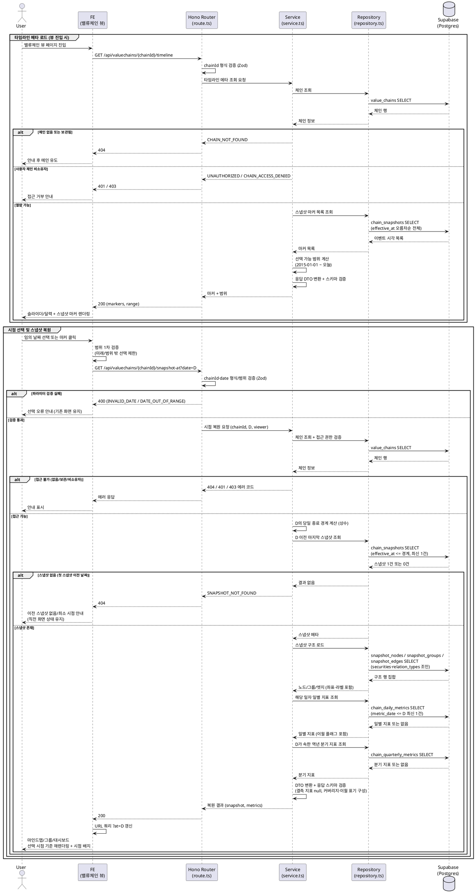

# UC-012: 시점 타임라인 조회 (스냅샷 복원)

> 관련 유저플로우: `docs/userflow.md` 012 · 관련 페이지: 밸류체인 뷰(`/valuechains/[chainId]?at=<날짜>`)
> 연계 기능: 009(뷰 조회), 010(대시보드 패널), 011(노드 클릭), 018/021/022(스냅샷 생성원), 029(일별 지표 사전 집계)

밸류체인 뷰 페이지의 일 단위 슬라이더/달력과 구조 변경 스냅샷 마커를 통해, 임의 과거 날짜의 밸류체인 구조(노드/관계/그룹)와 그 일자의 지표를 복원 조회한다. 공식 체인(승인/편집 이벤트 스냅샷)과 사용자 체인(저장 이벤트 스냅샷) 모두 지원한다.

---

## Primary Actor

- **Guest / User** (해당 체인 열람 권한 내)
  - 공식 체인: Guest/User 모두 조회 가능
  - 사용자 체인: 소유자 User만 조회 가능

## Precondition (사용자 관점)

- 사용자가 열람 권한이 있는 밸류체인의 뷰 페이지에 진입해 있다.
  - 공식 체인이면 로그인 불필요, 사용자 체인이면 로그인 상태 + 본인 소유.
- 해당 체인은 저장/편집/승인으로 생성된 스냅샷이 최소 1개 존재한다(저장 1회 = 1스냅샷 원칙에 따라 저장된 체인은 항상 충족).

## Trigger

- 사용자가 뷰 페이지의 타임라인에서 **임의 날짜를 선택**(슬라이더/달력)하거나 **스냅샷 마커를 클릭**한다.
- (선행 표시) 뷰 페이지 진입 시 FE가 타임라인 메타(선택 가능 범위 + 스냅샷 마커 목록)를 로드해 표시한다.

## Main Scenario

1. 사용자가 밸류체인 뷰 페이지에 진입하면, FE가 타임라인 메타 API를 호출해 선택 가능 날짜 범위(시계열 최소 시작 2015-01-01 ~ 오늘)와 스냅샷 마커(구조 변경 이벤트 시각 목록)를 슬라이더/달력 위에 렌더링한다.
2. 사용자가 슬라이더/달력에서 임의 날짜 D를 선택하거나 스냅샷 마커를 클릭한다.
3. FE가 클라이언트 측에서 선택 값의 범위(미래·범위 밖 차단)를 1차 검증하고, 시점 복원 API를 호출한다.
4. BE 라우터(route)가 경로 파라미터(chainId)와 쿼리 파라미터(date)의 형식·범위를 스키마로 검증한다.
5. BE 서비스(service)가 체인의 존재·보관(archived) 여부·접근 권한(공식 = 전체 공개, 사용자 체인 = 소유자만)을 검증한다.
6. BE 서비스가 리포지토리(repository)를 통해 **D 이전(당일 종료 경계 포함) 마지막 스냅샷 1건**을 조회한다.
7. BE 서비스가 해당 스냅샷의 노드/그룹/엣지(저장된 좌표 포함)와 상장기업 노드의 종목 표시 정보(티커/종목명/시장), 엣지의 관계 종류 라벨(마스터 최신 이름·방향성)을 로드해 구조 복원 데이터를 조립한다.
8. BE 서비스가 **해당 일자 D의 일별 지표**(가치총액·커버리지, 결측 시 직전 관측값 이월분)와 **D가 속한 역년 분기의 분기 지표**(매출 합계·제외 기업 수)를 사전 집계 테이블에서 로드한다.
9. BE 서비스가 응답 DTO로 변환하고 응답 스키마를 검증한 뒤 반환한다.
10. FE가 URL 쿼리(`?at=D`)를 갱신하고, 마인드맵(노드/엣지/그룹 클러스터, 스냅샷 좌표로 배치 재현)과 대시보드 현재값을 선택 시점 기준으로 재렌더링한다. 시점 조회 중 상태(선택 날짜, 기준 스냅샷 시각, "최신으로 돌아가기" 진입점, 이월/커버리지 표기)를 함께 표시한다.

## Edge Cases

| 상황 | 처리 |
|---|---|
| 첫 스냅샷 이전 날짜 선택 | 직전 스냅샷 0건 → `SNAPSHOT_NOT_FOUND`(404) 응답. FE는 "이전 스냅샷 없음/최소 시점" 안내를 표시하고 직전 화면 상태를 유지한다. |
| 미래 날짜·범위 밖(2015-01-01 이전) 선택 | FE에서 선택 자체를 제한(1차)하고, 직접 URL 진입 등 우회 시 BE가 `DATE_OUT_OF_RANGE`(400)로 거부(2차 방어). |
| 날짜 형식 오류(`YYYY-MM-DD` 아님)·잘못된 chainId | BE 스키마 검증 실패 → 400 응답, FE 오류 안내. |
| 해당 일자 지표 집계값 결측(휴장/미수집) | 직전 관측값 이월(carry-forward) 값을 표시하고 이월 여부를 표기. 추이 차트는 거래일만 표시. |
| 해당 분기 집계 미존재(진행 중 분기 등) | 분기 지표는 null로 응답하고 FE는 미확정/미제공 표기(0과 구분). |
| 구조 변경(공식)/저장(사용자)이 1회뿐인 체인 | 마커 1개, 어느 날짜를 선택해도 단일 구성 표시(정상 동작). |
| 스냅샷과 집계 시점 경계(변경 당일) | 유효 시점 규칙(승인/편집 시각)에 따라 당일 종료 경계로 판정 — 당일 발생 스냅샷을 포함해 복원하며, 집계 배치(029)의 당일 유효 구성 판정과 동일 기준을 사용한다. |
| 사용자 체인에 비소유자 접근 | 비로그인은 401, 로그인 타인은 403으로 거부. |
| 존재하지 않는/보관(archived)된 체인 | 404 응답 후 메인 유도(보관된 공식 체인은 비공개 전환 상태이므로 일반 열람 거부). |
| 조회 중 네트워크/DB 오류 | 오류 폴백 + 재시도 유도. 기존 화면(직전 시점) 상태는 유지. |
| 과거 시점 조회 중 노드 클릭(011 연계) | 자유 주체는 해당 시점 노드 정보로 패널 표시, 상장기업은 최신 기업 상세로 이동하되 조회 중이던 시점 컨텍스트를 안내. |
| 비활성화된 관계 종류의 엣지 포함 스냅샷 | 과거 스냅샷 엣지는 그대로 유지·표시하고, 라벨은 관계 종류 마스터의 최신 이름을 따른다. |

## Business Rules

### 복원·표시 규칙

1. **스냅샷 복원 규칙**: 날짜 D 선택 시 `effective_at ≤ D(당일 종료 경계)`인 마지막 스냅샷 1건을 기준으로 노드/관계/그룹/좌표를 복원한다. 별도 "현재 구성" 테이블은 없으며 최신 상태 = 최신 스냅샷이다.
2. **마커 규칙**: 스냅샷 마커는 체인의 모든 구조 변경 이벤트 시각(`effective_at`)이다. 공식 체인은 `admin_edit`·`llm_approval`, 사용자 체인은 `user_save` 소스의 스냅샷이며, 저장/승인 1회 = 1스냅샷.
3. **지표 규칙**: 일별 지표는 해당 일자 값(`metric_date = D`, 결측 시 `metric_date ≤ D` 최신 값 이월 + 이월 표기), 분기 매출은 D가 속한 **역년 정규화 분기** 값을 사용한다. 과거 지표는 각 시점 스냅샷 구성 기준으로 사전 집계된 값을 그대로 사용하며 조회 시점에 재계산하지 않는다(집계-구조 정합은 집계 행의 기준 스냅샷 참조로 보장).
4. **선택 범위**: 최소 시작 시점(2015-01-01, 상수 관리) ~ 오늘. 미래 선택 불가.
5. **표기 의무**: 커버리지("반영 n/전체 m"), 이월(carry-forward) 여부, 기준 통화 KRW·환산 기준(일별=당일 환율, 분기=분기 말일 환율), 주식수 기준일 주석을 함께 표시한다.
6. **권한**: 공식 체인은 Guest/User 열람 가능, 사용자 체인은 소유자만. 보관(archived) 공식 체인은 비공개로 취급해 접근 거부.
7. **조회 전용**: 본 기능은 어떤 데이터도 생성/수정/삭제하지 않는다(사이드이펙트 없음). 표시용 캔버스 조작도 저장하지 않는다.
8. **날짜 경계 상수화**: "그 날짜 이전"의 경계(당일 종료 시각 판정)는 상수로 관리한다.

### API Specification

> 응답 포맷은 공통 응답 헬퍼(success/failure) 규약을 따른다. 성공은 `{ data }`, 실패는 `{ error: { code, message } }` 형태.

#### 1) 타임라인 메타 조회

- **Endpoint**: `GET /api/valuechains/{chainId}/timeline`
- **인증**: 공식 체인은 불필요, 사용자 체인은 세션 필요(소유자 검증)
- **Path Params**: `chainId` (UUID)
- **Response 200**:

```json
{
  "data": {
    "range": { "minDate": "2015-01-01", "maxDate": "2026-07-05" },
    "markers": [
      {
        "snapshotId": "uuid",
        "effectiveAt": "2026-05-02T09:30:00+09:00",
        "changeSource": "user_save | admin_edit | llm_approval"
      }
    ]
  }
}
```

#### 2) 시점 복원 조회

- **Endpoint**: `GET /api/valuechains/{chainId}/snapshot-at?date=YYYY-MM-DD`
- **인증**: 공식 체인은 불필요, 사용자 체인은 세션 필요(소유자 검증)
- **Path Params**: `chainId` (UUID)
- **Query Params**: `date` (필수, `YYYY-MM-DD`, 2015-01-01 ~ 오늘)
- **Response 200**:

```json
{
  "data": {
    "snapshot": {
      "snapshotId": "uuid",
      "effectiveAt": "2026-05-02T09:30:00+09:00",
      "changeSource": "user_save | admin_edit | llm_approval",
      "groups": [
        { "id": "uuid", "name": "셀 제조" }
      ],
      "nodes": [
        {
          "id": "uuid",
          "nodeKind": "listed_company | free_subject",
          "groupId": "uuid | null",
          "security": {
            "securityId": "uuid",
            "ticker": "005930",
            "name": "삼성전자",
            "market": "KRX | US"
          },
          "subjectName": "string | null",
          "subjectType": "consumer | government | private_company | other | null",
          "subjectMemo": "string | null",
          "positionX": 120.5,
          "positionY": -40.0
        }
      ],
      "edges": [
        {
          "id": "uuid",
          "sourceNodeId": "uuid",
          "targetNodeId": "uuid",
          "relationType": {
            "id": "uuid",
            "name": "공급",
            "isDirected": true,
            "isActive": true
          }
        }
      ]
    },
    "metrics": {
      "daily": {
        "metricDate": "2026-05-02",
        "totalMarketCapKrw": "123456789000",
        "coveredNodeCount": 8,
        "totalNodeCount": 12,
        "isCarriedForward": false
      },
      "quarterly": {
        "calendarYear": 2026,
        "calendarQuarter": 1,
        "totalRevenueKrw": "98765432100",
        "coveredNodeCount": 7,
        "totalNodeCount": 12,
        "excludedUnmappedCount": 1
      }
    }
  }
}
```

- `security`는 `nodeKind=listed_company`일 때만 존재, `subject*` 필드는 `free_subject`일 때만 존재.
- `metrics.daily` / `metrics.quarterly`는 집계값 미존재 시 `null`(FE는 미확정/미제공 표기, 0과 구분).

#### 에러 코드 (공통)

| HTTP | code | 설명 |
|---|---|---|
| 400 | `INVALID_CHAIN_ID` | chainId가 UUID 형식이 아님 |
| 400 | `INVALID_DATE` | date가 `YYYY-MM-DD` 형식이 아님 |
| 400 | `DATE_OUT_OF_RANGE` | 최소 시작 시점 이전 또는 미래 날짜 |
| 401 | `UNAUTHORIZED` | 사용자 체인에 비로그인 접근 |
| 403 | `CHAIN_ACCESS_DENIED` | 사용자 체인에 비소유자 접근 |
| 404 | `CHAIN_NOT_FOUND` | 체인 미존재 또는 보관(archived) 상태 |
| 404 | `SNAPSHOT_NOT_FOUND` | 선택 날짜 이전 스냅샷 없음(첫 스냅샷 이전) |
| 500 | `TIMELINE_QUERY_FAILED` | 조회 처리 중 서버/DB 오류 |

### Database Operations

> 조회 전용 기능 — **INSERT/UPDATE/DELETE 없음**. 스냅샷 시점 복원처럼 다중 테이블을 묶는 조회는 techstack 규약에 따라 Postgres 함수/뷰로 캡슐화해 RPC로 호출한다(database.md §4.1·§4.2 쿼리 패턴 기준).

| 테이블 | 작업 | 용도 |
|---|---|---|
| `value_chains` | SELECT | 체인 존재·유형(official/user)·소유자·보관 여부 검증 |
| `chain_snapshots` | SELECT | (메타) 마커용 `effective_at` 전체 목록 / (복원) `effective_at ≤ 경계` 최신 1건 |
| `snapshot_nodes` | SELECT | 해당 스냅샷의 노드(종류·그룹 소속·좌표·자유 주체 필드) 복원 |
| `snapshot_groups` | SELECT | 해당 스냅샷의 그룹(이름) 복원 |
| `snapshot_edges` | SELECT | 해당 스냅샷의 엣지(출발/도착·관계 종류 참조) 복원 |
| `securities` | SELECT | 상장기업 노드의 표시 정보(티커/종목명/시장 배지) 조인 |
| `relation_types` | SELECT | 엣지 라벨(최신 이름)·방향성 조인 |
| `chain_daily_metrics` | SELECT | 해당 일자(결측 시 `metric_date ≤ D` 최신, 이월 플래그 포함) 일별 가치총액·커버리지 |
| `chain_quarterly_metrics` | SELECT | D가 속한 역년 분기의 매출 합계·제외 기업 수 |

### External Service Integration

- **해당 없음.** 본 기능은 자체 DB(스냅샷·사전 집계 테이블)만 조회한다. 외부 API(OpenDART/SEC EDGAR/토스증권)는 배치 적재 전용(026~031)이며 이 조회 경로에서 호출되지 않는다.

---

## Sequence Diagram


