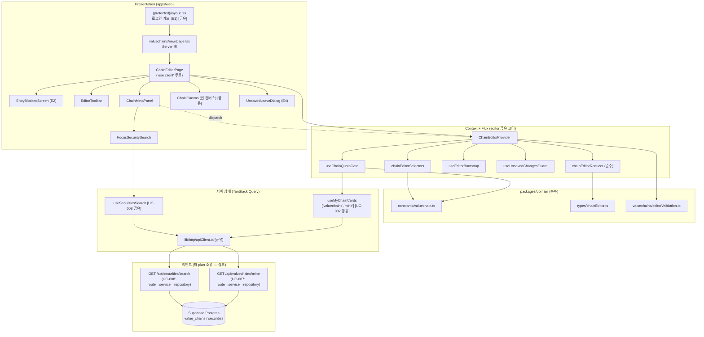

# Plan: UC-013 밸류체인 신규 생성 (빈 캔버스)

> 근거: `docs/usecases/013/spec.md`, `docs/usecases/000_decisions.md`(D-1·D-2 — **spec과 충돌 시 우선**),
> `docs/pages/chain-editor/requirement.md`·`docs/pages/chain-editor/state_management.md`(본 기능이 속한 페이지의 확정 설계 — 그대로 따름),
> `docs/techstack.md` §4(모노레포: `apps/web`(Next.js 16 + Hono), `packages/domain`), `docs/database.md` §3.3, `supabase/migrations/0005_value_chains.sql`,
> `.claude/skills/spec_to_plan/references/hono-backend-guide.md`.

## 범위 확정 (spec 대비 결정 반영)

1. **D-2 적용**: spec §6.2(1)의 `GET /api/valuechains/mine/quota` 엔드포인트는 **만들지 않는다**. 체인 상한(50) 사전 확인은 내 밸류체인 목록 API(`GET /api/valuechains/mine`, UC-007)의 `pagination.totalCount`로 수행한다. → **본 유스케이스의 신규 백엔드 엔드포인트는 0개**이며, UC-007(내 목록)·UC-008(종목 검색) 백엔드를 소비만 한다.
2. **D-1 적용**: 기업 중심(company) 기준의 대상 기업(`focusSecurity`) 지정은 선택 사항. UI는 권장 안내만 표시한다.
3. **BR-3(지연 생성)**: 본 유스케이스는 DB에 어떤 레코드도 만들지 않는다. INSERT는 UC-018(저장) 소관.
4. **경계**: 노드/엣지/그룹 편집은 UC-015~017, 저장은 UC-018, 기존 체인 편집 진입(스냅샷 로드)은 UC-014/018 소관. 본 plan은 편집기 Flux 코어의 **뼈대(수명주기·메타 액션)와 create 모드 진입 경로**를 확립하고, 후속 plan이 동일 파일을 확장한다.
5. **캐시 정합**: main-explore 설계(`useMyChainCards`, infinite)와 chain-editor 설계(`useMyChains`)가 동일 쿼리 키 `['valuechains','mine']`을 사용하므로, 캐시 형태 충돌을 막기 위해 **공유 훅 `useMyChainCards` 하나만 존재**시키고 편집기 게이트는 이를 감싼 `useChainQuotaGate`로 소비한다(1페이지의 `pagination.totalCount`만 사용).

## 개요

| # | 모듈 | 위치 | 설명 |
| --- | --- | --- | --- |
| **공유 — 도메인 (packages/domain, 프레임워크 독립)** | | | |
| 1 | 밸류체인 상수 | `packages/domain/constants/valuechain.ts` | `MAX_CHAINS_PER_USER=50`, `MAX_NODES_PER_CHAIN=100`, `NODE_LIMIT_WARNING_THRESHOLD=90` (BR-2). UC-014~019·021과 공유 |
| 2 | 검색 상수 | `packages/domain/constants/search.ts` | `SEARCH_PAGE_SIZE=20`, `MIN_SEARCH_QUERY_LENGTH=1`, `SEARCH_DEBOUNCE_MS=300` (B-4). **UC-008 plan 소유 — 위치만 참조** |
| 3 | 편집 도메인 타입 | `packages/domain/types/chainEditor.ts` | `EditorMode`/`EditorVariant`/`FocusType`/`SecurityRef`/`EditorNode`/`EditorEdge`/`EditorGroup` 등(state_management §2.1 전체 선언). UC-014~018·021과 공유 |
| 4 | 편집 검증 순수 함수 | `packages/domain/valuechains/editorValidation.ts` | 본 plan분: `validateChainNameFormat`(공백 차단). 노드/엣지/그룹 검증은 UC-015~017 plan이 동일 파일 확장 |
| **편집기 Flux 코어 (apps/web — UC-013~018·021 공유, 본 plan이 뼈대 확립)** | | | |
| 5 | Reducer | `apps/web/src/features/valuechains/editor/state/chainEditorReducer.ts` | `ChainEditorState`(S1~S12)·Action union 전체 선언 + 본 plan분 전이 구현(수명주기·메타). React 비의존 순수 모듈 |
| 6 | 셀렉터 | `apps/web/src/features/valuechains/editor/state/chainEditorSelectors.ts` | 본 plan분: `selectNodeCount`, 이름 형식 이슈 파생. 후속 plan이 확장 |
| 7 | Context/Provider | `apps/web/src/features/valuechains/editor/context/ChainEditorContext.tsx` | 상태/액션 Context 분리, create 모드 진입 게이트·부트스트랩·이탈 가드 연결, 메타 액션 함수 4종 |
| **서버 상태·이펙트 훅 (apps/web)** | | | |
| 8 | 내 체인 목록 훅 | `apps/web/src/features/valuechains/hooks/useMyChainCards.ts` | `GET /api/valuechains/mine` infinite query. **UC-007(main-explore) plan과 공유 — 계약만 명시** |
| 9 | 상한 게이트 훅 | `apps/web/src/features/valuechains/editor/hooks/useChainQuotaGate.ts` | `useMyChainCards` 1페이지의 `totalCount`로 `canCreate` 판정(E2/E5/E6 분기) |
| 10 | 종목 검색 훅 | `apps/web/src/features/securities/hooks/useSecuritiesSearch.ts` | `GET /api/securities/search`. **UC-008 plan 소유 — 위치만 참조** |
| 11 | 부트스트랩 이펙트 | `apps/web/src/features/valuechains/editor/hooks/useEditorBootstrap.ts` | create: 게이트 통과 시 빈 문서로 `EDITOR_INITIALIZED` 1회 dispatch. edit 분기는 UC-014/018 확장 |
| 12 | 미저장 이탈 가드 | `apps/web/src/features/valuechains/editor/hooks/useUnsavedChangesGuard.ts` | E4: `beforeunload` + Next.js 라우터 이탈 가드 |
| 13 | 디바운스 훅 | `apps/web/src/hooks/useDebouncedValue.ts` | 범용 값 디바운스(300ms). 검색 패널 공용 — 공통 모듈 |
| **Presentation (apps/web)** | | | |
| 14 | 라우트 셸 | `apps/web/src/app/(protected)/valuechains/new/page.tsx` | Server Component 셸 — 클라이언트 경계만 배치 |
| 15 | 로그인 가드 | `apps/web/src/app/(protected)/layout.tsx` | E1: 세션 없으면 `/auth/login?next=…` redirect. **인증(UC-002/003) plan과 공유 — 계약만 명시** |
| 16 | 편집기 루트 | `apps/web/src/features/valuechains/editor/components/ChainEditorPage.tsx` | `'use client'` 루트: Provider 장착 + 게이트/로딩/오류/차단 화면 분기 |
| 17 | 진입 차단 화면 | `apps/web/src/features/valuechains/editor/components/EntryBlockedScreen.tsx` | E2: 상한 도달 안내 + 기존 체인 삭제(UC-019) 유도 |
| 18 | 편집 툴바 | `apps/web/src/features/valuechains/editor/components/EditorToolbar.tsx` | 본 plan분: 체인 이름 표시·노드 수 배지·저장 버튼 자리(비활성). 저장 동작은 UC-018 확장 |
| 19 | 메타 패널 | `apps/web/src/features/valuechains/editor/components/ChainMetaPanel.tsx` | 이름 입력(공백 즉시 검증) + 기준 토글(industry/company) + 대상 기업 칩 |
| 20 | 대상 기업 검색 | `apps/web/src/features/valuechains/editor/components/FocusSecuritySearch.tsx` | 종목 검색(디바운스·시장 필터·시장 배지) → `setFocusSecurity`. E8 처리 |
| 21 | 빈 캔버스 | `apps/web/src/components/mindmap/ChainCanvas.tsx` | React Flow 공용 프레젠테이션(뷰/편집 공용). 본 plan은 **빈 상태 장착만** — 노드 렌더링은 UC-015 확장 |
| 22 | 이탈 경고 다이얼로그 | `apps/web/src/features/valuechains/editor/components/UnsavedLeaveDialog.tsx` | E4 확인/취소 다이얼로그 (shadcn-ui `alert-dialog`) |
| **공유 — 인프라 (참조)** | | | |
| 23 | API 클라이언트 | `apps/web/src/lib/http/apiClient.ts` | fetch 래퍼: `{ok,data}/{ok:false,error}` 봉투 파싱, `ApiError`(status·code) 정규화 — 전 기능 공유 |
| 24 | Hono 공통 인프라 | `apps/web/src/backend/hono/app.ts`, `backend/http/response.ts`, `backend/middleware/*` | errorBoundary→withAppContext→withSupabase 체인. **공통 plan(최초 백엔드 기능) 소유 — 위치만 참조** |
| 25 | 내 목록 백엔드 | `apps/web/src/features/valuechains/backend/{schema,error,repository,service,route}.ts` | `GET /api/valuechains/mine`. **UC-007 plan 소유 — 본 UC는 `pagination.totalCount`만 소비** |
| 26 | 검색 백엔드 | `apps/web/src/features/securities/backend/{schema,error,repository,service,route}.ts` | `GET /api/securities/search`. **UC-008 plan 소유** |

**선행 의존성**: 본 plan 구현 전 #24(Hono 인프라), #25(UC-007 mine 엔드포인트), #26(UC-008 검색 엔드포인트), #15(로그인 가드)가 존재해야 한다. 미구현 상태라면 해당 유스케이스 spec/plan 기준으로 먼저 구현한다(본 문서는 소비 계약만 정의).

**외부 서비스 연동**: 없음(spec §6.4). 모든 조회는 자체 DB API만 사용하므로 외부 연동 클라이언트 모듈은 본 plan 범위 밖이다.

## Diagram

데이터 흐름(단방향): View 이벤트 → Provider 액션 함수(검증) → `dispatch` → reducer → state → 셀렉터 → View. 서버 조회(상한 확인·종목 검색)는 TanStack Query가 소유하고, 게이트 통과라는 "확정 사실"만 부트스트랩 이펙트가 `EDITOR_INITIALIZED`로 상태에 합류시킨다. **본 유스케이스에서 DB 쓰기는 발생하지 않는다.**

## Implementation Plan

### 1. 밸류체인 상수 — `packages/domain/constants/valuechain.ts` [공유]

- 구현 내용:
  1. `export const MAX_CHAINS_PER_USER = 50;`
  2. `export const MAX_NODES_PER_CHAIN = 100;`
  3. `export const NODE_LIMIT_WARNING_THRESHOLD = 90;`
  4. `packages/domain/constants/index.ts` 배럴에서 재노출. 프레임워크 의존성 없음(순수 TS).
  5. 하드코딩 금지 규칙에 따라 FE 게이트·배지·후속 서버 검증(UC-018)이 전부 이 상수만 참조한다.
- 의존성: 없음 (모노레포 스캐폴드 `packages/domain` 존재 전제 — Phase 9 산출물)

**Unit Tests**: 해당 없음(상수 정의). 소비 측 테스트에서 간접 검증.

### 2. 검색 상수 — `packages/domain/constants/search.ts` [UC-008 소유 — 참조]

- 본 plan 범위 아님. `SEARCH_DEBOUNCE_MS=300`(B-4), `MIN_SEARCH_QUERY_LENGTH=1`, `SEARCH_PAGE_SIZE=20`을 #13·#20이 import한다는 계약만 확정한다. UC-013을 먼저 구현하는 경우 이 파일을 위 값으로 생성한다(UC-008 plan과 동일 위치·동일 이름 — 충돌 없음).

### 3. 편집 도메인 타입 — `packages/domain/types/chainEditor.ts` [공유]

- 구현 내용:
  1. `docs/pages/chain-editor/state_management.md` §2.1의 타입을 **그대로** 선언: `EditorMode`, `EditorVariant`, `FocusType`, `FreeSubjectType`, `XYPosition`, `SecurityRef`, `ListedCompanyNode`, `FreeSubjectNode`, `EditorNode`, `EditorEdge`, `EditorGroup`, `EditorSelection`, `ServerIssue`, `RelationType`.
  2. 본 유스케이스가 직접 사용하는 것은 메타 관련(`EditorMode`/`FocusType`/`SecurityRef`)이지만, reducer의 state·Action union이 전체 타입을 참조하므로 파일 전체를 이번에 확정한다(후속 plan의 재정의 충돌 방지).
  3. React·Supabase 의존 금지(web/worker 공유 가능 순수 타입).
- 의존성: 없음

**Unit Tests**: 해당 없음(타입 선언). `tsc --noEmit`으로 검증.

### 4. 편집 검증 순수 함수 — `packages/domain/valuechains/editorValidation.ts` [공유]

- 구현 내용:
  1. 본 plan분 함수 1개: `validateChainNameFormat(name: string): 'NAME_REQUIRED' | null` — trim 후 빈 문자열이면 `NAME_REQUIRED`(spec E3: 진입 단계 검증은 공백/형식만, 중복은 UC-018 서버 검증).
  2. 파일에 state_management §4.3의 나머지 함수 시그니처(`validateListedNodeAdd` 등)는 **선언하지 않는다** — UC-015~017 plan이 각자 추가한다(빈 자리 주석으로 확장 지점만 표기).
  3. FE 즉시 검증과 UC-018 서버 최종 검증이 이 함수를 공유한다(검증의 이중화·구현 단일화 원칙).
- 의존성: 없음

**Unit Tests**:
- [ ] 정상: `"반도체 밸류체인"` → `null`
- [ ] 엣지: 앞뒤 공백 포함 `"  이름  "` → `null` (trim 후 비어있지 않음)
- [ ] 에러: `""` → `'NAME_REQUIRED'`
- [ ] 에러: 공백만 `"   "` → `'NAME_REQUIRED'`
- [ ] 엣지: 탭/개행 등 화이트스페이스만 → `'NAME_REQUIRED'`

### 5. Reducer — `apps/web/src/features/valuechains/editor/state/chainEditorReducer.ts`

- 구현 내용:
  1. `ChainEditorState`(S1~S12)와 `CHAIN_EDITOR_INITIAL_STATE`를 state_management §2.2 그대로 정의(`initialized:false`, `focusType:'industry'`, 빈 컬렉션).
  2. `ChainEditorAction` union을 §3 **전체**로 선언(UC-015~018 액션 포함 — 타입만). `EditorBootstrap` 인터페이스 포함.
  3. 본 plan에서 **전이를 구현하는 케이스**(§4.2):
     - `EDITOR_INITIALIZED`: payload로 문서 필드 교체, `initialized=true`, `selection` 비움, `isDirty=false`, `serverIssues=[]`.
     - `CHAIN_NAME_CHANGED`: `name` 갱신 ⊕(공통 후처리).
     - `FOCUS_TYPE_CHANGED`: `focusType` 갱신, **`'industry'` 전환 시 `focusSecurity=null`** ⊕.
     - `FOCUS_SECURITY_SET`: `focusType==='company'`가 아니면 no-op 가드, 아니면 `focusSecurity` 설정 ⊕.
     - `FOCUS_SECURITY_CLEARED`: `focusSecurity=null` ⊕.
  4. 공통 전이 규칙(§4.1)을 헬퍼로 구현:
     - **초기화 게이트**: `initialized=false`인 동안 `EDITOR_INITIALIZED` 외 전부 no-op(원본 반환).
     - **문서 변형 공통 후처리(⊕)**: 실제 변경 발생 시 `isDirty=true`, `serverIssues=[]`. 값이 동일하면(예: 같은 이름 재입력) 원본 반환.
  5. 나머지 액션 케이스는 `default` no-op으로 폴스루 — UC-015~018 plan이 케이스를 추가한다.
  6. 순수 함수 규칙: I/O·`crypto.randomUUID()`·라우팅 호출 금지, 불변 갱신.
- 의존성: #3(타입)

**Unit Tests** (state_management §10 대응분):
- [ ] `initialized=false` 상태에서 `CHAIN_NAME_CHANGED` dispatch → no-op(원본 참조 동일 반환)
- [ ] create 부트스트랩 payload(빈 문서)로 `EDITOR_INITIALIZED` → `initialized=true`, `chainId=null`, `baseSnapshotId=null`, `isDirty=false`
- [ ] `CHAIN_NAME_CHANGED` → `name` 반영 + `isDirty=true` + `serverIssues=[]`, 원본 객체 비변이(불변성)
- [ ] `focusSecurity` 설정 상태에서 `FOCUS_TYPE_CHANGED('industry')` → `focusSecurity=null`(테스트 #2, requirement §5)
- [ ] `focusType='industry'` 상태에서 `FOCUS_SECURITY_SET` → no-op 가드(상태 불변)
- [ ] `FOCUS_TYPE_CHANGED('company')` 후 `FOCUS_SECURITY_SET` → `focusSecurity` 반영 + dirty
- [ ] `FOCUS_SECURITY_CLEARED` → `focusSecurity=null` + dirty
- [ ] 동일 값 재입력(`name` 불변) → 원본 반환(dirty 미발생)
- [ ] 미구현 액션 타입(`LISTED_NODE_ADDED` 등) dispatch → no-op(후속 plan 확장 전 안전성)

### 6. 셀렉터 — `apps/web/src/features/valuechains/editor/state/chainEditorSelectors.ts`

- 구현 내용:
  1. 본 plan분: `selectNodeCount(state): number`(빈 캔버스에서 0 — 툴바 배지용), `selectNameIssue(state): 'NAME_REQUIRED' | null`(#4 `validateChainNameFormat` 위임 — 메타 패널 필드 오류 표시용).
  2. state_management §4.4의 나머지 셀렉터는 UC-015~018 plan이 동일 파일에 추가한다.
- 의존성: #3, #4, #5

**Unit Tests**:
- [ ] 빈 문서 → `selectNodeCount`=0
- [ ] `name=''` → `selectNameIssue`='NAME_REQUIRED', `name='ABC'` → null

### 7. Context/Provider — `apps/web/src/features/valuechains/editor/context/ChainEditorContext.tsx`

- 구현 내용:
  1. `ChainEditorStateContext` / `ChainEditorActionsContext` 분리 생성(액션 Context 값 참조 안정 — state_management §6.1).
  2. `ChainEditorProvider({ mode, variant, chainId?, children })`:
     - `useReducer(chainEditorReducer, CHAIN_EDITOR_INITIAL_STATE)` 소유.
     - **본 plan 구현 범위는 `mode='create' && variant='user'` 경로**: `useChainQuotaGate`(#9) 호출 → `async.entryBlocked`/`bootstrapError` 파생. `mode='edit'`·`variant='official'` 분기는 시그니처만 두고 UC-014/018/021 plan이 채운다.
     - `useEditorBootstrap`(#11) 연결: 게이트 `allowed` && `!initialized` → 빈 문서 dispatch.
     - `useUnsavedChangesGuard(state.isDirty)`(#12) 연결.
  3. 액션 함수(본 plan분 4종, `useCallback` 참조 안정): `changeName(name)`, `changeFocusType(focusType)`, `setFocusSecurity(security)`, `clearFocusSecurity()` — 검증 없이 대응 Action dispatch(이름 공백은 파생 셀렉터가 표시 담당, state_management §3 카탈로그).
  4. `ChainEditorStateValue = { meta, state, computed, async }` 노출 — 본 plan분 `computed`: `nodeCount`, `nameIssue`. `async`: `isBootstrapping`(게이트 조회 중), `bootstrapError`(E6: 네트워크/500 → 재시도 콜백 포함, E5: 401 → 재로그인 유도 구분), `entryBlocked`(E2).
  5. 소비 훅 `useChainEditorState()` / `useChainEditorActions()` — Provider 밖 사용 시 throw.
- 의존성: #1, #3, #5, #6, #9, #11, #12

**Unit Tests** (React Testing Library — Provider 통합):
- [ ] 게이트 `allowed` → `EDITOR_INITIALIZED` 1회만 dispatch(리렌더에도 재실행 없음) → `state.initialized=true`
- [ ] 게이트 `blocked` → `async.entryBlocked=true`, `state.initialized=false`(캔버스 미초기화)
- [ ] 게이트 `error(500)` → `bootstrapError` 노출, `refetch` 호출 시 재조회
- [ ] `changeName('AI 반도체')` → `state.name` 반영, `isDirty=true`
- [ ] Provider 밖에서 `useChainEditorState()` → throw

### 8. 내 체인 목록 훅 — `apps/web/src/features/valuechains/hooks/useMyChainCards.ts` [UC-007 공유 — 계약 참조]

- 본 plan 범위 아님(UC-007/main-explore plan 소유). 본 UC가 의존하는 계약만 고정한다:
  1. 쿼리 키 `['valuechains','mine']`, `useInfiniteQuery`, `GET /api/valuechains/mine?page&limit`(#23 apiClient 경유).
  2. 응답 `ChainCardListResponse.pagination.totalCount`가 **사용자 소유 체인 총수**(D-2의 "소유 수")를 제공한다.
  3. 401은 `ApiError(status=401)`로 정규화되어 던져진다(재시도 없음).
- UC-013을 먼저 구현하는 경우: UC-007 spec §API(2) 계약대로 이 훅과 백엔드(#25)를 먼저 구현한다.

### 9. 상한 게이트 훅 — `apps/web/src/features/valuechains/editor/hooks/useChainQuotaGate.ts`

- 구현 내용:
  1. 시그니처: `useChainQuotaGate(options: { enabled: boolean }): ChainQuotaGate` — `enabled = (mode==='create' && variant==='user')`.
  2. 내부에서 `useMyChainCards({ enabled })`(#8)를 호출(1페이지만 사용 — `fetchNextPage` 불필요). **별도 쿼리 키를 만들지 않는다**(main-explore 캐시와 공유·형태 일치, 저장 성공 시 UC-018의 `['valuechains','mine']` 무효화도 자동 반영).
  3. 반환 타입(판별 유니온):
     - `{ status: 'checking' }` — 조회 중
     - `{ status: 'allowed', ownedChainCount }` — `totalCount < MAX_CHAINS_PER_USER`
     - `{ status: 'blocked', ownedChainCount, maxChainsPerUser }` — 상한 도달(E2)
     - `{ status: 'auth_required' }` — 401(E5, 재로그인 유도)
     - `{ status: 'error', retry: () => void }` — 네트워크/500(E6, 재시도)
     - `enabled=false`면 즉시 `{ status: 'allowed', ownedChainCount: 0 }`(edit/official 경로 — 게이트 비적용)
  4. 판정 로직은 순수 함수 `evaluateChainQuota(totalCount: number): { canCreate: boolean }`로 분리(상수 #1 참조)해 단독 테스트 가능하게 한다.
  5. BR-7 준수: 이 게이트는 안내용(UX)이며 최종 상한 검증은 UC-018 서버가 재수행함을 모듈 주석으로 명시.
- 의존성: #1, #8, #23

**Unit Tests**:
- [ ] `evaluateChainQuota(49)` → `canCreate=true` / `(50)` → `false` / `(0)` → `true` (경계값)
- [ ] 훅: totalCount=50 응답 → `status='blocked'`, `ownedChainCount=50`
- [ ] 훅: 401 `ApiError` → `status='auth_required'`
- [ ] 훅: 네트워크 오류 → `status='error'`, `retry()` 호출 시 refetch 실행
- [ ] 훅: `enabled=false` → API 미호출 + `status='allowed'`

### 10. 종목 검색 훅 — `apps/web/src/features/securities/hooks/useSecuritiesSearch.ts` [UC-008 공유 — 계약 참조]

- 본 plan 범위 아님(UC-008 plan 소유). 소비 계약: `useSecuritiesSearch({ query, market }, { enabled })` → `items[{ id, ticker, name, englishName, market }]`, `hasMore`. `enabled`는 호출측(#20)이 "디바운스 완료 + 정규화 후 최소 길이(1자) 충족"으로 계산한다. 결과 없음은 200+빈 배열(오류 아님).

### 11. 부트스트랩 이펙트 — `apps/web/src/features/valuechains/editor/hooks/useEditorBootstrap.ts`

- 구현 내용:
  1. 시그니처: `useEditorBootstrap(params: { mode, gate: ChainQuotaGate, initialized: boolean, dispatch }): void`.
  2. create 경로: `mode==='create' && gate.status==='allowed' && !initialized`일 때 **1회** `EDITOR_INITIALIZED` dispatch — payload는 순수 팩토리 `createEmptyBootstrap(): EditorBootstrap`(`chainId:null, baseSnapshotId:null, name:'', focusType:'industry', focusSecurity:null, nodes/edges/groups:{}`)로 생성. 팩토리는 같은 파일에 export(테스트·UC-014 재사용).
  3. edit 경로(스냅샷 로드·`toEditorBootstrap` 변환)는 본 plan에서 미구현 — 확장 지점 주석만 남긴다(UC-014/018 plan 소관).
  4. StrictMode 이중 실행에 안전하도록 `initialized` 게이트로 멱등 보장(reducer의 `EDITOR_INITIALIZED`는 재실행되어도 빈 문서 대치라 편집 전 단계에서만 도달 가능 — dispatch 조건에 `!initialized` 포함으로 이중 방어).
- 의존성: #3, #5, #9

**Unit Tests**:
- [ ] `createEmptyBootstrap()` 반환값이 스키마 기대치와 일치(`focusType='industry'`, 전 컬렉션 빈 객체, ID 필드 null)
- [ ] `gate='checking'` → dispatch 미발생 / `gate='allowed'` 전환 → 1회 dispatch
- [ ] `initialized=true` 이후 리렌더 → 추가 dispatch 없음
- [ ] `gate='blocked'` → dispatch 미발생

### 12. 미저장 이탈 가드 — `apps/web/src/features/valuechains/editor/hooks/useUnsavedChangesGuard.ts`

- 구현 내용:
  1. 시그니처: `useUnsavedChangesGuard(isDirty: boolean): { isLeaveDialogOpen, confirmLeave, cancelLeave }`.
  2. `isDirty=true`일 때만: ① `beforeunload` 등록(브라우저 네이티브 확인 — 탭 닫기/새로고침), ② Next.js App Router 클라이언트 내비게이션 가로채기(내부 링크 클릭·`router.push` 시 자체 다이얼로그 오픈, 확인 시 원래 목적지로 이동, 취소 시 잔류). `isDirty=false`면 두 가드 모두 해제.
  3. 다이얼로그 노출 여부는 훅 로컬 상태(휘발 — 문서 상태 아님, requirement §4.4).
  4. 편집기 외 페이지에 영향 없도록 언마운트 시 리스너 전부 해제.
- 의존성: 없음(범용 — 편집기 외 재사용 가능하므로 시그니처는 도메인 비의존으로 유지)

**Unit Tests**:
- [ ] `isDirty=true`에서 `beforeunload` 이벤트 → `preventDefault` 호출됨
- [ ] `isDirty=false`에서 `beforeunload` → 개입 없음
- [ ] 내부 내비게이션 시도 → `isLeaveDialogOpen=true`, `confirmLeave()` → 보류된 목적지로 이동, `cancelLeave()` → 잔류
- [ ] 언마운트 후 이벤트 발생 → 리스너 미동작(누수 없음)

### 13. 디바운스 훅 — `apps/web/src/hooks/useDebouncedValue.ts` [공유]

- 구현 내용: `useDebouncedValue<T>(value: T, delayMs: number): T` — 값 변경 후 `delayMs` 경과 시 반영, 재변경 시 타이머 재시작, 언마운트 시 취소. 검색 패널(#20)과 UC-015 검색 탭이 공유.
- 의존성: 없음

**Unit Tests** (fake timers):
- [ ] 300ms 경과 전 값 미반영, 경과 후 반영
- [ ] 연속 입력 시 타이머 재시작(마지막 값만 반영)
- [ ] 언마운트 시 타이머 취소

### 14. 라우트 셸 — `apps/web/src/app/(protected)/valuechains/new/page.tsx`

- 구현 내용: Server Component. 데이터 페칭 없이 `<ChainEditorPage mode="create" variant="user" />` 클라이언트 경계만 배치. `metadata`(title)만 정의.
- 의존성: #15, #16

**QA Sheet**:

| # | 시나리오 | 기대 결과 |
| --- | --- | --- |
| 1 | 로그인 상태로 `/valuechains/new` 직접 접근 | 편집기 클라이언트 루트가 렌더링된다(서버 오류 없음) |
| 2 | 페이지 소스 확인 | 서버 셸에 편집 데이터/비밀 정보가 포함되지 않는다 |

### 15. 로그인 가드 — `apps/web/src/app/(protected)/layout.tsx` [인증 plan 공유 — 계약 참조]

- 본 plan 범위 아님(UC-002/003 계열 plan 소유). 본 UC가 의존하는 계약:
  1. `(protected)` 그룹 진입 시 `@supabase/ssr` 서버 클라이언트로 세션 확인, 비로그인이면 `redirect('/auth/login?next=' + 현재경로)` (E1 — 복귀 경로 보존).
  2. 로그인 완료 후 `next` 파라미터로 자동 복귀(생성 흐름 재진입).
- UC-013을 먼저 구현하는 경우 위 계약만 만족하는 최소 구현을 이 위치에 생성한다.

**QA Sheet** (계약 검증용):

| # | 시나리오 | 기대 결과 |
| --- | --- | --- |
| 1 | 비로그인으로 `/valuechains/new` 접근 | `/auth/login?next=/valuechains/new`로 redirect (E1) |
| 2 | 로그인 완료 | `/valuechains/new`로 자동 복귀, 생성 흐름 계속 |

### 16. 편집기 루트 — `apps/web/src/features/valuechains/editor/components/ChainEditorPage.tsx`

- 구현 내용:
  1. `'use client'`. props `{ mode, variant, chainId? }` → `ChainEditorProvider` 장착.
  2. Provider 내부 분기 렌더(Container 역할 — 로직은 Context가 소유, 이 컴포넌트는 분기·배치만):
     - `async.isBootstrapping` → 스켈레톤.
     - `async.entryBlocked` → `EntryBlockedScreen`(캔버스 서브트리 미장착).
     - `async.bootstrapError`(auth_required) → 재로그인 유도 화면(로그인 링크에 `next` 보존) (E5).
     - `async.bootstrapError`(error) → 오류 안내 + 재시도 버튼(`retry`) (E6).
     - `state.initialized` → `EditorToolbar` + `ChainMetaPanel` + `ChainCanvas`(빈) + `UnsavedLeaveDialog` 배치.
- 의존성: #7, #17, #18, #19, #21, #22

**QA Sheet**:

| # | 시나리오 | 기대 결과 |
| --- | --- | --- |
| 1 | 소유 체인 49개 사용자가 진입 | 상한 확인 로딩(스켈레톤) 후 빈 편집 캔버스 표시 |
| 2 | 소유 체인 50개 사용자가 진입 (E2) | 캔버스 대신 진입 차단 화면 표시, 편집 UI 미노출 |
| 3 | 세션 만료 상태에서 진입(401) (E5) | 재로그인 유도 화면, 로그인 후 `/valuechains/new` 복귀 |
| 4 | 상한 확인 API 500/네트워크 오류 (E6) | 오류 안내 + [재시도] 버튼, 클릭 시 재조회. 캔버스 진입 보류 |
| 5 | 진입 성공 직후 | DB에 아무 레코드도 생성되지 않음(BR-3 — 네트워크 탭에 GET만 존재) |
| 6 | 진입 성공 직후 새로고침 | 경고 없이 이탈(초기 상태는 dirty 아님) |

### 17. 진입 차단 화면 — `apps/web/src/features/valuechains/editor/components/EntryBlockedScreen.tsx`

- 구현 내용:
  1. 순수 Presenter. props: `{ ownedChainCount, maxChainsPerUser }` — 문구·수치를 props로만 받는다(상수 직접 참조 금지 — 호출측(#16)이 게이트 결과를 전달).
  2. "체인 상한(50개) 도달" 안내 + 기존 체인 관리·삭제(UC-019) 유도 링크(내 체인 목록이 있는 메인 `/`로 이동).
- 의존성: 없음(Presenter)

**QA Sheet**:

| # | 시나리오 | 기대 결과 |
| --- | --- | --- |
| 1 | `ownedChainCount=50, max=50` 렌더 | "50개 중 50개 사용" 형태 안내와 상한 도달 문구 표시 |
| 2 | 삭제 유도 링크 클릭 | 내 체인 목록 화면(메인)으로 이동 |
| 3 | 화면 내 아무 요소도 편집 액션을 노출하지 않음 | 노드 추가/저장 등 편집 UI 부재 |

### 18. 편집 툴바 — `apps/web/src/features/valuechains/editor/components/EditorToolbar.tsx`

- 구현 내용:
  1. `useChainEditorState()`에서 `state.name`, `state.isDirty`, `computed.nodeCount` 소비.
  2. 본 plan분: 체인 이름(미입력 시 "제목 없음" 플레이스홀더) 표시, 노드 수 배지(`0/100` — `MAX_NODES_PER_CHAIN` 상수), 더티 표시(●), 저장 버튼 **자리**(disabled 고정 + "저장은 이름 입력 후" 툴팁 — 활성화·동작은 UC-018 plan이 교체).
- 의존성: #1, #7

**QA Sheet**:

| # | 시나리오 | 기대 결과 |
| --- | --- | --- |
| 1 | 진입 직후 | "제목 없음" 플레이스홀더 + `0/100` 배지, 더티 표시 없음 |
| 2 | 메타 패널에서 이름 입력 | 툴바 이름 실시간 갱신 + 더티 표시(●) |
| 3 | 저장 버튼 | 비활성(UC-018 전까지), 클릭해도 요청 미발생 |

### 19. 메타 패널 — `apps/web/src/features/valuechains/editor/components/ChainMetaPanel.tsx`

- 구현 내용:
  1. `useChainEditorState()`/`useChainEditorActions()` 소비: `state.name`, `state.focusType`, `state.focusSecurity`, `computed.nameIssue` ← → `changeName`, `changeFocusType`, `setFocusSecurity`, `clearFocusSecurity`.
  2. 이름 입력 필드: 입력 즉시 `changeName` dispatch(제어 컴포넌트). `nameIssue==='NAME_REQUIRED'`이고 필드 터치됨이면 "이름을 입력하세요" 오류 표시(E3 — 중복 검증 아님, 저장 시 서버 검증임을 헬퍼 텍스트로 안내).
  3. 기준 토글(라디오/세그먼트): `industry`("산업 중심") / `company`("기업 중심"). `company` 선택 시 대상 기업 지정 영역(#20) 노출 + **"대상 기업 지정은 선택 사항"** 권장 안내(D-1). `industry`로 되돌리면 검색 영역 숨김(해제는 reducer가 수행 — §5 케이스).
  4. `focusSecurity` 설정 시 종목 칩(티커·이름·시장 배지) + 해제(×) 버튼 → `clearFocusSecurity`.
  5. 로컬 상태는 "필드 터치 여부"만(오류 표시 타이밍용 — 문서 상태 아님).
- 의존성: #7, #20

**QA Sheet**:

| # | 시나리오 | 기대 결과 |
| --- | --- | --- |
| 1 | 이름에 "2차전지 밸류체인" 입력 | 상태 반영 + 툴바 동기화, 오류 없음 |
| 2 | 이름을 지워 공백으로 만듦 (E3) | "이름을 입력하세요" 필드 오류. 캔버스 진입/편집은 차단되지 않음 |
| 3 | 공백만 입력 (`"   "`) | 2와 동일(형식 검증) |
| 4 | 기준을 "기업 중심"으로 선택 | 대상 기업 검색 영역 노출 + "선택 사항" 안내(D-1) |
| 5 | 대상 기업 선택 후 기준을 "산업 중심"으로 되돌림 | 검색 영역 숨김 + 선택했던 대상 기업 칩 소멸(`focusSecurity=null`) |
| 6 | 대상 기업 칩의 해제(×) 클릭 | 칩 제거, 기준은 "기업 중심" 유지 |
| 7 | 이름·기준 변경 후 | 더티 상태 전환(이탈 시 경고 대상) |

### 20. 대상 기업 검색 — `apps/web/src/features/valuechains/editor/components/FocusSecuritySearch.tsx`

- 구현 내용:
  1. 로컬 상태: 검색어 입력값, 시장 필터(`KRX`/`US`/전체) — 문서 상태 아님(requirement §4.4).
  2. `useDebouncedValue(입력값, SEARCH_DEBOUNCE_MS)`(#13) → 정규화(trim) → `enabled = 정규화 길이 >= MIN_SEARCH_QUERY_LENGTH`(B-4)로 `useSecuritiesSearch`(#10) 호출.
  3. 결과 목록: 종목명·티커·시장 배지(KRX/US) 렌더. 항목 선택 → `SecuritySearchItem → SecurityRef` 매핑 순수 함수 `toSecurityRef(item)`(이 파일 또는 selectors에 export — UC-015 검색 탭과 공유) → `setFocusSecurity(ref)` 호출 후 검색어 초기화.
  4. 결과 없음(E8): "검색 결과 없음 — 대상 기업 없이 진행할 수 있습니다" 빈 상태 안내(미지정 허용).
  5. 검색 API 오류: 오류 안내 + 재시도(refetch). **편집 상태(이름·기준)는 유실되지 않음**.
- 의존성: #2, #7, #10, #13

**QA Sheet**:

| # | 시나리오 | 기대 결과 |
| --- | --- | --- |
| 1 | "삼" 1자 입력 | 300ms 디바운스 후 검색 호출(1자 허용 — B-4), 결과 목록 표시 |
| 2 | 빠르게 연속 타이핑 | 마지막 입력 기준 1회만 호출(중간 호출 없음) |
| 3 | 검색어 전부 삭제(공백) | API 미호출, 결과 영역 초기화 |
| 4 | 시장 필터 `US` 선택 후 "app" 검색 | US 종목만 반환·표시(시장 배지 US) |
| 5 | 결과 항목 "삼성전자 005930 KRX" 선택 | 메타 패널에 종목 칩 표시, 검색 입력 초기화 |
| 6 | 존재하지 않는 검색어 (E8) | "결과 없음 + 미지정 진행 가능" 안내, 오류 아님 |
| 7 | 검색 API 500 | 오류 안내 + 재시도 버튼. 이름/기준 입력값 유지 |
| 8 | 폐지/정지 종목 검색(B-5) | 결과에 노출되며 상태 배지 표기(UC-008 응답 계약을 따름) |

### 21. 빈 캔버스 — `apps/web/src/components/mindmap/ChainCanvas.tsx` [공용 프레젠테이션 — 본 plan은 최소 장착]

- 구현 내용:
  1. React Flow(`@xyflow/react`) 래퍼 Presenter. props: `{ nodes, edges, onNodeDragStop?, onSelectionChange?, onConnect?, ... }` — 편집/뷰 공용이므로 **콜백은 전부 optional**, 도메인 타입 비의존(React Flow `Node[]/Edge[]`만 수용).
  2. 본 plan에서는 `nodes=[] / edges=[]`로 빈 캔버스를 장착(배경 그리드·줌/팬 동작)하고, "노드를 추가해 밸류체인을 구성하세요" 빈 상태 오버레이를 표시한다.
  3. 커스텀 노드 타입·엣지 라벨·Sub Flow(그룹) 매핑은 UC-015~017 plan이 이 파일과 `chainEditorSelectors`를 확장한다.
- 의존성: `@xyflow/react`

**QA Sheet**:

| # | 시나리오 | 기대 결과 |
| --- | --- | --- |
| 1 | 진입 직후 캔버스 | 빈 그리드 + 빈 상태 안내 오버레이 표시 |
| 2 | 줌/팬 조작 | 정상 동작, 문서 상태(더티) 미변경 |
| 3 | 뷰포트 리사이즈(반응형) | 캔버스가 컨테이너에 맞게 재배치, 가로 스크롤 없음 |

### 22. 이탈 경고 다이얼로그 — `apps/web/src/features/valuechains/editor/components/UnsavedLeaveDialog.tsx`

- 구현 내용:
  1. 순수 Presenter(shadcn-ui `alert-dialog`). props: `{ open, onConfirm, onCancel }` — #12 훅의 반환값을 #16이 연결.
  2. 문구: "저장하지 않은 변경 사항이 있습니다. 나가면 편집 내용이 사라집니다." + [나가기]/[계속 편집].
- 의존성: #12(연결은 #16), shadcn-ui `alert-dialog`(신규 설치 필요 시 설치 안내: `npx shadcn@latest add alert-dialog`)

**QA Sheet**:

| # | 시나리오 | 기대 결과 |
| --- | --- | --- |
| 1 | 이름 입력(더티) 후 로고 클릭으로 이동 시도 (E4) | 경고 다이얼로그 표시, 이동 보류 |
| 2 | [나가기] 선택 | 편집 상태 폐기 + 원래 목적지로 이동 |
| 3 | [계속 편집] 선택 | 다이얼로그 닫힘 + 편집 화면 잔류(상태 보존) |
| 4 | 더티 상태에서 탭 닫기/새로고침 | 브라우저 네이티브 이탈 확인 표시 |
| 5 | 더티 아님(진입 직후) 상태에서 이동 | 경고 없이 즉시 이동 |

### 23. API 클라이언트 — `apps/web/src/lib/http/apiClient.ts` [공유]

- 구현 내용:
  1. `fetch` 래퍼: 공통 응답 봉투(`{ ok:true, data }` / `{ ok:false, error:{ code, message, details } }` — hono-backend-guide `respond()` 계약) 파싱.
  2. 실패 시 `ApiError { status: number; code: string; message: string; details?: unknown }` 를 throw(TanStack Query의 `error`로 전파 — #9의 401/500 분기 근거).
  3. 타임아웃: `AbortSignal.timeout(API_TIMEOUT_MS)`(상수 `apps/web/src/lib/http/constants.ts`, 기본 10초) — 타임아웃/네트워크 실패는 `ApiError(status=0, code='NETWORK_ERROR')`로 정규화.
  4. 인증은 Supabase 세션 쿠키(same-origin) 기반이므로 별도 토큰 헤더 없음. base URL은 상대 경로 `/api`(환경변수 불필요 — same-origin Route Handler).
  5. 재시도는 하지 않는다(호출측 TanStack Query `retry` 정책 소관 — 이중 재시도 방지).
- 의존성: 없음

**Unit Tests**:
- [ ] 200 + `{ok:true,data}` → data 반환
- [ ] 401 + `{ok:false,error}` → `ApiError(status=401, code)` throw
- [ ] 응답 봉투 형식 불일치(JSON 아님) → `ApiError(code='INVALID_RESPONSE')` throw
- [ ] 타임아웃 경과 → `ApiError(status=0, code='NETWORK_ERROR')` throw

### 24~26. 백엔드 참조 모듈 (본 plan 범위 아님 — 소비 계약만)

- **#24 Hono 공통 인프라**(`backend/hono/app.ts`, `backend/http/response.ts`, `backend/middleware/*`): errorBoundary → withAppContext → withSupabase 체인, `success()/failure()/respond()` + `HandlerResult`. 최초 백엔드 기능 plan(권장: UC-007)이 hono-backend-guide 컨벤션대로 생성한다.
- **#25 `GET /api/valuechains/mine`**(UC-007 plan): 인증 필수(세션 → `userId`), `value_chains WHERE owner_id=:userId AND chain_type='user'` 카운트를 `pagination.totalCount`로 반환. 본 UC의 상한 판정 유일 원천(D-2). `route.ts → service.ts → repository.ts` 계층·`schema.ts` Zod 검증·`error.ts` 코드(`VALUECHAIN_LIST_UNAUTHORIZED` 401 등)는 UC-007 spec §API(2)를 따른다.
- **#26 `GET /api/securities/search`**(UC-008 plan): 공개 API, `securities` 트라이그램 부분 일치·정확>접두>부분 정렬·20건 페이지네이션(database.md §4.3).

## 구현 순서 (의존 역순)

1. **도메인**: #1 → #3 → #4 (병렬 가능, 프레임워크 독립 — 단위 테스트 먼저 작성: TDD)
2. **Flux 코어**: #5 → #6 (reducer 테스트 → 구현 → 셀렉터)
3. **인프라/훅**: #23 → (#8·#10 미존재 시 해당 spec 계약으로 선구현) → #13 → #9 → #11 → #12
4. **Context**: #7
5. **Presentation**: #21 → #17·#18·#22 → #20 → #19 → #16 → #14 (+#15 계약 확인)
6. **통합 QA**: 각 QA Sheet 실행 — 특히 E1(복귀), E2(차단), E4(이탈 경고), E6(재시도), BR-3(쓰기 0건) 확인

## 충돌·정합성 검토 결과

| 확인 항목 | 판단 |
| --- | --- |
| spec §6.2(1) quota 엔드포인트 vs D-2 | D-2 우선 — quota 엔드포인트 미구현, `GET /api/valuechains/mine`의 `totalCount` 사용. spec의 응답 필드(`ownedChainCount`/`canCreate`)는 FE 게이트 훅(#9) 내부 파생값으로 대체 |
| `['valuechains','mine']` 쿼리 키 이중 사용 | main-explore(infinite)와 동일 훅(#8)을 재사용해 캐시 형태 충돌 제거. chain-editor state doc의 `useMyChains` 계약은 #9가 충족 |
| reducer/셀렉터/검증 파일을 UC-015~018과 공유 | 본 plan이 파일·Action union·공통 전이 규칙을 확립하고 후속 plan은 **케이스/함수 추가만** 수행 — 서로 다른 plan이 같은 심볼을 재정의하지 않도록 소유 범위를 위 표에 명시 |
| DB 스키마 정합 | `value_chains.focus_security_id` nullable(D-1·E8), `uq_value_chains_owner_name`은 UC-018 저장 시 검증 — 본 UC는 SELECT만 발생(migration 0005 확인) |
| RLS/인가 | BR-8 — RLS 미사용, 인가는 Hono 미들웨어(#24) 세션 검증. FE 로그인 가드(#15)는 UX용, 401 방어는 서버(#25)가 수행 |
| 외부 서비스 연동 | 없음(spec §6.4) — 어댑터 모듈 불필요 |
