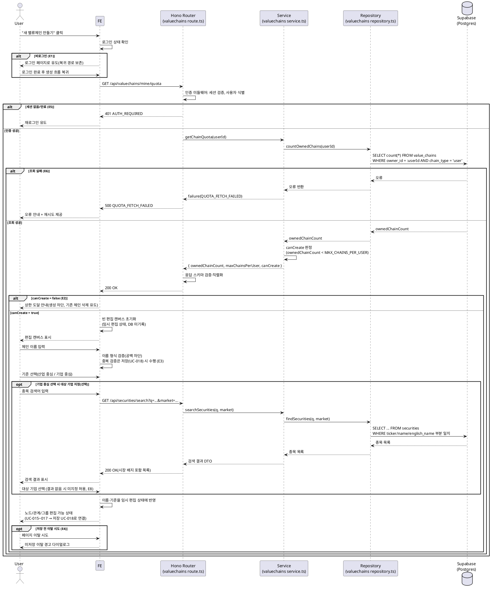

# UC-013: 밸류체인 신규 생성 (빈 캔버스)

> 근거: `docs/userflow.md` 013, `docs/prd.md` 3장(밸류체인 생성/편집 페이지)·기준 정책, `docs/database.md` 3.3(value_chains), `docs/techstack.md` §4(Hono route → service → repository → Supabase).
> 본 유스케이스는 **편집 캔버스 진입과 초기 설정(이름·기준)까지**를 다룬다. 노드/관계/그룹 편집은 UC-015~017, 실제 체인 영속화(INSERT)는 UC-018(저장)에서 수행된다.

---

## 1. Primary Actor

- **User** (로그인 사용자)

## 2. Precondition (사용자 관점)

- 사용자가 서비스에 로그인되어 있다(이메일 인증 완료 계정). 비로그인 상태라면 진입 시 로그인 유도를 거쳐 복귀한다.
- 사용자가 메인/탐색 페이지 또는 내 밸류체인 목록에서 "새 밸류체인 만들기" 진입점을 볼 수 있다.

## 3. Trigger

- 사용자가 "새 밸류체인 만들기" 진입점을 클릭한다 (`/valuechains/new`).

## 4. Main Scenario

1. User가 "새 밸류체인 만들기"를 클릭한다.
2. FE가 로그인 상태를 확인한다. 로그인 상태이면 다음 단계로 진행한다.
3. FE가 BE에 **1인당 체인 상한 사전 확인**을 요청한다 (`GET /api/valuechains/mine/quota`).
4. BE(인증 미들웨어)가 세션을 검증하고 사용자를 식별한다.
5. Service가 Repository를 통해 사용자 소유 체인 수를 조회하고, 상한 상수(`MAX_CHAINS_PER_USER=50`)와 비교해 생성 가능 여부를 판정한다.
6. FE가 생성 가능 응답을 받으면 **빈 편집 캔버스**를 초기화한다(임시 편집 상태 — 클라이언트 메모리, DB 미기록).
7. User가 체인 이름을 입력한다(FE는 공백/형식만 즉시 검증, 중복 검증은 저장 시).
8. User가 밸류체인 기준을 선택한다: **산업 중심(industry)** 또는 **기업 중심(company)**.
9. (기업 중심 선택 시) User가 종목 검색(UC-008 검색 API 재사용)으로 대상 기업을 지정할 수 있다(선택 사항).
10. FE가 이름·기준을 임시 편집 상태에 반영하고 편집 캔버스를 표시한다.
11. User는 이어서 노드 추가/삭제(UC-015), 관계 설정(UC-016), 노드 그루핑(UC-017)을 수행하고, 저장(UC-018) 시점에 실제 체인이 생성된다.

**성공 종료 조건**: 이름·기준이 반영된 빈 편집 캔버스에 진입한 상태. 저장 전까지 미확정(사이드이펙트 없음).

## 5. Edge Cases

| # | 상황 | 처리 |
|---|------|------|
| E1 | 비로그인 상태에서 진입 | 로그인 페이지로 유도하고 복귀 경로를 보존. 로그인 완료 후 생성 흐름으로 자동 복귀 |
| E2 | 1인당 체인 상한(50) 도달 | 캔버스 진입 차단 + 상한 도달 안내, 기존 체인 삭제(UC-019) 유도 |
| E3 | 이름 미입력/동일 사용자 내 이름 중복 | 진입 단계에서는 형식(공백) 검증만 수행. 중복 검증은 저장(UC-018) 시 서버에서 수행하며 중복이면 저장 차단 |
| E4 | 저장 전 페이지 이탈(뒤로가기/탭 닫기/라우팅 이동) | 자동 저장 없음(MVP) → 미저장 이탈 경고 다이얼로그 노출, 확인 시 편집 상태 폐기 |
| E5 | 세션 만료 상태에서 상한 확인 요청 | 401 응답 → 재로그인 유도, 로그인 후 복귀 |
| E6 | 상한 확인 API 실패(네트워크/서버 오류) | 오류 안내 + 재시도 제공. 캔버스 진입 보류 |
| E7 | 사전 확인 통과 후 다른 탭/기기에서 체인이 생성되어 상한 도달 | 사전 확인은 안내용(UX)이며, 최종 상한 검증은 저장(UC-018) 시 서버에서 재수행해 차단 |
| E8 | 기업 중심 선택 후 대상 기업 검색 결과 없음 | 대상 기업 미지정 상태 허용(`focus_security_id`는 선택), 기준만 저장 가능 |

## 6. Business Rules

### 6.1 규칙

- **BR-1 (로그인 필수)**: 밸류체인 생성은 로그인 사용자만 가능하다. 비로그인 진입은 로그인 유도 후 복귀 처리한다.
- **BR-2 (규모 상한, 상수 관리)**: 1인당 체인 최대 50개(`MAX_CHAINS_PER_USER`), 체인당 노드 최대 100개(`MAX_NODES_PER_CHAIN`). 상수는 `packages/domain/constants`에서 관리하며 하드코딩하지 않는다. 상한 도달 시 생성을 차단하고 안내한다.
- **BR-3 (지연 생성)**: 신규 생성 단계에서는 DB에 어떤 레코드도 만들지 않는다. 실제 체인 생성(INSERT)과 최초 스냅샷 기록은 저장(UC-018)에서 1회 수행한다. 편집 초안 자동 저장은 없다(MVP).
- **BR-4 (소유·공개 범위)**: 저장 시 체인은 `chain_type='user'`, `owner_id=현재 사용자`, 비공개(본인만 열람)로 생성된다.
- **BR-5 (이름 정책)**: 이름은 필수. 동일 사용자 내 이름 중복 불허(부분 유니크 `uq_value_chains_owner_name`), 타 사용자 간 중복은 허용. 검증 시점은 저장(UC-018).
- **BR-6 (기준 정책)**: 기준은 `focus_type`(industry/company) 중 하나를 반드시 선택한다. 기업 중심일 때 대상 기업(`focus_security_id`) 연결은 선택 사항이다(DB 스키마상 nullable).
- **BR-7 (사전 확인 vs 최종 검증)**: 상한 사전 확인은 사용자 경험을 위한 조회이며, 무결성의 최종 검증(상한·이름 중복·참조 유효성)은 저장(UC-018) 시 서버 측에서 수행한다.
- **BR-8 (인가 방식)**: RLS를 사용하지 않으며, 인증·인가는 Hono 미들웨어에서 서버 측 세션/role 검증으로 처리한다.

### 6.2 API Specification

#### (1) 체인 상한 사전 확인 — `GET /api/valuechains/mine/quota`

- **인증**: 필수(세션 쿠키 기반, Hono 인증 미들웨어)
- **Request**: 파라미터 없음
- **Response 200**

```json
{
  "ok": true,
  "data": {
    "ownedChainCount": 12,
    "maxChainsPerUser": 50,
    "canCreate": true
  }
}
```

- **에러 코드**

| HTTP | code | 의미 |
|---|---|---|
| 401 | `AUTH_REQUIRED` | 세션 없음/만료 → 재로그인 유도 |
| 500 | `QUOTA_FETCH_FAILED` | 체인 수 조회 실패 → 재시도 안내 |

#### (2) 대상 기업 검색 (기업 중심 기준 선택 시, UC-008 재사용) — `GET /api/securities/search`

- **인증**: 불필요(공개 검색)
- **Request (query)**: `q`(검색어, 최소 길이 검증), `market`(`KRX`/`US`/생략=전체), `page`(선택)
- **Response 200**: 종목 목록(`id`, `ticker`, `name`, `englishName`, `market`) — 페이지당 20건. 상세 계약은 UC-008 문서를 따른다.

#### (3) 체인 생성(참조) — `POST /api/valuechains`

- 본 유스케이스의 후속인 **저장(UC-018)** 에서 정의·호출된다. 신규 생성 플로우에서는 호출하지 않는다.

### 6.3 Database Operations

| 테이블 | 연산 | 내용 |
|---|---|---|
| `profiles` | SELECT | 인증 미들웨어에서 사용자 식별·role 로드 |
| `value_chains` | SELECT | 소유 체인 수 카운트: `SELECT count(*) FROM value_chains WHERE owner_id = :userId AND chain_type = 'user'` |
| `securities` | SELECT | (기업 중심 기준 선택 시) 티커/종목명 부분 일치 검색 — UC-008 쿼리 패턴(트라이그램 GIN, 정확>접두>부분 정렬) 재사용 |
| — | INSERT/UPDATE/DELETE | **없음.** 체인·스냅샷 INSERT는 UC-018(저장)에서 수행 |

### 6.4 External Service Integration

- **없음.** 외부 API(OpenDART/SEC EDGAR/토스증권)는 배치 적재 전용이며(PRD 8장), 본 유스케이스의 조회는 모두 자체 DB만 사용한다.

---

## 7. Sequence Diagram


