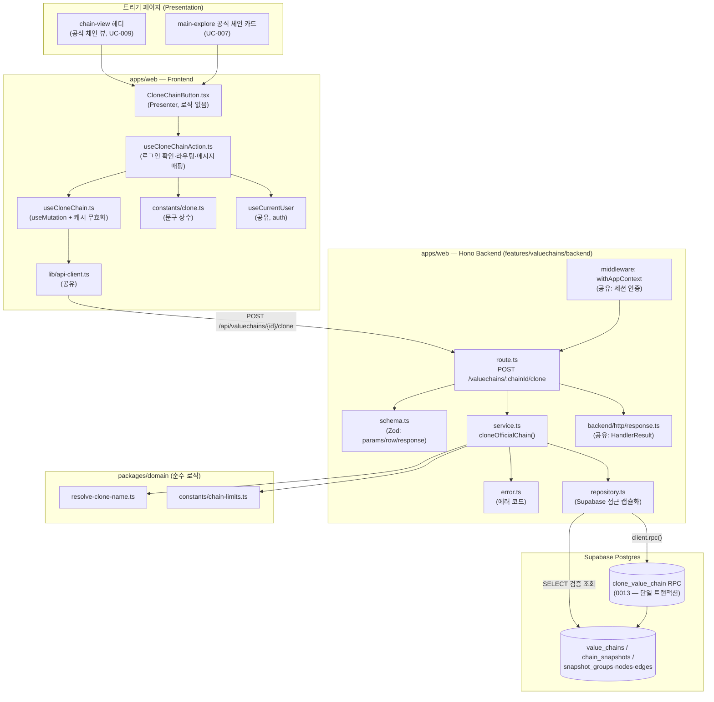

# Plan: UC-014 공식 체인 복제

> 근거: `docs/usecases/014/spec.md`, `docs/usecases/000_decisions.md`(D-3·D-4 확정), `docs/techstack.md` §4·§7, `docs/database.md` §3.3·§4.1, `supabase/migrations/0005~0006`, `docs/pages/chain-view/state_management.md`, `docs/pages/main-explore/state_management.md`, `docs/pages/chain-editor/requirement.md` §1.1, `.claude/skills/spec_to_plan/references/hono-backend-guide.md`.
> 외부 서비스 연동: **해당 없음**(spec §6.4 — 자체 DB 스냅샷 복사만 수행, OpenDART/SEC/토스/LLM 미호출). 따라서 외부 연동 클라이언트 모듈은 본 계획에 없다.

---

## 개요

### 신규 구현 모듈

| 모듈 | 위치 | 설명 |
| --- | --- | --- |
| 체인 규모 상한 상수 | `packages/domain/constants/chain-limits.ts` | `MAX_CHAINS_PER_USER=50`, `MAX_NODES_PER_CHAIN=100`, `CLONE_NAME_SUFFIX_START=2` 등 (spec BR-7, D-4) |
| 복제 이름 결정 순수 함수 | `packages/domain/calculations/resolve-clone-name.ts` | 동일 사용자 내 이름 충돌 시 자동 접미어 `" (n)"` 부여 (D-4, 순수 함수 — 프레임워크 독립) |
| 복제 트랜잭션 RPC 마이그레이션 | `supabase/migrations/0013_fn_clone_value_chain.sql` | `clone_value_chain()` Postgres 함수 — 체인+스냅샷+그룹/노드/엣지 복사를 단일 트랜잭션으로 수행 (spec BR-8) |
| Zod 스키마 (clone) | `apps/web/src/features/valuechains/backend/schema.ts` | Path 파라미터/원본 체인 Row/RPC 결과 Row/응답 DTO 스키마 |
| 에러 코드 (clone) | `apps/web/src/features/valuechains/backend/error.ts` | `SOURCE_CHAIN_NOT_FOUND` 등 spec §6.2 에러 코드 상수 |
| Repository (clone) | `apps/web/src/features/valuechains/backend/repository.ts` | Supabase 접근 캡슐화: 원본 검증 조회·보유 수/이름 조회·최신 스냅샷 조회·RPC 실행 |
| Service (clone) | `apps/web/src/features/valuechains/backend/service.ts` | `cloneOfficialChain` — 검증 순서·이름 결정·RPC 호출 오케스트레이션 (repository 인터페이스에만 의존) |
| Hono Route (clone) | `apps/web/src/features/valuechains/backend/route.ts` | `POST /valuechains/:chainId/clone` — 인증 확인·파라미터 검증·Service 호출·응답 |
| 복제 mutation 훅 | `apps/web/src/features/valuechains/hooks/useCloneChain.ts` | TanStack Query `useMutation` — API 호출 + 성공 시 내 체인 목록 캐시 무효화 |
| 복제 액션 훅 (Container 로직) | `apps/web/src/features/valuechains/hooks/useCloneChainAction.ts` | 로그인 확인→로그인 유도(returnTo), 성공 시 편집 캔버스 라우팅(D-3), 에러 코드→사용자 메시지 매핑 |
| 복제 버튼 Presenter | `apps/web/src/features/valuechains/components/CloneChainButton.tsx` | 순수 표시 컴포넌트 — 진행 중 비활성화(E10). chain-view 헤더·main-explore 공식 카드 양쪽에서 재사용 |
| 복제 UI 상수 | `apps/web/src/features/valuechains/constants/clone.ts` | 에러 코드별 사용자 안내 문구·버튼 라벨 상수 (하드코딩 금지 규칙) |

### 공유/공통 모듈 (다른 유스케이스와 공용 — 본 plan은 위치만 참조, 미존재 시 최초 구현에서 생성)

| 모듈 | 위치 | 설명 |
| --- | --- | --- |
| HTTP 응답 헬퍼 | `apps/web/src/backend/http/response.ts` | `success()/failure()/respond()` + `HandlerResult<T,E,M>` (hono-backend-guide 컨벤션) |
| Hono 앱/컨텍스트 | `apps/web/src/backend/hono/app.ts`, `context.ts` | 싱글턴 앱 + `getSupabase(c)/getLogger(c)`. `registerValuechainsRoutes(app)` 등록 지점 |
| 미들웨어 | `apps/web/src/backend/middleware/` | `errorBoundary`, `withAppContext`(세션 인증·currentUser 주입), `withSupabase`(service-role) |
| API 클라이언트 | `apps/web/src/lib/api-client.ts` | fetch 래퍼(타임아웃·에러 정규화 `ApiError { status, code, message }`) |
| 인증 세션 훅 | `apps/web/src/features/auth/hooks/useCurrentUser.ts` | 전역 인증 상태(Supabase 세션) 조회 — UC-002/003 계열 소유 |
| 내 체인 목록 쿼리 키 | `apps/web/src/features/valuechains/hooks/main-explore-query-keys.ts` | `['valuechains','mine']` (main-explore state_management §의 `myChains` 키 — 복제 성공 시 무효화 대상) |
| DB 생성 타입 | `packages/domain/types/database.ts` | 마이그레이션 적용 후 `generate_typescript_types`로 재생성 (techstack §7) |

- 현재 저장소에는 `apps/`가 아직 스캐폴딩되지 않았다(첫 plan). 공유 모듈은 env_setupper/선행 구현 산출물과 충돌하지 않도록 **위치·시그니처 계약만** 여기서 정의하고, 이미 존재하면 그대로 사용한다.
- `features/valuechains/backend/*` 4파일은 UC-009~019가 공유하는 기능 슬라이스다. 본 plan은 해당 파일 안에 **clone 전용 함수/스키마/코드를 추가**하는 범위만 다룬다(다른 UC 함수와 파일 공유, 함수 단위 SRP 유지).

---

## Diagram



데이터 흐름은 Presentation(버튼/훅) → Business Logic(service + domain 순수 함수) → Persistence(repository → RPC/테이블) 단방향이며, service는 repository **인터페이스**에만 의존한다(techstack §4).

---

## Implementation Plan

### 1. `packages/domain/constants/chain-limits.ts` — 규모 상한·접미어 상수

- 구현 내용:
  1. `export const MAX_CHAINS_PER_USER = 50;` (spec BR-7)
  2. `export const MAX_NODES_PER_CHAIN = 100;` (spec BR-7 — UC-015/018/021도 공용)
  3. `export const CLONE_NAME_SUFFIX_START = 2;` — 접미어 시작 번호. 접미어 형식은 `" (n)"` (D-4). 형식 자체는 `resolve-clone-name.ts`의 포맷 함수가 소유한다.
  4. 프레임워크·DB 의존성 없는 순수 상수 모듈. 이미 파일이 존재하면 누락 상수만 추가한다(다른 plan과의 충돌 방지).
- 의존성: 없음.
- Unit Tests: N/A (상수 정의).

### 2. `packages/domain/calculations/resolve-clone-name.ts` — 복제 이름 결정 (Business Logic)

- 구현 내용:
  1. 시그니처: `export function resolveCloneName(baseName: string, existingNames: readonly string[]): string`
  2. 규칙 (spec Main 8, Edge 3, BR-5, D-4):
     - `baseName`이 `existingNames`에 없으면 그대로 반환.
     - 충돌 시 `"${baseName} (2)"`, `"${baseName} (3)"` … 순으로 **처음 충돌하지 않는 이름**을 반환(시작 번호 = `CLONE_NAME_SUFFIX_START`).
     - 비교는 대소문자 구분 완전 일치(DB `uq_value_chains_owner_name`가 exact text 비교이므로 동일 기준).
  3. 순수 함수 — 입력만으로 결과 결정, 부수효과 없음. `Set` 기반 조회로 O(existing + k).
- 의존성: 모듈 1(상수).

**Unit Tests** (`resolve-clone-name.test.ts`, Vitest):

- [ ] 충돌 없음: `resolveCloneName('반도체', [])` → `'반도체'`
- [ ] 1회 충돌: `resolveCloneName('반도체', ['반도체'])` → `'반도체 (2)'`
- [ ] 연쇄 충돌: `existingNames = ['반도체', '반도체 (2)', '반도체 (3)']` → `'반도체 (4)'`
- [ ] 중간 빈 번호: `existingNames = ['반도체', '반도체 (3)']` → `'반도체 (2)'` (최소 미사용 번호)
- [ ] 대소문자 구분: `resolveCloneName('Chain', ['chain'])` → `'Chain'` (충돌 아님)
- [ ] 원본 이름에 이미 접미어 유사 문자열 포함: `resolveCloneName('반도체 (2)', ['반도체 (2)'])` → `'반도체 (2) (2)'` (baseName을 파싱하지 않고 그대로 접미어 부가 — 단순·예측 가능 규칙)
- [ ] 입력 배열 비변이(immutability) 확인

### 3. `supabase/migrations/0013_fn_clone_value_chain.sql` — 복제 트랜잭션 RPC (Persistence)

- 구현 내용:
  1. `CREATE OR REPLACE FUNCTION clone_value_chain(p_source_chain_id uuid, p_source_snapshot_id uuid, p_owner_id uuid, p_name text) RETURNS TABLE (chain_id uuid, snapshot_id uuid, cloned_at timestamptz, group_count integer, node_count integer, edge_count integer) LANGUAGE plpgsql` — 멱등(`CREATE OR REPLACE`), 저장소 SQL 가이드라인 준수(주석 포함).
  2. 함수 본문(호출 = 단일 트랜잭션, 예외 발생 시 전체 롤백 — spec Edge 8, BR-8):
     - `v_cloned_at := now();` — 복제 시각 1회 확정(스냅샷 `effective_at` = `source_copied_at` = 응답 `clonedAt` 동일 값 보장).
     - **방어 검증**: `p_source_snapshot_id`가 `p_source_chain_id` 소속인지 확인, 불일치 시 `RAISE EXCEPTION` (잘못된 호출 차단. 원본의 official/보관 검증은 앱 계층 책임 — 스냅샷 불변이므로 요청 시점 검증으로 충분, spec Edge 4).
     - 원본 체인 행에서 `focus_type`, `focus_security_id`를 읽어 `value_chains` INSERT: `chain_type='user'`, `owner_id=p_owner_id`, `name=p_name`, `source_chain_id=p_source_chain_id`, `source_copied_at=v_cloned_at`, `is_archived=false` (0005 스키마의 `source_copied_at` 컬럼 활용).
     - `chain_snapshots` INSERT 1건: `chain_id=신규`, `effective_at=v_cloned_at`, `change_source='user_save'`, `created_by=p_owner_id`, `disclosure_date=NULL` (spec Main 9, BR-6).
     - **그룹 복사**: 매핑 CTE `(SELECT id AS old_id, gen_random_uuid() AS new_id FROM snapshot_groups WHERE snapshot_id = p_source_snapshot_id)` → `INSERT INTO snapshot_groups (id, snapshot_id, name) SELECT new_id, 신규 snapshot, name`.
     - **노드 복사**: 노드 매핑 CTE(old→new uuid) → INSERT 시 `group_id`는 그룹 매핑으로 재매핑(NULL 유지), `node_kind`/`security_id`/`subject_name`/`subject_type`/`subject_memo`/`position_x`/`position_y` 원본 그대로 (spec BR-9 — 자유 주체 필드·좌표·종목 연결 보존).
     - **엣지 복사**: `source_node_id`/`target_node_id`를 노드 매핑으로 재매핑, `relation_type_id` 유지 — **비활성 관계 종류 포함 그대로 복사**(spec Edge 11, 필터링 로직 넣지 않음).
     - 매핑은 plpgsql 내 두 단계 INSERT...SELECT + 매핑 CTE(또는 `ON COMMIT DROP` 임시 테이블)로 구현. 복합 FK(`(group_id|node_id, snapshot_id)`)가 신규 스냅샷 소속을 DB 레벨에서 재검증한다(spec §6.3).
     - 복사 건수를 `GET DIAGNOSTICS`/CTE 카운트로 집계해 결과 행으로 RETURN.
  3. UPDATE/DELETE 없음 — 원본 체인·스냅샷 불변(spec §6.3).
  4. 동일 사용자 이름 유니크(`uq_value_chains_owner_name`) 위반 시 `unique_violation(23505)`이 함수 밖으로 전파된다 — 처리(재시도)는 service 책임(모듈 6).
  5. 마이그레이션 적용은 `mcp__supabase__apply_migration`(로컬 Supabase 금지, techstack §7). 적용 후 `generate_typescript_types`로 `packages/domain/types/database.ts` 재생성.
  6. 다른 마이그레이션과 번호 충돌 확인: 현재 0001~0012 존재 → 0013 사용.

**Unit(통합) Tests — SQL 레벨 검증 시나리오** (구현 시 원격 DB에 시드 후 `execute_sql`로 검증):

- [ ] 정상: 그룹 2·노드 3(상장 2/자유 1)·엣지 2 원본 스냅샷 → 호출 후 신규 chain/snapshot/구성 건수 일치, 모든 신규 행의 `snapshot_id`가 신규 스냅샷, 좌표·subject 필드·relation_type_id·security_id 원본과 동일
- [ ] 재매핑 무결성: 신규 엣지의 source/target이 전부 **신규** 노드 ID, 신규 노드의 `group_id`가 전부 신규 그룹 ID(또는 NULL)
- [ ] 그룹 없는 노드(`group_id IS NULL`)·빈 그룹(노드 0개)도 그대로 복사(C-1 정합)
- [ ] `source_copied_at` = `chain_snapshots.effective_at` = 반환 `cloned_at` 동일 값
- [ ] 스냅샷-체인 불일치 파라미터 → EXCEPTION, 어떤 행도 생성되지 않음(롤백)
- [ ] 이름 중복(owner 동일·name 동일 기존 체인 존재) → 23505 에러, 부분 생성물 없음(spec Edge 8)
- [ ] 원본 체인·스냅샷은 호출 전후 완전 동일(불변 확인)

### 4. `apps/web/src/features/valuechains/backend/schema.ts` — Zod 스키마 (clone 추가분)

- 구현 내용 (hono-backend-guide 컨벤션 — Request/Row/Response 분리, DB snake_case ↔ DTO camelCase):
  1. `CloneChainParamsSchema = z.object({ chainId: z.string().uuid() })` — 경로 파라미터 검증(400 `INVALID_PARAMS` 근거).
  2. `SourceChainRowSchema` (snake_case): `id`, `chain_type`(`z.enum(['official','user'])`), `name`, `focus_type`, `focus_security_id`(nullable), `is_archived` — 원본 검증 조회 결과.
  3. `LatestSnapshotRowSchema`: `id`, `effective_at`.
  4. `CloneRpcResultSchema` (snake_case): `chain_id`, `snapshot_id`, `cloned_at`, `group_count`, `node_count`, `edge_count` — RPC 반환 행.
  5. `CloneChainResponseSchema` (camelCase, spec §6.2 응답 계약과 1:1): `chainId`, `name`, `chainType`(리터럴 `'user'`), `focusType`, `focusSecurityId`(nullable), `sourceChainId`, `snapshotId`, `clonedAt`, `nodeCount`, `edgeCount`, `groupCount`.
  6. 각 스키마의 `z.infer` 타입 export. 기존 파일에 다른 UC 스키마가 있으면 섹션 주석으로 구분해 추가만 한다.
- 의존성: 없음 (0013 적용 후 생성 타입 참고해 수동 정의 — techstack §7).
- Unit Tests: N/A (스키마 정의. 검증 동작은 service/route 테스트에서 간접 확인).

### 5. `apps/web/src/features/valuechains/backend/error.ts` — 에러 코드 (clone 추가분)

- 구현 내용: `valuechainsErrorCodes`에 clone 코드 추가 (`as const` + 유니온 타입 export):
  - `sourceChainNotFound: 'SOURCE_CHAIN_NOT_FOUND'` (404)
  - `chainLimitExceeded: 'CHAIN_LIMIT_EXCEEDED'` (409)
  - `invalidCloneSource: 'INVALID_CLONE_SOURCE'` (422)
  - `sourceSnapshotMissing: 'SOURCE_SNAPSHOT_MISSING'` (422)
  - `cloneFailed: 'CLONE_FAILED'` (500)
  - (route 공통) `invalidParams: 'INVALID_PARAMS'`(400), `unauthorized: 'UNAUTHORIZED'`(401) — 이미 공통/기존 정의가 있으면 재사용.
- 의존성: 없음.
- Unit Tests: N/A (상수 정의).

### 6. `apps/web/src/features/valuechains/backend/repository.ts` — Repository (clone 추가분, Persistence)

- 구현 내용:
  1. **인터페이스 우선 정의** (service는 이 인터페이스에만 의존 — techstack §4 계층 규칙):

     ```typescript
     export interface ValuechainsCloneRepository {
       findChainHeaderById(chainId: string): Promise<SourceChainRow | null>;
       countChainsByOwner(ownerId: string): Promise<number>;
       listChainNamesByOwner(ownerId: string): Promise<string[]>;
       findLatestSnapshot(chainId: string): Promise<LatestSnapshotRow | null>;
       countSnapshotComposition(snapshotId: string): Promise<{ groupCount: number; nodeCount: number; edgeCount: number }>;
       executeCloneChainRpc(params: {
         sourceChainId: string; sourceSnapshotId: string; ownerId: string; name: string;
       }): Promise<CloneRpcResult>; // 실패 시 { code } 포함 RepositoryError throw (23505 식별용)
     }
     export const createValuechainsCloneRepository = (client: SupabaseClient): ValuechainsCloneRepository => ...
     ```

  2. 각 메서드 구현 (spec §6.3 연산 순서와 대응):
     - `findChainHeaderById`: `from('value_chains').select('id, chain_type, name, focus_type, focus_security_id, is_archived').eq('id', chainId).maybeSingle()` — 존재/보관/타입 판정은 service 책임(연산 1).
     - `countChainsByOwner`: `select('id', { count: 'exact', head: true }).eq('owner_id', ownerId)` (연산 2 — 상한 검증 입력).
     - `listChainNamesByOwner`: `select('name').eq('owner_id', ownerId)` (연산 2 — 접미어 결정 입력).
     - `findLatestSnapshot`: `from('chain_snapshots').select('id, effective_at').eq('chain_id', chainId).order('effective_at', { ascending: false }).limit(1).maybeSingle()` (연산 3, §4.1 패턴).
     - `countSnapshotComposition`: `snapshot_groups`/`snapshot_nodes`/`snapshot_edges` 각각 `count: 'exact', head: true` 3회 병렬(`Promise.all`) — spec 연산 4의 "전체 로드"를 **카운트 조회로 대체**한다. 실제 행 복사는 RPC가 DB 내부 `INSERT...SELECT`로 수행하므로 앱 메모리 왕복이 불필요하고, 앱 계층은 방어적 노드 상한 검증(Edge 5)에 필요한 건수만 조회한다(단일 스냅샷 ID 기준이므로 일관성 동일 — Edge 4).
     - `executeCloneChainRpc`: `client.rpc('clone_value_chain', { p_source_chain_id, p_source_snapshot_id, p_owner_id, p_name }).single()` → `CloneRpcResultSchema` 파싱 전 원시 행 반환. Supabase 에러 시 `{ code: error.code, message }` 형태로 정규화해 반환/throw — service가 `23505`(이름 경합)를 식별할 수 있게 한다.
  3. 이 파일의 다른 UC용 메서드와 이름 충돌하지 않도록 clone 전용 인터페이스로 분리 export(기능 파일 공유, 인터페이스 단위 SRP).
- 의존성: 모듈 3(RPC), 모듈 4(Row 스키마 타입), 공유 `SupabaseClient`.

**Unit Tests** (Supabase 클라이언트 모킹):

- [ ] `findChainHeaderById` — 행 존재/부재(null) 각각 매핑 확인
- [ ] `countChainsByOwner` — count 응답을 number로 반환
- [ ] `findLatestSnapshot` — 0행이면 null (스냅샷 없음 판정 입력)
- [ ] `countSnapshotComposition` — 3개 카운트 병렬 조회 결과 조합
- [ ] `executeCloneChainRpc` — 성공 행 반환 / Supabase error(code='23505') 정규화 전달 / 일반 오류 전달

### 7. `apps/web/src/features/valuechains/backend/service.ts` — `cloneOfficialChain` (Business Logic)

- 구현 내용:
  1. 시그니처:

     ```typescript
     export const cloneOfficialChain = async (
       repo: ValuechainsCloneRepository,
       userId: string,
       chainId: string,
     ): Promise<HandlerResult<CloneChainResponse, ValuechainsServiceError, unknown>>
     ```

  2. 검증·실행 순서 (spec Main 5~10, 시퀀스 다이어그램과 1:1):
     1. `findChainHeaderById(chainId)` → `null` 또는 `is_archived=true` → `failure(404, SOURCE_CHAIN_NOT_FOUND)` (Edge 4의 요청 시점 판정).
     2. `chain_type !== 'official'` → `failure(422, INVALID_CLONE_SOURCE)` (Edge 7 — 타인 사용자 체인 복제 차단).
     3. `countChainsByOwner(userId) >= MAX_CHAINS_PER_USER` → `failure(409, CHAIN_LIMIT_EXCEEDED)` (Edge 2).
     4. `findLatestSnapshot(chainId)` → `null` → `failure(422, SOURCE_SNAPSHOT_MISSING)` (Edge 6).
     5. `countSnapshotComposition(snapshotId)` → **방어적 검증**: `nodeCount > MAX_NODES_PER_CHAIN`이면 `failure(422, INVALID_CLONE_SOURCE, '원본 노드 수가 상한을 초과')` (Edge 5 — 정상 데이터에선 발생 불가, 비정상 데이터 차단만).
     6. `listChainNamesByOwner(userId)` → `resolveCloneName(원본 name, 기존 이름들)` (Main 8, D-4).
     7. `executeCloneChainRpc({...})` 실행.
        - **이름 경합(23505) 1회 재시도**: 동시 복제 등으로 유니크 위반 시 이름 목록을 재조회해 `resolveCloneName` 재실행 후 1회만 재시도. 재차 실패 → `failure(500, CLONE_FAILED)`. (Edge 10의 "매 요청 독립 사본" 정책과 정합 — 요청 자체를 거부하지 않고 이름만 재결정)
        - 그 외 RPC 오류 → `failure(500, CLONE_FAILED)` (Edge 8 — DB가 전체 롤백 보장).
     8. RPC 결과를 `CloneRpcResultSchema.safeParse` → 실패 시 `failure(500, CLONE_FAILED, 'RPC 결과 검증 실패')`.
     9. DTO 조립(snake→camel): `chainId/snapshotId/clonedAt/…` + 원본 헤더의 `focus_type/focus_security_id` + `sourceChainId=chainId` + 결정된 `name` → `CloneChainResponseSchema.safeParse` 후 `success(dto, 201)`.
  3. 순수성: repository 인터페이스 외 I/O 없음, 로깅 없음(로깅은 route 책임 — hono-backend-guide), `Date` 미사용(복제 시각은 RPC의 `now()`가 단일 원천).
- 의존성: 모듈 1·2(domain), 모듈 4·5·6, 공유 `response.ts`.

**Unit Tests** (`service.test.ts`, repository 모킹 — AAA 패턴):

- [ ] 정상: 유효한 official 체인 + 스냅샷 존재 + 상한 미만 → RPC 파라미터(이름·owner·snapshotId) 정확, 201 `success` DTO가 spec 응답 계약과 일치(camelCase, `chainType='user'`)
- [ ] 이름 충돌: 기존 이름에 원본명 존재 → RPC에 `'원본명 (2)'` 전달
- [ ] 원본 부재 → 404 `SOURCE_CHAIN_NOT_FOUND`
- [ ] 원본 보관(`is_archived=true`) → 404 `SOURCE_CHAIN_NOT_FOUND`
- [ ] 원본이 user 체인 → 422 `INVALID_CLONE_SOURCE`
- [ ] 보유 체인 50개 → 409 `CHAIN_LIMIT_EXCEEDED` (49개는 통과 — 경계값)
- [ ] 스냅샷 없음 → 422 `SOURCE_SNAPSHOT_MISSING`
- [ ] 노드 수 101(비정상 데이터) → 422 `INVALID_CLONE_SOURCE`; 100은 통과(경계값)
- [ ] RPC 23505 1회 → 이름 재조회·재시도 후 성공; 2회 연속 23505 → 500 `CLONE_FAILED`
- [ ] RPC 일반 오류 → 500 `CLONE_FAILED`
- [ ] RPC 결과 스키마 위반(필드 누락) → 500 `CLONE_FAILED`
- [ ] 검증 실패 경로에서 RPC 미호출 확인(mock 호출 횟수 0)

### 8. `apps/web/src/features/valuechains/backend/route.ts` — Hono Route (clone 추가분, Presentation 서버측)

- 구현 내용:
  1. `registerValuechainsRoutes(app)` 내 `app.post('/valuechains/:chainId/clone', handler)` 추가 (Hono 앱 `/api` 베이스 경로 기준 — spec §6.2 엔드포인트).
  2. 핸들러 절차:
     - `withAppContext`가 주입한 현재 사용자 확인 → 미인증/세션 만료 시 `respond(c, failure(401, UNAUTHORIZED, ...))` (Edge 1·9. 전역 인증 미들웨어가 이미 401을 반환하는 구조면 중복 검사 생략하고 사용자 ID만 취득).
     - `CloneChainParamsSchema.safeParse(c.req.param())` → 실패 시 `failure(400, INVALID_PARAMS)`.
     - Request Body 없음 — 파싱하지 않는다(spec §6.2).
     - `createValuechainsCloneRepository(getSupabase(c))` 생성 후 `cloneOfficialChain(repo, userId, chainId)` 호출.
     - `!result.ok`이면 `getLogger(c)`로 에러 코드·메시지 로깅(특히 `CLONE_FAILED`는 error 레벨), `respond(c, result)` 반환.
  3. HTTP 상태·에러 코드 매핑은 service의 `failure(status, code)`를 그대로 전달(공통 `failure` 헬퍼 계약 — spec §6.2 표와 일치).
- 의존성: 모듈 4~7, 공유 `response.ts`/`context.ts`/미들웨어.

**QA Sheet:**

| # | 시나리오 | 기대 결과 |
| --- | --- | --- |
| 1 | 로그인 사용자가 유효한 공식 체인 ID로 POST | 201 + spec §6.2 응답 JSON(camelCase 11필드) |
| 2 | 비로그인(세션 쿠키 없음) POST | 401 `UNAUTHORIZED` |
| 3 | `chainId`가 UUID 형식 아님 (`/api/valuechains/abc/clone`) | 400 `INVALID_PARAMS` |
| 4 | 존재하지 않는 UUID | 404 `SOURCE_CHAIN_NOT_FOUND` |
| 5 | 보관된 공식 체인 ID | 404 `SOURCE_CHAIN_NOT_FOUND` |
| 6 | 사용자 체인 ID로 복제 시도 | 422 `INVALID_CLONE_SOURCE` |
| 7 | 보유 체인 50개 상태에서 POST | 409 `CHAIN_LIMIT_EXCEEDED` |
| 8 | 스냅샷 없는 공식 체인(시드로 재현) | 422 `SOURCE_SNAPSHOT_MISSING` |
| 9 | 동일 체인 연속 2회 POST | 두 번째 응답 `name`에 자동 접미어 `" (2)"` |
| 10 | 성공 후 DB 확인 | `value_chains`에 `chain_type='user'`·`source_chain_id`·`source_copied_at` 기록, 스냅샷/그룹/노드/엣지 건수 = 응답 카운트 |
| 11 | 실패 시(강제 오류) DB 확인 | 부분 생성물 없음(Edge 8) |

### 9. `apps/web/src/backend/hono/app.ts` — 라우터 등록 (공유 모듈 수정)

- 구현 내용: `registerValuechainsRoutes(app)`가 아직 등록되지 않았다면 미들웨어 체인(errorBoundary → withAppContext → withSupabase) 뒤에 추가. 이미 다른 UC 구현으로 등록되어 있으면 변경 없음(clone 라우트는 모듈 8에서 같은 등록 함수에 합류).
- 의존성: 모듈 8.
- Unit Tests: N/A (조립 코드 — QA는 모듈 8 시트로 커버).

### 10. `apps/web/src/features/valuechains/constants/clone.ts` — UI 문구 상수

- 구현 내용: 하드코딩 금지 규칙에 따라 사용자 노출 문자열을 상수화.
  - `CLONE_BUTTON_LABEL`, `CLONE_PENDING_LABEL`
  - `CLONE_ERROR_MESSAGES: Record<string, string>` — `CHAIN_LIMIT_EXCEEDED`(상한 도달 + 기존 체인 삭제 유도, Edge 2), `SOURCE_CHAIN_NOT_FOUND`/`INVALID_CLONE_SOURCE`/`SOURCE_SNAPSHOT_MISSING`(복제 불가 안내), `CLONE_FAILED` 및 기본값(실패 안내 + 재시도 유도, Edge 8), `UNAUTHORIZED`(로그인 필요)
  - `CLONE_SUCCESS_MESSAGE`
- 의존성: 없음.
- Unit Tests: N/A (상수 정의).

### 11. `apps/web/src/features/valuechains/hooks/useCloneChain.ts` — mutation 훅 (Business Logic, 클라이언트)

- 구현 내용:
  1. `useMutation<CloneChainResponse, ApiError, { chainId: string }>` — `mutationFn`: 공유 `api-client`로 `POST /api/valuechains/{chainId}/clone` (Body 없음).
  2. `onSuccess`: `queryClient.invalidateQueries({ queryKey: ['valuechains','mine'] })` — main-explore `myChains` 키 무효화(복제본이 내 체인 목록·소유 수에 즉시 반영, D-2 정합).
  3. 라우팅·토스트·로그인 확인은 이 훅에 두지 않는다(단일 책임: 서버 상태 변이 + 캐시 정리만).
- 의존성: 공유 `api-client`, main-explore 쿼리 키 정의, 모듈 4 응답 타입.

**Unit Tests** (mock api-client + QueryClient):

- [ ] 성공 시 응답 DTO 반환 + `['valuechains','mine']` invalidate 호출
- [ ] 실패 시 `ApiError { status, code }`가 호출자에 전파(변형 없음)
- [ ] 실패 시 invalidate 미호출

### 12. `apps/web/src/features/valuechains/hooks/useCloneChainAction.ts` — 복제 액션 훅 (Container 로직)

- 구현 내용:
  1. 시그니처: `useCloneChainAction(chainId: string): { requestClone(): void; isCloning: boolean }`
  2. 절차 (spec Main 1~2·11, 시퀀스 다이어그램 FE 분기):
     - `useCurrentUser()`로 로그인 확인. **비로그인**: `router.push('/auth/login?returnTo=' + encodeURIComponent(현재 경로))` — UC-002 returnTo 규약(내부 경로만). 로그인 후 원래 페이지 복귀 → 사용자가 복제를 재실행(요청 자체를 보내지 않음 — Edge 1의 사전 차단).
     - 로그인 상태: `useCloneChain().mutate({ chainId })`.
     - `onSuccess`: 성공 토스트(`CLONE_SUCCESS_MESSAGE`) 후 `router.push('/valuechains/{응답 chainId}/edit')` — **편집 캔버스 랜딩(D-3)**, chain-editor requirement §1.1 "복제 직후(edit)" 모드와 계약 일치(에디터가 신규 체인의 최신 스냅샷을 로드).
     - `onError`: `CLONE_ERROR_MESSAGES[error.code] ?? 기본 메시지` 토스트. 401은 로그인 유도 라우팅(세션 만료 — Edge 9).
     - `isCloning = mutation.isPending` — 버튼 비활성화 근거(Edge 10 중복 전송 방지).
  3. chain-view의 Flux Store(§3 Action 카탈로그)에 **새 Action을 추가하지 않는다** — 복제는 서버 상태 변이(mutation)로 클라이언트 상태 없음. chain-view state_management의 "Action을 만들지 않는 상호작용"(라우팅·refetch류) 원칙과 정합.
- 의존성: 모듈 10·11, 공유 `useCurrentUser`, Next.js router, 토스트 유틸(shadcn-ui — 공유).

**Unit Tests** (mock router/user/mutation):

- [ ] 비로그인 상태 `requestClone()` → mutate 미호출 + `/auth/login?returnTo=...`로 push(returnTo=현재 내부 경로)
- [ ] 로그인 상태 → `mutate({ chainId })` 호출
- [ ] 성공 콜백 → `/valuechains/{newChainId}/edit`로 push + 성공 토스트
- [ ] 409 에러 → 상한 안내 문구 토스트, 라우팅 없음
- [ ] 500/미정의 코드 → 기본 실패+재시도 문구
- [ ] 401 에러 → 로그인 유도 라우팅
- [ ] `isCloning`이 mutation pending과 동기화

### 13. `apps/web/src/features/valuechains/components/CloneChainButton.tsx` — 복제 버튼 (Presentation)

- 구현 내용:
  1. Props: `{ chainId: string; variant?: 'header' | 'card' }` — chain-view 헤더(UC-009 트리거)와 main-explore 공식 체인 카드(UC-007 트리거) 양쪽 배치를 하나의 Presenter로 커버(DRY).
  2. 내부는 `useCloneChainAction(chainId)`만 소비: `onClick={requestClone}`, `disabled={isCloning}`, pending 라벨/스피너 표시. 그 외 로직 없음(순수 Presenter — CLAUDE.md Presentation 분리 규칙).
  3. `card` variant는 카드 클릭(뷰 이동)과의 이벤트 버블링 차단(`stopPropagation`).
  4. 공식 체인에만 노출하는 책임은 **배치하는 부모**(chain-view 헤더 컴포넌트 — `chainType==='official'`일 때 렌더 / main-explore 공식 섹션 카드)가 가진다. 본 plan은 컴포넌트 제공까지이며, 부모 편입은 chain-view(UC-009)·main-explore(UC-007) 구현에서 1줄 삽입으로 수행한다(해당 페이지 상태 설계 변경 없음).
- 의존성: 모듈 10·12, shadcn-ui `Button`(미설치 시 `npx shadcn@latest add button` 안내).

**QA Sheet:**

| # | 시나리오 | 기대 결과 |
| --- | --- | --- |
| 1 | 로그인 사용자가 공식 체인 뷰 헤더에서 복제 클릭 | 버튼 즉시 비활성화·pending 표시 → 성공 시 새 체인 편집 캔버스로 이동 |
| 2 | 편집 캔버스 도착 확인 | 원본과 동일한 노드/엣지/그룹·좌표가 로드되고 이름에 원본명(중복 시 접미어) 표시 |
| 3 | 비로그인 상태에서 복제 클릭 | API 미호출, 로그인 페이지 이동(returnTo 유지). 로그인 후 원래 페이지 복귀 → 복제 재실행 가능 |
| 4 | 복제 진행 중 연타 | 추가 요청 미발생(disabled — Edge 10) |
| 5 | 보유 체인 50개 상태에서 클릭 | 상한 도달 + 기존 체인 삭제 유도 토스트, 페이지 이동 없음 |
| 6 | 원본이 방금 보관된 경우 | "복제 불가" 안내 토스트(404 매핑) |
| 7 | 서버 오류(500) | 실패 + 재시도 유도 토스트, 재클릭 시 재시도 가능 |
| 8 | 복제 성공 후 메인으로 이동 | 내 밸류체인 섹션에 복제본이 즉시 표시(캐시 무효화 확인) |
| 9 | main-explore 카드의 복제 버튼 클릭 | 카드 클릭(뷰 이동)이 발생하지 않고 복제 흐름만 실행 |
| 10 | 같은 공식 체인 2회 복제 | 두 개의 독립 사본 생성, 두 번째 이름 `" (2)"` 접미어 |
| 11 | 복제 직후 사본 대시보드 | 지표 미집계 표기/폴백(UC-010 정책 — 다음 일별 집계부터 생성, Edge 12. 본 기능에선 표기 확인만) |

---

## 구현 순서 및 충돌 검토

1. **구현 순서** (TDD — 하위 계층부터): 모듈 1→2(domain, 테스트 선행) → 3(마이그레이션 적용 + 타입 재생성) → 4·5 → 6 → 7(테스트 선행) → 8·9 → 10 → 11→12(테스트 선행) → 13 → QA 시트 수행.
2. **기존 코드베이스 충돌**: 현재 `apps/`·`packages/` 미스캐폴딩, 기존 plan.md 없음 — 본 plan이 참조하는 공유 모듈은 계약(위치·시그니처)만 규정했으므로 이후 다른 UC plan과 파일을 공유해도 함수 단위 추가로 합류 가능하다. 마이그레이션은 0013으로 기존 0001~0012와 번호 충돌 없음.
3. **결정 사항 반영 확인**: D-3(복제 후 편집 캔버스 랜딩 — 모듈 12), D-4(접미어 `" (2)"` 서버 자동 부여 — 모듈 2·7), D-2(별도 quota 엔드포인트 없음 — 상한 검증은 서버 단독, FE 사전 확인 없음), C-1(빈 그룹 복사 유지 — 모듈 3), B-1(내 체인 목록 캐시 무효화로 최근 수정순 반영 — 모듈 11).
4. **스냅샷 불변 원칙**: 복제는 SELECT + INSERT만 수행하며 원본 체인/스냅샷을 일절 변경하지 않는다(모듈 3·6에서 UPDATE/DELETE 부재로 보장).
