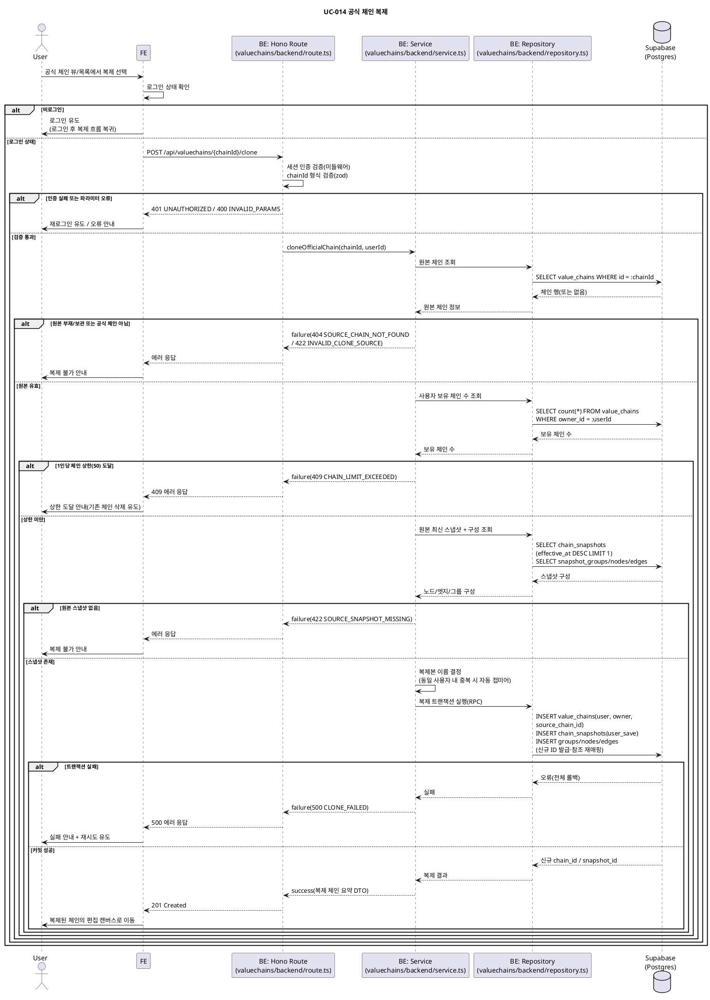

# UC-014: 공식 체인 복제

> `docs/userflow.md` 014번 기능의 상세 유스케이스. 로그인 사용자가 공식 밸류체인을 복제해 편집 가능한 **완전 독립 사본**(사용자 체인)을 만든다.
> 참조: `docs/prd.md` §3·§6, `docs/userflow.md` 014, `docs/database.md` §3.3·§4.1, `docs/techstack.md` §4·§7.

---

## 1. Primary Actor

- **User** (로그인 사용자)

## 2. Precondition (사용자 관점)

- 사용자가 로그인 상태다. (비로그인 시 로그인 유도 후 복제 흐름으로 복귀)
- 복제하려는 공식 밸류체인이 존재하고 열람 가능한 상태다(보관 처리되지 않음).
- 사용자의 보유 밸류체인 수가 1인당 상한(50개, 상수) 미만이다.

## 3. Trigger

- 사용자가 공식 체인 뷰 페이지(UC-009) 또는 메인/탐색 목록(UC-007)에서 **복제** 상호작용을 실행한다.

## 4. Main Scenario

1. User가 공식 체인 뷰/목록에서 복제를 선택한다.
2. FE가 로그인 상태를 확인한다. 비로그인이면 로그인 유도 후 복제 흐름으로 복귀시킨다.
3. FE가 BE에 복제 요청을 전송한다. (`POST /api/valuechains/{chainId}/clone`)
4. BE(Hono Route)가 세션 인증과 경로 파라미터 형식을 검증하고 Service를 호출한다.
5. Service가 Repository를 통해 원본 체인을 조회하고 검증한다: 존재 여부, `chain_type = official`, `is_archived = false`.
6. Service가 사용자 소유 체인 수를 조회해 1인당 상한(50) 미만임을 검증한다.
7. Service가 원본 체인의 **최신 스냅샷**(`effective_at` 최대 1건)과 그 소속 노드/엣지/그룹 전체를 로드한다.
8. Service가 복제본 이름을 결정한다: 원본 이름을 기본으로 하되, 동일 사용자 내 기존 체인과 중복이면 자동 접미어를 부여한다.
9. Repository가 **단일 트랜잭션**(Postgres 함수/RPC)으로 다음을 수행한다:
   - 새 사용자 체인 생성: `chain_type = user`, `owner_id` = 현재 사용자, `focus_type`/`focus_security_id` 복사, `source_chain_id` = 원본 체인 ID(출처 메타데이터).
   - 복제 스냅샷 1건 생성: `change_source = user_save`, `effective_at` = 복제 시각, `created_by` = 현재 사용자.
   - 그룹/노드/엣지 복사: 신규 ID 발급, 노드의 `group_id`와 엣지의 `source/target_node_id`를 신규 ID로 재매핑, 종목 연결(`security_id`)·자유 주체 정보·노드 좌표(`position_x/y`)·관계 종류(`relation_type_id`) 유지.
10. BE가 생성된 사용자 체인 요약을 201로 응답한다.
11. FE가 복제된 체인의 편집 캔버스로 이동한다(이후 UC-015~018로 자유 편집).

## 5. Edge Cases

| # | 상황 | 처리 |
|---|---|---|
| 1 | 비로그인 복제 시도 | 요청 차단(401) → 로그인 유도, 로그인 후 복제 흐름 복귀 |
| 2 | 1인당 체인 상한(50) 도달 | 복제 차단(409) + 기존 체인 삭제 유도 안내 |
| 3 | 복제본 이름이 동일 사용자 기존 체인과 중복 | 서버가 자동 접미어 부여로 이름 결정(동일 사용자 내 유니크 제약 준수). 이후 편집에서 이름 변경 가능 |
| 4 | 복제 중 원본 공식 체인이 변경/삭제(보관)됨 | 요청 시점에 조회한 **단일 스냅샷 기준으로 일관 생성**(스냅샷은 불변이라 안전). 요청 시점에 이미 보관/부재이면 404 |
| 5 | 원본이 노드 상한(100) 근접 | 사본도 동일 상한 적용. 원본이 상한 이내이므로 복제만으로 초과는 발생하지 않음(방어적 검증만 수행) |
| 6 | 원본 공식 체인에 스냅샷이 없음(비정상 데이터) | 복제 불가 오류(422) 안내 |
| 7 | 공식 체인이 아닌 체인(타인 사용자 체인 등) 복제 시도 | 거부(422). 복제 대상은 공식 체인만 |
| 8 | 트랜잭션 부분 실패(체인/스냅샷/구성 중 일부만 성공) | 전체 롤백(500) + 재시도 유도. 부분 생성물 잔존 없음 |
| 9 | 세션 만료 상태에서 요청 | 401 → 재로그인 유도 |
| 10 | 중복 클릭/반복 요청 | 매 요청이 새 독립 사본 생성(상한 내 다건 사본은 정상). FE는 요청 진행 중 버튼 비활성화로 중복 전송 방지 |
| 11 | 비활성 관계 종류(`is_active = false`)를 사용하는 원본 엣지 | 그대로 복사(기존 엣지 유지 정책 — 신규 선택만 차단 대상) |
| 12 | 복제 직후 대시보드 지표 없음 | 사전 집계 지표는 다음 일별 집계 배치(UC-029)부터 생성. 그 전까지 뷰는 미집계 표기/폴백(UC-010 정책) |

## 6. Business Rules

### 6.1 도메인 규칙

1. **대상 제한**: 복제 대상은 공식 체인(`chain_type = official`, `is_archived = false`)만 허용한다.
2. **완전 독립 사본**: 복제본은 복제 시점의 스냅샷 기준 독립 사본이다. 원본과의 동기화·변경 알림은 없으며, 복제 후 편집 제약도 없다.
3. **출처 메타데이터**: 원본 체인 식별자(`source_chain_id`)와 복제 시각만 기록한다. 이후 원본이 보관 처리되어도 사본에 영향 없다.
4. **소유·공개 범위**: 사본은 `chain_type = user`, 소유자 = 복제 요청자, 비공개(소유자만 열람)로 생성된다.
5. **이름 정책**: 동일 사용자 내 체인 이름 중복 불허(`uq(owner_id, name)`). 중복 시 서버가 자동 접미어를 부여한다.
6. **스냅샷 원칙**: 복제 1회 = 사용자 체인의 **첫 스냅샷 1건**(`change_source = user_save`). 이 스냅샷이 해당 체인 타임라인(UC-012) 복원의 시작점이 된다.
7. **규모 상한**: 1인당 체인 최대 50개, 체인당 노드 최대 100개 — `packages/domain/constants`의 상수(`MAX_CHAINS_PER_USER`, `MAX_NODES_PER_CHAIN`)로 관리한다.
8. **원자성**: 체인 헤더 + 스냅샷 + 그룹/노드/엣지 복사는 단일 트랜잭션(Postgres 함수, `client.rpc()` 호출)으로 수행하며 실패 시 전체 롤백한다.
9. **구성 보존**: 노드 좌표, 그룹 소속, 관계 종류(비활성 포함), 종목 연결, 자유 주체 필드(이름/유형/메모)를 원본 스냅샷 그대로 보존한다.

### 6.2 API Specification

#### `POST /api/valuechains/{chainId}/clone`

- **계층**: Hono Route(`features/valuechains/backend/route.ts`) → Service(`service.ts`) → Repository(`repository.ts`) → Supabase.
- **인증**: 필수(Supabase 세션). 미들웨어(`withAppContext`)에서 서버 측 검증.
- **Path Parameter**

| 이름 | 타입 | 설명 |
|---|---|---|
| `chainId` | UUID | 복제할 공식 체인 ID |

- **Request Body**: 없음. (복제본 이름은 서버가 결정하며, 변경은 이후 편집/저장 UC-018에서 수행)

- **Response `201 Created`**

```json
{
  "chainId": "uuid",
  "name": "반도체 (2)",
  "chainType": "user",
  "focusType": "industry",
  "focusSecurityId": null,
  "sourceChainId": "uuid",
  "snapshotId": "uuid",
  "clonedAt": "2026-07-05T09:30:00+09:00",
  "nodeCount": 42,
  "edgeCount": 57,
  "groupCount": 5
}
```

| 필드 | 타입 | 설명 |
|---|---|---|
| `chainId` | UUID | 생성된 사용자 체인 ID |
| `name` | string | 결정된 복제본 이름(접미어 포함 가능) |
| `chainType` | enum | 항상 `user` |
| `focusType` | enum | `industry` \| `company` (원본에서 복사) |
| `focusSecurityId` | UUID \| null | 기업 중심 체인의 대상 종목(원본에서 복사) |
| `sourceChainId` | UUID | 원본 공식 체인 ID(출처 메타데이터) |
| `snapshotId` | UUID | 복제로 생성된 첫 스냅샷 ID |
| `clonedAt` | ISO 8601 | 복제 시각(= 스냅샷 `effective_at`) |
| `nodeCount` / `edgeCount` / `groupCount` | number | 복사된 구성 요소 수 |

- **Error Responses** (응답 형식은 공통 `failure(status, code, message)` 헬퍼를 따른다)

| HTTP | 에러 코드 | 조건 |
|---|---|---|
| 400 | `INVALID_PARAMS` | `chainId` 형식(UUID) 오류 |
| 401 | `UNAUTHORIZED` | 미로그인 또는 세션 만료 |
| 404 | `SOURCE_CHAIN_NOT_FOUND` | 원본 체인 부재 또는 보관(`is_archived = true`) |
| 409 | `CHAIN_LIMIT_EXCEEDED` | 1인당 체인 상한(50) 도달 |
| 422 | `INVALID_CLONE_SOURCE` | 원본이 공식 체인(`chain_type = official`)이 아님 |
| 422 | `SOURCE_SNAPSHOT_MISSING` | 원본에 스냅샷이 존재하지 않음 |
| 500 | `CLONE_FAILED` | 복제 트랜잭션 실패(전체 롤백됨) |

### 6.3 Database Operations

| 순서 | 테이블 | 연산 | 내용 |
|---|---|---|---|
| 1 | `value_chains` | SELECT | 원본 검증: `id = :chainId AND chain_type = 'official' AND is_archived = false` |
| 2 | `value_chains` | SELECT | `owner_id = :userId` 보유 체인 수 카운트(상한 검증) 및 이름 목록(접미어 결정) |
| 3 | `chain_snapshots` | SELECT | 원본 최신 스냅샷 1건: `chain_id = :chainId ORDER BY effective_at DESC LIMIT 1` |
| 4 | `snapshot_groups` / `snapshot_nodes` / `snapshot_edges` | SELECT | 해당 스냅샷 소속 그룹/노드/엣지 전체 로드 |
| 5 | `value_chains` | INSERT | 사본 체인 생성(`chain_type='user'`, `owner_id`, focus 복사, `source_chain_id`) |
| 6 | `chain_snapshots` | INSERT | 복제 스냅샷 1건(`change_source='user_save'`, `effective_at`=복제 시각, `created_by`) |
| 7 | `snapshot_groups` | INSERT | 그룹 복사(신규 ID 발급) |
| 8 | `snapshot_nodes` | INSERT | 노드 복사(신규 ID, `group_id` 재매핑, `security_id`·자유 주체 필드·좌표 유지) |
| 9 | `snapshot_edges` | INSERT | 엣지 복사(`source/target_node_id` 재매핑, `relation_type_id` 유지) |

- 5~9는 **단일 Postgres 함수(RPC) 내 트랜잭션**으로 실행한다(실패 시 전체 롤백).
- UPDATE / DELETE 연산 없음. 원본 체인·스냅샷은 일절 변경하지 않는다(스냅샷 불변).
- 복합 FK 제약(`snapshot_nodes.(group_id, snapshot_id)`, `snapshot_edges.(source/target_node_id, snapshot_id)`)에 따라 복사된 구성은 반드시 새 스냅샷에 소속된다.

### 6.4 External Service Integration

- **해당 없음.** 본 기능은 자체 DB 내 스냅샷 복사만 수행하며 외부 API(OpenDART, SEC EDGAR, 토스증권, LLM)를 호출하지 않는다.

---

## 7. Sequence Diagram



---

## 8. 관련 유스케이스

- **선행**: UC-002/003(로그인), UC-007(메인/탐색), UC-009(공식 체인 뷰).
- **후행**: UC-015~017(노드/관계/그룹 편집), UC-018(저장 — 이후 저장마다 스냅샷 추가), UC-012(사본 타임라인 복원), UC-019(사본 삭제), UC-029(사본 지표 사전 집계).
