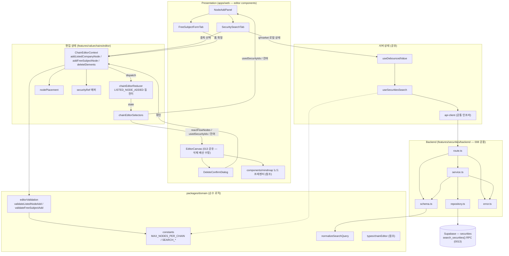

# Plan: UC-015 노드 추가/삭제

> 근거: `docs/usecases/015/spec.md`, `docs/usecases/000_decisions.md`(B-4·B-5·B-7·D-5 — spec과 충돌 시 우선), `docs/techstack.md` §4(모노레포 Codebase Structure), `docs/database.md` §3.2·§4.3, `docs/pages/chain-editor/state_management.md`(편집 상태 설계의 단일 원천 — 본 plan은 그 설계를 그대로 따르며 UC-015 담당분만 구현 범위로 확정), `.claude/skills/spec_to_plan/references/hono-backend-guide.md`.
> 외부 서비스 연동 없음(spec §6.4): 종목 검색은 자체 DB `securities`만 조회한다.

## 개요

| 모듈 | 위치 | 설명 |
| --- | --- | --- |
| **[공통·DB]** | | |
| 밸류체인 상수 | `packages/domain/constants/valuechain.ts` | `MAX_NODES_PER_CHAIN=100`, `NODE_LIMIT_WARNING_THRESHOLD=90` (013~018·021 공유) |
| 검색 상수 | `packages/domain/constants/search.ts` | `SECURITIES_SEARCH_MIN_QUERY_LENGTH=1`, `SECURITIES_SEARCH_DEBOUNCE_MS=300`, `SECURITIES_SEARCH_PAGE_SIZE=20` (B-4, 008·013·015 공유) |
| 검색어 정규화 | `packages/domain/text/searchQuery.ts` | `normalizeSearchQuery()` — trim·연속 공백 축약·전각→반각. FE 사전검증과 BE Zod 스키마가 동일 함수 공유(DRY) |
| 편집 도메인 타입 | `packages/domain/types/chainEditor.ts` | `EditorNode`/`SecurityRef`/`FreeSubjectType` 등 — **[참조]** state_management §2.1이 정의(013 plan 소유 예정). 본 plan은 소비만 |
| 노드 검증 함수 | `packages/domain/valuechains/editorValidation.ts` | `validateListedNodeAdd`/`validateFreeSubjectAdd` + `NodeBlockReason` — **본 plan 소유분**. 같은 파일의 엣지/그룹/일괄 검증은 016/017/018 plan 소유 |
| 검색 RPC 마이그레이션 | `supabase/migrations/0013_fn_search_securities.sql` | `search_securities()` Postgres 함수(정확>접두>부분 정렬 — supabase-js로 표현 불가한 CASE 정렬을 techstack §7 원칙대로 RPC화). 008 공용 |
| **[백엔드 — `apps/web/src/features/securities/backend/`, UC-008 공용(본 plan이 최초 정의)]** | | |
| Zod 스키마 | `.../backend/schema.ts` | 검색 쿼리/Row/응답 DTO 스키마 |
| 에러 코드 | `.../backend/error.ts` | `SECURITIES.*` 네임스페이스 에러 상수 |
| Repository | `.../backend/repository.ts` | `search_securities` RPC 호출 캡슐화(Persistence) |
| Service | `.../backend/service.ts` | 페이지네이션·hasMore 산출·Row 검증·DTO 변환(비즈니스 로직) |
| Route | `.../backend/route.ts` | `GET /securities/search` — HTTP 파싱/검증만 |
| Hono 앱 등록 | `apps/web/src/backend/hono/app.ts` | `registerSecuritiesRoutes(app)` 1줄 추가(수정) |
| **[프론트 — 서버 상태(공유)]** | | |
| API 클라이언트 | `apps/web/src/lib/remote/api-client.ts` | **[공통 인프라 — 위치 참조]** fetch 래퍼·`ok/error` 언래핑. 스캐폴딩/타 plan 공유, 미존재 시 최소 형태로 생성 |
| 디바운스 훅 | `apps/web/src/hooks/useDebouncedValue.ts` | 300ms 디바운스 공통 훅(008 검색·013 대상기업 검색과 공유) |
| 종목 검색 쿼리 훅 | `apps/web/src/features/securities/hooks/useSecuritiesSearch.ts` | TanStack Query 훅 + `securitiesQueryKeys` (008·013·015 공유) |
| **[프론트 — 편집 상태(013 공유 파일, 본 plan은 UC-015 담당 조각만)]** | | |
| Reducer 전이 | `apps/web/src/features/valuechains/editor/state/chainEditorReducer.ts` | `LISTED_NODE_ADDED`/`FREE_SUBJECT_NODE_ADDED`/`ELEMENTS_DELETED` 전이 + 공통 가드 |
| 셀렉터 | `apps/web/src/features/valuechains/editor/state/chainEditorSelectors.ts` | `selectNodeCount`/`selectRemainingNodeCapacity`/`selectIsNearNodeLimit`/`selectUsedSecurityIds`/`selectConnectedEdgeIds` |
| Provider 액션 함수 | `apps/web/src/features/valuechains/editor/context/ChainEditorContext.tsx` | `addListedCompanyNode`/`addFreeSubjectNode`/`deleteElements` (검증→ID 발급→dispatch) |
| 기본 좌표 산출 | `apps/web/src/features/valuechains/editor/lib/nodePlacement.ts` | `getDefaultNodePosition()` 순수 함수(캐스케이드 오프셋) |
| SecurityRef 매퍼 | `apps/web/src/features/valuechains/editor/lib/securityRef.ts` | 검색 DTO → `SecurityRef` 변환 순수 함수 |
| **[프론트 — Presentation(본 plan 소유)]** | | |
| 노드 추가 패널 | `apps/web/src/features/valuechains/editor/components/NodeAddPanel.tsx` | 종목 검색/자유 주체 탭 컨테이너 + 상한·잔여 안내 |
| 종목 검색 탭 | `apps/web/src/features/valuechains/editor/components/SecuritySearchTab.tsx` | 검색 입력·시장 필터·결과 목록·선택 → 노드 추가 |
| 자유 주체 폼 탭 | `apps/web/src/features/valuechains/editor/components/FreeSubjectFormTab.tsx` | 유형·이름·메모 입력 폼(react-hook-form+zod) |
| 삭제 확인 다이얼로그 | `apps/web/src/features/valuechains/editor/components/DeleteConfirmDialog.tsx` | 연결 엣지 동반 삭제 확인(E7) |
| 캔버스 삭제 연결 | `apps/web/src/features/valuechains/editor/components/EditorCanvas.tsx` | **[013 소유 파일 수정]** 삭제 제스처 → 확인 분기 → `deleteElements` 배선 |
| 캔버스 노드 프레젠터 | `apps/web/src/components/mindmap/` | **[참조]** `listed_company`/`free_subject` 노드 렌더러 — 뷰/편집 공용(009/013 plan 소유) |

### 설계 결정·충돌 검토 (구현 전 필독)

1. **기존 코드베이스 충돌 없음**: `apps/`·`packages/`는 아직 스캐폴딩 전(코드 0건), 타 유스케이스 plan.md도 미작성 — 본 plan이 최초. 공유 모듈은 위 표의 소유 표기를 기준으로 이후 plan(008/013/016/017/018/021)이 **재정의하지 않고 참조**한다.
2. **응답 필드명 통일**: UC-008 spec은 `id`, UC-015 spec·chain-editor state_management(§8.3 예시 `item.securityId`)는 `securityId`를 쓴다. 동일 엔드포인트이므로 **`securityId`로 통일**한다(008 plan 작성 시 이 결정을 따를 것).
3. **에러 코드 네임스페이스 통일**: UC-008의 `INVALID_QUERY`/`SEARCH_FAILED` 등은 UC-015 표기대로 `SECURITIES.` 접두 형식으로 통일한다.
4. **레이트 리밋(E12)**: 결정 B-7 — MVP는 FE 디바운스만. `SECURITIES.RATE_LIMITED`(429)는 에러 코드 상수로만 예약하고 서버 구현은 하지 않는다.
5. **상장 상태 배지(B-5)**: 검색 응답 DTO에 `listingStatus`(listed/suspended/delisted)를 포함한다(UC-015 spec 응답 예시에는 없으나 000_decisions가 우선). 폐지/정지 종목도 결과에 노출하고 배지만 표기하며, 노드 추가 차단 규칙은 없다.
6. **빈 그룹(E8)**: 결정 D-5 — 마지막 노드 삭제로 빈 그룹이 생겨도 그룹 유지(자동 정리 없음). Open Question 해소 완료.
7. **노드 추가/삭제는 서버 쓰기 없음(BR-6)**: 본 plan의 서버 모듈은 종목 검색 1개뿐이다. 저장 페이로드(`clientNodeId`/`nodeKind`/... spec §6.2)의 직렬화(`serializeSavePayload`)·서버 재검증은 018 plan 소유 — 본 plan의 노드 모델이 그 입력이 되도록 타입만 정합 유지.
8. **shadcn-ui 설치 필요 컴포넌트**(구현 시 터미널 안내): `tabs`, `input`, `select`, `badge`, `button`, `alert-dialog`, `form`, `label`, `textarea`, `skeleton`.

## Diagram



데이터 흐름: Presentation → (액션 함수·검증: Business Logic) → Reducer/셀렉터 → Presentation. 서버 경로는 검색 1개뿐이며 Route → Service → Repository → Supabase 계층을 지킨다.

## Implementation Plan

### 1. 밸류체인·검색 상수 — `packages/domain/constants/valuechain.ts`, `search.ts`

- 구현 내용:
  1. `valuechain.ts`: `export const MAX_NODES_PER_CHAIN = 100;`, `export const NODE_LIMIT_WARNING_THRESHOLD = 90;` (spec BR-1·공통 확정). 013 plan이 같은 파일에 `MAX_CHAINS_PER_USER=50`을 추가할 수 있으므로 파일 단위 충돌 없도록 상수만 append.
  2. `search.ts`: `SECURITIES_SEARCH_MIN_QUERY_LENGTH = 1`(B-4), `SECURITIES_SEARCH_DEBOUNCE_MS = 300`(B-4), `SECURITIES_SEARCH_PAGE_SIZE = 20`(spec §6.2).
  3. 하드코딩 금지 — FE/BE/테스트 전부 이 상수만 참조.
- 의존성: 없음(최우선 구현).
- Unit Tests: 해당 없음(상수 정의).

### 2. 검색어 정규화 — `packages/domain/text/searchQuery.ts`

- 구현 내용:
  1. `normalizeSearchQuery(raw: string): string` — ① 앞뒤 공백 제거 ② 내부 연속 공백 1칸 축약 ③ 전각 영숫자(FF01–FF5E)→반각 변환. 소문자 변환은 하지 않는다(매칭은 DB `ILIKE`/`lower()`가 담당, 표시는 원문 유지).
  2. FE(검색 탭 최소 길이 판정·쿼리 키 입력)와 BE(`schema.ts`의 `transform`)가 동일 함수를 사용해 정규화 기준 불일치를 원천 차단.
- 의존성: 없음.

**Unit Tests:**

- [ ] `"  삼성전자  "` → `"삼성전자"` (trim)
- [ ] `"삼성   전자"` → `"삼성 전자"` (연속 공백 축약)
- [ ] `"ＡＡＰＬ１２３"` → `"AAPL123"` (전각→반각)
- [ ] `"005930"` → `"005930"` (변경 없음, 멱등)
- [ ] `"   "` → `""` (공백만 → 빈 문자열, 최소 길이 미달 판정 가능)
- [ ] 한글/영문 대소문자 원형 보존 (`"aApL"` → `"aApL"`)

### 3. 노드 검증 함수 — `packages/domain/valuechains/editorValidation.ts` (UC-015 소유분)

- 구현 내용:
  1. state_management §4.3 시그니처 그대로 구현:
     - `validateListedNodeAdd(state: Pick<ChainEditorState,'nodes'>, securityId: string): NodeBlockReason | null` — ① `Object.keys(nodes).length >= MAX_NODES_PER_CHAIN` → `'NODE_LIMIT_REACHED'`(E1/BR-1) ② 기존 노드 중 `nodeKind==='listed_company' && security.securityId === securityId` 존재 → `'DUPLICATE_SECURITY'`(E2/BR-2) ③ 통과 → `null`.
     - `validateFreeSubjectAdd(state, input: { subjectType: FreeSubjectType | null; subjectName: string }): NodeBlockReason | null` — ① 상한 검증(동일) ② `subjectType == null` 또는 `subjectName.trim() === ''` → `'SUBJECT_FIELD_REQUIRED'`(E9/BR-3) ③ 통과 → `null`.
  2. `NodeBlockReason` 유니온(`'NODE_LIMIT_REACHED' | 'DUPLICATE_SECURITY' | 'SUBJECT_FIELD_REQUIRED'`) export.
  3. 같은 파일의 `validateEdgeCandidate`(016)·`validateGroupCreate`(017)·`collectClientIssues`(018)는 본 plan 범위 외 — 함수 단위 append로 충돌 없음. UC-018 서버 재검증이 동일 함수를 재사용하는 것이 설계 의도이므로 프레임워크 의존을 절대 넣지 않는다.
- 의존성: 모듈 1(상수), `packages/domain/types/chainEditor.ts`(참조 타입 — 미존재 시 state_management §2.1 정의대로 본 구현 시점에 생성).

**Unit Tests:**

- [ ] 노드 0개 + 임의 securityId → `null` (정상 추가 허용)
- [ ] 노드 99개 → `null`, 노드 100개 → `'NODE_LIMIT_REACHED'` (경계값)
- [ ] 동일 `securityId`의 listed_company 노드 존재 → `'DUPLICATE_SECURITY'`
- [ ] free_subject 노드만 100개 미만 존재 + 신규 종목 → `null` (자유 주체는 중복 판정에 무관)
- [ ] 자유 주체: `subjectType=null` → `'SUBJECT_FIELD_REQUIRED'`
- [ ] 자유 주체: `subjectName='   '`(공백만) → `'SUBJECT_FIELD_REQUIRED'`
- [ ] 자유 주체: 동일 이름·유형 중복은 **차단하지 않음** → `null` (BR-2는 종목 노드에만 적용)
- [ ] 자유 주체: 노드 100개 상태 → `'NODE_LIMIT_REACHED'` (필드 검증보다 상한이 함께 걸려도 사유 1개 반환 일관성)

### 4. 검색 RPC 마이그레이션 — `supabase/migrations/0013_fn_search_securities.sql`

- 구현 내용:
  1. `CREATE OR REPLACE FUNCTION search_securities(p_q text, p_market market_code DEFAULT NULL, p_limit int DEFAULT 21, p_offset int DEFAULT 0) RETURNS TABLE (id uuid, ticker text, name text, english_name text, market market_code, listing_status listing_status)` — `LANGUAGE sql STABLE`.
  2. 함수 본문은 `docs/database.md` §4.3 기준 쿼리 그대로: `ticker/name/english_name ILIKE '%'||p_q||'%'` + `p_market` 필터 + `CASE`(정확=0/접두=1/부분=2) 정렬 + `name` 2차 정렬 + `LIMIT p_limit OFFSET p_offset`. `listing_status` 컬럼 반환 포함(B-5).
  3. 멱등성: `CREATE OR REPLACE` 사용. 기존 0001~0012와 객체 충돌 없음(신규 함수만). RLS 무관(함수는 service-role로 호출).
  4. `ILIKE '%q%'`의 `%`/`_` 이스케이프는 함수 내부에서 처리(`replace`)해 리터럴 검색을 보장한다.
  5. 적용은 `mcp__supabase__apply_migration`(로컬 Supabase 금지 — techstack §7).
- 의존성: 마이그레이션 0003(securities·트라이그램 인덱스 — 적용 완료 확인됨).
- 검증 시나리오(마이그레이션 QA):
  - [ ] 동일 파일 2회 적용 시 오류 없음(멱등)
  - [ ] `q='삼성전자'` 정확 일치가 부분 일치(`'삼성전자우'` 유형)보다 선순위
  - [ ] `q='0059'` 접두 일치가 중간 부분 일치보다 선순위
  - [ ] `p_market='KRX'` 필터 시 US 행 미포함, NULL 시 전체
  - [ ] `p_q='%'` 입력이 전체 매칭으로 폭주하지 않음(이스케이프 확인)

### 5. Zod 스키마 — `apps/web/src/features/securities/backend/schema.ts` (008 공용)

- 구현 내용:
  1. `SecuritiesSearchQuerySchema`(Request, camelCase): `q: z.string().transform(normalizeSearchQuery).refine(v => v.length >= SECURITIES_SEARCH_MIN_QUERY_LENGTH)`, `market: z.enum(['KRX','US']).optional()`, `page: z.coerce.number().int().min(1).default(1)`.
  2. `SecurityRowSchema`(snake_case — RPC 반환 행): `id: z.string().uuid()`, `ticker: z.string()`, `name: z.string()`, `english_name: z.string().nullable()`, `market: z.enum(['KRX','US'])`, `listing_status: z.enum(['listed','suspended','delisted'])`.
  3. `SecuritySearchItemSchema`(Response, camelCase): `securityId`, `ticker`, `name`, `englishName(nullable)`, `market`, `listingStatus` — 설계 결정 2·5 반영.
  4. `SecuritiesSearchResponseSchema`: `{ items: z.array(SecuritySearchItemSchema), page, pageSize, hasMore }`.
  5. 모든 타입 `z.infer` export. FE는 이 타입을 `features/securities/lib/dto.ts` 재노출로 소비(백엔드 파일 직접 import 방지).
- 의존성: 모듈 1·2.
- Unit Tests: 스키마 정의 자체는 생략 가능하나 `transform+refine` 조합만 검증:
  - [ ] `q='  '` → parse 실패, `q='삼'`(1자) → 성공(B-4)
  - [ ] `page='2'`(문자열 쿼리) → number 2로 coerce, `page=0` → 실패
  - [ ] `market='JP'` → 실패

### 6. 에러 코드 — `apps/web/src/features/securities/backend/error.ts` (008 공용)

- 구현 내용:
  ```
  securitiesErrorCodes = {
    invalidQuery:    'SECURITIES.INVALID_QUERY',          // 400
    rateLimited:     'SECURITIES.RATE_LIMITED',           // 429 — B-7에 따라 예약만, MVP 미구현
    searchFailed:    'SECURITIES.SEARCH_FAILED',          // 500 (DB/RPC 실패)
    validationError: 'SECURITIES.SEARCH_VALIDATION_ERROR' // 500 (Row/DTO 검증 실패)
  } as const
  ```
  `SecuritiesServiceError` 타입 export(hono-backend-guide 패턴).
- 의존성: 없음.
- Unit Tests: 해당 없음(상수 정의).

### 7. Repository — `apps/web/src/features/securities/backend/repository.ts` (008 공용)

- 구현 내용:
  1. `searchSecuritiesRows(client: SupabaseClient, criteria: { q: string; market: 'KRX'|'US'|null; limit: number; offset: number }): Promise<{ rows: unknown[] | null; error: { message: string } | null }>` — `client.rpc('search_securities', { p_q, p_market, p_limit, p_offset })` 호출만 캡슐화. Supabase 문법이 이 파일 밖으로 새지 않게 한다(techstack §4 repository 원칙).
  2. `SecuritiesSearchRepository` 함수 타입 export — service는 이 시그니처에만 의존(테스트에서 스텁 주입).
- 의존성: 모듈 4(RPC 존재).

**Unit Tests:**

- [ ] criteria가 RPC 파라미터(`p_q`/`p_market`/`p_limit`/`p_offset`)로 정확히 매핑되어 호출됨(mock client)
- [ ] `market=null` 시 `p_market=null` 전달(전체 검색)
- [ ] RPC error 반환 시 `{ rows: null, error }` 그대로 전파(예외 throw 없음)

### 8. Service — `apps/web/src/features/securities/backend/service.ts` (008 공용)

- 구현 내용:
  1. `searchSecurities(client, query: SecuritiesSearchQuery, repo: SecuritiesSearchRepository = searchSecuritiesRows): Promise<HandlerResult<SecuritiesSearchResponse, SecuritiesServiceError, unknown>>`.
  2. 처리 순서: ① `offset = (page-1) * SECURITIES_SEARCH_PAGE_SIZE`, `limit = SECURITIES_SEARCH_PAGE_SIZE + 1`(hasMore 산출용 초과분 1건) ② repository 호출 ③ error → `failure(500, searchFailed, ...)` ④ 각 행 `SecurityRowSchema.safeParse` → 실패 시 `failure(500, validationError, ...)` ⑤ `hasMore = rows.length > PAGE_SIZE`, `items = rows.slice(0, PAGE_SIZE)` DTO 변환(snake→camel, `id`→`securityId`) ⑥ `SecuritiesSearchResponseSchema.safeParse` 후 `success()`.
  3. 검색어 정규화는 schema transform(모듈 5)에서 완료된 상태로 유입 — service에서 중복 정규화하지 않는다(단일 책임).
  4. 조회 전용 — 어떤 쓰기/사이드이펙트도 없음(UC-008 규칙). 로깅은 route 책임(guide 원칙).
- 의존성: 모듈 5·6·7, `backend/http/response.ts`(공통 인프라 — 참조).

**Unit Tests (repository 스텁 주입):**

- [ ] 정상 2건 반환 → `success` + `items.length=2`, `hasMore=false`, snake→camel 매핑(`english_name`→`englishName`, `id`→`securityId`, `listing_status`→`listingStatus`) 정확
- [ ] 21건 반환(limit=21) → `items.length=20`, `hasMore=true`
- [ ] 0건 → `success` + `items=[]`(E3 — 빈 결과는 오류 아님)
- [ ] `page=3` → repository에 `offset=40`, `limit=21` 전달
- [ ] repository error → `failure(500, 'SECURITIES.SEARCH_FAILED')`
- [ ] Row 스키마 위반(예: market='JP') → `failure(500, 'SECURITIES.SEARCH_VALIDATION_ERROR')`
- [ ] `englishName=null` 행 정상 통과(nullable)

### 9. Route — `apps/web/src/features/securities/backend/route.ts` (008 공용)

- 구현 내용:
  1. `registerSecuritiesRoutes(app: Hono<AppEnv>)` — `app.get('/securities/search', ...)`.
  2. ① `c.req.query()` → `SecuritiesSearchQuerySchema.safeParse` → 실패 시 `respond(c, failure(400, securitiesErrorCodes.invalidQuery, ..., parsed.error.format()))`(E4 우회 호출 방어) ② `getSupabase(c)`/`getLogger(c)` 주입 ③ service 호출 ④ `!result.ok`이면 `logger.error` ⑤ `respond(c, result)`.
  3. 인증 미들웨어 미적용(공개 API — BR-7). 서버 레이트 리밋 미구현(B-7).
- 의존성: 모듈 5·6·8, `backend/hono/context.ts`(공통 인프라 — 참조).

**QA Sheet:**

| # | 시나리오 | 기대 결과 |
| --- | --- | --- |
| 1 | `GET /api/securities/search?q=삼성전자` | 200, `{ok:true, data:{items,page:1,pageSize:20,hasMore}}` |
| 2 | `q` 누락 / `q=%20%20`(공백만) | 400 `SECURITIES.INVALID_QUERY` + zod details |
| 3 | `market=JP` 또는 `page=0`/`page=abc` | 400 `SECURITIES.INVALID_QUERY` |
| 4 | `q=005930&market=KRX` | 200, KRX 행만, 정확 일치 최상단 |
| 5 | 결과 없는 검색어 | 200 + `items:[]` (오류 아님) |
| 6 | DB/RPC 장애(함수 drop 후 호출) | 500 `SECURITIES.SEARCH_FAILED` + 서버 로그 1건 |
| 7 | 비로그인 상태 호출 | 정상 동작(공개 API) |
| 8 | `q=%25`(퍼센트 문자) | 와일드카드로 동작하지 않고 리터럴 매칭 |

### 10. Hono 앱 등록 — `apps/web/src/backend/hono/app.ts` (수정)

- 구현 내용: `registerSecuritiesRoutes(app)` 1줄 추가(미들웨어 체인 errorBoundary → withAppContext → withSupabase 이후). 타 feature 라우터 등록과 순서 충돌 없음(경로 전용 prefix).
- 의존성: 모듈 9.
- QA: [ ] `/api/securities/search` 접근 가능 [ ] 기존 라우트 회귀 없음.

### 11. 디바운스 훅 — `apps/web/src/hooks/useDebouncedValue.ts` (공유)

- 구현 내용: `useDebouncedValue<T>(value: T, delayMs: number): T` — 표준 setTimeout/cleanup 구현. 008 검색 페이지·013 대상기업 검색과 공유(DRY).
- 의존성: 없음.

**Unit Tests (fake timers):**

- [ ] delay 경과 전 값 미갱신, 경과 후 갱신
- [ ] delay 내 연속 변경 시 마지막 값만 반영(E12 — 요청 남용 억제의 근거)
- [ ] 언마운트 시 타이머 정리(leak 없음)

### 12. 종목 검색 쿼리 훅 — `apps/web/src/features/securities/hooks/useSecuritiesSearch.ts` (공유)

- 구현 내용:
  1. `securitiesQueryKeys.search(q, market, page)` = `['securities','search',{q,market,page}]` — state_management §5의 `chainEditorQueryKeys.securitiesSearch`와 동일 키 형태이며, **키 정의의 단일 소스는 본 모듈**(editor 쪽은 이 키를 재사용, 013 plan에 위임하지 않음 — DRY).
  2. `useSecuritiesSearch(params: { q: string; market: 'KRX'|'US'|null; page: number }, options: { enabled: boolean })` — `api-client`로 `GET /api/securities/search` 호출, `SecuritiesSearchResponse` 타입 반환. `enabled = options.enabled && 정규화 q 길이 >= SECURITIES_SEARCH_MIN_QUERY_LENGTH`.
  3. `placeholderData: keepPreviousData`(페이지 전환 깜빡임 방지), `staleTime` 상수(예: 30초), 4xx는 재시도 안 함(retry 콜백).
  4. `features/securities/lib/dto.ts`에서 백엔드 schema 타입 재노출 — FE 컴포넌트가 backend 디렉토리를 직접 import하지 않게 경계 유지.
- 의존성: 모듈 1·2·5(타입)·api-client(공통 인프라).

**Unit Tests:**

- [ ] `q` 미달(빈 문자열) 시 `enabled=false` → fetch 미발생 (E4)
- [ ] 응답 `ok:false` 언래핑 시 에러로 전파(`isError=true`) (E5)
- [ ] 동일 파라미터 재호출 시 캐시 사용(fetch 1회)

### 13. Reducer 전이 — `.../editor/state/chainEditorReducer.ts` (013 공유 파일 — UC-015 담당 전이)

- 구현 내용: state_management §2·§3·§4를 그대로 따른다. 본 plan 담당분:
  1. **공통 가드**(파일 최초 구현 시 함께): `initialized=false`면 `EDITOR_INITIALIZED` 외 no-op / 미존재 ID 참조 액션 no-op(멱등, E10) / 문서 변형 성공 시 `isDirty=true`·`serverIssues=[]` 후처리.
  2. `LISTED_NODE_ADDED`: `nodes[clientNodeId] ← { nodeKind:'listed_company', security, groupClientId:null, position }` ⊕.
  3. `FREE_SUBJECT_NODE_ADDED`: `nodes[clientNodeId] ← { nodeKind:'free_subject', subjectType, subjectName, subjectMemo, groupClientId:null, position }` ⊕.
  4. `ELEMENTS_DELETED`: ① `nodeIds` 노드 제거 ② 제거 노드를 source/target으로 하는 엣지 연쇄 제거(BR-5) ③ `edgeIds` 엣지 제거 ④ `selection`에서 제거 요소 제외 ⑤ 그룹 소속은 노드 삭제로 자연 해제(소속의 단일 소스가 노드 측 `groupClientId`), 빈 그룹 유지(D-5) ⊕. 제거 대상이 전부 미존재면 no-op(dirty 미발생, E10).
  5. 나머지 액션(메타/엣지/그룹/저장)은 013/016/017/018 plan 담당 — 액션 유니온 타입은 §3 전체를 최초 구현 시 함께 선언하고 전이는 각 plan에서 채운다(스텁은 no-op).
- 의존성: `packages/domain/types/chainEditor.ts`. 순수 함수 — `crypto.randomUUID()` 등 I/O 금지.

**Unit Tests (AAA, React 비의존):**

- [ ] `initialized=false` + `LISTED_NODE_ADDED` → 상태 원본 반환(no-op)
- [ ] `LISTED_NODE_ADDED` → 노드 1건 추가, `groupClientId=null`, `isDirty=true`, `serverIssues=[]`, 원본 객체 비변이
- [ ] `FREE_SUBJECT_NODE_ADDED`(memo=null) → 노드 추가 + 동일 후처리
- [ ] `ELEMENTS_DELETED`(연결 엣지 2개 있는 노드 1개) → 노드+엣지 2개 제거, selection에서 해당 ID 제외
- [ ] `ELEMENTS_DELETED`(그룹 소속 마지막 노드) → 노드 제거, `groups`에 빈 그룹 잔존(D-5)
- [ ] `ELEMENTS_DELETED`(미존재 nodeId만) → no-op + `isDirty` 불변(E10)
- [ ] `ELEMENTS_DELETED`(존재 1 + 미존재 1 혼합) → 존재분만 제거, dirty=true
- [ ] 삭제 노드와 무관한 엣지는 보존

### 14. 셀렉터 — `.../editor/state/chainEditorSelectors.ts` (UC-015 담당분)

- 구현 내용: state_management §4.4 시그니처 그대로:
  1. `selectNodeCount` / `selectRemainingNodeCapacity`(= `MAX_NODES_PER_CHAIN - count`) / `selectIsNearNodeLimit`(= `count >= NODE_LIMIT_WARNING_THRESHOLD`).
  2. `selectUsedSecurityIds` — listed_company 노드의 securityId Set(검색 결과 "이미 추가됨" 표시·중복 사전 판단).
  3. `selectConnectedEdgeIds(state, nodeIds)` — 삭제 확인 다이얼로그 분기 입력(E7).
  4. `selectReactFlowNodes` 등 캔버스 매핑 셀렉터는 013 plan 담당(본 plan의 노드 데이터가 입력이 되도록 타입만 정합).
- 의존성: 모듈 1·13.

**Unit Tests:**

- [ ] 노드 90개 → `isNearNodeLimit=true`, 89개 → `false` (경계값)
- [ ] `remainingNodeCapacity`: 100개 → 0, 초과 방어(음수 미반환)
- [ ] `usedSecurityIds`: free_subject 노드 제외, listed만 수집
- [ ] `connectedEdgeIds`: source 또는 target 어느 쪽이든 매칭, 무관 엣지 미포함, 중복 없이 반환

### 15. Provider 액션 함수 — `.../editor/context/ChainEditorContext.tsx` (013 공유 파일 — UC-015 담당)

- 구현 내용: state_management §6~7 인터페이스 준수. 본 plan 담당 액션 3종(전부 `useCallback` 참조 안정):
  1. `addListedCompanyNode(security: SecurityRef): ActionResult<NodeBlockReason>` — ① `validateListedNodeAdd` 실행, 실패 시 **dispatch 없이** `{ok:false, reason}` ② `clientNodeId = crypto.randomUUID()` ③ `getDefaultNodePosition(...)` ④ `LISTED_NODE_ADDED` dispatch ⑤ `{ok:true}`.
  2. `addFreeSubjectNode(input): ActionResult<NodeBlockReason>` — `subjectName.trim()` 후 `validateFreeSubjectAdd` → 동일 패턴, `subjectMemo`는 공백만이면 null 정규화.
  3. `deleteElements({ nodeIds, edgeIds }): void` — 그대로 `ELEMENTS_DELETED` dispatch(확인 다이얼로그 분기는 View 책임 — §7.2 주석).
  4. computed에 모듈 14 셀렉터 연결(`nodeCount`/`remainingNodeCapacity`/`isNearNodeLimit`/`usedSecurityIds`).
  5. Provider 셸(부트스트랩·저장·가드 이펙트)은 013 plan 소유 — 본 plan은 액션 3종과 computed 연결만 추가한다.
- 의존성: 모듈 3·13·14·16·17, Provider 셸(013 — 미구현 시 본 유스케이스 구현 시점에 §6 구조의 최소 셸을 먼저 생성).

**Unit Tests (renderHook 기반):**

- [ ] 상한 도달 상태에서 `addListedCompanyNode` → `{ok:false, reason:'NODE_LIMIT_REACHED'}` + state 불변(dispatch 미발생)
- [ ] 중복 종목 → `{ok:false, reason:'DUPLICATE_SECURITY'}`
- [ ] 정상 추가 → `{ok:true}` + `nodes`에 신규 clientNodeId(UUID 형식) 반영 + 좌표 유한값
- [ ] `addFreeSubjectNode` 이름 공백 → `{ok:false, reason:'SUBJECT_FIELD_REQUIRED'}`
- [ ] `deleteElements` 호출 → reducer로 위임되어 노드·연쇄 엣지 제거

### 16. 기본 좌표 산출 — `.../editor/lib/nodePlacement.ts`

- 구현 내용: `getDefaultNodePosition(existingNodeCount: number, origin?: XYPosition): XYPosition` — 순수 함수. `origin`(기본 캔버스 기준점 상수) + 노드 수 기반 캐스케이드 오프셋(`NODE_PLACEMENT_OFFSET_X/Y` 상수, 예: 40px 계단 + 일정 개수마다 랩어라운드)으로 신규 노드 겹침을 완화. 뷰포트 중심 배치 등 고도화는 비범위(YAGNI).
- 의존성: 없음.

**Unit Tests:**

- [ ] `count=0` → origin 그대로
- [ ] `count=1..n` → 단조 오프셋, 동일 입력 → 동일 출력(결정적)
- [ ] 랩어라운드 경계에서 좌표 폭주 없음(유한값, NaN 없음)

### 17. SecurityRef 매퍼 — `.../editor/lib/securityRef.ts`

- 구현 내용: `toSecurityRef(item: SecuritySearchItem): SecurityRef` — `{ securityId, ticker, name, market }` 추출(listingStatus·englishName은 편집 문서에 저장하지 않음 — 저장 페이로드 §6.2에 불필요). 013의 `FOCUS_SECURITY_SET`도 동일 매퍼 재사용(DRY).
- 의존성: 모듈 5(타입)·`types/chainEditor.ts`.

**Unit Tests:**

- [ ] 필드 매핑 정확성(초과 필드 미포함 — 저장 직렬화 오염 방지)

### 18. 노드 추가 패널 — `.../editor/components/NodeAddPanel.tsx`

- 구현 내용: shadcn `Tabs`로 "종목 검색"/"자유 주체" 탭 구성한 Presenter 컨테이너. `useChainEditorState().computed`에서 `isNodeLimitReached`/`remainingNodeCapacity`/`isNearNodeLimit`만 소비: ① 상한 도달 시 두 탭 상단에 차단 안내 배너 + 입력 비활성(E1 — 진입 시점 검증) ② `isNearNodeLimit`(≥90) 시 잔여 수 안내 배지(spec 공통 확정). 비즈니스 로직 없음 — 하위 탭에 위임.
- 의존성: 모듈 15(computed), 19·20.

**QA Sheet:**

| # | 시나리오 | 기대 결과 |
| --- | --- | --- |
| 1 | 노드 89개 이하 | 잔여 안내 미표시, 두 탭 정상 활성 |
| 2 | 노드 90개 | "잔여 10개" 형태 안내 배지 표시 |
| 3 | 노드 100개 | 상한 안내 배너 + 검색 입력/폼 제출 비활성(E1) |
| 4 | 탭 전환 | 각 탭의 로컬 상태(검색어/폼 입력) 유지 또는 명시적 초기화 일관 동작 |
| 5 | 캔버스에서 노드 삭제 후 | 잔여 수 즉시 갱신(파생값 반영) |

### 19. 종목 검색 탭 — `.../editor/components/SecuritySearchTab.tsx`

- 구현 내용:
  1. 로컬 상태(state_management §2.3 — 문서 상태 아님): 검색어 `q`, 시장 필터(전체/KRX/US), 페이지.
  2. `useDebouncedValue(q, SECURITIES_SEARCH_DEBOUNCE_MS)` → `normalizeSearchQuery` → 최소 길이(1자) 충족 시에만 `useSecuritiesSearch` enabled(E4·E12).
  3. 상태별 렌더: 입력 전 안내 / 최소 길이 미만 필드 안내(E4) / 로딩 skeleton / 오류 + 재시도 버튼(`refetch`, E5 — 편집 상태 무영향) / 빈 결과 안내 + "자유 주체로 추가" 탭 전환 CTA(E3) / 결과 목록.
  4. 결과 행: 종목명·티커·시장 배지(KRX/US)·상장상태 배지(suspended/delisted만 표기, B-5)·`usedSecurityIds` 포함 시 "추가됨" 비활성 표시.
  5. 행 선택 → `addListedCompanyNode(toSecurityRef(item))` → `ok:false`면 reason별 토스트(`NODE_LIMIT_REACHED`→상한 안내 E1, `DUPLICATE_SECURITY`→중복 안내 E2). 성공 시 성공 피드백(검색 상태는 유지 — 연속 추가 지원).
  6. `hasMore=true` 시 "더보기"(page+1, keepPreviousData로 누적 or 페이지 교체 — 누적 렌더 채택 시 page별 결과 concat은 컴포넌트 로컬에서).
  7. 검색 결과를 reducer/전역 상태에 복사하지 않는다(§1 원칙).
- 의존성: 모듈 11·12·15·17, shadcn `input`/`select`/`badge`/`button`/`skeleton`.

**QA Sheet:**

| # | 시나리오 | 기대 결과 |
| --- | --- | --- |
| 1 | "삼성전자" 입력 | 300ms 디바운스 후 1회만 API 호출, 결과 목록 표시 |
| 2 | 빠른 연속 타이핑("삼"→"삼성"→"삼성전") | 중간 검색어로 요청 미발생(마지막만, E12) |
| 3 | 공백만 입력 | API 미호출 + 검색 미실행 안내(E4) |
| 4 | 결과 0건 검색어 | 빈 결과 안내 + 자유 주체 탭 전환 CTA(E3) |
| 5 | 네트워크 차단 후 검색 | 오류 안내 + 재시도 버튼, 캔버스의 기존 편집 내용 유지(E5) |
| 6 | 재시도 클릭(네트워크 복구) | 동일 검색 재실행 성공 |
| 7 | 시장 필터 KRX 선택 | US 종목 미노출, 배지 KRX만 |
| 8 | 이미 추가한 종목이 결과에 노출 | "추가됨" 표시 + 선택 비활성(또는 선택 시 중복 토스트, E2) |
| 9 | 정지/폐지 종목 | 결과에 노출 + 상태 배지 표기, 선택 시 정상 추가(B-5) |
| 10 | 결과 행 선택(정상) | 캔버스에 상장기업 노드 즉시 렌더, 서버 쓰기 요청 없음(BR-6, 네트워크 탭 확인) |
| 11 | 노드 100개 상태에서 행 선택 | 추가되지 않고 상한 토스트(E1) |
| 12 | hasMore=true | "더보기" 노출 → 클릭 시 다음 20건 |
| 13 | 세션 만료 상태에서 검색 | 공개 API이므로 검색은 정상 동작(E11은 저장 시 적용 — 013/018 범위) |

### 20. 자유 주체 폼 탭 — `.../editor/components/FreeSubjectFormTab.tsx`

- 구현 내용:
  1. `react-hook-form` + `zodResolver`. 폼 스키마(컴포넌트 동봉 zod): `subjectType: z.enum(['consumer','government','private_company','other'])`(필수), `subjectName: z.string().trim().min(1)`(필수), `subjectMemo: z.string().optional()`(선택).
  2. 유형은 select(4종 한국어 라벨: 소비자/정부/비상장기업/기타), 이름 input, 메모 textarea.
  3. 제출 → `addFreeSubjectNode(...)` → `ok:false` 분기: `SUBJECT_FIELD_REQUIRED`는 폼 검증이 선차단하므로 방어적 처리, `NODE_LIMIT_REACHED`는 토스트(E1). 성공 시 폼 리셋 + 성공 피드백.
  4. 필드 오류는 각 필드 하단 인라인 표기(E9 — 필드 단위).
- 의존성: 모듈 15, shadcn `form`/`select`/`input`/`textarea`/`button`.

**QA Sheet:**

| # | 시나리오 | 기대 결과 |
| --- | --- | --- |
| 1 | 유형 미선택 + 제출 | 유형 필드 인라인 오류, 추가 미발생(E9) |
| 2 | 이름 공백만 입력 + 제출 | 이름 필드 인라인 오류(E9) |
| 3 | 유형=소비자, 이름="일반 소비자", 메모 없이 제출 | free_subject 노드 캔버스 렌더 + 폼 리셋, `subjectMemo=null` |
| 4 | 메모 포함 제출 | 노드에 메모 보존(저장 페이로드 직렬화 대상) |
| 5 | 노드 100개 상태에서 제출 | 추가 차단 토스트(E1), 폼 입력값 유지 |
| 6 | 동일 이름·유형 재제출 | 정상 추가(자유 주체는 중복 차단 없음 — BR-2는 종목 한정) |

### 21. 삭제 확인 다이얼로그 — `.../editor/components/DeleteConfirmDialog.tsx`

- 구현 내용: shadcn `AlertDialog` 기반 Presenter. props: `{ open, nodeCount, connectedEdgeCount, onConfirm, onCancel }` — 로직 없음. 본문에 "노드 N개와 연결된 엣지 M개가 함께 삭제됩니다"(E7/BR-5) 문구. 열림 여부는 호출측 로컬 상태(상태관리 문서 §2.3 — 문서 상태 아님).
- 의존성: shadcn `alert-dialog`.

**QA Sheet:**

| # | 시나리오 | 기대 결과 |
| --- | --- | --- |
| 1 | 연결 엣지 2개인 노드 삭제 시도 | 다이얼로그에 엣지 2개 동반 삭제 문구 표시 |
| 2 | "취소" 클릭 | 다이얼로그 닫힘, 노드·엣지·selection 전부 무변경(E7) |
| 3 | "확인" 클릭 | 노드+연결 엣지 제거, 캔버스 즉시 반영 |
| 4 | ESC/오버레이 클릭 | 취소와 동일(무변경) |

### 22. 캔버스 삭제 흐름 배선 — `.../editor/components/EditorCanvas.tsx` (013 소유 파일 수정)

- 구현 내용(본 plan 담당 배선만 — 캔버스 셸·노드/엣지 렌더 매핑은 013 plan):
  1. React Flow 기본 삭제를 비활성(`deleteKeyCode={null}`)하고 Delete/Backspace 키·컨텍스트 "삭제" 액션을 자체 핸들러로 처리 — 확인 다이얼로그를 거치지 않은 임의 삭제 방지.
  2. 핸들러: `selection.nodeIds`에 대해 `selectConnectedEdgeIds` 계산 → ① 연결 엣지 존재 시 `DeleteConfirmDialog` open(로컬 상태) → 확인 시 `deleteElements({ nodeIds, edgeIds: selection.edgeIds })` ② 없으면 즉시 `deleteElements`(spec 4-C).
  3. 엣지 단독 삭제(확인 불필요)는 016 plan 범위 — 동일 `deleteElements` 계약을 공유하므로 충돌 없음.
- 의존성: 모듈 14·15·21, EditorCanvas 셸(013).

**QA Sheet:**

| # | 시나리오 | 기대 결과 |
| --- | --- | --- |
| 1 | 엣지 없는 노드 선택 + Delete 키 | 확인 없이 즉시 삭제, 캔버스 반영 |
| 2 | 연결 엣지 있는 노드 선택 + Delete 키 | 확인 다이얼로그 선표시(즉시 삭제 안 됨) |
| 3 | 그룹 소속 노드 삭제 | 노드 제거 + 그룹은 잔존(빈 그룹 유지, D-5/E8) |
| 4 | 노드 다중 선택 삭제(엣지 포함) | 선택 노드 전체 + 연쇄 엣지 일괄 제거 |
| 5 | 삭제 직후 동일 삭제 재트리거(더블 이벤트) | 오류 없이 무시(멱등, E10), 콘솔 에러 없음 |
| 6 | 삭제 후 저장 없이 새로고침 시도 | 미저장 이탈 경고(013 가드 — 회귀 확인만) |
| 7 | 삭제 후 노드 수 배지 | 잔여 수 즉시 증가 반영 |

### 구현 순서 (의존성 위상 정렬)

1. **도메인**: 모듈 1 → 2 → 3 (+ `types/chainEditor.ts` 미존재 시 생성)
2. **DB**: 모듈 4 (마이그레이션 적용 + `generate_typescript_types` 재생성)
3. **백엔드**: 모듈 5 → 6 → 7 → 8 → 9 → 10 (각 단계 Vitest RED→GREEN)
4. **FE 서버 상태**: 모듈 11 → 12
5. **FE 편집 상태**: 모듈 13 → 14 → 16 → 17 → 15
6. **FE Presentation**: 모듈 18~21 → 22 → QA Sheet 일괄 수행
