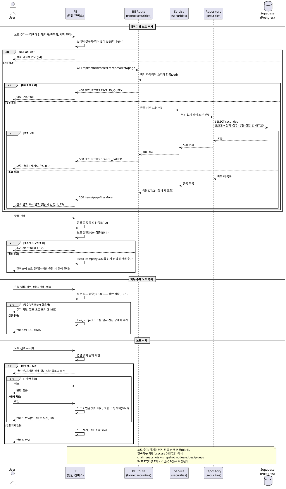

# Usecase 015: 노드 추가/삭제

> 근거: `docs/userflow.md` 015, `docs/prd.md` 3장(밸류체인 생성/편집 페이지)·6장(밸류체인·노드 정책), `docs/database.md` 3.2(securities)·3.3(snapshot_nodes/edges/groups), `docs/techstack.md` §4(Hono route → service → repository → Supabase).
> 외부 서비스 직접 연동 없음: 종목 검색은 자체 DB의 종목 마스터(`securities`)만 조회하며, 외부 API(OpenDART/SEC/토스증권)는 배치 적재 전용이다(PRD 8장).

---

## 1. Primary Actor

- **User(체인 소유자)** — 로그인 사용자가 자신의 밸류체인 편집 캔버스에서 노드를 추가/삭제한다.
- 부 액터: **Admin** — 공식 밸류체인 편집(usecase 021)에서 동일 로직을 재사용한다.

## 2. Precondition (사용자 관점)

- 로그인 상태다.
- 편집 대상 체인의 편집 캔버스에 진입해 있다. 경로는 다음 중 하나:
  - 신규 생성(013)으로 빈 캔버스를 연 상태
  - 공식 체인 복제(014) 직후 편집 상태
  - 내 체인의 `/valuechains/[chainId]/edit` 진입(소유자 검증 통과)
- (상장기업 노드 추가 시) 추가하려는 종목의 티커 또는 종목명을 알고 있다.

## 3. Trigger

- (추가) 편집 캔버스에서 "노드 추가" 상호작용 → 종목 검색 후 선택 **또는** 자유 주체 정보 입력.
- (삭제) 캔버스에서 노드 선택 후 "삭제" 상호작용.

## 4. Main Scenario

### 4-A. 상장기업 노드 추가

1. User가 노드 추가를 시작하고 검색어(티커/종목명)를 입력한다. 시장 필터(KRX/US/전체)를 선택할 수 있다.
2. FE가 검색어를 정규화(공백/대소문자)하고 최소 길이(상수)를 검증한다.
3. FE가 종목 검색 API(`GET /api/securities/search`)를 호출한다.
4. BE route가 쿼리 파라미터를 검증하고 service에 위임, repository가 `securities`를 부분 일치 검색(정확 > 접두 > 부분 정렬, 페이지당 20건)한다.
5. FE가 결과 목록(종목명, 티커, 시장 배지)을 표시하고, User가 종목 1건을 선택한다.
6. FE가 클라이언트 편집 상태에서 검증한다:
   - 동일 체인 내 동일 종목 노드 중복 여부(체인당 동일 종목 1개만 허용)
   - 노드 상한(체인당 최대 100개, `MAX_NODES_PER_CHAIN` 상수) 도달 여부
7. 검증 통과 시 `node_kind=listed_company`, `security_id=선택 종목`인 노드를 임시 편집 상태에 추가하고 캔버스에 렌더링한다.

### 4-B. 자유 주체 노드 추가

1. User가 노드 추가에서 자유 주체 입력을 선택한다.
2. 주체 유형(소비자/정부/비상장기업/기타), 이름(필수), 설명 메모(선택)를 입력한다.
3. FE가 필수 필드(유형·이름)와 노드 상한(100)을 검증한다.
4. 검증 통과 시 `node_kind=free_subject`인 종목 미연결 노드를 임시 편집 상태에 추가하고 캔버스에 렌더링한다.

### 4-C. 노드 삭제

1. User가 캔버스에서 노드를 선택하고 삭제를 실행한다.
2. FE가 해당 노드에 연결된 엣지 존재 여부를 확인한다.
3. 연결 엣지가 있으면 "관련 엣지가 함께 삭제됨" 확인 다이얼로그를 표시하고, User가 확인한다.
4. FE가 임시 편집 상태에서 노드, 노드에 연결된 모든 엣지를 제거하고 그룹 소속을 해제한 뒤 캔버스에 반영한다.

### 공통 (확정)

- 추가/삭제는 모두 **임시 편집 상태** 변경이며, 영속화는 저장(usecase 018 — 사용자 체인, usecase 021 — 공식 체인)에서 스냅샷 1건으로 확정된다. 상한 근접 시(예: 90개 이상) FE가 잔여 수를 안내한다.

## 5. Edge Cases

| # | 상황 | 처리 |
|---|---|---|
| E1 | 노드 상한(100) 도달 상태에서 추가 시도 | 추가 차단 + 상한 안내(추가 UI 진입 시점과 확정 시점 모두 검증). 저장(018) 시 서버가 재검증 |
| E2 | 동일 종목 노드 중복 추가 | 차단 안내(한 체인에 동일 종목 노드 1개만). 저장 시 DB 유니크 `uq(snapshot_id, security_id)`가 최종 강제 |
| E3 | 종목 검색 결과 없음 | 빈 결과 안내 + 자유 주체 노드로 추가하는 대안 안내 |
| E4 | 검색어 최소 길이 미만/공백 | 검색 미실행, 필드 단위 안내 |
| E5 | 종목 검색 API 오류(네트워크/서버) | 오류 안내 + 재시도 유도. 편집 중 상태는 유실되지 않음 |
| E6 | 종목 매핑 실패(선택 직후 종목이 마스터에서 제거/상태 변경) | 추가 불가 안내(추가는 검색 응답의 `securityId` 기준, 저장 시 FK로 최종 검증) |
| E7 | 연결 엣지가 있는 노드 삭제 | 확인 다이얼로그 후 관련 엣지 자동 삭제(취소 시 변경 없음) |
| E8 | 그룹 내 마지막 노드 삭제로 빈 그룹 발생 | 빈 그룹은 임시 상태에 유지(기본값). 자동 정리 여부는 정책 미확정(Open Question) |
| E9 | 자유 주체 필수 필드(유형/이름) 미입력 | 추가 차단, 필드 단위 오류 표기 |
| E10 | 이미 삭제된(존재하지 않는) 노드 재삭제 | 멱등 처리(무시), 캔버스 상태 일관 유지 |
| E11 | 편집 중 세션 만료 | 서버 호출(검색) 실패 시 재로그인 유도. 저장 전 임시 상태는 클라이언트에 유지(자동 저장 없음 — 미저장 이탈 경고는 013 정책) |
| E12 | 검색 요청 남용(연속 입력) | FE 디바운스 적용, 서버 레이트 리밋(008과 공통 정책) |

## 6. Business Rules

### 6.1 규칙

- **BR-1 (노드 상한)**: 체인당 노드 최대 100개(`MAX_NODES_PER_CHAIN`, `packages/domain/constants` 상수 관리). 편집 시 FE 사전 차단 + 저장(018/021) 시 서버 재검증.
- **BR-2 (동일 종목 유일성)**: 동일 체인(스냅샷) 내 동일 종목 노드는 1개만 허용. FE 사전 차단 + DB 유니크 제약(`snapshot_nodes uq(snapshot_id, security_id)`)으로 이중 방어.
- **BR-3 (노드 유형)**: 상장기업 노드(`listed_company`)는 반드시 `securities` 연결(`security_id NOT NULL`), 자유 주체 노드(`free_subject`)는 유형(consumer/government/private_company/other)·이름 필수, 설명 메모 선택.
- **BR-4 (검색 대상)**: 종목 검색은 종목 마스터(`securities`) 기준. 자유 주체(비상장 등)는 검색 대상이 아니며 직접 입력으로만 생성한다.
- **BR-5 (삭제 전파)**: 노드 삭제 시 해당 노드를 source/target으로 하는 엣지를 자동 삭제하고 그룹 소속을 해제한다(노드-엣지-그룹 참조 무결성은 저장 시 스냅샷 복합 FK로 최종 보장).
- **BR-6 (임시 상태 원칙)**: 노드 추가/삭제 자체는 서버에 쓰기를 발생시키지 않는다. 영속화는 저장 1회 = 스냅샷 1건(018/021) 원칙을 따른다. 편집 초안 자동 저장 없음(MVP).
- **BR-7 (권한)**: 사용자 체인은 소유자만 편집. 공식 체인은 Admin만(서버 측 role 검증, 021). 종목 검색 API 자체는 공개(008과 공용)다.

### 6.2 API Specification

노드 추가/삭제는 클라이언트 임시 상태 조작이므로 **전용 쓰기 엔드포인트가 없다**. 본 유스케이스가 호출하는 서버 API는 종목 검색 1개이며, 확정 계약(노드 페이로드)은 저장 API(018)와 공유한다.

#### (1) 종목 검색 — `GET /api/securities/search`

- 소속: `features/securities/backend/route.ts` (008 기업 통합 검색과 공용)
- 인증: 불필요(공개). 응답 형식은 `success()/failure()` 공통 래퍼.

Request (query):

| 파라미터 | 타입 | 필수 | 설명 |
|---|---|---|---|
| `q` | string | O | 티커 또는 종목명(부분 일치), 정규화 후 최소 길이(상수) 이상 |
| `market` | `KRX` \| `US` | X | 미지정 시 전체 |
| `page` | number(≥1) | X | 기본 1, 페이지당 20건(상수) |

Response `200`:

```json
{
  "ok": true,
  "data": {
    "items": [
      {
        "securityId": "uuid",
        "ticker": "005930",
        "name": "삼성전자",
        "englishName": "Samsung Electronics",
        "market": "KRX"
      }
    ],
    "page": 1,
    "pageSize": 20,
    "hasMore": true
  }
}
```

에러 코드:

| HTTP | code | 조건 |
|---|---|---|
| 400 | `SECURITIES.INVALID_QUERY` | `q` 누락/최소 길이 미만/`market`·`page` 형식 오류 |
| 429 | `SECURITIES.RATE_LIMITED` | 검색 남용(레이트 리밋) |
| 500 | `SECURITIES.SEARCH_FAILED` | DB 조회 실패 |

```json
{ "ok": false, "error": { "code": "SECURITIES.INVALID_QUERY", "message": "..." } }
```

#### (2) 확정 계약 — 저장 API의 노드 페이로드 (참조, 상세는 usecase 018)

노드 추가/삭제 결과는 저장 요청 본문의 `nodes[]` 배열 형태로 서버에 전달된다. 본 유스케이스가 형성하는 노드 객체 스키마:

| 필드 | 타입 | 규칙 |
|---|---|---|
| `clientNodeId` | string | 편집 세션 내 노드 식별자(엣지/그룹 참조용) |
| `nodeKind` | `listed_company` \| `free_subject` | BR-3 |
| `securityId` | uuid \| null | `listed_company`면 필수, `free_subject`면 null |
| `subjectName` | string \| null | `free_subject`면 필수 |
| `subjectType` | `consumer` \| `government` \| `private_company` \| `other` \| null | `free_subject`면 필수 |
| `subjectMemo` | string \| null | 선택 |
| `groupClientId` | string \| null | 소속 그룹(0..1, usecase 017) |
| `positionX`, `positionY` | number \| null | 캔버스 좌표(스냅샷에 보존) |

저장 시 서버 검증·에러(노드 관련): 상한 초과 `VALUECHAINS.NODE_LIMIT_EXCEEDED`(422), 동일 종목 중복 `VALUECHAINS.DUPLICATE_SECURITY_NODE`(422), 자유 주체 필수 필드 누락/유형 위반 `VALUECHAINS.INVALID_NODE`(422), 존재하지 않는 `securityId` `VALUECHAINS.SECURITY_NOT_FOUND`(422). (엔드포인트·전체 스키마는 018 spec에서 정의)

### 6.3 Database Operations

| 시점 | 테이블 | 연산 | 내용 |
|---|---|---|---|
| 검색(본 유스케이스) | `securities` | SELECT | `ticker`/`name`/`english_name` ILIKE 부분 일치(트라이그램 GIN), `market` 필터, 정확>접두>부분 정렬, `LIMIT 20 OFFSET` (database.md §4.3 패턴) |
| 노드 추가/삭제 | — | 없음 | 클라이언트 임시 편집 상태만 변경(BR-6) |
| 저장 확정(018/021, 참조) | `chain_snapshots` | INSERT | 저장 1회 = 스냅샷 1건 |
| 저장 확정(참조) | `snapshot_nodes` | INSERT | 편집 결과 전체 노드를 스냅샷 단위로 기록. `uq(snapshot_id, security_id)`·`chk(node_kind)`·`security_id` FK(RESTRICT) 검증 |
| 저장 확정(참조) | `snapshot_edges` / `snapshot_groups` | INSERT | 삭제된 노드에 연결됐던 엣지는 미포함, 그룹 구성 반영(복합 FK로 동일 스냅샷 정합 강제) |

### 6.4 External Service Integration

- **없음.** 종목 검색은 배치(026~031)가 사전 적재한 자체 DB(`securities`)만 조회한다. 본 유스케이스 실행 경로에서 외부 API 호출은 발생하지 않는다.

## 7. Sequence Diagram


