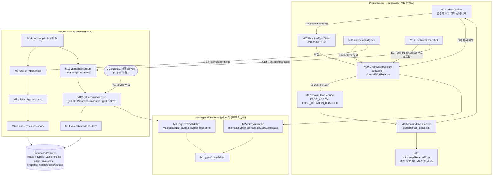

# Plan: UC-016 관계(엣지) 설정/편집/삭제

> 근거: `docs/usecases/016/spec.md`, `docs/usecases/000_decisions.md`(D-6·D-7·C-2), `docs/techstack.md` §4(모노레포 Codebase Structure), `docs/database.md`, `docs/pages/chain-editor/state_management.md`(편집 캔버스 상태 설계의 단일 원천 — 본 plan은 그 설계를 그대로 따른다), `supabase/migrations/0004_relation_types.sql`·`0006_chain_snapshots.sql`(기존 스키마 — 신규 마이그레이션 없음), `.claude/skills/spec_to_plan/references/hono-backend-guide.md`(Hono 백엔드 컨벤션).
>
> **범위**: 본 UC가 소유하는 것은 ① 관계 종류 목록 API(API-1)의 `relation-types` 백엔드 feature, ② 편집 진입용 최신 구성 조회 API(API-2)의 계약·구현(valuechains feature 기여분), ③ 저장 시 엣지 검증 계약(API-3의 edges 부분 — 순수 검증 모듈), ④ 편집 캔버스의 엣지 상호작용 FE 모듈이다. **저장 API 전체(POST/PUT 본문·트랜잭션 RPC)는 UC-018(사용자)·UC-021(공식) plan 소관**이며, 본 plan은 그 저장 service가 호출할 엣지 검증 모듈만 정의한다.
> **외부 서비스 연동 없음**(spec §6.4) — 자체 DB만 사용하므로 외부 클라이언트 모듈·재시도/타임아웃 설계 대상이 없다.

---

## 사전 정합화 결정 (spec 간 충돌 해소 — 구현 시 이 표를 따름)

| # | 충돌 | 결정 | 근거 |
|---|---|---|---|
| R-1 | 비활성 관계 종류의 서버 저장 검증: UC-016 API-3은 `RELATION_TYPE_INACTIVE_FOR_NEW_EDGE`(422)를 정의하나, UC-018 BR-8은 "존재 여부만 검증(비활성 참조 허용)" | **사용자 체인 저장(UC-018)**: 존재만 검증 — 비활성 종류 참조 허용. **공식 체인 저장(UC-021)**: 직전 스냅샷 대조(BR-4·D-7)로 비활성 종류의 **신규** 엣지만 422 차단. FE는 variant 무관하게 활성 종류만 신규 선택 목록에 노출(BR-4 전반부) | UC-018 BR-8(사용자 저장 계약의 소유자), UC-021 E3/BR-6, `state_management.md` §11(동일 결론) |
| R-2 | API-2 권한 오류: UC-016 spec은 비소유자/비Admin에 403 `CHAIN_FORBIDDEN` | **사용자 체인 + 비소유자 → 404 `CHAIN_NOT_FOUND`**(체인 존재 비노출), **공식 체인 + 비Admin → 403 `CHAIN_FORBIDDEN`**(공식 체인 존재는 공개 정보) | 000_decisions C-2의 "존재 비노출" 원칙을 편집 진입 API에 일관 확장 |
| R-3 | 저장 페이로드 엣지 필드명: UC-016 API-3은 `sourceNodeKey`/`targetNodeKey`, UC-018 §6.2는 `sourceClientNodeId`/`targetClientNodeId`(+`clientEdgeId`) | **UC-018 필드명으로 통일**(`clientEdgeId`·`sourceClientNodeId`·`targetClientNodeId`) | UC-018이 저장 계약 소유. `state_management.md` §4.4 각주의 `baseSnapshotId` 통일과 동일 원칙 |
| R-4 | 저장 422 에러 코드: UC-018은 통합 코드(`VALUECHAINS.INVALID_EDGE`/`INVALID_RELATION_TYPE`), UC-016·021은 세분 코드(`EDGE_SELF_REFERENCE` 등) | 공유 검증 모듈은 **세분 사유 코드 + 위반 요소 식별 정보**를 반환하고, 저장 service가 응답 코드로 매핑한다 — 사용자 체인: UC-018 통합 코드(세분 사유는 `error.details.reason`에 포함), 공식 체인: UC-021 세분 코드 | 양 spec 무수정으로 정합. FE `ServerIssue` 정규화는 `details`의 요소 식별 정보만 사용하므로 영향 없음 |
| R-5 | API-1 응답 형태: spec 예시는 `{ "relationTypes": [...] }` 최상위 | 공통 래퍼 적용: `{ "ok": true, "data": { "relationTypes": [...] } }` | UC-018 §6.2 공통 래퍼 + hono-backend-guide `respond()` 패턴 |

---

## 개요

| # | 모듈 | 위치 | 설명 |
| --- | --- | --- | --- |
| **공유 — packages/domain (순수 로직, FE/BE 공용)** | | | |
| M1 | 편집 도메인 타입 | `packages/domain/types/chainEditor.ts` | `RelationType`·`EditorEdge` 등 편집 도메인 타입. **공유 모듈**(chain-editor state 문서 §2.1 소유) — 본 UC는 엣지·관계 종류 타입 기여 |
| M2 | 엣지 편집 검증(클라이언트 규칙) | `packages/domain/valuechains/editorValidation.ts` | `normalizeEdgePair`(D-6 무향 정규화)·`validateEdgeCandidate`·`collectClientIssues`의 엣지 파트. **공유 모듈**(state 문서 §4.3 소유 — UC-015/017도 기여) |
| M3 | 엣지 저장 검증(서버 재검증) | `packages/domain/valuechains/edgeSaveValidation.ts` | 저장 페이로드 엣지 일괄 검증 + 직전 스냅샷 대조(`isEdgePreexisting`, BR-4·D-7). **본 UC 소유** — UC-018/021 저장 service가 소비 |
| **백엔드 — relation-types feature (본 UC 소유, API-1)** | | | |
| M4 | 스키마 | `apps/web/src/features/relation-types/backend/schema.ts` | Query/Row/Response Zod 스키마 |
| M5 | 에러 코드 | `apps/web/src/features/relation-types/backend/error.ts` | 기능별 에러 코드 상수 |
| M6 | 리포지토리 | `apps/web/src/features/relation-types/backend/repository.ts` | `relation_types` SELECT 캡슐화 |
| M7 | 서비스 | `apps/web/src/features/relation-types/backend/service.ts` | 목록 조회 로직(활성 필터·DTO 변환) |
| M8 | 라우트 | `apps/web/src/features/relation-types/backend/route.ts` | `GET /api/relation-types` HTTP 계층 |
| **백엔드 — valuechains feature (공유 feature — UC-013/014/018/019/021 공동, 본 UC 기여분: API-2 + 엣지 검증 헬퍼)** | | | |
| M9 | 스키마(기여분) | `apps/web/src/features/valuechains/backend/schema.ts` | `LatestSnapshotResponse` 전체 계약 + 저장 요청 `edges[]` 스키마 |
| M10 | 에러 코드(기여분) | `apps/web/src/features/valuechains/backend/error.ts` | 조회·엣지 검증 에러 코드 |
| M11 | 리포지토리(기여분) | `apps/web/src/features/valuechains/backend/repository.ts` | 체인 메타·최신 스냅샷 구성·직전 엣지 정체성 조회 |
| M12 | 서비스(기여분) | `apps/web/src/features/valuechains/backend/service.ts` | `getLatestSnapshot`(권한 분기 포함) + `validateEdgesForSave`(M3 위임 헬퍼) |
| M13 | 라우트(기여분) | `apps/web/src/features/valuechains/backend/route.ts` | `GET /api/valuechains/:chainId/snapshots/latest` |
| **백엔드 — 공통 인프라 (공유 — 위치만 참조, 본 UC에서 신규 정의하지 않음)** | | | |
| M14 | Hono 앱 등록 | `apps/web/src/backend/hono/app.ts` | `registerRelationTypeRoutes`·`registerValuechainRoutes` 등록 1줄씩 추가 |
| — | 응답 헬퍼/미들웨어 | `apps/web/src/backend/http/response.ts`, `apps/web/src/backend/middleware/*` | `success/failure/respond`·`errorBoundary`·`withAppContext`(사용자 식별·role)·`withSupabase` — 인증 UC plan 소관, 참조만 |
| **프론트엔드 — 편집 캔버스 (chain-editor state 문서 설계 준수)** | | | |
| M15 | 관계 종류 쿼리 훅 | `apps/web/src/features/valuechains/editor/hooks/useRelationTypes.ts` | API-1 TanStack Query 훅(전체 조회 — 비활성 포함) |
| M16 | 최신 구성 쿼리 훅 | `apps/web/src/features/valuechains/editor/hooks/useLatestSnapshot.ts` | API-2 TanStack Query 훅. **공유**(편집 부트스트랩 — UC-013~017 공동) |
| M17 | 리듀서(엣지 기여분) | `apps/web/src/features/valuechains/editor/state/chainEditorReducer.ts` | `EDGE_ADDED`·`EDGE_RELATION_CHANGED`·`ELEMENTS_DELETED`(엣지 연쇄) 케이스. **공유 모듈** |
| M18 | 셀렉터(엣지 기여분) | `apps/web/src/features/valuechains/editor/state/chainEditorSelectors.ts` | `selectReactFlowEdges`(라벨·방향·하이라이트 매핑). **공유 모듈** |
| M19 | Context(엣지 기여분) | `apps/web/src/features/valuechains/editor/context/ChainEditorContext.tsx` | `addEdge`·`changeEdgeRelation` 액션 함수 + `activeRelationTypes`·`hasActiveRelationTypes` computed. **공유 모듈** |
| M20 | 관계 종류 선택 UI | `apps/web/src/features/valuechains/editor/components/RelationTypePicker.tsx` | 신규 연결·관계 변경 공용 선택 팝오버(활성 종류만 노출). **본 UC 소유** |
| M21 | 캔버스(엣지 기여분) | `apps/web/src/features/valuechains/editor/components/EditorCanvas.tsx` | `onConnect`(pending 후보)·엣지 선택·삭제 배선. **공유 컴포넌트** |
| M22 | 엣지 렌더러 | `apps/web/src/components/mindmap/RelationEdge.tsx` | React Flow 커스텀 엣지(라벨=마스터 최신 이름, 방향 마커=isDirected). 뷰(UC-009)/편집 **공용 프레젠테이션** — 본 UC 소유 |
| — | API 클라이언트 | `apps/web/src/lib/api-client.ts` | 공통 fetch 유틸(래퍼 언랩·에러 정규화) — **공유 인프라, 위치만 참조** |

- **DB 마이그레이션 신규 없음**: `relation_types`(0004)·`chain_snapshots`/`snapshot_edges`(0006)의 CHECK·유니크·복합 FK가 이미 최종 방어선을 제공한다. 저장 RPC(`save_user_chain` 등)는 UC-018/021 plan 소관.
- **워커(apps/worker) 변경 없음**, **외부 연동 없음**.

## Diagram



데이터 흐름: Presentation(M20~M22) → 액션 함수(M19, M2로 사전 검증) → Reducer(M17) → 셀렉터(M18) → View. 저장 시 서버는 동일 규칙을 M3(M12 경유)로 재검증(BR-9) → DB 제약이 최종 방어(E1/E2).

---

## Implementation Plan

### M1. 편집 도메인 타입 — `packages/domain/types/chainEditor.ts` (공유)

- 구현 내용:
  1. `state_management.md` §2.1의 타입 정의를 그대로 구현한다. 본 UC 기여분은 다음 두 타입:
     - `RelationType { id: string; name: string; isDirected: boolean; isActive: boolean }` — `relation_types` 마스터의 camelCase 사영.
     - `EditorEdge { clientEdgeId: string; sourceClientNodeId: string; targetClientNodeId: string; relationTypeId: string }` — 방향 속성 없음(BR-5: 방향성은 마스터 `isDirected`를 따름).
  2. React·Supabase 비의존 순수 타입만 둔다(프레임워크 import 금지).
  3. UC-013/015/017 plan이 같은 파일에 노드/그룹 타입을 기여한다 — 필드 충돌 없음(state 문서가 단일 원천).
- 의존성: 없음(최우선 구현).
- Unit Tests: 타입 전용 모듈 — 해당 없음(`npm run typecheck`로 검증).

### M2. 엣지 편집 검증 — `packages/domain/valuechains/editorValidation.ts` (공유, 엣지 파트 기여)

- 구현 내용:
  1. `normalizeEdgePair(sourceId, targetId, isDirected): [string, string]` — 유향이면 순서 유지, **무향이면 사전순 정렬로 정규화**(D-6). 중복 판정·직전 대조·저장 검증(M3)이 모두 이 함수를 공유한다(DRY의 핵심 지점).
  2. `validateEdgeCandidate(state, candidate, relationTypeById, options)` — state 문서 §4.3 시그니처 그대로. 판정 순서:
     - source/target가 `state.nodes`에 없음 → `NODE_NOT_FOUND`
     - source === target → `SELF_REFERENCE`(E1)
     - `relationTypeById`에 없거나 `isActive=false` → `RELATION_TYPE_INACTIVE`(BR-4 — FE는 신규/변경 모두 차단. 미존재 ID도 "선택 불가"로 동일 처리)
     - 기존 엣지 중 `normalizeEdgePair` 결과와 관계 종류가 모두 일치하는 것 존재(단 `options.excludeEdgeId` 제외) → `DUPLICATE_RELATION`(E2·BR-2)
     - 이상 없으면 `null` — 동일 쌍 다른 종류 병존은 통과(E3·BR-3)
  3. `collectClientIssues`의 엣지 파트: 저장 전 일괄 검증에서 모든 엣지에 대해 자기 참조·중복·노드 참조를 재확인하고 `{ code: 'INVALID_EDGE', targets: { clientEdgeIds } }`로 수집한다. **비활성 종류 여부는 여기서 검사하지 않는다**(기존 엣지 유지 허용 — BR-4 후반부, 신규 유입은 2번에서 이미 차단됨).
- 의존성: M1.
- **Unit Tests** (Vitest, `packages/domain` — React 비의존):
  - [ ] `normalizeEdgePair`: 유향 (B,A) → (B,A) 순서 유지 / 무향 (B,A) → (A,B) 정렬
  - [ ] 자기 참조 후보(source=target) → `SELF_REFERENCE`
  - [ ] 미존재 노드 ID 참조 → `NODE_NOT_FOUND`
  - [ ] 유향: (A,B,공급) 존재 + (A,B,공급) 후보 → `DUPLICATE_RELATION`
  - [ ] 유향: (A,B,공급) 존재 + (B,A,공급) 후보 → `null`(역방향은 별개 쌍 — DB 유니크와 일치)
  - [ ] 무향: (A,B,경쟁) 존재 + (B,A,경쟁) 후보 → `DUPLICATE_RELATION`(D-6)
  - [ ] (A,B,공급) 존재 + (A,B,지분투자) 후보 → `null`(병존 허용, E3)
  - [ ] 비활성 종류 후보 → `RELATION_TYPE_INACTIVE` / 미존재 relationTypeId → `RELATION_TYPE_INACTIVE`
  - [ ] `excludeEdgeId`: 엣지 e1(A,B,공급)의 종류를 그대로 두고 재검증 시 자기 자신과의 충돌 미발생 → `null`
  - [ ] `collectClientIssues`: 위반 엣지 2건 혼재 시 `clientEdgeIds`에 두 건 모두 수집, 비활성 종류 기존 엣지는 이슈 미생성

### M3. 엣지 저장 검증 — `packages/domain/valuechains/edgeSaveValidation.ts` (본 UC 소유)

- 구현 내용:
  1. 서버 저장 재검증(BR-9) 전용 순수 모듈. 시그니처:
     ```ts
     export type NodeIdentity =
       | { kind: 'listed_company'; securityId: string }
       | { kind: 'free_subject'; subjectName: string; subjectType: string };  // D-7

     export interface PreviousEdgeIdentity {
       relationTypeId: string;
       source: NodeIdentity;
       target: NodeIdentity;
     }

     export interface EdgeSaveViolation {
       reason: 'EDGE_SELF_REFERENCE' | 'EDGE_DUPLICATE_RELATION' | 'EDGE_NODE_REF_INVALID'
             | 'RELATION_TYPE_NOT_FOUND' | 'RELATION_TYPE_INACTIVE_FOR_NEW_EDGE';
       edge: { clientEdgeId: string; sourceClientNodeId: string;
               targetClientNodeId: string; relationTypeId: string };
     }

     export function validateEdgesPayload(input: {
       nodes: ReadonlyArray<{ clientNodeId: string } & NodeIdentityFields>;
       edges: ReadonlyArray<SaveEdgePayload>;                    // R-3 필드명(UC-018 계약)
       relationTypes: ReadonlyMap<string, Pick<RelationType, 'isDirected' | 'isActive'>>;
       previousEdges: ReadonlyArray<PreviousEdgeIdentity> | null; // null = 직전 스냅샷 없음(신규 저장)
       enforceActiveForNewEdges: boolean;                         // official=true / user=false (R-1)
     }): EdgeSaveViolation[];

     export function isEdgePreexisting(
       candidate: { source: NodeIdentity; target: NodeIdentity; relationTypeId: string },
       previousEdges: ReadonlyArray<PreviousEdgeIdentity>,
       isDirected: boolean,
     ): boolean;
     ```
  2. `validateEdgesPayload` 판정 규칙(위반은 전부 수집 — 첫 건에서 중단하지 않음, FE가 일괄 하이라이트):
     - `sourceClientNodeId`/`targetClientNodeId`가 `nodes[]`에 없음 → `EDGE_NODE_REF_INVALID`(E7)
     - source=target → `EDGE_SELF_REFERENCE`(E1)
     - `relationTypes`에 없는 ID → `RELATION_TYPE_NOT_FOUND`(E7)
     - `normalizeEdgePair`(M2 재사용) + 종류 기준 페이로드 내 중복 → `EDGE_DUPLICATE_RELATION`(E2, 무향 역방향 포함)
     - `enforceActiveForNewEdges=true`이고 종류가 비활성이며 `isEdgePreexisting`이 false → `RELATION_TYPE_INACTIVE_FOR_NEW_EDGE`(E4·E11 — 저장 시점 마스터 상태 기준)
  3. `isEdgePreexisting` 노드 동일성(BR-4·D-7): 상장기업=`securityId` 일치, 자유 주체=`subjectName`+`subjectType` 일치. 무향 관계는 (source,target) 정체성 쌍을 정규화해 대조한다.
- 의존성: M1, M2(`normalizeEdgePair`).
- **Unit Tests**:
  - [ ] 자기 참조 엣지 → `EDGE_SELF_REFERENCE` + 해당 `clientEdgeId` 식별 정보 포함
  - [ ] 미존재 `clientNodeId` 참조 → `EDGE_NODE_REF_INVALID`
  - [ ] 미존재 `relationTypeId` → `RELATION_TYPE_NOT_FOUND`
  - [ ] 유향 동일 (A,B,종류) 2건 → `EDGE_DUPLICATE_RELATION` / 유향 (A,B)+(B,A) 동일 종류 → 위반 없음
  - [ ] 무향 (A,B)+(B,A) 동일 종류 → `EDGE_DUPLICATE_RELATION`(D-6)
  - [ ] `enforceActiveForNewEdges=false` + 비활성 종류 → 위반 없음(사용자 체인, UC-018 BR-8)
  - [ ] `enforceActiveForNewEdges=true` + 비활성 + 직전 스냅샷에 동일 엣지(상장기업 노드: 동일 securityId 쌍+동일 종류) → 위반 없음(BR-4 기존 엣지 유지)
  - [ ] `enforceActiveForNewEdges=true` + 비활성 + 직전에 없음 → `RELATION_TYPE_INACTIVE_FOR_NEW_EDGE`
  - [ ] 자유 주체 정체성: 이름+유형 동일 → preexisting true / 이름 동일·유형 상이 → false(D-7)
  - [ ] 무향 preexisting: 직전 (A,B), 후보 (B,A) → true
  - [ ] `previousEdges=null`(신규 저장) + 비활성 + enforce=true → `RELATION_TYPE_INACTIVE_FOR_NEW_EDGE`
  - [ ] 복수 위반 혼재 시 전부 수집

### M4. relation-types 스키마 — `apps/web/src/features/relation-types/backend/schema.ts`

- 구현 내용:
  1. `RelationTypeListQuerySchema`: `{ active: z.enum(['true','false']).optional() }` → 파싱 후 boolean 변환. 그 외 값은 400.
  2. `RelationTypeRowSchema`(snake_case — 0004 마이그레이션과 1:1): `id(uuid)`, `name`, `is_directed`, `is_active`, `created_at`, `updated_at`.
  3. `RelationTypeResponseSchema`(camelCase): `{ id, name, isDirected, isActive }` — M1 `RelationType`과 동형. `RelationTypeListResponseSchema`: `{ relationTypes: RelationTypeResponse[] }`.
  4. 모든 타입 `z.infer` export.
  5. UC-024(어드민 관리 API)는 별도 feature(`admin-relation-types`) 소관 — 본 스키마는 조회 전용으로 유지(SRP).
- 의존성: M1(타입 참고).
- Unit Tests: 스키마 정의 전용 — 해당 없음(서비스 테스트에서 간접 검증).

### M5. relation-types 에러 코드 — `apps/web/src/features/relation-types/backend/error.ts`

- 구현 내용:
  ```ts
  export const relationTypeErrorCodes = {
    invalidQuery: 'RELATION_TYPES.INVALID_QUERY',       // 400
    fetchFailed:  'RELATION_TYPES.FETCH_FAILED',        // 500 (E10)
    validationError: 'RELATION_TYPES.VALIDATION_ERROR', // 500 (row/DTO 스키마 위반)
  } as const;
  ```
  `RelationTypeServiceError` 타입 export. 401은 공통 인증 미들웨어(`AUTH_REQUIRED`) 소관.
- 의존성: 없음.
- Unit Tests: 상수 정의 — 해당 없음.

### M6. relation-types 리포지토리 — `apps/web/src/features/relation-types/backend/repository.ts`

- 구현 내용:
  1. `findAllRelationTypes(client: SupabaseClient, filter: { activeOnly: boolean }): Promise<{ rows: unknown[] } | { error: string }>` — `relation_types` SELECT(`id,name,is_directed,is_active`), `activeOnly=true`면 `.eq('is_active', true)`(`idx_relation_types_active` 활용), 정렬 `created_at ASC`(선택 목록 순서 안정화).
  2. Supabase 쿼리 문법은 이 파일에만 존재(service는 반환 인터페이스에만 의존 — techstack §4 repository 규칙).
- 의존성: 공통 `withSupabase` 컨텍스트(참조).
- **Unit Tests** (Supabase client 목킹):
  - [ ] `activeOnly=false` → 필터 없는 전체 조회 호출
  - [ ] `activeOnly=true` → `is_active=true` 필터 적용
  - [ ] Supabase 오류 응답 → error 반환(throw 금지)

### M7. relation-types 서비스 — `apps/web/src/features/relation-types/backend/service.ts`

- 구현 내용:
  1. `getRelationTypes(client, query: { activeOnly: boolean }): Promise<HandlerResult<RelationTypeListResponse, RelationTypeServiceError, unknown>>`
  2. 흐름: repository 조회 → 오류 시 `failure(500, fetchFailed)` → `RelationTypeRowSchema` 배열 검증(위반 시 `failure(500, validationError)`) → snake→camel 변환 → `RelationTypeListResponseSchema` 검증 → `success`.
  3. 활성/비활성 구분은 데이터에 포함해 반환(Main 1 — FE가 라벨 렌더링/선택 목록을 분리 소비).
- 의존성: M4, M5, M6, 공통 `response.ts`.
- **Unit Tests**:
  - [ ] 정상: 활성+비활성 혼재 rows → camelCase DTO 배열, `isActive` 보존
  - [ ] `activeOnly=true` 전달 → repository에 필터 위임 확인
  - [ ] repository 오류 → `failure(500, FETCH_FAILED)`
  - [ ] row 스키마 위반(`is_directed` 누락 등) → `failure(500, VALIDATION_ERROR)`
  - [ ] 빈 목록 → `success({ relationTypes: [] })`(E6는 FE 표시 책임)

### M8. relation-types 라우트 — `apps/web/src/features/relation-types/backend/route.ts`

- 구현 내용:
  1. `registerRelationTypeRoutes(app: Hono<AppEnv>)` — `GET /relation-types`.
  2. 흐름: 인증 컨텍스트에서 사용자 확인(미인증 → 401 `AUTH_REQUIRED`, 공통 미들웨어) → 쿼리 `M4` 검증(위반 → 400 `INVALID_QUERY`) → `getRelationTypes` 호출 → 실패 시 `logger.error` → `respond()`.
  3. HTTP 파싱/검증 외 로직 금지(비즈니스 규칙은 M7).
- 의존성: M4, M5, M7, M14, 공통 미들웨어.
- **QA Sheet**:

| # | 시나리오 | 기대 결과 |
| --- | --- | --- |
| 1 | 로그인 상태 `GET /api/relation-types` | 200, `data.relationTypes`에 활성/비활성 전체 + `isDirected`/`isActive` 포함 |
| 2 | `GET /api/relation-types?active=true` | 200, `isActive=true` 항목만 |
| 3 | `GET /api/relation-types?active=banana` | 400 `RELATION_TYPES.INVALID_QUERY` |
| 4 | 미로그인 호출 | 401 `AUTH_REQUIRED`(E9와 동일 계약) |
| 5 | DB 장애(repository 오류 목킹) | 500 `RELATION_TYPES.FETCH_FAILED` + 서버 로그 기록(E10) |
| 6 | 응답 본문 | 공통 래퍼 `{ ok, data }` 준수(R-5) |

### M9. valuechains 스키마(기여분) — `apps/web/src/features/valuechains/backend/schema.ts`

- 구현 내용:
  1. **`LatestSnapshotResponseSchema`** — API-2 응답 계약을 spec 발췌에서 구현 수준으로 확정. `state_management.md` §5의 DTO 전제(상장기업 노드에 표시용 종목 필드 조인 필수)를 반영:
     ```ts
     {
       chainId: uuid, chainType: 'official' | 'user',
       name: string, focusType: 'industry' | 'company',
       focusSecurity: { securityId, ticker, name, market } | null,   // SecurityRef — 부트스트랩용
       snapshotId: uuid, effectiveAt: string,
       groups: [{ id, name }],
       nodes: [{ id, nodeKind, groupId: uuid|null,
                 security: SecurityRef | null,                        // listed_company만 non-null
                 subjectName: string|null, subjectType: SubjectType|null, subjectMemo: string|null,
                 positionX: number|null, positionY: number|null }],
       edges: [{ id, sourceNodeId, targetNodeId, relationTypeId }]    // 방향 속성 없음(BR-5)
     }
     ```
  2. **저장 요청 `edges[]` 스키마**(`SaveEdgePayloadSchema`) — UC-018 §6.2 필드명(R-3): `{ clientEdgeId: string(min 1), sourceClientNodeId: string, targetClientNodeId: string, relationTypeId: uuid }`. 저장 본문 전체 스키마는 UC-018 plan이 이 스키마를 합성한다.
  3. Row 스키마: `RelationTypeRow`(M4 재사용 — import), `ChainRow`(`id, chain_type, owner_id, name, focus_type, focus_security_id, is_archived`), `SnapshotRow`, `SnapshotNodeRow`(securities 조인 포함), `SnapshotEdgeRow`, `SnapshotGroupRow` — 0005/0006 마이그레이션과 1:1.
- 의존성: M1, M4.
- Unit Tests: 스키마 정의 전용 — 해당 없음.

### M10. valuechains 에러 코드(기여분) — `apps/web/src/features/valuechains/backend/error.ts`

- 구현 내용(본 UC 기여분 — UC-018/019/021 plan이 같은 파일에 추가 기여):
  ```ts
  export const valuechainErrorCodes = {
    // API-2 (본 UC)
    chainNotFound:   'VALUECHAINS.CHAIN_NOT_FOUND',    // 404 — 미존재/보관/비소유 사용자 체인(R-2)
    chainForbidden:  'VALUECHAINS.CHAIN_FORBIDDEN',    // 403 — 공식 체인 + 비Admin(R-2)
    snapshotNotFound:'VALUECHAINS.SNAPSHOT_NOT_FOUND', // 404 — 스냅샷 0건(데이터 정합 방어)
    fetchFailed:     'VALUECHAINS.FETCH_FAILED',       // 500
    validationError: 'VALUECHAINS.VALIDATION_ERROR',   // 500
    // 저장 엣지 검증(본 UC 계약 — 저장 service가 R-4 매핑에 사용)
    edgeSelfReference:        'VALUECHAINS.EDGE_SELF_REFERENCE',
    edgeDuplicateRelation:    'VALUECHAINS.EDGE_DUPLICATE_RELATION',
    edgeNodeRefInvalid:       'VALUECHAINS.EDGE_NODE_REF_INVALID',
    relationTypeNotFound:     'VALUECHAINS.RELATION_TYPE_NOT_FOUND',
    relationTypeInactiveForNewEdge: 'VALUECHAINS.RELATION_TYPE_INACTIVE_FOR_NEW_EDGE',
    invalidEdge:              'VALUECHAINS.INVALID_EDGE',            // UC-018 사용자 저장 통합 코드
    invalidRelationType:      'VALUECHAINS.INVALID_RELATION_TYPE',   // UC-018 사용자 저장 통합 코드
  } as const;
  ```
  R-4 매핑 규칙을 파일 주석으로 명시: 사용자 체인 저장 → `invalidEdge`/`invalidRelationType`(세분 사유는 `details.reason`), 공식 체인 저장 → 세분 코드 그대로. 422 `details`에는 항상 위반 엣지 식별 정보(`clientEdgeId`/`sourceClientNodeId`/`targetClientNodeId`/`relationTypeId`)를 포함한다(spec API-3).
- 의존성: 없음.
- Unit Tests: 상수 정의 — 해당 없음.

### M11. valuechains 리포지토리(기여분) — `apps/web/src/features/valuechains/backend/repository.ts`

- 구현 내용(본 UC 기여 함수 3개 — UC-018/021 plan이 저장 RPC 호출 등을 추가 기여):
  1. `findChainMetaById(client, chainId)` — `value_chains` 단건: `id, chain_type, owner_id, name, focus_type, focus_security_id, is_archived`(+`focus_security_id` 존재 시 securities 표시 필드 조인). 없으면 `null`.
  2. `findLatestSnapshotHeader(client, chainId)` — `chain_snapshots` `ORDER BY effective_at DESC, created_at DESC LIMIT 1`(`idx_chain_snapshots_chain_effective` 활용, 동시각 tie-break 결정성 확보). 없으면 `null`.
  3. `findSnapshotComposition(client, snapshotId)` — 3쿼리 병렬: `snapshot_nodes`(securities `ticker,name,market` 조인) / `snapshot_edges` / `snapshot_groups`, 전부 `WHERE snapshot_id = :id`.
  4. `findLatestEdgeIdentities(client, chainId)` — **저장 시 BR-4 대조용**(UC-021 저장 service가 소비): 최신 스냅샷의 `snapshot_edges`를 source/target `snapshot_nodes`와 조인해 `PreviousEdgeIdentity[]`(M3의 `NodeIdentity` 형태: `security_id` 또는 `subject_name`+`subject_type`)로 반환. 스냅샷 없으면 `null`.
- 의존성: M9(Row 스키마), 공통 supabase 컨텍스트.
- **Unit Tests**:
  - [ ] `findLatestSnapshotHeader`: `effective_at DESC, created_at DESC LIMIT 1` 쿼리 구성 확인
  - [ ] `findSnapshotComposition`: 세 테이블 모두 동일 `snapshot_id` 필터
  - [ ] `findLatestEdgeIdentities`: 상장기업 노드 → `securityId` 정체성 / 자유 주체 노드 → `subjectName+subjectType` 정체성 매핑
  - [ ] 대상 없음(null)·Supabase 오류 각각 구분 반환

### M12. valuechains 서비스(기여분) — `apps/web/src/features/valuechains/backend/service.ts`

- 구현 내용:
  1. **`getLatestSnapshot(client, actor: { userId: string; role: 'user' | 'admin' }, chainId)`** — API-2 비즈니스 로직:
     - `findChainMetaById` → 없음 또는 `is_archived=true` → `failure(404, chainNotFound)`
     - 권한 분기(R-2): `chain_type='user'`이고 `owner_id !== actor.userId` → `failure(404, chainNotFound)`(존재 비노출) / `chain_type='official'`이고 `actor.role !== 'admin'` → `failure(403, chainForbidden)`(본 API는 편집 진입 전용 — 뷰 조회는 UC-009 API 소관)
     - `findLatestSnapshotHeader` → 없음 → `failure(404, snapshotNotFound)`(스냅샷 0건 체인은 정합 위반 — 방어적 처리)
     - `findSnapshotComposition` → Row 검증 → `LatestSnapshotResponse` DTO 변환(snake→camel, listed 노드에 `security` SecurityRef 합성) → 응답 스키마 검증 → `success`
  2. **`validateEdgesForSave(input)`** — 저장 service(UC-018/021)가 호출하는 헬퍼. M3 `validateEdgesPayload`에 위임하고, 위반 목록을 R-4 규칙으로 HTTP 응답 코드에 매핑해 `failure(422, code, message, details)`를 구성한다. variant 파라미터(`'user' | 'official'`)가 `enforceActiveForNewEdges`와 응답 코드 셋(통합/세분)을 결정한다. 사용자 체인은 `previousEdges` 조회 자체를 생략한다(불필요 쿼리 제거 — R-1).
- 의존성: M3, M9, M10, M11.
- **Unit Tests**:
  - [ ] 소유자 + 사용자 체인 → 200 상당 success, `nodes[].security`에 ticker/name/market 포함
  - [ ] 비소유자 + 사용자 체인 → `failure(404, CHAIN_NOT_FOUND)`(R-2/C-2)
  - [ ] admin + 공식 체인 → success
  - [ ] 일반 사용자 + 공식 체인 → `failure(403, CHAIN_FORBIDDEN)`
  - [ ] `is_archived=true` → 404 / 체인 미존재 → 404
  - [ ] 스냅샷 0건 → `failure(404, SNAPSHOT_NOT_FOUND)`
  - [ ] repository 오류 → `failure(500, FETCH_FAILED)` / Row 위반 → `failure(500, VALIDATION_ERROR)`
  - [ ] `validateEdgesForSave`(user): 비활성 종류 참조 → 위반 없음, 자기 참조 → `422 INVALID_EDGE` + `details.reason='EDGE_SELF_REFERENCE'` + 엣지 식별 정보
  - [ ] `validateEdgesForSave`(official): 비활성 신규 엣지 → `422 RELATION_TYPE_INACTIVE_FOR_NEW_EDGE`, 직전 존재 엣지 → 통과

### M13. valuechains 라우트(기여분) — `apps/web/src/features/valuechains/backend/route.ts`

- 구현 내용:
  1. `registerValuechainRoutes(app)` 내 `GET /valuechains/:chainId/snapshots/latest` 추가(저장 POST/PUT 핸들러는 UC-018 plan 기여분 — 동일 파일 공존, 충돌 없음).
  2. 흐름: 인증 확인(401) → `chainId` uuid 검증(위반 → 400) → 컨텍스트에서 `{ userId, role }` 추출 → `getLatestSnapshot` 호출 → 실패 로깅 → `respond()`.
- 의존성: M9, M10, M12, M14, 공통 미들웨어.
- **QA Sheet**:

| # | 시나리오 | 기대 결과 |
| --- | --- | --- |
| 1 | 소유자가 본인 체인으로 호출 | 200, `snapshotId`/`nodes`/`edges`/`groups`/메타 포함 |
| 2 | 타인 사용자 체인으로 호출 | 404 `VALUECHAINS.CHAIN_NOT_FOUND`(403 아님 — R-2) |
| 3 | admin이 공식 체인으로 호출 | 200 |
| 4 | 일반 사용자가 공식 체인으로 호출 | 403 `VALUECHAINS.CHAIN_FORBIDDEN` |
| 5 | uuid 형식이 아닌 chainId | 400 |
| 6 | 미로그인 | 401 `AUTH_REQUIRED` |
| 7 | 미존재/보관 체인 | 404 |
| 8 | 응답의 상장기업 노드 | `security.ticker/name/market` 포함(부트스트랩 DTO 전제 충족) |

### M14. Hono 앱 등록 — `apps/web/src/backend/hono/app.ts` (공유)

- 구현 내용: `registerRelationTypeRoutes(app)`·`registerValuechainRoutes(app)` 등록 추가(각 1줄). 미들웨어 체인(errorBoundary → withAppContext → withSupabase) 순서는 기존 컨벤션 유지, 본 UC에서 변경하지 않는다.
- 의존성: M8, M13.
- QA: `/api/relation-types`·`/api/valuechains/:id/snapshots/latest` 접근 가능, 기존 라우트와 경로 충돌 없음.

### M15. useRelationTypes 훅 — `apps/web/src/features/valuechains/editor/hooks/useRelationTypes.ts`

- 구현 내용:
  1. `state_management.md` §5 계약: `useRelationTypes(): UseQueryResult<RelationType[]>`, 쿼리 키 `chainEditorQueryKeys.relationTypes`(`['relation-types']`).
  2. **전체 조회**(`active` 미지정)로 호출 — 비활성 종류의 기존 엣지 라벨 렌더링을 위해(BR-6, UC-024 BR-8). 활성 필터링은 computed(`activeRelationTypes`, M19)에서 파생.
  3. 공통 api-client로 `{ ok, data }` 언랩, 실패 시 ApiError throw(TanStack Query 표준 오류 경로 → 부트스트랩 오류 파생·재시도는 Provider 책임, E10).
- 의존성: M1, M8(API), 공유 api-client.
- Unit Tests: 얇은 래퍼 — 훅 단위 테스트 생략, Provider 통합 테스트와 M20 QA로 커버.

### M16. useLatestSnapshot 훅 — `apps/web/src/features/valuechains/editor/hooks/useLatestSnapshot.ts` (공유)

- 구현 내용: `useLatestSnapshot(chainId: string | null)` — `mode==='edit'`에서만 enabled, 쿼리 키 `['valuechains', chainId, 'latest-snapshot']`. 응답은 M9 `LatestSnapshotResponse` 타입. 부트스트랩 변환(`toEditorBootstrap` — 엣지: 서버 `edges[].id`를 `clientEdgeId`로 승계)은 Provider 이펙트 소관(state 문서 §6.2)이며 UC-013 plan 기여분과 공유.
- 의존성: M1, M9(타입), M13(API).
- Unit Tests: 얇은 래퍼 — 생략(부트스트랩 왕복 테스트는 state 문서 §10-14 — UC-013/018 plan 소관).

### M17. 리듀서 엣지 기여분 — `apps/web/src/features/valuechains/editor/state/chainEditorReducer.ts` (공유)

- 구현 내용(state 문서 §3~4를 그대로 구현 — 본 UC 기여 케이스):
  1. `EDGE_ADDED`: `edges[payload.clientEdgeId] ← payload` + 공통 후처리(⊕: `isDirty=true`, `serverIssues=[]`).
  2. `EDGE_RELATION_CHANGED`: `edges[id].relationTypeId ← payload.relationTypeId` ⊕. 미존재 `clientEdgeId` → no-op(멱등 가드).
  3. `ELEMENTS_DELETED`의 엣지 규칙: `edgeIds` 제거 + `nodeIds` 제거 시 해당 노드를 source/target으로 갖는 엣지 **연쇄 제거**(E5), `selection`에서 제거 요소 제외. (노드/그룹 파트는 UC-015/017 기여분.)
  4. 유향 방향 반전은 별도 액션을 두지 않는다 — View에서 삭제+역방향 추가 조합으로 처리(Main 7, 리듀서 표면 최소화).
  5. 순수 함수 유지: ID 발급·검증은 액션 함수(M19) 소관.
- 의존성: M1.
- **Unit Tests**:
  - [ ] `EDGE_ADDED` → `edges`에 추가, `isDirty=true`, `serverIssues` 초기화, 원본 상태 비변이
  - [ ] `initialized=false`에서 `EDGE_ADDED` → no-op
  - [ ] `EDGE_RELATION_CHANGED` → `relationTypeId`만 갱신 ⊕
  - [ ] 미존재 `clientEdgeId`에 `EDGE_RELATION_CHANGED` → no-op, `isDirty` 불변
  - [ ] `ELEMENTS_DELETED { edgeIds:[e1] }` → e1 제거, 노드 불변, `selection.edgeIds`에서 e1 제외
  - [ ] `ELEMENTS_DELETED { nodeIds:[n1] }` — n1에 연결된 엣지 2건 → 노드+엣지 연쇄 제거(E5)

### M18. 셀렉터 엣지 기여분 — `apps/web/src/features/valuechains/editor/state/chainEditorSelectors.ts` (공유)

- 구현 내용:
  1. `selectReactFlowEdges(state, relationTypeById, highlight): Edge<ChainEditorEdgeData>[]` — `EditorEdge` → React Flow Edge 매핑:
     - `label` = `relationTypeById.get(relationTypeId)?.name`(마스터 최신 이름 — BR-6; 비활성 종류도 전체 조회에 포함되므로 라벨 정상), 미존재 시 폴백 라벨 상수(방어)
     - `markerEnd` = `isDirected ? 화살표 : 없음`(BR-5 — 엣지 자체에 방향 속성 없음)
     - `type='relationEdge'`(M22 커스텀 엣지), `data`에 `relationTypeId`/`isDirected`/`isInactiveType`(비활성 시각 구분용)/`isHighlighted`(`highlight.edgeIds` 포함 여부) 전달
  2. `selectConnectedEdgeIds(state, nodeIds)` — 삭제 확인 다이얼로그 판단용(UC-015와 공유).
- 의존성: M1, M17(상태 타입).
- **Unit Tests**:
  - [ ] 유향 종류 엣지 → `markerEnd` 설정 / 무향 → 마커 없음
  - [ ] 라벨 = 마스터 최신 `name`(마스터 이름 변경 시 동일 상태로 재계산해 라벨 갱신 — BR-6)
  - [ ] 마스터에 없는 `relationTypeId` → 폴백 라벨, throw 없음
  - [ ] `highlight.edgeIds`에 포함된 엣지 → `isHighlighted=true`
  - [ ] `selectConnectedEdgeIds`: 노드 2개 선택 시 연결 엣지 합집합(중복 없음)

### M19. Context 엣지 기여분 — `apps/web/src/features/valuechains/editor/context/ChainEditorContext.tsx` (공유)

- 구현 내용(state 문서 §6~7 — 본 UC 기여분):
  1. 액션 함수 `addEdge(input): ActionResult<EdgeBlockReason>` — `validateEdgeCandidate`(M2) 실행 → 실패 시 dispatch 없이 `{ ok:false, reason }` 반환 → 통과 시 `clientEdgeId` 발급(`crypto.randomUUID()` — Provider 계층, 리듀서 밖) 후 `EDGE_ADDED` dispatch.
  2. `changeEdgeRelation(clientEdgeId, relationTypeId): ActionResult<EdgeBlockReason>` — 변경 후 조합 기준으로 동일 검증(`options.excludeEdgeId=clientEdgeId`) → `EDGE_RELATION_CHANGED` dispatch.
  3. computed 기여: `relationTypeById: ReadonlyMap`(M15 캐시 파생), `activeRelationTypes`(신규 선택 목록 — 비활성 미노출), `hasActiveRelationTypes`(E6 게이트, `async`에 노출).
  4. 관계 종류 마스터 로드 실패 시 `bootstrapError`/관계 UI 비활성 파생(E10) — 부트스트랩 이펙트는 UC-013 plan 기여분과 공유.
- 의존성: M1, M2, M15, M17, M18.
- **Unit Tests** (Provider 훅 테스트 — React Testing Library):
  - [ ] `addEdge` 검증 실패(자기 참조) → dispatch 미발생, `{ ok:false, reason:'SELF_REFERENCE' }` 반환, 상태 불변
  - [ ] `addEdge` 통과 → 상태에 엣지 1건 추가, `clientEdgeId` 발급됨
  - [ ] `changeEdgeRelation` — 자기 자신 제외 검증으로 무변경 재선택 허용
  - [ ] 활성 0개 마스터 → `hasActiveRelationTypes=false`
  - [ ] 액션 Context 참조 안정성(상태 변경 후에도 동일 참조)

### M20. RelationTypePicker — `apps/web/src/features/valuechains/editor/components/RelationTypePicker.tsx` (본 UC 소유)

- 구현 내용:
  1. 순수 Presenter(shadcn-ui Popover/Command 기반): props로 `relationTypes: RelationType[]`(활성만 — 호출측이 `activeRelationTypes` 전달), `onSelect(relationTypeId)`, `onCancel`, `currentRelationTypeId?`(변경 모드에서 현재 종류 표시). 자체 상태는 열림/검색어 등 휘발 UI만.
  2. 두 흐름 공용: ① 신규 연결(캔버스 `onConnect` pending 후보 확정 — M21), ② 기존 엣지의 관계 종류 변경. 확정 시 `onSelect`만 호출 — `addEdge`/`changeEdgeRelation` 호출과 차단 토스트는 컨테이너(M21) 책임(로직-표시 분리).
  3. 항목에 방향성 뱃지(유향 →/무향 —) 표시로 선택 전 방향 의미 안내.
  4. 빈 목록(활성 0개)일 때는 호출측이 피커를 열지 않는다(E6 — 안내는 M21 QA 5).
- 의존성: M1, shadcn-ui 프리미티브.
- **QA Sheet**:

| # | 시나리오 | 기대 결과 |
| --- | --- | --- |
| 1 | 연결 제스처 확정 후 피커 열림 | 활성 관계 종류만 나열, 비활성 종류 미노출(BR-4) |
| 2 | 각 항목 표시 | 이름 + 방향성 뱃지(유향/무향) |
| 3 | 종류 클릭 | `onSelect(relationTypeId)` 1회 호출 후 닫힘 |
| 4 | ESC/바깥 클릭 | `onCancel` 호출, 문서 무변경(pending 폐기) |
| 5 | 변경 모드에서 열림 | 현재 종류 하이라이트 표시 |
| 6 | 키보드 탐색(↑↓/Enter) | 접근성 동작 정상 |

### M21. EditorCanvas 엣지 기여분 — `apps/web/src/features/valuechains/editor/components/EditorCanvas.tsx` (공유)

- 구현 내용(state 문서 §8.2 브리징 규칙 — 본 UC 기여분):
  1. `onConnect`는 즉시 엣지를 만들지 않는다 — 연결 후보 `{ source, target }`를 **로컬 상태**(pending connection)로 보관하고 M20 피커를 연다. 확정 시 `addEdge()` 호출, 실패 시 차단 사유 토스트(`SELF_REFERENCE`/`DUPLICATE_RELATION`/`RELATION_TYPE_INACTIVE`/`NODE_NOT_FOUND` → 사용자 문구 매핑 상수).
  2. 자기 참조는 React Flow `isValidConnection`으로 제스처 단계에서도 선차단(E1 즉시 피드백) — 최종 판정은 여전히 `addEdge` 검증.
  3. 엣지 선택 시 액션 노출(관계 종류 변경 → M20 변경 모드 / 삭제 버튼·Delete 키 → `deleteElements({ nodeIds:[], edgeIds })`). 엣지 단독 삭제는 확인 다이얼로그 없음(확인은 연결 엣지 있는 **노드** 삭제에만 — UC-015 E7).
  4. `computed.reactFlowEdges`(M18)를 제어형으로 전달, `edgeTypes={ relationEdge: RelationEdge }` 등록.
  5. `hasActiveRelationTypes=false`면 연결 상호작용 비활성(`nodesConnectable=false`) + 안내 배너(E6). 마스터 로드 실패 시 동일 비활성 + 재시도(E10 — 부트스트랩 오류 화면과 연동).
- 의존성: M18, M19, M20, M22, `@xyflow/react`.
- **QA Sheet**:

| # | 시나리오 | 기대 결과 |
| --- | --- | --- |
| 1 | 노드 A 핸들 → 노드 B로 드래그 연결 | 즉시 엣지 미생성, 피커 열림(pending) |
| 2 | 피커에서 종류 선택 | 엣지 생성, 라벨·방향 마커 렌더, isDirty 표시(툴바) |
| 3 | 같은 노드로 연결 시도(A→A) | 제스처 차단 + 시도 시 자기 참조 안내(E1) |
| 4 | (A,B,공급) 존재 상태에서 (A,B,공급) 재시도 | 차단 토스트 "동일 관계가 이미 존재"(E2) |
| 5 | 무향 (A,B,경쟁) 존재 + (B,A,경쟁) 시도 | 차단(D-6) |
| 6 | (A,B,공급) 존재 + (A,B,지분투자) 추가 | 정상 추가 — 두 엣지 병존 렌더(E3) |
| 7 | 기존 엣지 선택 → 종류 변경 → 중복 조합 선택 | 차단 토스트, 기존 엣지 유지(Main 7) |
| 8 | 기존 엣지 선택 → 유효 종류로 변경 | 라벨·방향 갱신 |
| 9 | 엣지 선택 → Delete 키/삭제 버튼 | 확인 없이 즉시 제거, 캔버스 갱신(Main 8) |
| 10 | 연결 엣지 있는 노드 삭제(UC-015 경유) | 연결 엣지 자동 제거(E5) |
| 11 | 활성 관계 종류 0개 | 연결 핸들 비활성 + "관계 설정 불가" 안내(E6) |
| 12 | 마스터 로드 실패 | 관계 설정 UI 비활성 + 재시도 유도(E10) |
| 13 | 저장 422 응답(위반 엣지 details) | 해당 엣지 하이라이트 + IssuePanel 사유 표시, 이후 첫 편집 액션에서 해제(E7) |
| 14 | 비활성 종류의 기존 엣지(부트스트랩 로드) | 라벨 정상 렌더 + 비활성 시각 구분, 유지·저장 가능(E4) |

### M22. RelationEdge — `apps/web/src/components/mindmap/RelationEdge.tsx` (공용 프레젠테이션, 본 UC 소유)

- 구현 내용:
  1. React Flow 커스텀 엣지 컴포넌트(순수 Presenter — 뷰 UC-009/편집 공용, `components/mindmap` 소속). `data`로 `label`/`isDirected`/`isInactiveType`/`isHighlighted`/`selected`를 받아 렌더만 수행(도메인 로직 없음).
  2. 유향: `markerEnd` 화살표(target 방향). 무향: 마커 없음. 라벨은 경로 중앙(EdgeLabelRenderer).
  3. 상태별 스타일: 기본/선택/오류 하이라이트(422 위치 표시)/비활성 종류(저채도 점선 등 시각 구분). 색·두께는 스타일 상수로 관리(하드코딩 금지).
- 의존성: `@xyflow/react`. (M18이 이 컴포넌트의 `data` 계약을 생산.)
- **QA Sheet**:

| # | 시나리오 | 기대 결과 |
| --- | --- | --- |
| 1 | `isDirected=true` 엣지 | target 쪽 화살표 마커 표시 |
| 2 | `isDirected=false` 엣지 | 마커 없음(순수 연결선) |
| 3 | 라벨 텍스트 | 경로 중앙에 관계 종류 이름 표시, 줌아웃 시 가독성 유지 |
| 4 | 선택 상태 | 선택 스타일(굵기/색) 적용 |
| 5 | `isHighlighted=true` | 오류 하이라이트 스타일(422 위치 표시용) |
| 6 | `isInactiveType=true` | 비활성 시각 구분 스타일 |
| 7 | 긴 관계 종류 이름 | 라벨 말줄임/줄바꿈 처리로 캔버스 붕괴 없음 |

---

## 구현 순서 및 검증 게이트

1. **도메인**: M1 → M2 → M3 (+ 단위 테스트 — `npm run test -w packages/domain`)
2. **백엔드**: M4·M5 → M6 → M7 → M8, M9·M10 → M11 → M12 → M13 → M14 (+ 서비스 단위 테스트, 라우트 QA)
3. **프론트엔드**: M15·M16 → M17·M18(+ 테스트) → M19 → M22 → M20 → M21(QA Sheet 수행)
4. 전체 게이트: `npm run typecheck` / `npm run lint` / `npm run test` 무오류(CLAUDE.md Must).

## 타 유스케이스 plan과의 경계 (충돌 방지 계약)

| 공유 지점 | 본 plan의 역할 | 타 plan의 역할 |
|---|---|---|
| `valuechains/backend/*` | API-2 조회 + 엣지 검증 헬퍼(M9~M13 기여분) | 저장 POST/PUT 본문·RPC·이름/상한/노드/그룹 검증(UC-018), 공식 체인 저장·잠금(UC-021), 삭제(UC-019) |
| `editorValidation.ts` | 엣지 함수(M2) | 노드 함수(UC-015), 그룹 함수(UC-017), `collectClientIssues` 노드/그룹 파트 |
| `chainEditorReducer/Selectors/Context` | 엣지 액션·케이스·셀렉터 기여 | 수명주기/메타(UC-013), 노드(UC-015), 그룹(UC-017), 저장 수명주기(UC-018) |
| `EditorCanvas` | 연결 제스처·엣지 선택/삭제 배선 | 캔버스 골격·노드 드래그/선택(UC-015), 그룹 Sub Flow(UC-017) |
| `relation_types` 테이블 | 조회(SELECT)만 | 마스터 CRUD는 UC-024(`features/admin-relation-types`) |
| 저장 RPC(`save_user_chain` 등) | 정의하지 않음 — 엣지 INSERT 컬럼 계약(0006)만 전제 | UC-018/021 plan이 마이그레이션으로 정의 |
