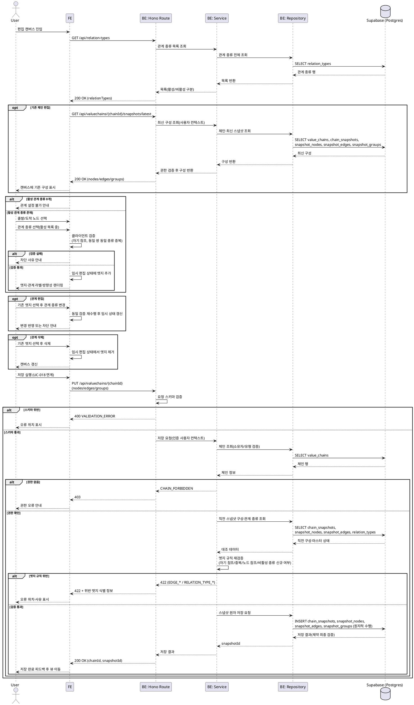

# UC-016: 관계(엣지) 설정/편집/삭제

> `docs/userflow.md` 016번 기능의 상세 유스케이스. 편집 캔버스에서 두 노드 간 관계(엣지)를 활성화된 관계 종류 중에서 선택해 설정하고, 기존 관계를 변경·삭제한다. 편집은 클라이언트 임시 편집 상태에 반영되며, 영속화는 저장(UC-018, 공식 체인은 UC-021) 시점에 새 스냅샷의 일부로 수행된다.

---

## 1. Primary Actor

- **User** (로그인 사용자, 해당 사용자 체인의 소유자)
- **Admin** (공식 체인 편집 시 동일 로직 재사용 — UC-021 연계, 서버 측 role 검증)

## 2. Precondition (사용자 관점)

- 로그인 상태이다.
- 편집 권한이 있는 밸류체인의 편집 캔버스에 진입해 있다.
  - 사용자 체인: 본인 소유 체인의 편집 화면(`/valuechains/[chainId]/edit`) 또는 신규 생성 캔버스(UC-013/014).
  - 공식 체인: Admin이 어드민 공식 체인 편집 화면에 진입(UC-021).
- 관계를 연결할 노드가 캔버스에 2개 이상 존재한다(UC-015에서 추가).

## 3. Trigger

- (설정) 사용자가 캔버스에서 출발 노드와 도착 노드를 선택하고 관계 설정 상호작용을 시작한다.
- (편집) 사용자가 기존 엣지를 선택하고 관계 종류 변경 상호작용을 시작한다.
- (삭제) 사용자가 기존 엣지를 선택하고 삭제 상호작용을 실행한다.

## 4. Main Scenario

1. 사용자가 편집 캔버스에 진입하면, 시스템은 관계 종류 마스터 목록(활성/비활성 구분 포함)을 로드한다.
   - 기존 체인 편집이면 최신 스냅샷의 노드/엣지/그룹 구성도 함께 로드해 캔버스에 표시한다.
2. 사용자가 캔버스에서 출발 노드와 도착 노드(두 노드)를 선택한다.
3. 시스템은 **활성화된(is_active=true) 관계 종류만** 선택 가능한 목록으로 제시한다.
4. 사용자가 관계 종류를 선택한다.
5. 시스템은 클라이언트 측에서 관계 규칙을 검증한다.
   - 자기 참조(동일 노드 간) 여부.
   - 동일 노드 쌍 + 동일 관계 종류의 중복 여부(무향 관계는 역방향 쌍도 동일 쌍으로 간주).
6. 검증 통과 시 임시 편집 상태에 엣지를 추가하고, 캔버스에 관계 종류 라벨과 방향성(관계 종류 마스터의 유향/무향 속성에 따름)을 반영한다.
7. (편집) 사용자가 기존 엣지를 선택해 관계 종류를 변경하면, 5단계와 동일한 검증 후 임시 편집 상태를 갱신한다. 유향 관계의 방향 반전은 기존 엣지 제거 + 반대 방향 엣지 추가와 동등하게 처리한다.
8. (삭제) 사용자가 기존 엣지를 선택해 삭제하면, 임시 편집 상태에서 해당 엣지를 제거한다.
9. 사용자가 저장(UC-018)을 실행하면, 서버는 엣지 규칙(자기 참조·중복·노드 참조 유효성·비활성 관계 종류의 신규 사용 여부)을 재검증한 뒤, 노드/엣지/그룹 전체 구성을 새 스냅샷 1건으로 영속화한다.
10. 저장 완료 피드백 후 뷰 페이지로 이동하며, 캔버스에 반영된 엣지 구성이 확정된다.

## 5. Edge Cases

| # | 상황 | 처리 |
|---|------|------|
| E1 | 자기 참조(출발=도착 동일 노드) 엣지 시도 | 클라이언트에서 차단 + 안내. 서버 저장 시에도 재검증(422)하며, DB CHECK 제약으로 최종 방어 |
| E2 | 동일 노드 쌍에 같은 관계 종류 중복 추가 | 차단 + 안내(무향 관계는 역방향 쌍 포함). 서버 재검증(422) 및 DB 유니크 제약으로 방어 |
| E3 | 동일 노드 쌍에 서로 다른 관계 종류 병존 | 허용(정상 케이스, 예: 공급 + 지분투자) |
| E4 | 편집 세션 중 선택하려던 관계 종류가 비활성화됨(UC-024) | 신규 선택 차단. 이미 존재하던 엣지(직전 스냅샷에 동일 엣지 존재)는 유지·저장 허용, 비활성 종류의 **신규** 엣지만 저장 시 거부(422) |
| E5 | 한쪽 노드가 삭제됨(UC-015 연계) | 해당 노드에 연결된 엣지를 임시 편집 상태에서 자동 정리 |
| E6 | 활성 관계 종류가 0개(마스터 전부 비활성) | 관계 설정 불가 안내(선택 UI 비활성화) |
| E7 | 요청에 존재하지 않는 노드/관계 종류 참조 | 서버 저장 시 검증 실패(422), 오류 위치 표시 |
| E8 | 비소유자(사용자 체인)/비Admin(공식 체인)의 저장 시도 | 서버 측 권한 검증으로 거부(403), 클라이언트 우회 방지 |
| E9 | 세션 만료 상태에서 저장 | 401 거부, 재로그인 유도(임시 편집 상태는 미저장 손실 경고 — UC-018 정책) |
| E10 | 관계 종류 마스터 로드 실패(네트워크/서버 오류) | 오류 안내 + 재시도 유도, 관계 설정 UI 비활성화 |
| E11 | 저장과 관계 종류 비활성화가 동시에 발생 | 저장 시점의 마스터 상태 기준으로 서버가 판정(E4 규칙 적용) |

## 6. Business Rules

### 6.1 관계 규칙

- **BR-1**: 엣지는 반드시 동일 체인(동일 스냅샷) 내 서로 다른 두 노드를 연결한다. 자기 참조 불허.
- **BR-2**: 동일 노드 쌍에 **같은 관계 종류는 1개만** 허용한다. 무향(is_directed=false) 관계는 (A,B)와 (B,A)를 동일 쌍으로 간주해 중복을 판정한다.
- **BR-3**: 동일 노드 쌍에 **서로 다른 관계 종류의 병존은 허용**한다.
- **BR-4**: 신규 엣지의 관계 종류는 활성(is_active=true) 마스터에서만 선택할 수 있다. 비활성 종류를 참조하는 **기존 엣지**(직전 스냅샷에 동일한 노드 쌍+관계 종류 엣지가 존재)는 유지·재저장이 허용된다. 직전 스냅샷 대조 시 노드 동일성은 상장기업 노드=연결 종목(security) 기준, 자유 주체 노드=노드 정체성 기준으로 판별한다.
- **BR-5**: 엣지의 방향성 표시는 관계 종류 마스터의 방향성 속성(유향/무향)을 따른다. 엣지 자체에 방향 속성을 두지 않는다.
- **BR-6**: 관계 종류 라벨은 항상 마스터의 최신 이름을 표시한다(이름 변경 이력은 표시하지 않음 — UC-024 정책).
- **BR-7**: 엣지 편집(설정/변경/삭제)은 임시 편집 상태에만 반영되며, **확정은 저장(UC-018) 시점**이다. 자동 저장은 없다.
- **BR-8**: 저장 1회 = 스냅샷 1건(불변). 엣지의 변경/삭제는 기존 레코드 수정이 아니라 **새 스냅샷의 엣지 구성에 포함 여부**로 표현된다(이벤트 소싱). 공식 체인 저장은 구조 변경 이벤트(change_source=admin_edit)로 기록된다(UC-021).
- **BR-9**: 클라이언트 검증(즉시 피드백)과 무관하게, 서버는 저장 시 모든 엣지 규칙을 재검증한다(클라이언트 우회 방지).

### 6.2 API Specification

> 계층: Hono Route(`route.ts`, HTTP 파싱/검증) → Service(`service.ts`, 비즈니스 규칙) → Repository(`repository.ts`, Supabase 접근). 응답 스키마는 요청/응답 DTO를 분리 정의한다.

#### API-1. 관계 종류 목록 조회

| 항목 | 내용 |
|---|---|
| 엔드포인트 | `GET /api/relation-types` |
| 권한 | 로그인 사용자(User/Admin) |
| Query | `active` (선택, boolean) — `true`이면 활성 종류만 반환. 미지정 시 전체 반환(기존 엣지의 비활성 종류 라벨 렌더링용) |

Response `200 OK`:

```json
{
  "relationTypes": [
    { "id": "uuid", "name": "공급", "isDirected": true, "isActive": true },
    { "id": "uuid", "name": "경쟁", "isDirected": false, "isActive": true }
  ]
}
```

에러:

| HTTP | code | 설명 |
|---|---|---|
| 401 | `UNAUTHORIZED` | 미로그인/세션 만료 |
| 500 | `INTERNAL_ERROR` | 마스터 조회 실패(E10) |

#### API-2. 편집 대상 체인 최신 구성 조회 (기존 체인 편집 진입 시)

| 항목 | 내용 |
|---|---|
| 엔드포인트 | `GET /api/valuechains/{chainId}/snapshots/latest` |
| 권한 | 사용자 체인=소유자 본인, 공식 체인=Admin(편집 목적 진입) |

Response `200 OK` (발췌 — 엣지 관련 필드 중심):

```json
{
  "snapshotId": "uuid",
  "effectiveAt": "2026-07-05T09:00:00+09:00",
  "nodes": [ { "id": "uuid", "nodeKind": "listed_company", "securityId": "uuid", "groupId": null } ],
  "edges": [
    { "id": "uuid", "sourceNodeId": "uuid", "targetNodeId": "uuid", "relationTypeId": "uuid" }
  ],
  "groups": [ { "id": "uuid", "name": "소재" } ]
}
```

에러:

| HTTP | code | 설명 |
|---|---|---|
| 401 | `UNAUTHORIZED` | 미로그인 |
| 403 | `CHAIN_FORBIDDEN` | 비소유자/비Admin 접근(E8) |
| 404 | `CHAIN_NOT_FOUND` | 존재하지 않거나 삭제(보관)된 체인 |

#### API-3. 밸류체인 저장 — 엣지 계약 부분 (UC-018/UC-021 공유 계약)

> 저장 API 전체 계약은 UC-018(사용자 체인)·UC-021(공식 체인) 소관이며, 본 유스케이스는 그중 **edges 페이로드와 엣지 검증 계약**을 정의한다.

| 항목 | 내용 |
|---|---|
| 엔드포인트 | `POST /api/valuechains` (신규 생성 저장) / `PUT /api/valuechains/{chainId}` (기존 체인 저장) |
| 권한 | 사용자 체인=소유자 본인, 공식 체인=Admin |

Request Body (엣지 관련 발췌 — 스냅샷 노드는 저장마다 새로 생성되므로 요청 내 임시 키 `clientKey`로 참조):

```json
{
  "nodes": [
    { "clientKey": "n1", "nodeKind": "listed_company", "securityId": "uuid", "positionX": 0, "positionY": 0 },
    { "clientKey": "n2", "nodeKind": "free_subject", "subjectName": "소비자", "subjectType": "consumer" }
  ],
  "edges": [
    { "sourceNodeKey": "n1", "targetNodeKey": "n2", "relationTypeId": "uuid" }
  ]
}
```

Response `201 Created`(신규) / `200 OK`(갱신):

```json
{ "chainId": "uuid", "snapshotId": "uuid", "effectiveAt": "2026-07-05T09:00:00+09:00" }
```

에러 (엣지 관련):

| HTTP | code | 설명 |
|---|---|---|
| 400 | `VALIDATION_ERROR` | 요청 스키마 위반(필수 필드 누락/타입 오류) |
| 401 | `UNAUTHORIZED` | 미로그인/세션 만료(E9) |
| 403 | `CHAIN_FORBIDDEN` | 비소유자/비Admin(E8) |
| 404 | `CHAIN_NOT_FOUND` | 대상 체인 없음 |
| 422 | `EDGE_SELF_REFERENCE` | 자기 참조 엣지(E1) |
| 422 | `EDGE_DUPLICATE_RELATION` | 동일 노드 쌍+동일 관계 종류 중복(무향 역방향 포함, E2) |
| 422 | `EDGE_NODE_REF_INVALID` | 요청 내 존재하지 않는 노드 clientKey 참조(E7) |
| 422 | `RELATION_TYPE_NOT_FOUND` | 존재하지 않는 관계 종류 ID(E7) |
| 422 | `RELATION_TYPE_INACTIVE_FOR_NEW_EDGE` | 비활성 관계 종류로 신규 엣지 생성 시도(E4) |
| 409 | `SAVE_CONFLICT` | 동시 편집/버전 충돌(UC-018 정책) |

- 422 응답 본문에는 위반 엣지의 식별 정보(`sourceNodeKey`/`targetNodeKey`/`relationTypeId`)를 포함해 클라이언트가 오류 위치를 표시할 수 있게 한다.

### 6.3 Database Operations

| 테이블 | 작업 | 목적 |
|---|---|---|
| `relation_types` | SELECT | 관계 종류 목록(id/name/is_directed/is_active) 조회 — API-1, 저장 시 활성 여부 재검증 |
| `value_chains` | SELECT | 체인 존재·소유자·체인 유형(official/user) 검증 — API-2/3 |
| `chain_snapshots` | SELECT | 최신(직전) 스냅샷 식별 — 편집 초기 로드, 비활성 종류 기존 엣지 유지 판별(BR-4) |
| `chain_snapshots` | INSERT | 저장 시 새 스냅샷 1건 생성(change_source=user_save 또는 admin_edit) |
| `snapshot_nodes` | SELECT | 직전 스냅샷 노드 조회(노드 동일성 대조) — BR-4 |
| `snapshot_nodes` | INSERT | 새 스냅샷의 노드 일괄 저장(UC-015 연계) |
| `snapshot_edges` | SELECT | 직전 스냅샷 엣지 조회(비활성 종류 유지 대조) — BR-4 |
| `snapshot_edges` | INSERT | 새 스냅샷의 엣지 일괄 저장(source/target_node_id, relation_type_id) |
| `snapshot_groups` | INSERT | 새 스냅샷의 그룹 저장(UC-017 연계, 스냅샷 원자 저장의 일부) |

- **UPDATE/DELETE 없음**: 스냅샷 테이블은 불변이다. 엣지 편집·삭제는 새 스냅샷 구성에서의 포함 여부로 표현되며, 스냅샷+노드+엣지+그룹 저장은 하나의 원자적 단위(Postgres 함수/RPC)로 수행한다.
- DB 제약 활용: `snapshot_edges`의 자기 참조 CHECK, `uq(snapshot_id, source_node_id, target_node_id, relation_type_id)` 유니크, 복합 FK(엣지의 source/target 노드가 반드시 동일 스냅샷 소속), `relation_type_id ON DELETE RESTRICT`(마스터 물리 삭제 금지). 무향 관계의 역방향 중복은 DB 유니크가 방향을 구분하므로 **Service 계층에서 쌍 정규화 후 판정**한다.

### 6.4 External Service Integration

- **없음.** 본 기능은 자체 DB(관계 종류 마스터, 스냅샷 테이블)만 사용하며 외부 API 호출이 발생하지 않는다(PRD 전역 정책: 외부 API는 배치 적재 전용).

## 7. Sequence Diagram



## 8. 관련 유스케이스

- **UC-015 노드 추가/삭제**: 노드 삭제 시 연결 엣지 자동 정리(E5).
- **UC-017 노드 그루핑**: 저장 시 그룹 구성이 동일 스냅샷에 포함.
- **UC-018 밸류체인 저장**: 엣지 확정·스냅샷 기록의 실행 지점(저장 API 전체 계약 소관).
- **UC-021 공식 밸류체인 관리**: Admin의 공식 체인 편집에서 본 로직 재사용(구조 변경 이벤트 기록).
- **UC-024 관계 종류 마스터 관리**: 활성/비활성 상태가 신규 선택 가능 여부를 결정(E4/BR-4).
