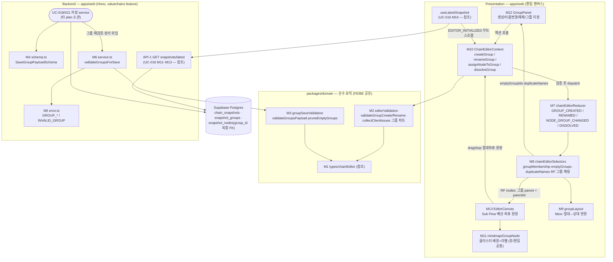

# Plan: UC-017 노드 그루핑

> 근거: `docs/usecases/017/spec.md`, `docs/usecases/000_decisions.md`(C-1·C-2·D-5 — spec과 충돌 시 우선), `docs/techstack.md` §4(모노레포 Codebase Structure — SOT), `docs/database.md` §3.3(snapshot_groups/snapshot_nodes 복합 FK), `docs/pages/chain-editor/state_management.md`(편집 캔버스 상태 설계의 단일 원천 — 본 plan은 그 설계를 그대로 따른다), `supabase/migrations/0006_chain_snapshots.sql`(기존 스키마 — **신규 마이그레이션 없음**), `.claude/skills/spec_to_plan/references/hono-backend-guide.md`, 선행 plan: `docs/usecases/013/plan.md`(Flux 코어 뼈대)·`015/plan.md`(노드)·`016/plan.md`(엣지·API-1 조회).
>
> **범위**: 본 UC가 소유하는 것은 ① 그룹 편집 검증 순수 함수(editorValidation 그룹 파트), ② 저장 시 그룹 검증·빈 그룹 정리 순수 모듈(UC-018/021 저장 service가 소비), ③ valuechains feature의 그룹 계약 기여분(스키마·에러 코드·검증 헬퍼), ④ 편집 캔버스의 그룹 상호작용 FE 모듈(리듀서/셀렉터/Context 그룹 기여분 + GroupPanel/GroupNode)이다. **저장 API 전체(POST/PUT 본문·트랜잭션 RPC)는 UC-018(사용자)·UC-021(공식) plan 소관**이며, 편집 진입용 최신 구성 조회 API(API-1)는 **UC-016 plan(M9~M13)이 이미 groups 포함 계약으로 소유** — 본 plan은 신규 백엔드 엔드포인트를 만들지 않는다.
> **외부 서비스 연동 없음**(spec §6.4) — 자체 DB(스냅샷 계열 테이블)만 사용하므로 외부 클라이언트 모듈·재시도/타임아웃 설계 대상이 없다.

---

## 사전 정합화 결정 (spec 간 충돌 해소 — 구현 시 이 표를 따름)

| # | 충돌/모호 | 결정 | 근거 |
|---|---|---|---|
| G-1 | 저장 페이로드 그룹 필드명: UC-017 spec은 `clientKey`/`groupKey`, UC-018 §6.2는 `clientGroupId`(그룹)/`groupClientId`(노드의 그룹 참조) | **UC-018 필드명으로 통일**(`clientGroupId`·`groupClientId`) | UC-018이 저장 계약 소유. UC-016 plan R-3(엣지 필드명 통일)과 동일 원칙. `state_management.md` §2.1도 동일 명명 |
| G-2 | 저장 422 에러 코드: UC-017은 세분 코드(`GROUP_NAME_REQUIRED`/`GROUP_KEY_DUPLICATE`/`GROUP_REF_INVALID`), UC-018은 통합 코드(`VALUECHAINS.INVALID_GROUP`) | 공유 검증 모듈(M3)은 **세분 사유 + 위반 요소 식별 정보**를 반환하고, 저장 service가 응답 코드로 매핑한다 — 사용자 체인: UC-018 통합 코드 `INVALID_GROUP`(세분 사유는 `error.details.reason`), 공식 체인(UC-021): 세분 코드 그대로 | UC-016 plan R-4와 동일 원칙 — 양 spec 무수정 정합. FE `ServerIssue` 정규화는 `details`의 `clientGroupIds`/`clientNodeIds`만 사용하므로 영향 없음 |
| G-3 | API-1 권한 오류: UC-017 spec은 비소유자에 403 `CHAIN_FORBIDDEN` | **사용자 체인 + 비소유자 → 404 `CHAIN_NOT_FOUND`**(존재 비노출), **공식 체인 + 비Admin → 403 `CHAIN_FORBIDDEN`** | 000_decisions C-2 + UC-016 plan R-2(동일 엔드포인트의 기확정 계약 — 본 plan은 따르기만 함) |
| G-4 | 빈 그룹 처리: D-5 "그룹 유지(자동 정리 없음)" vs UC-017 BR-6 "저장 시 스냅샷에서 제외" | **둘 다 유효 — 적용 시점이 다름**: 편집 중에는 빈 그룹을 캔버스에 유지(D-5·E4, 라벨만 있는 빈 클러스터로 표시 — C-1)하고, 저장 시 서버가 소속 노드 0개 그룹을 스냅샷에서 제외한다(BR-6, 오류 아님). FE는 `emptyGroupIds` 파생으로 "저장 시 제외" 예고 안내 | D-5는 UC-015의 편집 중 삭제 케이스(E8)에 대한 결정, BR-6은 영속화 규칙 — 충돌 아님. 결과적으로 영속 스냅샷에는 빈 그룹이 없으므로 저장 후 재편집 시 빈 그룹은 소멸 상태(예고 안내로 UX 보완) |
| G-5 | 그룹 캔버스 표현 | `state_management.md` §4.4·§8.2대로 **React Flow Sub Flow**(그룹=parent 노드, 소속 노드=`parentId`) 채택. 단, 문서 상태의 좌표는 **절대 좌표가 단일 원천**(스냅샷 `position_x/y` 영속과 일치)이고 React Flow 자식 좌표는 상대 좌표이므로, 절대↔상대 변환은 렌더 계층(M9 groupLayout)에서만 수행한다. 그룹 parent 노드는 좌표·크기를 멤버 bounding box에서 파생하며 **비드래그**(`draggable:false` — 그룹 좌표는 비영속·파생값이므로 이동 개념 없음) | state 문서가 단일 원천. DB에 그룹 좌표 컬럼 없음(database.md §3.3) — 그룹 위치는 항상 파생 |
| G-6 | 노드의 그룹 이동 상호작용 | MVP는 **명시적 UI(GroupPanel의 그룹 지정/제외 + 그룹 생성 시 자동 이동)** 로 한정. 드래그로 그룹 영역에 끌어넣는 제스처는 비범위(YAGNI — spec Trigger는 상호작용 방식을 강제하지 않음) | 오버엔지니어링 방지(techstack 설계 원칙 4). Sub Flow `extent:'parent'`도 설정하지 않음(자식 드래그 자유 이동 허용) |

---

## 개요

| # | 모듈 | 위치 | 설명 |
| --- | --- | --- | --- |
| **공유 — packages/domain (순수 로직, FE/BE 공용)** | | | |
| M1 | 편집 도메인 타입 | `packages/domain/types/chainEditor.ts` | `EditorGroup`·`EditorNode.groupClientId` 등 — **[참조] UC-013 plan이 파일 전체 소유**. 본 UC는 소비만(신규 타입 없음) |
| M2 | 그룹 편집 검증(클라이언트 규칙) | `packages/domain/valuechains/editorValidation.ts` | `validateGroupCreate`·`validateGroupRename` + `collectClientIssues`의 그룹 파트. **공유 파일의 본 UC 소유분**(노드=015, 엣지=016, 일괄 조립=018) |
| M3 | 그룹 저장 검증·정리(서버 재검증) | `packages/domain/valuechains/groupSaveValidation.ts` | `validateGroupsPayload`(E2/E7/E8) + `pruneEmptyGroups`(BR-6). **본 UC 소유** — UC-018/021 저장 service가 소비 |
| **백엔드 — valuechains feature (공유 feature — 본 UC 기여분: 그룹 저장 계약)** | | | |
| M4 | 스키마(기여분) | `apps/web/src/features/valuechains/backend/schema.ts` | `SaveGroupPayloadSchema` + 노드 페이로드의 `groupClientId` 필드 계약. `LatestSnapshotResponse`의 `groups[]`/`nodes[].groupId`는 UC-016 plan M9 기소유 — 검증만 |
| M5 | 에러 코드(기여분) | `apps/web/src/features/valuechains/backend/error.ts` | 그룹 검증 에러 코드 4종(세분 3 + 통합 1) |
| M6 | 서비스(기여분) | `apps/web/src/features/valuechains/backend/service.ts` | `validateGroupsForSave`(M3 위임 + G-2 코드 매핑) + `pruneEmptyGroups` 위임 헬퍼 — UC-018/021 저장 service가 호출 |
| — | API-1 최신 구성 조회 | `apps/web/src/features/valuechains/backend/{repository,service,route}.ts` | `GET /api/valuechains/:chainId/snapshots/latest` — **[참조] UC-016 plan M11~M13 소유**(groups/nodes.groupId 포함 계약 기확정). 본 UC는 신규 백엔드 없음 |
| **프론트엔드 — 편집 상태 (chain-editor state 문서 설계 준수, 공유 파일 기여)** | | | |
| M7 | 리듀서(그룹 기여분) | `apps/web/src/features/valuechains/editor/state/chainEditorReducer.ts` | `GROUP_CREATED`·`GROUP_RENAMED`·`NODE_GROUP_CHANGED`·`GROUP_DISSOLVED` 전이. **공유 모듈**(뼈대=013) |
| M8 | 셀렉터(그룹 기여분) | `apps/web/src/features/valuechains/editor/state/chainEditorSelectors.ts` | `selectGroupMembership`·`selectEmptyGroupIds`·`selectDuplicateGroupNames` + `selectReactFlowNodes`의 그룹(Sub Flow) 확장. **공유 모듈** |
| M9 | 그룹 레이아웃 헬퍼 | `apps/web/src/features/valuechains/editor/lib/groupLayout.ts` | 멤버 bounding box 산출·절대↔상대 좌표 변환·빈 그룹 폴백 배치(순수 함수). **본 UC 소유** |
| M10 | Context(그룹 기여분) | `apps/web/src/features/valuechains/editor/context/ChainEditorContext.tsx` | `createGroup`·`renameGroup`·`assignNodeToGroup`·`dissolveGroup` 액션 + `groupCount`·`groupMembership`·`emptyGroupIds`·`duplicateGroupNames` computed. **공유 모듈**(셸=013) |
| **프론트엔드 — Presentation** | | | |
| M11 | 그룹 노드 렌더러 | `apps/web/src/components/mindmap/GroupNode.tsx` | React Flow 커스텀 그룹 노드(클러스터 배경 + 라벨). 뷰(UC-009)/편집 **공용 프레젠테이션 — 본 UC 소유** |
| M12 | 그룹 패널 | `apps/web/src/features/valuechains/editor/components/GroupPanel.tsx` | 그룹 생성/이름 변경/해제/노드 그룹 지정·제외 UI + 중복 이름·빈 그룹 안내. **본 UC 소유** |
| M13 | 캔버스(그룹 기여분) | `apps/web/src/features/valuechains/editor/components/EditorCanvas.tsx` | 그룹 nodeTypes 등록, 자식 노드 드래그 절대좌표 환원, 그룹 선택/삭제 키 배선. **공유 컴포넌트 수정**(셸=013, 노드=015, 엣지=016) |
| **공유 — 인프라·훅 (참조만, 본 UC 신규 정의 없음)** | | | |
| — | 최신 구성 쿼리 훅 | `apps/web/src/features/valuechains/editor/hooks/useLatestSnapshot.ts` | UC-016 plan M16 소유. 응답 `groups[]`/`nodes[].groupId`를 부트스트랩이 소비 |
| — | 부트스트랩 변환 | `apps/web/src/features/valuechains/editor/hooks/useEditorBootstrap.ts` | UC-013(create)/014·018(edit) 소유. 그룹 변환 계약만 본 plan §M10에 명시 |
| — | API 클라이언트/Hono 인프라 | `apps/web/src/lib/http/apiClient.ts`, `apps/web/src/backend/*` | 공통 인프라 — 위치만 참조 |

- **DB 마이그레이션 신규 없음**: `snapshot_groups`(0006)의 `uq(id, snapshot_id)`와 복합 FK `snapshot_nodes.(group_id, snapshot_id) → snapshot_groups(id, snapshot_id)`가 이미 E6(타 체인/타 스냅샷 그룹 참조)의 최종 방어선이다. 그룹 이름 유니크 제약 없음(중복 허용 — BR-4). 저장 RPC(`save_user_chain` 등)의 `clientGroupId → snapshot_groups.id` 매핑 INSERT는 UC-018/021 plan 소관.
- **워커(apps/worker) 변경 없음**, **외부 연동 없음**.

## Diagram



데이터 흐름: Presentation(M11~M13) → 액션 함수(M10, M2로 사전 검증) → Reducer(M7) → 셀렉터(M8, M9로 레이아웃 파생) → View. 저장 시 서버는 동일 구조 규칙을 M3(M6 경유)로 재검증(BR-9)하고 빈 그룹을 정리(BR-6)한 뒤, DB 복합 FK가 최종 방어(E6)한다. 그루핑 전용 서버 쓰기는 없다(BR-7 — 확정은 UC-018 저장 시점).

---

## Implementation Plan

### M1. 편집 도메인 타입 — `packages/domain/types/chainEditor.ts` [참조 — UC-013 소유]

- 구현 내용:
  1. 본 UC 신규 타입 없음. UC-013 plan이 확정한 다음 정의를 소비한다: `EditorGroup { clientGroupId: string; name: string }`(소속 노드 목록은 파생 — 그룹 쪽 중복 보관 금지), `EditorNodeBase.groupClientId: string | null`(소속의 단일 소스, 0..1 — BR-2의 구조적 표현), `EditorSelection`.
  2. 구현 착수 시 위 필드가 state_management §2.1과 일치하는지 확인만 수행(불일치 시 013 plan 기준으로 정정).
- 의존성: 없음.
- Unit Tests: 해당 없음(`npm run typecheck`로 검증).

### M2. 그룹 편집 검증 — `packages/domain/valuechains/editorValidation.ts` (공유 파일, 그룹 파트 기여)

- 구현 내용:
  1. state 문서 §4.3의 `GroupBlockReason = 'NAME_REQUIRED' | 'NO_NODES_SELECTED' | 'GROUP_NOT_FOUND'` export(파일 내 그룹 파트).
  2. `validateGroupCreate(input: { name: string; memberNodeIds: string[] }): GroupBlockReason | null` — 판정 순서:
     - `name.trim() === ''` → `'NAME_REQUIRED'`(E2·BR-4)
     - `memberNodeIds.length === 0` → `'NO_NODES_SELECTED'`(BR-6 전반부 — 그룹 생성은 노드 1개 이상 선택으로 시작)
     - 통과 → `null`. **이름 중복은 검사하지 않는다**(E3 — 허용, 알림은 `selectDuplicateGroupNames` 파생 소관).
  3. `validateGroupRename(state: Pick<ChainEditorState, 'groups'>, clientGroupId: string, name: string): GroupBlockReason | null` — ① `groups[clientGroupId]` 미존재 → `'GROUP_NOT_FOUND'` ② `name.trim() === ''` → `'NAME_REQUIRED'` ③ 통과 → `null`.
  4. `collectClientIssues`의 **그룹 파트** 기여(일괄 조립 함수 자체는 UC-018 plan 소유 — 함수 단위 append): 저장 전 일괄 검증에서 ① 노드의 `groupClientId`가 `groups`에 존재하지 않으면 `{ code: 'INVALID_GROUP', targets: { clientNodeIds } }` ② 그룹 이름 공백이면 `{ code: 'INVALID_GROUP', targets: { clientGroupIds } }`로 수집한다. **빈 그룹은 이슈가 아니다**(BR-6 — 저장 차단 사유 아님, 예고 안내는 `emptyGroupIds`).
  5. 프레임워크 의존 금지(React/Supabase import 없음) — UC-018 서버 재검증과 공유 가능해야 한다.
- 의존성: M1.
- **Unit Tests** (Vitest, `packages/domain`):
  - [ ] `validateGroupCreate({ name: '소재', memberNodeIds: ['n1'] })` → `null`
  - [ ] 이름 빈 문자열/공백만(`'   '`) → `'NAME_REQUIRED'`
  - [ ] `memberNodeIds: []` → `'NO_NODES_SELECTED'`
  - [ ] 이름 공백 + 선택 0개 동시 위반 → `'NAME_REQUIRED'`(판정 순서 결정성)
  - [ ] 기존 그룹과 동일한 이름으로 생성 → `null`(중복 허용 — E3)
  - [ ] `validateGroupRename`: 미존재 그룹 → `'GROUP_NOT_FOUND'` / 존재 + 공백 이름 → `'NAME_REQUIRED'` / 존재 + 유효 이름 → `null`
  - [ ] 그룹 파트 이슈 수집: 미존재 그룹 참조 노드 2건 → `clientNodeIds`에 두 건 모두 수집
  - [ ] 그룹 파트 이슈 수집: 빈 그룹(참조 노드 0) → 이슈 미생성 / `groupClientId=null` 노드 → 이슈 미생성

### M3. 그룹 저장 검증·정리 — `packages/domain/valuechains/groupSaveValidation.ts` (본 UC 소유)

- 구현 내용:
  1. 서버 저장 재검증(BR-9) + 빈 그룹 정리(BR-6) 전용 순수 모듈. 시그니처:
     ```ts
     export interface SaveGroupPayload { clientGroupId: string; name: string }
     export interface GroupNodeRef { clientNodeId: string; groupClientId: string | null }

     export interface GroupSaveViolation {
       reason: 'GROUP_NAME_REQUIRED' | 'GROUP_KEY_DUPLICATE' | 'GROUP_REF_INVALID';
       clientGroupIds: string[];      // 위반 그룹 식별(NAME_REQUIRED/KEY_DUPLICATE)
       clientNodeIds: string[];       // 위반 노드 식별(REF_INVALID)
     }

     export function validateGroupsPayload(input: {
       groups: ReadonlyArray<SaveGroupPayload>;
       nodes: ReadonlyArray<GroupNodeRef>;
     }): GroupSaveViolation[];

     /** 소속 노드 0개 그룹 제외 — 검증 통과 후 호출(BR-6, 오류 아님) */
     export function pruneEmptyGroups(
       groups: ReadonlyArray<SaveGroupPayload>,
       nodes: ReadonlyArray<GroupNodeRef>,
     ): { groups: SaveGroupPayload[]; prunedGroupIds: string[] };
     ```
  2. `validateGroupsPayload` 판정 규칙(위반은 전부 수집 — 첫 건에서 중단하지 않음, FE 일괄 하이라이트용):
     - `name.trim() === ''`인 그룹 → `GROUP_NAME_REQUIRED`(E2)
     - `clientGroupId` 요청 내 중복 → `GROUP_KEY_DUPLICATE`(E8) — 중복된 키를 가진 모든 그룹 수집
     - 노드의 `groupClientId`가 non-null인데 `groups[]`에 없음 → `GROUP_REF_INVALID`(E7 — 타 체인 그룹 참조도 요청 스코프 키 참조 구조상 여기에 해당, E6)
     - `groupClientId: null`은 정상(그룹 미소속). 빈 그룹은 위반 아님.
  3. `pruneEmptyGroups`: 어떤 노드도 참조하지 않는 그룹을 제거해 반환(입력 비변이 — 새 배열). 검증 **후** 호출을 전제(빈 그룹이라도 이름 공백/키 중복은 먼저 422 — 우회 요청 방어의 결정성 확보).
  4. 한 노드의 그룹 참조가 단일 필드(`groupClientId`)이므로 다중 소속·중첩 검증은 불필요(BR-2 — 표현 자체 불가, 모듈 주석으로 명시).
- 의존성: M1(타입 참고 — 자체 페이로드 타입은 파일 내 정의로 프레임워크 독립 유지).
- **Unit Tests**:
  - [ ] 정상 페이로드(그룹 2, 노드가 각각 참조) → 위반 0건
  - [ ] 이름 공백 그룹 → `GROUP_NAME_REQUIRED` + 해당 `clientGroupId` 포함
  - [ ] `clientGroupId` 'g1' 2건 → `GROUP_KEY_DUPLICATE` + `clientGroupIds`에 중복 그룹 식별
  - [ ] 노드가 미존재 `groupClientId: 'gx'` 참조 → `GROUP_REF_INVALID` + 해당 `clientNodeIds` 포함
  - [ ] `groupClientId: null` 노드만 존재 → 위반 0건
  - [ ] 복수 위반 혼재(이름 공백 + 참조 위반) → 전부 수집(2건)
  - [ ] `pruneEmptyGroups`: 참조 노드 0개 그룹만 제거, 참조 그룹은 유지, `prunedGroupIds` 정확
  - [ ] `pruneEmptyGroups`: 빈 그룹 없음 → 원본과 동일 구성 반환 / 전 그룹이 빈 그룹 → `groups: []`
  - [ ] `pruneEmptyGroups`: 입력 배열 비변이(불변성)

### M4. valuechains 스키마(기여분) — `apps/web/src/features/valuechains/backend/schema.ts`

- 구현 내용(본 UC 기여분 — UC-016 M9·UC-018 plan이 같은 파일에 공존):
  1. **`SaveGroupPayloadSchema`**(UC-018 §6.2 계약, G-1 필드명): `{ clientGroupId: z.string().min(1), name: z.string() }` — `name`의 **공백 검사는 스키마에서 하지 않는다**(타입/존재 위반=400 `INVALID_REQUEST`, 공백=422 `GROUP_NAME_REQUIRED` — spec 에러 표의 400/422 구분 준수). 저장 본문 전체 스키마(UC-018 plan 소유)가 `groups: z.array(SaveGroupPayloadSchema)`(빈 배열 허용)로 합성한다.
  2. 노드 페이로드(UC-018 plan 소유 `SaveNodePayloadSchema`)의 그룹 필드 계약 확정: `groupClientId: z.string().min(1).nullable()` — 본 UC가 이 필드 정의를 기여한다.
  3. `LatestSnapshotResponseSchema`의 `groups: [{ id, name }]`·`nodes[].groupId: uuid | null`은 UC-016 plan M9 기소유 — 본 UC는 계약 충족 여부만 확인(수정 없음).
  4. `SnapshotGroupRow` Row 스키마(snake_case, 0006과 1:1: `id`, `snapshot_id`, `name`)도 UC-016 M9 기소유 — 참조만.
- 의존성: M1, UC-016 plan M9.
- Unit Tests: 스키마 정의 전용 — 해당 없음(서비스 테스트에서 간접 검증. 단, `name` 공백이 스키마를 **통과**하는지 1건 확인: 400이 아닌 422 경로 보장).

### M5. valuechains 에러 코드(기여분) — `apps/web/src/features/valuechains/backend/error.ts`

- 구현 내용(본 UC 기여분 — UC-016 M10·UC-018/019/021 plan이 같은 파일에 추가 기여):
  ```ts
  export const valuechainErrorCodes = {
    // ... (UC-016/018 기여분 기존 유지)
    // 저장 그룹 검증(본 UC 계약 — 저장 service가 G-2 매핑에 사용)
    groupNameRequired: 'VALUECHAINS.GROUP_NAME_REQUIRED',   // 422 (E2)
    groupKeyDuplicate: 'VALUECHAINS.GROUP_KEY_DUPLICATE',   // 422 (E8)
    groupRefInvalid:   'VALUECHAINS.GROUP_REF_INVALID',     // 422 (E7·E6)
    invalidGroup:      'VALUECHAINS.INVALID_GROUP',         // 422 — UC-018 사용자 저장 통합 코드
  } as const;
  ```
  G-2 매핑 규칙을 파일 주석으로 명시: 사용자 체인 저장 → `invalidGroup`(세분 사유는 `details.reason`), 공식 체인 저장 → 세분 코드 그대로. 422 `details`에는 항상 위반 요소 식별 정보(`clientGroupIds`/`clientNodeIds` — spec §6.2 "오류 위치 표시" 계약)를 포함한다.
- 의존성: 없음.
- Unit Tests: 상수 정의 — 해당 없음.

### M6. valuechains 서비스(기여분) — `apps/web/src/features/valuechains/backend/service.ts`

- 구현 내용(본 UC 기여 헬퍼 — 저장 service 본문은 UC-018/021 plan 소유):
  1. **`validateGroupsForSave(input: { groups: SaveGroupPayload[]; nodes: GroupNodeRef[]; variant: 'user' | 'official' }): HandlerResult<void, ...> 형태의 failure | null`** — M3 `validateGroupsPayload` 위임 후:
     - 위반 없음 → `null`(통과).
     - 위반 존재 → `failure(422, code, message, details)` 구성. `code`는 G-2 매핑: `variant='user'` → `invalidGroup`, `variant='official'` → 세분 코드(복수 사유 혼재 시 우선순위 `GROUP_KEY_DUPLICATE` > `GROUP_NAME_REQUIRED` > `GROUP_REF_INVALID`로 대표 코드 1개 결정 — 결정적 응답). `details`에는 **전체 위반 목록**(`[{ reason, clientGroupIds, clientNodeIds }]`)을 담는다.
  2. **`pruneGroupsForSave(groups, nodes)`** — M3 `pruneEmptyGroups` 단순 위임(저장 service가 검증 통과 후 RPC 직전에 호출, `prunedGroupIds`는 서버 로그용). 노드 페이로드는 변경 불필요(빈 그룹은 정의상 참조 노드가 없음).
  3. 호출 지점 계약(UC-018/021 plan이 준수): 저장 service의 구조 재검증 단계에서 노드/엣지 검증(UC-015/016 계약)과 함께 호출 → 실패 시 즉시 422 반환 → 통과 시 prune → RPC 파라미터의 `groups`로 전달. DB 복합 FK는 최종 방어(직접 처리 로직 없음 — RPC 오류 매핑은 UC-018 소관).
  4. 그룹 검증은 DB 조회가 불필요(요청 스코프 자기완결)이므로 repository 의존 없음 — 순수 위임만.
- 의존성: M3, M4, M5, 공통 `response.ts`(참조).
- **Unit Tests**:
  - [ ] 위반 없음 → `null` 반환(저장 계속 진행 가능)
  - [ ] user variant + 이름 공백 → `failure(422, 'VALUECHAINS.INVALID_GROUP')` + `details.violations[0].reason='GROUP_NAME_REQUIRED'` + `clientGroupIds` 포함
  - [ ] official variant + 이름 공백 → `failure(422, 'VALUECHAINS.GROUP_NAME_REQUIRED')`
  - [ ] official variant + 키 중복·참조 위반 혼재 → 대표 코드 `GROUP_KEY_DUPLICATE`, `details`에 위반 2종 전부
  - [ ] user variant + 미존재 그룹 참조 → `invalidGroup` + `details`에 `clientNodeIds`
  - [ ] `pruneGroupsForSave`: 빈 그룹 1 + 유효 그룹 1 → 유효 그룹만 반환, `prunedGroupIds` 1건

### M7. 리듀서 그룹 기여분 — `apps/web/src/features/valuechains/editor/state/chainEditorReducer.ts` (공유)

- 구현 내용(state 문서 §3~4를 그대로 구현 — 본 UC 기여 케이스 4종, 공통 후처리 ⊕: `isDirty=true`·`serverIssues=[]`는 013 뼈대 헬퍼 재사용):
  1. `GROUP_CREATED { clientGroupId, name, memberNodeIds }`: ① `clientGroupId`가 이미 존재하면 no-op(중복 생성 방어) ② `groups[clientGroupId] ← { clientGroupId, name }` ③ `memberNodeIds` 중 **존재하는 노드만** `groupClientId ← clientGroupId`로 덮어씀(**타 그룹 소속이어도 덮어씀 = 자동 이동**, E1·BR-3). 유효 멤버가 0개면 전체 no-op(멱등 가드 — 액션 함수 검증의 이중 방어) ⊕.
  2. `GROUP_RENAMED { clientGroupId, name }`: 미존재 그룹 → no-op. 동일 이름 재입력 → 원본 반환(dirty 미발생 — 013 전이 컨벤션). 그 외 `groups[id].name ← name` ⊕.
  3. `NODE_GROUP_CHANGED { clientNodeId, groupClientId }`: ① 노드 미존재 → no-op ② `groupClientId`가 non-null인데 그룹 미존재 → no-op(state 문서 §4.2 가드) ③ 현재 소속과 동일 값 → 원본 반환 ④ `nodes[nodeId].groupClientId ← payload.groupClientId`(null=제외, 기존 소속 자동 해제는 단일 필드 덮어쓰기로 자연 표현 — Main 8) ⊕.
  4. `GROUP_DISSOLVED { clientGroupId }`: 미존재 → no-op. `groups[id]` 제거 + 소속이던 모든 노드 `groupClientId ← null`(**노드·엣지 유지** — E5·BR-5) ⊕.
  5. 연계 규칙 확인(타 plan 기여분과의 정합 — 구현 없음): `ELEMENTS_DELETED`(UC-015 기여)는 노드만 제거하고 `groups`를 유지한다(빈 그룹 잔존 — D-5·E9). 소속의 단일 소스가 노드 측 `groupClientId`이므로 그룹 측 정리 로직이 불필요함을 테스트로 재확인만 한다.
  6. 순수 함수 유지: ID 발급·검증은 액션 함수(M10) 소관, 불변 갱신.
- 의존성: M1, UC-013 plan #5(리듀서 뼈대·Action union 선언).
- **Unit Tests** (AAA, React 비의존):
  - [ ] `initialized=false`에서 `GROUP_CREATED` → no-op(013 공통 게이트 회귀)
  - [ ] `GROUP_CREATED`(미소속 노드 2개) → 그룹 추가 + 두 노드 `groupClientId` 설정, `isDirty=true`, `serverIssues=[]`, 원본 비변이
  - [ ] `GROUP_CREATED`(타 그룹 g1 소속 노드 포함) → 해당 노드가 새 그룹으로 **자동 이동**(E1), g1은 잔존(빈 그룹이어도 유지 — D-5)
  - [ ] `GROUP_CREATED`(멤버 전부 미존재 ID) → no-op, dirty 불변
  - [ ] `GROUP_CREATED`(기존과 동일 이름) → 정상 생성(중복 허용 — E3)
  - [ ] `GROUP_RENAMED` → 이름만 갱신 ⊕ / 미존재 그룹 → no-op / 동일 이름 → 원본 반환(dirty 미발생)
  - [ ] `NODE_GROUP_CHANGED`(g1→g2) → 소속 교체(기존 소속 자동 해제) / (g1→null) → 미소속 전환, 노드·엣지 불변
  - [ ] `NODE_GROUP_CHANGED`(미존재 그룹 대상) → no-op / (미존재 노드) → no-op
  - [ ] `GROUP_DISSOLVED`(멤버 3개 그룹) → 그룹 제거 + 3개 노드 전부 `groupClientId=null`, 노드·엣지 수 불변(E5)
  - [ ] `ELEMENTS_DELETED`로 그룹의 마지막 멤버 삭제 → 그룹 잔존(빈 그룹 유지 — D-5·E9, UC-015 기여 전이와의 통합 확인)

### M8. 셀렉터 그룹 기여분 — `apps/web/src/features/valuechains/editor/state/chainEditorSelectors.ts` (공유)

- 구현 내용(state 문서 §4.4 시그니처 그대로):
  1. `selectGroupMembership(state): ReadonlyMap<string, string[]>` — `groupClientId → clientNodeIds[]` 역인덱스(노드 측 단일 소스에서 파생). GroupPanel 멤버 수·RF 매핑·빈 그룹 판정의 공통 입력.
  2. `selectEmptyGroupIds(state): string[]` — 멤버 0개 그룹(저장 시 제외 예고 안내 — BR-6·G-4).
  3. `selectDuplicateGroupNames(state): string[]` — `name.trim()` 완전 일치 기준으로 2회 이상 등장하는 이름 목록(**알림용 — 차단 아님**, E3·BR-4).
  4. `selectReactFlowNodes`의 **그룹(Sub Flow) 확장**(기본 노드 매핑은 013/015 기여분 — 본 UC가 그룹 변환 로직 추가):
     - 각 그룹 → RF 노드 `{ id: clientGroupId, type: 'groupNode', position: bounds.position, style: { width, height }, draggable: false, selectable: true, zIndex: 그룹 배경용 낮은 값, data: { name, isEmpty, memberCount, isHighlighted } }` — bounds는 M9 `computeGroupBounds` 위임.
     - 소속 노드 → `parentId: groupClientId` 부여 + `position`을 **절대 → 상대**로 변환(M9 위임). 미소속 노드는 절대 좌표 그대로.
     - **배열 순서: 그룹(parent) 노드를 소속 노드보다 앞에 배치**(React Flow Sub Flow 요구사항).
     - `data.isHighlighted` = `highlight.groupIds` 포함 여부(저장 422 `clientGroupIds` 하이라이트 — spec §6.2).
  5. `selectIssueHighlight`의 `groupIds` 집합 기여(serverIssues/clientIssues의 `targets.clientGroupIds` 수집 — 함수 뼈대는 018 plan 소유, 그룹 파트만 기여).
- 의존성: M1, M7(상태 타입), M9.
- **Unit Tests**:
  - [ ] `groupMembership`: 그룹 2·노드 3(2+1 소속) → 역인덱스 정확, 미소속 노드 미포함
  - [ ] `emptyGroupIds`: 멤버 0개 그룹만 수집 / 전 그룹 유멤버 → 빈 배열
  - [ ] `duplicateGroupNames`: `'소재'`·`'소재 '`(trim 후 동일) → 중복 검출 / 유일 이름 → 미검출
  - [ ] RF 매핑: 소속 노드에 `parentId` 부여 + 상대 좌표 = 절대 − 그룹 위치 / 미소속 노드는 절대 좌표·`parentId` 없음
  - [ ] RF 매핑: 그룹 노드가 배열에서 소속 노드보다 앞 / `draggable=false`
  - [ ] RF 매핑: 빈 그룹 → `data.isEmpty=true` + 폴백 크기(라벨만 있는 빈 클러스터 — C-1)
  - [ ] `highlight.groupIds`에 포함된 그룹 → `data.isHighlighted=true`

### M9. 그룹 레이아웃 헬퍼 — `apps/web/src/features/valuechains/editor/lib/groupLayout.ts` (본 UC 소유)

- 구현 내용(전부 순수 함수 — 상수는 파일 내 export: `GROUP_PADDING`, `GROUP_HEADER_HEIGHT`(라벨 영역), `NODE_DEFAULT_WIDTH/HEIGHT`(bbox 계산용 추정 크기), `EMPTY_GROUP_SIZE`, `EMPTY_GROUP_FALLBACK_ORIGIN/OFFSET`):
  1. `computeGroupBounds(memberPositions: XYPosition[], index: number): { position: XYPosition; width: number; height: number }` — 멤버 절대 좌표들의 bounding box + 패딩·헤더 여백. **멤버 0개(빈 그룹)** 는 `EMPTY_GROUP_SIZE`와 인덱스 기반 스택 폴백 위치를 반환(결정적 — 그룹 좌표는 비영속이므로 파생 배치, G-5. 빈 그룹 전환 시 위치가 폴백으로 이동하는 것은 알려진 MVP 제약으로 주석 명시).
  2. `toRelativePosition(absolute: XYPosition, groupPosition: XYPosition): XYPosition` / `toAbsolutePosition(relative: XYPosition, groupPosition: XYPosition): XYPosition` — 절대(문서 상태·스냅샷 영속 좌표) ↔ 상대(React Flow 자식 좌표) 변환. 렌더(M8)와 드래그 환원(M13)이 공유하는 유일한 변환 지점(왕복 정합의 핵심 — DRY).
  3. 좌표 변환 왕복 안정성 계약: `toAbsolutePosition(toRelativePosition(p, g), g) === p` — 드래그 후 재렌더에서 노드가 이동하지 않아야 한다.
- 의존성: M1(XYPosition).
- **Unit Tests**:
  - [ ] bbox: 멤버 2개 좌표 → min-패딩 위치, 크기 = 범위 + 2×패딩 + 헤더
  - [ ] 멤버 1개 → 노드 추정 크기 기준 유한 bbox(0 크기 아님)
  - [ ] 빈 그룹(index 0/1) → 폴백 크기 + 스택 오프셋(서로 겹치지 않음), 결정적(동일 입력=동일 출력)
  - [ ] 절대↔상대 왕복 항등(음수 좌표·소수 좌표 포함)
  - [ ] NaN/Infinity 미발생(유한값 보장)

### M10. Context 그룹 기여분 — `apps/web/src/features/valuechains/editor/context/ChainEditorContext.tsx` (공유)

- 구현 내용(state 문서 §6~7 — 본 UC 기여분. Provider 셸·부트스트랩 이펙트는 013 plan 소유):
  1. 액션 함수(전부 `useCallback` 참조 안정, 검증 실패 시 **dispatch 없이** 사유 반환):
     - `createGroup(input: { name: string; memberNodeIds: string[] }): ActionResult<GroupBlockReason>` — `validateGroupCreate`(M2) → 통과 시 `clientGroupId = crypto.randomUUID()`(Provider 계층 — 리듀서 밖) 발급 후 `GROUP_CREATED` dispatch.
     - `renameGroup(clientGroupId, name): ActionResult<GroupBlockReason>` — `validateGroupRename`(M2) → 통과 시 `GROUP_RENAMED` dispatch.
     - `assignNodeToGroup(clientNodeId, groupClientId | null): void` — 대상 그룹 존재 확인(미존재 시 무시 — 리듀서 가드와 이중 방어) 후 `NODE_GROUP_CHANGED` dispatch.
     - `dissolveGroup(clientGroupId): void` — `GROUP_DISSOLVED` dispatch(검증 없음 — state 문서 카탈로그).
  2. computed 기여(M8 셀렉터 연결): `groupCount`, `groupMembership`, `emptyGroupIds`, `duplicateGroupNames`. `reactFlowNodes`는 013/015 기여분에 그룹 확장(M8)이 합류.
  3. **부트스트랩 그룹 변환 계약**(구현은 013/014·018 plan의 `toEditorBootstrap` 소유 — 본 plan은 계약만 고정): 서버 `groups[].id → clientGroupId` 승계, `nodes[].groupId → groupClientId` 승계. 왕복(부트스트랩→재직렬화) 시 그룹 소속 무손실(state 문서 §10-14).
- 의존성: M1, M2, M7, M8, UC-013 plan #7(Provider 셸).
- **Unit Tests** (Provider 훅 테스트 — React Testing Library):
  - [ ] `createGroup` 이름 공백 → dispatch 미발생, `{ ok:false, reason:'NAME_REQUIRED' }`, 상태 불변
  - [ ] `createGroup` 선택 0개 → `{ ok:false, reason:'NO_NODES_SELECTED' }`
  - [ ] `createGroup` 통과 → 그룹 1건 추가 + `clientGroupId` UUID 발급 + 멤버 소속 반영
  - [ ] `renameGroup` 미존재 그룹 → `{ ok:false, reason:'GROUP_NOT_FOUND' }`
  - [ ] `assignNodeToGroup(nodeId, null)` → 미소속 전환 / 미존재 그룹 지정 → 상태 불변
  - [ ] `dissolveGroup` → 그룹 제거 + 멤버 소속 해제, 노드 수 불변
  - [ ] 액션 Context 참조 안정성(그룹 상태 변경 후에도 동일 참조 — 013 회귀)

### M11. GroupNode — `apps/web/src/components/mindmap/GroupNode.tsx` (공용 프레젠테이션, 본 UC 소유)

- 구현 내용:
  1. React Flow 커스텀 노드(순수 Presenter — 뷰 UC-009/편집 공용, `components/mindmap` 소속). `data`로 `{ name, isEmpty, memberCount, isHighlighted, selected }`를 받아 렌더만 수행(도메인 로직·dispatch 없음).
  2. 렌더: 반투명 배경 영역(클러스터) + 상단 그룹 라벨(이름). 크기/위치는 RF 노드 `style`(M8이 산출)로 결정 — 컴포넌트는 채우기만.
  3. 상태별 스타일: 기본 / 선택(테두리 강조) / 오류 하이라이트(저장 422 `clientGroupIds` 위치 표시) / **빈 그룹**(라벨만 있는 빈 클러스터 — C-1, 점선 테두리 등 시각 구분 + "저장 시 제외" 툴팁 여지). 색·두께는 스타일 상수로 관리(하드코딩 금지).
  4. 연결 핸들 없음(그룹은 엣지 대상이 아님 — 엣지는 노드 간 전용, UC-016), 라벨 텍스트 말줄임 처리.
- 의존성: `@xyflow/react`. (M8이 이 컴포넌트의 `data` 계약을 생산.)
- **QA Sheet**:

| # | 시나리오 | 기대 결과 |
| --- | --- | --- |
| 1 | 멤버 2개 그룹 렌더 | 두 노드를 감싸는 배경 영역 + 상단 라벨 표시, 노드가 영역 안에 위치 |
| 2 | 그룹 라벨 | 그룹 이름 표시, 긴 이름은 말줄임(캔버스 붕괴 없음) |
| 3 | `isEmpty=true` | 라벨만 있는 빈 클러스터 스타일(C-1) + 시각 구분 |
| 4 | `isHighlighted=true` | 오류 하이라이트 스타일(저장 422 위치 표시용) |
| 5 | 그룹 선택 | 선택 스타일 적용, 소속 노드는 선택되지 않음 |
| 6 | 그룹 영역으로 엣지 연결 시도 | 연결 핸들 없음 — 연결 불가(엣지는 노드 전용) |
| 7 | 줌 아웃 | 라벨 가독성 유지, 배경이 노드를 가리지 않음(zIndex) |

### M12. GroupPanel — `apps/web/src/features/valuechains/editor/components/GroupPanel.tsx` (본 UC 소유)

- 구현 내용(state 문서 §8.1의 GroupPanel — `useChainEditorState`/`useChainEditorActions` 소비, 로컬 상태는 이름 입력값·이름 변경 중 그룹 ID뿐):
  1. **그룹 생성 섹션**: 현재 `selection.nodeIds`(문서 노드만 — M13이 그룹 ID를 제외해 공급) 수 표시 + 그룹 이름 입력 + [그룹 만들기]. 제출 → `createGroup({ name, memberNodeIds: selection.nodeIds })` → `ok:false` 분기: `NAME_REQUIRED` → 필드 인라인 오류(E2), `NO_NODES_SELECTED` → "노드를 먼저 선택하세요" 안내. 성공 → 입력 초기화. **자동 이동 표시(E1)**: dispatch 전에 선택 노드 중 기존 소속(`groupClientId !== null`) 수를 계산해 성공 후 "기존 그룹에서 N개 노드가 이동됨" 토스트. **이름 중복 알림(E3)**: 생성 직후 `duplicateGroupNames`에 해당 이름이 있으면 중복 안내 토스트(차단 아님).
  2. **그룹 목록 섹션**: `state.groups` × `groupMembership` — 각 행에 이름·멤버 수, 중복 이름 뱃지(`duplicateGroupNames` 포함 시), **빈 그룹 뱃지 "저장 시 제외"**(`emptyGroupIds` 포함 시 — BR-6·G-4 예고). 행 액션: ① 이름 변경(인라인 입력 → 확정 시 `renameGroup`, `NAME_REQUIRED`면 인라인 오류 + 기존 이름 유지 — Main 7) ② 그룹 해제 버튼 → `dissolveGroup`(확인 다이얼로그 없음 — 노드가 유지되므로 저위험, E5 문구 툴팁 "노드는 유지됩니다").
  3. **선택 노드 그룹 지정 섹션**: `selection.nodeIds` ≥ 1일 때 그룹 선택 드롭다운(그룹 목록 + "그룹 없음") → 확정 시 선택 노드 각각에 `assignNodeToGroup(nodeId, target)` 호출(다른 그룹 소속이었으면 자동 이동 — Main 8, "그룹 없음" 선택 시 제외).
  4. 순수 컨테이너-프레젠터 혼합 최소화: 계산은 전부 computed(파생) 소비, 자체 도메인 로직 없음.
- 의존성: M8, M10, shadcn-ui `input`/`button`/`badge`/`select`/`tooltip`(미설치 시 `npx shadcn@latest add ...` 안내).
- **QA Sheet**:

| # | 시나리오 | 기대 결과 |
| --- | --- | --- |
| 1 | 노드 2개 선택 + 이름 "소재" 입력 + 생성 | 그룹 생성, 캔버스에 클러스터+라벨 즉시 렌더, 서버 요청 없음(BR-7 — 네트워크 탭 확인) |
| 2 | 이름 공백으로 생성 시도 | 필드 인라인 오류 "이름을 입력하세요", 그룹 미생성(E2) |
| 3 | 노드 0개 선택 상태에서 생성 시도 | "노드를 먼저 선택하세요" 안내, 그룹 미생성 |
| 4 | 그룹 g1 소속 노드를 포함해 새 그룹 g2 생성 | 생성 성공 + "1개 노드가 기존 그룹에서 이동됨" 안내(E1), g1에서 해당 노드 제외 |
| 5 | 기존 그룹과 동일 이름으로 생성 | 생성 허용 + 중복 이름 알림 표시(차단 아님 — E3), 목록에 중복 뱃지 |
| 6 | 그룹 이름 변경(유효 이름) | 라벨·목록 즉시 갱신(Main 7) |
| 7 | 그룹 이름 변경(공백) | 인라인 오류 + 기존 이름 유지(E2) |
| 8 | 선택 노드를 다른 그룹으로 지정 | 기존 소속 자동 해제 + 새 그룹 클러스터로 재렌더(Main 8) |
| 9 | 선택 노드를 "그룹 없음"으로 지정 | 미소속 전환, 클러스터에서 제외 렌더 |
| 10 | 그룹의 마지막 노드를 다른 그룹으로 이동 | 원 그룹은 빈 클러스터로 캔버스 잔존(E4·D-5) + 목록에 "저장 시 제외" 뱃지 |
| 11 | 그룹 해제 클릭 | 그룹만 제거, 소속 노드·엣지 전부 캔버스 유지(E5), 노드는 미소속 전환 |
| 12 | 그루핑 편집 후 저장(UC-018) 완료 → 재편집 진입 | 그룹 구성 복원. 단 빈 그룹은 미복원(스냅샷 제외 — BR-6, 저장 전 예고 뱃지로 안내됨) |
| 13 | 편집 후 이탈 시도 | 미저장 경고(013 가드 — 그룹 편집도 dirty 대상, 회귀 확인) |

### M13. EditorCanvas 그룹 기여분 — `apps/web/src/features/valuechains/editor/components/EditorCanvas.tsx` (공유 파일 수정)

- 구현 내용(캔버스 셸=013, 노드 드래그/삭제=015, 엣지=016 기여분과 공존 — 본 UC 배선만):
  1. `nodeTypes`에 `groupNode: GroupNode`(M11) 등록. `computed.reactFlowNodes`(M8 그룹 확장 포함)를 제어형으로 전달.
  2. **드래그 좌표 환원**: `onNodeDragStop`에서 대상 노드에 `parentId`가 있으면 React Flow가 보고하는 **상대 좌표를 M9 `toAbsolutePosition`으로 절대 좌표로 환원**한 뒤 `moveNode(clientNodeId, absolute)` 호출(015 기여분의 moveNode 계약 재사용 — 문서 상태는 항상 절대 좌표, G-5). 그룹 노드 자체는 `draggable:false`라 드래그 이벤트 대상 아님.
  3. **선택 브리징**: `onSelectionChange` 결과에서 **그룹 노드 ID(`type='groupNode'`)를 `selection.nodeIds`에서 제외**하고 문서 노드/엣지만 `changeSelection`으로 전달(문서 selection 오염 방지). 그룹 선택은 캔버스 로컬 상태 `selectedGroupId`로 별도 유지 — GroupPanel 해당 행 포커스 연동.
  4. **삭제 키 배선**(015의 자체 삭제 핸들러 확장): 선택 대상이 그룹 노드면 `dissolveGroup(clientGroupId)` 호출(확인 없음 — 노드 유지·E5). 문서 노드/엣지 삭제 분기(015/016)는 기존 계약 그대로.
  5. Sub Flow `extent` 미설정(자식이 그룹 경계 밖으로 드래그 가능 — 다음 렌더에서 bbox가 따라 확장, G-6).
- 의존성: M8, M9, M10, M11, UC-013 plan #21(캔버스 셸)·UC-015 plan 22(삭제 배선).
- **QA Sheet**:

| # | 시나리오 | 기대 결과 |
| --- | --- | --- |
| 1 | 편집 진입(기존 체인, 그룹 2개 저장됨) | 그룹 클러스터+라벨 복원 렌더(Main 1), 노드 좌표가 저장 시점과 동일(왕복 무손실) |
| 2 | 그룹 소속 노드 드래그 후 놓기 | 노드 이동 반영 + 그룹 bbox 재계산, 재렌더 시 노드 위치 튐 없음(절대↔상대 왕복 항등) |
| 3 | 소속 노드를 그룹 영역 밖으로 드래그 | 이동 허용, 그룹 영역이 노드를 포함하도록 확장(소속은 불변 — G-6: 드래그로는 소속 변경 없음) |
| 4 | 그룹 노드 드래그 시도 | 이동 불가(`draggable:false`) |
| 5 | 그룹 클릭 선택 | 그룹 하이라이트 + GroupPanel 해당 행 포커스, `selection.nodeIds`에 그룹 ID 미포함 |
| 6 | 그룹 선택 + Delete 키 | 그룹 해제(dissolve) — 소속 노드·엣지 유지(E5) |
| 7 | 노드 다중 선택(그룹 소속+미소속 혼합) 후 GroupPanel 생성 | 전부 새 그룹 소속(자동 이동 포함 — E1) |
| 8 | 그룹 소속 노드 삭제(UC-015 흐름) | 노드 제거 + 그룹 잔존, 마지막 멤버였으면 빈 클러스터 표시(E9→E4) |
| 9 | 저장 422 `GROUP_REF_INVALID`/`INVALID_GROUP` 응답(details 포함) | 해당 그룹/노드 하이라이트 + IssuePanel 사유 표시, 이후 첫 편집 액션에서 해제 |
| 10 | 빈 그룹 존재 상태로 저장(UC-018) → 뷰 이동 | 저장 성공(빈 그룹은 오류 아님), 뷰에는 빈 그룹 미표시(스냅샷 제외 — BR-6) |
| 11 | 콘솔 경고 | React Flow parent-child 순서 경고 없음(그룹 노드 선행 배치) |

---

## 구현 순서 및 검증 게이트

1. **도메인**: M1 확인 → M2 → M3 (+ 단위 테스트 — `npm run test -w packages/domain`)
2. **백엔드 기여분**: M4 → M5 → M6 (+ 서비스 단위 테스트. UC-018/021 저장 service 구현 시 M6 호출 지점 계약 준수 확인)
3. **프론트엔드 상태**: M7 → M9 → M8 (+ 테스트) → M10
4. **프론트엔드 Presentation**: M11 → M12 → M13 (QA Sheet 수행 — 특히 #2 왕복 항등, #10 빈 그룹 저장)
5. 전체 게이트: `npm run typecheck` / `npm run lint` / `npm run test` 무오류(CLAUDE.md Must).

선행 조건: UC-013 plan(리듀서 뼈대·Provider 셸·EditorCanvas 셸)과 UC-016 plan M9~M16(API-1·useLatestSnapshot — edit 모드 부트스트랩용)이 구현되어 있어야 한다. 미구현 상태로 본 UC를 먼저 진행할 경우 해당 plan의 계약대로 뼈대를 최소 생성한 뒤 본 plan 기여분을 추가한다(재정의 금지).

## 타 유스케이스 plan과의 경계 (충돌 방지 계약)

| 공유 지점 | 본 plan의 역할 | 타 plan의 역할 |
|---|---|---|
| `packages/domain/valuechains/editorValidation.ts` | 그룹 함수(`validateGroupCreate`/`validateGroupRename`) + `collectClientIssues` 그룹 파트(M2) | 이름 형식(UC-013), 노드 함수(UC-015), 엣지 함수(UC-016), `collectClientIssues` 조립(UC-018) |
| `packages/domain/valuechains/groupSaveValidation.ts` | **전체 소유**(M3) — 검증·빈 그룹 정리 순수 로직 | UC-018/021 저장 service가 소비만 |
| `valuechains/backend/{schema,error,service}.ts` | 그룹 저장 계약 기여분(M4~M6): `SaveGroupPayloadSchema`·그룹 에러 코드·`validateGroupsForSave` | 저장 본문 합성·RPC(`save_user_chain`)·이름/상한/노드/엣지 검증·API-1 조회(UC-016/018/021) |
| `chainEditorReducer/Selectors/Context` | 그룹 액션 4종·전이·셀렉터·computed 기여(M7·M8·M10) | 뼈대/메타(UC-013), 노드(UC-015), 엣지(UC-016), 저장 수명주기·`serializeSavePayload`(UC-018) |
| `serializeSavePayload`의 그룹 직렬화 | 계약만 고정: `groups[] ← state.groups`(빈 그룹 포함 전송 — 서버가 정리), `nodes[].groupClientId ← node.groupClientId` | 직렬화 함수 구현은 UC-018 plan 소유 |
| `toEditorBootstrap`의 그룹 변환 | 계약만 고정: `groups[].id → clientGroupId`, `nodes[].groupId → groupClientId` 승계(왕복 무손실) | 변환 함수 구현은 UC-013(create)/014·018(edit) plan 소유 |
| `EditorCanvas` | 그룹 nodeTypes·좌표 환원·그룹 선택/삭제 배선(M13) | 셸·뷰포트(UC-013), 노드 드래그·삭제 확인(UC-015), 연결 제스처(UC-016) |
| `components/mindmap/GroupNode.tsx` | **전체 소유**(M11) — 뷰/편집 공용 프레젠테이션 | UC-009(뷰)가 동일 컴포넌트를 읽기 전용 데이터로 재사용 |
| 저장 RPC·스냅샷 INSERT | 정의하지 않음 — `clientGroupId → snapshot_groups.id` 매핑 후 `snapshot_nodes.group_id` 기록이라는 계약(spec §6.3)만 전제 | UC-018/021 plan이 마이그레이션(RPC)으로 정의 |
| 과거 스냅샷 그룹 복원(E13) | 비범위 — 스냅샷에 그룹이 포함된다는 데이터 계약만 보장 | UC-012(타임라인) plan 소관 |
