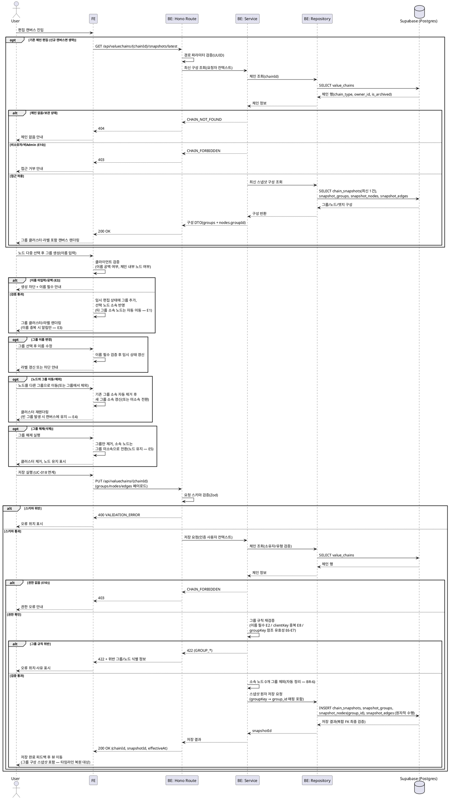

# UC-017: 노드 그루핑

> `docs/userflow.md` 017번 기능의 상세 유스케이스. 편집 캔버스에서 노드를 다중 선택해 그룹으로 묶고(밸류체인 단계 등 클러스터링), 그룹 해제·이름 변경·노드의 그룹 이동을 수행한다. 모든 그루핑 편집은 클라이언트 임시 편집 상태에 반영되며, 영속화는 저장(UC-018, 공식 체인은 UC-021) 시점에 새 스냅샷의 일부(그룹 구성 포함)로 수행된다.
> 참조: `docs/prd.md` 3장(밸류체인 생성/편집 페이지)·6장(노드 그룹 정책), `docs/database.md` 3.3(snapshot_groups/snapshot_nodes 복합 FK), `docs/techstack.md` §4(Hono route → service → repository → Supabase). 연계: UC-015(노드), UC-016(엣지), UC-018(저장), UC-021(공식 체인 편집).

---

## 1. Primary Actor

- **User** (로그인 사용자, 해당 사용자 체인의 소유자)
- **Admin** (공식 체인 편집 시 동일 로직 재사용 — UC-021 연계, 서버 측 role 검증)

## 2. Precondition (사용자 관점)

- 로그인 상태이다.
- 편집 권한이 있는 밸류체인의 편집 캔버스에 진입해 있다.
  - 사용자 체인: 본인 소유 체인의 편집 화면(`/valuechains/[chainId]/edit`) 또는 신규 생성/복제 캔버스(UC-013/014).
  - 공식 체인: Admin이 어드민 공식 체인 편집 화면에 진입(UC-021).
- 그룹으로 묶을 노드가 캔버스에 1개 이상 존재한다(UC-015에서 추가).

## 3. Trigger

- (생성) 사용자가 캔버스에서 노드를 다중 선택하고 그룹 생성 상호작용을 시작한다.
- (이름 변경) 사용자가 기존 그룹을 선택하고 이름 변경 상호작용을 시작한다.
- (이동) 사용자가 노드를 선택하고 다른 그룹으로 이동(또는 그룹에 추가/그룹에서 제외) 상호작용을 실행한다.
- (해제) 사용자가 기존 그룹을 선택하고 그룹 해제(그룹 삭제) 상호작용을 실행한다.

## 4. Main Scenario

1. 사용자가 편집 캔버스에 진입한다. 기존 체인 편집이면 시스템이 최신 스냅샷의 노드/엣지/그룹 구성을 로드해 그룹을 시각적 묶음(클러스터)+라벨로 표시한다.
2. 사용자가 캔버스에서 노드를 1개 이상 다중 선택한다.
3. 사용자가 그룹 생성을 실행하고 그룹 이름을 입력한다(이름 필수).
4. 시스템(FE)이 클라이언트 측에서 그루핑 규칙을 검증한다.
   - 그룹 이름 공백/미입력 여부.
   - 선택 노드가 현재 편집 중인 체인의 노드인지 여부.
5. 검증 통과 시 임시 편집 상태에 그룹을 추가하고 선택 노드들을 그 그룹 소속으로 반영한다. 이때 **이미 다른 그룹에 속한 노드는 기존 그룹에서 자동 제거 후 새 그룹으로 이동**한다(한 노드 최대 1개 그룹, 중첩 없음).
6. 캔버스가 그룹 클러스터(배경 영역)와 그룹 라벨을 렌더링한다.
7. (이름 변경) 사용자가 그룹 이름을 수정하면, 이름 필수 검증 후 임시 편집 상태의 그룹 이름을 갱신한다.
8. (노드 이동) 사용자가 노드를 다른 그룹으로 옮기면 기존 그룹 소속이 자동 해제되고 새 그룹 소속으로 갱신된다. 그룹에서 제외만 하면 그룹 미소속 노드가 된다.
9. (그룹 해제) 사용자가 그룹을 해제하면 그룹만 제거되고, 소속 노드들은 그룹 미소속 상태로 전환된다(노드 자체는 유지).
10. 사용자가 저장(UC-018)을 실행하면, 서버는 그룹 규칙(이름 필수·그룹 참조 유효성·노드 1그룹 소속)을 재검증한 뒤, 노드/엣지/**그룹** 전체 구성을 새 스냅샷 1건으로 원자적으로 영속화한다. 소속 노드 0개인 빈 그룹은 저장 시 스냅샷에서 제외(자동 정리)한다.
11. 저장 완료 피드백 후 뷰 페이지로 이동하며, 그룹 구성이 스냅샷에 포함되어 타임라인 복원(UC-012)의 대상이 된다.

## 5. Edge Cases

| # | 상황 | 처리 |
|---|------|------|
| E1 | 이미 다른 그룹 소속 노드를 새 그룹에 포함 | 차단하지 않고 **기존 그룹에서 자동 제거 후 이동**(중첩 금지 준수). FE가 이동 사실을 표시 |
| E2 | 그룹 이름 미입력/공백 | 그룹 생성·이름 변경 시 클라이언트 차단 + 안내. 서버 저장 시에도 재검증(422 `GROUP_NAME_REQUIRED`) |
| E3 | 동일 체인 내 그룹 이름 중복 | **허용**(DB 유니크 제약 없음 — `database.md` 3.3). FE는 혼동 방지를 위해 중복 알림만 표시(차단하지 않음) |
| E4 | 빈 그룹(노드 0개) 발생 — 소속 노드 전부 이동/삭제(UC-015)됨 | 편집 중에는 캔버스에 유지(노드를 다시 담을 수 있게), **저장 시 스냅샷에서 제외(자동 정리)** |
| E5 | 그룹 해제 시 소속 노드 처리 | 노드는 유지하고 그룹 소속만 제거(그룹 미소속으로 전환). 노드/엣지에는 영향 없음 |
| E6 | 다른 체인의 노드를 그룹에 포함 시도 | 차단(그룹은 체인 내부 한정). 저장 요청에서는 노드가 요청 내 `groupKey`로만 그룹을 참조하므로 구조적으로 불가하며, DB 복합 FK(`snapshot_nodes.(group_id, snapshot_id)` → `snapshot_groups(id, snapshot_id)`)가 최종 방어 |
| E7 | 노드의 `groupKey`가 요청 내 존재하지 않는 그룹을 참조 | 서버 저장 시 검증 실패(422 `GROUP_REF_INVALID`), 오류 위치 표시 |
| E8 | 요청 내 그룹 `clientKey` 중복 | 서버 저장 시 검증 실패(422 `GROUP_KEY_DUPLICATE`) |
| E9 | 그룹 소속 노드가 삭제됨(UC-015 연계) | 그룹에서 해당 노드만 자동 제외. 마지막 노드였다면 E4(빈 그룹) 규칙 적용 |
| E10 | 비소유자(사용자 체인)/비Admin(공식 체인)의 저장 시도 | 서버 측 권한 검증으로 거부(403), 클라이언트 우회 방지 |
| E11 | 세션 만료 상태에서 저장 | 401 거부, 재로그인 유도(임시 편집 상태는 미저장 손실 경고 — UC-018 정책) |
| E12 | 최신 구성 로드 실패(네트워크/서버 오류) | 오류 안내 + 재시도 유도, 편집 캔버스 진입 보류 |
| E13 | 과거 스냅샷의 그룹 표시 | 조회(UC-012) 영역 — 스냅샷에 그룹 구성이 포함되므로 시점 복원 시 그룹도 함께 복원됨 |

## 6. Business Rules

### 6.1 그루핑 규칙

- **BR-1 (체인 소속)**: 그룹은 해당 체인(정확히는 해당 체인의 스냅샷)에 소속된다. 다른 체인의 노드를 그룹에 포함할 수 없다.
- **BR-2 (단일 소속·중첩 금지)**: 한 노드는 최대 1개 그룹에 속한다. 그룹 안의 그룹(중첩)은 없다(PRD Non-Goals). 데이터 구조상 노드의 그룹 참조가 단일 컬럼(`snapshot_nodes.group_id`, 0..1)이므로 중첩·다중 소속은 표현 자체가 불가하다.
- **BR-3 (자동 이동)**: 이미 그룹에 속한 노드를 다른 그룹에 포함시키면 기존 그룹에서 자동 제거 후 이동한다(차단 아님).
- **BR-4 (이름 정책)**: 그룹 이름은 필수(공백 불가)다. 동일 체인 내 이름 중복은 허용하되 FE에서 중복 알림을 표시한다.
- **BR-5 (그룹 해제)**: 그룹 해제(삭제)는 그룹만 제거하며 소속 노드는 그룹 미소속으로 전환되어 유지된다. 노드·엣지에는 영향이 없다.
- **BR-6 (빈 그룹 정리)**: 그룹 생성은 노드 1개 이상 선택으로 시작한다. 편집 중 빈 그룹은 임시로 유지되지만, 저장 시 소속 노드 0개인 그룹은 스냅샷에 포함하지 않는다(자동 정리). 따라서 영속화된 스냅샷에는 빈 그룹이 존재하지 않는다.
- **BR-7 (지연 확정)**: 그루핑 편집(생성/해제/이름 변경/이동)은 임시 편집 상태에만 반영되며, **확정은 저장(UC-018) 시점**이다. 자동 저장은 없다(MVP).
- **BR-8 (이벤트 소싱)**: 저장 1회 = 스냅샷 1건(불변). 그룹의 변경·삭제는 기존 레코드 수정이 아니라 **새 스냅샷의 그룹 구성에 포함 여부**로 표현된다. 스냅샷에 그룹 구성이 포함되므로 타임라인 시점 복원(UC-012) 시 그룹도 함께 복원된다.
- **BR-9 (서버 재검증)**: 클라이언트 검증(즉시 피드백)과 무관하게, 서버는 저장 시 모든 그룹 규칙(이름 필수·참조 유효성·키 중복)을 재검증한다(클라이언트 우회 방지).
- **BR-10 (권한)**: 사용자 체인은 소유자 본인만, 공식 체인은 Admin만 그루핑을 포함한 편집·저장이 가능하며, 판정은 반드시 서버 측에서 수행한다(RLS 미사용 — Hono 미들웨어/서비스 계층 검증).

### 6.2 API Specification

> 계층: Hono Route(`route.ts`, HTTP 파싱/검증) → Service(`service.ts`, 비즈니스 규칙) → Repository(`repository.ts`, Supabase 접근). 그루핑은 클라이언트 임시 상태에서 수행되므로 **그루핑 전용 엔드포인트는 없고**, ① 편집 진입 시 기존 그룹 로드, ② 저장 시 그룹 페이로드 두 지점에서 API 계약에 참여한다.

#### API-1. 편집 대상 체인 최신 구성 조회 (기존 체인 편집 진입 시, UC-016 API-2와 동일 엔드포인트)

| 항목 | 내용 |
|---|---|
| 엔드포인트 | `GET /api/valuechains/{chainId}/snapshots/latest` |
| 권한 | 사용자 체인=소유자 본인, 공식 체인=Admin(편집 목적 진입) |
| Path | `chainId` (UUID) |

Response `200 OK` (그룹 관련 필드 중심 발췌):

```json
{
  "snapshotId": "uuid",
  "effectiveAt": "2026-07-05T09:00:00+09:00",
  "groups": [
    { "id": "uuid", "name": "소재" },
    { "id": "uuid", "name": "셀 제조" }
  ],
  "nodes": [
    { "id": "uuid", "nodeKind": "listed_company", "securityId": "uuid", "groupId": "uuid", "positionX": 120, "positionY": 80 },
    { "id": "uuid", "nodeKind": "free_subject", "subjectName": "소비자", "subjectType": "consumer", "groupId": null, "positionX": 300, "positionY": 40 }
  ],
  "edges": [ { "id": "uuid", "sourceNodeId": "uuid", "targetNodeId": "uuid", "relationTypeId": "uuid" } ]
}
```

- `nodes[].groupId`: 그룹 미소속이면 `null`. FE는 `groups` + `nodes[].groupId`로 그룹 클러스터를 재구성한다.

에러:

| HTTP | code | 설명 |
|---|---|---|
| 401 | `UNAUTHORIZED` | 미로그인/세션 만료 |
| 403 | `CHAIN_FORBIDDEN` | 비소유자/비Admin 접근(E10) |
| 404 | `CHAIN_NOT_FOUND` | 존재하지 않거나 삭제(보관)된 체인 |
| 500 | `INTERNAL_ERROR` | 구성 조회 실패(E12) |

#### API-2. 밸류체인 저장 — 그룹 계약 부분 (UC-018/UC-021 공유 계약)

> 저장 API 전체 계약은 UC-018(사용자 체인)·UC-021(공식 체인) 소관이며, 본 유스케이스는 그중 **groups 페이로드와 그룹 검증 계약**을 정의한다. 노드/엣지 계약은 UC-015/016 참조.

| 항목 | 내용 |
|---|---|
| 엔드포인트 | `POST /api/valuechains` (신규 생성 저장) / `PUT /api/valuechains/{chainId}` (기존 체인 저장) |
| 권한 | 사용자 체인=소유자 본인, 공식 체인=Admin |

Request Body (그룹 관련 발췌 — 스냅샷 그룹은 저장마다 새로 생성되므로 요청 내 임시 키 `clientKey`로 참조):

```json
{
  "groups": [
    { "clientKey": "g1", "name": "소재" },
    { "clientKey": "g2", "name": "셀 제조" }
  ],
  "nodes": [
    { "clientKey": "n1", "nodeKind": "listed_company", "securityId": "uuid", "groupKey": "g1", "positionX": 120, "positionY": 80 },
    { "clientKey": "n2", "nodeKind": "free_subject", "subjectName": "소비자", "subjectType": "consumer", "groupKey": null, "positionX": 300, "positionY": 40 }
  ],
  "edges": [ { "sourceNodeKey": "n1", "targetNodeKey": "n2", "relationTypeId": "uuid" } ]
}
```

- `groups[].clientKey`: 요청 스코프 임시 식별자(요청 내 유일해야 함).
- `groups[].name`: 필수, 공백 불가.
- `nodes[].groupKey`: 소속 그룹의 `clientKey` 또는 `null`(미소속). 노드당 최대 1개 값만 가지므로 다중 소속·중첩은 표현 불가(BR-2).
- 소속 노드가 0개인 그룹은 서버가 스냅샷 저장에서 제외한다(BR-6, 오류 아님).

Response `201 Created`(신규) / `200 OK`(갱신):

```json
{ "chainId": "uuid", "snapshotId": "uuid", "effectiveAt": "2026-07-05T09:00:00+09:00" }
```

에러 (그룹 관련):

| HTTP | code | 설명 |
|---|---|---|
| 400 | `VALIDATION_ERROR` | 요청 스키마 위반(groups 배열 형식/필수 필드 누락/타입 오류) |
| 401 | `UNAUTHORIZED` | 미로그인/세션 만료(E11) |
| 403 | `CHAIN_FORBIDDEN` | 비소유자/비Admin(E10) |
| 404 | `CHAIN_NOT_FOUND` | 대상 체인 없음 |
| 422 | `GROUP_NAME_REQUIRED` | 그룹 이름 미입력/공백(E2) |
| 422 | `GROUP_KEY_DUPLICATE` | 요청 내 그룹 `clientKey` 중복(E8) |
| 422 | `GROUP_REF_INVALID` | 노드의 `groupKey`가 요청 내 groups에 존재하지 않음(E7, 타 체인 그룹 참조 차단 포함 — E6) |
| 409 | `SAVE_CONFLICT` | 동시 편집/버전 충돌(UC-018 정책) |

- 422 응답 본문에는 위반 그룹/노드의 식별 정보(`clientKey`/`groupKey`)를 포함해 클라이언트가 오류 위치를 표시할 수 있게 한다.

### 6.3 Database Operations

| 테이블 | 작업 | 목적 |
|---|---|---|
| `value_chains` | SELECT | 체인 존재·소유자·체인 유형(official/user)·보관 여부 검증 — API-1/2 |
| `chain_snapshots` | SELECT | 최신 스냅샷 식별(편집 진입 로드) |
| `chain_snapshots` | INSERT | 저장 시 새 스냅샷 1건 생성(`change_source`=user_save 또는 admin_edit) |
| `snapshot_groups` | SELECT | 최신 스냅샷의 그룹 구성 로드(편집 진입) |
| `snapshot_groups` | INSERT | 새 스냅샷의 그룹 일괄 저장(소속 노드 0개 그룹 제외 — BR-6) |
| `snapshot_nodes` | SELECT | 최신 스냅샷의 노드(그룹 소속 `group_id` 포함) 로드(편집 진입) |
| `snapshot_nodes` | INSERT | 새 스냅샷의 노드 일괄 저장 — 요청의 `groupKey`를 신규 생성된 `snapshot_groups.id`로 매핑해 `group_id`에 기록 |
| `snapshot_edges` | SELECT / INSERT | 편집 진입 로드 / 새 스냅샷 엣지 저장(UC-016 연계, 원자 저장의 일부) |

- **UPDATE/DELETE 없음**: 스냅샷 테이블은 불변이다. 그룹 생성/해제/이름 변경/노드 이동은 모두 **새 스냅샷의 그룹 구성**으로 표현되며, 스냅샷+그룹+노드+엣지 저장은 하나의 원자적 단위(Postgres 함수/RPC — techstack §7)로 수행한다.
- DB 제약 활용: `snapshot_groups`의 `uq(id, snapshot_id)`와 복합 FK `snapshot_nodes.(group_id, snapshot_id)` → `snapshot_groups(id, snapshot_id)`로 노드와 그룹이 반드시 **동일 스냅샷 소속**임을 DB 레벨에서 강제(E6 최종 방어). 그룹 이름에는 유니크 제약 없음(중복 허용 — BR-4). `snapshot_nodes.group_id`는 nullable 단일 컬럼(0..1 소속).
- 삭제 전파: 체인 삭제(UC-019)/탈퇴(UC-006) 시 스냅샷 CASCADE로 그룹도 함께 삭제(본 유스케이스의 직접 연산 아님).

### 6.4 External Service Integration

- **없음.** 본 기능은 자체 DB(스냅샷 계열 테이블)만 사용하며 외부 API 호출이 발생하지 않는다(PRD 전역 정책: 외부 API(OpenDART/SEC EDGAR/토스증권)는 배치 적재 전용).

## 7. Sequence Diagram



## 8. 관련 유스케이스

- **UC-009 밸류체인 뷰 조회**: 저장된 그룹을 시각적 묶음+라벨로 렌더링.
- **UC-012 시점 타임라인 조회**: 스냅샷에 포함된 그룹 구성을 시점 복원 시 함께 복원.
- **UC-015 노드 추가/삭제**: 노드 삭제 시 그룹 소속 자동 해제(E9), 빈 그룹 발생 경로.
- **UC-016 관계(엣지) 설정/편집/삭제**: 동일 스냅샷 원자 저장의 엣지 계약.
- **UC-018 밸류체인 저장**: 그룹 확정·스냅샷 기록의 실행 지점(저장 API 전체 계약 소관).
- **UC-021 공식 밸류체인 관리**: Admin의 공식 체인 그룹 편집에서 본 로직 재사용(구조 변경 이벤트 기록).
