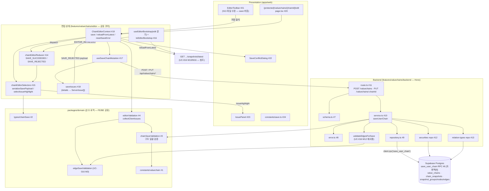

# Plan: UC-018 밸류체인 저장

> 근거: `docs/usecases/018/spec.md`, `docs/usecases/000_decisions.md`(D-2·D-6·D-7·C-2 스코프 해석), `docs/techstack.md` §4·§6·§7(SOT), `docs/database.md` §1.2·§3.3·§4.1, `supabase/migrations/0005_value_chains.sql`·`0006_chain_snapshots.sql`(기존 스키마 — 제약·복합 FK 확인 완료), `docs/pages/chain-editor/state_management.md`(편집 상태 설계의 단일 원천 — §3~§7 저장 수명주기·§6.3 저장 흐름을 그대로 구현), `docs/usecases/013/plan.md`(편집기 Flux 코어 골격), `docs/usecases/014/plan.md`(clone RPC·valuechains feature 공유 선례), `docs/usecases/015/plan.md`(노드 검증·페이로드 스키마), `docs/usecases/016/plan.md`(엣지 저장 검증 모듈 M3·M12, 정합화 결정 R-1~R-5), `docs/usecases/019/plan.md`(C-2 스코프 해석 선례), `.claude/skills/spec_to_plan/references/hono-backend-guide.md`.
>
> **범위**: 사용자 체인의 저장(영속화) — `POST /api/valuechains`(신규)·`PUT /api/valuechains/:chainId`(갱신) 백엔드 수직 슬라이스 + 원자적 저장 트랜잭션 RPC(`save_user_chain`) + 편집 캔버스의 저장 수명주기 FE(직렬화·클라이언트 일괄 검증·저장 버튼·충돌/오류 처리·edit 모드 부트스트랩·저장 후 라우팅). 편집 조작(노드/관계/그룹)은 UC-015~017, 공식 체인 저장은 UC-021 소관.
> **외부 서비스 연동: 없음**(spec §6.4 — 저장은 자체 Supabase Postgres에만 쓰기. OpenDART/SEC/토스/LLM 미호출). 따라서 외부 연동 클라이언트 모듈·`docs/external/*` 참조는 본 plan에 없다.

---

## 사전 정합화 결정 (spec·선행 plan 충돌 해소 — 구현 시 이 표를 따름)

| # | 사안 | 결정 | 근거 |
|---|---|---|---|
| S-1 | 상수 파일 위치: UC-013/015는 `packages/domain/constants/valuechain.ts`, UC-014는 `constants/chain-limits.ts`에 동일 상수(`MAX_CHAINS_PER_USER`/`MAX_NODES_PER_CHAIN`) 배치 | **`constants/valuechain.ts`로 단일화**(다수 plan 기준). UC-014의 `chain-limits.ts` 항목은 구현 시 이 파일로 흡수하고 `CLONE_NAME_SUFFIX_START`도 함께 둔다. 중복 상수 파일 금지 | DRY·단일 SOT |
| S-2 | 비소유자 갱신 응답: 결정 C-2는 "404 통일"이나 스코프가 009·010·012(조회) 한정 | 저장 PUT은 **spec대로 403 `VALUECHAINS.FORBIDDEN`**. 편집 진입 API(UC-016 R-2)가 비소유자를 이미 404로 차단하므로 정상 UI 경로에서 403 노출 없음(직접 호출 방어선) | UC-019 plan의 C-2 스코프 해석 선례 |
| S-3 | 에러 코드 공존: UC-016 API-2는 `VALUECHAINS.CHAIN_NOT_FOUND`/`CHAIN_FORBIDDEN`, UC-018 저장은 `VALUECHAINS.NOT_FOUND`/`FORBIDDEN` | 각 API의 spec 계약을 그대로 유지 — `error.ts`에 4개 코드 공존. FE 문구 매핑은 저장 코드만 본 plan이 담당 | spec이 각 API 계약의 소유자 |
| S-4 | 비활성 관계 종류 저장 검증 | **존재 여부만 검증**(BR-8) — UC-016 M3/M12의 `enforceActiveForNewEdges=false`(user variant) 경로 재사용. `previousEdges` 조회 자체를 생략 | UC-016 R-1과 동일 결론 |
| S-5 | 엣지 필드명 | UC-018 §6.2 계약(`clientEdgeId`/`sourceClientNodeId`/`targetClientNodeId`)이 SOT — UC-016 R-3 준용, `SaveEdgePayloadSchema`(UC-016 M9)를 그대로 합성 | UC-016 R-3 |
| S-6 | 400 vs 422 경계 | zod 스키마는 **타입/형상만** 검증(이름 공백·uuid 형식·enum 등 → 400 `INVALID_REQUEST`). `nodeKind`-필드 조합(E16)·노드 상한(E1)·중복 종목(E17)·참조 무결성(E5/E6)은 **service 검증 → 422** — 스키마에 discriminated union·`.max(100)`을 걸면 spec의 422 코드가 400으로 뭉개지므로 금지 | spec §5 E1~E17 코드 매핑 |
| S-7 | 낙관적 잠금·체인 상한의 TOCTOU | service의 사전 검증(빠른 실패)과 별개로 **RPC 트랜잭션 내부에서 최종 재검증** — 갱신: `value_chains` 행 `FOR UPDATE` 잠금 후 최신 스냅샷 재대조, 신규: `pg_advisory_xact_lock(hashtext(owner_id))` 후 카운트 재확인. 동시 저장 경쟁에서도 스냅샷 이중 기록·상한 초과가 발생하지 않는다 | BR-6·BR-7·E2(타 기기 생성 케이스)의 엄밀한 이행 |
| S-8 | 마이그레이션 번호 | `0014_fn_save_user_chain.sql`로 기재하되, 선행 plan들이 각자 `0013_*`을 예약했으므로 **구현 시점의 최신 번호+1로 조정**(파일명만 변경, 내용 불변) | 저장소 마이그레이션 규칙 |
| S-9 | `focusSecurityId` 존재 검증 | spec 검증 목록에는 없으나 `value_chains.focus_security_id` FK 위반이 500으로 새는 것을 막기 위해 `nodes[].securityId`와 **동일한 존재 확인 집합에 포함** → 미존재 시 422 `SECURITY_NOT_FOUND`(`details.field='focusSecurityId'`). `focusType='industry'`면 서버가 null로 강제 정규화(UC-013 reducer 규칙과 대칭) | 오류 없는 구현·방어적 설계 |
| S-10 | 미소유 모듈 소유 확정 | edit 모드 진입 페이지(`/valuechains/[chainId]/edit`)·`toEditorBootstrap`·`useEditorBootstrap`의 edit 분기·`IssuePanel`·`SaveConflictDialog`·reducer의 `SAVE_*` 케이스·`serializeSavePayload`·`collectClientIssues`는 선행 plan이 전부 위임(013 plan #11 주석, 015 plan 결정 7, 016 plan 경계표)했으므로 **본 plan이 소유** | 013/015/016 plan 경계 표기 |
| S-11 | FE/BE 구조 검증의 구현 단일화 | 노드/그룹/엣지 구조 규칙은 `packages/domain`의 **페이로드 형상 검증 모듈**(모듈 3)에 1회 구현하고, FE `collectClientIssues`는 편집 상태를 페이로드 형상으로 사영해 같은 함수를 호출한다(state 문서 §1-5 "검증의 이중화, 구현은 단일화") | DRY |

---

## 개요

| # | 모듈 | 위치 | 설명 |
| --- | --- | --- | --- |
| **공유 — packages/domain (순수 로직, FE/BE 공용)** | | | |
| 1 | 밸류체인 상수 | `packages/domain/constants/valuechain.ts` | `MAX_CHAINS_PER_USER=50`, `MAX_NODES_PER_CHAIN=100` — **[참조]** UC-013/015 소유(S-1). 본 UC는 소비만 |
| 2 | 저장 페이로드 타입 | `packages/domain/types/chainSave.ts` | `SaveChainRequest`/`SaveChainNodePayload`/`SaveChainGroupPayload`(+UC-016 `SaveEdgePayload` 재노출)/`SaveChainResult` — 직렬화·검증·BE 스키마가 공유하는 순수 타입. **본 plan 소유** |
| 3 | 구조 저장 검증(서버 재검증 코어) | `packages/domain/valuechains/chainSaveValidation.ts` | 페이로드 일괄 구조 검증: 노드 상한·`nodeKind`-필드 조합·중복 종목·그룹 이름/참조·페이로드 내 ID 유일성. **본 plan 소유** — BE service와 FE `collectClientIssues`가 공유(S-11) |
| 4 | 클라이언트 일괄 검증 | `packages/domain/valuechains/editorValidation.ts` | `collectClientIssues(state, relationTypeById)` — state 문서 §4.3 계약. **본 plan 소유분**(같은 파일의 노드/엣지 개별 검증은 UC-015/016 소유) |
| 5 | 엣지 저장 검증 | `packages/domain/valuechains/edgeSaveValidation.ts` | `validateEdgesPayload`(user variant) — **[참조]** UC-016 M3 소유. 본 UC는 소비만 |
| **DB — 마이그레이션** | | | |
| 6 | 저장 트랜잭션 RPC | `supabase/migrations/0014_fn_save_user_chain.sql`(S-8) | `save_user_chain()` Postgres 함수 — 체인 INSERT/UPDATE + 스냅샷 + 그룹/노드/엣지 INSERT를 단일 트랜잭션으로 수행(BR-6), 잠금 기반 최종 검증(S-7) 포함. **본 plan 소유** |
| **백엔드 — `apps/web/src/features/valuechains/backend/` (UC-009~019·021 공유 feature — 본 plan 기여분)** | | | |
| 7 | Zod 스키마(저장 기여분) | `.../backend/schema.ts` | `SaveChainRequestSchema`(groups/nodes/edges 서브스키마 — edges는 UC-016 M9 `SaveEdgePayloadSchema` 합성)·`SaveChainResponseSchema`·`SaveRpcResultSchema` |
| 8 | 에러 코드(저장 기여분) | `.../backend/error.ts` | spec §6.2의 저장 코드 12종 추가(S-3 공존) |
| 9 | Repository(저장 기여분) | `.../backend/repository.ts` | `countOwnedChains`·`existsChainName`·`saveUserChainViaRpc`(+UC-016 M11 `findChainMetaById`/`findLatestSnapshotHeader` 재사용) |
| 10 | Service(저장 기여분) | `.../backend/service.ts` | `saveUserChain` — 인가·낙관적 잠금·상한·이름·구조 재검증(BR-5) 오케스트레이션 + RPC 오류 매핑(repository 인터페이스에만 의존) |
| 11 | Route(저장 기여분) | `.../backend/route.ts` | `POST /valuechains`·`PUT /valuechains/:chainId` — HTTP 파싱/검증/로깅만(등록은 기존 `registerValuechainRoutes` 내 추가) |
| **백엔드 — 타 feature 소액 기여(참조 존재 확인 조회)** | | | |
| 12 | securities 존재 조회 | `apps/web/src/features/securities/backend/repository.ts` | `findExistingSecurityIds(client, ids)` 함수 1개 추가(UC-008/015 소유 파일 — append만) |
| 13 | relation_types 존재 조회 | `apps/web/src/features/relation-types/backend/repository.ts` | `findRelationTypesByIds(client, ids)` 함수 1개 추가(UC-016 소유 파일 — append만) |
| **프론트 — 편집 상태 (013/015/016 공유 파일 — 본 plan 저장 기여분)** | | | |
| 14 | Reducer 저장 케이스 | `.../editor/state/chainEditorReducer.ts` | `SAVE_SUCCEEDED`·`SAVE_REJECTED` 전이(state 문서 §4.2) |
| 15 | 셀렉터 저장 기여분 | `.../editor/state/chainEditorSelectors.ts` | `serializeSavePayload`·`selectIssueHighlight`(state 문서 §4.4) |
| 16 | 부트스트랩 edit 분기 | `.../editor/lib/toEditorBootstrap.ts` + `.../editor/hooks/useEditorBootstrap.ts`(013 소유 파일 확장) | `LatestSnapshotResponse` → `EditorBootstrap` 순수 변환 + edit 모드 1회 dispatch(S-10) |
| 17 | 저장 mutation 훅 | `.../editor/hooks/useSaveChainMutation.ts` | POST/PUT 분기·캐시 무효화(user variant — official 분기는 UC-021 확장) |
| 18 | 저장 오류 정규화 | `.../editor/lib/saveIssues.ts` | 422/409 응답 `error.details` → `ServerIssue[]` 정규화 순수 함수 |
| 19 | Context 저장 기여분 | `.../editor/context/ChainEditorContext.tsx` | `save()`/`reloadFromLatest()`/`resetSaveError()` 액션 + `async.isSaving/saveError` + `computed.canSave/clientIssues/issueHighlight` |
| **프론트 — Presentation** | | | |
| 20 | 편집 진입 페이지(edit) | `apps/web/src/app/(protected)/valuechains/[chainId]/edit/page.tsx` | Server 셸 — `<ChainEditorPage mode="edit" variant="user" chainId=... />` 배치(S-10) |
| 21 | 저장 버튼 활성화 | `.../editor/components/EditorToolbar.tsx`(013 소유 파일 수정) | disabled 자리 → `canSave`/`isSaving` 연동·클릭 시 `save()`·결과 토스트 |
| 22 | 저장 충돌 다이얼로그 | `.../editor/components/SaveConflictDialog.tsx` | E7: 최신 재로드/계속 편집 분기 Presenter |
| 23 | 이슈 패널 | `.../editor/components/IssuePanel.tsx` | `clientIssues + serverIssues` 사유 목록 Presenter(캔버스 하이라이트와 연동) |
| 24 | 저장 UI 문구 상수 | `.../editor/constants/save.ts` | 오류 코드→사용자 문구·버튼 라벨·충돌 안내 상수(하드코딩 금지) |
| **공유 인프라 (타 plan 소유 — 위치·계약 참조만, 재정의 금지)** | | | |
| — | Hono 공통 인프라 | `apps/web/src/backend/{hono,http,middleware}/*` | errorBoundary→withAppContext(인증·userId)→withSupabase 체인, `HandlerResult`/`respond()` |
| — | FE API 클라이언트 | `apps/web/src/lib/http/api-client.ts` | 선행 구현이 확정한 단일 위치를 따름(UC-019 원칙 — 중복 생성 금지). 타임아웃·`ApiError{status,code,details}` 정규화 |
| — | 최신 구성 조회 API/훅 | UC-016 M13 `GET /valuechains/:chainId/snapshots/latest` + M16 `useLatestSnapshot` | edit 부트스트랩·`reloadFromLatest()`의 데이터 원천 |
| — | 내 목록 쿼리 키 | UC-007 `['valuechains','mine']` | 저장 성공 시 invalidate 대상(D-2 상한 게이트 자동 갱신) |

---

## Diagram



데이터 흐름(단방향): View(저장 클릭) → `save()` 액션 함수(클라이언트 일괄 검증 → 직렬화 → mutation) → BE Route → Service(BR-5 재검증) → Repository → RPC 트랜잭션(BR-6) → 결과가 Action(`SAVE_SUCCEEDED`/`SAVE_REJECTED`)으로 상태에 합류 → 셀렉터 → View. FE와 BE가 동일한 도메인 검증 모듈(#3, #5)을 공유한다.

---

## Implementation Plan

### 1. 밸류체인 상수 — `packages/domain/constants/valuechain.ts` [UC-013/015 소유 — 참조]

- 본 plan 범위 아님. `MAX_CHAINS_PER_USER=50`·`MAX_NODES_PER_CHAIN=100`을 #3·#6(RPC 내 상수 주입 아님 — 함수 본문에 동일 값을 리터럴로 두지 않고 파라미터 `p_max_*`로 전달)·#10이 소비한다는 계약만 확정. 미존재 시 UC-013 plan §1 정의대로 생성. S-1에 따라 `chain-limits.ts`를 별도 생성하지 않는다.
- Unit Tests: 해당 없음(상수).

### 2. 저장 페이로드 타입 — `packages/domain/types/chainSave.ts`

- 구현 내용:
  1. spec §6.2 본문 계약을 순수 TS 타입으로 확정(React·zod·Supabase 비의존):
     ```ts
     export interface SaveChainGroupPayload { clientGroupId: string; name: string; }
     export interface SaveChainNodePayload {
       clientNodeId: string;
       nodeKind: 'listed_company' | 'free_subject';
       securityId: string | null;
       subjectName: string | null;
       subjectType: FreeSubjectType | null;
       subjectMemo: string | null;
       groupClientId: string | null;
       positionX: number;
       positionY: number;
     }
     // SaveEdgePayload는 UC-016 M3 소유 타입을 재노출(re-export)한다 — 재정의 금지(S-5)
     export interface SaveChainRequest {
       name: string;
       focusType: 'industry' | 'company';
       focusSecurityId: string | null;
       baseSnapshotId: string | null;      // 신규=null, 갱신=필수(BR-7)
       groups: SaveChainGroupPayload[];
       nodes: SaveChainNodePayload[];
       edges: SaveEdgePayload[];
     }
     export interface SaveChainResult {
       chainId: string; snapshotId: string; effectiveAt: string;
       nodeCount: number; edgeCount: number; groupCount: number;
     }
     ```
  2. `FreeSubjectType`은 `types/chainEditor.ts`(UC-013 소유)에서 import. BE `schema.ts`의 zod 산출 타입이 이 인터페이스를 `satisfies`로 준수하고, FE `serializeSavePayload`(#15)의 반환 타입으로도 사용한다(형상 단일 SOT).
- 의존성: `types/chainEditor.ts`(참조), UC-016 M3 타입.
- Unit Tests: 타입 전용 — `npm run typecheck`로 검증.

### 3. 구조 저장 검증 코어 — `packages/domain/valuechains/chainSaveValidation.ts`

- 구현 내용:
  1. 페이로드 형상(#2) 기준의 **순수 일괄 검증** 함수. 위반은 전부 수집(첫 건 중단 금지 — FE 일괄 하이라이트·spec §6.2 details 계약):
     ```ts
     export interface StructureViolation {
       reason:
         | 'NODE_LIMIT_EXCEEDED'            // E1  — nodes.length > MAX_NODES_PER_CHAIN
         | 'NODE_KIND_FIELD_MISMATCH'       // E16 — kind-필드 조합 위반(422 INVALID_NODE)
         | 'DUPLICATE_SECURITY_NODE'        // E17 — 동일 securityId 노드 2개 이상
         | 'GROUP_NAME_REQUIRED'            // E6  — 그룹 이름 공백(422 INVALID_GROUP)
         | 'GROUP_REF_INVALID'              // E6  — 노드의 groupClientId가 groups[]에 없음
         | 'DUPLICATE_CLIENT_ID';           // 페이로드 내 clientNodeId/EdgeId/GroupId 중복(400)
       targets: { clientNodeIds?: string[]; clientGroupIds?: string[]; clientEdgeIds?: string[] };
     }
     export function validateChainStructure(payload: Pick<SaveChainRequest,'groups'|'nodes'|'edges'>): StructureViolation[];
     ```
  2. 판정 규칙:
     - 노드 상한: `nodes.length > MAX_NODES_PER_CHAIN`(#1 상수) → `NODE_LIMIT_EXCEEDED`.
     - kind-필드 조합(0006 `chk_snapshot_nodes_kind`와 동일 규칙): `listed_company` → `securityId` 필수 ∧ `subjectName/subjectType` null. `free_subject` → `securityId` null ∧ `subjectName` trim 후 비공백 ∧ `subjectType` 비null. 위반 노드별 수집.
     - 중복 종목: `listed_company` 노드들의 `securityId` 중복 그룹별 전체 `clientNodeIds` 수집.
     - 그룹: `groups[].name` trim 후 공백 → `GROUP_NAME_REQUIRED`; `nodes[].groupClientId`가 non-null인데 `groups[]`에 없음 → `GROUP_REF_INVALID`.
     - ID 유일성: nodes/edges/groups 각 컬렉션 내 client ID 중복 → `DUPLICATE_CLIENT_ID`.
     - 엣지 규칙(자기 참조·중복 쌍·노드 참조)은 **검사하지 않는다** — UC-016 M3 `validateEdgesPayload` 소관(중복 구현 금지).
  3. 서버(#10)와 FE `collectClientIssues`(#4)가 동일 함수를 호출한다(S-11).
- 의존성: #1, #2.

**Unit Tests:**

- [ ] 정상 페이로드(혼합 노드 2 + 그룹 1 + 엣지 1) → `[]`
- [ ] 노드 101개 → `NODE_LIMIT_EXCEEDED` / 정확히 100개 → 위반 없음(경계값)
- [ ] listed_company + `securityId=null` → `NODE_KIND_FIELD_MISMATCH`(해당 clientNodeId 수집)
- [ ] listed_company + `subjectName='x'` → `NODE_KIND_FIELD_MISMATCH`
- [ ] free_subject + `subjectType=null` / `subjectName='  '` → `NODE_KIND_FIELD_MISMATCH`
- [ ] free_subject + `securityId` 설정 → `NODE_KIND_FIELD_MISMATCH`
- [ ] 동일 `securityId` 노드 3개 → `DUPLICATE_SECURITY_NODE`에 3개 clientNodeId 전부 수집
- [ ] 그룹 이름 공백 → `GROUP_NAME_REQUIRED` / 미존재 `groupClientId` 참조 → `GROUP_REF_INVALID`
- [ ] `groupClientId=null` 노드는 그룹 검증 통과(무소속 허용)
- [ ] clientNodeId 중복 2건 → `DUPLICATE_CLIENT_ID`
- [ ] 복수 위반 혼재 시 전부 수집(순서 결정적)
- [ ] 빈 groups/edges + 노드 1개 → 위반 없음(spec: 빈 배열 허용)

### 4. 클라이언트 일괄 검증 — `packages/domain/valuechains/editorValidation.ts` (본 plan 소유분: `collectClientIssues`)

- 구현 내용:
  1. state 문서 §4.3 시그니처 그대로: `collectClientIssues(state: ChainEditorState, relationTypeById: ReadonlyMap<string, RelationType>): ClientIssue[]` + `ClientIssue` 타입(코드: `NAME_REQUIRED | NODE_LIMIT_EXCEEDED | INVALID_EDGE | INVALID_GROUP`).
  2. 내부 구성(구현 단일화 — S-11):
     - 이름: `validateChainNameFormat`(UC-013 소유 함수) → `NAME_REQUIRED`(`targets.field='name'`).
     - 구조: state의 nodes/edges/groups를 페이로드 형상 배열로 사영(직렬화 #15와 동일 매핑 규칙의 경량 버전) 후 `validateChainStructure`(#3) 호출 → `NODE_LIMIT_EXCEEDED`/`INVALID_GROUP`(GROUP_* 사유 통합) 매핑.
     - 엣지: UC-016 M2가 기여한 엣지 파트(자기 참조·중복·노드 참조 — 비활성 종류는 검사 안 함) 결과를 `INVALID_EDGE`로 수집. UC-016 미구현 시점이면 M2 계약대로 선구현.
  3. FE 편집 상태에서 `NODE_KIND_FIELD_MISMATCH`/`DUPLICATE_SECURITY_NODE`/`DUPLICATE_CLIENT_ID`는 UC-015 액션 검증이 원천 차단하므로 정상 흐름에서 발생하지 않는다 — 발생 시(버그 방어) `INVALID_GROUP`이 아닌 해당 노드 `targets`를 포함한 `NODE_LIMIT_EXCEEDED` 외 코드로 뭉개지 않도록 `INVALID_EDGE`/`INVALID_GROUP` 외 위반은 `code: 'NODE_LIMIT_EXCEEDED'`가 아니라 **노드 대상 이슈로 그대로 노출하지 않고 콘솔 경고 + 저장 차단**(`ClientIssue` 코드 집합은 state 문서 계약 유지). → 매핑 규칙: `NODE_KIND_FIELD_MISMATCH`·`DUPLICATE_SECURITY_NODE`는 `INVALID_EDGE`와 동급의 차단 이슈이므로 `code`는 state 문서 확장 없이 `INVALID_GROUP`/`INVALID_EDGE`로 오염시키지 말고, `collectClientIssues` 반환에서 제외하되 저장 게이트(`canSave` 아님 — `save()`의 `blocked_client`)에서 차단한다. 구현 노트로 명시.
- 의존성: #3, UC-013 `validateChainNameFormat`, UC-016 M2, `types/chainEditor.ts`.

**Unit Tests:**

- [ ] 이름 공백 + 노드 0개 → `NAME_REQUIRED` 1건만
- [ ] 노드 101개(상태 직접 구성) → `NODE_LIMIT_EXCEEDED`
- [ ] 미존재 노드를 참조하는 엣지(상태 강제 구성) → `INVALID_EDGE` + 해당 `clientEdgeIds`
- [ ] 그룹 이름 공백 → `INVALID_GROUP` + 해당 `clientGroupIds`
- [ ] 비활성 관계 종류 엣지 → 이슈 없음(BR-8·기존 엣지 유지)
- [ ] 정상 상태 → `[]` (저장 진행 가능)
- [ ] 복수 이슈 혼재 → 전부 수집

### 5. 엣지 저장 검증 — `packages/domain/valuechains/edgeSaveValidation.ts` [UC-016 M3 — 참조]

- 본 plan 범위 아님. 소비 계약만 고정: `validateEdgesPayload({ nodes, edges, relationTypes, previousEdges: null, enforceActiveForNewEdges: false })` — user variant(S-4). 위반 `reason` 중 `RELATION_TYPE_NOT_FOUND` → 422 `INVALID_RELATION_TYPE`, 그 외 엣지 위반 → 422 `INVALID_EDGE`(세분 사유는 `details.reason` — UC-016 R-4). UC-016 미구현 시점이면 M3 계약대로 선구현.

### 6. 저장 트랜잭션 RPC — `supabase/migrations/0014_fn_save_user_chain.sql` (S-8)

- 구현 내용:
  1. 시그니처(멱등 `CREATE OR REPLACE`, `LANGUAGE plpgsql`, `SECURITY INVOKER`, `SET search_path = public`):
     ```sql
     save_user_chain(
       p_user_id uuid,            -- 저장 주체(소유자·created_by)
       p_chain_id uuid,           -- NULL=신규, 값=갱신
       p_base_snapshot_id uuid,   -- 갱신 낙관적 잠금 기준(신규는 NULL)
       p_name text,
       p_focus_type chain_focus_type,
       p_focus_security_id uuid,
       p_groups jsonb,            -- [{ client_group_id, name }]
       p_nodes jsonb,             -- [{ client_node_id, node_kind, security_id, subject_name,
                                  --    subject_type, subject_memo, group_client_id, position_x, position_y }]
       p_edges jsonb,             -- [{ client_edge_id, source_client_node_id, target_client_node_id, relation_type_id }]
       p_max_chains_per_user int, -- 상수는 앱이 주입(packages/domain SOT — DB 하드코딩 금지)
       p_max_nodes_per_chain int
     ) RETURNS TABLE (chain_id uuid, snapshot_id uuid, effective_at timestamptz,
                      group_count int, node_count int, edge_count int)
     ```
  2. 트랜잭션 본문(함수 전체가 단일 트랜잭션 — BR-6):
     - **(신규)** `pg_advisory_xact_lock(hashtext('save_user_chain:' || p_user_id::text))` → `SELECT count(*) FROM value_chains WHERE owner_id=p_user_id AND chain_type='user'` ≥ `p_max_chains_per_user`면 `RAISE EXCEPTION USING ERRCODE='P0001', MESSAGE='CHAIN_LIMIT_EXCEEDED'`(S-7·E2 최종 차단) → `value_chains` INSERT(`chain_type='user'`, `owner_id=p_user_id`, name/focus, `source_chain_id` 무변경 대상 아님 — BR-2).
     - **(갱신)** `SELECT ... FROM value_chains WHERE id=p_chain_id FOR UPDATE` — 없음 → `MESSAGE='CHAIN_NOT_FOUND'`; `chain_type<>'user'` 또는 `owner_id<>p_user_id` → `MESSAGE='CHAIN_FORBIDDEN'`; 최신 스냅샷(`ORDER BY effective_at DESC, created_at DESC LIMIT 1`)이 `p_base_snapshot_id`와 불일치(또는 스냅샷 0건) → `MESSAGE='SAVE_CONFLICT'`(S-7 — 행 잠금으로 동시 저장 직렬화, BR-7 최종 강제) → `value_chains` UPDATE(name/focus_type/focus_security_id — `source_chain_id`/`owner_id` 불변, BR-2).
     - 노드 수 최종 방어: `jsonb_array_length(p_nodes) > p_max_nodes_per_chain` → `MESSAGE='NODE_LIMIT_EXCEEDED'`.
     - `chain_snapshots` INSERT 1건: `chain_id`, `effective_at=now()`, `change_source='user_save'`, `created_by=p_user_id`(BR-1).
     - `snapshot_groups` INSERT: `p_groups` 전개 — `client_group_id → 신규 uuid` 매핑을 임시 테이블/CTE로 보관.
     - `snapshot_nodes` INSERT: `p_nodes` 전개 — `group_client_id`를 그룹 매핑으로 해석(`snapshot_id` 동일 — 복합 FK 자동 충족), `client_node_id → 신규 uuid` 매핑 보관. `uq_snapshot_nodes_security`/`chk_snapshot_nodes_kind`/FK RESTRICT가 최종 방어선.
     - `snapshot_edges` INSERT: `p_edges` 전개 — source/target을 노드 매핑으로 해석. 미존재 client ID 참조 시 매핑 JOIN 실패를 감지해 `MESSAGE='EDGE_NODE_REF_INVALID'`(방어 — 정상 경로에선 service가 선차단). `chk_no_self`/`uq_pair_type`/FK RESTRICT가 최종 방어선.
     - RETURN: 실제 INSERT 건수 집계와 함께 단일 행 반환.
  3. 실패 시 함수 전체 롤백(부분 저장 없음 — E15). `COMMENT ON FUNCTION`으로 계약 명시. SQL은 마이그레이션 파일이 SOT(techstack §7).
  4. 적용: `mcp__supabase__apply_migration`(로컬 Supabase 금지). 적용 후 `mcp__supabase__generate_typescript_types`로 `packages/domain/types/database.ts` 재생성.
- 의존성: 마이그레이션 0004~0006(적용 완료 확인).
- **검증 시나리오(마이그레이션 QA — SQL 콘솔):**
  - [ ] 동일 파일 2회 적용 무오류(멱등)
  - [ ] 신규 저장: 체인+스냅샷+그룹/노드/엣지 생성, 반환 카운트 일치, `change_source='user_save'`
  - [ ] 갱신 저장: 헤더 UPDATE + 스냅샷 1건 추가(기존 스냅샷 불변 — 이벤트 소싱)
  - [ ] `p_base_snapshot_id` 불일치 → `SAVE_CONFLICT` 예외 + 어떤 행도 잔존하지 않음(롤백)
  - [ ] 두 세션 동시 갱신(pg 세션 2개 수동 재현): 후행 세션이 `FOR UPDATE` 대기 후 `SAVE_CONFLICT`
  - [ ] 소유 체인 50개 상태에서 신규 → `CHAIN_LIMIT_EXCEEDED`
  - [ ] 동일 소유자 동일 이름 신규 → `23505`(`uq_value_chains_owner_name`) 전파
  - [ ] 동일 종목 노드 2개 페이로드 → `23505`(`uq_snapshot_nodes_security`) + 전체 롤백
  - [ ] 자기 참조 엣지 페이로드 → `23514`(chk) + 전체 롤백
  - [ ] 미존재 relation_type_id → `23503` + 전체 롤백
  - [ ] `focus_type='industry'` + `p_focus_security_id` — 앱이 null 정규화(S-9)했음을 전제로 null 저장 확인

### 7. Zod 스키마(저장 기여분) — `features/valuechains/backend/schema.ts`

- 구현 내용:
  1. `SaveChainGroupPayloadSchema`: `{ clientGroupId: z.string().min(1), name: z.string() }` — **이름 공백 검증은 zod에 두지 않는다**(trim 후 공백은 422 `INVALID_GROUP` — S-6). 단 타입은 string 필수.
  2. `SaveChainNodePayloadSchema`: `{ clientNodeId: z.string().min(1), nodeKind: z.enum(['listed_company','free_subject']), securityId: z.string().uuid().nullable(), subjectName: z.string().nullable(), subjectType: z.enum([...subject_type 4종]).nullable(), subjectMemo: z.string().nullable(), groupClientId: z.string().nullable(), positionX: z.number().finite(), positionY: z.number().finite() }` — kind-필드 조합은 검증하지 않음(S-6, discriminated union 금지).
  3. `SaveChainRequestSchema`: `{ name: z.string().trim().min(1)`(E3 → 400)`, focusType: z.enum(['industry','company']), focusSecurityId: z.string().uuid().nullable(), baseSnapshotId: z.string().uuid().nullable(), groups: z.array(...), nodes: z.array(...).min(0), edges: z.array(SaveEdgePayloadSchema) }` — `SaveEdgePayloadSchema`는 UC-016 M9 재사용(S-5). `.max(100)` 금지(S-6). 산출 타입이 #2 `SaveChainRequest`를 `satisfies`.
  4. `SaveRpcResultSchema`(snake_case): `{ chain_id: uuid, snapshot_id: uuid, effective_at: string, group_count: int, node_count: int, edge_count: int }`.
  5. `SaveChainResponseSchema`(camelCase): #2 `SaveChainResult`와 동형 — spec §6.2 Response 계약.
  6. `ChainIdParamSchema`(uuid) — 기존 정의 존재 시 재사용(UC-014/016/019 공유).
- 의존성: #2, UC-016 M9.
- **Unit Tests** (형상 위주 — 조합 검증이 zod에 없음을 고정하는 회귀 테스트):
  - [ ] spec §6.2 예시 JSON 그대로 → parse 성공
  - [ ] `name: '   '` → 실패(400 경로) / `name: ' 체인 '` → trim되어 성공
  - [ ] `baseSnapshotId: 'not-uuid'` → 실패
  - [ ] listed_company + `securityId=null` → **parse 성공**(조합 위반은 422 소관 — S-6 회귀 고정)
  - [ ] 노드 101개 배열 → **parse 성공**(상한은 422 소관)
  - [ ] `positionX: Infinity`/문자열 → 실패

### 8. 에러 코드(저장 기여분) — `features/valuechains/backend/error.ts`

- 구현 내용(기존 UC-014/016/019 기여 코드에 append — 재정의 금지):
  ```ts
  invalidRequest:        'VALUECHAINS.INVALID_REQUEST',        // 400
  forbidden:             'VALUECHAINS.FORBIDDEN',              // 403 (S-2·S-3)
  notFound:              'VALUECHAINS.NOT_FOUND',              // 404
  duplicateName:         'VALUECHAINS.DUPLICATE_NAME',         // 409
  saveConflict:          'VALUECHAINS.SAVE_CONFLICT',          // 409
  chainLimitExceeded:    'VALUECHAINS.CHAIN_LIMIT_EXCEEDED',   // 422
  nodeLimitExceeded:     'VALUECHAINS.NODE_LIMIT_EXCEEDED',    // 422
  invalidNode:           'VALUECHAINS.INVALID_NODE',           // 422
  duplicateSecurityNode: 'VALUECHAINS.DUPLICATE_SECURITY_NODE',// 422
  securityNotFound:      'VALUECHAINS.SECURITY_NOT_FOUND',     // 422
  invalidGroup:          'VALUECHAINS.INVALID_GROUP',          // 422
  saveFailed:            'VALUECHAINS.SAVE_FAILED',            // 500
  // invalidEdge / invalidRelationType 은 UC-016 M10 기정의 — 재사용
  ```
  401 `AUTH_REQUIRED`는 공통 인증 미들웨어 소관. 422/409 응답의 `details`에 오류 위치(`clientNodeIds`/`clientEdgeIds`/`clientGroupIds`/`field`)를 포함하는 계약을 파일 주석으로 명시(spec §6.2 — FE 하이라이트 입력).
- 의존성: 없음. Unit Tests: 해당 없음(상수).

### 9. Repository(저장 기여분) — `features/valuechains/backend/repository.ts`

- 구현 내용(전부 discriminated 결과 반환 — throw 금지, Supabase 문법은 이 파일 밖 유출 금지):
  1. `countOwnedChains(client, userId): Promise<{ count: number } | { error }>` — `value_chains` `count: 'exact', head: true`, `owner_id=:userId AND chain_type='user'`. UC-014가 동일 함수를 이미 정의했다면 재사용(append 금지 — 시그니처 확인 후 공유).
  2. `existsChainName(client, userId, name, excludeChainId: string | null): Promise<{ exists: boolean } | { error }>` — `owner_id=:userId AND chain_type='user' AND name=:name` (+`excludeChainId` 존재 시 `id <> :excludeChainId`) `LIMIT 1`. **갱신 시 자기 자신 제외**(이름 유지 재저장이 409가 되지 않도록 — BR-4의 정확한 구현).
  3. `saveUserChainViaRpc(client, params: SaveRpcParams): Promise<{ row } | { error: SaveRpcError }>` — `client.rpc('save_user_chain', {...}).single()`. camelCase 페이로드 → snake_case jsonb 변환은 이 함수가 담당. Supabase 오류를 `SaveRpcError { kind: 'known', token: 'SAVE_CONFLICT' | 'CHAIN_LIMIT_EXCEEDED' | 'CHAIN_NOT_FOUND' | 'CHAIN_FORBIDDEN' | 'NODE_LIMIT_EXCEEDED' | 'EDGE_NODE_REF_INVALID' } | { kind: 'constraint', code: '23505'|'23503'|'23514', constraint?: string } | { kind: 'unknown', message }`로 정규화(P0001 MESSAGE 토큰 파싱 + `error.code`/`error.details`의 제약명 추출).
  4. 갱신 검증 조회는 UC-016 M11 `findChainMetaById`/`findLatestSnapshotHeader`를 **재사용**(신규 정의 금지 — UC-016 미구현 시점이면 M11 계약대로 선구현).
- 의존성: #6(RPC), #7(Row/파라미터 타입), 공통 supabase 컨텍스트.

**Unit Tests** (Supabase client mock):

- [ ] `countOwnedChains`가 `owner_id`/`chain_type='user'` 필터 + exact count로 호출됨
- [ ] `existsChainName`: `excludeChainId` 전달 시 `neq('id', ...)` 조건 포함 / null이면 미포함
- [ ] `saveUserChainViaRpc`: camelCase 입력이 RPC 파라미터(snake_case jsonb·`p_max_*` 상수 포함)로 정확 매핑
- [ ] P0001 + `message='SAVE_CONFLICT'` → `{ kind:'known', token:'SAVE_CONFLICT' }`
- [ ] `code='23505'` + constraint `uq_value_chains_owner_name` → `{ kind:'constraint', code:'23505', constraint:'uq_value_chains_owner_name' }`
- [ ] 알 수 없는 오류 → `{ kind:'unknown' }` (throw 없음)

### 10. Service(저장 기여분) — `features/valuechains/backend/service.ts`

- 구현 내용: `saveUserChain(client, actor: { userId: string }, input: { chainId: string | null; body: SaveChainRequest }): Promise<HandlerResult<SaveChainResult, ValuechainServiceError, unknown>>` — repository 함수 집합은 deps 주입(테스트 mock).
  1. **정규화**: `focusType==='industry'`면 `focusSecurityId=null` 강제(S-9). `subjectName`/그룹 `name`은 trim.
  2. **모드 검증**: `chainId===null`인데 `baseSnapshotId!==null` → 400 `INVALID_REQUEST`; `chainId` 존재인데 `baseSnapshotId===null` → 400 `INVALID_REQUEST`(spec §6.2 — 갱신은 필수).
  3. **(갱신) 대상 검증**: `findChainMetaById` → 없음/`is_archived` → 404 `NOT_FOUND`(E11); `chain_type='official'` → 403 `FORBIDDEN`(BR-10); `owner_id !== actor.userId` → 403 `FORBIDDEN`(E10·S-2). → `findLatestSnapshotHeader` → `baseSnapshotId` 불일치(스냅샷 0건 포함) → 409 `SAVE_CONFLICT`(E7 — 빠른 실패; 최종 강제는 RPC S-7).
  4. **(신규) 상한**: `countOwnedChains` ≥ `MAX_CHAINS_PER_USER` → 422 `CHAIN_LIMIT_EXCEEDED`(E2).
  5. **이름 중복**: `existsChainName(userId, name, chainId)` → 409 `DUPLICATE_NAME`(E4, `details.field='name'`).
  6. **구조 재검증(BR-5)**: `validateChainStructure`(#3) → 위반 매핑: `NODE_LIMIT_EXCEEDED`→422 동명 코드 / `NODE_KIND_FIELD_MISMATCH`→422 `INVALID_NODE` / `DUPLICATE_SECURITY_NODE`→422 동명 / `GROUP_*`→422 `INVALID_GROUP` / `DUPLICATE_CLIENT_ID`→400 `INVALID_REQUEST`. `details`에 위반 client ID 목록 포함. **여러 위반 유형 공존 시 spec 코드 1개를 선택해야 하므로 우선순위 고정**: NODE_LIMIT > INVALID_NODE > DUPLICATE_SECURITY_NODE > INVALID_GROUP (전체 위반은 `details.violations`에 동봉 — FE는 details만 소비).
  7. **참조 존재 검증**: `findExistingSecurityIds`(#12 — `nodes[].securityId` ∪ `focusSecurityId`) → 누락 시 422 `SECURITY_NOT_FOUND` + 해당 `clientNodeIds`(또는 `field='focusSecurityId'`)(E12·S-9). `findRelationTypesByIds`(#13) → 관계 종류 맵 구성.
  8. **엣지 검증**: UC-016 M12 `validateEdgesForSave({ variant:'user', nodes, edges, relationTypes })` 위임 → 422 `INVALID_EDGE`/`INVALID_RELATION_TYPE`(E5/E13, `details.reason` 세분 — S-4·S-5).
  9. **저장**: `saveUserChainViaRpc` 호출. 오류 매핑: `SAVE_CONFLICT`→409, `CHAIN_LIMIT_EXCEEDED`→422, `CHAIN_NOT_FOUND`→404, `CHAIN_FORBIDDEN`→403, `NODE_LIMIT_EXCEEDED`→422, `EDGE_NODE_REF_INVALID`→422 `INVALID_EDGE`; 23505: `uq_value_chains_owner_name`→409 `DUPLICATE_NAME` / `uq_snapshot_nodes_security`→422 `DUPLICATE_SECURITY_NODE` / `uq_snapshot_edges_pair_type`→422 `INVALID_EDGE`; 23503: securities FK→422 `SECURITY_NOT_FOUND` / relation_types FK→422 `INVALID_RELATION_TYPE`; 23514→422 `INVALID_NODE`(chk_kind) 또는 `INVALID_EDGE`(chk_no_self — 제약명 기준); 그 외→500 `SAVE_FAILED`(E15 — RPC가 롤백 완료를 보장).
  10. `SaveRpcResultSchema` 검증 → snake→camel 변환 → `SaveChainResponseSchema` 검증 → `success(dto, 신규 201 / 갱신 200)`.
  11. 순수성: repository 인터페이스 외 I/O 없음, 로깅 없음(route 책임), `Date` 미사용(`effectiveAt`은 RPC `now()`가 단일 원천).
- 의존성: #1~#3, #5, #7~#9, #12, #13, UC-016 M11/M12, 공통 `response.ts`.

**Unit Tests** (repository/검증 deps 스텁 주입):

- [ ] 신규 정상: 검증 전부 통과 → RPC 파라미터 정확(chainId=null, base=null) → 201 + DTO camelCase
- [ ] 갱신 정상: 소유자·base 일치 → 200, `existsChainName`에 `excludeChainId=chainId` 전달 확인
- [ ] 갱신 + 이름 미변경 재저장 → 409 아님(자기 제외 확인)
- [ ] 신규인데 `baseSnapshotId` 값 존재 → 400 / 갱신인데 null → 400, RPC 미호출
- [ ] 체인 없음/archived → 404, 공식 체인 → 403, 비소유자 → 403 (각각 RPC 미호출)
- [ ] base ≠ 최신 스냅샷 → 409 `SAVE_CONFLICT` / 갱신 대상 스냅샷 0건 → 409
- [ ] 소유 50개 + 신규 → 422 `CHAIN_LIMIT_EXCEEDED` (49개 → 통과, 경계값)
- [ ] 이름 중복 → 409 `DUPLICATE_NAME`
- [ ] 노드 101개 → 422 `NODE_LIMIT_EXCEEDED` / listed+securityId null → 422 `INVALID_NODE` + clientNodeIds / 동일 종목 2노드 → 422 `DUPLICATE_SECURITY_NODE`
- [ ] 미존재 securityId → 422 `SECURITY_NOT_FOUND` + clientNodeIds / 미존재 `focusSecurityId` → 422 + `field='focusSecurityId'`
- [ ] 자기 참조 엣지 → 422 `INVALID_EDGE` + `details.reason='EDGE_SELF_REFERENCE'` / 미존재 relationTypeId → 422 `INVALID_RELATION_TYPE`
- [ ] 비활성 relationTypeId → **통과**(BR-8·S-4)
- [ ] `focusType='industry'` + `focusSecurityId` 값 → null로 정규화되어 RPC 전달
- [ ] RPC `SAVE_CONFLICT` 토큰 → 409 / 23505 owner_name → 409 / 23505 nodes_security → 422 / unknown → 500 `SAVE_FAILED`
- [ ] 검증 실패 경로 전부에서 RPC 호출 0회(mock 호출 수 검증)
- [ ] 422 응답 `details`에 위반 client ID 목록 포함(FE 하이라이트 계약)

### 11. Route(저장 기여분) — `features/valuechains/backend/route.ts`

- 구현 내용(기존 `registerValuechainRoutes(app)`에 핸들러 2개 추가 — UC-014 clone·UC-016 latest·UC-019 delete와 동일 파일 공존, 함수 단위 SRP):
  1. `POST /valuechains`: 인증 컨텍스트에서 `userId` 확인(미인증 → 401 `AUTH_REQUIRED`, E9) → body `SaveChainRequestSchema.safeParse`(실패 → 400 `INVALID_REQUEST` + zod details, E3) → `saveUserChain(client, actor, { chainId: null, body })` → 실패 시 5xx는 `logger.error`/4xx는 `logger.warn` → `respond(c, result)`(성공 201).
  2. `PUT /valuechains/:chainId`: `chainId` uuid 검증(실패 → 400) → 이하 동일(`{ chainId, body }`, 성공 200).
  3. Supabase 원문 오류를 응답 body에 노출하지 않는다(details는 검증 위치 정보만).
- 의존성: #7, #8, #10, 공통 미들웨어.

**QA Sheet:**

| # | 시나리오 | 기대 결과 |
| --- | --- | --- |
| 1 | 로그인 + spec §6.2 예시 body로 `POST /api/valuechains` | 201 `{ok:true,data:{chainId,snapshotId,effectiveAt,nodeCount:2,edgeCount:1,groupCount:1}}` |
| 2 | 동일 body로 본인 체인 `PUT`( 갱신, base=최신) | 200 + 새 snapshotId(스냅샷 1건 증가 — DB 확인) |
| 3 | 미로그인 호출 | 401 `AUTH_REQUIRED` |
| 4 | `name` 누락/공백 body | 400 `VALUECHAINS.INVALID_REQUEST` + zod details |
| 5 | PUT에 `baseSnapshotId: null` | 400 |
| 6 | 타인 체인 `PUT` | 403 `VALUECHAINS.FORBIDDEN` |
| 7 | 공식 체인 id로 `PUT` | 403 (BR-10) |
| 8 | 삭제된 체인 id로 `PUT` | 404 `VALUECHAINS.NOT_FOUND` |
| 9 | 다른 탭에서 먼저 저장 후 stale base로 `PUT` | 409 `VALUECHAINS.SAVE_CONFLICT` |
| 10 | 같은 이름 체인 보유 상태에서 `POST` | 409 `VALUECHAINS.DUPLICATE_NAME` |
| 11 | 소유 50개 상태에서 `POST` | 422 `VALUECHAINS.CHAIN_LIMIT_EXCEEDED` |
| 12 | 자기 참조 엣지 포함 body(직접 호출) | 422 `VALUECHAINS.INVALID_EDGE` + `details.clientEdgeIds` |
| 13 | 존재하지 않는 securityId 포함 body | 422 `VALUECHAINS.SECURITY_NOT_FOUND` + `details.clientNodeIds` |
| 14 | RPC 강제 오류(함수 drop 후 호출) | 500 `VALUECHAINS.SAVE_FAILED` + 서버 error 로그, DB에 부분 행 없음 |
| 15 | 응답 본문 | 공통 래퍼 `{ok, data|error}` 준수 |

### 12·13. 참조 존재 조회 — `features/securities/backend/repository.ts`·`features/relation-types/backend/repository.ts` (타 feature 소액 기여)

- 구현 내용:
  1. #12 `findExistingSecurityIds(client, ids: string[]): Promise<{ foundIds: Set<string> } | { error }>` — `securities` `select('id').in('id', ids)`. 빈 입력이면 즉시 빈 Set(쿼리 생략). 상장폐지/정지 종목도 존재로 취급(E12는 "미존재"만 차단 — B-5 정책과 정합).
  2. #13 `findRelationTypesByIds(client, ids: string[]): Promise<{ rows: {id,is_directed,is_active}[] } | { error }>` — `relation_types` `.in('id', ids)`. 비활성 포함 반환(존재 검증 + `isDirected` 무향 정규화 입력 — S-4).
  3. 각 feature의 테이블 접근 캡슐화 원칙 유지 — valuechains service(#10)는 이 함수들을 import해 소비(테이블 직접 접근 금지).
- 의존성: 해당 feature repository 파일(미존재 시 UC-008/016 plan 계약대로 파일 먼저 생성).
- **Unit Tests:**
  - [ ] `.in()` 파라미터에 중복 제거된 ID 배열 전달
  - [ ] 빈 배열 입력 → 쿼리 미실행 + 빈 결과
  - [ ] Supabase 오류 → error 반환(throw 금지)

### 14. Reducer 저장 케이스 — `.../editor/state/chainEditorReducer.ts` (013 공유 파일 — 본 plan 기여분)

- 구현 내용(state 문서 §4.2 그대로):
  1. `SAVE_SUCCEEDED`: `chainId ← payload.chainId`, `baseSnapshotId ← payload.snapshotId`, `isDirty=false`, `serverIssues=[]`. 문서(nodes/edges/groups)·selection 불변.
  2. `SAVE_REJECTED`: `serverIssues ← payload.issues` — 문서·`isDirty` 불변(편집 상태 유지, E5/E6 하이라이트용).
  3. 409 `SAVE_CONFLICT`/401/네트워크는 **케이스를 추가하지 않는다**(state 문서 §3 — reducer 무변경, `saveError` 파생 소관).
  4. 기존 공통 후처리 규칙과의 정합: 두 액션 모두 dirty=✕ 계열이므로 ⊕ 후처리 미적용(UC-013이 확립한 스텁 no-op를 실제 전이로 교체).
- 의존성: UC-013 reducer 골격(액션 union에 이미 선언됨).

**Unit Tests:**

- [ ] `SAVE_SUCCEEDED`(create 후) → `chainId` null→값, `baseSnapshotId` 갱신, `isDirty=false`, 문서 불변(참조 비교)
- [ ] `SAVE_SUCCEEDED`(update) → `baseSnapshotId`만 새 스냅샷으로 교체
- [ ] `SAVE_REJECTED` → `serverIssues` 설정, `isDirty`/nodes/edges 불변
- [ ] `SAVE_REJECTED` 후 임의 문서 변형 액션 → `serverIssues=[]`(공통 후처리로 하이라이트 해제 — 회귀 확인)
- [ ] `initialized=false`에서 `SAVE_SUCCEEDED` → no-op(초기화 게이트)

### 15. 셀렉터 저장 기여분 — `.../editor/state/chainEditorSelectors.ts` (공유 파일 — 본 plan 기여분)

- 구현 내용:
  1. `serializeSavePayload(state: ChainEditorState): SaveChainRequest`(state 문서 §4.4) — 순수 변환: `name`(trim), `focusType`, `focusSecurityId ← focusSecurity?.securityId ?? null`(industry면 null 강제), `baseSnapshotId ← state.baseSnapshotId`, `groups[] ← Object.values(groups)`, `nodes[] ← Object.values(nodes)`(listed: `securityId ← security.securityId`·subject 3필드 null / free: securityId null·subject 필드, `groupClientId`, `positionX/Y ← position.x/y` — BR-9), `edges[] ← Object.values(edges)`. 결정적 순서(삽입 순서 유지)로 직렬화.
  2. `selectIssueHighlight(state, clientIssues): IssueHighlight`(state 문서 §4.4) — `serverIssues + clientIssues`의 `targets`를 nodeIds/edgeIds/groupIds Set + `nameError`로 합산. `selectReactFlowNodes/Edges`(013/016 소유)의 하이라이트 입력.
- 의존성: #2, #14, `types/chainEditor.ts`.

**Unit Tests:**

- [ ] 직렬화: 혼합 문서(그룹 1·listed 1·free 1·엣지 1) → spec §6.2 예시와 동형(필드명·null 규칙·좌표 포함)
- [ ] `focusType='industry'` + `focusSecurity` 잔존(방어) → `focusSecurityId=null`
- [ ] 부트스트랩 → 직렬화 왕복: `toEditorBootstrap(dto)` 결과를 직렬화하면 그룹 소속·좌표·관계 무손실(state 문서 §10-13/14)
- [ ] `selectIssueHighlight`: server 409 `DUPLICATE_NAME`(field=name) + client `INVALID_EDGE` 혼재 → `nameError` 설정 + edgeIds 수집
- [ ] 이슈 없음 → 빈 Set + `nameError=null`

### 16. 부트스트랩 edit 분기 — `.../editor/lib/toEditorBootstrap.ts` + `useEditorBootstrap.ts` 확장 (S-10)

- 구현 내용:
  1. `toEditorBootstrap(dto: LatestSnapshotResponse): EditorBootstrap` — 순수 변환(신규 파일): 서버 `nodes[].id → clientNodeId`, `edges[].id → clientEdgeId`, `groups[].id → clientGroupId` 승계, `security` SecurityRef 유지, `groupId → groupClientId`, `positionX/Y → position`(null 좌표는 기본 좌표 산출 함수(UC-015 `getDefaultNodePosition`)로 보정), `chainId`/`baseSnapshotId ← dto.snapshotId`(BR-7의 기준값 확보 지점), `focusSecurity ← dto.focusSecurity`.
  2. `useEditorBootstrap` edit 분기(UC-013 소유 파일의 확장 지점 주석을 실제 구현으로 교체): `mode==='edit'`이고 `useLatestSnapshot`(UC-016 M16)·`useRelationTypes`(UC-016 M15) 모두 성공 && `!initialized` → `toEditorBootstrap(dto)`로 `EDITOR_INITIALIZED` 1회 dispatch. 실패(401/403/404/500)는 dispatch 없이 Provider `bootstrapError` 파생(비소유자 404는 "체인을 찾을 수 없음" 화면 — C-2 정합).
  3. `reloadFromLatest()`(#19)가 동일 변환을 재사용한다(충돌 재로드 — 폐기 경고 후 refetch → 재dispatch).
- 의존성: UC-016 M9(DTO 타입)/M15/M16, UC-015 `getDefaultNodePosition`, UC-013 `useEditorBootstrap` 골격.

**Unit Tests:**

- [ ] DTO(그룹 1·listed 1·free 1·엣지 1) → EditorBootstrap: ID 승계·`baseSnapshotId=snapshotId`·그룹 소속·좌표 보존
- [ ] 좌표 null 노드 → 기본 좌표 보정(유한값)
- [ ] edit 모드: 스냅샷+마스터 성공 시 1회만 dispatch(리렌더 재실행 없음), 한쪽 실패 시 dispatch 없음
- [ ] create 모드 기존 동작 회귀 없음(UC-013 테스트 유지 통과)

### 17. 저장 mutation 훅 — `.../editor/hooks/useSaveChainMutation.ts`

- 구현 내용:
  1. state 문서 §5 계약: `useSaveChainMutation(variant: EditorVariant): UseMutationResult<SaveChainResult, ApiError, { chainId: string | null; payload: SaveChainRequest }>`.
  2. mutationFn: `chainId===null` → `apiClient.post('/valuechains', payload)` / 존재 → `apiClient.put(`/valuechains/${chainId}`, payload)`. `variant==='official'` 분기는 시그니처만 두고 UC-021 plan이 채운다(본 plan은 user만).
  3. `retry: 0`(비멱등 — 재시도 시 스냅샷/체인 중복 생성 위험. 재시도는 사용자 수동, E8). 타임아웃은 공통 api-client 소관.
  4. `onSuccess(data)`: `['valuechains','mine']` invalidate(내 목록·상한 게이트 D-2 자동 갱신), `['valuechains', data.chainId]` 스코프 invalidate(뷰·latest-snapshot 최신화). 라우팅·dispatch는 Provider `save()` 소관(훅은 서버 상태만 책임).
- 의존성: #2(타입), #11(API), 공통 api-client.

**Unit Tests:**

- [ ] `chainId=null` → POST 경로/본문 정확, 값 존재 → PUT 경로
- [ ] 성공 시 두 쿼리 키 invalidate 호출
- [ ] `retry` 미수행(mutation 옵션 고정 — 회귀 테스트)

### 18. 저장 오류 정규화 — `.../editor/lib/saveIssues.ts`

- 구현 내용:
  1. `normalizeSaveErrorToIssues(error: ApiError): ServerIssue[] | null` — 순수 함수. `SAVE_REJECTED` 대상(422 전체 + 409 `DUPLICATE_NAME`)이면 `error.details`의 `clientNodeIds/clientEdgeIds/clientGroupIds/field/violations`를 `ServerIssue[]`(state 문서 §2.1)로 변환(메시지는 #24 코드→문구 상수 매핑). 대상 아님(409 `SAVE_CONFLICT`/401/500/네트워크) → `null`(reducer 미유입 — state 문서 §3 각주).
  2. `classifySaveError(error): 'rejected' | 'conflict' | 'auth' | 'network'` — `save()`(#19)의 분기 유틸.
- 의존성: #8(코드 상수), #24(문구), 공통 `ApiError` 타입.

**Unit Tests:**

- [ ] 422 `INVALID_EDGE` + `details.clientEdgeIds=[e1,e2]` → ServerIssue 1건, targets에 e1·e2
- [ ] 409 `DUPLICATE_NAME` → `targets.field='name'`
- [ ] 422 `SECURITY_NOT_FOUND` + clientNodeIds → 노드 targets
- [ ] 409 `SAVE_CONFLICT` → `null` + classify `'conflict'` / 401 → `'auth'` / status 0(네트워크)·500 → `'network'`
- [ ] details 누락(방어) → 빈 targets의 이슈 1건(throw 없음)

### 19. Context 저장 기여분 — `.../editor/context/ChainEditorContext.tsx` (013 공유 파일 — 본 plan 기여분)

- 구현 내용(state 문서 §6.3·§7 그대로):
  1. `save(): Promise<SaveOutcome>` 액션 함수:
     - ① `collectClientIssues`(#4) 실행 — 이슈 존재 시 dispatch 없이 `{ status:'blocked_client', issues }` 반환(요청 미발생, Main 2).
     - ② `serializeSavePayload(state)`(#15) → `mutation.mutateAsync({ chainId: state.chainId, payload })`.
     - ③ 결과 분기: 성공 → `dispatch(SAVE_SUCCEEDED)` → `router.push('/valuechains/' + chainId)`(Main 9) → `{ status:'saved' }`; `classifySaveError`(#18): `'rejected'` → `normalizeSaveErrorToIssues` → `dispatch(SAVE_REJECTED)` → `{ status:'rejected_server' }`; `'conflict'`/`'auth'`/`'network'` → dispatch 없이 `saveError` 파생 + 대응 status 반환(E7/E9/E8 — 편집 상태 보존).
  2. `reloadFromLatest(): Promise<void>` — `latestSnapshot` refetch → `toEditorBootstrap`(#16) → `EDITOR_INITIALIZED` 재dispatch(편집 내용 폐기 — 호출 전 확인은 다이얼로그(#22) 책임) + `mutation.reset()`.
  3. `resetSaveError(): void` — `mutation.reset()`(충돌 다이얼로그 "계속 편집"·오류 배너 닫기).
  4. `async` 파생: `isSaving ← mutation.isPending`(저장 버튼 비활성 — 중복 전송 방지), `saveError ← classifySaveError` 결과(`conflict|auth|network`만).
  5. `computed` 파생: `clientIssues`(#4, useMemo), `canSave ← name trim 비공백 ∧ nodeCount ≤ 100 ∧ initialized ∧ !isSaving`(state 문서 §7.1), `issueHighlight`(#15).
  6. edit 모드 Provider 분기(S-10): `useLatestSnapshot(chainId)` enabled + `useChainQuotaGate` disabled(UC-013 #9의 `enabled=false` 경로), `bootstrapError` 파생 연결.
- 의존성: #4, #14~#18, UC-013 Provider 골격, UC-016 M15/M16.

**Unit Tests** (React Testing Library — Provider 통합, mutation/query mock):

- [ ] 이름 공백 상태 `save()` → `blocked_client` + fetch 0회
- [ ] 정상 저장(create) → POST 성공 → `SAVE_SUCCEEDED` 반영(`chainId` 설정·dirty 해제) + 라우팅 호출
- [ ] 422 응답 → `serverIssues` 설정 + `rejected_server` + 편집 문서 불변
- [ ] 409 SAVE_CONFLICT → `saveError.kind='conflict'` + reducer 무변경 + `resetSaveError()`로 해제
- [ ] `reloadFromLatest()` → refetch 후 `EDITOR_INITIALIZED` 재실행(`baseSnapshotId` 최신화, dirty=false)
- [ ] 401 → `saveError.kind='auth'`, 문서 보존 / 네트워크 오류 → `'network'`
- [ ] `isSaving=true` 동안 `canSave=false`

### 20. 편집 진입 페이지(edit) — `app/(protected)/valuechains/[chainId]/edit/page.tsx` (S-10)

- 구현 내용: Server Component 셸(UC-013 #14와 동일 패턴). Next.js 16 — `params`는 Promise(`await params`). `chainId` 추출 후 `<ChainEditorPage mode="edit" variant="user" chainId={chainId} />` 배치. 로그인 가드는 `(protected)` 레이아웃 계약(UC-013 #15) 재사용.
- 의존성: #16, #19, UC-013 #15·#16.

**QA Sheet:**

| # | 시나리오 | 기대 결과 |
| --- | --- | --- |
| 1 | 소유자가 본인 체인 `/valuechains/{id}/edit` 진입 | 스켈레톤 → 저장된 구성(노드/엣지/그룹/좌표/이름/기준) 그대로 캔버스 복원 |
| 2 | 비로그인 진입 | `/auth/login?next=...` redirect 후 복귀 |
| 3 | 타인 체인 id로 진입 | "체인을 찾을 수 없음" 오류 화면(404 — 존재 비노출, UC-016 R-2) |
| 4 | 진입 직후 | `isDirty=false`(경고 없이 이탈 가능), 저장 버튼은 변경 전에도 이름 유효 시 활성(재저장 허용) |
| 5 | uuid 아닌 chainId | 오류 화면(400/404 계열 폴백) |

### 21. 저장 버튼 활성화 — `.../editor/components/EditorToolbar.tsx` (013 소유 파일 수정)

- 구현 내용(본 plan 담당 배선만):
  1. UC-013이 남긴 disabled 자리 교체: `disabled = !computed.canSave || async.isSaving`, 클릭 → `save()` 호출.
  2. outcome 처리: `blocked_client` → "저장할 수 없습니다 — 표시된 항목을 확인하세요" 토스트(하이라이트는 상태 반영으로 자동); `rejected_server` → 동일 패턴 토스트; `auth_required` → 재로그인 유도 배너(로그인 새 탭 링크 + "편집 내용은 유지됩니다" — E9); `network_error` → "일시적 오류 — 다시 시도" 토스트(E8); `saved`/`conflict`는 라우팅·다이얼로그가 처리하므로 토스트 없음. 문구는 #24 상수.
  3. 저장 중 스피너 + 버튼 비활성(중복 클릭 방지).
- 의존성: #19, #24, UC-013 #18.

**QA Sheet:**

| # | 시나리오 | 기대 결과 |
| --- | --- | --- |
| 1 | 이름 미입력 상태 | 저장 버튼 비활성(툴팁: 이름 필요) |
| 2 | 이름 입력 후 저장 클릭 | 버튼 스피너 → 성공 시 뷰 페이지(`/valuechains/{id}`) 이동 + 완료 피드백 |
| 3 | 저장 중 재클릭 | 무시(비활성 — 요청 1회만, 네트워크 탭 확인) |
| 4 | 이름 중복(서버 409) | 이름 필드 오류 표시 + IssuePanel 사유, 편집 내용 유지(E4) |
| 5 | 네트워크 차단 후 저장 | 재시도 토스트, 편집 상태 유지 → 복구 후 재저장 성공(E8) |
| 6 | 세션 만료 후 저장 | 재로그인 유도 + 편집 상태 보존, 재로그인 후 같은 탭에서 재저장 성공(E9) |
| 7 | 저장 성공 후 뷰 페이지 | 저장한 구성 표시 + 내 목록 카운트 갱신(D-2 캐시 무효화) |
| 8 | 저장 성공 직후 브라우저 뒤로가기 | 편집 화면 재진입 시 이탈 경고 없음(dirty 해제 확인) |

### 22. 저장 충돌 다이얼로그 — `.../editor/components/SaveConflictDialog.tsx`

- 구현 내용: 순수 Presenter(shadcn-ui `alert-dialog`). props `{ open, onReload, onKeepEditing }` — `async.saveError?.kind==='conflict'`로 open 파생(연결은 UC-013 #16 `ChainEditorPage`에 1줄 추가). 문구(#24): "다른 곳에서 이 체인이 먼저 저장되었습니다. 최신 상태를 불러오면 **현재 편집 내용은 사라집니다.**" + [최신 상태 불러오기]→`reloadFromLatest()` / [계속 편집]→`resetSaveError()`.
- 의존성: #19, #24, shadcn-ui `alert-dialog`(기설치 — UC-013 #22).

**QA Sheet:**

| # | 시나리오 | 기대 결과 |
| --- | --- | --- |
| 1 | 탭 A·B 동시 편집 → A 저장 → B 저장 (E7) | B에 충돌 다이얼로그 표시, B의 편집 내용은 아직 보존 |
| 2 | [계속 편집] | 다이얼로그 닫힘, 편집 상태 그대로(재저장 시 다시 충돌) |
| 3 | [최신 상태 불러오기] | A가 저장한 최신 구성으로 캔버스 교체, `baseSnapshotId` 갱신 → 이후 저장 성공 |
| 4 | 재로드 실패(네트워크) | 오류 안내 + 재시도, 편집 화면 이탈 없음 |

### 23. 이슈 패널 — `.../editor/components/IssuePanel.tsx`

- 구현 내용: 순수 Presenter. props `{ clientIssues, serverIssues }`(연결은 `ChainEditorPage`). 이슈 0건이면 미렌더. 각 이슈를 코드→문구(#24) + 대상 요소 수("엣지 2개")로 나열. 캔버스 하이라이트(#15 `issueHighlight` → UC-013/016 셀렉터 경유)와 동일 대상을 가리킨다. 문서 변형 시 serverIssues 자동 해제(#14 공통 후처리)로 패널도 갱신.
- 의존성: #15, #24.

**QA Sheet:**

| # | 시나리오 | 기대 결과 |
| --- | --- | --- |
| 1 | 서버 422 `INVALID_EDGE`(엣지 2건) 응답 후 | 패널에 사유 1건 + 캔버스에서 해당 엣지 2개 하이라이트(E5) |
| 2 | 422 `SECURITY_NOT_FOUND` | 해당 노드 하이라이트 + "종목을 확인하세요" 사유(E12) |
| 3 | 하이라이트 상태에서 해당 엣지 수정 | serverIssues 해제 → 패널·하이라이트 소멸 |
| 4 | 클라이언트 차단(이름 공백 + 그룹 이름 공백) | 요청 없이 두 사유 나열 + 대상 표시 |
| 5 | 이슈 없음 | 패널 미표시(캔버스 공간 침범 없음) |

### 24. 저장 UI 문구 상수 — `.../editor/constants/save.ts`

- 구현 내용: 저장 오류 코드(→#8) 및 클라이언트 이슈 코드별 사용자 문구 매핑(`SAVE_ERROR_MESSAGES`), 충돌 다이얼로그 문구, 저장 성공/차단 토스트 문구, 버튼 라벨. 알 수 없는 코드는 기본 문구 폴백. 컴포넌트/훅 하드코딩 금지 규칙 이행.
- 의존성: 없음. Unit Tests: [ ] spec §6.2 저장 코드 전부에 대응 문구가 존재한다(누락 검출 테스트).

---

## 구현 순서 (의존성 위상 정렬)

1. **도메인**: #2 → #3 → #4 (+#5 미존재 시 UC-016 M3 계약 선구현) — Vitest RED→GREEN
2. **DB**: #6 마이그레이션 작성 → `mcp__supabase__apply_migration` 적용 → RPC QA 시나리오 → `generate_typescript_types` 재생성
3. **백엔드**: #7 → #8 → #12·#13 → #9 → #10 → #11 (service 단위 테스트 필수, 라우트 QA Sheet)
4. **FE 상태**: #14 → #15 → #16 → #18 → #17 → #19
5. **Presentation**: #24 → #22·#23 → #21 → #20 → QA Sheet 일괄 수행
6. **통합 게이트**: `npm run typecheck && npm run lint && npm run test` 무오류 + E1~E17 교차 확인(특히 E7 두 탭 충돌, E8/E9 상태 보존, E15 롤백)

## 타 유스케이스 plan과의 경계·충돌 검토 (구현 시 준수)

| 공유 지점 | 본 plan의 역할 | 타 plan의 역할 / 판단 |
|---|---|---|
| `features/valuechains/backend/*` | 저장 POST/PUT 전 계층 + `save_user_chain` RPC | clone(UC-014)·latest 조회/엣지 검증 헬퍼(UC-016)·delete(UC-019)·공식 저장(UC-021)과 동일 파일 공존 — 함수 단위 append, 심볼 재정의 금지 |
| `editorValidation.ts` | `collectClientIssues`(shell + 이름/구조 합성) | 노드 함수(UC-015)·엣지 함수(UC-016)·그룹 개별 검증(UC-017 — 미작성이나 본 plan은 `validateGroupCreate`에 의존하지 않음: 그룹 일괄 규칙은 #3이 소유) |
| `chainEditorReducer/Selectors/Context` | `SAVE_*` 케이스·직렬화·하이라이트·저장 액션 | 수명주기/메타(UC-013)·노드(UC-015)·엣지(UC-016)·그룹(UC-017) — UC-013이 선언한 액션 union·스텁을 실제 전이로 교체만 |
| `useEditorBootstrap`/`EditorToolbar`/`ChainEditorPage` | edit 분기·저장 버튼·다이얼로그 장착(파일 수정) | 골격은 UC-013 소유 — 확장 지점 주석 위치에만 삽입 |
| `save_user_chain` RPC vs `clone_value_chain`(UC-014) | 저장 전용 — 복제와 별개 함수(책임 분리) | 트랜잭션·오류 토큰 패턴은 UC-014 선례와 동일 규약 |
| 낙관적 잠금 필드명 | `baseSnapshotId`(spec §6.2) | UC-021의 `expectedLatestSnapshotId` 표기는 state 문서 §4.4 각주대로 `baseSnapshotId`로 통일 전제 |
| DB 스키마 | 신규 테이블/컬럼 없음 — 0005/0006의 부분 유니크·복합 FK·CHECK를 최종 방어선으로 사용(RPC #6만 추가) | RLS 미사용·인가는 미들웨어+service(BR-12) — techstack §7 정합 |
| 지표 집계 | 저장 시 아무 것도 하지 않음 — 새 스냅샷은 배치(029)가 다음 실행부터 반영 | `chain_daily_metrics` 쓰기 금지(spec §6.3 마지막 행) |
