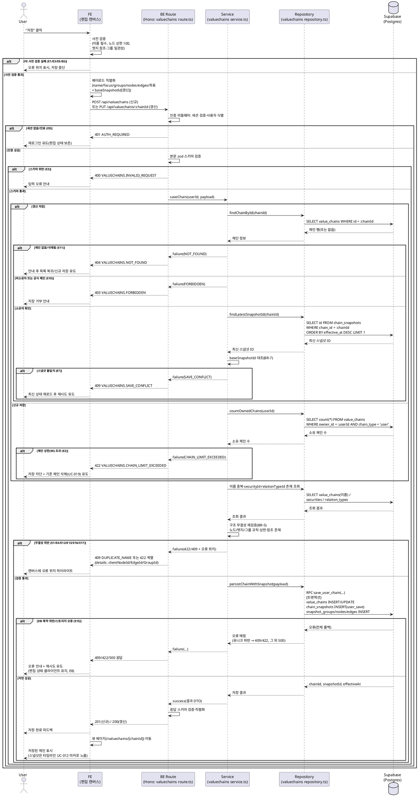

# UC-018: 밸류체인 저장

> 근거: `docs/userflow.md` 018(및 013~017 연계), `docs/prd.md` 3장(밸류체인 생성/편집 페이지)·6장(구조 이벤트 소싱·규모 상한), `docs/database.md` 1.2(구조 이벤트 소싱)·3.3(value_chains/chain_snapshots/snapshot_groups/snapshot_nodes/snapshot_edges), `docs/techstack.md` §4·§7(Hono route → service → repository → Supabase, 복잡 쓰기는 Postgres 함수 RPC).
> 본 유스케이스는 **사용자 체인의 저장(영속화)** 만 다룬다. 편집 조작(노드/관계/그룹)은 UC-015~017의 클라이언트 임시 상태에서 수행되며, 공식 체인의 저장은 UC-021(어드민 공식 체인 관리)로 이관된다.
> 외부 서비스 직접 연동 없음: 저장은 자체 DB에만 쓰기를 수행한다(PRD 8장 — 외부 API는 배치 적재 전용).

---

## 1. Primary Actor

- **User(체인 소유자)** — 로그인 사용자가 편집 캔버스의 임시 편집 상태(이름/기준/노드/관계/그룹/좌표)를 본인 소유 비공개 체인으로 저장한다.
- 참고: Admin의 공식 체인 저장은 동일 편집 로직을 재사용하되 UC-021의 관리 API로 처리한다(본 API 대상 아님).

## 2. Precondition (사용자 관점)

- 사용자가 로그인 상태다(이메일 인증 완료 계정).
- 편집 캔버스에 진입해 임시 편집 상태를 보유하고 있다. 진입 경로는 다음 중 하나:
  - 신규 생성(UC-013)으로 연 빈 캔버스 — 아직 DB에 체인이 없다(**신규 저장**).
  - 공식 체인 복제본(UC-014) 또는 기존에 저장한 내 체인의 편집(`/valuechains/[chainId]/edit`) — 체인이 이미 존재한다(**갱신 저장**).
- 체인 이름과 기준(산업/기업 중심)이 편집 상태에 설정되어 있다(이름 누락 시 저장 단계에서 차단).

## 3. Trigger

- 사용자가 편집 캔버스에서 **"저장"** 상호작용을 실행한다.

## 4. Main Scenario

1. User가 편집 캔버스에서 저장을 클릭한다.
2. FE가 클라이언트 측 사전 검증을 수행한다: 이름 필수, 노드 상한(체인당 100), 엣지 참조 유효성(자기 참조 금지·동일 쌍+동일 관계 종류 중복 금지), 그룹 소속 일관성(한 노드 최대 1그룹, 그룹은 해당 체인 내부).
3. FE가 임시 편집 상태를 저장 페이로드로 직렬화한다: `name`, `focusType`, `focusSecurityId`, `groups[]`, `nodes[]`(노드 좌표 포함), `edges[]`, (갱신 시) `baseSnapshotId`(편집 시작 시점에 로드했던 최신 스냅샷 ID).
4. FE가 신규면 `POST /api/valuechains`, 갱신이면 `PUT /api/valuechains/:chainId`를 호출한다.
5. BE Route(Hono)가 인증 미들웨어로 세션을 검증해 사용자를 식별하고, 요청 본문을 zod 스키마로 검증한다.
6. Service가 비즈니스 검증을 수행한다:
   1. (갱신) Repository로 대상 체인을 조회해 `chain_type='user'`·소유자 일치·미삭제 여부를 확인한다.
   2. (갱신) 최신 스냅샷 ID를 조회해 `baseSnapshotId`와 대조한다(낙관적 잠금 — 불일치 시 저장 충돌).
   3. (신규) 사용자 소유 체인 수를 조회해 1인당 상한(`MAX_CHAINS_PER_USER=50`) 미만인지 확인한다.
   4. 동일 사용자 내 이름 중복 여부를 확인한다.
   5. 구조 무결성을 재검증한다: 노드 상한(`MAX_NODES_PER_CHAIN=100`)·노드 규칙(상장기업=종목 연결 필수, 자유 주체=유형/이름 필수, 동일 종목 1개)·엣지 규칙·그룹 규칙, `relationTypeId`/`securityId` 존재 확인.
7. Repository가 Postgres 함수(RPC) 1회 호출로 **원자적 저장 트랜잭션**을 실행한다:
   - `value_chains` INSERT(신규: `chain_type='user'`, `owner_id`, 비공개) 또는 UPDATE(갱신: 이름/기준),
   - `chain_snapshots` INSERT 1건(`change_source='user_save'`, `effective_at=저장 시각`, `created_by=사용자`),
   - `snapshot_groups` / `snapshot_nodes`(그룹 소속·좌표 포함) / `snapshot_edges` INSERT — 편집 결과 전체 구성을 스냅샷 단위로 기록.
   - DB 제약(부분 유니크 이름, `uq(snapshot_id, security_id)`, 자기 참조 CHECK, 복합 FK)이 최종 방어선으로 동작한다.
8. 커밋 성공 시 Service가 결과 DTO(`chainId`, `snapshotId`, `effectiveAt` 등)를 반환하고, Route가 201(신규)/200(갱신)으로 응답한다.
9. FE가 저장 완료 피드백을 표시하고 뷰 페이지(`/valuechains/[chainId]`)로 이동한다. 이 저장은 스냅샷 1건으로 기록되어 이후 타임라인(UC-012)의 마커·복원 대상이 된다.

**성공 종료 조건**: 체인 헤더가 생성/갱신되고 저장 1회당 스냅샷 1건(노드/관계/그룹/좌표)이 기록된 상태로, 사용자가 뷰 페이지에서 저장된 체인을 확인한다.

## 5. Edge Cases

| # | 상황 | 처리 |
|---|------|------|
| E1 | 노드 상한(100) 초과 | FE 사전 차단 + 서버 재검증 실패 시 `422 NODE_LIMIT_EXCEEDED` — 저장 차단 안내 |
| E2 | 1인당 체인 상한(50) 도달(신규 저장) | `422 CHAIN_LIMIT_EXCEEDED` — 저장 차단 + 기존 체인 삭제(UC-019) 유도. UC-013의 사전 확인 통과 후 타 기기에서 생성돼 초과한 경우도 여기서 최종 차단 |
| E3 | 이름 미입력/형식 오류 | FE 제출 차단, 우회 요청은 `400 INVALID_REQUEST` |
| E4 | 이름 중복(동일 사용자 내) | `409 DUPLICATE_NAME` — 저장 차단, 이름 변경 유도(타 사용자 간 중복은 허용) |
| E5 | 유효하지 않은 엣지 참조(자기 참조/동일 쌍+동일 종류 중복/미존재 노드 참조) | `422 INVALID_EDGE` + 오류 위치(`clientEdgeId`) 반환 → FE가 해당 엣지 하이라이트 |
| E6 | 유효하지 않은 그룹 참조(미존재 `clientGroupId`/그룹 이름 누락) | `422 INVALID_GROUP` + 오류 위치 반환 → FE가 해당 그룹/노드 표시 |
| E7 | 저장 충돌(다른 탭/기기에서 같은 체인을 먼저 저장) | `baseSnapshotId` ≠ 최신 스냅샷 → `409 SAVE_CONFLICT` — 최신 상태 재로드 후 재시도 유도(낙관적 잠금) |
| E8 | 네트워크 중단/타임아웃 | 재시도 유도. 임시 편집 상태는 클라이언트에 유지(자동 저장 없음 → 이탈 시 미저장 손실 경고, UC-013 정책) |
| E9 | 세션 만료 | `401 AUTH_REQUIRED` — 재로그인 유도, 편집 상태는 클라이언트에 보존 후 재시도 |
| E10 | 비소유자 갱신 시도 / 공식 체인 대상 호출 | `403 FORBIDDEN` — 저장 거부(공식 체인 저장은 UC-021 관리 API 전용) |
| E11 | 갱신 대상 체인이 이미 삭제됨 | `404 NOT_FOUND` — 안내 후 신규 저장 유도 또는 목록 복귀 |
| E12 | 존재하지 않는 `securityId`(편집 중 종목 마스터 변동) | `422 SECURITY_NOT_FOUND` — 해당 노드 표시, 노드 수정 유도 |
| E13 | 존재하지 않는 `relationTypeId` | `422 INVALID_RELATION_TYPE` — 해당 엣지 표시 |
| E14 | 편집 중 관계 종류가 비활성화됨 | 저장은 허용(존재 검증만 수행 — 기존 엣지 유지 원칙, UC-016/024). 신규 선택 차단은 UC-016의 FE 책임 |
| E15 | 저장 트랜잭션 부분 실패(제약 위반·스토리지 오류) | 트랜잭션 전체 롤백(부분 저장 없음). 제약 위반은 해당 409/422 코드로 매핑, 그 외 `500 SAVE_FAILED` + 재시도 유도 |
| E16 | 자유 주체 필수 필드 누락/`nodeKind`-필드 조합 위반 | `422 INVALID_NODE` — 해당 노드 표시(FE에서도 UC-015 단계에서 사전 차단) |
| E17 | 동일 종목 노드 2개 이상 | `422 DUPLICATE_SECURITY_NODE` — FE 사전 차단 + DB 유니크(`uq(snapshot_id, security_id)`) 최종 강제 |

## 6. Business Rules

### 6.1 규칙

- **BR-1 (저장 단위 = 스냅샷 1건)**: 사용자 체인도 저장 1회당 스냅샷 1건(`chain_snapshots`, `change_source='user_save'`, `effective_at=저장 시각`, `created_by=사용자`)을 기록한다. 스냅샷은 불변이며 "현재 구성" = 최신 스냅샷이다(별도 current 테이블 없음). 이 스냅샷이 타임라인(UC-012) 복원과 지표 집계(029)의 기준이 된다.
- **BR-2 (소유·공개 범위)**: 저장된 체인은 `chain_type='user'`, `owner_id=현재 사용자`, 비공개(본인만 열람)다. 복제본(UC-014)의 출처(`source_chain_id`)는 복제 시점에 기록된 값을 유지하며 저장이 변경하지 않는다.
- **BR-3 (규모 상한, 상수 관리)**: 체인당 노드 최대 100개(`MAX_NODES_PER_CHAIN`), 1인당 체인 최대 50개(`MAX_CHAINS_PER_USER`) — `packages/domain/constants`에서 관리, 하드코딩 금지. 체인 수 상한은 신규 저장에만 적용한다.
- **BR-4 (이름 정책)**: 이름 필수. 동일 사용자 내 이름 중복 불허(부분 유니크 `uq(owner,name) user`), 타 사용자 간 중복 허용.
- **BR-5 (서버 최종 검증)**: FE 사전 검증(UC-013~017)과 무관하게 서버가 무결성을 최종 재검증한다 — 상한·이름·노드 규칙(UC-015: 상장기업=종목 연결, 자유 주체=유형/이름 필수, 동일 종목 1개)·엣지 규칙(UC-016: 자기 참조 금지, 동일 쌍+동일 종류 중복 금지, 서로 다른 종류 병존 허용)·그룹 규칙(UC-017: 한 노드 최대 1그룹, 그룹은 체인 내부 한정)·참조 존재(`securityId`/`relationTypeId`).
- **BR-6 (원자성)**: 체인 헤더 + 스냅샷 + 그룹/노드/엣지 저장은 단일 Postgres 함수(RPC) 내 트랜잭션으로 수행한다(techstack §7 — supabase-js 단건 호출로 원자성 확보). 부분 실패 시 전체 롤백하며 부분 저장 상태를 남기지 않는다.
- **BR-7 (낙관적 잠금)**: 갱신 저장은 `baseSnapshotId`(편집 시작 시 로드한 최신 스냅샷 ID)를 서버의 현재 최신 스냅샷과 대조한다. 불일치 시 저장을 거부하고(409) 최신 재로드 후 재시도를 유도한다. 신규 저장은 대조 대상이 없다.
- **BR-8 (관계 종류 검증 범위)**: 저장 시 `relationTypeId`는 **존재 여부만** 검증한다. `is_active=false` 종류의 참조는 허용한다 — 비활성화는 신규 선택만 차단하고 기존 엣지·과거 스냅샷은 유지하는 정책(UC-024)이며, 저장 페이로드에서는 신규/기존 엣지를 구분하지 않기 때문이다. 활성 종류 강제는 UC-016의 FE 선택 단계 책임이다.
- **BR-9 (좌표 보존)**: 노드 좌표(`position_x/y`)는 스냅샷에 함께 저장되어 타임라인 복원 시 배치가 재현된다. 뷰 페이지(UC-009)에서의 표시용 위치 조정은 저장하지 않는다.
- **BR-10 (공식 체인 제외)**: 본 API는 사용자 체인 전용이다. 공식 체인(`chain_type='official'`) 대상 호출은 403으로 거부하며, 공식 체인 저장(구조 변경 이벤트 기록 포함)은 UC-021의 어드민 API가 담당한다.
- **BR-11 (자동 저장 없음, MVP)**: 편집 초안 자동 저장은 없다. 저장 실패/이탈 시 임시 편집 상태는 클라이언트에만 존재하며, 미저장 이탈 경고로 손실을 안내한다.
- **BR-12 (인가 방식)**: RLS 미사용. 인증·인가(소유자 검증)는 Hono 미들웨어와 Service 계층의 서버 측 검증으로 처리한다.

### 6.2 API Specification

응답은 공통 래퍼를 따른다: 성공 `{ "ok": true, "data": ... }`, 실패 `{ "ok": false, "error": { "code", "message", "details"? } }`.

#### (1) 신규 저장 — `POST /api/valuechains`

- 소속: `features/valuechains/backend/route.ts`
- 인증: 필수(세션 기반, Hono 인증 미들웨어)

**Request Body**

| 필드 | 타입 | 필수 | 규칙 |
|---|---|---|---|
| `name` | string | O | 공백 불가, 동일 사용자 내 유일(BR-4) |
| `focusType` | `industry` \| `company` | O | 밸류체인 기준 |
| `focusSecurityId` | uuid \| null | X | 기업 중심일 때 선택 연결(UC-013 BR-6) |
| `baseSnapshotId` | null | O | 신규 저장은 항상 `null` |
| `groups[]` | array | O(빈 배열 허용) | `clientGroupId`(string, 페이로드 내 유일), `name`(string, 필수) |
| `nodes[]` | array | O | UC-015 §6.2(2) 노드 페이로드 스키마: `clientNodeId`, `nodeKind`, `securityId`, `subjectName`, `subjectType`, `subjectMemo`, `groupClientId`(0..1, `groups[]` 참조), `positionX`, `positionY`. 최대 100개 |
| `edges[]` | array | O(빈 배열 허용) | `clientEdgeId`(string), `sourceClientNodeId`/`targetClientNodeId`(`nodes[]` 참조, 동일 금지), `relationTypeId`(uuid) |

```json
{
  "name": "나의 2차전지 체인",
  "focusType": "industry",
  "focusSecurityId": null,
  "baseSnapshotId": null,
  "groups": [
    { "clientGroupId": "g1", "name": "소재" }
  ],
  "nodes": [
    {
      "clientNodeId": "n1",
      "nodeKind": "listed_company",
      "securityId": "8f1c2e64-....",
      "subjectName": null,
      "subjectType": null,
      "subjectMemo": null,
      "groupClientId": "g1",
      "positionX": 120.5,
      "positionY": -48
    },
    {
      "clientNodeId": "n2",
      "nodeKind": "free_subject",
      "securityId": null,
      "subjectName": "국내 소비자",
      "subjectType": "consumer",
      "subjectMemo": null,
      "groupClientId": null,
      "positionX": 320,
      "positionY": 96
    }
  ],
  "edges": [
    {
      "clientEdgeId": "e1",
      "sourceClientNodeId": "n1",
      "targetClientNodeId": "n2",
      "relationTypeId": "b7d9a410-...."
    }
  ]
}
```

**Response `201`**

```json
{
  "ok": true,
  "data": {
    "chainId": "3c9a7f21-....",
    "snapshotId": "d2e5b830-....",
    "effectiveAt": "2026-07-05T18:30:00+09:00",
    "nodeCount": 2,
    "edgeCount": 1,
    "groupCount": 1
  }
}
```

#### (2) 갱신 저장 — `PUT /api/valuechains/:chainId`

- 인증: 필수 + **소유자 검증**(BR-10·BR-12)
- Request Body: (1)과 동일하되 `baseSnapshotId`(uuid)가 **필수** — 편집 시작 시 로드한 최신 스냅샷 ID(BR-7)
- Response `200`: (1)의 `data`와 동일 구조(`chainId`는 경로의 체인)

#### 공통 에러 코드

| HTTP | code | 조건 |
|---|---|---|
| 400 | `VALUECHAINS.INVALID_REQUEST` | 본문 스키마 위반(이름 누락/형식·타입 오류 등) |
| 401 | `AUTH_REQUIRED` | 세션 없음/만료 |
| 403 | `VALUECHAINS.FORBIDDEN` | 비소유자 갱신 시도, 공식 체인 대상 호출 |
| 404 | `VALUECHAINS.NOT_FOUND` | 갱신 대상 체인 없음/삭제됨 |
| 409 | `VALUECHAINS.DUPLICATE_NAME` | 동일 사용자 내 이름 중복 |
| 409 | `VALUECHAINS.SAVE_CONFLICT` | `baseSnapshotId` ≠ 최신 스냅샷(동시 편집 충돌) |
| 422 | `VALUECHAINS.CHAIN_LIMIT_EXCEEDED` | 신규 저장 시 1인당 체인 상한(50) 초과 |
| 422 | `VALUECHAINS.NODE_LIMIT_EXCEEDED` | 노드 상한(100) 초과 |
| 422 | `VALUECHAINS.INVALID_NODE` | 자유 주체 필수 필드 누락/`nodeKind`-필드 조합 위반 |
| 422 | `VALUECHAINS.DUPLICATE_SECURITY_NODE` | 동일 종목 노드 2개 이상 |
| 422 | `VALUECHAINS.SECURITY_NOT_FOUND` | 존재하지 않는 `securityId` |
| 422 | `VALUECHAINS.INVALID_EDGE` | 자기 참조/동일 쌍+동일 종류 중복/미존재 `clientNodeId` 참조 |
| 422 | `VALUECHAINS.INVALID_RELATION_TYPE` | 존재하지 않는 `relationTypeId` |
| 422 | `VALUECHAINS.INVALID_GROUP` | 미존재 `clientGroupId` 참조/그룹 이름 누락 |
| 500 | `VALUECHAINS.SAVE_FAILED` | 저장 트랜잭션 실패(롤백 완료 후) |

- 422 계열 응답의 `error.details`에는 오류 위치(`clientNodeId`/`clientEdgeId`/`clientGroupId` 목록)를 포함해 FE가 캔버스에서 해당 요소를 하이라이트한다(E5/E6/E12/E13/E16).

### 6.3 Database Operations

| 단계 | 테이블 | 연산 | 내용 |
|---|---|---|---|
| 인증 | `profiles` | SELECT | 인증 미들웨어에서 사용자 식별·role 로드 |
| 검증(갱신) | `value_chains` | SELECT | 대상 체인 로드 — `chain_type`/`owner_id`/삭제 여부 확인(BR-10) |
| 검증(갱신) | `chain_snapshots` | SELECT | 체인의 최신 스냅샷 ID 1건(`ORDER BY effective_at DESC LIMIT 1`) — `baseSnapshotId` 대조(BR-7) |
| 검증(신규) | `value_chains` | SELECT | `count(*) WHERE owner_id=:userId AND chain_type='user'` — 체인 상한(BR-3) |
| 검증 | `value_chains` | SELECT | 동일 사용자 내 이름 중복 확인(BR-4, 최종 강제는 부분 유니크) |
| 검증 | `securities` | SELECT | `nodes[].securityId` 존재 확인(최종 강제는 `snapshot_nodes.security_id` FK RESTRICT) |
| 검증 | `relation_types` | SELECT | `edges[].relationTypeId` 존재 확인(BR-8, 최종 강제는 FK RESTRICT) |
| 저장(트랜잭션, RPC) | `value_chains` | INSERT / UPDATE | 신규: `chain_type='user'`, `owner_id`, `name`, `focus_type`, `focus_security_id` INSERT. 갱신: `name`/`focus_type`/`focus_security_id` UPDATE |
| 저장(트랜잭션) | `chain_snapshots` | INSERT | 1건 — `chain_id`, `effective_at=now()`, `change_source='user_save'`, `created_by` |
| 저장(트랜잭션) | `snapshot_groups` | INSERT | 페이로드 `groups[]` 전체(`snapshot_id` 소속) |
| 저장(트랜잭션) | `snapshot_nodes` | INSERT | 페이로드 `nodes[]` 전체 — `group_id`(복합 FK로 동일 스냅샷 정합), `security_id`, `position_x/y`. `uq(snapshot_id, security_id)`·`chk(node_kind)` 검증 |
| 저장(트랜잭션) | `snapshot_edges` | INSERT | 페이로드 `edges[]` 전체 — `source/target_node_id`(복합 FK), `relation_type_id`. `chk(no_self)`·`uq(snapshot, source, target, relation_type)` 검증 |
| — | `chain_daily_metrics` 등 | 없음 | 지표 집계는 배치(029)가 다음 실행부터 새 스냅샷 구성 기준으로 수행(과거 재계산 없음) |

- 저장 트랜잭션은 단일 Postgres 함수(예: `save_user_chain`)로 정의하고 `client.rpc()`로 호출한다(BR-6, techstack §7). SQL 로직은 마이그레이션에 포함해 SOT를 유지한다.

### 6.4 External Service Integration

- **없음.** 본 유스케이스의 읽기/쓰기는 전부 자체 DB(Supabase Postgres)에서 수행된다. 외부 API(OpenDART/SEC EDGAR/토스증권)는 배치 적재 전용이며(PRD 8장), 저장 경로에서 호출되지 않는다.

---

## 7. Sequence Diagram


