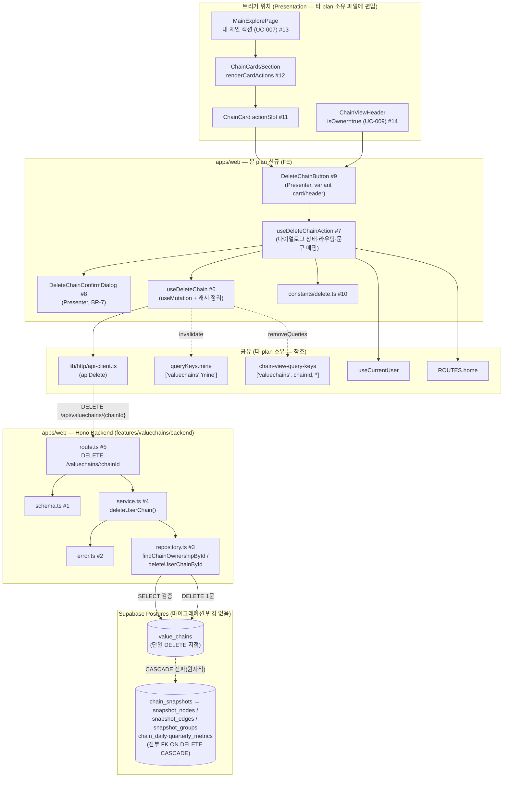

# Plan: UC-019 밸류체인 삭제 (내 체인 관리)

> 근거: `docs/usecases/019/spec.md`, `docs/usecases/000_decisions.md`(D-2·B-1 연계, C-2는 조회 UC 한정 — 아래 범위 확정 3 참조), `docs/techstack.md` §4·§7, `docs/database.md` §3.3·§3.6, `supabase/migrations/0005~0006·0010~0011`(FK CASCADE 확인 완료), `docs/usecases/007/plan.md`(내 체인 목록·카드·쿼리 키 소유), `docs/usecases/009/plan.md`(chain-view 헤더·체인 스코프 쿼리 키 소유), `docs/usecases/013/plan.md`(상한 게이트 — 삭제로 여유 증가), `docs/usecases/014/plan.md`(뷰/카드에 mutation 버튼을 편입하는 선례), `.claude/skills/spec_to_plan/references/hono-backend-guide.md`.

## 범위 확정 (spec 대비 결정·선행 plan 반영)

1. **신규 마이그레이션 없음.** 스냅샷(`chain_snapshots`→CASCADE)·노드/엣지/그룹(`snapshot_*`→CASCADE)·일별/분기 지표(`chain_daily_metrics`/`chain_quarterly_metrics`→CASCADE)·`llm_relation_proposals`(공식 체인 전용이라 사용자 체인엔 0행, FK도 CASCADE)의 종속 삭제가 전부 기존 0005~0011 마이그레이션의 `ON DELETE CASCADE`로 보장된다. 애플리케이션은 **`value_chains` 단일 DELETE 1문**만 실행하며(BR-3/E4), 별도 트랜잭션 RPC도 불필요하다(UC-014의 `clone_value_chain` 같은 함수 추가 없음).
2. **트리거 위치 2곳.** spec Precondition의 "내 밸류체인 목록(`/valuechains/mine`)"은 별도 페이지가 아니라 **main-explore(`/`)의 "내 밸류체인" 섹션**이다(`docs/pages`에는 main-explore만 존재, userflow 007). 두 번째 트리거는 chain-view(`/valuechains/[chainId]`) 헤더의 소유자 영역이다. chain-view requirement의 "사이드이펙트 없음" 원칙과의 정합은 UC-014 복제 버튼 선례를 따른다 — **chain-view Flux Store에 Action을 추가하지 않고**, 삭제는 서버 상태 변이(mutation)로만 처리한다.
3. **에러 코드는 spec §6.2 그대로**(403 `CHAIN_FORBIDDEN`/`OFFICIAL_CHAIN_DELETE_FORBIDDEN`). 결정 C-2의 "404 통일"은 조회 계열(009·010·012) 한정이며 UC-019에는 적용되지 않는다(000_decisions에 019 관련 재정의 없음). 단, **미존재 체인은 403/404가 아니라 멱등 204**다(BR-4 — 존재 비노출 문제도 발생하지 않음).
4. **API-2(`GET /api/valuechains/mine`)는 UC-007 소유** — 본 plan은 삭제 성공 시 해당 쿼리 캐시를 무효화하는 연계 지점만 갖는다. 이 무효화로 `pagination.totalCount`(=소유 체인 수, D-2)가 갱신되어 UC-013 상한 게이트의 여유 증가(BR-6)가 **별도 코드 없이** 반영된다.
5. **외부 서비스 연동 없음**(spec §6.4 — 자체 DB만 사용). 외부 연동 클라이언트 모듈은 본 plan에 없다.
6. E10(다른 탭의 삭제된 체인 뷰/편집 화면)은 UC-009/UC-018의 "체인 미존재" 폴백 소관 — 본 plan은 같은 탭 내 잔존 캐시 제거(`removeQueries`)까지만 책임진다.

---

## 개요

### A. 신규 모듈 (본 plan 소유)

| # | 모듈 | 위치 | 설명 |
| --- | --- | --- | --- |
| 1 | Zod 스키마 (delete 추가분) | `apps/web/src/features/valuechains/backend/schema.ts` | `chainId` 경로 파라미터 스키마(기존 정의 재사용) + `DeleteTargetChainRowSchema`(소유 검증 조회 Row) |
| 2 | 에러 코드 (delete 추가분) | `apps/web/src/features/valuechains/backend/error.ts` | `CHAIN_FORBIDDEN`·`OFFICIAL_CHAIN_DELETE_FORBIDDEN`·`INTERNAL_ERROR` 추가(400/401 코드는 기존 공통 재사용) |
| 3 | Repository (delete 추가분) | `apps/web/src/features/valuechains/backend/repository.ts` | `findChainOwnershipById`·`deleteUserChainById` — Supabase 접근 캡슐화(Persistence) |
| 4 | Service (delete 추가분) | `apps/web/src/features/valuechains/backend/service.ts` | `deleteUserChain` — 멱등/공식 체인/소유자 검증 순서 오케스트레이션(repository 인터페이스에만 의존) |
| 5 | Route (delete 추가분) | `apps/web/src/features/valuechains/backend/route.ts` | `DELETE /valuechains/:chainId` — 인증·UUID 검증·204 무본문 응답 |
| 6 | 삭제 mutation 훅 | `apps/web/src/features/valuechains/hooks/useDeleteChain.ts` | `useMutation` — API 호출 + 내 목록 캐시 무효화 + 체인 스코프 캐시 제거 |
| 7 | 삭제 액션 훅 (Container 로직) | `apps/web/src/features/valuechains/hooks/useDeleteChainAction.ts` | 확인 다이얼로그 상태(BR-7)·확정 실행·성공 후 라우팅(뷰→목록)·에러 코드→문구 매핑 |
| 8 | 확인 다이얼로그 Presenter | `apps/web/src/features/valuechains/components/DeleteChainConfirmDialog.tsx` | 되돌릴 수 없음·종속 데이터 삭제 안내 + [삭제]/[취소] (shadcn-ui `alert-dialog`) |
| 9 | 삭제 버튼 Presenter | `apps/web/src/features/valuechains/components/DeleteChainButton.tsx` | `variant: 'card' | 'header'` — 내 체인 카드·체인 뷰 헤더 양쪽 재사용(UC-014 `CloneChainButton` 선례) |
| 10 | 삭제 UI 문구 상수 | `apps/web/src/features/valuechains/constants/delete.ts` | 확인 문구·에러 코드별 안내 문구·라벨 상수(하드코딩 금지) |

### B. 수정 모듈 (타 plan 소유 파일 — 최소 확장, 소유 plan 계약 유지)

| # | 모듈 | 위치 | 수정 내용 |
| --- | --- | --- | --- |
| 11 | 체인 카드 | `apps/web/src/features/valuechains/components/ChainCard.tsx` (UC-007 소유) | optional `actionSlot?: ReactNode` prop 추가 — 미전달 시 기존 렌더와 완전 동일 |
| 12 | 카드 섹션 | `apps/web/src/features/valuechains/components/ChainCardsSection.tsx` (UC-007 소유) | optional `renderCardActions?: (card: ChainCard) => ReactNode` prop 추가 — 카드에 `actionSlot` 전달 |
| 13 | 메인 컨테이너 | `apps/web/src/features/explore/components/MainExplorePage.tsx` (UC-007 소유) | **내 체인 섹션에만** `renderCardActions`로 삭제 버튼 주입(공식 섹션은 미전달) |
| 14 | 체인 뷰 헤더 | `apps/web/src/features/valuechains/components/ChainViewHeader.tsx` (UC-009 소유) | `chain.isOwner === true`일 때 편집 링크 옆 삭제 버튼 1줄 삽입(UC-014 선례와 동일한 편입 방식) |

### C. 공유 모듈 (타 plan 소유 — 위치·계약 참조만, 재정의 금지)

| 모듈 | 위치 | 의존 계약 |
| --- | --- | --- |
| Hono 공통 인프라 | `apps/web/src/backend/{hono,http,middleware}/*` | errorBoundary→withAppContext→withSupabase→withAuth 체인, `HandlerResult`/`respond()`(UC-007 A-3·A-5) |
| FE API 클라이언트 | `apps/web/src/lib/http/api-client.ts` | 선행 구현이 확정한 단일 위치를 따름(중복 생성 금지). **DELETE 메서드 미지원 시 `apiDelete(path)` 추가**(모듈 6에서 수행) — 204 무본문 응답을 오류 없이 처리해야 함 |
| 내 목록 쿼리 키 | `apps/web/src/features/valuechains/hooks/queryKeys.ts` (UC-007) | `chainCardQueryKeys.mine = ['valuechains','mine']` — 삭제 성공 시 invalidate 대상 |
| 체인 뷰 쿼리 키 | `apps/web/src/features/valuechains/hooks/chain-view-query-keys.ts` (UC-009) | 체인 스코프 프리픽스 `['valuechains', chainId]` — 삭제 성공 시 removeQueries 대상 |
| 인증 세션 훅 | `apps/web/src/features/auth/hooks/useCurrentUser.ts` (UC-001~003) | 401 대응·재로그인 유도에 사용 |
| 라우트 상수 | `apps/web/src/constants/routes.ts` (UC-007 A-6) | `ROUTES.home`(내 밸류체인 목록이 있는 메인)·`withReturnTo()` |

### D. 데이터베이스

| 항목 | 내용 |
| --- | --- |
| 신규 마이그레이션 | **없음** (범위 확정 1) |
| 실행 쿼리 | `SELECT id, chain_type, owner_id FROM value_chains WHERE id = :chainId` (검증) → `DELETE FROM value_chains WHERE id = :chainId AND chain_type = 'user' AND owner_id = :userId` (본삭제 — 조건 삼중화로 TOCTOU에도 오삭제 원천 차단) |
| 원자성 | 단일 DELETE 문 + FK CASCADE 전파 = DB 수준 원자성(부분 실패 시 자동 전체 롤백, E4) |

---

## Diagram



데이터 흐름: Presentation(버튼→다이얼로그) → Container 로직(#7) → 서버 상태 변이(#6) → Route(#5) → Service(#4, 비즈니스 규칙) → Repository(#3, Supabase 접근) → 단일 DELETE + CASCADE. chain-view/main-explore의 Flux/리듀서에는 **어떤 Action도 추가하지 않는다**.

---

## Implementation Plan

### 1. Zod 스키마 (delete 추가분) — `features/valuechains/backend/schema.ts`

- 구현 내용:
  1. `chainId` 경로 파라미터 스키마: 기존 파일에 UC-009(B1)/UC-014(`CloneChainParamsSchema`)가 정의한 `z.object({ chainId: z.string().uuid() })` 형태의 스키마가 이미 있으면 **공용 `ChainIdParamsSchema`로 재사용**하고, 없으면 그 이름으로 신규 정의한다(E9의 400 판정 근거 — 동일 형태 스키마의 중복 정의 금지, DRY).
  2. `DeleteTargetChainRowSchema`(snake_case): `id`(uuid), `chain_type`(`z.enum(['official','user'])`), `owner_id`(uuid nullable — 공식 체인은 NULL) — 소유 검증 조회 결과. UC-014의 `SourceChainRowSchema`는 `owner_id`가 없어 재사용 불가(필드 셋이 다름).
  3. 응답 DTO 스키마 없음 — `204 No Content`는 본문이 없다(spec §6.2).
  4. 기존 파일에 다른 UC 스키마가 존재하므로 섹션 주석(`// ── UC-019 delete ──`)으로 구분해 **추가만** 한다.
- 의존성: 없음.
- Unit Tests: N/A (스키마 정의 — 검증 동작은 service/route 테스트에서 간접 확인).

### 2. 에러 코드 (delete 추가분) — `features/valuechains/backend/error.ts`

- 구현 내용: 기존 `as const` 객체에 spec §6.2 코드 추가 + 유니온 타입 확장:
  - `chainForbidden: 'CHAIN_FORBIDDEN'` (403, E1)
  - `officialChainDeleteForbidden: 'OFFICIAL_CHAIN_DELETE_FORBIDDEN'` (403, E2)
  - `internalError: 'INTERNAL_ERROR'` (500, E4)
  - `validationError: 'VALIDATION_ERROR'`(400, E9)·`unauthorized: 'UNAUTHORIZED'`(401, E6)는 기존 공통/타 UC 정의가 있으면 재사용하고 없을 때만 추가.
- 의존성: 없음. Unit Tests: N/A (상수 정의).

### 3. Repository (delete 추가분) — `features/valuechains/backend/repository.ts` (Persistence)

- 구현 내용:
  1. **인터페이스 우선 정의**(service는 이 인터페이스에만 의존 — techstack §4):

     ```typescript
     export interface ValuechainsDeleteRepository {
       findChainOwnershipById(chainId: string): Promise<DeleteTargetChainRow | null>;
       deleteUserChainById(chainId: string, ownerId: string): Promise<{ ok: true } | { ok: false; message: string }>;
     }
     export const createValuechainsDeleteRepository = (client: SupabaseClient): ValuechainsDeleteRepository => ...
     ```

  2. `findChainOwnershipById`: `from('value_chains').select('id, chain_type, owner_id').eq('id', chainId).maybeSingle()` — 0행이면 `null`(멱등 판정 입력, E3). 존재/타입/소유 **판정은 service 책임**(이 계층은 접근만).
  3. `deleteUserChainById`: `from('value_chains').delete().eq('id', chainId).eq('chain_type', 'user').eq('owner_id', ownerId)` —
     - **조건 삼중화**: DELETE 문 자체가 사용자 체인+소유자 일치를 재확인하므로, SELECT와 DELETE 사이의 어떤 경합(TOCTOU)에서도 공식 체인·타인 체인이 삭제될 수 없다(서버 측 이중 방어, BR-1/BR-2).
     - **영향 행 0건도 성공으로 취급**(반환 구분 불필요): 동시 삭제 경합(E8)에서 뒤에 도달한 요청도 멱등 성공 경로를 탄다.
     - Supabase error 발생 시에만 `{ ok: false, message }` (E4 → service가 500 매핑). 예외를 던지지 않는 Result 지향(기존 repository 컨벤션 유지).
  4. CASCADE 전파는 DB가 수행 — repository는 종속 테이블에 어떤 쿼리도 실행하지 않는다(단일 DELETE 원칙).
  5. 기존 파일의 UC-007/009/014 함수와 이름 충돌 없음 — delete 전용 인터페이스로 분리 export(기능 파일 공유, 인터페이스 단위 SRP).
- 의존성: 모듈 1(Row 스키마 타입), 공유 `SupabaseClient`.

**Unit Tests** (Supabase 클라이언트 모킹):

- [ ] `findChainOwnershipById` — 행 존재 시 `{ id, chain_type, owner_id }` 매핑 / 0행 시 `null` 반환
- [ ] `findChainOwnershipById` — Supabase error 시 예외가 아닌 실패 결과로 정규화(기존 컨벤션과 동일 형태)
- [ ] `deleteUserChainById` — `eq('id')`·`eq('chain_type','user')`·`eq('owner_id')` 3조건이 전부 적용되어 호출됨
- [ ] `deleteUserChainById` — 영향 행 0건 응답 → `{ ok: true }` (E8 멱등)
- [ ] `deleteUserChainById` — Supabase error → `{ ok: false, message }`, 예외 미발생

### 4. Service (delete 추가분) — `features/valuechains/backend/service.ts` (Business Logic)

- 구현 내용:
  1. 시그니처:

     ```typescript
     export const deleteUserChain = async (
       repo: ValuechainsDeleteRepository,
       userId: string,
       chainId: string,
     ): Promise<HandlerResult<null, ValuechainsServiceError, unknown>>
     ```

  2. 검증·실행 순서 (spec Main 6~8, 시퀀스 다이어그램과 1:1 — **순서 고정**):
     1. `findChainOwnershipById(chainId)` → `null`(미존재/이미 삭제) → **`success(null, 204)` 멱등 성공**(E3/BR-4 — repository 미호출로 종료).
     2. `chain_type === 'official'` → `failure(403, OFFICIAL_CHAIN_DELETE_FORBIDDEN)` (E2/BR-1 — 소유자 검증보다 먼저. UC-021 보관 처리 안내 문구는 FE 몫).
     3. `owner_id === null || owner_id !== userId` → `failure(403, CHAIN_FORBIDDEN)` (E1/BR-2 — `owner_id null`인 user 체인은 CHECK 제약상 불가능하지만 방어적으로 거부).
     4. `deleteUserChainById(chainId, userId)` → `{ ok: false }` → `failure(500, INTERNAL_ERROR)` (E4 — DB가 전체 롤백 보장, 재시도 유도는 FE 몫) / `{ ok: true }` → `success(null, 204)`.
  3. 순수성: repository 인터페이스 외 I/O 없음, 로깅 없음(route 책임), `Date` 미사용. 상한 카운트 감소(BR-6)를 위한 **별도 갱신 없음** — 소유 체인 수는 집계 기준이므로 삭제 자체로 충족.
- 의존성: 모듈 1·2·3, 공유 `response.ts`.

**Unit Tests** (`service.test.ts`, repository 모킹 — AAA 패턴):

- [ ] 미존재 체인 → 204 `success`, `deleteUserChainById` 미호출 (E3 멱등)
- [ ] 공식 체인(`chain_type='official'`, `owner_id=null`) → 403 `OFFICIAL_CHAIN_DELETE_FORBIDDEN`, delete 미호출 (E2)
- [ ] 타인 소유 user 체인 → 403 `CHAIN_FORBIDDEN`, delete 미호출 (E1)
- [ ] `owner_id=null`인 user 체인(비정상 데이터 방어) → 403 `CHAIN_FORBIDDEN`
- [ ] 본인 소유 user 체인 → `deleteUserChainById(chainId, userId)` 정확 인자로 1회 호출 후 204
- [ ] delete 결과 `{ ok: false }` → 500 `INTERNAL_ERROR` (E4)
- [ ] **검증 순서**: 공식 체인이면서 소유자 불일치인 입력 → `OFFICIAL_CHAIN_DELETE_FORBIDDEN`이 우선 반환(spec Main 6 순서)
- [ ] 조회 실패(repository 오류) → 500 `INTERNAL_ERROR`, delete 미호출

### 5. Route (delete 추가분) — `features/valuechains/backend/route.ts` + 앱 등록 확인

- 구현 내용:
  1. 기존 `registerValuechainsRoutes(app)`에 `app.delete('/valuechains/:chainId', handler)` 추가(신규 등록 함수 없음 — UC-007에서 이미 `backend/hono/app.ts`에 등록됨, 수정 불필요).
  2. 핸들러 절차:
     - `getAuthUser(c)`가 null → `respond(c, failure(401, UNAUTHORIZED, ...))` (E6 — withAuth 미들웨어는 비차단이므로 route가 판정).
     - `ChainIdParamsSchema.safeParse(c.req.param())` 실패 → `respond(c, failure(400, VALIDATION_ERROR, ..., parsed.error.format()))` (E9).
     - Request Body 없음 — 파싱하지 않는다(spec §6.2).
     - `createValuechainsDeleteRepository(getSupabase(c))` 생성 → `deleteUserChain(repo, user.id, chainId)` 호출.
     - `!result.ok`이면 `getLogger(c)`로 로깅(500은 error 레벨, 403은 warn) 후 `respond(c, result)`.
     - **성공(204)은 무본문 응답**: `if (result.ok) return c.body(null, 204);` — 공통 `respond()`는 JSON 본문을 직렬화하므로 204 경로만 route에서 직접 반환한다(공통 헬퍼 수정 없음 — 타 UC 영향 차단).
  3. 인가 판정을 클라이언트에 의존하지 않음(BR-2) — FE 버튼 노출 여부와 무관하게 서버가 전 케이스를 재검증.
- 의존성: 모듈 1~4, 공유 Hono 인프라.

**QA Sheet** (HTTP 통합 확인):

| # | 시나리오 | 기대 결과 |
| --- | --- | --- |
| 1 | 소유자가 본인 user 체인에 DELETE | 204, 응답 본문 없음 |
| 2 | #1 직후 DB 확인 | `value_chains`·`chain_snapshots`·`snapshot_nodes/edges/groups`·`chain_daily/quarterly_metrics`에서 해당 체인 관련 행 전부 0건 |
| 3 | #1과 동일 요청 재전송 (E3/E8) | 204 (멱등 — 오류 아님) |
| 4 | 비로그인(세션 쿠키 없음) DELETE | 401 `UNAUTHORIZED` |
| 5 | `chainId`가 UUID 아님 (`/api/valuechains/abc`) | 400 `VALIDATION_ERROR` |
| 6 | 타인 소유 user 체인 DELETE (E1) | 403 `CHAIN_FORBIDDEN`, 대상 체인 DB 잔존 |
| 7 | 공식 체인 DELETE (E2) | 403 `OFFICIAL_CHAIN_DELETE_FORBIDDEN`, 공식 체인 DB 잔존 |
| 8 | DB 오류 모의(repository 강제 실패) | 500 `INTERNAL_ERROR` + error 로그, 부분 삭제 상태 없음(E4) |
| 9 | 삭제된 체인이 참조하던 `securities`/`relation_types` 행 | 그대로 유지(BR-8) |
| 10 | 공식 체인을 출처로 복제했던 사본 삭제 후 원본 확인 (E5) | 원본 공식 체인·다른 사본 무영향 |

### 6. 삭제 mutation 훅 — `features/valuechains/hooks/useDeleteChain.ts`

- 구현 내용:
  1. `useMutation<void, ApiError, { chainId: string }>` — `mutationFn`: 공유 api-client로 `DELETE /api/valuechains/{chainId}` (Body 없음). api-client에 DELETE 지원이 없으면 `apiDelete(path): Promise<void>`를 추가한다 — **204 무본문을 JSON 파싱 시도 없이 성공 처리**해야 함(기존 `apiGet` 계약과 동일한 `ApiError` 정규화 유지).
  2. `onSuccess(_, { chainId })`:
     - `queryClient.invalidateQueries({ queryKey: chainCardQueryKeys.mine })` — 내 밸류체인 목록에서 항목 제거 + `totalCount` 감소(Main 9·BR-6, UC-013 상한 게이트 자동 반영).
     - `queryClient.removeQueries({ queryKey: ['valuechains', chainId] })` — 삭제된 체인의 구조/타임라인/지표/노드 상세 등 체인 스코프 캐시 전부 제거(UC-009 키 팩토리의 공통 프리픽스 계약. `'mine'`/`'official'`은 문자열 세그먼트라 UUID 프리픽스와 충돌 없음).
  3. 재시도 없음(`retry: 0`) — 멱등이긴 하나 실패는 사용자 수동 재시도로 처리(E4 문구 유도), 이중 재시도 방지(api-client도 재시도 없음).
  4. 라우팅·토스트·다이얼로그는 이 훅에 두지 않는다(단일 책임: 서버 상태 변이 + 캐시 정리만 — UC-014 `useCloneChain` 선례).
- 의존성: 공유 api-client, UC-007 `queryKeys`, UC-009 `chain-view-query-keys`(프리픽스 계약).

**Unit Tests** (mock api-client + QueryClient):

- [ ] 성공 시 `chainCardQueryKeys.mine` invalidate 호출 + `['valuechains', chainId]` removeQueries 호출
- [ ] 실패 시 `ApiError { status, code }`가 호출자에 그대로 전파, invalidate/remove 미호출
- [ ] 204 무본문 응답을 성공으로 처리(JSON 파싱 오류 없음)

### 7. 삭제 액션 훅 — `features/valuechains/hooks/useDeleteChainAction.ts` (Container 로직)

- 구현 내용:
  1. 시그니처: `useDeleteChainAction(params: { chainId: string; chainName: string; source: 'list' | 'view' }): { isDialogOpen, requestDelete(), confirmDelete(), cancelDelete(), isDeleting }`.
  2. 절차 (spec Main 1~9):
     - `requestDelete()`: 다이얼로그 오픈만(API 미호출 — BR-7 확인 단계 필수).
     - `cancelDelete()`: 다이얼로그 닫기, 상태 무변화(E7 — 요청 미발생).
     - `confirmDelete()`: `isDeleting`(=`mutation.isPending`) 중이면 무시(중복 확정 방지) → `useDeleteChain().mutate({ chainId })`.
     - `onSuccess`: 다이얼로그 닫기 + 성공 토스트(`DELETE_SUCCESS_MESSAGE`). `source==='view'`면 `router.replace(ROUTES.home)` — 내 밸류체인 목록이 있는 메인으로 이동(Main 9. `replace` 사용: 뒤로가기로 삭제된 뷰 복귀 방지). `source==='list'`면 라우팅 없음(캐시 무효화로 목록에서 항목 소멸).
     - `onError`: `DELETE_ERROR_MESSAGES[error.code] ?? 기본 문구` 토스트. `status===401`이면 `router.push(withReturnTo(현재 경로))`로 재로그인 유도(E6). 403/500은 다이얼로그를 닫고 안내만(대상 잔존).
  3. main-explore·chain-view 어느 쪽의 리듀서/Flux Store에도 Action을 추가하지 않는다 — 다이얼로그 개폐는 이 훅의 로컬 상태(휘발), 서버 데이터 변화는 TanStack Query 캐시 소관(범위 확정 2).
- 의존성: 모듈 6·10, 공유 `useCurrentUser`(선택 — 버튼 자체가 소유 컨텍스트에서만 노출되므로 401은 응답 기준으로만 처리해도 충분), Next.js router, `ROUTES`, 토스트 유틸(shadcn-ui 공유).

**Unit Tests** (mock router/mutation/toast):

- [ ] `requestDelete()` → `isDialogOpen=true`, mutate 미호출
- [ ] `cancelDelete()` → 닫힘 + mutate 미호출 (E7)
- [ ] `confirmDelete()` → `mutate({ chainId })` 1회 호출
- [ ] `isDeleting=true` 중 `confirmDelete()` 재호출 → 추가 mutate 없음
- [ ] 성공 + `source='list'` → 토스트만, 라우팅 없음
- [ ] 성공 + `source='view'` → `router.replace(ROUTES.home)` 호출
- [ ] 403 `CHAIN_FORBIDDEN`/`OFFICIAL_CHAIN_DELETE_FORBIDDEN` → 각 대응 문구 토스트, 라우팅 없음
- [ ] 500 `INTERNAL_ERROR` → 재시도 유도 문구, 다이얼로그 재오픈으로 재시도 가능
- [ ] 401 → 재로그인 유도 라우팅(returnTo 보존)

### 8. 확인 다이얼로그 — `features/valuechains/components/DeleteChainConfirmDialog.tsx` (Presentation)

- 구현 내용:
  1. 순수 Presenter(shadcn-ui `alert-dialog` — 미설치 시 `npx shadcn@latest add alert-dialog`. UC-013 `UnsavedLeaveDialog`가 이미 설치했으면 재사용). props: `{ open, chainName, isDeleting, onConfirm, onCancel }`.
  2. 문구(모듈 10 상수): 체인 이름 명시 + "삭제하면 되돌릴 수 없으며, 체인의 모든 구성(노드/관계/그룹)과 스냅샷 이력·지표 집계가 함께 삭제됩니다"(Main 2 안내 요건). [삭제](destructive 스타일)/[취소].
  3. `isDeleting` 동안 [삭제] 버튼 로딩·비활성 + 다이얼로그 dismiss 차단(진행 중 이탈 방지).
- 의존성: 모듈 10. (연결은 모듈 7·9)

**QA Sheet**:

| # | 시나리오 | 기대 결과 |
| --- | --- | --- |
| 1 | 다이얼로그 오픈 | 체인 이름 + 되돌릴 수 없음·종속 데이터 삭제 안내 문구 표시 |
| 2 | [취소] 클릭 / ESC / 바깥 클릭 | 닫힘, 네트워크 요청 없음(E7) |
| 3 | [삭제] 클릭 | 버튼 로딩·비활성 전환(연타 무효) → 완료 후 닫힘 |
| 4 | 진행 중 ESC/바깥 클릭 | 닫히지 않음(진행 중 dismiss 차단) |

### 9. 삭제 버튼 — `features/valuechains/components/DeleteChainButton.tsx` (Presentation)

- 구현 내용:
  1. props: `{ chainId: string; chainName: string; source: 'list' | 'view'; variant?: 'card' | 'header' }` — 내 체인 카드(`card`: 아이콘 버튼)와 체인 뷰 헤더(`header`: 라벨 버튼) 양쪽을 하나의 Presenter로 커버(UC-014 `CloneChainButton`과 동일 패턴, DRY).
  2. 내부는 `useDeleteChainAction`만 소비: `onClick={requestDelete}`, `disabled={isDeleting}`, `DeleteChainConfirmDialog` 동봉 렌더(open/confirm/cancel 연결). 그 외 로직 없음.
  3. `card` variant는 카드 클릭(뷰 이동)과의 이벤트 버블링 차단(`stopPropagation` — UC-007 `ChainCard.onSelect` 오발동 방지).
  4. **노출 조건은 배치하는 부모 책임**: main-explore는 내 체인 섹션에만 주입(#13), chain-view는 `isOwner=true`일 때만 렌더(#14). 이 컴포넌트는 조건을 알지 못한다(서버가 최종 검증 — BR-2).
- 의존성: 모듈 7·8·10, shadcn-ui `button`.

**QA Sheet**:

| # | 시나리오 | 기대 결과 |
| --- | --- | --- |
| 1 | 내 체인 카드의 삭제 아이콘 클릭 | 카드 클릭(뷰 이동) 미발생, 확인 다이얼로그 표시 |
| 2 | 다이얼로그에서 삭제 확정 (목록 트리거) | 완료 토스트 + 목록에서 해당 카드 소멸(재조회), 페이지 이동 없음 |
| 3 | 체인 뷰 헤더에서 삭제 확정 (뷰 트리거) | 완료 토스트 + 내 밸류체인 목록(메인)으로 이동, 뒤로가기로 삭제된 뷰 미복귀 |
| 4 | 삭제 직후 `/valuechains/new` 진입 (BR-6) | 상한 여유가 1 증가한 상태로 게이트 판정(UC-013 — mine 캐시 무효화 연동 확인) |
| 5 | 서버 500 응답 (E4) | 실패 + 재시도 유도 토스트, 재시도 시 정상 삭제 가능 |
| 6 | 세션 만료 후 삭제 확정 (E6) | 재로그인 유도(returnTo 보존), 데이터 무변화 |
| 7 | 두 탭에서 같은 체인 동시 삭제 (E8) | 양쪽 모두 성공 피드백(뒤 요청은 멱등 204), 오류 미노출 |

### 10. 삭제 UI 문구 상수 — `features/valuechains/constants/delete.ts`

- 구현 내용(UC-014 `constants/clone.ts`와 동일 패턴 — 하드코딩 금지):
  - `DELETE_BUTTON_LABEL`, `DELETE_CONFIRM_TITLE`, `DELETE_CONFIRM_DESCRIPTION(chainName)`(종속 데이터 삭제 안내 포함), `DELETE_CONFIRM_ACTION_LABEL`, `DELETE_CANCEL_LABEL`, `DELETE_SUCCESS_MESSAGE`.
  - `DELETE_ERROR_MESSAGES: Record<string, string>` — `CHAIN_FORBIDDEN`(권한 없음), `OFFICIAL_CHAIN_DELETE_FORBIDDEN`(공식 체인은 삭제 불가 — 운영 정책 안내, E2), `INTERNAL_ERROR` 및 기본값(실패 + 재시도 유도, E4), `UNAUTHORIZED`(로그인 필요), `VALIDATION_ERROR`(잘못된 요청).
- 의존성: 없음. Unit Tests: N/A (상수 정의).

### 11~13. main-explore 편입 — `ChainCard.tsx` / `ChainCardsSection.tsx` / `MainExplorePage.tsx` (UC-007 소유 파일 최소 수정)

- 구현 내용:
  1. `ChainCard`(#11): optional `actionSlot?: ReactNode` prop 추가 — 존재 시 카드 우상단(또는 메타 행 끝)에 렌더. **미전달 시 기존 마크업·QA와 완전 동일**(UC-007 QA Sheet 재실행 불필요한 비파괴 확장). 슬롯 영역 클릭은 카드 `onSelect`로 버블링되지 않음(슬롯 래퍼에서 차단 — #9의 stopPropagation과 이중 방어).
  2. `ChainCardsSection`(#12): optional `renderCardActions?: (card: ChainCard) => ReactNode` prop 추가 → 각 `ChainCard`에 `actionSlot={renderCardActions?.(card)}` 전달.
  3. `MainExplorePage`(#13): **내 체인 섹션에만** `renderCardActions={(card) => <DeleteChainButton chainId={card.id} chainName={card.name} source="list" variant="card" />}` 전달. 공식 섹션은 미전달(삭제 UI 미노출 — BR-1의 FE 측 이행. 서버가 최종 차단).
- 의존성: 모듈 9. UC-007 구현이 선행돼야 한다(미구현 시 UC-007 plan 기준 선구현).

**QA Sheet**:

| # | 시나리오 | 기대 결과 |
| --- | --- | --- |
| 1 | 로그인 후 메인 진입 — 내 체인 섹션 | 각 카드에 삭제 상호작용 노출 |
| 2 | 공식 체인 섹션 | 삭제 상호작용 미노출(E2의 FE 측 예방) |
| 3 | 비로그인 진입 | 내 체인 섹션 자체가 없으므로 삭제 UI 없음 |
| 4 | `actionSlot` 미전달 카드(공식) | UC-007 기존 렌더와 시각적 차이 없음(회귀 없음) |
| 5 | 삭제 성공 후 목록 | 항목 제거 + 남은 카드 순서 유지(최근 수정순 B-1 — 서버 재조회 결과) |

### 14. chain-view 헤더 편입 — `ChainViewHeader.tsx` (UC-009 소유 파일 최소 수정)

- 구현 내용: `chain.isOwner === true`일 때(UC-009 `checkChainAccess` 계약상 소유자 본인의 user 체인에서만 true — 공식 체인은 항상 false) 편집 진입 링크 옆에 `<DeleteChainButton chainId={...} chainName={...} source="view" variant="header" />` 1줄 삽입. chain-view Flux Store(S1~S6)·리듀서·셀렉터는 **무수정**(범위 확정 2 — UC-014 복제 버튼과 동일한 편입 방식).
- 의존성: 모듈 9. UC-009 구현이 선행돼야 한다.

**QA Sheet**:

| # | 시나리오 | 기대 결과 |
| --- | --- | --- |
| 1 | 본인 user 체인 뷰 진입 | 헤더에 편집 링크 + 삭제 버튼 노출 |
| 2 | 공식 체인 뷰 진입(로그인 여부 무관) | 삭제 버튼 미노출(`isOwner=false`) |
| 3 | 뷰에서 삭제 확정 | 메인(내 밸류체인 목록)으로 이동 + 완료 토스트, 해당 체인 카드 부재 |
| 4 | 삭제 후 브라우저 뒤로가기 | 삭제된 뷰로 복귀하지 않음(`replace`) — 진입 시도 시에도 UC-009 "체인 없음" 폴백(E10) |
| 5 | 다른 탭에 열려 있던 같은 체인 뷰에서 새 조회 발생 (E10) | UC-009 404 폴백 화면(본 plan 범위 밖 — 연계 확인만) |

---

## 구현 순서 및 충돌·정합성 검토

**구현 순서** (TDD — 하위 계층부터):

1. 모듈 1·2(스키마·에러 코드) → 3(repository, 테스트 선행) → 4(service, 테스트 선행) → 5(route + QA Sheet)
2. 모듈 10 → 6(mutation, 테스트 선행) → 7(액션 훅, 테스트 선행) → 8·9(Presenter)
3. 모듈 11~13(main-explore 편입) → 14(chain-view 편입) → 전체 QA Sheet 수행
4. 완료 기준: `npm run typecheck`·`npm run lint`·`npm run test` 통과 + QA Sheet 전 항목 충족 + 타 유스케이스 산출물 회귀 없음(특히 UC-007 카드 렌더)

**충돌·정합성 검토 결과**:

| 확인 항목 | 판단 |
| --- | --- |
| DB CASCADE 경로 | 0005(`value_chains`)→0006(`chain_snapshots` CASCADE, `snapshot_groups/nodes/edges` CASCADE)→0010(일별/분기 지표 CASCADE)→0011(`llm_relation_proposals` CASCADE — 사용자 체인엔 0행) 마이그레이션에서 전부 확인. **신규 마이그레이션·RPC 불필요**, spec §6.3의 단일 DELETE 원자성 성립 |
| `features/valuechains/backend/*` 파일 공유 | UC-007(목록)·UC-009(뷰)·UC-014(복제)가 이미 동일 4파일을 함수 단위로 공유 — 본 plan도 delete 전용 심볼 **추가만** 수행, 기존 심볼 재정의 없음 |
| 404 통일(C-2)과의 관계 | C-2는 조회 UC(009·010·012) 한정. 삭제는 spec §6.2대로 403 코드 유지하되, **미존재는 403 이전에 멱등 204로 종료**되므로 체인 존재 여부가 비소유자에게 새로 노출되는 경로 없음(소유 검증 대상은 "존재하는 체인"뿐) |
| chain-view "사이드이펙트 없음" 원칙 | UC-014 복제 버튼 선례로 정리 — 페이지 Flux Store 무변경, mutation 훅 + 부모 1줄 편입만. state_management 문서 수정 불요 |
| 쿼리 키 충돌 | 무효화 `['valuechains','mine']`(UC-007 소유)과 제거 프리픽스 `['valuechains', <uuid>]`(UC-009 소유)는 두 번째 세그먼트 타입이 달라(고정 문자열 vs UUID) 상호 간섭 없음 |
| BR-6 상한 여유 반영 | 별도 카운터·API 없음 — mine 캐시 무효화로 `pagination.totalCount`(D-2) 자동 갱신 → UC-013 `useChainQuotaGate` 즉시 반영 |
| 204 응답 처리 | 공통 `respond()`는 JSON 직렬화 전제 — 204만 route에서 `c.body(null, 204)` 직접 반환(공통 헬퍼 무수정). FE api-client는 무본문 204를 성공 처리하도록 `apiDelete` 추가 |
| 동시성(E8)·TOCTOU | DELETE 문 자체에 `chain_type='user' AND owner_id=:userId` 조건 포함 + 0행 삭제도 성공 → 어떤 경합에서도 오삭제·오류 노출 없음 |
| 외부 서비스 연동 | 없음(spec §6.4) — 어댑터/클라이언트 모듈 불요, 배치(UC-029)는 존재 체인만 집계하므로 삭제 체인 지표 재생성 없음 |
