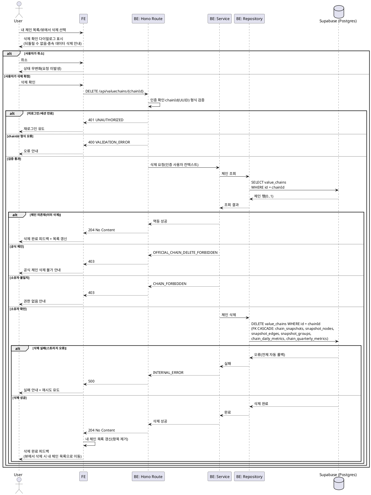

# UC-019: 밸류체인 삭제 (내 체인 관리)

> `docs/userflow.md` 019번 기능의 상세 유스케이스. 로그인 사용자가 자신이 소유한 사용자 체인을 내 밸류체인 목록 또는 체인 뷰에서 삭제한다. 삭제는 물리 삭제이며, 체인과 종속 데이터(스냅샷/노드/엣지/그룹/사전 집계 지표)가 하나의 원자적 단위로 함께 제거된다. 공식 체인 삭제(보관 처리)는 UC-021 소관이다.

---

## 1. Primary Actor

- **User** (로그인 사용자, 삭제 대상 사용자 체인의 소유자 본인)

## 2. Precondition (사용자 관점)

- 로그인 상태이다.
- 본인이 소유한 밸류체인이 1개 이상 존재한다(UC-013 신규 생성 또는 UC-014 공식 체인 복제로 생성).
- 내 밸류체인 목록(`/valuechains/mine`) 또는 해당 체인의 뷰(`/valuechains/[chainId]`)에 진입해 있다.

## 3. Trigger

- 사용자가 내 밸류체인 목록의 항목 또는 체인 뷰에서 **삭제 상호작용**을 실행하고, 확인 다이얼로그에서 삭제를 확정한다.

## 4. Main Scenario

1. 사용자가 내 밸류체인 목록(또는 체인 뷰)에서 대상 체인의 삭제 상호작용을 실행한다.
2. 시스템은 삭제 확인 다이얼로그를 표시한다.
   - 삭제는 되돌릴 수 없으며, 체인의 모든 구성(노드/관계/그룹)과 스냅샷 이력·지표 집계가 함께 삭제됨을 안내한다.
3. 사용자가 삭제를 확정한다. (취소 시 아무 변화 없이 종료 — E7)
4. FE가 삭제 API(`DELETE /api/valuechains/{chainId}`)를 호출한다.
5. Route 계층이 인증 상태와 경로 파라미터(`chainId` UUID 형식)를 검증한다.
6. Service 계층이 대상 체인을 조회해 삭제 가능 여부를 검증한다.
   - 체인 미존재(이미 삭제됨) → 멱등 성공 처리(E3).
   - 공식 체인(`chain_type=official`) → 거부(E2).
   - 소유자 불일치 → 거부(E1).
7. 검증 통과 시 Repository가 체인을 삭제한다.
   - `value_chains` 1행 삭제 → FK `ON DELETE CASCADE`로 스냅샷(`chain_snapshots`)·노드(`snapshot_nodes`)·엣지(`snapshot_edges`)·그룹(`snapshot_groups`)·일별/분기 지표(`chain_daily_metrics`/`chain_quarterly_metrics`)가 일괄 삭제된다.
   - 단일 DELETE 문의 CASCADE 전파는 DB 수준에서 원자적으로 수행되어 부분 실패 시 전체 롤백된다(E4).
8. 서버가 성공(`204 No Content`)을 응답한다.
9. FE는 삭제 완료 피드백을 표시하고 내 밸류체인 목록을 갱신한다(삭제 항목 제거).
   - 체인 뷰에서 삭제한 경우 내 밸류체인 목록으로 이동한다.
10. 사이드이펙트: 1인당 체인 상한(50, 상수) 계산 대상에서 즉시 제외되어, 신규 생성(UC-013)/복제(UC-014) 여유가 1 증가한다.

## 5. Edge Cases

| # | 상황 | 처리 |
|---|------|------|
| E1 | 비소유자가 타인의 사용자 체인 삭제 시도 | 서버 측 소유자 검증으로 거부(403 `CHAIN_FORBIDDEN`), 클라이언트 우회 방지 |
| E2 | 공식 체인 삭제 시도 | 거부(403 `OFFICIAL_CHAIN_DELETE_FORBIDDEN`). 공식 체인은 Admin이 UC-021에서 보관(비공개 전환) 처리하며 물리 삭제는 금지 |
| E3 | 이미 삭제된/존재하지 않는 체인에 대한 삭제 요청 | **멱등 처리** — 오류가 아닌 성공(204)으로 응답, FE는 목록에서 항목 제거만 수행 |
| E4 | 삭제 중 부분 실패(스토리지 오류 등) | 단일 DELETE + FK CASCADE의 DB 원자성으로 전체 롤백(500 `INTERNAL_ERROR`), 재시도 유도. 체인·종속 데이터가 일부만 삭제된 중간 상태는 발생하지 않음 |
| E5 | 복제 사본 삭제 시 원본과의 관계 | 사본은 완전 독립(UC-014)이므로 원본 공식 체인·다른 사본에 영향 없음. 출처 참조(`source_chain_id`)는 사본 측 메타데이터일 뿐임 |
| E6 | 미로그인/세션 만료 상태에서 삭제 요청 | 401 `UNAUTHORIZED`, 재로그인 유도 |
| E7 | 확인 다이얼로그에서 취소 | API 요청 미발생, 상태 무변화 |
| E8 | 동시 삭제(복수 탭/기기에서 동일 체인 삭제) | 먼저 도달한 요청이 삭제 수행, 이후 요청은 E3 멱등 규칙으로 성공 처리 |
| E9 | `chainId` 형식 오류(UUID 아님) | 400 `VALIDATION_ERROR` |
| E10 | 다른 탭에 열려 있던 삭제된 체인의 뷰/편집 화면 | 이후 조회/저장 요청은 체인 미존재로 실패(UC-009/UC-018의 "존재하지 않는/삭제된 체인" 엣지케이스에 따라 안내 후 목록/메인 유도) |

## 6. Business Rules

### 6.1 삭제 규칙

- **BR-1**: 본 기능의 삭제 대상은 **사용자 체인(chain_type=user)만**이다. 공식 체인은 물리 삭제가 금지되며 Admin의 보관(비공개 전환) 처리(UC-021)로만 내려간다.
- **BR-2**: 삭제는 **소유자 본인만** 가능하며, 서버 측에서 인증 사용자와 `owner_id` 일치를 검증한다(클라이언트 검증에 의존하지 않음).
- **BR-3**: 사용자 체인 삭제는 **물리 삭제**이며, 체인 헤더와 모든 종속 데이터(스냅샷/노드/엣지/그룹/일별·분기 지표 집계)를 하나의 원자적 단위로 함께 삭제한다. 부분 삭제 상태를 남기지 않는다(실패 시 전체 롤백).
- **BR-4**: **멱등성** — 존재하지 않는(이미 삭제된) 체인에 대한 삭제 요청은 오류가 아닌 성공으로 처리한다(반복 요청·동시 요청에 안전).
- **BR-5**: **복제본 독립성** — 복제 사본의 삭제는 원본 공식 체인 및 다른 사본에 어떤 영향도 주지 않는다. 역으로, 삭제되는 체인을 출처로 참조하는 관계는 사용자 체인에는 존재하지 않는다(복제 출처는 공식 체인만 가능, UC-014).
- **BR-6**: 삭제 즉시 해당 사용자의 체인 수가 감소하며, 1인당 체인 상한(50, 상수 `MAX_CHAINS_PER_USER`) 검증(UC-013/014)에 즉시 반영된다. 별도 카운터 없이 소유 체인 수 집계 기준으로 판정한다.
- **BR-7**: 삭제는 되돌릴 수 없으므로 FE는 실행 전 **확인 단계(다이얼로그)** 를 반드시 거친다.
- **BR-8**: 공용 데이터(종목 마스터 `securities`, 시세/재무 시계열, 관계 종류 마스터 `relation_types`)는 삭제 대상이 아니며 영향받지 않는다. 스냅샷 노드/엣지가 참조하던 마스터 행은 그대로 유지된다.

### 6.2 API Specification

> 계층: Hono Route(`route.ts`, HTTP 파싱/검증) → Service(`service.ts`, 비즈니스 규칙) → Repository(`repository.ts`, Supabase 접근).

#### API-1. 밸류체인 삭제

| 항목 | 내용 |
|---|---|
| 엔드포인트 | `DELETE /api/valuechains/{chainId}` |
| 권한 | 로그인 User(대상 체인의 소유자 본인) |
| Path Parameter | `chainId` (UUID) — 삭제 대상 체인 식별자 |
| Request Body | 없음 |

Response `204 No Content`:

- 삭제 성공 시 본문 없이 응답한다.
- 대상 체인이 이미 존재하지 않는 경우에도 동일하게 `204`를 응답한다(BR-4 멱등).

에러:

| HTTP | code | 설명 |
|---|---|---|
| 400 | `VALIDATION_ERROR` | `chainId`가 UUID 형식이 아님(E9) |
| 401 | `UNAUTHORIZED` | 미로그인/세션 만료(E6) |
| 403 | `CHAIN_FORBIDDEN` | 비소유자의 사용자 체인 삭제 시도(E1) |
| 403 | `OFFICIAL_CHAIN_DELETE_FORBIDDEN` | 공식 체인 삭제 시도(E2) — UC-021 보관 처리로 안내 |
| 500 | `INTERNAL_ERROR` | 삭제 트랜잭션 실패(전체 롤백됨, E4) — 재시도 유도 |

#### API-2. 내 밸류체인 목록 조회 (삭제 후 목록 갱신 — UC-007 공유 계약)

> 목록 API 전체 계약은 UC-007(메인/탐색 페이지) 소관이며, 본 유스케이스에서는 삭제 직후 FE가 목록을 재조회(또는 캐시에서 항목 제거)하는 연계 지점으로만 참조한다.

| 항목 | 내용 |
|---|---|
| 엔드포인트 | `GET /api/valuechains/mine` |
| 권한 | 로그인 User |

Response `200 OK` (발췌):

```json
{
  "chains": [
    {
      "chainId": "uuid",
      "name": "나의 2차전지 체인",
      "focusType": "industry",
      "nodeCount": 12,
      "totalMarketCapKrw": "123456789000"
    }
  ]
}
```

### 6.3 Database Operations

| 테이블 | 작업 | 목적 |
|---|---|---|
| `value_chains` | SELECT | 대상 체인 존재 여부·`chain_type`·`owner_id` 조회(삭제 가능 검증 — BR-1/BR-2/BR-4) |
| `value_chains` | DELETE | 체인 헤더 1행 삭제(본 삭제 지점, 이하 CASCADE 전파의 기점) |
| `chain_snapshots` | DELETE (CASCADE) | 체인의 전체 스냅샷 이력 삭제(`chain_id` FK `ON DELETE CASCADE`) |
| `snapshot_nodes` | DELETE (CASCADE) | 각 스냅샷의 노드 삭제(`snapshot_id` FK CASCADE) — 참조하던 `securities` 행은 유지(BR-8) |
| `snapshot_edges` | DELETE (CASCADE) | 각 스냅샷의 엣지 삭제(`snapshot_id` FK CASCADE) — 참조하던 `relation_types` 행은 유지(BR-8) |
| `snapshot_groups` | DELETE (CASCADE) | 각 스냅샷의 그룹 삭제(`snapshot_id` FK CASCADE) |
| `chain_daily_metrics` | DELETE (CASCADE) | 체인의 일별 지표 사전 집계 삭제(`chain_id` FK CASCADE) |
| `chain_quarterly_metrics` | DELETE (CASCADE) | 체인의 분기 지표 사전 집계 삭제(`chain_id` FK CASCADE) |

- **원자성**: 애플리케이션은 `value_chains` 단일 DELETE만 실행하고, 종속 삭제는 전부 FK `ON DELETE CASCADE`가 수행한다. 단일 문 실행이므로 DB 수준에서 원자성이 보장되며, 실패 시 자동 전체 롤백된다(E4). 별도 다중 문 트랜잭션 관리가 불필요하다.
- **UPDATE 없음**: 사용자 체인 삭제는 소프트 삭제(`is_archived`)가 아닌 물리 삭제다(`is_archived`는 공식 체인 보관 전용 — UC-021).
- `llm_relation_proposals`는 공식 체인 전용(대상 체인 FK)이므로 사용자 체인 삭제에서는 해당 행이 존재하지 않는다.
- 이후 배치 집계(UC-029)는 존재하는 체인만 대상으로 하므로, 삭제된 체인에 대한 지표 재생성은 발생하지 않는다.

### 6.4 External Service Integration

- **없음.** 본 기능은 자체 DB(`value_chains` 및 종속 테이블)만 사용하며 외부 API 호출이 발생하지 않는다(PRD 전역 정책: 외부 API는 배치 적재 전용). 사용자 체인은 배치 수집 대상도 아니므로(수집은 종목 마스터 전 종목 기준) 진행 중 배치와의 간섭이 없다.

## 7. Sequence Diagram



## 8. 관련 유스케이스

- **UC-006 회원 탈퇴**: 탈퇴 시 사용자 소유 체인 전체가 동일한 CASCADE 전파 경로로 일괄 삭제된다(본 기능은 체인 단건 삭제).
- **UC-007 메인/탐색 페이지 조회**: 삭제 후 내 밸류체인 목록 갱신의 조회 계약 소관.
- **UC-013 밸류체인 신규 생성 / UC-014 공식 체인 복제**: 삭제로 1인당 체인 상한 여유가 증가해 생성/복제 차단이 해소될 수 있음(BR-6).
- **UC-009 밸류체인 뷰 조회 / UC-018 밸류체인 저장**: 삭제된 체인에 대한 이후 조회/저장 실패 처리(E10).
- **UC-021 공식 밸류체인 관리**: 공식 체인의 삭제(보관/비공개 전환)는 Admin 전용이며 물리 삭제 금지(E2/BR-1).
