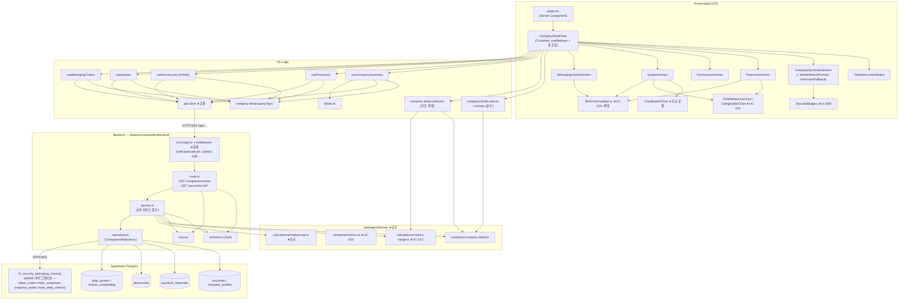

# Plan: UC-020 기업 상세 조회

> 근거: `docs/usecases/020/spec.md`, `docs/usecases/000_decisions.md`(B-5·B-6·C-5 준용, E 섹션은 UC-020 관련 미결 없음),
> `docs/techstack.md` §4(모노레포 Codebase Structure)·§7(DB 접근 — 복잡 조인은 RPC), `docs/database.md` §3.2·§3.4·§3.5·§3.8·§4.4·§4.6,
> `docs/pages/company-detail/requirement.md`·`docs/pages/company-detail/state_management.md`(본 페이지 상태관리 SOT — Level 2, Context 미사용·useReducer 직접 사용),
> `.claude/skills/spec_to_plan/references/hono-backend-guide.md`, `supabase/migrations/0003/0005/0006/0007/0008/0010/0011`.
>
> **결정·계약 반영 사항**
> - **B-6**: 라우팅은 `/companies/[ticker]` + 티커 충돌 시 `?market=` 쿼리 구분. URL이 `ticker`/`market`/`asOf`를 소유한다(상태관리 문서 §1.2).
> - **B-5**: 폐지/정지 종목도 접근 허용 + 상태 배지(UC-008의 `ListingStatusBadge` 재사용).
> - **C-5 준용**: 주가/시총 기본 조회 기간 = 최근 1년(`QUOTES_DEFAULT_PERIOD='1Y'` 상수).
> - **UC-011 연계**: 과거 시점 조회 중 노드 클릭 진입 시 `?asOf=YYYY-MM-DD`가 실려 온다(`lib/routes.ts`의 `buildCompanyDetailPath` — UC-011 plan 소유). 본 plan은 이를 **읽기만** 한다(E14 배너).
> - **외부 서비스 연동 없음**: 조회 전용 — 모든 데이터는 배치(UC-026~028, UC-031)가 적재한 자체 DB에서만 SELECT한다(spec §6.5). 공시 원문 링크는 저장된 `disclosures.url`을 그대로 노출(서버 프록시 없음). 따라서 본 plan에 외부 서비스 클라이언트 모듈이 없다.
>
> **코드베이스 충돌 검토**
> - `apps/`·`packages/` 스캐폴드는 아직 없다(Phase 9 환경설정 담당). 공통 인프라(Hono 앱·미들웨어·response·api-client·QueryProvider)는 UC-001/008/009/010 plan이 정의한 **위치·계약을 참조만** 하고 재정의하지 않는다. FE API 클라이언트는 plan 간 경로 표기가 경합 중(`lib/http/api-client.ts` — UC-001/009 vs `lib/remote/api-client.ts` — UC-008/010)이므로, **구현 시점에 먼저 생성된 단일 모듈을 재사용**한다(중복 생성 금지 — 본문에서는 `api-client`로 통칭).
> - `features/securities`(UC-008 — 검색)와 별개로 본 plan은 `features/companies`(기업 상세) 수직 슬라이스를 신설한다. 라우트 경로 `/securities/search`(UC-008, 2세그먼트)와 본 plan의 `/securities/:securityId/*`(3세그먼트)는 Hono 매칭이 겹치지 않는다.
> - 재사용 모듈: UC-008 `SecurityBadges`(Market/ListingStatus 배지 — UC-008 plan이 "UC-020 재사용 예정"으로 명시), UC-010 `packages/domain/constants/metrics.ts`(`TIMESERIES_MIN_START_DATE`·`METRICS_RANGE_PRESETS`)·`calculations/metrics-range.ts`(`presetToDailyRange`·`resolveDailyMetricsRange`)·`calculations/date-boundary.ts`(`todayInAppTz`)·`components/charts/TimeSeriesLineChart.tsx`·`CategoryBarChart.tsx`·`lib/format/number.ts`, UC-009 미들웨어 `withOptionalAuth`(세션 선택 주입 — S5 노출 범위 판정의 전제).
> - 마이그레이션: 신규는 **소속 체인 RPC 함수 1건**(테이블 변경 없음). 여러 plan이 `0013_*`을 경합 선점 중이므로 UC-022 R-7 컨벤션에 따라 파일명 `NNNN_fn_security_belonging_chains.sql`의 **NNNN은 구현 시점의 다음 빈 번호로 부여**한다(멱등 `CREATE OR REPLACE` — 적용 순서 무관).

---

## 개요

### A. 공통/선행 모듈 (타 plan 정의 — 위치 참조만, 재정의 금지)

| 모듈 | 위치 | 정의 plan | 본 plan에서의 사용 |
| --- | --- | --- | --- |
| HTTP 응답 헬퍼 | `apps/web/src/backend/http/response.ts` | UC-001/008/009 | `success/failure/respond/HandlerResult` |
| Hono 앱·미들웨어 | `apps/web/src/backend/hono/*`, `backend/middleware/*` | UC-001/009 | 체인(errorBoundary→withAppContext→withSupabase→**withOptionalAuth**) 통과 + `registerCompaniesRoutes(app)` 1줄 등록 |
| FE API 클라이언트 | `apps/web/src/lib/http/api-client.ts`(또는 `lib/remote/` — 먼저 생성된 쪽) | UC-001/008/009/010 | `ApiError{status,code}` 기반 폴백 분기(404/409) |
| React Query Provider | `apps/web/src/lib/react-query/query-provider.tsx` | UC-009 | 전역 캐시 |
| 지표 상수 | `packages/domain/constants/metrics.ts` | UC-010 | `TIMESERIES_MIN_START_DATE`·`METRICS_RANGE_PRESETS`·`APP_TIMEZONE` |
| 기간 보정 계산 | `packages/domain/calculations/metrics-range.ts` | UC-010 | `presetToDailyRange`·`resolveDailyMetricsRange`(quotes from/to 기본값·클램프에 재사용 — DRY) |
| 날짜 경계 계산 | `packages/domain/calculations/date-boundary.ts` | UC-010 | `todayInAppTz`(route에서 "오늘" 산출) |
| 차트 래퍼(라인·막대) | `apps/web/src/components/charts/{TimeSeriesLineChart,CategoryBarChart}.tsx` | UC-010 | 시총 추이(라인)·분기 재무(막대). `CategoryBarChart`는 다중 시리즈 props를 **하위호환 확장**(모듈 10) |
| 숫자 포맷터 | `apps/web/src/lib/format/number.ts` | UC-010 | 통화 표시 함수 추가 확장(모듈 10) |
| 종목 배지 | `apps/web/src/features/securities/components/SecurityBadges.tsx` | UC-008 | S1 시장/상장 상태 배지 |
| 기업 상세 경로 빌더 | `apps/web/src/lib/routes.ts` | UC-011 | 진입 URL 계약(`?market=`·`?asOf=`)의 발신측 — 본 plan은 수신만 |

### B. 본 plan 신규 — 공통(shared) 모듈

| 모듈 | 위치 | 설명 |
| --- | --- | --- |
| 기업 상세 도메인 상수 | `packages/domain/constants/company-detail.ts` | `QuotesPeriodPreset`/`FinancialsPeriodPreset` 유니온, `QUOTES_DEFAULT_PERIOD`, `FINANCIALS_DEFAULT_PERIOD`, `DISCLOSURES_PAGE_SIZE`, `TIMESERIES_MIN_START_YEAR`(=2015, metrics.ts 값 재수출 — SOT 이원화 금지), `SHARES_SOURCE_PRIORITY` |
| 시총 계산·주식수 선별 | `packages/domain/calculations/market-cap.ts` | `calculateMarketCap`·`buildMarketCapSeries`·`pickLatestShares` 순수 함수 — UC-029 워커 집계와 공유 후보(단일 정의) |
| 캔들차트 래퍼 | `apps/web/src/components/charts/CandlestickChart.tsx` | lightweight-charts 5.x 일봉 캔들 프레젠테이션 래퍼(거래일만·미확정 마커) — techstack §4 `components/charts/` 소속 공통 |

### C. Database

| 모듈 | 위치 | 설명 |
| --- | --- | --- |
| 소속 체인 RPC 함수 | `supabase/migrations/NNNN_fn_security_belonging_chains.sql` | `fn_security_belonging_chains(p_security_id, p_owner_id)` — 최신 스냅샷 LATERAL + 노드 매칭 + 최신 일별 지표 요약을 단일 RPC로 캡슐화(database.md §4.6, techstack §7). 신규 테이블/컬럼 없음 |

### D. Backend — `apps/web/src/features/companies/backend/` (hono-backend-guide 컨벤션 + repository)

| 모듈 | 위치 | 설명 |
| --- | --- | --- |
| Zod 스키마 | `.../backend/schema.ts` | 5개 엔드포인트의 Param/Query/Row/Response 스키마 분리 정의 |
| 에러 코드 | `.../backend/error.ts` | spec §6.3의 13개 코드(`COMPANY_NOT_FOUND`, `TICKER_AMBIGUOUS` 등) |
| Repository | `.../backend/repository.ts` | securities/company_profiles/quarterly_financials/disclosures/daily_quotes/shares_outstanding SELECT + 체인 RPC 호출 캡슐화(Persistence). `CompaniesRepository` 인터페이스 노출 |
| Service | `.../backend/service.ts` | `getCompanySummary`/`getFinancials`/`getDisclosures`/`getQuotes`/`getBelongingChains` — 식별·범위 보정·Row 검증·DTO 변환·Response 검증(repository 인터페이스에만 의존) |
| Route | `.../backend/route.ts` | `GET /companies/:ticker` + `GET /securities/:securityId/{financials,disclosures,quotes,valuechains}` — 파싱/검증/주입/로깅/`respond()`만 |
| 라우터 등록(수정) | `apps/web/src/backend/hono/app.ts` | `registerCompaniesRoutes(app)` 1줄 추가 |

### E. Frontend — `apps/web/src/features/companies/` + 페이지 (state_management.md §7 배치 그대로)

| 모듈 | 위치 | 설명 |
| --- | --- | --- |
| DTO 재노출 | `.../lib/dto.ts` | backend Response 타입 재수출(FE의 backend 경로 직접 의존 차단) |
| 쿼리 키 팩토리 | `.../hooks/company-detail-query-keys.ts` | summary/financials/disclosures/quotes/valuechains 5종 키의 단일 정의 |
| 서버 상태 훅 5종 | `.../hooks/{useCompanySummary,useFinancials,useDisclosures,useQuotes,useBelongingChains}.ts` | 상태관리 문서 §5 시그니처 그대로. S2~S5는 `enabled: !!securityId` 의존 체이닝 |
| Store — Actions | `.../state/company-detail.actions.ts` | `CompanyDetailAction` 판별 유니온 3종(§3.2) |
| Store — Reducer | `.../state/company-detail.reducer.ts` | `CompanyDetailState`(C1~C3)·초기값 팩토리·순수 reducer(§4) |
| 셀렉터 | `.../state/company-detail.selectors.ts` | `selectQuotesDateRange`·`selectFinancialsYearRange` 순수 함수(§4.3 — 기간 파생이 queryKey에 들어가는 유일 연결) |
| 문구 상수 | `.../constants.ts` | 섹션 안내/오류/주석 문구(하드코딩 금지) |
| Container | `.../components/CompanyDetailView.tsx` | `'use client'` — useReducer + 쿼리 훅 조립, 하위 Presenter에 props 전달(§6.1, Context 미사용) |
| Presenter 7종 | `.../components/{TimelineContextNotice,CompanySummarySection,MarketSelectPrompt,CompanyNotFoundFallback,FinancialsSection,DisclosuresSection,QuotesSection,BelongingChainsSection}.tsx` | 로직 없는 표시 컴포넌트(§6.2 props 계약) |
| 페이지 셸 | `apps/web/src/app/(public)/companies/[ticker]/page.tsx` | Server Component — `params`/`searchParams`(Promise, await) 해석 후 Container 위임 |

---

## Diagram



데이터 흐름: Presenter → dispatch/셀렉터 → 쿼리 훅(queryKey에 파생 기간 포함) → api-client → Hono route → Service → Repository → Postgres. 외부 서비스 노드 없음(조회 전용).

---

## Implementation Plan

### 1. [공통·신규] 기업 상세 도메인 상수 — `packages/domain/constants/company-detail.ts`

- 구현 내용:
  1. `QUOTES_PERIOD_PRESETS = METRICS_RANGE_PRESETS`(UC-010 `metrics.ts` 재수출 — `'1M'|'3M'|'6M'|'1Y'|'3Y'|'MAX'`), `type QuotesPeriodPreset`, `QUOTES_DEFAULT_PERIOD: QuotesPeriodPreset = '1Y'`(C-5 준용).
  2. `FINANCIALS_PERIOD_PRESETS = ['3Y','5Y','10Y','ALL'] as const`, `type FinancialsPeriodPreset`, `FINANCIALS_DEFAULT_PERIOD = '5Y'`, `FINANCIALS_PRESET_YEARS: Record<'3Y'|'5Y'|'10Y', number> = { '3Y': 3, '5Y': 5, '10Y': 10 }` — FE 셀렉터와 BE 기본 범위가 같은 상수를 공유(DRY).
  3. `TIMESERIES_MIN_START_YEAR = 2015` — UC-010 `TIMESERIES_MIN_CALENDAR_YEAR`가 이미 존재하면 그 값을 **재수출**한다(2015의 SOT 이원화 금지, spec §6.1의 상수명 유지).
  4. `DISCLOSURES_PAGE_SIZE = 20`(spec §6.1 "페이지당 건수 상수").
  5. `SHARES_SOURCE_PRIORITY = ['toss','dart','sec'] as const`(database.md §3.5 우선순위 — 동일 `as_of_date` 복수 소스 행의 타이브레이크), `SHARES_LOOKUP_LIMIT = 5`(최신 주식수 후보 조회 상한).
  6. 프레임워크 의존성 없음. `packages/domain/constants/index.ts` 배럴 재수출.
- 의존성: UC-010 모듈 1(`metrics.ts` — 미존재 시 본 구현 시점에 해당 상수를 먼저 생성).
- Unit Tests: 상수 정의 — N/A (단, `QUOTES_PERIOD_PRESETS`가 `METRICS_RANGE_PRESETS`와 동일 참조인지 1건 확인).

### 2. [공통·신규] 시총 계산·주식수 선별 — `packages/domain/calculations/market-cap.ts`

- 구현 내용(전부 순수 함수 — I/O·`Date.now()` 금지, web BE/FE·worker(UC-029) 공유 후보):
  1. `calculateMarketCap(closePrice: number | null, shares: number): number | null` — `closePrice === null`이면 `null`, 아니면 곱(spec §6.1 시총 산출 정책의 단일 정의).
  2. `buildMarketCapSeries(candles: Array<{ tradeDate: string; close: number | null }>, shares: number): Array<{ tradeDate: string; marketCap: number | null }>` — 거래일 순서 보존, 입력 배열 비변이.
  3. `pickLatestShares(rows: Array<{ shares: number; asOfDate: string; source: 'toss'|'dart'|'sec'; isMultiClassPartial: boolean }>): row | null` — ① `asOfDate` 최대 행들로 축소 ② 복수면 `SHARES_SOURCE_PRIORITY` 순으로 1건 선택 ③ 빈 배열이면 `null`(E9 — 시총 미표시 신호).
- 의존성: 모듈 1(`SHARES_SOURCE_PRIORITY`).
- **Unit Tests:**
  - [ ] `calculateMarketCap(70000, 100)` → `7000000` / `(null, 100)` → `null`
  - [ ] `buildMarketCapSeries` — 중간 `close: null` 캔들 → 해당 일자만 `marketCap: null`, 순서·길이 보존, 원본 비변이
  - [ ] `pickLatestShares` — 기준일 상이 2행 → 최신 `asOfDate` 행 선택
  - [ ] 동일 `asOfDate`에 `dart`·`toss` 2행 → `toss` 행 선택(우선순위)
  - [ ] 빈 배열 → `null`
  - [ ] `isMultiClassPartial=true` 행 선택 시 플래그 보존(주석 표기 입력)

### 3. 마이그레이션 — `supabase/migrations/NNNN_fn_security_belonging_chains.sql`

- 구현 내용:
  1. `CREATE OR REPLACE FUNCTION fn_security_belonging_chains(p_security_id uuid, p_owner_id uuid DEFAULT NULL) RETURNS TABLE (chain_id uuid, name text, chain_type chain_type, focus_type chain_focus_type, node_count bigint, metric_date date, total_market_cap_krw text, covered_node_count integer, total_node_count integer)` — `LANGUAGE sql STABLE`, `SET search_path = public`, 멱등(`CREATE OR REPLACE`). 신규 테이블/인덱스 없음 → 기존 0001~0012 및 타 plan의 함수 마이그레이션과 충돌 없음.
  2. 본문(database.md §4.6 기준 쿼리를 함수화 + 요약 확장):
     - `value_chains vc WHERE vc.is_archived = false AND (vc.chain_type = 'official' OR (p_owner_id IS NOT NULL AND vc.owner_id = p_owner_id))` — **노출 범위 필터를 SQL에 내장**(E12 서버 측 필터의 1차 방어. `p_owner_id IS NULL`이면 공식 체인만).
     - `JOIN LATERAL (SELECT id FROM chain_snapshots s WHERE s.chain_id = vc.id ORDER BY s.effective_at DESC LIMIT 1) latest ON true`(`idx(chain_id, effective_at DESC)` 활용).
     - `JOIN snapshot_nodes n ON n.snapshot_id = latest.id AND n.security_id = p_security_id` — 해당 종목 노드 존재 체인만.
     - `node_count`: 최신 스냅샷의 전체 노드 수 서브쿼리(`COUNT(*) FROM snapshot_nodes WHERE snapshot_id = latest.id`).
     - `LEFT JOIN LATERAL (SELECT metric_date, total_market_cap_krw::text, covered_node_count, total_node_count FROM chain_daily_metrics m WHERE m.chain_id = vc.id ORDER BY m.metric_date DESC LIMIT 1) metric ON true` — 집계 미존재면 지표 컬럼 전부 NULL(응답 `summary: null` 입력). `numeric → text` 캐스팅은 UC-007 `list_chain_cards`와 동일 계약(정밀도 보존, JS 측 coerce).
     - `ORDER BY (vc.chain_type = 'official') DESC, vc.name ASC` — 공식 우선 + 이름순(결정적 정렬).
  3. 적용은 `mcp__supabase__apply_migration`(로컬 Supabase 실행 금지 — techstack §7). 적용 후 `generate_typescript_types`로 `packages/domain/types/database.ts` 재생성.
- 의존성: 0005(value_chains), 0006(chain_snapshots·snapshot_nodes), 0010(chain_daily_metrics) — 전부 기적용.
- **Unit Tests (적용 후 `execute_sql` 시드 기반 SQL 검증):**
  - [ ] 공식 체인 최신 스냅샷에 종목 노드 존재 → `p_owner_id = NULL`로도 반환
  - [ ] **과거 스냅샷에만** 종목이 있고 최신 스냅샷엔 없음 → 미반환(최신 스냅샷 기준)
  - [ ] 사용자 체인(소유자 A) + `p_owner_id = A` → 반환 / `p_owner_id = B` 또는 `NULL` → 미반환(E12)
  - [ ] `is_archived = true` 체인 → 미반환
  - [ ] `chain_daily_metrics` 없는 체인 → 지표 컬럼 전부 NULL로 행 반환
  - [ ] `node_count`가 해당 종목 외 노드를 포함한 스냅샷 전체 수와 일치
  - [ ] 소속 체인 0건 → 0행(에러 아님, E11)

### 4. Zod 스키마 — `features/companies/backend/schema.ts`

- 구현 내용(Request/Row/Response 분리 — hono-backend-guide):
  1. **Param/Query 스키마**:
     - `TickerParamSchema`: `{ ticker: z.string().trim().min(1).max(20).transform(v => v.toUpperCase()) }` — US 티커 대문자 정규화(SEC 마스터 표기), KRX 6자리 숫자는 무영향.
     - `CompanySummaryQuerySchema`: `{ market: z.enum(['KRX','US']).optional() }`.
     - `SecurityIdParamSchema`: `{ securityId: z.string().uuid() }`.
     - `FinancialsQuerySchema`: `{ fromYear: z.coerce.number().int().min(1900).optional(), toYear: z.coerce.number().int().optional() }`(범위 보정·하한 클램프는 service 책임 — E15의 형식 오류만 여기서).
     - `DisclosuresQuerySchema`: `{ page: z.coerce.number().int().min(1).default(1) }`.
     - `QuotesQuerySchema`: `{ from: isoDate.optional(), to: isoDate.optional() }` — `isoDate` = `YYYY-MM-DD` 정규식 + 실존 날짜 refine.
  2. **Row 스키마(snake_case — 마이그레이션과 1:1)**:
     - `SecurityWithProfileRowSchema`: `id, ticker, name, english_name(nullable), market(enum), currency(enum KRW|USD), listing_status(enum)` + 임베드 `company_profiles: { representative_name, established_date, homepage_url, sector, last_collected_at }(전 필드 nullable) | null`(1:1 미수집 시 null).
     - `QuarterlyFinancialRowSchema`: `period_type(enum quarter|annual), fiscal_year(int), fiscal_quarter(int 1~4 nullable), calendar_year(nullable), calendar_quarter(nullable), currency(enum), revenue/operating_income/net_income(z.coerce.number().nullable() — numeric은 문자열 반환), amount_basis(enum three_month|derived_from_cumulative nullable), is_revenue_tag_unmapped(boolean), source(enum dart|sec)`.
     - `DisclosureRowSchema`: `id(uuid), title, disclosure_date, url(z.string().url()), source(enum dart|sec)`.
     - `DailyQuoteRowSchema`: `trade_date, open_price/high_price/low_price/close_price(z.coerce.number().nullable()), volume(z.coerce.number().nullable()), is_closing_confirmed(boolean)`.
     - `SharesRowSchema`: `shares(z.coerce.number()), as_of_date, source(enum toss|dart|sec), is_multi_class_partial(boolean)`.
     - `BelongingChainRpcRowSchema`: 모듈 3 반환 컬럼과 1:1(`total_market_cap_krw`는 **string nullable** → DTO에서 number 변환).
  3. **Response 스키마(camelCase — spec §6.3의 5개 스키마 그대로)**: `CompanySummaryResponseSchema`(security/profile/dataSources), `FinancialsResponseSchema`(items + annotations{minFiscalYear, isAnnualOnly}), `DisclosuresResponseSchema`(items/page/pageSize/hasMore), `QuotesResponseSchema`(candles/marketCapSeries/sharesMeta nullable), `CompanyValuechainsResponseSchema`(items[].summary nullable).
  4. 모든 타입 `z.infer` export — FE 훅이 동일 타입 import(계약 단일화).
- 의존성: 모듈 1(enum 리터럴 참고), `packages/domain/types/database.ts`(참고용).
- Unit Tests(스키마는 service 테스트에서 간접 검증 — coerce·transform 경계만 직접):
  - [ ] `TickerParamSchema`: `' aapl '` → `'AAPL'` / `''` → 실패
  - [ ] `QuotesQuerySchema`: `from='2026-2-3'` → 실패 / `'2026-02-30'`(실존하지 않는 날짜) → 실패
  - [ ] `QuarterlyFinancialRowSchema`: `revenue: "1234.56"`(문자열) → `1234.56` / `revenue: null` 통과
  - [ ] `DisclosuresQuerySchema`: `page` 미지정 → `1`, `page=0` → 실패

### 5. 에러 코드 — `features/companies/backend/error.ts`

- 구현 내용:

  ```
  companiesErrorCodes = {
    invalidRequest: 'INVALID_REQUEST',                    // 400 (E15)
    companyNotFound: 'COMPANY_NOT_FOUND',                 // 404 (E1·E13, securityId 미존재 포함)
    tickerAmbiguous: 'TICKER_AMBIGUOUS',                  // 409 (E4)
    companyFetchError: 'COMPANY_FETCH_ERROR',             // 500
    companyValidationError: 'COMPANY_VALIDATION_ERROR',   // 500
    financialsFetchError: 'FINANCIALS_FETCH_ERROR',       // 500
    financialsValidationError: 'FINANCIALS_VALIDATION_ERROR',
    disclosuresFetchError: 'DISCLOSURES_FETCH_ERROR',
    disclosuresValidationError: 'DISCLOSURES_VALIDATION_ERROR',
    quotesFetchError: 'QUOTES_FETCH_ERROR',
    quotesValidationError: 'QUOTES_VALIDATION_ERROR',
    chainsFetchError: 'CHAINS_FETCH_ERROR',
    chainsValidationError: 'CHAINS_VALIDATION_ERROR',
  } as const
  ```

  `CompaniesServiceError` 타입 export. spec §6.3 표와 1:1 — 코드 추가/변경 없음.
- 의존성: 없음. Unit Tests: N/A(상수 정의).

### 6. Repository — `features/companies/backend/repository.ts`

- 구현 내용:
  1. `CompaniesRepository` 인터페이스(서비스가 의존하는 유일한 계약). 전 메서드 `RepoResult<T> = { ok: true; data: T } | { ok: false; message: string }` 반환(throw 금지 — UC-008/010 Result 컨벤션), rows는 `unknown` — **Zod 검증은 service 책임**:
     - `findSecuritiesByTicker(ticker: string, market: 'KRX'|'US'|null): RepoResult<unknown[]>` — `from('securities').select('*, company_profiles(*)').eq('ticker', ticker)` + `market` 지정 시 `.eq('market', market)`. **단건이 아닌 배열 반환**(E4 복수 시장 판정은 service).
     - `findLatestQuoteDate(securityId): RepoResult<string | null>` — `daily_quotes` `order('trade_date', desc).limit(1).maybeSingle()` → `trade_date ?? null`.
     - `findLatestDisclosureDate(securityId): RepoResult<string | null>` — 동일 패턴(`disclosure_date`).
     - `findSecurityById(securityId): RepoResult<unknown | null>` — `id, ticker, market, currency, listing_status` 선택, `maybeSingle`. **4개 섹션 API의 404 판정에 공용**(DRY).
     - `findQuarterlyFinancials(securityId, fromYear, toYear): RepoResult<unknown[]>` — `gte('fiscal_year', fromYear).lte('fiscal_year', toYear)` + `order('fiscal_year').order('fiscal_quarter', { nullsFirst: false })`(연간 행은 연도 말미).
     - `findDisclosures(securityId, limit, offset): RepoResult<unknown[]>` — `order('disclosure_date', desc).order('id', desc)`(동일 일자 결정적 페이지네이션) + `range(offset, offset+limit-1)`. 호출측(service)이 `pageSize+1`을 limit으로 전달(hasMore 계약 — COUNT 불필요, UC-008과 동일 패턴).
     - `findDailyQuotes(securityId, from, to): RepoResult<unknown[]>` — `gte/lte('trade_date')` + `order('trade_date')`(오름차순).
     - `findRecentShares(securityId, limit): RepoResult<unknown[]>` — `order('as_of_date', desc).limit(limit)`(`SHARES_LOOKUP_LIMIT`). 최신 1건 선별은 service의 `pickLatestShares`(동일 기준일 복수 소스 대응 — database.md §4.4 `DISTINCT ON` 의도 보존).
     - `findBelongingChains(securityId, ownerId: string | null): RepoResult<unknown[]>` — `client.rpc('fn_security_belonging_chains', { p_security_id, p_owner_id: ownerId })`.
  2. `createCompaniesRepository(client: SupabaseClient): CompaniesRepository` 팩토리. 테이블·컬럼·RPC 이름은 파일 상단 상수(하드코딩 금지). `data: null` + error 없음(빈 결과)은 `[]`/`null`로 정규화.
- 의존성: 모듈 3(RPC), 공통 인프라(SupabaseClient 주입 경로).
- **Unit Tests (SupabaseClient mock — 쿼리 빌더 체인 검증):**
  - [ ] `findSecuritiesByTicker('005930', null)` → market 필터 없이 호출, `('AAPL','US')` → `eq('market','US')` 추가
  - [ ] `findSecuritiesByTicker` 0행 → `{ ok: true, data: [] }`(에러 아님)
  - [ ] `findDisclosures(id, 21, 20)` → `range(20, 40)` 매핑(offset/limit 산식)
  - [ ] `findDailyQuotes` — `trade_date` 오름차순 정렬 파라미터 확인
  - [ ] `findBelongingChains(id, null)` → `p_owner_id: null` 전달 / `(id, 'u1')` → `'u1'` 전달
  - [ ] Supabase error mock → `{ ok: false, message }`(예외 미전파) — 전 메서드 공통 1건씩

### 7. Service — `features/companies/backend/service.ts`

- 구현 내용: 5개 함수 모두 `repo: CompaniesRepository`를 주입받고(Supabase 문법 비의존), `HandlerResult<응답, CompaniesServiceError, unknown>`을 반환한다. 공통 규칙: repository `ok:false` → `failure(500, *_FETCH_ERROR)`, Row `safeParse` 실패 → `failure(500, *_VALIDATION_ERROR, details)`, Response `safeParse` 후 `success()`. 로깅 없음(route 책임)·사이드이펙트 없음(SELECT 전용, spec §6.4).
  1. **`getCompanySummary(repo, { ticker, market })`**:
     - `findSecuritiesByTicker` → 0행 → `failure(404, COMPANY_NOT_FOUND)`(E1) / 2행 이상 && `market` 미지정 → `failure(409, TICKER_AMBIGUOUS)`(E4) / `market` 지정 시엔 uq(market,ticker)로 항상 ≤1행.
     - 단건 Row 검증 → 병렬로 `findLatestQuoteDate`/`findLatestDisclosureDate`(이 2개는 실패해도 요약 전체를 막지 않고 `null`로 강등 — 메타 성격, E8의 섹션 독립 원칙 준용. 단 repository `ok:false`는 로깅용 meta로 전달).
     - DTO: `security{ id, ticker, name, englishName, market, currency, listingStatus }`, `profile`(company_profiles null이면 null, 필드 snake→camel), `dataSources{ financialSource: market==='KRX' ? 'dart' : 'sec', quoteSource: 'toss', lastQuoteDate, lastDisclosureDate }`.
  2. **`getFinancials(repo, { securityId, query, currentYear })`** (`currentYear`는 route가 `todayInAppTz`로 산출해 주입 — 순수성):
     - `findSecurityById` → null → `failure(404, COMPANY_NOT_FOUND)`.
     - 범위 해석: `toYear = query.toYear ?? currentYear`, `fromYear = max(query.fromYear ?? toYear - FINANCIALS_PRESET_YEARS[FINANCIALS_DEFAULT_PERIOD] + 1, TIMESERIES_MIN_START_YEAR)`(하한 클램프 — E5의 "2015 이전 미제공"), 보정 후 `fromYear > toYear` → `failure(400, INVALID_REQUEST)`(E15).
     - `findQuarterlyFinancials` → Row 검증 → DTO(items — `periodType/fiscalYear/fiscalQuarter/calendarYear/calendarQuarter/revenue/operatingIncome/netIncome/amountBasis/isRevenueTagUnmapped/source`). 빈 배열은 200 + `items: []`(E5).
     - `currency`: 첫 행의 `currency` ?? `securities.currency` 폴백(다통화 케이스는 database.md Open Question 3 — MVP는 단일 값).
     - `annotations`: `minFiscalYear = TIMESERIES_MIN_START_YEAR`, `isAnnualOnly = items.length > 0 && items.every(periodType === 'annual')`(E7).
  3. **`getDisclosures(repo, { securityId, page })`**:
     - 404 체크 → `offset = (page-1) * DISCLOSURES_PAGE_SIZE`, `limit = DISCLOSURES_PAGE_SIZE + 1` → `hasMore = rows.length > pageSize`, 초과 1행 절단 → Row 검증 → DTO. 빈 배열 200(E10).
  4. **`getQuotes(repo, { securityId, query, today })`**:
     - 404 체크(Row에서 `currency` 획득) → 범위 해석: `from = query.from ?? presetToDailyRange(QUOTES_DEFAULT_PERIOD, today).from`, `to = query.to ?? today` 후 `resolveDailyMetricsRange`(UC-010 모듈 재사용)로 하한(`TIMESERIES_MIN_START_DATE`) 클램프·미래 `to`→today 보정·`from > to` → `failure(400, INVALID_REQUEST)`(E15).
     - 병렬: `findDailyQuotes(from, to)` + `findRecentShares(securityId, SHARES_LOOKUP_LIMIT)`.
     - `sharesMeta = pickLatestShares(검증된 주식수 행)`(모듈 2) — null이면 `marketCapSeries: []` + `sharesMeta: null`(E9), 존재 시 `buildMarketCapSeries(candles, shares)`.
     - candles DTO(`open/high/low/close/volume/isClosingConfirmed`) — 시세 미수집은 200 + `candles: []`(E8은 FE 폴백).
  5. **`getBelongingChains(repo, { securityId, currentUserId })`**:
     - 404 체크 → `findBelongingChains(securityId, currentUserId)`(비로그인은 null → RPC가 공식만 반환).
     - Row 검증 → **2차 방어 필터**: `chain_type='user'`인데 `currentUserId === null`인 행은 폐기(E12 — SQL 필터와 이중화, 서비스 불변식).
     - DTO: `items[]{ chainId, name, chainType, focusType, nodeCount, summary }` — `metric_date === null`이면 `summary: null`, 아니면 `{ totalMarketCapKrw: Number(text) | null, coveredNodeCount, totalNodeCount, metricDate }`. 빈 배열 200(E11).
- 의존성: 모듈 1, 2, 4, 5, 6 + UC-010 `metrics-range.ts`, 공통 `response.ts`.
- **Unit Tests (repository mock 주입 — DB 불필요):**
  - *summary*:
    - [ ] 단건 매칭(KRX) → 200, `dataSources.financialSource='dart'` / US → `'sec'`
    - [ ] 0행 → 404 `COMPANY_NOT_FOUND`(E1)
    - [ ] 동일 티커 2행 + market 미지정 → 409 `TICKER_AMBIGUOUS`(E4) / market='US' 지정 → 200 단건
    - [ ] `company_profiles: null` → `profile: null`(정형 정보 미수집)
    - [ ] `listing_status='delisted'` → 200 + `listingStatus='delisted'`(E2 — 차단 없음)
    - [ ] 최신 시세/공시 일자 없음 → `lastQuoteDate/lastDisclosureDate: null`
    - [ ] repository 실패 → 500 `COMPANY_FETCH_ERROR` / Row 필드 결손 → 500 `COMPANY_VALIDATION_ERROR`
  - *financials*:
    - [ ] securityId 미존재 → 404(E13 경로 공용)
    - [ ] 파라미터 미지정 → `toYear=currentYear`, `fromYear=currentYear-4`(기본 5Y)로 repository 호출
    - [ ] `fromYear=2010` → 2015로 클램프(하한) / `fromYear=2026, toYear=2020` → 400(E15)
    - [ ] 빈 시계열 → 200 + `items: []`(E5 — 500 아님)
    - [ ] `is_revenue_tag_unmapped=true` + `revenue: null` 행 → 그대로 전달(E6 — 재계산 금지)
    - [ ] annual 행만 존재 → `annotations.isAnnualOnly=true`(E7) / quarter 혼재 → false / 빈 배열 → false
    - [ ] `amount_basis` snake→camel 매핑(`derived_from_cumulative` 보존)
  - *disclosures*:
    - [ ] 21행 반환 mock → `items` 20건 + `hasMore=true` / 5행 → `hasMore=false`
    - [ ] `page=3` → `offset=40, limit=21` 전달(산식)
    - [ ] 빈 배열 → 200 + `items: []`(E10)
  - *quotes*:
    - [ ] from/to 미지정 + `today='2026-07-07'` → repository에 1Y 범위(`2025-07-07`~`2026-07-07`) 전달(C-5 준용)
    - [ ] `to='2030-01-01'` → today로 보정 / `from='2010-01-01'` → `2015-01-01` 클램프 / 보정 후 from>to → 400(E15)
    - [ ] `candles: []` → 200 빈 응답(E8 — FE 폴백 몫)
    - [ ] 주식수 이력 없음 → `sharesMeta: null` + `marketCapSeries: []`(E9)
    - [ ] 주식수 존재 → `marketCapSeries[i] = close × shares`, `close: null` 일자는 `marketCap: null`
    - [ ] 동일 as_of_date 복수 소스 → toss 우선 선택 결과가 `sharesMeta`에 반영
    - [ ] `is_closing_confirmed=false` 캔들 → `isClosingConfirmed=false` 전달(E3·표기 입력)
  - *belonging chains*:
    - [ ] Guest(`currentUserId=null`) → repository에 `ownerId=null` 전달, 공식 체인만 응답
    - [ ] 로그인 → 본인 체인 포함, `chainType='user'` 항목 존재
    - [ ] RPC가 (오염 가정으로) user 체인을 반환했는데 `currentUserId=null` → 서비스 2차 필터로 제거(E12)
    - [ ] `metric_date: null` 행 → `summary: null` / 존재 행 → `totalMarketCapKrw` 숫자 변환
    - [ ] 소속 없음 → 200 + `items: []`(E11)
    - [ ] repository 실패 → 500 `CHAINS_FETCH_ERROR`

### 8. Route — `features/companies/backend/route.ts` + 등록(`backend/hono/app.ts` 수정)

- 구현 내용:
  1. `registerCompaniesRoutes(app: Hono<AppEnv>)` — 5개 GET 핸들러:
     - `GET /companies/:ticker` — `TickerParamSchema`+`CompanySummaryQuerySchema` safeParse → 실패 시 `respond(failure(400, INVALID_REQUEST, ..., format()))`(E15) → `getCompanySummary`.
     - `GET /securities/:securityId/financials` — Param+Query 검증 → `todayInAppTz(new Date())`로 `currentYear` 산출 → `getFinancials`.
     - `GET /securities/:securityId/disclosures` → `getDisclosures`.
     - `GET /securities/:securityId/quotes` — `today` 주입 → `getQuotes`.
     - `GET /securities/:securityId/valuechains` — `getUser(c)?.id ?? null`(withOptionalAuth — 인증 선택적, 세션 해석 실패는 null로 계속) → `getBelongingChains`.
  2. 공통: `getSupabase(c)` → `createCompaniesRepository`, `!result.ok && status >= 500`이면 `getLogger(c).error(...)`(404/409는 warn/info). **응답 body에 DB 원문 오류·details 미노출**(로그 전용 — 공통 `respond` 계약).
  3. 인증/인가 검사 없음(공개 API — S5만 세션을 "읽어" 노출 범위에 사용). 비즈니스 로직 없음.
  4. `app.ts`에 `registerCompaniesRoutes(app)` 1줄 추가 — 기존 `/securities/search`(UC-008)와 경로 형태가 달라 충돌 없음.
- 의존성: 모듈 4~7, 공통 인프라(A그룹), UC-010 `date-boundary.ts`.
- **QA Sheet (API 계약 — curl 검증):**

| # | 시나리오 | 기대 결과 |
| --- | --- | --- |
| 1 | `GET /api/companies/005930` (비로그인) | 200 — `CompanySummaryResponseSchema` 일치, `security.id` 포함, `financialSource='dart'` |
| 2 | `GET /api/companies/AAPL?market=US` | 200 — `financialSource='sec'`, `currency='USD'` |
| 3 | 미존재 티커 | 404 `COMPANY_NOT_FOUND`(E1) |
| 4 | 양 시장 중복 티커 + market 미지정(시드) | 409 `TICKER_AMBIGUOUS`(E4) → `?market=KRX` 재요청 시 200 |
| 5 | `market=JP` | 400 `INVALID_REQUEST` |
| 6 | 상장폐지 종목 티커 | 200 + `listingStatus='delisted'`(E2) |
| 7 | `GET /api/securities/{uuid}/financials` (파라미터 없음) | 200 — 기본 5Y 범위, `annotations.minFiscalYear=2015` |
| 8 | `financials?fromYear=2010` | 200 — 2015 이후 행만(클램프) / `fromYear=2026&toYear=2020` → 400(E15) |
| 9 | securityId가 UUID 아님 / 미존재 UUID | 400 / 404(E13) |
| 10 | `GET .../disclosures?page=1` → `page=2` 연속 | 최신순 20건 + `hasMore`, 2페이지 중복·누락 없음 / 공시 없는 종목 → 200 `items: []`(E10) |
| 11 | `GET .../quotes` (파라미터 없음) | 200 — 최근 1년 캔들 + `marketCapSeries` + `sharesMeta.asOfDate` |
| 12 | `quotes?from=2026-07-01&to=2026-06-01` | 400 `INVALID_REQUEST`(E15) / `to=2030-01-01` → 200(오늘 보정) |
| 13 | 주식수 이력 없는 종목(시드) | 200 — `sharesMeta: null`, `marketCapSeries: []`(E9) |
| 14 | `GET .../valuechains` 비로그인 vs 소유자 세션 | 비로그인=공식만 / 소유자=공식+본인 체인(E12), 타인 체인은 어떤 세션에서도 미노출 |
| 15 | DB 장애 시뮬레이션(각 엔드포인트) | 해당 API만 500 `*_FETCH_ERROR` + 서버 로그(E16 — 타 엔드포인트 무관) |
| 16 | 성공/실패 응답 봉투 | 공통 `respond()` 형식(`{ok:true,data}` / `{ok:false,error:{code,message}}`) |

### 9. [공통·신규] 캔들차트 래퍼 — `apps/web/src/components/charts/CandlestickChart.tsx`

- 구현 내용:
  1. lightweight-charts 5.x `createChart` + `addSeries(CandlestickSeries)` 래퍼(`'use client'`). props: `candles: Array<{ time: string; open|high|low|close: number | null; isClosingConfirmed?: boolean }>`, `height?`, `onCrosshairMove?`(툴팁 슬롯용 콜백), `locale/포맷터`.
  2. **거래일만 표시**: 전달된 캔들만 시간축에 나열(누락 일자 보간 없음 — spec §6.1). OHLC 중 null 포함 캔들은 시리즈에서 제외하고 갭 처리.
  3. `isClosingConfirmed === false` 캔들은 series marker(또는 색상 구분)로 "미확정" 표기(E3·§6.1).
  4. 라이프사이클: 마운트 시 차트 생성, 데이터 변경 시 `setData`, 언마운트 시 `remove()`(누수 방지). 컨테이너 폭 반응형(ResizeObserver). 라이트/다크 테마 토큰.
  5. 도메인 지식 없음(통화·기간 의미는 호출측 주입) — 순수 프레젠테이션 공통 모듈.
- 의존성: `lightweight-charts`.
- **QA Sheet:**

| # | 시나리오 | 기대 결과 |
| --- | --- | --- |
| 1 | 캔들 250개(1년) 전달 | 캔들차트 렌더, 주말/휴장 갭 없이 거래일 연속 표시 |
| 2 | 마지막 캔들 `isClosingConfirmed=false` | 해당 캔들에 미확정 마커/표기 |
| 3 | 데이터 교체(기간 전환) | 차트 재생성 없이 `setData` 갱신, 깜빡임 최소 |
| 4 | 언마운트 | 차트 인스턴스 remove(콘솔 경고·누수 없음) |
| 5 | 컨테이너 폭 변경(반응형) | 차트 리사이즈 추종 |
| 6 | 캔들 0~1개 | 크래시 없음(빈 상태 처리는 호출측) |

### 10. [공통·확장] 통화 포맷터·막대차트 다중 시리즈 — `lib/format/number.ts`·`components/charts/CategoryBarChart.tsx` (기존 파일 **추가만**)

- 구현 내용:
  1. `number.ts`에 `formatCurrencyAmount(value: number | null, currency: 'KRW' | 'USD', nullLabel: string): string` 추가 — KRW는 기존 `formatKrwCompact` 위임(조/억), USD는 `B/M` 축약 + `$` 표기. null → `nullLabel`. **기존 함수 시그니처 변경 금지**(UC-010 사용처 무영향).
  2. `CategoryBarChart`에 선택적 다중 시리즈 props 추가(하위호환): `series?: Array<{ key: string; label: string }>` + `data: Array<{ x: string; y?: number | null; values?: Record<string, number | null> }>` — 미지정 시 기존 단일 `y` 동작 유지. 분기 재무(매출/영업이익/순이익 3계정 그룹 막대)에 사용.
- 의존성: UC-010 모듈 20·21(기존 파일 — 미존재 시 본 구현 시점에 UC-010 plan 명세대로 먼저 생성).
- **Unit Tests (`formatCurrencyAmount`):**
  - [ ] `(1_234_500_000_000, 'KRW')` → 조/억 축약 문자열(기존 함수와 동일 결과)
  - [ ] `(1_500_000_000, 'USD')` → `$1.5B` 형식
  - [ ] `(null, 'USD', '미제공')` → `'미제공'` / `(0, 'KRW')` → `0` 표기(null과 구분)

### 11. DTO 재노출 — `features/companies/lib/dto.ts`

- 구현 내용: `backend/schema.ts`의 `CompanySummaryResponse`/`FinancialsResponse`/`DisclosuresResponse`/`QuotesResponse`/`CompanyValuechainsResponse` **타입만** 재수출. 런타임 코드 없음.
- 의존성: 모듈 4. Unit Tests: N/A.

### 12. 쿼리 키 팩토리 — `features/companies/hooks/company-detail-query-keys.ts`

- 구현 내용(상태관리 문서 §5의 키 규약을 팩토리로 고정):

  ```
  companyDetailQueryKeys = {
    summary: (ticker, market) => ['companies', ticker, { market }] as const,
    financials: (securityId, { fromYear, toYear }) => ['securities', securityId, 'financials', fromYear, toYear] as const,
    disclosures: (securityId) => ['securities', securityId, 'disclosures'] as const,
    quotes: (securityId, { from, to }) => ['securities', securityId, 'quotes', from, to] as const,
    valuechains: (securityId) => ['securities', securityId, 'valuechains'] as const,
  }
  ```

  reducer 파생값(C1·C2 → 기간)이 키에 들어가는 지점 — 상태 변경이 재조회로 이어지는 유일한 연결 고리.
- 의존성: 없음. Unit Tests: N/A(정적 팩토리 — 훅 테스트에서 간접 검증).

### 13. 서버 상태 훅 5종 — `features/companies/hooks/*.ts`

- 구현 내용(상태관리 문서 §5 시그니처 그대로 — 비즈니스 로직 없음):
  1. `useCompanySummary(ticker, market?)`: `useQuery` — queryFn은 api-client GET(`market` 없으면 파라미터 생략). `retry`: `ApiError.status ∈ {400, 404, 409}`면 재시도 금지(결과 불변 — 409는 시장 선택 유도), 그 외 1회.
  2. `useFinancials(securityId | undefined, { fromYear, toYear })`: `enabled: !!securityId`, `placeholderData: keepPreviousData`(범위 전환 시 표 유지).
  3. `useDisclosures(securityId | undefined)`: `useInfiniteQuery` — `initialPageParam: 1`, `getNextPageParam: (last) => last.hasMore ? last.page + 1 : undefined`, `enabled: !!securityId`.
  4. `useQuotes(securityId | undefined, { from, to })`: `enabled: !!securityId`, `keepPreviousData`(차트 깜빡임 방지).
  5. `useBelongingChains(securityId | undefined)`: `enabled: !!securityId`.
  6. 공통: 404/400 재시도 금지·500 1회, 응답 타입은 `lib/dto.ts` import(중복 DTO 정의 금지). 응답을 reducer로 복사하지 않는다(§1.2 원칙).
- 의존성: 모듈 11, 12, 공통 api-client.
- **Unit Tests (QueryClient 래퍼 + fetch mock):**
  - [ ] `useFinancials(undefined, ...)` → fetch 미발생(`enabled` 게이트 — summary 404 시 S2~S5 미호출의 구현 지점)
  - [ ] `useCompanySummary` — 409 응답 → 재시도 없이 `ApiError{status:409, code:'TICKER_AMBIGUOUS'}` 노출
  - [ ] `useDisclosures` — `hasMore=true` 후 `fetchNextPage()` → `page=2` 요청, 목록 누적 / `hasMore=false` → `hasNextPage=false`
  - [ ] `useQuotes` — `from/to` 변경 → 새 queryKey 재조회, 로딩 중 직전 데이터 유지
  - [ ] `market` 미지정 시 요청 URL에 `market` 파라미터 없음

### 14. 상태 모듈 — `features/companies/state/{company-detail.actions,reducer,selectors}.ts`

- 구현 내용: **state_management.md §3~§4를 그대로 구현**(본 plan이 SOT 구현 담당).
  1. `company-detail.actions.ts` — `CompanyDetailAction` 3종: `QUOTES_PERIOD_CHANGED` / `FINANCIALS_PERIOD_CHANGED` / `TIMELINE_NOTICE_DISMISSED`.
  2. `company-detail.reducer.ts` — `CompanyDetailState`(C1 `quotesPeriod`, C2 `financialsPeriod`, C3 `isTimelineNoticeDismissed`), `createInitialCompanyDetailState()`, `companyDetailReducer` — 동일 값 no-op 시 기존 state 참조 반환, 불변 갱신, exhaustive check. 순수 함수(부수효과 금지).
  3. `company-detail.selectors.ts` — 현재 시각 인자 주입(순수성):
     - `selectQuotesDateRange(period, today)` → UC-010 `presetToDailyRange(period, today)` 재사용 + `TIMESERIES_MIN_START_DATE` 클램프(BE `resolveDailyMetricsRange`와 동일 보정 — FE/BE 이중 구현 금지).
     - `selectFinancialsYearRange(period, currentYear)` → `'ALL'`이면 `{ fromYear: TIMESERIES_MIN_START_YEAR, toYear: currentYear }`, 아니면 `fromYear = max(currentYear - FINANCIALS_PRESET_YEARS[period] + 1, TIMESERIES_MIN_START_YEAR)`.
- 의존성: 모듈 1, UC-010 `metrics-range.ts`.
- **Unit Tests (렌더링 불필요 — Vitest):**
  - [ ] 초기 상태: `quotesPeriod='1Y'`, `financialsPeriod='5Y'`, `isTimelineNoticeDismissed=false`
  - [ ] `QUOTES_PERIOD_CHANGED('3M')` → C1만 변경, 나머지 불변(새 객체) / 동일 `'1Y'` 재선택 → **기존 state 참조 그대로**(리렌더 방지)
  - [ ] `FINANCIALS_PERIOD_CHANGED('ALL')` → C2만 변경
  - [ ] `TIMELINE_NOTICE_DISMISSED` → C3=true, 재디스패치 시 기존 참조 반환(멱등)
  - [ ] 모든 액션에서 원본 state 비변이
  - [ ] `selectQuotesDateRange('1Y', '2026-07-07')` → `{ from: '2025-07-07', to: '2026-07-07' }` / `'MAX'` → from=`2015-01-01`
  - [ ] `selectFinancialsYearRange('3Y', 2026)` → `{ fromYear: 2024, toYear: 2026 }` / `('ALL', 2026)` → `{ 2015, 2026 }` / `('10Y', 2020)` → fromYear 2015 클램프

### 15. 문구 상수 — `features/companies/constants.ts`

- 구현 내용: UI 텍스트 상수(하드코딩 금지) — 미존재/미상장 안내, 시장 선택 유도, 상태 배지 문맥 문구, 결측 안내("2015 사업연도 이전 미제공" 포함, E5), "분기 미제공"(E7), 매출 미매핑 주석(E6), "종가 미확정"(E3), 시총 미표시 안내·'주식수 기준일'·다중 클래스 부분 집계 주석(E9), 빈 공시/빈 체인 안내(E10/E11), 섹션 오류+재시도 문구(E16), E14 배너 템플릿("본 페이지는 최신 데이터 기준…"), 출처 라벨은 `packages/domain`의 `DATA_SOURCE_LABELS`(UC-009 A7) 재사용.
- 의존성: 없음. Unit Tests: N/A.

### 16. Presenter — `TimelineContextNotice.tsx` / `CompanyNotFoundFallback.tsx` / `MarketSelectPrompt.tsx`

- 구현 내용(전부 로직 없는 Presenter — props 계약은 상태관리 문서 §6.2):
  1. `TimelineContextNotice({ asOfDate, isDismissed, onDismiss })` — `isDismissed=true`면 null 반환. E14 배너 + 닫기 버튼.
  2. `CompanyNotFoundFallback()` — 미존재/미상장 안내 + 메인(`/`)·검색 유도 링크(E1·E13).
  3. `MarketSelectPrompt({ onMarketSelect })` — 409 시 "동일 티커가 두 시장에 존재" 안내 + KRX/US 선택 버튼 2개(콜백만 — URL 갱신은 Container).
- 의존성: 모듈 15. shadcn-ui 프리미티브 필요 시 설치 안내(`npx shadcn@latest add alert button card skeleton badge tabs table`).
- **QA Sheet:**

| # | 시나리오 | 기대 결과 |
| --- | --- | --- |
| 1 | `?asOf=2026-05-02`로 진입 | 배너에 해당 일자 포함 안내 표시 |
| 2 | 배너 닫기 클릭 | `onDismiss` 호출 → 배너 제거(재진입 전까지 미복원) |
| 3 | `asOf` 없음 | 배너 미렌더 |
| 4 | 404 폴백에서 메인/검색 링크 클릭 | 각각 `/` 이동·검색 진입 |
| 5 | MarketSelectPrompt에서 KRX 클릭 | `onMarketSelect('KRX')` 1회 호출 |

### 17. Presenter — `CompanySummarySection.tsx` (S1 + S6 출처 표기)

- 구현 내용:
  1. props: `{ query: UseQueryResult<CompanySummaryResponse, ApiError>, onMarketSelect }`. 분기: `isPending` → 스켈레톤 / 404 → `CompanyNotFoundFallback` / 409 → `MarketSelectPrompt` / 그 외 오류 → 섹션 폴백+재시도(`query.refetch`) / 성공 → 렌더.
  2. 표기: 회사명(+영문명)·티커·`MarketBadge`·`ListingStatusBadge`(UC-008 재사용, listed는 미표시 — B-5)·업종·대표자·설립일·홈페이지(외부 새 창, nullable 필드는 행 생략 — 정형 정보만, 서술형 개요 없음).
  3. S6 출처·수집 시각: `dataSources` 기반 — KRX="금융감독원 DART + 토스증권" / US="SEC EDGAR + 토스증권", `profile.lastCollectedAt`(정형 정보)·`lastQuoteDate`·`lastDisclosureDate`를 `date-fns`+`APP_TIMEZONE` 포맷으로 표기, null은 "수집 전".
- 의존성: 모듈 11, 15, 16, UC-008 `SecurityBadges`.
- **QA Sheet:**

| # | 시나리오 | 기대 결과 |
| --- | --- | --- |
| 1 | 정상 KRX 종목 | 정형 정보 + KRX 배지 + "DART·토스증권" 출처 + 수집 시각 |
| 2 | `profile: null` | 정형 정보 영역 "미수집" 안내(회사명·티커는 표시) |
| 3 | `listingStatus='suspended'` | "거래정지" 배지, 나머지 정보 정상(E3) |
| 4 | 404 응답 | 페이지 본문이 NotFound 폴백으로 대체(하위 섹션 미표시) |
| 5 | 409 응답 | 시장 선택 UI 표시 → 선택 시 콜백 전파(E4) |
| 6 | `establishedDate/homepageUrl: null` | 해당 행 미표시(레이아웃 깨짐 없음) |
| 7 | 홈페이지 링크 클릭 | 새 창으로 외부 이동 |

### 18. Presenter — `FinancialsSection.tsx` (S2 표 + 그래프)

- 구현 내용:
  1. props(§6.2): `{ query, period, onPeriodChange }`. 분기: 로딩 스켈레톤 / 오류 폴백+재시도 / `items: []` → 결측 안내(2015 이전 미제공 문구 포함, E5) / 성공 렌더.
  2. 기간 프리셋 버튼(3Y/5Y/10Y/ALL — `FINANCIALS_PERIOD_PRESETS`) — 현재 `period` 활성, 클릭 시 `onPeriodChange`(동일 값 클릭은 reducer no-op).
  3. **표**: 분기(또는 연간) × {매출, 영업이익, 순이익} — `formatCurrencyAmount(value, currency)` 사용, `revenue: null` && `isRevenueTagUnmapped` → "미매핑" 주석 표기(E6 — 다른 계정은 정상 표시), `amountBasis='derived_from_cumulative'`는 툴팁 주석(누적 차감).
  4. **그래프**: `CategoryBarChart`(다중 시리즈 — 모듈 10) — `isAnnualOnly=false`면 quarter 행만 x=`{fiscalYear}Q{fiscalQuarter}` 축으로, `isAnnualOnly=true`면 annual 행을 연간 축으로 + "분기 미제공" 주석(E7). null 값 막대 미표시(0과 구분).
  5. 보고 통화 라벨(`currency`) 병기(spec §6.1 — KRW 환산 없음).
- 의존성: 모듈 10, 11, 15, UC-010 `CategoryBarChart`.
- **QA Sheet:**

| # | 시나리오 | 기대 결과 |
| --- | --- | --- |
| 1 | 정상 KRX 종목(분기 행) | 표+그룹 막대그래프, 분기 축 오름차순, KRW 표기 |
| 2 | 기간 프리셋 3Y 클릭 | 활성 전환 + 재조회 → 3개년 범위로 갱신(로딩 중 직전 데이터 유지) |
| 3 | 매출 미매핑 US 종목 | 매출 열 "미매핑" 주석, 영업이익/순이익은 값 표시(E6) |
| 4 | 20-F 연간 전용 종목 | 연간 축 그래프 + "분기 미제공" 주석(E7) |
| 5 | `items: []`(신규 상장) | 결측 안내 + 2015 이전 미제공 문구(E5) — 오류 UI와 구분 |
| 6 | 부분 결측(중간 분기 없음) | 존재 분기만 표시(보간·0 채움 없음) |
| 7 | 500 오류 | 이 섹션만 폴백+재시도, 타 섹션 정상(E16) |
| 8 | 재시도 클릭 | `refetch` 호출 → 성공 시 복귀 |

### 19. Presenter — `DisclosuresSection.tsx` (S3)

- 구현 내용:
  1. props(§6.2): `{ query: UseInfiniteQueryResult<InfiniteData<DisclosuresResponse>, ApiError> }` — reducer 미관여(더보기=`fetchNextPage()`).
  2. 전체 페이지 items를 평탄화해 최신순 목록(제목·일자·출처 배지) 렌더. 항목 클릭 → `url` 새 창(`target="_blank" rel="noopener noreferrer"` — 외부 원문, 서버 프록시 없음).
  3. `hasNextPage=true` → "더보기" 버튼(`isFetchingNextPage` 로딩), 빈 목록 → "공시 없음" 안내(E10 — 오류와 구분), 오류 → 폴백+재시도.
- 의존성: 모듈 11, 15.
- **QA Sheet:**

| # | 시나리오 | 기대 결과 |
| --- | --- | --- |
| 1 | 공시 45건 종목 | 첫 20건 + 더보기 → 클릭 시 40건 누적 → 재클릭 시 45건 + 버튼 소멸 |
| 2 | 항목 클릭 | 새 탭으로 DART/SEC 원문 열림, 페이지 상태 유지 |
| 3 | `items: []` | "공시 없음" 빈 목록 안내(E10) |
| 4 | 500 오류 | 섹션 폴백+재시도(E16) |
| 5 | 더보기 로딩 중 | 버튼 로딩 표시, 중복 호출 없음 |

### 20. Presenter — `QuotesSection.tsx` (S4 일봉 + 시총 추이)

- 구현 내용:
  1. props(§6.2): `{ query, period, onPeriodChange }` + summary에서 받은 `currency`.
  2. 기간 프리셋(1M~MAX — `QUOTES_PERIOD_PRESETS`) 버튼 — `onPeriodChange` 콜백.
  3. **캔들차트**: `CandlestickChart`(모듈 9)에 `candles` 전달 — 거래일만·미확정 마커(E3). 툴팁: 일자·OHLC·거래량(`formatCurrencyAmount`).
  4. **시총 추이**: `sharesMeta !== null`일 때만 `TimeSeriesLineChart`(UC-010 재사용)에 `marketCapSeries`(null 단절) + 하단 주석 "주식수 기준일: {asOfDate}"(E9·spec §6.1) + `isMultiClassPartial=true`면 부분 집계 주석. `sharesMeta === null`이면 시총 영역에 안내만(E9).
  5. 분기: 로딩 스켈레톤 / `candles: []` 또는 오류 → **이 섹션만** 폴백(미수집/미확정 표기 + 재시도, E8) / 성공 렌더. `keepPreviousData`로 기간 전환 중 직전 차트 유지.
- 의존성: 모듈 9, 10, 11, 15, UC-010 `TimeSeriesLineChart`.
- **QA Sheet:**

| # | 시나리오 | 기대 결과 |
| --- | --- | --- |
| 1 | 정상 종목 기본 진입 | 최근 1년 캔들 + 시총 추이 + '주식수 기준일' 주석 |
| 2 | 프리셋 3M 클릭 | 재조회 → 3개월 범위 갱신, 전환 중 직전 차트 유지 |
| 3 | 당일 종가 미확정 | 해당 캔들 미확정 표기(E3) |
| 4 | `sharesMeta: null` | 캔들은 정상, 시총 추이 미표시 + 안내(E9) |
| 5 | `isMultiClassPartial=true` | 시총 주석에 부분 집계 안내 병기 |
| 6 | `candles: []`/500 | 주가·시총 섹션만 폴백+재시도, 정형·재무·공시 정상(E8) |
| 7 | 거래정지 종목 | 마지막 관측값까지 표시(E3) |
| 8 | USD 종목 | `$` 축약 표기(통화 = `securities.currency`, KRW 환산 없음) |

### 21. Presenter — `BelongingChainsSection.tsx` (S5)

- 구현 내용:
  1. props(§6.2): `{ query: UseQueryResult<CompanyValuechainsResponse, ApiError> }` — reducer 미관여.
  2. 체인 행: 이름 + 종류 배지(공식/내 체인) + 기준(산업/기업 중심) + "노드 n개" + 현황 요약(`summary` 존재 시 `formatKrwCompact(totalMarketCapKrw)` + "반영 c/전체 m", null이면 "집계 준비 중"). 행 클릭/Enter → `/valuechains/{chainId}` 라우팅(UC-009 뷰 — Link 사용, Action 아님).
  3. 빈 목록 → "소속 체인 없음" 안내(E11), 오류 → 섹션 폴백+재시도(E16). 노출 범위 분기 로직 없음(서버 필터 — E12).
- 의존성: 모듈 11, 15, UC-010 `lib/format/number.ts`.
- **QA Sheet:**

| # | 시나리오 | 기대 결과 |
| --- | --- | --- |
| 1 | 비로그인 + 공식 체인 2개 소속 | 공식 체인 2행만 표시 |
| 2 | 로그인(본인 체인 1개 추가 소속) | 공식 + "내 체인" 배지 행 표시(E12) |
| 3 | 체인 행 클릭 | 해당 밸류체인 뷰로 이동(UC-009) |
| 4 | `summary: null` 체인 | "집계 준비 중" 표기(값 없음 ≠ 오류) |
| 5 | `items: []` | 빈 목록 안내(E11) |
| 6 | 500 오류 | 섹션 폴백+재시도(E16) |

### 22. Container — `features/companies/components/CompanyDetailView.tsx`

- 구현 내용(state_management.md §6.1 조립 절차 그대로 — Context 미사용, props 하향 전달):
  1. props: `{ ticker: string; market: 'KRX' | 'US' | null; asOf: string | null }`(페이지 셸이 URL에서 해석해 전달).
  2. `useReducer(companyDetailReducer, undefined, createInitialCompanyDetailState)` — 유일한 Store 소유 지점.
  3. `useCompanySummary(ticker, market)` → `securityId = data?.security.id`. "오늘"은 `todayInAppTz(new Date())`를 렌더당 1회 `useMemo` 산출(셀렉터 인자 주입 — 순수성 유지).
  4. `selectQuotesDateRange(state.quotesPeriod, today)`·`selectFinancialsYearRange(state.financialsPeriod, currentYear)` 파생 → `useFinancials`/`useDisclosures`/`useQuotes`/`useBelongingChains`(전부 `enabled: !!securityId` — summary 404/409 시 하위 4쿼리 미발화).
  5. 핸들러: `onQuotesPeriodChange`/`onFinancialsPeriodChange`/`onDismissNotice`(dispatch 래퍼), `onMarketSelect(market)` → `router.replace`로 `?market=` 갱신(asOf 쿼리 보존 — URL 상태, Action 아님).
  6. 렌더 순서: `TimelineContextNotice`(asOf 존재 && !C3) → `CompanySummarySection` → summary 성공 시에만 S2~S5 섹션 렌더. 각 섹션 독립(한 섹션 오류가 다른 섹션 렌더를 막지 않음 — E16).
- 의존성: 모듈 13, 14, 16~21, UC-010 `date-boundary.ts`.
- **QA Sheet:**

| # | 시나리오 | 기대 결과 |
| --- | --- | --- |
| 1 | 정상 진입 | summary 1회 호출 → 이후 4개 API **병렬** 호출(네트워크 탭 확인) |
| 2 | summary 404 | 하위 4쿼리 미발화(요청 없음), NotFound 폴백만 표시 |
| 3 | summary 409 → 시장 선택 | URL `?market=` 갱신 → summary 재조회 → 전체 섹션 로드(asOf 보존) |
| 4 | quotes 프리셋 변경 | quotes 쿼리만 재조회(financials/공시/체인 요청 없음) |
| 5 | financials 프리셋 변경 | financials 쿼리만 재조회 |
| 6 | 배너 닫기 | C3=true, 다른 쿼리·섹션 무영향 |
| 7 | 한 섹션 500 + 나머지 정상 | 실패 섹션만 폴백, 페이지 전체 유지(E16) |
| 8 | 뒤로가기 → 재진입 | 캐시 히트 시 즉시 렌더(staleTime 내 재요청 억제) |

### 23. 페이지 셸 — `apps/web/src/app/(public)/companies/[ticker]/page.tsx`

- 구현 내용:
  1. Server Component(Next.js 16 — `params`/`searchParams`는 Promise, `await` 필수): `const { ticker } = await params; const { market, asOf } = await searchParams;`.
  2. `market`은 `'KRX' | 'US'` 외 값이면 null 처리, `asOf`는 `YYYY-MM-DD` 형식 검사 후 불일치 시 null(방어적 — 배너만 영향).
  3. `<CompanyDetailView ticker={ticker} market={market} asOf={asOf} />` 렌더. `generateMetadata`로 티커 기반 title(선택 구현).
  4. 비로그인 접근 허용(`(public)` 그룹 — 인증 가드 없음).
- 의존성: 모듈 22.
- **QA Sheet:**

| # | 시나리오 | 기대 결과 |
| --- | --- | --- |
| 1 | `/companies/005930` 직접 진입(비로그인) | 전체 페이지 정상 로드 |
| 2 | `/companies/AAPL?market=US` (검색/노드 경유) | market 전달로 409 없이 즉시 식별 |
| 3 | `/companies/AAPL?market=US&asOf=2026-05-02` (UC-011 경유) | 시점 컨텍스트 배너 표시(E14) |
| 4 | `?asOf=abc`(형식 오류) | 배너 미표시, 페이지 정상(크래시 없음) |
| 5 | 존재하지 않는 티커 URL | NotFound 폴백 + 메인/검색 유도(E1) |

---

## 구현 순서 및 검증

1. **도메인 계층**: 모듈 1 → 2 (순수 함수 — Vitest 선작성, TDD Red→Green→Refactor). 선행 공통(UC-010 `metrics.ts`/`metrics-range.ts`/`date-boundary.ts`) 미존재 시 해당 plan 명세대로 먼저 생성.
2. **DB**: 모듈 3 — `NNNN` 번호 확정 → `mcp__supabase__apply_migration` 적용 → `generate_typescript_types` 재생성 → 시드 기반 SQL 테스트.
3. **백엔드 수직 슬라이스**: 모듈 4 → 5 → 6 → 7 → 8 — service 단위 테스트(repository mock) 전부 통과 후 Route QA를 curl로 검증.
4. **FE 공통/차트**: 모듈 9 → 10 → 11 → 12 → 13 → 14 → 15 (훅·상태·셀렉터 단위 테스트).
5. **프레젠테이션**: 모듈 16 → 17 → 18 → 19 → 20 → 21 → 22 → 23 — QA Sheet 브라우저 수동 검증(특히 E4 409 흐름, E6/E7 재무 주석, E9 시총 미표시, E12 노출 범위, E16 섹션 독립 실패).
6. 최종: `npm run typecheck` / `npm run lint` / `npm run test` 전체 무오류(CLAUDE.md Must) + Playwright 스모크(진입/404/기간 전환/더보기).

## 다른 유스케이스와의 접점 (충돌 방지 메모)

- **UC-008(검색)**: `features/securities`는 수정하지 않는다(배지 컴포넌트 import만). 라우트 `/securities/search` ↔ `/securities/:securityId/*`는 세그먼트 수가 달라 충돌 없음. 검색 결과 선택 → 본 페이지 진입은 UC-008 plan의 `onSelect` 계약(라우팅은 그쪽 소관).
- **UC-011(노드 클릭)**: `lib/routes.ts` `buildCompanyDetailPath`는 UC-011 소유 — 본 plan은 `?market=`/`?asOf=` 쿼리를 **읽기만** 하며 파라미터 이름을 변경하지 않는다(URL 계약 고정).
- **UC-009/007**: 소속 체인 행 클릭은 `/valuechains/[chainId]`(UC-009 페이지)로의 Link 이동뿐 — valuechains feature 파일을 수정하지 않는다. 본 plan의 RPC(`fn_security_belonging_chains`)는 UC-007 `list_chain_cards`와 별개 함수(요약 필드 계약만 동일 스타일 — `numeric::text`).
- **UC-010**: `metrics.ts`·`metrics-range.ts`·`date-boundary.ts`·차트 래퍼·포맷터는 **추가만**(기존 심볼 시그니처 변경 금지 — 모듈 10의 하위호환 확장 원칙). `TIMESERIES_MIN_START_YEAR`는 `TIMESERIES_MIN_CALENDAR_YEAR` 재수출로 2015 SOT를 단일화한다.
- **UC-026~028/031(배치)**: 본 기능이 읽는 모든 테이블의 쓰기는 배치 plan 소관. 데이터 미적재 상태에서는 빈 응답 동작(E5/E8/E9/E10)만 확인한다. `packages/domain/calculations/market-cap.ts`는 UC-029 집계와 공유 후보 — 워커 구현 시 이 모듈을 재사용하고 재정의하지 않는다(DRY).
- **마이그레이션 번호**: `NNNN_fn_security_belonging_chains.sql`의 NNNN은 구현 시점 다음 빈 번호(0013 경합 — UC-022 R-7 컨벤션, 멱등이라 적용 순서 무관).
- **spec 대비 명시 보정**: 없음(에러 코드·응답 스키마 spec §6.3 그대로). 단, `disclosures` 정렬에 동일 일자 결정적 페이지네이션을 위한 2차 정렬 키(`id DESC`)를 추가하고, summary의 최신 시세/공시 일자 조회 실패는 요약 전체 실패로 확산시키지 않고 `null` 강등한다(섹션 독립 원칙 준용 — 본문에 명시).
