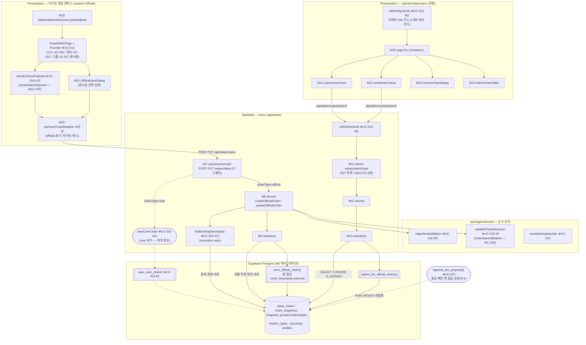

# Plan: UC-021 공식 밸류체인 관리 (CRUD)

> 근거: `docs/usecases/021/spec.md`, `docs/usecases/000_decisions.md`(D-6·D-7, C-2 조회 한정 원칙), `docs/techstack.md` §4(모노레포 Codebase Structure)·§7(복잡 트랜잭션은 Postgres 함수/RPC, RLS 비활성), `docs/database.md` §3.3·§4.1, `supabase/migrations/0005_value_chains.sql`(`chk_value_chains_owner`·`uq_value_chains_official_name`)·`0006_chain_snapshots.sql`(스냅샷 4종 제약 — 기존 스키마), `docs/pages/chain-editor/state_management.md`(편집 캔버스 상태 설계 SOT — §11 어드민 variant), `docs/usecases/013/plan.md`(편집기 Flux 코어·라우트 셸 소유), `docs/usecases/015/plan.md`(노드 편집·종목 검색), `docs/usecases/016/plan.md`(최신 구성 API·엣지 저장 검증·R-1~R-5 정합 결정), `docs/usecases/022/plan.md`(`withAdminAuth`·어드민 레이아웃·체인 행 잠금 계약 R-8), `docs/usecases/018/plan.md`(사용자 저장 경로·공유 편집 상태 모듈의 SOT — S-1~S-11 정합 결정), `docs/usecases/019/plan.md`(valuechains feature 파일 공유 방식 선례), `.claude/skills/spec_to_plan/references/hono-backend-guide.md`.
>
> **범위**: ① 어드민 공식 체인 목록/보관 API(`features/admin-valuechains/backend/*`, API-1·API-5), ② 저장 엔드포인트(`POST/PUT /api/valuechains`)의 chainType 디스패치 계층 + **공식 체인 저장 경로**(API-3·API-4 — valuechains feature 기여분. 사용자 저장 경로와 핸들러 user 분기·`SaveChainRequestSchema`는 UC-018 plan 소유 — R-2), ③ 공식 체인 원자 저장 RPC(`save_official_chain`) + 어드민 목록 함수 마이그레이션, ④ 노드/그룹 구조 재검증 모듈의 official 소비 계약(정의는 UC-018 #3 — R-13), ⑤ `/admin/valuechains` 목록 페이지 및 어드민 편집 캔버스 라우트 셸(variant='official'), ⑥ 저장 뮤테이션/직렬화 공유 모듈의 official 분기.
> **범위 밖**: 노드/엣지/그룹 캔버스 편집 로직(UC-015/016/017 — 그대로 재사용), 사용자 체인 저장 경로(`change_source='user_save'`, quota, 소유자 이름 유일, `save_user_chain` RPC — UC-018 plan 소유), LLM 승인 반영 RPC(UC-022), 관계 종류 마스터 CRUD(UC-024), 공개 목록/뷰 소비(UC-007/009/012), 지표 집계(UC-029).
> **외부 서비스 연동 없음**(spec §6.4) — 자체 DB(체인/스냅샷/종목 마스터/관계 종류 마스터)만 사용하므로 외부 클라이언트 모듈·재시도/타임아웃 설계 대상이 없다. 종목 검색도 배치가 사전 적재한 `securities` 조회(UC-008/015 재사용)뿐이다.

---

## 사전 정합화 결정 (spec 간 충돌·모호점 해소 — 구현 시 이 표를 따름)

| # | 사안 | 결정 | 근거 |
|---|---|---|---|
| R-1 | 저장 페이로드 필드명: UC-021 spec은 `sourceNodeKey`/`targetNodeKey`·`expectedLatestSnapshotId`, UC-018 spec은 `sourceClientNodeId`/`targetClientNodeId`(+`clientEdgeId`)·`baseSnapshotId` | **UC-018 필드명으로 통일**: `clientEdgeId`/`sourceClientNodeId`/`targetClientNodeId`, 낙관적 잠금 필드는 **`baseSnapshotId`**(PUT 필수) | UC-016 plan R-3 기결정(UC-018이 저장 계약 소유), `state_management.md` §4.4 각주 |
| R-2 | 저장 엔드포인트·저장 RPC의 소유 구조 — **UC-018 plan(작성 완료)과의 정합**(종전 문구의 'UC-018 plan 미작성' 전제 폐기) | **사용자 저장 경로는 UC-018 plan이 SOT**: `SaveChainRequestSchema`(`chainType` 필드 없음)·`saveUserChain(client, actor, { chainId, body })` 단일 서비스(별도 `updateUserChain` 없음)·`save_user_chain` RPC(advisory lock quota 포함 — UC-018 #6/#7/#10/#11)를 그대로 인정한다. 본 plan은 이를 **비충돌 확장**한다: ① 라우트 디스패치 계층(M7 — POST는 body `chainType` peek 후 분기, PUT은 DB `chain_type` 판별), ② official 전용 스키마 심볼(M3 — R-12), ③ official 전용 RPC `save_official_chain`(M2). 종전의 user/official 공용 `save_value_chain` 단일 RPC 구상은 **폐기**(UC-018 #6과의 이중 정의 해소). 구현 순서 무관 규칙: **선구현 측이 POST/PUT 핸들러 골격+디스패치를 생성**하고 후구현 측은 자기 분기 내부만 채운다. 미구현 분기는 `501 VALUECHAINS.NOT_IMPLEMENTED` 임시 응답(명시적 stub — user/official 양방향 동일) | UC-018 plan #6/#7/#10/#11(사용자 저장 계약 SOT), UC-016 plan 경계 표, 선검증 지적(공유 저장 계약 미정합) 해소 |
| R-3 | 에러 코드 표기: spec은 bare 코드(`NODE_LIMIT_EXCEEDED` 등)·admin 401/403은 `AUTH_REQUIRED`/`ADMIN_REQUIRED` | feature prefix 규칙으로 매핑: 저장 계열은 `VALUECHAINS.*`, 어드민 목록/보관은 `ADMIN_CHAINS.*`. `/api/admin/*`의 401/403은 **UC-022 M1 공통 코드 `UNAUTHORIZED`/`ADMIN_ONLY` 재사용**(spec의 `AUTH_REQUIRED`/`ADMIN_REQUIRED` 표기를 대체). admin 미들웨어 밖인 저장 API(`/api/valuechains`)의 비-Admin 공식 저장 시도는 `403 VALUECHAINS.ADMIN_REQUIRED` | UC-022 M1(공유 미들웨어 코드 SOT), UC-016 M10·UC-018 spec의 `VALUECHAINS.*` 컨벤션 |
| R-4 | `effective_at` 확정 시점과 직렬 처리(BR-7·E4/E6) | 저장 RPC는 갱신 시 `value_chains` 대상 행을 `SELECT … FOR UPDATE`로 잠근 **후** `clock_timestamp()`로 `effective_at`을 확정한다(트랜잭션 시작 시각 `now()` 사용 금지 — 잠금 대기 중 시작한 트랜잭션의 시각 역전 방지). `baseSnapshotId` 대조도 잠금 획득 후 수행. UC-022 승인 RPC와 동일 행 잠금을 공유해 시각 순 직렬화를 보장한다(UC-022 R-8 계약 이행) | spec BR-7·E4/E6, UC-022 plan R-8, Postgres `now()`=트랜잭션 시작 시각 특성 |
| R-5 | 공식 이름 유일(E9) 검증 위치 | 서비스 사전 SELECT(사용자 친화 메시지·오류 위치 반환) + RPC 내 `unique_violation`(23505, `uq_value_chains_official_name`) catch → `outcome='name_duplicate'` **이중 방어**(사전 확인~INSERT 사이 TOCTOU 제거). 사용자 체인 이름 유일(`uq(owner,name)`)은 UC-018 `save_user_chain`(별도 RPC — R-2) 소관으로 본 함수와 무관 | spec E9("DB 부분 유니크가 최종 방어"), 0005 마이그레이션 |
| R-6 | 보관 체인의 편집 진입 | UC-016 M12 계약 유지 — 최신 구성 API는 보관 체인에 404. 어드민 목록 FE는 보관 행에 편집 진입을 노출하지 않는다(복원 기능은 MVP 범위 밖). 보관 체인 수정 저장의 우회 요청은 `409 VALUECHAINS.CHAIN_ARCHIVED`(E10 — RPC가 잠금 하에서 재확인) | spec E10, UC-016 M12 |
| R-7 | 보관 API 대상이 user 체인/미존재 체인 | 둘 다 `404 ADMIN_CHAINS.CHAIN_NOT_FOUND`(어드민 보관 API는 공식 체인 한정 — user 체인 오보관 원천 차단). 이미 보관된 공식 체인은 멱등 200(E8) | spec E7/E8의 보수적 확장 |
| R-8 | `disclosureDate` 입력 UI | 편집 문서 상태(state_management.md SOT)에 필드를 추가하지 않는다 — official variant의 **저장 확인 다이얼로그 로컬 상태**(휘발)로 수집해 mutation 호출 인자로만 전달. `save(options?: { disclosureDate? })`로 시그니처를 하위호환 확장 | spec BR-2, state 문서 원칙("다이얼로그는 전부 로컬/파생 — 상태 아님") |
| R-9 | 목록의 최신 스냅샷 요약(노드 수·최근 변경) | Postgres 함수 `admin_list_official_chains()`로 계산(LATERAL 최신 스냅샷 + 노드 COUNT). TS 측 N+1 조회 금지 | techstack §7(복잡 조인은 RPC), spec API-1 |
| R-10 | RPC 오류 표현 | UC-022 R-9와 동일 패턴 — 예측된 분기(`saved`/`chain_not_found`/`chain_archived`/`save_conflict`/`name_duplicate`/`chain_type_mismatch`)는 outcome 반환, 예기치 못한 DB 오류(제약 위반 등)만 예외 전파 → Service가 `500 SAVE_FAILED` 매핑 + 전체 롤백(E13) | spec E13, UC-022 plan R-9 |
| R-11 | 마이그레이션 파일 번호 | 타 plan들이 `0013_*` 이후 번호를 경합 선점 중(UC-018은 `0014_fn_save_user_chain.sql` 예약) — 파일명 `NNNN_save_official_chain_and_admin_chain_fns.sql`의 **NNNN은 구현 시점의 다음 빈 번호**로 부여(내용만 고정, UC-018 마이그레이션과 내용 독립·순서 무관) | UC-022 plan R-7과 동일 규칙, UC-018 S-8 |
| R-12 | 동일 파일(`features/valuechains/backend/schema.ts`) 심볼 충돌 | `SaveChainRequestSchema`(user 계약 — spec §6.2, `chainType` 필드 없음)·`SaveChainGroupPayloadSchema`·`SaveChainNodePayloadSchema`·`SaveRpcResultSchema`·`SaveChainResponseSchema`는 **UC-018 #7 소유 — 본 plan 재정의 금지, 재사용**. 본 plan 추가 심볼은 official 접두로 분리: `ChainTypeDispatchSchema`·`SaveOfficialChainRequestSchema`·`SaveOfficialRpcRowSchema`(M3). 종전의 POST/PUT 스키마 분리·`baseSnapshotId: z.null()` 구상은 폐기 — UC-018과 동일하게 **단일 스키마(`baseSnapshotId` nullable) + 모드 검증(POST=null·PUT=필수)은 서비스에서 400**으로 처리 | 선검증 지적(동일 심볼 이중 정의) 해소, UC-018 S-6 |
| R-13 | 공유 FE/조회 모듈의 위치·중복 | ① `packages/domain/valuechains/chainSaveValidation.ts`는 **UC-018 #3(`validateChainStructure`/`StructureViolation`)이 SOT** — 본 plan M1은 소비 전용(official 오류 코드 매핑만 M6이 수행). ② `serializeSavePayload`는 **`editor/state/chainEditorSelectors.ts`(UC-018 #15)가 위치·시그니처 SOT** — 본 plan의 `editor/lib/serializeSavePayload.ts` 신설 구상 폐기(파일 경로 충돌 해소). ③ 종목 존재 조회는 **`features/securities/backend/repository.ts`의 `findExistingSecurityIds`(UC-018 #12) 재사용** — valuechains repository에 `findSecuritiesByIds` 신설 금지(feature 테이블 캡슐화 원칙과 정합). UC-018 미구현 시점이면 해당 계약대로 **선구현**(소유는 UC-018 유지) | 선검증 지적(DRY 위반·경로 상이) 해소, state 문서 §4.4, UC-018 S-10/S-11 |
| R-14 | official 저장의 `focusType`-`focusSecurityId` 서버측 정합 | FE 직렬화(UC-018 #15)가 `focusType='industry'`→`focusSecurityId=null`을 보장하지만, 직접 API 호출 우회를 막기 위해 **서버(M6)가 `focusType='industry'`이면 `focusSecurityId=null`로 강제 정규화**한다(UC-018 S-9와 동일 규칙 — user/official 대칭). 존재 검증 집합에는 정규화 후의 focus 참조만 포함 | BR-9(클라이언트 우회 방지), UC-018 S-9, 선검증 지적(서버측 재검증 미명시) 해소 |

---

## 개요

| # | 모듈 | 위치 | 설명 |
| --- | --- | --- | --- |
| **공유 — packages/domain (순수 로직, FE/BE 공용)** | | | |
| M1 | 노드/그룹 구조 재검증(소비) | `packages/domain/valuechains/chainSaveValidation.ts` | `validateChainStructure` 소비 계약 + official 오류 코드 매핑 표(BR-9 서버 재검증). **UC-018 #3 소유(R-13) — 본 UC는 소비만, 재정의 금지** |
| — | 엣지 저장 재검증(참조) | `packages/domain/valuechains/edgeSaveValidation.ts` | UC-016 M3 소유 — `validateEdgesPayload`(`enforceActiveForNewEdges=true`)·`isEdgePreexisting` 재사용 |
| — | 상수/타입/편집 검증(참조) | `packages/domain/constants/valuechain.ts`, `types/chainEditor.ts`, `valuechains/editorValidation.ts` | UC-013/015/016 소유 — `MAX_NODES_PER_CHAIN=100`, `validateChainNameFormat` 등 재사용 |
| **DB — Persistence (마이그레이션 SOT)** | | | |
| M2 | 공식 저장 RPC·어드민 목록 함수 | `supabase/migrations/NNNN_save_official_chain_and_admin_chain_fns.sql` (R-11) | ① `save_official_chain()` 공식 체인 원자 저장 트랜잭션(체인 행 잠금·낙관적 잠금 대조 — **official 전용, 사용자 저장은 UC-018 `save_user_chain` 별도 함수** R-2), ② `admin_list_official_chains()` 목록 요약 함수 |
| **백엔드 — valuechains feature 기여분 (UC-007/009/014/016/018/019 공유 파일 — 본 UC: 저장 골격 + official 경로)** | | | |
| M3 | Zod 스키마(기여분) | `apps/web/src/features/valuechains/backend/schema.ts` | `ChainTypeDispatchSchema`/`SaveOfficialChainRequestSchema`/`SaveOfficialRpcRowSchema` — user 계약 심볼(`SaveChainRequestSchema` 등)은 UC-018 #7 재사용(R-12) |
| M4 | 에러 코드(기여분) | `apps/web/src/features/valuechains/backend/error.ts` | official 저장 코드(`ADMIN_REQUIRED`·`OFFICIAL_NAME_DUPLICATE`·`CHAIN_ARCHIVED`·노드/그룹 세분 코드 등) 추가 |
| M5 | 리포지토리(기여분) | `apps/web/src/features/valuechains/backend/repository.ts` | `existsOfficialChainName`·`saveOfficialChainRpc` 추가(+UC-016 M11의 `findChainMetaById`/`findLatestSnapshotHeader`/`findLatestEdgeIdentities`, UC-018 #12 `findExistingSecurityIds` 재사용 — R-13) |
| M6 | 서비스(기여분) | `apps/web/src/features/valuechains/backend/service.ts` | `createOfficialChain`/`updateOfficialChain` — role·이름·구조 재검증 오케스트레이션 + RPC outcome 매핑 |
| M7 | 라우트(기여분) | `apps/web/src/features/valuechains/backend/route.ts` | `POST /valuechains`·`PUT /valuechains/:chainId` 디스패치 계층(POST=body `chainType` peek, PUT=DB `chain_type` 판별. official→M6, user→UC-018 #10 `saveUserChain`) — 핸들러 골격은 선구현 측 생성(R-2) |
| **백엔드 — admin-valuechains feature (본 UC 소유)** | | | |
| M8 | Zod 스키마 | `apps/web/src/features/admin-valuechains/backend/schema.ts` | Query/RPC Row/Response 스키마 분리 정의 |
| M9 | 에러 코드 | `apps/web/src/features/admin-valuechains/backend/error.ts` | `ADMIN_CHAINS.*` 코드(spec API-1·API-5) |
| M10 | 리포지토리 | `apps/web/src/features/admin-valuechains/backend/repository.ts` | `listOfficialChains`(RPC)·`findOfficialChainById`·`archiveOfficialChainById` 캡슐화 |
| M11 | 서비스 | `apps/web/src/features/admin-valuechains/backend/service.ts` | 목록 DTO 변환·보관 멱등 처리(404/멱등 200 분기) |
| M12 | 라우트 + 등록 | `apps/web/src/features/admin-valuechains/backend/route.ts`, `backend/hono/app.ts`(수정) | `GET /admin/valuechains`·`DELETE /admin/valuechains/:chainId` — `withAdminAuth`(UC-022 M1) 선적용 |
| **프론트엔드 — 어드민 목록 화면 `/admin/valuechains`** | | | |
| M13 | 목록 쿼리 훅 | `apps/web/src/features/admin-valuechains/hooks/useAdminChains.ts` | 쿼리 키 `['admin','valuechains']` — TanStack Query |
| M14 | 보관 뮤테이션 훅 | `apps/web/src/features/admin-valuechains/hooks/useArchiveChain.ts` | DELETE 호출 + 어드민 목록/공개 목록/체인 스코프 캐시 정리 |
| M15 | 목록 테이블·보관 다이얼로그 | `apps/web/src/features/admin-valuechains/components/AdminChainTable.tsx`, `ArchiveChainDialog.tsx` | 순수 Presenter(행·배지·편집/보관 액션·빈 상태·확인 다이얼로그) |
| M16 | 목록 페이지 컨테이너 | `apps/web/src/app/admin/valuechains/page.tsx` | `'use client'` Container — 쿼리/뮤테이션/다이얼로그 로컬 상태 소유(+ UC-022 M2 어드민 내비에 링크 1줄 추가) |
| M17 | UI 문구 상수 | `apps/web/src/features/admin-valuechains/constants.ts` | 라벨·토스트·빈 상태·확인 문구 상수(하드코딩 금지) |
| **프론트엔드 — 편집 캔버스 official variant (chain-editor state 문서 §11 준수)** | | | |
| M18 | 어드민 편집 라우트 셸 | `apps/web/src/app/admin/valuechains/new/page.tsx`, `app/admin/valuechains/[chainId]/edit/page.tsx` | Server Component 셸 — `ChainEditorPage`(UC-013 M16)에 `variant='official'` 전달 |
| M19 | 저장 직렬화(소비) | `apps/web/src/features/valuechains/editor/state/chainEditorSelectors.ts` | `serializeSavePayload` — **UC-018 #15 소유(R-13), 본 UC는 소비만**. official 확장 필드(`chainType`/`disclosureDate`)는 M20/M21 호출측이 합성 |
| M20 | 저장 뮤테이션·Provider 저장 파이프라인 | `apps/web/src/features/valuechains/editor/hooks/useSaveChainMutation.ts` + `ChainEditorContext.tsx`(기여분) | POST/PUT 호출·variant별 성공 라우팅/캐시 무효화·오류 분류(conflict/serverIssues). **공유 — 본 plan은 official 분기 소유** |
| M21 | 공식 저장 다이얼로그 | `apps/web/src/features/valuechains/editor/components/OfficialSaveDialog.tsx` | official 전용 Presenter — 공시일(선택) 입력 + 저장 확정(R-8). EditorToolbar(UC-013 M18)에 variant 분기 1줄 편입 |
| **공통 인프라 — 위치만 참조 (선행 plan 소유, 본 UC 신규 정의 없음)** | | | |
| — | 사용자 저장 경로·공유 저장 모듈 | `save_user_chain` RPC·`saveUserChain`·`SaveChainRequestSchema`·`validateChainStructure`·`findExistingSecurityIds`·`serializeSavePayload`·`useSaveChainMutation` 골격 | UC-018 plan #3/#6/#7/#10/#12/#15/#17 소유 — 본 plan은 소비·official 분기 기여만(R-2·R-12·R-13), 재정의 금지 |
| — | Admin 인증 미들웨어·레이아웃 | `apps/web/src/backend/middleware/admin.ts`, `app/admin/layout.tsx` | UC-022 M1/M2 소유(`UNAUTHORIZED`/`ADMIN_ONLY`) — 재정의 금지 |
| — | Hono 골격·응답 헬퍼·API 클라이언트 | `apps/web/src/backend/{hono,http,middleware}/*`, `lib/http/*` | UC-001 plan 정의 — 선행 구현이 확정한 단일 위치를 따름 |
| — | 최신 구성 API·관계 종류 API | `GET /api/valuechains/:chainId/snapshots/latest`, `GET /api/relation-types` | UC-016 M13/M8 — 편집 진입·관계 선택에 재사용(공식 체인 admin 접근은 M12 권한 분기에 이미 반영) |
| — | 종목 검색 API | `GET /api/securities/search` | UC-008/015 소유 — 상장기업 노드 추가에 재사용 |
| — | DB 생성 타입 | `packages/domain/types/database.ts` | M2 적용 후 `generate_typescript_types` 재생성(techstack §7) |

- **워커(apps/worker) 변경 없음.** 저장된 스냅샷은 UC-029 집계 배치가 `effective_at` 기준으로 소비한다(BR-8 — 본 plan은 쓰기 계약만 보장).
- **기존 테이블 스키마 변경 없음** — 0005/0006의 CHECK·부분 유니크·복합 FK가 최종 방어선. M2는 함수만 추가한다.

## Diagram



데이터 흐름: Presenter → Container/Provider → mutation → Route(HTTP 검증·chainType 디스패치) → Service(비즈니스 재검증 — UC-018 #3(M1 소비)·UC-016 M3 순수 모듈 위임) → Repository(Supabase 접근) → RPC(원자 트랜잭션·행 잠금) → DB 제약 최종 방어. user 저장(UC-018 `save_user_chain`)·LLM 승인(UC-022)과는 `value_chains` 행 잠금 하나로 직렬화된다(BR-7·R-2).

---

## Implementation Plan

### M1. 노드/그룹 구조 재검증 소비 계약 — `packages/domain/valuechains/chainSaveValidation.ts` [UC-018 #3 소유 — 참조·소비]

- 본 plan은 이 파일에 **함수를 정의하지 않는다**(R-13 — 종전의 `validateGroupsPayload`/`validateNodesPayload`/`collectMissingSecurityIds` 자체 정의 구상 폐기, UC-018 #3과의 이중 소유 해소). UC-018 #3의 `validateChainStructure(payload): StructureViolation[]`(위반 전량 수집·`targets`의 client ID 식별 — reason 집합: `NODE_LIMIT_EXCEEDED`/`NODE_KIND_FIELD_MISMATCH`/`DUPLICATE_SECURITY_NODE`/`GROUP_NAME_REQUIRED`/`GROUP_REF_INVALID`/`DUPLICATE_CLIENT_ID`)를 official 저장 service(M6)가 그대로 호출한다. UC-018 미구현 시점이면 #3 계약(시그니처·reason 집합·판정 규칙·테스트)대로 선구현하되 소유는 UC-018로 유지.
- official 경로의 reason→응답 코드 매핑(수행 위치는 M6 — "검증 구현은 단일, 코드 매핑만 경로별 상이" 원칙, UC-016 R-4):

| `StructureViolation.reason` | official 응답(M4 코드) |
|---|---|
| `NODE_LIMIT_EXCEEDED` | 422 `VALUECHAINS.NODE_LIMIT_EXCEEDED`(E2) |
| `NODE_KIND_FIELD_MISMATCH` | 422 `VALUECHAINS.INVALID_NODE` |
| `DUPLICATE_SECURITY_NODE` | 422 `VALUECHAINS.DUPLICATE_SECURITY_NODE` |
| `GROUP_NAME_REQUIRED` | 422 `VALUECHAINS.GROUP_NAME_REQUIRED` |
| `GROUP_REF_INVALID` | 422 `VALUECHAINS.GROUP_REF_INVALID`(E11) |
| `DUPLICATE_CLIENT_ID` | 400 `VALUECHAINS.INVALID_REQUEST`(방어) |

  (user 경로는 `GROUP_*`를 `INVALID_GROUP`으로 통합 매핑 — UC-018 #10. 코드 집합 차이는 각 spec 계약 소관이며 검증 구현은 공유된다.)
- 종목 존재 검증의 누락 ID 산출(종전 `collectMissingSecurityIds` 구상)은 별도 도메인 함수 없이 M6이 `findExistingSecurityIds`(UC-018 #12) 결과와의 집합 차로 계산한다.
- 의존성: UC-018 #2/#3(페이로드 타입·검증 SOT), UC-013 M1(상수 — `MAX_NODES_PER_CHAIN`의 출처).
- Unit Tests: 판정 규칙 테스트는 UC-018 #3 소관(중복 작성 금지). 본 plan은 M6 단위 테스트에서 reason→official 코드 매핑만 검증한다.

### M2. 공식 저장 RPC·어드민 목록 함수 — `supabase/migrations/NNNN_save_official_chain_and_admin_chain_fns.sql` (Persistence, R-11)

- 구현 내용 (`CREATE OR REPLACE FUNCTION`, `SECURITY INVOKER`, `SET search_path = ''` — 저장소 SQL 가이드라인. 적용은 `mcp__supabase__apply_migration`, 로컬 Supabase 금지):
  1. **`save_official_chain(p_chain_id uuid, p_name text, p_focus_type chain_focus_type, p_focus_security_id uuid, p_disclosure_date date, p_base_snapshot_id uuid, p_created_by uuid, p_groups jsonb, p_nodes jsonb, p_edges jsonb)`** — **official 전용 함수**(R-2 — 사용자 저장은 UC-018 #6 `save_user_chain` 별도 함수. 종전의 user/official 공용 `save_value_chain` 구상 폐기). `chain_type='official'`·`owner_id=NULL`·`change_source='admin_edit'`은 함수 내부에 고정한다(파라미터로 받지 않아 오설정 여지 제거). 반환 `(outcome text, chain_id uuid, snapshot_id uuid, effective_at timestamptz, group_count int, node_count int, edge_count int)`(UC-018 응답 DTO와 동형 — 공유 FE mutation이 단일 응답 형상을 소비). 예외를 던지지 않고 outcome을 반환한다(R-10):
     - **갱신(p_chain_id NOT NULL)**: `SELECT … FROM value_chains WHERE id=p_chain_id FOR UPDATE` — 0행 → `'chain_not_found'`; `chain_type <> 'official'` → `'chain_type_mismatch'`(방어 — M7 디스패치가 선차단); `is_archived` → `'chain_archived'`(E10); 최신 스냅샷(`ORDER BY effective_at DESC, created_at DESC LIMIT 1`) ≠ `p_base_snapshot_id` → `'save_conflict'`(E4/E6 — **잠금 획득 후 대조**이므로 UC-022 승인 반영과 완전 직렬). 통과 시 헤더 UPDATE(이름/기준 변경분).
     - **생성(p_chain_id NULL)**: `value_chains` INSERT(`chain_type='official'`, `owner_id=NULL` — `chk_value_chains_owner`, `name`, `focus_type`, `focus_security_id`).
     - 공통: `v_effective := clock_timestamp()`(R-4 — 잠금 획득 후 확정) → `chain_snapshots` INSERT(`change_source='admin_edit'`, `effective_at=v_effective`, `disclosure_date=p_disclosure_date`, `created_by=p_created_by`) → `p_groups` INSERT(clientGroupId→신규 uuid 매핑) → `p_nodes` INSERT(그룹 매핑·kind 필드·좌표) → `p_edges` INSERT(clientNodeId→신규 노드 uuid 매핑) → 각 INSERT 건수를 집계해 반환. 스냅샷 테이블 UPDATE/DELETE 없음(불변 — 이벤트 소싱).
     - `EXCEPTION WHEN unique_violation`: 제약명이 `uq_value_chains_official_name`이면 `'name_duplicate'`(R-5), 그 외(스냅샷 제약 등)는 재-RAISE → 전체 롤백(E13 — Service가 500 매핑).
     - **UC-018 `save_user_chain`과의 DRY**: 스냅샷 그래프 기록(그룹/노드/엣지 client ID 매핑 INSERT)은 두 함수가 동일 로직이므로, 두 함수가 모두 존재하는 시점에 후구현 측이 내부 헬퍼 함수로 추출하는 리팩터링을 허용한다(각 함수의 시그니처·outcome/예외 스타일 계약은 불변). 두 함수 모두 갱신 시 동일한 `value_chains` 행 `FOR UPDATE` 규약을 따르므로 user 저장·official 저장·LLM 승인(UC-022)은 행 단위로 직렬화된다. `save_user_chain`의 `effective_at`도 잠금 획득 후 `clock_timestamp()` 사용을 권고(R-4와 동일 논리 — UC-018 구현 디테일, 계약 충돌 아님).
  2. **`admin_list_official_chains()`** — `value_chains WHERE chain_type='official'`(보관 포함)에 LATERAL 최신 스냅샷(`idx_chain_snapshots_chain_effective` 활용, `effective_at DESC, created_at DESC` tie-break) + `snapshot_nodes` COUNT 결합(R-9). 반환 flat snake_case: `chain_id, name, focus_type, focus_security_id, is_archived, created_at, updated_at, latest_snapshot_id, latest_effective_at, latest_change_source, node_count`(스냅샷 없으면 latest_* NULL — 방어). 정렬 `created_at ASC`(B-1 어드민 큐레이션 순과 정합).
  3. 적용 후 `mcp__supabase__generate_typescript_types`로 `packages/domain/types/database.ts` 재생성.
- 의존성: 마이그레이션 0003~0006(기존 적용분). 신규 테이블/컬럼 없음. UC-018의 `fn_save_user_chain` 마이그레이션과 내용 독립(적용 순서 무관 — R-11).
- **검증 시나리오 (마이그레이션 QA — SQL 레벨, 시드 데이터로 실행)**:
  - [ ] official 생성: 헤더(`owner_id=NULL`)+스냅샷 1건(`change_source='admin_edit'`)+그룹/노드/엣지 전량 INSERT, client ID 매핑(노드→그룹 `group_id`, 엣지→노드 `source/target_node_id`) 정확, 반환 카운트(group/node/edge_count) 일치
  - [ ] `disclosure_date`·좌표·자유 주체 필드·`created_by`가 스냅샷에 보존된다
  - [ ] 동일 이름 official 재생성 → `'name_duplicate'`, 어떤 행도 미생성(E9)
  - [ ] 갱신: 헤더 이름 변경 + 새 스냅샷 1건, 기존 스냅샷 불변
  - [ ] `p_base_snapshot_id`가 최신이 아닌 갱신 → `'save_conflict'`, 쓰기 없음(E4)
  - [ ] 보관 체인 갱신 → `'chain_archived'` / 미존재 chainId → `'chain_not_found'` / **user 체인 id로 호출** → `'chain_type_mismatch'`(쓰기 없음 — user 체인 오염 원천 차단)
  - [ ] 동일 체인 동시 갱신 2트랜잭션(동일 base) → 선착 `'saved'`, 후행 `'save_conflict'`(행 잠금 — E4)
  - [ ] 저장과 `approve_llm_proposal`(UC-022) 동시 실행 → 직렬 커밋 + 두 스냅샷의 `effective_at`이 커밋 순과 단조 일치(R-4)
  - [ ] 스냅샷 제약 위반 유도(예: 자기 참조 엣지 강제) → 예외 → 전체 롤백(헤더/스냅샷 잔존 없음, E13)
  - [ ] `admin_list_official_chains()`: 보관 포함 전체 반환·노드 수/최근 변경 시각 정확·스냅샷 0건 체인 latest_* NULL·user 체인 미포함

### M3. Zod 스키마(기여분) — `features/valuechains/backend/schema.ts`

- 구현 내용(기존 파일에 섹션 주석으로 **추가만**. user 저장 계약 심볼 — `SaveChainRequestSchema`·`SaveChainGroupPayloadSchema`·`SaveChainNodePayloadSchema`·`SaveRpcResultSchema`·`SaveChainResponseSchema` — 은 **UC-018 #7 소유로 재정의 금지·재사용**(R-12). UC-018 미구현 시점이면 #7 계약대로 선구현):
  1. `ChainTypeDispatchSchema`: `z.object({ chainType: z.enum(['official','user']).optional() })` — 비-strict(여타 필드 통과). M7의 POST 본문 **peek 판별 전용**(R-2). `chainType`은 이 디스패치 필드로만 소비하고 저장 요청 스키마에는 두지 않는다 — user 스키마의 unknown-key strip으로 `chainType='official'` 요청이 user 경로에 흘러가는 필드 소실을 **디스패치 선행**으로 구조적으로 차단(선검증 지적 해소).
  2. `SaveOfficialChainRequestSchema`: **UC-018 `SaveChainRequestSchema.extend({ disclosureDate: z.string().date().nullable().optional() })`** — 그룹/노드/엣지 서브스키마는 전부 UC-018 #7·UC-016 M9 재사용(신규 정의 없음). `baseSnapshotId`는 UC-018과 동일한 단일 형상 `z.string().uuid().nullable()` — POST=null·PUT=필수의 모드 검증은 M6 서비스에서 400 처리(R-12 — 종전의 POST/PUT 스키마 분리·`z.null()` 구상 폐기).
  3. `SaveOfficialRpcRowSchema`(snake_case): M2 ① 반환 행과 1:1 — `{ outcome, chain_id, snapshot_id, effective_at, group_count, node_count, edge_count }`(비-`saved` outcome은 outcome 외 필드 null 허용).
  4. 응답 스키마는 UC-018 `SaveChainResponseSchema`(camelCase `SaveChainResult` — counts 포함) 재사용 — user/official 동일 응답 형상(공유 mutation 훅 M20의 단일 소비 계약).
- 의존성: UC-018 #7(스키마 — R-12), UC-016 M9.
- **Unit Tests**:
  - [ ] `ChainTypeDispatchSchema`: `chainType` 미지정 → 통과(undefined) / `'banana'` → 실패 / 저장 페이로드 필드가 함께 있어도 통과(비-strict)
  - [ ] `SaveOfficialChainRequestSchema`: spec §6.2 형상의 body + `disclosureDate` → 성공, body에 `chainType` 필드가 있어도 성공(strip — 디스패치 전용 필드)
  - [ ] `disclosureDate: '2026-13-99'` 형식 위반 → 실패 / 미지정·null → 성공
  - [ ] `listed_company` + `securityId=null` → **parse 성공**(구조 조합 위반은 422 소관 — UC-018 S-6 준용 회귀 고정)

### M4. 에러 코드(기여분) — `features/valuechains/backend/error.ts`

- 구현 내용(기존 `valuechainErrorCodes`에 추가 — UC-016 M10의 엣지 세분 코드·R-4 매핑 주석과 공존):
  ```
  adminRequired:          'VALUECHAINS.ADMIN_REQUIRED'            // 403 — 비-Admin의 공식 저장(E1, R-3)
  invalidRequest:         'VALUECHAINS.INVALID_REQUEST'           // 400 — 본문 스키마 위반·DUPLICATE_CLIENT_* (기존 정의 있으면 재사용)
  officialNameDuplicate:  'VALUECHAINS.OFFICIAL_NAME_DUPLICATE'   // 409 (E9)
  saveConflict:           'VALUECHAINS.SAVE_CONFLICT'             // 409 (E4/E6 — UC-018과 공용)
  chainArchived:          'VALUECHAINS.CHAIN_ARCHIVED'            // 409 (E10)
  nodeLimitExceeded:      'VALUECHAINS.NODE_LIMIT_EXCEEDED'       // 422 (E2)
  duplicateSecurityNode:  'VALUECHAINS.DUPLICATE_SECURITY_NODE'   // 422
  invalidNode:            'VALUECHAINS.INVALID_NODE'              // 422 (E11)
  securityNotFound:       'VALUECHAINS.SECURITY_NOT_FOUND'        // 422 (E11)
  groupRefInvalid:        'VALUECHAINS.GROUP_REF_INVALID'         // 422 (E11)
  groupNameRequired:      'VALUECHAINS.GROUP_NAME_REQUIRED'       // 422
  saveFailed:             'VALUECHAINS.SAVE_FAILED'               // 500 (E13)
  notImplemented:         'VALUECHAINS.NOT_IMPLEMENTED'           // 501 — 미구현 분기 임시 stub(R-2 — user/official 양방향, 후구현 plan 완료 시 제거)
  ```
  엣지 세분 코드(`EDGE_SELF_REFERENCE` 등)는 UC-016 M10 기존 정의 재사용. 저장 API(`POST/PUT /valuechains`)의 404는 **UC-018 #8 `notFound: 'VALUECHAINS.NOT_FOUND'` 재사용**(PUT 디스패치의 대상 미존재와 official 갱신 경로 공용 — 엔드포인트 단위 코드 일관성. `CHAIN_NOT_FOUND`는 UC-016 조회 API 소관으로 공존 — UC-018 S-3 원칙). 422 응답 `details`에는 항상 위반 요소 식별 정보(`violations[]` — `clientNodeId`/`clientEdgeId`/`clientGroupId`/`securityId`)를 포함한다(spec API-3).
- 의존성: 없음. Unit Tests: N/A(상수 정의).

### M5. 리포지토리(기여분) — `features/valuechains/backend/repository.ts`

- 구현 내용(Supabase 문법은 이 파일에만, 예외 대신 결과 객체 반환 — 기존 컨벤션 유지. 본 UC 기여 함수 2개):
  1. `existsOfficialChainName(client, name, excludeChainId?)` — `value_chains` `chain_type='official'` + `name` 일치(+`excludeChainId` 제외) 존재 여부(R-5 사전 확인).
  2. `saveOfficialChainRpc(client, params)` — `client.rpc('save_official_chain', { p_chain_id, p_name, p_focus_type, p_focus_security_id, p_disclosure_date, p_base_snapshot_id, p_created_by, p_groups, p_nodes, p_edges })` 단일 행 반환. camelCase→snake_case 직렬화는 이 함수 소관.
  3. 재사용(신규 정의 금지): `findChainMetaById`·`findLatestSnapshotHeader`·`findLatestEdgeIdentities`(UC-016 M11), `findAllRelationTypes`(UC-016 M6 — relation-types feature. 관계 종류 마스터는 소규모라 전체 조회 후 Map 구성), **`findExistingSecurityIds`(UC-018 #12 — `features/securities/backend/repository.ts`)**. 종목 존재 조회를 valuechains repository에 중복 신설하지 않는다(R-13 — 종전 `findSecuritiesByIds` 구상 폐기, securities 테이블 접근은 securities feature 캡슐화).
- 의존성: M2(함수 존재), M3(Row 타입), UC-018 #12(미구현 시 계약대로 선구현 — 소유는 UC-018).
- **Unit Tests** (Supabase client mock):
  - [ ] `existsOfficialChainName`이 `chain_type='official'` 필터를 반드시 포함하고, `excludeChainId` 전달 시 해당 행을 제외한다
  - [ ] `saveOfficialChainRpc`가 파라미터를 정확한 이름으로 전달(스냅샷 비교 — `p_chain_type`/`p_owner_id`/`p_change_source` 파라미터는 존재하지 않음)
  - [ ] rpc error 응답 → error 결과로 정규화(throw 없음)

### M6. 서비스(기여분) — `features/valuechains/backend/service.ts`

- 구현 내용(repository 인터페이스에만 의존 — deps 주입. 본 UC 기여 함수 2개):
  1. **`createOfficialChain(deps, actor: { userId; role }, body): HandlerResult<SaveChainResult>`** — 검증 순서 고정:
     1. `actor.role !== 'admin'` → `failure(403, ADMIN_REQUIRED)`(E1/BR-1 — 클라이언트 정보 불신).
     2. **정규화(R-14)**: `focusType==='industry'`이면 `focusSecurityId=null` 강제. FE 직렬화(UC-018 #15)의 동일 규칙은 신뢰하지 않는다(BR-9 — 서버가 권위). 이후 모든 검증·RPC 호출은 정규화된 값 기준.
     3. **모드 검증(R-12)**: POST인데 `baseSnapshotId !== null` → `failure(400, INVALID_REQUEST)`(UC-018 #10과 동일 규칙 — 스키마가 아닌 서비스 소관).
     4. 이름 형식(`validateChainNameFormat` — UC-013 M4 재사용) 위반 → `failure(400, INVALID_REQUEST)`.
     5. 구조 재검증: `validateChainStructure`(UC-018 #3 — M1 소비 계약) → **M1 매핑 표대로** reason별 400/422 매핑 + `details.violations`(위반 전량 동봉). 복수 위반 유형 공존 시 대표 코드 우선순위: `NODE_LIMIT_EXCEEDED` > `INVALID_NODE` > `DUPLICATE_SECURITY_NODE` > `GROUP_*`(UC-018 #10과 동일 규칙 — FE는 details만 소비).
     6. 참조 존재: `findExistingSecurityIds`(UC-018 #12 — 노드 `securityId` ∪ 정규화 후 `focusSecurityId`) 결과와의 집합 차로 누락 산출 → `failure(422, SECURITY_NOT_FOUND, details)`(E11).
     7. 엣지: `validateEdgesForSave(variant='official', previousEdges=null)`(UC-016 M12 위임 — 비활성 종류 신규 차단 E3 포함).
     8. 이름 유일 사전 확인 `existsOfficialChainName(name)` → `failure(409, OFFICIAL_NAME_DUPLICATE)`(E9).
     9. `saveOfficialChainRpc(chainId=null, disclosureDate, createdBy=actor.userId)`(`chain_type`/`owner_id`/`change_source`는 RPC 내부 고정 — M2) → outcome 매핑: `saved`→`success(201, counts 포함 DTO)`; `name_duplicate`→409(R-5 레이스); rpc error/예외→`failure(500, SAVE_FAILED)`(E13).
  2. **`updateOfficialChain(deps, actor, chainId, body): HandlerResult<SaveChainResult>`** — `findChainMetaById`: 없음→`failure(404, NOT_FOUND)`(M4 — UC-018 코드 재사용); `chain_type='user'`면 이 함수의 소관이 아님(M7 디스패치가 차단 — 방어적 404 `NOT_FOUND`); role 검증(403); **모드 검증(R-12)**: `baseSnapshotId === null` → 400; `is_archived`→`failure(409, CHAIN_ARCHIVED)`(사전 확인 — RPC가 잠금 하에서 재확인); 정규화(R-14)/이름 형식/구조 재검증/참조 존재는 생성과 동일; 엣지는 `findLatestEdgeIdentities(chainId)` 결과를 `previousEdges`로 전달(비활성 종류 **기존 엣지 유지 허용** — E3/BR-6); 이름 변경 시 `existsOfficialChainName(name, excludeChainId=chainId)`; RPC(`p_base_snapshot_id=body.baseSnapshotId`) outcome 매핑: `saved`→200, `save_conflict`→`failure(409, SAVE_CONFLICT)`(E4/E6), `chain_archived`→409, `chain_not_found`→404 `NOT_FOUND`, `chain_type_mismatch`→404 `NOT_FOUND`(방어 — 디스패치 후 레이스), `name_duplicate`→409, 그 외→500.
  3. 순수성: 시각 결정은 RPC(`clock_timestamp`) 소관 — 서비스는 `Date` 미사용. 로깅은 라우트 책임.
- 의존성: M1(소비 계약·매핑 표), M3, M4, M5, UC-018 #3/#12(미구현 시 계약대로 선구현), UC-013 M4, UC-016 M12, 공통 `response.ts`.
- **Unit Tests** (repository mock 주입):
  - [ ] role='user'로 official 생성 → 403 `ADMIN_REQUIRED`, repository 미호출(E1)
  - [ ] `focusType='industry'` + `focusSecurityId` 값 → **null로 정규화되어 RPC 전달** + 종목 존재 검증 집합에서 제외(R-14 — 서버측 우회 방지)
  - [ ] POST에 `baseSnapshotId` 값 / PUT에 null → 400 `INVALID_REQUEST`, RPC 미호출(R-12 모드 검증)
  - [ ] 이름 공백 → 400 / 노드 101개 → 422 `NODE_LIMIT_EXCEEDED`(E2)
  - [ ] `validateChainStructure` reason 6종 → M1 표의 official 코드(400/422)로 정확 매핑, 복수 위반 시 대표 코드 우선순위 준수 + `details.violations` 전량 동봉
  - [ ] 동일 종목 노드 중복 → 422 `DUPLICATE_SECURITY_NODE` + `details.violations`에 두 `clientNodeId`
  - [ ] 미존재 `securityId`(노드/focus 각각) → 422 `SECURITY_NOT_FOUND` + 누락 ID 목록(E11)
  - [ ] 비활성 관계 종류 신규 엣지 → 422 `RELATION_TYPE_INACTIVE_FOR_NEW_EDGE`(E3 — official variant)
  - [ ] 갱신: 직전 스냅샷에 존재하던 비활성 종류 동일 엣지 → 통과(BR-6 기존 엣지 유지)
  - [ ] 이름 중복 사전 확인 → 409 / RPC `name_duplicate` → 409(레이스 경로)
  - [ ] RPC outcome 6종(`saved`/`save_conflict`/`chain_archived`/`chain_not_found`/`chain_type_mismatch`/error)이 각각 정확한 status/code로 매핑(생성 201·갱신 200 구분, 404 코드는 `NOT_FOUND`)
  - [ ] 갱신 사전 확인: 보관 체인 → 409 `CHAIN_ARCHIVED`, RPC 미호출(E10)
  - [ ] 검증 통과 시 RPC 파라미터: `p_disclosure_date`·`p_created_by=actor.userId` 전달(BR-2/BR-3 — chain_type/owner/change_source 파라미터는 존재하지 않음, M2)
  - [ ] 이름 무변경 갱신 → `existsOfficialChainName`에 `excludeChainId` 전달로 자기 자신과 충돌하지 않음

### M7. 라우트(기여분) — `features/valuechains/backend/route.ts` (저장 디스패치 계층 — R-2)

- 구현 내용(**UC-018 #11과 동일 핸들러를 공유** — 동일 경로 이중 등록 금지. 선구현 측이 골격(인증→디스패치→분기→`respond()`)을 생성하고 후구현 측은 자기 분기 내부만 채운다(미구현 분기는 501 `NOT_IMPLEMENTED` stub — R-2). `backend/hono/app.ts` 등록은 UC-016 M14로 완료, 수정 불필요):
  1. `POST /valuechains`: 인증 확인(미로그인 → 401) → **`ChainTypeDispatchSchema`(M3)로 body의 `chainType`만 peek**(미지정 → `'user'` 기본, enum 밖 값 → 400) →
     - `'official'`: `SaveOfficialChainRequestSchema.safeParse`(실패 → 400 `INVALID_REQUEST` + zod details) → `createOfficialChain(actor, body)`(M6).
     - `'user'`: `SaveChainRequestSchema.safeParse`(UC-018 #7) → `saveUserChain(client, actor, { chainId: null, body })`(UC-018 #10 계약 — 별도 `updateUserChain` 없음, 단일 함수가 신규/갱신 겸용).
     - **디스패치 peek이 전체 파싱보다 선행**하므로 `chainType='official'` 요청이 user 스키마의 unknown-key strip으로 user 저장 경로에 유입되는 필드 소실이 구조적으로 불가능하다(선검증 지적 해소).
  2. `PUT /valuechains/:chainId`: 인증(401) → param uuid 검증(400) → **`findChainMetaById`로 DB `chain_type` 판별**(body의 `chainType`은 불신·무시): 미존재 → 404 `VALUECHAINS.NOT_FOUND`(M4); `official` → `SaveOfficialChainRequestSchema` 검증(400) → `updateOfficialChain`; `user` → `SaveChainRequestSchema` 검증(400) → `saveUserChain(client, actor, { chainId, body })`(user service 내부의 소유/유형 재검증은 심층 방어로 유지 — UC-018 #10).
  3. HTTP 파싱/검증/디스패치 외 로직 금지(비즈니스 규칙은 M6/UC-018 #10). 실패 로깅(500 error/4xx warn, Supabase 원문 오류는 로그 전용).
- 의존성: M3, M4, M6, UC-018 #7/#10(user 분기 계약 — 미구현 시 501 stub), 공통 미들웨어(withAuth — actor `{userId, role}` 컨텍스트).
- **QA Sheet**:

| # | 시나리오 | 기대 결과 |
| --- | --- | --- |
| 1 | Admin이 `chainType:'official'` 유효 페이로드로 POST | 201 `{chainId, snapshotId, effectiveAt, …counts}` + DB에 헤더/스냅샷/구성 생성, 공개 목록(UC-007)에 즉시 노출 |
| 2 | 일반 사용자가 `chainType=official`로 POST(E1) | 403 `VALUECHAINS.ADMIN_REQUIRED`, 쓰기 없음 |
| 3 | 비로그인 POST/PUT(E12) | 401 — 편집 상태는 클라이언트 유지(FE M20 확인) |
| 4 | `chainType` 미지정 POST | user 분기로 디스패치(기본값 `'user'` — UC-018 계약과 정합) / `chainType:'banana'` → 400 |
| 5 | **회귀: `chainType:'official'` POST가 user 경로로 유입되지 않음** | peek 선행 확인 — user 저장 service(`saveUserChain`) 미호출(mock 검증) |
| 6 | 필수 필드 누락/타입 오류(official 분기) | 400 `VALUECHAINS.INVALID_REQUEST` + zod details |
| 7 | 기존 official 이름으로 POST(E9) | 409 `VALUECHAINS.OFFICIAL_NAME_DUPLICATE` |
| 8 | 노드 101개 페이로드(E2) | 422 `VALUECHAINS.NODE_LIMIT_EXCEEDED` |
| 9 | 비활성 관계 종류 신규 엣지(E3) | 422 `VALUECHAINS.RELATION_TYPE_INACTIVE_FOR_NEW_EDGE` + `details`에 `clientEdgeId` |
| 10 | 낡은 `baseSnapshotId`로 PUT(E4) | 409 `VALUECHAINS.SAVE_CONFLICT` |
| 11 | PUT 직전에 LLM 승인 반영 발생(E6) | 409 `SAVE_CONFLICT`(승인 스냅샷이 최신이 됨 — 재로드 유도) |
| 12 | 보관 체인 PUT(E10) → 409 `VALUECHAINS.CHAIN_ARCHIVED` / 미존재 chainId PUT → 404 `VALUECHAINS.NOT_FOUND`(M4 — UC-018 코드) | |
| 13 | 미존재 종목/관계 종류/그룹 참조(E11) | 422 + `details.violations`의 요소 식별 정보 |
| 14 | `focusType='industry'` + `focusSecurityId` 값 직접 호출(R-14) | 200/201 — 서버가 null 정규화 저장(DB `focus_security_id=NULL` 확인) |
| 15 | 저장 중 DB 오류 모의(E13) | 500 `VALUECHAINS.SAVE_FAILED` + 부분 저장 없음(롤백 확인) |
| 16 | user 체인 PUT / `chainType` 없는 user POST | UC-018 `saveUserChain` 위임(UC-018 미구현 시점엔 501 `NOT_IMPLEMENTED` — UC-018 구현 후 해당 QA로 재검증) |

### M8. Zod 스키마 — `features/admin-valuechains/backend/schema.ts`

- 구현 내용:
  1. `AdminChainListQuerySchema`: `{ includeArchived: z.enum(['true','false']).optional() }` → boolean 변환, **기본 true**(spec API-1).
  2. `ChainIdParamSchema`: `z.string().uuid()`.
  3. `AdminChainListRpcRowSchema`(snake_case — M2 ② 반환 행과 1:1, latest_* nullable).
  4. Response(camelCase — spec 계약): `AdminChainListResponseSchema`(`chains[]` — `latestSnapshot` 중첩 또는 null), `ArchiveChainResponseSchema`(`{ chainId, isArchived: true }`).
- 의존성: 없음. Unit Tests: `includeArchived` 미지정→true / `'false'`→false / `'banana'`→파싱 실패(400 경로).

### M9. 에러 코드 — `features/admin-valuechains/backend/error.ts`

- 구현 내용(`as const`):
  ```
  invalidRequest: 'ADMIN_CHAINS.INVALID_REQUEST'   // 400
  listFailed:     'ADMIN_CHAINS.LIST_FAILED'       // 500 (spec API-1)
  chainNotFound:  'ADMIN_CHAINS.CHAIN_NOT_FOUND'   // 404 (R-7 — 미존재/user 체인)
  archiveFailed:  'ADMIN_CHAINS.ARCHIVE_FAILED'    // 500 (spec API-5)
  ```
  401/403은 UC-022 M1 공통 코드(`UNAUTHORIZED`/`ADMIN_ONLY`) 소관(R-3).
- 의존성: 없음. Unit Tests: N/A(상수 정의).

### M10. 리포지토리 — `features/admin-valuechains/backend/repository.ts`

- 구현 내용:
  1. `listOfficialChains(client)` → `client.rpc('admin_list_official_chains')`(보관 필터링은 service — 함수는 전체 반환).
  2. `findOfficialChainById(client, chainId)` → `value_chains` 단건 `id, chain_type, is_archived`(`maybeSingle`).
  3. `archiveOfficialChainById(client, chainId)` → `.update({ is_archived: true }).eq('id', chainId).eq('chain_type','official').select('id, is_archived')` — **조건 이중화**로 user 체인 오보관 원천 차단(R-7, UC-019 삼중 조건 선례). 0행이어도 오류 아님(판정은 service).
- 의존성: M2, M8.
- **Unit Tests** (Supabase client mock):
  - [ ] `archiveOfficialChainById`의 UPDATE에 `eq('chain_type','official')` 조건 포함(핵심 방어)
  - [ ] rpc/UPDATE 오류 → error 결과 정규화(throw 없음)
  - [ ] `findOfficialChainById` 0행 → null

### M11. 서비스 — `features/admin-valuechains/backend/service.ts`

- 구현 내용:
  1. **`listAdminChains(deps, { includeArchived }): HandlerResult<AdminChainListResponse>`** — RPC 조회 → 오류 시 `failure(500, LIST_FAILED)` → Row 배열 Zod 검증(위반 → 동일 500) → `includeArchived=false`면 보관 행 제외 → flat Row → 중첩 DTO(`latestSnapshot: { snapshotId, effectiveAt, changeSource, nodeCount } | null`) 변환 → `success`. 빈 목록도 200(4-A-4 — 시드 미존재 E5는 FE 표시 책임).
  2. **`archiveChain(deps, chainId): HandlerResult<ArchiveChainResponse>`** — `findOfficialChainById`: 미존재 또는 `chain_type='user'` → `failure(404, CHAIN_NOT_FOUND)`(R-7); 이미 보관 → **`success({ chainId, isArchived: true }, 200)` 멱등**(E8, UPDATE 생략); 아니면 `archiveOfficialChainById` → 오류 → `failure(500, ARCHIVE_FAILED)` / 성공 → `success(200)`. 물리 삭제 경로 없음(BR-4 — repository에 delete 함수 자체가 없다).
- 의존성: M8, M9, M10, 공통 `response.ts`.
- **Unit Tests** (repository mock):
  - [ ] 보관 1건+활성 2건 rows → `includeArchived=true`면 3건 / false면 2건
  - [ ] 스냅샷 없는 체인 행 → `latestSnapshot: null` DTO(방어)
  - [ ] flat Row→중첩 DTO 매핑 정확(`node_count`→`latestSnapshot.nodeCount` 등)
  - [ ] 보관: 미존재 → 404 / user 체인 → 404 / 이미 보관 → 200 멱등 + UPDATE 미호출(E8) / 정상 → UPDATE 1회 + 200
  - [ ] repository 오류 → 각 500 코드

### M12. 라우트 + 등록 — `features/admin-valuechains/backend/route.ts`, `backend/hono/app.ts`(수정)

- 구현 내용:
  1. `registerAdminValuechainRoutes(app)` — 그룹에 `withAdminAuth()`(UC-022 M1) 선적용(BR-1 — 모든 어드민 API 서버측 재검증, E1):
     - `GET /admin/valuechains`: 쿼리 검증(실패 → 400 `INVALID_REQUEST`) → `listAdminChains` → `respond()`.
     - `DELETE /admin/valuechains/:chainId`: param uuid 검증(400) → `archiveChain` → `respond()`. Request body 없음(spec API-5).
  2. 실패 로깅(500 error / 404 warn). `backend/hono/app.ts`에 `registerAdminValuechainRoutes(app)` 1줄 추가(UC-022의 `/admin/llm-proposals`와 경로 충돌 없음).
- 의존성: M8, M9, M11, UC-022 M1.
- **QA Sheet**:

| # | 시나리오 | 기대 결과 |
| --- | --- | --- |
| 1 | 비로그인 `GET /api/admin/valuechains`(E1) | 401 `UNAUTHORIZED` |
| 2 | 일반 사용자 호출(E1) | 403 `ADMIN_ONLY` — 클라이언트 라우팅 우회 불가 |
| 3 | Admin GET | 200 — 각 행에 `isArchived`·`latestSnapshot{effectiveAt, changeSource, nodeCount}` 포함, 보관 체인 포함(기본) |
| 4 | `?includeArchived=false` | 보관 체인 제외 |
| 5 | 시드 미존재(공식 체인 0건, E5) | 200 + `chains: []` |
| 6 | Admin이 활성 공식 체인 DELETE | 200 `{isArchived: true}` + DB `is_archived=true`, 스냅샷/복제본 무변경(E7/BR-4) |
| 7 | 동일 체인 DELETE 재호출(E8) | 200 멱등(동일 응답) |
| 8 | 미존재/user 체인 chainId DELETE | 404 `ADMIN_CHAINS.CHAIN_NOT_FOUND`(R-7) |
| 9 | 보관 직후 공개 목록(UC-007)·기업 상세 소속 체인(UC-020) | 해당 체인 미노출(비공개 전환) |
| 10 | uuid 형식 오류 param | 400 |

### M13. 목록 쿼리 훅 — `features/admin-valuechains/hooks/useAdminChains.ts`

- 구현 내용: `useAdminChains(): UseQueryResult<AdminChainListResponse>` — 쿼리 키 `['admin','valuechains']`, `apiFetch('/admin/valuechains')`(기본 보관 포함 — 표시 분리는 Presenter). 401/403은 ApiError 전파(레이아웃 가드가 선차단 — 만료 세션 케이스만 오류 화면).
- 의존성: M8(타입), M12(API), 공유 api-client.
- Unit Tests: 얇은 래퍼 — 생략(M16 통합 QA로 커버).

### M14. 보관 뮤테이션 훅 — `features/admin-valuechains/hooks/useArchiveChain.ts`

- 구현 내용: `useMutation<ArchiveChainResponse, ApiError, { chainId }>` — `DELETE /api/admin/valuechains/{chainId}`(UC-019가 추가한 `apiDelete` 재사용 — 본 응답은 200 JSON), `retry: 0`. `onSuccess`: `invalidateQueries(['admin','valuechains'])` + `invalidateQueries(chainCardQueryKeys.official)`(UC-007 공개 목록 계약 — 보관 즉시 비공개 반영) + `removeQueries(['valuechains', chainId])`(체인 스코프 캐시 정리 — UC-009 프리픽스 계약).
- 의존성: 공유 api-client, UC-007/009 쿼리 키(계약 참조).
- **Unit Tests**:
  - [ ] 성공 시 3종 캐시 정리 호출 확인
  - [ ] 실패 시 ApiError 전파 + 캐시 무변경

### M15. 목록 테이블·보관 다이얼로그 — `components/AdminChainTable.tsx`, `ArchiveChainDialog.tsx`

- 구현 내용:
  1. `AdminChainTable`(순수 Presenter): props `{ chains, isLoading, isError, onRetry, archivingChainId, onEdit, onArchiveClick }`. 행 구성(spec 4-A-4): 이름, 기준 배지(산업/기업 중심), 노드 수, 최근 변경 시각·`changeSource` 라벨(admin_edit/llm_approval/…), 보관 배지. 활성 행: [편집](→`onEdit`)·[보관] 버튼. **보관 행: 편집/보관 버튼 미노출**(R-6 — 배지만). 로딩 스켈레톤/오류(재시도)/빈 상태(E5 — "공식 체인이 없습니다" + 생성 유도 CTA) 분기.
  2. `ArchiveChainDialog`(순수 Presenter, shadcn-ui alert-dialog): props `{ target: { chainId, name } | null, isArchiving, onConfirm, onCancel }`. 문구(M17): "보관하면 공개 목록에서 제외됩니다. 기존 스냅샷·사용자 복제본에는 영향이 없습니다"(E7 안내). 진행 중 dismiss 차단.
- 의존성: M8(타입), M17.
- **QA Sheet**:

| # | 시나리오 | 기대 결과 |
| --- | --- | --- |
| 1 | 목록 로드 | 행마다 이름·기준·노드 수·최근 변경(시각+출처)·상태 표시 |
| 2 | 공식 체인 0건(E5) | 빈 상태 + "새 공식 체인 만들기" CTA |
| 3 | 보관 체인 행 | 보관 배지 표시, 편집/보관 버튼 미노출(R-6) |
| 4 | [보관] 클릭 → 취소 | 요청 없음, 목록 무변경 |
| 5 | [보관] 확정 | 버튼 로딩 → 완료 후 행이 보관 상태로 갱신(재조회) |
| 6 | 목록 오류 | 오류 안내 + 재시도 버튼 |

### M16. 목록 페이지 컨테이너 — `app/admin/valuechains/page.tsx` (+ 어드민 내비 링크)

- 구현 내용:
  1. `'use client'` Container — `useAdminChains` + `useArchiveChain` + 로컬 상태 1개(`archiveTarget` — 다이얼로그 대상, 휘발). 페이지 상태 문서가 없는 단순 목록이므로 Context+useReducer 불요(UC-001 plan 선례).
  2. 배선: [새 공식 체인 만들기] → `router.push('/admin/valuechains/new')`; 행 [편집] → `/admin/valuechains/{chainId}/edit`; [보관] → `archiveTarget` 설정 → 다이얼로그 확정 → `archiveMutation.mutate` → 성공 토스트/실패 코드별 토스트(M17).
  3. UC-022 M2 `app/admin/layout.tsx`의 사이드 내비에 "공식 밸류체인 관리" 링크 1줄 추가(타 plan 소유 파일 최소 수정 — UC-019 선례 방식).
- 의존성: M13, M14, M15, M17, UC-022 M2.
- **QA Sheet**:

| # | 시나리오 | 기대 결과 |
| --- | --- | --- |
| 1 | Admin이 `/admin/valuechains` 진입 | 목록 자동 조회·렌더(4-A) |
| 2 | 비-Admin/비로그인 진입(E1) | UC-022 M2 가드가 리다이렉트(+API도 401/403 이중 방어) |
| 3 | 생성 CTA 클릭 | `/admin/valuechains/new` 이동(E5 — 빈 목록에서도 동일) |
| 4 | 보관 확정 성공 | 토스트 + 목록 재조회(보관 배지 전환) + 공개 메인(UC-007)에서 해당 체인 소멸 |
| 5 | 보관 500(E13 계열) | 오류 토스트 + 행 유지, 재시도 가능 |
| 6 | 두 어드민이 동시 보관(E8) | 후행도 200 멱등 — 오류 미노출 |

### M17. UI 문구 상수 — `features/admin-valuechains/constants.ts`

- 구현 내용: 열 라벨·기준/변경출처(`admin_edit`/`llm_approval`/`user_save`)/보관 상태 라벨 맵, 빈 상태·생성 CTA·보관 확인/완료/오류 문구(`ADMIN_CHAINS.*`+`UNAUTHORIZED`/`ADMIN_ONLY` 코드별), 하드코딩 금지 이행.
- 의존성: M9(코드 키). Unit Tests: 라벨 맵이 `snapshot_source` enum 3종을 전부 커버(누락 시 테스트 실패).

### M18. 어드민 편집 라우트 셸 — `app/admin/valuechains/new/page.tsx`, `app/admin/valuechains/[chainId]/edit/page.tsx`

- 구현 내용:
  1. Server Component 셸 — `params` await(Next.js 16) 후 `ChainEditorPage`(UC-013 M16)에 `mode='create'|'edit'`, `variant='official'`, `chainId` 전달만(state 문서 §8.1 트리의 admin 셸 — `new`는 문서 트리에 명시가 없으나 §11 variant 표의 생성 계약(POST official)에 따른 정합 확장).
  2. 화면 접근 가드는 UC-022 M2 어드민 레이아웃이 담당(Precondition). 인가의 진실은 API 서버측 검증(BR-1).
  3. official variant의 Provider 동작(모두 기존 설계 재사용, 코드 분기는 UC-013 M7의 variant 파라미터): 진입 게이트 없음(체인 상한 비적용 — state 문서 §11), create는 빈 문서 부트스트랩, edit는 `useLatestSnapshot`(UC-016 M16 — admin의 공식 체인 접근은 M12 권한 분기로 허용, 응답 `snapshotId`가 `baseSnapshotId`로 보관됨 4-C-2).
- 의존성: UC-013 M16/M7, UC-016 M16, UC-022 M2.
- **QA Sheet**:

| # | 시나리오 | 기대 결과 |
| --- | --- | --- |
| 1 | Admin이 목록에서 [편집] 진입 | 최신 구성이 캔버스에 로드(노드/엣지/그룹/이름/기준), 미저장 변경 없음 상태 |
| 2 | Admin이 `/admin/valuechains/new` 진입 | 빈 캔버스 + 이름/기준 입력 가능, 체인 상한 게이트 미동작(공식 체인) |
| 3 | 일반 사용자가 편집 URL 직접 접근 | 레이아웃 가드 리다이렉트, API 직접 호출도 403(UC-016 M12) |
| 4 | 노드/관계/그룹 편집 | UC-015/016/017과 동일 동작(임시 상태 — 네트워크에 쓰기 요청 없음, BR-6) |
| 5 | 편집 중 이탈 시도(E12 연계) | 미저장 경고(UC-013 이탈 가드 — variant 무관 동일) |
| 6 | 편집 대상 종목이 상장폐지 상태(E14) | 노드 유지·상태 배지 표기(B-5), 저장 정상 |

### M19. 저장 직렬화 소비 — `features/valuechains/editor/state/chainEditorSelectors.ts` [UC-018 #15 소유 — 참조·소비]

- 본 plan은 직렬화 함수를 **정의하지 않는다**(R-13 — 종전 `editor/lib/serializeSavePayload.ts` 신설 구상 폐기, UC-018 #15와의 파일 경로·기능 중복 해소). UC-018 #15의 `serializeSavePayload(state): SaveChainRequest`(R-1 필드명·`focusType='industry'`→`focusSecurityId=null`·`baseSnapshotId` 포함 — state 문서 §4.4 계약)를 그대로 사용한다.
- official 확장 필드는 **호출측 합성**: M20 mutation이 `{ ...serializeSavePayload(state), chainType: 'official', disclosureDate }`로 body를 구성한다(`chainType`/`disclosureDate`는 편집 문서 상태 밖 — R-8 유지. 서버측 정합은 R-14가 이중 방어).
- UC-018 미구현 시점이면 #15 계약(시그니처·매핑 규칙·테스트)대로 선구현(소유는 UC-018 유지).
- Unit Tests: 직렬화 자체는 UC-018 #15 소관(중복 작성 금지). 본 plan은 M20 테스트에서 합성 결과의 왕복(official body가 M3 `SaveOfficialChainRequestSchema` 파싱 통과)만 검증한다.

### M20. 저장 뮤테이션·Provider 저장 파이프라인 — `hooks/useSaveChainMutation.ts` + `ChainEditorContext.tsx`(기여분, 공유)

- 구현 내용:
  1. 훅 골격·시그니처는 **UC-018 #17이 SOT**(`useSaveChainMutation(variant)` + `mutate({ chainId, payload })` — 미구현 시 계약대로 선구현, 종전의 `(variant, chainId)` 시그니처 구상 폐기): `chainId===null`이면 `POST /api/valuechains`, 아니면 `PUT /api/valuechains/{chainId}`(state 문서 §5). 본 plan은 **official 분기만 기여** — body를 `{ ...serializeSavePayload(state), chainType: 'official', disclosureDate }`로 합성(M19 — POST/PUT 동일 합성: POST 디스패치는 `chainType` peek, PUT은 DB 판별이므로 서버가 무시, M7). `retry: 0`(비멱등 UX — E13은 수동 재시도).
  2. Provider `save(options?: { disclosureDate?: string })` 파이프라인(state 문서 §9.5 — 본 plan은 official 분기 소유, user 분기는 UC-018과 공동):
     - `collectClientIssues` 통과 못 하면 `blocked_client`(요청 미발생 — E2/E11 사전 차단).
     - 성공(201/200): `SAVE_SUCCEEDED` dispatch(`chainId`/`baseSnapshotId` 갱신, dirty 해제) → 캐시 무효화(official: `['admin','valuechains']` + `chainCardQueryKeys.official` + `['valuechains', chainId]`) → **official 라우팅: `/admin/valuechains` 목록으로 이동 + 완료 토스트**(4-B-8).
     - `409 SAVE_CONFLICT`: reducer 무변경, `saveError.kind='conflict'` 파생 → SaveConflictDialog("최신 재로드" → `reloadFromLatest()` / "계속 편집") — E4/E6.
     - `409 OFFICIAL_NAME_DUPLICATE`·`409 CHAIN_ARCHIVED`: `SAVE_REJECTED` → serverIssues(이름 필드/보관 안내 — E9/E10).
     - `422` 계열: `SAVE_REJECTED` → `details.violations`를 `ServerIssue`로 정규화(노드/엣지/그룹 하이라이트 + IssuePanel — UC-016 M21 QA 13과 동일 경로에 노드/그룹 확장).
     - `401`(E12): 재로그인 유도 안내 — **편집 상태는 폐기하지 않는다**(리다이렉트 강제 없음, 재로그인 후 재시도 가능).
     - `500`(E13): 오류 토스트 + 재시도 유도, 문서 상태 유지.
- 의존성: M3(스키마), M4(코드), M7(API), UC-018 #15 `serializeSavePayload`(M19 소비 계약)·#17 훅 골격(미구현 시 계약대로 선구현), UC-013 M5/M7(reducer SAVE_* 케이스 — UC-013이 수명주기 케이스로 선언, 미구현분은 본 모듈 구현 시 함께 완성).
- **Unit Tests** (mutation/응답 분류 순수 매핑 함수 중심):
  - [ ] `chainId=null` → POST + `chainType='official'` 합성 / 있음 → PUT + `baseSnapshotId` 포함
  - [ ] official 합성 body가 M3 `SaveOfficialChainRequestSchema` 파싱을 통과(직렬화 왕복 — M19 소비 계약)
  - [ ] `disclosureDate` 전달 시 body 포함 / 미전달 시 필드 생략
  - [ ] 201/200 → `SAVE_SUCCEEDED` + 캐시 무효화 3종 + 목록 라우팅
  - [ ] 409 `SAVE_CONFLICT` → conflict 분기(serverIssues 아님) / 409 `OFFICIAL_NAME_DUPLICATE` → 이름 serverIssue
  - [ ] 422 `details.violations` → `clientNodeId`/`clientEdgeId`/`clientGroupId`별 ServerIssue 정규화
  - [ ] 401 → 편집 상태 무변경 + 재로그인 안내 / 500 → 상태 유지 + 재시도 토스트
  - [ ] 클라이언트 이슈 존재 시 mutation 미호출(`blocked_client`)

### M21. 공식 저장 다이얼로그 — `components/OfficialSaveDialog.tsx` (+ EditorToolbar 편입 1줄)

- 구현 내용:
  1. 순수 Presenter(shadcn-ui dialog + date input) — props `{ open, isSaving, onConfirm(disclosureDate: string | null), onCancel }`. 내용: "저장 1회 = 스냅샷 1건으로 기록됩니다" 안내 + **근거 공시일(선택)** 날짜 입력(BR-2 메타데이터, R-8 — 로컬 상태만) + [저장]/[취소]. 빈 입력 확정 → `disclosureDate=null`.
  2. EditorToolbar(UC-013 M18) 최소 수정: `variant==='official'`이면 저장 버튼 클릭 시 본 다이얼로그 오픈 → 확정 시 `save({ disclosureDate })`; user variant는 기존 동작(즉시 `save()`) 유지 — 비파괴 분기.
- 의존성: M20, UC-013 M18.
- **QA Sheet**:

| # | 시나리오 | 기대 결과 |
| --- | --- | --- |
| 1 | official 편집에서 저장 클릭 | 다이얼로그 오픈(즉시 요청 없음) |
| 2 | 공시일 미입력 확정 | 정상 저장, 스냅샷 `disclosure_date=NULL` |
| 3 | 공시일 `2026-07-01` 입력 확정 | 스냅샷 `disclosure_date` 저장(DB 확인) |
| 4 | 취소 | 요청 없음, 편집 상태 유지 |
| 5 | 저장 중 | 버튼 비활성 + dismiss 차단(중복 전송 없음) |
| 6 | 저장 성공 | 다이얼로그 닫힘 → 완료 토스트 → `/admin/valuechains` 목록 이동·갱신 |
| 7 | user variant 편집 화면 | 본 다이얼로그 미노출(기존 저장 흐름 그대로 — 회귀 없음) |

---

## 구현 순서 및 검증 게이트

1. **도메인·DB**: M1 소비 계약 확인(`validateChainStructure` — UC-018 #3 미구현 시 계약대로 선구현·소유 유지) → M2(마이그레이션 적용 + SQL 검증 시나리오 + `generate_typescript_types` 재생성)
2. **백엔드 — 저장 경로**: M3·M4 → M5 → M6(+단위 테스트) → M7(QA Sheet) — 선행: UC-016 M9~M13(스키마·엣지 검증·최신 구성 API) + UC-018 #7(user 저장 스키마)·#12(종목 존재 조회). UC-018 미구현 시점이면 R-2/R-12/R-13 계약대로 선구현하고 user 분기는 501 stub
3. **백엔드 — 어드민 경로**: M8·M9 → M10 → M11(+단위 테스트) → M12(QA Sheet) — 선행: UC-022 M1/M2
4. **프론트엔드**: M17 → M13·M14 → M15 → M16 → M18 → M19 소비 계약 확인(UC-018 #15 — 미구현 시 계약대로 선구현) → M20(+테스트) → M21(QA Sheet) — 선행: UC-013 편집기 코어, UC-015/016/017 캔버스 기여분
5. 전체 게이트: `npm run typecheck` / `npm run lint` / `npm run test` 무오류(CLAUDE.md Must) + M7/M12/M16/M18/M21 QA 수동 확인(시드: 공식 체인 0건 → 최초 생성 E5 → 수정/충돌/보관 순으로 시나리오 구성)

## 타 유스케이스 plan과의 경계 (충돌 방지 계약)

| 공유 지점 | 본 plan의 역할 | 타 plan의 역할 |
|---|---|---|
| `POST/PUT /api/valuechains` 핸들러(M7) | chainType **디스패치 계층** + official 분기(`change_source='admin_edit'`, `save_official_chain` RPC — M2) 구현. 선구현 시 핸들러 골격 생성 | user 분기(`saveUserChain`, quota·`DUPLICATE_NAME`·`change_source='user_save'`)·`SaveChainRequestSchema`·`save_user_chain` RPC는 UC-018 #6/#7/#10/#11 소유(R-2 — **별도 RPC, 공용 RPC 아님**). 미구현 분기는 501 stub, 제거는 후구현 plan 완료 시 |
| `packages/domain/valuechains/chainSaveValidation.ts`(M1) | **소비만**(`validateChainStructure` → official 코드 매핑, R-13) | 정의는 UC-018 #3(`StructureViolation`·판정 규칙 SOT) — 응답 코드 매핑만 경로별 상이(UC-016 R-4 원칙) |
| 종목 존재 조회 `findExistingSecurityIds` | 소비만(M6 — 노드∪focus 존재 검증) | 정의는 UC-018 #12(`features/securities/backend/repository.ts` — R-13, valuechains repo에 중복 신설 금지) |
| `edgeSaveValidation`·`validateEdgesForSave`·`findLatestEdgeIdentities` | 소비만(official variant, `enforceActiveForNewEdges=true`) | 정의는 UC-016 M3/M11/M12 |
| `value_chains` 행 `FOR UPDATE` 잠금 + `clock_timestamp()` 시각 확정(R-4) | `save_official_chain`이 이행 | UC-022 `approve_llm_proposal`·UC-018 `save_user_chain`이 동일 행 잠금 규약 공유(R-8 상호 계약). 승인·user 저장 RPC의 `effective_at`도 잠금 획득 후 시각으로 통일 권고(구현 디테일 — 계약 충돌 아님) |
| `withAdminAuth`·`app/admin/layout.tsx` | 참조 + 내비 링크 1줄 추가(M16) | 정의는 UC-022 M1/M2 — 재정의 금지 |
| `GET /api/valuechains/:chainId/snapshots/latest` | 소비만(편집 진입 4-C-2, admin 권한 분기 기존재) | 정의는 UC-016 M12/M13(보관 체인 404 계약 — R-6) |
| 편집기 Flux 코어·라우트 셸·캔버스 | variant='official' 셸(M18)·저장 파이프라인 official 분기(M20)·다이얼로그(M21)만 추가 | 코어는 UC-013, 노드/엣지/그룹 상호작용은 UC-015/016/017 — Store/Action/Reducer에 official 전용 분기 추가 금지(state 문서 §11) |
| `serializeSavePayload`(chainEditorSelectors)·`useSaveChainMutation`·reducer SAVE_* 케이스 | official 분기 기여만(M20/M21 — `chainType`/`disclosureDate` 호출측 합성) | 정의·파일 위치는 UC-018 #14/#15/#17이 SOT(R-13 — `editor/lib/serializeSavePayload.ts` 신설 금지). 필드명은 R-1 |
| 공개 목록/뷰/타임라인 캐시(`chainCardQueryKeys.official`, `['valuechains', chainId]`) | 저장/보관 시 무효화·제거만(M14/M20) | 키 정의는 UC-007/009 — 보관 체인의 공개 404 폴백은 UC-009 소관 |
| `securities`·`relation_types` | SELECT(존재/활성 검증·검색 재사용)만 | 종목 검색 API는 UC-008/015, 관계 종류 CRUD는 UC-024 |
| `chain_snapshots(change_source='admin_edit')` | 생성(저장 1회=1스냅샷, BR-2) | 소비: 타임라인 마커(UC-012), 일별 집계 기준(UC-029 — `effective_at` 이후 신구성, 과거 재계산 없음 BR-8) |
| 마이그레이션 번호(R-11) | `NNNN_save_official_chain_and_admin_chain_fns.sql` — 구현 시점 다음 빈 번호 | 타 plan의 `0013_*`/`0014_*`(UC-018 `fn_save_user_chain`) 이후 후보들과 내용 독립(순서 무관 적용 가능) |
