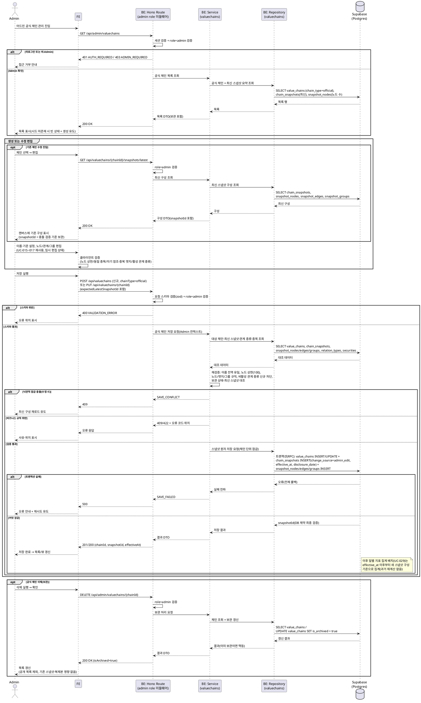

# UC-021: 공식 밸류체인 관리 (CRUD)

> 근거: `docs/userflow.md` 021, `docs/prd.md` 3장(어드민 페이지)·6장(밸류체인·시계열·이력 정책), `docs/database.md` 3.3(value_chains/chain_snapshots/snapshot_*)·§4.1, `docs/techstack.md` §4(Hono route → service → repository → Supabase)·§7(RLS 비활성, 서버측 role 검증).
> Admin이 공식 밸류체인을 생성/수정/삭제(보관)하며 노드·관계·그룹 구성을 편집한다. 노드/관계/그룹의 캔버스 편집 로직은 UC-015~017을 재사용하고, 본 문서는 **공식 체인 고유의 계약**(role 검증, 구조 변경 이벤트 기록, 보관 처리, 직렬 처리)을 정의한다. 모든 변경은 구조 변경 이벤트(저장 1회 = 스냅샷 1건)로 기록된다.

---

## 1. Primary Actor

- **Admin** (role=admin 로그인 사용자 — 어드민 라우트/API는 서버 측에서 role을 검증한다)

## 2. Precondition (사용자 관점)

- Admin 계정(role=admin)으로 로그인되어 있다.
- 어드민 페이지의 공식 밸류체인 관리 화면(`/admin/valuechains`)에 접근할 수 있다.
- (수정/삭제 시) 관리 대상 공식 체인이 존재한다. (최초 시드 생성 시에는 공식 체인이 없어도 된다.)
- (상장기업 노드 추가 시) 종목 마스터가 배치로 사전 적재되어 검색 가능하다.

## 3. Trigger

- (목록/진입) Admin이 어드민 공식 밸류체인 관리 화면에 진입한다.
- (생성) "새 공식 체인 만들기"를 실행한다.
- (수정) 기존 공식 체인을 선택해 편집 캔버스에 진입하고 저장한다.
- (삭제) 기존 공식 체인에 대해 삭제(보관) 상호작용을 실행한다.

## 4. Main Scenario

### 4-A. 공식 체인 목록 조회 (관리 진입)

1. Admin이 어드민 공식 체인 관리 화면에 진입한다.
2. BE(인증 미들웨어)가 세션을 검증하고 `profiles.role=admin`을 확인한다.
3. Service가 Repository를 통해 공식 체인 목록(보관 포함)과 각 체인의 최신 스냅샷 요약(노드 수, 최근 변경 시각)을 조회한다.
4. FE가 목록을 표시한다. 시드 미적재 상태면 빈 목록 + 생성 유도를 표시한다.

### 4-B. 공식 체인 생성

1. Admin이 "새 공식 체인 만들기"를 실행하고 이름(공식 체인은 전역 유일)과 기준(산업 중심/기업 중심, 기업 중심 시 대상 기업 선택 가능)을 입력한다.
2. FE가 빈 편집 캔버스를 초기화한다(임시 편집 상태 — 클라이언트 메모리, DB 미기록).
3. Admin이 노드 추가/삭제(UC-015), 관계 설정(UC-016), 노드 그루핑(UC-017)을 수행한다. 종목 검색·관계 종류 목록·클라이언트 검증(노드 상한 100, 동일 종목 유일, 자기 참조/중복 엣지, 활성 관계 종류만 신규 선택)은 해당 유스케이스 로직을 그대로 재사용한다.
4. Admin이 저장을 실행하면 FE가 저장 API(`POST /api/valuechains`, chainType=official)를 호출한다.
5. BE route가 요청 스키마와 role=admin을 검증하고 Service에 위임한다.
6. Service가 비즈니스 규칙을 재검증한다: 공식 체인 이름 전역 유일, 노드 상한(100), 노드/엣지/그룹 규칙(UC-015~017 계약), 비활성 관계 종류의 신규 엣지 차단.
7. Repository가 트랜잭션(원자적 RPC)으로 체인 헤더(`chain_type=official`, `owner_id=NULL`) INSERT + 스냅샷 1건(`change_source=admin_edit`, `effective_at=편집 시각`, `created_by=Admin`, 근거 공시일이 있으면 `disclosure_date` 메타데이터) INSERT + 노드/엣지/그룹 일괄 INSERT를 수행한다.
8. FE가 저장 완료 피드백을 표시하고 목록/뷰를 갱신한다. 생성된 공식 체인은 즉시 전체 공개(메인 목록 UC-007, 뷰 UC-009)된다.

### 4-C. 공식 체인 수정

1. Admin이 목록에서 체인을 선택해 편집 캔버스에 진입한다.
2. FE가 최신 스냅샷 구성 조회 API(`GET /api/valuechains/{chainId}/snapshots/latest`)로 노드/엣지/그룹을 로드해 캔버스에 표시하고, 응답의 `snapshotId`를 충돌 검증 기준으로 보관한다.
3. Admin이 UC-015~017 로직으로 구성을 편집하고, 필요 시 이름/기준도 변경한다.
4. 저장 시 FE가 `PUT /api/valuechains/{chainId}`를 편집 기준 스냅샷 ID(`expectedLatestSnapshotId`)와 함께 호출한다.
5. Service가 role·존재·비즈니스 규칙을 재검증하고, **현재 최신 스냅샷과 `expectedLatestSnapshotId`를 대조**한다(동시 편집·LLM 승인 반영과의 충돌 검증). 불일치 시 저장을 거부하고 재로드를 유도한다.
6. 검증 통과 시 체인 헤더 UPDATE(이름/기준 변경 시) + 새 스냅샷 1건 + 구성 INSERT를 원자적으로 수행한다. 저장 직렬화를 위해 트랜잭션 내에서 체인 단위 잠금을 사용해 LLM 승인 반영(UC-022)과 시각 순으로 직렬 처리한다.
7. 저장 완료 후, 이후 일별 지표 집계(UC-029 배치)는 변경 시점(`effective_at`) 이후부터 새 구성 기준으로 수행된다(과거 집계 재계산 없음).

### 4-D. 공식 체인 삭제 (보관)

1. Admin이 체인 삭제를 실행하고 확인한다.
2. FE가 `DELETE /api/admin/valuechains/{chainId}`를 호출한다.
3. Service가 role·존재를 검증한 뒤 **물리 삭제 없이** `is_archived=true`로 UPDATE한다(보관 = 비공개 전환).
4. 보관된 체인은 공개 목록(UC-007)·기업 상세의 소속 체인(UC-020)에서 제외된다. 기존 스냅샷·사용자 복제본(UC-014)에는 영향이 없다.

## 5. Edge Cases

| # | 상황 | 처리 |
|---|------|------|
| E1 | 비-Admin(비로그인/일반 User) 접근 | 서버 측 role 검증으로 거부(401/403). 클라이언트 라우팅 우회를 방지하기 위해 모든 어드민 API에서 재검증 |
| E2 | 노드 상한(100) 초과 저장 | FE 사전 차단 + 서버 재검증으로 저장 거부(422) |
| E3 | 비활성 관계 종류를 신규 엣지에 선택 시도 | 신규 선택 차단(422). 직전 스냅샷에 존재하던 동일 엣지(기존 엣지)는 유지·재저장 허용(UC-016 BR-4) |
| E4 | 동시 편집 충돌(다중 Admin 또는 편집 중 LLM 승인 반영) | `expectedLatestSnapshotId` 불일치 시 409 거부 → 최신 구성 재로드 유도. 저장 트랜잭션은 체인 단위 잠금으로 직렬화 |
| E5 | 시드 미존재 상태에서 최초 생성 | 정상 생성(빈 목록에서 생성 진입) |
| E6 | LLM 승인 반영(UC-022)과 수동 편집이 동시 발생 | 승인/편집 시각 순으로 직렬 처리해 스냅샷 이벤트 정합성 유지(E4의 잠금 + effective_at 기준) |
| E7 | 공식 체인 삭제 시도 | 물리 삭제 금지 — 보관(is_archived=true, 비공개 전환)으로 처리. 기존 복제본·스냅샷 영향 없음 |
| E8 | 이미 보관된 체인의 재보관 요청 | 멱등 처리(그대로 200 응답) |
| E9 | 공식 체인 이름 중복(전역 유일 위반) | 저장 거부(409) — DB 부분 유니크 `uq_value_chains_official_name`이 최종 방어 |
| E10 | 존재하지 않는/이미 보관된 체인의 수정 저장 | 404(미존재) / 보관 체인은 수정 전 복원 정책이 없으므로 저장 거부(409, 보관 상태 안내) |
| E11 | 요청 내 존재하지 않는 종목·관계 종류·노드/그룹 참조 | 서버 검증 실패(422) + 오류 위치 식별 정보 반환(UC-015/016/017 계약) |
| E12 | 세션 만료 상태에서 저장 | 401 거부, 재로그인 유도. 임시 편집 상태는 클라이언트 유지(자동 저장 없음 — 미저장 이탈 경고) |
| E13 | 저장 중 네트워크/DB 오류 | 트랜잭션 롤백(부분 저장 없음), 오류 안내 + 재시도 유도 |
| E14 | 편집 중 대상 종목이 상장폐지 처리됨 | 종목은 물리 삭제되지 않고 `listing_status`로 소프트 처리되므로 구성 유지 가능. 지표 커버리지는 집계 배치(UC-029) 정책을 따름 |

## 6. Business Rules

### 6.1 규칙

- **BR-1 (서버측 role 검증)**: 공식 체인의 생성/수정/삭제(보관)와 어드민 목록 조회는 모두 Hono 미들웨어에서 `profiles.role=admin`을 서버 측 검증한다. RLS는 사용하지 않는다.
- **BR-2 (구조 변경 이벤트)**: 공식 체인 저장 1회 = 스냅샷 1건(불변). `change_source=admin_edit`, 유효 시점(`effective_at`)=편집(저장) 시각, `created_by`=Admin. 근거 공시일이 있으면 `disclosure_date`를 메타데이터로 보관한다.
- **BR-3 (소유·공개 범위)**: 공식 체인은 `chain_type=official`, `owner_id=NULL`(DB CHECK `chk_value_chains_owner`)이며 전체 공개다. 보관(`is_archived=true`) 시 비공개 전환된다.
- **BR-4 (물리 삭제 금지)**: 공식 체인 삭제는 보관(비공개 전환)으로만 처리한다. 스냅샷·과거 지표·사용자 복제본은 그대로 보존된다(복제본은 독립 사본이라 원래도 영향 없음).
- **BR-5 (이름 정책)**: 공식 체인 이름은 전역 유일(부분 유니크 `uq_value_chains_official_name`). 사용자 체인 이름과는 별개 정책이다.
- **BR-6 (편집 로직 재사용)**: 노드/관계/그룹 편집 규칙은 UC-015(노드 상한 100·동일 종목 유일·자유 주체 필드), UC-016(자기 참조·중복 엣지·활성 관계 종류·방향성), UC-017(노드당 최대 1그룹·그룹 이름 필수)을 그대로 따른다. 편집은 임시 상태이며 확정은 저장 시점이다.
- **BR-7 (직렬 처리)**: 동일 공식 체인에 대한 수동 편집 저장과 LLM 승인 반영(UC-022)은 체인 단위 잠금으로 직렬화하고, 스냅샷은 승인/편집 시각 순으로 기록한다. 클라이언트에는 낙관적 잠금(`expectedLatestSnapshotId` 대조)으로 충돌을 알린다.
- **BR-8 (지표 집계 연계)**: 저장으로 구성이 변경되면 일별 지표 집계 배치(UC-029)는 변경 시점 이후부터 새 스냅샷 구성 기준으로 집계한다. 과거 집계는 재계산하지 않는다(`based_on_snapshot_id`로 기준 고정).
- **BR-9 (서버 재검증)**: 클라이언트 검증과 무관하게 서버는 저장 시 모든 규칙(role, 이름 유일, 상한, 노드/엣지/그룹 규칙, 참조 유효성)을 재검증한다(클라이언트 우회 방지). 규모 상한 등 수치는 `packages/domain/constants` 상수로 관리한다(하드코딩 금지).

### 6.2 API Specification

> 계층: Hono Route(`route.ts`, HTTP 파싱/검증 + admin 미들웨어) → Service(`service.ts`, 비즈니스 규칙) → Repository(`repository.ts`, Supabase 접근). 응답은 `success()/failure()` 공통 래퍼를 사용한다.
> 저장 엔드포인트(`POST/PUT /api/valuechains`)는 UC-016/018과 **공유 계약**이며(사용자 체인=소유자, 공식 체인=Admin), 본 문서는 공식 체인 관점의 전체 계약을 정의한다. 어드민 전용 조작(목록·보관)은 `/api/admin/*` 경로로 분리한다.

#### API-1. 공식 체인 목록 조회 (어드민) — `GET /api/admin/valuechains`

- **권한**: Admin (서버측 role 검증)
- **Query**: `includeArchived`(선택, boolean, 기본 true — 보관 체인 포함 여부)

Response `200 OK`:

```json
{
  "ok": true,
  "data": {
    "chains": [
      {
        "chainId": "uuid",
        "name": "반도체 밸류체인",
        "focusType": "industry",
        "focusSecurityId": null,
        "isArchived": false,
        "latestSnapshot": {
          "snapshotId": "uuid",
          "effectiveAt": "2026-07-05T09:00:00+09:00",
          "changeSource": "admin_edit",
          "nodeCount": 42
        },
        "createdAt": "2026-06-01T00:00:00+09:00",
        "updatedAt": "2026-07-05T09:00:00+09:00"
      }
    ]
  }
}
```

에러:

| HTTP | code | 설명 |
|---|---|---|
| 401 | `AUTH_REQUIRED` | 미로그인/세션 만료(E12) |
| 403 | `ADMIN_REQUIRED` | role≠admin(E1) |
| 500 | `ADMIN_CHAINS.LIST_FAILED` | 목록 조회 실패 |

#### API-2. 편집 대상 최신 구성 조회 — `GET /api/valuechains/{chainId}/snapshots/latest`

- UC-016 API-2 재사용. **권한**: 공식 체인은 Admin(편집 목적 진입).
- Response `200 OK`: `snapshotId`, `effectiveAt`, `nodes[]`, `edges[]`, `groups[]` (계약 상세는 UC-016 문서). 응답 `snapshotId`는 저장 시 `expectedLatestSnapshotId`로 사용한다.
- 에러: 401 `AUTH_REQUIRED` / 403 `CHAIN_FORBIDDEN` / 404 `CHAIN_NOT_FOUND`.

#### API-3. 공식 체인 생성 저장 — `POST /api/valuechains`

- **권한**: `chainType=official` 요청은 Admin만 허용.

Request Body:

```json
{
  "chainType": "official",
  "name": "반도체 밸류체인",
  "focusType": "industry",
  "focusSecurityId": null,
  "disclosureDate": "2026-07-01",
  "groups": [
    { "clientGroupId": "g1", "name": "소재" }
  ],
  "nodes": [
    {
      "clientNodeId": "n1",
      "nodeKind": "listed_company",
      "securityId": "uuid",
      "subjectName": null,
      "subjectType": null,
      "subjectMemo": null,
      "groupClientId": "g1",
      "positionX": 120.5,
      "positionY": 80
    },
    {
      "clientNodeId": "n2",
      "nodeKind": "free_subject",
      "securityId": null,
      "subjectName": "소비자",
      "subjectType": "consumer",
      "subjectMemo": null,
      "groupClientId": null,
      "positionX": 300,
      "positionY": 80
    }
  ],
  "edges": [
    { "sourceNodeKey": "n1", "targetNodeKey": "n2", "relationTypeId": "uuid" }
  ]
}
```

- `disclosureDate`: 선택 — 편집 근거 공시일 메타데이터(BR-2).
- 노드/엣지/그룹 필드 규칙은 UC-015/016/017 계약을 따른다(`clientNodeId`/`clientGroupId`는 요청 내 참조용 임시 키).

Response `201 Created`:

```json
{
  "ok": true,
  "data": {
    "chainId": "uuid",
    "snapshotId": "uuid",
    "effectiveAt": "2026-07-05T09:00:00+09:00"
  }
}
```

에러:

| HTTP | code | 설명 |
|---|---|---|
| 400 | `VALIDATION_ERROR` | 요청 스키마 위반(필수 필드 누락/타입 오류) |
| 401 | `AUTH_REQUIRED` | 미로그인/세션 만료(E12) |
| 403 | `ADMIN_REQUIRED` | 비-Admin의 공식 체인 생성 시도(E1) |
| 409 | `OFFICIAL_NAME_DUPLICATE` | 공식 체인 이름 전역 유일 위반(E9) |
| 422 | `NODE_LIMIT_EXCEEDED` | 노드 상한 100 초과(E2) |
| 422 | `DUPLICATE_SECURITY_NODE` | 동일 종목 노드 중복(UC-015) |
| 422 | `INVALID_NODE` / `SECURITY_NOT_FOUND` | 자유 주체 필수 필드 위반 / 존재하지 않는 종목(E11) |
| 422 | `EDGE_SELF_REFERENCE` / `EDGE_DUPLICATE_RELATION` / `EDGE_NODE_REF_INVALID` | 엣지 규칙 위반(UC-016 계약) |
| 422 | `RELATION_TYPE_NOT_FOUND` / `RELATION_TYPE_INACTIVE_FOR_NEW_EDGE` | 관계 종류 참조 오류 / 비활성 종류 신규 사용(E3) |
| 422 | `GROUP_REF_INVALID` / `GROUP_NAME_REQUIRED` | 그룹 참조/이름 규칙 위반(UC-017 계약) |
| 500 | `SAVE_FAILED` | 트랜잭션 실패(롤백, E13) |

- 422 응답 본문에는 위반 항목의 식별 정보(`clientNodeId`/`sourceNodeKey` 등)를 포함해 오류 위치를 표시할 수 있게 한다.

#### API-4. 공식 체인 수정 저장 — `PUT /api/valuechains/{chainId}`

- **권한**: 대상이 공식 체인이면 Admin만 허용.

Request Body: API-3과 동일 페이로드(단, `chainType` 제외)에 다음 필드를 추가한다.

```json
{
  "expectedLatestSnapshotId": "uuid",
  "name": "반도체 밸류체인",
  "focusType": "industry",
  "focusSecurityId": null,
  "disclosureDate": null,
  "groups": [],
  "nodes": [],
  "edges": []
}
```

- `expectedLatestSnapshotId`: 필수 — 편집 진입 시 로드한 최신 스냅샷 ID(낙관적 잠금, BR-7).

Response `200 OK`: API-3 Response와 동일 형태(`chainId`, `snapshotId`, `effectiveAt`).

에러: API-3의 에러 코드에 더해 —

| HTTP | code | 설명 |
|---|---|---|
| 404 | `CHAIN_NOT_FOUND` | 존재하지 않는 체인(E10) |
| 409 | `SAVE_CONFLICT` | `expectedLatestSnapshotId`가 현재 최신 스냅샷과 불일치(동시 편집/LLM 승인 반영, E4/E6) → 최신 구성 재로드 유도 |
| 409 | `CHAIN_ARCHIVED` | 보관된 체인에 대한 수정 저장(E10) |

#### API-5. 공식 체인 삭제(보관) — `DELETE /api/admin/valuechains/{chainId}`

- **권한**: Admin.
- **Request**: 경로 파라미터 `chainId`만.

Response `200 OK` (이미 보관 상태여도 멱등, E8):

```json
{
  "ok": true,
  "data": { "chainId": "uuid", "isArchived": true }
}
```

에러:

| HTTP | code | 설명 |
|---|---|---|
| 401 | `AUTH_REQUIRED` | 미로그인/세션 만료 |
| 403 | `ADMIN_REQUIRED` | role≠admin(E1) |
| 404 | `CHAIN_NOT_FOUND` | 존재하지 않는 체인 |
| 500 | `ARCHIVE_FAILED` | 갱신 실패 |

#### 참조 API (본 유스케이스에서 재사용)

- `GET /api/relation-types` — 관계 종류 목록(UC-016 API-1).
- `GET /api/securities/search` — 상장기업 노드 추가용 종목 검색(UC-008/015).

### 6.3 Database Operations

| 테이블 | 작업 | 목적 |
|---|---|---|
| `profiles` | SELECT | 인증 미들웨어에서 사용자 식별·`role=admin` 검증(BR-1) |
| `value_chains` | SELECT | 어드민 목록(`chain_type='official'`, 보관 포함), 대상 체인 존재·유형·보관 상태 확인, 공식 이름 유일 검증 |
| `value_chains` | INSERT | 생성 저장: `chain_type='official'`, `owner_id=NULL`, `name`, `focus_type`, `focus_security_id` |
| `value_chains` | UPDATE | 수정 저장 시 헤더(이름/기준) 갱신, 삭제 시 `is_archived=true`(보관, BR-4) |
| `chain_snapshots` | SELECT | 최신 스냅샷 조회(편집 진입 로드, `expectedLatestSnapshotId` 충돌 대조, 비활성 관계 종류 기존 엣지 판별) |
| `chain_snapshots` | INSERT | 저장 1회 = 스냅샷 1건: `change_source='admin_edit'`, `effective_at`, `disclosure_date`(메타), `created_by` |
| `snapshot_nodes` | SELECT / INSERT | 직전 구성 대조 / 새 스냅샷 노드 일괄 저장(`uq(snapshot_id, security_id)`·`chk(node_kind)`·security FK RESTRICT) |
| `snapshot_edges` | SELECT / INSERT | 직전 엣지 대조(BR-6) / 새 스냅샷 엣지 일괄 저장(자기 참조 CHECK·쌍+종류 유니크·복합 FK) |
| `snapshot_groups` | SELECT / INSERT | 직전 그룹 대조 / 새 스냅샷 그룹 저장(복합 FK로 동일 스냅샷 정합) |
| `relation_types` | SELECT | 활성 여부 재검증(비활성 종류 신규 엣지 차단, E3) |
| `securities` | SELECT | 노드 검색·요청 `securityId` 존재 검증 |

- **DELETE 없음**: 공식 체인·스냅샷은 물리 삭제하지 않는다(보관은 `value_chains` UPDATE). 스냅샷 테이블은 불변이며, 구성 변경은 새 스냅샷의 포함 여부로 표현된다(이벤트 소싱).
- 체인 헤더 INSERT/UPDATE + 스냅샷/노드/엣지/그룹 INSERT는 **하나의 원자적 단위(Postgres 함수/RPC)** 로 수행하고, 트랜잭션 내 체인 행 잠금으로 UC-022 승인 반영과 직렬화한다(BR-7). 실패 시 전체 롤백(E13).

### 6.4 External Service Integration

- **없음.** 본 기능은 자체 DB(체인/스냅샷/종목 마스터/관계 종류 마스터)만 사용한다. 외부 API(OpenDART/SEC EDGAR/토스증권)는 배치 적재 전용이며(PRD 8장), 공식 체인 편집 화면의 종목 검색도 배치가 사전 적재한 `securities`만 조회한다.

## 7. Sequence Diagram



## 8. 관련 유스케이스

- **UC-015 노드 추가/삭제 · UC-016 관계 설정/편집/삭제 · UC-017 노드 그루핑**: 공식 체인 편집 캔버스에서 동일 로직 재사용(임시 편집 상태 → 저장 시 스냅샷 확정).
- **UC-018 밸류체인 저장**: 저장 엔드포인트 공유 계약(사용자 체인=`change_source=user_save`, 공식 체인=`admin_edit`).
- **UC-022 LLM 관계 변경안 검토**: 승인 1건 = 1스냅샷(`change_source=llm_approval`). 본 유스케이스의 수동 편집과 체인 단위로 직렬 처리(E4/E6).
- **UC-024 관계 종류 마스터 관리**: 활성/비활성 상태가 신규 엣지 선택 가능 여부를 결정(E3).
- **UC-007 메인/탐색 · UC-009 밸류체인 뷰 · UC-012 타임라인**: 공식 체인 공개 노출·스냅샷 복원의 소비자. 보관 시 공개 목록에서 제외.
- **UC-014 공식 체인 복제**: 복제본은 독립 사본이므로 본 유스케이스의 수정/보관에 영향받지 않음.
- **UC-029 일별 체인 지표 사전 집계 배치**: 구조 변경 시점 이후부터 새 구성 기준 집계(BR-8).
