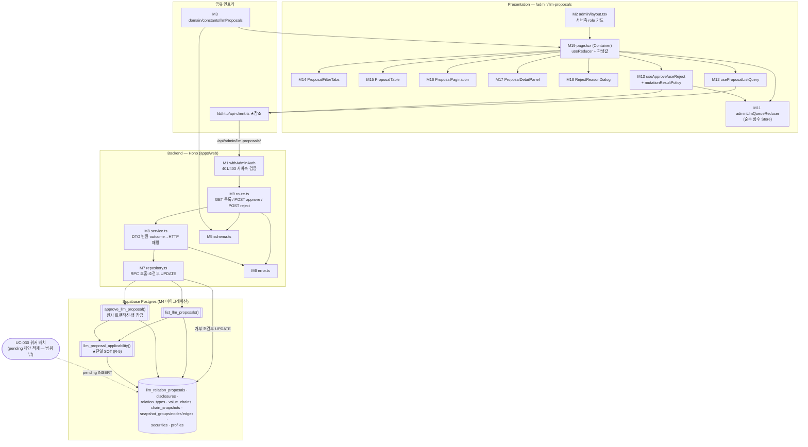

# Plan: UC-022 LLM 관계 변경안 검토 (승인/거부)

> 근거: `docs/usecases/022/spec.md`, `docs/usecases/000_decisions.md`(F-1, D-6·D-7 재매핑 규칙 공유), `docs/techstack.md` §4(모노레포 Codebase Structure)·§7(복잡 트랜잭션은 Postgres 함수/RPC), `docs/database.md` §1.3·§3.3·§3.8·§4.1·§5·§7-4, `supabase/migrations/0005_value_chains.sql`·`0006_chain_snapshots.sql`·`0011_disclosures_llm.sql`(기존 스키마), `docs/pages/admin-llm-queue/state_management.md`(페이지 상태 설계의 단일 원천 — 본 plan은 그 설계를 그대로 따른다), `.claude/skills/spec_to_plan/references/hono-backend-guide.md`(Hono 백엔드 컨벤션).
>
> **범위**: ① 검토 큐 목록/승인/거부 API(`features/admin-llm-proposals/backend/*`), ② 승인 원자 트랜잭션 RPC + 적용 가능성(applicability) SQL 헬퍼 마이그레이션, ③ `/admin/llm-proposals` 페이지 FE(state_management.md 준수), ④ 공통 Admin 인증 가드(최초 정의 — UC-021/023/024 재사용).
> **범위 밖**: 제안 큐 적재(UC-030 워커 — LLM 어댑터 포함), 공식 체인 수동 편집 저장 RPC(UC-021), 타임라인 마커 소비(UC-012), 지표 집계 반영(UC-029), 관계 종류 마스터 CRUD(UC-024).
> **외부 서비스 연동 없음**(spec §6.4) — 본 유스케이스의 요청 경로는 자체 DB(`llm_relation_proposals` 큐)만 소비한다. LLM 호출은 UC-030 워커 어댑터 전용이므로 외부 클라이언트 모듈·재시도/타임아웃 설계 대상이 없다.

---

## 사전 정합화 결정 (spec Open Question·모호점 해소 — 구현 시 이 표를 따름)

| # | 사안 | 결정 | 근거 |
|---|---|---|---|
| R-1 | `relation_update`의 대상 엣지 식별 (제안에는 관계 종류 컬럼이 1개뿐) | 재매핑된 (source, target) 쌍의 최신 구성 엣지 중 **정확히 1건**이 존재할 때 그 엣지의 관계 종류를 제안 종류로 변경한다. 매칭 범위: 동일 방향 쌍 + 무향 종류 엣지는 역방향 포함(D-6). 0건 → `EDGE_NOT_FOUND`(무효), 2건 이상(병존으로 대상 모호) → `EDGE_NOT_FOUND`(무효), (쌍, 제안 종류) 엣지가 이미 존재(무변경/유니크 충돌) → `EDGE_ALREADY_EXISTS`(무효) | BR-8(동일 쌍·동일 종류 유일), F-1(병존 허용이 낳는 모호성은 자동 반영 불가 → 재검토), `snapshot_edges` 유니크 제약 |
| R-2 | 거부 사유(reason) 영속화 방식 (spec Open Question) | **MVP: 영속화하지 않는다** — API 계약은 spec대로 `reason`(선택, 최대 길이 상수)을 수용하되 서버 로그로만 기록. `llm_relation_proposals`에 컬럼을 추가하지 않는다(database.md §3.8 SOT 유지, techstack 원칙 4 "지금 필요한 것만"). 운영상 필요 확정 시 2단계에서 컬럼 추가 | spec §6.2-(3), database.md §3.8 |
| R-3 | 보관(archived) 체인 대상 pending 제안의 일괄 무효 전환 (spec E10 Open Question) | **일괄 전환 없음** — 제안은 `pending` 유지, 승인 시도만 `422 CHAIN_NOT_APPLICABLE`로 차단(체인 복원 시 그대로 재검토 가능). 목록에는 `CHAIN_NOT_APPLICABLE` 재검토 배지로 표시 | spec E10의 보수적 해석(파괴적 일괄 갱신 회피) |
| R-4 | `relation_delete`인데 `relation_type_id`가 NULL인 데이터(F-1 위반 유입) 방어 | 정상 경로에서는 발생 불가(F-1: UC-030 앱 검증으로 필수 지정). 방어적으로 목록 applicability는 `EDGE_NOT_FOUND`(재검토) 표시, 승인 시도 시 `409 PROPOSAL_CONFLICT` + `invalidated` 전환 | 000_decisions F-1, spec E8과 동일한 방어 패턴 |
| R-5 | applicability 계산의 이중 구현 방지 | 최신 구성 대조(재매핑·엣지 존재/중복·활성·체인 적격) 로직은 **SQL 헬퍼 함수 1개**(`llm_proposal_applicability`)로만 구현하고, 목록 조회 RPC와 승인 RPC가 **공용**한다. TS 재구현 금지(조회 시점 표시값과 승인 시점 판정의 규칙 드리프트 차단) | spec 4-A-5(표시용)·4-B-9(판정용) 동일 규칙, DRY |
| R-6 | 비-pending 항목의 applicability | 계산 생략 — `isApplicable=true, reason=null` 고정 반환. FE는 `status='pending'` 행에서만 적용 가능/재검토 배지를 렌더한다(처리 완료 항목의 최신 구성 대조는 무의미) | state_management.md §2-2(배지는 서버 계산값), 불필요 연산 제거 |
| R-7 | 마이그레이션 파일 번호 | 다른 plan들(UC-008/012/014/015)이 `0013_*`을 경합 선점 중 — 본 plan은 파일명 `NNNN_llm_proposal_review_fns.sql`의 **NNNN을 구현 시점의 다음 빈 번호로 부여**한다(내용만 고정) | techstack §7(마이그레이션 SOT), plan 간 충돌 방지 |
| R-8 | 동일 체인 스냅샷 생성 직렬화(E6/BR-4)의 잠금 계약 | 승인 RPC는 스냅샷 생성 전 `value_chains` 대상 행을 `SELECT … FOR UPDATE`로 잠근다. **UC-021 공식 체인 저장 RPC도 동일 행 잠금을 선행해야 한다**(공유 계약 — 타 UC 경계 표에 명시). 잠금 순서는 "제안 행 → 체인 행" 고정(교착 방지) | spec E6·BR-4, Postgres 행 잠금 직렬화 |
| R-9 | 승인 RPC의 오류 표현 방식 | 무효 전환(E1~E3)은 **커밋되어야 하므로** RPC는 예외(RAISE)를 던지지 않고 `outcome` 코드를 반환한다(예외는 전체 롤백을 유발 — `invalidated` 기록 유실). 예측된 전 분기(`approved`/`not_found`/`already_processed`/`chain_not_applicable`/`relation_type_inactive`/`conflict_invalidated`)는 outcome으로, 예기치 못한 DB 오류만 예외 전파 → Service가 500 매핑(E14) | spec 4-B-9·E1~E3(무효 후 커밋) vs E14(전체 롤백)의 양립 조건 |

---

## 개요

| # | 모듈 | 위치 | 설명 |
| --- | --- | --- | --- |
| **공통(shared) — 본 plan 최초 정의, UC-021/023/024 재사용** | | | |
| M1 | Admin 인증 미들웨어 | `apps/web/src/backend/middleware/admin.ts` | `withAdminAuth()` — 요청 쿠키 세션 → 사용자 식별(401 `UNAUTHORIZED`) → `profiles.role='admin'` 검증(403 `ADMIN_ONLY`) → `adminUser` 컨텍스트 주입. `/admin/*` API 전용 체인 |
| M2 | 어드민 레이아웃 가드 | `apps/web/src/app/admin/layout.tsx` | 서버 컴포넌트 — 세션·role 서버측 확인 후 비-Admin은 리다이렉트(E12의 화면 진입 차단). 어드민 공통 내비게이션 포함 |
| M3 | 도메인 상수 | `packages/domain/constants/llmProposals.ts` | `ADMIN_LLM_PROPOSALS_PAGE_SIZE=20`, `REJECT_REASON_MAX_LENGTH=500`, 제안 유형/상태/적용불가 사유 리터럴 상수. FE/BE 공용 |
| **DB — Persistence (마이그레이션 SOT)** | | | |
| M4 | 검토 큐 SQL 함수 마이그레이션 | `supabase/migrations/NNNN_llm_proposal_review_fns.sql` (R-7) | ① `llm_proposal_applicability()` 헬퍼(재매핑·대조 — R-5 단일 SOT), ② `list_llm_proposals()` 목록 조회 함수, ③ `approve_llm_proposal()` 승인 원자 트랜잭션 함수 |
| **백엔드 — `features/admin-llm-proposals/backend` (본 UC 소유)** | | | |
| M5 | Zod 스키마 | `apps/web/src/features/admin-llm-proposals/backend/schema.ts` | Query/Body/RPC Row/Response 스키마 분리 정의 |
| M6 | 에러 코드 | `apps/web/src/features/admin-llm-proposals/backend/error.ts` | `ADMIN_LLM.*` 코드(spec §6.2 그대로) |
| M7 | 리포지토리 | `apps/web/src/features/admin-llm-proposals/backend/repository.ts` | `list_llm_proposals`/`approve_llm_proposal` RPC 호출 + 거부 조건부 UPDATE 캡슐화(Persistence) |
| M8 | 서비스 | `apps/web/src/features/admin-llm-proposals/backend/service.ts` | 목록 DTO 변환·hasMore 판정, 승인 outcome→HTTP 매핑, 거부 갱신 0건 분기(404/409) |
| M9 | 라우트 | `apps/web/src/features/admin-llm-proposals/backend/route.ts` | `GET /admin/llm-proposals`, `POST /admin/llm-proposals/:proposalId/approve`, `POST .../reject` — HTTP 파싱/검증만 |
| M10 | Hono 앱 등록 | `apps/web/src/backend/hono/app.ts` (수정) | `registerAdminLlmProposalRoutes(app)` 1줄 추가(M1 미들웨어를 해당 라우트 그룹에 적용) |
| **프론트엔드 — `/admin/llm-proposals` (state_management.md 준수)** | | | |
| M11 | 페이지 리듀서 | `apps/web/src/features/admin-llm-proposals/hooks/adminLlmQueueReducer.ts` | `AdminLlmQueueState`/`AdminLlmQueueAction`/`adminLlmQueueReducer` — state 문서 §3-1·§3-2 그대로(순수 함수) |
| M12 | 목록 쿼리 훅 | `apps/web/src/features/admin-llm-proposals/hooks/useProposalListQuery.ts` | 쿼리 키 `['admin','llm-proposals',{status,page}]` — TanStack Query |
| M13 | 승인/거부 뮤테이션 훅 | `apps/web/src/features/admin-llm-proposals/hooks/useApproveProposal.ts`, `useRejectProposal.ts` (+ `mutationResultPolicy.ts` 순수 매핑) | mutation + 결과별 dispatch/invalidate/토스트 정책(state 문서 §3-3 표)의 순수 매핑 함수 |
| M14 | 필터 탭 | `apps/web/src/features/admin-llm-proposals/components/ProposalFilterTabs.tsx` | 상태 필터(pending/approved/rejected/invalidated) Presenter |
| M15 | 제안 목록 테이블 | `apps/web/src/features/admin-llm-proposals/components/ProposalTable.tsx` | 목록 행(유형·노드 쌍·관계 종류·근거 공시·배지·승인/거부 버튼) Presenter |
| M16 | 페이지네이션 | `apps/web/src/features/admin-llm-proposals/components/ProposalPagination.tsx` | `page`/`hasMore` 기반 이동 Presenter |
| M17 | 상세 패널 | `apps/web/src/features/admin-llm-proposals/components/ProposalDetailPanel.tsx` | 근거 공시(제목·일자·원문 새 탭 링크)·rationale·대조 결과 상세 Presenter |
| M18 | 거부 사유 다이얼로그 | `apps/web/src/features/admin-llm-proposals/components/RejectReasonDialog.tsx` | 사유 입력(선택)·확정/취소 Presenter |
| M19 | 페이지 컨테이너 | `apps/web/src/app/admin/llm-proposals/page.tsx` | `'use client'` Container — `useReducer`+쿼리/뮤테이션 소유, 파생값 계산, Presenter 배선(state 문서 §3-4) |
| M20 | UI 문구 상수 | `apps/web/src/features/admin-llm-proposals/constants.ts` | 토스트/배지/빈 상태/차단 사유 문구 상수(하드코딩 금지) |
| **공통 인프라 — 위치만 참조(선행 plan 정의, 본 UC 신규 정의 없음)** | | | |
| — | Hono 골격·미들웨어 체인 | `apps/web/src/backend/{hono,http,middleware}/*` | `errorBoundary → withAppContext → withSupabase` — UC-001 plan 정의 |
| — | FE API 클라이언트 | `apps/web/src/lib/http/api-client.ts` | `HandlerResult` 언랩·`ApiError` — UC-001 plan 정의 |
| — | DB 생성 타입 | `packages/domain/types/database.ts` | M4 적용 후 `generate_typescript_types` 재생성(techstack §7) |

- **워커(apps/worker) 변경 없음** — 큐 적재는 UC-030 소관. LLM 배치 지연 시에도 본 기능은 빈 큐 = 빈 상태 안내로 정상 동작(spec §6.4).
- **기존 테이블 스키마 변경 없음** — `llm_relation_proposals`(0011)·스냅샷 4종(0006)·`value_chains`(0005)의 CHECK/유니크/복합 FK/부분 유니크가 이미 최종 방어선(BR-8·BR-12). M4는 함수만 추가한다.

## Diagram



데이터 흐름: Presenter(M14~M18) → Container(M19)의 dispatch/mutation → API 클라이언트 → Admin 미들웨어(M1) → Route(M9) → Service(M8) → Repository(M7) → SQL 함수/테이블(M4). 적용 가능성 판정은 목록·승인 모두 `llm_proposal_applicability()` 하나로 수렴한다(R-5).

---

## Implementation Plan

### M3. 도메인 상수 — `packages/domain/constants/llmProposals.ts` (공유)

- 구현 내용:
  1. `ADMIN_LLM_PROPOSALS_PAGE_SIZE = 20`(spec §6.2-(1) "페이지당 건수는 상수"), `REJECT_REASON_MAX_LENGTH = 500`(R-2 — 계약 검증용).
  2. 리터럴 상수(DB enum과 동일 값, `as const`): `LLM_PROPOSAL_TYPES = ['relation_add','relation_update','relation_delete']`, `LLM_PROPOSAL_STATUSES = ['pending','approved','rejected','invalidated']`, `APPLICABILITY_REASONS = ['NODE_NOT_FOUND','EDGE_NOT_FOUND','EDGE_ALREADY_EXISTS','RELATION_TYPE_INACTIVE','CHAIN_NOT_APPLICABLE']`.
  3. 프레임워크 의존 없는 순수 상수만(techstack §4 `packages/domain` 원칙). FE 배지/BE Zod가 공용 import(DRY).
- 의존성: 없음(최우선 구현).
- **Unit Tests**:
  - [ ] 상태/유형 리터럴이 `docs/database.md` §3.10 enum 값과 정확히 일치한다(스냅샷 비교)
  - [ ] `ADMIN_LLM_PROPOSALS_PAGE_SIZE`가 1 이상 정수다

### M4. 검토 큐 SQL 함수 마이그레이션 — `supabase/migrations/NNNN_llm_proposal_review_fns.sql` (Persistence, R-7)

- 구현 내용 (`CREATE OR REPLACE FUNCTION`, `SECURITY INVOKER`, `SET search_path = ''` — 저장소 SQL 가이드라인 준수. 적용은 `mcp__supabase__apply_migration`, 로컬 Supabase 금지):
  1. **`llm_proposal_applicability(p_proposal_id uuid)`** — 적용 가능성 판정 헬퍼(R-5 단일 SOT). 반환: `(is_applicable boolean, reason text, latest_snapshot_id uuid, remapped_source_node_id uuid, remapped_target_node_id uuid, target_edge_id uuid)`.
     판정 순서(spec 4-B-9의 2→3→4→5와 동일 — 목록 표시 우선순위도 이 순서):
     - 체인 적격: `value_chains.chain_type='official' AND is_archived=false` 아니면 → `CHAIN_NOT_APPLICABLE`(E9/E10)
     - 최신 스냅샷: `chain_snapshots ORDER BY effective_at DESC, created_at DESC LIMIT 1`(`idx(chain_id, effective_at DESC)`, tie-break 결정성)
     - **노드 재매핑**(BR-6): `based_on_snapshot`의 source/target 노드를 최신 스냅샷 노드로 매핑 — `listed_company`는 `security_id` 일치, `free_subject`는 `(subject_name, subject_type)` 일치(D-7). 어느 한쪽 실패 → `NODE_NOT_FOUND`(E1)
     - 관계 종류 활성(BR-7, `relation_add`/`relation_update`만): `relation_types.is_active=false` → `RELATION_TYPE_INACTIVE`(E4)
     - 변경 적용 가능성(BR-8):
       - `relation_add`: 재매핑 쌍 + 동일 종류 엣지 존재(무향 종류는 역방향 포함 — D-6) → `EDGE_ALREADY_EXISTS`(E3/E7). 자기 참조(재매핑 후 동일 노드) → `NODE_NOT_FOUND` 처리(방어 — 0011 CHECK가 1차 차단)
       - `relation_update`: R-1 규칙 — 쌍의 엣지 정확히 1건이면 `target_edge_id` 반환, 0건/복수 → `EDGE_NOT_FOUND`, (쌍, 제안 종류) 기존재 → `EDGE_ALREADY_EXISTS`
       - `relation_delete`: 쌍 + 제안 종류 일치 엣지(무향 역방향 포함) 존재 시 `target_edge_id`, 없으면(또는 종류 NULL — R-4) `EDGE_NOT_FOUND`(E2)
  2. **`list_llm_proposals(p_status llm_proposal_status, p_limit int, p_offset int)`** — 목록 조회 함수(techstack §7: 복잡 조인은 RPC화). `llm_relation_proposals`에 `disclosures`(제목/일자/URL/출처), `relation_types`(이름·활성), `value_chains`(이름), `based_on_snapshot` 기준 source/target `snapshot_nodes`(+`securities` 종목명/티커) 조인, `status='pending'`이면 LATERAL로 `llm_proposal_applicability()` 결합(비-pending은 `true/NULL` 고정 — R-6). 정렬 `created_at ASC, id ASC`(`idx(status, created_at)` 활용, 오래된 제안 우선 검토). flat snake_case 행 반환.
  3. **`approve_llm_proposal(p_proposal_id uuid, p_reviewer_id uuid)`** — 승인 원자 트랜잭션(spec 4-B-9). 반환: `(outcome text, conflict_reason text, resulting_snapshot_id uuid, effective_at timestamptz)`. 예외를 던지지 않고 outcome 코드로 반환(R-9):
     1. `SELECT … FROM llm_relation_proposals WHERE id=p_proposal_id FOR UPDATE` — 0행 → `outcome='not_found'`(E15); `status<>'pending'` → `'already_processed'`(BR-5·E5/E11, 상태 무변경 멱등)
     2. `SELECT … FROM value_chains WHERE id=chain_id FOR UPDATE` — **체인 행 잠금으로 동일 체인 스냅샷 생성 직렬화**(R-8·BR-4·E6)
     3. `llm_proposal_applicability()` 호출(잠금 하에서 최신 구성 확정) 후 분기:
        - `CHAIN_NOT_APPLICABLE` → `'chain_not_applicable'` (쓰기 없음, pending 유지 — E9/E10)
        - `RELATION_TYPE_INACTIVE` → `'relation_type_inactive'` (쓰기 없음, pending 유지 — E4)
        - `NODE_NOT_FOUND`/`EDGE_NOT_FOUND`/`EDGE_ALREADY_EXISTS` → 제안 `UPDATE status='invalidated', reviewed_by=p_reviewer_id, reviewed_at=now()` 후 `'conflict_invalidated'` + `conflict_reason` 반환(E1/E2/E3 — 함수 정상 종료로 **커밋됨**)
     4. 전부 통과 시 **새 스냅샷 생성(BR-3, 승인 1건=1스냅샷)**:
        - `chain_snapshots` INSERT: `change_source='llm_approval'`, `effective_at=now()`, `disclosure_date=근거 공시일`, `created_by=p_reviewer_id`
        - 최신 스냅샷의 `snapshot_groups` 복사(구ID→신ID 매핑) → `snapshot_nodes` 복사(그룹 매핑·좌표·정체성 필드 보존, 구노드ID→신노드ID 매핑) → `snapshot_edges` 복사 + 제안 반영: add=신규 엣지 1건 추가(재매핑 신노드 ID), update=`target_edge_id` 행만 관계 종류 교체, delete=`target_edge_id` 행 제외. 복합 FK·유니크·CHECK가 이중 방어(BR-8)
        - 제안 `UPDATE status='approved', reviewed_by, reviewed_at=now(), resulting_snapshot_id=신규 스냅샷` → `outcome='approved'`
     5. 예기치 못한 오류(유니크 충돌 등)는 예외 전파 → 전체 롤백(E14 — 스냅샷·제안 모두 원복)
  4. 적용 후 `mcp__supabase__generate_typescript_types`로 `packages/domain/types/database.ts` 재생성(techstack §7).
- 의존성: 마이그레이션 0004~0006·0011(기존 적용분). 신규 테이블/컬럼 없음.
- **검증 시나리오 (마이그레이션 QA — SQL 레벨, 시드 데이터로 실행)**:
  - [ ] add 승인: 새 스냅샷 1건 + 그룹/노드/엣지 완전 복사 + 신규 엣지 1건, 제안 `approved`·`resulting_snapshot_id` 연결, `effective_at`=승인 시각·`disclosure_date`=공시일
  - [ ] update 승인: 대상 엣지만 관계 종류 교체, 나머지 구성 불변
  - [ ] delete 승인: 대상 엣지만 제외 복사
  - [ ] 좌표(`position_x/y`)·그룹 소속·자유 주체 필드가 복사본에 보존된다
  - [ ] 참조 노드가 최신 구성에 없음(수동 편집으로 삭제) → `conflict_invalidated`+`NODE_NOT_FOUND`, 제안 `invalidated`가 **커밋**된다(E1)
  - [ ] 자유 주체 재매핑: 이름+유형 동일 → 성공 / 이름 동일·유형 상이 → `NODE_NOT_FOUND`(D-7)
  - [ ] add인데 동일 쌍·동일 종류 엣지 기존재(무향 역방향 포함) → `EDGE_ALREADY_EXISTS` 무효(E3·D-6)
  - [ ] update 대상 쌍 엣지 0건/2건 → `EDGE_NOT_FOUND` 무효(R-1)
  - [ ] 비활성 관계 종류 add 승인 → `relation_type_inactive`, 제안 `pending` 유지·쓰기 없음(E4)
  - [ ] 보관 체인 → `chain_not_applicable`, `pending` 유지(E10) / user 체인(방어) → 동일(E9)
  - [ ] 동일 제안 동시 승인 2트랜잭션 → 선착 `approved`, 후행 `already_processed`(행 잠금 — E5)
  - [ ] 이미 `approved`/`rejected` 제안 재승인 → `already_processed`, 상태 무변경(E11)
  - [ ] 미존재 proposalId → `not_found`
  - [ ] 스냅샷 INSERT 강제 실패(제약 위반 유도) → 예외 → 제안 상태 원복(전체 롤백, E14)
  - [ ] `list_llm_proposals('pending',21,0)`: 조인 필드(공시 제목/URL·종목명/티커·관계 종류 이름/활성·체인 이름) 정확, applicability가 승인 함수 판정과 동일 사유를 반환(R-5 교차 확인)

### M1. Admin 인증 미들웨어 — `apps/web/src/backend/middleware/admin.ts` (공유, 최초 정의)

- 구현 내용:
  1. `withAdminAuth()` Hono 미들웨어 — `/admin/*` API 라우트 그룹에 적용(BR-10, RLS 비활성 정책 하에서 인가의 유일한 관문):
     - 요청 쿠키 세션에서 사용자 해석(`@supabase/ssr` 요청 스코프 클라이언트, UC-001 plan의 팩토리 재사용) — 실패/부재 → `respond(failure(401, 'UNAUTHORIZED'))`
     - service-role 클라이언트로 `profiles.role` 조회 — `role<>'admin'` → `respond(failure(403, 'ADMIN_ONLY'))`
     - 통과 시 `c.set('adminUser', { id, email })` 주입(라우트가 `reviewed_by`로 사용)
  2. 에러 코드 `UNAUTHORIZED`/`ADMIN_ONLY`는 이 파일에서 export(spec §6.2 공통 에러 — UC-021/023/024 어드민 API가 동일 상수 재사용).
  3. 클라이언트 헤더/바디의 role 정보는 일절 신뢰하지 않는다(E12 — 우회 방지).
- 의존성: 공통 미들웨어 체인·Supabase 클라이언트 팩토리(UC-001 plan, 참조).
- **Unit Tests** (Supabase mock):
  - [ ] 세션 없음 → 401 `UNAUTHORIZED`, 후속 핸들러 미실행
  - [ ] 세션 유효 + `role='user'` → 403 `ADMIN_ONLY`
  - [ ] `role='admin'` → next() 진행 + `adminUser.id` 주입
  - [ ] profiles 조회 실패(DB 오류) → 500(관대한 통과 금지 — fail-closed)

### M5. Zod 스키마 — `features/admin-llm-proposals/backend/schema.ts`

- 구현 내용:
  1. `ProposalListQuerySchema`: `{ status: z.enum(LLM_PROPOSAL_STATUSES).default('pending'), page: z.coerce.number().int().min(1).default(1) }` — 위반 시 400 `INVALID_REQUEST`(E15).
  2. `ProposalIdParamSchema`: `z.string().uuid()`.
  3. `ProposalRejectRequestSchema`: `{ reason: z.string().max(REJECT_REASON_MAX_LENGTH).optional() }`(R-2 — 빈 body/빈 객체 허용).
  4. `ProposalListRpcRowSchema`(snake_case flat — M4 ②의 반환 행과 1:1): `proposal_id`, `chain_id`, `chain_name`, `proposal_type`, `status`, `source_node_id`/`source_display_name`/`source_node_kind`/`source_ticker(nullable)`, `target_*` 동형, `relation_type_id/name/is_active`(전부 nullable — delete 방어 R-4), `disclosure_id/title/date/url/source`, `rationale`, `based_on_snapshot_id`, `created_at`, `reviewed_by(nullable)`, `reviewed_at(nullable)`, `resulting_snapshot_id(nullable)`, `is_applicable`, `applicability_reason(nullable)`.
  5. `ApproveRpcRowSchema`: `{ outcome, conflict_reason(nullable), resulting_snapshot_id(nullable), effective_at(nullable) }`.
  6. Response 스키마(camelCase — spec §6.2 계약 그대로): `ProposalListResponseSchema`(items 중첩 구조 + `page`/`pageSize`/`hasMore`), `ProposalApproveResponseSchema`, `ProposalRejectResponseSchema`. 각 `z.infer` export(FE 훅이 타입 재사용).
- 의존성: M3.
- **Unit Tests**:
  - [ ] status 미지정 → `'pending'`, page 미지정 → `1` 기본값 적용
  - [ ] `status=banana`/`page=0`/`page=abc` → 파싱 실패(400 경로)
  - [ ] `reason` 501자 → 실패 / 미지정·빈 문자열 → 통과
  - [ ] RPC Row 스키마: delete 제안의 `relation_type_*` NULL 행 통과(R-4)

### M6. 에러 코드 — `features/admin-llm-proposals/backend/error.ts`

- 구현 내용: spec §6.2 Error Codes 그대로(`as const`):
  ```
  invalidRequest:          'ADMIN_LLM.INVALID_REQUEST'            // 400
  proposalsFetchError:     'ADMIN_LLM.PROPOSALS_FETCH_ERROR'      // 500
  proposalNotFound:        'ADMIN_LLM.PROPOSAL_NOT_FOUND'         // 404
  proposalAlreadyProcessed:'ADMIN_LLM.PROPOSAL_ALREADY_PROCESSED' // 409
  proposalConflict:        'ADMIN_LLM.PROPOSAL_CONFLICT'          // 409 (invalidated 전환 수반)
  relationTypeInactive:    'ADMIN_LLM.RELATION_TYPE_INACTIVE'     // 422
  chainNotApplicable:      'ADMIN_LLM.CHAIN_NOT_APPLICABLE'       // 422
  approvalFailed:          'ADMIN_LLM.APPROVAL_FAILED'            // 500
  rejectionFailed:         'ADMIN_LLM.REJECTION_FAILED'           // 500
  ```
  `AdminLlmProposalServiceError` 타입 export. 401/403은 M1 공통 코드 소관.
- 의존성: 없음. Unit Tests: N/A(상수 정의).

### M7. 리포지토리 — `features/admin-llm-proposals/backend/repository.ts`

- 구현 내용 (Supabase 문법은 이 파일에만 존재, 예외 대신 결과 객체 반환 — techstack §4):
  1. `listProposalRows(client, { status, limit, offset })` → `client.rpc('list_llm_proposals', { p_status, p_limit, p_offset })`. **`limit = pageSize + 1`로 호출**해 hasMore 판정 입력을 제공(총건수 COUNT 불필요 — 최소 스펙).
  2. `approveProposalRpc(client, { proposalId, reviewerId })` → `client.rpc('approve_llm_proposal', { p_proposal_id, p_reviewer_id })` 단일 행 반환.
  3. `rejectProposalPending(client, { proposalId, reviewerId })` → `llm_relation_proposals` 조건부 UPDATE(BR-5·BR-9 — 단순 갱신이라 RPC 불필요): `.update({ status:'rejected', reviewed_by, reviewed_at: now })
     .eq('id', proposalId).eq('status','pending').select('id, reviewed_at')` — `{ updated: row | null }` 반환(0행이면 null).
  4. `findProposalStatus(client, proposalId)` → `id, status` 단건 조회(거부 0행 시 404/409 분기용).
- 의존성: M4(함수 존재), M5(Row 타입).
- **Unit Tests** (Supabase client mock):
  - [ ] `listProposalRows`가 `p_status/p_limit/p_offset` 파라미터로 정확히 rpc 호출
  - [ ] `rejectProposalPending`의 UPDATE에 `eq('status','pending')` 조건이 반드시 포함(이중 처리 방지의 핵심)
  - [ ] 갱신 0행 → `{ updated: null }`(throw 없음)
  - [ ] rpc error 응답 → error 결과 그대로 전파(throw 없음)

### M8. 서비스 — `features/admin-llm-proposals/backend/service.ts`

- 구현 내용 (repository 인터페이스에만 의존 — deps 주입으로 테스트 가능):
  1. **`listProposals(deps, query): HandlerResult<ProposalListResponse>`** — `pageSize=ADMIN_LLM_PROPOSALS_PAGE_SIZE`, `offset=(page-1)*pageSize`, `limit=pageSize+1` 조회 → 오류 시 `failure(500, PROPOSALS_FETCH_ERROR)` → Row 배열 Zod 검증(위반 → 동일 500) → `hasMore = rows.length > pageSize`, 초과 1행 절단 → flat Row를 spec 응답 중첩 DTO(`sourceNode`/`targetNode`/`relationType`/`disclosure`/`applicability`)로 변환(`relation_type_id` NULL이면 `relationType: null`) → 응답 스키마 검증 후 `success`. 빈 목록도 200(E13).
  2. **`approveProposal(deps, { proposalId, reviewerId }): HandlerResult<ProposalApproveResponse>`** — RPC 호출 후 outcome 매핑(R-9):
     | outcome | HTTP 결과 |
     |---|---|
     | `approved` | `success({ proposalId, status:'approved', resultingSnapshotId, effectiveAt })` |
     | `not_found` | `failure(404, PROPOSAL_NOT_FOUND)` |
     | `already_processed` | `failure(409, PROPOSAL_ALREADY_PROCESSED)` |
     | `conflict_invalidated` | `failure(409, PROPOSAL_CONFLICT, message, details:{ reason })` |
     | `relation_type_inactive` | `failure(422, RELATION_TYPE_INACTIVE)` |
     | `chain_not_applicable` | `failure(422, CHAIN_NOT_APPLICABLE)` |
     | rpc error / 미지 outcome | `failure(500, APPROVAL_FAILED)`(E14) |
  3. **`rejectProposal(deps, { proposalId, reviewerId, reason }): HandlerResult<ProposalRejectResponse>`** — 조건부 갱신 성공 → `success({ proposalId, status:'rejected', reviewedAt })`; 0행 → `findProposalStatus`: 미존재 → `failure(404, PROPOSAL_NOT_FOUND)`, 존재(비-pending) → `failure(409, PROPOSAL_ALREADY_PROCESSED)`(E11 멱등); 갱신/조회 오류 → `failure(500, REJECTION_FAILED)`. `reason`은 서비스에서 **로그로만 기록**(R-2 — meta로 라우트에 전달, DB 미기록).
- 의존성: M3, M5, M6, M7, 공통 `response.ts`.
- **Unit Tests** (repository mock 주입):
  - [ ] 목록 정상: 21행 수신 → items 20건 + `hasMore=true` / 20행 이하 → `hasMore=false`
  - [ ] flat Row → 중첩 DTO 변환: `source_display_name`→`sourceNode.displayName`, `relation_type_id` NULL → `relationType: null`, applicability 필드 매핑 정확
  - [ ] 빈 목록 → `success({ items: [], hasMore: false })`(E13)
  - [ ] Row 스키마 위반 행 → `failure(500, PROPOSALS_FETCH_ERROR)`
  - [ ] 승인 outcome 6종 각각이 위 표의 status/code로 정확히 매핑된다(6케이스)
  - [ ] `conflict_invalidated`의 `details.reason`에 SQL 사유가 그대로 실린다
  - [ ] 거부: 갱신 성공 → 200 / 0행+미존재 → 404 / 0행+`approved` → 409 / repo 오류 → 500
  - [ ] 거부 reason이 응답/DB 경로에 포함되지 않고 meta로만 전달된다(R-2)

### M9. 라우트 — `features/admin-llm-proposals/backend/route.ts` + M10 등록

- 구현 내용:
  1. `registerAdminLlmProposalRoutes(app)` — 그룹에 `withAdminAuth()`(M1) 선적용:
     - `GET /admin/llm-proposals`: 쿼리 `ProposalListQuerySchema.safeParse` 실패 → 400 `INVALID_REQUEST` → `listProposals` → `respond()`
     - `POST /admin/llm-proposals/:proposalId/approve`: param uuid 검증(실패 → 400) → `approveProposal(proposalId, adminUser.id)` → `respond()`. body 없음
     - `POST /admin/llm-proposals/:proposalId/reject`: param 검증 + body `ProposalRejectRequestSchema`(실패 → 400) → `rejectProposal` → `respond()`
  2. 실패 로깅: 500은 error 레벨(원문 오류는 로그 전용 — 응답 비노출), 409/422는 info. `meta`의 거부 reason은 info 로그 1건.
  3. M10: `backend/hono/app.ts`에 `registerAdminLlmProposalRoutes(app)` 1줄 추가(기존 라우터와 경로 충돌 없음 — `/admin/*` 네임스페이스 최초 사용).
- 의존성: M1, M5, M6, M8, 공통 미들웨어.
- **QA Sheet**:

| # | 시나리오 | 기대 결과 |
| --- | --- | --- |
| 1 | 비로그인 `GET /api/admin/llm-proposals` | 401 `UNAUTHORIZED`(E12) |
| 2 | 일반 사용자(role=user) 호출 | 403 `ADMIN_ONLY`(E12) |
| 3 | Admin `GET ?status=pending` | 200 — items에 공시 제목/일자/URL·노드 표시명·관계 종류·rationale·applicability 포함 |
| 4 | `?status=banana` / `?page=0` | 400 `ADMIN_LLM.INVALID_REQUEST`(E15) |
| 5 | 대기 제안 0건 | 200 + `items: []`(E13) |
| 6 | 유효 pending 제안 approve | 200 `{ status:'approved', resultingSnapshotId, effectiveAt }` + DB에 새 스냅샷 |
| 7 | 동일 제안 approve 재호출 | 409 `PROPOSAL_ALREADY_PROCESSED`, 상태 무변경(E11) |
| 8 | 수동 편집으로 노드 삭제 후 approve | 409 `PROPOSAL_CONFLICT` + 제안 `invalidated` 확인(E1) |
| 9 | 비활성 종류 제안 approve | 422 `RELATION_TYPE_INACTIVE` + 제안 `pending` 유지(E4) |
| 10 | 보관 체인 제안 approve | 422 `CHAIN_NOT_APPLICABLE` + `pending` 유지(E10) |
| 11 | 미존재 proposalId approve/reject | 404 `PROPOSAL_NOT_FOUND` / uuid 형식 오류 → 400 |
| 12 | pending 제안 reject(reason 포함) | 200 `{ status:'rejected', reviewedAt }` — 스냅샷 미생성(BR-9), reason은 서버 로그만(R-2) |
| 13 | 처리 완료 제안 reject | 409 `PROPOSAL_ALREADY_PROCESSED` |

### M2. 어드민 레이아웃 가드 — `apps/web/src/app/admin/layout.tsx` (공유, 최초 정의)

- 구현 내용: 서버 컴포넌트 — `@supabase/ssr` 서버 클라이언트로 세션 확인, 미로그인 → `/auth/login?redirectTo=/admin/llm-proposals` 리다이렉트, `profiles.role<>'admin'` → 메인(`/`) 리다이렉트. 통과 시 어드민 공통 셸(사이드 내비: LLM 검토 큐·배치 모니터링(UC-023)·관계 종류 관리(UC-024) — 링크만, 타 화면은 타 plan 소관) 렌더. **화면 가드는 UX 편의일 뿐이며 인가의 진실은 M1 API 미들웨어다**(BR-10).
- 의존성: Supabase 클라이언트 팩토리(UC-001 plan 참조).
- **QA Sheet**:

| # | 시나리오 | 기대 결과 |
| --- | --- | --- |
| 1 | 비로그인 `/admin/llm-proposals` 접근 | 로그인 페이지로 리다이렉트(returnTo 보존) |
| 2 | 일반 사용자 접근 | 메인으로 리다이렉트 |
| 3 | Admin 접근 | 어드민 셸 + 검토 큐 페이지 렌더 |
| 4 | URL 직접 입력 우회 시도 후 API 직접 호출 | 화면과 무관하게 API가 401/403(M1) — 이중 방어 확인 |

### M11. 페이지 리듀서 — `features/admin-llm-proposals/hooks/adminLlmQueueReducer.ts`

- 구현 내용: state_management.md §3-1·§3-2를 **그대로** 구현(SOT — 재설계 금지). `AdminLlmQueueState{ statusFilter, page, selectedProposalId, rejectTarget }`, Action 8종(`FILTER_CHANGED`/`PAGE_CHANGED`/`PROPOSAL_SELECTED`/`PANEL_CLOSED`/`REJECT_DIALOG_OPENED`/`REJECT_REASON_CHANGED`/`REJECT_DIALOG_CLOSED`/`PROPOSAL_RESOLVED`), 전이 규칙 표 준수. 순수 함수 — I/O·토스트·mutation 없음. 변화 없으면 기존 `state` 참조 반환.
- 의존성: M3(상태 필터 리터럴), M5(타입 — `z.infer` 재사용).
- **Unit Tests** (state 문서 §4 시나리오 그대로):
  - [ ] 초기 상태: `pending`/`page=1`/선택·다이얼로그 null
  - [ ] `FILTER_CHANGED` → 필터 교체 + page 1 리셋 + 선택/다이얼로그 해제 / 동일 필터 재선택 → 동일 참조
  - [ ] `PAGE_CHANGED` → 페이지 교체 + 선택 해제 / `page=0` 무시
  - [ ] `PROPOSAL_SELECTED` 동일 ID 재선택 → 동일 참조
  - [ ] `REJECT_REASON_CHANGED` — `rejectTarget=null`이면 무시(지연 이벤트 방어)
  - [ ] `PROPOSAL_RESOLVED` — (a) 선택 중이면 해제 (b) 다이얼로그 대상이면 해제 (c) 무관 제안이면 동일 참조
  - [ ] 전 Action에서 입력 state 비변이(mutate 없음)

### M12. 목록 쿼리 훅 — `hooks/useProposalListQuery.ts`

- 구현 내용: `useProposalListQuery(status, page): UseQueryResult<ProposalListResponse>` — 쿼리 키 `['admin','llm-proposals',{ status, page }]`, `apiFetch('/admin/llm-proposals?status=&page=')`. `placeholderData: keepPreviousData`(페이지 전환 깜빡임 방지). 401/403은 ApiError로 전파(레이아웃 가드가 선차단하므로 만료 세션 케이스 — 오류 화면에서 재로그인 유도).
- 의존성: M5(타입), M9(API), 공유 api-client.
- Unit Tests: 얇은 래퍼 — 생략(M19 통합 QA로 커버).

### M13. 승인/거부 뮤테이션 훅 — `hooks/useApproveProposal.ts`, `useRejectProposal.ts`, `mutationResultPolicy.ts`

- 구현 내용:
  1. `useApproveProposal()` — `POST /admin/llm-proposals/:id/approve`, `retry: 0`(비멱등 UX — E14는 사용자 수동 재시도). `useRejectProposal()` — `POST .../reject`(body `{ reason? }` — 빈 문자열은 생략), `retry: 0`.
  2. **`resolveMutationOutcome(kind: 'approve'|'reject', result: 'success'|ApiError)`** 순수 함수(테스트 대상 핵심) — state 문서 §3-3 표의 정책을 데이터로 반환: `{ shouldResolve: boolean, shouldInvalidate: boolean, toast: { variant, messageKey } }`. 매핑: 승인 200/409 2종·거부 200/409·404/400 → `shouldResolve=true`+invalidate; 승인 422 2종 → resolve 없음+invalidate(applicability 배지 갱신); 500 → resolve·invalidate 없음+재시도 토스트.
  3. 훅의 `onSettled` 콜백은 이 정책 결과대로 `dispatch({ type:'PROPOSAL_RESOLVED' })`·`invalidateQueries({ queryKey:['admin','llm-proposals'] })`·토스트(M20 문구)를 실행 — dispatch 함수는 Container(M19)가 콜백 옵션으로 주입(훅은 reducer를 직접 알지 못함).
- 의존성: M5, M6(코드 상수), M20, 공유 api-client.
- **Unit Tests** (`mutationResultPolicy` 순수 함수):
  - [ ] 승인 200 → resolve+invalidate+승인 완료 토스트
  - [ ] 승인 409 `PROPOSAL_ALREADY_PROCESSED` → resolve+invalidate+"이미 처리" 토스트
  - [ ] 승인 409 `PROPOSAL_CONFLICT` → resolve+invalidate+"적용 불가 — 자동 무효" 토스트
  - [ ] 승인 422 2종 → resolve 없음 + invalidate + 차단 사유 토스트(패널 유지)
  - [ ] 승인 500 → resolve·invalidate 없음 + 재시도 토스트
  - [ ] 거부 200 → resolve+invalidate / 거부 500 → resolve 없음(다이얼로그 유지 → 재시도 가능)
  - [ ] 404/400 → resolve+invalidate+"대상 없음" 토스트

### M14. 필터 탭 — `components/ProposalFilterTabs.tsx`

- 구현 내용: 순수 Presenter(shadcn-ui Tabs) — props `{ value, onChange }`. 4개 상태 탭(대기/승인됨/거부됨/무효됨 — M20 라벨). 로직 없음.
- 의존성: M3, M20.
- **QA Sheet**:

| # | 시나리오 | 기대 결과 |
| --- | --- | --- |
| 1 | 탭 클릭 | `onChange(filter)` 1회 호출, 활성 탭 시각 표시 |
| 2 | 필터 전환 | 목록 재조회 + 페이지 1 복귀 + 패널/다이얼로그 닫힘(Container 배선 확인) |

### M15. 제안 목록 테이블 — `components/ProposalTable.tsx`

- 구현 내용: 순수 Presenter — props `{ items, isLoading, isError, onRetry, selectedProposalId, processingProposalId, onSelect, onApprove, onRejectClick }`. 행 구성(spec 4-A-6): 제안 유형 배지(추가/변경/삭제), `sourceNode.displayName → targetNode.displayName`(상장기업은 티커 병기), 관계 종류 라벨(+비활성 표식), 근거 공시(제목·일자, 원문 새 탭 링크 — `rel="noopener noreferrer"`), 상태 배지, **pending 행에만** 적용 가능/재검토(사유 라벨) 배지(R-6)와 승인/거부 버튼. `processingProposalId` 행은 버튼 비활성+스피너(파생값 — 상태 아님). 승인 버튼은 확인 다이얼로그(shadcn-ui AlertDialog) 1단계 후 `onApprove`. 로딩 스켈레톤/오류(재시도 버튼)/빈 상태(E13 안내) 분기.
- 의존성: M5(타입), M20.
- **QA Sheet**:

| # | 시나리오 | 기대 결과 |
| --- | --- | --- |
| 1 | pending 목록 로드 | 행마다 유형·노드 쌍·관계 종류·공시(제목/일자)·적용 가능 배지·승인/거부 버튼 표시 |
| 2 | `applicability.isApplicable=false` 행 | "재검토 필요" 배지 + 사유 라벨(예: 참조 노드 없음), 승인 버튼은 활성(서버가 최종 판정) |
| 3 | 공시 원문 링크 클릭 | 새 탭으로 원문(DART/SEC) 열림, 목록 상태 유지 |
| 4 | 행 클릭 | `onSelect` 호출 → 상세 패널 열림, 선택 행 하이라이트 |
| 5 | 승인 클릭 | 확인 다이얼로그 → 확정 시 `onApprove` 1회, 해당 행 버튼 비활성+스피너 |
| 6 | 처리 중 다른 행 | 다른 행 버튼은 활성 유지(행 단위 비활성) |
| 7 | approved/rejected/invalidated 필터 | 승인/거부 버튼 미노출, `reviewedAt`·(승인 행) `resultingSnapshotId` 표시 |
| 8 | 빈 목록 | "검토할 제안이 없습니다" 빈 상태 안내(E13) |
| 9 | 목록 오류 | 오류 안내 + 재시도 버튼(`onRetry`) |
| 10 | 비활성 관계 종류 제안 행 | 관계 종류 라벨에 비활성 표식(E4 사전 인지) |

### M16. 페이지네이션 — `components/ProposalPagination.tsx`

- 구현 내용: 순수 Presenter — props `{ page, hasMore, onPageChange }`. 이전(page>1일 때 활성)/다음(hasMore일 때 활성) + 현재 페이지 표시.
- 의존성: 없음.
- **QA Sheet**:

| # | 시나리오 | 기대 결과 |
| --- | --- | --- |
| 1 | 1페이지 + `hasMore=true` | 이전 비활성, 다음 활성 |
| 2 | 다음 클릭 | `onPageChange(2)` → 목록 갱신 + 선택 패널 닫힘 |
| 3 | 마지막 페이지(`hasMore=false`) | 다음 비활성 |

### M17. 상세 패널 — `components/ProposalDetailPanel.tsx`

- 구현 내용: 순수 Presenter(shadcn-ui Sheet/Card) — props `{ proposal, isProcessing, onClose, onApprove, onRejectClick }`(`proposal=null`이면 미렌더 — 파생값). 내용: 제안 유형·대상 체인 이름·노드 쌍(종류/티커 포함)·관계 종류(활성 여부)·**근거 공시 블록**(제목/공시일/출처 배지/원문 새 탭 링크)·LLM rationale 전문·applicability 상세(재검토 사유 설명 문구)·생성일. 하단 승인/거부 버튼(pending일 때만, `isProcessing` 비활성).
- 의존성: M5, M20.
- **QA Sheet**:

| # | 시나리오 | 기대 결과 |
| --- | --- | --- |
| 1 | 행 선택 | 패널 열림 — 공시 제목·일자·원문 링크·rationale 전문 표시(spec 4-B-7 검토 동선) |
| 2 | 닫기/ESC | `onClose` → 패널 닫힘, 목록 유지 |
| 3 | 재검토 필요 제안 | 사유 설명 문구(예: "참조 노드가 현재 구성에 없습니다 — 승인 시 자동 무효 처리됩니다") |
| 4 | 패널에서 승인/거부 | 테이블 버튼과 동일 동작(단일 배선 — Container 경유) |
| 5 | 처리 확정(승인/거부/409) | 패널 자동 닫힘(`PROPOSAL_RESOLVED`) / 422는 패널 유지 |

### M18. 거부 사유 다이얼로그 — `components/RejectReasonDialog.tsx`

- 구현 내용: 순수 Presenter(shadcn-ui Dialog) — props `{ target, isSubmitting, onReasonChange, onCancel, onConfirm }`(`target=null` 미렌더). 사유 textarea(선택 입력, `REJECT_REASON_MAX_LENGTH` 글자 수 카운터), 취소/거부 확정 버튼(`isSubmitting` 중 비활성). "사유는 기록용 로그로만 남습니다" 보조 문구(R-2 — 사용자 기대 정합).
- 의존성: M3, M20.
- **QA Sheet**:

| # | 시나리오 | 기대 결과 |
| --- | --- | --- |
| 1 | 거부 버튼 클릭 | 다이얼로그 열림, 사유 빈 값 |
| 2 | 사유 미입력 확정 | 정상 요청(사유 선택 사항 — spec 4-C-12) |
| 3 | 최대 길이 초과 입력 | 입력 차단 또는 카운터 경고 + 확정 차단 |
| 4 | 취소 | 요청 없이 닫힘, 목록 무변경 |
| 5 | 제출 중 | 버튼 비활성 — 중복 요청 없음 |
| 6 | 거부 500 | 다이얼로그 유지 + 오류 토스트 → 재시도 가능 |

### M19. 페이지 컨테이너 — `apps/web/src/app/admin/llm-proposals/page.tsx`

- 구현 내용: `'use client'` Container — state 문서 §3-4 그대로:
  1. `useReducer(adminLlmQueueReducer, initialAdminLlmQueueState)` + `useProposalListQuery(state.statusFilter, state.page)` + 승인/거부 뮤테이션 소유.
  2. 파생값(렌더 중 식 — 상태 금지): `selectedProposal = items.find(...) ?? null`, `processingProposalId = (approve.isPending && variables.proposalId) || (reject.isPending && variables.proposalId) || null`.
  3. Presenter 배선: 탭 → `FILTER_CHANGED`, 페이지 → `PAGE_CHANGED`, 행 선택 → `PROPOSAL_SELECTED`, 승인 → `approveMutation.mutate`, 거부 클릭 → `REJECT_DIALOG_OPENED`, 다이얼로그 확정 → `rejectMutation.mutate({ proposalId, reason: trim된 값 || undefined })`. mutation 확정 시 M13 정책 결과대로 dispatch/invalidate/토스트.
  4. 낙관적 갱신 없음(state 문서 원칙 3) — 처리 중 버튼 비활성만, 확정 후 `invalidateQueries`.
- 의존성: M11~M18, M20.
- **QA Sheet**:

| # | 시나리오 | 기대 결과 |
| --- | --- | --- |
| 1 | 페이지 진입 | pending 목록 자동 조회·렌더(spec 4-A) |
| 2 | 승인 성공 | 성공 토스트 + 목록 재조회로 행 소멸 + 패널 닫힘(spec 4-B-10) |
| 3 | 동시 처리 경합(다른 Admin 선처리 후 승인) | "이미 처리됨" 토스트 + 큐 자동 새로고침(E5) |
| 4 | 충돌 승인(409 CONFLICT) | "자동 무효 처리" 토스트 + 재조회(pending 목록에서 소멸, invalidated 탭에서 확인 가능) |
| 5 | 422 차단(비활성/체인 부적격) | 차단 사유 토스트, 행 유지 + 배지 갱신, 패널 유지(거부 처리 유도 — E4) |
| 6 | 승인 500 | 오류 토스트 + 행 그대로 → 재시도 가능(E14) |
| 7 | 거부 성공 | 다이얼로그 닫힘 + 거부 완료 토스트 + 재조회(spec 4-C-15) |
| 8 | 필터·페이지 전환 반복 | 쿼리 키 분리로 캐시 정합, 로딩 중 이전 데이터 유지(keepPreviousData) |

### M20. UI 문구 상수 — `features/admin-llm-proposals/constants.ts`

- 구현 내용: 상태/유형/적용불가 사유 → 한글 라벨 맵(M3 리터럴 키 기반), 토스트 문구(승인 완료/이미 처리/자동 무효/차단 사유별/오류 재시도), 빈 상태·확인 다이얼로그·거부 다이얼로그 문구. 컴포넌트 하드코딩 금지 규칙 이행.
- 의존성: M3.
- **Unit Tests**:
  - [ ] 라벨 맵 키가 M3 리터럴 상수 전체를 빠짐없이 커버한다(누락 시 컴파일/테스트 실패)

---

## 구현 순서 및 검증 게이트

1. **도메인·DB**: M3 → M4(마이그레이션 적용 + SQL 검증 시나리오 + `generate_typescript_types` 재생성)
2. **백엔드**: M1 → M5·M6 → M7 → M8 → M9·M10 (service 단위 테스트 필수, 라우트 QA Sheet 수행)
3. **프론트엔드**: M2 → M20 → M11(+테스트) → M12·M13(+정책 테스트) → M14~M18 → M19(QA Sheet 수행)
4. 전체 게이트: `npm run typecheck` / `npm run lint` / `npm run test` 무오류(CLAUDE.md Must) + M9/M19 QA 수동 확인(시드: pending 제안 + 충돌/비활성/보관 케이스 데이터 구성)

## 타 유스케이스 plan과의 경계 (충돌 방지 계약)

| 공유 지점 | 본 plan의 역할 | 타 plan의 역할 |
|---|---|---|
| `backend/middleware/admin.ts`(M1)·`app/admin/layout.tsx`(M2) | **최초 정의**(코드·시그니처 SOT) | UC-021(공식 체인 편집)·UC-023(배치 모니터링)·UC-024(관계 종류 관리)는 재정의 없이 참조 |
| `value_chains` 행 `FOR UPDATE` 잠금(R-8) | `approve_llm_proposal`이 스냅샷 생성 전 잠금 | **UC-021 저장 RPC도 동일 잠금 선행 필수**(E6/BR-4 직렬화 계약 — 미준수 시 이벤트 정합 붕괴) |
| `llm_relation_proposals` 큐 | 소비(검토·상태 전환)만. DELETE 없음(이력 보존) | 적재(INSERT pending)·중복 방지·F-1 필수 지정·LLM 어댑터는 UC-030 |
| `chain_snapshots(change_source='llm_approval')` | 생성(승인 1건=1스냅샷) | 소비: 타임라인 마커(UC-012), 일별 집계 기준(UC-029 — 과거 재계산 없음, BR-11) |
| `relation_types` | 조회(활성 검증·라벨)만 | 마스터 CRUD·비활성 정책은 UC-024(`features/admin-relation-types`) |
| 마이그레이션 번호(R-7) | `NNNN_llm_proposal_review_fns.sql` — 구현 시점 다음 빈 번호 | UC-008/012/014/015 plan의 `0013_*` 후보들과 순서 조정(내용 독립 — 순서 무관 적용 가능) |
| `packages/domain/types/database.ts` | M4 적용 후 재생성 1회 | 모든 plan 공통 규칙(techstack §7) |
